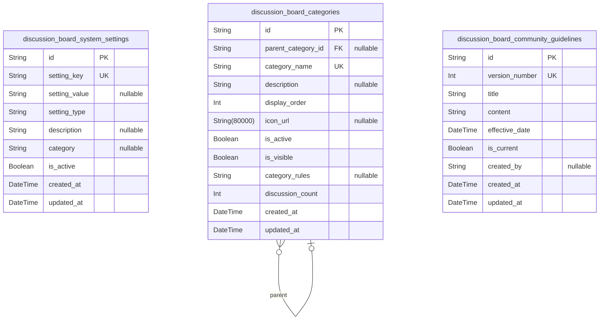
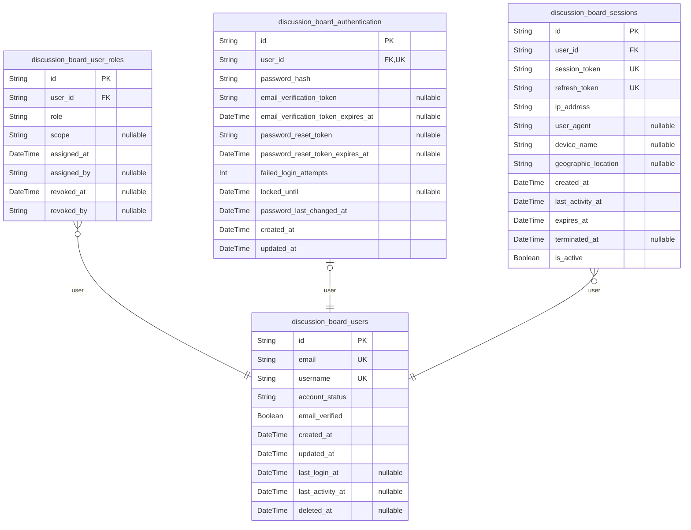
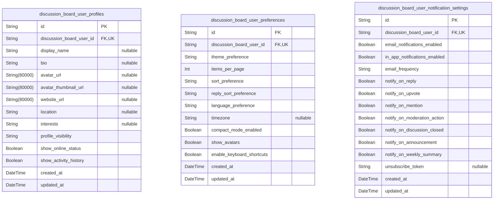
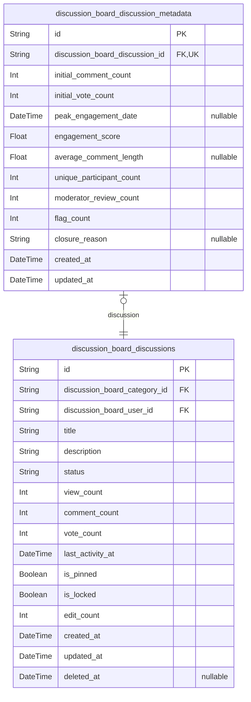
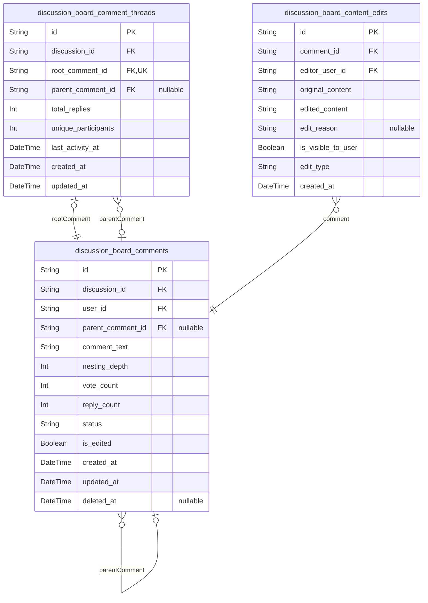
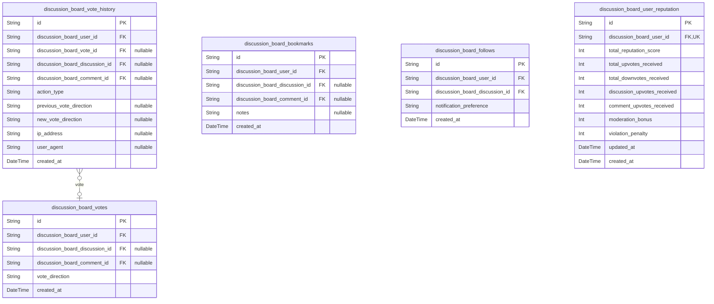
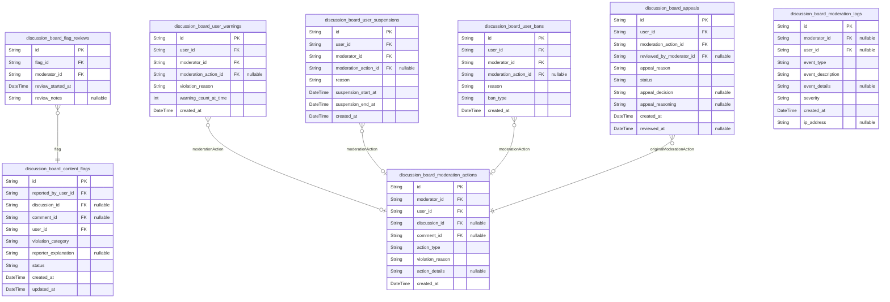
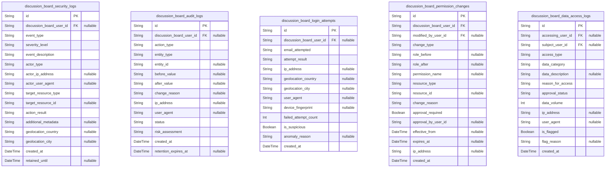

# Prisma Markdown

> Generated by [`prisma-markdown`](https://github.com/samchon/prisma-markdown)

- [Systematic](#systematic)
- [Actors](#actors)
- [Profiles](#profiles)
- [Discussions](#discussions)
- [Content](#content)
- [Engagement](#engagement)
- [Moderation](#moderation)
- [Security](#security)

## Systematic

### `discussion_board_system_settings`

Central configuration repository for platform-wide system settings and
configuration parameters. Stores system operation parameters including
feature flags, email configuration, rate limiting thresholds, moderation
settings, and performance parameters. Acts as the single source of truth
for how the platform operates at the system level. Settings can be simple
key-value pairs or complex structured JSON configurations. Modified
infrequently but read frequently by multiple system components.

Properties as follows:

- `id`: Primary Key.
- `setting_key`
  > Unique identifier key for the configuration setting (e.g.,
  > 'email_sender_address', 'max_discussions_per_day',
  > 'moderation_response_time_minutes'). Used to retrieve specific settings.
  > Must be unique across all settings to prevent duplicate configurations.
- `setting_value`
  > The actual configuration value stored as string (converted to appropriate
  > type by application). Can store simple values (numbers, strings) or
  > complex JSON structures. Empty string or null indicates setting is
  > disabled or unconfigured.
- `setting_type`
  > Data type of the setting value to guide interpretation: 'string',
  > 'integer', 'boolean', 'json', 'uri'. Helps application layer deserialize
  > and validate the setting_value appropriately.
- `description`
  > Human-readable description explaining what this setting controls, valid
  > value ranges, and any dependencies on other settings. Helps
  > administrators understand the purpose and impact of each configuration
  > parameter.
- `category`
  > Logical grouping category for organizing settings in UI and configuration
  > panels: 'email', 'rate_limiting', 'moderation', 'performance',
  > 'features', 'security'. Enables administrators to view related settings
  > together.
- `is_active`
  > Whether this setting is currently active and should be applied by the
  > system. Allows disabling settings without deletion for audit trail
  > purposes.
- `created_at`
  > Timestamp when this setting was first created, recorded in UTC.
  > Establishes when the configuration was initially added to the system.
- `updated_at`
  > Timestamp of the most recent update to this setting's value or
  > properties. Updated whenever the setting is modified to track change
  > history.

### `discussion_board_categories`

Defines the taxonomy of discussion categories that organize all
discussions on the platform. Contains category metadata including name,
description, display order, and visibility. Supports hierarchical
category structure through optional parent_category_id for subcategories.
Categories are the primary organizational structure that discussions are
assigned to. Referenced by discussion management and moderation systems.
Includes category-specific rules/guidelines and statistics about category
activity.

Properties as follows:

- `id`: Primary Key.
- `parent_category_id`
  > Self-referencing foreign key to parent category for hierarchical category
  > structure. Enables subcategories under main categories. Null if this is a
  > top-level category with no parent. Example: 'International Trade' might
  > have parent_category_id pointing to 'Economics' category.
- `category_name`
  > Human-readable name of the category displayed in the UI (e.g.,
  > 'Economics', 'Political Systems', 'International Trade'). Limited to 50
  > characters for display formatting. Must be unique to prevent duplicate
  > categories with same name.
- `description`
  > Detailed description of the category purpose and scope, explaining what
  > topics belong in this category. Displayed to users when browsing
  > categories. Helps users understand appropriate content for each category
  > and what discussions to expect.
- `display_order`
  > Numeric order for displaying categories in UI listings. Lower numbers
  > appear first. Used for sorting categories in navigation menus and
  > category lists. Administrators can reorder by adjusting this value.
- `icon_url`
  > URL to optional icon/image representing the category visually in UI. Used
  > in category badges, navigation, and listings. Supports visual
  > identification of categories at a glance.
- `is_active`
  > Whether this category is currently active and accepting new discussions.
  > Allows archiving categories without deletion. When false, prevents
  > creation of new discussions in this category but keeps existing
  > discussions visible in read-only mode.
- `is_visible`
  > Whether this category is visible to non-administrator users. False hides
  > category from category browser and discussion listings. Used for staging
  > categories before public launch or hiding deprecated categories.
- `category_rules`
  > Category-specific guidelines or rules in addition to general community
  > guidelines. Stored as JSON for structured enforcement. Example:
  > category-specific prohibited topics or content restrictions unique to
  > that category.
- `discussion_count`
  > Cached count of active discussions in this category for performance
  > optimization. Incremented when discussion created, decremented when
  > deleted. Recalculated periodically from actual database records to
  > maintain accuracy.
- `created_at`
  > Timestamp when this category was created in the system, recorded in UTC.
  > Establishes when the category was added to the platform.
- `updated_at`
  > Timestamp of most recent modification to category properties. Updated
  > when category metadata changes (name, description, rules, etc.).

### `discussion_board_community_guidelines`

Versioned repository of community guidelines and policy documents
governing user behavior and content standards. Maintains complete history
of all guideline versions with effective dates and version numbers.
Tracks when guidelines were created, updated, and became effective.
Provides audit trail for compliance purposes and historical context for
moderation decisions. Each version is a complete snapshot of guidelines
at a point in time, allowing reference to guidelines that applied when a
moderation decision was made.

Properties as follows:

- `id`: Primary Key.
- `version_number`
  > Sequential version number of the guidelines document (1, 2, 3, etc.).
  > Used to identify which version of guidelines was active at any given
  > time. Incremented each time guidelines are updated.
- `title`
  > Title of the guidelines document version (e.g., 'Community Guidelines
  > v2.1' or 'Community Guidelines v3.0'). Displayed in audit logs and
  > version history.
- `content`
  > Complete text content of the community guidelines document. Includes all
  > rules, policies, prohibited content types, and enforcement procedures.
  > Stored as plain text or markdown for easy reading and versioning.
- `effective_date`
  > Timestamp when this version of guidelines became effective and should be
  > applied. Can be in the future for pre-scheduled guideline updates. Used
  > to determine which guidelines applied at time of user action for
  > moderation decisions.
- `is_current`
  > Whether this is the current active version of guidelines. Only one
  > version should have is_current=true. Used for quick lookup of current
  > guidelines without querying by date.
- `created_by`
  > Username or ID of administrator who created this guidelines version.
  > Recorded for audit trail and accountability. Identifies who was
  > responsible for policy changes.
- `created_at`
  > Timestamp when this guidelines version was created/stored in the
  > database, recorded in UTC. Different from effective_date which indicates
  > when guidelines take effect.
- `updated_at`
  > Timestamp of last modification to this guidelines version record.
  > Generally not updated after creation (guidelines are versioned, not
  > modified), but included for consistency.

## Actors

### `discussion_board_users`

Core user account entity representing all system participants (guests,
members, moderators, administrators). Stores essential user identity
information including email, username, account status, and role
assignment. This is the primary entity that all other user-related tables
reference. The separation of user account from authentication credentials
allows flexible credential management and future support for multi-factor
authentication. Users can have one or more roles through the user_roles
junction table, enabling complex permission hierarchies.

Properties as follows:

- `id`: Primary Key.
- `email`
  > User's verified email address, used for authentication login and
  > communication. Must be unique across the system. Email verification is
  > required before account becomes active and can participate in
  > discussions.
- `username`
  > Unique username for public display and @mentions. Must be 3-20
  > characters, alphanumeric with underscore allowed. Username is read-only
  > after account creation to prevent confusion in discussions and mentions.
- `account_status`
  > Current account status: 'pending_verification' (email not verified),
  > 'active' (normal state), 'suspended' (temporary suspension), 'banned'
  > (permanent ban), 'deleted' (user-requested deletion, anonymized).
  > Controls whether user can access platform and create content.
- `email_verified`
  > Whether the user's email address has been verified. Unverified accounts
  > can view but cannot create discussions, post comments, or vote. Verified
  > during registration through email link.
- `created_at`
  > Timestamp when user account was created. Server time (UTC). Used for
  > tracking account age and applying new-account restrictions.
- `updated_at`
  > Timestamp of last account modification (status change, profile update,
  > etc.). Server time (UTC). Updated by system on any material change to
  > account.
- `last_login_at`
  > Timestamp of user's most recent successful login. Server time (UTC). NULL
  > if user has never logged in. Used to detect inactive accounts and
  > suspicious access patterns.
- `last_activity_at`
  > Timestamp of user's most recent activity on the platform (post, comment,
  > vote, page view, etc.). Server time (UTC). Used to track engagement and
  > detect dormant accounts for optional cleanup.
- `deleted_at`
  > Timestamp when user requested account deletion. Server time (UTC). NULL
  > if account is not deleted. Set to deletion timestamp when user completes
  > deletion process. Marks soft-deletion boundary.

### `discussion_board_user_roles`

Role assignment mapping table implementing role-based access control
(RBAC). Each user can be assigned multiple roles (member, moderator of
multiple categories, administrator). Tracks when roles are assigned and
by whom for audit compliance. Roles determine permissions for creating
discussions, moderating content, and administrative functions. This
junction table allows flexible role assignments without modifying the
user table.

Properties as follows:

- `id`: Primary Key.
- `user_id`
  > Reference to the user being assigned a role. {@link
  > discussion_board_users.id}. Foreign key relationship ensures role
  > assignments only exist for valid users.
- `role`
  > Role identifier: 'guest' (unauthenticated, read-only), 'member' (full
  > participation), 'moderator' (content moderation), 'administrator' (full
  > system access). Determines permission level for API operations.
- `scope`
  > Optional scope for scoped roles. For moderator role, contains
  > category_id(s) that moderator has authority over. NULL for non-scoped
  > roles (member, guest, administrator). Allows granular permission
  > assignment at category level.
- `assigned_at`
  > Timestamp when role was assigned to user. Server time (UTC). Used to
  > track role change history and audit trail.
- `assigned_by`
  > User ID of administrator who assigned this role. NULL for initial member
  > role automatically assigned at registration. Tracks who made permission
  > changes for audit purposes.
- `revoked_at`
  > Timestamp when role was revoked/removed from user. Server time (UTC).
  > NULL if role is currently active. Soft deletion allows history tracking
  > of role changes.
- `revoked_by`
  > User ID of administrator who revoked this role. NULL if role is still
  > active or was auto-assigned. Tracks who removed permissions for
  > compliance.

### `discussion_board_authentication`

User authentication credentials storage, separated from user account
table for security and flexibility. Contains password hashes (never
plaintext passwords), password change history for preventing reuse, email
verification tokens, and password reset tokens. Separation from user
table allows future support of multi-factor authentication and
alternative authentication methods without schema changes. Password
hashes use bcrypt with cost factor 12+.

Properties as follows:

- `id`: Primary Key.
- `user_id`
  > Reference to user account these credentials belong to. {@link
  > discussion_board_users.id}. One-to-one relationship: each user has
  > exactly one authentication record.
- `password_hash`
  > Bcrypt-hashed password (cost factor 12+). NEVER plaintext password.
  > Generated using bcrypt algorithm with unique salt. Updated when user
  > changes password or administrator resets password.
- `email_verification_token`
  > Unique cryptographically random token for email verification during
  > registration. 32+ bytes, base64-encoded. NULL if email is already
  > verified. Expires 24 hours after generation. Single-use, invalidated upon
  > verification.
- `email_verification_token_expires_at`
  > Expiration timestamp for email verification token. Server time (UTC).
  > NULL if email verified or no pending verification. Tokens expire 24 hours
  > after generation.
- `password_reset_token`
  > Unique token for password reset process. Generated when user requests
  > 'forgot password'. 32+ bytes, base64-encoded. NULL if no reset in
  > progress. Single-use, invalidated after one password reset.
- `password_reset_token_expires_at`
  > Expiration timestamp for password reset token. Server time (UTC). NULL if
  > no reset in progress. Tokens expire 1 hour after generation to limit
  > reset window.
- `failed_login_attempts`
  > Count of consecutive failed login attempts for this user. Resets to 0 on
  > successful login. Used to implement brute-force attack protection.
  > Incremented on each failed password attempt.
- `locked_until`
  > Timestamp when account lock expires (if temporarily locked due to too
  > many failed logins). Server time (UTC). NULL if account is not locked.
  > Account auto-unlocks at this time, allowing login retry.
- `password_last_changed_at`
  > Timestamp of most recent password change or initial password set at
  > registration. Server time (UTC). Used for forced password change policies
  > and detecting stale credentials.
- `created_at`
  > Timestamp when authentication record was created (same as user
  > registration). Server time (UTC).
- `updated_at`
  > Timestamp of last modification to this authentication record (password
  > change, token generation, etc.). Server time (UTC).

### `discussion_board_sessions`

Active user session tracking for multi-session management, security
monitoring, and session termination. Records JWT token information,
device details, geographic location, and session lifecycle events.
Enables detection of suspicious activity (impossible travel, unusual
devices), concurrent session limits, and remote logout capabilities.
Sessions are terminated when tokens expire, user logs out, or
administrator action is taken.

Properties as follows:

- `id`: Primary Key.
- `user_id`
  > Reference to authenticated user owning this session. {@link
  > discussion_board_users.id}. A user can have multiple concurrent active
  > sessions (up to 5), each tracked separately.
- `session_token`
  > JWT access token value for this session. Used to authenticate API
  > requests. Expires 15 minutes after session creation. Derived from JWT but
  > stored for session lookup and revocation.
- `refresh_token`
  > JWT refresh token for obtaining new access tokens without
  > re-authentication. Expires 7 days after session creation. Single-use:
  > invalidated when used to generate new access token.
- `ip_address`
  > IPv4 or IPv6 address of client making the login request. Used for
  > security monitoring, brute-force detection, and geographic location
  > lookup. Recorded at session creation.
- `user_agent`
  > User agent string from HTTP request (browser type, OS, version). Parsed
  > to identify device type (mobile, tablet, desktop). Used to detect unusual
  > login patterns and display active sessions list.
- `device_name`
  > Human-readable device name derived from user agent. Examples: 'Chrome on
  > Windows', 'Safari on iOS'. Displayed to user when reviewing active
  > sessions.
- `geographic_location`
  > Geographic location (city, country) determined from IP address via GeoIP
  > lookup. Displayed to user and used to detect impossible travel patterns
  > and geographic anomalies.
- `created_at`
  > Timestamp when session was created (user logged in). Server time (UTC).
  > Used to calculate session age and auto-expiration.
- `last_activity_at`
  > Timestamp of most recent API request from this session. Server time
  > (UTC). Initially set to created_at. Updated on each request to track
  > session activity.
- `expires_at`
  > Timestamp when session/refresh token expires and session becomes invalid.
  > Server time (UTC). Set to 7 days after created_at. Refresh tokens cannot
  > be used after this time.
- `terminated_at`
  > Timestamp when session was manually terminated (user logout, password
  > change, admin action, etc.). Server time (UTC). NULL if session is still
  > active. After termination, session cannot be used for authentication.
- `is_active`
  > Whether this session is currently active (true) or has been
  > terminated/expired (false). Redundant with terminated_at but provides
  > efficient query filtering. Set to false on termination.

## Profiles

### `discussion_board_user_profiles`

User profile information including display name, bio, avatar, and public
profile data. Separate from authentication credentials to support profile
deletion and GDPR compliance while preserving account history for audit
purposes.

Properties as follows:

- `id`: Primary Key.
- `discussion_board_user_id`: Reference to the user account. [discussion_board_users.id](#discussion_board_users).
- `display_name`
  > User's display name visible in discussions and comments. Maximum 50
  > characters. Can differ from username for personalization.
- `bio`
  > User's biographical information and interests. Maximum 500 characters.
  > Optional field for profile customization.
- `avatar_url`
  > URL to user's profile avatar image. Stored in external CDN/object storage
  > service.
- `avatar_thumbnail_url`
  > URL to user's profile avatar thumbnail (150x150px). Stored in external
  > CDN/object storage service.
- `website_url`
  > Optional URL to user's personal website or blog. Validated as valid URL
  > format starting with http:// or https://.
- `location`
  > User's location information as free-form text. Maximum 100 characters.
  > Not geocoded, user-entered only.
- `interests`
  > User's areas of interest in comma-separated format. Used for
  > personalization and discovery. Maximum 500 characters.
- `profile_visibility`
  > Profile visibility setting: 'public' (visible to all), 'members_only'
  > (visible to authenticated members), or 'private' (hidden from other
  > users). Defaults to 'public'.
- `show_online_status`
  > Whether user's online/offline status is visible to other members.
  > Defaults to true for transparency.
- `show_activity_history`
  > Whether user's discussion and comment history is visible on their public
  > profile. Defaults to true for contribution transparency.
- `created_at`
  > Timestamp when profile was created, typically at account registration
  > time.
- `updated_at`
  > Timestamp of last profile update, tracking when bio, avatar, or other
  > profile fields changed.

### `discussion_board_user_preferences`

User preferences and settings for customizing their experience on the
platform including notification frequency, theme preferences, and display
preferences. Allows users to personalize their interactions.

Properties as follows:

- `id`: Primary Key.
- `discussion_board_user_id`: Reference to the user account. [discussion_board_users.id](#discussion_board_users).
- `theme_preference`
  > User's preferred color theme: 'light', 'dark', or 'auto' (follows system
  > preference). Defaults to 'auto'.
- `items_per_page`
  > Number of discussions or comments to display per page in pagination.
  > Valid range: 10-100. Defaults to 20.
- `sort_preference`
  > Default sorting preference for discussions: 'newest', 'most_active',
  > 'most_voted', or 'trending'. Defaults to 'newest'.
- `reply_sort_preference`
  > Default sorting preference for comments/replies: 'oldest'
  > (chronological), 'newest', or 'most_voted'. Defaults to 'oldest'.
- `language_preference`
  > User's preferred language code (e.g., 'en', 'es', 'fr'). Defaults to
  > 'en'. Used for UI localization.
- `timezone`
  > User's timezone (IANA timezone identifier, e.g., 'America/New_York',
  > 'Europe/London'). Used for displaying timestamps in user's local time.
- `compact_mode_enabled`
  > Whether to use compact layout for discussions and comments, displaying
  > more items per screen. Defaults to false.
- `show_avatars`
  > Whether to display user avatars in discussions and comments. Defaults to
  > true. Users can disable for bandwidth/performance.
- `enable_keyboard_shortcuts`
  > Whether keyboard shortcuts are enabled for navigation and common actions.
  > Defaults to false for accessibility.
- `created_at`
  > Timestamp when user preferences were initialized, typically at account
  > creation.
- `updated_at`
  > Timestamp of last preference update when user modified any preference
  > setting.

### `discussion_board_user_notification_settings`

Granular notification preferences for users controlling what
notifications they receive and through which channels. Enables
GDPR-compliant consent management for email and in-app notifications.

Properties as follows:

- `id`: Primary Key.
- `discussion_board_user_id`: Reference to the user account. [discussion_board_users.id](#discussion_board_users).
- `email_notifications_enabled`
  > Global toggle for all email notifications. When disabled, no emails are
  > sent regardless of specific settings. Defaults to true.
- `in_app_notifications_enabled`
  > Global toggle for in-app notifications shown in the notification center.
  > Defaults to true.
- `email_frequency`
  > Email notification frequency: 'immediate' (one email per event),
  > 'daily_digest', 'weekly_digest', or 'never'. Defaults to 'immediate'.
- `notify_on_reply`
  > Whether to notify when someone replies to user's comments or discussions.
  > Defaults to true. Major engagement driver.
- `notify_on_upvote`
  > Whether to notify when user's posts receive upvotes. Defaults to false to
  > reduce notification volume.
- `notify_on_mention`
  > Whether to notify when user is mentioned (@username) in discussions or
  > comments. Defaults to true.
- `notify_on_moderation_action`
  > Whether to notify when moderator takes action on user's content (removal,
  > warning, etc.). Defaults to true. Important for user awareness.
- `notify_on_discussion_closed`
  > Whether to notify when a discussion the user created is closed by
  > moderators. Defaults to true.
- `notify_on_announcement`
  > Whether to receive important platform announcements and system
  > notifications. Defaults to true.
- `notify_on_weekly_summary`
  > Whether to receive optional weekly summary emails with top discussions
  > and activity. Defaults to false.
- `unsubscribe_token`
  > Unique token used in email unsubscribe links for one-click
  > unsubscription. Regenerated if user re-subscribes.
- `created_at`
  > Timestamp when notification settings were initialized, typically at
  > account creation.
- `updated_at`
  > Timestamp of last notification setting change tracking user consent
  > changes.

## Discussions

### `discussion_board_discussions`

Core discussion topics/threads that form the main conversational
containers. Users create discussions within categories to start
conversations. Each discussion contains metadata about engagement,
moderation status, and lifecycle (active, closed, archived, hidden). This
table is the primary reference point for all discussion-related queries
and serves as the anchor for comments, votes, flags, and moderation
actions.

Properties as follows:

- `id`: Primary Key.
- `discussion_board_category_id`
  > Reference to the category this discussion belongs to. {@link
  > discussion_board_categories.id}. Each discussion must be in exactly one
  > category for logical organization.
- `discussion_board_user_id`
  > Reference to the user who created this discussion. {@link
  > discussion_board_users.id}. Tracks original author for attribution and
  > permissions.
- `title`
  > Discussion topic title/heading displayed in discussion lists. 5-200
  > characters. Searchable field for discoverability. Clear, descriptive
  > titles help users understand discussion topic at a glance.
- `description`
  > Main discussion content/body text containing the discussion starter's
  > message. 20-5000 characters. Searchable full-text field. Can be edited by
  > creator within 24 hours or by moderators anytime.
- `status`
  > Discussion lifecycle status. Values: 'active' (open for comments),
  > 'closed' (no new comments allowed), 'archived' (moved to archive),
  > 'hidden' (removed from public view due to violations). Controls what
  > actions users can take on the discussion.
- `view_count`
  > Total number of times this discussion has been viewed/opened. Used for
  > engagement metrics and trending calculations. Incremented each time
  > someone opens the discussion.
- `comment_count`
  > Denormalized count of comments/replies on this discussion. Provides fast
  > access for UI without requiring aggregate query. Must be kept in sync
  > with actual comment count through triggers or application logic.
- `vote_count`
  > Net vote count (upvotes minus downvotes) on this discussion. Positive
  > value indicates more upvotes, negative indicates more downvotes. Used for
  > ranking discussions by popularity.
- `last_activity_at`
  > Timestamp of the most recent comment or reply in this discussion. Used to
  > identify active discussions and sort by 'most active' queries. Updates
  > whenever new comment is posted.
- `is_pinned`
  > Whether this discussion is pinned to top of its category by moderator.
  > Pinned discussions display above unpinned discussions in category
  > browsing. Used for highlighting important or exemplary discussions.
- `is_locked`
  > Whether new comments are prevented on this discussion. Locked discussions
  > remain visible but prevent further participation. Used by moderators to
  > close discussions while preserving content.
- `edit_count`
  > Number of times the discussion description has been edited by creator or
  > moderators. Incremented each time edit is saved. Audit trail indicator
  > showing if content has been modified.
- `created_at`
  > Timestamp when discussion was created. Server time (UTC). Immutable; set
  > at creation and never changed. Used for sorting discussions
  > chronologically.
- `updated_at`
  > Timestamp when discussion was last modified (content edited, status
  > changed, etc.). Server time (UTC). Updated whenever discussion record is
  > modified. Shows freshness of discussion.
- `deleted_at`
  > Timestamp when discussion was soft-deleted. NULL if discussion is active.
  > When set, discussion is archived/hidden from normal queries but preserved
  > in database for recovery/audit. Enables 'undo delete' functionality.

### `discussion_board_discussion_metadata`

Extended metadata and analytics for discussions, supporting the snapshot
pattern for historical tracking. Stores analytics data, engagement
metrics, and metadata separate from main discussion table to keep core
table lean and performant. Maintains 1:1 relationship with
discussion_board_discussions. Contains immutable snapshots of engagement
at creation time, engagement scores, and moderation metrics for trend
analysis and performance optimization.

Properties as follows:

- `id`: Primary Key.
- `discussion_board_discussion_id`
  > Reference to the discussion this metadata describes. {@link
  > discussion_board_discussions.id}. One-to-one relationship: each
  > discussion has exactly one metadata record. Unique constraint enforces
  > 1:1 cardinality.
- `initial_comment_count`
  > Immutable snapshot of comment count at time discussion was created
  > (always 0). Preserved for historical comparison to show how discussion
  > engagement grew over time.
- `initial_vote_count`
  > Immutable snapshot of vote count at time discussion was created (always
  > 0). Preserved for historical comparison to track vote acquisition
  > patterns.
- `peak_engagement_date`
  > Date/time when this discussion reached its peak daily activity/engagement
  > (most comments or votes in a single day). NULL if no peak has been
  > recorded yet. Used to identify when discussion was most active.
- `engagement_score`
  > Calculated composite engagement metric combining comments and votes:
  > (comment_count * 1.0) + (vote_count * 0.5). Used for ranking discussions
  > by overall engagement without sorting by single metric.
- `average_comment_length`
  > Average character length of comments in this discussion. Calculated as:
  > total_characters_in_comments / comment_count. Indicates discussion
  > depth/thoughtfulness (longer comments often indicate more substantive
  > debate).
- `unique_participant_count`
  > Number of unique users who have participated in this discussion (created
  > comments). Does not include discussion creator if they haven't replied.
  > Shows discussion breadth/inclusiveness.
- `moderator_review_count`
  > Number of times this discussion has been reviewed by moderators (flagged
  > and review completed). Indicates discussion was reviewed for policy
  > violations. Higher count suggests moderator attention to this discussion.
- `flag_count`
  > Total number of times content in this discussion (discussion or comments)
  > has been flagged/reported by users. Indicates community concern about
  > discussion quality or appropriateness.
- `closure_reason`
  > Reason why discussion was closed or archived, if applicable. NULL if
  > discussion still active. Examples: 'duplicate', 'off-topic', 'resolved',
  > 'policy-violation', 'spam'. Explains to users why discussion was closed.
- `created_at`
  > Timestamp when metadata record was created (same as parent discussion
  > creation). Server time (UTC). Immutable; set once at creation.
- `updated_at`
  > Timestamp when metadata was last updated (engagement metrics
  > recalculated, flags updated, etc.). Server time (UTC). Updated whenever
  > metadata values change (metrics updated, closure reason set, etc.).

## Content

### `discussion_board_comments`

Individual comments and nested replies posted to discussions. Represents
the actual conversational content with full edit history and soft delete
support. Supports threaded conversations up to 5 levels deep. Core
high-volume table in the system.

Properties as follows:

- `id`: Primary Key.
- `discussion_id`
  > Reference to the parent discussion. {@link
  > discussion_board_discussions.id}
- `user_id`: Author of the comment. [discussion_board_users.id](#discussion_board_users)
- `parent_comment_id`
  > Parent comment for nested replies. Null for top-level comments. {@link
  > discussion_board_comments.id}
- `comment_text`
  > Full text content of the comment. Stored plain text with HTML escaping
  > applied by application layer. Range: 1-2000 characters.
- `nesting_depth`
  > How many levels deep this comment is nested (1 for root level, 2 for
  > reply to root, etc.). Maximum 5 levels enforced by application and
  > database check constraint.
- `vote_count`
  > Cached vote count (upvotes minus downvotes). Denormalized for query
  > performance, recalculated nightly from votes table. Updated
  > asynchronously.
- `reply_count`
  > Number of direct replies to this comment. Used for determining if comment
  > can be deleted and for reply preview functionality.
- `status`
  > Current status of comment: 'active' (normal), 'flagged' (awaiting
  > review), 'removed' (moderation action), 'edited' (content modified).
  > Default 'active'.
- `is_edited`
  > Whether the comment has been edited since creation. Used to display
  > '[edited X minutes ago]' indicator to users.
- `created_at`
  > Timestamp when comment was created. Server time, UTC, seconds precision.
  > Used for sorting and activity tracking.
- `updated_at`
  > Timestamp of last update to comment (including edits and status changes).
  > Server time, UTC, seconds precision.
- `deleted_at`
  > Timestamp when comment was soft-deleted. Null if comment is active.
  > Supports 90-day recovery window and compliance.

### `discussion_board_comment_threads`

Organizes comments into conversation threads. Represents the hierarchical
structure of nested replies. Automatically managed through comment
creation/deletion. Tracks thread-level metadata for efficient querying of
threaded conversations.

Properties as follows:

- `id`: Primary Key.
- `discussion_id`
  > The discussion this thread belongs to. {@link
  > discussion_board_discussions.id}
- `root_comment_id`
  > The root/top-level comment that started this thread. {@link
  > discussion_board_comments.id}
- `parent_comment_id`
  > The parent comment if this is a nested thread. Null for root-level
  > threads. [discussion_board_comments.id](#discussion_board_comments)
- `total_replies`
  > Total number of replies in this entire thread (all nested levels). Used
  > for pagination and thread size estimation.
- `unique_participants`
  > Number of unique users who have participated in this thread. Used for
  > engagement metrics and thread popularity indicators.
- `last_activity_at`
  > Timestamp of most recent comment in thread. Used for sorting 'most
  > active' threads and real-time activity tracking.
- `created_at`
  > Timestamp when thread was created (same as root comment creation). Server
  > time, UTC, seconds precision.
- `updated_at`
  > Timestamp of last update to thread metadata. Updated when replies added
  > or thread marked as resolved.

### `discussion_board_content_edits`

Immutable audit trail of all comment edits. Append-only table tracking
every modification to comment content. Supports transparency, appeals,
and compliance requirements. Used for displaying edit history and
detecting coordinated manipulation.

Properties as follows:

- `id`: Primary Key.
- `comment_id`: The comment that was edited. [discussion_board_comments.id](#discussion_board_comments)
- `editor_user_id`: User who made the edit. [discussion_board_users.id](#discussion_board_users)
- `original_content`
  > Full text of comment before this edit. Preserved for historical record
  > and appeals. Maximum 2000 characters.
- `edited_content`
  > Full text of comment after this edit. Shows what user changed to. Maximum
  > 2000 characters.
- `edit_reason`
  > Reason for edit if provided by moderator (e.g., 'Removed slur', 'Redacted
  > personal info'). Member edits typically empty. Maximum 500 characters.
- `is_visible_to_user`
  > Whether edit history is visible to general users. True by default.
  > Moderators can hide sensitive edits from public view.
- `edit_type`
  > Type of edit: 'member_edit' (user edited own comment), 'moderator_edit'
  > (moderator edited for violation), 'system_edit' (automated system
  > change). Used for audit filtering.
- `created_at`
  > Timestamp when edit was made. Server time, UTC, seconds precision. Used
  > for chronological edit history.

## Engagement

### `discussion_board_votes`

Records individual votes (upvotes/downvotes) cast by members on
discussions and comments. Enables voting feature and tracks user
engagement. Relationship with [discussion_board_users.id](#discussion_board_users) and
either [discussion_board_discussions.id](#discussion_board_discussions) or {@link
discussion_board_comments.id}. Vote counts are calculated from this data
for content ranking and engagement metrics.

Properties as follows:

- `id`: Primary Key.
- `discussion_board_user_id`: Member who cast the vote. Reference to [discussion_board_users.id](#discussion_board_users).
- `discussion_board_discussion_id`
  > Discussion being voted on (nullable if comment is being voted). Reference
  > to [discussion_board_discussions.id](#discussion_board_discussions).
- `discussion_board_comment_id`
  > Comment being voted on (nullable if discussion is being voted). Reference
  > to [discussion_board_comments.id](#discussion_board_comments).
- `vote_direction`
  > Direction of the vote: 'upvote' or 'downvote'. Determines whether vote
  > contributes +1 or -1 to content score.
- `created_at`
  > Timestamp when vote was cast (server time, UTC). Used for vote history
  > and trend analysis.

### `discussion_board_vote_history`

Complete historical record of all vote changes for audit trail and
analytics. Tracks original votes, vote changes (upvote to downvote or
removal), and provides immutable history of voting activity. Enables
analysis of vote patterns and verification of vote counts. References
[discussion_board_users.id](#discussion_board_users), [discussion_board_votes.id](#discussion_board_votes), and
either [discussion_board_discussions.id](#discussion_board_discussions) or {@link
discussion_board_comments.id}.

Properties as follows:

- `id`: Primary Key.
- `discussion_board_user_id`
  > Member who performed the vote action. Reference to {@link
  > discussion_board_users.id}.
- `discussion_board_vote_id`
  > Vote record that this history entry documents. Reference to {@link
  > discussion_board_votes.id}. Null if vote was removed/deleted.
- `discussion_board_discussion_id`
  > Discussion that was voted on (nullable if comment). Reference to {@link
  > discussion_board_discussions.id}.
- `discussion_board_comment_id`
  > Comment that was voted on (nullable if discussion). Reference to {@link
  > discussion_board_comments.id}.
- `action_type`
  > Type of voting action: 'vote_cast' (new vote), 'vote_changed' (upvote to
  > downvote or vice versa), 'vote_removed' (vote deleted). Enables
  > understanding vote change history.
- `previous_vote_direction`
  > Previous vote direction if this is a vote change. Null for new votes or
  > vote removals. Helps reconstruct vote history.
- `new_vote_direction`
  > New vote direction after this action. Null if vote was removed. Captures
  > the result of the voting action.
- `ip_address`
  > IP address from which vote was cast. Enables fraud detection and abuse
  > prevention analysis.
- `user_agent`
  > Browser/device information from voting request. Used for device tracking
  > and anomaly detection.
- `created_at`
  > Timestamp of vote action (server time, UTC). Records when action occurred
  > for complete audit trail.

### `discussion_board_bookmarks`

Tracks discussions and comments that members have bookmarked/saved for
later reference. Enables users to maintain personal collection of
important or interesting content. Relationship with {@link
discussion_board_users.id} and either {@link
discussion_board_discussions.id} or [discussion_board_comments.id](#discussion_board_comments).
One bookmark per user per content item.

Properties as follows:

- `id`: Primary Key.
- `discussion_board_user_id`
  > Member who bookmarked the content. Reference to {@link
  > discussion_board_users.id}.
- `discussion_board_discussion_id`
  > Discussion being bookmarked (nullable if comment is bookmarked).
  > Reference to [discussion_board_discussions.id](#discussion_board_discussions).
- `discussion_board_comment_id`
  > Comment being bookmarked (nullable if discussion is bookmarked).
  > Reference to [discussion_board_comments.id](#discussion_board_comments).
- `notes`
  > Optional personal notes attached to bookmark. User can add custom notes
  > explaining why they bookmarked this content (maximum 500 characters).
- `created_at`
  > Timestamp when bookmark was created (server time, UTC). Enables sorting
  > bookmarks by date.

### `discussion_board_follows`

Tracks discussions that members are following for activity notifications.
When following a discussion, member receives notifications when new
comments are posted. Enables community members to track interesting
conversations. Relationship with [discussion_board_users.id](#discussion_board_users) and
[discussion_board_discussions.id](#discussion_board_discussions). One follow record per user per
discussion.

Properties as follows:

- `id`: Primary Key.
- `discussion_board_user_id`
  > Member who is following the discussion. Reference to {@link
  > discussion_board_users.id}.
- `discussion_board_discussion_id`
  > Discussion being followed. Reference to {@link
  > discussion_board_discussions.id}.
- `notification_preference`
  > How follower wants to be notified: 'immediate' (instant notification per
  > comment), 'daily_digest' (daily summary), 'weekly_digest' (weekly
  > summary). Controls notification frequency.
- `created_at`: Timestamp when follow relationship was created (server time, UTC).

### `discussion_board_user_reputation`

Aggregate user reputation/karma scores calculated from voting activity
and moderation actions. Tracks member's standing in community based on
quality of contributions. Scores increment with upvotes received and
positive community feedback, decrement with downvotes and violations.
Used for member ranking, trending algorithms, and moderator
identification. Relationship with [discussion_board_users.id](#discussion_board_users). One
record per user.

Properties as follows:

- `id`: Primary Key.
- `discussion_board_user_id`
  > User whose reputation is being tracked. Reference to {@link
  > discussion_board_users.id}.
- `total_reputation_score`
  > Aggregate reputation score (karma) for the user. Calculated as sum of:
  > upvotes received on discussions (+10 per upvote) + upvotes on comments
  > (+2 per upvote) - downvotes on discussions (-5 per downvote) - downvotes
  > on comments (-1 per downvote) + bonuses for moderation, minus penalties
  > for violations.
- `total_upvotes_received`
  > Total count of upvotes received on all user's discussions and comments
  > combined. Used for trending and user ranking.
- `total_downvotes_received`
  > Total count of downvotes received on all user's discussions and comments
  > combined. Indicator of content quality and community feedback.
- `discussion_upvotes_received`
  > Count of upvotes specifically on discussions authored by user. Weighted
  > more heavily in reputation calculation than comment upvotes.
- `comment_upvotes_received`: Count of upvotes specifically on comments authored by user.
- `moderation_bonus`
  > Reputation bonus for moderation activities if user is a moderator (+1 per
  > flag resolved, +5 per warning issued, +10 per suspension executed).
  > Recognizes community service.
- `violation_penalty`
  > Reputation penalty for guideline violations (-5 per warning, -25 per
  > suspension, -100 per permanent ban). Reflects community standing.
- `updated_at`
  > Timestamp of most recent reputation update (server time, UTC). When
  > reputation scores were last calculated.
- `created_at`
  > Timestamp when reputation record was created for user (server time, UTC).
  > Usually same as user account creation.

## Moderation

### `discussion_board_content_flags`

Records user-submitted reports of inappropriate content. Captures what
content was flagged, by whom, for what reason, and tracking the status of
the report through the moderation workflow. Essential for the content
moderation system, enabling the community to report violations and
moderators to manage review queue.

Properties as follows:

- `id`: Primary Key.
- `reported_by_user_id`
  > User who submitted the report. References {@link
  > discussion_board_users.id}.
- `discussion_id`
  > Discussion that was flagged, if applicable. References {@link
  > discussion_board_discussions.id}.
- `comment_id`
  > Comment that was flagged, if applicable. References {@link
  > discussion_board_comments.id}.
- `user_id`
  > User who created the flagged content. References {@link
  > discussion_board_users.id}.
- `violation_category`
  > Category of violation reported: Violence, Harassment, Misinformation,
  > Spam, Illegal, PlatformAbuse, Other. Helps moderators categorize and
  > prioritize reports.
- `reporter_explanation`
  > User's detailed explanation of why content violates guidelines (maximum
  > 500 characters). Provides context for moderator review.
- `status`
  > Current status of flag report: pending (awaiting review), under_review
  > (moderator actively reviewing), resolved (decision made). Used for
  > workflow state tracking.
- `created_at`: Timestamp when flag was submitted. Used for sorting reports in queue.
- `updated_at`
  > Timestamp of most recent status update. Tracks progress through review
  > workflow.

### `discussion_board_flag_reviews`

Records when moderators begin reviewing flagged content. Tracks which
moderator is assigned to review each flag, when they start, and ensures
different moderators review appeals (conflict of interest prevention).
Bridges user reports and moderation decisions.

Properties as follows:

- `id`: Primary Key.
- `flag_id`
  > Content flag being reviewed. References {@link
  > discussion_board_content_flags.id}.
- `moderator_id`
  > Moderator assigned to review this flag. References {@link
  > discussion_board_users.id}.
- `review_started_at`
  > Timestamp when moderator began reviewing this flag. Tracks response time
  > to reports.
- `review_notes`
  > Internal notes from moderator during review process, documenting analysis
  > and reasoning (maximum 1000 characters).

### `discussion_board_moderation_actions`

Core record of all moderator enforcement actions. Captures what action
was taken (remove content, warn user, suspend account, ban), why it was
taken, who took it, and when. The central decision log for the moderation
system, enabling transparency and audit trails.

Properties as follows:

- `id`: Primary Key.
- `moderator_id`
  > Moderator or administrator who took this action. References {@link
  > discussion_board_users.id}.
- `user_id`
  > User who is subject of this action (usually the violator). References
  > [discussion_board_users.id](#discussion_board_users).
- `discussion_id`
  > Discussion affected by this action, if applicable. References {@link
  > discussion_board_discussions.id}.
- `comment_id`
  > Comment affected by this action, if applicable. References {@link
  > discussion_board_comments.id}.
- `action_type`
  > Type of enforcement action taken: remove (content deleted), edit (content
  > modified), warn (warning issued), suspend (temporary ban), ban (permanent
  > ban), label (content flagged as disputed). Determines which escalation
  > table is relevant.
- `violation_reason`
  > Specific guideline violated and brief explanation why action was taken
  > (maximum 500 characters). Justification for the moderation decision.
- `action_details`
  > Additional details about the action taken, such as duration for
  > suspensions, specific edits made, or context (maximum 1000 characters).
- `created_at`
  > Timestamp when moderation action was taken. Record creation timestamp for
  > audit trail.

### `discussion_board_user_warnings`

Records formal warnings issued to users for guideline violations. Each
warning is immutable and tracks escalation (counting toward automatic
suspension). Supports the progressive penalty framework by maintaining
warning history and count for each user.

Properties as follows:

- `id`: Primary Key.
- `user_id`
  > User who received this warning. References {@link
  > discussion_board_users.id}.
- `moderator_id`
  > Moderator who issued this warning. References {@link
  > discussion_board_users.id}.
- `moderation_action_id`
  > Associated moderation action record. References {@link
  > discussion_board_moderation_actions.id}.
- `violation_reason`
  > Description of the violation that triggered this warning (maximum 500
  > characters). Explains to user why warning was issued.
- `warning_count_at_time`
  > This user's warning count when warning was issued (1st, 2nd, 3rd warning,
  > etc.). Used to determine if automatic escalation to suspension should
  > occur.
- `created_at`
  > Timestamp when warning was issued. First warning, second warning, etc.
  > timestamps determine escalation logic.

### `discussion_board_user_suspensions`

Records temporary restrictions on user accounts. Tracks suspension start
and end dates, enabling automatic expiration and re-enabling of accounts.
Part of progressive enforcement: escalated from warnings for repeated
violations or serious first offenses.

Properties as follows:

- `id`: Primary Key.
- `user_id`
  > User whose account is suspended. References {@link
  > discussion_board_users.id}.
- `moderator_id`
  > Moderator who issued the suspension. References {@link
  > discussion_board_users.id}.
- `moderation_action_id`
  > Associated moderation action record. References {@link
  > discussion_board_moderation_actions.id}.
- `reason`
  > Reason for suspension explaining which guideline(s) were violated
  > (maximum 500 characters). Justification visible to user.
- `suspension_start_at`
  > Timestamp when suspension became effective. User cannot post after this
  > time.
- `suspension_end_at`
  > Timestamp when suspension expires and account becomes active again. Used
  > for automatic account re-enablement.
- `created_at`
  > Timestamp when suspension was issued by moderator. Record creation time
  > for audit trail.

### `discussion_board_user_bans`

Records permanent bans of user accounts. Final enforcement action in
progressive penalty system (only for critical violations or repeated
serious violations). Immutable record supporting ban appeals and
historical tracking of banned users.

Properties as follows:

- `id`: Primary Key.
- `user_id`
  > User who is permanently banned. References {@link
  > discussion_board_users.id}.
- `moderator_id`
  > Administrator or moderator who issued the ban. References {@link
  > discussion_board_users.id}.
- `moderation_action_id`
  > Associated moderation action record. References {@link
  > discussion_board_moderation_actions.id}.
- `reason`
  > Detailed reason for permanent ban, citing critical violations or repeated
  > serious breaches (maximum 500 characters). Justification for permanent
  > account termination.
- `ban_type`
  > Type of ban: critical_violation (immediate permanent ban for CSAM,
  > violence, threats), escalated (from repeated suspensions), emergency
  > (security threat). Distinguishes ban severity levels.
- `created_at`: Timestamp when ban was issued. Immutable record creation time.

### `discussion_board_appeals`

Records user appeals against moderation decisions (warnings, suspensions,
bans). Tracks appeal submission, review status, and outcome. Supports
appeal workflow: submitted → under_review → approved/denied, enabling
fair dispute resolution.

Properties as follows:

- `id`: Primary Key.
- `user_id`
  > User who submitted the appeal. References {@link
  > discussion_board_users.id}.
- `moderation_action_id`
  > The moderation decision being appealed. References {@link
  > discussion_board_moderation_actions.id}.
- `reviewed_by_moderator_id`
  > Moderator who reviewed the appeal (must be different from original
  > decision-maker for fairness). References {@link
  > discussion_board_users.id}.
- `appeal_reason`
  > User's explanation of why they believe the moderation decision was unjust
  > (maximum 2000 characters). Detailed justification for the appeal.
- `status`
  > Current status of appeal: submitted (pending review), under_review
  > (moderator actively considering), approved (decision reversed), denied
  > (decision upheld), partially_approved (penalty reduced). Workflow state
  > indicator.
- `appeal_decision`
  > Decision made on appeal: approved (original decision reversed, content
  > restored, action cancelled), denied (original decision upheld, penalty
  > continues), partially_approved (penalty reduced, e.g., 7-day suspension
  > reduced to 24-hour). Outcome of appeal review.
- `appeal_reasoning`
  > Detailed reasoning from moderator reviewing the appeal, explaining why
  > decision was approved/denied/partially_approved (maximum 1000
  > characters). Transparency for appeal outcome.
- `created_at`
  > Timestamp when appeal was submitted by user. Start of appeal review
  > period.
- `reviewed_at`
  > Timestamp when appeal review was completed and decision made. Null until
  > appeal is decided.

### `discussion_board_moderation_logs`

Comprehensive audit trail of all moderation system events. Immutable log
capturing every moderator action, system event, and relevant decision for
compliance, investigation, and performance monitoring. Central record for
forensic analysis and accountability.

Properties as follows:

- `id`: Primary Key.
- `moderator_id`
  > Moderator performing the action. References {@link
  > discussion_board_users.id}.
- `user_id`
  > User affected by this log event. References {@link
  > discussion_board_users.id}.
- `event_type`
  > Type of moderation event logged: flag_submitted, flag_reviewed,
  > content_removed, content_edited, warning_issued, user_suspended,
  > user_banned, appeal_submitted, appeal_reviewed, moderator_assigned,
  > report_dismissed. Categorizes log events.
- `event_description`
  > Detailed description of the event that occurred (maximum 1000
  > characters). Human-readable account of what happened.
- `event_details`
  > Structured additional context about the event, including affected content
  > IDs, action parameters, or system state (maximum 2000 characters). JSON
  > or key-value format acceptable.
- `severity`
  > Severity level of this event: critical (CSAM, violence, threats), high
  > (bans, escalated violations), medium (warnings, suspensions, appeals),
  > low (routine moderation notes). Used for alert and filtering.
- `created_at`
  > Timestamp when this log event was created. Immutable record of when event
  > occurred.
- `ip_address`
  > IP address from which action was performed (if applicable). Security
  > tracking for moderator actions.

## Security

### `discussion_board_security_logs`

Comprehensive security event logs capturing all security-relevant
activities including authentication attempts, permission changes,
suspicious activities, and security incidents. These immutable logs form
the foundation of security auditing and forensic investigation
capabilities. Tracks event type, actor, target resource, severity level,
and full context for each security event.

Properties as follows:

- `id`: Primary Key.
- `discussion_board_user_id`
  > The user who triggered the security event, if applicable. References
  > [discussion_board_users.id](#discussion_board_users).
- `event_type`
  > Type of security event: LOGIN_ATTEMPT, LOGIN_SUCCESS, LOGIN_FAILURE,
  > PASSWORD_CHANGE, PASSWORD_RESET, ACCOUNT_LOCKOUT, PERMISSION_GRANT,
  > PERMISSION_REVOKE, ROLE_CHANGE, CONTENT_ACCESS, CONTENT_REMOVE,
  > USER_WARN, USER_SUSPEND, USER_BAN, ANOMALY_DETECTED, BRUTE_FORCE_ATTEMPT,
  > TOKEN_REFRESH, SESSION_CREATE, SESSION_TERMINATE, MFA_ENABLE,
  > MFA_DISABLE, CERTIFICATE_UPDATED, API_KEY_ROTATED, DATA_BREACH_DETECTED,
  > SUSPICIOUS_ACTIVITY.
- `severity_level`
  > Severity classification: CRITICAL (immediate action required), HIGH
  > (urgent attention needed), MEDIUM (investigation recommended), LOW
  > (informational). Guides incident response prioritization.
- `event_description`
  > Detailed human-readable description of the security event explaining what
  > occurred and why it matters. Up to 1000 characters providing full context
  > for investigators.
- `actor_type`
  > Type of actor performing action: USER (authenticated user), SYSTEM
  > (automated system process), ADMINISTRATOR (admin override),
  > UNAUTHENTICATED (guest or failed auth), EXTERNAL_SERVICE (integration
  > failure).
- `actor_ip_address`
  > IP address from which the security event originated. Null for
  > system-generated events. Used for geographic analysis and pattern
  > detection.
- `actor_user_agent`
  > Browser/client user agent string from the request. Helps identify device
  > type, browser version, and operating system. Null for non-HTTP events.
- `target_resource_type`
  > Type of resource being accessed or modified: USER_ACCOUNT, USER_PROFILE,
  > DISCUSSION, COMMENT, PERMISSION, ROLE, CONTENT, DATABASE, SYSTEM_CONFIG,
  > CREDENTIAL, SESSION, TOKEN.
- `target_resource_id`
  > UUID of the specific resource being accessed or modified. Null if event
  > doesn't target specific resource (e.g., system-wide configuration
  > change).
- `action_result`
  > Result of the security event: SUCCESS, FAILURE, BLOCKED, PENDING_REVIEW,
  > ERROR. Indicates whether the event succeeded or was intercepted by
  > security controls.
- `additional_metadata`
  > JSON-formatted additional context data relevant to the security event.
  > May include before/after values, query parameters, error codes,
  > suspicious patterns detected, or forensic details. Stored as JSON string
  > for flexibility.
- `geolocation_country`
  > Country of origin derived from IP address geolocation. Used for anomaly
  > detection (impossible travel patterns, unusual geographic access).
- `geolocation_city`
  > City of origin derived from IP address geolocation. Used for anomaly
  > detection and geographic analysis of security events.
- `created_at`
  > Timestamp when security event occurred, recorded at server in UTC.
  > Precise to millisecond for sequencing and incident reconstruction.
- `retained_until`
  > Date after which this security log may be deleted per retention policy.
  > Calculated based on event severity and regulatory requirements (typically
  > 1-3 years). Alerts admins before expiration.

### `discussion_board_audit_logs`

Detailed audit trail for all system modifications and administrative
actions including content changes, user management, moderation decisions,
and system configuration updates. Maintains immutable record of who
changed what, when, and why. Supports compliance requirements (GDPR,
audit trails) and facilitates forensic investigation of system state
changes. Captures before/after values for complete change tracking.

Properties as follows:

- `id`: Primary Key.
- `discussion_board_user_id`
  > The user who performed the action being audited. References {@link
  > discussion_board_users.id}. Null for system-generated actions.
- `action_type`
  > Category of action being audited: CREATE (new resource created), UPDATE
  > (resource modified), DELETE (resource removed), RESTORE (deleted resource
  > recovered), APPROVE (content/action approved), REJECT (content/action
  > rejected), EXPORT (data exported), IMPORT (data imported), CONFIGURATION
  > (system config changed), PERMISSION (permissions modified).
- `entity_type`
  > Type of entity affected by action: USER, DISCUSSION, COMMENT, CATEGORY,
  > CONTENT_FLAG, MODERATION_ACTION, USER_WARNING, SUSPENSION, BAN, APPEAL,
  > ROLE, PERMISSION, CONFIGURATION, SYSTEM_SETTING, GUIDELINE.
- `entity_id`
  > UUID of the specific entity being modified. Null for system-wide actions
  > not tied to specific resource.
- `before_value`
  > Complete state/value of entity before the change (JSON-formatted for
  > complex objects). Null for CREATE actions. Maximum 5000 characters,
  > truncated if necessary. Enables comparison and rollback analysis.
- `after_value`
  > Complete state/value of entity after the change (JSON-formatted for
  > complex objects). Null for DELETE actions unless entity was restored.
  > Enables change verification and compliance reporting.
- `change_reason`
  > Explanation or justification for the action. May be policy violation
  > explanation, appeal decision, or administrative reason. Maximum 500
  > characters. Required for sensitive actions (bans, data deletion).
- `ip_address`
  > IP address from which action was performed. Null for system-generated
  > actions. Used for geographic audit trail and anomaly detection.
- `user_agent`
  > Browser/client user agent string. Helps identify device and browser used
  > for action. Null for non-HTTP actions.
- `status`
  > Status of the audited action: COMPLETED (action finished successfully),
  > PENDING (awaiting processing), FAILED (action failed to complete),
  > REJECTED (action was blocked by controls). Used for tracking action
  > outcomes.
- `risk_assessment`
  > Security/compliance risk classification for this action: LOW (routine
  > action), MEDIUM (requires review), HIGH (sensitive action), CRITICAL
  > (high-impact action). Guides incident investigation prioritization.
- `created_at`
  > Timestamp when action occurred, recorded at server in UTC. Essential for
  > sequential reconstruction of events and compliance reporting.
- `retention_expires_at`
  > Date after which this audit log may be deleted per data retention policy.
  > Typically 2-3 years depending on regulatory requirements. System alerts
  > administrators before expiration.

### `discussion_board_login_attempts`

Tracks all authentication attempts (successful and failed) for security
monitoring and brute force detection. Records login history with IP
addresses, geolocation, device information, and results. Used to detect
account takeover attempts, impossible travel patterns, and suspicious
access patterns. Supports account lockout policies and fraud prevention
mechanisms. Maintains complete audit trail of who accessed what accounts
from where.

Properties as follows:

- `id`: Primary Key.
- `discussion_board_user_id`
  > The user account targeted by the login attempt. References {@link
  > discussion_board_users.id}. Null if attempt used invalid email (user not
  > found).
- `email_attempted`
  > Email address used in login attempt. Captures what email user tried (may
  > be typo, invalid, or compromised). Used for detecting brute force against
  > specific accounts or email enumeration attacks.
- `attempt_result`
  > Outcome of login attempt: SUCCESS (credentials valid, user logged in),
  > FAILURE_INVALID_CREDENTIALS (wrong password), FAILURE_USER_NOT_FOUND
  > (email not registered), FAILURE_ACCOUNT_LOCKED (too many recent failed
  > attempts), FAILURE_ACCOUNT_DISABLED (user suspended/banned),
  > FAILURE_EMAIL_UNVERIFIED (email not yet verified).
- `ip_address`
  > IP address from which login attempt originated. Essential for geographic
  > anomaly detection, impossible travel patterns, and brute force source
  > identification. Null if captured from proxy/VPN.
- `geolocation_country`
  > Country derived from IP geolocation. Used for detecting impossible travel
  > (e.g., New York then Tokyo in 10 minutes) and unusual geographic
  > patterns.
- `geolocation_city`
  > City derived from IP geolocation. Provides geographic context for access
  > pattern analysis and anomaly detection.
- `user_agent`
  > Browser/client user agent string from HTTP request. Used to identify
  > device type, browser, OS, and detect logins from unexpected devices
  > (e.g., previously used Android phone, now using Windows).
- `device_fingerprint`
  > Hash of device characteristics (browser type, OS, screen resolution,
  > plugins, etc.). Helps identify logins from new devices or spoofed
  > devices. Null for non-HTTP logins.
- `failed_attempt_count`
  > Cumulative count of failed login attempts from this IP address in the
  > past 15 minutes. Used to trigger account lockout policies and rate
  > limiting. Reset when successful login occurs.
- `is_suspicious`
  > Flag indicating if login attempt triggered anomaly detection. True if:
  > impossible travel, new device, unusual time, multiple geographic logins
  > simultaneously, etc. Guides manual investigation.
- `anomaly_reason`
  > If is_suspicious is true, explains why anomaly detected:
  > IMPOSSIBLE_TRAVEL, NEW_DEVICE, UNUSUAL_TIME, CONCURRENT_SESSIONS,
  > HIGH_RISK_COUNTRY, BRUTE_FORCE_PATTERN, etc.
- `created_at`
  > Timestamp when login attempt occurred, recorded at server in UTC.
  > Millisecond precision for sequencing of rapid attempts and detecting
  > bursts.

### `discussion_board_permission_changes`

Audit trail for all permission and role modifications in the system.
Tracks every grant, revoke, or modification of user permissions, role
assignments, and administrative privileges. Records who made the change,
what changed, from what to what, when, and why. Critical for compliance
(GDPR, SOC 2, audit requirements), privilege escalation detection, and
understanding current permission state at any point in time. Enables
rollback analysis and permission history queries.

Properties as follows:

- `id`: Primary Key.
- `discussion_board_user_id`
  > The user whose permissions were modified. References {@link
  > discussion_board_users.id}.
- `modified_by_user_id`
  > The administrator or system user who made the permission change.
  > References [discussion_board_users.id](#discussion_board_users). Null for system-generated
  > permission changes.
- `change_type`
  > Type of permission change: ROLE_GRANT (user assigned to role),
  > ROLE_REVOKE (user removed from role), PERMISSION_GRANT (specific
  > permission granted), PERMISSION_REVOKE (specific permission removed),
  > CATEGORY_ASSIGNMENT (moderator assigned to category), CATEGORY_REMOVAL
  > (moderator removed from category).
- `role_before`
  > User's role before the change (GUEST, MEMBER, MODERATOR, ADMINISTRATOR).
  > Null for permission-level changes that don't affect role.
- `role_after`
  > User's role after the change. Null if user role didn't change (only
  > specific permissions modified).
- `permission_name`
  > Name of specific permission being granted/revoked, if applicable.
  > Examples: CREATE_DISCUSSION, POST_COMMENT, VOTE, MODERATE_CONTENT,
  > MANAGE_USERS, SYSTEM_ADMIN. Null for role-level changes.
- `resource_type`
  > Type of resource permission applies to: GLOBAL (system-wide), CATEGORY
  > (specific discussion category), USER (specific user management). Used for
  > scoped permissions.
- `resource_id`
  > UUID of specific resource (e.g., category_id for category-scoped
  > moderators). Null for system-wide permissions.
- `change_reason`
  > Explanation for why permission was changed: PROMOTION (user earned
  > moderator status), VIOLATION (permissions revoked due to violations),
  > PROBATION (temporary restrictions), ADMINISTRATIVE (admin override),
  > ROLE_CHANGE (automatic from role change).
- `approval_required`
  > Whether this permission change required approval (e.g., promoting to
  > administrator). Tracks if approval was obtained and when.
- `approval_by_user_id`
  > If approval was required, ID of approver (typically more senior admin).
  > Null if not required or not yet approved.
- `effective_from`
  > Date/time when permission change became effective. May be future-dated
  > for scheduled permission changes. Null means immediately effective.
- `expires_at`
  > Date/time when temporary permission expires (e.g., temporary moderation
  > probation). Null for permanent permission changes. System automatically
  > revokes on expiration.
- `ip_address`
  > IP address of administrator who made the change. Null for
  > system-generated changes. Used for anomaly detection (admin accessing
  > from unusual location).
- `created_at`
  > Timestamp when permission change was recorded, in UTC. Enables
  > chronological reconstruction of permission history.

### `discussion_board_data_access_logs`

Tracks all access to sensitive user data by administrators and system
processes. Records who accessed what personal information, when, from
where, and why. Critical for privacy compliance (GDPR right of access,
audit requirements) and detecting unauthorized data access or insider
threats. Monitors administrator access to user emails, profile data,
activity history, and other PII. Enables detection of data theft or
privacy violations by insiders.

Properties as follows:

- `id`: Primary Key.
- `accessing_user_id`
  > The administrator or system user accessing the sensitive data. References
  > [discussion_board_users.id](#discussion_board_users). Null for automated system access.
- `subject_user_id`
  > The user whose data is being accessed. References {@link
  > discussion_board_users.id}. Null if accessing system-level data not tied
  > to specific user.
- `access_type`
  > Nature of data access: VIEW (read-only access to data), EXPORT (data
  > exported/downloaded), MODIFY (data changed), DELETE (data deleted),
  > RESTORE (deleted data recovered). Indicates what action was performed on
  > sensitive data.
- `data_category`
  > Category of sensitive data accessed: EMAIL_ADDRESS (user's email),
  > PASSWORD_HASH (login credentials), IP_HISTORY (login IPs and locations),
  > PROFILE_DATA (personal profile info), ACTIVITY_LOG (user's post/comment
  > history), DISCUSSION_CONTENT (user's discussions and comments),
  > VOTING_HISTORY (user's votes), SETTINGS (user preferences and config).
- `data_description`
  > Specific data elements accessed: which fields from user profile, which
  > discussions viewed, which settings accessed, etc. Maximum 500 characters.
  > Used to precisely track what information was accessed.
- `reason_for_access`
  > Stated reason for accessing sensitive data: CUSTOMER_SUPPORT (helping
  > user), INVESTIGATION (security investigation), COMPLIANCE (regulatory
  > requirement), ABUSE_PREVENTION (blocking spam), INCIDENT_RESPONSE
  > (responding to security incident), ADMINISTRATIVE (routine admin task).
- `approval_status`
  > Whether this access was approved: APPROVED (authorized), PENDING_APPROVAL
  > (requested but not yet approved), DENIED (request denied), EMERGENCY
  > (accessed under emergency conditions).
- `data_volume`
  > Approximate volume of sensitive data accessed: number of records viewed,
  > size of export in bytes, count of items. Helps detect unusual bulk access
  > patterns.
- `ip_address`
  > IP address from which sensitive data was accessed. Null for
  > system-generated access. Used for anomaly detection (admin accessing from
  > unusual location).
- `user_agent`
  > Browser/client information used to access sensitive data. Helps identify
  > expected vs. unexpected access methods (e.g., script vs. web browser).
- `is_flagged`
  > Whether access was flagged for unusual patterns: bulk export of PII,
  > after-hours access, access from high-risk country, authorized user
  > accessing unusual data categories, etc. Triggers review.
- `flag_reason`
  > If is_flagged is true, reason flagged: BULK_EXPORT, UNUSUAL_CATEGORY,
  > AFTER_HOURS, UNAUTHORIZED_USER, MULTIPLE_USERS, HIGH_VOLUME,
  > SUSPICIOUS_PATTERN.
- `created_at`
  > Timestamp when sensitive data access occurred, recorded in UTC. Critical
  > for detecting insider threats, data theft, and establishing timeline of
  > privacy violations.
