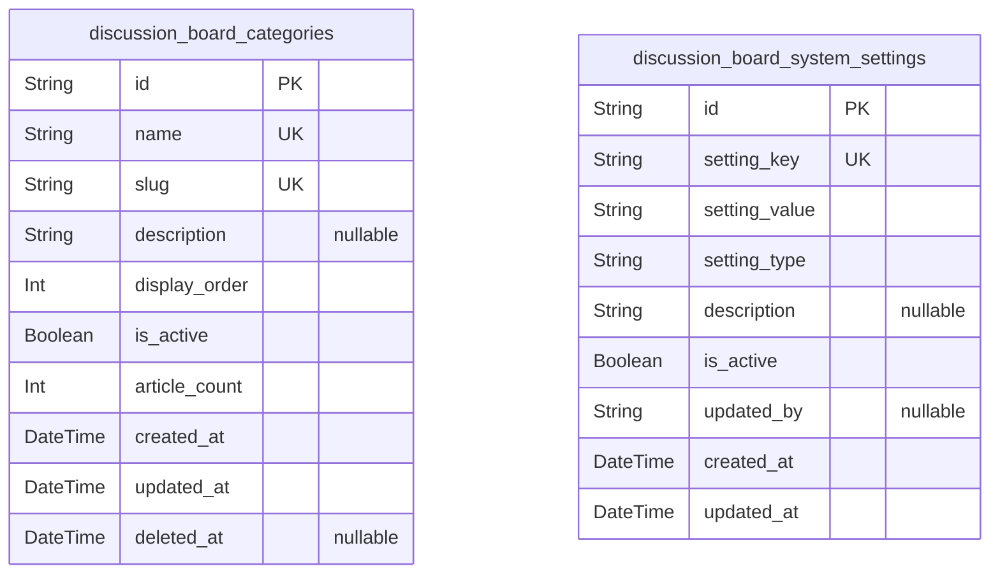
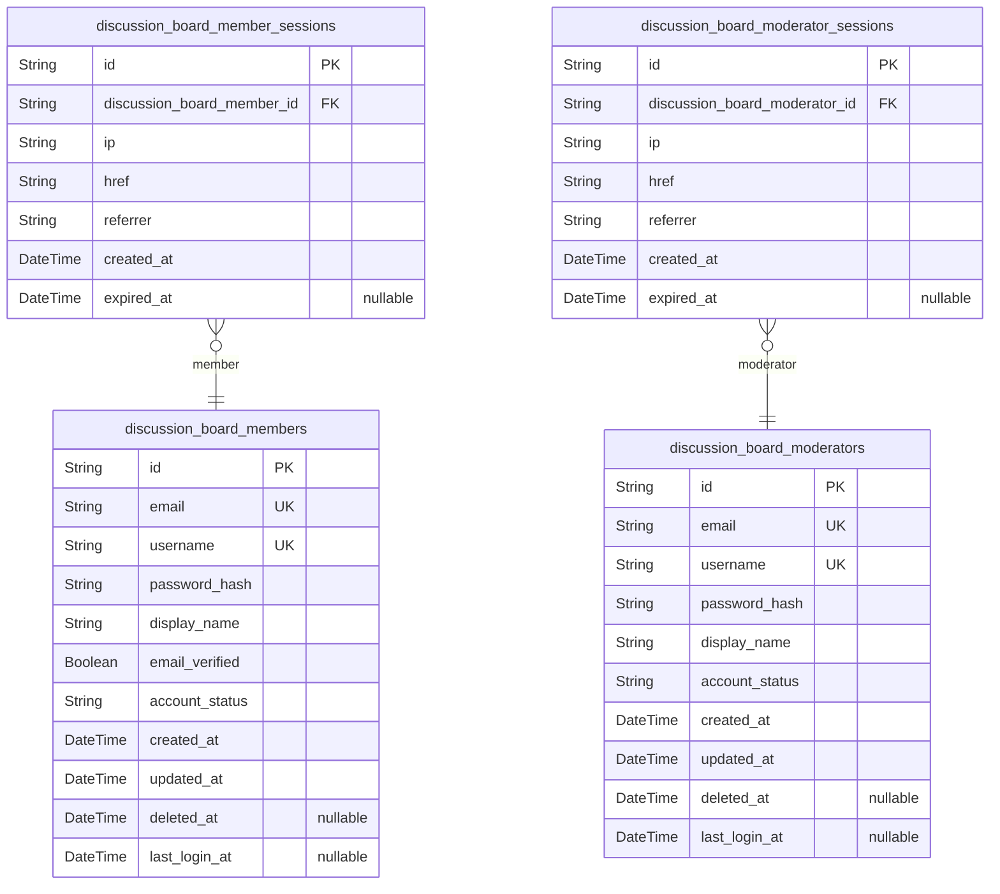
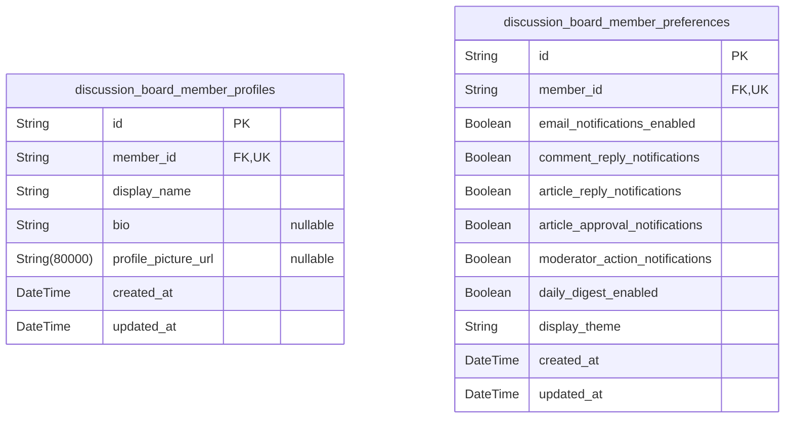
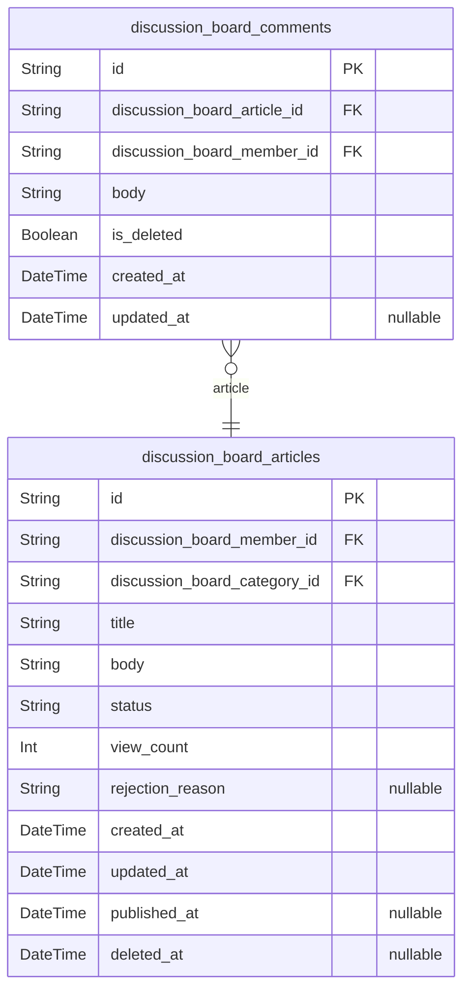
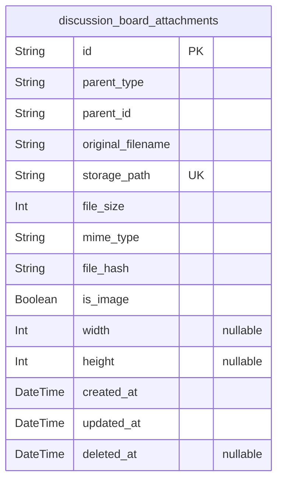
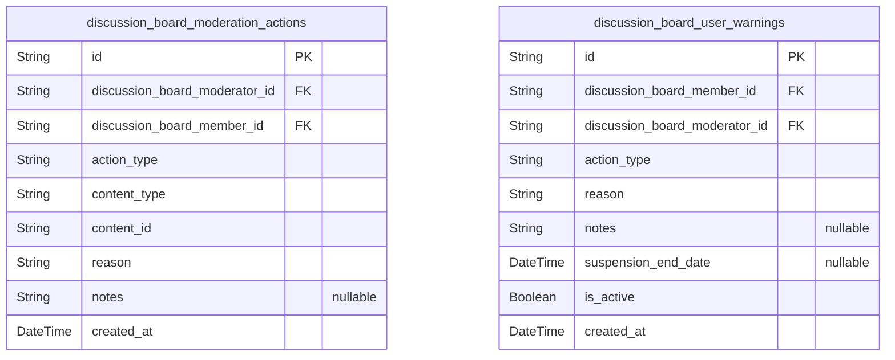
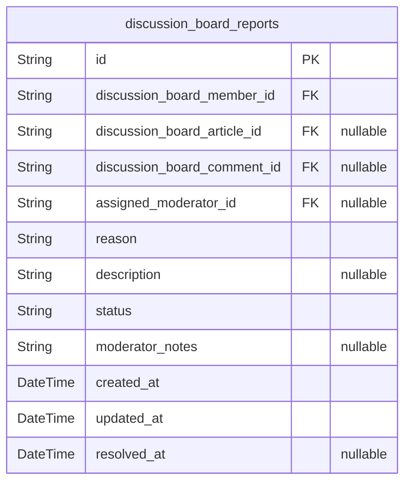

# Prisma Markdown

> Generated by [`prisma-markdown`](https://github.com/samchon/prisma-markdown)

- [Systematic](#systematic)
- [Actors](#actors)
- [Profiles](#profiles)
- [Content](#content)
- [Attachments](#attachments)
- [Moderation](#moderation)
- [Reporting](#reporting)

## Systematic

```mermaid
erDiagram
"discussion_board_categories" {
  String id PK
  String name UK
  String slug UK
  String description "nullable"
  Int display_order
  Boolean is_active
  Int article_count
  DateTime created_at
  DateTime updated_at
  DateTime deleted_at "nullable"
}
"discussion_board_system_settings" {
  String id PK
  String setting_key UK
  String setting_value
  String setting_type
  String description "nullable"
  Boolean is_active
  String updated_by "nullable"
  DateTime created_at
  DateTime updated_at
}
```

### `discussion_board_categories`

Predefined article categories that organize and structure all discussions
on the platform.

Stores the fixed set of categories available for article classification:
Economics, Politics, Economic Policy, Political Analysis, and Other.
Categories define the organizational structure for the entire discussion
board, allowing users to browse and discover discussions by topic area.

Categories are foundational reference data maintained by system
administrators. Articles must belong to exactly one category. Members
cannot create custom categories—only system administrators can add or
modify the category list to ensure consistent organization.

Each category includes metadata for display and tracking:
- name: Display name shown to users (e.g., 'Economics')
- slug: URL-safe identifier for filtering and programmatic reference
- description: Purpose and scope of this category
- display_order: Sequence for showing categories in navigation (lower
numbers appear first)
- is_active: Whether category is currently available for article selection
- article_count: Denormalized count of published articles in this
category (updated when articles are published or archived)

Categories support the discovery workflow by providing a navigation path
complementary to search functionality. While not directly transactional,
categories are essential infrastructure supporting article organization
and member navigation.

Properties as follows:

- `id`: Primary Key.
- `name`
  > Display name of the category shown to users. Examples: 'Economics',
  > 'Politics', 'Economic Policy'. Maximum 50 characters for consistent
  > display in UI.
- `slug`
  > URL-safe identifier for the category used in filtering, search, and API
  > endpoints. Examples: 'economics', 'political-analysis'. Lowercase
  > alphanumeric with hyphens only. Must be unique across all categories.
- `description`
  > Detailed description of the category's purpose and scope. Explains what
  > types of discussions belong here. Displayed to users when browsing or
  > creating articles. Maximum 500 characters.
- `display_order`
  > Integer sequence number determining category display order in navigation
  > menus. Lower numbers appear first. Categories are sorted by this field
  > for consistent UI presentation. Typical values: 1 (Economics), 2
  > (Politics), 3 (Economic Policy), 4 (Political Analysis), 5 (Other).
- `is_active`
  > Whether this category is currently available for article selection.
  > Active categories appear in the category filter dropdown and navigation.
  > Inactive categories hide from member selections but retain existing
  > articles. Allows administrators to retire unused categories without data
  > loss.
- `article_count`
  > Denormalized count of published articles currently in this category.
  > Provides quick access for display purposes (e.g., 'Economics (42
  > articles'). Automatically updated when articles are published or
  > archived. Initialized to 0 when category is created.
- `created_at`
  > Timestamp when category was created. Records the initial creation time of
  > the category in UTC timezone. Immutable after creation.
- `updated_at`
  > Timestamp of the most recent modification to category properties. Updated
  > whenever category name, description, display order, or active status
  > changes. Supports audit trail and change tracking.
- `deleted_at`
  > Timestamp when category was soft-deleted. NULL indicates active category.
  > When set, category is hidden from UI but preserved in database for audit
  > trail and historical integrity. Allows category retirement without
  > breaking historical article references.

### `discussion_board_system_settings`

System-wide configuration and settings that control platform behavior and
features.

Stores key-value pairs for application configuration, feature flags, and
operational settings. Provides centralized management of system behavior
without requiring code changes or redeployment. Administrators modify
settings through admin panels to control platform features and behavior.

Common settings include:
- Site metadata: site_name, site_description, support_email
- Feature flags: enable_new_user_registrations, enable_comments,
enable_file_uploads, enable_search
- Moderation settings: require_article_approval, auto_moderate_comments,
spam_detection_enabled
- Rate limiting: max_articles_per_day, max_comments_per_day,
max_comment_burst
- System behavior: maintenance_mode, maintenance_message,
session_timeout_minutes

Each setting consists of:
- setting_key: Unique identifier for the configuration parameter (e.g.,
'maintenance_mode')
- setting_value: The actual configuration value (string format, parsed by
application as needed)
- setting_type: Data type hint ('string', 'integer', 'boolean', 'json')
helping application parse the value
- description: Purpose and usage of this setting for administrator reference
- is_active: Whether this setting is currently applied; inactive settings
are ignored
- updated_by: Moderator or admin who last modified this setting (for
audit trail)
- updated_at: When setting was last changed

The system_settings table is the single source of truth for
configuration, eliminating the need to modify environment variables or
restart the application. Changes are applied immediately or on next
request depending on setting type and system design.

All settings are immutable once set—modifications create new entries with
updated timestamps rather than overwriting previous values. This
preserves configuration history and supports audit trail requirements.

Settings support the operational requirements of the platform by allowing
administrators to control feature availability, user behavior
constraints, and system maintenance without technical intervention.

Properties as follows:

- `id`: Primary Key.
- `setting_key`
  > Unique identifier for the configuration setting. Examples:
  > 'maintenance_mode', 'max_articles_per_day', 'site_name',
  > 'enable_user_registrations'. Used by application code to retrieve
  > specific configuration values. Maximum 100 characters. Must be unique
  > combined with category.
- `setting_value`
  > The actual configuration value as string. Format depends on setting_type:
  > boolean settings stored as 'true'/'false', integer settings as numeric
  > strings (e.g., '30'), JSON settings as serialized JSON. Application code
  > is responsible for parsing based on setting_type. Maximum 10,000
  > characters for complex values.
- `setting_type`
  > Data type hint for parsing the setting_value. Allowed values: 'string',
  > 'integer', 'boolean', 'json'. Helps application correctly interpret the
  > stored value. For example, 'true' string interpreted as boolean true when
  > type is 'boolean'.
- `description`
  > Human-readable description of the setting's purpose, usage, and impact.
  > Displayed to administrators in settings management UI to explain what
  > each configuration controls. Helps administrators understand
  > configuration consequences. Maximum 500 characters.
- `is_active`
  > Whether this setting is currently active and applied by the system.
  > Active settings (true) are retrieved and used by application code.
  > Inactive settings (false) are stored but ignored by the application.
  > Allows administrators to disable specific settings without deleting
  > configuration history.
- `updated_by`
  > Identifier of the moderator or administrator who last modified this
  > setting. Used for audit trail to track who made configuration changes and
  > when. Supports accountability and troubleshooting of configuration
  > issues.
- `created_at`
  > Timestamp when this setting was initially created or first recorded.
  > Marks the beginning of this configuration entry for audit purposes.
  > Immutable after creation.
- `updated_at`
  > Timestamp of the most recent modification to this setting's value or
  > active status. Updated whenever the setting_value, is_active, or other
  > properties change. Helps identify recently modified settings and track
  > configuration changes over time.

## Actors

```mermaid
erDiagram
"discussion_board_members" {
  String id PK
  String email UK
  String username UK
  String password_hash
  String display_name
  Boolean email_verified
  String account_status
  DateTime created_at
  DateTime updated_at
  DateTime deleted_at "nullable"
  DateTime last_login_at "nullable"
}
"discussion_board_member_sessions" {
  String id PK
  String discussion_board_member_id FK
  String ip
  String href
  String referrer
  DateTime created_at
  DateTime expired_at "nullable"
}
"discussion_board_moderators" {
  String id PK
  String email UK
  String username UK
  String password_hash
  String display_name
  String account_status
  DateTime created_at
  DateTime updated_at
  DateTime deleted_at "nullable"
  DateTime last_login_at "nullable"
}
"discussion_board_moderator_sessions" {
  String id PK
  String discussion_board_moderator_id FK
  String ip
  String href
  String referrer
  DateTime created_at
  DateTime expired_at "nullable"
}
"discussion_board_member_sessions" }o--|| "discussion_board_members" : member
"discussion_board_moderator_sessions" }o--|| "discussion_board_moderators" : moderator
```

### `discussion_board_members`

Registered members who can create articles, post comments, and
participate in discussions. Members authenticate via email/username and
password, undergo email verification before posting access, and can be
suspended or deleted. This table represents the core participant base of
the discussion board.

Properties as follows:

- `id`: Primary Key.
- `email`
  > Member's email address used for authentication, verification, and
  > communication. Must be unique across all members, valid email format (max
  > 254 characters). Used for account recovery and password reset.
- `username`
  > Member's chosen username for login and public identification.
  > Case-insensitive unique constraint enforced. 3-30 characters,
  > alphanumeric plus underscore/hyphen. Used as alternative login identifier
  > to email.
- `password_hash`
  > Bcrypt-hashed password with salt (minimum 12 rounds). Never stored in
  > plain text. Used for authentication during login. Updated when member
  > changes password.
- `display_name`
  > Public-facing display name shown as author attribution on articles and
  > comments. 1-50 characters. May differ from username for privacy or
  > professional presentation.
- `email_verified`
  > Flag indicating whether member's email address has been verified. False
  > for new registrations. Must be true before member can create articles or
  > post comments. Set to true when verification link is clicked.
- `account_status`
  > Current account status controlling access and permissions. Values:
  > 'active' (normal operation), 'suspended' (temporary restriction due to
  > violations), 'terminated' (permanent ban), 'deleted' (user-initiated
  > deletion). Default: 'active' after email verification.
- `created_at`
  > Account creation timestamp in UTC. Immutable. Recorded when registration
  > is completed.
- `updated_at`
  > Timestamp of last profile or account update. Updated when member modifies
  > display name, bio, profile picture, or other profile fields.
- `deleted_at`
  > Soft deletion timestamp. Non-null only when account_status is 'deleted'.
  > Used for audit trail and data retention policy enforcement. Allows
  > recovery within 30-day window.
- `last_login_at`
  > Timestamp of last successful login. Updated on each successful
  > authentication. Null for never-logged-in accounts. Used for activity
  > tracking and security monitoring.

### `discussion_board_member_sessions`

Authentication sessions for verified members. Each session represents a
login instance from a specific IP address and device. Sessions track
connection context (IP, URL, referrer) for security auditing. Members can
have multiple concurrent sessions across different devices. Sessions
expire after 7 days or when member logs out.

Properties as follows:

- `id`: Primary Key.
- `discussion_board_member_id`
  > Reference to the member who owns this session. Member's {@link
  > discussion_board_members.id}. Non-nullable (session must belong to
  > authenticated member).
- `ip`
  > IP address (IPv4 or IPv6) from which the login originated. Used for
  > security tracking, fraud detection, and geographic login monitoring.
- `href`
  > Full URL/URI where login occurred. Captures the page context of
  > authentication. Used for understanding member access patterns and
  > security context.
- `referrer`
  > HTTP Referrer header value when login occurred. Indicates which page
  > referred member to authentication. May be empty string if referrer
  > unavailable.
- `created_at`
  > Session creation timestamp (login time) in UTC. Records when this
  > authentication session was established. Immutable.
- `expired_at`
  > Session termination timestamp. Non-null when session ends (member logout
  > or expiration). Null for active sessions. Sessions expire automatically
  > after 7 days or when member explicitly logs out.

### `discussion_board_moderators`

Administrative users with elevated permissions for content moderation and
user management. Moderators authenticate separately from members with
their own credentials. Moderators can review pending articles, delete
inappropriate content, suspend/ban users, and access moderation
dashboards and audit logs.

Properties as follows:

- `id`: Primary Key.
- `email`
  > Moderator's email address used for authentication and administrative
  > communication. Must be unique across all moderators, valid email format
  > (max 254 characters). Typically organizational email for accountability.
- `username`
  > Moderator's username for login and administrative identification.
  > Case-insensitive unique constraint. 3-30 characters, alphanumeric plus
  > underscore/hyphen. Used as alternative login identifier.
- `password_hash`
  > Bcrypt-hashed password with salt (minimum 12 rounds). Never stored in
  > plain text. Used for moderator authentication. Moderators may be required
  > to use stronger passwords than members.
- `display_name`
  > Moderator's display name for identification in audit logs and moderation
  > history. 1-50 characters. Shows publicly in moderation actions (e.g.,
  > 'Comment removed by [display_name]').
- `account_status`
  > Current moderator account status controlling access. Values: 'active'
  > (full moderator privileges), 'inactive' (temporarily no moderation
  > access), 'terminated' (permanently revoked moderator status). Default:
  > 'active'.
- `created_at`
  > Timestamp when moderator account was created and role assigned in UTC.
  > Immutable. Records when moderator was granted administrative access.
- `updated_at`
  > Timestamp of last moderator account update. Updated when moderator status
  > changes (activation/deactivation) or password changes.
- `deleted_at`
  > Soft deletion timestamp. Non-null only when account_status is
  > 'terminated'. Used for audit trail when moderator role is revoked. Allows
  > tracking of when access was removed.
- `last_login_at`
  > Timestamp of last successful moderator login. Updated on each successful
  > authentication. Null for never-logged-in moderators. Used for activity
  > tracking and to identify inactive moderators.

### `discussion_board_moderator_sessions`

Authentication sessions for moderators performing administrative tasks.
Each session represents a moderator login from a specific IP address.
Tracks connection context (IP, URL, referrer) for security and audit
purposes. Moderators can have multiple concurrent sessions. Sessions
expire after 7 days or explicit logout.

Properties as follows:

- `id`: Primary Key.
- `discussion_board_moderator_id`
  > Reference to the moderator who owns this session. Moderator's {@link
  > discussion_board_moderators.id}. Non-nullable (session must belong to
  > authenticated moderator).
- `ip`
  > IP address (IPv4 or IPv6) from which the moderator login originated.
  > Critical for security monitoring of administrative access and detecting
  > unauthorized login attempts.
- `href`
  > Full URL/URI where moderator login occurred. Captures the entry point for
  > moderation dashboard access. Used for understanding moderation access
  > patterns.
- `referrer`
  > HTTP Referrer header value when moderator login occurred. Indicates
  > source of authentication request. May be empty string if referrer not
  > available.
- `created_at`
  > Session creation timestamp (login time) in UTC. Records when moderator
  > authentication session was established. Immutable. Used for login history
  > tracking.
- `expired_at`
  > Session termination timestamp. Non-null when session ends (moderator
  > logout or automatic expiration). Null for active sessions. Sessions
  > expire after 7 days or explicit logout.

## Profiles

```mermaid
erDiagram
"discussion_board_member_profiles" {
  String id PK
  String member_id FK,UK
  String display_name
  String bio "nullable"
  String(80000) profile_picture_url "nullable"
  DateTime created_at
  DateTime updated_at
}
"discussion_board_member_preferences" {
  String id PK
  String member_id FK,UK
  Boolean email_notifications_enabled
  Boolean comment_reply_notifications
  Boolean article_reply_notifications
  Boolean article_approval_notifications
  Boolean moderator_action_notifications
  Boolean daily_digest_enabled
  String display_theme
  DateTime created_at
  DateTime updated_at
}
```

### `discussion_board_member_profiles`

Member profile information including display name, bio, and profile picture.

Stores publicly visible profile data for each registered member. Each
member has exactly one profile record that is created when the member
account is created. Profile information is independent of authentication
credentials and can be updated by members at any time.

The profile includes the member's public display name (shown as author
attribution on articles and comments), optional biographical information
for community introduction, and a URL reference to the member's profile
picture. All profile modifications are tracked through timestamps for
audit purposes.

When a member account is deleted, the associated profile is also deleted.
This separation of profile data from authentication data allows flexible
profile management while maintaining data integrity.

Properties as follows:

- `id`: Primary Key.
- `member_id`
  > Reference to the member account this profile belongs to. {@link
  > discussion_board_members.id}. Each profile is associated with exactly one
  > member account (1:1 relationship).
- `display_name`
  > Public display name shown as author attribution on articles and comments.
  > Required field, 1-50 characters. Used instead of username for public
  > visibility to protect user privacy.
- `bio`
  > Optional biographical information or 'about me' text. Maximum 500
  > characters. Members can use this to introduce themselves and share
  > relevant expertise or interests related to economic and political
  > discussion.
- `profile_picture_url`
  > URL reference to the member's profile picture. Points to the actual image
  > file stored in the attachment system. Null if no profile picture has been
  > uploaded. Images are automatically resized to 200x200 pixels and EXIF
  > metadata is stripped for privacy.
- `created_at`
  > Timestamp when the profile was created (typically when member account was
  > created). Used for audit trail and member join date tracking. Stored in
  > UTC.
- `updated_at`
  > Timestamp of the last profile modification. Updated whenever
  > display_name, bio, or profile_picture_url is changed. Used to track
  > profile update history and for audit purposes. Stored in UTC.

### `discussion_board_member_preferences`

Member account preferences and settings for notifications, display, and
communication.

Stores personal preference settings that control how members receive
notifications, display content, and interact with the platform. Each
member has exactly one preference record that stores their individual
settings for email notifications, notification frequency, display theme,
and other personal preferences.

Notification preferences include options to control email notifications
for article replies, comment replies, moderator actions, and optional
daily digest emails. Display preferences include theme selection (light,
dark, system default). All preferences have sensible defaults to provide
a good out-of-the-box experience while allowing members to customize
based on their needs.

Preference modifications are tracked through timestamps for audit
purposes. These preferences are separate from profile data to maintain
clear separation between public identity (profile) and private settings
(preferences).

Properties as follows:

- `id`: Primary Key.
- `member_id`
  > Reference to the member account these preferences belong to. {@link
  > discussion_board_members.id}. Each preference record is associated with
  > exactly one member account (1:1 relationship).
- `email_notifications_enabled`
  > Master toggle for all email notifications. When false, no email
  > notifications are sent regardless of other preference settings. Default:
  > true to enable notifications. Members can disable to reduce inbox volume.
- `comment_reply_notifications`
  > Whether member receives email notifications when someone replies to their
  > comments. Default: true. Only active if email_notifications_enabled is
  > true.
- `article_reply_notifications`
  > Whether member receives email notifications when someone comments on
  > their articles. Default: true. Only active if email_notifications_enabled
  > is true.
- `article_approval_notifications`
  > Whether member receives email notifications when their submitted articles
  > are approved or rejected by moderators. Default: true. Helps members
  > track publication status of their submissions.
- `moderator_action_notifications`
  > Whether member receives email notifications about moderator actions
  > affecting their content (deletions, edits, etc.). Default: true. Only
  > applies if member's content is actioned by moderators.
- `daily_digest_enabled`
  > Whether member receives optional daily digest emails summarizing new
  > articles and discussions. Default: false (disabled). When enabled, digest
  > is sent daily at a consistent time.
- `display_theme`
  > Preferred display theme for the user interface. Valid values: 'light',
  > 'dark', 'system'. Default: 'system' (follows system preference). Stored
  > as lowercase string for consistent comparison.
- `created_at`
  > Timestamp when preference record was created (typically when member
  > account was created). All preferences are initialized with defaults at
  > account creation time. Stored in UTC.
- `updated_at`
  > Timestamp of the last preference modification. Updated whenever any
  > preference setting is changed by the member. Used for audit trail of
  > preference changes. Stored in UTC.

## Content

```mermaid
erDiagram
"discussion_board_articles" {
  String id PK
  String discussion_board_member_id FK
  String discussion_board_category_id FK
  String title
  String body
  String status
  Int view_count
  String rejection_reason "nullable"
  DateTime created_at
  DateTime updated_at
  DateTime published_at "nullable"
  DateTime deleted_at "nullable"
}
"discussion_board_comments" {
  String id PK
  String discussion_board_article_id FK
  String discussion_board_member_id FK
  String body
  Boolean is_deleted
  DateTime created_at
  DateTime updated_at "nullable"
}
"discussion_board_comments" }o--|| "discussion_board_articles" : article
```

### `discussion_board_articles`

Discussion articles representing the primary content type on the
platform. Articles are forum discussion threads initiated by members
about economic and political topics. Each article flows through a
moderation workflow before publication, requires moderator approval
before becoming visible to other users, and supports rich content
including text, images, and file attachments.

Articles form the foundation of community discussion. They are the
primary business entities that users create to initiate conversations and
share perspectives. The article lifecycle includes submission, moderator
review, approval/rejection/request for changes, and optional publication.
Published articles accumulate comments from community members, creating
threaded discussions.

Each article maintains a persistent record even after rejection or
archival, supporting audit trails and allowing authors to resubmit
rejected content after revisions. Articles reference their creator
member, assigned category, and moderation status for proper content
discovery and management.

Properties as follows:

- `id`: Primary Key.
- `discussion_board_member_id`
  > Reference to the member who created this article. {@link
  > discussion_board_members.id}
- `discussion_board_category_id`
  > Reference to the category this article belongs to (Economics, Politics,
  > Economic Policy, Political Analysis, Other). {@link
  > discussion_board_categories.id}
- `title`
  > Article title or headline. Must be between 5 and 200 characters. Serves
  > as the primary identifier for discussion topic and appears in article
  > lists and search results.
- `body`
  > Article content body containing the main discussion text. Must be between
  > 10 and 50,000 characters. Supports plain text and basic formatting. This
  > is the core content of the discussion article.
- `status`
  > Current publication status of the article. Valid values: pending_approval
  > (submitted but not yet reviewed), published (approved and visible to all
  > users), rejected (did not meet guidelines, visible only to creator and
  > moderators), archived (hidden from public view but retained in system).
  > Determines visibility and editing permissions.
- `view_count`
  > Number of times this article has been viewed by any user. Incremented by
  > 1 each time the article detail page is accessed. Initialized to 0 upon
  > creation. Provides engagement metrics.
- `rejection_reason`
  > Text explanation provided by moderator when article is rejected. Helps
  > article creator understand why content did not meet guidelines and what
  > improvements are needed for resubmission. Maximum 500 characters. Null if
  > article has not been rejected.
- `created_at`
  > Timestamp when article was initially created. Immutable - never changes
  > even if article is edited. Used for chronological sorting and audit
  > trails.
- `updated_at`
  > Timestamp of last modification to article. Updated whenever article
  > content, title, category, or status changes. Used to track edit history
  > and sort by modification recency.
- `published_at`
  > Timestamp when article status changed to published (moderator approval).
  > Null if article is not yet published or was rejected. Records the
  > official publication moment for audit purposes.
- `deleted_at`
  > Timestamp when article was deleted (soft deletion). Null if article has
  > not been deleted. Enables recovery within retention window and preserves
  > audit trail of deleted content.

### `discussion_board_comments`

Comments represent member responses and engagement on published articles.
Comments enable discussion and debate by allowing members to share
perspectives, ask questions, and respond to article content. Unlike
articles, comments are published immediately without moderation approval,
creating immediate visibility and real-time engagement.

Each comment belongs exclusively to one article and extends that
article's discussion thread. Comments maintain author information,
creation timestamp, and optional attachments (images and files). Comments
support editing for content correction and deletion for content removal,
with soft deletion preserving comment records for audit purposes.

Comments form the interactive component of the discussion platform,
transforming the system from one-way content distribution into
collaborative conversation. They are primary business entities requiring
independent management through search, filtering, and moderation
capabilities.

Properties as follows:

- `id`: Primary Key.
- `discussion_board_article_id`
  > Reference to the parent article this comment belongs to. {@link
  > discussion_board_articles.id}
- `discussion_board_member_id`
  > Reference to the member who created this comment. {@link
  > discussion_board_members.id}
- `body`
  > Comment text content. Must be between 1 and 5,000 characters. Contains
  > the member's response, perspective, or question about the article.
  > Supports plain text with basic formatting.
- `is_deleted`
  > Soft deletion flag indicating whether comment has been deleted. True if
  > deleted by author or moderator; false if active. Allows recovery of
  > deleted comments for audit purposes while hiding them from user views.
  > Defaults to false.
- `created_at`
  > Timestamp when comment was originally created. Immutable - never changes.
  > Records the exact moment comment was posted for chronological sorting and
  > rate limiting checks.
- `updated_at`
  > Timestamp of last edit to comment. Null if comment has never been edited.
  > Updated whenever member modifies comment text or attachments. Allows
  > tracking of comment modifications with edit timestamps displayed to
  > users.

## Attachments

```mermaid
erDiagram
"discussion_board_attachments" {
  String id PK
  String parent_type
  String parent_id
  String original_filename
  String storage_path UK
  Int file_size
  String mime_type
  String file_hash
  Boolean is_image
  Int width "nullable"
  Int height "nullable"
  DateTime created_at
  DateTime updated_at
  DateTime deleted_at "nullable"
}
```

### `discussion_board_attachments`

File and image attachments associated with articles and comments.

Stores metadata for all file and image attachments uploaded to articles
and comments on the discussion board. Each attachment maintains a
reference to its parent content (article or comment) through a
polymorphic relationship pattern.

Attachments support multiple file types including images (JPG, PNG, GIF,
WebP) and documents (PDF, DOCX, TXT, XLS, XLSX, CSV, ODT, ODS, ODP, ZIP).
File validation, malware scanning, and size limiting occur at upload time
to ensure security and prevent abuse.

When parent content (article or comment) is deleted, associated
attachments are automatically removed from storage. Attachments can be
deleted independently by content creators or moderators when removing
specific files from posts.

Properties as follows:

- `id`: Primary Key.
- `parent_type`
  > Type of parent content this attachment belongs to. Either 'article'
  > (references discussion_board_articles) or 'comment' (references
  > discussion_board_comments). Enables polymorphic relationship without
  > multiple nullable foreign keys.
- `parent_id`
  > UUID of the parent content (article or comment) this attachment is
  > associated with. Combined with parent_type to identify the parent entity.
- `original_filename`
  > Original filename as uploaded by the user (max 255 characters). Used for
  > display in UI and download dialog. May contain spaces and special
  > characters.
- `storage_path`
  > System-generated file path where attachment is stored. Uses secure naming
  > pattern (timestamp_hash_originalname) to prevent directory traversal
  > attacks. Unique across entire system.
- `file_size`
  > File size in bytes. Validated at upload time to ensure limits are
  > enforced (10 MB for images, 25 MB for documents). Used for quota tracking
  > and display to users.
- `mime_type`
  > MIME type of the file (e.g., image/jpeg, application/pdf, text/plain).
  > Determined by magic number verification (file header inspection) not file
  > extension, for security.
- `file_hash`
  > SHA-256 hash of file content for integrity verification and malware
  > scanning. Computed at upload time and used to detect file corruption or
  > tampering.
- `is_image`
  > Whether this attachment is an image file. Used to determine display
  > method (embedded inline for images, downloadable link for documents) and
  > whether image dimensions are captured.
- `width`
  > Image width in pixels (for image attachments only). Null for non-image
  > files. Used for display sizing and validation (must be 100-8000 pixels).
- `height`
  > Image height in pixels (for image attachments only). Null for non-image
  > files. Used for display sizing and aspect ratio preservation.
- `created_at`
  > Timestamp when attachment was uploaded. Immutable after creation. Used
  > for audit trails and display of upload time to users.
- `updated_at`
  > Timestamp of last modification. Updated when attachment metadata is
  > modified. Usually equals created_at except when file is replaced or
  > metadata edited.
- `deleted_at`
  > Timestamp when attachment was soft-deleted. Null if attachment is active.
  > Soft deletion preserves attachment record for audit purposes while hiding
  > from user views.

## Moderation

```mermaid
erDiagram
"discussion_board_moderation_actions" {
  String id PK
  String discussion_board_moderator_id FK
  String discussion_board_member_id FK
  String action_type
  String content_type
  String content_id
  String reason
  String notes "nullable"
  DateTime created_at
}
"discussion_board_user_warnings" {
  String id PK
  String discussion_board_member_id FK
  String discussion_board_moderator_id FK
  String action_type
  String reason
  String notes "nullable"
  DateTime suspension_end_date "nullable"
  Boolean is_active
  DateTime created_at
}
```

### `discussion_board_moderation_actions`

Comprehensive audit trail of all moderation actions taken on discussion
board content. Records every decision to approve, reject, delete, or edit
articles and comments by moderators, with full context including reason
and detailed notes for accountability and audit purposes.

Captures content review workflow where moderators evaluate submitted
articles, approve for publication, request changes, or reject. Also
tracks reactive moderation where moderators delete inappropriate comments
or articles in response to community guidelines violations.

Each action includes the moderator who performed it, the specific content
affected, the type of action taken, and the business reason (rejection
reason, deletion reason, edit notes). This immutable record enables
tracking of moderation patterns, decision consistency, and provides users
with explanation of moderation decisions affecting their content.

Designed as append-only with no updates or deletes - all records
preserved for legal compliance, dispute resolution, and system integrity.

Properties as follows:

- `id`: Primary Key.
- `discussion_board_moderator_id`
  > Reference to the moderator who performed this action. Identifies which
  > moderator approved, rejected, or deleted the content. {@link
  > discussion_board_moderators.id}
- `discussion_board_member_id`
  > Reference to the member who created the content being moderated (article
  > or comment author). Used to track and notify which member's content was
  > moderated. [discussion_board_members.id](#discussion_board_members)
- `action_type`
  > Type of moderation action performed. Valid values: 'approved' (article
  > published), 'rejected' (article not approved), 'requested_changes'
  > (feedback for revision), 'deleted_article' (article removed),
  > 'deleted_comment' (comment removed), 'edited_article' (moderator
  > corrected article content), 'edited_comment' (moderator corrected
  > comment), 'flagged' (marked for further review). Determines business
  > outcome and what notifications are sent.
- `content_type`
  > Type of content being moderated. Valid values: 'article' or 'comment'.
  > Indicates whether action applies to an article or comment to enable
  > polymorphic tracking of moderation across content types.
- `content_id`
  > UUID identifier of the content being moderated. References either
  > discussion_board_articles.id or discussion_board_comments.id depending on
  > content_type value. Combined with content_type, enables tracking
  > moderation across both article and comment entities.
- `reason`
  > Business reason for the moderation action in 10-500 characters. For
  > rejections: explains policy violation (e.g., 'Personal attacks on
  > individuals'). For deletions: explains violation category (e.g., 'Spam
  > content'). For requested changes: specific feedback (e.g., 'Add citation
  > for economic data in paragraph 3'). Used to notify affected member and
  > maintain moderation consistency.
- `notes`
  > Optional detailed moderator notes up to 1000 characters for internal
  > record-keeping. May contain context about decision (policy
  > interpretation, precedent, escalation factors). Not necessarily shown to
  > user but available to other moderators and administrators for
  > understanding decision rationale.
- `created_at`
  > Timestamp when moderation action was performed in UTC. System-generated,
  > immutable. Used to order moderation history chronologically and determine
  > time from content creation to moderation.

### `discussion_board_user_warnings`

Audit trail tracking user account management actions taken by moderators
including warnings, suspensions, and bans. Maintains immutable record of
every disciplinary action, its reason, duration, and auto-reactivation
schedule for account lifecycle management.

Records when moderators warn a member about guideline violations
(creating accountability for repeated issues), suspend accounts
temporarily (blocking posting but allowing viewing), or permanently ban
accounts (preventing all access). Each action is timestamped and
documented with the moderator name and specific reason.

For temporary suspensions, tracks suspension end date and enables
automatic account reactivation when suspension period expires. For
permanent bans, records the ban decision with no auto-reactivation.
Notifications are sent to affected member explaining restriction reason
and duration.

Designed as append-only record for full history of user management
actions, enabling moderators to review account history, understand
escalation patterns, and make consistent decisions about future
violations.

Properties as follows:

- `id`: Primary Key.
- `discussion_board_member_id`
  > Reference to the member account being warned, suspended, or banned.
  > Identifies which user is subject to the moderation action. {@link
  > discussion_board_members.id}
- `discussion_board_moderator_id`
  > Reference to the moderator who issued the warning or initiated the
  > suspension/ban. Tracks accountability for each account management action.
  > [discussion_board_moderators.id](#discussion_board_moderators)
- `action_type`
  > Type of user account action taken. Valid values: 'warning' (notification
  > about violations), 'suspension' (temporary block from posting, duration
  > specified), 'ban' (permanent block from accessing system). Determines
  > account restrictions and notification message sent to user.
- `reason`
  > Required business reason for the action in 10-500 characters. Examples:
  > 'Repeated policy violations', 'Harassment of other members', 'Spam
  > content creation', 'Offensive language'. Explains to member why action
  > was taken and appears in notification email.
- `notes`
  > Optional detailed moderator notes up to 1000 characters for internal
  > record-keeping. May reference specific violations, previous warnings, or
  > escalation factors informing the decision. Available to other moderators
  > for context on account history.
- `suspension_end_date`
  > For suspension action_type only: timestamp when suspension expires and
  > account should automatically reactivate. NULL for warnings and bans
  > (which have no auto-reactivation). Used by system job to auto-reactivate
  > accounts on expiration.
- `is_active`
  > Whether this warning/suspension is currently in effect. TRUE when first
  > issued. For suspensions: changes to FALSE when suspension expires and
  > auto-reactivation occurs. For bans: remains TRUE indefinitely (never
  > auto-reactivates). For warnings: remains TRUE (warnings don't expire,
  > they accumulate in history).
- `created_at`
  > Timestamp when warning/suspension/ban action was issued by moderator in
  > UTC. System-generated, immutable. Used to order account history
  > chronologically and determine suspension start time.

## Reporting

```mermaid
erDiagram
"discussion_board_reports" {
  String id PK
  String discussion_board_member_id FK
  String discussion_board_article_id FK "nullable"
  String discussion_board_comment_id FK "nullable"
  String assigned_moderator_id FK "nullable"
  String reason
  String description "nullable"
  String status
  String moderator_notes "nullable"
  DateTime created_at
  DateTime updated_at
  DateTime resolved_at "nullable"
}
```

### `discussion_board_reports`

Member reports of inappropriate content for moderator review.

Members can report articles or comments they believe violate community
guidelines. Each report creates a queue item for moderators to
investigate and take action. Reports track the reported content, reason
for the report, reporter identity, and resolution status.

Reports are distinct from moderation actions. A report is user-generated
feedback flagging content; moderation actions are moderator decisions on
what to do about reported content. This separation enables tracking both
member concerns and moderator decisions independently.

Report status progresses through: pending_review (awaiting moderator
investigation) → resolved (moderator took action) or dismissed (moderator
determined no action needed).

All reports are permanent records for audit and moderation history purposes.

Properties as follows:

- `id`: Primary Key.
- `discussion_board_member_id`: The member who filed this report. [discussion_board_members.id](#discussion_board_members)
- `discussion_board_article_id`
  > Reference to reported article (null if report is for a comment). {@link
  > discussion_board_articles.id}
- `discussion_board_comment_id`
  > Reference to reported comment (null if report is for an article). {@link
  > discussion_board_comments.id}
- `assigned_moderator_id`
  > Moderator assigned to review this report (null until assignment). {@link
  > discussion_board_moderators.id}
- `reason`
  > Reason for the report. Predefined values: offensive_language,
  > personal_attack, spam, off_topic, copyright_violation, harassment, other.
  > Helps categorize reports for triage and analysis.
- `description`
  > Optional detailed description provided by reporter explaining why they
  > believe content violates guidelines. Maximum 500 characters. Provides
  > context for moderators during review.
- `status`
  > Current status of the report. Values: pending_review (awaiting moderator
  > investigation), resolved (moderator took action), dismissed (moderator
  > reviewed and determined no action needed). Used to track report workflow
  > progression.
- `moderator_notes`
  > Notes added by assigned moderator during review. Maximum 500 characters.
  > Records moderator's investigation findings and reasoning for resolution
  > decision.
- `created_at`
  > Timestamp when report was submitted by member. Used for audit trail and
  > report age tracking.
- `updated_at`
  > Timestamp when report was last updated (status change, moderator notes
  > added, etc.). Tracks modification history.
- `resolved_at`
  > Timestamp when report was resolved or dismissed by moderator. Null while
  > report is still pending review. Used to calculate resolution time
  > metrics.
