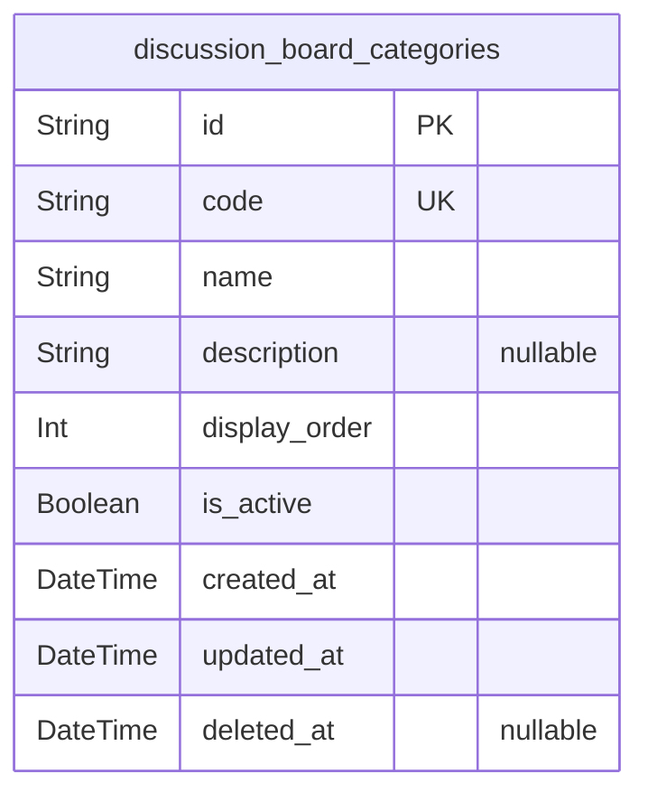
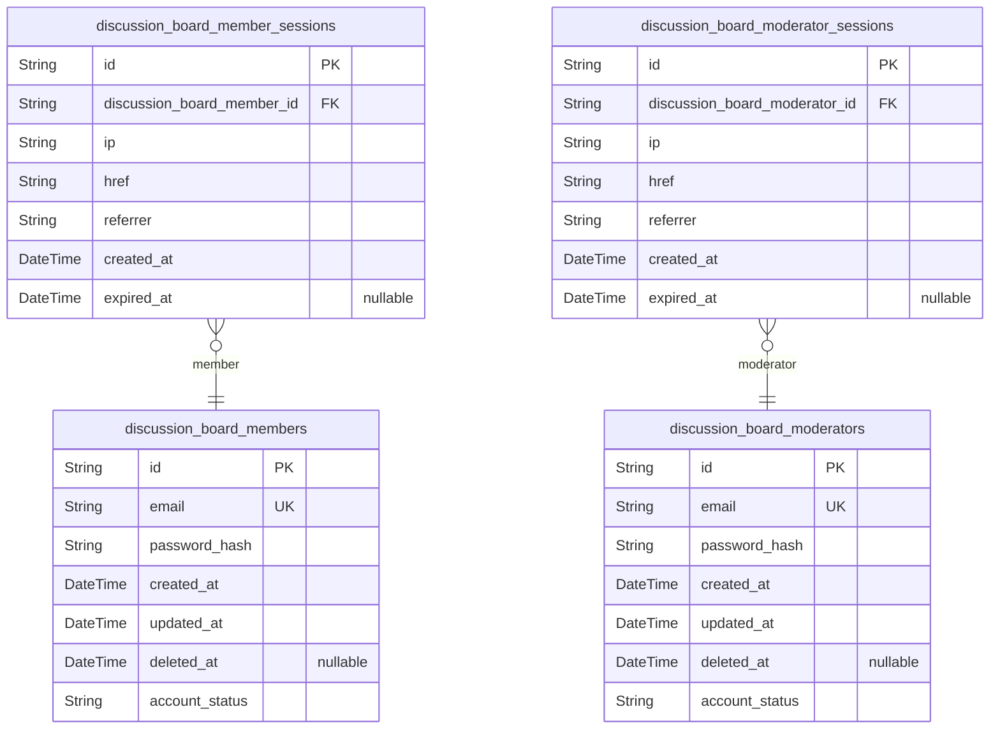
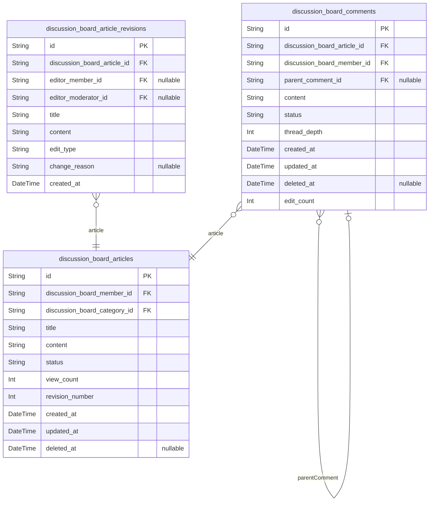
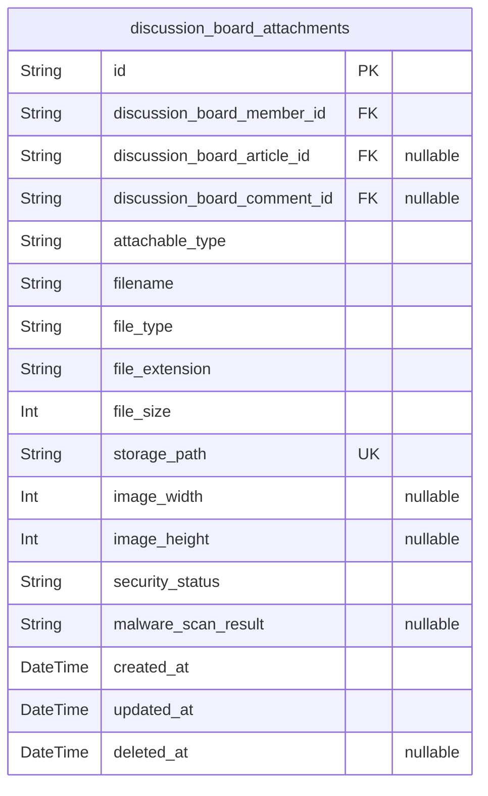
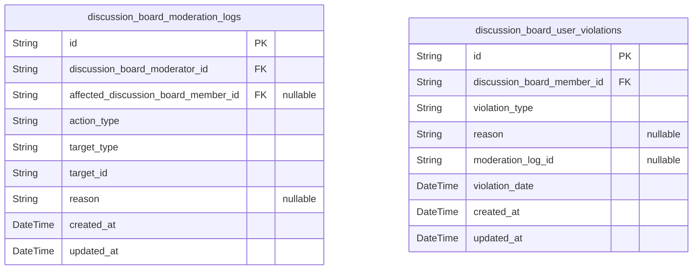
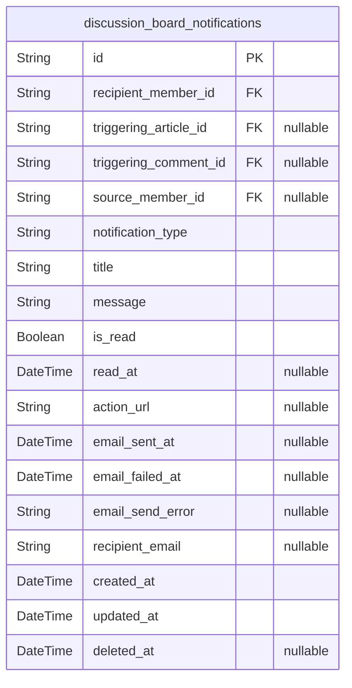

# Prisma Markdown

> Generated by [`prisma-markdown`](https://github.com/samchon/prisma-markdown)

- [Systematic](#systematic)
- [Actors](#actors)
- [Content](#content)
- [Attachments](#attachments)
- [Moderation](#moderation)
- [Notifications](#notifications)

## Systematic

```mermaid
erDiagram
"discussion_board_categories" {
  String id PK
  String code UK
  String name
  String description "nullable"
  Int display_order
  Boolean is_active
  DateTime created_at
  DateTime updated_at
  DateTime deleted_at "nullable"
}
```

### `discussion_board_categories`

System reference table defining article categories for the discussion
board platform. Provides canonical set of allowed category values
(Economics, Politics) that articles must be classified under. This is a
system-managed configuration table, not user-created. Categories are used
throughout the platform for article organization, filtering, and
discovery workflows.

Properties as follows:

- `id`: Primary Key.
- `code`
  > Unique category code/identifier used throughout the system (e.g.,
  > 'economics', 'politics'). This is the programmatic identifier for the
  > category.
- `name`
  > Human-readable category name displayed to users (e.g., 'Economics',
  > 'Politics'). This is what users see when selecting or filtering by
  > category.
- `description`
  > Optional detailed description of the category explaining its scope and
  > purpose. Helps users understand which category is appropriate for their
  > content.
- `display_order`
  > Numeric ordering value for displaying categories in UI. Lower numbers
  > appear first in lists and navigation menus. Allows flexible category
  > ordering without requiring alphabetical sort.
- `is_active`
  > Flag indicating whether the category is currently active and available
  > for new article creation. Inactive categories can still be queried for
  > existing articles but are hidden from category selection in UI.
- `created_at`
  > Timestamp when the category was created or added to the system. Stored in
  > ISO 8601 UTC format for audit trail purposes.
- `updated_at`
  > Timestamp when the category was last modified. Updated whenever category
  > metadata changes (name, description, display order, active status).
- `deleted_at`
  > Timestamp when the category was soft-deleted (retired from use). Null for
  > active categories. Soft deletion preserves referential integrity -
  > articles can still reference deleted categories for historical accuracy.

## Actors

```mermaid
erDiagram
"discussion_board_members" {
  String id PK
  String email UK
  String password_hash
  DateTime created_at
  DateTime updated_at
  DateTime deleted_at "nullable"
  String account_status
}
"discussion_board_member_sessions" {
  String id PK
  String discussion_board_member_id FK
  String ip
  String href
  String referrer
  DateTime created_at
  DateTime expired_at "nullable"
}
"discussion_board_moderators" {
  String id PK
  String email UK
  String password_hash
  DateTime created_at
  DateTime updated_at
  DateTime deleted_at "nullable"
  String account_status
}
"discussion_board_moderator_sessions" {
  String id PK
  String discussion_board_moderator_id FK
  String ip
  String href
  String referrer
  DateTime created_at
  DateTime expired_at "nullable"
}
"discussion_board_member_sessions" }o--|| "discussion_board_members" : member
"discussion_board_moderator_sessions" }o--|| "discussion_board_moderators" : moderator
```

### `discussion_board_members`

Registered member users who can create articles, post comments, and
participate in discussions. Members are authenticated content creators
with standard user permissions. Each member maintains a unique email
address for authentication and account recovery.

Properties as follows:

- `id`: Primary Key.
- `email`
  > Member's email address used for authentication and account management.
  > Must be unique across all members. Used for login and password recovery
  > workflows.
- `password_hash`
  > Hashed password using industry-standard algorithms (bcrypt, scrypt, or
  > similar). Never stores plaintext passwords. Required for member
  > authentication during login.
- `created_at`
  > Member account creation timestamp in ISO 8601 UTC format.
  > System-generated when member registers. Tracks account age for audit
  > purposes.
- `updated_at`
  > Last modification timestamp for member account in ISO 8601 UTC format.
  > Updated when account details change (email update, password reset,
  > profile modifications).
- `deleted_at`
  > Soft delete timestamp for account deactivation. Null means active
  > account. Populated when member deletes account or is deleted by
  > moderators. Enables account recovery and maintains data integrity for
  > historical references.
- `account_status`
  > Current status of the member account: 'active' (normal operation),
  > 'suspended' (temporary access denial, typically 7 days), or 'banned'
  > (permanent access denial). Controls whether member can authenticate and
  > create content.

### `discussion_board_member_sessions`

Authentication session records for logged-in members. Tracks active
sessions with connection context (IP address, referrer URL). Each session
corresponds to a member's login instance. Sessions expire after defined
duration (7 days) or when member logs out explicitly. Used for validating
JWT tokens and managing user sessions across devices.

Properties as follows:

- `id`: Primary Key.
- `discussion_board_member_id`
  > Reference to the member's [discussion_board_members.id](#discussion_board_members) who owns
  > this session. Non-nullable and non-unique to allow multiple concurrent
  > sessions per member.
- `ip`
  > IP address of the connection where this session was created. Captured for
  > security auditing and anomaly detection. Used to track login locations.
- `href`
  > URL of the page where member initiated login or authentication. Provides
  > context about member's entry point into the application.
- `referrer`
  > HTTP referrer URL indicating where member came from before logging in.
  > Tracks traffic sources and member navigation patterns.
- `created_at`
  > Session creation timestamp in ISO 8601 UTC format when member
  > authenticated. System-generated. Used to calculate session age and
  > expiration.
- `expired_at`
  > Session expiration timestamp in ISO 8601 UTC format. Null means session
  > is still active. Set to current time + 7 days on creation, or updated to
  > actual logout time if member explicitly logs out. Null expiry indicates
  > ongoing session.

### `discussion_board_moderators`

Administrator/moderator user accounts with elevated permissions for
content moderation, user management, and community enforcement.
Moderators can review, edit, or remove any content, suspend/ban users,
and access moderation dashboards. Separate from members due to distinct
permission model and administrative responsibilities.

Properties as follows:

- `id`: Primary Key.
- `email`
  > Moderator's email address used for authentication and administrative
  > account management. Must be unique across all moderators. Used for
  > moderator login and security alerts.
- `password_hash`
  > Hashed password using industry-standard algorithms. Required for
  > moderator authentication. Never stores plaintext passwords for security
  > compliance.
- `created_at`
  > Moderator account creation timestamp in ISO 8601 UTC format.
  > System-generated when moderator account is created by administrator.
  > Tracks when moderator access was granted.
- `updated_at`
  > Last modification timestamp for moderator account in ISO 8601 UTC format.
  > Updated when moderator details change (email update, password reset,
  > permission modifications).
- `deleted_at`
  > Soft delete timestamp for moderator account deactivation. Null means
  > active moderator account. Populated when moderator access is revoked.
  > Enables recovery and maintains historical reference for moderation
  > actions.
- `account_status`
  > Current status of moderator account: 'active' (performing moderation
  > duties), 'inactive' (access suspended but not revoked), or 'removed'
  > (permanently revoked). Controls whether moderator can authenticate and
  > access admin features.

### `discussion_board_moderator_sessions`

Authentication session records for logged-in moderators. Tracks active
administrative sessions with connection context (IP, referrer). Each
session corresponds to a moderator's login instance. Sessions expire
after defined duration or explicit logout. Used for validating moderator
JWT tokens and managing admin session lifecycle across sessions.

Properties as follows:

- `id`: Primary Key.
- `discussion_board_moderator_id`
  > Reference to the moderator's [discussion_board_moderators.id](#discussion_board_moderators) who
  > owns this session. Non-nullable and non-unique to allow multiple
  > concurrent sessions per moderator.
- `ip`
  > IP address of the connection where moderator authenticated. Captured for
  > security audit trail of admin access and to detect unauthorized access
  > attempts.
- `href`
  > URL of the page where moderator initiated login or authentication.
  > Provides context about moderator's entry point into admin interface.
- `referrer`
  > HTTP referrer URL indicating where moderator came from before logging in.
  > Tracks administrative access patterns and traffic sources.
- `created_at`
  > Session creation timestamp in ISO 8601 UTC format when moderator
  > authenticated. System-generated. Used to calculate session age and
  > determine expiration.
- `expired_at`
  > Session expiration timestamp in ISO 8601 UTC format. Null means session
  > is still active. Set to current time + 7 days on creation, or updated to
  > actual logout time if moderator explicitly logs out.

## Content

```mermaid
erDiagram
"discussion_board_articles" {
  String id PK
  String discussion_board_member_id FK
  String discussion_board_category_id FK
  String title
  String content
  String status
  Int view_count
  Int revision_number
  DateTime created_at
  DateTime updated_at
  DateTime deleted_at "nullable"
}
"discussion_board_article_revisions" {
  String id PK
  String discussion_board_article_id FK
  String editor_member_id FK "nullable"
  String editor_moderator_id FK "nullable"
  String title
  String content
  String edit_type
  String change_reason "nullable"
  DateTime created_at
}
"discussion_board_comments" {
  String id PK
  String discussion_board_article_id FK
  String discussion_board_member_id FK
  String parent_comment_id FK "nullable"
  String content
  String status
  Int thread_depth
  DateTime created_at
  DateTime updated_at
  DateTime deleted_at "nullable"
  Int edit_count
}
"discussion_board_article_revisions" }o--|| "discussion_board_articles" : article
"discussion_board_comments" }o--|| "discussion_board_articles" : article
"discussion_board_comments" }o--o| "discussion_board_comments" : parentComment
```

### `discussion_board_articles`

Primary content articles where members initiate discussions on economic
and political topics. Each article contains title, content body, category
assignment, and metadata. Articles serve as the primary discussion units
and store current state with all edits tracked in separate revision
table.

Properties as follows:

- `id`: Primary Key.
- `discussion_board_member_id`
  > Member who created the article. Reference to {@link
  > discussion_board_members.id}.
- `discussion_board_category_id`
  > Category the article belongs to (Economics or Politics). Reference to
  > [discussion_board_categories.id](#discussion_board_categories).
- `title`
  > Article title between 3 and 200 characters. Required field that appears
  > in listings and article header.
- `content`
  > Main article body text between 10 and 50,000 characters. Contains the
  > substantive discussion content.
- `status`
  > Current article state: 'published' for visible articles, 'archived' for
  > moderator-hidden articles. Determines visibility to users.
- `view_count`
  > Number of times the article has been viewed. Incremented on each unique
  > user view within 24-hour deduplication window.
- `revision_number`
  > Tracks number of edits made to article. Incremented each time article
  > content is modified. Used for audit trail.
- `created_at`
  > Timestamp when article was initially created. Set once at creation and
  > never changes even if article is edited.
- `updated_at`
  > Timestamp of most recent modification. Updated whenever article title,
  > content, or other fields change.
- `deleted_at`
  > Soft delete timestamp. Set when article is deleted by author or
  > moderator. NULL for active articles. Allows recovery and audit trail.

### `discussion_board_article_revisions`

Historical revision records for articles capturing each version. Each
edit creates new revision record preserving previous content, editor
information, and timestamps. Allows full audit trail and potential
rollback to previous versions. Snapshot-based pattern for article change
tracking.

Properties as follows:

- `id`: Primary Key.
- `discussion_board_article_id`
  > Article this revision belongs to. Reference to {@link
  > discussion_board_articles.id}.
- `editor_member_id`
  > Member or moderator who made the edit. NULL if system edit. Reference to
  > [discussion_board_members.id](#discussion_board_members).
- `editor_moderator_id`
  > Moderator who made the edit if applied by moderator. NULL if edit by
  > member. Reference to [discussion_board_moderators.id](#discussion_board_moderators).
- `title`
  > Article title at time of this revision. Preserves title history across
  > edits.
- `content`
  > Article content body at time of this revision. Full historical content
  > preserved immutably.
- `edit_type`
  > Type of edit: 'member_edit' for author edits, 'moderator_edit' for
  > moderator modifications, 'system_update' for automated changes.
- `change_reason`
  > Optional reason for moderator edits or system changes. Helps explain why
  > content was modified.
- `created_at`: Timestamp when this revision was created (when the edit was made).

### `discussion_board_comments`

User comments posted on articles enabling threaded discussions. Comments
support nested replies through optional parent_comment_id field, allowing
members to create discussion threads under articles. Each comment has
independent lifecycle, ownership by its author, and can be edited within
24 hours or deleted at any time by the author or moderators.

Properties as follows:

- `id`: Primary Key.
- `discussion_board_article_id`
  > Reference to the parent article being discussed. {@link
  > discussion_board_articles.id}
- `discussion_board_member_id`
  > Reference to the member who authored this comment. {@link
  > discussion_board_members.id}
- `parent_comment_id`
  > Reference to the parent comment if this is a reply. NULL for top-level
  > comments, enabling nested threading up to 3 levels deep.
- `content`
  > The comment text body containing user's discussion contribution. Between
  > 1 and 5,000 characters. Supports basic markdown formatting (bold, italic,
  > links).
- `status`
  > Current status of the comment. One of: 'published', 'deleted',
  > 'moderated'. Used to track visibility and moderation state of the
  > comment.
- `thread_depth`
  > Nesting level in the discussion thread. 0 for top-level comments, 1+ for
  > replies. Maximum depth is 3 levels (replies to depth 3 attach to depth 3
  > parent).
- `created_at`: Timestamp when the comment was created. ISO 8601 format in UTC timezone.
- `updated_at`
  > Timestamp when the comment was last modified. Updated when comment text
  > is edited by author or moderators.
- `deleted_at`
  > Timestamp when the comment was soft-deleted or removed by moderator. NULL
  > if comment is still active. Used to preserve audit trail while hiding
  > content.
- `edit_count`
  > Number of times this comment has been edited by its author. Starts at 0.
  > Incremented each time author modifies the comment. Displayed to users as
  > 'edited' indicator.

## Attachments

```mermaid
erDiagram
"discussion_board_attachments" {
  String id PK
  String discussion_board_member_id FK
  String discussion_board_article_id FK "nullable"
  String discussion_board_comment_id FK "nullable"
  String attachable_type
  String filename
  String file_type
  String file_extension
  Int file_size
  String storage_path UK
  Int image_width "nullable"
  Int image_height "nullable"
  String security_status
  String malware_scan_result "nullable"
  DateTime created_at
  DateTime updated_at
  DateTime deleted_at "nullable"
}
```

### `discussion_board_attachments`

Attachment metadata and file references for articles and comments.
Supports polymorphic ownership (can attach to articles OR comments).
Tracks file metadata, security validation status, and storage
information. Separate from content entities to enable independent file
management, security scanning, and storage lifecycle. Soft delete support
for recovery while hiding from users.

Properties as follows:

- `id`: Primary Key.
- `discussion_board_member_id`
  > Member who uploaded the attachment. Reference to {@link
  > discussion_board_members.id}.
- `discussion_board_article_id`
  > Article this attachment belongs to if attachable_type is 'article'. NULL
  > if this is a comment attachment. Reference to {@link
  > discussion_board_articles.id}.
- `discussion_board_comment_id`
  > Comment this attachment belongs to if attachable_type is 'comment'. NULL
  > if this is an article attachment. Reference to {@link
  > discussion_board_comments.id}.
- `attachable_type`
  > Type of parent content: 'article' or 'comment'. Discriminator indicating
  > which foreign key is active. Validation at application layer ensures this
  > matches the non-NULL FK field.
- `filename`
  > Original filename provided by uploader. Used for display and download.
  > Sanitized to remove path traversal sequences and special characters.
- `file_type`
  > MIME type of the file (e.g., 'image/jpeg', 'application/pdf'). Validated
  > during upload against supported types. Used for security classification
  > and display handling.
- `file_extension`
  > File extension without dot (e.g., 'jpg', 'pdf'). Extracted from filename
  > and validated against list of 19 supported extensions. Must match
  > file_type MIME classification.
- `file_size`
  > Size of file in bytes. Validated against limits during upload: images
  > 10MB max, documents 20MB max, archives 50MB max. Stored for audit trail
  > and quota tracking.
- `storage_path`
  > Unique internal path where file is stored on server or cloud storage.
  > UUID or hash-based to guarantee uniqueness. Used for retrieval and
  > deletion. Never exposed to users.
- `image_width`
  > Image width in pixels if attachment is an image file. NULL for non-image
  > types (documents, archives). Extracted during image processing and
  > validation.
- `image_height`
  > Image height in pixels if attachment is an image file. NULL for non-image
  > types. Used for rendering and responsive image handling.
- `security_status`
  > Security validation status: 'pending_scan' (awaiting malware scan),
  > 'safe' (scan passed), 'infected' (malware detected), 'quarantined'
  > (isolated due to violation). Tracks antivirus scan results and security
  > clearance status.
- `malware_scan_result`
  > Detailed result from antivirus/malware scanning if performed. NULL if
  > scan pending or not performed. Contains specific threat information from
  > scanner (e.g., 'detected: trojan.xyz'). Only populated when scan is
  > completed.
- `created_at`
  > Timestamp when attachment was uploaded (ISO 8601 UTC). Used for audit
  > trail and storage lifecycle tracking.
- `updated_at`
  > Timestamp when attachment metadata was last updated, especially when
  > security scan results change. Critical for tracking when files became
  > safe or were flagged as threats.
- `deleted_at`
  > Soft delete timestamp. NULL if attachment is active and visible. Set when
  > attachment is deleted by user or parent content is deleted. Allows
  > recovery and maintains audit trail.

## Moderation

```mermaid
erDiagram
"discussion_board_moderation_logs" {
  String id PK
  String discussion_board_moderator_id FK
  String affected_discussion_board_member_id FK "nullable"
  String action_type
  String target_type
  String target_id
  String reason "nullable"
  DateTime created_at
  DateTime updated_at
}
"discussion_board_user_violations" {
  String id PK
  String discussion_board_member_id FK
  String violation_type
  String reason "nullable"
  String moderation_log_id "nullable"
  DateTime violation_date
  DateTime created_at
  DateTime updated_at
}
```

### `discussion_board_moderation_logs`

Complete audit trail of all moderation actions taken by moderators
including content removal, user suspension, account bans, and other
enforcement actions. Every moderator decision is logged with full context
for compliance, transparency, and accountability. Supports polymorphic
targeting of articles, comments, or user accounts through target_type
discriminator pattern.

Properties as follows:

- `id`: Primary Key.
- `discussion_board_moderator_id`
  > Reference to the moderator who performed this action. {@link
  > discussion_board_moderators.id}.
- `affected_discussion_board_member_id`
  > Reference to the member affected by this moderation action (if the action
  > targets a user account, such as suspension or ban). Nullable if action
  > targets content rather than user. [discussion_board_members.id](#discussion_board_members).
- `action_type`
  > Type of moderation action taken. Valid values: 'remove_article',
  > 'remove_comment', 'suspend_user', 'ban_user', 'restore_article',
  > 'restore_comment', 'warning_issued', 'flag_content'. Standardized
  > enumeration ensures consistent action tracking.
- `target_type`
  > Type of entity targeted by this moderation action. Valid values:
  > 'article', 'comment', 'member'. Used as polymorphic discriminator with
  > target_id to determine the specific entity affected.
- `target_id`
  > UUID of the entity affected by this moderation action. Combined with
  > target_type: if 'article' then references discussion_board_articles.id;
  > if 'comment' then references discussion_board_comments.id; if 'member'
  > then references discussion_board_members.id. Application must validate
  > referential integrity based on target_type.
- `reason`
  > Moderator-provided reason or explanation for the moderation action (max
  > 500 characters). Documents why the action was taken and what violation
  > occurred. Enables transparent communication with users.
- `created_at`
  > Timestamp when the moderation action was executed. Stored in UTC ISO 8601
  > format. Used for audit trails and chronological action sequencing.
- `updated_at`
  > Timestamp when the moderation log record was last modified. Stored in UTC
  > ISO 8601 format. Used for audit trail tracking of changes.

### `discussion_board_user_violations`

Tracks cumulative violations per member for automatic enforcement of
community guidelines. Records when users violate policies (spam,
harassment, inappropriate content, etc.) and enables automatic account
restrictions: 3+ violations in 30 days triggers 7-day suspension, 5+
violations in 90 days triggers permanent ban. Maintains violation history
linked to moderation actions for complete audit trail.

Properties as follows:

- `id`: Primary Key.
- `discussion_board_member_id`
  > Reference to the member who committed the violation. {@link
  > discussion_board_members.id}.
- `violation_type`
  > Category or type of violation committed. Valid values: 'spam',
  > 'harassment', 'inappropriate_content', 'off_topic', 'misinformation',
  > 'copyright_violation', 'illegal_content'. Enables violation
  > categorization and pattern analysis.
- `reason`
  > Brief description of the specific violation that occurred. Explains what
  > policy was violated and provides context for moderation decisions.
  > Supports compliance documentation and user communication.
- `moderation_log_id`
  > Optional reference to the associated discussion_board_moderation_logs
  > record if this violation triggered a moderation action. {@link
  > discussion_board_moderation_logs.id}. Links violation tracking to
  > enforcement actions for complete audit trail. Nullable if violation is
  > recorded but no action taken yet.
- `violation_date`
  > Timestamp when the violation occurred (when user committed the policy
  > violation). Stored in UTC ISO 8601 format. Used for calculating 30-day
  > and 90-day violation windows that trigger automatic suspension and
  > banning. Critical for time-based enforcement thresholds.
- `created_at`
  > Timestamp when this violation record was created in the system. Stored in
  > UTC ISO 8601 format. May differ from violation_date if violation is
  > recorded after the fact. Used for audit trail tracking.
- `updated_at`
  > Timestamp when this violation record was last modified. Stored in UTC ISO
  > 8601 format. Used for audit trail tracking of violation record changes.

## Notifications

```mermaid
erDiagram
"discussion_board_notifications" {
  String id PK
  String recipient_member_id FK
  String triggering_article_id FK "nullable"
  String triggering_comment_id FK "nullable"
  String source_member_id FK "nullable"
  String notification_type
  String title
  String message
  Boolean is_read
  DateTime read_at "nullable"
  String action_url "nullable"
  DateTime email_sent_at "nullable"
  DateTime email_failed_at "nullable"
  String email_send_error "nullable"
  String recipient_email "nullable"
  DateTime created_at
  DateTime updated_at
  DateTime deleted_at "nullable"
}
```

### `discussion_board_notifications`

Notifications informing users of relevant events such as comment replies,
mentions, and moderation actions. Each notification represents a discrete
event requiring user awareness. Notifications support independent user
workflows including browsing, marking as read, and deletion. Users can
view their personal notification inbox independently of source content.
Enhanced to support email delivery tracking, duplicate prevention, and
proper audit trails.

Properties as follows:

- `id`: Primary Key.
- `recipient_member_id`
  > Reference to the member who is the recipient of this notification. The
  > member who should be informed of the event. {@link
  > discussion_board_members.id}
- `triggering_article_id`
  > Optional reference to the article that triggered this notification if
  > applicable. Used when notification is about article comments, article
  > moderation, etc. [discussion_board_articles.id](#discussion_board_articles)
- `triggering_comment_id`
  > Optional reference to the comment that triggered this notification if
  > applicable. Used when notification is about comment replies or comment
  > moderation. [discussion_board_comments.id](#discussion_board_comments)
- `source_member_id`
  > Optional reference to the member who caused this notification if
  > applicable. The user who commented, mentioned, or triggered the event.
  > [discussion_board_members.id](#discussion_board_members)
- `notification_type`
  > Type of notification event. Valid values: 'comment_reply' (someone
  > replied to user's comment), 'mention' (user was mentioned in comment),
  > 'article_moderation' (user's article was moderated/removed),
  > 'comment_moderation' (user's comment was moderated/removed). Categorizes
  > what event triggered this notification for filtering and display
  > purposes. Should be constrained to enum values at database level.
- `title`
  > Short title/subject of the notification for display in notification
  > lists. Examples: 'New reply to your comment', 'Your article was removed',
  > 'You were mentioned'. Keep brief (50-100 characters) for quick scanning.
- `message`
  > Full notification message body providing context about the event.
  > Includes details about what happened, who it was from (if applicable),
  > and relevant article/comment information. Supports markdown or plain text
  > (200-500 characters typical).
- `is_read`
  > Whether the user has read/viewed this notification. False indicates
  > unread notification that should be highlighted in user's notification
  > inbox. Used for visual distinction and unread count calculations.
- `read_at`
  > Timestamp when the user read/viewed this notification. Null if
  > notification has not been read yet (is_read = false). Used for tracking
  > when users engage with notifications and for sorting by recency.
- `action_url`
  > Optional URL or deep link to navigate directly to the related content
  > when notification is clicked. Examples:
  > '/articles/[articleId]#comment-[commentId]' or '/articles/[articleId]'.
  > Null for notifications without a direct action target.
- `email_sent_at`
  > Timestamp when this notification was sent via email to the recipient.
  > Null if notification has not been emailed yet or user has email
  > notifications disabled. Used to track which notifications have been
  > delivered via email for compliance and retry logic.
- `email_failed_at`
  > Timestamp when email delivery for this notification failed. Null if email
  > sent successfully or notification not sent via email. Used to track
  > failed deliveries for retry and debugging purposes.
- `email_send_error`
  > Error message or reason code if email delivery failed. Null if email sent
  > successfully. Examples: 'SMTP_TIMEOUT', 'INVALID_ADDRESS', 'BOUNCE'.
  > Enables troubleshooting of delivery failures.
- `recipient_email`
  > Email address of the recipient member at time of notification creation.
  > Denormalized from member record for efficient email delivery. Null if
  > member has no email or delivery disabled. Allows sending emails even if
  > member record is updated.
- `created_at`
  > Timestamp when this notification was created/generated in UTC ISO 8601
  > format. Marks when the triggering event occurred. Used for sorting
  > notifications chronologically (newest first) and for cleanup policies.
  > System-generated, immutable.
- `updated_at`
  > Timestamp when this notification record was last modified in UTC ISO 8601
  > format. Updated when notification status changes (marked read, email
  > sent, etc.). Used for audit trail and tracking notification lifecycle
  > changes.
- `deleted_at`
  > Timestamp when this notification was deleted/archived by the user in UTC
  > ISO 8601 format. Null indicates active notification. Used for soft
  > deletion allowing recovery and maintains audit trail of user actions on
  > notifications.
