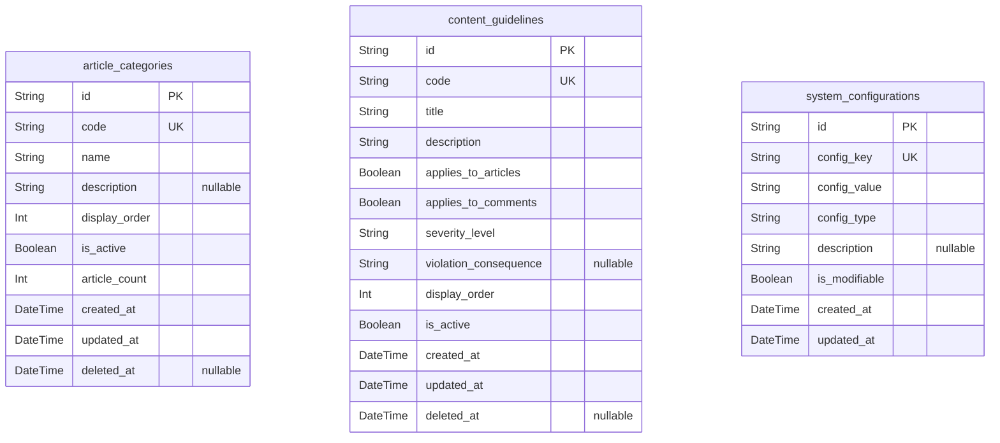
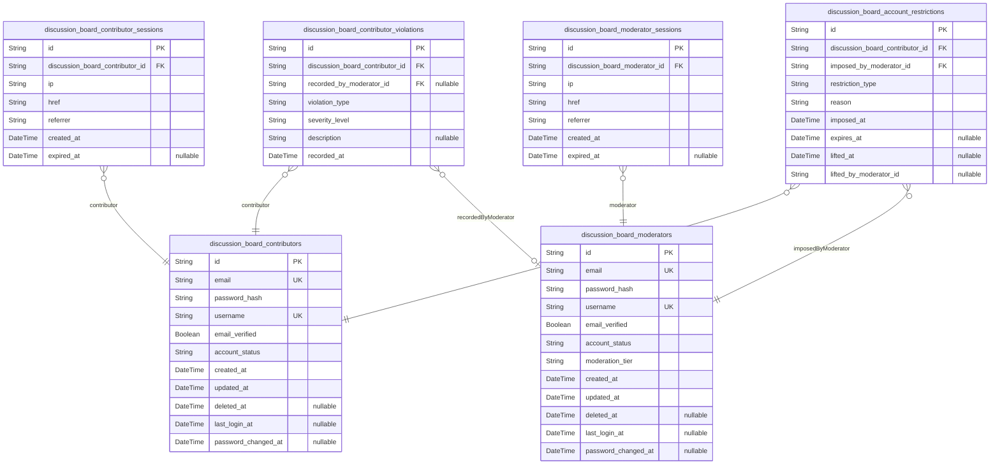
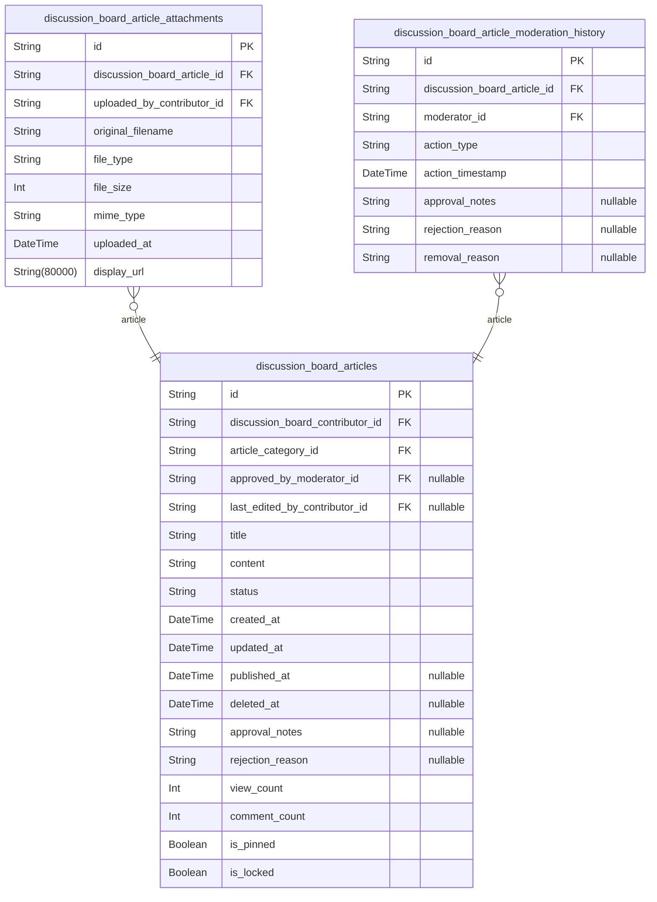
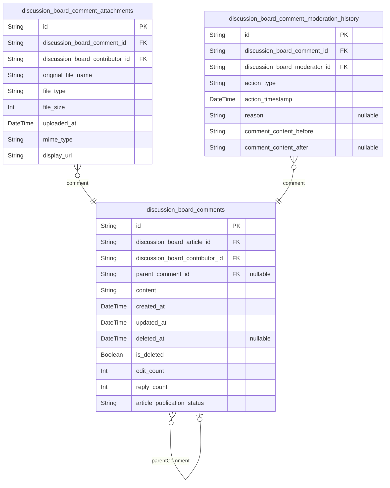
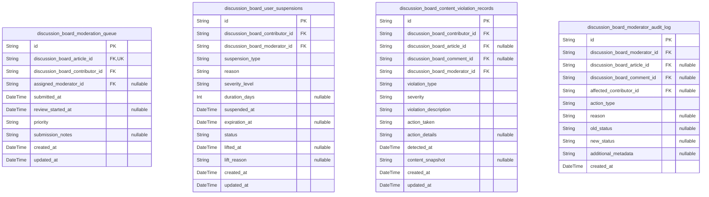
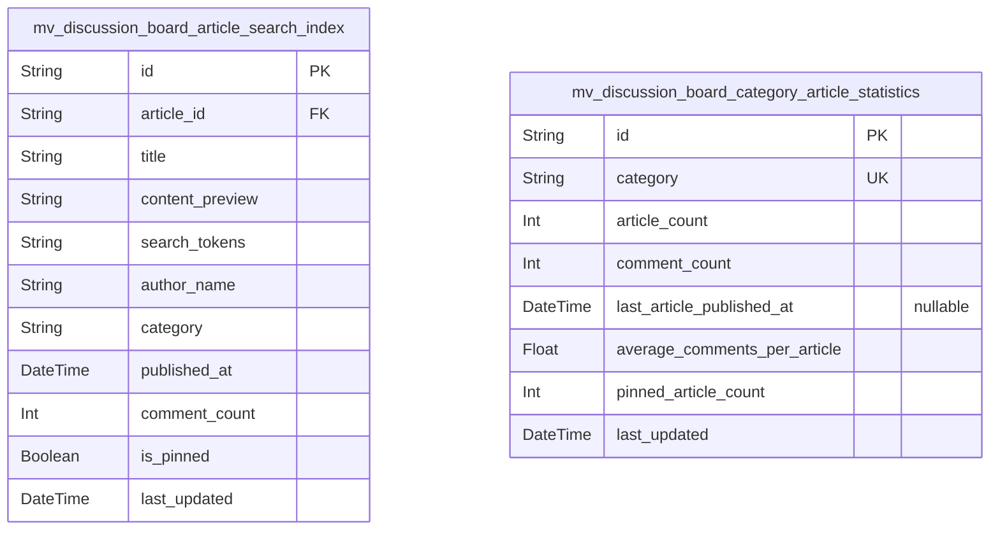

# Prisma Markdown

> Generated by [`prisma-markdown`](https://github.com/samchon/prisma-markdown)

- [Systematic](#systematic)
- [Actors](#actors)
- [Articles](#articles)
- [Comments](#comments)
- [Moderation](#moderation)
- [default](#default)

## Systematic

```mermaid
erDiagram
"article_categories" {
  String id PK
  String code UK
  String name
  String description "nullable"
  Int display_order
  Boolean is_active
  Int article_count
  DateTime created_at
  DateTime updated_at
  DateTime deleted_at "nullable"
}
"content_guidelines" {
  String id PK
  String code UK
  String title
  String description
  Boolean applies_to_articles
  Boolean applies_to_comments
  String severity_level
  String violation_consequence "nullable"
  Int display_order
  Boolean is_active
  DateTime created_at
  DateTime updated_at
  DateTime deleted_at "nullable"
}
"system_configurations" {
  String id PK
  String config_key UK
  String config_value
  String config_type
  String description "nullable"
  Boolean is_modifiable
  DateTime created_at
  DateTime updated_at
}
```

### `article_categories`

Article category reference data that organizes discussion board content
into logical topic areas.

Every article published on the discussion board must belong to exactly
one category from this predefined set. Categories provide the primary
organizational structure enabling users to browse articles by topic area.
The system maintains a fixed set of categories rather than allowing
unlimited user-created categories, ensuring consistent content
organization and preventing category fragmentation.

Categories include metadata describing their purpose, character limits
for article content within the category, and validity status. Soft
deletion is supported to maintain data integrity when categories are
deprecated while preserving the ability to reference them from historical
articles.

Related entities: discussion_board_articles references this table via
category_id when articles are created or updated.

Properties as follows:

- `id`: Primary Key.
- `code`
  > Unique machine-readable identifier for the category (e.g.,
  > 'economic-policy', 'political-governance'). Used in APIs and internal
  > references. Must be 5-50 lowercase alphanumeric characters with hyphens.
- `name`
  > Human-readable display name for the category (e.g., 'Economic Policy',
  > 'Political Governance'). Shown in user interfaces, category listings, and
  > article filters. 10-100 characters.
- `description`
  > Detailed explanation of the category scope and purpose. Helps users
  > understand which category their article should belong to. Maximum 500
  > characters. Examples: 'Articles about taxation, trade, regulation, and
  > economic policy decisions' for Economic Policy category.
- `display_order`
  > Numeric order for displaying categories in user interfaces. Lower numbers
  > appear first in category menus and navigation. Defaults to 0. Used by
  > sort order when displaying category lists.
- `is_active`
  > Whether this category is currently available for article submission.
  > Active categories appear in category selection dropdowns when users
  > create articles. Inactive categories persist for historical reference but
  > prevent new articles from being assigned. Defaults to true.
- `article_count`
  > Denormalized count of published articles in this category. Used for
  > display purposes (e.g., 'Economic Policy (47 articles'). Updated when
  > articles are published or unpublished. Defaults to 0. Should be
  > recalculated periodically for accuracy.
- `created_at`
  > Timestamp when the category was created. ISO 8601 format. Set
  > automatically on record creation.
- `updated_at`
  > Timestamp when the category was last modified. ISO 8601 format. Updated
  > whenever any field changes.
- `deleted_at`
  > Timestamp when the category was soft-deleted (made inactive). ISO 8601
  > format. Null for active categories. Soft deletion preserves historical
  > category data while removing the category from active use.

### `content_guidelines`

Content policy rules and moderation guidelines that define community
standards for articles and comments.

The content guidelines table stores the authoritative rules that
moderators enforce when reviewing articles and monitoring comments. Each
guideline entry specifies a policy rule, whether it applies to articles
or comments, the severity level if violated, and examples to help
moderators make consistent decisions.

Guidelines are organized by policy area (hate speech, misinformation,
spam, off-topic, etc.) and include detailed descriptions of prohibited
behavior. The system maintains the complete set of active guidelines for
reference by moderators and contributors. Soft deletion is supported to
preserve historical policy changes while maintaining audit trails of
previous guidelines.

Moderation decisions reference specific guidelines when removing content
or issuing warnings, creating accountability and transparency about why
content was removed.

Properties as follows:

- `id`: Primary Key.
- `code`
  > Machine-readable identifier for the guideline (e.g., 'hate-speech',
  > 'misinformation', 'spam'). 5-50 lowercase alphanumeric characters with
  > hyphens. Used in moderation logs and audit trails.
- `title`
  > Short, descriptive title of the guideline (e.g., 'Hate Speech',
  > 'Misinformation', 'Commercial Spam'). 10-100 characters. Displayed in
  > moderation dashboards and violation notices.
- `description`
  > Detailed explanation of the policy and what content violates it. Should
  > include clear examples of prohibited behavior and the rationale for the
  > policy. Maximum 2000 characters. Moderators use this when making judgment
  > calls about borderline content.
- `applies_to_articles`
  > Whether this guideline applies to article content. If true, moderators
  > review articles against this guideline during approval. Defaults to true
  > for most guidelines.
- `applies_to_comments`
  > Whether this guideline applies to comment content. If true, moderators
  > monitor comments for violations of this guideline. Defaults to true for
  > most guidelines.
- `severity_level`
  > Classification of violation severity: 'minor' (edit/warning), 'moderate'
  > (removal/warning), 'severe' (removal/suspension). Guides moderator
  > response proportionality. Severity level informs escalation decisions.
- `violation_consequence`
  > Description of typical consequences for violating this guideline (e.g.,
  > 'comment removal', 'article rejection with feedback', 'account suspension
  > after 3 violations'). Maximum 500 characters. Helps set contributor
  > expectations.
- `display_order`
  > Numeric order for displaying guidelines in user-facing policy
  > documentation. Lower numbers appear first. Defaults to 0. Used to
  > organize guidelines by importance or category.
- `is_active`
  > Whether this guideline is currently enforced. Active guidelines are
  > displayed in policy documentation and used by moderators. Inactive
  > guidelines are retained for historical reference but not actively
  > enforced. Defaults to true.
- `created_at`
  > Timestamp when the guideline was created. ISO 8601 format. Marks when the
  > policy rule was first established.
- `updated_at`
  > Timestamp when the guideline was last modified. ISO 8601 format. Updated
  > when policy descriptions or enforcement rules change.
- `deleted_at`
  > Timestamp when the guideline was soft-deleted or made inactive. ISO 8601
  > format. Null for active guidelines. Soft deletion preserves historical
  > audit trail of policy changes.

### `system_configurations`

Application-wide configuration settings and system parameters that
control platform behavior.

The system configurations table stores site-wide settings and operational
parameters that control how the discussion board functions. Settings
include password requirements, session timeouts, rate limits, file upload
constraints, and feature flags that determine which features are enabled.

Configuration entries use a key-value structure with a configuration key
(e.g., 'password_min_length', 'session_timeout_minutes',
'file_upload_max_size_mb') and corresponding value. Each setting includes
a description explaining its purpose and impact on the system.

Administrators manage system configurations to tune platform behavior
without requiring code changes. Changes to configurations take effect
immediately or after specified cache expiration periods. All
configuration changes are audited with timestamps for accountability.

Properties as follows:

- `id`: Primary Key.
- `config_key`
  > Unique machine-readable identifier for the configuration setting (e.g.,
  > 'password_min_length', 'session_timeout_minutes',
  > 'file_upload_max_size_mb'). 10-100 lowercase alphanumeric characters with
  > underscores. Used as primary lookup key for retrieving configuration
  > values.
- `config_value`
  > The actual configuration value as a string (e.g., '8' for
  > password_min_length, '30' for session_timeout_minutes). Values are stored
  > as strings and should be parsed to appropriate types (int, boolean, etc.)
  > by application code. Maximum 5000 characters for complex values like
  > policy text.
- `config_type`
  > Data type classification for the configuration value: 'string',
  > 'integer', 'boolean', 'decimal', 'json'. Indicates how the config_value
  > should be parsed by the application. Helps validate configuration values.
- `description`
  > Explanation of what this configuration controls and why it matters.
  > Examples: 'Minimum number of characters required for user passwords',
  > 'Session timeout in minutes after which users must re-authenticate',
  > 'Maximum file size in MB for article attachments'. Maximum 1000
  > characters.
- `is_modifiable`
  > Whether administrators can modify this configuration through the admin
  > interface. Some core settings (like schema version) are read-only and
  > marked as false to prevent accidental changes. Defaults to true for most
  > settings.
- `created_at`
  > Timestamp when the configuration setting was created. ISO 8601 format.
  > Marks when this setting was first established.
- `updated_at`
  > Timestamp when the configuration value was last modified. ISO 8601
  > format. Updated whenever an administrator changes the configuration
  > value.

## Actors

```mermaid
erDiagram
"discussion_board_contributors" {
  String id PK
  String email UK
  String password_hash
  String username UK
  Boolean email_verified
  String account_status
  DateTime created_at
  DateTime updated_at
  DateTime deleted_at "nullable"
  DateTime last_login_at "nullable"
  DateTime password_changed_at "nullable"
}
"discussion_board_contributor_sessions" {
  String id PK
  String discussion_board_contributor_id FK
  String ip
  String href
  String referrer
  DateTime created_at
  DateTime expired_at "nullable"
}
"discussion_board_moderators" {
  String id PK
  String email UK
  String password_hash
  String username UK
  Boolean email_verified
  String account_status
  String moderation_tier
  DateTime created_at
  DateTime updated_at
  DateTime deleted_at "nullable"
  DateTime last_login_at "nullable"
  DateTime password_changed_at "nullable"
}
"discussion_board_moderator_sessions" {
  String id PK
  String discussion_board_moderator_id FK
  String ip
  String href
  String referrer
  DateTime created_at
  DateTime expired_at "nullable"
}
"discussion_board_contributor_violations" {
  String id PK
  String discussion_board_contributor_id FK
  String recorded_by_moderator_id FK "nullable"
  String violation_type
  String severity_level
  String description "nullable"
  DateTime recorded_at
}
"discussion_board_account_restrictions" {
  String id PK
  String discussion_board_contributor_id FK
  String imposed_by_moderator_id FK
  String restriction_type
  String reason
  DateTime imposed_at
  DateTime expires_at "nullable"
  DateTime lifted_at "nullable"
  String lifted_by_moderator_id "nullable"
}
"discussion_board_contributor_sessions" }o--|| "discussion_board_contributors" : contributor
"discussion_board_moderator_sessions" }o--|| "discussion_board_moderators" : moderator
"discussion_board_contributor_violations" }o--|| "discussion_board_contributors" : contributor
"discussion_board_contributor_violations" }o--o| "discussion_board_moderators" : recordedByModerator
"discussion_board_account_restrictions" }o--|| "discussion_board_contributors" : contributor
"discussion_board_account_restrictions" }o--|| "discussion_board_moderators" : imposedByModerator
```

### `discussion_board_contributors`

Registered contributor user accounts for the discussion board.

Stores authentication credentials, profile information, and account
status for contributors who can create articles and post comments. Each
contributor account is unique by email and username. Soft deletion
preserves contributor information while enabling account recovery within
6 months.

Password security is enforced through bcrypt hashing with minimum 12 salt
rounds. Email addresses are stored plaintext for authentication flows
(login, password reset, notifications) but should be treated as sensitive
data. Account creation requires email verification before enabling login.

Contributors maintain separate session management from moderators,
requiring dedicated session tables for security isolation. Violation
history and account restrictions track contributor standing and
enforcement actions.

Properties as follows:

- `id`: Primary Key.
- `email`
  > Email address used for authentication and account recovery. Must be
  > unique across all contributor accounts. Valid email format required
  > (user@domain.com).
- `password_hash`
  > Bcrypt-hashed password with minimum 12 salt rounds. Password must be at
  > least 8 characters with uppercase, lowercase, number, and special
  > character. Never stores plaintext password.
- `username`
  > Public display name for articles and comments. Must be unique across all
  > contributors. 3-50 characters, alphanumeric and underscore only.
  > Immutable after creation.
- `email_verified`
  > Whether the contributor's email address has been verified through
  > confirmation link. False until verification email is clicked. Account
  > cannot post articles or comments until verified.
- `account_status`
  > Current account status. Valid values: 'active' (normal operation),
  > 'suspended' (temporary ban), 'restricted' (limited posting), 'deleted'
  > (marked for deletion but retained for audit). Defaults to 'active' on
  > creation.
- `created_at`
  > Timestamp when the contributor account was created in ISO 8601 format
  > (YYYY-MM-DDTHH:mm:ssZ).
- `updated_at`
  > Timestamp of the most recent account modification. Updated when email,
  > username, password, or status changes. Not updated on session creation or
  > article/comment posting.
- `deleted_at`
  > Timestamp when contributor account was deleted (soft delete). Null for
  > active accounts. Retained for 6 months to enable recovery; after 6
  > months, account and associated data can be permanently purged.
- `last_login_at`
  > Timestamp of the most recent successful login. Null if account has never
  > been logged in. Updated only on successful authentication, not on failed
  > attempts.
- `password_changed_at`
  > Timestamp of the most recent password change. Null if password has never
  > been changed from initial setup. All active sessions are invalidated when
  > password changes.

### `discussion_board_contributor_sessions`

Session management for authenticated contributors.

Tracks active sessions for contributor authentication. Each session
represents a login instance with connection context (IP address, referrer
URL, accessed URL). Sessions enforce 30-minute access token expiration
and 7-day refresh token expiration.

One contributor can have multiple concurrent sessions from different
devices or browsers. Sessions are created on successful login and
invalidated on logout or password change. Connection metadata (IP,
referrer) enables security monitoring and abuse detection.

Sessions follow the mandatory specification with required fields: ip,
href, referrer, created_at, expired_at. No additional fields beyond this
specification are allowed.

Properties as follows:

- `id`: Primary Key.
- `discussion_board_contributor_id`
  > Foreign key to the contributor account. Multiple concurrent sessions
  > allowed per contributor.
- `ip`
  > IP address of the session connection. Used for security monitoring and
  > abuse detection. IPv4 or IPv6 format.
- `href`
  > Full URL of the page where session was initiated (connection URL).
  > Enables tracking of session origination context.
- `referrer`
  > HTTP Referrer header value from session creation request. Indicates where
  > user came from before logging in.
- `created_at`
  > Timestamp when session was created in ISO 8601 format. Marks the login
  > time.
- `expired_at`
  > Timestamp when session was explicitly terminated (logout). Null for
  > active sessions. Session is also implicitly expired after 7 days of
  > creation.

### `discussion_board_moderators`

Moderator accounts with elevated administrative permissions.

Stores authentication and profile information for moderators who review
articles, manage comments, and enforce community standards. Moderators
are a distinct user type from contributors, with separate account
management and session handling.

Each moderator account is unique by email and username. Moderators
require email verification and maintain separate session table for
security isolation from regular contributors. All moderators have
identical permissions; role differentiation is not supported (all
moderators have equal authority).

Moderation authority is recorded through audit logs that track which
moderator performed each action. Account status tracks moderator
availability (active, suspended, deleted). Moderators retain full
contributor capabilities (can create articles, post comments) while also
accessing moderation tools.

Properties as follows:

- `id`: Primary Key.
- `email`
  > Email address used for moderator authentication and account recovery.
  > Must be unique across all moderator accounts. Valid email format required
  > (user@domain.com).
- `password_hash`
  > Bcrypt-hashed password with minimum 12 salt rounds. Password must be at
  > least 8 characters with uppercase, lowercase, number, and special
  > character. Never stores plaintext password.
- `username`
  > Public display name for moderation actions and audit trail. Must be
  > unique across all moderators. 3-50 characters, alphanumeric and
  > underscore only. Immutable after creation.
- `email_verified`
  > Whether the moderator's email address has been verified through
  > confirmation link. False until verification email is clicked. Account
  > cannot access moderation tools until verified.
- `account_status`
  > Current account status. Valid values: 'active' (normal operation),
  > 'suspended' (temporary ban from moderation), 'deleted' (marked for
  > deletion). Defaults to 'active' on creation.
- `moderation_tier`
  > Moderator permission level. Current value: 'full' (all moderation
  > permissions). Reserved for future role differentiation. All moderators
  > currently have identical permissions.
- `created_at`
  > Timestamp when the moderator account was created in ISO 8601 format
  > (YYYY-MM-DDTHH:mm:ssZ).
- `updated_at`
  > Timestamp of the most recent account modification. Updated when email,
  > username, password, status, or tier changes.
- `deleted_at`
  > Timestamp when moderator account was deleted (soft delete). Null for
  > active accounts. Retained for compliance purposes; moderator actions
  > remain attributed to their ID in audit logs.
- `last_login_at`
  > Timestamp of the most recent successful login to moderation dashboard.
  > Null if account has never been logged in.
- `password_changed_at`
  > Timestamp of the most recent password change. Null if password has never
  > been changed. All active sessions are invalidated when password changes.

### `discussion_board_moderator_sessions`

Session management for authenticated moderators.

Tracks active sessions for moderator authentication and access to
moderation dashboards. Each session represents a login instance with
connection context (IP address, referrer URL, accessed URL). Sessions
enforce 30-minute access token expiration and 7-day refresh token
expiration.

One moderator can have multiple concurrent sessions from different
devices or browsers. Sessions are created on successful moderator login
and invalidated on logout or password change. Connection metadata (IP,
referrer) enables security monitoring of moderator actions.

Sessions follow the mandatory specification with required fields: ip,
href, referrer, created_at, expired_at. Moderator sessions are separate
from contributor sessions for security isolation and access control
differentiation.

Properties as follows:

- `id`: Primary Key.
- `discussion_board_moderator_id`
  > Foreign key to the moderator account. Multiple concurrent sessions
  > allowed per moderator.
- `ip`
  > IP address of the session connection. Used for security monitoring and
  > audit trail of moderator actions. IPv4 or IPv6 format.
- `href`
  > Full URL of the page where session was initiated (connection URL).
  > Enables tracking of where moderator accessed moderation tools.
- `referrer`
  > HTTP Referrer header value from session creation request. Indicates
  > origin of moderator login request.
- `created_at`
  > Timestamp when session was created in ISO 8601 format. Marks the login
  > time for moderation access.
- `expired_at`
  > Timestamp when session was explicitly terminated (logout). Null for
  > active sessions. Session is also implicitly expired after 7 days of
  > creation.

### `discussion_board_contributor_violations`

Violation history tracking for contributors who breach community guidelines.

Records each policy violation (content removal, comment deletion,
guideline breach) committed by a contributor. Enables moderation
escalation: first violation triggers warning, subsequent violations
within 30 days result in restrictions or suspensions.

Each violation entry includes violation type (article removal, comment
violation, misinformation, harassment, etc.), severity level (minor,
moderate, severe), contributing moderator ID, and recorded timestamp.
Violations are never deleted; the complete history is retained for
compliance and pattern analysis.

Violation history informs moderator decisions about account restrictions.
Multiple violations in short timeframes trigger automatic review
recommendations or account suspension escalation. Violations older than
30 days do not count toward escalation, allowing contributors to
rehabilitate their standing.

Properties as follows:

- `id`: Primary Key.
- `discussion_board_contributor_id`
  > Foreign key to the contributor account that committed the violation.
  > Contributor's [discussion_board_contributors.id](#discussion_board_contributors).
- `recorded_by_moderator_id`
  > Foreign key to the moderator who recorded the violation. {@link
  > discussion_board_moderators.id}. Null if violation was auto-recorded by
  > system. Optional for system-generated violations.
- `violation_type`
  > Category of the violation. Valid values: 'hate_speech',
  > 'personal_attack', 'misinformation', 'harassment', 'spam',
  > 'explicit_content', 'off_topic', 'platform_abuse', 'other'. Classifies
  > the guideline breached.
- `severity_level`
  > Severity classification of the violation. Valid values: 'minor' (small
  > issue, warning), 'moderate' (clear violation, removal), 'severe'
  > (serious/repeated, restriction/suspension). Guides moderation response.
- `description`
  > Detailed description of the violation and context. May reference article
  > ID, comment ID, or other content identifiers. Helps moderators understand
  > violation history. Maximum 1000 characters.
- `recorded_at`
  > Timestamp when the violation was recorded in ISO 8601 format. Marks when
  > moderator identified and recorded the violation.

### `discussion_board_account_restrictions`

Account restrictions and suspensions imposed on contributors by moderators.

Tracks all restrictions applied to contributor accounts as enforcement
actions. Restrictions prevent contributors from creating articles or
posting comments during the restriction period. Multiple restriction
types supported: posting restrictions (3-day, 7-day, custom), temporary
suspensions (7-day, 30-day), and permanent bans.

Each restriction records the restriction type, reason, start timestamp,
end timestamp (null for active indefinite bans), and moderator who
imposed it. Restrictions can be manually lifted by moderators before the
scheduled end date. Complete restriction history is retained for
compliance and pattern analysis.

Active restrictions (where current time is before end_date or end_date is
null) prevent new article submissions and comment posts. Multiple
overlapping restrictions are not allowed; applying a new restriction
cancels any previous restriction. Contributor notifications include
reason for restriction and end date (if applicable).

Properties as follows:

- `id`: Primary Key.
- `discussion_board_contributor_id`
  > Foreign key to the contributor account being restricted. {@link
  > discussion_board_contributors.id}.
- `imposed_by_moderator_id`
  > Foreign key to the moderator who imposed the restriction. {@link
  > discussion_board_moderators.id}.
- `restriction_type`
  > Type of restriction applied. Valid values: 'posting_restriction' (cannot
  > post articles/comments), 'temporary_suspension' (account login denied),
  > 'permanent_ban' (account permanently disabled). Determines enforcement
  > mechanism.
- `reason`
  > Explanation of why the restriction was imposed. Communicates to
  > contributor why their account was restricted and what conduct led to it.
  > Maximum 500 characters.
- `imposed_at`
  > Timestamp when the restriction was applied in ISO 8601 format. Marks the
  > enforcement action time.
- `expires_at`
  > Timestamp when the restriction automatically expires. Null for permanent
  > bans or indefinite restrictions. After this timestamp, restriction is no
  > longer enforced and account returns to normal operation.
- `lifted_at`
  > Timestamp when the restriction was manually lifted by a moderator. Null
  > if restriction expired naturally or is still active. Enables early
  > restriction removal for rehabilitated contributors.
- `lifted_by_moderator_id`
  > Foreign key to the moderator who manually lifted the restriction. {@link
  > discussion_board_moderators.id}. Null if restriction was not manually
  > lifted.

## Articles

```mermaid
erDiagram
"discussion_board_articles" {
  String id PK
  String discussion_board_contributor_id FK
  String article_category_id FK
  String approved_by_moderator_id FK "nullable"
  String last_edited_by_contributor_id FK "nullable"
  String title
  String content
  String status
  DateTime created_at
  DateTime updated_at
  DateTime published_at "nullable"
  DateTime deleted_at "nullable"
  String approval_notes "nullable"
  String rejection_reason "nullable"
  Int view_count
  Int comment_count
  Boolean is_pinned
  Boolean is_locked
}
"discussion_board_article_attachments" {
  String id PK
  String discussion_board_article_id FK
  String uploaded_by_contributor_id FK
  String original_filename
  String file_type
  Int file_size
  String mime_type
  DateTime uploaded_at
  String(80000) display_url
}
"discussion_board_article_moderation_history" {
  String id PK
  String discussion_board_article_id FK
  String moderator_id FK
  String action_type
  DateTime action_timestamp
  String approval_notes "nullable"
  String rejection_reason "nullable"
  String removal_reason "nullable"
}
"discussion_board_article_attachments" }o--|| "discussion_board_articles" : article
"discussion_board_article_moderation_history" }o--|| "discussion_board_articles" : article
```

### `discussion_board_articles`

Core article entity representing economic and political discussion
content created by contributors and published after moderator approval.

Stores complete article metadata including title, content body, author
information, publication status, and workflow tracking. Articles progress
through a defined lifecycle: draft (author composition) →
pending_approval (moderator review) → published (publicly visible) or
rejected (awaiting revision).

Supports moderator actions including approval with notes, rejection with
feedback, pinning for featured display, and archival. Tracks creation and
modification timestamps for audit purposes. Soft deletion preserves
article records for compliance while removing public visibility.

Properties as follows:

- `id`: Primary Key.
- `discussion_board_contributor_id`
  > Author contributor's [discussion_board_contributors.id](#discussion_board_contributors). Records
  > the user who originally created the article.
- `article_category_id`
  > Category for article organization. References the {@link
  > article_categories.id} for Economics, Politics, or General Discussion
  > topics.
- `approved_by_moderator_id`
  > Moderator who approved article for publication. References {@link
  > discussion_board_moderators.id}. Null if article not yet approved.
- `last_edited_by_contributor_id`
  > Contributor or moderator who last edited the article. References {@link
  > discussion_board_contributors.id}. Null if article never edited after
  > creation.
- `title`
  > Article title displayed in listings and search results. Required field
  > between 5 and 200 characters describing the article topic.
- `content`
  > Article body content in plain text or markdown format. Required field
  > between 50 and 50,000 characters containing the main discussion or
  > analysis.
- `status`
  > Current publication status of the article. Valid values: draft (in
  > progress), pending_approval (awaiting moderator review), published
  > (approved and public), rejected (moderator declined, awaiting revision),
  > archived (removed from listings but searchable), deleted (removed by
  > author or moderator). Determines visibility and editing permissions.
- `created_at`
  > ISO 8601 timestamp when article was originally created by the
  > contributor. Immutable after creation.
- `updated_at`
  > ISO 8601 timestamp of most recent modification to the article. Updates
  > when content, title, category, or status changes.
- `published_at`
  > ISO 8601 timestamp when article was approved and published by moderator.
  > Null if article not yet published. Immutable once set.
- `deleted_at`
  > ISO 8601 timestamp when article was deleted by author or moderator. Null
  > if article not deleted. Used for soft deletion to preserve audit trail.
- `approval_notes`
  > Optional moderator feedback provided during article approval. Maximum
  > 1,000 characters. Visible to contributor and other moderators.
- `rejection_reason`
  > Moderator explanation for article rejection. Maximum 500 characters.
  > Provided to contributor to help them understand how to revise the article
  > for resubmission.
- `view_count`
  > Number of times article has been viewed by users. Starts at zero and
  > increments with each article access. Used to identify popular
  > discussions.
- `comment_count`
  > Cached count of published comments on this article. Maintained in sync
  > with actual comment records for display efficiency. Starts at zero.
- `is_pinned`
  > Whether moderator has pinned article to top of listings for featured
  > display. Pinned articles appear before unpinned articles in all browsing
  > and search views. Defaults to false.
- `is_locked`
  > Whether article is locked from further comments and modifications. Locked
  > articles remain visible with existing comments but new comments cannot be
  > posted. Defaults to false.

### `discussion_board_article_attachments`

File attachment metadata for images and documents attached to articles.

Stores information about each file uploaded by contributors to accompany
their articles, including original filename, file type, size, upload
timestamp, and access URL. Supports up to 10 attachments per article with
file size limits (5MB for images, 25MB for documents).

Attachments are managed through their parent article operations. When an
article is published, existing attachments remain accessible. When an
article is deleted, all associated attachments are removed from storage.

Properties as follows:

- `id`: Primary Key.
- `discussion_board_article_id`
  > Parent article containing this attachment. References {@link
  > discussion_board_articles.id}. Defines the article context for the file.
- `uploaded_by_contributor_id`
  > Contributor who uploaded this attachment. References {@link
  > discussion_board_contributors.id}. Records the uploader for audit
  > purposes.
- `original_filename`
  > Original filename as provided by the uploader. Maximum 255 characters.
  > Displayed to users when downloading or viewing the attachment.
- `file_type`
  > File extension indicating format. Examples: jpg, png, gif, webp, pdf,
  > docx, xlsx, txt. Used for validation and display type determination.
- `file_size`
  > Size of the file in bytes. Used to enforce size limits (5MB for images,
  > 25MB for documents) and display file size to users.
- `mime_type`
  > MIME type for proper browser display and rendering. Examples: image/jpeg,
  > image/png, application/pdf,
  > application/vnd.openxmlformats-officedocument.wordprocessingml.document.
- `uploaded_at`
  > ISO 8601 timestamp when file was uploaded. Immutable after upload. Used
  > for audit trail and sorting attachments in display order.
- `display_url`
  > Relative or absolute URL path for accessing or displaying the attachment
  > in the web interface. Used by frontend to create download links or embed
  > images.

### `discussion_board_article_moderation_history`

Immutable audit trail recording all moderation decisions and actions on
articles.

Captures point-in-time snapshots of moderator decisions including
approvals (with optional notes), rejections (with reasoning), edits,
deletions, pinning, locking, and archival. Each record documents the
moderator responsible, decision timestamp, action type, and associated
context. Supports compliance requirements and enables moderator
accountability tracking.

Records are append-only and never modified after creation. Retention is
indefinite for complete historical tracking. Multiple records per article
document the complete moderation lifecycle.

Properties as follows:

- `id`: Primary Key.
- `discussion_board_article_id`
  > Article being moderated. References [discussion_board_articles.id](#discussion_board_articles).
  > Links moderation action to specific article.
- `moderator_id`
  > Moderator performing the action. References {@link
  > discussion_board_moderators.id}. Records who made the moderation
  > decision.
- `action_type`
  > Type of moderation action performed. Valid values: approved (published
  > for public viewing), rejected (declined for publication), edited (content
  > modified for compliance), deleted (removed from system), pinned (featured
  > at top), locked (disabled comments), archived (hidden from listings).
  > Determines what contextual data is stored.
- `action_timestamp`
  > ISO 8601 timestamp when moderation action was performed. Immutable after
  > creation. Used to establish chronological order of all moderation events.
- `approval_notes`
  > Optional feedback provided by moderator during approval decision. Maximum
  > 1,000 characters. Visible to contributor and other moderators. Null for
  > non-approval actions.
- `rejection_reason`
  > Explanation for article rejection decision provided by moderator. Maximum
  > 500 characters. Helps contributor understand how to revise for
  > resubmission. Null for non-rejection actions.
- `removal_reason`
  > Explanation for deletion or archival action. Maximum 500 characters.
  > Provides context for why published article was removed from public
  > access. Null for other action types.

## Comments

```mermaid
erDiagram
"discussion_board_comments" {
  String id PK
  String discussion_board_article_id FK
  String discussion_board_contributor_id FK
  String parent_comment_id FK "nullable"
  String content
  DateTime created_at
  DateTime updated_at
  DateTime deleted_at "nullable"
  Boolean is_deleted
  Int edit_count
  Int reply_count
  String article_publication_status
}
"discussion_board_comment_attachments" {
  String id PK
  String discussion_board_comment_id FK
  String discussion_board_contributor_id FK
  String original_file_name
  String file_type
  Int file_size
  DateTime uploaded_at
  String mime_type
  String display_url
}
"discussion_board_comment_moderation_history" {
  String id PK
  String discussion_board_comment_id FK
  String discussion_board_moderator_id FK
  String action_type
  DateTime action_timestamp
  String reason "nullable"
  String comment_content_before
  String comment_content_after "nullable"
}
"discussion_board_comments" }o--o| "discussion_board_comments" : parentComment
"discussion_board_comment_attachments" }o--|| "discussion_board_comments" : comment
"discussion_board_comment_moderation_history" }o--|| "discussion_board_comments" : comment
```

### `discussion_board_comments`

User comments posted on published articles enabling discussion and
community interaction.

Each comment represents a user contribution to a discussion thread on a
specific article. Comments support hierarchical threading where users can
reply to the article (top-level comment) or reply to other comments
(nested reply), creating organized conversation threads. Comments are
published immediately upon submission without requiring moderator
approval, though moderators retain the ability to edit or remove
inappropriate comments.

Comments maintain a complete audit trail including creation timestamp,
modification tracking, author information, and deletion status. The
system supports soft deletion, allowing threads to maintain context even
after comments are removed by authors or moderators. This design
preserves the coherence of discussion threads while respecting user
privacy and moderation needs.

Comments include optional file attachments (images only) to enable
contributors to share supporting visual content. Attachments are tracked
separately for efficient management and access control.

Properties as follows:

- `id`: Primary Key.
- `discussion_board_article_id`: The article this comment belongs to. [discussion_board_articles.id](#discussion_board_articles).
- `discussion_board_contributor_id`
  > The contributor who posted this comment. {@link
  > discussion_board_contributors.id}.
- `parent_comment_id`
  > Parent comment ID if this is a reply to another comment. Null for
  > top-level comments on the article. [discussion_board_comments.id](#discussion_board_comments).
- `content`
  > The comment text content. Required field containing the discussion
  > contribution. Minimum 1 character, maximum 5,000 characters per
  > specification.
- `created_at`
  > ISO 8601 timestamp when the comment was created. Recorded at the moment
  > the comment is posted by the contributor.
- `updated_at`
  > ISO 8601 timestamp of the most recent modification. Updated when the
  > comment is edited by the author or moderator. Starts equal to created_at.
- `deleted_at`
  > ISO 8601 timestamp if comment was deleted by author or moderator. Null
  > for active comments. Used for soft deletion to preserve thread structure.
- `is_deleted`
  > Whether this comment has been deleted and is no longer visible. True
  > indicates soft delete; false indicates active comment. Used for quick
  > filtering of active comments.
- `edit_count`
  > Number of times this comment has been edited by the author or moderator.
  > Starts at 0 when comment is created. Incremented with each modification.
  > Helps track comment history.
- `reply_count`
  > Number of direct replies to this comment. Used for efficiently displaying
  > reply count without querying child comments. Updated whenever a reply is
  > added or removed.
- `article_publication_status`
  > Cached publication status of the parent article at the time the comment
  > was posted (e.g., 'published', 'archived'). Immutable record providing
  > audit context for when comment was created.

### `discussion_board_comment_attachments`

Image file attachments associated with comments to support visual
evidence and discussion context.

Comments support optional file attachments limited to images (JPG, PNG,
GIF formats) to enable contributors to share visual supporting materials
within their discussion contributions. Each comment can have up to 2
image attachments with individual file size limits of 5MB. Attachments
are stored with unique identifiers to prevent filename collisions and
provide secure file management.

Each attachment record maintains metadata including the original filename
for user display, file type for validation, file size for storage
management, upload timestamp for audit purposes, and the contributor ID
of the uploader for accountability. The system tracks attachment storage
location and MIME type for proper browser handling and content delivery.

Properties as follows:

- `id`: Primary Key.
- `discussion_board_comment_id`
  > The comment this attachment belongs to. {@link
  > discussion_board_comments.id}.
- `discussion_board_contributor_id`
  > The contributor who uploaded this attachment. {@link
  > discussion_board_contributors.id}.
- `original_file_name`
  > Original filename as uploaded by the contributor. User-visible name
  > displayed in the attachment list. Between 1-255 characters to accommodate
  > typical filename lengths.
- `file_type`
  > File extension in lowercase indicating the file format (e.g., 'jpg',
  > 'png', 'gif'). Used for validation against allowed types. Images only per
  > specification.
- `file_size`
  > Size of the file in bytes. Used for validating upload limits (max 5MB for
  > comment images) and tracking storage usage.
- `uploaded_at`
  > ISO 8601 timestamp when the attachment was uploaded. Recorded at the
  > moment the file is accepted and stored.
- `mime_type`
  > MIME type of the file for proper browser display and content delivery
  > (e.g., 'image/jpeg', 'image/png', 'image/gif'). Used to set correct HTTP
  > Content-Type headers.
- `display_url`
  > URL path or absolute URL for accessing or displaying the attachment in
  > the web interface. Relative or absolute path depending on file storage
  > implementation.

### `discussion_board_comment_moderation_history`

Immutable audit trail recording all moderator actions on comments for
accountability and compliance.

This table maintains a complete and permanent record of every moderation
action taken on comments, including edits and removals. The moderation
history serves as an immutable audit log that documents when comments
were modified by moderators, who performed the actions, and what actions
were taken. This supports platform accountability, moderator oversight,
and compliance with content governance policies.

Each history entry captures the moderator who performed the action, the
exact timestamp, the type of action taken (edit or removal), and optional
reason text explaining the moderation decision. The table is append-only;
records are never deleted or modified, preserving the integrity of the
historical record. This design enables complete traceability of all
moderation decisions and supports dispute resolution if contributors
appeal moderation actions.

Properties as follows:

- `id`: Primary Key.
- `discussion_board_comment_id`: The comment that was moderated. [discussion_board_comments.id](#discussion_board_comments).
- `discussion_board_moderator_id`
  > The moderator who performed the moderation action. {@link
  > discussion_board_moderators.id}.
- `action_type`
  > Type of moderation action performed on the comment. Valid values:
  > 'edited' (moderator edited comment content), 'removed' (moderator deleted
  > the comment). Indicates what moderation measure was taken.
- `action_timestamp`
  > ISO 8601 timestamp when the moderation action was performed. Recorded at
  > the moment the moderator submits their action. Critical for audit trail
  > chronology.
- `reason`
  > Optional text explanation provided by the moderator documenting why the
  > action was taken. Maximum 500 characters. May include guideline reference
  > or specific violation explanation. Null if no reason was provided.
- `comment_content_before`
  > The original comment content before the moderation action was taken.
  > Preserved for audit purposes to show what was edited or removed. Full
  > text stored to maintain complete record.
- `comment_content_after`
  > The comment content after the moderation action. For 'edited' actions,
  > shows the new moderated content. For 'removed' actions, empty string or
  > null indicating deletion. Used to track what changes were made.

## Moderation

```mermaid
erDiagram
"discussion_board_moderation_queue" {
  String id PK
  String discussion_board_article_id FK,UK
  String discussion_board_contributor_id FK
  String assigned_moderator_id FK "nullable"
  DateTime submitted_at
  DateTime review_started_at "nullable"
  String priority
  String submission_notes "nullable"
  DateTime created_at
  DateTime updated_at
}
"discussion_board_user_suspensions" {
  String id PK
  String discussion_board_contributor_id FK
  String discussion_board_moderator_id FK
  String suspension_type
  String reason
  String severity_level
  Int duration_days "nullable"
  DateTime suspended_at
  DateTime expiration_at "nullable"
  String status
  DateTime lifted_at "nullable"
  String lift_reason "nullable"
  DateTime created_at
  DateTime updated_at
}
"discussion_board_content_violation_records" {
  String id PK
  String discussion_board_contributor_id FK
  String discussion_board_article_id FK "nullable"
  String discussion_board_comment_id FK "nullable"
  String discussion_board_moderator_id FK
  String violation_type
  String severity
  String violation_description
  String action_taken
  String action_details "nullable"
  DateTime detected_at
  String content_snapshot "nullable"
  DateTime created_at
  DateTime updated_at
}
"discussion_board_moderator_audit_log" {
  String id PK
  String discussion_board_moderator_id FK
  String discussion_board_article_id FK "nullable"
  String discussion_board_comment_id FK "nullable"
  String affected_contributor_id FK "nullable"
  String action_type
  String reason "nullable"
  String old_status "nullable"
  String new_status "nullable"
  String additional_metadata "nullable"
  DateTime created_at
}
```

### `discussion_board_moderation_queue`

Tracks articles awaiting moderator review in the approval workflow.

This table represents the moderation queue that stores all articles
submitted by contributors awaiting moderator approval. Each queue entry
corresponds to an article in pending_approval status and captures the
submission context, moderator assignment, and review metadata.

When a contributor submits an article, a queue entry is created
automatically. Moderators review articles in queue order (oldest
submissions first) and remove entries upon approval or rejection. The
queue table enables efficient workflow management and ensures no articles
slip through without review.

Properties as follows:

- `id`: Primary Key.
- `discussion_board_article_id`
  > Reference to the article awaiting review. {@link
  > discussion_board_articles.id}
- `discussion_board_contributor_id`
  > Reference to the contributor who submitted the article. {@link
  > discussion_board_contributors.id}
- `assigned_moderator_id`
  > Reference to moderator assigned to review this article, if any. {@link
  > discussion_board_moderators.id}
- `submitted_at`
  > Timestamp when the article was submitted for review. Used for queue
  > ordering.
- `review_started_at`
  > Timestamp when a moderator began reviewing the article, null if not yet
  > reviewed.
- `priority`
  > Priority level for review: 'normal' (default), 'high' (flagged for
  > expedited review), 'low' (secondary priority). Guides moderator workflow
  > prioritization.
- `submission_notes`
  > Optional notes from contributor explaining the article or addressing
  > previous feedback. Maximum 1000 characters.
- `created_at`: Timestamp when the queue entry was created (same as submitted_at).
- `updated_at`: Timestamp of most recent update to this queue entry.

### `discussion_board_user_suspensions`

Tracks suspension and restriction actions against contributor accounts.

This table maintains a complete history of account suspensions and
restrictions imposed on contributors by moderators for policy violations.
Each suspension record captures enforcement context, duration, and
resolution, enabling tracking of account status across the suspension
lifecycle.

When a moderator determines a contributor has repeatedly violated
policies or committed severe violations, a suspension record is created.
Suspensions have defined durations (7 days, 30 days, permanent) and are
tracked with status transitions. This table enables the moderation system
to enforce account restrictions and moderators to review enforcement
history.

Properties as follows:

- `id`: Primary Key.
- `discussion_board_contributor_id`
  > Reference to the contributor whose account is suspended. {@link
  > discussion_board_contributors.id}
- `discussion_board_moderator_id`
  > Reference to the moderator who issued the suspension. {@link
  > discussion_board_moderators.id}
- `suspension_type`
  > Type of suspension: 'posting_restriction' (cannot post articles/comments
  > for duration), 'account_suspension' (cannot login), 'permanent_ban'
  > (account permanently disabled). Determines enforcement mechanism.
- `reason`
  > Detailed explanation for the suspension action. Maximum 1000 characters.
  > Includes specific violations that led to suspension.
- `severity_level`
  > Severity classification: 'minor' (first offense, light restriction),
  > 'moderate' (second offense, extended restriction), 'severe' (repeated
  > violations or serious single violation), 'permanent' (irreversible
  > account ban).
- `duration_days`
  > Duration of suspension in days. Null for permanent suspensions. Used to
  > calculate expiration_at.
- `suspended_at`: Timestamp when the suspension became effective.
- `expiration_at`
  > Timestamp when the suspension expires and account restrictions are
  > automatically lifted. Null for permanent suspensions.
- `status`
  > Current suspension status: 'active' (suspension in effect), 'lifted'
  > (moderator manually lifted the suspension), 'expired' (suspension
  > duration completed). Determines whether restrictions apply.
- `lifted_at`
  > Timestamp when the suspension was manually lifted by a moderator. Null if
  > not yet lifted or suspension expired naturally.
- `lift_reason`
  > Explanation for why the suspension was lifted. Maximum 500 characters.
  > Null if suspension not yet lifted.
- `created_at`: Timestamp when the suspension record was created.
- `updated_at`: Timestamp of most recent update to the suspension record.

### `discussion_board_content_violation_records`

Documents specific content violations detected in articles and comments.

This table maintains detailed records of individual content policy
violations found in articles and comments. Each violation record captures
what was violated, why it violated the policy, the severity, and the
moderator action taken to resolve it.

When moderators identify content that violates community guidelines
(during article review or comment monitoring), a violation record is
created. These records enable violation tracking per contributor, inform
decisions about escalating restrictions, and provide audit trail of
enforcement actions. Violation history directly informs suspension
decisions through accumulation of violations within time windows.

Properties as follows:

- `id`: Primary Key.
- `discussion_board_contributor_id`
  > Reference to the contributor who created the violating content. {@link
  > discussion_board_contributors.id}
- `discussion_board_article_id`
  > Reference to the article containing the violation, if violation is in an
  > article. [discussion_board_articles.id](#discussion_board_articles). Exactly one of article_id
  > or comment_id must be non-null; constraint enforced by application
  > validation.
- `discussion_board_comment_id`
  > Reference to the comment containing the violation, if violation is in a
  > comment. [discussion_board_comments.id](#discussion_board_comments). Exactly one of article_id
  > or comment_id must be non-null; constraint enforced by application
  > validation.
- `discussion_board_moderator_id`
  > Reference to the moderator who documented this violation. {@link
  > discussion_board_moderators.id}
- `violation_type`
  > Specific type of violation: 'hate_speech' (targeting protected groups),
  > 'personal_attack' (attacking individuals), 'misinformation' (false
  > claims), 'harassment' (coordinated or repeated targeting), 'spam'
  > (promotional content), 'off_topic' (unrelated to discussion),
  > 'graphic_content' (explicit imagery/violence), 'threats' (violence or
  > harm threats), 'copyright' (copyright violations), 'other' (other policy
  > violations).
- `severity`
  > Severity classification: 'minor' (small issues, correctable by editing),
  > 'moderate' (clear violation, requires action), 'severe' (serious
  > violation like hate speech or threats). Determines enforcement response.
- `violation_description`
  > Detailed description of what was violated and why. Includes specific
  > examples from content that violated the policy. Maximum 2000 characters.
- `action_taken`
  > Enforcement action: 'edited' (moderator edited content to comply),
  > 'removed' (content deleted), 'warned' (warning issued to user),
  > 'restricted' (user posting restricted), 'suspended' (account suspended),
  > 'reported_to_admin' (escalated to administrator). Describes what
  > moderator did in response.
- `action_details`
  > Additional details about the action taken. If content was edited, what
  > was changed. If user warned/restricted, what was the specific message.
  > Maximum 1000 characters.
- `detected_at`
  > Timestamp when the violation was detected by moderator or automated
  > system.
- `content_snapshot`
  > Snapshot of the violating content at time of detection. First 500
  > characters of content for reference. Used to verify violation even if
  > content later changed.
- `created_at`: Timestamp when the violation record was created.
- `updated_at`: Timestamp of most recent update to the violation record.

### `discussion_board_moderator_audit_log`

Complete audit trail of all moderator actions for accountability and
compliance.

This table maintains an immutable, append-only audit log of every action
performed by moderators on the platform. Each log entry captures what
action was taken, on what content, by which moderator, and when, creating
a comprehensive accountability record.

The audit log enables moderation review, compliance audits, performance
analysis of moderator decisions, and dispute resolution when users appeal
moderation actions. Every moderator action (article approval/rejection,
comment removal, user warning/suspension, edit, etc.) must be recorded
here. The audit log is never modified after creation, only appended to,
ensuring integrity and immutability of the record.

Properties as follows:

- `id`: Primary Key.
- `discussion_board_moderator_id`
  > Reference to the moderator who performed the action. {@link
  > discussion_board_moderators.id}
- `discussion_board_article_id`
  > Reference to the article involved in the action, if applicable. {@link
  > discussion_board_articles.id}
- `discussion_board_comment_id`
  > Reference to the comment involved in the action, if applicable. {@link
  > discussion_board_comments.id}
- `affected_contributor_id`
  > Reference to the contributor affected by the action (author of
  > article/comment or user being restricted). {@link
  > discussion_board_contributors.id}
- `action_type`
  > Type of action performed: 'article_approved' (article approved for
  > publication), 'article_rejected' (article rejected from publication),
  > 'article_edited' (moderator edited article content), 'article_deleted'
  > (article removed), 'article_archived' (article archived),
  > 'article_pinned' (article pinned to top), 'article_unpinned' (article
  > unpinned), 'article_locked' (article locked from comments),
  > 'article_unlocked' (article unlocked), 'comment_edited' (moderator edited
  > comment), 'comment_removed' (comment deleted), 'user_warned' (warning
  > issued), 'user_restricted' (posting restricted), 'user_suspended'
  > (account suspended), 'user_unsuspended' (suspension lifted),
  > 'violation_recorded' (violation documented).
- `reason`
  > Explanation of why the action was taken. For rejections, the reason for
  > rejection. For removals, the guideline violated. For restrictions, the
  > reason for restriction. Maximum 1000 characters.
- `old_status`
  > Previous state before action. For articles: old publication status. For
  > users: old account status. Null if not applicable. Used to track state
  > transitions.
- `new_status`
  > New state after action. For articles: new publication status. For users:
  > new account status. Null if not applicable. Shows result of action.
- `additional_metadata`
  > Additional contextual information about the action. For edits, what was
  > changed. For suspensions, duration. For warnings, specific message. JSON
  > formatted data. Maximum 2000 characters.
- `created_at`
  > Timestamp when the action was performed. This is the authoritative
  > timestamp for the action occurrence.

## default

```mermaid
erDiagram
"mv_discussion_board_article_search_index" {
  String id PK
  String article_id FK
  String title
  String content_preview
  String search_tokens
  String author_name
  String category
  DateTime published_at
  Int comment_count
  Boolean is_pinned
  DateTime last_updated
}
"mv_discussion_board_category_article_statistics" {
  String id PK
  String category UK
  Int article_count
  Int comment_count
  DateTime last_article_published_at "nullable"
  Float average_comments_per_article
  Int pinned_article_count
  DateTime last_updated
}
```

### `mv_discussion_board_article_search_index`

Materialized view providing optimized full-text search index for rapid
article discovery.

This computed table denormalizes article data to support efficient
keyword searching across titles and content. Rather than performing
expensive full-text searches directly on the main articles table, queries
target this indexed view for sub-second response times even with
thousands of articles.

The index includes article title, content preview, and searchable
metadata organized for relevance ranking. Search queries matching article
titles are ranked higher than content-only matches. The view is refreshed
periodically (typically hourly) to keep search results current while
maintaining query performance.

This materialized view supports the core search discovery requirement:
users can find articles by keyword within 1 second, enabling the
platform's content discovery mechanisms.

Properties as follows:

- `id`: Primary Key.
- `article_id`
  > Reference to the article being indexed for search. Links this search
  > index entry to the source article in the main discussion_board_articles
  > table. [discussion_board_articles.id](#discussion_board_articles)
- `title`
  > Article title text optimized for search ranking. Title matches are
  > weighted more heavily than content matches in search results.
- `content_preview`
  > First 500 characters of article content, preprocessed and cleaned for
  > full-text search. Enables snippet generation in search results.
  > Application layer may truncate to 200 characters for article list
  > display.
- `search_tokens`
  > Preprocessed and normalized search tokens extracted from title and
  > content. Includes lowercased, stemmed versions of keywords for fuzzy
  > matching. Stored as space-separated tokens to support trigram-based
  > search with PostgreSQL GIN indexes.
- `author_name`
  > Article author's username, included for author-based search filtering
  > (e.g., 'articles by username'). References the contributor or moderator
  > who created the article.
- `category`
  > Article category for search filtering. Valid categories: Economics,
  > Politics, Policy, Trade, Markets, Regulation, International, Analysis,
  > Opinion, Other Discussion.
- `published_at`
  > Publication timestamp used for sorting search results by date. Enables
  > 'sort by newest first' search feature and date range filtering. Null
  > values excluded from search index (only published articles).
- `comment_count`
  > Denormalized comment count for the article. Enables search result sorting
  > by discussion activity (most-commented articles ranked higher). Updated
  > when articles receive comments.
- `is_pinned`
  > Whether article is pinned/featured by moderators. Pinned articles are
  > displayed at top of search results and category listings to increase
  > visibility of important discussions.
- `last_updated`
  > Timestamp when this search index entry was last refreshed from the source
  > article. Used to track view freshness and manage materialized view
  > refresh scheduling. Typically refreshed hourly or on article publication.

### `mv_discussion_board_category_article_statistics`

Materialized view providing article count and activity statistics for
each category.

This computed table aggregates statistics about articles in each
category, enabling efficient category browsing without querying the main
articles table. The view tracks total article count per category,
provides category-level metadata, and supports rapid display of category
options with article counts in the user interface.

When users browse the platform, they see category selections with article
counts (e.g., 'Economics (247 articles)', 'Politics (189 articles)')
without expensive aggregation queries. This view is refreshed
periodically to reflect newly published articles while maintaining
consistently fast category browsing performance.

The statistics support the discovery workflow: users quickly identify
relevant categories and can confidently browse knowing activity levels in
each topic area.

Properties as follows:

- `id`: Primary Key.
- `category`
  > Article category name. One entry per category: Economics, Politics,
  > Policy, Trade, Markets, Regulation, International, Analysis, Opinion,
  > Other Discussion.
- `article_count`
  > Total number of published articles in this category. Used to display
  > counts next to category names in the browsing interface (e.g., 'Economics
  > (247)').
- `comment_count`
  > Total number of comments across all articles in this category. Indicates
  > overall discussion activity level by category.
- `last_article_published_at`
  > Timestamp of the most recently published article in this category. Helps
  > users identify which categories have recent activity.
- `average_comments_per_article`
  > Average number of comments per article in this category. Indicates how
  > engaged the community is in discussing category topics (e.g., 3.5
  > comments per article indicates active discussion).
- `pinned_article_count`
  > Number of pinned/featured articles in this category. Helps users see
  > which categories have moderator-highlighted content.
- `last_updated`
  > Timestamp when this statistics entry was last refreshed from source
  > article data. Indicates freshness of the displayed statistics.
