# Discussion Board System - Complete Documentation

## Welcome to the Discussion Board Documentation

This documentation set provides comprehensive requirements, specifications, and implementation guidance for the **Discussion Board System** - a platform designed for civil, moderated discussions on economic and political topics.

Whether you're a backend developer implementing features, a product manager reviewing scope, or a business stakeholder understanding the vision, this documentation is organized to guide you through all aspects of the system.

---

## 📋 Complete Table of Contents

### Foundation Documents - Start Here

**[1. Service Overview and Business Model](./01-service-overview.md)**
- Executive summary of the discussion board platform
- Business justification and market opportunity
- Target users and value proposition
- Success metrics and growth strategy
- Why this service exists and who it serves

**[2. Problem Statement and Solution Analysis](./02-problem-and-solution.md)**
- Real-world problems this system solves
- Current state analysis of online political/economic discussion
- User pain points across different participant types
- Proposed solution and competitive advantages
- Market opportunity and differentiation

### User and Access Layer

**[3. User Roles and Permissions](./03-user-roles-and-permissions.md)**
- Complete role hierarchy (Guest, Member, Moderator, Administrator)
- Detailed permission matrix for each role
- Authentication system specifications (JWT-based)
- Authorization and access control rules
- Role-based business operations and constraints
- Security requirements for authentication

**[4. User Personas and Scenarios](./04-user-personas-and-scenarios.md)**
- Five detailed user personas with backgrounds and goals
- Primary user scenarios with full workflows
- Secondary user scenarios for edge cases
- User journey maps from registration to active participation
- Interaction patterns and peak usage times
- Accessibility considerations for all user types

### Functional Requirements and Core Features

**[5. Functional Requirements](./05-functional-requirements.md)**
- Complete feature specifications in natural language
- User account management (registration, login, profile)
- Discussion topic creation and management
- Category organization and browsing
- Content creation, editing, and deletion rules
- Voting and engagement system specifications
- Search and discovery functionality
- Notification system requirements
- Moderation tool specifications
- Administrator functions and capabilities

**[6. Discussion Workflows](./06-discussion-workflows.md)**
- Step-by-step user interaction workflows
- Discussion creation workflow with validation
- Topic browsing and discovery workflow
- Commenting and reply thread workflow
- Voting and engagement workflow
- Search and filtering workflow
- Content editing workflow with time restrictions
- Discussion closure workflow
- Error handling and recovery procedures
- Mermaid diagrams for complex processes
- Performance considerations and optimization

### Operations and Governance

**[7. Moderation and Governance](./07-moderation-and-governance.md)**
- Community guidelines and core principles
- Prohibited content categories (violence, harassment, misinformation, spam, illegal, abuse)
- Complete moderation workflow process
- Flagging and reporting system specifications
- Progressive penalty framework (warnings through permanent bans)
- User warning and suspension procedures
- Appeal process and user remediation
- Administrative enforcement tools and actions
- Content removal procedures and preservation
- Moderator responsibilities and limitations
- Accountability and auditing requirements

**[8. Business Rules and Constraints](./08-business-rules-and-constraints.md)**
- Discussion creation rules and validation
- Content validation standards
- User interaction rules and threading
- Voting system business logic
- Time-based rules (edit windows, deletion windows, activity tracking)
- Data storage and retention policies
- Rate limiting and abuse prevention thresholds
- Category management rules
- Search and discovery rules
- Permission and access control matrix
- Content editing and deletion constraints
- User account status and lifecycle rules
- Conflict resolution and edge cases
- Numerical constraints summary table

### System Operations and Performance

**[9. Performance and Scalability](./09-performance-and-scalability.md)**
- Performance expectations and philosophy
- Response time requirements for all major activities
- Throughput requirements and concurrent user capacity
- Scalability targets through Year 5
- Data growth projections and storage strategy
- System availability and SLA requirements
- Performance monitoring metrics and KPIs
- Alert thresholds and incident response
- Optimization priorities and performance targets

**[10. Security and Compliance](./10-security-and-compliance.md)**
- Security overview and principles
- User authentication security requirements
- Password requirements and complexity rules
- Session management with JWT tokens
- Data protection at rest and in transit
- API security and rate limiting
- Abuse prevention and fraud detection
- Privacy requirements and consent management
- GDPR and data privacy considerations
- Incident response procedures
- Security logging and auditing requirements
- Data breach protocols and notification

**[11. System Integration and External Services](./11-system-integration-and-external-services.md)**
- Email notification system integration
- User content storage for profiles and attachments
- Search engine integration for full-text search
- Analytics and monitoring requirements
- Data import/export functionality
- Third-party service dependencies and availability
- Integration error handling and fallback strategies
- Service availability and reliability requirements
- Security and compliance for integrations

---

## 🎯 Project Overview

### What is the Discussion Board System?

The Discussion Board System is a moderated platform designed to facilitate civil, productive discussions on economic and political topics. It provides a structured environment where users can engage in threaded conversations, vote on contributions, and build community around shared interests in policy, economics, and governance.

### Core Features Overview

- **Multi-threaded discussions** organized by topic categories
- **User authentication** with role-based access control
- **Rich participation** through comments, nested replies, and voting
- **Smart moderation** with community guidelines enforcement
- **User profiles** with activity tracking and reputation
- **Advanced search** to discover discussions and content
- **Notification system** for engagement and updates
- **Progressive moderation** with warnings, temporary bans, and permanent bans

### System Architecture Context

```mermaid
graph TB
    U["End Users<br/>(Web/Mobile)"]
    API["Backend API Layer<br/>Authentication • Discussions<br/>Comments • Search • Moderation"]
    DATA["Data & Services<br/>Database • Email • Storage<br/>Search Engine • Analytics"]
    
    U --> API
    API --> DATA
    
    style U fill:#e3f2fd,stroke:#1976d2,stroke-width:2px
    style API fill:#f3e5f5,stroke:#7b1fa2,stroke-width:2px
    style DATA fill:#e8f5e9,stroke:#388e3c,stroke-width:2px
```

### User Roles at a Glance

| Role | Access Level | Capabilities |
|------|--------------|--------------|
| **Guest** | Read-only | View discussions, read comments, browse categories |
| **Member** | Full participation | Create topics, post comments, vote, manage profile |
| **Moderator** | Content governance | Review flags, remove violations, warn users, manage categories |
| **Administrator** | Full system control | User management, settings, analytics, moderator oversight |

---

## 📚 Reading Paths by Audience

### For Backend Developers
Implement the core system and business logic:

1. Start with [Service Overview](./01-service-overview.md) for context
2. Read [User Roles and Permissions](./03-user-roles-and-permissions.md) for authentication requirements
3. Study [Functional Requirements](./05-functional-requirements.md) for feature specifications
4. Review [Discussion Workflows](./06-discussion-workflows.md) for user journeys
5. Implement business rules from [Business Rules and Constraints](./08-business-rules-and-constraints.md)
6. Apply security requirements from [Security and Compliance](./10-security-and-compliance.md)
7. Integrate external services per [System Integration](./11-system-integration-and-external-services.md)

**Key Focus**: Chapters 5, 6, 8, 10, 11 contain implementation specifications

### For Product Managers
Understand features, user needs, and success metrics:

1. Start with [Service Overview](./01-service-overview.md) for business case
2. Review [Problem and Solution](./02-problem-and-solution.md) for market positioning
3. Study [User Personas and Scenarios](./04-user-personas-and-scenarios.md) for user understanding
4. Check [Functional Requirements](./05-functional-requirements.md) for feature scope
5. Review [Moderation and Governance](./07-moderation-and-governance.md) for community health
6. Monitor [Performance and Scalability](./09-performance-and-scalability.md) for growth targets

**Key Focus**: Chapters 1, 2, 4, 5, 7, 9 for product strategy and planning

### For Business Stakeholders
Understand value proposition, market fit, and success indicators:

1. Read [Service Overview](./01-service-overview.md) for complete business case
2. Review [Problem and Solution](./02-problem-and-solution.md) for market opportunity
3. Check [Performance and Scalability](./09-performance-and-scalability.md) for growth projections
4. Review success metrics in [Service Overview](./01-service-overview.md)

**Key Focus**: Chapters 1, 2, 9 for business and investment perspective

### For Moderators/Community Managers
Learn moderation responsibilities and enforcement:

1. Start with [Moderation and Governance](./07-moderation-and-governance.md) for complete guide
2. Review [User Roles and Permissions](./03-user-roles-and-permissions.md) for access levels
3. Study [Discussion Workflows](./06-discussion-workflows.md) for moderation workflows
4. Reference [Business Rules and Constraints](./08-business-rules-and-constraints.md) for enforcement rules

**Key Focus**: Chapters 3, 6, 7, 8 for moderation operations

### For System Administrators
Manage platform operations and infrastructure:

1. Review [User Roles and Permissions](./03-user-roles-and-permissions.md) for user management
2. Study [Performance and Scalability](./09-performance-and-scalability.md) for capacity planning
3. Implement [Security and Compliance](./10-security-and-compliance.md) for system security
4. Configure [System Integration](./11-system-integration-and-external-services.md) for external services
5. Monitor metrics defined in [Performance and Scalability](./09-performance-and-scalability.md)

**Key Focus**: Chapters 3, 9, 10, 11 for operational readiness

---

## 🔍 Quick Reference Guide

### Finding Specific Topics

**User Management & Authentication**
- Roles and permissions: [User Roles and Permissions](./03-user-roles-and-permissions.md)
- Registration and login: [User Roles and Permissions](./03-user-roles-and-permissions.md) and [Functional Requirements](./05-functional-requirements.md)
- Password security: [Security and Compliance](./10-security-and-compliance.md)
- User profiles: [Functional Requirements](./05-functional-requirements.md)

**Discussions & Conversations**
- Creating discussions: [Functional Requirements](./05-functional-requirements.md) and [Discussion Workflows](./06-discussion-workflows.md)
- Comments and replies: [Functional Requirements](./05-functional-requirements.md) and [Discussion Workflows](./06-discussion-workflows.md)
- Editing content: [Business Rules and Constraints](./08-business-rules-and-constraints.md)
- Deleting content: [Discussion Workflows](./06-discussion-workflows.md) and [Business Rules and Constraints](./08-business-rules-and-constraints.md)

**Voting & Engagement**
- Voting system: [Functional Requirements](./05-functional-requirements.md) and [Discussion Workflows](./06-discussion-workflows.md)
- Vote counts and validation: [Business Rules and Constraints](./08-business-rules-and-constraints.md)
- Vote display and removal: [Business Rules and Constraints](./08-business-rules-and-constraints.md)

**Search & Discovery**
- Search functionality: [Functional Requirements](./05-functional-requirements.md) and [Discussion Workflows](./06-discussion-workflows.md)
- Search performance: [Performance and Scalability](./09-performance-and-scalability.md)
- Integration details: [System Integration](./11-system-integration-and-external-services.md)

**Moderation & Governance**
- Community guidelines: [Moderation and Governance](./07-moderation-and-governance.md)
- Moderation workflows: [Discussion Workflows](./06-discussion-workflows.md) and [Moderation and Governance](./07-moderation-and-governance.md)
- Penalty system: [Moderation and Governance](./07-moderation-and-governance.md)
- Flagging & reporting: [Functional Requirements](./05-functional-requirements.md) and [Moderation and Governance](./07-moderation-and-governance.md)
- Appeal process: [Moderation and Governance](./07-moderation-and-governance.md)

**Performance & Scalability**
- Response time requirements: [Performance and Scalability](./09-performance-and-scalability.md)
- Concurrent user capacity: [Performance and Scalability](./09-performance-and-scalability.md)
- Growth projections: [Performance and Scalability](./09-performance-and-scalability.md)
- Data storage strategy: [Performance and Scalability](./09-performance-and-scalability.md)

**Security & Compliance**
- Data protection: [Security and Compliance](./10-security-and-compliance.md)
- Privacy requirements: [Security and Compliance](./10-security-and-compliance.md)
- GDPR compliance: [Security and Compliance](./10-security-and-compliance.md)
- Security logging: [Security and Compliance](./10-security-and-compliance.md)
- Incident response: [Security and Compliance](./10-security-and-compliance.md)

**External Services**
- Email notifications: [System Integration](./11-system-integration-and-external-services.md)
- Storage services: [System Integration](./11-system-integration-and-external-services.md)
- Search service: [System Integration](./11-system-integration-and-external-services.md)
- Analytics: [System Integration](./11-system-integration-and-external-services.md)

---

## 📖 Document Dependency Map

---

## 📊 Document Overview Matrix

| Document | Type | Length | Audience | Purpose |
|----------|------|--------|----------|---------|
| [01-Service Overview](./01-service-overview.md) | Strategy | Long | All | Business justification and market position |
| [02-Problem & Solution](./02-problem-and-solution.md) | Analysis | Long | All | Problem statement and solution fit |
| [03-User Roles](./03-user-roles-and-permissions.md) | Specification | Long | Developers | Authentication and authorization |
| [04-User Personas](./04-user-personas-and-scenarios.md) | Design | Long | PMs, UX | User needs and workflows |
| [05-Functional Requirements](./05-functional-requirements.md) | Specification | Very Long | Developers | Feature detailed requirements |
| [06-Discussion Workflows](./06-discussion-workflows.md) | Design | Very Long | Developers | User interaction flows and diagrams |
| [07-Moderation & Governance](./07-moderation-and-governance.md) | Specification | Very Long | Moderators, Devs | Community standards and enforcement |
| [08-Business Rules](./08-business-rules-and-constraints.md) | Specification | Very Long | Developers | System logic and constraints |
| [09-Performance & Scalability](./09-performance-and-scalability.md) | Specification | Long | Architects, PMs | Performance targets and growth |
| [10-Security & Compliance](./10-security-and-compliance.md) | Specification | Very Long | Security, Devs | Data protection and compliance |
| [11-System Integration](./11-system-integration-and-external-services.md) | Specification | Long | Developers | External service dependencies |

---

## 🎯 Success Metrics

### Year 1 Targets
- **Users**: 500-1,000 registered members
- **Daily Active Users**: 100-200
- **System Uptime**: 99%
- **Response Time**: < 2 seconds for core operations
- **Discussion Topics**: 100-500 total
- **Community Health**: < 5% moderation violation rate

### Year 2 Targets
- **Users**: 5,000-10,000 registered members
- **Daily Active Users**: 800-1,500
- **System Uptime**: 99.5%
- **Concurrent Users**: 500+ supported
- **Discussion Topics**: 2,000-10,000 total
- **Moderation Time**: < 2 hours average response to flags

### Year 3+ Targets
- **Users**: 25,000-50,000+ registered members
- **Daily Active Users**: 3,000-6,000+
- **System Uptime**: 99.5%+
- **Concurrent Users**: 1,000+ supported
- **Discussion Topics**: 20,000-100,000+
- **Organic Growth**: > 70% from word-of-mouth

---

## 🔗 Document Relationships

### Foundation Layer (Business Understanding)
[01-Service Overview](./01-service-overview.md) and [02-Problem & Solution](./02-problem-and-solution.md) establish why the system exists and what problems it solves. These documents are prerequisites for all other understanding.

### User Layer (People & Permissions)
[03-User Roles & Permissions](./03-user-roles-and-permissions.md) and [04-User Personas & Scenarios](./04-user-personas-and-scenarios.md) define who uses the system and how they interact. These inform all feature design.

### Feature Layer (What the System Does)
[05-Functional Requirements](./05-functional-requirements.md) and [06-Discussion Workflows](./06-discussion-workflows.md) specify all features and user interactions. These are the bridge between business intent and technical implementation.

### Operations Layer (Keeping it Healthy)
[07-Moderation & Governance](./07-moderation-and-governance.md) and [08-Business Rules & Constraints](./08-business-rules-and-constraints.md) define how the community stays healthy and how the system operates consistently.

### Infrastructure Layer (Supporting the System)
[09-Performance & Scalability](./09-performance-and-scalability.md), [10-Security & Compliance](./10-security-and-compliance.md), and [11-System Integration](./11-system-integration-and-external-services.md) define technical requirements for making the system reliable, secure, and scalable.

---

## ✨ Key Principles Across All Documents

### 1. User-Centered Design
Every feature and requirement is designed with user needs in mind. All decisions prioritize user experience while maintaining community standards.

### 2. Progressive Moderation
Rather than harsh immediate bans, the system uses progressive enforcement: warnings → temporary suspensions → permanent bans, giving users opportunities to improve.

### 3. Transparency and Accountability
All moderation actions are logged and auditable. Users understand why actions are taken. Appeals processes ensure fairness.

### 4. Quality Over Quantity
The platform prioritizes discussion quality and community health over maximum user growth. Success is measured by engagement quality, not total users.

### 5. Data Protection and Privacy
User data is protected with industry best practices. Privacy regulations (GDPR, CCPA) are respected. Users control their own data.

### 6. Scalability from Day One
Architecture is designed to scale from hundreds to hundreds of thousands of users without rearchitecting core systems.

### 7. Business Requirements First
All documents focus on WHAT the system must do and WHY, not HOW. Technical implementation details are left to the development team.

---

## 📞 Using This Documentation

### For Implementation
1. **Start**: Understand the business context from foundation documents
2. **Plan**: Review user personas and workflows to understand user needs
3. **Specify**: Study functional requirements and business rules in detail
4. **Validate**: Check against security, performance, and integration requirements
5. **Build**: Implement according to specifications
6. **Test**: Verify against success criteria in performance document

### For Decisions
When making design or implementation decisions:
1. Check the relevant requirement document for context
2. Verify the decision aligns with stated business principles
3. Ensure the decision doesn't violate other requirements
4. Document the rationale for future reference
5. Update requirements if new information emerges

### For Questions
When you have questions about system requirements:
1. Use the Quick Reference Guide to find relevant section
2. Read the recommended document in full context
3. Check related documents for interconnected requirements
4. Contact the product team if ambiguity remains

---

## 📝 Document Completeness Checklist

✅ **Foundation**: Business case and market analysis complete  
✅ **Users**: All roles defined with permissions and personas  
✅ **Features**: All functional requirements specified in EARS format  
✅ **Workflows**: User journeys documented with diagrams  
✅ **Governance**: Community standards and moderation rules defined  
✅ **Logic**: Business rules and constraints completely specified  
✅ **Performance**: Scalability targets and metrics defined  
✅ **Security**: Data protection and compliance requirements specified  
✅ **Integration**: External service dependencies documented  

---

## 🚀 Getting Started

**New to this project?** Start here:
1. Read [Service Overview](./01-service-overview.md) (15 minutes) to understand the vision
2. Read [Problem & Solution](./02-problem-and-solution.md) (10 minutes) to see why it matters
3. Browse [User Personas](./04-user-personas-and-scenarios.md) (10 minutes) to meet the users
4. Check [Functional Requirements](./05-functional-requirements.md) (20 minutes) to see what gets built
5. Skim the remaining documents based on your role

**Ready to implement?** Start here:
1. Complete the "New to this project" steps above
2. Deep dive into [Functional Requirements](./05-functional-requirements.md)
3. Study [Discussion Workflows](./06-discussion-workflows.md)
4. Review [Business Rules & Constraints](./08-business-rules-and-constraints.md)
5. Implement per [Security & Compliance](./10-security-and-compliance.md)
6. Integrate services per [System Integration](./11-system-integration-and-external-services.md)

---

## ⭐ Documentation Standards

All documents in this suite follow these standards:

- **EARS Format**: All technical requirements use EARS syntax for clarity
- **Natural Language**: Business requirements written for human understanding, not code
- **Complete Context**: Every requirement includes sufficient context to understand WHY
- **Actionable**: Every specification is testable and implementable
- **Interconnected**: Documents reference each other for complete picture
- **No Implementation Details**: Technical choices left to development team
- **User-Focused**: Requirements driven by user needs and business goals

---

## 📄 Document Metadata

**Project**: Discussion Board System for Economic and Political Discourse  
**Documentation Version**: 1.0  
**Total Documents**: 11 (this TOC plus 10 requirement documents)  
**Target Audience**: Development team, product management, business stakeholders  
**Last Updated**: 2025  
**Scope**: Complete business requirements and specifications  

---

> **Developer Note**: This documentation defines **business requirements and specifications only**. All technical implementations (architecture, frameworks, databases, APIs, etc.) are at the discretion of the development team. These documents describe **WHAT** the system must do, **WHY** it matters, and **HOW WELL** it must perform—not **HOW** to build it technically.

**Ready to explore? Start with [Service Overview](./01-service-overview.md) →**
