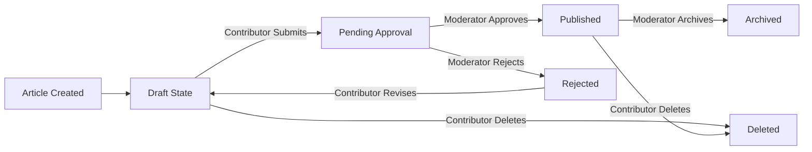

# Economic and Political Discussion Board - Complete Requirements Specification

## Table of Contents

1. [Service Overview](#service-overview)
2. [User Actors and Authentication](#user-actors-and-authentication)
3. [Article and Content Management](#article-and-content-management)
4. [Comments and Discussions](#comments-and-discussions)
5. [Search, Browsing, and Discovery](#search-browsing-and-discovery)
6. [Moderation and Content Policies](#moderation-and-content-policies)
7. [System Requirements and Constraints](#system-requirements-and-constraints)
8. [Complete Permission Matrix](#complete-permission-matrix)

---

## Service Overview

The Economic and Political Discussion Board is a community-driven platform designed to facilitate thoughtful, structured conversations about economic and political issues. Unlike algorithmic social media platforms that prioritize engagement metrics, this discussion board emphasizes quality discourse, factual discussion, and community-driven moderation.

### Service Vision and Purpose

THE service SHALL exist to create an organized, moderated environment where economic and political discussion can flourish without devolving into chaos or misinformation. THE primary purpose is to provide a dedicated space where community members can share insights, exchange perspectives, and engage in substantive discourse on topics that matter to them.

THE platform recognizes that economic and political topics are complex, multifaceted, and deserve platforms that encourage depth, nuance, and respectful engagement. BY providing tools for article creation, discussion, and community curation, THE platform empowers members to become both consumers and creators of meaningful content.

### Core Value Proposition

**Quality Over Quantity**: This platform prioritizes substantive conversation over algorithmic engagement metrics. Users can trust they are reading genuine discussion rather than automated content or engagement bait.

**Moderation for Safety, Not Censorship**: Clear community guidelines and active moderation remove harassment, spam, and misinformation while allowing space for diverse, even controversial viewpoints. Moderation focuses on maintaining discussion quality, not suppressing legitimate debate.

**Structured for Understanding**: Articles serve as focal points for discussion rather than infinite scrolls of conflicting opinions. Threading and organization help users follow arguments from beginning to end. Attachments support evidence-based discussion with data, research, and sources.

**Community Ownership**: Contributors can build reputation as thoughtful discussants. Their work—articles they create—persists and accumulates, creating value that benefits the entire community.

**Signal Over Noise**: Without algorithmic amplification of outrage and controversy, the platform naturally elevates substantive contributions. Good ideas can succeed based on merit rather than emotional manipulation.

### Target Users

**Economic and Political Enthusiasts**: Individuals interested in discussing economic policy, market trends, financial systems, political governance, and civic participation. This includes professionals in economics, finance, and policy fields, as well as students and academics studying related disciplines.

**Community Discussion Leaders**: Group organizers, non-profit organizations focused on civic engagement, think tanks, and educational institutions seeking structured platforms for member discussions and policy analysis.

**News and Analysis Consumers**: Users who want curated, moderated content free from misinformation and algorithmic manipulation, using the platform as a knowledge resource for understanding complex economic and political issues.

### Business Model

THE discussion board operates on a **community-focused, minimal-monetization model** designed to align platform incentives with user interests rather than advertiser interests. THE platform does NOT implement advertising or algorithmic feed manipulation. User data is never sold to advertisers or third parties.

**Primary Revenue Model**: Voluntary contributions from users who want to support platform operations. Contributions are completely optional—all features remain free to use. THE platform maintains transparent communication about hosting costs and operational needs.

**Optional Premium Tier**: A premium membership tier may be offered to users who want to support the platform, with features such as custom username badges or advanced search capabilities. Core functionality remains free and equal for all users.

**Sustainability**: THE platform achieves long-term sustainability through community support, operational efficiency, and minimal external dependencies. Decision-making prioritizes discussion quality over growth metrics or engagement maximization.

---

## User Actors and Authentication

### Authentication System Overview

THE discussion board uses JWT (JSON Web Token) based authentication to manage user sessions and permissions. THIS approach provides stateless authentication suitable for modern web applications with clear separation of user actor types.

#### Authentication Flow

WHEN a user attempts to log in with email and password credentials, THE system SHALL validate the username and password against stored records. IF credentials are valid, THE system SHALL return a JWT access token with 30-minute expiration and a refresh token with 7-day expiration. IF credentials are invalid, THE system SHALL reject the login attempt and display an error message without revealing whether the username or password is incorrect.

WHEN a user provides a valid JWT token in an API request, THE system SHALL verify the token signature and expiration time before processing the request. IF the token is expired or tampered with, THE system SHALL reject the request and prompt re-authentication.

WHEN a JWT access token expires after 30 minutes, THE system SHALL deny requests using that token. WHEN a user requests a new access token using a valid refresh token, THE system SHALL issue a new 30-minute access token without requiring re-login. IF the refresh token has expired after 7 days, THE system SHALL require re-authentication with email and password.

WHEN a user logs out, THE system SHALL invalidate their refresh token, requiring re-authentication for future requests. THE system SHALL immediately revoke all active sessions when a user changes their password.

#### JWT Token Structure

THE access token SHALL contain the following payload information:
- User ID (unique identifier)
- Username
- User actor type (guest, contributor, or moderator)
- Permissions array (list of allowed actions)
- Token issuance timestamp
- Token expiration timestamp (30 minutes from issuance)

THE refresh token SHALL contain:
- User ID
- Token type identifier (refresh token)
- Expiration timestamp (7 days from issuance)

### User Actor Definitions

THE discussion board supports three distinct user actors with hierarchical permission levels:

#### Guest Users (Unauthenticated)

**Capabilities:**
- View all published articles, comments, and discussions without authentication
- Search and browse articles by category, topic, or date
- View author information and comment threads on published articles

**Restrictions:**
- Cannot create articles, post comments, or upload files
- Cannot access moderator tools or administrative functions
- Cannot view draft or pending approval articles

WHEN a guest user attempts to perform restricted actions (create content, post comments), THE system SHALL display a message prompting them to create an account or log in. WHERE a guest attempts to access restricted content, THE system SHALL redirect to the login or registration page.

#### Contributors (Registered Members)

**Account Creation Requirements:**

WHEN a user registers as a contributor, THE system SHALL collect email address, password, and username. THE system SHALL validate that the email address is not already registered and follows standard email format (user@domain.com). THE system SHALL enforce password requirements: minimum 8 characters, at least one uppercase letter, one lowercase letter, one number, and one special character.

WHEN registration is successful, THE system SHALL send a verification email to the provided address. THE system SHALL not allow login or content creation from unverified accounts. WHEN the user clicks the verification link in the email (valid for 24 hours), THE system SHALL mark the account as verified and active. IF the verification link expires, THE system SHALL allow the user to request a new verification email.

**Article Creation and Management:**

WHEN a contributor creates an article, THE system SHALL accept a title (5-200 characters), content body (50-50,000 characters), category selection, and optional image/file attachments. THE contributor SHALL be able to upload up to 10 attachments per article, with each file limited to 5 MB for images and 10 MB for documents.

WHE the contributor submits an article, THE system SHALL place it in "pending approval" status and notify moderators for review. WHILE the article is pending approval, THE contributor SHALL be able to edit or delete their own article before it is published. IF a moderator approves the article, THE article SHALL become publicly visible to all users. IF a moderator rejects the article, THE system SHALL notify the contributor with feedback and allow them to revise and resubmit.

**Article Editing Rules:**

WHILE an article is in draft status, THE contributor who created it SHALL be able to edit the title, content, category, and attachments without restrictions. AFTER an article transitions to pending_approval status, THE contributor SHALL NOT be able to make edits until moderator provides feedback. IF a moderator rejects an article, THE contributor SHALL be able to edit the article and resubmit for approval. AFTER an article is published, THE contributor SHALL NOT be able to edit the title, content, or category; they can only add new attachments.

**Comment Permissions:**

WHEN a contributor posts a comment on a published article, THE system SHALL record the comment, author name, timestamp, and optional image attachments. THE contributor SHALL be able to edit their own comments within 24 hours of posting. THE contributor SHALL be able to delete their own comments at any time. THE contributor SHALL NOT be able to edit or delete comments posted by other users.

**Account Management:**

THE contributor SHALL be able to view and edit their profile information (username, bio, email address). THE contributor SHALL be able to change their password by providing the current password and entering a new password twice for confirmation. THE contributor SHALL be able to view a history of their published articles and comments.

WHEN a contributor requests password reset, THE system SHALL send a reset link via email that expires after 24 hours. WHEN the user follows the reset link, THE system SHALL display a form to enter a new password. THE system SHALL enforce the same password requirements for new passwords as for initial registration.

WHERE a contributor chooses to delete their account, THE system SHALL retain their authored articles and comments but mark them as from a deleted user account instead of displaying the original username.

#### Moderators (System Administrators)

**Authentication and Permissions:**

WHEN a moderator logs in with their credentials, THE system SHALL verify they have moderator-level permissions in the database. THE system SHALL issue a JWT token marked with moderator-level permissions in the token payload. WHILE a moderator is logged in, THE system SHALL provide access to moderation tools and administrative dashboards.

**Article Review Authorities:**

WHEN articles are submitted by contributors, THE system SHALL queue them for moderator review in the moderation dashboard. THE moderator SHALL be able to view pending articles with article title, author, content preview, and submitted attachments. THE moderator SHALL be able to read the full article content and review all attachments before making a decision.

WHEN the moderator reviews an article, THE moderator SHALL be able to approve it for publication, reject it with feedback, or request revisions. IF the moderator approves an article, THE system SHALL mark it as published and make it visible to all users. IF the moderator rejects an article, THE system SHALL notify the contributor with the moderator's feedback and return the article to draft status. THE moderator SHALL be able to create articles directly without moderation review (moderator-created articles are published immediately).

**Comment Moderation Authorities:**

WHEN users post comments, THE moderator SHALL be able to review all comments on the platform. WHEN a comment violates community guidelines, THE moderator SHALL be able to remove (delete) the comment. WHEN removing a comment, THE system SHALL record the action with moderator name and timestamp for audit purposes. THE moderator SHALL be able to leave a removal reason or notification for the comment author explaining why the comment was removed.

**User Management Authorities:**

THE moderator SHALL be able to view a list of all registered contributor accounts with creation date and activity status. THE moderator SHALL be able to disable or suspend contributor accounts that violate community guidelines. WHEN a contributor account is suspended, THE system SHALL prevent that user from logging in or creating new content. THE moderator SHALL be able to restore suspended accounts when appropriate. WHERE a contributor has repeatedly violated guidelines, THE moderator SHALL be able to permanently delete their account and all associated content.

### Permission Matrix

| Action | Guest | Contributor | Moderator |
|--------|-------|-------------|-----------|
| Browse published articles | ✅ | ✅ | ✅ |
| Search articles | ✅ | ✅ | ✅ |
| View comments | ✅ | ✅ | ✅ |
| Create account | ❌ | ✅ | ✅ |
| Log in | ❌ | ✅ | ✅ |
| Create article | ❌ | ✅ (pending approval) | ✅ (published immediately) |
| Edit own article | ❌ | ✅ (before approval) | ✅ |
| Delete own article | ❌ | ✅ (before approval) | ✅ |
| Post comment | ❌ | ✅ | ✅ |
| Edit own comment | ❌ | ✅ (within 24 hours) | ✅ |
| Delete own comment | ❌ | ✅ | ✅ |
| Upload attachments | ❌ | ✅ (articles & comments) | ✅ |
| Review pending articles | ❌ | ❌ | ✅ |
| Approve articles | ❌ | ❌ | ✅ |
| Reject articles | ❌ | ❌ | ✅ |
| Remove comments | ❌ | ❌ | ✅ |
| Suspend user accounts | ❌ | ❌ | ✅ |
| Delete user accounts | ❌ | ❌ | ✅ |
| View moderation dashboard | ❌ | ❌ | ✅ |
| Pin/feature articles | ❌ | ❌ | ✅ |
| Create announcements | ❌ | ❌ | ✅ |
| Edit any article | ❌ | ❌ | ✅ |
| Delete any comment | ❌ | ❌ | ✅ |

---

## Article and Content Management

### Article Structure and Properties

Each article in the system consists of the following properties:

| Property | Type | Required | Description |
|----------|------|----------|-------------|
| articleId | UUID | Yes | Unique identifier for the article, generated automatically |
| title | String | Yes | Article title, 5-200 characters, describing the main topic |
| content | String | Yes | Article body text, 50-50,000 characters, containing the discussion topic |
| authorId | UUID | Yes | User ID of the contributor who created the article |
| authorName | String | Yes | Display name of the author at time of creation |
| category | String | Yes | Topic category: "Economics", "Politics", "Policy", "Trade", "Markets", "Regulation", "International", "Analysis", "Opinion", "Other Discussion" |
| status | Enum | Yes | Current publication status: "draft", "pending_approval", "approved", "published", "rejected", "archived" |
| createdAt | DateTime | Yes | ISO 8601 timestamp when article was created |
| publishedAt | DateTime | No | ISO 8601 timestamp when article was published to public (null if not yet published) |
| updatedAt | DateTime | Yes | ISO 8601 timestamp of most recent modification |
| lastEditedBy | UUID | No | User ID of the person who last edited the article (if edited after initial creation) |
| approvedBy | UUID | No | Moderator ID who approved the article (null if not yet approved) |
| approvalNotes | String | No | Moderator feedback during approval process, max 1,000 characters |
| rejectionReason | String | No | Explanation if article was rejected, max 500 characters |
| viewCount | Integer | Yes | Number of times article has been viewed by users, starts at 0 |
| commentCount | Integer | Yes | Number of published comments on article, updated automatically |
| attachments | Array | Yes | List of attachment objects associated with article (empty array if no attachments) |
| isPinned | Boolean | Yes | Whether moderator has pinned article to top of listings (featured), defaults to false |
| isLocked | Boolean | Yes | Whether article is locked from further comments/modifications, defaults to false |

### Article Lifecycle and Publishing Workflow

Articles follow a defined lifecycle from creation through publication to archival:

**WHEN a contributor creates a new article, THE system SHALL initialize it in "draft" status with createdAt timestamp set to current time.**

**WHILE an article is in draft status, THE contributor who created it SHALL be able to edit the title, content, category, and attachments without restrictions.**

**WHEN a contributor submits a draft article for moderation, THE system SHALL transition the article to "pending_approval" status and notify all moderators of the submission.**

**WHEN a moderator reviews a pending article and approves it, THE system SHALL transition the article to "published" status, record the moderator ID in approvedBy field, capture current timestamp in publishedAt, and make the article immediately visible.**

**WHEN a moderator reviews a pending article and rejects it, THE system SHALL transition the article to "rejected" status, record the rejection reason in rejectionReason field (max 500 characters), and notify the contributor with explanation.**

**WHILE an article is in rejected status, THE contributor who created it SHALL be able to edit and resubmit the article for re-review.**

**WHEN a moderator pins an article, THE system SHALL set isPinned to true, causing it to appear at the top of article listings and search results.**

**WHEN a moderator locks an article, THE system SHALL set isLocked to true, preventing new comments from being posted while allowing existing comments and the article itself to remain visible.**

**WHEN a moderator archives an article, THE system SHALL transition it to "archived" status, removing it from normal browsing but keeping it searchable and viewable by direct link.**

### Article Content Validation

**WHEN a contributor submits an article for creation or editing, THE system SHALL validate that title is between 5 and 200 characters.**

**IF the title is outside this range, THEN THE system SHALL reject submission and display error "Title must be between 5 and 200 characters".**

**WHEN a contributor submits article content, THE system SHALL validate that content is between 50 and 50,000 characters.**

**IF the content is outside this range, THEN THE system SHALL reject submission and display error "Article content must be between 50 and 50,000 characters".**

**THE system SHALL require that category field contains a valid category value from the predefined list.**

**IF a contributor attempts to set an invalid category, THEN THE system SHALL reject and return error with list of valid categories: "Economics", "Politics", "Policy", "Trade", "Markets", "Regulation", "International", "Analysis", "Opinion", "Other Discussion".**

### Article Attachments

**Supported File Types and Limits:**

- **Images**: JPG/JPEG, PNG, GIF, WebP formats, maximum 5 MB per image
- **Documents**: PDF, DOC, DOCX, TXT, XLS, XLSX formats, maximum 10 MB per document
- **Maximum attachments**: 10 files per article

**WHEN a contributor uploads an attachment, THE system SHALL validate the file type, file size, and scan for malicious content before accepting the upload.**

**IF an uploaded file exceeds size limits, THEN THE system SHALL reject the upload and display error message specifying the limit.**

**IF an uploaded file has unsupported format, THEN THE system SHALL reject the upload and display list of supported formats.**

**THE system SHALL store each attachment with a unique identifier separate from the original filename.**

**WHEN an attachment is uploaded, THE system SHALL generate a descriptive display name from the original filename while storing the file with a UUID-based identifier.**

**THE contributor who created the article SHALL be able to delete attachments from the article at any time while the article is in draft or pending_approval status.**

**AFTER an article is published, THE system SHALL prevent deletion of existing attachments but SHALL allow contributors to add new attachments.**

**THE system SHALL display attachment list in the order they were uploaded.**

Each attachment object contains:
- attachmentId: UUID (unique identifier)
- originalFileName: String (user-visible name, 1-255 characters)
- fileType: String (file extension: jpg, png, pdf, docx, etc.)
- fileSize: Integer (size in bytes)
- uploadedAt: DateTime (ISO 8601 timestamp)
- uploadedBy: UUID (ID of contributor who uploaded the file)
- mimeType: String (MIME type for proper display: image/jpeg, application/pdf, etc.)
- displayUrl: String (URL path for accessing or displaying the attachment)

### Content Moderation and Approval

**WHEN an article is submitted, THE system SHALL create an entry in the moderation queue with timestamp and contributor details.**

**WHILE articles are pending approval, ONLY the original contributor and all moderators SHALL be able to view the article.**

**THE system SHALL display all pending articles to moderators in chronological order of submission (oldest first) on the moderation dashboard.**

**WHEN a moderator opens an article for review, THE system SHALL record the moderator ID and timestamp of review initiation in the system log.**

**THE moderator SHALL review article content for compliance with community guidelines and appropriateness for economic/political discussion.**

**WHEN a moderator approves an article, THE system SHALL record approvedBy field with moderator ID, set approvalNotes field if provided (max 1,000 characters), and automatically transition article to published status.**

**WHEN a moderator rejects an article, THE system SHALL transition article to rejected status, set rejectionReason field with explanation (max 500 characters), and send rejection notice to contributor with reason.**

**THE rejection notice to contributor SHALL include clear explanation of why article was rejected and guidance on how to address issues for resubmission.**

**IF a moderator provides approvalNotes, THEN THE system SHALL make these notes visible to the contributor and other moderators on the article's detail page.**

**THE system SHALL track all moderation actions (approval, rejection, editing, deletion, pinning, locking) with moderator ID and timestamp in an audit log.**

### Article Visibility and Access Control

**WHEN a guest user browses the discussion board, THEY SHALL only see articles with status "published".**

**WHEN a contributor browses articles, THEY SHALL see all published articles PLUS any draft or pending_approval articles authored by themselves.**

**WHEN a contributor creates an article, THEY SHALL be able to view their own article in draft status immediately after creation.**

**WHEN a moderator browses the discussion board, THEY SHALL see all articles regardless of status (published, draft, pending_approval, rejected, archived, deleted).**

**WHEN a moderator accesses an article detail page, THEY SHALL see full audit trail including creation time, modification history, approval status, and moderator actions.**

**ARCHIVED articles SHALL not appear in standard article listings but SHALL be searchable and viewable by direct link.**

**DELETED articles SHALL only be visible to moderators in the audit view and NOT visible to contributors or guests.**

**IF a guest user attempts to directly access a draft, pending_approval, or rejected article by URL, THEN THE system SHALL deny access and show HTTP 403 Forbidden error.**

**IF a contributor attempts to directly access another contributor's draft article, THEN THE system SHALL deny access and show HTTP 403 Forbidden error.**

**IF a contributor attempts to directly access a pending_approval article not created by themselves, THEN THE system SHALL deny access and show HTTP 403 Forbidden error.**

**MODERATORS SHALL be able to directly access any article regardless of status or authorship.**

### Article Deletion Rules

**WHEN a contributor deletes a draft article, THE system SHALL mark article as deleted and remove it from all listings (only visible to moderators in audit view).**

**IF a contributor attempts to delete an article in pending_approval status, THEN THE system SHALL allow deletion and mark as deleted status.**

**IF a contributor attempts to delete a published article, THEN THE system SHALL deny deletion and return error message "Published articles cannot be deleted by contributors".**

**MODERATORS SHALL be able to delete any article regardless of status.**

**WHEN a moderator deletes an article, THE system SHALL mark it as deleted, record moderator ID and timestamp in audit log, and remove from all public listings.**

**DELETED articles SHALL NOT be permanently removed from database but retained for audit trail and compliance purposes.**

---

## Comments and Discussions

### Comment System Overview

THE comment system enables registered contributors to engage in threaded conversations on published articles. Comments form the core interaction mechanism for the community, enabling contributors to share perspectives, ask questions, and respond to other community members.

**WHEN a comment is posted on an article, THE system SHALL associate that comment with the article and its author, creating a permanent record of the discussion.**

**THE system SHALL display comments organized by article, showing the discussion thread in chronological order (oldest to newest, with options to sort by newest first).**

### Comment Creation and Validation

**WHEN a contributor submits a comment on a published article, THE system SHALL validate the comment before acceptance.**

**THE system SHALL require comments to contain at least 1 character and not exceed 5,000 characters in length.**

**IF a contributor attempts to post a comment containing only whitespace (spaces, tabs, newlines), THEN THE system SHALL reject the submission and display a validation error.**

**WHEN a guest (unauthenticated user) attempts to post a comment, THE system SHALL deny the action and display a message indicating that authentication is required to participate in discussions.**

**WHEN a contributor attempts to comment on an article that has not yet been approved by moderators, THE system SHALL deny the action since the article is not yet publicly visible.**

**WHEN a contributor submits a comment on a published article, THE system SHALL immediately display the new comment in the discussion thread (with the contributor's name and timestamp) without requiring approval.**

**THE system SHALL not allow comments to remain in a "pending approval" state - comments are either visible or rejected immediately.**

### Comment Editing and Deletion

**THE contributor who authored a comment SHALL be able to edit their own comment within 24 hours of creation.**

**WHEN a contributor edits their comment within the allowed timeframe, THE system SHALL update the comment text and record the last edited timestamp.**

**IF a contributor attempts to edit a comment more than 24 hours after creation, THEN THE system SHALL deny the edit request and display a message indicating the editing window has closed.**

**THE system SHALL display an "edited" indicator (such as "Last edited [timestamp]") for comments that have been modified after creation.**

**THE contributor who authored a comment SHALL be able to delete their own comment at any time.**

**WHEN a contributor deletes their own comment, THE system SHALL remove the comment from display and prevent its content from being retrieved.**

**THE system SHALL display a placeholder message (such as "[Comment deleted by author]") where the deleted comment existed, allowing the discussion thread to remain coherent and preserving conversation context.**

**WHEN a moderator deletes a comment, THE system SHALL remove the comment from display and record the deletion action in moderation logs.**

### Comment Threading Structure

**THE system SHALL support simple one-level comment threading where contributors can reply directly to an article or to other comments.**

**WHEN a contributor posts a reply to an existing comment, THE system SHALL record the parent-child relationship and display the reply nested under its parent comment.**

**THE system SHALL not support deeper nesting than one level - replies to replies are not allowed; all secondary responses must reply to the original article.**

**WHEN displaying comments, THE system SHALL show the main comment (top-level) followed by any direct replies nested and indented beneath it, then display the next main comment.**

**THE system SHALL display comments in the thread in chronological order within their nesting level (oldest first by default, with option to reverse).**

**WHEN a parent comment is deleted, THE system SHALL maintain any replies to that comment but update the reply display to indicate the parent is no longer available.**

**THE system SHALL calculate and display the total number of comments (including nested replies) for each article.**

**WHEN loading an article, THE system SHALL display the comment count prominently so contributors can see how active a discussion is.**

### Comment Visibility and Access Control

**WHEN an article is in draft or pending approval status, THE system SHALL not display any comments on that article to guests or the general public.**

**ONLY THE article author and moderators SHALL be able to view comments on unpublished articles.**

**WHEN an article is published and approved, THE system SHALL display all approved comments to all users (guests and contributors).**

**THE system SHALL prevent contributors from posting comments on unpublished articles to keep discussions focused on public content.**

**WHEN a guest views a published article, THE system SHALL display all published comments in the discussion thread.**

**WHEN a guest attempts to post a comment, THE system SHALL display a prompt to log in or create an account before allowing participation.**

**THE system SHALL not restrict reading or browsing of comments to guests - read access is public.**

### Comment Display and Pagination

**THE system SHALL display comments incrementally (pagination) loading 10 comments per "page" to ensure article pages load quickly even with many comments.**

**WHEN a user navigates between comment pages, THE system SHALL load the next page of content within 2 seconds.**

**THE system SHALL display the parent comment text above a reply to maintain discussion context.**

**WHEN a contributor is reading a reply to a comment, THE system SHALL show a collapsed or partial view of the parent comment so they understand what is being discussed.**

**THE system SHALL display the contributor's username and user profile link above each comment.**

**THE system SHALL display the creation timestamp for each comment (for example, "Posted 2 hours ago" or "Posted on November 18, 2025 at 2:30 PM").**

**WHEN a contributor views their own comment, THE system SHALL display an indicator that this comment is theirs (such as "(You)" next to their name).**

---

## Search, Browsing, and Discovery

### Default Article Display and Browsing

**WHEN a user visits the discussion board, THE system SHALL display a chronological list of published articles as the primary discovery method. THE most recently published articles appear first, followed by older articles in descending date order.**

**THE system SHALL display each article in the list with the following information:**
- Article title
- Author name
- Publication date and time
- Brief excerpt or first 200 characters of the article content
- Category or topic tag
- Number of comments
- Thumbnail preview if the article includes an image attachment

**WHEN the article list contains more than 20 articles, THE system SHALL divide the list into pages of 20 articles per page.**

**THE system SHALL display navigation controls allowing users to:**
- Move to the next page
- Move to the previous page
- Jump to a specific page number
- Display the total number of articles available

**WHEN a user is browsing articles, THE system SHALL load pages quickly, ideally completing full page loads within 2 seconds for typical network conditions.**

### Article Visibility in Browsing

**WHEN a guest user browses articles, THE system SHALL display only published articles that have completed moderator approval. Draft articles and unpublished content must remain invisible to guests.**

**WHEN a contributor browses articles, THE system SHALL display all published articles plus any draft or pending articles created by that specific contributor. Contributors cannot see draft articles created by other contributors.**

**WHEN a moderator browses articles, THE system SHALL display all articles including published, draft, pending approval, and archived articles. Moderators have full visibility into the content lifecycle.**

### Search Functionality

**THE discussion board SHALL provide a search feature accessible from every page of the application.**

**WHEN a user enters search terms, THE system SHALL search across both article titles and article content for matching results.**

**THE system SHALL return search results within 1 second for typical queries containing 1-3 words.**

**WHEN search results are displayed, THE system SHALL show results in order of relevance with matching titles appearing before content-only matches.**

Each search result SHALL display:
- Article title (with search terms highlighted)
- Author name
- Publication date
- Relevance indicator or score
- Brief excerpt showing context around matched search terms (if found in content)
- Number of comments

**WHEN search results contain more than 20 matching articles, THE system SHALL paginate the results in pages of 20, using the same pagination controls as the article browsing list.**

**WHEN a user searches for multiple words, THE system SHALL return articles containing ALL the search terms (AND logic), not articles with any of the terms.**

**IF a search query returns zero results, THE system SHALL display a message indicating no articles match the search terms and suggest browsing by category instead.**

### Article Categories and Organization

Articles SHALL be organized into the following categories:

- **Economic Discussion**: Articles about economics, markets, business, trade, monetary policy, and economic systems
- **Political Discussion**: Articles about politics, government, policy, elections, and political systems
- **Geopolitical Affairs**: Articles about international relations, regional conflicts, trade relationships, and global political events
- **Policy Analysis**: In-depth analysis of specific economic or political policies
- **Market Commentary**: Discussion of economic conditions, industry trends, and market dynamics
- **General Discussion**: Miscellaneous articles relevant to economics and politics that don't fit neatly into other categories

**WHEN a contributor creates a new article, THE system SHALL require the contributor to select exactly one category for the article. Articles cannot exist without a category assignment.**

**WHEN a user selects a category, THE system SHALL display only articles within that category in chronological order (newest first). The category view functions identically to the main article list, but filtered to show only articles from the selected category.**

**THE system SHALL display the category name prominently at the top of the results page to indicate the current filter.**

**THE system SHALL display all available categories in a navigation menu or sidebar, accessible from the main page and article listing pages.**

**WHEN a user is in a category view, THE system SHALL highlight the current category in the navigation menu to show which category is being viewed.**

### Sorting and Filtering Options

**THE system SHALL provide the following sorting options for article lists and search results:**

- **Newest First** (default): Articles sorted by publication date in descending order, with most recent articles appearing first
- **Oldest First**: Articles sorted by publication date in ascending order, showing oldest articles first
- **Most Commented**: Articles sorted by number of comments in descending order, showing most-discussed articles first
- **Least Commented**: Articles sorted by number of comments in ascending order, showing least-discussed articles first

**WHEN a user is on any article listing page (main list, category view, or search results), THE system SHALL display sort order controls allowing quick switching between these options.**

**THE system SHALL remember the user's last selected sort order and apply it to subsequent page views during the same browsing session.**

**WHEN a user applies a category filter, THE system SHALL display only articles belonging to that category.**

**THE system SHALL allow users to clear category filters and return to viewing all articles.**

**WHERE the user combines a category filter with search results, THE system SHALL show articles matching the search terms that also belong to the selected category (AND logic for filters).**

**WHEN a user selects a date range filter, THE system SHALL display only articles published within that specified date range (inclusive of start and end dates).**

**THE system SHALL provide preset date range options for convenience:**
- Last 7 days
- Last 30 days
- Last 3 months
- Last year
- All time (no filter)

**THE system SHALL also allow users to specify custom start and end dates for date range filtering.**

**WHERE a user applies multiple filters simultaneously (for example, category + date range + sort order), THE system SHALL apply all filters together using AND logic, showing only articles that match all specified criteria.**

**WHEN multiple filters are active, THE system SHALL display a list of applied filters and allow users to remove individual filters or clear all filters at once.**

### Performance and System Behavior

**THE system SHALL ensure article browsing pages load completely within 3 seconds on typical broadband connections.**

**THE system SHALL ensure search queries complete within 1 second for typical queries (1-3 words).**

**WHILE a user is on a search results page or article list, THE system SHALL maintain accurate article counts and pagination, reflecting the current filtered view.**

**WHEN a contributor submits an article for publication and a moderator approves it, THE system SHALL make the article immediately visible to all users (guests, contributors, and other moderators) within 5 seconds of approval.**

**WHEN a moderator removes or archives an article, THE system SHALL remove it from all browsing and search results within 5 seconds, ensuring it is no longer discoverable by regular users.**

---

## Moderation and Content Policies

### Moderation Responsibilities and Workflow

**THE moderator actor SHALL have full authority to review all submitted articles before they become publicly visible. THE moderator actor SHALL have the ability to approve articles for publication, reject articles with feedback, edit article content if necessary, and remove published articles that violate community standards.**

**THE moderator actor SHALL act as the primary guardian of platform quality and community safety. Moderators are expected to make fair, consistent, and timely decisions regarding content publication and community management.**

THE moderation system SHALL support the following core responsibilities:

1. **Article Review and Approval**: Evaluating all newly submitted articles against content guidelines before allowing publication
2. **Content Monitoring**: Reviewing comments and user-generated content for violations
3. **Violation Enforcement**: Removing or editing inappropriate content and taking action against violating users
4. **User Management**: Managing contributor accounts, issuing warnings, and restricting access when necessary
5. **Community Communication**: Communicating moderation decisions to affected users with clear explanations

### Article Review Process

THE article publishing process SHALL follow this sequence:

1. **Submission**: A contributor submits an article with title, content, and optional attachments
2. **Pending Review**: THE system SHALL place the article in a pending review state, making it invisible to guests and other contributors
3. **Moderator Review**: A moderator reviews the submitted article within the review timeframe
4. **Decision**: THE moderator SHALL either approve the article for publication or reject it with feedback
5. **Publication or Revision**: If approved, THE system SHALL make the article publicly visible; if rejected, THE contributor receives feedback and can revise and resubmit
6. **Published State**: Published articles are visible to all users (guests, contributors, moderators)

**WHEN an article is submitted, THE system SHALL mark it with a submission timestamp. THE moderator SHALL review and make a decision on the article within two business days of submission. IF a moderator does not act within two business days, THE system SHALL flag the article for review priority.**

### Approval Criteria

**THE moderator SHALL approve an article if it meets ALL of the following criteria:**

- **On-Topic**: The article focuses on economic or political discussion, debate, analysis, or news
- **Civil Tone**: The article does not contain personal attacks, hate speech, or extreme inflammatory language toward individuals or groups
- **Factual Basis**: The article presents information, analysis, or opinions grounded in fact or clearly identified as opinion/analysis
- **Complete Content**: The article has a meaningful title and body content of reasonable length (minimum 100 characters)
- **Proper Attachments**: Any attached images or files are relevant to the article and do not contain prohibited content
- **No Spam**: The article is not promotional, advertising, or commercial spam

### Rejection and Feedback

**WHEN an article is rejected, THE system SHALL provide the contributor with specific feedback explaining why the article does not meet approval criteria. THE contributor SHALL be able to view rejection reasons and resubmit a revised version of the article.**

**IF an article is rejected, THE moderator SHALL provide feedback within the rejection message explaining the specific guideline(s) that were not met. THE contributor can revise the article and resubmit for review.**

**THE moderator actor SHALL be able to send a message or notification to the contributor explaining the rejection reason. THE notification SHALL be clear, specific, and constructive, helping the contributor understand what needs to be changed for approval.**

### Content Guidelines

**THE following topics are explicitly permitted for discussion:**

- Economic Policy: taxation, labor policy, trade, regulation, fiscal policy, monetary policy, and economic systems
- Political Governance: government structure, elections, laws, political philosophy, political parties, and governance approaches
- Market Discussion: economic conditions, industry trends, business policy, and market dynamics
- Social Policy: social programs, healthcare policy, education policy, welfare, and related economic/political topics
- International Affairs: international relations, trade, geopolitics, and global economic/political issues
- Data and Analysis: economic data, research, statistics, and analytical perspectives on economic/political topics

**THE following content types are NOT permitted on the discussion board:**

- **Hate Speech**: Content that attacks individuals or groups based on race, ethnicity, religion, gender, sexual orientation, disability, or national origin
- **Personal Attacks**: Ad hominem attacks on individuals, including other users, public figures, or groups (criticism of ideas, policies, or public statements is allowed)
- **Misinformation**: Deliberate spreading of false information known to be false or presented without any factual basis
- **Harassment or Threats**: Threats of violence, harassment campaigns, doxxing, or calls for violence against individuals or groups
- **Commercial Spam**: Promotional content, advertisements, product pitches, or commercial solicitation unrelated to discussion
- **Explicit or Graphic Content**: Pornographic, sexually explicit, or extremely graphic violent content
- **Off-Topic Content**: Content that has no connection to economic or political discussion (sports, entertainment, personal life stories, etc.)
- **Platform Abuse**: Attempts to manipulate the system, spam, automated posting, or other technical abuse

### Community Standards for Civil Discourse

**THE community is expected to maintain standards for respectful discussion of disagreements:**

- **Respectful Disagreement**: Users may strongly disagree on policy, analysis, or conclusions but must do so without personal attacks or insults
- **Evidence and Reasoning**: Claims should be grounded in evidence, data, or clear reasoning; assertions without support should be labeled as opinion
- **Good Faith Discussion**: Users should engage with the strongest version of opposing arguments rather than strawman arguments
- **No Harassment**: Users must not target others with repeated hostile engagement, mocking, or campaign-style behavior
- **Distinction Between Policy and People**: Criticism of policies, decisions, or public statements is acceptable; attacks on the person are not

### Violation Detection and Handling

**THE moderator actor SHALL actively monitor published content for violations of the content guidelines. WHEN a violation is detected, THE moderator SHALL review the specific violation and determine the appropriate action.**

**IF a user or contributor reports a potential violation, THE moderator SHALL review the reported content and make a determination. THE system SHALL provide contributors and guests with a mechanism to report problematic content to moderators.**

**WHEN content is determined to violate guidelines, THE moderator SHALL have the authority to remove the content entirely or edit the content to bring it into compliance. THE moderator SHALL document the reason for removal or editing.**

**IF an article is removed due to violation, THE article SHALL no longer appear in public listings or searches. THE contributor SHALL be notified that the article was removed and the specific reason why.**

**IF a comment is removed, THE comment SHALL no longer appear in the discussion thread. THE original author SHALL be notified of the removal and the reason.**

### Severity Levels and User Actions

**THE following violation severity levels guide moderator response:**

**Minor Violations**: Small issues that can be corrected with minimal impact
- Examples: Minor off-topic comments, slightly inflammatory language that can be edited, small factual corrections needed
- Moderator Action: Edit the content, add a note explaining the edit, send a gentle warning to the user

**Moderate Violations**: Clear violations that require removal but first-time offenses
- Examples: Personal attacks, clear misinformation presented as fact, first instance of harassment, clear spam
- Moderator Action: Remove the content, send a warning message explaining the violation and guidelines

**Severe Violations**: Serious violations or repeated offenses
- Examples: Hate speech, threats, second or subsequent violation by the same user, coordinated harassment
- Moderator Action: Remove content, restrict user account, issue formal warning about account suspension risk

**WHEN content is removed or edited due to violation, THE system SHALL send a notification to the user explaining:**
- What content was removed or edited
- Which specific guideline was violated
- The exact violation reason
- What needs to change for future content to be acceptable

**THE notification SHALL be clear and constructive, helping the user understand the standard they failed to meet.**

### Appeal Process

**THE contributor or commenter SHALL have the ability to appeal a moderation decision if they believe it was made in error. THE appeal SHALL be submitted to moderators with an explanation of why the decision should be reconsidered.**

**THE moderator or a different moderator SHALL review the appeal within one business day. THE moderator SHALL respond with a decision upholding or reversing the original decision, with explanation.**

### User Warnings and Account Restrictions

**THE moderator SHALL have the ability to issue warnings to contributors who violate guidelines. THE first violation typically results in a warning and explanation. Subsequent violations result in increasing restrictions.**

Violation tracking follows this progression:
- **First Violation**: Warning message with guideline explanation
- **Second Violation within 30 days**: Warning and 3-day posting restriction (cannot submit new articles)
- **Third Violation within 30 days**: Warning and 7-day posting restriction
- **Fourth Violation within 30 days or pattern of violations**: Account suspension review

**IF a contributor repeatedly violates guidelines or commits severe violations (hate speech, threats, harassment), THE moderator SHALL have the authority to temporarily suspend the contributor's account.**

**WHEN an account is suspended, THE contributor cannot post new articles or comments during the suspension period. THE contributor SHALL be notified of the suspension duration and reason. Suspension periods are:**
- First suspension: 7 days
- Second suspension: 30 days
- Third suspension: Permanent account ban

**THE system SHALL track violation history for each contributor, recording:**
- Date and time of each violation
- Type of violation (what guideline was broken)
- Content that was violated
- Moderator action taken
- Whether it was the user's first, second, or subsequent violation

**THIS history SHALL inform moderator decisions about escalation and account restrictions.**

### Moderation Dashboard

**THE moderation system SHALL provide moderators with:**

- **Pending Articles Queue**: A list of all articles awaiting review, sorted by submission date with oldest first
- **Violation Alerts**: Notifications of reported or detected violations requiring moderator review
- **User Violation History**: Access to complete violation record for any contributor
- **Moderation Actions Log**: Record of all moderator decisions (approvals, rejections, removals, restrictions)
- **Quick Actions**: Ability to approve/reject articles, remove comments, issue warnings, and restrict accounts from a simple interface

---

## System Requirements and Constraints

### Performance Expectations

**Response Time Requirements:**

- **WHEN a guest or contributor loads the homepage or article list, THE system SHALL display the initial page content within 2 seconds.**
- **WHEN a user searches for articles by keyword or category, THE system SHALL return and display search results within 3 seconds.**
- **WHEN a user opens an article with comments, THE system SHALL load the full article and display the first page of comments within 3 seconds.**
- **WHEN a user submits a new article or comment, THE system SHALL confirm successful submission within 2 seconds.**
- **WHEN a user uploads an image or file attachment, THE system SHALL complete the upload and display confirmation within 10 seconds for files up to 10 MB.**

**Page Load and Rendering:**

- **THE system SHALL paginate article listings showing 20 articles per page, ordered by creation date (newest first).**
- **THE system SHALL paginate comments showing 10 comments per page, ordered by creation date (oldest first) to maintain discussion thread continuity.**
- **WHEN a user navigates between pages, THE system SHALL load the next page of content within 2 seconds.**

**Search Performance:**

- **THE system SHALL support full-text search across article titles, content, and descriptions, returning results within 3 seconds even with 50,000+ articles.**
- **THE system SHALL support filtering by category/topic and moderator approval status (for moderators only) with instantaneous filter application.**

### Reliability and Availability

**System Uptime:**

- **THE system SHALL maintain 99.5% availability over any 30-day period, accounting for scheduled maintenance windows.**
- **THE system SHALL schedule planned maintenance during off-peak hours (2:00 AM - 4:00 AM in the service timezone) and SHALL notify users 48 hours in advance of any maintenance requiring downtime exceeding 1 hour.**

**Data Integrity and Backup:**

- **THE system SHALL create daily automated backups of all user data, articles, comments, and metadata.**
- **THE system SHALL retain backup copies for a minimum of 30 days, enabling recovery of deleted content within that timeframe.**
- **THE system SHALL validate backup integrity at least weekly by performing test restoration procedures.**
- **THE system SHALL maintain transaction consistency ensuring that article submissions, comment posts, and attachment uploads either complete fully or roll back entirely with no partial writes.**

**Error Handling and Recovery:**

- **IF a database operation fails, THE system SHALL automatically retry the operation up to 3 times before returning an error to the user.**
- **IF a file upload fails partway through, THE system SHALL allow the user to resume the upload from the point of failure rather than restarting completely.**
- **IF the system experiences an unexpected error while processing a user request, THE system SHALL log the error with sufficient detail for debugging and SHALL display a user-friendly error message to the user explaining the issue and suggesting next steps.**
- **WHEN the system detects a critical error affecting all users (database unavailable, file storage unreachable), THE system SHALL gracefully display a maintenance page informing users of the issue and estimated resolution time.**

### Security and Data Protection

**User Data Protection:**

- **THE system SHALL store all passwords using industry-standard bcrypt hashing with a minimum of 12 salt rounds, never storing passwords in plaintext or reversible encryption.**
- **THE system SHALL encrypt all user email addresses in the database using AES-256 encryption to prevent unauthorized disclosure.**
- **THE system SHALL never transmit sensitive user data (passwords, email addresses, IP addresses) in URLs, query parameters, or unencrypted cookies.**
- **THE system SHALL implement HTTPS/TLS encryption for all communications between clients and servers, with TLS version 1.2 or higher required.**
- **THE system SHALL set all authentication and session cookies with the Secure flag (HTTPS only) and HttpOnly flag (inaccessible to JavaScript), preventing XSS attacks from stealing session tokens.**

**Authentication Security:**

- **WHEN a user logs in with email and password, THE system SHALL validate credentials against stored hashes and deny access if either credential is incorrect, without revealing which credential failed.**
- **WHEN a user enters an incorrect password more than 5 times within 15 minutes, THE system SHALL temporarily lock the account for 15 minutes and SHALL notify the user of the lockout.**
- **WHEN a user logs in successfully, THE system SHALL generate a JWT (JSON Web Token) access token with a 15-minute expiration time and a separate refresh token with a 7-day expiration time.**
- **THE system SHALL revoke all active sessions immediately when a user changes their password.**
- **THE system SHALL implement CSRF (Cross-Site Request Forgery) protection for all state-changing operations (creating articles, posting comments, uploading files) by requiring CSRF tokens on all POST/PUT/DELETE requests.**

**File Security:**

- **WHEN a user uploads an attachment, THE system SHALL validate the file type by inspecting the file's magic bytes (binary signature), not relying solely on file extension, to prevent upload of executable files disguised with benign extensions.**
- **THE system SHALL maintain a whitelist of allowed file types: common image formats (JPG, PNG, GIF, WebP), and common document formats (PDF, DOCX, XLSX, TXT, CSV, ZIP).**
- **IF a user attempts to upload a file type not on the whitelist, THE system SHALL reject the upload and clearly explain which file types are permitted.**
- **THE system SHALL scan all uploaded files using a malware/virus detection service (or equivalent) before making them available for download.**
- **IF a file is detected as malicious, THE system SHALL immediately delete the file, notify the moderators, and prevent the user from re-uploading the same file.**
- **THE system SHALL store uploaded files outside the web root directory, serving them through a download handler that applies appropriate MIME type headers, preventing direct execution of code files.**
- **THE system SHALL prevent directory traversal attacks by sanitizing all file names, removing path separators and special characters, and storing files in flat directory structures.**

**Content Security:**

- **THE system SHALL sanitize all user-generated content (article text, comments) to remove HTML/JavaScript code that could enable XSS attacks, while preserving basic formatting (bold, italic, links).**
- **THE system SHALL validate that all URLs in articles and comments point to legitimate external sites, rejecting javascript: protocol links and data: URIs.**

### File and Storage Management

**Attachment Specifications:**

- **THE system SHALL support attaching up to 10 files per article and up to 3 files per comment.**
- **THE system SHALL allow image files (JPG, PNG, GIF, WebP) up to 5 MB each and other document files up to 10 MB each.**
- **WHEN a user uploads an image file larger than 5 MB, THE system SHALL reject the upload and explain the size limit.**
- **WHEN a user uploads a non-image file larger than 10 MB, THE system SHALL reject the upload and explain the size limit.**
- **THE system SHALL generate thumbnail previews for all image attachments, displaying the thumbnail in the article/comment view with a link to download the full resolution image.**

**Storage Management:**

- **THE system SHALL store all uploaded files on a dedicated file storage system separate from the primary application database (e.g., cloud object storage like AWS S3, Azure Blob Storage, or similar).**
- **THE system SHALL maintain unique file identifiers (UUID or hash) for all uploads, preventing filename collisions and enabling tracking of file versions.**
- **THE system SHALL record metadata for each uploaded file including: original filename, upload date, file size, file type, uploader user ID, and parent article/comment ID.**

**File Cleanup and Retention:**

- **WHEN an article is deleted by its creator or a moderator, THE system SHALL delete all attachments associated with that article.**
- **WHEN a comment is deleted, THE system SHALL delete all attachments associated with that comment.**
- **THE system SHALL implement a cleanup process that runs weekly to identify and remove orphaned files (files whose parent article/comment no longer exists).**
- **THE system SHALL retain deleted files in an archive for 30 days before permanent deletion, enabling recovery if deletion was accidental.**

### Scalability Considerations

**Expected Growth:**

- **THE system SHALL be designed to support growth to 10,000 registered contributors and 100,000 monthly active users over the first 2 years of operation.**
- **THE system SHALL be designed to handle 500,000 articles and 2,000,000 comments at target scale.**
- **THE system SHALL be designed to accommodate 50 GB of total file attachments at target scale.**

**Concurrent User Handling:**

- **THE system SHALL maintain performance (meeting response time requirements in Section 1) while handling 500 concurrent users performing simultaneous actions (browsing, posting, uploading).**
- **THE system SHALL gracefully handle traffic spikes up to 1,000 concurrent users without service interruption, though response times may degrade during peak loads.**

**Database and Performance Optimization:**

- **THE system SHALL use an SQL database with proper indexing on frequently-queried columns (user ID, article creation date, approval status, category) to maintain query performance as data grows.**
- **THE system SHALL implement query pagination to prevent loading entire result sets into memory, enabling efficient browsing of large datasets.**
- **WHILE the database approaches capacity limits, THE system AND development team SHALL implement read replicas and connection pooling to distribute query load before hitting absolute database limits.**
- **THE system architecture SHALL allow deploying multiple application server instances behind a load balancer, enabling distribution of traffic across servers for horizontal scaling.**
- **THE system SHALL store all session data and caching in a shared service (Redis or similar) rather than application memory, enabling seamless addition of new server instances.**

### Technical Implementation Standards

**Development Stack:**

- **THE system backend SHALL be developed in TypeScript + NestJS + Prisma ORM as specified by the development platform, ensuring type safety, maintainability, and rapid development.**
- **THE system SHALL use Docker containers for consistent development and production environments, enabling reliable deployment across infrastructure types.**
- **THE system SHALL be deployable on standard cloud infrastructure (AWS, Google Cloud, Azure, or similar) or on-premises servers, without dependency on proprietary or specialized platforms.**

**API Standards:**

- **THE system SHALL expose a JSON REST API with clear documentation (OpenAPI/Swagger specification) to enable future mobile application development and third-party integrations.**

**Browser Compatibility:**

- **THE system SHALL function correctly in all modern browsers released within the past 3 years, including Chrome, Firefox, Safari, and Edge (latest versions).**
- **THE system SHALL gracefully degrade functionality in older browsers (Internet Explorer 11 and earlier), displaying a compatibility notice but not breaking core functionality.**
- **THE system SHALL be responsive and usable on mobile devices (phones and tablets) with screen widths as small as 320 pixels.**

### Monitoring and Operations

**System Logging and Audit:**

- **THE system SHALL log all authentication attempts (successful and failed), all data modifications, and all errors with sufficient detail (timestamp, user ID, action, parameters, result) for debugging and security audits.**
- **THE system SHALL aggregate logs in a centralized location, enabling moderators and administrators to review system events and troubleshoot issues.**
- **THE system SHALL implement health checks on critical services (database, file storage, authentication) and alert administrators if any service becomes unavailable.**
- **THE system SHALL provide moderators with access logs showing who performed what moderation actions (article approvals, deletions, user account changes) and when, with immutable audit trail storage for compliance.**

**Analytics and Monitoring:**

- **THE system SHALL provide administrators with basic analytics including: total user count, monthly active users, article/comment counts, popular topics, and storage usage.**
- **THE system SHALL alert system administrators to critical issues including: disk space running low (>90% full), database performance degradation, malware detections, repeated failed logins, and system errors exceeding threshold rates.**

---

## Complete Permission Matrix

The following comprehensive matrix specifies all actions and which user actors can perform them:

| Action | Guest | Contributor | Moderator |
|--------|-------|-------------|-----------|
| **Browsing and Discovery** |
| Browse published articles | ✅ | ✅ | ✅ |
| Search articles | ✅ | ✅ | ✅ |
| View article comments | ✅ | ✅ | ✅ |
| Filter by category | ✅ | ✅ | ✅ |
| Sort articles | ✅ | ✅ | ✅ |
| View author profiles | ✅ | ✅ | ✅ |
| **User Account Management** |
| Create account | ❌ | ✅ | ✅ |
| Log in | ❌ | ✅ | ✅ |
| Update profile | ❌ | ✅ | ✅ |
| Change password | ❌ | ✅ | ✅ |
| Request password reset | ❌ | ✅ | ✅ |
| Delete account | ❌ | ✅ | ✅ |
| View own articles | ❌ | ✅ | ✅ |
| View own comments | ❌ | ✅ | ✅ |
| **Article Management** |
| Create article | ❌ | ✅ (pending approval) | ✅ (published immediately) |
| Edit own draft article | ❌ | ✅ | ✅ |
| Edit own pending article | ❌ | ❌ | ✅ |
| Edit own published article | ❌ | ❌ | ✅ |
| Edit any article | ❌ | ❌ | ✅ |
| Delete own draft article | ❌ | ✅ | ✅ |
| Delete own pending article | ❌ | ✅ | ✅ |
| Delete own published article | ❌ | ❌ | ✅ |
| Delete any article | ❌ | ❌ | ✅ |
| Upload attachments to articles | ❌ | ✅ | ✅ |
| Delete attachments from draft | ❌ | ✅ | ✅ |
| Delete attachments from published | ❌ | ❌ | ✅ |
| **Comment Management** |
| Post comment on article | ❌ | ✅ | ✅ |
| Edit own comment (within 24h) | ❌ | ✅ | ✅ |
| Edit any comment | ❌ | ❌ | ✅ |
| Delete own comment | ❌ | ✅ | ✅ |
| Delete any comment | ❌ | ❌ | ✅ |
| Upload comment attachments | ❌ | ✅ | ✅ |
| **Content Moderation** |
| Review pending articles | ❌ | ❌ | ✅ |
| Approve articles | ❌ | ❌ | ✅ |
| Reject articles with feedback | ❌ | ❌ | ✅ |
| Remove policy-violating comments | ❌ | ❌ | ✅ |
| Edit comments for policy violations | ❌ | ❌ | ✅ |
| Pin/feature articles | ❌ | ❌ | ✅ |
| Lock articles from comments | ❌ | ❌ | ✅ |
| Archive articles | ❌ | ❌ | ✅ |
| **User Administration** |
| View all user accounts | ❌ | ❌ | ✅ |
| View user violation history | ❌ | ❌ | ✅ |
| Issue user warnings | ❌ | ❌ | ✅ |
| Restrict posting privileges | ❌ | ❌ | ✅ |
| Suspend user accounts | ❌ | ❌ | ✅ |
| Unsuspend user accounts | ❌ | ❌ | ✅ |
| Delete user accounts | ❌ | ❌ | ✅ |
| **Moderation Tools** |
| Access moderation dashboard | ❌ | ❌ | ✅ |
| View moderation queue | ❌ | ❌ | ✅ |
| View violation alerts | ❌ | ❌ | ✅ |
| View audit logs | ❌ | ❌ | ✅ |
| View moderation history | ❌ | ❌ | ✅ |
| Create announcements | ❌ | ❌ | ✅ |
| Manage content policies | ❌ | ❌ | ✅ |

---

## Conclusion

This comprehensive requirements specification provides complete business requirements for an Economic and Political Discussion Board. The system is designed to be straightforward yet robust, emphasizing quality discourse, fair moderation, and community ownership while maintaining essential security, performance, and scalability standards.

All requirements are written in EARS format for clarity and testability. The three-tier permission model (Guest, Contributor, Moderator) clearly defines responsibilities and access controls. The article lifecycle, comment threading, and moderation workflows provide the structural foundation for a high-quality discussion platform.

Implementation teams can use this specification as the authoritative source for business requirements, with technical architecture and implementation details remaining at the discretion of the development team.