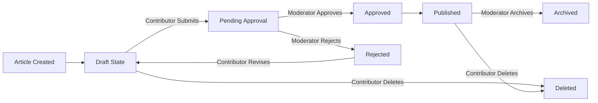

# Article and Content Management

## Overview

This document specifies the complete requirements for managing articles, content creation workflows, attachments, moderation processes, and visibility controls in the discussion board system. Articles form the core content of the platform, enabling contributors to initiate economic and political discussions while moderators ensure quality and appropriateness of published content.

## Article Structure and Properties

Each article consists of the following properties:

| Property | Type | Required | Description |
|----------|------|----------|-------------|
| articleId | UUID | Yes | Unique identifier for the article, generated automatically |
| title | String | Yes | Article title, 5-200 characters, describing the main topic |
| content | String | Yes | Article body text, 50-50,000 characters, containing the discussion topic |
| authorId | UUID | Yes | User ID of the contributor who created the article |
| authorName | String | Yes | Display name of the author at time of creation |
| category | String | Yes | Topic category (e.g., "Economics", "Politics", "Policy", "Other Discussion") |
| status | Enum | Yes | Current publication status: "draft", "pending_approval", "approved", "published", "rejected", "archived" |
| createdAt | DateTime | Yes | ISO 8601 timestamp when article was created |
| publishedAt | DateTime | No | ISO 8601 timestamp when article was published to public (null if not yet published) |
| updatedAt | DateTime | Yes | ISO 8601 timestamp of most recent modification |
| lastEditedBy | UUID | No | User ID of the person who last edited the article (if edited after initial creation) |
| approvedBy | UUID | No | Moderator ID who approved the article (null if not yet approved) |
| approvalNotes | String | No | Moderator feedback during approval process, max 1,000 characters |
| rejectionReason | String | No | Explanation if article was rejected, max 500 characters |
| viewCount | Integer | Yes | Number of times article has been viewed by users, starts at 0 |
| commentCount | Integer | Yes | Number of published comments on article, updated automatically |
| attachments | Array | Yes | List of attachment objects associated with article (empty array if no attachments) |
| isPinned | Boolean | Yes | Whether moderator has pinned article to top of listings (featured), defaults to false |
| isLocked | Boolean | Yes | Whether article is locked from further comments/modifications, defaults to false |

## Article Lifecycle and Publishing

Articles follow a defined lifecycle from creation through publication to archival:

### Article States

### Article Creation and Draft State

**WHEN a contributor creates a new article, THE system SHALL initialize it in "draft" status with createdAt timestamp set to current time.**

**WHILE an article is in draft status, THE contributor who created it SHALL be able to edit the title, content, category, and attachments without restrictions.**

**WHEN a contributor in draft mode edits article content, THE system SHALL update the updatedAt timestamp to reflect the modification time while keeping the article in draft status.**

**THE contributor SHALL be able to save draft articles multiple times without triggering any approval workflows or notifications.**

### Article Submission and Pending Approval

**WHEN a contributor submits a draft article for moderation, THE system SHALL transition the article from "draft" status to "pending_approval" status immediately.**

**WHEN an article transitions to pending_approval status, THE system SHALL create a notification sent to all moderators indicating a new article awaits review, including article title and contributor name.**

**WHILE an article is in pending_approval status, THE contributor who created it SHALL NOT be able to edit article title, content, or category until the moderator provides feedback.**

**WHILE an article is in pending_approval status, THE contributor SHALL be able to add or remove attachments to address moderator concerns if they choose to revise without waiting for feedback.**

### Article Approval and Publication

**WHEN a moderator reviews a pending article and approves it, THE system SHALL immediately transition the article from "pending_approval" to "published" status.**

**WHEN an article is approved by a moderator, THE system SHALL record the moderator's user ID in the approvedBy field and set the publishedAt timestamp to the current time.**

**IF the moderator includes approval notes while approving the article, THE system SHALL store these notes (max 1,000 characters) in the approvalNotes field and these notes SHALL be visible to the contributor.**

**WHEN an article is published, THE system SHALL make it visible to all guest users and contributors in the public article listings and search results.**

### Article Rejection and Revision

**WHEN a moderator reviews a pending article and rejects it, THE system SHALL immediately transition the article to "rejected" status.**

**WHEN an article is rejected, THE system SHALL record the moderator's explanation in the rejectionReason field (max 500 characters) and this reason SHALL be visible to the contributor.**

**WHEN an article is rejected, THE system SHALL send a notification to the contributor including the rejection reason and guidance on how to revise and resubmit the article.**

**WHILE an article is in rejected status, THE contributor who created it SHALL be able to edit the title, content, category, and attachments.**

**AFTER a contributor edits a rejected article, THEY SHALL be able to resubmit it for re-review by transitioning it back to pending_approval status.**

### Article Pinning and Locking

**WHEN a moderator pins an article, THE system SHALL set the isPinned flag to true, causing the article to appear at the top of all article listings, search results, and category views.**

**WHEN a moderator unpins an article, THE system SHALL set isPinned to false and the article SHALL appear in its normal chronological position.**

**PINNED articles SHALL maintain their pinned status even after new articles are created or existing articles are archived.**

**WHEN a moderator locks an article, THE system SHALL set the isLocked flag to true, which prevents new comments from being posted on the article.**

**WHEN an article is locked, THE system SHALL allow existing comments and the article itself to remain fully visible and readable.**

**WHEN a moderator unlocks an article, THE system SHALL set isLocked to false and comments from any user can be posted again.**

### Article Archival

**WHEN a moderator archives an article, THE system SHALL transition the article to "archived" status.**

**ARCHIVED articles SHALL not appear in standard article listings, category browsing, or default search result orderings.**

**ARCHIVED articles SHALL remain searchable by users and viewable by direct URL link to the article.**

**MODERATORS SHALL be able to view all archived articles in a dedicated archived articles section for historical reference and auditing.**

## Article Attachments and File Management

Articles support attachments to enhance discussion with visual content and supporting documents. The attachment system is designed to be straightforward and secure.

### Supported Attachment Types

**Images**: JPG/JPEG, PNG, GIF, WebP formats
- Maximum file size: 10 MB per image
- Recommended maximum dimensions: 4000×4000 pixels
- Minimum dimensions: 100×100 pixels
- Supported MIME types: image/jpeg, image/png, image/gif, image/webp

**Documents**: PDF, DOC, DOCX, TXT, XLS, XLSX formats
- Maximum file size: 25 MB per document
- Text-based documents only, no executables or archives (no .exe, .zip, .rar, .bat, .sh)
- Supported MIME types: application/pdf, application/msword, application/vnd.openxmlformats-officedocument.wordprocessingml.document, text/plain, application/vnd.ms-excel, application/vnd.openxmlformats-officedocument.spreadsheetml.sheet

### Attachment Upload Rules

**THE system SHALL support a maximum of 10 attachments per article.**

**WHEN a contributor uploads an attachment, THE system SHALL validate the file type against the supported list, verify the file size does not exceed limits, and scan for malicious content before accepting the upload.**

**IF an uploaded file exceeds the size limit for its type (10 MB for images, 25 MB for documents), THEN THE system SHALL reject the upload and display error message: "File size exceeds the {type} limit of {limit} MB".**

**IF an uploaded file has an unsupported format, THEN THE system SHALL reject the upload and display error message listing all supported formats separated by commas.**

**IF uploaded file fails malware scanning, THE system SHALL reject the upload, log the security event with file name and contributor ID, and display error message: "File could not be verified as safe. Please try a different file."**

**THE system SHALL store each attachment with a system-generated unique identifier (UUID) separate from the original filename to prevent filename conflicts and improve security.**

**WHEN an attachment is uploaded, THE system SHALL preserve the original filename as the display name while storing the file with a UUID-based identifier in secure file storage.**

### Attachment Lifecycle and Management

**WHILE an article is in draft or pending_approval status, THE contributor who created the article SHALL be able to delete attachments from the article at any time.**

**AFTER an article is published, THE system SHALL prevent the original contributor from deleting existing attachments but SHALL allow them to add new attachments.**

**MODERATORS SHALL be able to delete any attachment from any article regardless of publication status.**

**THE system SHALL display attachments in the order they were uploaded (first uploaded appears first in the list).**

**WHEN a contributor adds new attachments to a published article, THE new attachments SHALL be appended to the end of the attachment list in the order uploaded.**

**IF a contributor attempts to add an 11th attachment to an article, THEN THE system SHALL reject the upload and display error: "Maximum 10 attachments per article reached".**

### Attachment Metadata Storage

Each attachment object in the system contains the following metadata:

- **attachmentId**: UUID generated at upload time, serves as unique identifier
- **originalFileName**: String (1-255 characters), the name of the file as uploaded by contributor
- **fileType**: String (file extension in lowercase: jpg, png, pdf, docx, etc.)
- **fileSize**: Integer, size of the file in bytes
- **uploadedAt**: DateTime, ISO 8601 timestamp of when file was uploaded
- **uploadedBy**: UUID, the user ID of the contributor who uploaded the file
- **mimeType**: String, MIME type for proper browser display (image/jpeg, application/pdf, etc.)
- **displayUrl**: String, relative or absolute URL path for accessing or displaying the attachment in the web interface

**THE system SHALL make attachment metadata retrievable along with the article when fetching article details.**

**WHEN displaying an article, THE system SHALL show all attachments with their original filenames as clickable links or embedded content (depending on type).**

## Content Moderation and Approval Workflow

All articles must pass through a moderation review process before becoming visible to guest users and the general public. This ensures content quality and compliance with community standards.

### Moderation Queue and Notification

**WHEN a contributor submits an article for approval, THE system SHALL create an entry in the moderation queue with the current timestamp, contributor ID, contributor name, and article title.**

**THE system SHALL send a notification to all moderators when a new article enters the moderation queue, including article title, contributor name, and a link to review the article.**

**WHILE articles are pending approval, ONLY the original contributor and all moderators SHALL be able to view the article content and attachments.**

**GUEST users and other contributors (not the author) SHALL NOT be able to view or access pending articles under any circumstances.**

### Moderation Dashboard and Review Interface

**THE moderation dashboard SHALL display all pending articles sorted by submission time with oldest submissions appearing first.**

**EACH pending article in the moderation queue SHALL display: article title, author name, submission timestamp, word count, number of attachments, and a preview of the first 200 characters of article content.**

**MODERATORS SHALL be able to click on any pending article to view the full article content, all attachments, author profile information, and article metadata.**

**THE review interface SHALL provide two action buttons side-by-side: "Approve" and "Reject" for quick decision-making.**

**WHEN a moderator clicks the Approve button, THE system SHALL display an optional text field (max 1,000 characters) where the moderator can enter approval notes before confirming.**

**WHEN a moderator clicks the Reject button, THE system SHALL display a required text field (max 500 characters) where the moderator MUST enter a rejection reason before confirming the rejection.**

**MODERATORS SHALL be able to open multiple article review tabs simultaneously and process approvals/rejections independently.**

### Approval Process

**WHEN a moderator clicks the Approve button and confirms the action, THE system SHALL immediately transition the article from "pending_approval" to "published" status.**

**WHEN an article is approved, THE system SHALL record the approving moderator's user ID in the approvedBy field and set the approvalNotes field with the entered text (if provided).**

**WHEN an article is approved, THE system SHALL set the publishedAt timestamp to the current time in ISO 8601 format.**

**IMMEDIATELY after approval, THE system SHALL remove the article from the moderation queue and make it visible in public article listings.**

**WHEN an article is approved, THE system SHALL send a notification to the contributing author confirming their article was approved and is now published.**

**IF the moderator provided approval notes, THE notification to the contributor SHALL include the approval notes so they can see moderator feedback.**

### Rejection Process

**WHEN a moderator enters a rejection reason and clicks Reject, THE system SHALL immediately transition the article from "pending_approval" to "rejected" status.**

**WHEN an article is rejected, THE system SHALL record the rejection reason in the rejectionReason field exactly as entered by the moderator.**

**WHEN an article is rejected, THE system SHALL NOT set the approvedBy field (it remains null).**

**IMMEDIATELY after rejection, THE system SHALL remove the article from the moderation queue.**

**WHEN an article is rejected, THE system SHALL send a notification to the contributing author that includes the rejection reason and guidance to help them understand how to improve and resubmit.**

**THE notification text to rejected contributors SHALL include a helpful message like: "Your article was not approved at this time. Please review the reason below and revise your article to address the feedback, then resubmit for another review."**

### Audit Logging and Accountability

**THE system SHALL maintain an immutable audit log recording every moderation action (approval, rejection, editing, deletion, pinning, locking, archiving).**

**EACH audit log entry SHALL include: action type, article ID, moderator user ID, moderator name, action timestamp in ISO 8601 format, and any notes or reason text.**

**MODERATORS SHALL be able to view the complete audit history of any article showing all historical actions and who performed them.**

**THE audit log SHALL be retained indefinitely for compliance and historical reference purposes.**

**IF a moderator edits an article that has already been published, THE system SHALL record this edit in the audit log with the moderator ID and timestamp, and update the article's updatedAt field.**

## Article Visibility and Access Control

Article visibility is controlled based on the publication status of the article and the user's role. This ensures appropriate content access while maintaining moderation oversight.

### Visibility by User Type and Article Status

**WHEN a guest user (not logged in) browses the discussion board, THEY SHALL only see articles with status "published".**

**WHEN a guest user views published articles, THE system SHALL NOT display draft, pending_approval, rejected, archived, or deleted articles under any circumstance.**

**WHEN a contributor (logged in user who creates articles) browses the discussion board, THEY SHALL see all published articles PLUS any articles authored by themselves (including draft, pending_approval, rejected status articles).**

**WHEN a contributor views their own draft article, THE system SHALL show a clear indicator that the article is in draft status and not yet published.**

**WHEN a contributor views their own pending_approval article, THE system SHALL show a clear indicator that the article is awaiting moderator review and display any moderator notes if feedback has been provided.**

**WHEN a contributor views a rejected article they created, THE system SHALL clearly display the rejection reason and any moderator feedback to help them improve the content.**

**WHEN a contributor creates an article, THEY SHALL be able to view their own article in draft status immediately after creation, even before saving is complete.**

**WHEN a moderator accesses the discussion board, THEY SHALL see all articles regardless of publication status: published, draft, pending_approval, rejected, archived, and deleted articles.**

**WHEN a moderator views any article detail page, THEY SHALL see the complete article information including status, audit trail of all modifications and actions, full metadata, and complete history of approvals/rejections.**

**WHEN a moderator accesses the moderation dashboard, THEY SHALL see only pending_approval articles in a dedicated queue for efficient review.**

### Archived Articles

**ARCHIVED articles SHALL NOT appear in the main article listing or standard category browsing views.**

**WHEN a user performs a search, ARCHIVED articles SHALL be included in the search results with a clear "Archived" label so users can identify them.**

**ARCHIVED articles SHALL be viewable by any user who accesses the article via direct URL link.**

**ARCHIVED articles SHALL remain fully readable with all comments and attachments intact and accessible.**

**MODERATORS SHALL have access to a dedicated archived articles section where they can view all archived articles, search the archive, and restore articles to published status if needed.**

### Direct URL Access Control

**IF a guest user attempts to directly access a draft, pending_approval, or rejected article by URL, THE system SHALL deny access and return HTTP 403 Forbidden error with message "You do not have permission to view this article."**

**IF a contributor attempts to access another contributor's draft article via direct URL, THE system SHALL deny access and return HTTP 403 Forbidden error.**

**IF a contributor attempts to access a pending_approval article via direct URL (when not the author), THE system SHALL deny access and return HTTP 403 Forbidden error.**

**IF a contributor attempts to access a deleted article via direct URL, THE system SHALL deny access and return HTTP 403 Forbidden error.**

**MODERATORS SHALL have unrestricted access and can directly access any article regardless of status, authorship, or visibility settings by URL.**

**DELETED articles SHALL NOT be directly accessible to any user except moderators viewing audit trails.**

## Article Editing and Deletion

Contributors maintain control over their own content within defined constraints to balance user empowerment with content integrity.

### Editing Rules by Article Status

**WHILE an article is in draft status, THE contributor who created it SHALL be able to edit the title, content, and category fields without restrictions or approval requirements.**

**WHEN a contributor edits an article in draft status, THE system SHALL update the updatedAt timestamp to the current time and record the contributor's user ID in the lastEditedBy field.**

**AFTER an article transitions to pending_approval status, THE contributor SHALL NOT be able to edit the title, content, or category fields.**

**IF a contributor attempts to edit title, content, or category of a pending article, THE system SHALL reject the edit and display message: "You cannot edit this article while it is pending moderator review."**

**WHILE an article is pending approval, THE contributor SHALL be able to add new attachments or remove existing attachments without moderator permission.**

**IF a moderator rejects an article, THE contributor SHALL regain full edit permissions and be able to modify title, content, category, and attachments.**

**AFTER an article is published, THE contributor who created it SHALL NOT be able to edit the title, content, or category of the article.**

**IF a published article contributor attempts to edit the main content, THE system SHALL reject the edit and display message: "You cannot edit published articles. Please contact a moderator if content changes are necessary."**

**AFTER an article is published, THE contributor SHALL be able to add new attachments to provide additional supporting materials or examples.**

**AFTER an article is published, THE contributor SHALL NOT be able to delete existing attachments that are part of the published article.**

**IF a published article contributor attempts to delete an attachment, THE system SHALL reject the deletion and display message: "You cannot remove attachments from published articles."**

### Moderator Editing Authority

**MODERATORS SHALL have unrestricted edit permissions on any article at any stage, including title, content, category, and status.**

**WHEN a moderator edits a published article, THE system SHALL update the updatedAt timestamp to current time and record the moderator's user ID in lastEditedBy field.**

**WHEN a moderator edits an article, THE system SHALL create an audit log entry documenting the moderator ID, timestamp, and description of changes made (edit to title, edit to content, category change, etc.).**

**IF a moderator changes the status of an article (e.g., published to archived, pending to rejected), THE system SHALL create a separate audit log entry for the status change including moderator ID and timestamp.**

### Deletion Rules by Article Status and User Role

**WHEN a contributor deletes a draft article, THE system SHALL transition the article to "deleted" status (not permanently remove it from database).**

**WHEN a contributor deletes a draft article, THE system SHALL hide it from all public listings, contributor views, and search results (visible only to moderators in audit view).**

**WHEN a contributor deletes a pending_approval article, THE system SHALL transition the article to "deleted" status and remove it from the moderation queue so moderators will not review it.**

**IF a contributor attempts to delete a published article, THE system SHALL deny deletion and return error message: "Published articles cannot be deleted by contributors. Please contact a moderator if deletion is necessary."**

**MODERATORS SHALL be able to delete any article regardless of status (draft, pending, published, rejected, archived).**

**WHEN a moderator deletes an article, THE system SHALL transition it to "deleted" status, record the moderator user ID and timestamp in the audit log, and hide it from all public views and listings.**

**DELETED articles SHALL NOT be permanently removed from the database but shall be retained with a "deleted" status for audit trail, compliance, and recovery purposes.**

**IF a moderator needs to recover a deleted article, THEY SHALL have the ability to transition it back to a previous status (e.g., published) via the moderation interface.**

## Business Rules and Validation Requirements

These rules ensure data integrity, consistency, and proper application of business constraints across the article management system.

### Article Content Validation

**WHEN a contributor submits an article for creation or editing, THE system SHALL validate that the title length is between 5 and 200 characters (inclusive).**

**IF the title is shorter than 5 characters, THEN THE system SHALL reject submission and display error: "Title must be at least 5 characters long."**

**IF the title is longer than 200 characters, THEN THE system SHALL reject submission and display error: "Title cannot exceed 200 characters."**

**WHEN a contributor submits article content, THE system SHALL validate that the content length is between 50 and 50,000 characters (inclusive).**

**IF the content is shorter than 50 characters, THEN THE system SHALL reject submission and display error: "Article content must be at least 50 characters long."**

**IF the content is longer than 50,000 characters, THEN THE system SHALL reject submission and display error: "Article content cannot exceed 50,000 characters."**

**WHEN a contributor sets the category for an article, THE system SHALL require that the category field contains a valid value from the predefined category list.**

**IF a contributor attempts to set an invalid or unrecognized category value, THE system SHALL reject submission and return error with the complete list of valid categories.**

### Valid Article Categories

**VALID article categories that contributors can assign SHALL include: "Economics", "Politics", "Policy", "Trade", "Markets", "Regulation", "International", "Analysis", "Opinion", "Other Discussion".**

**THE system SHALL display articles organized by category in the category browsing interface, allowing users to view articles in each topic area.**

**WHEN displaying category listings, THE system SHALL show the category name prominently and display count of published articles in each category.**

**THE system SHALL allow filtering and searching within categories to help users find relevant discussions on specific economic and political topics.**

### Duplicate and Similar Content Prevention

**THE system SHALL NOT prevent contributors from creating multiple articles with identical titles if authored by different contributors or submitted at different times.**

**THE system SHALL allow contributors to submit articles covering similar or overlapping topics in the same category, as long as each article contains unique content.**

**THE system SHALL NOT implement automated duplicate detection that rejects articles based on similarity to existing articles.**

**MODERATORS MAY choose to reject articles as duplicates during the review process if they determine content is substantially identical to an existing published article, and SHALL include this reasoning in the rejection reason field.**

### Timestamps and Audit Trail Requirements

**EVERY article creation SHALL record a createdAt timestamp using the current system time in ISO 8601 format (YYYY-MM-DDTHH:mm:ssZ).**

**EVERY article modification (edit to title, content, category, or status change) SHALL update the updatedAt timestamp to the current system time in ISO 8601 format.**

**WHEN an article is transitioned to published status (either through moderator approval or direct publication), THE system SHALL record a publishedAt timestamp using current time in ISO 8601 format.**

**IF an article transitions from draft to pending_approval to published, THE publishedAt timestamp SHALL be recorded when article reaches published status (from moderator approval).**

**IF an article is unpublished (returned to draft status by moderator), THE publishedAt field SHALL be cleared and set to null.**

**THE system SHALL maintain an immutable audit log of all article state transitions (draft to pending, pending to published, etc.), approvals, rejections, content edits, deletions, and moderator actions.**

**EACH audit log entry SHALL include: action type, article ID, actor user ID, actor name, action timestamp in ISO 8601 format, and contextual information (rejection reason, approval notes, edit summary).**

**THE audit log SHALL be retained indefinitely and be searchable by article ID, moderator ID, date range, and action type.**

### Attachment Quantity and Ordering Rules

**THE system SHALL maintain attachment list in the order of upload sequence, with the first uploaded attachment appearing first in all article views.**

**WHEN a contributor adds attachments after initial article creation, THE system SHALL append new attachments to the end of the attachment list in the order they were uploaded.**

**THE system SHALL enforce a strict maximum of 10 attachments per article.**

**IF a contributor attempts to upload an 11th attachment to an article that already has 10 attachments, THE system SHALL reject the upload and display error: "Maximum 10 attachments per article reached. Please remove an existing attachment before adding a new one."**

**WHEN a contributor removes an attachment from an article, THE remaining attachments SHALL maintain their original order (no reordering based on removal).**

## Error Handling and Edge Cases

The system must gracefully handle error conditions and edge cases while maintaining data integrity and providing clear feedback to users.

### File Upload Error Scenarios

**IF a network error occurs during file upload (connection dropped, timeout), THE system SHALL preserve the article content in its current state (draft or pending approval) and allow the contributor to retry the file upload without losing article data.**

**IF a contributor's session expires during file upload, THE system SHALL complete the upload request timeout, preserve the article content in draft status, and require the contributor to log back in and retry the attachment upload on next session.**

**IF an uploaded file fails malware scanning, THE system SHALL reject the upload immediately, log a security event with the file name, file size, and contributor ID, and display user-friendly error message: "File could not be verified as safe. Please try a different file."**

**THE system SHALL NOT store any trace of malware-detected files in normal storage or make them accessible to users.**

**IF a contributor's storage quota is exceeded (if applicable), THE system SHALL reject the upload and display error message explaining the quota limit and suggesting options to free up space.**

### Article State Conflict Scenarios

**IF two moderators attempt to approve the same pending article simultaneously (within 1 second of each other), THE system SHALL process the first request successfully, transition the article to published status, and reject the second request with error message: "This article has already been approved and published."**

**IF a moderator attempts to approve an article that the contributor has already deleted, THE system SHALL return error message: "This article is no longer available for approval because it was deleted by the author."**

**IF a moderator attempts to reject an article while another moderator is reviewing it (within 30 seconds), THE system SHALL allow both actions with last-action-wins: the final decision (approval or rejection) submitted shall take precedence.**

**IF a moderator attempts to edit an article while another moderator is also editing the same article, THE system SHALL use last-write-wins approach: whichever modification is submitted and saved last will be the final version.**

**WHEN a last-write-wins conflict occurs, THE system SHALL update the updatedAt timestamp to reflect the most recent modification and record the most recent editor's ID in lastEditedBy field.**

### Approval Process Edge Cases

**THE system SHALL NOT automatically timeout pending articles after an extended period.**

**PENDING articles SHALL remain in the moderation review queue indefinitely until a moderator explicitly takes an approval or rejection action.**

**IF a moderator closes their browser or loses connection while reviewing an article (without submitting a decision), THE article SHALL remain in pending status and another moderator may review and decide on it.**

**IF a contributor submits a new version of a rejected article for re-review, THE system SHALL create a new pending_approval entry in the queue and notify moderators of the resubmission.**

### Concurrent Editing Edge Cases

**IF a contributor is editing a draft article in one browser tab while deleting the same article in another tab, THE system SHALL reject the edit with message: "This article is no longer available." when attempting to save the edit.**

**IF a contributor edits their article while a moderator is simultaneously editing the same article, THE system SHALL process both edits using last-write-wins: whichever save request completes last will overwrite the previous version.**

**WHEN such a concurrent edit conflict occurs, THE system SHALL alert the user who submitted the first edit that their changes were overwritten by another user, and display the current article version.**

**IF a moderator archives an article while a contributor is attempting to add a comment, THE system SHALL complete the moderator's archive action first (article becomes locked), then reject the contributor's comment submission with message: "This article has been archived and is no longer accepting comments."**

### Attachment Edge Cases

**IF a contributor attempts to add an attachment while an article is being transitioned from draft to pending_approval status, THE system SHALL complete the attachment upload first, then proceed with the status transition.**

**IF an attachment file becomes corrupted or inaccessible in storage, THE system SHALL display a message to users: "This attachment is temporarily unavailable. Please try again later or contact support." instead of breaking the article view.**

**IF a contributor removes all attachments from an article, THE attachments array SHALL become an empty array (not null), and the article SHALL display correctly without showing an error.**

---

*This document defines business requirements for the article and content management system. Technical implementation details (architecture, API specifications, database design) are at the discretion of the development team.*