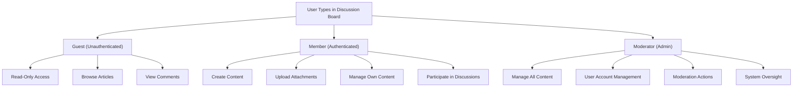

# User Actors and Authentication Requirements

## User Actor Hierarchy Overview

The discussion board system implements a three-tier user actor model designed to balance open participation with content moderation and system governance. Each actor type has distinct capabilities, permissions, and access levels.



---

## Guest User Capabilities

### Definition
Guest users are unauthenticated visitors to the discussion board who have not created an account or logged in. Guests access the platform for reading and research purposes only.

### Guest User Permissions

**THE guest user SHALL have read-only access to all public content on the discussion board.**

**WHEN a guest user attempts to browse the platform, THE system SHALL display all published articles, comments, and discussions without requiring authentication.**

**WHEN a guest user attempts to create an article, THE system SHALL deny the request and prompt the user to register or log in.**

**WHEN a guest user attempts to post a comment, THE system SHALL deny the request and prompt the user to register or log in.**

**WHEN a guest user attempts to upload files or images, THE system SHALL deny the request and indicate that authentication is required.**

**WHEN a guest user attempts to edit or delete content, THE system SHALL deny the request.**

**WHEN a guest user attempts to access another user's private features, THE system SHALL deny the request.**

### Specific Guest Capabilities
- ✅ View all published articles with full content
- ✅ View all comments and discussions on articles
- ✅ Search and filter articles by topic or keywords
- ✅ View user profiles of content creators (basic information only)
- ✅ View attachment metadata (filenames, types)
- ✅ Download publicly available attachments

### Guest Restrictions
- ❌ Create new articles
- ❌ Post comments or replies
- ❌ Upload images or files
- ❌ Edit any content
- ❌ Delete any content
- ❌ Access user settings or preferences
- ❌ Follow or bookmark articles
- ❌ Rate or react to content

---

## Member User Capabilities

### Definition
Member users are registered, authenticated users who actively participate in discussions, create content, and engage with the community. Members are the primary content creators and participants in the discussion board.

### Member User Permissions

**WHEN a member user successfully registers and logs in, THE system SHALL grant access to all member-level features and content creation tools.**

**THE member user SHALL have the ability to create new articles on any topic within the discussion board.**

**WHEN a member creates an article, THE system SHALL record the member's user ID, creation timestamp, and store the article content in draft or published state as specified.**

**THE member user SHALL be able to upload images and file attachments to articles they create.**

**WHEN a member uploads an attachment, THE system SHALL validate the file type, size, and content before storing.**

**THE member user SHALL be able to edit their own articles at any time after creation.**

**THE member user SHALL be able to delete their own articles and associated attachments.**

**WHEN a member attempts to edit or delete another member's article, THE system SHALL deny the request.**

**THE member user SHALL be able to post comments on any published article.**

**THE member user SHALL be able to edit or delete their own comments.**

**WHEN a member attempts to edit or delete another member's comment, THE system SHALL deny the request.**

**THE member user SHALL be able to view and manage their own profile information and preferences.**

**WHEN a member user logs out, THE system SHALL terminate their session and invalidate their authentication token.**

### Specific Member Capabilities
- ✅ Register account with email and password
- ✅ Create new articles with title, content, and metadata
- ✅ Upload images (JPG, PNG, GIF) to articles
- ✅ Upload files (PDF, DOC, DOCX, TXT, ZIP) to articles
- ✅ View own article drafts and published articles
- ✅ Edit article title, content, and metadata
- ✅ Delete articles they created
- ✅ Delete attachments from their own articles
- ✅ Post comments on published articles
- ✅ Edit their own comments (text content)
- ✅ Delete their own comments
- ✅ View their profile and contribution history
- ✅ Update personal profile information
- ✅ Search and discover articles by other members
- ✅ View comments and discussions on articles

### Member Restrictions
- ❌ Edit or delete articles created by other members
- ❌ Edit or delete comments posted by other members
- ❌ Access moderation tools or admin features
- ❌ View user email addresses or private information
- ❌ Change another member's profile or permissions
- ❌ Upload executable files or malicious content
- ❌ Exceed file size or attachment quantity limits

### Member Content Ownership

**THE member user SHALL be the sole owner of all articles and comments they create.**

**WHEN a member views the discussion board, THE system SHALL clearly indicate which content was created by the viewing member versus other members.**

**THE member user SHALL have exclusive rights to edit or delete content they have created.**

---

## Moderator Capabilities

### Definition
Moderator users are elevated administrators with comprehensive permissions to manage all content, enforce community guidelines, and ensure the discussion board remains safe and productive. Moderators have administrative oversight and enforcement capabilities.

### Moderator User Permissions

**THE moderator user SHALL have access to all member features and capabilities.**

**THE moderator user SHALL have the ability to view, edit, and delete any article on the platform regardless of author.**

**WHEN a moderator edits an article, THE system SHALL record the moderator's action and timestamp for audit purposes.**

**THE moderator user SHALL have the ability to view, edit, and delete any comment on the platform regardless of author.**

**THE moderator user SHALL have the ability to remove or moderate user-uploaded attachments that violate guidelines.**

**WHEN a moderator removes an attachment, THE system SHALL delete the file and update the article to reflect the removal.**

**THE moderator user SHALL have access to a moderation dashboard showing all articles, comments, and user accounts.**

**THE moderator user SHALL be able to view detailed information about any user account including registration date, content history, and activity logs.**

**THE moderator user SHALL have the ability to suspend or restrict member accounts that violate community guidelines.**

**WHEN a moderator suspends a member account, THE system SHALL prevent that member from logging in or creating new content.**

**THE moderator user SHALL be able to restore or unsuspend member accounts.**

**THE moderator user SHALL have access to platform analytics and statistics including total articles, comments, users, and activity trends.**

**THE moderator user SHALL be able to add other moderators and adjust their permissions (if implementing multi-moderator support).**

**THE moderator user SHALL have access to system logs and audit trails for compliance and security purposes.**

### Specific Moderator Capabilities
- ✅ Perform all member actions (create, comment, manage own content)
- ✅ View, edit, and delete any article on the platform
- ✅ View, edit, and delete any comment on the platform
- ✅ Remove inappropriate attachments from any article
- ✅ Access comprehensive moderation dashboard
- ✅ View complete user account information and history
- ✅ Search and filter content by author, date, or topic
- ✅ Review flagged or reported content
- ✅ Suspend member accounts
- ✅ Reactivate suspended member accounts
- ✅ View platform statistics and analytics
- ✅ Generate activity reports
- ✅ Access audit logs showing all system changes
- ✅ Manage moderator permissions and team

### Moderator Restrictions
- ❌ Access server infrastructure or system configuration (unless explicitly required)
- ❌ Bypass security controls or authentication mechanisms
- ❌ Access financial or billing information (not applicable for this platform)
- ❌ Export user personal data beyond moderation needs

### Moderator Responsibilities

**WHEN a moderator takes moderation actions, THE system SHALL maintain detailed audit logs recording the moderator's identity, action type, affected content, timestamp, and reason for action.**

**THE moderator user SHALL have the responsibility to enforce community guidelines and maintain platform standards.**

---

## Permission Matrix

The following matrix summarizes what each user actor can do within the discussion board system:

| Action | Guest | Member | Moderator |
|--------|-------|--------|-----------| 
| **Article Operations** |
| View published articles | ✅ | ✅ | ✅ |
| Create articles | ❌ | ✅ | ✅ |
| Edit own articles | ❌ | ✅ | ✅ |
| Edit others' articles | ❌ | ❌ | ✅ |
| Delete own articles | ❌ | ✅ | ✅ |
| Delete others' articles | ❌ | ❌ | ✅ |
| View draft articles | ❌ | Own only | ✅ |
| **Comment Operations** |
| View comments | ✅ | ✅ | ✅ |
| Post comments | ❌ | ✅ | ✅ |
| Edit own comments | ❌ | ✅ | ✅ |
| Edit others' comments | ❌ | ❌ | ✅ |
| Delete own comments | ❌ | ✅ | ✅ |
| Delete others' comments | ❌ | ❌ | ✅ |
| **Attachment Operations** |
| View attachments | ✅ | ✅ | ✅ |
| Download attachments | ✅ | ✅ | ✅ |
| Upload to own articles | ❌ | ✅ | ✅ |
| Upload to others' articles | ❌ | ❌ | ✅ |
| Delete own attachments | ❌ | ✅ | ✅ |
| Delete others' attachments | ❌ | ❌ | ✅ |
| **User Management** |
| View own profile | ❌ | ✅ | ✅ |
| Edit own profile | ❌ | ✅ | ✅ |
| View other user profiles | Limited | ✅ | ✅ |
| View user account details | ❌ | ❌ | ✅ |
| Suspend accounts | ❌ | ❌ | ✅ |
| Activate accounts | ❌ | ❌ | ✅ |
| **Moderation & Admin** |
| Access moderation dashboard | ❌ | ❌ | ✅ |
| View audit logs | ❌ | ❌ | ✅ |
| View platform analytics | ❌ | ❌ | ✅ |
| Search all content | ✅ | ✅ | ✅ |
| Flag or report content | ❌ | ✅ | ✅ |
| Review flagged content | ❌ | ❌ | ✅ |

---

## Authentication System Requirements

### Core Authentication Functions

**THE discussion board system SHALL provide user registration functionality allowing new users to create member accounts.**

**WHEN a user registers, THE system SHALL require an email address and password as minimum credentials.**

**THE system SHALL validate email format and password strength during registration.**

**WHEN registration is successful, THE system SHALL create a new member account and transition the user to authenticated member status.**

**THE system SHALL provide login functionality allowing registered members to authenticate with email and password.**

**WHEN a member provides valid credentials, THE system SHALL grant authentication and issue a session token.**

**THE system SHALL provide logout functionality allowing authenticated members to end their session.**

**WHEN a member logs out, THE system SHALL invalidate their authentication token and clear their session.**

**THE system SHALL maintain secure session management preventing session hijacking or unauthorized access.**

**THE system SHALL provide password reset functionality for members who forget their credentials.**

**WHEN a member initiates password reset, THE system SHALL send a secure reset link to their registered email address.**

**THE system SHALL automatically invalidate all existing tokens for a user when their password is changed.**

### Registration Flow

1. User accesses registration page
2. User enters email address
3. System validates email format and checks for duplicate registrations
4. User enters desired password (minimum 8 characters, mixed case, numbers)
5. System validates password strength
6. User confirms password by re-entering
7. System verifies both passwords match
8. User clicks register/submit
9. System creates member account in database
10. System generates initial JWT token
11. User is transitioned to authenticated member state
12. User can begin creating content

### Login Flow

1. User accesses login page
2. User enters email address
3. User enters password
4. System validates credentials against stored account data
5. IF credentials are valid:
   - System generates JWT token
   - System creates new session
   - User is granted authenticated member access
6. IF credentials are invalid:
   - System displays error message
   - User remains as guest

### Logout Flow

1. Authenticated member clicks logout
2. System invalidates current JWT token
3. System terminates user session
4. User is returned to guest state with read-only access

---

## JWT Token Structure and Specifications

### Token Type

**THE system SHALL use JSON Web Tokens (JWT) as the authentication token format.**

**THE system SHALL issue JWT tokens upon successful login and member registration.**

**THE system SHALL include JWT tokens in all API requests requiring authentication via the Authorization header using Bearer scheme.**

### JWT Payload Structure

Each JWT token SHALL contain the following claims:

```json
{
  "userId": "UUID of authenticated user",
  "userEmail": "email@example.com",
  "userName": "displayName",
  "role": "member or moderator",
  "permissions": ["permission1", "permission2"],
  "issuedAt": "2024-01-01T12:00:00Z",
  "expiresAt": "2024-01-01T12:30:00Z",
  "jti": "unique token identifier"
}
```

### Token Claims Specification

| Claim | Type | Purpose | Example |
|-------|------|---------|---------| 
| userId | UUID | Unique identifier for the user | "550e8400-e29b-41d4-a716-446655440000" |
| userEmail | String | User's registered email address | "user@example.com" |
| userName | String | User's display name or username | "john_doe" |
| role | String | User's actor type (member, moderator) | "member" |
| permissions | Array of Strings | List of specific permissions granted | ["article:create", "comment:create", "article:edit:own"] |
| issuedAt | ISO 8601 Timestamp | When the token was created | "2024-01-15T08:00:00Z" |
| expiresAt | ISO 8601 Timestamp | When the token expires | "2024-01-15T08:30:00Z" |
| jti | String | Unique JWT ID for tracking and revocation | "token-uuid-123" |

### Access Token Expiration

**THE system SHALL issue access tokens with 30-minute expiration time.**

**WHEN an access token expires, THE system SHALL deny API requests using that token.**

**WHEN an access token expires, THE system SHALL prompt the user to log in again.**

### Refresh Token Strategy

**THE system SHALL issue refresh tokens with 7-day expiration time for extended session management.**

**WHEN an access token expires, THE user MAY use a refresh token to obtain a new access token without re-entering credentials.**

**WHEN a refresh token is used, THE system SHALL issue a new access token with updated expiration time.**

**WHEN a refresh token expires, THE user SHALL be required to log in again.**

### Token Storage

**THE system MAY use localStorage for token storage for client-side convenience.**

**THE system MAY use httpOnly cookies for more secure token storage (preventing XSS attacks).**

**THE specific token storage mechanism is at the discretion of the development team based on security requirements.**

---

## Session Management Requirements

### Session Creation

**WHEN a user successfully authenticates, THE system SHALL create a new session and generate an associated JWT token.**

**THE system SHALL record the session creation timestamp and associated user ID.**

**THE system SHALL link the JWT token to the session for tracking and revocation purposes.**

### Session Maintenance

**WHILE a session is active, THE system SHALL maintain session state in memory or persistent storage.**

**THE system SHALL validate JWT tokens on each API request to verify session validity.**

**IF a JWT token is invalid or expired, THE system SHALL reject the request and require re-authentication.**

### Session Termination

**WHEN a user logs out, THE system SHALL terminate their session immediately.**

**THE system SHALL invalidate the associated JWT token upon logout.**

**THE system SHALL clear any session data stored for that user.**

**WHEN an access token expires, THE system SHALL automatically invalidate the session.**

**WHEN a moderator suspends a member account, THE system SHALL terminate all active sessions for that member.**

### Multiple Sessions

**THE system MAY allow a user to maintain multiple concurrent sessions across different devices or browsers.**

**WHEN a user's password is changed, THE system SHALL invalidate all existing sessions for that user.**

---

## Access Control Summary

### Authentication Requirements

**WHEN a user attempts to access member-only features, THE system SHALL verify their authentication status.**

**IF the user is not authenticated, THE system SHALL deny access and present login/registration options.**

**IF the user is authenticated as a member, THE system SHALL grant access to member features.**

### Authorization Requirements

**WHEN a member attempts to perform an action, THE system SHALL verify their role and permissions.**

**IF the member's role includes the required permission, THE system SHALL allow the action.**

**IF the member's role does not include the required permission, THE system SHALL deny the action and show appropriate error message.**

### Role-Based Access Control

**THE system SHALL use role-based access control (RBAC) to enforce permissions.**

**THE system SHALL check user role (guest, member, moderator) on each request requiring authentication.**

**THE system SHALL enforce permission rules based on the role and specific action being performed.**

### Content Ownership Validation

**WHEN a member attempts to edit or delete content, THE system SHALL verify they are the content owner or a moderator.**

**IF the member is the content owner, THE system SHALL allow the action.**

**IF the member is not the content owner and not a moderator, THE system SHALL deny the action.**

### Audit Trail for Sensitive Actions

**WHEN a moderator performs actions on user accounts or content, THE system SHALL record the action in an audit log.**

**THE audit log SHALL include the moderator's ID, action type, affected resource ID, timestamp, and any additional context.**

---

## Developer Note

> This document defines **business requirements only**. All technical implementations (architecture, APIs, database design, JWT signing algorithms, session storage mechanism, etc.) are at the discretion of the development team.