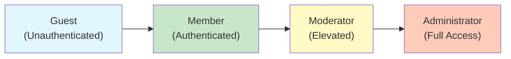

# User Roles and Permissions

## 1. Overview

The discussionBoard system implements a comprehensive role-based access control (RBAC) system that ensures users have appropriate permissions based on their role. The system supports four distinct roles: Guest, Member, Moderator, and Administrator, each with carefully defined permissions and responsibilities.

### 1.1 Role Hierarchy

The role hierarchy follows a progressive model where higher roles have more capabilities:



### 1.2 Authentication Overview

THE discussionBoard system SHALL implement JWT (JSON Web Token) based authentication for all authenticated users. THE system SHALL maintain separate authentication states for guests (unauthenticated) and registered users (authenticated via JWT).

---

## 2. User Roles in Detail

### 2.1 Guest User Role

**Description**: Unauthenticated users who can browse public discussions and content without registering.

**Access Level**: Read-only for public content

**Key Characteristics**:
- No authentication required
- Cannot create content
- Cannot vote or engage
- Limited to viewing public discussions
- Access to registration and login interfaces

**Business Functions Permitted**:
- Browse discussion topics and categories
- View comments and threads
- View user profiles (public information only)
- Access search functionality (view-only results)
- Access FAQ and help documentation
- Register new account
- Login to system

**Business Functions Denied**:
- Create discussion topics
- Post comments
- Reply to discussions
- Vote on content
- Edit user profile
- Access private or restricted content
- Access moderation tools
- Access administrative functions

### 2.2 Member User Role

**Description**: Authenticated users with full participation capabilities in discussions.

**Access Level**: Read and write for content creation and participation

**Key Characteristics**:
- Requires successful authentication with email and password
- Can create and manage personal content
- Can participate in discussions through comments and votes
- Limited content editing (own content only, within 24 hours)
- Can be assigned tasks or moderation roles by administrators
- Subject to community guidelines and moderation

**Business Functions Permitted**:
- Create new discussion topics
- Post comments and replies to discussions
- Vote on discussions and comments (like/upvote functionality)
- Edit own posts within 24 hours of creation
- Delete own posts and comments
- View own profile and edit personal information
- View member-only content and discussions
- Report inappropriate content
- Receive notifications
- Manage notification preferences
- Access search functionality (full results)
- Participate in community discussions
- View other members' public profiles
- Follow or bookmark discussions
- Download own data

**Business Functions Denied**:
- Edit or delete other members' content
- Access moderation tools or dashboards
- Access administrative functions
- View private user information (email addresses, IP logs)
- Manage categories or system settings
- Issue warnings or penalties to other users
- View system analytics or statistics

### 2.3 Moderator User Role

**Description**: Elevated role for community moderators with content moderation and enforcement capabilities.

**Access Level**: Read, write, and moderation for assigned content areas

**Key Characteristics**:
- Authenticated member with elevated permissions
- Can moderate assigned discussion categories
- Enforces community guidelines and policies
- Has tools to manage inappropriate content
- Cannot access system-level administration
- Subject to moderation auditing and oversight

**All Member Functions PLUS**:

**Additional Business Functions Permitted**:
- Review and respond to content reports/flags
- Remove inappropriate comments and discussions
- Edit or delete user content that violates guidelines
- Pin important discussions in categories
- Unpin discussions
- Issue warnings to members (non-binding notifications)
- Temporarily hide discussions or comments (soft delete)
- View moderation queue and flagged content
- Access moderation logs for assigned categories
- Create sticky/announcements within assigned categories
- Lock discussions (prevent further comments)
- Unlock previously locked discussions
- Move discussions between categories (within scope)
- View basic moderation analytics for assigned categories

**Business Functions Denied**:
- Permanently delete user accounts
- Modify user role assignments
- Create or delete discussion categories
- Manage system-wide settings
- Access user personal information (emails, IPs)
- Override other moderators' decisions
- Ban or suspend members (only administrators)
- View system-wide analytics
- Access administrative dashboards
- Modify community guidelines

### 2.4 Administrator User Role

**Description**: System administrators with comprehensive access to manage the entire platform.

**Access Level**: Full read, write, and administrative access to all system functions

**Key Characteristics**:
- Full authentication and role-based access
- Responsible for platform governance and operations
- Can manage all user roles and permissions
- Has access to all system functions and analytics
- Highest level of privilege and responsibility
- Subject to audit logging for all actions

**All Member and Moderator Functions PLUS**:

**Additional Business Functions Permitted**:
- Create and manage user accounts
- Assign and modify user roles
- Revoke or grant specific permissions to users
- Suspend or permanently ban members
- View all user information (email, registration date, activity logs)
- Access complete system analytics and statistics
- View platform-wide moderation logs
- Create, edit, and delete discussion categories
- Configure category permissions and settings
- Manage system-wide settings and configurations
- Create and enforce platform policies
- Issue platform-wide announcements
- View and export system data (within privacy compliance)
- Manage moderator team and permissions
- Create moderator groups and assignments
- Override any content or moderation decision
- Restore deleted content
- Perform system backups and maintenance operations
- Access API logs and system diagnostics
- Configure email and notification settings
- Manage third-party integrations

---

## 3. Authentication System

### 3.1 User Registration Process

THE system SHALL allow guests to register new user accounts by providing an email address, username, and password.

WHEN a guest enters registration information, THE system SHALL validate that:
- The email address is valid and has not been registered before
- The username is unique and contains only alphanumeric characters and underscores
- The password meets security requirements (minimum 8 characters, includes uppercase, lowercase, and numbers)
- All required fields are provided

WHEN registration is successful, THE system SHALL:
- Create a new member account
- Send a verification email to the provided email address
- Display a confirmation message asking the user to verify their email
- Set the account status as "pending verification"

IF an email is already registered, THE system SHALL display an error message and prompt the user to use a different email or attempt password recovery.

IF password requirements are not met, THE system SHALL display specific feedback about which requirements were not satisfied.

### 3.2 Email Verification

WHEN a user receives the verification email, THE email SHALL contain a unique verification link that expires after 24 hours.

WHEN a user clicks the verification link, THE system SHALL:
- Mark the email address as verified
- Set the account status as "active"
- Display a success message
- Optionally log the user in directly or redirect to login page

IF the verification link has expired, THE system SHALL display a message allowing the user to request a new verification email.

### 3.3 User Login

WHEN a member attempts to log in, THE system SHALL require their email and password.

WHEN credentials are submitted, THE system SHALL:
- Validate the email and password combination
- Check that the account status is "active" (email verified)
- Create a session upon successful authentication
- Display the user's dashboard or discussion feed
- Maintain login state across browser sessions

IF the email is not registered, THE system SHALL display a generic error message: "Invalid email or password."

IF the password is incorrect, THE system SHALL display a generic error message: "Invalid email or password."

IF the email is not verified, THE system SHALL display a message instructing the user to verify their email first.

THE system SHALL implement a maximum of 5 failed login attempts within 15 minutes, after which the account is temporarily locked for 30 minutes.

### 3.4 Password Reset

WHEN a member clicks "Forgot Password," THE system SHALL prompt them to enter their email address.

WHEN an email is submitted, THE system SHALL:
- Verify the email is registered
- Send a password reset link to the email address
- Display a confirmation message that instructions have been sent
- Make the reset link valid for 2 hours only

WHEN a member clicks the reset link, THE system SHALL:
- Display a form to enter a new password
- Validate the new password meets security requirements
- Update the password upon successful submission
- Display a success message and redirect to login

IF the reset link has expired, THE system SHALL display a message allowing the user to request a new reset email.

### 3.5 User Logout

WHEN a member clicks logout, THE system SHALL:
- Terminate the user session
- Clear session data
- Redirect to the login or home page
- Ensure the user cannot access protected features without logging in again

### 3.6 User Profile Management

THE system SHALL allow members to view and edit their own profiles, including:
- Username (read-only after account creation)
- Email address (with re-verification if changed)
- Display name
- Bio or about text (up to 500 characters)
- Profile avatar image
- Account creation date (read-only)
- Last login timestamp (visible to the user)

WHEN a member edits their email address, THE system SHALL send a verification email to the new address and require verification before the change takes effect.

THE system SHALL allow members to change their password by:
- Entering their current password
- Entering a new password (meeting security requirements)
- Confirming the new password

WHEN a password change is successful, THE system SHALL log the user out from all other sessions for security purposes and display a confirmation message.

THE system SHALL allow members to set privacy preferences including:
- Profile visibility (public or private to members only)
- Email notification preferences
- Display online/offline status

---

## 4. Authorization and Access Control

### 4.1 Complete Permission Matrix

| Operation | Guest | Member | Moderator | Administrator |
|-----------|:-----:|:------:|:---------:|:-------------:|
| **Discussion Operations** |
| View public discussions | ✅ | ✅ | ✅ | ✅ |
| Create new discussion | ❌ | ✅ | ✅ | ✅ |
| Edit own discussion | ❌ | ✅* | ✅ | ✅ |
| Delete own discussion | ❌ | ✅ | ✅ | ✅ |
| Delete others' discussions | ❌ | ❌ | ✅† | ✅ |
| Pin discussion | ❌ | ❌ | ✅† | ✅ |
| Lock discussion | ❌ | ❌ | ✅† | ✅ |
| **Comment Operations** |
| View comments | ✅ | ✅ | ✅ | ✅ |
| Post comments | ❌ | ✅ | ✅ | ✅ |
| Edit own comment | ❌ | ✅* | ✅ | ✅ |
| Delete own comment | ❌ | ✅ | ✅ | ✅ |
| Delete others' comments | ❌ | ❌ | ✅† | ✅ |
| **Voting Operations** |
| View votes on content | ✅ | ✅ | ✅ | ✅ |
| Vote on discussions | ❌ | ✅ | ✅ | ✅ |
| Vote on comments | ❌ | ✅ | ✅ | ✅ |
| **Search & Discovery** |
| Search discussions | ✅ | ✅ | ✅ | ✅ |
| View categories | ✅ | ✅ | ✅ | ✅ |
| **User Profile** |
| View own profile | ❌ | ✅ | ✅ | ✅ |
| Edit own profile | ❌ | ✅ | ✅ | ✅ |
| View other profiles (public) | ✅ | ✅ | ✅ | ✅ |
| Access profile settings | ❌ | ✅ | ✅ | ✅ |
| **Moderation** |
| Report content | ❌ | ✅ | ✅ | ✅ |
| View reports (assigned) | ❌ | ❌ | ✅† | ✅ |
| Remove content (violations) | ❌ | ❌ | ✅† | ✅ |
| Issue member warnings | ❌ | ❌ | ✅† | ✅ |
| View moderation logs | ❌ | ❌ | ✅† | ✅ |
| **Administration** |
| Manage user accounts | ❌ | ❌ | ❌ | ✅ |
| Assign roles | ❌ | ❌ | ❌ | ✅ |
| Ban/suspend members | ❌ | ❌ | ❌ | ✅ |
| Create categories | ❌ | ❌ | ❌ | ✅ |
| Manage settings | ❌ | ❌ | ❌ | ✅ |
| View system analytics | ❌ | ❌ | ❌ | ✅ |
| Manage moderators | ❌ | ❌ | ❌ | ✅ |

**Legend**:
- ✅ = Permitted
- ❌ = Not permitted
- * = Only within 24 hours of creation
- † = Within assigned category scope (moderators only)

### 4.2 Role Transition Rules

**Member to Moderator**:
WHEN administrator assigns Member role to Moderator role, THE system SHALL:
- Validate the target user has email verified
- Grant moderator permissions for specified category(ies)
- Issue confirmation notification to new moderator
- Log transition in audit trail
- Retain all Member privileges

**Moderator to Administrator**:
WHEN administrator promotes Moderator to Administrator, THE system SHALL:
- Grant full administrative access immediately
- Log promotion in audit trail
- Retain all previous permissions
- Issue confirmation notification

**Demotion Scenarios**:
WHEN administrator removes Moderator role from user, THE system SHALL:
- Revoke all moderation permissions
- Revert to Member role permissions
- Preserve content and discussion history
- Issue notification to affected user
- Log demotion in audit trail

**Member Account Suspension**:
WHEN administrator suspends a Member account, THE system SHALL:
- Invalidate all active JWT tokens
- Prevent login attempts
- Preserve all user content
- Log suspension reason and date
- Allow account reactivation by administrator

---

## 5. Role-Based Business Rules

### 5.1 Guest User Constraints

WHILE user is not authenticated, THE system SHALL prevent any content creation.

WHILE user is not authenticated, THE system SHALL display login/registration prompts on interactive elements.

IF user attempts to perform authenticated action without token, THE system SHALL redirect to login page.

THE system SHALL allow guests to view public discussions, comments, and user profiles.

### 5.2 Member User Constraints

THE member SHALL only edit their own content within 24 hours of creation.

WHILE member email is not verified, THE member SHALL not be able to create discussions or comments.

THE system SHALL prevent members from accessing moderation tools.

THE system SHALL limit member visibility to public and member-only content only.

### 5.3 Moderator User Constraints

THE moderator SHALL only perform moderation actions within assigned category scope.

THE moderator SHALL not have authority to modify other moderators' decisions (except administrators).

THE system SHALL log all moderation actions performed by moderators.

THE moderator SHALL not have access to administrative functions outside their scope.

### 5.4 Administrator Privileges and Responsibilities

THE administrator SHALL have unrestricted access to all system functions.

THE administrator SHALL be responsible for assigning roles and managing permissions.

THE system SHALL audit all administrative actions for security and compliance.

THE administrator SHALL enforce platform policies and community guidelines.

THE administrator SHALL manage system configurations and integrations.

---

## 6. Security and Compliance

### 6.1 Authentication Security

WHEN user authentication occurs, THE system SHALL:
- Use HTTPS/TLS for all authentication endpoints (mandatory encryption in transit)
- Hash passwords using bcrypt with salt rounds ≥ 12
- Implement rate limiting: maximum 5 failed login attempts per 15 minutes
- Log all authentication attempts (successful and failed)
- Implement CSRF protection for session-based operations

### 6.2 Token Security

THE system SHALL implement the following token security measures:
- Access tokens SHALL be signed with secure algorithm (RS256 or HS256)
- Tokens SHALL not contain sensitive information (no passwords, payment data)
- Refresh tokens SHALL be single-use only
- THE system SHALL invalidate tokens upon logout or password change
- THE system SHALL validate token signature on every API request
- THE system SHALL reject expired tokens immediately

### 6.3 Session Security

THE system SHALL maintain secure sessions by:
- Implementing session timeout after 15 minutes of inactivity (for access tokens)
- Providing refresh token rotation mechanism
- Preventing concurrent login from multiple locations (configurable by administrator)
- Invalidating all sessions when password is changed
- Logging all session creation and termination events
- Implementing secure cookie settings (HttpOnly, Secure, SameSite flags)

### 6.4 Role Escalation Prevention

IF user attempts to modify their own role or permissions through API, THE system SHALL:
- Reject the operation immediately
- Log the attempted escalation as security event
- Notify administrator if repeated attempts occur
- Never trust client-provided role information (validate server-side)

### 6.5 Permission Enforcement

WHEN user attempts any operation, THE system SHALL:
- Verify user authentication status
- Extract role and permissions from validated JWT token
- Check if operation is permitted for user's role
- Log all authorization failures
- Return appropriate error response (401 Unauthorized or 403 Forbidden)
- Never bypass permission checks based on client requests

---

## 7. Role Lifecycle Management

### 7.1 New User Registration

1. Guest completes registration form with email and password
2. System validates input and checks email uniqueness
3. System creates Member account in inactive state
4. System sends verification email with 24-hour expiration link
5. User clicks verification link
6. System marks email as verified and activates account
7. User receives confirmation and can now create content

### 7.2 Role Assignment to Moderator

1. Administrator identifies qualified Member for moderation role
2. Administrator selects category(ies) to assign to moderator
3. System validates Member email is verified
4. System updates user role to Moderator with category scope
5. System notifies new Moderator of assignment
6. System grants moderation permissions for assigned categories
7. Moderator can now perform moderation actions

### 7.3 Account Suspension and Reactivation

1. Administrator identifies violation or policy breach
2. Administrator initiates suspension with reason and duration
3. System invalidates all active sessions for suspended user
4. System prevents login attempts for suspended duration
5. User receives notification of suspension
6. After suspension expires (or administrator action), account reactivates
7. User receives notification and can login again

---

## 8. Permission Implementation Guidelines for Developers

### 8.1 Permission Checking in Business Logic

ALL operations MUST validate user role before executing.

Permissions MUST be checked server-side, never trust client-side permission claims.

Role information MUST be extracted from validated JWT token only.

IF user lacks required permission, operation MUST be rejected with appropriate error.

ALL permission checks MUST be logged for audit purposes.

### 8.2 Scope-Based Permissions for Moderators

Moderators MUST be scoped to specific categories.

Operations MUST validate category membership before allowing moderation action.

Moderators MUST NOT be able to perform operations outside assigned categories.

Administrator MUST be able to override any category scope restrictions.

### 8.3 Time-Based Permission Enforcement

Content editing (Member) MUST enforce 24-hour window from creation timestamp.

AFTER 24 hours, editing MUST be disabled even if member attempts to edit.

Delete operations MAY NOT have time restrictions.

All timestamps MUST use server time (UTC), never client time.

---

## 9. JWT Token Specification Details

### 9.1 Token Structure

THE system SHALL include the following information in JWT tokens:

```json
{
  "userId": "unique-user-id",
  "email": "user@example.com",
  "displayName": "username",
  "role": "member|moderator|administrator",
  "permissions": ["create_topic", "post_comment", "vote"],
  "moderationScope": "category-id or null",
  "isEmailVerified": true,
  "iat": 1234567890,
  "exp": 1234569690
}
```

### 9.2 Access Token Specifications

THE access token SHALL expire after 15 minutes of issuance.

THE access token SHALL contain: userId, email, role, permissions array, and moderationScope.

THE access token SHALL be used for API authentication on every protected endpoint.

### 9.3 Refresh Token Specifications

THE refresh token SHALL expire after 7 days of issuance.

THE refresh token SHALL be used to obtain new access tokens without re-login.

THE refresh token SHALL be single-use: TOKEN is invalidated after use.

THE refresh token SHALL be stored securely in httpOnly cookie (if available) or secure storage.

### 9.4 Session Termination

WHEN user clicks logout, THE system SHALL invalidate all active tokens.

WHEN token expires, THE system SHALL require fresh authentication.

WHEN user changes password, THE system SHALL invalidate all active sessions.

---

## 10. API Response Codes for Authentication and Authorization

### 10.1 Successful Authorization

THE system SHALL return HTTP 200 OK when user is authorized and action succeeds.

### 10.2 Authentication Failures

THE system SHALL return HTTP 401 Unauthorized when:
- User provides no authentication token
- User provides expired token
- User provides invalid or malformed token
- User's JWT signature does not validate

### 10.3 Authorization Failures

THE system SHALL return HTTP 403 Forbidden when:
- User is authenticated but lacks required role for operation
- User is authenticated but lacks required permissions
- Moderator attempts to perform admin-only functions
- User attempts to modify resources they don't own (outside permissions)

### 10.4 Error Response Details

Error responses SHALL include:
- HTTP status code (401, 403, etc.)
- Error code (TOKEN_EXPIRED, INSUFFICIENT_PERMISSIONS, etc.)
- Error message suitable for developer debugging
- Optional: link to documentation or remediation steps

---

## 11. Multi-Factor Authentication (Optional Future Enhancement)

THE system MAY implement multi-factor authentication (MFA) in future iterations, adding:
- Time-based one-time password (TOTP) support
- Recovery codes for account access if MFA device is lost
- Mandatory MFA for administrator accounts
- Optional MFA for member accounts

When MFA is implemented:
- MFA registration during account setup
- MFA verification on login attempts
- MFA bypass using recovery codes
- MFA status visible in account settings

---

## 12. Role-Based Feature Access Summary

### 12.1 Guest Access Pattern

Guests follow a "browse and convert" pattern:
- Full read access to public content
- No write access to any content
- Clear prompts to register/login for participation
- Quick registration path to become Member

### 12.2 Member Access Pattern

Members follow an "participate and contribute" pattern:
- Full read access to member-accessible content
- Create and edit their own discussions/comments (within time windows)
- Vote and engage with other content
- Report inappropriate content
- Manage their personal profile and preferences

### 12.3 Moderator Access Pattern

Moderators follow a "enforce and maintain" pattern:
- All member capabilities within assigned categories
- Review and respond to flagged/reported content
- Remove violating content
- Issue warnings and apply penalties
- Monitor discussions and community health
- No access to system administration

### 12.4 Administrator Access Pattern

Administrators follow a "govern and operate" pattern:
- All moderator capabilities across all categories
- Complete user and account management
- System configuration and policy enforcement
- Analytics and reporting
- Integration and infrastructure management
- Full audit trail visibility

---

## 13. Integration with Related Documentation

The authorization and access control specifications defined in this document integrate with:

- **Functional Requirements** (Document 05): All features implement role-based access as specified here
- **User Personas and Scenarios** (Document 04): Each persona matches a specific role in this hierarchy
- **Business Rules and Constraints** (Document 08): Authorization rules comply with business constraints
- **Moderation and Governance** (Document 07): Moderator permissions align with moderation requirements
- **Security and Compliance** (Document 10): Authentication and authorization follow security best practices

---

> *Developer Note: This document defines **business requirements only**. All technical implementations (authentication frameworks, database schema for permissions, API structure, token management libraries, etc.) are at the discretion of the development team.*
