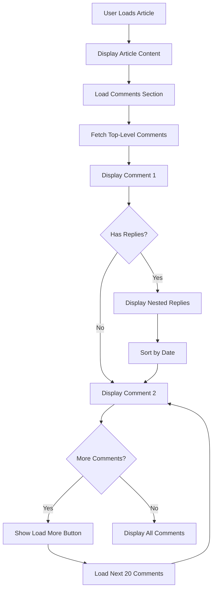
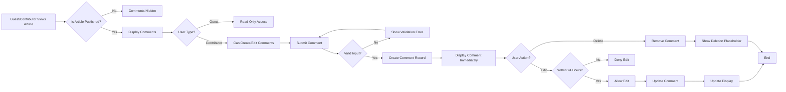
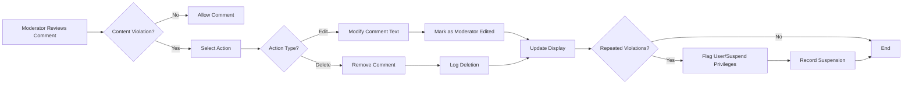

# Comments and Discussions

## Overview

The Comments and Discussions system enables registered contributors to engage in threaded conversations on articles. This section defines how comments are created, managed, moderated, and displayed to foster productive economic and political discussions while maintaining community standards.

Comments represent the core interaction mechanism of the discussion board, transforming articles from passive content into active dialogues. The system supports hierarchical threading (one level of nesting), comprehensive moderation tools, and straightforward business rules that contributors and moderators can easily understand and follow.

## Comment System Overview

### Purpose and Functionality

THE discussion board system SHALL support a comment feature that allows contributors to engage in discussions on published articles. Comments form the core interaction mechanism for the community, enabling contributors to share perspectives, ask questions, and respond to other community members.

WHEN a comment is posted on an article, THE system SHALL associate that comment with the article and its author, creating a permanent record of the discussion.

THE system SHALL display comments organized by article, showing the discussion thread in chronological order (oldest to newest, with options to sort by newest first).

THE comment system SHALL track metadata for each comment including: creation timestamp, last edited timestamp, author information, comment text content, and parent comment reference (for threaded replies).

### Comment Structure and Properties

Each comment object contains the following properties:

| Property | Type | Required | Description |
|----------|------|----------|-------------|
| commentId | UUID | Yes | Unique identifier for the comment |
| articleId | UUID | Yes | ID of the article being commented on |
| authorId | UUID | Yes | ID of the contributor who posted the comment |
| authorName | String | Yes | Display name of author at time of posting |
| content | String | Yes | Comment text content (1-5,000 characters) |
| parentCommentId | UUID | No | ID of parent comment if replying to comment (null if top-level) |
| createdAt | DateTime | Yes | ISO 8601 timestamp when comment was created |
| updatedAt | DateTime | Yes | ISO 8601 timestamp of last modification |
| deletedAt | DateTime | No | ISO 8601 timestamp if comment was deleted (null if active) |
| isDeleted | Boolean | Yes | Whether comment has been deleted by author or moderator |
| editCount | Integer | Yes | Number of times comment has been edited (starts at 0) |
| replyCount | Integer | Yes | Number of direct replies to this comment |
| articlePublicationStatus | String | Yes | Cached publication status of parent article at time comment was posted |

## Creating and Managing Comments

### Comment Creation Requirements

WHEN a contributor submits a comment on a published article, THE system SHALL validate the comment before acceptance.

THE system SHALL require comments to contain at least 1 character and not exceed 5,000 characters in length.

IF a contributor attempts to post a comment containing only whitespace (spaces, tabs, newlines), THEN THE system SHALL reject the submission and display a validation error message: "Comment cannot be empty or contain only whitespace."

WHEN a guest (unauthenticated user) attempts to post a comment, THE system SHALL deny the action and display a message indicating that authentication is required to participate in discussions.

WHEN a contributor attempts to comment on an article that has not yet been approved by moderators, THE system SHALL deny the action since the article is not yet publicly visible.

WHEN a contributor submits a comment on a published article, THE system SHALL immediately display the new comment in the discussion thread (with the contributor's name and timestamp) without requiring approval.

THE system SHALL not allow comments to remain in a "pending approval" state - comments are either visible or rejected. If a comment violates policy, it is removed immediately by moderators, not held in pending state.

### Comment Editing and Deletion

THE contributor who authored a comment SHALL be able to edit their own comment within 24 hours of creation.

WHEN a contributor edits their comment within the allowed timeframe, THE system SHALL update the comment text, increment the editCount field, and record the updatedAt timestamp.

IF a contributor attempts to edit a comment more than 24 hours after creation, THEN THE system SHALL deny the edit request and display a message indicating the editing window has closed.

THE system SHALL display an "edited" indicator for comments that have been modified after creation. The indicator SHALL show the last edited timestamp (for example, "Last edited 2 hours ago").

THE contributor who authored a comment SHALL be able to delete their own comment at any time, regardless of how much time has passed since creation.

WHEN a contributor deletes their own comment, THE system SHALL mark the comment with isDeleted=true, record the deletion timestamp in deletedAt field, remove the comment content from display, and prevent its content from being retrieved by API requests.

THE system SHALL display a placeholder message in the discussion thread where the deleted comment existed (such as "[Comment deleted by author]"), allowing the discussion thread to remain coherent and preserving the conversation context.

WHEN a moderator deletes a comment, THE system SHALL mark isDeleted=true, record the deletion timestamp and moderator ID in the system audit log, and remove the comment from public display.

### Comment Content Requirements

THE system SHALL accept and store comment text in plain text format without HTML or formatting syntax.

THE system SHALL not support rich text formatting (bold, italic, underlining), embedded images, or attachments in comments - comments are text-only.

THE system SHALL prevent contributors from including URLs, email addresses, or other contact information in comments, rejecting comments that contain these elements with error message: "Comments cannot contain URLs or email addresses."

IF a contributor attempts to reference another user by name or mention (using @ symbol or similar convention), THE system SHALL allow the text to be posted but SHALL not create notifications or "@mention" functionality - mentions are treated as regular text without special handling.

WHEN displaying comment text, THE system SHALL escape any special characters or HTML sequences to prevent injection attacks and ensure safe display.

## Comment Threading and Discussion Structure

### Basic Threading Model

THE system SHALL support simple one-level comment threading where contributors can reply directly to an article (top-level comment) or to other comments (nested replies).

WHEN a contributor posts a reply to an existing comment, THE system SHALL record the parent-child relationship by setting the parentCommentId field and display the reply nested under its parent comment.

THE system SHALL not support deeper nesting than one level - replies to replies are not allowed; all secondary responses must reply to the original article as top-level comments.

WHEN a contributor attempts to reply to a reply (creating deeper than one-level nesting), THE system SHALL automatically redirect the reply to the top-level article, treating it as a top-level comment instead.

### Comment Display and Organization

WHEN displaying comments, THE system SHALL show the main comment (top-level) followed by any direct replies nested and indented beneath it, then display the next main comment.

WITHIN a nesting level, THE system SHALL display comments in chronological order. Default sort order is oldest first (chronological), with option for users to toggle to newest first sort.

WHEN a parent comment is deleted, THE system SHALL maintain any replies to that comment but update the reply display to indicate the parent is no longer available with message such as "[Parent comment was deleted]"

THE system SHALL calculate and display the total number of comments (including nested replies) for each article in the article header.

WHEN loading an article, THE system SHALL display the comment count prominently so contributors can see how active a discussion is.

THE system SHALL display comments incrementally using pagination, loading 20 comments per "page" or "section" to ensure article pages load quickly even with many comments.

WHEN a user reaches the pagination boundary and requests more comments, THE system SHALL load the next 20 comments and append them to the display.

### Threading Workflow Diagram

The following diagram illustrates how comments are structured and displayed:

## Comment Moderation and Enforcement

### Moderator Authorities and Permissions

WHILE logged in as a moderator, THE system SHALL provide the moderator with tools to manage all comments on the platform.

THE moderator SHALL be able to view all comments regardless of article publication status, including comments on unpublished articles.

THE moderator SHALL be able to view the full comment history of any contributor, including deleted comments and edit history.

THE moderator SHALL be able to edit the text content of any comment posted by any contributor.

WHEN a moderator edits a comment, THE system SHALL record the edit in the audit log with moderator ID and timestamp, and mark the comment with a moderator edit indicator such as "[Edited by moderator]" to maintain transparency about content modifications.

THE moderator SHALL be able to delete any comment and provide a reason for the deletion.

WHEN a moderator deletes a comment, THE system SHALL:
- Mark the comment with isDeleted=true
- Record the deletion action with moderator ID, timestamp, and deletion reason in moderation logs for audit purposes
- Remove the comment from public display
- Preserve the deletion record for compliance and audit trail requirements

THE system SHALL not restore deleted comments - deletion is permanent. Moderators cannot undelete comments that have been removed.

### Content Policy Enforcement

THE moderator SHALL enforce content guidelines by removing comments that contain:
- Hateful language or slurs targeting protected groups based on race, ethnicity, religion, gender, sexual orientation, disability status, or other protected characteristics
- Direct threats, harassment, or personal attacks directed at other users by name or account
- Spam, promotional content, or off-topic material clearly unrelated to economic or political discussion
- Misinformation presented as fact when contextually clear and contradicted by widely accepted evidence
- Repeated violations of community standards by the same user on multiple occasions

WHEN a moderator removes a comment for policy violation, THE system SHALL replace the deleted comment with a message indicating removal (such as "[Comment removed for policy violation]") visible to all users, and may optionally hide the message completely based on moderator settings preference.

THE system SHALL track which comments were removed and by which moderator, maintaining a comprehensive moderation audit log that records:
- Comment ID
- Moderator ID who removed it
- Timestamp of removal
- Reason for removal
- Original comment content (for audit purposes)

### Repeated Violations and User Suspension

IF a contributor accumulates 5 or more comments deleted for policy violations within a 30-day period, THE system SHALL flag the user for the moderation team by marking them in a "flagged for review" status.

THE moderator MAY suspend a contributor's commenting privileges if repeated violations occur, preventing them from posting new comments on any article.

WHEN a contributor's commenting privileges are suspended, THE system SHALL:
- Deny all comment submission attempts from that user
- Display a message explaining the suspension and duration
- Record the suspension with moderator ID, timestamp, and reason in the user record
- Preserve the user's existing comments as authored by them

THE moderator MAY restore a contributor's commenting privileges after a review period (typically 7-30 days depending on violation severity).

WHEN a contributor's suspension is lifted, THE system SHALL restore their ability to post comments and record the restoration action in the audit log.

## User Engagement Features

### Comment Attribution and Identity

THE system SHALL display the contributor's username and a link to their user profile above each comment.

THE system SHALL display the creation timestamp for each comment in user-friendly format (for example, "Posted 2 hours ago" or "Posted on November 18, 2025 at 2:30 PM").

WHEN a contributor views their own comment, THE system SHALL display an indicator that this comment is authored by them (such as "(You)" next to their name in parentheses).

THE system SHALL never display contributor email addresses or private contact information publicly on comments.

### Discussion Metrics and Engagement Tracking

THE system SHALL track the number of replies each comment receives as part of its metadata (replyCount field).

THE system SHALL display the reply count for each top-level comment so contributors can see which comments generated the most discussion (for example, "5 replies").

WHEN sorting comments by "Most Discussed," THE system SHALL rank comments by the number of direct replies they received in descending order (most replies first).

THE system SHALL track total view count for articles, incrementing when users load or refresh the article page.

THE system SHALL calculate and display these engagement metrics prominently so contributors understand the discussion activity level.

### Simple Discussion Context Display

THE system SHALL display the parent comment text above a reply to maintain discussion context.

WHEN a contributor is reading a reply to a comment, THE system SHALL show a collapsed or partial view of the parent comment (first 100 characters) so they understand what is being discussed without cluttering the interface.

WHEN a contributor clicks "Expand Parent" or similar control, THE system SHALL show the full parent comment text.

IF the parent comment has been deleted, THE system SHALL display a placeholder such as "[Parent comment was deleted]" instead of attempting to show deleted content.

## Comment Visibility and Access Control

### Publication State Dependencies

WHEN an article is in draft or pending approval status, THE system SHALL not display any comments on that article to guests or the general public.

ONLY THE article author and moderators SHALL be able to view comments on unpublished articles.

WHEN an article is published and approved, THE system SHALL display all published comments to all users (guests and contributors).

THE system SHALL prevent contributors from posting comments on unpublished articles to keep discussions focused on public content.

WHEN an article transitions from draft to published, THE system SHALL immediately make all comments on that article visible to guests and contributors.

### Guest Access to Comments

WHEN a guest views a published article, THE system SHALL display all published comments in the discussion thread without requiring authentication.

WHEN a guest attempts to post a comment, THE system SHALL display a prompt to log in or create an account before allowing participation.

THE system SHALL not restrict reading or browsing of comments to guests - read access is completely public for published articles.

THE system SHALL allow guests to view contributor profiles and comment history without authentication.

### Contributor Access to Comments

WHEN a contributor views an article, THE system SHALL display all published comments in the discussion thread.

THE contributor SHALL be able to view and interact with comments from other contributors.

THE contributor MAY post new comments, edit their own comments (within 24 hours), and delete their own comments at any time.

THE contributor SHALL NOT be able to view, edit, or delete comments posted by other contributors.

### Moderator Access to Comments

WHEN a moderator views an article, THE moderator SHALL see all comments regardless of publication or deletion status.

THE moderator SHALL be able to view deleted comments and understand why they were deleted by reviewing moderation logs.

THE moderator SHALL be able to edit, delete, or restore any comment's visibility status.

## Error Handling and Edge Cases

### Input Validation Errors

IF a contributor submits a comment that exceeds 5,000 characters, THEN THE system SHALL reject the submission and display an error message: "Comment must be 5,000 characters or fewer."

IF a contributor submits a blank or whitespace-only comment, THEN THE system SHALL reject the submission and display an error message: "Comment cannot be empty."

IF a contributor attempts to post a comment while not authenticated, THEN THE system SHALL deny the action and prompt for login.

IF a contributor attempts to post a comment on a non-existent article, THEN THE system SHALL return a "not found" error (HTTP 404) to the user interface.

IF a contributor attempts to post a comment on an article in non-published status, THEN THE system SHALL return HTTP 403 Forbidden error with message: "Cannot comment on unpublished articles."

IF a contributor's comment contains prohibited content (URLs, email addresses), THEN THE system SHALL reject with specific error message indicating which type of content is not allowed.

### Editing and Deletion Errors

IF a contributor attempts to edit a comment they did not author, THEN THE system SHALL deny the action with error message: "You can only edit your own comments."

IF a contributor attempts to edit a comment more than 24 hours after creation, THEN THE system SHALL deny the action with error message: "Comments can only be edited within 24 hours of creation."

IF a contributor attempts to delete a comment that was already deleted, THEN THE system SHALL handle gracefully and display a message: "This comment is no longer available."

IF a contributor attempts to edit a comment that has been deleted by a moderator, THEN THE system SHALL deny the action with message: "This comment has been removed and cannot be edited."

IF a moderator attempts to delete a comment that is already deleted, THEN THE system SHALL handle gracefully without error, recognizing the desired state is already achieved.

### Thread and Parent Errors

IF a contributor attempts to reply to a comment that has been deleted, THEN THE system SHALL prevent the reply and display: "Cannot reply to a deleted comment."

IF a contributor attempts to reply to a reply (creating deeper than one-level nesting), THEN THE system SHALL automatically redirect the reply to the top-level article instead, and display a message: "Replies to replies are not supported. Your comment has been posted as a response to the article instead."

IF a contributor views an article and a parent comment is deleted during their viewing session, THEN THE system SHALL update the display in real-time or on refresh to show the parent deletion placeholder.

### Concurrent Modification

IF two contributors simultaneously attempt to edit the same comment (which would only be possible if they authored the same comment, which cannot happen), THE system SHALL deny the second request automatically since only one author per comment is supported.

IF a moderator begins editing a comment while a contributor is also viewing it, THE system SHALL process the moderator edit successfully and notify the contributor that the comment has been modified if they attempt to interact with it.

IF a contributor is typing a comment when the article is archived or deleted, THE system SHALL preserve their text in local browser storage and display message: "This article has been archived. Your comment draft has been saved."

### Concurrent Deletion

IF a moderator deletes a comment while a contributor is viewing the discussion thread, THE system SHALL remove the comment from display on next refresh and show deletion placeholder.

IF a contributor deletes their own comment while a moderator is viewing the moderation queue, THE system SHALL mark the comment as deleted but maintain audit trail showing both actions.

### Reply and Threading Errors

IF a contributor creates a reply to a comment, and the parent comment is deleted before the reply is submitted, THE system SHALL either prevent the reply with error message "Parent comment no longer exists" or automatically convert it to a top-level comment on the article.

IF a contributor attempts to reply to their own comment, THE system SHALL allow this (self-reply is permitted) and create a normal parent-child relationship.

### Article Deletion Impact

WHEN an article is deleted, THE system SHALL preserve all comments associated with that article in the database but mark them as orphaned with reference to deleted article.

IF a user attempts to view comments on a deleted article, THE system SHALL return not found error.

## Discussion Workflow

The following diagram illustrates the typical workflow for commenting and discussion:

## Comment Moderation Workflow

The following diagram shows how moderators manage and enforce comment policies:

## Summary of Key Business Rules

To summarize the core requirements for comment management:

**Temporal Constraints**
- Comments can be edited within 24 hours of creation only
- Comments can be deleted at any time by author
- Moderation audit logs preserve deletion history indefinitely

**Content Constraints**
- Comments must be 1-5,000 characters
- No URLs, email addresses, or HTML content
- No embedded images or file attachments
- Plain text only

**Threading Constraints**
- One level of nesting only (replies to articles, replies to comments)
- Replies to replies are automatically converted to top-level replies
- Deleted parent comments preserve their replies

**Visibility Constraints**
- Comments only visible when article is published
- Guests can read but not write comments
- Contributors can only edit/delete their own comments
- Moderators can view and modify all comments

**Moderation Constraints**
- Comments are published immediately without approval
- Moderators can edit or delete comments with full audit trail
- 5+ violations in 30 days triggers user suspension
- Suspensions are reversible by moderators

---

> *Developer Note: This document defines **business requirements only**. All technical implementations (architecture, APIs, database design, etc.) are at the discretion of the development team.*