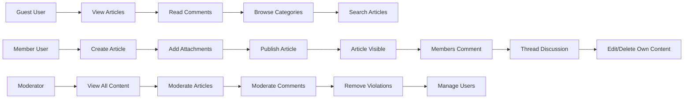

# Core Features Requirements

## Overview

This document specifies the primary features and functionality of the Discussion Board platform. The system is designed as a minimal, straightforward platform for economic and political discussions, with core capabilities for creating articles, commenting on content, and sharing attachments.

The discussion board operates on three user roles (Guest, Member, and Moderator) and focuses on essential features without unnecessary complexity.

## Article Management

### Article Creation

WHEN a member creates a new article, THE system SHALL collect and store the following information:
- Article title (required, text)
- Article body/content (required, text)
- Author name (automatically captured from the logged-in member)
- Creation timestamp (automatically captured)
- Optionally, attached images and files
- Optional category or topic tag for organization

THE system SHALL validate that articles contain meaningful content before acceptance.

### Article Structure & Metadata

THE article SHALL store the following metadata:
- Unique article identifier
- Author (member who created it)
- Title and content body
- Creation date and time
- Last modified date and time (if edited)
- Current edit status (original or edited)
- View count or engagement metrics (optional)
- Attached files and images (if any)

WHEN a member views an article, THE system SHALL display all stored metadata along with the article content.

### Article Editing & Deletion

WHEN a member edits an article, THE system SHALL:
- Allow modification of title and content body
- Update the "last modified" timestamp
- Retain the original creation date
- Preserve attachment associations

WHEN a member deletes an article, THE system SHALL:
- Remove the article from public view
- Remove associated comments
- Remove associated attachments
- Archive the deletion (for audit purposes, if applicable)

IF a member attempts to edit or delete another member's article, THEN THE system SHALL deny the action and display an appropriate access denial message.

### Article Visibility

THE system SHALL make all articles visible to guests and members by default (no article approval workflow required for simplicity).

WHEN a moderator identifies inappropriate content, THE system SHALL provide the ability to remove articles immediately.

WHERE an article is removed by moderation, THE system SHALL:
- Remove it from public view
- Retain a record of the removal for audit purposes
- Remove associated comments and attachments

### Article Permissions

**WHEN a guest user attempts to create an article, THE system SHALL deny the request and direct them to login or register.**

**WHEN a member is authenticated, THE member SHALL have permission to create new articles.**

**WHEN a moderator is authenticated, THE moderator SHALL have permission to create articles with the same capabilities as members.**

### Article Validation

**THE system SHALL require article titles to be between 5 and 200 characters in length.**

**THE system SHALL require article content to be at least 20 characters in length.**

**IF an article or comment is submitted with empty or invalid content, THEN THE system SHALL reject the submission and request valid input.**

## Comment System

### Comment Creation

WHEN a member creates a comment on an article, THE system SHALL collect and store:
- Comment text (required, text)
- Author (automatically captured from the logged-in member)
- Parent article reference
- Creation timestamp
- Optional parent comment reference (if replying to another comment)

WHEN a guest views an article, THE system SHALL display all comments but prevent comment creation with an appropriate message.

### Comment Threading

THE system SHALL support threaded/nested comments to allow members to reply directly to other comments.

WHEN a member replies to a comment, THE system SHALL:
- Associate the new comment with the parent comment
- Display the reply as indented or grouped under the parent comment
- Maintain the reply chain in chronological order

THE system SHALL display comments in a nested structure showing original comments and their replies at multiple levels.

### Comment Editing & Deletion

WHEN a member views their own comment, THE system SHALL provide options to edit or delete the comment.

WHEN a member edits a comment, THE system SHALL:
- Allow modification of the comment text
- Update the "last modified" timestamp
- Preserve the reply chain (if it's a reply)

WHEN a member deletes a comment, THE system SHALL:
- Remove the comment from public view
- Remove any replies to that comment (cascade delete)
- Archive the deletion

IF a member attempts to edit or delete another member's comment, THEN THE system SHALL deny the action.

### Comment Management

THE system SHALL display comments in chronological order (oldest first, or newest first as a configuration option).

WHERE a comment exceeds reasonable length (e.g., 5000 characters), THE system MAY truncate the display with an option to expand and read the full comment.

### Comment Validation

**THE system SHALL require comments to be between 1 and 5000 characters in length.**

**IF a comment is submitted with empty content, THEN THE system SHALL reject the submission and request valid input.**

### Comment Permissions

**THE member user SHALL have the ability to post comments on any published article.**

**THE member user SHALL be able to edit or delete their own comments.**

**WHEN a member attempts to edit or delete another member's comment, THE system SHALL deny the request.**

**THE member user SHALL be able to view and manage their own comments.**

## Attachment Support

### Supported File Types

THE system SHALL support the following attachment types:
- Image files: JPEG, PNG, GIF, WebP
- Document files: PDF, DOC, DOCX, TXT
- Archive files: ZIP

### File Size Limits

THE system SHALL enforce the following size constraints:
- Individual image files: maximum 10 MB per image
- Individual document/file attachments: maximum 20 MB per file
- Total attachments per article: maximum 5 files (including images)
- Total attachments per comment: maximum 1 file (for simplicity)

IF a user attempts to upload a file exceeding these limits, THEN THE system SHALL reject the upload and display a clear message indicating the specific limit exceeded.

### Image Handling

WHEN a member attaches an image to an article or comment, THE system SHALL:
- Store the image file
- Display a thumbnail preview in the article/comment view
- Allow clicking the thumbnail to view the full-size image
- Automatically optimize image dimensions for web display

THE system SHALL display images inline within article and comment content.

### File Upload Process

WHEN a member creates or edits an article, THE system SHALL:
- Provide an attachment upload interface
- Allow drag-and-drop or file selection for uploading
- Validate file types and sizes before acceptance
- Store uploaded files securely
- Associate files with the article

WHEN a member adds a comment, THE system SHALL:
- Allow optional attachment of a single file
- Validate file type and size
- Display the attachment in the comment view

### Attachment Validation

IF a user attempts to upload a file with an unsupported type, THEN THE system SHALL reject it with a message listing allowed file types.

IF a user attempts to upload multiple files in a single action, THE system SHALL process them individually and validate each file separately.

### Attachment Permissions

**THE member SHALL be able to upload attachments to their own articles and comments.**

**THE member SHALL be able to delete their own attachments.**

**THE member SHALL NOT be able to delete other users' attachments.**

**THE system SHALL allow guests to download publicly visible attachments.**

## Content Discovery

### Article Listing

THE system SHALL display articles in a list view showing:
- Article title (clickable to view full article)
- Author name
- Creation date
- Brief preview of the article content (first 200 characters)
- Comment count (number of comments on the article)
- View count or engagement indicator (optional)

THE system SHALL display articles in reverse chronological order (newest first) by default.

### Browsing & Pagination

THE system SHALL organize article listings in pages with a reasonable number of articles per page (e.g., 20 articles per page).

WHEN a member navigates to the discussion board homepage, THE system SHALL display the first page of articles.

THE system SHALL provide navigation controls (previous/next page) to allow users to browse through article listings.

### Search Functionality (Basic)

THE system SHALL provide a simple search function that allows members and guests to search articles by:
- Article title (case-insensitive matching)
- Article content (keyword search in body text)
- Author name (search by poster)

WHEN a user enters a search query, THE system SHALL return matching articles and display them in search results.

### Article Detail View

WHEN a user clicks on an article from the list, THE system SHALL display the full article detail page showing:
- Complete article title
- Author name with publication date
- Last modified date (if different from creation date)
- Category badge
- Full article content
- View count
- All attached images displayed inline
- All attached files listed with download links
- All comments and replies on the article
- Comment submission form (for authenticated members only)

### View Count Tracking

WHEN a user loads an article detail page, THE system SHALL increment the view count by 1.

THE updated view count SHALL be immediately visible to the user.

## User Management & Capabilities

### Guest User Capabilities

THE guest user role SHALL have the ability to:
- View all public articles
- Read all comments and replies
- Browse the article listing
- Search articles by title, content, or author

THE guest role SHALL NOT have the ability to:
- Create articles
- Create comments
- Upload attachments
- Edit any content
- Delete any content

### Member User Capabilities

**THE member user SHALL have the ability to create new articles on any topic within the discussion board.**

**THE member user SHALL be able to upload images and file attachments to articles they create.**

**THE member user SHALL be able to edit their own articles at any time after creation.**

**THE member user SHALL be able to delete their own articles and associated attachments.**

**THE member user SHALL be able to post comments on any published article.**

**THE member user SHALL be able to edit or delete their own comments.**

**THE member user SHALL be able to view and manage their own profile information and preferences.**

**WHEN a member user logs out, THE system SHALL terminate their session and invalidate their authentication token.**

### Moderator User Capabilities

**THE moderator user SHALL have access to all member features and capabilities.**

**THE moderator user SHALL have the ability to view, edit, and delete any article on the platform regardless of author.**

**THE moderator user SHALL have the ability to view, edit, and delete any comment on the platform regardless of author.**

**THE moderator user SHALL have the ability to remove or moderate user-uploaded attachments that violate guidelines.**

**THE moderator user SHALL have access to a moderation dashboard showing all articles, comments, and user accounts.**

**THE moderator user SHALL be able to view detailed information about any user account.**

**THE moderator user SHALL have the ability to suspend or restrict member accounts that violate community guidelines.**

**THE moderator user SHALL have access to platform analytics and statistics.**

## Permission Matrix

The following matrix summarizes what each user actor can do within the discussion board system:

| Action | Guest | Member | Moderator |
|--------|-------|--------|-----------|\n| View published articles | ✅ | ✅ | ✅ |
| Create articles | ❌ | ✅ | ✅ |
| Edit own articles | ❌ | ✅ | ✅ |
| Edit others' articles | ❌ | ❌ | ✅ |
| Delete own articles | ❌ | ✅ | ✅ |
| Delete others' articles | ❌ | ❌ | ✅ |
| View draft articles | ❌ | Own only | ✅ |
| View comments | ✅ | ✅ | ✅ |
| Post comments | ❌ | ✅ | ✅ |
| Edit own comments | ❌ | ✅ | ✅ |
| Edit others' comments | ❌ | ❌ | ✅ |
| Delete own comments | ❌ | ✅ | ✅ |
| Delete others' comments | ❌ | ❌ | ✅ |
| View attachments | ✅ | ✅ | ✅ |
| Download attachments | ✅ | ✅ | ✅ |
| Upload attachments to own articles | ❌ | ✅ | ✅ |
| Delete own attachments | ❌ | ✅ | ✅ |
| Delete others' attachments | ❌ | ❌ | ✅ |
| Access moderation dashboard | ❌ | ❌ | ✅ |
| View audit logs | ❌ | ❌ | ✅ |
| Suspend or ban users | ❌ | ❌ | ✅ |
| Search articles | ✅ | ✅ | ✅ |
| Filter articles by category | ✅ | ✅ | ✅ |

## Business Rules for Features

### Content Validation

THE system SHALL require article titles to be between 5 and 200 characters in length.

THE system SHALL require article content to be at least 20 characters in length.

THE system SHALL require comments to be between 1 and 5000 characters in length.

IF an article or comment is submitted with empty or invalid content, THEN THE system SHALL reject the submission and request valid input.

### Attachment Validation

WHEN a user uploads an attachment, THE system SHALL validate:
- File type is in the supported list
- File size does not exceed the specified limit per file type
- Total attachments per content do not exceed the limit
- File content matches declared file type (prevent disguised files)

IF validation fails, THE system SHALL reject the attachment and display a specific error message.

### Engagement Tracking

THE system SHALL track the number of times each article is viewed and display this count to users.

THE system SHALL display the comment count on each article in the listing view.

### Article & Comment Timestamps

THE system SHALL display all timestamps in the user's local timezone when possible, or in UTC with clear indication.

WHEN an article or comment is edited, THE system SHALL show "Edited" indicator with the edit timestamp visible to users.

### Performance Expectations

WHEN loading the article listing page, THE system SHALL display results within 2 seconds for normal conditions.

WHEN viewing a single article with comments, THE system SHALL display the full article and all comments within 2 seconds.

WHEN searching for articles, THE system SHALL return results within 3 seconds for typical queries.

WHEN uploading a file attachment, THE system SHALL complete the upload and confirmation within 10 seconds for typical file sizes (under 10 MB).

### Minimal Design Constraints

THE discussion board features SHALL remain straightforward without:
- Complex recommendation algorithms
- Advanced analytics dashboards
- Social networking features (follows, likes, sharing)
- Private messaging systems
- Content rating or voting systems (in initial version)

Focus SHALL remain on core article creation, commenting, and attachment capabilities.

## Feature Interactions Summary

The core feature workflow operates as follows:

1. **Guest Access**: Guests can browse articles and read comments but cannot create content
2. **Member Participation**: Members create articles, add comments, attach files, and manage their own content
3. **Attachment Integration**: Files and images are attached during article/comment creation and displayed inline
4. **Discussion Threading**: Comments and replies create natural discussion threads under articles
5. **Content Discovery**: Articles are discoverable through browsing, pagination, and basic search
6. **Moderation Oversight**: Moderators maintain content quality by removing policy violations
7. **Timestamp Tracking**: All content shows creation and modification times for transparency

This minimal feature set provides the essential discussion board functionality while avoiding unnecessary complexity.

### Feature Interaction Diagram

---

> *Developer Note: This document defines **business requirements only**. All technical implementations (architecture, APIs, database design, etc.) are at the discretion of the development team.*