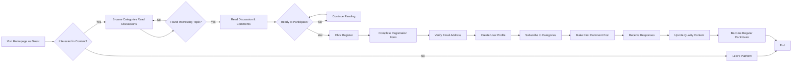
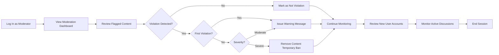
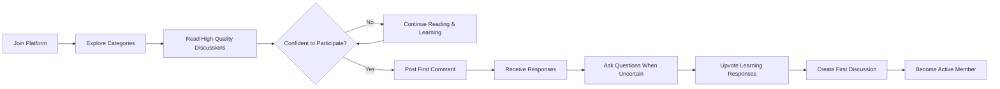

# User Personas and Scenarios

## Overview

This document presents detailed user personas and realistic usage scenarios for the Economic and Political Discussion Board. These personas represent the typical users who will interact with the system, their motivations, goals, pain points, and common workflows. Understanding these personas helps the development team build features that directly address user needs and behaviors.

The personas are based on the four user roles in the system: Guest, Member, Moderator, and Administrator. For each persona, we provide background context, primary goals, frustrations, technical comfort level, and typical interaction patterns. Each persona is supported by multiple realistic scenarios demonstrating their key workflows.

---

## User Personas

### Persona 1: Sarah Chen - The Curious Learner (Guest/New Member)

**Demographics**
- Age: 28 years old
- Occupation: Marketing Professional
- Education: Bachelor's degree in Communications
- Technical Comfort: Moderate (comfortable with social media, email, basic web navigation)
- Location: Urban area (New York)
- Tenure: New user (first time on platform)
- Annual Income: $65,000-$85,000
- Device: Primarily laptop, occasionally mobile

**Background**
Sarah is interested in economics and politics but feels overwhelmed by traditional news outlets with their polarized viewpoints. She wants to learn different perspectives in a casual, community-driven environment. She's new to online forums and prefers intuitive interfaces. She has limited time, often browsing during lunch breaks or evenings. She actively uses Twitter and LinkedIn but finds them too sensational for substantive discussion.

**Motivations**
- Learn about economic policies and their real-world implications
- Understand different political perspectives without judgment
- Discover thoughtful discussions rather than extreme viewpoints
- Build knowledge gradually without feeling pressured
- Connect with other curious individuals interested in learning
- Find balanced analysis from credible sources
- Participate without fear of ridicule or attack

**Primary Goals**
- Browse existing discussions to find topics of interest
- Read multiple viewpoints on current economic issues
- Ask questions without fear of ridicule
- Find reliable, fact-based discussions
- Understand complex topics through community explanations
- Become comfortable enough to post her own questions
- Build a profile as a thoughtful participant

**Frustrations**
- Overwhelmed by information overload on mainstream platforms
- Worried about being attacked for asking "stupid questions"
- Can't find balanced discussions in one place
- Struggles to distinguish credible sources from misinformation
- Tired of echo chambers that only reinforce existing beliefs
- Difficulty understanding jargon and economic terminology
- Hesitant to participate in communities of experts
- Doesn't want to create yet another account on another platform

**Technical Comfort Level**: 6/10 - Comfortable with basic web navigation but may need clear guidance for advanced features. Prefers mobile-friendly interfaces.

**Value Proposition for Sarah**
- Safe environment to ask questions and learn
- Clear community guidelines that discourage attacks
- Mix of beginner-friendly and expert contributions
- Organized by topic so she can easily find interests
- Ability to follow topics she cares about

---

### Persona 2: Marcus Johnson - The Active Discussant (Member)

**Demographics**
- Age: 45 years old
- Occupation: Economics Professor
- Education: PhD in Economics
- Technical Comfort: High (uses multiple platforms, comfortable with technology)
- Location: University city (Boston)
- Tenure: Established online participant (5+ years in other forums)
- Annual Income: $120,000-$150,000
- Device: Desktop workstation and laptop

**Background**
Marcus is passionate about economics and enjoys sharing his expertise with a broader audience beyond his students. He actively participates in online discussions, values intellectual debate, and respects well-reasoned arguments. He has substantial knowledge but isn't dogmatic and enjoys learning from others' perspectives. He uses the platform 3-4 times per week, often spending 30-60 minutes per session.

Marcus has credentials (PhD) and publication history that establish his expertise. He's frustrated with existing forums that don't distinguish between casual users and subject matter experts. He values platforms where quality contributions are recognized and rewarded.

**Motivations**
- Share economic expertise with engaged audiences
- Engage in intellectual debate and refined discussion
- Learn about real-world applications of economic theory
- Mentor younger or less-experienced participants
- Build a reputation as a thoughtful contributor
- Have substantive conversations beyond soundbites
- Influence economic discourse at the community level
- Help combat misinformation with evidence-based analysis

**Primary Goals**
- Create in-depth discussion topics about economic policy
- Provide detailed comments with evidence and reasoning
- Respond to questions and guide discussions toward deeper understanding
- Vote on valuable contributions and downvote misinformation
- Edit and refine his own posts to ensure clarity
- Find discussions where he can apply his expertise
- Build a trusted reputation on the platform
- Mentor users asking questions about economic concepts

**Frustrations**
- Discussions derail into personal attacks instead of staying focused
- Low-quality contributions get as much visibility as thoughtful analysis
- Lack of moderation allows misinformation to spread unchallenged
- Can't easily find discussions in his area of expertise
- Time spent writing detailed responses ignored in favor of quick quips
- Trolls and bad-faith actors disrupting serious discussions
- Difficulty establishing credibility when everyone is anonymous
- Exhaustion from repeating basic economic concepts to new users
- No recognition system for sustained quality contributions

**Technical Comfort Level**: 9/10 - Very comfortable with technology, expects efficient workflows and advanced features. Values keyboard shortcuts and API access for tools.

**Value Proposition for Marcus**
- Ability to establish credibility through profile and contribution history
- Quality moderation that removes low-quality contributions
- Reputation system recognizing valuable contributions
- Community of genuine learners and fellow experts
- Tools for deep engagement and detailed discussion
- Platform prioritizing substance over virality

---

### Persona 3: Jennifer Patel - The Community Defender (Moderator)

**Demographics**
- Age: 36 years old
- Occupation: Community Manager (works remotely)
- Education: Bachelor's degree in Sociology
- Technical Comfort: High (extensive experience managing online communities)
- Location: Remote (San Francisco area)
- Tenure: 10+ years of online community moderation experience
- Annual Income: $90,000-$110,000
- Device: Laptop with multiple browser tabs, mobile for monitoring

**Background**
Jennifer has 10 years of experience moderating online communities and is passionate about maintaining healthy discourse. She volunteers as a moderator because she believes in the mission of facilitating balanced political and economic discussion. She spends 5-10 hours per week maintaining the community and follows clear community guidelines. She's detail-oriented, fair-minded, and committed to treating all users with respect.

Jennifer has successfully moderated communities of varying sizes, from 500 members to 50,000 members. She understands the psychology of community dynamics and recognizes when discussions are becoming toxic. She believes moderation should educate rather than punish.

**Motivations**
- Maintain a respectful, fact-based community
- Prevent harassment and toxic behavior
- Help users understand community standards
- Build a safe space for genuine learning and debate
- Empower users through clear communication
- Prevent misinformation from spreading unchallenged
- Create a community where all perspectives are welcome
- Watch the community grow and mature healthily

**Primary Goals**
- Monitor discussions for policy violations
- Review flagged content and determine appropriate action
- Respond to user reports with fair decisions
- Remove inappropriate content while preserving discussion value
- Issue warnings and temporary restrictions when necessary
- Communicate decisions clearly to users
- Pin important or exemplary discussions
- Work collaboratively with other moderators
- Educate violators rather than just punishing them
- Track patterns of repeat violators
- Maintain moderation logs and decision documentation

**Frustrations**
- Difficult to monitor all discussions efficiently
- Unclear guidelines create inconsistent enforcement
- Users appeal decisions without understanding why actions were taken
- High volume of false reports wastes time
- Difficult to distinguish between passionate debate and hostile behavior
- Lack of tools to identify repeat violators quickly
- Burnout from constantly dealing with conflicts
- Lack of recognition for volunteer moderation work
- Pressure to make split-second decisions with incomplete information
- Coordinated harassment campaigns targeting vulnerable users

**Technical Comfort Level**: 8/10 - Very comfortable with tools and systems, expects efficient moderation interfaces. Appreciates keyboard shortcuts and automation.

**Value Proposition for Jennifer**
- Clear, well-documented community guidelines
- Moderation tools that make her job efficient
- Collaboration features for moderator team coordination
- Appeal process that's fair and transparent
- Metrics showing impact of her moderation work
- Recognition system for moderator contributions
- Training and support materials for consistent enforcement

---

### Persona 4: David Rodriguez - The System Manager (Administrator)

**Demographics**
- Age: 52 years old
- Occupation: Chief Technology Officer / Platform Owner
- Education: Bachelor's degree in Computer Science
- Technical Comfort: Very High (20+ years in technology leadership)
- Location: Startup office (Austin)
- Tenure: 20+ years in tech, 2+ years with this platform
- Annual Income: $200,000+ plus equity
- Device: Multi-monitor workstation

**Background**
David founded the discussion board platform because he believed in the need for a space for nuanced economic and political discussion. He manages the overall platform health, business direction, and ensures the system runs smoothly. He's data-driven, strategic, and deeply invested in the platform's success. He spends significant time on platform management but delegates day-to-day operations to moderators.

David has founded two previous tech companies and has experience scaling platforms from launch to maturity. He understands the technical architecture deeply and can review code decisions. He's equally comfortable talking with investors, moderators, and developers.

**Motivations**
- Build a thriving, sustainable community platform
- Grow user base while maintaining quality standards
- Ensure platform stability and performance
- Create a positive social impact on discourse
- Understand user behavior through analytics
- Make data-driven decisions about features and policies
- Build trust and credibility in the community
- Achieve business sustainability through growth

**Primary Goals**
- Monitor overall platform health and performance
- Create and manage discussion categories
- Recruit and manage moderator team
- Review and enforce platform policies
- Analyze user metrics and engagement
- Make decisions about new features and improvements
- Handle escalated moderation issues
- Maintain security and data integrity
- Plan for platform growth and scaling
- Communicate platform vision to users and investors
- Track key business metrics and growth targets
- Manage platform budget and resources

**Frustrations**
- Limited visibility into what's happening across discussions
- Difficulty scaling moderation as user base grows
- Balancing free speech with community safety
- Technical limitations preventing features users want
- Users misunderstanding platform policies
- Handling edge cases and policy disputes
- Keeping moderation team consistent and fair
- Managing rapid growth while maintaining quality
- Pressure to grow metrics while maintaining integrity
- Balancing business sustainability with community mission

**Technical Comfort Level**: 9/10 - Expert level, expects sophisticated analytics and administrative tools. Reviews code commits and infrastructure decisions.

**Value Proposition for David**
- Real-time analytics and business intelligence
- Scalable architecture supporting growth
- Efficient moderation team management
- Clear metrics for community health
- Tools for policy enforcement
- Business viability through sustainable growth
- Technical infrastructure he can trust

---

## Primary User Scenarios

These scenarios represent the most common workflows users encounter when actively participating in the platform.

### Scenario 1: Sarah Discovers and Joins the Platform

**Context**: Sarah heard about the discussion board from a friend and wants to see if it's worth joining. She's skeptical of online communities but willing to try.

**Primary Goal**: Explore the platform, understand its purpose, and decide whether to register

**Workflow Steps**:

1. Sarah visits the discussion board homepage as a guest
2. She reviews the description and community guidelines to understand the platform's purpose
3. She browses several discussion topics in different categories (Economics, Politics) without logging in
4. She reads 5-6 comments from different discussions to gauge the quality of conversations
5. She notices thoughtful responses with citations and respectful disagreement, which impresses her
6. She clicks "Register" because she wants to participate
7. She provides email, creates username "SarahC28", sets password meeting requirements (8+ chars, mixed case, numbers, special chars)
8. She receives verification email and clicks the link to activate her account within the 24-hour window
9. She completes her profile (adds bio: "Marketing professional interested in learning economics")
10. She browses the categories and subscribes to "Economic Policy" and "International Trade"
11. She closes the browser, planning to return later

**Outcome**: Sarah successfully joins the community and has a positive first impression. She's set up for her first participation. Her account transitions from "guest" to "member" role upon email verification.

**System Requirements Identified**:
- WHEN a guest user visits the homepage, THE system SHALL display a clear description of the platform's purpose and community guidelines
- WHEN a guest user browses discussions without authentication, THE system SHALL allow viewing all public discussions and comments
- WHEN a guest user clicks Register, THE system SHALL require email, username, and password with clear validation feedback
- WHEN a new user registers, THE system SHALL send a verification email within 30 seconds with a link expiring after 24 hours
- WHEN a user clicks the verification link, THE system SHALL activate their account and allow them to create discussions and comments
- WHEN a new member completes their profile, THE system SHALL add their bio to their public profile (maximum 500 characters)
- WHEN a member subscribes to a category, THE system SHALL track this preference and customize their discovery experience
- THE system SHALL display all public discussions to guests, showing title, creator, date, comment count, and vote count

---

### Scenario 2: Marcus Creates and Moderates a High-Quality Discussion

**Context**: Marcus recently read about proposed changes to capital gains taxation and wants to start a discussion about the economic implications.

**Primary Goal**: Create a high-quality discussion topic, manage responses, and guide discussion toward deeper understanding

**Workflow Steps**:

1. Marcus logs in with his email and password (system validates within 1 second)
2. He navigates to the "Economic Policy" category
3. He clicks "Create New Discussion"
4. THE system validates:
   - He hasn't exceeded his daily limit of 10 discussions (he's created 1 today, so he has 9 remaining)
   - His email is verified (it is)
   - He's not currently muted or banned (he's not)
5. He enters title: "Analyzing Proposed Capital Gains Tax Restructuring: Economic Implications" (94 characters, within 5-200 character limit)
6. He writes a detailed first post explaining:
   - Current capital gains tax structure
   - Proposed changes with citations to policy documents
   - Theoretical economic impacts (with links to academic sources)
   - Questions for community discussion
   - 2,847 characters (within 20-5,000 character limit)
7. He selects the discussion visibility as "Public" (visible to all)
8. He clicks "Preview" to see formatted content
9. He posts the discussion (system stores it with status "Active", records his username, timestamp, category, and vote count initialized to 0)
10. Within 5 minutes, several members respond with questions and alternative viewpoints
11. Marcus reads each response carefully within 30 minutes
12. He responds to substantive comments with detailed explanations (each reply 500-1,200 characters)
13. He notices one comment misrepresenting economic theory; he responds with correction and citation
14. He upvotes 3 comments that add value to the discussion (system updates vote count instantly for him)
15. A few days later, the discussion has 47 comments from 12 different users
16. Marcus reviews the thread, edits his original post to add new context based on feedback (edit made within 7-day window, marked as "[edited 2 days ago]")
17. He marks the discussion as high-quality (if feature available) or requests it be pinned in the category
18. He reflects on the quality discussions and is satisfied with the community engagement

**Outcome**: A high-quality discussion develops with multiple perspectives, evidence-based arguments, and genuine learning. The discussion becomes a reference point for others interested in this topic. Marcus's reputation score increases with each upvote received (+2 points per upvote on comments, +10 per upvote on discussion).

**System Requirements Identified**:
- WHEN a member creates a new discussion, THE system SHALL validate title (5-200 chars), description (20-5,000 chars), and category selection
- WHEN a discussion is created, THE system SHALL initialize vote count to 0 and record creator, timestamp, and category
- WHEN members respond to a discussion within 24 hours, THE system SHALL send notifications to the discussion creator and previous commenters
- WHEN a member edits content within 24 hours of creation, THE system SHALL allow editing and display "[edited X hours ago]" marker
- WHEN a member edits content after 24 hours, THE system SHALL reject the edit request with error message
- WHEN a member votes on a discussion or comment, THE system SHALL update vote count within 500 milliseconds
- WHEN a moderator pins a discussion, THE system SHALL move it to top of category and display "PINNED" indicator
- THE system SHALL support nested comments up to 5 levels deep
- WHEN a discussion accumulates 50+ comments, THE system SHALL paginate comments with "Load More" option

---

### Scenario 3: Sarah Asks a Question and Learns from Community

**Context**: Sarah is reading a discussion about fiscal policy but doesn't understand a referenced economic concept. She wants to ask without looking foolish.

**Primary Goal**: Ask a clarifying question and receive helpful educational responses

**Workflow Steps**:

1. Sarah reads a discussion about "monetary policy transmission mechanisms"
2. She encounters the term "liquidity trap" but isn't familiar with it
3. She considers not asking because she feels embarrassed about her knowledge level
4. She re-reads the community guidelines section (visible at bottom of each discussion) emphasizing respectful learning
5. The guidelines state: "Questions are encouraged. We're all here to learn. Disrespect and condescension are not tolerated."
6. She feels encouraged and clicks "Reply" to the discussion thread
7. THE system opens a comment composition form with text field (1-2,000 character limit) and preview option
8. She types: "I'm newer to economics - could someone explain what a 'liquidity trap' is? How does it affect policy options?" (87 characters, well within limit)
9. She reviews preview showing her comment formatted correctly
10. She clicks "Post Comment"
11. THE system:
    - Validates comment length
    - Records comment with timestamp, parent discussion ID, her username
    - Increments comment count on discussion
    - Sends notifications to discussion author and previous commenters
    - Displays comment immediately in thread
    - Initializes vote count to 0
12. Within 2 hours, Marcus (the economics professor) replies with:
    - Clear definition in simple language
    - Real-world example of liquidity trap (Japan's experience in 1990s)
    - Link to academic resource for further learning
    - Approximately 800 characters
13. Another member provides a different explanation focused on policy implications
14. Sarah reads both responses (each response takes 2-3 minutes to understand)
15. Sarah upvotes both responses (system updates vote counts to 1 for each, marks her as having voted)
16. She clicks on Marcus's profile to see his other contributions (viewing his reputation score, discussion history, and credentials)
17. She feels appreciated and more confident participating
18. She returns to the platform the next day to continue learning from the discussion

**Outcome**: Sarah receives educational value from the community and feels encouraged to continue participating. The teaching moment reinforces the platform's value. Her positive experience increases her likelihood of becoming a regular contributor.

**System Requirements Identified**:
- WHEN a member posts a comment, THE system SHALL validate length (1-2,000 characters)
- WHEN a comment is posted, THE system SHALL notify the discussion author and all previous commenters
- WHEN a new member posts a comment, THE system SHALL NOT have edit restrictions for 24 hours
- WHEN a member upvotes a comment, THE system SHALL immediately update vote count and show visual feedback within 500ms
- WHEN a member views a user's profile, THE system SHALL display their contribution history and reputation score
- WHEN a member receives upvotes on their comments, THE system SHALL increment their reputation score (+2 per upvote)
- THE system SHALL display community guidelines prominently on discussion pages to encourage participation
- WHEN a member's comment receives upvotes, THE system SHALL increase the comment's visibility in sorted views

---

### Scenario 4: Jennifer Manages a Norm Violation

**Context**: Jennifer notices a discussion becoming heated with personal attacks. A user named "PoliticalWarrior" has made several comments attacking other users' intelligence rather than addressing their arguments.

**Primary Goal**: Maintain community standards while giving users opportunity to correct behavior

**Workflow Steps**:

1. A member flags the "PoliticalWarrior" comment with reason: "Harassment or Abuse"
2. THE system queues the report in the moderation dashboard
3. Jennifer logs into her moderator account
4. She reviews her assigned moderation dashboard showing:
   - 3 pending flagged items in her assigned categories
   - New flags highlighted with creation timestamp
5. She clicks on the flagged comment about "PoliticalWarrior"
6. THE system displays:
   - Original flagged comment text
   - Full discussion thread context
   - Reporter's reason and optional explanation
   - User's posting history (10 previous comments, all constructive)
   - User's warning history (none - this is first violation)
7. She reviews the context and identifies the problematic comments (attacking intelligence rather than addressing arguments)
8. She determines this is a first-time violation and not egregious
9. She chooses "Issue Warning" action
10. THE system presents a template with:
    - Violation type pre-filled: "Personal Attack/Harassment"
    - Community guideline reference link
    - Suggested warning message
11. She customizes the message: "Your comment contains personal attacks rather than addressing arguments. Please review our community guidelines on respectful debate. This is your first warning; continued violations may result in temporary suspension."
12. She clicks "Send Warning"
13. THE system:
    - Records the warning in the user's history (increments warning count to 1)
    - Sends an email to "PoliticalWarrior" with the warning
    - Logs the moderator action (Jennifer Patel, timestamp, reason, action taken)
    - Does NOT delete the comment (first offense, educational approach)
14. She optionally posts a public moderator comment in the thread: "Reminder: Let's keep discussions focused on the ideas, not the people. Personal attacks are against our guidelines."
15. THE system displays the moderator comment with special "Moderator" badge
16. She marks the report as "Resolved"
17. She continues monitoring the discussion for continued violations
18. "PoliticalWarrior" reads the warning, reflects, and adjusts his commenting style in subsequent responses
19. Jennifer notes the improved behavior and does not issue further action

**Outcome**: Norm violation is addressed, user learns community standards, discussion quality improves, and user retains membership. Progressive enforcement demonstrates that education comes before punishment.

**System Requirements Identified**:
- WHEN a member flags content, THE system SHALL record the report with reporter ID, reason, timestamp, and optional explanation
- WHEN a moderator reviews flagged content, THE system SHALL display full context including user history and previous violations
- WHEN a moderator issues a warning, THE system SHALL send email notification to the user with specific violation explanation
- WHEN a moderator issues a warning, THE system SHALL record the action in audit log with moderator ID, timestamp, and reason
- WHEN a user receives their first warning, THE system SHALL increment their warning count to 1
- WHEN a user receives 3 warnings within 90 days, THE system SHALL automatically trigger a 24-hour temporary suspension
- WHEN a moderator posts a public comment, THE system SHALL display it with "Moderator" badge and special formatting
- WHEN a moderator marks a report as resolved, THE system SHALL move it to completed reports and remove from active queue

---

### Scenario 5: David Reviews Platform Metrics and Makes Growth Decisions

**Context**: David wants to understand platform growth, user engagement patterns, and make decisions about resource allocation and feature priorities.

**Primary Goal**: Review analytics and make data-driven decisions about platform management and growth

**Workflow Steps**:

1. David logs into his administrator dashboard
2. He reviews key metrics displayed on the dashboard:
   - Monthly Active Users (MAU): 12,500 (up 15% from last month = growth rate of ~1,600 new users)
   - Daily Active Users (DAU): 4,200 (maintaining 33% of MAU, healthy retention)
   - New discussions created: 340 this month (average 11 per day)
   - Average discussion length: 18 comments (healthy engagement depth)
   - User retention rate: 68% (68% of users active in at least 2 of last 3 months = strong retention)
3. He checks category performance metrics:
   - "Economic Policy": 45% of all discussions (highest engagement category)
   - "International Trade": 22%
   - "Political Systems": 18%
   - "Other": 15%
4. He reviews moderation metrics:
   - Flagged content this month: 47 items (down from 63 last month, indicating improving community health)
   - Average response time: 4.2 hours (within target of < 6 hours)
   - User appeals: 3 items (all resolved fairly)
   - Repeat violator rate: 2% (users receiving multiple violations within 30 days)
5. He notices Economic Policy discussions increased 25% from last month:
   - Analysis: Recent news about central bank policy changes drove interest
   - Decision point: Should he create subcategories under Economic Policy?
6. He reviews top contributors:
   - Marcus Johnson: 127 discussion-starter posts, 89% upvote rate (very high quality contributor)
   - Another user: 45 comments, 76% upvote rate
   - Sarah Chen: 23 comments in 2 months (strong engagement progression for new user)
7. He analyzes platform growth projections:
   - Current: 12,500 MAU, should reach 20,000 MAU in 6 months at current 15%/month growth rate
   - Infrastructure will support 25,000 MAU before requiring scaling
   - Current moderation team (6 moderators) handles load effectively at this scale
8. Based on analysis, he makes strategic decisions:
   - Create subcategories: "Fiscal Policy", "Monetary Policy", "International Economics" under "Economic Policy"
   - Invite Marcus Johnson to become a moderator for new "Economic Policy" subcategories
   - Plan for 2 additional moderators to be recruited within 3 months to handle growth to 20,000 MAU
   - Allocate budget for infrastructure upgrades starting in month 4
9. He documents these decisions and communicates them to the moderator team in a monthly meeting
10. He sets up follow-up reviews for:
   - Marcus's moderation performance in 30 days
   - Platform metrics in 30 days to track growth trajectory
    - Subcategory engagement metrics in 60 days to assess whether category reorganization was effective

**Outcome**: Data-driven decisions improve platform organization and support sustainable growth with appropriate moderation resources. The platform maintains quality while scaling efficiently.

**System Requirements Identified**:
- WHEN an administrator views the analytics dashboard, THE system SHALL calculate and display MAU, DAU, growth rate, and retention metrics
- WHEN an administrator reviews category metrics, THE system SHALL show distribution of discussions by category and engagement levels
- WHEN an administrator reviews moderation metrics, THE system SHALL display flag volume, response times, and appeal rates
- WHEN an administrator analyzes user contributions, THE system SHALL identify top contributors with upvote rates and participation metrics
- WHEN an administrator creates new categories, THE system SHALL allow category name, description, and optional subcategories
- WHEN an administrator assigns a moderator to a category, THE system SHALL restrict that moderator's actions to their assigned categories
- WHEN an administrator generates reports, THE system SHALL support export to CSV or PDF format for sharing with stakeholders
- THE system SHALL provide real-time dashboard updates reflecting current metrics without requiring page refresh

---

## User Journeys

### Journey 1: Complete Member Experience from Guest to Active Participant

### Journey 2: Moderator Workflow for Content Review

### Journey 3: New User Learning Path Through Community

---

## User Interaction Patterns

### Peak Usage Times

Based on typical discussion board behavior:

- **Weekday Mornings (8 AM - 10 AM)**: Professionals checking platform during work hours; moderate activity (~15% of daily traffic)
- **Weekday Evenings (6 PM - 10 PM)**: Primary peak; people discussing after work; highest engagement (~40% of daily traffic)
- **Weekends (10 AM - 8 PM)**: Steady activity; people with more leisurely time for detailed discussions (~30% of daily traffic)
- **Nights (10 PM - 6 AM)**: Lower activity; primarily international users and night-shift workers (~15% of daily traffic)
- **Surge Times**: Days following major economic or political announcements; significant spike in new discussions (50-100% above baseline)

### Common Interaction Sequences

**Sequence 1: Passive to Active (Typical New User Path)**
- User browses as guest → Reads several discussions (3-5 over days/weeks) → Impressed by quality → Registers → Lurks reading without posting for few days → Posts first comment → Continues regular participation

**Sequence 2: Expert Contribution (Persona: Marcus)**
- Registered member logs in → Creates detailed discussion on expertise topic → Responds to all comments within first 24 hours → Becomes recognized expert → Receives moderator invitation → Begins moderating own category → Contributes more specialized discussions

**Sequence 3: Learning Journey (Persona: Sarah)**
- New member → Asks basic questions → Receives educational responses → Upvotes helpful responses → Follows top contributors → Gradually increases expertise → Contributes expert responses to newer members

### Role-Based Interaction Differences

**Guest Interaction**: Read-only; browse categories, search discussions, read comments without logging in. Cannot vote, comment, or create discussions.

**Member Interaction**: Create discussions, comment, reply, vote, edit own posts (within 24 hours), manage profile, flag content, receive notifications.

**Moderator Interaction**: All member capabilities plus flag review, content removal, warning issuance, discussion pinning, content editing (no time restriction), temporary user muting.

**Administrator Interaction**: All capabilities plus user account management, category creation, moderator management, policy enforcement, system analytics, billing management.

---

## Persona-Specific Accessibility Considerations

**For Sarah (New/Casual User)**:
- Mobile-friendly interface essential (browses during lunch breaks)
- Clear, simple navigation and large text options
- Jargon glossary available inline
- "Report" functionality easily accessible
- Ability to save discussions for later reading

**For Marcus (Expert User)**:
- Advanced search filters and saved search functionality
- Ability to follow specific members and get notifications
- Dark mode and customizable interface
- Keyboard shortcuts for efficiency
- API access for integration with research tools

**For Jennifer (Moderator)**:
- Bulk moderation actions to handle high volume
- Customizable alerts for specific violation types
- Moderation templates and quick responses
- Detailed moderation history and statistics
- Audit trail showing all moderator actions

**For David (Administrator)**:
- Real-time analytics and performance dashboards
- Custom report generation
- User behavior analysis and anomaly detection
- Budget and resource planning tools
- API access for system integration

---

## Validation Across Business Objectives

### Alignment with Service Overview Objectives

**These personas directly support the business goals from the Service Overview:**

1. **Platform Success Metric**: Become recognized forum for serious economic and political discussion
   - Marcus persona demonstrates this through his expert contributions and high upvote rate
   - Sarah persona shows accessibility for non-experts

2. **Community Growth Target**: 5,000-10,000 MAU by Year 2
   - David's scenario shows growth tracking and moderator scaling decisions
   - Personas represent different segments of target market (students, professionals, volunteers)

3. **Moderation Quality**: Progressive enforcement system protecting community standards
   - Jennifer's scenario demonstrates enforcement approach
   - Outcomes show community learning and behavior improvement

4. **User Retention**: Metrics showing 68% of users active monthly
   - Sarah's scenario shows conversion from guest to regular participant
   - Marcus's continued engagement (3-4 times weekly) represents retention target

---

> *Developer Note: This document defines **user personas and scenarios only**. All technical implementations (authentication methods, notification architecture, storage mechanisms, scaling strategies, etc.) are at the discretion of the development team. This document describes WHO the users are, WHAT their needs are, and HOW they interact with the platform from a business perspective, not HOW to build it technically.*