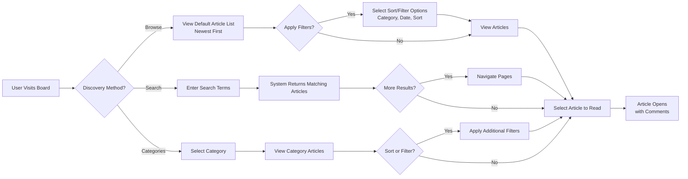

# Search, Browsing, and Discovery

## Overview and Purpose

The discussion board's search, browsing, and discovery features enable users to find relevant articles about economic and political topics. These features provide multiple pathways for users to access content: browsing through organized lists, searching by keywords, filtering by categories, and sorting by relevance. The system balances simplicity with functionality, making it easy for both casual browsers and serious readers to find content that matches their interests.

The search and discovery system serves three primary user groups with different needs:

- **Guest Users**: Anonymous visitors who want to browse published articles without creating an account. Guests benefit from organized categories, search capabilities, and sorting options that help them find relevant discussions.
- **Contributors**: Registered users who create and publish articles. Contributors use search and discovery features to research existing discussions, find related articles, and understand the current discourse before publishing their own content.
- **Moderators**: Administrative users who oversee content quality and manage the moderation workflow. Moderators use discovery features to find articles awaiting approval, identify content violations, and manage article visibility.

The discovery features must be intuitive, responsive, and fast to encourage user engagement and content consumption. By providing clear pathways to content, the system maximizes the visibility of published articles and creates an environment where economic and political discussions can flourish.

## Article Browsing and Listing

### Default Article Display

WHEN a user visits the discussion board without specifying a search query or category filter, THE system SHALL display a chronological list of published articles as the primary discovery method. Articles appear in descending chronological order, with the most recently published articles appearing first, followed by progressively older articles.

THE system SHALL display each article in the browsing list with the following information:

- **Article Title**: The complete title of the article, displayed prominently
- **Author Name**: The username or display name of the article's creator
- **Publication Date and Time**: The date and time when the article was published and approved by a moderator
- **Article Excerpt**: The first 200 characters of the article content, allowing users to preview the content before opening the full article
- **Category or Topic Tag**: A clearly marked category indicator showing which category the article belongs to (Economic Discussion, Political Discussion, Geopolitical Affairs, or General Discussion)
- **Comment Count**: The number of comments posted on the article, helping users identify active discussions
- **Thumbnail Preview**: If the article includes an image attachment, a small thumbnail preview of that image is displayed alongside the article information

### Pagination and Page Management

WHEN the article list contains more than 20 articles, THE system SHALL automatically divide the list into pages containing exactly 20 articles each. The first page displays articles 1-20, the second page shows articles 21-40, the third page displays articles 41-60, and so on. Articles older than those on the first page must be accessed through pagination controls.

THE system SHALL display pagination navigation controls below the article list, allowing users to:

- **Next Page Button**: Navigate to the next 20 articles
- **Previous Page Button**: Navigate to the previous 20 articles (disabled on the first page)
- **Page Number Buttons**: Jump directly to a specific page number (e.g., "1 2 3 4 5 ... 24")
- **Article Count Display**: Show the total number of articles available in the current view (e.g., "Showing page 2 of 5 (Total: 87 articles)")

WHEN a user navigates between pages, THE system SHALL apply the same filters, sort order, and category view to all pages. For example, if a user is viewing "Economic Discussion" category sorted by "Most Commented" and navigates to page 2, page 2 must show the next 20 articles from the same filtered set in the same sort order.

WHEN a user is browsing articles on a typical broadband connection, THE system SHALL load each page of articles completely within 3 seconds. The page should be interactive and display article content within this timeframe to provide a responsive user experience.

### Article Visibility Based on User Status

WHEN a guest user (unauthenticated user without an account) browses the article listing, THE system SHALL display exclusively published articles that have completed moderator approval. Draft articles, articles pending moderator review, and unpublished content must remain completely invisible and non-discoverable to guests. Guests cannot bypass this restriction by modifying URLs or using direct article links.

WHEN a guest user attempts to access a draft or pending article through a direct link, THE system SHALL display an access denied message indicating the article is not yet available and suggest browsing the published article list instead.

WHEN a contributor (registered user) browses the article listing, THE system SHALL display:

- All published articles that have been approved by a moderator
- All draft articles created by that specific contributor (only their own drafts, not other contributors' drafts)
- All pending articles submitted by that contributor awaiting moderator approval

The contributor shall not see draft or pending articles created by other contributors. Contributors can only view their own unpublished work.

WHEN a moderator (administrative user) browses the article listing, THE system SHALL display all articles regardless of status, including:

- Published articles that are currently visible to all users
- Draft articles in various stages of creation by any contributor
- Articles pending moderator approval that require review
- Archived or removed articles that are no longer public but maintained in system history

Moderators have complete visibility into the entire content lifecycle to perform their administrative duties.

WHEN a user's visibility permissions change (for example, a guest creating an account to become a contributor), THE system SHALL update the article list immediately to reflect the new visibility rules. Previously hidden draft articles become visible to the new contributor.

## Search Functionality

### Basic Search Capability

THE discussion board SHALL provide a search feature accessible from every page of the application. The search box is prominently displayed in the header or navigation area, allowing users to initiate a search from any location within the system.

WHEN a user enters search terms into the search box and submits the query, THE system SHALL search across both article titles and complete article content for matching results. The search covers all text within articles, including the body content, titles, and visible metadata.

WHEN a user enters a search query, THE system SHALL respect the user's current visibility permissions. Guests see only published articles matching the search. Contributors see published articles plus their own unpublished work matching the search. Moderators see all articles matching the search regardless of status.

THE system SHALL return search results within 1 second for typical search queries containing 1-3 words on a standard broadband connection. This fast response time enables interactive search experiences where users can refine queries quickly.

WHEN a user submits an empty search query (no text entered), THE system SHALL either display an error message indicating that search terms are required or return to the default article browsing list without performing a search.

### Search Results Display

WHEN search results are displayed, THE system SHALL organize results in order of relevance, applying the following ranking logic:

- **Title Matches First**: Articles where search terms appear in the title are ranked higher than articles where search terms appear only in the body content
- **Exact Phrase Matches**: Articles containing the exact phrase of the search query are ranked higher than articles containing individual search words
- **Multiple Term Matches**: Articles containing more search terms are ranked higher than articles containing fewer search terms
- **Word Proximity**: Articles where search terms appear close together (within 50 words) are ranked higher than articles where search terms appear far apart

Each search result entry SHALL display the following information:

- **Article Title**: Displayed prominently with search terms highlighted in a distinct color or formatting
- **Author Name**: The contributor who created the article
- **Publication Date**: When the article was published
- **Relevance Indicator**: A relevance score or visual indicator (e.g., "99% Match", star rating, or relevance bar) showing how closely the article matches the search terms
- **Result Excerpt**: A brief text excerpt showing the context around matched search terms. If the search term appears in the body, display 50 characters of context before and after the matched word. If the search term appears in the title, display the first 100 characters of the article body as the excerpt.
- **Comment Count**: The number of comments on the article, indicating discussion activity
- **Category Tag**: Which category the article belongs to

### Search Results Pagination

WHEN search results contain more than 20 matching articles, THE system SHALL paginate the results in pages of 20 articles per page. The pagination controls match those used for the default article browsing list (next/previous buttons, page numbers, and total count).

WHEN a user navigates between pages of search results, THE system SHALL maintain the original search query and apply identical result ordering to all pages. Page 2 must show results 21-40 from the same search in the same relevance order.

### Search Query Handling

WHEN a user searches for multiple words (for example, "economic policy reform"), THE system SHALL return articles containing ALL the search terms (AND logic), not articles with any of the terms. An article must match all three words to appear in results. Articles matching only one or two of the search terms are excluded.

WHEN a search query returns zero matching articles, THE system SHALL display a message clearly indicating that no articles match the search terms. The message SHALL suggest alternative actions, such as:

- Try searching with different or shorter keywords
- Browse articles by category
- View the most recently published articles
- Contact moderators if specific topics are needed

WHERE a user enters special characters or symbols in the search query (such as @, #, $, %, ^, &, *, etc.), THE system SHALL either ignore those special characters or escape them appropriately to prevent search errors. The search should continue functioning properly even with unusual input.

WHEN a user enters very long search queries (more than 500 characters), THE system SHALL accept the query but may truncate it to the first 500 characters for processing. The system SHALL inform the user if truncation occurred.

WHEN a user performs a search, THE system SHALL not return results for articles in draft status unless the user is the article's author or a moderator. Published articles are always searchable; unpublished articles are searchable only by authorized users.

## Categorization and Organization

### Article Categories

Articles in the discussion board SHALL be organized into four distinct categories that align with the board's purpose of facilitating economic and political discussion. Every article must belong to exactly one category:

- **Economic Discussion**: This category encompasses articles about economics, financial markets, business topics, international trade, monetary policy, fiscal policy, economic systems, and economic theory. Examples include discussions about inflation, investment strategies, labor markets, and economic development.

- **Political Discussion**: This category includes articles about politics, government structures, political philosophy, elections, political policies, political movements, and political systems. Examples include discussions about governance, legislation, political parties, and democratic institutions.

- **Geopolitical Affairs**: This category covers articles about international relations, regional conflicts and tensions, trade relationships between nations, diplomatic issues, and global political events. Examples include discussions about sanctions, international agreements, regional alliances, and cross-border disputes.

- **General Discussion**: This category accommodates articles that are relevant to economics and politics but do not fit neatly into the other three categories. Miscellaneous topics, meta-discussions about the board itself, and interdisciplinary topics belong in this category.

WHEN a contributor creates a new article, THE system SHALL require the contributor to select exactly one category from the four available options. The article submission form shall not permit article creation without an explicit category selection. Articles cannot exist in a categoryless state.

WHEN a moderator edits an article or changes its status, THE system MAY allow reassignment to a different category if the article's content has been significantly modified or miscategorized.

### Category Browsing

WHEN a user selects a specific category from the navigation menu, THE system SHALL display only articles within that category in chronological order with newest articles appearing first. Category browsing functions identically to the main article listing in terms of pagination, sorting, and filtering, except the results are restricted to articles assigned to the selected category.

THE system SHALL display the category name prominently at the top of the category browsing page, clearly indicating which category is currently being viewed. For example, the page header should display "Economic Discussion" or "Political Discussion" so users understand their current context.

WHEN a user applies additional filters while in a category view (such as sorting by "Most Commented" or filtering by date range), THE system SHALL apply those filters only to articles within the selected category. For example, "Most Commented" sort order shows the most-discussed articles within that category, not across all categories.

WHEN a moderator reviews articles pending approval, THE system SHALL display the assigned category with each article in the moderation queue. This helps moderators understand content topic and ensure appropriate expertise is applied to review.

### Category Navigation

THE system SHALL display all four available categories in a navigation menu accessible from the main page and all article listing pages. The category menu should be persistent and easily accessible, either as a sidebar, horizontal menu bar, or collapsible navigation section.

Each category menu item SHALL show:
- Category name
- Number of articles in that category (optional, for user awareness)
- Visual icon or color coding to help users identify categories quickly

WHEN a user is browsing articles within a category view, THE system SHALL highlight or visually distinguish the current category in the navigation menu to show which category is being viewed. This provides visual feedback about the current context.

WHEN a user clicks on a category menu item, THE system SHALL load the article list for that category within 2 seconds, maintaining consistent navigation speed across the system.

WHEN a user wants to view all articles from all categories, THE system SHALL provide a "All Categories" or "Browse All" menu option that displays the default unfiltered article listing.

## Sorting and Filtering Options

### Available Sort Orders

THE system SHALL provide the following sorting options for article lists, category views, and search results:

- **Newest First (Default)**: Articles are sorted by publication date in descending order, with most recently published and approved articles appearing first. This is the default sort order when users first visit the board or a category.

- **Oldest First**: Articles are sorted by publication date in ascending order, showing articles published earliest appearing first. This allows users to trace the historical development of discussions.

- **Most Commented**: Articles are sorted by the number of comments in descending order, with articles having the most discussion and engagement appearing first. This highlights active discussions.

- **Least Commented**: Articles are sorted by the number of comments in ascending order, with articles having few or no comments appearing first. This helps users discover less-discussed topics.

WHEN a user is on any article listing page (main default list, category view, or search results page), THE system SHALL display sort order controls allowing quick switching between these four sorting options. Sort controls should appear near the top of the article list as dropdown menu, radio buttons, or clickable buttons.

WHEN a user selects a new sort order, THE system SHALL immediately apply that sort order and reload the first page of results (page 1) in the new sort order. Pages beyond the first may show different articles after resorting.

THE system SHALL remember the user's last selected sort order and apply it to subsequent page views during the same browsing session. If a user sorts by "Most Commented" and then navigates to a different category, the new category view should also initially show "Most Commented" sort. However, this preference persists only for the current session; closing and reopening the browser returns to the default "Newest First" sort.

WHEN a user applies multiple sorting preferences (an action which should not be possible, as only one sort can be active), THE system SHALL use the most recently selected sort order and ignore any previously set sort preferences.

### Filtering by Category

WHEN a user applies a category filter from the filtering interface (as opposed to selecting a category from the main navigation), THE system SHALL display only articles belonging to that selected category.

THE system SHALL allow users to clear category filters and return to the default view showing articles from all categories. A "Clear Category Filter" button or similar control must be available when a category filter is active.

WHERE a user combines a category filter with a search query (for example, searching for "inflation" while filtering to show only "Economic Discussion" articles), THE system SHALL apply AND logic: show articles matching the search terms that also belong to the selected category. Articles matching the search terms but in other categories are excluded.

### Filtering by Date Range

WHEN a user selects a date range filter, THE system SHALL display only articles published within that specified date range, inclusive of both start and end dates. An article published on the start date and an article published on the end date both appear in results.

THE system SHALL provide preset date range options for common filtering scenarios:

- **Last 7 Days**: Show articles published in the past week
- **Last 30 Days**: Show articles published in the past month
- **Last 3 Months**: Show articles published in the past quarter
- **Last Year**: Show articles published in the past 12 months
- **All Time**: No date filter (default, shows articles regardless of age)

WHEN a user wants more granular date filtering, THE system SHALL allow selection of custom start and end dates. Users should be able to specify exact dates (e.g., "January 15, 2024" through "March 20, 2024") using date picker controls.

WHEN a user applies a date range filter, THE system SHALL immediately reload the article list showing only articles from the selected date range.

### Combining Multiple Filters

WHERE a user applies multiple filters simultaneously (for example, selecting "Economic Discussion" category AND filtering for articles from "Last 30 Days" AND sorting by "Most Commented"), THE system SHALL apply all filters together using AND logic. Articles must match ALL specified criteria to appear in results.

WHEN multiple filters are active, THE system SHALL display a clear list of currently applied filters near the top of the article list. For example: "Filters Applied: Category (Economic Discussion), Date Range (Last 30 Days), Sort (Most Commented)".

WHEN multiple filters are active, THE system SHALL provide a clear way to remove individual filters. Each filter in the filter list should have an "X" button or "Remove" option allowing users to toggle that filter off while keeping others active.

THE system SHALL also provide a "Clear All Filters" button that removes all active filters at once, returning the user to the default unfiltered, all-articles view.

WHERE a user removes a filter that causes the result set to change substantially, THE system SHALL maintain the user's current page number if possible, or reset to page 1 if the previous page no longer has valid content.

## User Experience Expectations

### Responsive and Intuitive Discovery

THE search, browsing, and filtering features SHALL work seamlessly across all device types and screen sizes, including:

- Desktop browsers (1920x1080 and larger)
- Tablet devices (iPad, Android tablets in portrait and landscape orientations)
- Mobile phones (small screens 320px and up)

The interface should adapt to device capabilities while maintaining full functionality on all platforms.

WHEN users interact with search, sort, and filter controls on any device, THE system SHALL respond immediately to user actions within 500 milliseconds. Updates to the article list should appear responsive without perceptible delays.

WHERE possible, THE system SHALL avoid full page reloads when applying filters or changing sort orders. Dynamic updates using background requests provide a more responsive user experience and reduce bandwidth usage.

### Accessible Navigation

THE system SHALL ensure all navigation menus, category selectors, search boxes, and filter controls are easily discoverable and clearly labeled with descriptive text.

WHEN a user performs a search or applies filters, THE system SHALL display results on the same page or a clearly linked results page, maintaining strong navigation context. Users should always understand where they are in the application and how to return to previous views.

WHEN users navigate between different views (from category browsing to search results to the main list), THE system SHALL preserve the user's scroll position or provide a link to return to their previous location if preferred.

### Clear Display of Moderation Status (Moderator Feature)

WHEN a moderator is browsing articles, THE system SHALL clearly indicate which articles belong to each status category using visual indicators:

- **Published and Approved**: Display with standard article styling; these articles are public and visible to all users
- **Pending Moderator Approval**: Display with a distinct visual indicator (such as a yellow badge, special icon, or highlighted border) clearly marking these articles as requiring review
- **In Draft Status**: Display with a different indicator (such as a "Draft" label or light gray styling) showing these articles are not yet submitted for approval
- **Archived or Removed**: Display with a muted appearance (such as grayed-out text or strikethrough) and a label indicating the article is no longer public

The status indicators help moderators quickly identify their workload and locate articles at different lifecycle stages without confusion.

### Handling Empty States

IF a category contains no published articles that match the current filters, THE system SHALL display a friendly message indicating that no articles are available in that category and suggest alternative actions:

- "No articles found in Economic Discussion. Try browsing other categories."
- "No articles match your search terms. Try different keywords or browse by category."
- "This category has no articles published in the selected date range. Try expanding the date range."

THE empty state message should not simply say "No results" but should provide helpful guidance to users.

IF a user's search query returns zero matching articles, THE system SHALL display a message suggesting alternative searches or related topics. For example: "Your search for 'quantum economics' found no results. Did you mean 'behavioral economics'? Or browse articles about Economics more broadly."

## Performance and System Behavior

### Search and Browsing Performance

THE system SHALL ensure article browsing pages (main list, category views) load completely within 3 seconds on typical broadband connections (at least 5 Mbps download speed). All content should be visible and interactive within this timeframe.

THE system SHALL ensure search queries complete and return results within 1 second for typical queries containing 1-3 words. Search should feel instantaneous to the user.

WHEN a user is on a search results page or article list, THE system SHALL maintain accurate article counts and pagination throughout the user's interaction. Counts should reflect the current filtered view in real-time.

WHERE large numbers of articles exist (10,000+), THE system SHALL optimize search and browsing performance using database indexing and caching to maintain sub-second search response times and 3-second page load times.

### Article Availability After Publishing

WHEN a contributor submits an article for publication and a moderator approves it, THE system SHALL make the article immediately visible to all users (guests, contributors, and other moderators) within 5 seconds of moderator approval. The article should appear in the default browsing list, be searchable, and be discoverable by category within this timeframe.

WHEN a moderator removes, archives, or unpublishes an article, THE system SHALL remove it from all browsing lists and search results within 5 seconds. The article should be completely non-discoverable by regular users within this timeframe while remaining visible to moderators and the original author.

WHEN an article's category is changed by a moderator, THE system SHALL update article visibility and categorization in browsing and search views within 2 seconds.

## Search, Browsing, and Discovery Workflows

The following diagram illustrates the primary user journeys for discovering articles on the discussion board:

## Business Rules and Constraints

THE system SHALL always prioritize published content in all default views, making published articles the primary discovery path for users. Unpublished content must never be discoverable through normal browsing or search by unauthorized users.

THE system SHALL prevent guests from seeing unpublished, draft, or pending articles in any context, maintaining content confidentiality until moderator approval is complete.

THE system SHALL display at least 3 published articles on the first page of any listing (article list, category view, or search results) to ensure users always have browsing options. If fewer than 3 articles match the current filters, all matching articles should be displayed on the first page.

WHERE articles are removed by moderators or archived for administrative reasons, THE system SHALL not display them in any browsing lists or search results, regardless of how users attempt to access them through URLs or direct links.

THE system SHALL support at least 2 simultaneous active filters (such as category + date range + sort order) to allow meaningful content discovery without overcomplicating the interface or reducing usability.

THE system SHALL not allow users to combine conflicting filters. For example, if a user has filtered to show articles from "Last 7 Days" and then tries to sort by "Oldest First", the system should either apply both filters (showing the oldest articles from the last 7 days) or warn the user about potentially confusing results.

THE system SHALL ensure that all sorting and filtering operations complete quickly enough to maintain the perception of responsiveness, completing within 500 milliseconds on typical hardware.

---

*This document defines business requirements for search, browsing, and discovery features. All technical implementations, architectural decisions, and database design are at the discretion of the development team.*