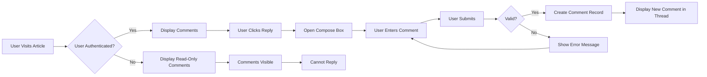
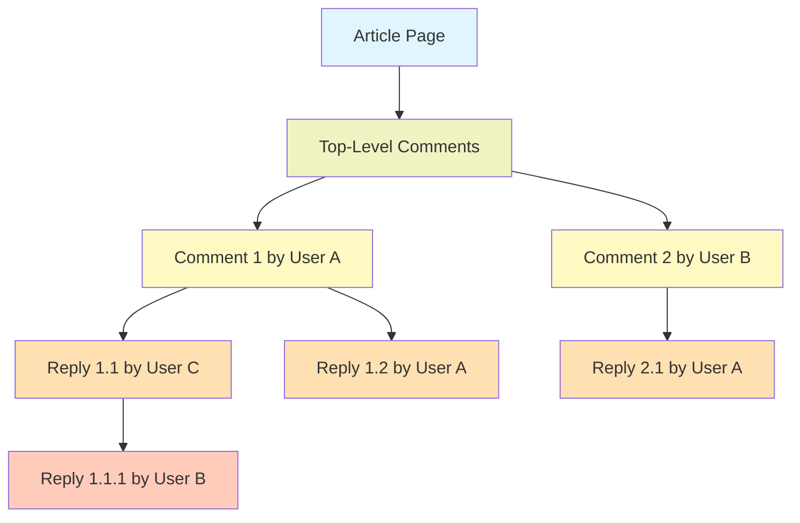
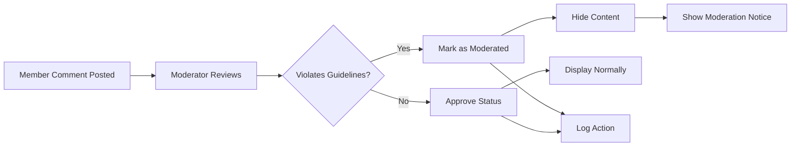
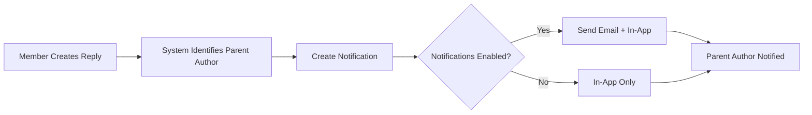

# Comment System Specification

## 1. Comment System Overview

### Purpose and Role

The comment system enables users to engage in discussions within articles, fostering conversation and debate on economic and political topics. Comments provide a structured mechanism for members to respond to articles and to each other, creating threaded discussions that enhance the value of the platform.

### System Objectives

- Allow authenticated members to contribute to discussions
- Enable threaded conversations with reply functionality
- Maintain discussion quality through moderation capabilities
- Provide clear attribution and authorship tracking
- Support simple and intuitive user interactions
- Preserve discussion history and context

### Scope

Comments are directly attached to articles and exist to support the discussion of article content. This system handles:
- Comment creation and validation
- Comment display with threading
- Comment modification and deletion
- Permission enforcement
- Comment-based user interactions
- Notification of comment activity

---

## 2. Comment Structure & Data Model

### Comment Composition

Each comment SHALL contain the following information:

| Field | Type | Required | Description |
|-------|------|----------|----------------|
| Comment ID | Unique Identifier | Yes | System-generated unique identifier for the comment |
| Article ID | Foreign Key | Yes | Reference to the parent article being discussed |
| Author | User Reference | Yes | The user who created the comment |
| Content | Text | Yes | The body/text of the comment (max 5,000 characters) |
| Parent Comment ID | Foreign Key | No | Reference to the comment being replied to (null if top-level) |
| Created Date | Timestamp | Yes | When the comment was created (ISO 8601 format) |
| Modified Date | Timestamp | No | When the comment was last edited (null if never edited) |
| Edit History Flag | Boolean | Yes | Indicates if the comment has been edited |
| Status | Enumeration | Yes | Current state (active, deleted, moderated, archived) |
| Thread Depth | Integer | Yes | Nesting level in thread (0 for top-level, 1+ for replies) |

### Comment Relationships

- Each comment belongs to exactly one article
- Each comment is authored by exactly one member or moderator
- Each comment may be a reply to zero or one other comment (creating threads)
- Multiple comments can reply to the same parent comment
- Replies inherit the visibility and permissions of their parent comment

### Content Constraints

- **Minimum length**: 1 character
- **Maximum length**: 5,000 characters
- **Allowed content**: Plain text and basic markdown (bold, italic, links)
- **Prohibited content**: HTML, scripts, executable code, embedded media
- **Required fields**: Content, Author, Article ID
- **Optional fields**: Parent Comment ID (null for top-level comments)

### Data Integrity Requirements

WHEN a comment is created, THE system SHALL store the article ID to maintain referential integrity.

WHEN a comment is a reply to another comment, THE system SHALL store the parent comment ID and validate the parent comment exists in the same article.

WHEN a comment is deleted or archived, THE system SHALL preserve the comment record in the database for audit purposes while marking it as deleted/archived.

WHEN a comment record is stored, THE system SHALL store creation timestamp in ISO 8601 UTC format and modification timestamp only if the comment has been edited.

---

## 3. Comment Creation & Management

### Comment Creation Workflow

WHEN a member submits a new comment on an article, THE system SHALL:
1. Validate the user is authenticated and not suspended
2. Validate the article exists and is not archived
3. Validate the comment content meets length and format requirements
4. Validate the parent comment ID (if provided) exists and belongs to the same article
5. Check rate limiting has not been exceeded by the user
6. Create the comment record with the current timestamp
7. Increment article comment count
8. Return the created comment with system-generated ID and timestamps

THE system SHALL reject comment creation IF:
- The article is archived or deleted
- The comment content is empty or only whitespace
- The comment exceeds 5,000 characters
- The user is not authenticated
- The parent comment ID is invalid or from a different article
- The user has exceeded rate limits
- The user account is suspended or banned

### Member Comment Creation Permissions

WHEN an authenticated member attempts to create a comment, THE system SHALL grant permission to post the comment.

WHEN a guest user attempts to create a comment, THE system SHALL deny the request and display: "You must be logged in to comment. Please log in or register to participate in discussions."

WHEN a moderator attempts to create a comment, THE system SHALL allow the comment creation with the same process as members.

### Comment Editing Specifications

WHEN a member requests to edit their own comment, THE system SHALL:
- Allow editing only if the member is the original author
- Update the comment content with the new text
- Update the modified date timestamp to current time
- Mark the comment edit flag as true
- Preserve the original creation date
- NOT allow editing the parent comment reference
- NOT allow editing the article reference
- NOT allow changing the author

THE system SHALL NOT permit editing IF:
- The user is not the original author
- More than 24 hours have passed since creation
- The comment has been deleted or moderated
- The comment's article has been deleted

WHEN a moderator requests to edit a comment, THE system SHALL:
- Allow editing regardless of authorship
- Update comment content
- Record moderator ID and timestamp of moderation edit
- Mark as moderator-edited for transparency

### Comment Editing Workflow Steps

WHEN a member clicks edit on their comment, THE system SHALL display the comment edit form with the current comment text pre-populated.

WHEN the member modifies the comment text and submits, THE system SHALL:
- Validate the new content is not empty and not exceeding 5,000 characters
- IF validation passes, update the comment record
- Update the modified date timestamp
- Set edit history flag to true
- Display the comment with "Edited" indicator showing the edit timestamp

IF validation fails, THE system SHALL reject the edit and show specific error message.

### Comment Deletion Procedures

WHEN a member requests to delete their own comment, THE system SHALL:
- Allow deletion only if the member is the original author
- Check if comment has nested replies
- IF comment has replies, mark as deleted but preserve parent reference so replies remain organized
- IF comment has no replies, remove from database
- Decrement article comment count
- Update article's last activity timestamp

WHEN a moderator requests to remove a comment, THE system SHALL:
- Allow removal regardless of authorship
- Mark the comment as moderated (not visible to regular users)
- Preserve the comment record for audit purposes
- Log the moderation action with moderator ID, timestamp, and optional reason
- Display comment as "[Removed by moderator]" to all users
- Remove nested replies if the parent is removed

### Author Deletion Permissions

WHEN a member attempts to delete another member's comment, THE system SHALL deny the request and display: "You can only delete your own comments."

WHEN a guest attempts to delete any comment, THE system SHALL deny the request and display: "You must be logged in to delete comments."

WHEN a moderator attempts to delete any comment, THE system SHALL allow the deletion.

### Deletion Confirmation Process

WHEN a member initiates comment deletion, THE system SHALL show a confirmation dialog: "Delete this comment? This action cannot be undone."

WHEN the member confirms deletion, THE system SHALL proceed with the deletion process.

WHEN the member cancels the confirmation, THE system SHALL abort the deletion and return to the comment display.

---

## 4. Comment Display & Threading

### Display Structure - Threaded Organization

Comments SHALL be organized as threaded conversations within each article. THE system SHALL:
- Display top-level comments first (those without a parent comment)
- Order top-level comments by creation date (oldest first as default, with option for newest first)
- Display replies indented beneath their parent comment
- Show up to 3 levels of nesting deep for initial display
- Collapse deeply nested threads beyond 3 levels with "Show [X] more replies" option
- Preserve thread context as new comments are added

### Thread Depth and Nesting Rules

THE system SHALL enforce maximum nesting depth of 3 levels:
- **Level 0**: Top-level comments directly on the article
- **Level 1**: Replies to top-level comments
- **Level 2**: Replies to level 1 comments
- **Level 3**: Replies to level 2 comments

IF a user replies to a comment at depth 3, THE system SHALL attach the reply to the depth 3 comment (not create depth 4).

WHEN displaying comments, THE system SHALL increase visual indentation by one level for each nesting depth to clearly show the thread hierarchy.

### Comment Visibility Rules

WHEN a guest views an article, THE system SHALL display all active comments and hide deleted/moderated comments.

WHEN a member views an article, THE system SHALL display all active comments and show deleted comments as "[Deleted by author]" with author name and date visible.

WHEN a member views an article, THE system SHALL display moderated comments as "[Removed by moderator]" without showing the original content.

WHEN a moderator views an article, THE system SHALL display all comments including deleted and moderated, with status indicators showing their state.

DELETED comments SHALL display as "[Deleted by author]" to all users except they still show:
- Original comment author name
- Creation date and time
- Edit history if applicable
- But NOT the original content text

MODERATED comments SHALL display as "[Removed by moderator]" to all users except moderators, who can view:
- Original content
- Reason for removal
- Moderator who removed it
- Timestamp of removal

### Comment Display Metadata

For each displayed comment, THE system SHALL show:
- Author name and user avatar (if available)
- Comment creation date and time in user's local timezone
- "Edited" indicator with edit timestamp if the comment has been modified
- Reply count showing number of direct replies to this comment
- "Reply" button for authenticated members
- Delete button for comment author or moderators
- Edit button for comment author (if within 24 hours)

### Pagination & Loading Strategy

WHEN a user views an article with many comments, THE system SHALL:
- Load top-level comments in pages of 20 comments per page
- Load all direct replies to displayed top-level comments on the same page request
- Allow user to navigate between pages using pagination controls
- Provide a "Load more" button if additional top-level comments exist beyond current page
- Show total comment count for the article

WHEN a user loads a page of comments, THE system SHALL:
- Display within 2 seconds for typical conditions
- Load all associated replies for top-level comments shown
- Collapse replies beyond depth 3 with expandable "Show more" controls

### Thread Visualization

THE system SHALL visually distinguish replies from top-level comments by:
- Indenting replies one level relative to parent comments
- Showing parent author name above nested replies
- Displaying visual connector lines or indentation bars showing reply hierarchy
- Grouping all replies under their parent in the display
- Using consistent styling to clearly show thread structure

### Order and Sorting

TOP-LEVEL comments SHALL be ordered by:
- Creation date (oldest first) as default sort
- Alternative sort option: newest first
- Alternative sort option: most replies
- User preference for sort order SHALL be remembered

WITHIN each thread, replies SHALL be ordered by creation date (oldest first, showing response sequence).

---

## 5. Reply Functionality

### Reply Creation Specifications

WHEN a member clicks "Reply" on a comment, THE system SHALL:
- Open a reply composition box below or adjacent to the parent comment
- Pre-populate the reply field with "@[Parent Author Name]" for context
- Allow the member to compose their reply using the standard comment creation interface
- Require the reply to be at least 1 character and no more than 5,000 characters
- Show parent comment preview or reference for context
- Create the reply with a reference to the parent comment ID upon submission

WHEN a member submits a reply, THE system SHALL:
- Validate the reply content meets length requirements
- Check the parent comment still exists
- Create the reply with parent_comment_id set to the parent comment's ID
- Set thread_depth to one level deeper than parent
- Display the new reply directly below or under the parent comment (in the thread)
- Show "In reply to [Parent Author Name]" or similar indication
- Increment reply count for the parent comment

### Thread Visualization in Display

WHEN displaying a reply, THE system SHALL:
- Include the parent comment author's name and preview of their comment
- Include a "View parent comment" link if the parent is not currently visible
- Maintain reply order by creation date within each thread
- Show the full conversation context when viewing a reply
- Visually indicate the reply hierarchy through indentation or connection lines
- Allow collapsing/expanding thread branches if deeply nested

### Reply Context and Navigation

WHEN a member views a reply in a threaded display, THE system SHALL:
- Show context: what comment is being replied to
- Show the author who is being replied to
- Provide navigation to parent comment if not visible
- Maintain thread context as user scrolls or navigates

WHEN a user expands a collapsed thread branch, THE system SHALL:
- Load and display all nested replies
- Show the full thread depth
- Preserve this expanded state while user remains on the page

### Reply Rate Limiting

THE system SHALL enforce rate limiting on replies:
- A single user SHALL NOT create more than 50 comments (including replies) per hour
- IF a user exceeds this limit, THE system SHALL reject the reply and display: "You have exceeded the comment limit. Please wait before posting more comments."

### Notification Requirements for Replies

WHEN a member creates a reply to another member's comment, THE system SHALL:
- Identify that the parent comment author should be notified
- Record a notification for the parent comment author
- Include the replying member's name and a preview of the reply in the notification
- Provide a link to view the reply in context
- Store the notification in the parent author's notification inbox
- Optionally send an email notification if the user has notifications enabled

IF the user being replied to has notifications disabled, THE system SHALL:
- NOT send an email notification
- Still create the in-app notification
- Allow the user to see the reply when they next visit the article

---

## 6. Comment Permissions & Access Control

### Guest User Comment Permissions

WHEN a guest user attempts to view comments, THE system SHALL display all active comments on articles.

WHEN a guest user attempts to create a comment, THE system SHALL deny the request and display: "You must be logged in to comment. Please log in or register to participate in discussions."

WHEN a guest user attempts to edit any comment, THE system SHALL deny the request.

WHEN a guest user attempts to delete any comment, THE system SHALL deny the request.

### Member User Comment Permissions

WHEN an authenticated member attempts to create a comment, THE system SHALL grant permission to post the comment on any published article.

WHEN a member attempts to edit their own comment, THE system SHALL allow the edit if:
- The member is the original comment author
- Less than 24 hours have passed since the comment was created
- The comment has not been marked as moderated

WHEN a member attempts to edit another member's comment, THE system SHALL deny the request and display: "You can only edit your own comments."

WHEN a member attempts to delete their own comment, THE system SHALL allow the deletion.

WHEN a member attempts to delete another member's comment, THE system SHALL deny the request and display: "You can only delete your own comments."

### Moderator Comment Permissions

WHEN a moderator attempts to create a comment, THE system SHALL allow comment creation with same process as members.

WHEN a moderator attempts to edit any comment, THE system SHALL allow editing regardless of authorship.

WHEN a moderator edits a comment, THE system SHALL record the moderator edit action with moderator ID and timestamp for transparency.

WHEN a moderator attempts to delete any comment, THE system SHALL allow deletion.

WHEN a moderator removes a comment, THE system SHALL mark it as moderated and display "[Removed by moderator]" instead of content.

WHEN a moderator performs actions on comments, THE system SHALL record all actions in the moderation audit log.

### Permission Matrix by Actor Type

| Action | Guest | Member | Moderator |
|--------|-------|--------|-----------|
| View active comments | ✅ Yes | ✅ Yes | ✅ Yes |
| View deleted comments (marked) | ✅ Yes | ✅ Yes | ✅ Yes |
| View moderated comments content | ❌ No | ❌ No | ✅ Yes |
| Create comment | ❌ No | ✅ Yes | ✅ Yes |
| Edit own comment (within 24h) | ❌ No | ✅ Yes | ✅ Yes |
| Edit any comment | ❌ No | ❌ No | ✅ Yes |
| Delete own comment | ❌ No | ✅ Yes | ✅ Yes |
| Delete any comment | ❌ No | ❌ No | ✅ Yes |
| Mark comment as moderated | ❌ No | ❌ No | ✅ Yes |
| View moderation history | ❌ No | ❌ No | ✅ Yes |
| Reply to comments | ❌ No | ✅ Yes | ✅ Yes |

### Permission Enforcement Rules

WHEN a member attempts to perform an action on a comment, THE system SHALL verify:
1. The user is authenticated (not a guest)
2. The action is permitted for the user's role
3. The user is the content owner (if action requires ownership)
4. The user account is not suspended or banned
5. The content exists and is not deleted

IF any verification fails, THE system SHALL deny the action and display appropriate error message.

WHEN a moderator performs actions, THE system SHALL:
- Allow the action regardless of ownership
- Log the action with moderator ID and timestamp
- Preserve audit trail for compliance purposes

### Content Ownership Validation

WHEN a member attempts to edit or delete a comment, THE system SHALL verify they are the content owner by comparing:
- Authenticated user ID
- Comment author user ID

IF user IDs do not match and user is not a moderator, THE system SHALL deny the action.

---

## 7. Comment Search & Discovery

### Organization Within Articles

WHEN viewing an article, THE system SHALL organize and present comments as follows:
- Display all top-level comments (comments without a parent)
- Display replies grouped and indented under their parent comments
- Enable sorting of top-level comments (most recent, oldest first, most replies)
- Support user preference for sort order, persisted to user profile
- Show total comment count for the article

### Comment Discovery by Author

THE system SHALL provide the ability to:
- Filter comments by the article's author (showing responses to the author)
- Filter comments by specific user profiles (showing user's recent comments)
- View a user's recent comments on their profile page
- Search for comments by author name across all articles

### Recent Activity Discovery

THE system SHALL:
- Display recently commented articles in the platform's activity feed
- Show which articles have new comments since the user last viewed
- Highlight articles with active discussions (high comment volume in last 7 days)
- Provide links to jump to new or recent comments on articles

---

## 8. Error Handling & Validation

### Input Validation Errors

WHEN a member submits a comment with empty content, THE system SHALL:
- Reject the submission
- Display the error message: "Comment cannot be empty. Please enter your comment text."
- Preserve any input for re-submission

WHEN a member submits a comment exceeding 5,000 characters, THE system SHALL:
- Reject the submission
- Display the error message: "Comment exceeds maximum length of 5,000 characters. Current: [X] characters."
- Show the current character count to help user understand the issue
- Preserve input and allow editing

WHEN a member submits a reply to a non-existent parent comment, THE system SHALL:
- Reject the submission
- Display the error message: "The comment you're replying to no longer exists. Please refresh the page and try again."

WHEN a member attempts to edit a comment after 24 hours, THE system SHALL:
- Reject the edit request
- Display the error message: "Comments can only be edited within 24 hours of creation. This comment was created on [date/time]."

WHEN a member attempts to reply to a deleted comment, THE system SHALL:
- Reject the reply
- Display the error message: "You cannot reply to a deleted comment."

### Permission Errors

WHEN a guest attempts to create a comment, THE system SHALL:
- Reject the action
- Display the message: "You must be logged in to comment. Please log in or register to participate."
- Provide links to login and registration pages

WHEN a member attempts to edit or delete another member's comment, THE system SHALL:
- Reject the action
- Display the message: "You can only edit or delete your own comments."

WHEN a suspended user attempts to comment, THE system SHALL:
- Reject the comment
- Display the message: "Your account is currently suspended. You cannot post comments at this time."

### Article-Related Errors

WHEN a member attempts to comment on a deleted article, THE system SHALL:
- Reject the submission
- Display the message: "This article has been deleted and is no longer available for comments."

WHEN a member attempts to comment on an archived article, THE system SHALL:
- Reject the submission
- Display the message: "Comments are closed for this article."

WHEN a member attempts to comment on an article that requires membership verification, THE system SHALL:
- Verify the member has required status
- Allow or deny comment based on verification result

### System Error Handling

WHEN comment creation fails due to system error, THE system SHALL:
- Return HTTP status 500 or appropriate error code
- Display to user: "An error occurred while posting your comment. Please try again."
- Preserve the user's input in localStorage for recovery
- Log the error internally for debugging

WHEN comment retrieval fails, THE system SHALL:
- Display: "Comments are temporarily unavailable. Please refresh the page."
- Retry loading comments automatically after 5 seconds
- Log the error for monitoring

WHEN database write fails during comment creation, THE system SHALL:
- Rollback the transaction
- NOT create the comment
- Display error message to user
- Log error details internally

### Rate Limiting Errors

WHEN a member submits more than 50 comments within 1 hour, THE system SHALL:
- Reject the submission
- Display error message: "You have exceeded your comment posting limit. Please wait [X] minutes before posting again."
- Show time when limit resets

WHEN a guest attempts to view comments more than 100 times in 1 minute, THE system SHALL:
- Temporarily block access for 5 minutes
- Display message: "Too many requests. Please wait before trying again."

### Edit Errors

WHEN comment editing fails due to validation error, THE system SHALL:
- Reject the edit
- Display specific error message
- Return to edit form with input preserved
- Allow user to correct and retry

WHEN comment editing fails due to system error, THE system SHALL:
- Display: "An error occurred while saving your changes. Please try again."
- Preserve the edited content
- Allow retry

### Delete Errors

WHEN comment deletion fails, THE system SHALL:
- Display: "An error occurred while deleting the comment. Please try again."
- NOT delete the comment
- Allow user to retry

WHEN cascading delete fails (deleting parent with many nested replies), THE system SHALL:
- Log detailed error information
- Display: "Unable to delete this comment due to a system error. Please try again later."
- Preserve the comment in database

### Error Message Recovery

WHEN displaying an error message, THE system SHALL:
- Show message in prominent alert box with error icon
- Display specific, actionable guidance
- Preserve user input for resubmission
- Provide option to contact support if needed
- Auto-dismiss after delay if non-critical, or require user dismissal if critical

---

## 9. Comment Workflow Diagrams

### Comment Creation and Display Flow

### Comment Threading Structure

### Comment Moderation Flow

### Reply Notification Flow

---

## 10. Performance Requirements

### Response Time Expectations

WHEN a user loads an article with comments, THE system SHALL display initial comments within 2 seconds.

WHEN a user submits a comment, THE system SHALL process and display the comment within 1 second.

WHEN a user edits a comment, THE system SHALL process and display changes within 1 second.

WHEN a user deletes a comment, THE system SHALL process and update display within 1 second.

WHEN a user loads the next page of comments, THE system SHALL display within 2 seconds.

### Concurrent Operations

THE system SHALL support:
- Minimum 100 concurrent comment views without degradation
- Minimum 10 new comments per minute
- Minimum 20 comment edits per minute
- Minimum 5 comment deletions per minute

### Data Limits

- Maximum comments per page: 20 top-level comments
- Maximum thread depth displayed: 3 levels (collapse beyond)
- Maximum comment length: 5,000 characters
- Maximum replies per comment: no technical limit (display with pagination)

---

> *Developer Note: This document defines **business requirements only**. All technical implementations (architecture, APIs, database design, caching mechanisms, notification systems, etc.) are at the discretion of the development team.*
