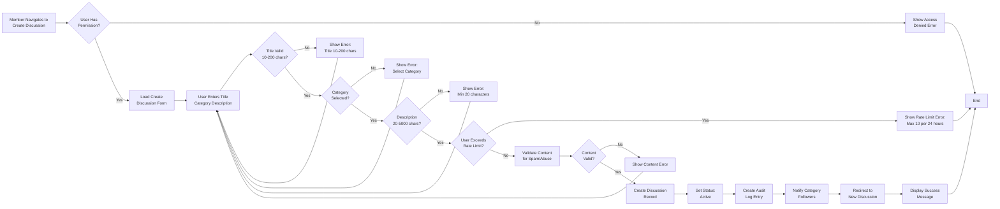
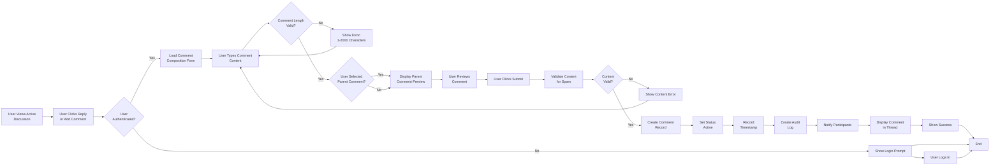
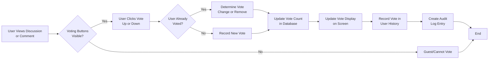
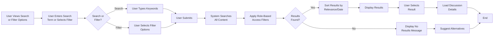
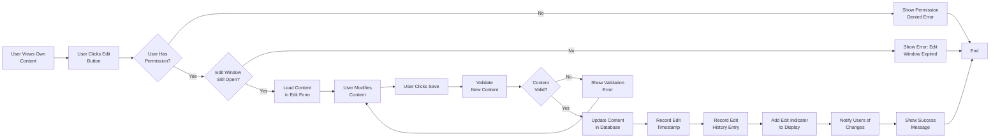
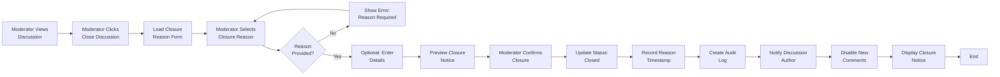

# Discussion Workflows

## Overview

This document describes the complete workflows for all major user interactions with the discussion board system. Each workflow details the step-by-step process from user initiation through system response, including decision points, validations, error handling, and role-based variations. These workflows provide the business logic foundation that backend developers must implement.

---

## 1. Discussion Creation Workflow

### Workflow Purpose
Enable authenticated users to create new discussion topics and start conversations on economic or political subjects.

### Pre-conditions
- User must be authenticated (member, moderator, or administrator)
- User must have internet connectivity
- Discussion category must exist and be active
- User's email address must be verified
- User must not be muted or banned

### Actor Roles and Variations

**Member User** - Can create discussions in any active category, subject to rate limiting and content validation

**Moderator** - Can create discussions and also pin important discussions immediately after creation

**Administrator** - Can create discussions and bypass standard rate limiting

### Main Workflow Steps



### Detailed Step-by-Step Procedure

**Step 1: User Navigation and Access**

WHEN a member clicks "Create Discussion" button, THE system SHALL check if the user is authenticated and has permission to create discussions.

IF the user is not authenticated, THE system SHALL redirect to login page with message: "Please log in to create a discussion."

IF the user is authenticated but their account status is "muted" or "banned", THE system SHALL display error: "Your account does not have permission to create discussions. Please contact support if you believe this is an error."

IF the user is authenticated and has permission, THE system SHALL load the create discussion form within 1 second.

**Step 2: Form Loading and Display**

THE system SHALL display a form containing:
- Title input field (with character counter showing 0/200)
- Category dropdown with all active categories listed
- Description/content text area (with character counter showing 0/5000)
- Rich text formatting toolbar (bold, italic, lists, code block)
- Preview button to see formatted content
- "Create Discussion" submit button
- "Cancel" button to abandon creation

THE form SHALL display default values:
- Title field: empty, focused for user input
- Category field: "Select a category..." placeholder
- Description field: empty

**Step 3: User Input**

WHEN a user types in the title field, THE system SHALL:
- Display character counter updating in real-time (e.g., "45/200")
- Allow up to 200 characters before preventing further input
- Validate that title is not empty or only whitespace
- Display no error initially (validation occurs on submit)

WHEN a user selects a category, THE system SHALL:
- Display the selected category name
- Validate that the category is active and user has access
- No error display needed (dropdown contains only valid options)

WHEN a user types in the description field, THE system SHALL:
- Display character counter updating in real-time (e.g., "245/5000")
- Allow up to 5000 characters before preventing further input
- If user uses formatting toolbar, show preview of formatted content
- Display "Preview" button to see how content will appear

**Step 4: Form Validation**

WHEN a user clicks "Create Discussion" button, THE system SHALL perform validation in order:

**Validation 1: Title Required and Valid Length**
IF title field is empty or contains only whitespace, THE system SHALL display error message below title field: "Title is required and must be between 10 and 200 characters."

THE system SHALL keep the form open and highlight the title field. User can correct and resubmit.

**Validation 2: Title Uniqueness (Optional)**
IF title is identical to an existing discussion by same user created within past 7 days, THE system SHALL display warning: "You recently created a discussion with this exact title. Did you mean to edit it instead?" with "Continue Anyway" button.

**Validation 3: Category Required**
IF no category is selected, THE system SHALL display error: "Please select a category for this discussion."

THE system SHALL keep the form open with focus on category dropdown.

**Validation 4: Description Length**
IF description field is empty or less than 20 characters, THE system SHALL display error: "Description must be at least 20 characters long."

IF description exceeds 5000 characters (should be prevented by UI), THE system SHALL display error: "Description cannot exceed 5000 characters."

**Validation 5: Rate Limit Check**
THE system SHALL query database for discussions created by this user in past 24 hours.

IF user has created 10 or more discussions in past 24 hours, THE system SHALL display error: "You have reached the maximum of 10 discussions per 24 hours. Your next discussion can be created in approximately [X hours, Y minutes]."

THE system SHALL calculate remaining time by: earliest_discussion_timestamp + 24_hours - current_time

IF user has created fewer than 10 discussions, proceed to content validation.

**Validation 6: Content Safety Check**
THE system SHALL scan the discussion title and description for prohibited content indicators:
- Known spam patterns (excessive links, promotional language)
- Prohibited terms or hateful language
- Spam signatures or bot-like patterns

IF potentially prohibited content is detected, THE system SHALL:
- Log the flag with user ID and content
- Either: require moderator approval before posting, OR display specific error message
- Display message: "Your discussion contains content that violates our guidelines. Please review our community guidelines and revise your content."
- Highlight or show specific problematic terms if possible

**Step 5: Database Record Creation**

WHEN all validations pass, THE system SHALL:
1. Create a new discussion record in database with:
   - Generated unique discussion ID
   - Title (exact as submitted)
   - Description (exact as submitted)
   - Category ID (selected by user)
   - Owner/creator user ID
   - Status: "Active"
   - Creation timestamp (server time, UTC)
   - Last activity timestamp (same as creation)
   - View count: 0
   - Vote count: 0
   - Comment count: 0
   - Edit count: 0
   - Edit timestamp: null (not yet edited)

2. Record audit log entry with:
   - Event type: "discussion_created"
   - User ID (who created)
   - Discussion ID (what was created)
   - Timestamp
   - IP address
   - Browser user agent

3. Create notification record for all users following this category to receive notification within 5 minutes (asynchronous)

**Step 6: User Notification and Redirect**

WHEN discussion is successfully created, THE system SHALL:
1. Display success message: "Discussion created successfully!"
2. Wait 1 second
3. Redirect user to the newly created discussion view
4. Display the discussion with empty comment section
5. Display "Be the first to comment" message

THE redirect SHALL include generated discussion URL in browser address bar: `/discussions/{discussion-id}`

### Business Rules Applied

WHEN a member attempts to create a discussion topic, THE system SHALL require a title between 10 and 200 characters.

WHEN a member attempts to create a discussion topic, THE system SHALL require selection of exactly one active discussion category.

WHEN a member attempts to create a discussion topic, THE system SHALL require a description of at least 20 characters and no more than 5,000 characters.

WHEN a member creates a discussion, THE system SHALL limit creation to a maximum of 10 discussions per 24-hour period per user.

FOR new member accounts (created less than 24 hours ago), THE system SHALL enforce stricter limit of maximum 3 discussions per 24 hours.

WHEN a discussion is created, THE system SHALL automatically set the discussion status to "Active" and creation timestamp to current server time (UTC).

WHEN a discussion is created, THE system SHALL automatically assign the creating user as the discussion owner.

IF the content contains prohibited terms or patterns, THEN THE system SHALL reject the discussion creation and show specific error message: "Your discussion contains prohibited content. Please review our community guidelines and revise."

IF a moderator has assigned the member to moderation probation, THEN THE system SHALL require moderator approval before discussion becomes visible to other users.

### Post-conditions
- Discussion record is created in the system with "Active" status
- Discussion appears in the relevant category
- Discussion creator is notified of successful creation
- Category followers receive notification of new discussion within 5 minutes
- Audit log records the creation event
- Discussion is immediately accessible via unique URL
- Comment section is empty and ready for participation

### Error Scenarios

**Error Scenario 1: Unauthenticated User Attempts Creation**

WHEN: Guest user clicks "Create Discussion" button

SYSTEM DETECTS: No valid JWT token in session

SYSTEM RESPONSE: 
- Redirect to login page
- Display message: "Please log in to create a discussion"
- Preserve the form data in browser session storage
- After successful login, automatically return to create discussion form with data restored

USER RECOVERY: User logs in, data is restored, can complete creation

**Error Scenario 2: User Exceeds Rate Limit**

WHEN: Member attempts to create 11th discussion within 24 hours

SYSTEM DETECTS: Database query shows 10 or more discussions from user in past 24 hours

SYSTEM RESPONSE: 
- Reject form submission
- Display error: "You can create a maximum of 10 discussions per day"
- Calculate and display: "Your next discussion can be created in 23 hours, 45 minutes"
- Keep form open for user to edit or cancel
- Update counter every 30 seconds showing remaining time

USER RECOVERY: User waits or deletes existing old discussions to free up quota

**Error Scenario 3: Network Error During Creation**

WHEN: User submits form but connection drops before server responds

SYSTEM DETECTS: Request timeout (server doesn't receive submission)

SYSTEM RESPONSE:
- Browser shows error: "Connection lost. Please check your internet and try again"
- Form remains open with data preserved
- "Retry" button available to resubmit
- "Clear Form" button to start over

SYSTEM PROTECTION: Before accepting form resubmit, check if discussion was actually created (duplicate prevention)

USER RECOVERY: User reconnects internet and clicks "Retry" to resubmit form

**Error Scenario 4: Inappropriate Content Detected**

WHEN: User includes prohibited terms or spam pattern in discussion

SYSTEM DETECTS: Content scan identifies prohibited terms

SYSTEM RESPONSE:
- Form submission rejected
- Error message: "Your discussion contains prohibited content: [specific term or reason]. Please revise and try again"
- Highlight problematic content if possible
- Keep form open with user's data preserved
- Link to community guidelines: "Review our community guidelines"

USER RECOVERY: User edits content to remove prohibited terms and resubmits

**Error Scenario 5: Server Error During Creation**

WHEN: Unexpected server error occurs while saving to database

SYSTEM DETECTS: Database operation fails or throws exception

SYSTEM RESPONSE:
- Log error with full stack trace and user context
- Display generic error to user: "An unexpected error occurred. Please try again later or contact support"
- Do not expose technical error details to user
- Generate error tracking ID: "Error ID: #12345" for user to reference in support ticket

SYSTEM RECOVERY: Administrator investigates error logs, fixes issue, user can retry

**Error Scenario 6: Category Deleted While User Composing**

WHEN: User is composing discussion, administrator deletes the selected category

SYSTEM DETECTS: User submits form with category ID that no longer exists

SYSTEM RESPONSE:
- Reject form submission
- Display error: "The category you selected is no longer available"
- Dropdown automatically refreshes showing current categories
- Prompt user to select different category
- Keep other form data (title, description) preserved

USER RECOVERY: User selects different active category and resubmits

**Error Scenario 7: User Account Suspended After Opening Form**

WHEN: User is composing discussion when moderator suspends their account

SYSTEM DETECTS: JWT token checked and user status is "suspended"

SYSTEM RESPONSE:
- Form submission rejected
- Display message: "Your account is currently suspended. You cannot create discussions at this time"
- Include suspension end date if applicable
- Provide link to view suspension details and appeal process

USER RECOVERY: User waits for suspension to end or successfully appeals

### Role-Based Variations

**Member User Workflow**
- Standard workflow described above
- Rate limit: 10 discussions per 24 hours (3 for new accounts < 24 hours old)
- Can only create in assigned categories (if any restriction exists)
- Discussion requires moderator approval if flagged

**Moderator Workflow**
- Same workflow as member
- No rate limit restrictions
- Additional button available: "Pin Discussion" appears immediately after creation
- Can create in any category
- Discussion is automatically approved (no moderation required)
- Moderators can set discussion sticky/important status

**Administrator Workflow**
- Same workflow as moderator
- No rate limit restrictions
- No content filtering required (admins can create any content)
- Can create in any category
- Additional fields available: "Set Featured Status", "Lock Discussion"
- Can directly assign discussion to specific moderator team

---

## 2. Topic Browsing Workflow

### Workflow Purpose
Enable all users (guests and authenticated) to discover, view, and navigate discussion topics.

### Pre-conditions
- System must have at least one active category
- At least one active discussion must exist
- Discussion category structure is initialized

### Actor Roles and Variations

**Guest User** - Can view active discussions but cannot interact (no voting, commenting, following)

**Member User** - Can view active discussions and interact with voting, commenting, following

**Moderator** - Can view all discussions including flagged ones and see moderation indicators

**Administrator** - Can view all discussions including inactive ones and see all system data

### Main Workflow Steps



```mermaid
graph LR
    A["User Accesses<br/>Discussion Board"] --> B["Load Category List"]
    B --> C["User Selects Category<br/>or Views All"]
    C --> D["System Loads<br/>Discussions"]
    D --> E["Display Discussions<br/>Reverse Chronological"]
    E --> F{User Searches<br/>or Filters?}
    F -->|Yes| G["Apply Search<br/>Filter"]
    G --> H["Display Filtered<br/>Results"]
    F -->|No| H
    H --> I["User Selects<br/>Discussion"]
    I --> J{Discussion Status<br/>Active?}
    J -->|No| K["Show Closed/Archive<br/>Status Info"]
    J -->|Yes| L["Load Discussion<br/>Details"]
    L --> M["Display Title Author<br/>Creation Date"]
    M --> N["Display Discussion<br/>Description"]
    N --> O["Load Comments<br/>for Discussion"]
    O --> P["Display Comments<br/>in Threaded"]
    P --> Q["User Views<br/>Discussion"]
    Q --> R["End"]
    K --> R
```

### Detailed Category and Discussion Navigation

**Step 1: Home Page / Category List Load**

WHEN a user navigates to the discussion board homepage, THE system SHALL:
- Load all active categories within 1 second
- For each category, retrieve and display:
  - Category name
  - Category description (first 100 characters)
  - Number of active discussions in category
  - Number of members who have participated
  - Most recent discussion in category with timestamp (e.g., "2 hours ago")
  - Category icon or color indicator

THE system SHALL sort categories by:
- Default: Order set by administrator
- Alternative: Sort by activity (most active categories first)
- Alternative: Sort by creation date (newest first)

THE page SHALL display pagination: "Showing 1-10 of 15 categories" with navigation buttons

**Step 2: Category Selection and Discussion List**

WHEN a user clicks on a category, THE system SHALL:
- Load all active discussions in that category within 1.5 seconds
- Display discussion list with pagination (20 discussions per page)
- For each discussion, display in one row:
  - Discussion title (clickable link)
  - Creator username (linked to user profile)
  - Creation date in relative format (e.g., "3 days ago", "5 minutes ago")
  - Number of comments (e.g., "12 comments")
  - Vote count (e.g., "45 votes")
  - Category tag/label
  - First 50 characters of description as preview (optional)

THE system SHALL sort discussions by:
- Default: Newest first (reverse chronological by creation timestamp)
- Alternative: "Most active" (by most recent comment timestamp)
- Alternative: "Most voted" (by vote count descending)
- Alternative: "Trending" (weighted combination of recent activity and votes)

THE sorting option selected by user SHALL be remembered in browser localStorage for future visits

**Step 3: Discussion Selection and Detail View**

WHEN a user clicks on a discussion title, THE system SHALL:
- Load the full discussion details within 2 seconds
- Display the complete discussion with:
  - Full discussion title
  - Creator username (linked to profile)
  - Creator avatar/image (thumbnail)
  - Creator reputation score
  - Discussion creation date (full timestamp, e.g., "March 15, 2025 at 2:30 PM")
  - Category name (linked back to category)
  - "Last activity X minutes ago" indicator
  - Full discussion description/content
  - Voting buttons (if user is authenticated)
  - Vote count
  - "Follow/Subscribe" button (if user is authenticated)
  - Edit button (if user is discussion creator or moderator, within edit window)
  - Delete button (if user is discussion creator or moderator, if no comments)

**Step 4: Comments Section**

WHEN discussion detail view loads, THE system SHALL:
- Load first batch of 20 comments within 2 seconds
- Display comments in threaded format showing:
  - Top-level comments first, ordered chronologically (oldest first)
  - Nested replies indented and grouped under parent comment
  - For each comment:
    - Comment author username (linked to profile)
    - Author avatar thumbnail
    - Author reputation score
    - Comment creation timestamp (relative, e.g., "2 hours ago")
    - Comment content/text
    - Voting buttons and vote count
    - "Reply" button (if discussion is active)
    - Edit button (if user authored comment, within 24 hours)
    - Delete button (if user authored comment or moderator)

WHEN user scrolls to see more comments, THE system SHALL:
- Detect when user is approaching end of comment list
- Load next batch of 20 comments automatically (infinite scroll)
- Display "Loading more comments..." message briefly
- Append new comments to display without disrupting scroll position

**Step 5: Search and Filtering**

WHEN a user enters search terms in search box, THE system SHALL:
- Accept keyword input in real-time
- Display search suggestions/autocomplete after user types 2+ characters
- Show suggestion categories: "Popular searches", "Recent searches", "Users", "Discussions"
- Update suggestions in real-time as user types

WHEN user submits search (clicks Search button or presses Enter), THE system SHALL:
- Search across discussion titles, descriptions, and comments
- Return results within 2 seconds
- Display results sorted by relevance then recency
- Apply role-based visibility (guests see only public, members see all accessible)

WHEN user applies filters, THE system SHALL support:
- **Category filter**: Select specific category or "All categories"
- **Date range filter**: Options for "Last week", "Last month", "Last year", "All time", or custom date range
- **Author filter**: Search for discussions by specific username
- **Popularity filter**: Minimum vote count (e.g., "At least 10 votes")
- **Status filter** (moderators/admins): Active, Closed, Archived, Flagged

WHEN filters are applied, THE system SHALL:
- Update results within 3 seconds
- Show active filter badges/chips at top of results
- Provide "Clear filters" button to reset to default
- Display "X results match your filters" message
- If no results match: "No discussions match your filters. Try removing some filters."

### Business Rules Applied

WHEN a guest user views a discussion, THE system SHALL show the discussion title, author name, creation date, description, and all comments without displaying voting options or reply buttons.

WHEN an authenticated member views an active discussion, THE system SHALL display voting options, reply buttons, and editing options for their own comments.

WHEN a moderator views a discussion, THE system SHALL display additional moderation indicators including flag status, warning icons, and admin action history visible as a moderator-only section.

WHILE a discussion is in "Active" status, THE system SHALL allow users to view and participate in that discussion.

IF a discussion has been marked as archived or closed, THEN THE system SHALL display the discussion in read-only mode with an indicator of its inactive status: "[CLOSED - No longer accepting comments]" or "[ARCHIVED]"

IF a discussion is flagged for moderation review, THEN:
- Guests and members cannot see it (unless they authored it)
- Moderators can view it with flag details
- A note is visible to moderators explaining the flag reason

### Post-conditions
- User views discussion content and comments
- User can navigate back to category list or browse other discussions
- User can view related discussions or recommended content
- If authenticated, user can perform interactions (vote, comment, follow)

### Error Scenarios

**Error Scenario 1: Empty Category**

WHEN: User selects a category with no discussions

SYSTEM DISPLAYS:
- Empty state message: "No discussions yet in this category"
- Secondary message: "Be the first to start a discussion!"
- "Create New Discussion" button linking to creation form
- Suggested categories with active discussions shown below

USER RECOVERY: User can create new discussion or browse other categories

**Error Scenario 2: Discussion Deleted by Moderator**

WHEN: User tries to view a discussion that was removed

SYSTEM DETECTS: Discussion record marked as deleted or not found

SYSTEM RESPONSE:
- Display 404-style message: "This discussion is no longer available"
- "Return to Category" button
- "Browse All Discussions" button
- Suggested similar discussions or categories below

USER RECOVERY: User returns to category list or browses other discussions

**Error Scenario 3: Permission Denied**

WHEN: Guest tries to access archived discussions or private features

SYSTEM DETECTS: User role does not permit action

SYSTEM RESPONSE:
- Display message: "This content is not available to guests"
- Offer login prompt: "Please log in to access all discussions"
- Show login/register buttons

USER RECOVERY: Guest logs in or registers to access content

**Error Scenario 4: Page Load Timeout**

WHEN: Discussion page takes longer than expected to load

SYSTEM DETECTS: Page load exceeds 5 seconds

SYSTEM RESPONSE:
- Display partial content that loaded
- Show "Loading comments..." message with spinner
- Provide "Retry" button
- After 10 seconds, show message: "Comments are taking longer to load. Try refreshing the page."

USER RECOVERY: User clicks retry or refreshes page

**Error Scenario 5: Search Returns No Results**

WHEN: User search query matches no discussions

SYSTEM RESPONSE:
- Display: "No discussions found for '[search term]'"
- Show suggestion: "Try with different keywords"
- Display: "Popular discussions in this category" or "Trending discussions"
- Provide link to browse category without search filter

USER RECOVERY: User modifies search terms or browses categories

---

## 3. Commenting and Reply Workflow

### Workflow Purpose
Enable authenticated users to participate in discussions by posting comments and replies, creating threaded conversations.

### Pre-conditions
- User must be authenticated (member, moderator, or administrator)
- Discussion must be in "Active" status
- Parent comment must exist (for reply workflow)
- User must not be muted or banned
- User's email must be verified

### Actor Roles and Variations

**Member User** - Can post comments to discussions and reply to other comments; can edit/delete own comments within 24 hours

**Moderator** - Can post comments and delete any comments; can pin important comments to top

**Administrator** - Can post comments and perform all moderation actions on any comment

### Main Workflow Steps



### Detailed Step-by-Step Procedure

**Step 1: Initiating Comment/Reply**

WHEN a member views an active discussion, THE system SHALL display:
- "Add Comment" button at bottom of discussion
- For each existing comment, a "Reply" button visible on hover or always visible

WHEN user clicks "Add Comment" or "Reply", THE system SHALL:
- Check if user is authenticated (valid JWT token present)
- Check if user's email is verified
- Check if user is not muted or banned
- Load comment composition form within 500 milliseconds

IF user is not authenticated, THE system SHALL:
- Display popup/modal: "Log in to comment on this discussion"
- Show login form or "Log In" and "Register" buttons
- After successful login, automatically reload the form

IF user is muted/banned, THE system SHALL:
- Display message: "You are not able to post comments at this time"
- Explain reason if available
- Provide appeal link if suspension is temporary

**Step 2: Composition Form**

THE comment composition form SHALL display:
- Title: "Add a comment" or "Reply to [parent comment author]"
- Textarea for comment content with placeholder: "Share your thoughts..."
- Character counter showing 0/2000
- Optional rich text toolbar (bold, italic, lists, code)
- "Preview" button to see formatted content
- "Submit" button (disabled if no content)
- "Cancel" button
- If replying: Preview of parent comment shown above textarea

**Step 3: Comment Content Entry**

WHEN user types in comment field, THE system SHALL:
- Display character counter updating in real-time (e.g., "127/2000")
- Prevent input after 2000 characters
- Display no validation error initially
- Enable "Submit" button if content length > 0

WHEN user clicks "Preview", THE system SHALL:
- Display formatted version of comment below textarea
- Show how comment will appear to other users (with user avatar, timestamp, etc.)
- Allow user to continue editing after preview

**Step 4: Comment Submission Validation**

WHEN user clicks "Submit", THE system SHALL perform validations in sequence:

**Validation 1: Content Length**
IF comment is empty or only whitespace, THE system SHALL display error: "Comment cannot be empty. Please enter at least 1 character."

IF comment exceeds 2000 characters, THE system SHALL display error: "Comment must be 2000 characters or less. Current: [X] characters."

**Validation 2: Rate Limit Check**
THE system SHALL query database for comments created by user in past 1 hour.

IF user has created 30 or more comments in past hour, THE system SHALL display error: "You are posting comments too quickly. Please wait before posting another comment. Try again in [X] minutes."

Calculate remaining time by: timestamp_of_30th_oldest_comment_in_past_hour + 3600_seconds - current_time

**Validation 3: Duplicate Detection**
THE system SHALL check if user has posted identical or nearly-identical comment to same discussion within past 5 minutes.

IF exact duplicate found, THE system SHALL display warning: "You posted this exact comment [X minutes ago]. Do you want to post it again?" with "Post Again" and "Cancel" buttons.

IF near-duplicate found (> 90% similar), THE system SHALL display warning: "This comment is very similar to your recent post. Do you want to post it anyway?" with "Post Anyway" and "Edit" buttons.

**Validation 4: Content Safety**
THE system SHALL scan comment for:
- Prohibited terms or hateful language
- Spam patterns (excessive links, promotional content)
- Personally identifiable information (names, addresses, phone numbers)
- Other policy violations

IF potentially prohibited content detected, THE system SHALL either:
- Require moderator approval before posting, OR
- Display error: "Your comment contains content that violates our guidelines. Please review our community guidelines."

WHEN flagged content is detected, THE system SHALL log the flag with user ID and comment content for moderator review.

**Step 5: Comment Record Creation**

WHEN all validations pass, THE system SHALL:
1. Create comment record with:
   - Unique comment ID
   - Discussion ID (which discussion this comment is in)
   - Parent comment ID (null if top-level, otherwise ID of parent comment)
   - Author user ID
   - Comment content (exact as submitted)
   - Status: "Active"
   - Creation timestamp (server UTC time)
   - Edit count: 0
   - Nesting depth: 1 if top-level, parent_depth + 1 if nested (max 5)

2. Update discussion record:
   - Increment comment count
   - Update last_activity_timestamp to current time

3. Create audit log entry:
   - Event type: "comment_created"
   - User ID, Comment ID, Discussion ID, timestamp, IP address

4. Create notification records for:
   - Discussion author (if different from comment author)
   - All users who have previously commented in this discussion
   - All users following this discussion
   - (Each user's notification preferences are checked before sending)

5. Increment user statistics:
   - User's total comment count
   - User's activity timestamp

**Step 6: Success and Display**

WHEN comment is successfully created, THE system SHALL:
1. Display success message: "Comment posted!"
2. Clear comment form (reset textarea to empty)
3. Display the new comment in the discussion thread at appropriate position
4. Scroll to show the new comment with brief highlight (e.g., slight background highlight for 3 seconds)
5. Update comment count on discussion
6. Display the new comment with:
   - User's avatar and username
   - User's reputation score
   - "Posted now" or "posted 1 second ago" timestamp
   - Full comment content
   - Voting buttons (initially unvoted)
   - "Reply", "Edit", "Delete", "Report" buttons as appropriate

### Business Rules Applied

WHEN a member attempts to post a comment, THE system SHALL validate the comment is between 1 and 2,000 characters in length.

WHEN a member posts a comment to a discussion, THE system SHALL automatically set the comment status to "Active" and timestamp to current server time.

WHEN a member posts a reply to another comment, THE system SHALL link the comment to its parent comment and maintain thread hierarchy.

WHEN a comment is posted, THE system SHALL notify the discussion author and all users who have previously commented in that discussion (within 5 minutes).

WHEN a member creates a comment, THE system SHALL enforce maximum 30 comments per 1 hour per user to prevent spam.

FOR new member accounts (< 24 hours old), THE system SHALL enforce stricter limit of maximum 10 comments per hour.

IF the comment contains prohibited terms or abuse indicators, THEN THE system SHALL automatically flag the comment for moderator review. THE system MAY require moderator approval before the comment becomes visible to other users.

THE system SHALL allow nested replies up to a maximum depth of 5 levels.

### Post-conditions
- Comment is visible in the discussion thread
- Relevant users are notified of new comment
- Comment appears in proper hierarchical position
- Comment count on discussion is incremented
- User's statistics are updated
- Comment can be edited or deleted by author (within time window)
- Audit trail is created

### Error Scenarios

**Error Scenario 1: Comment Text Too Long**

WHEN: User types or pastes 2500 characters into comment

SYSTEM DETECTS: Character count exceeds 2000 character limit

SYSTEM RESPONSE:
- UI prevents further typing after 2000 characters
- Character counter shows "2000/2000" in red
- Display message: "Comment has reached maximum length"
- Show note: "Click Preview to see your comment"

USER RECOVERY: User removes excess text or edits content within limit

**Error Scenario 2: Rate Limit Exceeded**

WHEN: Member posts 31st comment within 1 hour

SYSTEM DETECTS: Query shows 30+ comments from user in past hour

SYSTEM RESPONSE:
- Reject form submission
- Display error: "You've posted 30 comments in the past hour. You can post again in [X minutes, Y seconds]"
- Form remains open with content preserved
- Show countdown timer updating in real-time

USER RECOVERY: User waits for rate limit window to pass

**Error Scenario 3: Discussion Closed While Composing**

WHEN: User composes comment but discussion is closed by moderator before submission

SYSTEM DETECTS: Discussion status is "Closed" when form submitted

SYSTEM RESPONSE:
- Reject form submission
- Display error: "This discussion has been closed and is no longer accepting comments"
- Offer: "View this discussion" link (read-only)
- Offer: "Browse other discussions" link

USER RECOVERY: User cannot post; can only view closed discussion

**Error Scenario 4: Parent Comment Deleted**

WHEN: User attempts to reply to a comment that is subsequently deleted

SYSTEM DETECTS: Parent comment ID not found in database

SYSTEM RESPONSE:
- If parent was deleted before user started replying: Show message "The comment you are replying to has been removed"
- If parent deleted after user started reply: Upon submission, display "The comment you were replying to has been removed. Post your comment as a top-level response instead?" with "Post as top-level" button

USER RECOVERY: User can post as top-level comment or cancel

**Error Scenario 5: Maximum Nesting Depth Reached**

WHEN: User clicks "Reply" on a comment that is already at maximum nesting level (5 deep)

SYSTEM DETECTS: Parent comment nesting depth is 5

SYSTEM RESPONSE:
- Display message: "Replies are limited to 5 levels deep. Please post your reply at a higher level in the conversation"
- Disable "Reply" button
- Suggest: "Post your reply to the top-level discussion" with link

USER RECOVERY: User posts as top-level comment or replies to higher-level comment

**Error Scenario 6: User Account Muted After Opening Form**

WHEN: User composes comment, then moderator mutes their account

SYSTEM DETECTS: User status is "muted" when form submitted

SYSTEM RESPONSE:
- Reject form submission
- Display message: "Your account has been muted. You cannot post comments at this time"
- If suspension is temporary: Show "Your account will be unmuted at [date/time]"
- Provide link to appeal process

USER RECOVERY: User waits for mute to expire or appeals mute decision

**Error Scenario 7: Network Connection Lost**

WHEN: User submits comment but network connection drops before server response

SYSTEM DETECTS: Request timeout or connection error

SYSTEM RESPONSE:
- Show error: "Connection lost. Your comment could not be posted"
- Offer: "Retry" button (with duplicate check)
- Offer: "Clear form" button
- Preserve comment content in browser localStorage

SYSTEM PROTECTION: Before accepting retry, check if comment was actually posted (verify by checking if identical comment exists)

USER RECOVERY: User reconnects internet and clicks "Retry"

---

## 4. Voting and Engagement Workflow

### Workflow Purpose
Enable authenticated members to vote on discussions and comments, providing engagement feedback and content ranking.

### Pre-conditions
- User must be authenticated member, moderator, or administrator
- Discussion or comment must exist and be active
- User cannot have already voted on this content (unless changing vote)

### Actor Roles and Variations

**Member User** - Can vote up or down on discussions and comments; each user limited to one vote per content item

**Moderator** - Can vote like members; votes carry same weight (moderation is separate from voting)

**Administrator** - Can vote like members; votes carry same weight

### Main Workflow Steps



### Detailed Voting Procedure

**Step 1: Vote Button Display**

WHEN a guest user views a discussion or comment, THE system SHALL:
- Display upvote button (disabled/greyed out)
- Display downvote button (disabled/greyed out)
- Show tooltip on hover: "Log in to vote"
- Display current vote count

WHEN an authenticated member views a discussion or comment, THE system SHALL:
- Display enabled upvote button (▲ icon)
- Display enabled downvote button (▼ icon)
- Display current vote count (calculation: upvotes - downvotes)
- Visually indicate if user has already voted (highlight button in user's theme color)

**Step 2: User Initiates Vote**

WHEN a member clicks upvote button, THE system SHALL:
- Send vote request to server with:
  - User ID
  - Content ID (discussion or comment)
  - Vote direction: "up"
  - Timestamp

WHEN a member clicks downvote button, THE system SHALL:
- Send vote request with:
  - User ID
  - Content ID
  - Vote direction: "down"
  - Timestamp

Vote requests are processed within 500 milliseconds.

**Step 3: Vote Recording and Conflict Resolution**

WHEN vote request is received by system, THE system SHALL check: Has this user already voted on this content?

**Case 1: No Previous Vote**
- Create vote record in database
- Record: user_id, content_id, vote_direction, timestamp
- Increment vote count (if up: +1 to vote_count; if down: -1 to vote_count)
- Update content display to show new vote count
- Visually indicate user's vote in UI (highlight button)

**Case 2: User Previously Voted Same Direction**
- User clicks upvote again after upvoting previously
- Remove previous vote record
- Decrement vote count back to original (-1 if previously upvoted, +1 if previously downvoted)
- Update content display with new vote count
- Remove visual indication of user's vote (unhighlight button)

**Case 3: User Changes Vote Direction**
- User clicked upvote, now clicks downvote (or vice versa)
- Update vote record: change vote_direction from "up" to "down" (or vice versa)
- Recalculate vote count change (-1 original vote removed, -1 new vote added = -2 total change, for example)
- Update content display
- Update visual indication to show new vote direction

**Step 4: Vote Count Recalculation and Display**

Vote count displayed is calculated as: (number of upvotes) - (number of downvotes)

Examples:
- 10 upvotes, 2 downvotes = vote count displays as "8"
- 5 upvotes, 0 downvotes = vote count displays as "5"
- 0 upvotes, 8 downvotes = vote count displays as "-8"

THE system SHALL update vote count display in real-time without requiring page refresh.

IF many votes are coming in simultaneously (high-traffic discussion), THE system SHALL:
- Update vote count locally in user's browser immediately (optimistic update)
- Verify count with server and correct if necessary
- Ensure eventual consistency of vote counts

**Step 5: Persistence and Audit**

WHEN vote is recorded, THE system SHALL:
- Create database record with all vote details
- Create audit log entry: event "vote_cast", user, content, direction, timestamp
- Update user's vote history
- Update content's vote history
- Store vote for analytics and trending calculations

### Business Rules Applied

WHEN a member votes on a discussion or comment, THE system SHALL record whether the vote is positive (upvote) or negative (downvote).

THE system SHALL allow each member to cast exactly one vote per piece of content (one vote per discussion, one vote per comment).

IF a member attempts to vote on the same content twice, THE system SHALL replace the previous vote with the new vote (changing upvote to downvote, or vice versa).

IF a member votes on content they authored, THE system SHALL still record this vote (members can vote on their own content).

THE system SHALL display a vote count for each discussion and comment, calculated as (upvotes - downvotes).

THE system SHALL prevent members from seeing which specific members voted on a piece of content (voting privacy).

THE system SHALL prevent members from seeing the individual breakdown of upvotes vs downvotes (show only net count).

### Post-conditions
- Vote is recorded in database
- Vote count is updated and displayed
- User's vote appears in their voting history
- Content ranking may update in sorted lists
- Audit trail is created

### Error Scenarios

**Error Scenario 1: Double Vote Prevention (Same Direction)**

WHEN: Member clicks upvote, then clicks upvote again on same content

SYSTEM DETECTS: User already has upvote for this content

SYSTEM RESPONSE:
- First click: Record upvote, display +1 to vote count, highlight button
- Second click: Remove vote (recognizing it's same direction), display -1 to vote count, unhighlight button
- Button state toggles between voted/unvoted

USER EXPERIENCE: Vote is removed smoothly with count updating

**Error Scenario 2: Vote Direction Change**

WHEN: Member clicks upvote, then clicks downvote on same content

SYSTEM DETECTS: User has existing vote in different direction

SYSTEM RESPONSE:
- First click (upvote): Record upvote
- Second click (downvote): Update vote direction from up to down
- Vote count recalculation: Remove +1, add -1 = net -2 change to displayed count
- Button highlight switches from upvote button to downvote button

USER EXPERIENCE: Vote direction changes smoothly with count updating correctly

**Error Scenario 3: Network Error During Voting**

WHEN: User clicks vote button but network connection lost before server response

SYSTEM DETECTS: Request timeout or network error

SYSTEM RESPONSE:
- Show message: "Your vote could not be registered. Try again."
- Revert optimistic UI update (vote button returns to previous state)
- Provide automatic retry after 3 seconds or manual "Retry" button
- Do not record vote in database if network failed

USER RECOVERY: System automatically retries, or user manually clicks again

**Error Scenario 4: Content Deleted After User Votes**

WHEN: Member votes on content that is subsequently deleted by moderator

SYSTEM DETECTS: Content deleted; vote record exists for deleted content

SYSTEM RESPONSE:
- Audit log notes: "Vote exists for deleted content ID 123"
- Vote record preserved for audit trail
- Vote count display removed (content no longer visible)
- User's vote history still shows the vote

NO USER ACTION NEEDED: System handles transparently

**Error Scenario 5: Simultaneous Votes by Multiple Users**

WHEN: Thousands of users vote on trending discussion simultaneously

SYSTEM DETECTS: High volume of concurrent vote requests

SYSTEM RESPONSE:
- Each vote processed individually with atomic database operation
- Vote counts incremented correctly (no lost votes)
- Vote count display updated for each user within 500ms
- No race conditions or inconsistent state

USER EXPERIENCE: Vote register quickly even under high load

---

## 5. Search and Filtering Workflow

### Workflow Purpose
Enable users to search discussions and filter by category, date, or engagement level.

### Pre-conditions
- At least one discussion must exist
- Search/filter interface must be available
- Search service must be operational

### Actor Roles and Variations

**Guest User** - Can search active discussions only

**Member User** - Can search all discussions they have access to

**Moderator** - Can search all discussions including flagged ones

**Administrator** - Can search all discussions in the system

### Main Workflow Steps



### Detailed Search Procedure

**Step 1: Search Interface**

THE system SHALL provide a search interface on:
- Main homepage (prominent search bar)
- Category pages (search within category)
- Discussion pages (optional search)

THE search interface SHALL display:
- Text input field with placeholder: "Search discussions, comments, people..."
- Search button (or auto-submit on Enter key)
- Advanced search link (optional)
- Filter options below search box or on side panel:
  - Category filter dropdown
  - Date range filter options
  - Author/creator filter
  - Result type filter (Discussions, Comments, Users)

**Step 2: Search Term Entry**

WHEN user types in search box, THE system SHALL:
- Display search suggestions after user enters 2+ characters
- Show autocomplete options in dropdown with categories:
  - "Popular searches" (trending in past week)
  - "Recent searches" (user's previous searches)
  - "People" (matching usernames)
  - "Discussions" (matching titles)
- Update suggestions in real-time as user types
- Suggestions should appear within 200 milliseconds

Suggestions display format:
- "inflation policy" (popular search)
- "unemployment rate" (recent search)
- Search icon + suggestion text

**Step 3: Search Submission**

WHEN user clicks Search button or presses Enter, THE system SHALL:
- Query search service with provided terms
- Return results within 2 seconds for typical queries
- Apply role-based visibility filters (guests see only public, members see accessible)
- Sort results by relevance (discussions matching title ranked higher than body text)

Search queries support:
- **Basic keywords**: "inflation" returns discussions about inflation
- **Multiple keywords**: "inflation policy" returns discussions about both topics
- **Exact phrase**: "quantitative easing" (in quotes) returns exact phrase matches
- **Exclude terms**: "inflation -crypto" excludes crypto-related results

**Step 4: Result Display**

THE system SHALL display search results with:
- Results sorted by relevance then recency (newest first within relevance tier)
- Pagination: 20 results per page
- For each result showing:
  - Result type indicator (Discussion, Comment, User)
  - Title or preview text with search terms highlighted
  - Author name
  - Creation date ("3 days ago", "2 minutes ago")
  - Category
  - Number of comments (if discussion)
  - Vote count (if applicable)
  - Clickable link to full content

**Result Display Example:**
```
Discussion | Inflation Policy and Economic Growth
by EconomistSmith | 2 weeks ago | Economics | 47 comments, 123 votes

The relationship between inflation policy and economic growth is complex...
```

**Step 5: Result Filtering**

WHEN user applies filters to search results, THE system SHALL update results within 3 seconds.

Supported filters:

1. **Category Filter**
   - Dropdown with all categories listed
   - Default: "All categories"
   - Single or multiple category selection
   - Apply immediately when changed

2. **Date Range Filter**
   - Quick options: "Last week", "Last month", "Last year", "All time"
   - Custom date range: "From [date] To [date]"
   - Default: "All time"

3. **Author Filter**
   - Autocomplete field to select specific username
   - Search for user and select from dropdown
   - Can filter by multiple authors (OR logic)

4. **Popularity Filter**
   - Minimum vote count: "At least 5 votes", "At least 10 votes"
   - Slider from 0 to 1000+ votes
   - Default: 0 (no minimum)

5. **Status Filter** (moderators/admins only)
   - Checkboxes: Active, Closed, Archived, Flagged
   - Default: Active only
   - Multiple selections supported

6. **Result Type Filter**
   - Checkboxes: Discussions, Comments, Users
   - Default: All types
   - Allows filtering to only Discussions, only Comments, etc.

**Step 6: Filter Display and Management**

WHEN filters are applied, THE system SHALL:
- Display applied filter "chips" or "tags" at top of results
  - Example: "[Economics] [Last month] [At least 10 votes] [x]"
  - Each filter has "x" button to remove individual filter
- Show "Clear all filters" button if any filters active
- Display results count: "234 results match your search and filters"
- If no results: "No discussions match '[search term]' in [selected filters]. Try adjusting your filters"

**Step 7: No Results Handling**

IF search returns no results, THE system SHALL:
- Display: "No discussions found for '[search term]'"
- Offer suggestions:
  - "Try different keywords"
  - "Try removing some filters"
  - Link to "Browse all discussions"
  - Link to "Popular discussions"
  - Link to "Trending discussions"

### Business Rules Applied

WHEN a user performs a search, THE system SHALL search across discussion titles, descriptions, and first 500 characters of comments.

WHEN search results are returned, THE system SHALL apply role-based access control (guests see only public/active discussions, members see all accessible content).

THE system SHALL return search results sorted by relevance (keyword matching in titles ranked higher) and then by creation date (newest first within relevance tier).

WHEN a user applies a category filter, THE system SHALL display only discussions in the selected category or categories.

WHEN a user applies a date range filter, THE system SHALL display only discussions created within that date range (inclusive of start and end dates).

IF a search returns no results, THEN THE system SHALL suggest related categories or popular discussions.

THE system SHALL support boolean search operators (AND, OR, NOT) if using advanced search.

THE system SHALL index all new/updated discussions within 5 seconds for search availability.

### Post-conditions
- Search/filter results are displayed
- User can select and view individual discussions
- User can refine search with additional filters or different terms
- Result count and active filters clearly shown

### Error Scenarios

**Error Scenario 1: Empty Search Term**

WHEN: User clicks search without entering keywords

SYSTEM DETECTS: Empty or whitespace-only search term

SYSTEM RESPONSE:
- Prevent search submission
- Show error: "Please enter at least one search term"
- Keep focus on search field

USER RECOVERY: User enters search keywords and tries again

**Error Scenario 2: Search Timeout**

WHEN: Complex search on large dataset takes too long

SYSTEM DETECTS: Search exceeds 5 second timeout

SYSTEM RESPONSE:
- Display message: "Search is taking longer than expected"
- Offer: "Try with more specific terms" suggestion
- Provide: "Cancel search" button
- Show: Previously cached or trending results as fallback

USER RECOVERY: User tries search with narrower keywords or filters

**Error Scenario 3: No Results with Multiple Filters**

WHEN: User applies multiple filters that result in no matches

SYSTEM DETECTS: Search returns zero results

SYSTEM RESPONSE:
- Display: "No discussions match your search and filters"
- Suggest: "Try removing filters to see more results"
- Show: "Active filters: [Economics] [Last week] [>50 votes]"
- Provide: "Clear filters" button
- Show: Related categories that have discussions

USER RECOVERY: User removes one or more filters to broaden results

**Error Scenario 4: Search Service Unavailable**

WHEN: Search service fails or is unresponsive

SYSTEM DETECTS: Search service returns error or timeout

SYSTEM RESPONSE:
- Fall back to basic database search (slower but functional)
- Display message: "Some search features are unavailable. Using basic search."
- Continue processing request with reduced functionality
- Disable certain filters (autocomplete, relevance sorting)
- Alert administrators to service issue

USER RECOVERY: Basic search still functions; administrator fixes service

**Error Scenario 5: Search with Special Characters**

WHEN: User enters special characters or malformed query

SYSTEM DETECTS: Query contains unescaped special characters

SYSTEM RESPONSE:
- Escape special characters automatically
- Execute search with escaped query
- Or display: "Your search contains special characters. Searches are limited to alphanumeric terms."

USER RECOVERY: System processes safely or user modifies query

---

## 6. Content Editing Workflow

### Workflow Purpose
Enable content creators to modify their own discussions and comments within allowed timeframes.

### Pre-conditions
- User must be the content creator or have moderator/admin permissions
- Content must have been created within the edit window (24 hours for members)
- Content must exist and be active (not deleted)

### Actor Roles and Variations

**Member User** - Can edit their own discussions and comments within 24 hours of creation

**Moderator** - Can edit any discussion or comment; no time restriction

**Administrator** - Can edit any content; can edit older content with audit trail

### Main Workflow Steps



### Detailed Editing Procedure

**Step 1: Edit Button Availability**

WHEN a member views a discussion they created, THE system SHALL:
- Display "Edit" button if discussion was created within past 24 hours
- Display "Delete" button (if no replies)
- Display "More" menu with additional options

WHEN a member views a comment they created, THE system SHALL:
- Display "Edit" button if comment was created within past 24 hours
- Display "Delete" button (if no nested replies)
- Display "Report" button

WHEN a moderator or administrator views any content, THE system SHALL:
- Always display "Edit" button (regardless of content age)
- Always display "Delete" button
- Display "Moderate" menu with additional options

**Step 2: Edit Form Load**

WHEN user clicks "Edit", THE system SHALL:
- Load the current content into an editable form within 1 second
- Display original title/content in the text field
- Display character counter with current character count (e.g., "245/5000")
- Disable the "Save" button initially
- Display "Preview" button
- Display "Cancel" button
- Show message: "Editing mode - you have [X hours, Y minutes] to complete editing" (if time limit applies)

**Step 3: Content Modification**

WHEN user edits content, THE system SHALL:
- Allow modifications to title and description
- NOT allow modification of category (category cannot change)
- NOT allow modification of creation date/author
- Display character counter updating in real-time
- Enable "Save" button once changes detected (if validation passes)

**Step 4: Change Detection**

WHEN user makes changes to content, THE system SHALL:
- Detect modifications from original content
- Disable "Save" button if edited content is identical to original
- Display message "No changes detected" below Save button if identical

**Step 5: Validation Before Save**

WHEN user clicks "Save", THE system SHALL validate:

**Validation 1: Content Length**
- Title: 10-200 characters for discussions
- Description: 20-5000 characters for discussions
- Comments: 1-2000 characters
- Display errors if requirements not met

**Validation 2: Content Safety**
- Scan for prohibited terms and spam patterns
- If flagged content detected, show error and do not allow save

**Validation 3: No Spam in Edits**
- Ensure user isn't adding excessive links or promotional content

**Step 6: Database Update**

WHEN all validations pass, THE system SHALL:
1. Update content record with:
   - New title/description content
   - Increment edit count by 1
   - Set edit_timestamp to current time
   - Preserve original creation timestamp (unchanged)

2. Create edit history entry with:
   - Original content (full text before edit)
   - Edited content (full text after edit)
   - Edit timestamp
   - Editor user ID
   - Change summary (if provided by moderator)

3. Create audit log entry:
   - Event: "content_edited"
   - User ID, Content ID, timestamp, IP address

4. Update content display to show:
   - "[edited 2 minutes ago]" indicator
   - Link to view edit history (if feature enabled)

5. Determine if edit is "significant" (>50% of text changed):
   - If significant, create notification for discussion participants

**Step 7: Success and Display Update**

WHEN edit is saved successfully, THE system SHALL:
1. Close edit form
2. Display the edited content with new text
3. Show success message: "Comment updated successfully!"
4. Display "[edited 5 minutes ago]" indicator on content
5. Display edit history link (if moderator/admin viewing)
6. Highlight newly edited content briefly (subtle background color for 3 seconds)

### Business Rules Applied

WHEN a member attempts to edit a discussion or comment, THE system SHALL allow editing only if the content was created within the last 24 hours.

WHEN a moderator or administrator edits content, THE system SHALL allow editing at any time after creation without time restriction.

WHEN content is edited, THE system SHALL record the edit timestamp and mark the content with an "Edited" indicator visible to all users.

WHEN content is edited, THE system SHALL maintain a complete edit history showing all previous versions and edit timestamps (available to moderators/admins).

WHEN edited content changes significantly (more than 50% of original text), THEN THE system SHALL notify other discussion participants that content has been updated.

WHEN content is edited, THE system SHALL NOT alter the creation timestamp or original author attribution (content remains attributed to original author).

THE system SHALL NOT allow editing of category after discussion is created.

### Post-conditions
- Content is updated in database
- Edit history is recorded
- "Edited" indicator appears on content
- Users may be notified of significant changes
- Edit audit trail is created
- Content remains attributed to original author

### Error Scenarios

**Error Scenario 1: Edit Window Expired**

WHEN: Member tries to edit comment created 25 hours ago

SYSTEM DETECTS: Current time > creation time + 24 hours

SYSTEM RESPONSE:
- Display error: "This comment cannot be edited. Comments can only be edited within 24 hours of creation"
- Offer alternative: "Delete this comment and post a new one instead"
- Show "Delete" button option
- Disable "Edit" button

USER RECOVERY: User cannot edit; must delete and repost if needed

**Error Scenario 2: Content Validation Failure**

WHEN: Member edits comment to include prohibited terms

SYSTEM DETECTS: Content scan finds prohibited content

SYSTEM RESPONSE:
- Reject save
- Display error: "Your edited comment contains prohibited content. Please revise and try again"
- Form remains open with edits preserved
- Highlight problematic terms if possible
- Link to community guidelines

USER RECOVERY: User removes prohibited terms and saves again

**Error Scenario 3: Concurrent Edit Conflict**

WHEN: Two moderators try to edit same comment simultaneously

SYSTEM DETECTS: Multiple edit requests for same content

SYSTEM RESPONSE:
- Process first edit to completion (saves to database)
- Return error to second editor: "This content was modified by another moderator while you were editing. Please refresh to see the latest version"
- Display current content to second editor
- Offer "Reload and edit" button

USER RECOVERY: Second moderator reloads and re-applies their edits if still desired

**Error Scenario 4: Content Deleted During Edit**

WHEN: Comment is deleted by moderator while user is editing it

SYSTEM DETECTS: Comment no longer exists in database

SYSTEM RESPONSE:
- Upon save attempt, display error: "This content no longer exists. It may have been deleted by a moderator"
- Display option: "Return to discussion" button
- Show potential reason if available (e.g., "Reason: Violates community guidelines")

USER RECOVERY: User returns to discussion; content is gone

**Error Scenario 5: Network Error During Save**

WHEN: Connection drops while saving edited content

SYSTEM DETECTS: Request timeout or connection error

SYSTEM RESPONSE:
- Display error: "Your changes could not be saved. Please try again"
- Form remains open with edits preserved
- Show "Retry" button
- Show "Save as Draft" option (save to browser localStorage)

USER RECOVERY: User reconnects and clicks "Retry" to resubmit

---

## 7. Discussion Closure Workflow

### Workflow Purpose
Enable moderators and administrators to close discussions when they're off-topic, duplicate, or resolved.

### Pre-conditions
- User must have moderator or administrator role
- Discussion must be in "Active" status
- Discussion has been reviewed for closure appropriateness

### Actor Roles and Variations

**Moderator** - Can close discussions within assigned categories with documented reason; requires closure reason

**Administrator** - Can close any discussion system-wide without restrictions; can close-lock to prevent reopening

### Main Workflow Steps



### Detailed Closure Procedure

**Step 1: Initiating Closure**

WHEN a moderator views a discussion they want to close, THE system SHALL display:
- "Close Discussion" button in discussion header or admin menu
- Confirmation required before proceeding

WHEN moderator clicks "Close Discussion", THE system SHALL:
- Load closure reason form within 1 second
- Display modal/dialog with title: "Close this discussion?"

**Step 2: Closure Reason Selection**

THE closure reason form SHALL display:
- Dropdown with predefined closure reasons:
  - "Off-topic" - Discussion doesn't fit the category
  - "Duplicate" - Duplicate of another discussion
  - "Spam" - Spam or promotional content
  - "Resolved" - Question has been answered satisfactorily
  - "Needs revision" - Violates guidelines but could be reopened with edits
  - "Moderator decision" - Other reason (requires explanation)
  - "Policy violation" - Violates community guidelines
  - "Inactive" - No activity for extended period

- Required: Selection of one reason
- Optional: Details field (up to 500 characters) to explain in more detail

WHEN moderator selects reason, THE system SHALL:
- Display template message showing how closure will appear to users
- Show example: "[CLOSED - Duplicate of discussion #1234 on the same topic. Please continue discussion there.]"

**Step 3: Details Entry (Optional)**

IF moderator selects "Moderator decision" or "Other" reason, THE system SHALL require text explanation in details field.

IF moderator selects any reason, THE system SHALL allow optional detailed explanation showing:
- Character counter for details field (0/500)
- Placeholder: "Provide additional context for this closure (optional)"
- Examples of good explanations shown as tooltip

**Step 4: Preview and Confirmation**

WHEN moderator completes form, THE system SHALL display:
- Preview of closure notice as it will appear to users
- "This discussion has been closed and is no longer accepting comments"
- "Reason: [Selected reason]"
- "Details: [Additional details if provided]"
- Buttons: "Close Discussion" (confirm) or "Cancel"

**Step 5: Closure Execution**

WHEN moderator confirms closure, THE system SHALL:

1. Update discussion record:
   - Change status from "Active" to "Closed"
   - Record closure timestamp
   - Record closure reason
   - Record closure details
   - Record moderator ID who closed discussion

2. Create audit log entry:
   - Event: "discussion_closed"
   - Discussion ID, moderator ID, reason, timestamp, details

3. Update discussion display:
   - Add closure notice at top: "This discussion has been closed and is no longer accepting new comments"
   - Display reason and details
   - Display "Closed by [moderator name] on [date/time]"
   - Add option: "[Appeal this closure]" link

4. Create notification for discussion author:
   - Send notification: "Your discussion '[title]' has been closed"
   - Include: Reason for closure and details
   - Include: Link to discussion
   - Include: "Appeal closure" option

5. Disable comment posting:
   - Disable "Add Comment" button
   - Display message: "This discussion is closed. New comments cannot be posted"
   - Allow viewing of existing comments only

6. Preserve appeal period:
   - Open 7-day appeal period for discussion author
   - After 7 days, discussion may be archived or deleted (admin decision)

### Business Rules Applied

WHEN a moderator closes a discussion, THE system SHALL require a closure reason to be selected from predefined list.

WHEN a discussion is closed, THE system SHALL change its status to "Closed" and prevent new comments from being posted.

WHEN a discussion is closed, THE system SHALL display a notice showing the closure reason, moderator name, and closure timestamp.

WHEN a discussion is closed, THE system SHALL allow viewing existing comments but not posting new ones.

IF discussion meets appeal criteria, THEN THE system SHALL allow the discussion author to request reopening through an appeal process within 7 days of closure.

WHEN an administrator force-closes a discussion, THE system SHALL record this as a special action in the moderation log.

THE system SHALL NOT automatically archive closed discussions (remain visible as closed unless explicitly deleted).

### Post-conditions
- Discussion status changes to "Closed"
- New comments cannot be posted
- Closure notice is displayed to all users
- Discussion remains visible (not deleted)
- Discussion can be appealed within 7 days
- Audit trail records the closure
- Discussion author is notified

### Error Scenarios

**Error Scenario 1: Missing Closure Reason**

WHEN: Moderator tries to close discussion without selecting reason

SYSTEM DETECTS: Reason dropdown is empty

SYSTEM RESPONSE:
- Prevent form submission
- Display error: "Please select a closure reason"
- Highlight reason dropdown in red

USER RECOVERY: Moderator selects valid reason and confirms

**Error Scenario 2: Insufficient Permissions**

WHEN: Regular member attempts to access close discussion function

SYSTEM DETECTS: User is not moderator or administrator

SYSTEM RESPONSE:
- Hide "Close Discussion" button/option from menu
- If user directly accesses URL, display: "You don't have permission to close discussions"
- No error notification (prevent information disclosure)

USER RECOVERY: No action - regular members cannot close discussions

**Error Scenario 3: Already Closed**

WHEN: Moderator tries to close a discussion already closed

SYSTEM DETECTS: Discussion status is already "Closed"

SYSTEM RESPONSE:
- Display message: "This discussion is already closed"
- Show current closure information: "Closed by [moderator] on [date] for reason: [reason]"
- Offer alternatives: "View appeal requests" or "Reopen discussion"

USER RECOVERY: Moderator reviews existing closure or takes different action

**Error Scenario 4: Category Reassignment During Closure**

WHEN: Admin moves discussion to different category while moderator is closing it

SYSTEM DETECTS: Discussion category changed mid-process

SYSTEM RESPONSE:
- If moderator's closure is processed first: Closure completes normally
- If category change is processed first: Moderator may no longer have authority to close
- Display message if permission issue: "You no longer have authority over this discussion"

USER RECOVERY: Admin verifies permissions and retries if needed

---

## Error Handling and Recovery

### General Error Handling Principles

WHEN an error occurs, THE system SHALL handle it gracefully by displaying user-friendly messages that explain what went wrong without exposing technical details.

WHEN an error occurs, THE system SHALL allow the user to retry the action or navigate to an alternative action.

WHEN a critical system error occurs, THE system SHALL log the error internally and display a generic message while notifying administrators.

### Common Error Response Patterns

**Pattern 1: Validation Errors**
- User sees specific error message explaining what failed
- Form remains open with data preserved
- User can correct and resubmit
- Example: "Title must be between 10-200 characters (you entered: 5)"

**Pattern 2: Permission Errors**
- User sees: "You don't have permission to perform this action"
- If guest: Offer login link
- If member: Explain permission requirement
- No technical details exposed

**Pattern 3: Resource Not Found Errors**
- User sees: "The [content] you're looking for doesn't exist or has been removed"
- Offer navigation: "Return to [appropriate page]"
- Suggest alternatives: "Browse similar content"

**Pattern 4: Timeout/Connection Errors**
- User sees: "Connection lost. Please check your internet and try again"
- Offer: "Retry" button
- Preserve: Form data in browser storage
- Auto-retry: Available after 3 seconds

**Pattern 5: Rate Limit Errors**
- User sees: "You're performing this action too quickly"
- Tell them: "Please wait [X minutes, Y seconds] before trying again"
- Show countdown: "Retry available in: [countdown timer]"

**Pattern 6: System Error**
- User sees: "An unexpected error occurred. Please try again later"
- Provide: "Error ID: #ABC123" for support reference
- Log: Full technical details for admin investigation
- Notify: Administrators for investigation

### Logging and Monitoring

WHEN errors occur, THE system SHALL:
- Log complete error details (stack trace, context, user info)
- Log error ID unique for this occurrence
- Log timestamp, user ID, IP address, browser info
- Alert administrators if critical error
- Track error patterns to identify systemic issues

---

## Summary

These workflows establish the complete interaction patterns for the discussion board system. All workflows are designed around core principles of:

- **Clarity**: Users always understand what's happening and why
- **Safety**: Multiple validation points prevent errors
- **Inclusion**: Role-based variations ensure appropriate access
- **Recovery**: Comprehensive error handling helps users resolve issues
- **Auditability**: All actions are logged for moderation and compliance
- **Performance**: All operations complete within specified timeframes
- **Accessibility**: Workflows function across different devices and network conditions

Backend developers should implement these workflows exactly as described to ensure consistent user experience and proper business logic enforcement.

