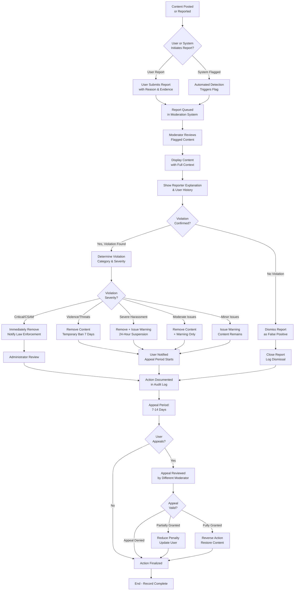

# Moderation and Governance Requirements

## 1. Introduction and Overview

The discussion board platform requires comprehensive moderation and governance systems to maintain a healthy, respectful community focused on economic and political discussions. This document defines community standards, prohibited content categories, moderation workflows, enforcement mechanisms, and appeal processes that the system must support.

The governance structure is built on a progressive enforcement model where violations result in escalating penalties, giving users opportunities to correct behavior before permanent removal. All moderation actions are logged and auditable, ensuring transparency and accountability in enforcement.

This document works in conjunction with the [User Roles and Permissions Document](./03-user-roles-and-permissions.md) which defines the technical permissions for each role, and the [Functional Requirements Document](./05-functional-requirements.md) which specifies the moderation tools and functions available to moderators.

---

## 2. Community Guidelines and Standards

### 2.1 Core Community Principles

The discussion board is established on the following core principles that guide all moderation decisions:

**Respect for All Members**: Users must treat fellow community members with dignity and respect, regardless of their views, background, nationality, or personal characteristics. This principle applies to all discussions regardless of topic.

**Evidence-Based Discussion**: Discussions should be grounded in facts, credible sources, and logical reasoning rather than personal attacks or unfounded claims. Participants are expected to support substantive claims with evidence when challenged.

**Good Faith Participation**: Users are expected to engage in discussions with genuine intent to understand other perspectives and contribute meaningfully to the community. Bad-faith arguments designed only to provoke or derail are discouraged.

**Constructive Dialogue**: Disagreement is encouraged and expected in political and economic discussions. Participants should remain constructive and focused on ideas rather than personal attacks. The goal is to learn from different perspectives.

**Community Ownership**: All community members share responsibility for maintaining community standards through respectful behavior and appropriate reporting of violations. Moderators enforce standards on behalf of the community.

### 2.2 Expected User Conduct Standards

WHEN a user creates or participates in discussions, THE system SHALL expect the following conduct standards:

- Users SHALL express political and economic views without attacking individuals or groups holding different views
- Users SHALL cite credible sources when making factual claims that others question
- Users SHALL acknowledge and engage with differing viewpoints respectfully, not dismissing them out of hand
- Users SHALL not deliberately spread misinformation or knowingly false information
- Users SHALL not use the platform to promote illegal activities, violence, or harm to others
- Users SHALL maintain professional language and tone suitable for public civic discourse
- Users SHALL not spam, flood discussions with repetitive content, or artificially manipulate engagement metrics
- Users SHALL not impersonate other users or misrepresent their identity or expertise

### 2.3 Community Standards Violations Framework

Community standards violations range from minor to severe based on:
- **Severity**: How harmful the content is to community health
- **Intent**: Whether the violation appears deliberate or accidental
- **Pattern**: Whether this is a first offense or repeated violation
- **Context**: Whether the violation occurred in heated debate or was premeditated

Moderators consider all factors when determining appropriate response.

---

## 3. Prohibited Content Categories

### 3.1 Violence and Harm

**Definition**: Content that calls for, incites, or encourages violence against any individual, group, or property.

THE system SHALL prohibit content that:
- Calls for, incites, or actively encourages violence against any individual or identifiable group
- Glorifies or celebrates acts of violence, terrorism, or mass harm
- Contains detailed instructions on how to harm people, animals, or property
- Threatens violence or serious bodily harm against specific individuals or identifiable groups
- Promotes or glorifies terrorist organizations or terrorist activities
- Advocates that harm should befall specific people or groups
- Contains credible threats of violence (assessed in context)

**Examples of Violations**:
- "We should resort to violence to force policy changes" ✗
- "Here's how to build weapons to hurt people" ✗
- "[User name] deserves to be beaten for their political views" ✗
- Detailed instructions for making explosives or weapons ✗
- "All [group] should be eliminated" ✗

**Examples of Acceptable Content**:
- "I strongly disagree with this policy and think it should be changed through voting" ✓
- "This policy creates real harm; I believe we need legislative solutions" ✓
- Historical discussion of violent conflicts with educational context ✓

**Severity Level**: CRITICAL - Zero tolerance. First offense results in permanent ban after content review.

**Moderator Authority**: Any moderator can remove violence-related content immediately. Administrators notified automatically. Potential law enforcement involvement if actual threats.

### 3.2 Harassment and Targeted Attacks

**Definition**: Sustained or coordinated efforts to attack, humiliate, or exclude individuals through repeated negative engagement.

THE system SHALL prohibit content that:
- Targets individuals with repeated harassment or abuse over time
- Organizes coordinated harassment campaigns against individuals
- Publishes private personal information without consent (doxxing), including real names, addresses, contact information, employer, family information
- Engages in hate speech or slurs targeting protected characteristics (race, ethnicity, national origin, religion, gender, gender identity, sexual orientation, disability status, serious health conditions)
- Engages in sustained campaigns to humiliate, embarrass, or damage someone's reputation
- Uses inflammatory language specifically chosen to provoke or upset known sensitive individuals
- Repeatedly insults or demeans individuals based on immutable characteristics
- Creates content specifically designed to mock, ridicule, or belittle an identified person

**Examples of Violations**:
- Repeated posts attacking one user's intelligence in unrelated discussions ✗
- Organizing multiple users to flood someone's comments with negative posts ✗
- Posting another user's real name, address, or employer info without permission ✗
- "All [group] are subhuman" or equivalent slurs ✗
- "[User name], you're such an idiot, you're too stupid to understand economics" ✗ (sustained pattern)
- Creating fake posts pretending to be someone else ✗

**Examples of Acceptable Content**:
- "I strongly disagree with your policy position because..." ✓
- "That argument is logically flawed because..." ✓
- Respectful debate between users with different views ✓
- Single critical comment in a discussion (not harassment pattern) ✓

**Severity Level**: SEVERE for organized harassment or doxxing; MODERATE for individual harassment; escalates with repetition

**Moderator Authority**: 
- Moderate can remove content and issue warnings for first offense
- Temporary ban (7-30 days) for repeated harassment
- Permanent ban for organized harassment campaigns or doxxing

### 3.3 Misinformation and Disinformation

**Definition**: Deliberately false information presented as fact, or false information that causes real-world harm.

THE system SHALL prohibit content that:
- Deliberately spreads false information known to be false by the poster (disinformation)
- Presents fabricated quotes or misattributes statements to public figures or experts
- Spreads thoroughly disproven conspiracy theories as established fact
- Creates or shares deepfakes or manipulated media presented as genuine without clear disclosure
- Contains verifiably false information about voting procedures, election integrity, or civic processes
- Shares health misinformation that could cause direct physical harm (e.g., "don't get vaccines, drink bleach instead")
- Shares information designed to suppress voting or participation in electoral processes

**Important Distinctions**:
- Disputed opinions about policy effectiveness ARE permitted ("This policy won't reduce unemployment")
- Predictions about future outcomes ARE permitted ("I predict this policy will cause recession")
- Interpretations of data ARE permitted ("This data shows that X is declining")
- Reasonable interpretations of studies ARE permitted (even if other interpretations exist)
- Academic debate about causes and effects IS permitted

THE system SHALL NOT remove content merely because it presents one side of a legitimate policy debate.

**Examples of Violations**:
- "Vote on [wrong date]" when accurate date is publicly known ✗
- "Widespread voter fraud has been proven" when no credible evidence supports this ✗
- Fabricated quote falsely attributed to economist or politician ✗
- "Take this unproven treatment instead of vaccines" (health misinformation) ✗
- Deepfake video presented as real without disclosure ✗

**Examples of Acceptable Content**:
- "I think this policy won't be effective because of X, Y, Z" ✓
- "Studies suggest this might cause inflation, here's my interpretation" ✓
- "I predict unemployment will rise next quarter based on these trends" ✓
- "Both sides of this debate are represented by these sources" ✓
- Debate about interpretation of economic data ✓

**Severity Level**: MODERATE to SEVERE depending on potential harm and deliberate nature

**Moderator Authority**:
- Can flag content for review with evidence of falsity
- Can label content as disputed or unverified if false claim is clear
- Can remove only if deliberately false (not good-faith disagreement)
- First offense: warning or labeling; repeated: temporary suspension
- Health misinformation causing direct harm: immediate removal

### 3.4 Spam and Manipulation

**Definition**: Repetitive, automated, or deceptive behavior designed to manipulate content visibility, user engagement, or platform metrics.

THE system SHALL prohibit content that:
- Repeatedly posts identical or near-identical messages (flooding or spam)
- Promotes commercial products, services, or websites for financial benefit without disclosure
- Creates fake accounts to artificially amplify messages or manipulate voting systems
- Uses bot-like behavior patterns to artificially increase engagement metrics
- Excessively posts links to external sites without substantive discussion
- Uses referral links or affiliate marketing links without clear disclosure
- Coordinates voting rings where multiple accounts vote on the same content
- Uses platform features in unintended ways to artificially inflate metrics

**Examples of Violations**:
- Same promotional message posted in 50 discussions ✗
- "[Buy this product at my affiliate link]" posted repeatedly ✗
- User creates 10 accounts to upvote their own discussion ✗
- Bot posting the same generic response to many discussions ✗
- Same discussion posted multiple times within short period ✗

**Examples of Acceptable Content**:
- Single mention of relevant product/resource in on-topic discussion ✓
- Occasional external links with explanation of relevance ✓
- Multiple users independently upvoting content they find valuable ✓
- Cross-posting same discussion to multiple relevant categories once ✓

**Severity Level**: LOW to MODERATE; escalates with repetition

**Moderator Authority**:
- First offense: Remove content and issue warning
- Second offense within 30 days: Temporary mute (24-48 hours)
- Repeated pattern: Temporary ban (7 days)
- Coordinated spam networks: Permanent ban

### 3.5 Illegal Content

**Definition**: Content that violates applicable laws in jurisdictions where the platform operates.

THE system SHALL prohibit content that:
- Violates applicable laws or promotes illegal activities
- Provides instructions for committing illegal acts
- Contains child sexual abuse material (CSAM) - ZERO TOLERANCE
- Facilitates human trafficking, sexual exploitation, or abuse
- Promotes drug trafficking or illegal drug use with practical instructions
- Violates copyright, trademark, or intellectual property laws
- Solicits illegal services or transactions
- Includes content that incites criminal activity

**Examples of Violations**:
- "Here's how to synthesize methamphetamine" ✗
- Any CSAM material ✗ (immediate law enforcement notification)
- "Looking to buy counterfeit goods, here's my contact info" ✗
- Content facilitating human trafficking ✗
- Instructions for hacking, unauthorized computer access, identity theft ✗

**Severity Level**: CRITICAL - Zero tolerance, immediate law enforcement notification required

**Moderator Authority**:
- MUST immediately remove all CSAM content
- MUST notify administrators immediately
- Administrators contact law enforcement
- User account permanently banned
- All content from user archived for investigation

### 3.6 Platform Abuse

**Definition**: Actions that circumvent security measures, manipulate systems, or deliberately sabotage platform functionality.

THE system SHALL prohibit content that:
- Attempts to evade moderation bans through alternative accounts
- Attempts to exploit or damage technical systems
- Impersonates platform staff, moderators, or other users
- Manipulates the system to mislead other users at scale
- Attempts to social engineer credentials or authentication factors
- Scrapes or mass downloads content in violation of terms
- Attempts to reverse engineer or access unauthorized system components
- Repeatedly reports content falsely to overwhelm moderation

**Examples of Violations**:
- Creating new account immediately after permanent ban ✗
- Attempting SQL injection or other technical attacks ✗
- Posting as "Administrator" or impersonating known moderator ✗
- Using automation to mass-download all discussions ✗
- Filing dozens of false reports to overwhelm moderators ✗

**Severity Level**: SEVERE to CRITICAL; immediate action required

**Moderator Authority**:
- Immediate action to stop abuse
- Ban all related accounts
- IP address blocking if needed
- Law enforcement notification if criminal
- Content restoration if abusive takedowns occurred

---

## 4. Moderation Workflow and Processes

### 4.1 Complete Moderation Workflow with All Decision Points

### 4.2 Moderation Workflow Stages

**Stage 1: Report Reception and Triage (0-5 minutes)**

WHEN content is reported by users or flagged by the system, THE moderation system SHALL:
- Assign unique report ID to every report for tracking
- Record report timestamp (UTC) with millisecond precision
- Capture reporting user identity (for follow-up if needed)
- Categorize report into specific prohibited content category
- Queue report in moderation dashboard with priority indicator
- Mark initial status as "Pending Review" with timestamp
- Store complete context including the reported content, discussion thread, user history

WITHIN 5 minutes of report submission, THE system SHALL notify the moderator team that new reports are awaiting review.

**Stage 2: Moderator Review Initiation (5-15 minutes)**

WHEN a moderator selects a pending report for review, THE system SHALL:
- Display full context of reported content in readable format
- Show the original discussion thread if applicable
- Display reporter's explanation and reason for report
- Show the reported user's complete violation history and warnings
- Display relevant community guidelines and policy sections
- Provide links to similar past moderation decisions for consistency
- Record the moderator name and review start timestamp
- Prevent other moderators from reviewing the same report simultaneously

**Stage 3: Violation Assessment and Decision (15-30 minutes)**

WHEN a moderator reviews content, THE moderator SHALL determine:
- Whether content violates community guidelines (yes/no)
- Which specific prohibition category was violated (if applicable)
- Severity level of the violation (Critical, Severe, Moderate, Minor)
- Whether violation appears deliberate or accidental
- User's violation history and pattern of behavior
- Appropriate penalty based on severity and history
- Whether content should be edited, removed, labeled, or left as-is
- Whether user education is needed

THE moderator SHALL have access to decision support resources:
- Quick reference guide of community guidelines
- Examples of similar past decisions (for consistency)
- Penalty progression guidelines based on user history
- Appeal success rates and reasons for their decisions

**Stage 4: Action Execution (30-35 minutes)**

WHEN moderator approves an action, THE system SHALL:
- Execute the enforcement action immediately (warning, removal, label, suspension, ban)
- Generate detailed notification for affected user
- Document action with moderator name, timestamp, and complete rationale
- Update user's violation history and warning count
- Create audit log entry with all relevant details
- Store decision reasoning for future reference
- Update user's role or permissions if suspension/ban applied
- Remove content from public view if removal action selected

**Stage 5: User Notification (35-40 minutes)**

WHEN enforcement action is applied, THE system SHALL:
- Notify user of action taken within 10 minutes
- Explain which guideline was violated with specific examples
- Show the content that was removed or flagged (if applicable)
- Explain penalty type, duration (if time-limited), and effective date
- Clearly state appeal rights and deadline (7-14 days depending on penalty)
- Provide direct link to appeal submission form
- Include relevant community guidelines excerpt
- Offer opportunity for user education if first offense
- Send notification via in-app message and email

**Stage 6: Appeal Period and Resolution (if applicable)**

IF a user submits an appeal within the appeal deadline, THE system SHALL:
- Queue appeal for review by a different moderator (conflict of interest prevention)
- Provide appeal reviewer with original decision documentation
- Allow appeal reviewer to examine new evidence or arguments
- Issue appeal decision within 5 business days
- Notify user of appeal outcome with reasoning
- Execute outcome (reinstatement, penalty reduction, or uphold original action)

---

## 5. Flagging and Reporting System

### 5.1 User Reporting Capabilities

WHEN a member or guest user views content on the platform, THE system SHALL display a "Report" or "Flag" button on each discussion topic and comment.

WHEN a user clicks the report button, THE system SHALL display a report form with the following elements:
- Required field: Reason for reporting (dropdown with specific categories)
- Available report categories:
  - Violence or Safety Threat
  - Harassment or Targeted Attack
  - Misinformation or False Information
  - Spam or Manipulation
  - Illegal Content
  - Platform Abuse
  - Sexual Exploitation Content
  - Other (requires text explanation)
- Optional text field: Detailed explanation (maximum 500 characters)
- Supporting evidence field: Links to other related posts or context
- Checkbox: "Follow up with me about this report"
- Submit and Cancel buttons

WHEN a member submits a report, THE system SHALL:
- Accept and validate the report
- Record reporter's user ID (for follow-up communication if needed)
- Generate unique report ID
- Store report with timestamp and all details
- Add report to moderation queue
- Display confirmation message: "Thank you for reporting. Our moderation team will review this within 24 hours."
- Send confirmation email to reporter's email address

THE system SHALL NOT allow guests to submit reports. WHEN a guest attempts to report, THE system SHALL display: "Please log in to report content. This helps us verify reports and follow up with you if needed."

### 5.2 Automatic System Flagging

THE system SHALL automatically flag content for moderator review when any of these conditions are detected:

**Content Pattern Detection**:
- Content contains URLs matching known spam/phishing domains (via third-party blocklist)
- Content consists of repeated identical text (flooding detection)
- Content is flagged by 3+ users within 1 hour (pattern detection)
- Content is reported by multiple users within short timeframe

**Keyword and Pattern Matching**:
- Content contains known slurs or hateful language patterns from community guidelines
- Content uses CAPS LOCK excessively (more than 50% of message)
- Content violates character encoding standards (obvious malicious payload)
- Content appears to be AI-generated spam based on pattern analysis

**User Behavior Patterns**:
- User account shows unusual behavior (rapid posting, suspicious patterns)
- User creates content at inhuman speeds (>100 comments per hour)
- User posts to many discussions in rapid succession with similar messages
- User account created recently and immediately begins aggressive posting

WHEN the system auto-flags content, THE system SHALL:
- Mark flag source as "System Automated"
- Include specific detection reason in report details
- Assign initial priority indicator (critical > high > normal > low)
- Allow moderators to override system decisions
- Track system accuracy for tuning detection algorithms

### 5.3 Report Management and Moderation Queue

THE moderator system SHALL maintain an active report queue with these features:

**Queue Organization**:
- Reports listed by submission timestamp (FIFO - First In, First Out)
- Priority indicators for severe violations (CRITICAL appears first)
- Filtering options by violation category (Violence, Harassment, Misinformation, etc.)
- Search functionality by username, discussion ID, or report ID
- Status tracking (Pending Review, In Review, Resolved, Dismissed, Under Appeal)
- Age indicator showing how long report has been pending

**Report Details Display**:
- Full text of reported content with context
- Reporter's explanation and reasoning
- User's complete violation history
- Previous moderation actions on this user
- Similar past decisions for consistency guidance
- Community guideline excerpt relevant to the violation

**Queue Management**:
WHEN a moderator opens a report, THE system SHALL:
- Lock that report from other moderators (prevents duplicate review)
- Display full moderation workspace
- Show timer tracking how long report has been pending
- Provide quick action buttons (Approve, Reject, Needs More Info)
- Allow saving draft decision without finalizing

WHEN a moderator closes a report, THE system SHALL:
- Archive completed report
- Update report status
- Maintain complete audit trail
- Allow moderators to reopen reports if new evidence emerges within 7 days
- Retain reports permanently in audit system

---

## 6. Penalty and Enforcement System

### 6.1 Progressive Penalty Framework

THE discussion board SHALL use a progressive penalty system where violations result in escalating consequences. This system gives users opportunities to correct behavior while protecting community standards.

The progressive framework operates as follows:
- First offense for minor violations → Warning
- Repeat minor violations OR first moderate violation → Content removal + warning + 24-hour suspension
- Repeat moderate violations OR first severe violation → Content removal + temporary suspension (7-30 days)
- Repeated severe violations OR critical first offense → Permanent ban

Users understand that continued violations lead to escalating consequences. Each penalty level is clearly communicated with explanation and appeal information.

### 6.2 Detailed Penalty Levels and Specifications

**Level 1: Warning (First Offense for Minor Violations)**

WHEN a user commits a minor violation for the first time, THE system SHALL:
- Issue formal written warning in-app and via email
- Explain the specific violation and which guideline was violated
- NOT remove any content (warning only)
- NOT restrict user access or functionality
- NOT prevent future posting
- Document violation in user's history visible to moderators
- Include appeal information and 7-day appeal deadline
- Store warning permanently in audit trail

Minor violations include:
- Mild rudeness or disrespect without sustained pattern
- Opinion presented without sources (but not claiming to be fact)
- Accidental use of language that could be offensive
- First-time violation of minor guideline misunderstanding
- Single off-topic post in a discussion

Warning notification SHALL include:
- "You have received a warning for violating our community guidelines"
- Quote or paraphrase of the content in question
- Which guideline was violated and specific excerpt
- Explanation of why this violates community standards
- Clear statement that warning does not restrict access
- Appeal instructions and deadline
- Link to community guidelines for future reference

**Level 2: Content Removal + Warning + 24-Hour Suspension (Minor Repeat OR Moderate First)**

WHEN a user commits a minor violation for the second time within 90 days, OR commits a first moderate violation, THE system SHALL:
- Remove the violating content from public view
- Issue formal written warning explaining violation
- Suspend user's posting privileges for exactly 24 hours
- User can still view all discussions (read-only access)
- User cannot create discussions, post comments, or vote
- Display countdown timer showing when suspension ends
- Email user explaining the action and why it was taken
- Document action in user's history
- Include 7-day appeal deadline and instructions
- Automatically reinstate posting privileges after 24 hours

Moderate violations include:
- Sustained low-level harassment or personal attacks
- Deliberate spread of minor misinformation
- Coordinated spam activity from single user
- Intentional circumvention of guidelines
- Aggressive off-topic disruption

Suspension notification SHALL state:
- "Your account has been suspended for 24 hours due to violating community guidelines"
- Specific content removed with reason
- Timestamp when suspension will end (in user's local timezone)
- Appeal option and 7-day deadline
- Encouragement to review guidelines while account is suspended

**Level 3: Temporary Suspension 7-30 Days (Moderate Repeat OR Severe First)**

WHEN a user commits a moderate violation after previous suspension, OR commits a first severe violation, THE system SHALL:
- Remove violating content
- Suspend user account for 7-30 days depending on severity and history
- Access level: read-only (can view but not create content)
- User cannot create posts, comments, edit, delete, or vote
- Display countdown timer showing days remaining in suspension
- Send formal notification email with suspension details
- Generate internal moderation note for administrators
- Include 14-day appeal deadline (longer than Level 2)
- Document action permanently in audit trail
- Automatically reinstate access when suspension expires

Suspension duration calculation:
- First severe violation: 7-14 days (moderator discretion)
- Repeat moderate violation: 7 days
- Multiple repeated violations: 14-30 days
- Escalation history considered in determination

Severe violations include:
- Targeted harassment of individuals
- Violent rhetoric or threats
- Deliberate misinformation campaigns
- Major spam operations
- Coordinated abuse activity

Suspension notification SHALL include:
- "Your account has been temporarily suspended for [X days]"
- Clear explanation of violations committed
- Exact suspension end date and time
- Warning that further violations may result in permanent ban
- Appeal process and 14-day deadline
- Resources for understanding guidelines

**Level 4: Extended Suspension 30+ Days (Severe Repeat)**

WHEN a user commits severe violation after previous suspension, OR shows pattern of repeated violations, THE system SHALL:
- Remove violating content
- Suspend user account for 30-60 days
- Full read-only access (view only, no creation, no voting)
- Extended appeal deadline of 14 days
- Administrative review of user's history
- Send communication indicating that further violations will result in permanent ban
- Document action with detailed reasoning
- Require administrative review before reinstatement

Extended suspension notification SHALL state:
- "Your account has been suspended for [X days] for repeated violations of community guidelines"
- Pattern of violations documented
- Clear warning: "Further violations of community guidelines after reinstatement will result in permanent ban"
- Appeal option with 14-day deadline
- Contact information for support questions

**Level 5: Permanent Ban (Critical Violation OR Final Escalation)**

WHEN a user commits critical violation (CSAM, violence, threats), OR receives three separate suspension-level violations, THE system SHALL:
- Permanently ban the user account
- Mark account as banned (prevent reactivation)
- Remove user from all user lists and search indexes
- Block the associated email address from registering new accounts
- Issue ban notification to user
- Log comprehensive documentation of ban reason
- Preserve all content for potential legal proceedings
- Allow final 30-day appeal before data deletion (except legally required retention)

Critical violations resulting in permanent ban:
- Child sexual abuse material (CSAM)
- Severe threats of violence or harm
- Organized harassment campaigns
- Coordinated manipulation at scale
- Ban evasion attempts
- Illegal content or activities

Permanent ban notification SHALL state:
- "Your account has been permanently banned from the platform"
- Reason for ban with specific violations cited
- Statement that ban is permanent and cannot be appealed after 30 days
- Appeal deadline of 30 days with instructions
- Information about data retention and deletion
- Support contact if questions about ban

### 6.3 Special Circumstances and Escalation

**Repeated Ban Evasion**

IF a user creates new accounts after being banned to continue violating guidelines, THEN THE system SHALL:
- Ban new account immediately upon detection
- Extended ban duration on all related accounts (ban + additional 30 days)
- IP address logging for potential additional restrictions
- Escalate to administrator level for investigation
- Preserve evidence of coordinated evasion
- Alert administrators to enable IP-based blocking if necessary
- Treat evasion as separate violation demonstrating bad faith

**Group and Coordinated Violations**

IF multiple accounts show coordinated violation patterns (organized harassment, mass spam, voting rings), THEN THE system SHALL:
- Treat as coordinated violation requiring special handling
- Apply penalties to all participating accounts (not individual assessment)
- Escalate to administrator review
- Investigate potential common ownership of accounts
- May result in faster escalation to bans
- Document coordination pattern for future reference
- Potentially block IP address or geographic range

**Emergency Moderation for Imminent Harm**

IF content presents clear imminent threat (specific threats to named individuals, instructions for violence, etc.), THEN THE system SHALL:
- Immediately remove content without standard process delay
- Immediately suspend user account pending review
- Notify law enforcement if threats appear credible
- Notify affected individuals if identifiable and at risk
- Conduct full investigation within 24 hours
- Restore content only if investigation clears user of violation

**Cross-Category Violations**

IF a single piece of content violates multiple categories (hate speech + violence threats, misinformation + doxing), THEN THE system SHALL:
- Apply the penalty for the most severe category
- Document all violations in audit trail
- If escalation warranted by severity combination, may skip intermediate penalty levels
- Example: Hate speech + targeted doxing = automatic temporary ban, not just warning

---

## 7. Appeal Process and User Remediation

### 7.1 Appeal Rights and Timeline

WHEN enforcement action is applied (warning through ban), THE user SHALL have the right to appeal EXCEPT in cases of:
- CSAM or child safety violations (zero appeal right)
- Verified illegal content confirmed by authorities (no appeal)
- Repeated ban evasion attempts after previous warnings (no appeal right)

WHEN a user receives penalty notification, THE system SHALL:
- Clearly state appeal rights and appeal deadline
- Provide direct link to appeal submission form
- Explain appeal deadline (7 days for warnings/removals, 14 days for suspensions/bans)
- Describe appeal process and expected timeline
- Explain that different moderator will review appeal
- State that appeal deadline is firm (no extensions without exceptional circumstances)

Appeal deadlines:
- Warnings: 7-day appeal window
- Content removals: 7-day appeal window
- 24-hour suspensions: 7-day appeal window
- 7-30 day suspensions: 14-day appeal window
- Permanent bans: 30-day appeal window

Appeal windows start when user receives notification and can be tracked in account settings.

### 7.2 Appeal Submission Process

WHEN a user submits an appeal, THE system SHALL:
- Accept written explanation from user (maximum 2,000 characters)
- Require user to explain why they believe decision was wrong
- Record appeal submission timestamp
- Assign appeal to different moderator than original decision (conflict of interest prevention)
- Queue appeal for review
- Send confirmation email to user

The user's appeal explanation SHALL address one or more of these elements:
- **Factual error**: "The content was taken out of context..." or "You misunderstood what I meant..."
- **Policy misapplication**: "This doesn't actually violate the guideline because..."
- **Unfair penalty**: "The penalty is too severe compared to past similar cases..."
- **New evidence**: "Here's additional context that shows this wasn't a violation..."
- **Procedural error**: "The moderator didn't follow proper procedures..."

Examples of strong appeal arguments:
- "My comment was removed as misinformation, but I provided a source and correctly cited data. The moderator may have misread the source."
- "I received a warning for harassment, but I made a single critical comment, not a sustained pattern. Looking at my history, I rarely criticize this user."
- "My post was removed as spam, but I've only posted this link once in relevant discussion, with explanation of why it's relevant."

Examples of weak appeal arguments:
- "This is censorship" (without explaining why decision was actually wrong)
- "I disagree with your guidelines" (appeals aren't for changing rules)
- "Other users post worse content" (doesn't address specific decision)

### 7.3 Appeal Review and Resolution

WHEN a moderator receives an appeal for review, THE moderator SHALL:
- Review original decision and complete documentation
- Read user's appeal explanation carefully
- Consider if new information or perspective is presented
- Determine if original decision was justified and properly applied
- Check if penalty was consistent with similar past cases
- Document decision reasoning thoroughly
- Consider all mitigating factors presented in appeal

WHEN an appeal is reviewed, THE system SHALL:
- Notify user of appeal decision within 5 business days (weekdays, not weekends)
- Explain reasoning for decision in user-friendly language
- If appeal upheld: confirm penalty continues with explanation
- If appeal partially granted: reduce penalty appropriately with explanation
- If appeal granted: reverse penalty and offer apology/reinstatement

### 7.4 Detailed Appeal Outcomes

**Appeal Denied (Original Decision Upheld)**

IF appeal is determined to be without merit, THEN THE system SHALL:
- Confirm original penalty is upheld and continues
- Explain specific reasons why appeal did not change decision
- Clarify that no further appeals possible for this specific incident
- Encourage user to follow guidelines going forward and avoid further violations
- Provide link to community guidelines for reference
- Note that accumulating more violations will escalate penalties

Example denial message:
"Your appeal has been reviewed. Upon examination of your comment and our community guidelines, we confirm that it violated our prohibition on harassment. Your comment directly attacked another user personally rather than addressing their argument. The original warning remains in effect. You may continue participating in discussions while following community guidelines."

**Appeal Partially Granted (Reduced Penalty)**

IF appeal identifies procedural error, mitigating circumstances, or incorrect penalty level, THEN THE system SHALL:
- Reduce penalty to appropriate lower level
- Explain which factors warranted reduction
- Apply new penalty immediately
- Example reductions:
  - Temporary ban reduced to content removal + warning
  - 7-day suspension reduced to 24-hour suspension
  - Warning removed entirely (if clearly unwarranted)
- Notify user of new penalty status

Example partial grant message:
"Your appeal has been reviewed. While your content did violate our misinformation guideline, examination of your comment history shows this is your first violation. Our standard for first-time minor misinformation is a warning rather than suspension. Your 24-hour suspension has been reduced to a written warning. You may resume posting immediately."

**Appeal Fully Granted (Penalty Reversed)**

IF appeal demonstrates original action was unjustified or based on error, THEN THE system SHALL:
- Reverse penalty completely and immediately
- Remove violation from user's history
- Restore any removed content
- Send apology communication to user
- Document reversal in permanent audit trail
- Example: Moderator misread context and removed comment that didn't violate guidelines

Example grant message:
"Your appeal has been reviewed. Upon re-examination of your comment in full context, we have determined that your post did not violate our community guidelines. You were discussing the economic implications of policy, and your comment was appropriate. We apologize for the error. Your warning has been removed, and your suspended account has been restored. Thank you for appealing and for holding us accountable."

---

## 8. Moderator Responsibilities and Authorities

### 8.1 Moderator Scope and Assignment

THE system SHALL support the following moderator assignment model:

**Category-Based Moderation**: Moderators are assigned to specific discussion categories (e.g., Monetary Policy, Elections, Trade) and have moderation authority only within those categories.

WHEN a moderator is assigned to a category, THE system SHALL:
- Grant moderation permissions for that specific category
- Restrict moderation actions to that category only
- Allow cross-category moderation for critical issues (violence, illegal content) after escalation
- Enable viewing of moderation statistics for assigned category only
- Assign multiple moderators to larger categories for load balancing

**Moderator Role Assignment**: An administrator assigns Member users to Moderator role after vetting for judgment, fairness, and community commitment.

Moderator selection criteria:
- Active community member in good standing
- No recent violations or warnings
- Demonstrated respect for community guidelines
- Understanding of platform mission and values
- Availability for regular moderation duties
- Commitment to fairness and consistency

### 8.2 Moderator Capabilities (Detailed)

WHEN a moderator is logged in, THE system SHALL enable these moderation actions:

**Content Moderation Actions**:
- Review all flagged/reported content in assigned categories
- Remove violating content (hide from public view, archive in database)
- Edit content to remove specific problematic sections
- Label or tag content as disputed, unverified, or flagged
- Restore accidentally removed content within appeal period
- Lock discussions to prevent further comments
- Unlock previously locked discussions
- Pin important or exemplary discussions
- Unpin previously pinned discussions
- Move discussions between categories (if moderator has authority in both)

**User Management Actions**:
- View complete user profile including history and statistics
- Issue warnings to users explaining violations
- Temporarily mute users (prevent posting for 24-48 hours)
- Temporarily suspend users (up to 30 days)
- Request administrator intervention for permanent bans
- View user's complete moderation history
- Create and maintain moderation notes visible to other moderators

**Queue and Workflow Management**:
- View pending moderation queue
- Filter reports by category, type, or date
- Assign reports to specific moderators
- Comment on reports with analysis or recommendations
- Track status of reports and appeals
- Generate weekly moderation reports

**Viewing and Information Access**:
- View all reported content in their assigned categories
- View complete user history and violation record
- View all user accounts that belong to same person (detected through IP, etc.)
- Access moderation guidelines and precedents
- Review previous moderation decisions for consistency
- Access category-specific moderation statistics

### 8.3 Moderator Restrictions (Clear Boundaries)

WHILE a moderator is taking actions, THE system SHALL enforce these restrictions:

**Actions Prohibited for Moderators**:
- Cannot create, edit, or delete user accounts (admin only)
- Cannot change user roles or permissions (admin only)
- Cannot access administrator panel or settings
- Cannot modify community guidelines or policies
- Cannot override other moderators' decisions (admin only)
- Cannot issue permanent bans (admin function only)
- Cannot delete user accounts (admin function only)
- Cannot permanently destroy content from database (admin only)
- Cannot access user private messages or deleted content
- Cannot modify category structure or create new categories (admin only)
- Cannot view system-wide analytics (admin only)
- Cannot configure system settings or integrations (admin only)
- Cannot manage other moderators (admin only)

**Scope Limitations**:
- Moderators can only moderate content in their assigned categories
- Cross-category moderation requires administrator escalation (except critical issues like CSAM)
- Cannot take moderation actions on content outside assigned category scope
- Cannot moderate other moderators' posts (recuse themselves)
- Cannot take action on reports they personally submitted

**Conflict of Interest Prevention**:
- Moderators cannot moderate content they authored
- Moderators cannot moderate content involving personal relationships
- Moderators cannot review appeals of their own decisions
- System prevents self-referential moderation actions
- Moderators should recuse themselves from situations with apparent conflicts

### 8.4 Moderator Accountability and Oversight

WHEN moderators take actions, THE system SHALL:
- Record every action with moderator name and timestamp
- Make all moderation decisions visible to other moderators and administrators
- Generate weekly reports on moderator activity and patterns
- Track user appeals specifically citing moderator bias or error
- Flag patterns of suspicious moderator behavior (e.g., always favoring one political side)
- Alert administrators to potential moderator overreach
- Provide override capability for administrators to review moderator decisions
- Maintain complete audit trail of all moderator actions

Moderator performance monitoring:
- Appeal success rate (what percentage of user appeals against this moderator's decisions succeed)
- Consistency rate (how consistent are decisions compared to moderator's past decisions and peers)
- Response time (how quickly does moderator review and act on reports)
- User feedback (are users satisfied with this moderator's fairness)
- Violation rate (do moderators follow their own guidelines in their posts)

IF a moderator receives appeals indicating potential bias, THE system SHALL:
- Flag for administrator review
- Review moderator's decision pattern for political or personal bias
- Check if decisions are consistent across different political viewpoints
- Determine if moderator is applying different standards unfairly

IF a moderator is found to be abusing power, THE system SHALL:
- Allow administrator to reverse moderator's decisions
- Review complete action history for pattern of abuse
- Remove moderator permissions immediately
- Document incident for potential disciplinary action
- Communicate with affected users about reversal of unjust actions

---

## 9. Content Handling and Removal Procedures

### 9.1 Content Removal and Display Options

WHEN a moderator determines content violates guidelines, THE system SHALL support these handling options:

**Complete Removal**:
- Content is deleted from public view completely
- Post/comment no longer visible to any users
- Replaced with "[This content has been removed]" placeholder if there are replies
- Use for: Violence, threats, illegal content, CSAM, severe harassment, doxing

**Flagged/Labeled Display**:
- Content remains visible but marked as "Flagged for Violation" or "Disputed Content"
- Shows warning label before content displayed
- Users can click to expand and read content if they choose
- Includes moderator note explaining the flag
- Use for: Misinformation, disputed claims, unverified statements, misleading headlines

**Edit by Moderator**:
- Moderator removes specific portions of content
- Original version preserved in audit log for transparency
- Edited content becomes visible immediately with "Edited by moderator" note
- Original and edited versions both viewable in history
- Use for: Slurs mixed with valid discussion, personal info mixed with substantive points, off-topic derailing

**Collapse/Hide**:
- Content is hidden by default but can be expanded by clicking "[Collapsed]"
- Reduces visibility without full removal
- Useful for tangential discussions or minor issues
- Use for: Off-topic but not violating content, minor guideline issues, tangential derailing

**Mute Thread/Discussion**:
- Discussion becomes invisible in browsing and search
- Users with direct link can still access
- Prevents further comment notifications from the thread
- Use for: Resolved issues, concluded discussions that become off-topic

### 9.2 Content Preservation and Appeal Support

WHEN content is removed, THE system SHALL:
- Store full copy in secure audit log for 90 days minimum
- Preserve original content exactly as posted (with metadata)
- Make removal reasoning visible to user in notification
- Allow user to view removed content in their account for appeal purposes
- Restore content immediately if appeal succeeds
- If appeal succeeds, display notice "This moderation decision has been reversed upon appeal"

Appeal visibility:
- Users can view their removed content when reviewing appeal status
- Removed content accessible only to content creator and moderators during appeal
- After appeal resolved, access based on new status (visible if reinstated, permanently hidden if upheld)

### 9.3 User Content Visibility During Moderation

WHEN a user is suspended or permanently banned, THE system SHALL:
- Preserve all historical content they created
- Keep historical content visible in discussions (unless content itself violates guidelines)
- Prevent user from editing, deleting, or modifying own content during suspension/ban
- Show "[Suspended User]" or "[Banned User]" next to their old content for transparency
- Upon permanent ban: content can be removed if requested by affected other users or admin decision
- Never retroactively remove all content from user preemptively

**Philosophy**: A user's past contributions to community discourse remain visible even if user is later banned, so community can understand discussion context. Individual posts only removed if that post specifically violated guidelines.

---

## 10. User Warnings, Suspensions, and Banning Mechanics

### 10.1 Warning System

WHEN a user receives a warning, THE system SHALL:
- Record warning in user's violation history accessible to moderators
- Display warning count in user's profile (visible to moderators and user only)
- Send email notification explaining specific violation with guidance
- Include quote/reference to specific content that triggered warning
- Provide link to relevant community guidelines excerpt
- Allow user to continue posting immediately (warning is informational)
- Display warning in user's account dashboard for reference
- Automatically archive warning from visible history after 90 days if no new violations occur during that period

Accumulation of warnings:
- After 3 warnings within 90 days → Automatic temporary suspension (24 hours)
- After 5 warnings within 90 days → Automatic extended suspension (7 days)
- Warnings older than 90 days with no new violations don't count toward escalation

### 10.2 Temporary Suspension System

WHEN a user is placed on temporary suspension, THE system SHALL:
- Calculate suspension end date and time (in user's local timezone)
- Prevent user from creating new discussions or comments
- Prevent user from editing or deleting existing posts
- Prevent user from voting on content or engaging
- Allow user read-only access to continue browsing
- Display countdown timer showing remaining suspension time
- Send email notification with suspension dates and reason
- Automatically reinstate posting access when suspension period ends
- Document suspension in user history permanently
- Track all suspended users for administrator oversight

Suspension mechanics:
- User blocked from posting but account not deleted
- All existing content remains visible (not archived)
- User can view, read, and browse all discussions
- User cannot participate until suspension expires
- Suspension expiration is exact to the minute (24 hours means 24 hours precisely)
- System automatically ends suspension without user action

### 10.3 Permanent Ban System

WHEN a user is permanently banned, THE system SHALL:
- Immediately prevent all account access
- Display message explaining ban when user attempts login
- Prevent account recovery or password reset
- Block email address associated with ban from registering new accounts
- Allow 30-day appeal period (users can appeal if they believe ban is unfair)
- If appeal denied: full ban enforcement begins
- Store ban reason and evidence in admin audit trail
- Log all ban-related appeals and decisions
- Retain account in database (not deleted, marked as "banned")

Ban notification includes:
- Reason for permanent ban with specific violations cited
- Ban date and effective timestamp
- Statement that ban is permanent and permanent
- Appeal option with clear instructions and 30-day deadline
- Information about data retention (what data is kept, what is deleted)
- Support contact for questions about ban

### 10.4 Ban Evasion Detection

IF a banned user attempts to create new account, THE system SHALL:
- Detect patterns indicating evasion (same email, similar username, same IP address, device fingerprint)
- Flag account as likely ban evasion
- Automatically suspend new account pending admin review
- Alert administrators immediately of potential evasion
- Log attempted evasion for pattern analysis

IF evasion is confirmed, THE system SHALL:
- Ban new account immediately
- Extend original ban duration by additional 30 days
- Block IP address or geolocation for increased period if appropriate
- Remove ban evasion accounts without appeal right
- Document coordinated evasion attempts

---

## 11. Moderation and Governance Integration with Other Systems

### 11.1 Integration with User Roles and Permissions

Moderation and governance requirements work in conjunction with the [User Roles and Permissions Document](./03-user-roles-and-permissions.md):

- Permission matrix defines what actions each role can take
- Moderation workflows require member to moderator promotion process
- Role-based access control enforces moderator restrictions in system
- Session management ensures moderators' permissions are current
- Rate limiting prevents moderator abuse of moderation tools

### 11.2 Integration with Functional Requirements

Moderation functions are implemented through features defined in the [Functional Requirements Document](./05-functional-requirements.md):

- Flagging and reporting system (Section 9.1 in Functional Requirements)
- Moderator review workflow (detailed in Moderation Functions section)
- Content removal and editing capabilities (Section 4 in Functional Requirements)
- User suspension and banning (Section 10 in Functional Requirements)
- Audit logging of all moderation actions (for accountability)

### 11.3 Integration with Business Rules

Moderation enforcement is constrained by [Business Rules and Constraints Document](./08-business-rules-and-constraints.md):

- Rate limiting prevents abuse of moderation actions
- Time-based rules enforce appeal deadlines
- Data retention rules determine how long moderation records are kept
- User account rules prevent moderators from creating accounts outside normal process
- Conflict resolution rules prevent simultaneous moderation action conflicts

### 11.4 Cross-Reference to Other System Functions

Users experiencing moderation actions should refer to:
- [User Account Management](./05-functional-requirements.md#user-account-management) for account-related questions
- [Discussion Workflows](./06-discussion-workflows.md) for how to participate going forward
- [User Roles and Permissions](./03-user-roles-and-permissions.md) for what permissions are available after moderation actions
- [Security and Compliance](./10-security-and-compliance.md) for data privacy and account security

---

## 12. Moderation Performance and Quality Assurance

### 12.1 Moderation Quality Metrics

THE system SHALL track the following metrics for moderation quality:

**Response Time Metrics**:
- Average time from report submission to moderator review initiation
- Average time from review start to decision
- Average time from user notification to first appeal (if applicable)
- Target: 24 hours from report to initial action

**Decision Quality Metrics**:
- Appeal success rate (what % of appeals are successful)
- Consistency rate (decisions compared across similar cases)
- User satisfaction scores (from post-moderation surveys)
- False positive rate (reports dismissed as not violations)

**Moderator Performance Metrics**:
- Report resolution rate (how many reports each moderator handles)
- Response time consistency
- Appeal rate of their decisions (what % are appealed)
- Appeal success rate (what % of appeals against their decisions succeed)
- User feedback on their fairness

**Community Health Metrics**:
- Rate of new violations (trend over time)
- Repeat violation rate (users committing multiple violations)
- Community perception of fairness (survey-based)
- Report volume trends
- Time from violation to resolution

### 12.2 Moderation Training and Consistency

THE system SHALL support moderator consistency through:

**Guidance Documents**:
- Written moderation guidelines with examples
- Decision precedent database showing similar past decisions
- Community guidelines accessible to all moderators
- FAQ addressing common moderation scenarios
- Regular updates when guidelines are clarified

**Moderator Meetings**:
- Monthly meetings to discuss complex cases
- Sharing of difficult decisions for group input
- Training on new guidelines or policy changes
- Discussion of appeal outcomes and lessons learned
- Collaboration on consistent application of rules

**Quality Review**:
- Regular review of moderator decisions by administrators
- Feedback on consistency and fairness
- Guidance when moderator patterns suggest bias or inconsistency
- Recognition of excellent moderator work
- Disciplinary action if moderator abuse is found

---

## Summary

This moderation and governance document establishes the complete framework for community standards, content moderation, user penalties, and appeal processes. The progressive penalty system balances community protection with user fairness, while the detailed appeal process ensures accountability. Clear role definitions, specific violation categories with examples, and comprehensive workflow documentation provide moderators with the tools and guidance they need to maintain a healthy, respectful community.

The system serves the platform's mission: facilitating thoughtful economic and political discussion while protecting against abuse, harassment, misinformation, and illegal content. Moderation is transparent, consistent, and appealable, building user trust in the fairness of community standards enforcement.

---

> *Developer Note: This document defines **business requirements for moderation and governance only**. All technical implementations (database design for audit logs, API architecture for moderation tools, content removal mechanisms, etc.) are at the discretion of the development team. This document specifies WHAT moderation actions must be supported and HOW the moderation process works, not the technical HOW to build moderation systems.*