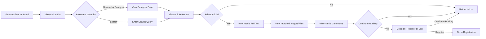
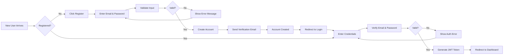
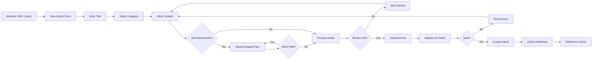
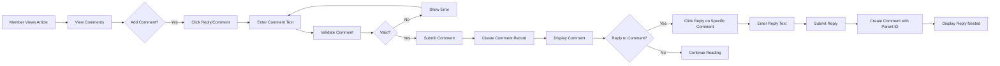
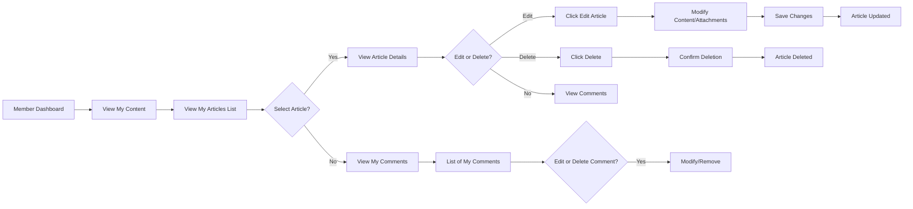
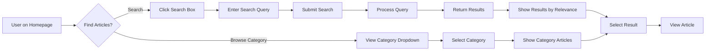
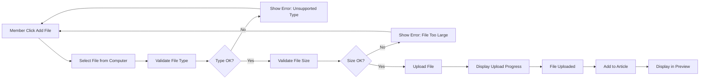
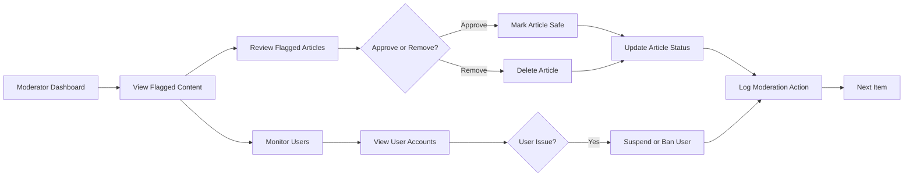

# User Workflows

## Overview

This document defines the primary user journeys and interaction scenarios for the discussion board platform. Each workflow describes how different user actors accomplish their goals, including the steps they take, decision points they encounter, and the business rules that govern their interactions.

The discussion board has three primary user actors:
- **Guests**: Unauthenticated users with read-only access
- **Members**: Authenticated users who can create content and participate in discussions
- **Moderators**: Administrators who manage content and enforce community guidelines

This document describes how each actor interacts with the system to accomplish their objectives.

---

## Guest User Journey

Guests are unauthenticated visitors who can browse and read the discussion board without creating an account. They represent the primary entry point to the platform.

### Guest Browse & Discover Workflow

### Guest Workflow Steps

1. **Access Discussion Board**
   - WHEN a guest user navigates to the discussion board homepage, THE system SHALL display the list of all public articles in reverse chronological order (newest first)
   - THE system SHALL show article preview information including title, author, creation date, and comment count
   - THE system SHALL display article excerpts limited to the first 150 characters

2. **Browse Articles by Category**
   - WHEN a guest clicks on a category in the navigation menu, THE system SHALL filter articles to show only those in the selected category
   - THE system SHALL update the page title to show "Category: [Category Name]"
   - THE system SHALL maintain pagination showing 20 articles per page
   - THE system SHALL display category filter status prominently so guest understands the current view

3. **Search for Articles**
   - WHEN a guest enters a search query in the search box and presses Enter or clicks Search, THE system SHALL search across all article titles and content
   - THE system SHALL return matching articles within 3 seconds
   - THE system SHALL display search results with relevance ranking (title matches shown first)
   - THE system SHALL highlight matching keywords in the search results
   - THE system SHALL show "X results found for '[query]'" at the top of results

4. **View Article Details**
   - WHEN a guest clicks on an article from the list, THE system SHALL display the full article detail page
   - THE system SHALL display the complete article text, author information, creation date, and modification timestamp
   - THE system SHALL show all attached images inline within the article content at appropriate display widths (600px maximum)
   - THE system SHALL provide download links for attached files with filename and file size displayed
   - THE system SHALL display the comment count prominently
   - THE system SHALL show the article view count

5. **Read Comments**
   - WHEN a guest scrolls to the comments section, THE system SHALL display all published comments in chronological order
   - THE system SHALL show commenter name, avatar if available, timestamp, and comment text for each comment
   - THE system SHALL display nested reply structure with visual indentation showing parent-reply relationships
   - THE system SHALL limit initial comment display to 20 comments per page with pagination for additional comments
   - THE system SHALL allow guest to expand individual comment threads to see all replies

6. **Access Restrictions for Guests**
   - IF a guest attempts to create an article, THE system SHALL deny the request and display: "You must be logged in to create articles. [Login Link] or [Register Link]"
   - IF a guest attempts to post a comment, THE system SHALL deny the request and display: "You must be logged in to comment. [Login Link] or [Register Link]"
   - IF a guest attempts to upload a file or image, THE system SHALL deny the request and display: "You must be logged in to upload files. [Login Link] or [Register Link]"
   - IF a guest attempts to edit or delete any content, THE system SHALL deny the request and display: "You can only edit content you have created. Please log in to your account."

7. **Registration Decision Point**
   - WHEN a guest has finished browsing and decides to participate, THE system SHALL display prominent "Sign Up" and "Log In" buttons
   - THE system SHALL display a call-to-action: "Join the discussion" or similar encouraging message
   - WHEN a guest clicks "Sign Up", THE system SHALL redirect to the registration workflow

---

## Member Registration & Authentication Workflow

Members are registered users who can create content, post comments, and upload attachments. This workflow covers the complete registration and authentication process.

### Registration & Login Flow

### Registration Workflow Steps

1. **Access Registration Page**
   - WHEN a guest clicks "Register" or "Sign Up" button, THE system SHALL navigate to the registration page
   - THE system SHALL display a registration form with email and password input fields
   - THE system SHALL show password strength indicator as user types
   - THE system SHALL display all required fields marked with an asterisk (*)

2. **Enter Registration Details**
   - WHEN a new user enters an email address, THE system SHALL validate the email format in real-time
   - IF email format is invalid, THE system SHALL show inline error: "Please enter a valid email address (user@example.com)"
   - WHEN a new user enters a password, THE system SHALL validate password strength: minimum 8 characters, at least one uppercase letter, one lowercase letter, and one number
   - THE system SHALL display password strength feedback: "Weak", "Fair", "Good", or "Strong"
   - THE system SHALL require password confirmation in a separate field
   - IF passwords do not match, THE system SHALL show error: "Passwords do not match. Please try again."

3. **Validate Uniqueness**
   - WHEN a new user submits the registration form, THE system SHALL verify the email address is not already registered
   - IF email already exists, THE system SHALL reject registration and display: "An account with this email address already exists. [Login Link] or [Forgot Password Link]"
   - THE system SHALL return focus to the email field for correction

4. **Account Creation**
   - IF all validations pass, THE system SHALL create a new member account with:
     - User ID (system-generated UUID)
     - Email address
     - Hashed password
     - Registration timestamp
     - Account status set to "pending-email-verification"
     - Default role set to "member"

5. **Email Verification**
   - WHEN the account is created, THE system SHALL send a verification email to the provided address
   - THE verification email SHALL contain a unique, time-limited verification link valid for 24 hours
   - THE system SHALL display confirmation page: "Registration successful! Please check your email to verify your account."
   - WHEN a new user clicks the verification link in the email, THE system SHALL:
     - Verify the link is valid and not expired
     - Update account status to "active"
     - Display success message: "Email verified successfully. You can now log in."
   - IF verification link is expired, THE system SHALL display: "Verification link expired. [Request New Link]"

6. **Login Workflow Steps**

   **Access Login Page:**
   - WHEN a member navigates to the login page or clicks "Log In" button, THE system SHALL display login form
   - THE system SHALL show email and password input fields
   - THE system SHALL provide "Forgot Password?" link

   **Enter Credentials:**
   - WHEN a member enters email and password, THE system SHALL validate both fields are filled
   - IF either field is empty, THE system SHALL show error: "Please enter both email and password"

   **Validate Credentials:**
   - WHEN a member submits credentials, THE system SHALL:
     - Look up the account by email address
     - IF email not found, THE system SHALL display: "Email or password incorrect" (generic message for security)
     - IF email found, THE system SHALL verify password hash against stored password
     - IF password incorrect, THE system SHALL display: "Email or password incorrect" (generic message for security)
     - THE system SHALL track failed login attempts for the account

   **Lock Account on Multiple Failures:**
   - WHEN a member fails login 5 consecutive times within 15 minutes, THE system SHALL:
     - Temporarily lock the account
     - Display: "Too many failed login attempts. Your account is temporarily locked for 15 minutes."
     - Unlock account automatically after 15 minutes OR when user resets password

   **Generate Authentication Token:**
   - IF credentials are valid, THE system SHALL:
     - Generate JWT token containing: userId, userEmail, userName, role, permissions array
     - Set token expiration to 15 minutes
     - Generate refresh token with 7-day expiration
     - Store tokens in secure httpOnly cookies OR localStorage (implementation choice)
     - Create session record in database linked to JWT

   **Redirect After Login:**
   - THE system SHALL redirect authenticated member to dashboard or homepage
   - THE system SHALL display welcome message: "Welcome back, [User Name]!"
   - THE system SHALL update user interface to show authenticated member state (hide Login button, show Logout button)

### Logout Workflow

- WHEN a member clicks "Logout", THE system SHALL:
  - Invalidate current JWT token
  - Invalidate associated refresh token
  - Delete session record from database
  - Clear authentication cookies/localStorage
  - Redirect to homepage
  - Display message: "You have been logged out"

### Password Recovery Workflow

- WHEN a member clicks "Forgot Password?", THE system SHALL display password reset request form
- WHEN member enters their email, THE system SHALL:
  - Look up account by email
  - Generate time-limited password reset token (valid 24 hours)
  - Send password reset email with reset link
  - Display message: "If an account exists with this email, you will receive password reset instructions"
- WHEN member clicks password reset link in email, THE system SHALL display password reset form
- WHEN member enters new password and confirmation, THE system SHALL:
  - Validate new password meets strength requirements
  - Update password in database
  - Invalidate all existing tokens for the user (forcing re-login on all devices)
  - Display: "Password successfully reset. Please log in with your new password."

---

## Creating an Article Workflow

Members can create articles with text content and attach images and files. This is a core workflow for the discussion board.

### Article Creation Flow

### Article Creation Workflow Steps

1. **Initiate Article Creation**
   - WHEN a member clicks "Create Article", "New Post", or "Write" button, THE system SHALL verify member is authenticated
   - IF member is not authenticated, THE system SHALL redirect to login page
   - IF member is authenticated, THE system SHALL display article creation form
   - THE system SHALL prefill author field with authenticated member's name (read-only)

2. **Enter Article Title**
   - WHEN member types in the title field, THE system SHALL validate title in real-time
   - IF title is empty, THE system SHALL show: "Title is required"
   - IF title exceeds 200 characters, THE system SHALL show: "Title must not exceed 200 characters" with character count displayed
   - IF title contains only special characters or whitespace, THE system SHALL show: "Title must contain at least one letter or number"
   - THE system SHALL enable the Continue/Next button only when title is valid

3. **Select Article Category**
   - WHEN member views the category field, THE system SHALL display dropdown with all available categories
   - THE system SHALL require exactly one category to be selected (required field)
   - THE system SHALL display category descriptions to help member choose appropriate category
   - IF member does not select a category, THE system SHALL prevent article submission

4. **Write Article Content**
   - WHEN member clicks in the content field, THE system SHALL display text editor with formatting options if supported
   - WHEN member types content, THE system SHALL validate content in real-time
   - IF content exceeds 50,000 characters, THE system SHALL show: "Content must not exceed 50,000 characters" with current character count
   - THE system SHALL display character count indicator showing "X of 50,000 characters"
   - IF content is empty or only whitespace, THE system SHALL show: "Content cannot be empty"

5. **Attach Images (Optional)**
   - WHEN member clicks "Add Image" button, THE system SHALL open file browser dialog
   - WHEN member selects image file, THE system SHALL validate:
     - File type is one of: JPG, JPEG, PNG, GIF, WebP
     - File size does not exceed 10 MB
     - Total images don't exceed attachment limits
   - IF validation fails, THE system SHALL show specific error: "File type not supported" or "File size exceeds 10 MB limit"
   - IF validation passes, THE system SHALL:
     - Upload image to temporary storage
     - Generate thumbnail preview
     - Display uploaded image in preview with option to remove
     - Update attachment count display

6. **Attach Files (Optional)**
   - WHEN member clicks "Add File" button, THE system SHALL open file browser dialog
   - WHEN member selects file, THE system SHALL validate:
     - File type is supported (PDF, DOC, DOCX, TXT, ZIP, etc.)
     - File size does not exceed 50 MB
     - Total files don't exceed attachment limits per article (10 total)
   - IF validation fails, THE system SHALL show specific error message
   - IF validation passes, THE system SHALL:
     - Upload file to temporary storage
     - Display file with name, size, and remove option
     - Update attachment count display
   - WHEN member clicks "Remove" on an attachment, THE system SHALL delete the temporary file and update display

7. **Preview Article**
   - WHEN member clicks "Preview" button, THE system SHALL display article as it will appear to other users
   - Preview SHALL show:
     - Title with category badge
     - Author name and creation date
     - Full article content with formatting
     - All attached images displayed inline
     - All attached files with download links
   - Member can return to edit form to make changes

8. **Validate & Submit Article**
   - WHEN member clicks "Publish" or "Submit", THE system SHALL perform final validation:
     - Title is not empty and between 3-200 characters
     - Content is not empty and between 10-50,000 characters
     - Category is selected
     - All attachments are valid (re-validate file types and sizes)
   - IF any validation fails, THE system SHALL show specific error and return to edit form
   - THE system SHALL preserve all user input for correction

9. **Create Article Record**
   - IF all validation passes, THE system SHALL:
     - Create article record with: title, category, content, member ID (author)
     - Set creation timestamp to current time (ISO 8601 UTC)
     - Set last modified timestamp equal to creation timestamp
     - Set edit history flag to false (not edited yet)
     - Initialize view count to 0
     - Set status to "published"
     - Move attachments from temporary storage to permanent storage
     - Link all attachments to the article
     - Create empty comments array
   - THE system SHALL display success message: "Article published successfully!"
   - THE system SHALL redirect member to the newly published article view

---

## Commenting on Articles Workflow

Members can comment on articles and reply to other comments. This creates discussion around articles.

### Comment & Discussion Flow

### Comment Workflow Steps

1. **Access Comments Section**
   - WHEN a member views an article, THE system SHALL display comments section below article content
   - THE system SHALL show "X Comments" indicating the total number of comments
   - THE system SHALL display all comments in chronological order (oldest first by default, with sort option)
   - THE system SHALL show nested structure visually with indentation for replies

2. **Initiate Comment**
   - WHEN a member clicks "Add Comment" or scrolls to comment input field, THE system SHALL verify member is authenticated
   - IF member is not authenticated, THE system SHALL redirect to login
   - IF member is authenticated, THE system SHALL display comment composition form
   - THE system SHALL focus on comment text field automatically

3. **Write Comment**
   - WHEN member types comment text, THE system SHALL validate in real-time:
     - Comment is not empty
     - Comment does not exceed 5,000 characters
   - THE system SHALL display character counter: "X of 5,000 characters"
   - IF comment would exceed limit, THE system SHALL prevent additional typing
   - THE system SHALL allow basic text formatting if supported (bold, italic, links)

4. **Submit Comment**
   - WHEN member clicks "Post Comment" or presses keyboard shortcut, THE system SHALL:
     - Validate comment text is not empty and meets requirements
     - Verify member is not suspended or banned
     - Check comment rate limits (maximum 50 comments per hour per user)
   - IF rate limit exceeded, THE system SHALL display: "You have exceeded the comment limit. Please wait [X] minutes before posting again."
   - IF validation passes, THE system SHALL:
     - Create comment record with: comment text, member ID (author), article ID, creation timestamp
     - Set status to "published"
     - Set parent comment ID to null (top-level comment)
   - THE system SHALL clear comment text field
   - THE system SHALL display new comment immediately in comments section
   - THE system SHALL show member name, avatar, timestamp, and comment text
   - THE system SHALL increment article's comment count

5. **Reply to Specific Comment**
   - WHEN member clicks "Reply" on a specific comment, THE system SHALL:
     - Display reply composition form directly below parent comment
     - Prefill mention: "@[Parent Commenter Name]" in the text field
     - Show parent comment context above reply field
   - WHEN member types reply text and submits, THE system SHALL:
     - Validate reply meets same requirements as top-level comments (1-5000 characters)
     - Create comment record with parent comment ID reference
     - Set status to "published"
   - THE system SHALL display reply nested under parent comment with visual indentation
   - THE system SHALL show "In reply to [Parent Commenter]" or similar indicator
   - THE system SHALL link parent and child comments for context

6. **View Comment Thread**
   - WHEN comments have nested replies, THE system SHALL display parent comment first followed by replies indented
   - THE system SHALL support up to 3 levels of nesting with visual indentation increasing by level
   - IF threads exceed 3 levels deep, THE system SHALL collapse deeply nested replies with "Show [X] more replies" button
   - WHEN member clicks to expand, THE system SHALL display all nested replies

7. **Edit Own Comment**
   - WHEN member views their own comment, THE system SHALL display edit icon
   - WHEN member clicks edit, THE system SHALL:
     - Display edit form with current comment text
     - Allow modification of comment text only
     - NOT allow changing the parent comment reference or timestamp
   - WHEN member submits edited comment, THE system SHALL:
     - Validate new text meets requirements
     - Update comment text in database
     - Update modification timestamp
     - Mark comment as "edited" with edit timestamp displayed
   - THE system SHALL redisplay updated comment with edit indicator

8. **Delete Own Comment**
   - WHEN member views their own comment, THE system SHALL display delete icon
   - WHEN member clicks delete, THE system SHALL display confirmation: "Delete this comment? This cannot be undone."
   - WHEN member confirms deletion, THE system SHALL:
     - Remove comment from database
     - Remove all nested replies to this comment OR mark replies as orphaned
     - Decrement article's comment count
   - THE system SHALL refresh comments section immediately

9. **Rate Limiting on Comments**
   - THE system SHALL enforce maximum 50 comments per hour per member
   - IF member exceeds limit, THE system SHALL reject submission and display: "Comment posting limit exceeded. Please wait [X] minutes."
   - THE system SHALL reset limit hourly

---

## Managing Personal Content Workflow

Members can view, edit, and delete their own articles and comments. This workflow covers personal content management.

### Content Management Flow

### Personal Content Management Steps

1. **Access Personal Dashboard**
   - WHEN an authenticated member clicks "My Profile", "My Content", "Dashboard", or similar link, THE system SHALL display member's personal content area
   - THE system SHALL verify member is authenticated
   - THE system SHALL display sections: "My Articles", "My Comments", "Recent Activity"
   - THE system SHALL show profile information (email, username, join date, statistics)

2. **View My Articles**
   - THE system SHALL display list of all articles created by the authenticated member
   - THE system SHALL show for each article:
     - Title (clickable link to article)
     - Category
     - Creation date
     - Last modification date (if edited)
     - Number of comments
     - Number of views
     - Published status
   - THE system SHALL sort articles by creation date (newest first)
   - THE system SHALL provide search/filter options to find specific articles

3. **Edit Article**
   - WHEN member clicks "Edit" on one of their articles, THE system SHALL:
     - Verify member is the article author
     - Display article edit form with current content populated
     - Show all current attachments with remove options
   - WHEN member modifies article fields, THE system SHALL allow editing:
     - Title (can change)
     - Category (can change)
     - Content text (can change)
     - Add new attachments (can upload more)
     - Remove existing attachments (can delete)
   - WHEN member submits edited article, THE system SHALL:
     - Validate all fields meet requirements
     - Update article fields in database
     - Update modification timestamp to current time
     - Keep creation timestamp unchanged
     - Mark article as "edited" in display
     - Handle attachment changes (additions, deletions, replacements)
   - THE system SHALL display success message: "Article updated successfully!"
   - THE system SHALL redirect to updated article view

4. **Delete Article**
   - WHEN member clicks "Delete" on one of their articles, THE system SHALL display confirmation dialog:
     - "Delete this article? All [X] comments will also be deleted. This action cannot be undone."
     - Show "Delete" and "Cancel" buttons
   - WHEN member confirms deletion, THE system SHALL:
     - Remove article record from database
     - Remove all comments associated with article
     - Remove all attachments associated with article
     - Decrement author's article count
     - Remove article from all search indexes
   - THE system SHALL redirect to personal dashboard
   - THE system SHALL display success message: "Article deleted successfully"

5. **View My Comments**
   - THE system SHALL display list of all comments posted by the member across all articles
   - THE system SHALL show for each comment:
     - Article title it was posted on (clickable link to article)
     - Comment text preview (first 100 characters)
     - Date posted
     - Last edit date (if edited)
     - Status (published, deleted, etc.)
   - THE system SHALL provide search/filter options

6. **Edit Personal Comments**
   - WHEN member clicks edit on a comment from dashboard, THE system SHALL:
     - Display comment edit form with current text
     - Allow modification of comment text
     - NOT allow changing the article or parent comment reference
   - WHEN member submits edited comment, THE system SHALL:
     - Validate new text meets requirements
     - Update comment text in database
     - Update modification timestamp
   - THE system SHALL display success message: "Comment updated"

7. **Delete Personal Comments**
   - WHEN member clicks delete on a comment from dashboard, THE system SHALL display confirmation: "Delete this comment?"
   - WHEN member confirms, THE system SHALL:
     - Remove comment from database
     - Remove all replies to this comment
     - Return to dashboard
   - THE system SHALL display success message: "Comment deleted"

---

## Article Discovery & Search Workflow

All users (guests and members) need to discover articles. This workflow covers browsing and searching.

### Article Discovery Flow

### Discovery Workflow Steps

1. **Access Discovery Features**
   - THE system SHALL display navigation with category dropdown listing all available categories: "Economics", "Politics"
   - THE system SHALL display search box prominently on all pages
   - THE system SHALL display "Browse Articles" link showing all articles regardless of category
   - THE system SHALL show article count for each category

2. **Browse by Category**
   - WHEN user clicks on a category or selects from dropdown, THE system SHALL:
     - Filter all published articles to show only those in selected category
     - Display articles in reverse chronological order (newest first)
     - Show article preview: title, author, creation date, comment count, excerpt of first 150 characters
   - THE system SHALL display pagination if more than 20 articles in category
   - THE system SHALL show "Showing [X] of [Y] articles in [Category]"

3. **Search by Keyword**
   - WHEN user enters search query in search box and presses Enter or clicks Search, THE system SHALL:
     - Search across all published article titles and content
     - Search across author names
     - Return articles matching ANY keyword (OR search) within 3 seconds
     - Sort results by relevance (matches in title ranked highest, then content matches)
   - THE system SHALL display search results with:
     - Article title with matching keywords highlighted
     - Author name
     - Category
     - Creation date
     - Brief excerpt with highlighted matching keywords in context
     - Comment count and view count
   - THE system SHALL show result count: "Found [X] articles matching '[query]'"
   - THE system SHALL display pagination if more than 20 results

4. **Search Result Filtering**
   - WHEN viewing search results, THE system SHALL provide filter options:
     - Filter by category
     - Sort by: relevance, newest, oldest, most commented
   - WHEN user applies filter, THE system SHALL update results dynamically
   - THE system SHALL preserve search query while applying filters

5. **View Search Result**
   - WHEN user clicks on a search result, THE system SHALL navigate to the full article view
   - THE system SHALL increment article view count
   - THE system SHALL display search context if helpful (show why article matched query)

6. **Empty Search Results**
   - IF search query returns no matching articles, THE system SHALL display:
     - "No articles found matching '[query]'"
     - "Try different keywords or browse categories"
     - Link to browse categories
     - Link to clear search and view all articles

---

## Attachment Upload Workflow

Members upload images and files when creating or editing articles. This workflow defines attachment handling from user perspective.

### File Attachment Process

### Attachment Workflow Steps

1. **Initiate File Upload**
   - WHEN member clicks "Add Image" or "Add File" button during article creation/editing, THE system SHALL open file browser dialog
   - THE system SHALL display appropriate file type filter in file picker:
     - For "Add Image": show only JPG, PNG, GIF, WebP files
     - For "Add File": show all supported document types
   - THE system SHALL allow member to select file from their computer

2. **Validate Image File Type**
   - WHEN member selects image file, THE system SHALL validate file extension is one of: jpg, jpeg, png, gif, webp
   - THE system SHALL validate file content MIME type matches extension (prevent .exe disguised as .jpg)
   - IF file type not supported, THE system SHALL reject and show error: "File type not supported. Please use JPG, PNG, GIF, or WebP."
   - THE system SHALL allow member to select different file

3. **Validate Document File Type**
   - WHEN member selects document/file, THE system SHALL validate file extension is supported (pdf, doc, docx, xls, xlsx, txt, zip, rar, etc.)
   - THE system SHALL validate file content matches declared type
   - IF file type not supported, THE system SHALL show error: "File type not supported. Supported types: PDF, Word, Excel, text files, and archives"

4. **Validate Image File Size**
   - WHEN member selects image, THE system SHALL check file size on client side
   - IF image size exceeds 10 MB, THE system SHALL show error: "Image file too large. Maximum size is 10 MB. Your file is [X] MB."
   - Member must select smaller image or compress current image

5. **Validate Document File Size**
   - WHEN member selects document/file, THE system SHALL check file size
   - IF file size exceeds 50 MB, THE system SHALL show error: "File too large. Maximum size is 50 MB. Your file is [X] MB."
   - THE system SHALL suggest uploading a smaller or compressed version

6. **Upload Process**
   - IF all validation passes, THE system SHALL begin file upload
   - THE system SHALL display progress bar showing upload percentage (0-100%)
   - THE system SHALL show estimated upload time remaining if large file
   - THE system SHALL display current upload speed
   - THE system SHALL allow user to cancel upload in progress (with confirmation)

7. **Successful Upload Confirmation**
   - WHEN upload completes successfully, THE system SHALL:
     - For images: display thumbnail preview of uploaded image with filename
     - For files: display file icon, filename, file size
     - Provide "Remove" button to delete this attachment
   - THE system SHALL update attachment counter: "[X] of [MAX] attachments"
   - THE system SHALL allow user to upload additional attachments

8. **Attachment in Published Article**
   - WHEN article is published and viewed:
     - Images SHALL be displayed inline within article content at appropriate width (600px max)
     - Images SHALL be clickable to expand to full size
     - Files SHALL be shown with download links, file icon, filename, and file size
     - THE system SHALL track file downloads if desired

9. **Remove Attachment**
   - WHEN member clicks "Remove" on an attachment, THE system SHALL immediately:
     - Delete the temporary file
     - Remove from attachment list display
     - Update attachment counter
     - Allow addition of different attachment if under limit

---

## Moderator Content Review Workflow

Moderators manage content, users, and enforce community guidelines. This workflow covers moderation tasks.

### Moderator Content Review Flow

### Moderator Review Steps

1. **Access Moderation Dashboard**
   - WHEN an authenticated moderator logs in, THE system SHALL display moderation dashboard
   - THE system SHALL verify user has moderator role
   - THE system SHALL display sections: "Flagged Content", "Recent Reports", "User Management", "Moderation Log"
   - THE system SHALL show statistics: articles pending review, total reports, moderation actions today

2. **Review Flagged Articles**
   - THE system SHALL display list of articles flagged for review (by users or system rules)
   - THE system SHALL show for each flagged article:
     - Article title
     - Author name
     - Category
     - Creation date
     - Reason for flag
     - Number of user reports
     - Flag priority
   - WHEN moderator selects flagged article, THE system SHALL display:
     - Full article content
     - All details and metadata
     - Attachment list and preview
     - All reports/flags with user comments
     - First 5 comments for context

3. **Review Flagged Comments**
   - THE system SHALL display list of comments flagged for review
   - THE system SHALL show for each flagged comment:
     - Comment text preview
     - Which article it's on (with link)
     - Comment author
     - Creation date
     - Reason for flag
     - Number of reports
   - WHEN moderator selects flagged comment, THE system SHALL display:
     - Full comment text
     - Parent comment context (if reply)
     - Article context
     - All reports/flags with user comments

4. **Approve Content**
   - WHEN moderator reviews flagged content and determines it's appropriate, moderator clicks "Approve"
   - THE system SHALL:
     - Clear all flags/reports on the content
     - Update content status to "approved"
     - Log moderation action: "Approved by [moderator], timestamp: [time]"
     - Remove from flagged content queue
   - THE system SHALL show success message: "Content approved"
   - THE system SHALL remove from moderator's queue

5. **Remove Inappropriate Articles**
   - WHEN moderator determines article violates community guidelines, moderator clicks "Remove" or "Delete"
   - THE system SHALL show confirmation dialog with options:
     - Checkbox: "Notify author with reason"
     - Text area: "Reason for removal (optional)"
     - Buttons: "Delete" and "Cancel"
   - WHEN moderator confirms deletion, THE system SHALL:
     - Delete the article from database
     - Delete all comments on the article
     - Delete all attachments
     - Send optional notification email to article author with removal reason
     - Log moderation action: "Removed article [title] by [author], reason: [reason], timestamp: [time]"
     - Remove from flagged content queue
   - THE system SHALL show success message: "Article removed"

6. **Remove Inappropriate Comments**
   - WHEN moderator determines comment violates guidelines, moderator clicks "Remove"
   - THE system SHALL show confirmation with optional reason text area
   - WHEN moderator confirms, THE system SHALL:
     - Delete comment from database
     - Send optional notification email to commenter
     - Log moderation action: "Removed comment by [author], reason: [reason]"
     - Remove from flagged content queue
   - THE system SHALL show success message: "Comment removed"

7. **User Account Management**
   - THE system SHALL display list of all user accounts with sortable columns:
     - Username
     - Email
     - Registration date
     - Last activity date
     - Account status (active, suspended, banned)
     - Number of articles
     - Number of comments
     - Report count (number of times user content flagged)
   - WHEN moderator clicks on user account, THE system SHALL show user profile with:
     - User information
     - User's articles list
     - User's recent comments
     - Violation history
     - Moderation notes

8. **Warn User (Send Warning Email)**
   - WHEN moderator determines user behavior warrants warning, moderator clicks "Warn User"
   - THE system SHALL display dialog for composing warning message
   - WHEN moderator sends warning, THE system SHALL:
     - Send warning email to user with reason
     - Log moderation action: "Warned user [name], reason: [reason]"
     - Increment user's warning count

9. **Suspend User Account**
   - WHEN moderator clicks "Suspend User", THE system SHALL display dialog:
     - Suspension duration options (24 hours, 7 days, 30 days, custom)
     - Reason text area
     - Buttons: "Suspend" and "Cancel"
   - WHEN moderator confirms suspension, THE system SHALL:
     - Update user account status to "suspended"
     - Record suspension end time (current time + duration)
     - Send notification email to user with reason and duration
     - Log moderation action: "Suspended user [name] until [date], reason: [reason]"
   - WHEN suspended user attempts to log in, THE system SHALL deny access: "Your account has been suspended until [date]. Reason: [reason]"

10. **Ban User Account (Permanent)**
    - WHEN moderator clicks "Ban User", THE system SHALL display confirmation dialog:
      - Warning: "This action is permanent and cannot be easily reversed"
      - Reason text area
      - Buttons: "Ban Permanently" and "Cancel"
    - WHEN moderator confirms ban, THE system SHALL:
      - Update user account status to "banned"
      - Send notification email to user with reason
      - Log moderation action: "Banned user [name] permanently, reason: [reason]"
    - WHEN banned user attempts to log in, THE system SHALL deny access: "Your account has been permanently banned."
    - Moderators can still view banned user's past content for audit purposes

11. **Moderation Log**
    - THE system SHALL maintain audit log of all moderation actions
    - THE system SHALL record for each action:
      - Action taken (approve, remove, suspend, ban, warn)
      - Moderator who took action
      - Content or user affected
      - Timestamp
      - Reason provided
      - Any notes
    - THE system SHALL allow moderators to search and filter moderation history
    - THE system SHALL display moderation log in reverse chronological order

---

## Error Scenarios & Exception Handling

Various error scenarios can occur during user workflows. The system handles them gracefully.

### Authentication Errors

**Invalid Login:**
- IF user enters incorrect email/password, THEN THE system SHALL show: "Email or password incorrect. Please try again."
- THE system SHALL NOT reveal whether email or password was wrong (security best practice)

**Account Not Found:**
- IF user attempts to log in with unregistered email, THEN THE system SHALL show: "Email or password incorrect. [Register Link]"

**Email Not Verified:**
- IF user attempts to log in before verifying email, THEN THE system SHALL show: "Please verify your email address first. Check your inbox for verification link. [Resend Link]"

**Session Expired:**
- IF user's session expires after 15 minutes of inactivity, THEN THE system SHALL redirect to login: "Your session has expired. Please log in again."

### File Upload Errors

**Unsupported File Type:**
- IF user uploads file with unsupported extension, THEN THE system SHALL show: "File type not supported. Supported types: [list]"

**File Size Exceeded:**
- IF user uploads file larger than limit, THEN THE system SHALL show: "File is too large. Maximum size is [limit] MB. Your file: [X] MB."

**Upload Interrupted:**
- IF network connection fails during upload, THEN THE system SHALL show: "Upload interrupted. [Retry Button]"
- THE system SHALL support resuming upload from last successful chunk

**Disk Space Full:**
- IF system runs out of storage, THEN THE system SHALL show: "Unable to save file. System storage full. Please try later."

### Content Creation Errors

**Empty Title:**
- IF user attempts to publish article without title, THEN THE system SHALL show: "Title is required. Please enter an article title." and keep focus on title field

**Empty Content:**
- IF user attempts to publish without content, THEN THE system SHALL show: "Content is required. Please write your article."

**Category Not Selected:**
- IF user publishes without selecting category, THEN THE system SHALL show: "Please select a category for your article."

**Validation Failed:**
- IF article validation fails, THEN THE system SHALL show specific error and highlight problematic field
- THE system SHALL preserve all user input for correction

### Permission & Access Errors

**Unauthorized Edit:**
- IF user attempts to edit another user's content, THEN THE system SHALL deny: "You do not have permission to edit this content."

**Guest Action Denied:**
- IF guest attempts member-only action, THEN THE system SHALL redirect to login: "Please log in to perform this action."

**Moderator Only:**
- IF regular member attempts moderator action, THEN THE system SHALL deny: "This action requires moderator privileges."

### System Errors

**Server Error:**
- IF system encounters unexpected error, THEN THE system SHALL show: "An error occurred. Please try again later."
- THE system SHALL log error internally for debugging

**Database Error:**
- IF database operation fails, THEN THE system SHALL show: "An error occurred. Please try again. Contact support if persists."
- THE system SHALL NOT expose technical database error messages to users

**Network Error:**
- IF user's connection is lost, THE system SHALL queue action if possible and sync when connection restored

---

## Summary

This document outlines the primary user workflows for the discussion board platform, covering all major user interactions across three user actor types:

- **Guest workflows**: Browsing, reading articles, viewing comments without authentication
- **Member workflows**: Registration, login, creating articles, commenting, managing personal content
- **Article management**: Complete lifecycle from creation through editing and deletion with full attachment support
- **Discussion participation**: Commenting, replying, nested discussion threads with threading support
- **Content discovery**: Browsing by category, searching by keyword with relevance ranking
- **Attachment handling**: Uploading images and files with comprehensive validation and error handling
- **Moderator workflows**: Content review, user account management, community enforcement with audit logging
- **Error handling**: Graceful handling of all validation failures, access errors, and system issues with clear user guidance

Each workflow is documented in natural language with specific business rules using EARS format, step-by-step processes, decision points, alternative flows, and error recovery procedures that developers can implement.

---

> *Developer Note: This document defines **business requirements only**. All technical implementations (architecture, APIs, database design, authentication mechanisms, file upload systems, etc.) are at the discretion of the development team.*