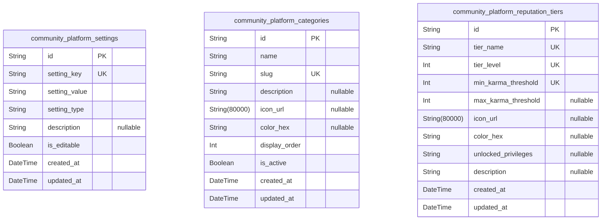
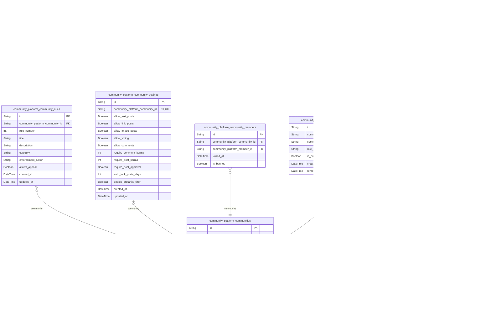
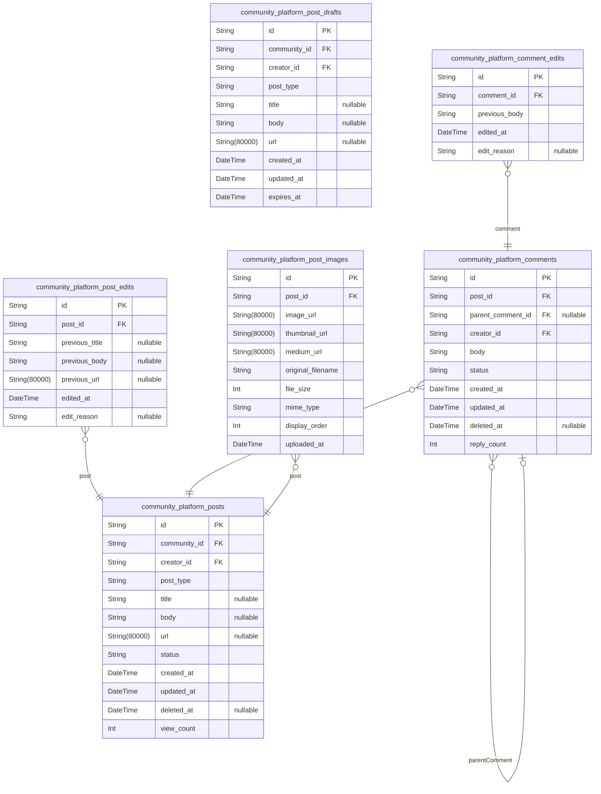
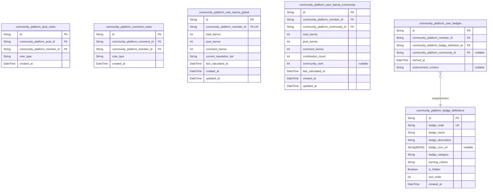
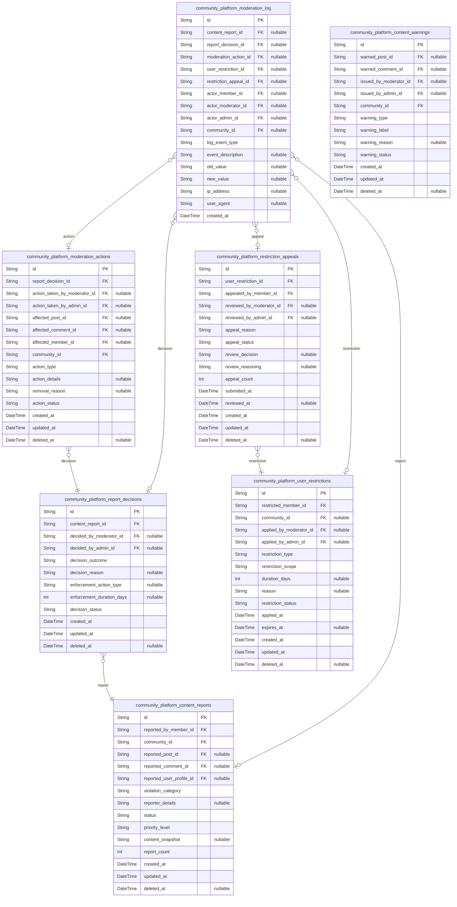
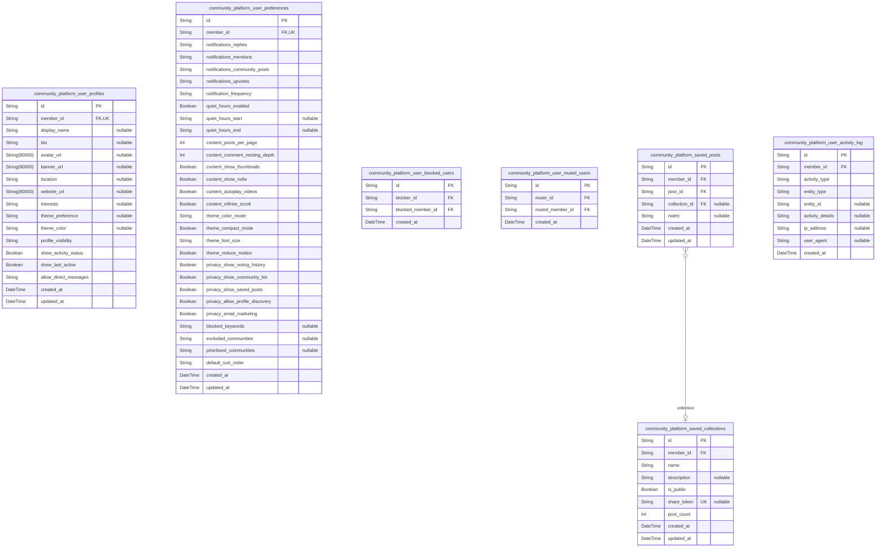
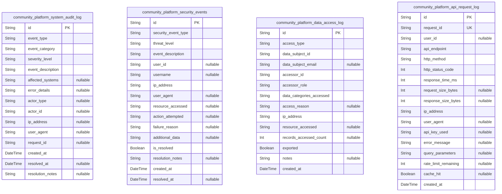
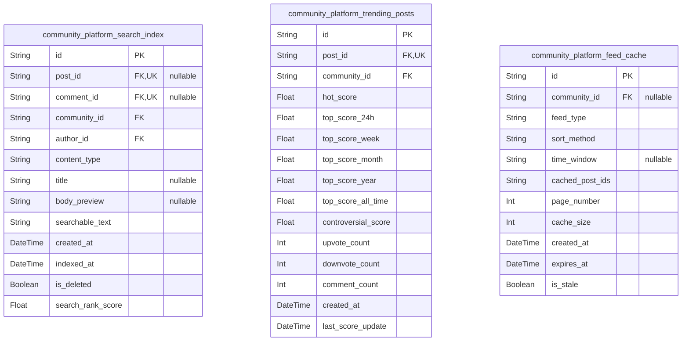

# Prisma Markdown

> Generated by [`prisma-markdown`](https://github.com/samchon/prisma-markdown)

- [Systematic](#systematic)
- [Identity](#identity)
- [Communities](#communities)
- [Content](#content)
- [Engagement](#engagement)
- [Moderation](#moderation)
- [Profiles](#profiles)
- [Audit](#audit)
- [default](#default)

## Systematic

```mermaid
erDiagram
"community_platform_settings" {
  String id PK
  String setting_key UK
  String setting_value
  String setting_type
  String description "nullable"
  Boolean is_editable
  DateTime created_at
  DateTime updated_at
}
"community_platform_categories" {
  String id PK
  String name
  String slug UK
  String description "nullable"
  String(80000) icon_url "nullable"
  String color_hex "nullable"
  Int display_order
  Boolean is_active
  DateTime created_at
  DateTime updated_at
}
"community_platform_reputation_tiers" {
  String id PK
  String tier_name UK
  Int tier_level UK
  Int min_karma_threshold UK
  Int max_karma_threshold "nullable"
  String(80000) icon_url "nullable"
  String color_hex "nullable"
  String unlocked_privileges "nullable"
  String description "nullable"
  DateTime created_at
  DateTime updated_at
}
```

### `community_platform_settings`

Platform-wide configuration settings that control the overall behavior
and features of the community platform. This foundational table stores
system parameters such as API rate limits, content moderation thresholds,
feature flags, and global settings that apply across all communities and
users. These settings are read frequently but changed rarely, making them
ideal for caching.

Properties as follows:

- `id`: Primary Key.
- `setting_key`
  > Unique identifier for the setting (e.g., 'max_post_length',
  > 'min_karma_for_community_creation'). Used as the lookup key for
  > configuration values.
- `setting_value`
  > The actual value of the setting stored as string (e.g., '40000', '100').
  > Values are serialized as strings to support multiple data types (numbers,
  > booleans, JSON) in a single table.
- `setting_type`
  > Data type of the setting value: 'string', 'number', 'boolean', or 'json'.
  > Used to deserialize values correctly when reading settings.
- `description`
  > Human-readable description of what this setting controls. Helps
  > administrators understand the purpose of each configuration parameter.
- `is_editable`
  > Whether this setting can be modified by administrators (true) or is
  > read-only/system-managed (false). Prevents accidental modification of
  > critical parameters.
- `created_at`: Timestamp when this setting was first created.
- `updated_at`: Timestamp when this setting was last modified.

### `community_platform_categories`

Predefined content categories used to organize and classify communities
on the platform. This lookup table defines the taxonomy of community
topics (e.g., Technology, Gaming, Entertainment, Education). Categories
are selected during community creation to improve discoverability and
help users find communities aligned with their interests. Categories are
essentially static but can be expanded over time as the platform grows.

Properties as follows:

- `id`: Primary Key.
- `name`
  > Official name of the category (e.g., 'Technology', 'Gaming',
  > 'Entertainment'). Displayed to users when browsing and filtering
  > communities.
- `slug`
  > URL-friendly identifier for the category (e.g., 'technology', 'gaming').
  > Used in URLs and as a consistent identifier for category references.
- `description`
  > Detailed description of the category explaining what types of communities
  > and content belong in this category. Helps users understand when to
  > select this category.
- `icon_url`
  > URL to the category icon image. Displayed in community listings,
  > discovery pages, and navigation to help users visually identify
  > categories.
- `color_hex`
  > Hex color code for the category (e.g., '#FF6B6B'). Used for visual
  > styling and color-coding category badges across the platform UI.
- `display_order`
  > Sort order for displaying categories in lists. Lower numbers appear first
  > in category listings, allowing admins to prioritize important categories.
- `is_active`
  > Whether this category is currently active and available for selection.
  > Inactive categories are hidden from community creation forms but preserve
  > existing community associations.
- `created_at`: Timestamp when this category was first created.
- `updated_at`: Timestamp when this category was last updated.

### `community_platform_reputation_tiers`

Defines the reputation tiers in the karma system that users can achieve
as they accumulate karma points. This static configuration table stores
tier definitions including tier name (Bronze, Silver, Gold, Platinum,
Diamond), karma thresholds, privileges unlocked at each tier, and visual
styling. Tiers are used to display user reputation and control access to
elevated features. These tiers are rarely changed but referenced
frequently by the karma system.

Properties as follows:

- `id`: Primary Key.
- `tier_name`
  > Name of the reputation tier (e.g., 'Bronze', 'Silver', 'Gold',
  > 'Platinum', 'Diamond'). Displayed on user profiles and in reputation
  > displays.
- `tier_level`
  > Numeric tier level (1-5, where 1=Bronze and 5=Diamond). Used for
  > comparisons and ordering of tiers.
- `min_karma_threshold`
  > Minimum karma points required to achieve this tier (e.g., 10 for Bronze,
  > 100 for Silver). Users automatically advance to this tier when their
  > karma exceeds this threshold.
- `max_karma_threshold`
  > Maximum karma points for this tier before advancing to next tier. Null
  > for the highest tier (Diamond) which has no upper bound.
- `icon_url`
  > URL to the tier icon or badge image. Displayed next to usernames and on
  > profiles to visually indicate tier status.
- `color_hex`
  > Hex color code for the tier (e.g., '#8B7355' for bronze, '#C0C0C0' for
  > silver). Used for visual styling of tier badges and displays.
- `unlocked_privileges`
  > JSON-formatted list of privileges/capabilities unlocked at this tier.
  > Example: '["create_communities", "become_moderator", "custom_flair"]'.
  > Determines what elevated features users can access.
- `description`
  > Description of the tier and what it represents (e.g., 'Established
  > contributor recognized by the community'). Helps users understand tier
  > significance.
- `created_at`: Timestamp when this tier definition was created.
- `updated_at`: Timestamp when this tier definition was last updated.

## Identity

```mermaid
erDiagram
"community_platform_members" {
  String id PK
  String email UK
  String password_hash
  String username UK
  Boolean email_verified
  String account_status
  DateTime created_at
  DateTime updated_at
  DateTime deleted_at "nullable"
}
"community_platform_member_sessions" {
  String id PK
  String community_platform_member_id FK
  String ip
  String href
  String referrer
  DateTime created_at
  DateTime expired_at "nullable"
}
"community_platform_community_moderators" {
  String id PK
  String email UK
  String password_hash
  String username UK
  Boolean email_verified
  String account_status
  DateTime created_at
  DateTime updated_at
  DateTime deleted_at "nullable"
}
"community_platform_moderator_sessions" {
  String id PK
  String community_platform_community_moderator_id FK
  String ip
  String href
  String referrer
  DateTime created_at
  DateTime expired_at "nullable"
}
"community_platform_platform_admins" {
  String id PK
  String email UK
  String password_hash
  String username UK
  Boolean email_verified
  String account_status
  DateTime created_at
  DateTime updated_at
  DateTime deleted_at "nullable"
}
"community_platform_admin_sessions" {
  String id PK
  String community_platform_platform_admin_id FK
  String ip
  String href
  String referrer
  DateTime created_at
  DateTime expired_at "nullable"
}
"community_platform_email_verifications" {
  String id PK
  String community_platform_member_id FK,UK
  String token_hash
  DateTime expires_at
  DateTime created_at
}
"community_platform_password_resets" {
  String id PK
  String community_platform_member_id FK,UK
  String token_hash
  DateTime expires_at
  DateTime created_at
}
"community_platform_user_sessions_history" {
  String id PK
  String community_platform_member_id FK "nullable"
  String event_type
  String ip_address
  String user_agent "nullable"
  String event_details "nullable"
  DateTime created_at
}
"community_platform_member_sessions" }o--|| "community_platform_members" : member
"community_platform_moderator_sessions" }o--|| "community_platform_community_moderators" : communityModerator
"community_platform_admin_sessions" }o--|| "community_platform_platform_admins" : platformAdmin
"community_platform_email_verifications" |o--|| "community_platform_members" : member
"community_platform_password_resets" |o--|| "community_platform_members" : member
"community_platform_user_sessions_history" }o--o| "community_platform_members" : member
```

### `community_platform_members`

Member accounts representing regular authenticated users who can create
posts, comments, and participate in communities. This is the primary user
actor type for the platform.

Properties as follows:

- `id`: Primary Key.
- `email`
  > Member's email address used for login and account recovery. Must be
  > unique and verified before full platform access.
- `password_hash`
  > Bcrypt hashed password for authentication. Never stores plain text
  > passwords.
- `username`
  > Unique username (3-20 alphanumeric characters) chosen at registration for
  > public identification.
- `email_verified`
  > Flag indicating whether member's email address has been verified.
  > Required before posting or commenting.
- `account_status`
  > Current account status: 'active', 'suspended', 'banned', or 'deleted'.
  > Controls access permissions.
- `created_at`
  > Account creation timestamp. Used for account age restrictions on
  > privileges.
- `updated_at`
  > Last account modification timestamp. Updated whenever account settings
  > change.
- `deleted_at`
  > Soft deletion timestamp. Null for active accounts, set when account is
  > deleted for recovery window.

### `community_platform_member_sessions`

JWT session records for authenticated member login sessions. Tracks
active sessions for security monitoring and concurrent session
management.

Properties as follows:

- `id`: Primary Key.
- `community_platform_member_id`: Reference to the member's [community_platform_members.id](#community_platform_members) account.
- `ip`
  > IP address from which the session was initiated. Used for security
  > auditing and fraud detection.
- `href`: Connection URL (HTTP referrer) from which the session was established.
- `referrer`: HTTP referrer header value indicating where the login request originated.
- `created_at`: Session creation timestamp indicating when user logged in.
- `expired_at`
  > Session termination timestamp. Null for active sessions, set when user
  > logs out or session expires.

### `community_platform_community_moderators`

Community moderator accounts with elevated permissions for content
moderation and community management. Separate actor type from regular
members for role-based access control.

Properties as follows:

- `id`: Primary Key.
- `email`
  > Moderator's email address for account recovery and official
  > communications.
- `password_hash`: Bcrypt hashed password for moderator authentication to admin interfaces.
- `username`
  > Unique username for moderator identification. May differ from member
  > account if moderator has one.
- `email_verified`: Flag indicating email verification status. Required for moderator login.
- `account_status`
  > Current account status: 'active', 'suspended', 'revoked'. Controls
  > moderator access.
- `created_at`: Account creation timestamp when moderator was appointed.
- `updated_at`: Last account modification timestamp for moderator details.
- `deleted_at`: Soft deletion timestamp when moderator role is revoked.

### `community_platform_moderator_sessions`

JWT session records for community moderator login sessions. Separate from
member sessions for security isolation and access control verification.

Properties as follows:

- `id`: Primary Key.
- `community_platform_community_moderator_id`
  > Reference to the moderator's {@link
  > community_platform_community_moderators.id} account.
- `ip`: IP address from which moderator login was initiated.
- `href`: Connection URL referrer for the moderator session.
- `referrer`: HTTP referrer header value for moderator login origin.
- `created_at`: Moderator session creation timestamp.
- `expired_at`: Moderator session termination timestamp. Null for active sessions.

### `community_platform_platform_admins`

Platform administrator accounts with system-wide access and control.
Highest privilege level actor type for platform governance and
enforcement.

Properties as follows:

- `id`: Primary Key.
- `email`: Admin's email address for official communications and account recovery.
- `password_hash`
  > Bcrypt hashed password for admin authentication. Requires strong password
  > policy.
- `username`: Unique username for admin identification in audit logs and system records.
- `email_verified`: Email verification status. Required before admin account can be activated.
- `account_status`
  > Current account status: 'active', 'suspended', 'inactive'. Controls
  > system access.
- `created_at`: Admin account creation timestamp when promoted to admin role.
- `updated_at`: Last account modification timestamp for admin details.
- `deleted_at`: Soft deletion timestamp when admin privileges are revoked.

### `community_platform_admin_sessions`

JWT session records for platform administrator login sessions. Maintains
enhanced security tracking for system-level access with separate audit
trail.

Properties as follows:

- `id`: Primary Key.
- `community_platform_platform_admin_id`
  > Reference to the admin's [community_platform_platform_admins.id](#community_platform_platform_admins)
  > account.
- `ip`
  > IP address from which admin login was initiated. Monitored for suspicious
  > access patterns.
- `href`: Connection URL referrer for admin session origin.
- `referrer`: HTTP referrer header value indicating admin login source.
- `created_at`: Admin session creation timestamp when login occurred.
- `expired_at`: Admin session termination timestamp. Null for active sessions.

### `community_platform_email_verifications`

Email verification tokens for new member registration and email changes.
Implements 1:1 relationship with member accounts for proper 3NF
normalization.

Properties as follows:

- `id`: Primary Key.
- `community_platform_member_id`
  > Reference to the member's [community_platform_members.id](#community_platform_members) account
  > requesting email verification.
- `token_hash`
  > Hashed verification token never stored in plain text. Token sent to email
  > must hash to this value.
- `expires_at`
  > Token expiration timestamp. Verification links only valid for 24 hours
  > after generation.
- `created_at`
  > Verification token creation timestamp when email verification was
  > requested.

### `community_platform_password_resets`

Password reset tokens for account recovery. Maintains 1:1 relationship
with member accounts ensuring only one active reset per member at any
time.

Properties as follows:

- `id`: Primary Key.
- `community_platform_member_id`
  > Reference to the member's [community_platform_members.id](#community_platform_members) account
  > requesting password reset.
- `token_hash`
  > Hashed password reset token stored securely. Sent token must hash to this
  > value for validation.
- `expires_at`
  > Token expiration timestamp. Reset links only valid for 1 hour after
  > generation for security.
- `created_at`: Reset token creation timestamp when password recovery was initiated.

### `community_platform_user_sessions_history`

Immutable audit trail of all authentication events including session
creation, termination, and security-related activities. Non-functional
table used for compliance and forensic investigation.

Properties as follows:

- `id`: Primary Key.
- `community_platform_member_id`
  > Reference to member's [community_platform_members.id](#community_platform_members) account if
  > session was by member. Null for non-member events.
- `event_type`
  > Type of authentication event: 'login', 'logout', 'session_created',
  > 'session_expired', 'failed_attempt', 'password_reset', 'email_verified',
  > 'account_locked', 'suspicious_activity'
- `ip_address`
  > IP address from which the authentication event originated. Tracked for
  > fraud detection and geographic analysis.
- `user_agent`
  > HTTP user agent string identifying browser, OS, and device. Helps
  > identify suspicious login patterns.
- `event_details`
  > Additional details about the event (e.g., failure reason, device info).
  > Stored as JSON for flexibility.
- `created_at`: Authentication event timestamp indicating when the event occurred.

## Communities

```mermaid
erDiagram
"community_platform_communities" {
  String id PK
  String community_platform_category_id FK
  String community_platform_member_id FK
  String name UK
  String description "nullable"
  String visibility
  String(80000) icon_url "nullable"
  String(80000) banner_url "nullable"
  Int member_count
  Int post_count
  Boolean is_nsfw
  DateTime created_at
  DateTime updated_at
  DateTime deleted_at "nullable"
}
"community_platform_community_rules" {
  String id PK
  String community_platform_community_id FK
  Int rule_number
  String title
  String description
  String category
  String enforcement_action
  Boolean allows_appeal
  DateTime created_at
  DateTime updated_at
}
"community_platform_community_settings" {
  String id PK
  String community_platform_community_id FK,UK
  Boolean allow_text_posts
  Boolean allow_link_posts
  Boolean allow_image_posts
  Boolean allow_voting
  Boolean allow_comments
  Int require_comment_karma
  Int require_post_karma
  Boolean require_post_approval
  Int auto_lock_posts_days
  Boolean enable_profanity_filter
  DateTime created_at
  DateTime updated_at
}
"community_platform_community_members" {
  String id PK
  String community_platform_community_id FK
  String community_platform_member_id FK
  DateTime joined_at
  Boolean is_banned
}
"community_platform_community_moderator_roles" {
  String id PK
  String community_platform_community_id FK
  String community_platform_member_id FK
  String role_level
  Boolean is_primary
  DateTime created_at
  DateTime removed_at "nullable"
}
"community_platform_community_bans" {
  String id PK
  String community_platform_community_id FK
  String community_platform_member_id FK
  String community_platform_moderator_id FK
  String ban_type
  Int duration_days "nullable"
  String reason
  DateTime created_at
  DateTime expires_at "nullable"
  DateTime lifted_at "nullable"
}
"community_platform_community_ban_appeals" {
  String id PK
  String community_platform_community_ban_id FK
  String community_platform_member_id FK
  String appeal_status
  String appeal_reason
  DateTime submitted_at
  DateTime decided_at "nullable"
  String decision_reason "nullable"
  Int appeal_number
}
"community_platform_community_rules" }o--|| "community_platform_communities" : community
"community_platform_community_settings" |o--|| "community_platform_communities" : community
"community_platform_community_members" }o--|| "community_platform_communities" : community
"community_platform_community_moderator_roles" }o--|| "community_platform_communities" : community
"community_platform_community_bans" }o--|| "community_platform_communities" : community
"community_platform_community_ban_appeals" }o--|| "community_platform_community_bans" : ban
```

### `community_platform_communities`

Core community entity representing a community space where members can
create posts, comments, and engage in discussions. Each community has a
creator (primary moderator), customizable settings, rules, and member
subscriptions. Communities can be public, private, or restricted based on
visibility settings.

Properties as follows:

- `id`: Primary Key.
- `community_platform_category_id`
  > Reference to the community's category assignment. {@link
  > community_platform_categories.id}
- `community_platform_member_id`
  > Reference to the community creator (primary moderator). {@link
  > community_platform_members.id}
- `name`
  > Community display name (3-21 characters, converted to lowercase, unique
  > across platform). Examples: 'technology', 'photography', 'gaming'
- `description`
  > Optional community description (max 500 characters) explaining the
  > community's purpose and topic.
- `visibility`
  > Community visibility level: 'public' (discoverable and viewable by all),
  > 'private' (hidden from discovery, invite-only), or 'restricted'
  > (discoverable but membership approval required). Default: 'public'
- `icon_url`
  > URL to community icon/logo image (uploaded during creation or updated by
  > moderators). CDN-served image URL.
- `banner_url`
  > URL to community banner/header image (displayed at top of community
  > page). CDN-served high-res image URL.
- `member_count`
  > Denormalized count of community members (updated when members
  > subscribe/unsubscribe). Cached for performance.
- `post_count`
  > Denormalized count of posts created in this community (incremented on
  > post creation, decremented on deletion).
- `is_nsfw`
  > Flag indicating whether community contains Not-Safe-For-Work content
  > (age-restricted). Default: false
- `created_at`: Timestamp when community was created (server-generated, immutable).
- `updated_at`
  > Timestamp when community was last modified (settings, rules, description
  > changes).
- `deleted_at`
  > Soft delete timestamp. Communities with deleted_at set are marked for
  > deletion but data retained for 30-day recovery window.

### `community_platform_community_rules`

Community-specific rules and policies that moderate content and behavior
within a community. Rules are set and enforced by community moderators
(up to 10 rules per community). Each rule includes violation category,
enforcement action, and appeal allowability. Rules are displayed to
members and cited during moderation actions.

Properties as follows:

- `id`: Primary Key.
- `community_platform_community_id`
  > Reference to the community this rule belongs to. {@link
  > community_platform_communities.id}
- `rule_number`
  > Ordinal position of this rule in the community's rule list (1-10). Used
  > for display ordering.
- `title`
  > Rule title/name (max 100 characters, concise summary). Example: 'No Spam
  > or Self-Promotion'
- `description`
  > Detailed rule explanation (max 1000 characters) with examples of
  > violations and context. Shown to members when they join community.
- `category`
  > Rule violation category: 'content', 'behavior', 'spam', 'off_topic',
  > 'harassment', 'adult_content', or 'other'. Used for filtering and
  > analytics.
- `enforcement_action`
  > Default enforcement action for violations: 'warning' (informational
  > only), 'remove' (content removal), 'temporary_ban' (1-30 days), or
  > 'permanent_ban'. Moderator can override.
- `allows_appeal`
  > Whether users can appeal moderation actions for this rule violation
  > (default: true). Set to false for indisputable rules.
- `created_at`: Timestamp when rule was created by moderator.
- `updated_at`
  > Timestamp when rule was last updated (title, description, or enforcement
  > action changed).

### `community_platform_community_settings`

Customizable settings for individual communities controlling post types,
voting, comments, moderation requirements, and content filtering. Each
community has one settings record (1:1 relationship). Settings determine
how the community operates and what features are enabled/restricted.

Properties as follows:

- `id`: Primary Key.
- `community_platform_community_id`
  > Reference to the community these settings apply to (1:1 relationship).
  > [community_platform_communities.id](#community_platform_communities)
- `allow_text_posts`: Whether text-only posts are allowed in this community (default: true).
- `allow_link_posts`: Whether link posts are allowed in this community (default: true).
- `allow_image_posts`: Whether image posts are allowed in this community (default: true).
- `allow_voting`
  > Whether upvoting and downvoting are enabled (default: true). When false,
  > posts/comments display no vote counts.
- `allow_comments`
  > Whether comments are allowed (default: true). When false, posts exist but
  > commenting is disabled.
- `require_comment_karma`
  > Minimum community karma required to comment (default: 0 for
  > unrestricted). Users below threshold cannot comment.
- `require_post_karma`
  > Minimum community karma required to create posts (default: 0 for
  > unrestricted). Users below threshold cannot post.
- `require_post_approval`
  > Whether posts require moderator approval before appearing publicly
  > (default: false). First-time posters may be restricted.
- `auto_lock_posts_days`
  > Number of days after post creation before automatically locking
  > (preventing new comments). 0 = disabled (default). Example: 180 days for
  > old content.
- `enable_profanity_filter`
  > Whether to filter offensive language automatically (default: false). When
  > enabled, flagged content shown with warning.
- `created_at`
  > Timestamp when settings were created (synchronized with community
  > creation).
- `updated_at`: Timestamp when settings were last modified by community moderators.

### `community_platform_community_members`

Membership relationship between members and communities they subscribe
to. Tracks subscription status, join date, and membership-specific
metadata. Many-to-many relationship enabling members to join multiple
communities and communities to have multiple members.

Properties as follows:

- `id`: Primary Key.
- `community_platform_community_id`
  > Reference to the community being subscribed to. {@link
  > community_platform_communities.id}
- `community_platform_member_id`
  > Reference to the member subscribing to the community. {@link
  > community_platform_members.id}
- `joined_at`: Timestamp when member subscribed to this community (server-generated).
- `is_banned`
  > Whether member is currently banned from this community (soft deletion by
  > ban record instead of flag).

### `community_platform_community_moderator_roles`

Moderator role assignment tracking which members are moderators in which
communities and what permission level each moderator has. Tracks role
creation date and removal date (soft delete). Primary moderator
(community creator) is immutable and cannot be removed.

Properties as follows:

- `id`: Primary Key.
- `community_platform_community_id`
  > Reference to the community this moderator serves. {@link
  > community_platform_communities.id}
- `community_platform_member_id`
  > Reference to the member assigned as moderator. {@link
  > community_platform_members.id}
- `role_level`
  > Moderator permission level: 'primary' (immutable community creator),
  > 'content' (remove posts/comments), 'user' (+ ban users), or 'full' (+
  > manage settings/rules). Role determines what actions moderator can
  > perform.
- `is_primary`
  > Whether this is the primary moderator (community creator). Primary
  > moderator cannot be removed by other moderators. Default: false except
  > for creator.
- `created_at`: Timestamp when moderator role was assigned (server-generated).
- `removed_at`
  > Timestamp when moderator role was revoked (soft delete of moderator
  > status). Null if moderator is still active.

### `community_platform_community_bans`

Ban records for members restricted from communities (temporary or
permanent). Tracks ban start date, duration/expiration, reason, and which
moderator issued ban. Temporary bans auto-expire; permanent bans require
explicit reversal or appeal approval.

Properties as follows:

- `id`: Primary Key.
- `community_platform_community_id`
  > Reference to the community the member is banned from. {@link
  > community_platform_communities.id}
- `community_platform_member_id`: Reference to the banned member. [community_platform_members.id](#community_platform_members)
- `community_platform_moderator_id`
  > Reference to the moderator who issued the ban. {@link
  > community_platform_members.id}
- `ban_type`
  > Ban duration type: 'temporary' (expires after duration_days) or
  > 'permanent' (indefinite until reversal/appeal). Determines ban behavior.
- `duration_days`
  > For temporary bans: number of days until ban auto-expires (1-90 days
  > typical range). For permanent bans: null (ignored).
- `reason`
  > Moderator-provided reason for ban (required, max 500 characters). Shown
  > to banned member and in moderation logs.
- `created_at`: Timestamp when ban was issued (server-generated).
- `expires_at`
  > For temporary bans: calculated expiration timestamp (created_at +
  > duration_days). For permanent bans: null. System auto-lifts ban when this
  > time passes.
- `lifted_at`
  > If ban was lifted before expiration (by moderator or appeal): timestamp
  > of lifting. Null if ban still active or auto-expired.

### `community_platform_community_ban_appeals`

Appeal records for users appealing their community bans. Appeals are
routed to community primary moderators first; if rejected, can be
escalated to platform admins. Tracks appeal submission, decision,
reasoning, and status. Enforces appeal limits (maximum 2 additional
appeals per ban).

Properties as follows:

- `id`: Primary Key.
- `community_platform_community_ban_id`
  > Reference to the ban being appealed. {@link
  > community_platform_community_bans.id}
- `community_platform_member_id`
  > Reference to the member submitting the appeal. {@link
  > community_platform_members.id}
- `appeal_status`
  > Current appeal status: 'submitted' (awaiting review), 'approved' (appeal
  > succeeded, ban lifted), 'rejected' (appeal denied, ban upheld), or
  > 'escalated' (routed to platform admin). Determines appeal workflow stage.
- `appeal_reason`
  > Member's explanation for why ban should be overturned (required, max 1000
  > characters). Shown to reviewers.
- `submitted_at`: Timestamp when appeal was submitted by member.
- `decided_at`
  > Timestamp when appeal decision was made by reviewer. Null if appeal still
  > pending.
- `decision_reason`
  > Reviewer's reasoning for approval/rejection decision (max 1000
  > characters). Shown to appellant.
- `appeal_number`
  > Which appeal this is for the ban (1st, 2nd, 3rd attempt). Limited to 2
  > additional appeals after initial rejection. Incremented with each new
  > appeal.

## Content

```mermaid
erDiagram
"community_platform_posts" {
  String id PK
  String community_id FK
  String creator_id FK
  String post_type
  String title "nullable"
  String body "nullable"
  String(80000) url "nullable"
  String status
  DateTime created_at
  DateTime updated_at
  DateTime deleted_at "nullable"
  Int view_count
}
"community_platform_post_drafts" {
  String id PK
  String community_id FK
  String creator_id FK
  String post_type
  String title "nullable"
  String body "nullable"
  String(80000) url "nullable"
  DateTime created_at
  DateTime updated_at
  DateTime expires_at
}
"community_platform_post_edits" {
  String id PK
  String post_id FK
  String previous_title "nullable"
  String previous_body "nullable"
  String(80000) previous_url "nullable"
  DateTime edited_at
  String edit_reason "nullable"
}
"community_platform_comments" {
  String id PK
  String post_id FK
  String parent_comment_id FK "nullable"
  String creator_id FK
  String body
  String status
  DateTime created_at
  DateTime updated_at
  DateTime deleted_at "nullable"
  Int reply_count
}
"community_platform_comment_edits" {
  String id PK
  String comment_id FK
  String previous_body
  DateTime edited_at
  String edit_reason "nullable"
}
"community_platform_post_images" {
  String id PK
  String post_id FK
  String(80000) image_url
  String(80000) thumbnail_url
  String(80000) medium_url
  String original_filename
  Int file_size
  String mime_type
  Int display_order
  DateTime uploaded_at
}
"community_platform_post_edits" }o--|| "community_platform_posts" : post
"community_platform_comments" }o--|| "community_platform_posts" : post
"community_platform_comments" }o--o| "community_platform_comments" : parentComment
"community_platform_comment_edits" }o--|| "community_platform_comments" : comment
"community_platform_post_images" }o--|| "community_platform_posts" : post
```

### `community_platform_posts`

Primary content unit representing user-generated posts in communities.
Posts are the foundational content type supporting text, link, and image
formats. Each post belongs to exactly one community and is authored by a
community member. Posts support editing within 24 hours and soft deletion
with 30-day recovery window. Posts drive engagement through voting,
commenting, and community participation.

Properties as follows:

- `id`: Primary Key.
- `community_id`
  > Community where post is published. References {@link
  > community_platform_communities.id}
- `creator_id`
  > Member who authored the post. References {@link
  > community_platform_members.id}
- `post_type`
  > Type of post content: 'text' for text posts, 'link' for link posts,
  > 'image' for image posts
- `title`
  > Post title (3-300 characters). Required for text and link posts; optional
  > for image posts
- `body`
  > Post content body (1-40000 characters). Required for text posts; optional
  > for link and image posts
- `url`
  > URL destination for link posts (max 2048 characters). Required for link
  > posts only
- `status`
  > Post publication status: 'draft' for unpublished, 'published' for visible
  > posts, 'deleted' for soft-deleted posts, 'purged' for permanently deleted
- `created_at`: ISO 8601 timestamp when post was created (server-generated, immutable)
- `updated_at`
  > ISO 8601 timestamp when post was last updated (edit timestamp, different
  > from creation)
- `deleted_at`
  > ISO 8601 timestamp when post was soft-deleted (null if not deleted).
  > Enables 30-day grace period for recovery
- `view_count`
  > Number of times post has been viewed (incremented on view, used for
  > analytics)

### `community_platform_post_drafts`

Unpublished post drafts with separate lifecycle from published posts.
Allows members to compose posts gradually, with auto-save functionality
every 30 seconds. Drafts expire after 90 days of inactivity. Each draft
belongs to exactly one community and is authored by one member. Enables
members to save incomplete thoughts for later publication.

Properties as follows:

- `id`: Primary Key.
- `community_id`
  > Community where draft will be published. References {@link
  > community_platform_communities.id}
- `creator_id`
  > Member who is authoring the draft. References {@link
  > community_platform_members.id}
- `post_type`: Intended post type: 'text', 'link', or 'image'
- `title`: Draft post title (3-300 characters, can be empty during composition)
- `body`
  > Draft post content body (1-40000 characters, can be partial during
  > composition)
- `url`: URL for link post draft (max 2048 characters, optional during composition)
- `created_at`: ISO 8601 timestamp when draft was first created
- `updated_at`: ISO 8601 timestamp when draft was last modified (auto-save timestamp)
- `expires_at`
  > ISO 8601 timestamp when draft will be automatically deleted if not
  > published (90 days after updated_at)

### `community_platform_post_edits`

Complete audit trail of all post edits, capturing before/after content
for accountability. Each time a member edits their post within the
24-hour edit window, a record is created preserving the previous state.
Enables members to view edit history and supports moderation review of
content changes. Maintains referential integrity to the edited post.

Properties as follows:

- `id`: Primary Key.
- `post_id`: Post that was edited. References [community_platform_posts.id](#community_platform_posts)
- `previous_title`: Post title before this edit (preserved for audit trail)
- `previous_body`: Post body content before this edit (preserved for audit trail)
- `previous_url`: Post URL before this edit (for link posts)
- `edited_at`: ISO 8601 timestamp when this edit was made (server-generated)
- `edit_reason`: Optional reason provided by member for the edit (up to 500 characters)

### `community_platform_comments`

Comment system enabling nested threaded discussions with unlimited reply
depth. Comments are created in response to posts or other comments,
enabling recursive discussion threads. Each comment belongs to one
community (inherited from parent post) and is authored by one member.
Comments support editing within 24 hours and soft deletion with 30-day
recovery window. Comments drive engagement and community participation.

Properties as follows:

- `id`: Primary Key.
- `post_id`
  > Post that this comment belongs to. References {@link
  > community_platform_posts.id}
- `parent_comment_id`
  > Parent comment if this is a reply to another comment. Null for top-level
  > comments on post. Enables unlimited nesting depth for reply threads.
  > References [community_platform_comments.id](#community_platform_comments)
- `creator_id`
  > Member who authored the comment. References {@link
  > community_platform_members.id}
- `body`: Comment content text (1-5000 characters). Required for all comments
- `status`
  > Comment publication status: 'published' for visible comments, 'deleted'
  > for soft-deleted by author, 'removed' for moderator removal
- `created_at`: ISO 8601 timestamp when comment was created (server-generated, immutable)
- `updated_at`: ISO 8601 timestamp when comment was last updated (edit timestamp)
- `deleted_at`
  > ISO 8601 timestamp when comment was soft-deleted (null if not deleted).
  > Enables 30-day grace period for recovery
- `reply_count`
  > Count of direct child replies to this comment (incremented/decremented as
  > replies added/removed)

### `community_platform_comment_edits`

Complete audit trail of all comment edits, capturing before/after content
for accountability. Each time a member edits their comment within the
24-hour edit window, a record is created preserving the previous state.
Enables members to view edit history and supports moderation review of
content changes. Maintains referential integrity to the edited comment.

Properties as follows:

- `id`: Primary Key.
- `comment_id`: Comment that was edited. References [community_platform_comments.id](#community_platform_comments)
- `previous_body`: Comment body content before this edit (preserved for audit trail)
- `edited_at`: ISO 8601 timestamp when this edit was made (server-generated)
- `edit_reason`: Optional reason provided by member for the edit (up to 500 characters)

### `community_platform_post_images`

Images associated with image-type posts, tracked separately due to
distinct lifecycle from posts. Supports multiple images per post (1-10
images per post, up to 100MB total). Images are processed into multiple
size versions (thumbnail, medium, large) for performance optimization.
Enables reordering of images before post publication. Images remain
accessible even if post is deleted, within 30-day grace period.

Properties as follows:

- `id`: Primary Key.
- `post_id`
  > Post that this image belongs to. References {@link
  > community_platform_posts.id}
- `image_url`
  > CDN URL to full-size image (1600x1600px), persisted permanently as long
  > as post exists
- `thumbnail_url`: CDN URL to thumbnail image (200x200px) for feed display
- `medium_url`: CDN URL to medium image (600x600px) for preview display in comments/feeds
- `original_filename`
  > Original filename provided by member at upload (used for reference, max
  > 255 characters)
- `file_size`
  > Original image file size in bytes (used to verify total post size doesn't
  > exceed 100MB)
- `mime_type`
  > MIME type of uploaded image (e.g., 'image/jpeg', 'image/png',
  > 'image/gif', 'image/webp')
- `display_order`
  > Order in which image appears in post gallery (1-10, can be reordered
  > before post publication)
- `uploaded_at`: ISO 8601 timestamp when image was uploaded (server-generated)

## Engagement

```mermaid
erDiagram
"community_platform_post_votes" {
  String id PK
  String community_platform_post_id FK
  String community_platform_member_id FK
  String vote_type
  DateTime created_at
}
"community_platform_comment_votes" {
  String id PK
  String community_platform_comment_id FK
  String community_platform_member_id FK
  String vote_type
  DateTime created_at
}
"community_platform_user_karma_global" {
  String id PK
  String community_platform_member_id FK,UK
  Int total_karma
  Int post_karma
  Int comment_karma
  String current_reputation_tier
  DateTime last_calculated_at
  DateTime created_at
  DateTime updated_at
}
"community_platform_user_karma_community" {
  String id PK
  String community_platform_member_id FK
  String community_platform_community_id FK
  Int total_karma
  Int post_karma
  Int comment_karma
  Int contribution_count
  Int community_rank "nullable"
  DateTime last_calculated_at
  DateTime created_at
  DateTime updated_at
}
"community_platform_badge_definitions" {
  String id PK
  String badge_code UK
  String badge_name
  String badge_description
  String(80000) badge_icon_url "nullable"
  String badge_category
  String earning_criteria
  Boolean is_hidden
  Int sort_order
  DateTime created_at
}
"community_platform_user_badges" {
  String id PK
  String community_platform_member_id FK
  String community_platform_badge_definition_id FK
  String community_platform_community_id FK "nullable"
  DateTime earned_at
  String achievement_context "nullable"
}
"community_platform_user_badges" }o--|| "community_platform_badge_definitions" : badgeDefinition
```

### `community_platform_post_votes`

Records individual upvotes and downvotes cast by members on posts. Each
vote is a separate record enabling vote reversal, change tracking, and
accurate karma calculation. Tracks voting behavior for reputation system
and sorting algorithms.

Properties as follows:

- `id`: Primary Key.
- `community_platform_post_id`: Reference to the post being voted on. [community_platform_posts.id](#community_platform_posts)
- `community_platform_member_id`
  > Reference to the member casting the vote. {@link
  > community_platform_members.id}
- `vote_type`
  > Type of vote: 'upvote' or 'downvote'. Determines karma impact on post
  > author.
- `created_at`: Timestamp when vote was cast. Used for vote history and sorting.

### `community_platform_comment_votes`

Records individual upvotes and downvotes cast by members on comments.
Parallel structure to post votes enabling independent voting on comments
with separate karma tracking and sorting mechanics.

Properties as follows:

- `id`: Primary Key.
- `community_platform_comment_id`
  > Reference to the comment being voted on. {@link
  > community_platform_comments.id}
- `community_platform_member_id`
  > Reference to the member casting the vote. {@link
  > community_platform_members.id}
- `vote_type`
  > Type of vote: 'upvote' or 'downvote'. Determines karma impact on comment
  > author.
- `created_at`
  > Timestamp when vote was cast. Used for vote history and trending
  > algorithms.

### `community_platform_user_karma_global`

Tracks global karma points earned by each member across all communities.
Aggregated from post and comment votes platform-wide. Determines
reputation tier, privileges, and community discovery ranking.

Properties as follows:

- `id`: Primary Key.
- `community_platform_member_id`
  > Reference to the member whose global karma is tracked. {@link
  > community_platform_members.id}
- `total_karma`
  > Total cumulative karma points earned from upvotes and downvotes across
  > all communities. Can be negative.
- `post_karma`: Karma earned specifically from post votes (upvotes - downvotes on posts).
- `comment_karma`
  > Karma earned specifically from comment votes (upvotes - downvotes on
  > comments).
- `current_reputation_tier`
  > Current reputation tier based on karma: Bronze (10-99), Silver (100-499),
  > Gold (500-1999), Platinum (2000-9999), Diamond (10000+).
- `last_calculated_at`
  > Timestamp when karma was last recalculated. Used to identify stale karma
  > records.
- `created_at`
  > Timestamp when karma record was created for this member (typically at
  > registration).
- `updated_at`
  > Timestamp when karma was last updated due to voting activity or
  > moderation actions.

### `community_platform_user_karma_community`

Tracks community-specific karma points earned by each member within
individual communities. Separate from global karma, enabling expertise
recognition within specific communities. Used for moderator eligibility
and community-specific privileges.

Properties as follows:

- `id`: Primary Key.
- `community_platform_member_id`
  > Reference to the member whose community karma is tracked. {@link
  > community_platform_members.id}
- `community_platform_community_id`
  > Reference to the community where karma is earned. {@link
  > community_platform_communities.id}
- `total_karma`
  > Total cumulative karma points earned in this specific community from
  > posts and comments.
- `post_karma`: Karma earned from posts created in this community.
- `comment_karma`: Karma earned from comments created in this community.
- `contribution_count`
  > Total number of posts and comments created in this community by this
  > member.
- `community_rank`
  > Member's ranking within this community by karma (1st, 2nd, 3rd, etc).
  > Recalculated periodically.
- `last_calculated_at`: Timestamp when community karma was last recalculated.
- `created_at`: Timestamp when member first earned karma in this community.
- `updated_at`: Timestamp when community karma was last updated due to voting.

### `community_platform_badge_definitions`

Defines available badge types and their earning criteria. Badge
definitions are static and reusable; actual badge awards to members are
tracked in a separate table. Examples: 'Verified Expert in [Community]',
'Helpful Contributor', 'Content Creator', etc.

Properties as follows:

- `id`: Primary Key.
- `badge_code`
  > Unique identifier code for badge type (e.g., 'verified_expert',
  > 'helpful_contributor'). Used for system references.
- `badge_name`
  > Display name for badge shown to users (e.g., 'Verified Expert', 'Helpful
  > Contributor').
- `badge_description`: Description explaining what the badge represents and how it's earned.
- `badge_icon_url`: URL to badge icon image for display on profiles and content.
- `badge_category`
  > Category organizing badges: 'achievement', 'longevity', 'contribution',
  > 'moderation', 'special'.
- `earning_criteria`
  > Description of criteria required to earn this badge (e.g., '5000+ karma
  > in specific community').
- `is_hidden`
  > Whether this badge type is hidden until earned (affects UI display of
  > badge progress).
- `sort_order`: Display order for badges (lower numbers displayed first on user profiles).
- `created_at`: Timestamp when badge definition was created in the system.

### `community_platform_user_badges`

Tracks badges earned by members. Records which members have earned which
badge definitions, when they earned them, and achievement context.
Enables leaderboards and achievement displays on user profiles.

Properties as follows:

- `id`: Primary Key.
- `community_platform_member_id`
  > Reference to the member who earned the badge. {@link
  > community_platform_members.id}
- `community_platform_badge_definition_id`
  > Reference to the badge definition being awarded. {@link
  > community_platform_badge_definitions.id}
- `community_platform_community_id`
  > Reference to community context if badge is community-specific (e.g.,
  > 'Verified Expert in [Community]'). Null for global badges. {@link
  > community_platform_communities.id}
- `earned_at`
  > Timestamp when badge was earned by member. Used for 'achievement
  > timeline' and sorting.
- `achievement_context`
  > Context or metadata about badge earning (e.g., 'Reached 5000+ karma in
  > photography community'). Displayed in achievement details.

## Moderation

```mermaid
erDiagram
"community_platform_content_reports" {
  String id PK
  String reported_by_member_id FK
  String community_id FK
  String reported_post_id FK "nullable"
  String reported_comment_id FK "nullable"
  String reported_user_profile_id FK "nullable"
  String violation_category
  String reporter_details "nullable"
  String status
  String priority_level
  String content_snapshot "nullable"
  Int report_count
  DateTime created_at
  DateTime updated_at
  DateTime deleted_at "nullable"
}
"community_platform_report_decisions" {
  String id PK
  String content_report_id FK
  String decided_by_moderator_id FK "nullable"
  String decided_by_admin_id FK "nullable"
  String decision_outcome
  String decision_reason "nullable"
  String enforcement_action_type "nullable"
  Int enforcement_duration_days "nullable"
  String decision_status
  DateTime created_at
  DateTime updated_at
  DateTime deleted_at "nullable"
}
"community_platform_moderation_actions" {
  String id PK
  String report_decision_id FK
  String action_taken_by_moderator_id FK "nullable"
  String action_taken_by_admin_id FK "nullable"
  String affected_post_id FK "nullable"
  String affected_comment_id FK "nullable"
  String affected_member_id FK "nullable"
  String community_id FK
  String action_type
  String action_details "nullable"
  String removal_reason "nullable"
  String action_status
  DateTime created_at
  DateTime updated_at
  DateTime deleted_at "nullable"
}
"community_platform_user_restrictions" {
  String id PK
  String restricted_member_id FK
  String community_id FK "nullable"
  String applied_by_moderator_id FK "nullable"
  String applied_by_admin_id FK "nullable"
  String restriction_type
  String restriction_scope
  Int duration_days "nullable"
  String reason "nullable"
  String restriction_status
  DateTime applied_at
  DateTime expires_at "nullable"
  DateTime created_at
  DateTime updated_at
  DateTime deleted_at "nullable"
}
"community_platform_restriction_appeals" {
  String id PK
  String user_restriction_id FK
  String appealed_by_member_id FK
  String reviewed_by_moderator_id FK "nullable"
  String reviewed_by_admin_id FK "nullable"
  String appeal_reason
  String appeal_status
  String review_decision "nullable"
  String review_reasoning "nullable"
  Int appeal_count
  DateTime submitted_at
  DateTime reviewed_at "nullable"
  DateTime created_at
  DateTime updated_at
  DateTime deleted_at "nullable"
}
"community_platform_moderation_log" {
  String id PK
  String content_report_id FK "nullable"
  String report_decision_id FK "nullable"
  String moderation_action_id FK "nullable"
  String user_restriction_id FK "nullable"
  String restriction_appeal_id FK "nullable"
  String actor_member_id FK "nullable"
  String actor_moderator_id FK "nullable"
  String actor_admin_id FK "nullable"
  String community_id FK "nullable"
  String log_event_type
  String event_description "nullable"
  String old_value "nullable"
  String new_value "nullable"
  String ip_address "nullable"
  String user_agent "nullable"
  DateTime created_at
}
"community_platform_content_warnings" {
  String id PK
  String warned_post_id FK "nullable"
  String warned_comment_id FK "nullable"
  String issued_by_moderator_id FK "nullable"
  String issued_by_admin_id FK "nullable"
  String community_id FK
  String warning_type
  String warning_label
  String warning_reason "nullable"
  String warning_status
  DateTime created_at
  DateTime updated_at
  DateTime deleted_at "nullable"
}
"community_platform_report_decisions" }o--|| "community_platform_content_reports" : report
"community_platform_moderation_actions" }o--|| "community_platform_report_decisions" : decision
"community_platform_restriction_appeals" }o--|| "community_platform_user_restrictions" : restriction
"community_platform_moderation_log" }o--o| "community_platform_content_reports" : report
"community_platform_moderation_log" }o--o| "community_platform_report_decisions" : decision
"community_platform_moderation_log" }o--o| "community_platform_moderation_actions" : action
"community_platform_moderation_log" }o--o| "community_platform_user_restrictions" : restriction
"community_platform_moderation_log" }o--o| "community_platform_restriction_appeals" : appeal
```

### `community_platform_content_reports`

Tracks content reported by members for policy violations. Reports
document what was reported, who reported it, violation category, and
reporter explanation. Reports are the entry point for the moderation
workflow and route to appropriate review queues. {@link
community_platform_members.id} submits reports about {@link
community_platform_posts.id} and [community_platform_comments.id](#community_platform_comments)
in [community_platform_communities.id](#community_platform_communities).

Properties as follows:

- `id`: Primary Key.
- `reported_by_member_id`: Member who submitted the report. [community_platform_members.id](#community_platform_members)
- `community_id`
  > Community where reported content exists. {@link
  > community_platform_communities.id}
- `reported_post_id`
  > Post being reported (if report is for a post). {@link
  > community_platform_posts.id}
- `reported_comment_id`
  > Comment being reported (if report is for a comment). {@link
  > community_platform_comments.id}
- `reported_user_profile_id`
  > User profile being reported (if report is for user behavior). {@link
  > community_platform_user_profiles.id}
- `violation_category`
  > Type of violation being reported: spam, harassment, hate_speech,
  > misinformation, adult_content, violence, copyright_violation, off_topic,
  > inappropriate_language, impersonation, self_harm_promotion, or other.
- `reporter_details`
  > Additional explanation from reporter about why content violates policy
  > (max 2000 characters).
- `status`
  > Report workflow status: submitted, assigned, approved_by_moderator,
  > rejected, escalated_to_admin, approved_by_admin, or resolved.
- `priority_level`
  > Priority assigned to report based on violation severity: critical, high,
  > medium, or low. Critical violations (self-harm, hate speech, violence)
  > reviewed within 2 hours.
- `content_snapshot`
  > Immutable snapshot of reported content at time of report submission for
  > historical accuracy and appeal review. Stores full text/data of post,
  > comment, or profile information.
- `report_count`
  > Total number of reports for this same content. Used to track if content
  > has been reported multiple times (5+ reports trigger escalation).
- `created_at`: Report submission timestamp in ISO 8601 format (server-generated).
- `updated_at`: Most recent update timestamp when report status or details changed.
- `deleted_at`
  > Soft deletion timestamp for reports withdrawn or archived (null if report
  > is active).

### `community_platform_report_decisions`

Tracks moderator and admin decisions on content reports. A report can
have multiple decisions (reassignment, escalation, final decision).
Decisions determine whether content violated policy. {@link
community_platform_content_reports.id} receives decision from {@link
community_platform_community_moderators.id} or {@link
community_platform_platform_admins.id}. Decisions transition reports to
resolved status.

Properties as follows:

- `id`: Primary Key.
- `content_report_id`: Report being decided upon. [community_platform_content_reports.id](#community_platform_content_reports)
- `decided_by_moderator_id`
  > Community moderator who made decision (if community moderator decision).
  > [community_platform_community_moderators.id](#community_platform_community_moderators)
- `decided_by_admin_id`
  > Platform admin who made decision (if platform-level decision). {@link
  > community_platform_platform_admins.id}
- `decision_outcome`
  > Decision made on report: approved (content violated), rejected (no
  > violation found), or escalated (needs higher review).
- `decision_reason`
  > Detailed explanation of why decision was made (max 1000 characters).
  > Includes reference to community rules or policies violated.
- `enforcement_action_type`
  > Type of enforcement if approved: remove_content, warning, temporary_mute,
  > temporary_ban, permanent_ban, or none (if rejected).
- `enforcement_duration_days`
  > Duration of temporary enforcement actions in days (1-90 for mutes/bans).
  > Null for permanent actions or no action.
- `decision_status`
  > Status of this decision: pending (under review), finalized (decision made
  > and enforcement applied), or overridden (appealed or reversed by admin).
- `created_at`: When decision was made (server-generated timestamp).
- `updated_at`: When decision was last updated or appealed.
- `deleted_at`
  > Soft deletion timestamp if decision was withdrawn or voided (null if
  > active).

### `community_platform_moderation_actions`

Logs all enforcement actions taken based on moderation decisions. Records
the actual enforcement (removing content, warning user, applying
restriction). Each action is immutable and timestamped for complete audit
trail. Actions are derived from {@link
community_platform_report_decisions.id} and affect {@link
community_platform_posts.id}, [community_platform_comments.id](#community_platform_comments), or
[community_platform_members.id](#community_platform_members).

Properties as follows:

- `id`: Primary Key.
- `report_decision_id`
  > Decision that triggered this action. {@link
  > community_platform_report_decisions.id}
- `action_taken_by_moderator_id`
  > Community moderator who executed the action. {@link
  > community_platform_community_moderators.id}
- `action_taken_by_admin_id`
  > Platform admin who executed the action. {@link
  > community_platform_platform_admins.id}
- `affected_post_id`
  > Post affected by action (if action removes/warnings post). {@link
  > community_platform_posts.id}
- `affected_comment_id`
  > Comment affected by action (if action removes/warns comment). {@link
  > community_platform_comments.id}
- `affected_member_id`
  > Member affected by action (if action restricts/bans user). {@link
  > community_platform_members.id}
- `community_id`
  > Community where action was taken. {@link
  > community_platform_communities.id}
- `action_type`
  > Type of action executed: remove_post, remove_comment, issue_warning,
  > apply_content_warning, mute_user, temporary_ban, permanent_ban, or
  > suspend_account.
- `action_details`
  > Detailed description of action taken, parameters used (e.g., 'Removed
  > post for hate speech, ban duration 30 days').
- `removal_reason`
  > Reason shown to affected user explaining why content was removed or
  > action was taken (max 500 characters).
- `action_status`: Execution status: initiated, executing, completed, failed, or reverted.
- `created_at`: When action was initiated/executed (server-generated timestamp).
- `updated_at`: When action status was last updated.
- `deleted_at`
  > Soft deletion timestamp if action was reversed/reverted (null if action
  > is active).

### `community_platform_user_restrictions`

Tracks all user restrictions and bans at community and platform levels.
Consolidates different restriction types (mutes, temporary bans,
suspensions) in single table with restriction_type field. Supports
graduated enforcement (warning -> mute -> temp ban -> permanent ban).
Auto-removal when temporary restriction duration expires. Restrictions
can be appealed. [community_platform_members.id](#community_platform_members) receive
restrictions in [community_platform_communities.id](#community_platform_communities) or
platform-wide.

Properties as follows:

- `id`: Primary Key.
- `restricted_member_id`: Member being restricted. [community_platform_members.id](#community_platform_members)
- `community_id`
  > Community where restriction applies (null for platform-wide
  > restrictions). [community_platform_communities.id](#community_platform_communities)
- `applied_by_moderator_id`
  > Community moderator who applied restriction (if community-level). {@link
  > community_platform_community_moderators.id}
- `applied_by_admin_id`
  > Platform admin who applied restriction (if platform-level). {@link
  > community_platform_platform_admins.id}
- `restriction_type`
  > Type of restriction: warning (informational only), mute (cannot
  > post/comment for duration), temporary_ban (cannot access community),
  > permanent_ban (cannot ever rejoin), or platform_suspension (cannot access
  > platform).
- `restriction_scope`
  > Scope of restriction: community (applies only to specific community) or
  > platform (applies across entire platform).
- `duration_days`
  > Duration of temporary restriction in days (1-90 for mutes/temp bans).
  > Null for permanent restrictions or warnings.
- `reason`
  > Reason for restriction explaining which community rules or policies were
  > violated (max 500 characters).
- `restriction_status`
  > Status of restriction: active (currently in effect), expired (temporary
  > restriction duration passed), revoked (manually removed), or appealed
  > (under appeal review).
- `applied_at`: When restriction was applied (server-generated timestamp).
- `expires_at`
  > When temporary restriction expires (null for permanent restrictions).
  > Used to auto-remove expired restrictions.
- `created_at`: Record creation timestamp.
- `updated_at`: When restriction status was last updated.
- `deleted_at`: Soft deletion timestamp if restriction was revoked (null if active).

### `community_platform_restriction_appeals`

Tracks appeals of user restrictions and bans. Members can appeal
restrictions to have decisions reviewed. Appeals have independent review
workflow separate from original restriction. An appeal references the
[community_platform_user_restrictions.id](#community_platform_user_restrictions) being appealed and stores
appeal reason, review decision, and outcome. Enables graduated
enforcement appeals and ensures fair moderation.

Properties as follows:

- `id`: Primary Key.
- `user_restriction_id`
  > Restriction being appealed. {@link
  > community_platform_user_restrictions.id}
- `appealed_by_member_id`: Member submitting the appeal. [community_platform_members.id](#community_platform_members)
- `reviewed_by_moderator_id`
  > Community moderator who reviewed appeal (if community-level appeal).
  > [community_platform_community_moderators.id](#community_platform_community_moderators)
- `reviewed_by_admin_id`
  > Platform admin who reviewed appeal (if platform-level appeal). {@link
  > community_platform_platform_admins.id}
- `appeal_reason`
  > Member's explanation for why restriction should be lifted or reduced (max
  > 1000 characters). Can include new evidence or context.
- `appeal_status`
  > Status of appeal: pending_review (awaiting decision), approved (appeal
  > successful, restriction removed/modified), or rejected (restriction
  > upheld).
- `review_decision`
  > Decision made on appeal: uphold_restriction (restriction remains),
  > reduce_duration (temporary restriction shortened), or overturn
  > (restriction removed immediately).
- `review_reasoning`
  > Detailed explanation of why appeal was approved/rejected by reviewer (max
  > 1000 characters).
- `appeal_count`
  > Number of appeals submitted for this restriction. Allows one additional
  > appeal with new evidence if first rejected.
- `submitted_at`: When appeal was submitted by member (server-generated timestamp).
- `reviewed_at`: When appeal was reviewed and decision made.
- `created_at`: Record creation timestamp.
- `updated_at`: When appeal record was last updated.
- `deleted_at`: Soft deletion timestamp if appeal was withdrawn (null if active).

### `community_platform_moderation_log`

Complete immutable audit trail of all moderation system activity. Logs
every report submission, decision, action, and appeal for compliance,
transparency, and troubleshooting. Acts as system-generated historical
record that cannot be modified or deleted. Supports investigations and
demonstrates fairness of moderation processes. Tracks who did what, when,
and why.

Properties as follows:

- `id`: Primary Key.
- `content_report_id`
  > Related content report (if log entry is report-related). {@link
  > community_platform_content_reports.id}
- `report_decision_id`
  > Related report decision (if log entry is decision-related). {@link
  > community_platform_report_decisions.id}
- `moderation_action_id`
  > Related moderation action (if log entry is action-related). {@link
  > community_platform_moderation_actions.id}
- `user_restriction_id`
  > Related user restriction (if log entry is restriction-related). {@link
  > community_platform_user_restrictions.id}
- `restriction_appeal_id`
  > Related restriction appeal (if log entry is appeal-related). {@link
  > community_platform_restriction_appeals.id}
- `actor_member_id`
  > Member who initiated the logged action (reporter, restricted member,
  > etc.). [community_platform_members.id](#community_platform_members)
- `actor_moderator_id`
  > Moderator who performed moderation action. {@link
  > community_platform_community_moderators.id}
- `actor_admin_id`
  > Platform admin who performed action. {@link
  > community_platform_platform_admins.id}
- `community_id`
  > Community where moderation occurred (null for platform-level actions).
  > [community_platform_communities.id](#community_platform_communities)
- `log_event_type`
  > Type of event logged: report_submitted, report_assigned, report_decided,
  > moderation_action_executed, user_restricted, restriction_lifted,
  > appeal_submitted, appeal_reviewed, or system_event.
- `event_description`
  > Detailed description of what occurred during the logged event (max 2000
  > characters).
- `old_value`
  > Previous value before change (if log is for modification). Used to track
  > what changed.
- `new_value`
  > New value after change (if log is for modification). Shows what the value
  > changed to.
- `ip_address`: IP address of actor performing action (for security audit trail).
- `user_agent`: User agent string of actor's browser/client (for audit purposes).
- `created_at`: When event was logged (server-generated timestamp in ISO 8601 format).

### `community_platform_content_warnings`

Flags content with warnings instead of removal. Content warnings allow
content to remain visible but with warning label/overlay. Members must
click to view warned content. Warnings track warning type (sexual
content, violence, spoilers, misinformation, hate speech, etc.). Separate
from removal decisions to support graduated moderation. {@link
community_platform_posts.id} and [community_platform_comments.id](#community_platform_comments)
can receive warnings through moderation decisions.

Properties as follows:

- `id`: Primary Key.
- `warned_post_id`
  > Post receiving warning (if warning is for a post). {@link
  > community_platform_posts.id}
- `warned_comment_id`
  > Comment receiving warning (if warning is for a comment). {@link
  > community_platform_comments.id}
- `issued_by_moderator_id`
  > Community moderator who issued warning. {@link
  > community_platform_community_moderators.id}
- `issued_by_admin_id`
  > Platform admin who issued warning. {@link
  > community_platform_platform_admins.id}
- `community_id`
  > Community where warned content exists. {@link
  > community_platform_communities.id}
- `warning_type`
  > Category of warning: sexual_content, violence, spoilers, misinformation,
  > hate_speech, or other. Determines warning label shown to users.
- `warning_label`
  > Text displayed to users as warning label/button (e.g., 'Contains explicit
  > content' or 'Spoiler warning'). Max 100 characters.
- `warning_reason`
  > Explanation from moderator about why warning was applied (max 500
  > characters).
- `warning_status`
  > Status of warning: active (currently applied), appealed (under appeal
  > review), or removed (warning lifted).
- `created_at`: When warning was issued (server-generated timestamp).
- `updated_at`: When warning status was last updated.
- `deleted_at`: Soft deletion timestamp if warning was removed (null if active).

## Profiles

```mermaid
erDiagram
"community_platform_user_profiles" {
  String id PK
  String member_id FK,UK
  String display_name "nullable"
  String bio "nullable"
  String(80000) avatar_url "nullable"
  String(80000) banner_url "nullable"
  String location "nullable"
  String(80000) website_url "nullable"
  String interests "nullable"
  String theme_preference "nullable"
  String theme_color "nullable"
  String profile_visibility
  Boolean show_activity_status
  Boolean show_last_active
  String allow_direct_messages
  DateTime created_at
  DateTime updated_at
}
"community_platform_user_preferences" {
  String id PK
  String member_id FK,UK
  String notifications_replies
  String notifications_mentions
  String notifications_community_posts
  String notifications_upvotes
  String notification_frequency
  Boolean quiet_hours_enabled
  String quiet_hours_start "nullable"
  String quiet_hours_end "nullable"
  Int content_posts_per_page
  Int content_comment_nesting_depth
  Boolean content_show_thumbnails
  Boolean content_show_nsfw
  Boolean content_autoplay_videos
  Boolean content_infinite_scroll
  String theme_color_mode
  Boolean theme_compact_mode
  String theme_font_size
  Boolean theme_reduce_motion
  Boolean privacy_show_voting_history
  Boolean privacy_show_community_list
  Boolean privacy_show_saved_posts
  Boolean privacy_allow_profile_discovery
  Boolean privacy_email_marketing
  String blocked_keywords "nullable"
  String excluded_communities "nullable"
  String prioritized_communities "nullable"
  String default_sort_order
  DateTime created_at
  DateTime updated_at
}
"community_platform_user_blocked_users" {
  String id PK
  String blocker_id FK
  String blocked_member_id FK
  DateTime created_at
}
"community_platform_user_muted_users" {
  String id PK
  String muter_id FK
  String muted_member_id FK
  DateTime created_at
}
"community_platform_saved_posts" {
  String id PK
  String member_id FK
  String post_id FK
  String collection_id FK "nullable"
  String notes "nullable"
  DateTime created_at
  DateTime updated_at
}
"community_platform_saved_collections" {
  String id PK
  String member_id FK
  String name
  String description "nullable"
  Boolean is_public
  String share_token UK "nullable"
  Int post_count
  DateTime created_at
  DateTime updated_at
}
"community_platform_user_activity_log" {
  String id PK
  String member_id FK
  String activity_type
  String entity_type
  String entity_id "nullable"
  String activity_details "nullable"
  String ip_address "nullable"
  String user_agent "nullable"
  DateTime created_at
}
"community_platform_saved_posts" }o--o| "community_platform_saved_collections" : collection
```

### `community_platform_user_profiles`

User profile information including customizable personal information such
as display name, bio, avatar, and profile enhancement data. Each user has
exactly one profile record that extends their base account information
with public-facing customization options.

Properties as follows:

- `id`: Primary Key.
- `member_id`: Reference to the member's account. [community_platform_members.id](#community_platform_members)
- `display_name`
  > Full name or pseudonym displayed on user's profile. Maximum 50
  > characters, can differ from username.
- `bio`
  > User-written about me description. Maximum 500 characters supporting
  > markdown formatting.
- `avatar_url`
  > CDN URL to user's profile avatar image. Points to optimized profile
  > picture.
- `banner_url`
  > CDN URL to user's profile banner/header image. Points to header
  > background image.
- `location`
  > User's geographic location or city. Optional text field, maximum 100
  > characters.
- `website_url`
  > User's personal or professional website link. Must be valid HTTP/HTTPS
  > URL.
- `interests`
  > JSON array of user interest tags (max 10 tags, each max 50 characters).
  > Enables topic-based discovery.
- `theme_preference`
  > Profile theme preference: 'light', 'dark', 'system', or 'custom'.
  > Controls profile display appearance.
- `theme_color`
  > Hex color code for custom theme (e.g., #FF5733) when theme_preference is
  > 'custom'. Valid hex color format.
- `profile_visibility`
  > Profile privacy level: 'public' (visible to all), 'private' (followers
  > only), or 'anonymous'. Determines who can view profile.
- `show_activity_status`
  > Whether to display user's online status to other members. False = status
  > hidden from public view.
- `show_last_active`
  > Whether to display last active timestamp on profile. False = timestamp
  > hidden, activity status hidden from public.
- `allow_direct_messages`
  > Direct message permission level: 'anyone' (all members),
  > 'followers_only', or 'nobody'. Controls who can message user.
- `created_at`: Timestamp when profile was created (usually same as account creation).
- `updated_at`: Timestamp when profile information was last updated.

### `community_platform_user_preferences`

User preference settings for notifications, content display, interface
customization, and privacy controls. Separated from profile to enable
efficient updates without affecting core profile data. Contains all
user-configurable behavior settings.

Properties as follows:

- `id`: Primary Key.
- `member_id`: Reference to the member account. [community_platform_members.id](#community_platform_members)
- `notifications_replies`
  > Post/comment reply notification preference: 'none', 'email', 'in_app',
  > 'both'. Controls reply alerts.
- `notifications_mentions`
  > Mention notification preference: 'none', 'email', 'in_app', 'both'.
  > Controls when @mentions trigger alerts.
- `notifications_community_posts`
  > Community post notification: 'none', 'email_digest', 'in_app_realtime',
  > 'all'. Controls how community updates delivered.
- `notifications_upvotes`
  > Upvote milestone notification: 'none', 'milestones' (10/50/100), 'all'.
  > Controls vote notifications.
- `notification_frequency`
  > Notification delivery frequency: 'realtime', 'daily_digest',
  > 'weekly_digest'. Controls batching of notifications.
- `quiet_hours_enabled`
  > Whether quiet hours (do not disturb) period is enabled. Suppresses
  > non-urgent notifications.
- `quiet_hours_start`
  > Quiet hours start time in HH:MM format (e.g., '21:00' for 9 PM). Null if
  > quiet_hours_enabled is false.
- `quiet_hours_end`
  > Quiet hours end time in HH:MM format (e.g., '09:00' for 9 AM). Null if
  > quiet_hours_enabled is false.
- `content_posts_per_page`
  > Number of posts to display per feed page: 10, 20, 50, or 100. Affects
  > pagination.
- `content_comment_nesting_depth`
  > Maximum comment nesting depth to display: 3, 5, 8, or -1 (unlimited).
  > Controls thread expansion.
- `content_show_thumbnails`
  > Whether to display image/video thumbnails in feeds. False = thumbnails
  > hidden.
- `content_show_nsfw`
  > Whether to show Not Safe For Work flagged content. False = NSFW content
  > filtered.
- `content_autoplay_videos`
  > Whether to autoplay videos in feeds. False = videos require manual click
  > to play.
- `content_infinite_scroll`
  > Whether to use infinite scroll or pagination. True = infinite scroll,
  > False = pagination controls.
- `theme_color_mode`
  > Interface theme: 'light', 'dark', or 'system_default'. Controls UI
  > appearance.
- `theme_compact_mode`
  > Whether to use condensed compact layout. True = reduced spacing, False =
  > standard spacing.
- `theme_font_size`
  > Font size preference: 'small', 'normal', 'large', 'extra_large'. Controls
  > text size across UI.
- `theme_reduce_motion`
  > Whether to disable animations and transitions. True = animations disabled
  > for accessibility.
- `privacy_show_voting_history`: Whether voting history is visible to others. False = votes kept private.
- `privacy_show_community_list`
  > Whether to display user's subscribed communities on profile. False =
  > community list hidden.
- `privacy_show_saved_posts`
  > Whether to display user's saved posts collection. False = bookmarks kept
  > private.
- `privacy_allow_profile_discovery`
  > Whether profile appears in search and recommendations. False = profile
  > not discoverable.
- `privacy_email_marketing`
  > Whether to receive promotional emails and newsletters. False = marketing
  > emails disabled.
- `blocked_keywords`
  > JSON array of muted keywords (max 50). Posts containing these words are
  > hidden from user's feed.
- `excluded_communities`
  > JSON array of community IDs to exclude from feeds (max 50). Blacklist of
  > communities user doesn't want to see.
- `prioritized_communities`
  > JSON array of community IDs to prioritize in feeds (max 20). Whitelist of
  > communities promoted in feed.
- `default_sort_order`
  > Default feed sorting preference: 'hot', 'new', 'top', 'controversial'.
  > Applied when no sort selected.
- `created_at`
  > Timestamp when preference record was created (usually at account
  > creation).
- `updated_at`: Timestamp when any preference was last modified.

### `community_platform_user_blocked_users`

M:N relationship tracking which users have been blocked by each user.
Blocks are one-way (A blocking B doesn't mean B blocks A). Blocked users
cannot view the blocker's profile or interact with their content.

Properties as follows:

- `id`: Primary Key.
- `blocker_id`
  > Member who performed the block action. {@link
  > community_platform_members.id}
- `blocked_member_id`: Member who was blocked. [community_platform_members.id](#community_platform_members)
- `created_at`
  > Timestamp when the block action was performed. Records when user was
  > blocked.

### `community_platform_user_muted_users`

M:N relationship tracking which users have been muted by each user. Muted
users' posts and comments are hidden from the muter's feeds, but the
muted user doesn't know they've been muted. Muting is one-way.

Properties as follows:

- `id`: Primary Key.
- `muter_id`
  > Member who performed the mute action. {@link
  > community_platform_members.id}
- `muted_member_id`: Member whose content is muted. [community_platform_members.id](#community_platform_members)
- `created_at`: Timestamp when the mute action was performed. Records when user was muted.

### `community_platform_saved_posts`

M:N relationship tracking posts saved (bookmarked) by users. Enables
users to create personal collections of important posts. Saved posts
persist even if original post is deleted. Optional assignment to
user-created collections.

Properties as follows:

- `id`: Primary Key.
- `member_id`: Member who saved the post. [community_platform_members.id](#community_platform_members)
- `post_id`: Post that was saved. [community_platform_posts.id](#community_platform_posts)
- `collection_id`
  > Optional collection where post is organized. {@link
  > community_platform_saved_collections.id}
- `notes`
  > Optional user notes about why post was saved. Maximum 500 characters,
  > allows user commentary.
- `created_at`
  > Timestamp when post was saved (bookmark creation date). Used for sorting
  > saved content.
- `updated_at`
  > Timestamp when saved post record was last modified (e.g., collection
  > changed).

### `community_platform_saved_collections`

User-created collections for organizing saved posts. Enables users to
group bookmarks into named categories (e.g., 'Reading List', 'Recipes').
Collections are private to the user unless explicitly shared.

Properties as follows:

- `id`: Primary Key.
- `member_id`: Member who owns the collection. [community_platform_members.id](#community_platform_members)
- `name`
  > Collection name as chosen by user. Maximum 100 characters (e.g., 'Reading
  > List', 'Recipes').
- `description`: Optional description of collection's purpose. Maximum 500 characters.
- `is_public`
  > Whether collection is shared publicly via link. False = collection
  > private to owner.
- `share_token`
  > Unique token for public sharing URL. Null if collection is not public.
  > Used to generate shareable link.
- `post_count`
  > Denormalized count of posts in collection for efficient display. Updated
  > when posts added/removed.
- `created_at`: Timestamp when collection was created.
- `updated_at`
  > Timestamp when collection was last modified (e.g., posts added, name
  > changed).

### `community_platform_user_activity_log`

Immutable append-only activity log tracking user actions for profile
activity timeline and auditing. Records significant user events (posts
created, comments, votes, logins) with complete context. Used for
activity display and compliance.

Properties as follows:

- `id`: Primary Key.
- `member_id`: Member who performed the action. [community_platform_members.id](#community_platform_members)
- `activity_type`
  > Type of activity: 'post_created', 'comment_created', 'post_voted',
  > 'comment_voted', 'login', 'post_edited', 'comment_edited'. Categorizes
  > the action.
- `entity_type`
  > Type of entity involved: 'post', 'comment', 'user', 'community'.
  > Identifies what entity was affected.
- `entity_id`
  > ID of entity involved (post_id, comment_id, user_id, community_id
  > depending on entity_type). Null for certain activities.
- `activity_details`
  > JSON object with activity-specific details (e.g., vote direction for
  > votes, post title for post_created). Provides context.
- `ip_address`
  > IP address from which activity originated. Used for security monitoring
  > and compliance. Format: IPv4 or IPv6.
- `user_agent`
  > User agent string from request (browser/client info). Enables device
  > tracking for activity auditing.
- `created_at`
  > Timestamp when activity occurred. Immutable, recorded at activity time.
  > Used for activity timeline.

## Audit

```mermaid
erDiagram
"community_platform_system_audit_log" {
  String id PK
  String event_type
  String event_category
  String severity_level
  String event_description
  String affected_systems "nullable"
  String error_details "nullable"
  String actor_type "nullable"
  String actor_id "nullable"
  String ip_address "nullable"
  String user_agent "nullable"
  String request_id "nullable"
  DateTime created_at
  DateTime resolved_at "nullable"
  String resolution_notes "nullable"
}
"community_platform_security_events" {
  String id PK
  String security_event_type
  String threat_level
  String event_description
  String user_id "nullable"
  String username "nullable"
  String ip_address
  String user_agent "nullable"
  String resource_accessed "nullable"
  String action_attempted "nullable"
  String failure_reason "nullable"
  String additional_data "nullable"
  Boolean is_resolved
  String resolution_notes "nullable"
  DateTime created_at
  DateTime resolved_at "nullable"
}
"community_platform_data_access_log" {
  String id PK
  String access_type
  String data_subject_id
  String data_subject_email "nullable"
  String accessor_id
  String accessor_role
  String data_categories_accessed
  String access_reason "nullable"
  String ip_address
  String resource_accessed "nullable"
  Int records_accessed_count "nullable"
  Boolean exported
  String notes "nullable"
  DateTime created_at
}
"community_platform_api_request_log" {
  String id PK
  String request_id UK
  String user_id "nullable"
  String api_endpoint
  String http_method
  Int http_status_code
  Int response_time_ms
  Int request_size_bytes "nullable"
  Int response_size_bytes "nullable"
  String ip_address
  String user_agent "nullable"
  String api_key_used "nullable"
  String error_message "nullable"
  String query_parameters "nullable"
  Int rate_limit_remaining "nullable"
  Boolean cache_hit "nullable"
  DateTime created_at
}
```

### `community_platform_system_audit_log`

System audit log capturing all significant system events for compliance
and security investigation. Records platform-level events including
configuration changes, system errors, performance issues, and maintenance
activities. Used for regulatory compliance (GDPR/CCPA) and audit trail
requirements.

Properties as follows:

- `id`: Primary Key.
- `event_type`
  > Type of system event (e.g., 'configuration_change', 'system_error',
  > 'performance_issue', 'maintenance_activity', 'security_incident')
- `event_category`
  > Category of the event for classification and filtering (e.g., 'system',
  > 'database', 'application', 'security', 'infrastructure')
- `severity_level`: Severity level of the event ('critical', 'high', 'medium', 'low', 'info')
- `event_description`: Detailed description of the system event with context and relevant details
- `affected_systems`: Comma-separated list of systems or components affected by this event
- `error_details`
  > Technical error details including stack traces, error codes, and
  > debugging information
- `actor_type`
  > Type of actor that triggered the event ('system', 'admin', 'user',
  > 'scheduled_task')
- `actor_id`: ID of the actor (admin or user) who triggered the event, if applicable
- `ip_address`: IP address from which the event originated
- `user_agent`: User agent string of the client that triggered the event
- `request_id`
  > Unique request identifier for tracing related events across system
  > components
- `created_at`: Timestamp when the system event was recorded (server-generated, UTC)
- `resolved_at`: Timestamp when the event was resolved or acknowledged (null if unresolved)
- `resolution_notes`: Notes about how the event was resolved or handled by administrators

### `community_platform_security_events`

Security events log capturing suspicious activities, intrusion attempts,
access violations, and security incidents. Tracks failed authentication,
rate limit violations, permission denials, and potential threats.
Essential for security monitoring, incident response, and fraud
detection.

Properties as follows:

- `id`: Primary Key.
- `security_event_type`
  > Type of security event (e.g., 'failed_login', 'rate_limit_violation',
  > 'permission_denied', 'suspicious_activity', 'intrusion_attempt',
  > 'data_access_anomaly')
- `threat_level`: Threat severity classification ('critical', 'high', 'medium', 'low')
- `event_description`: Detailed description of the security event with context
- `user_id`: ID of the user involved in the security event, if applicable
- `username`: Username associated with the security event for reference
- `ip_address`: Source IP address of the security event
- `user_agent`: User agent string of the client that triggered the security event
- `resource_accessed`: Resource or endpoint that was accessed or attempted to be accessed
- `action_attempted`
  > The action that was attempted (e.g., 'create_post', 'delete_comment',
  > 'modify_user_role')
- `failure_reason`
  > Reason for the security event or failure (e.g., 'invalid_credentials',
  > 'insufficient_permissions', 'rate_limit_exceeded')
- `additional_data`: Additional JSON data or key-value pairs relevant to the security event
- `is_resolved`
  > Whether the security incident has been reviewed and resolved by
  > administrators
- `resolution_notes`
  > Administrator notes on how the security incident was handled or
  > investigated
- `created_at`: Timestamp when the security event was recorded (server-generated, UTC)
- `resolved_at`: Timestamp when the security event was marked as resolved

### `community_platform_data_access_log`

Data access log recording all access to sensitive user data and personal
information. Tracks when administrators or moderators access user
profiles, private information, or sensitive content. Required for
GDPR/CCPA compliance and data protection audit requirements.

Properties as follows:

- `id`: Primary Key.
- `access_type`: Type of data access ('read', 'export', 'download', 'modify', 'delete')
- `data_subject_id`: ID of the user whose data was accessed (the data subject in privacy terms)
- `data_subject_email`: Email of the data subject for audit trail reference
- `accessor_id`: ID of the administrator or moderator who accessed the data
- `accessor_role`: Role of the data accessor ('admin', 'moderator', 'support_agent')
- `data_categories_accessed`
  > Comma-separated list of data categories accessed (e.g., 'profile_info',
  > 'email', 'posts', 'private_messages', 'payment_info')
- `access_reason`
  > Reason for the data access (e.g., 'user_support', 'content_moderation',
  > 'compliance_request', 'security_investigation')
- `ip_address`: IP address from which the data was accessed
- `resource_accessed`: Specific resource or endpoint that was accessed
- `records_accessed_count`: Number of records or data points accessed in this access event
- `exported`: Whether data was exported or downloaded in this access event
- `notes`: Additional notes about the data access for audit purposes
- `created_at`: Timestamp when the data access occurred (server-generated, UTC)

### `community_platform_api_request_log`

API request log capturing all API calls for performance monitoring, usage
analytics, and security analysis. Records request details including
endpoint, method, response status, latency, and request parameters. Used
for rate limit enforcement, performance optimization, and identifying
unusual access patterns.

Properties as follows:

- `id`: Primary Key.
- `request_id`: Unique request identifier for tracing requests through the system
- `user_id`: ID of the user making the API request (null for unauthenticated requests)
- `api_endpoint`
  > The API endpoint that was called (e.g., '/api/v1/posts',
  > '/api/v1/comments')
- `http_method`: HTTP method used for the request ('GET', 'POST', 'PUT', 'DELETE', 'PATCH')
- `http_status_code`: HTTP response status code (200, 201, 400, 401, 403, 404, 500, etc.)
- `response_time_ms`
  > Response time in milliseconds from request submission to response
  > completion
- `request_size_bytes`: Size of the request body in bytes
- `response_size_bytes`: Size of the response body in bytes
- `ip_address`: Source IP address of the API request
- `user_agent`: User agent string of the API client
- `api_key_used`
  > Last 4 characters or identifier of the API key used (for auditing which
  > key made the request)
- `error_message`: Error message if the request failed (only populated for error responses)
- `query_parameters`
  > Query parameters from the request URL (logged for analysis, no sensitive
  > data)
- `rate_limit_remaining`: Rate limit remaining count after this request
- `cache_hit`: Whether this request was served from cache
- `created_at`: Timestamp when the API request was made (server-generated, UTC)

## default

```mermaid
erDiagram
"community_platform_search_index" {
  String id PK
  String post_id FK,UK "nullable"
  String comment_id FK,UK "nullable"
  String community_id FK
  String author_id FK
  String content_type
  String title "nullable"
  String body_preview "nullable"
  String searchable_text
  DateTime created_at
  DateTime indexed_at
  Boolean is_deleted
  Float search_rank_score
}
"community_platform_trending_posts" {
  String id PK
  String post_id FK,UK
  String community_id FK
  Float hot_score
  Float top_score_24h
  Float top_score_week
  Float top_score_month
  Float top_score_year
  Float top_score_all_time
  Float controversial_score
  Int upvote_count
  Int downvote_count
  Int comment_count
  DateTime created_at
  DateTime last_score_update
}
"community_platform_feed_cache" {
  String id PK
  String community_id FK "nullable"
  String feed_type
  String sort_method
  String time_window "nullable"
  String cached_post_ids
  Int page_number
  Int cache_size
  DateTime created_at
  DateTime expires_at
  Boolean is_stale
}
```

### `community_platform_search_index`

Search index table that caches searchable content from posts and comments
to enable efficient full-text search operations. Stores denormalized
content for fast retrieval without querying primary content tables. This
materialized view pattern enables indexing and searching at scale without
impacting core content operations. [community_platform_posts.id](#community_platform_posts)
and [community_platform_comments.id](#community_platform_comments)

Properties as follows:

- `id`: Primary Key.
- `post_id`
  > Reference to indexed post if search result is a post. {@link
  > community_platform_posts.id}
- `comment_id`
  > Reference to indexed comment if search result is a comment. {@link
  > community_platform_comments.id}
- `community_id`
  > Community where indexed content was created. {@link
  > community_platform_communities.id}
- `author_id`
  > Member who created the indexed content. {@link
  > community_platform_members.id}
- `content_type`
  > Type of indexed content: 'post' or 'comment' to distinguish search
  > results by source type.
- `title`
  > Post title or first 200 characters of comment for display in search
  > results. Denormalized for fast retrieval without post/comment table
  > joins.
- `body_preview`
  > First 500 characters of post body or comment text for full-text search
  > indexing. Enables searching within content without returning entire
  > bodies.
- `searchable_text`
  > Combined searchable text (title + body) used for full-text search
  > operations. Stored denormalized for efficient search without text
  > concatenation at query time.
- `created_at`
  > When the original content was created. Used for sorting search results by
  > recency.
- `indexed_at`
  > When this search index record was created or last updated. Used to
  > identify stale indexes for reindexing.
- `is_deleted`
  > Whether the original content has been deleted or removed. Enables
  > filtering deleted content from search results without requiring joins.
- `search_rank_score`
  > Pre-calculated relevance score based on engagement (upvotes, comments)
  > for ranking search results. Updated periodically to reflect current
  > engagement.

### `community_platform_trending_posts`

Cache table storing pre-calculated trending scores for posts to enable
fast retrieval of trending content without calculating scores at query
time. Supports hot, top, and controversial sorting algorithms. Scores
recalculated every 5 minutes to keep trends fresh while avoiding
expensive real-time calculations. [community_platform_posts.id](#community_platform_posts)

Properties as follows:

- `id`: Primary Key.
- `post_id`: Reference to the post being ranked. [community_platform_posts.id](#community_platform_posts)
- `community_id`
  > Community where post was created. Used to filter trending posts by
  > community. [community_platform_communities.id](#community_platform_communities)
- `hot_score`
  > Pre-calculated hotness score combining upvote count, engagement velocity,
  > and time decay. Posts with higher scores appear first in hot sorting.
  > Updated every 5 minutes.
- `top_score_24h`
  > Top score for posts from last 24 hours calculated as upvotes minus
  > downvotes within time window. Used for 'Top 24h' sorting.
- `top_score_week`
  > Top score for posts from last 7 days calculated as upvotes minus
  > downvotes within time window. Used for 'Top Week' sorting (default).
- `top_score_month`
  > Top score for posts from last 30 days calculated as upvotes minus
  > downvotes within time window. Used for 'Top Month' sorting.
- `top_score_year`
  > Top score for posts from last 365 days calculated as upvotes minus
  > downvotes within time window. Used for 'Top Year' sorting.
- `top_score_all_time`
  > Top score across all time (no time window) calculated as upvotes minus
  > downvotes. Used for 'Top All-Time' sorting.
- `controversial_score`
  > Controversy score calculated as sqrt(upvotes * downvotes) with engagement
  > multiplier. Identifies posts with strong but divided opinions.
- `upvote_count`
  > Total upvotes on post. Cached here to avoid counting votes table for each
  > trending query.
- `downvote_count`
  > Total downvotes on post. Cached here for score calculations and trending
  > determination.
- `comment_count`
  > Total comments on post. Used in engagement-based scoring algorithms for
  > trending calculation.
- `created_at`
  > Original post creation timestamp. Used for time decay calculations in hot
  > score formula.
- `last_score_update`
  > When trending scores were last recalculated. Used to identify stale
  > scores requiring refresh.

### `community_platform_feed_cache`

Cache table storing pre-computed feed results for quick delivery of home
feeds and community feeds without performing complex sorting queries.
Caches the top N posts from each sorting method (hot, new, top,
controversial) for each community and global feed. Cache invalidated when
posts are created, removed, or votes change. Enables serving feeds within
2-second performance target. [community_platform_posts.id](#community_platform_posts) and
[community_platform_communities.id](#community_platform_communities)

Properties as follows:

- `id`: Primary Key.
- `community_id`
  > Community for which feed is cached. NULL indicates global platform feed.
  > [community_platform_communities.id](#community_platform_communities)
- `feed_type`
  > Type of feed cached: 'home' (subscribed communities), 'community' (single
  > community), or 'global' (all public posts). Determines which sorting
  > methods apply.
- `sort_method`
  > Sorting algorithm used for this cache: 'hot', 'new', 'top', or
  > 'controversial'. Different caches maintained for each sorting method.
- `time_window`
  > Time window for feed if applicable: '24h', 'week', 'month', 'year', or
  > 'all_time'. Primarily used with top sorting.
- `cached_post_ids`
  > JSON array of post IDs cached in this feed, ordered by relevance. Limited
  > to top 30-100 posts. Stored as JSON for efficient deserialization and use
  > as feed results.
- `page_number`
  > Page number if cache contains paginated results (1-based indexing).
  > Allows caching multiple pages of same feed without excessive storage.
- `cache_size`
  > Number of posts in this cache. Allows quick checks for cache completeness
  > without parsing JSON.
- `created_at`
  > When this cache was generated. Used to determine if cache is stale (older
  > than 5 minutes for home/global, 10 minutes for community).
- `expires_at`
  > When this cache expires and must be refreshed. Enables efficient cache
  > invalidation without individual post change detection.
- `is_stale`
  > Whether cache has become stale due to posts being created/removed or
  > votes changing. Triggers refresh on next access if stale.
