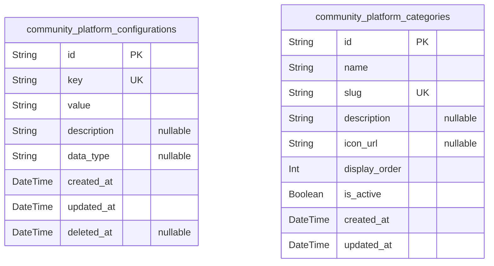
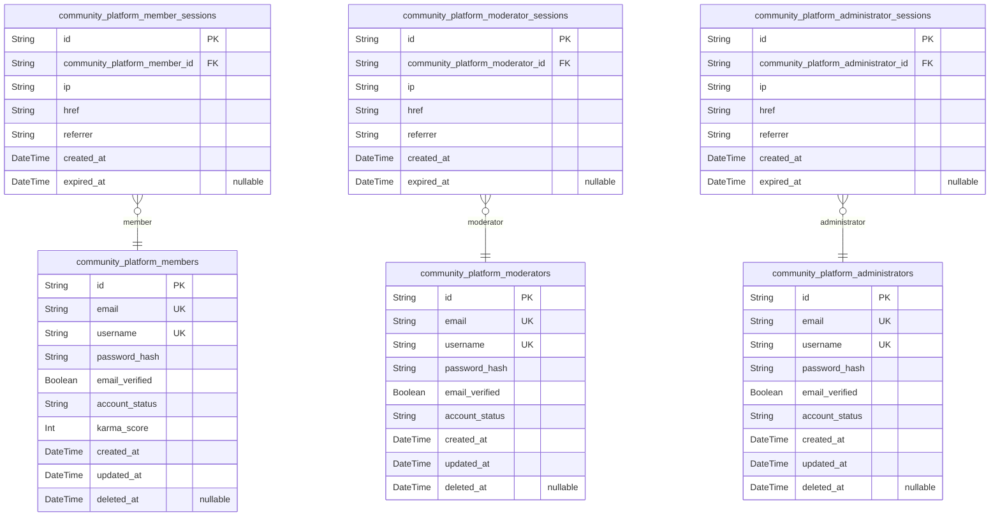
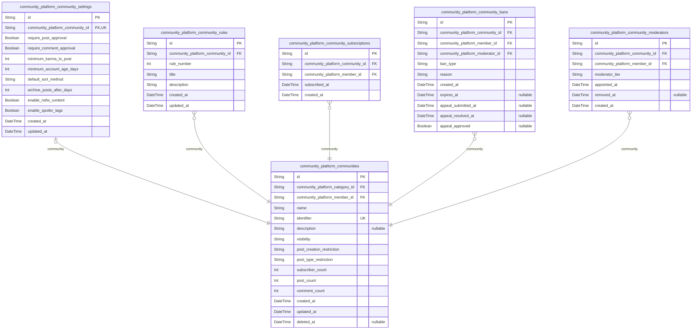
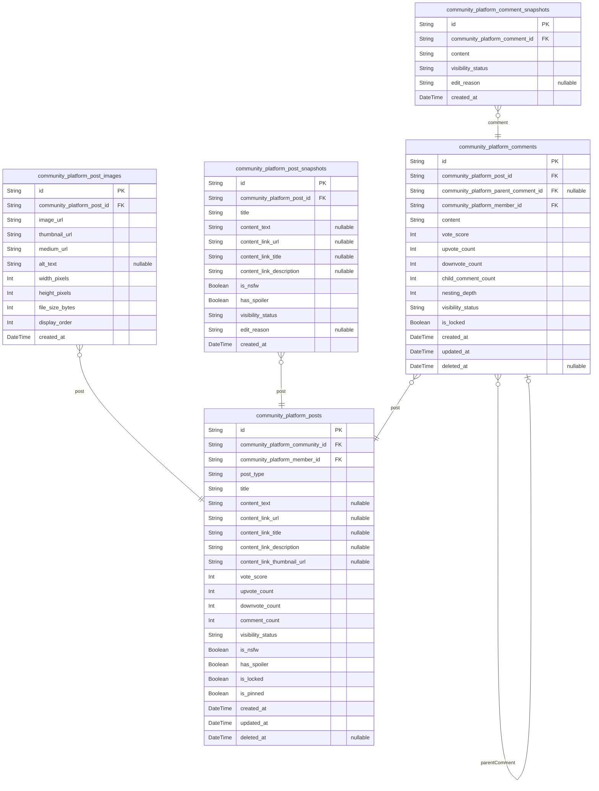
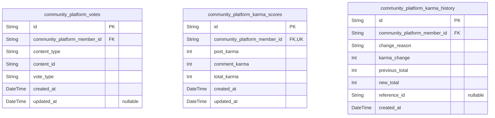
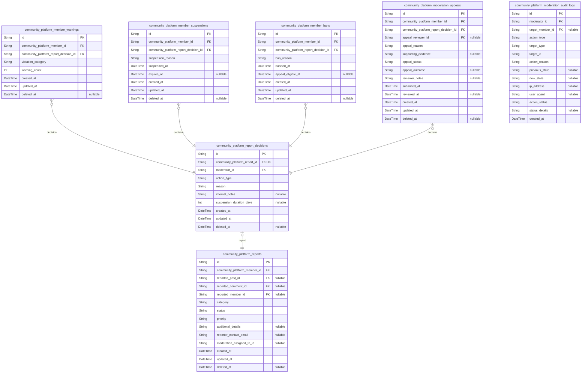
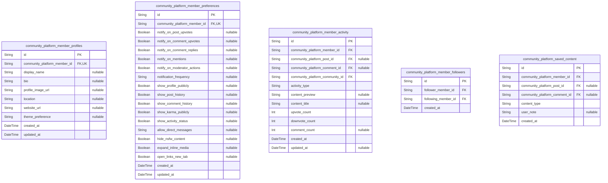
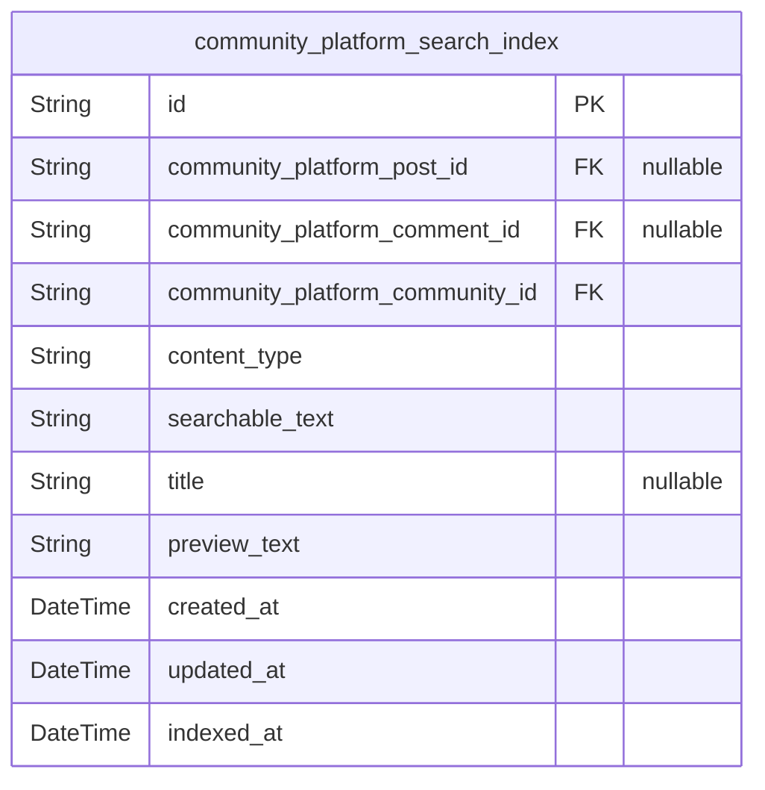
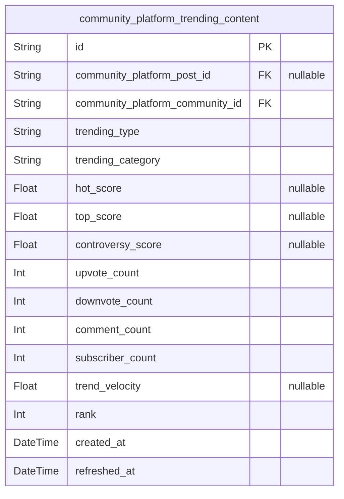

# Prisma Markdown

> Generated by [`prisma-markdown`](https://github.com/samchon/prisma-markdown)

- [Systematic](#systematic)
- [Actors](#actors)
- [Communities](#communities)
- [Content](#content)
- [Engagement](#engagement)
- [Moderation](#moderation)
- [Profiles](#profiles)
- [Search](#search)
- [default](#default)

## Systematic

```mermaid
erDiagram
"community_platform_configurations" {
  String id PK
  String key UK
  String value
  String description "nullable"
  String data_type "nullable"
  DateTime created_at
  DateTime updated_at
  DateTime deleted_at "nullable"
}
"community_platform_categories" {
  String id PK
  String name
  String slug UK
  String description "nullable"
  String icon_url "nullable"
  Int display_order
  Boolean is_active
  DateTime created_at
  DateTime updated_at
}
```

### `community_platform_configurations`

Platform-wide configuration settings that control system behavior and
feature availability.

Stores key-value pairs for global platform configuration including
feature flags, thresholds, and operational parameters. All communities
and users operate within constraints defined by these settings.
Configuration changes affect the entire platform immediately.
Administrators use these settings to control platform behavior without
code deployment (e.g., enable/disable voting, set rate limits, manage
feature access).

Properties as follows:

- `id`: Primary Key.
- `key`
  > Configuration key identifier (e.g., 'max_posts_per_hour',
  > 'voting_enabled', 'min_karma_to_post'). Used to look up specific
  > settings. Must be unique and immutable after creation.
- `value`
  > Configuration value as string (parsed by application based on key type).
  > Examples: 'true', '100', '1000', 'enabled'. Stores actual configuration
  > data.
- `description`
  > Human-readable description explaining what this configuration controls
  > and its impact on platform behavior. Helps administrators understand
  > settings.
- `data_type`
  > Data type of the value (e.g., 'boolean', 'integer', 'string', 'decimal').
  > Helps validate values when updated. Examples: 'boolean', 'int', 'string',
  > 'float'.
- `created_at`
  > Timestamp when configuration setting was created. Records when this
  > configuration first entered the system.
- `updated_at`
  > Timestamp when configuration setting was last modified. Updated every
  > time the value changes.
- `deleted_at`
  > Timestamp when configuration was soft-deleted (if applicable). Null for
  > active configurations. Enables recovery of deleted settings.

### `community_platform_categories`

Predefined content categories used to organize and classify communities
on the platform.

Provides the taxonomy for community classification. Each community must
be assigned exactly one category from this list. Categories guide content
organization, enable filtering and discovery, and help users find
communities aligned with their interests. Categories are curated by
platform administrators and cannot be created by regular users. The
category list remains relatively stable, with occasional additions or
renames as platform evolves.

Properties as follows:

- `id`: Primary Key.
- `name`
  > Display name of the category (e.g., 'Technology', 'Entertainment',
  > 'Sports'). Used in UI for category selection and filtering.
  > Human-readable label shown to users.
- `slug`
  > URL-safe slug identifier for the category (e.g., 'technology',
  > 'entertainment', 'sports'). Used in URLs and API parameters. Lowercase
  > alphanumeric with hyphens only.
- `description`
  > Detailed description of what communities belong in this category. Guides
  > community creators when selecting appropriate category. Up to 500
  > characters explaining scope and purpose.
- `icon_url`
  > URL to category icon image displayed in UI (e.g., gears for Technology,
  > film reel for Entertainment). Optional but recommended for visual
  > distinction.
- `display_order`
  > Sort order for displaying categories in UI lists and dropdowns. Lower
  > numbers appear first. Allows administrators to control category
  > prominence.
- `is_active`
  > Whether this category is currently available for use. Inactive categories
  > hide from selection dropdowns but existing communities in that category
  > continue working. Enables sunsetting old categories.
- `created_at`
  > Timestamp when category was created in the system. Records when this
  > category was added to the platform.
- `updated_at`
  > Timestamp when category was last modified. Updated when name,
  > description, icon, or other properties change.

## Actors

```mermaid
erDiagram
"community_platform_members" {
  String id PK
  String email UK
  String username UK
  String password_hash
  Boolean email_verified
  String account_status
  Int karma_score
  DateTime created_at
  DateTime updated_at
  DateTime deleted_at "nullable"
}
"community_platform_member_sessions" {
  String id PK
  String community_platform_member_id FK
  String ip
  String href
  String referrer
  DateTime created_at
  DateTime expired_at "nullable"
}
"community_platform_moderators" {
  String id PK
  String email UK
  String username UK
  String password_hash
  Boolean email_verified
  String account_status
  DateTime created_at
  DateTime updated_at
  DateTime deleted_at "nullable"
}
"community_platform_moderator_sessions" {
  String id PK
  String community_platform_moderator_id FK
  String ip
  String href
  String referrer
  DateTime created_at
  DateTime expired_at "nullable"
}
"community_platform_administrators" {
  String id PK
  String email UK
  String username UK
  String password_hash
  Boolean email_verified
  String account_status
  DateTime created_at
  DateTime updated_at
  DateTime deleted_at "nullable"
}
"community_platform_administrator_sessions" {
  String id PK
  String community_platform_administrator_id FK
  String ip
  String href
  String referrer
  DateTime created_at
  DateTime expired_at "nullable"
}
"community_platform_member_sessions" }o--|| "community_platform_members" : member
"community_platform_moderator_sessions" }o--|| "community_platform_moderators" : moderator
"community_platform_administrator_sessions" }o--|| "community_platform_administrators" : administrator
```

### `community_platform_members`

Authenticated user accounts with member role. Members can create posts,
comments, vote on content, build reputation through karma, and subscribe
to communities. This is the primary user account type for regular
platform participants.

Properties as follows:

- `id`: Primary Key.
- `email`
  > Member's email address used for authentication, password recovery, and
  > notifications. Must be unique across all members to prevent duplicate
  > accounts. Valid RFC 5322 format required.
- `username`
  > Unique display name for the member (3-50 characters). Used in URLs,
  > mentions, and public attribution. Immutable after account creation to
  > maintain URL permanence and community references.
- `password_hash`
  > Bcrypt-hashed password (cost factor 12). Never stores plaintext password.
  > Hash includes salt for security. Updated when member changes password.
- `email_verified`
  > Flag indicating whether email address has been verified. Members must
  > verify email before posting, commenting, or voting. Defaults to false at
  > registration.
- `account_status`
  > Current account state. Valid values: 'active' (normal operation),
  > 'suspended' (temporarily disabled), 'pending_deletion' (awaiting final
  > deletion after 48-hour cancellation window), 'deleted' (permanently
  > deleted, soft-delete). Defaults to 'active'.
- `karma_score`
  > Member's reputation score earned from post and comment votes. Cumulative
  > value across entire account lifetime. Minimum value is 0 (cannot go
  > negative). Updated in real-time as votes are cast or removed.
- `created_at`
  > Account creation timestamp (ISO 8601 UTC). Immutable. Used to calculate
  > account age for privilege restrictions and rate limiting.
- `updated_at`
  > Last time member's account was modified (email, password, profile, status
  > changes). Updated automatically on any account change. Used for audit
  > trails.
- `deleted_at`
  > Soft-delete timestamp when member requests account deletion. Null if
  > account is active. Enables 7-day recovery window before permanent purge.
  > Set during deletion process, cleared if deletion cancelled.

### `community_platform_member_sessions`

Multi-device session tracking for authenticated members. Enables member
authentication across multiple devices simultaneously while maintaining
security and session revocation capabilities. Each session maintains
connection context (IP, referrer) for fraud detection and device
identification.

Properties as follows:

- `id`: Primary Key.
- `community_platform_member_id`
  > Reference to member's [community_platform_members.id](#community_platform_members). Non-nullable
  > to ensure every session belongs to a member. Foreign key constraint
  > enforces referential integrity.
- `ip`
  > IP address of the login connection. Used for device identification, fraud
  > detection, and geographic location tracking. Can be IPv4 or IPv6 format.
- `href`
  > Connection URL where login occurred. Captured for security context and
  > helps identify login source (web, mobile, API client). Full URL string.
- `referrer`
  > HTTP Referrer header from login request. Identifies referring page/app.
  > May be empty string if referrer header omitted by client or privacy
  > settings enabled.
- `created_at`
  > Session creation timestamp (ISO 8601 UTC). Records exactly when member
  > logged in and session was established. Immutable.
- `expired_at`
  > Session expiration/termination timestamp. Null while session is active.
  > Set when session ends (logout, suspension, password change, or refresh
  > token expiration). Enables identifying when session terminated.

### `community_platform_moderators`

Moderator user accounts with community management capabilities.
Moderators are appointed by community creators or administrators to
enforce community rules, remove problematic content, and manage community
membership. This table tracks moderator account credentials and status
separately from members.

Properties as follows:

- `id`: Primary Key.
- `email`
  > Moderator's email address for authentication and administrative
  > notifications. Must be unique to prevent duplicate accounts. Used for
  > password reset and account recovery.
- `username`
  > Unique display name (3-50 characters). Immutable after account creation.
  > Identifies moderator in moderation logs and audit trails.
- `password_hash`
  > Bcrypt-hashed password (cost factor 12). Includes salt. Secures moderator
  > account with strong cryptographic protection.
- `email_verified`
  > Flag indicating email verification status. Moderators must verify email
  > before accessing moderation tools. Defaults to false at account creation.
- `account_status`
  > Account state. Valid values: 'active' (operational), 'suspended'
  > (temporary disable), 'pending_deletion' (awaiting final deletion),
  > 'deleted' (soft-deleted). Determines if moderator can login and take
  > actions.
- `created_at`
  > Account creation timestamp. Immutable record of when moderator account
  > was established.
- `updated_at`
  > Last modification timestamp. Updated when email, password, or status
  > changes. Audited for compliance.
- `deleted_at`
  > Soft-delete timestamp. Null if account active. Set during deletion
  > request, enables 7-day recovery window. Non-null means account is in
  > deleted state.

### `community_platform_moderator_sessions`

Session management for moderators across multiple devices. Tracks
moderator login sessions for security, device identification, and session
revocation. Enables multi-device login while maintaining audit trail of
moderator access.

Properties as follows:

- `id`: Primary Key.
- `community_platform_moderator_id`
  > Reference to moderator's [community_platform_moderators.id](#community_platform_moderators).
  > Non-nullable to ensure session belongs to moderator. Enforces referential
  > integrity.
- `ip`
  > IP address of moderator login. Used for security tracking, fraud
  > detection, and identifying device locations. Can be IPv4 or IPv6.
- `href`
  > URL where login occurred. Captures connection source for security context
  > and audit purposes.
- `referrer`
  > HTTP Referrer from login request. Identifies referring page/application.
  > May be empty if omitted by client.
- `created_at`
  > Session creation timestamp (UTC ISO 8601). Records when moderator logged
  > in. Immutable.
- `expired_at`
  > Session termination timestamp. Null while active. Set when session ends
  > (logout, password change, account suspension, or token expiration).

### `community_platform_administrators`

Platform administrator accounts with system-wide management capabilities.
Administrators have highest privilege level with access to all
communities, user accounts, and platform configuration. Separate table
maintains administrative account credentials distinct from other user
types.

Properties as follows:

- `id`: Primary Key.
- `email`
  > Administrator's email address for authentication and critical
  > notifications. Must be unique to ensure single admin per email. Used for
  > password recovery and emergency communications.
- `username`
  > Unique administrator identifier (3-50 characters). Immutable. Appears in
  > audit logs and administrative actions for accountability.
- `password_hash`
  > Bcrypt-hashed password (cost factor 12) with salt. Protects privileged
  > admin account with strong cryptographic security.
- `email_verified`
  > Email verification status. Administrators must verify email before
  > accessing admin dashboard. Prevents unauthorized admin account creation.
- `account_status`
  > Account state: 'active' (operational), 'suspended' (temporary disable),
  > 'pending_deletion' (awaiting final deletion), 'deleted' (soft-deleted).
  > Controls admin access to system.
- `created_at`
  > Account creation timestamp. Immutable record of when admin account was
  > provisioned.
- `updated_at`
  > Last account modification timestamp. Updated when email, password, or
  > status changes. Maintained for audit compliance.
- `deleted_at`
  > Soft-delete timestamp. Null if active. Set during deletion request,
  > enabling 7-day recovery window for admin accounts. Prevents accidental
  > admin removal.

### `community_platform_administrator_sessions`

Session tracking for platform administrators. Manages admin login
sessions across multiple devices while maintaining security auditing.
Enables multi-device admin access with complete session revocation and
monitoring capabilities for security compliance.

Properties as follows:

- `id`: Primary Key.
- `community_platform_administrator_id`
  > Reference to administrator's {@link
  > community_platform_administrators.id}. Non-nullable to ensure session
  > belongs to administrator. Enforces referential integrity.
- `ip`
  > IP address of admin login. Tracks where privileged access occurs for
  > security auditing. Can be IPv4 or IPv6 format.
- `href`
  > URL where admin login occurred. Captures admin dashboard or control panel
  > URL for connection context.
- `referrer`
  > HTTP Referrer from admin login request. Identifies referring source for
  > administrative access. May be empty if not provided.
- `created_at`
  > Session creation timestamp (UTC ISO 8601). Records when admin logged in.
  > Immutable for audit trail.
- `expired_at`
  > Session termination timestamp. Null while active. Set when session ends
  > (logout, password change, account suspension, or token expiration).
  > Audited for security.

## Communities

```mermaid
erDiagram
"community_platform_communities" {
  String id PK
  String community_platform_category_id FK
  String community_platform_member_id FK
  String name
  String identifier UK
  String description "nullable"
  String visibility
  String post_creation_restriction
  String post_type_restriction
  Int subscriber_count
  Int post_count
  Int comment_count
  DateTime created_at
  DateTime updated_at
  DateTime deleted_at "nullable"
}
"community_platform_community_settings" {
  String id PK
  String community_platform_community_id FK,UK
  Boolean require_post_approval
  Boolean require_comment_approval
  Int minimum_karma_to_post
  Int minimum_account_age_days
  String default_sort_method
  Int archive_posts_after_days
  Boolean enable_nsfw_content
  Boolean enable_spoiler_tags
  DateTime created_at
  DateTime updated_at
}
"community_platform_community_rules" {
  String id PK
  String community_platform_community_id FK
  Int rule_number
  String title
  String description
  DateTime created_at
  DateTime updated_at
}
"community_platform_community_subscriptions" {
  String id PK
  String community_platform_community_id FK
  String community_platform_member_id FK
  DateTime subscribed_at
  DateTime created_at
}
"community_platform_community_bans" {
  String id PK
  String community_platform_community_id FK
  String community_platform_member_id FK
  String community_platform_moderator_id FK
  String ban_type
  String reason
  DateTime created_at
  DateTime expires_at "nullable"
  DateTime appeal_submitted_at "nullable"
  DateTime appeal_resolved_at "nullable"
  Boolean appeal_approved "nullable"
}
"community_platform_community_moderators" {
  String id PK
  String community_platform_community_id FK
  String community_platform_member_id FK
  String moderator_tier
  DateTime appointed_at
  DateTime removed_at "nullable"
  DateTime created_at
}
"community_platform_community_settings" |o--|| "community_platform_communities" : community
"community_platform_community_rules" }o--|| "community_platform_communities" : community
"community_platform_community_subscriptions" }o--|| "community_platform_communities" : community
"community_platform_community_bans" }o--|| "community_platform_communities" : community
"community_platform_community_moderators" }o--|| "community_platform_communities" : community
```

### `community_platform_communities`

Core community entity representing discussion spaces and organizational
units on the platform.

Each community is a self-contained space where members can create posts,
comments, and engage in discussions. Communities are created by members
and managed by community creators and moderators. Communities have
configurable settings (visibility, post permissions) and can be public
(discoverable by all users) or private (restricted to approved members).

Communities are fundamental to the platform architecture - all posts and
comments belong to specific communities, and community membership is
tracked through subscriptions. Communities support hierarchical
moderation with creator at top, followed by senior and junior moderators.

Community names are not required to be globally unique (multiple
communities can share the same name), but community identifiers (handles)
are globally unique and immutable after creation.

Properties as follows:

- `id`: Primary Key. Unique identifier for the community.
- `community_platform_category_id`
  > Category classification for the community. References {@link
  > community_platform_categories.id}. Determines community topic area
  > (Technology, Entertainment, Sports, etc.) and affects community discovery
  > and recommendations.
- `community_platform_member_id`
  > Community creator (original founder). References {@link
  > community_platform_members.id}. The member who created this community
  > automatically becomes the community creator with all moderator
  > permissions. Creator can transfer ownership to another member.
- `name`
  > Community display name shown to users. Length: 3-100 characters. May
  > contain spaces and special characters. Not required to be unique
  > (multiple communities can share same name). Used in community headers and
  > search results.
- `identifier`
  > Unique, URL-safe community identifier (handle). Format: lowercase
  > letters, numbers, underscores only. Length: 3-32 characters. Used in URLs
  > (e.g., r/[identifier]). Immutable after community creation. Globally
  > unique across entire platform.
- `description`
  > Community description explaining purpose and scope. Length: 0-500
  > characters. Optional field. Used in community directory and search.
  > Should explain what topics are welcome and community culture.
- `visibility`
  > Community access level: 'public' (visible to all users, posts readable by
  > anyone) or 'private' (only subscribed members can view content). Controls
  > who can discover and access the community. Default: 'public'. Can be
  > changed by community creator anytime.
- `post_creation_restriction`
  > Restriction level for who can create posts: 'open_to_all' (any member can
  > post), 'moderators_only' (only moderators), 'approved_members_only'
  > (posts require approval), 'karma_requirement' (minimum karma required),
  > 'account_age_requirement' (minimum account age required). Default:
  > 'open_to_all'. Controls post creation permissions.
- `post_type_restriction`
  > Allowed post types: 'all_types' (text, links, images), 'text_only',
  > 'text_and_images', 'text_and_links', 'images_only'. Restricts content
  > format per community rules. Default: 'all_types'.
- `subscriber_count`
  > Current number of members subscribed to this community. Incremented when
  > members subscribe, decremented when unsubscribe. Used for community
  > discovery and ranking. Updated in real-time. Minimum value: 0.
- `post_count`
  > Total count of non-deleted posts in this community. Incremented when
  > posts created, decremented when posts deleted. Provides activity metrics.
  > Minimum value: 0.
- `comment_count`
  > Total count of non-deleted comments across all posts in this community.
  > Provides engagement metrics. Updated when comments created/deleted.
  > Minimum value: 0.
- `created_at`
  > Timestamp when community was created. Immutable after creation. Used for
  > community age calculations and discovery sorting (new communities).
  > Stored in UTC.
- `updated_at`
  > Timestamp when community was last modified (settings, rules, description
  > changed). Updates whenever community configuration is modified. Used for
  > tracking administrative actions.
- `deleted_at`
  > Soft-delete timestamp. NULL if community is active, set to deletion time
  > if community is archived/deleted. Allows community recovery within grace
  > period. Communities with deleted_at set are hidden from search and
  > directory but preserved in database.

### `community_platform_community_settings`

Extended configuration options for communities, enabling fine-grained
control over community behavior.

Stores optional, customizable settings that modify community behavior
beyond basic configuration. Each community has exactly one settings
record (1:1 relationship). Settings include moderation preferences
(require post approval, comment filtering), accessibility (karma
requirements), and display options (default sorting).

Settings are separated from main community entity to keep core community
data lean while allowing extensive optional customization. Settings can
be updated independently without modifying core community metadata.

Properties as follows:

- `id`: Primary Key. Unique identifier for the community settings record.
- `community_platform_community_id`
  > Community these settings belong to. References {@link
  > community_platform_communities.id}. 1:1 relationship - exactly one
  > settings record per community. Unique constraint ensures exactly one.
- `require_post_approval`
  > If true, all new posts require moderator approval before appearing
  > publicly. If false, posts appear immediately. Default: false. Enables
  > quality control in communities with high spam risk.
- `require_comment_approval`
  > If true, all new comments require moderator approval before appearing. If
  > false, comments appear immediately. Default: false. Can be used for
  > communities wanting strict discussion control.
- `minimum_karma_to_post`
  > Minimum user karma required to create posts in this community. 0 means no
  > restriction. Default: 0. Used to prevent spam and low-effort content from
  > new/low-reputation users.
- `minimum_account_age_days`
  > Minimum account age in days required to post. 0 means no restriction.
  > Default: 0. Used to prevent immediate spam from new accounts.
- `default_sort_method`
  > Default sorting algorithm for community feed: 'hot' (trending, default),
  > 'new' (chronological), 'top' (highest voted), 'controversial' (balanced
  > disagreement). Users can override. Default: 'hot'.
- `archive_posts_after_days`
  > Posts older than specified days are archived (hidden from main feed but
  > searchable). 0 means no archival. Default: 180. Keeps active feed fresh
  > while preserving history.
- `enable_nsfw_content`
  > If true, community accepts and displays NSFW (adult) content with
  > appropriate warnings. If false, NSFW content is prohibited. Default:
  > false. Affects content filtering in user feeds.
- `enable_spoiler_tags`
  > If true, users can hide content behind spoiler tags (for movies, games,
  > books, etc.). Default: true. Allows community customization of spoiler
  > expectations.
- `created_at`
  > Timestamp when settings record was created. Typically matches community
  > creation time. Used for audit trail.
- `updated_at`
  > Timestamp when settings were last modified. Updates whenever any setting
  > is changed. Used for tracking configuration history.

### `community_platform_community_rules`

Community-specific rules and guidelines that members must follow.

Stores numbered list of rules that define acceptable behavior in the
community. Each community can have up to 10 rules. Rules are displayed to
members on community page and referenced during moderation. Rules are
community-specific - different communities can have different standards
(e.g., gaming community allows casual language while professional
community forbids it).

Rules are searchable and indexed to support rule-based content filtering
and enforcement. Rules can be updated anytime by community creator or
senior moderators.

Properties as follows:

- `id`: Primary Key. Unique identifier for the rule record.
- `community_platform_community_id`
  > Community this rule belongs to. References {@link
  > community_platform_communities.id}. Multiple rules per community (1:N).
  > Enables community-specific rule sets.
- `rule_number`
  > Ordinal position of rule in community's rule list. Range: 1-10.
  > Determines display order. Unique per community (no duplicate numbers).
  > Used to reference rules (e.g., 'Rule 3: Be respectful').
- `title`
  > Short rule title/heading (5-50 characters). Concise summary of the rule.
  > Example: 'No Harassment'. Displayed prominently in rule lists.
- `description`
  > Detailed rule explanation (10-200 characters). Provides context and
  > examples. Example: 'Do not target, insult, or mock other community
  > members. Respectful disagreement is welcome.' Helps members understand
  > expectations.
- `created_at`
  > Timestamp when rule was created. Used for audit trail. Rules immutable
  > after creation (new rules added, old rules removed, not edited in place).
- `updated_at`
  > Timestamp when rule was last updated (if title/description modified).
  > Used for tracking rule changes.

### `community_platform_community_subscriptions`

Membership records tracking which members are subscribed to which
communities.

Represents M:N relationship between members and communities. Each
subscription record tracks one member's membership in one community.
Subscriptions include join timestamp (when member subscribed), enabling
activity history and member tenure calculation.

Subscriptions are the mechanism for determining community membership,
controlling content visibility, and personalizing member feeds. Members
can subscribe/unsubscribe from communities freely (unless community is
private and requires approval).

Subscription records are primary data for community discovery, member
management, and feed generation. Each member-community pair has at most
one subscription (no duplicates).

Properties as follows:

- `id`: Primary Key. Unique identifier for the subscription record.
- `community_platform_community_id`
  > Community being subscribed to. References {@link
  > community_platform_communities.id}. Many subscriptions per community
  > (M:N). Required for community membership.
- `community_platform_member_id`
  > Member subscribing to community. References {@link
  > community_platform_members.id}. Many subscriptions per member (M:N).
  > Tracks member's community affiliations.
- `subscribed_at`
  > Timestamp when member subscribed to community. Immutable after
  > subscription creation. Used to calculate member tenure in community and
  > for sorting member lists by join date.
- `created_at`
  > Record creation timestamp. Typically matches subscribed_at (record
  > created when subscription occurs). Used for audit trail.

### `community_platform_community_bans`

Community-specific member bans tracking discipline and access restrictions.

Records instances when members are banned or suspended from specific
communities by moderators. Bans can be temporary (with expiration date)
or permanent. Ban records include reason and moderator who issued ban.

Bans prevent banned members from posting, commenting, or voting in banned
community (but they can still view public content). Bans are
community-scoped (member can be banned from one community but active in
others). Ban records are retained indefinitely for audit trail even after
ban expires or is appealed.

Ban records support appeals workflow - appeal timestamps and outcomes
tracked in same record. Bans escalate from temporary suspensions to
permanent bans based on repeat violations.

Properties as follows:

- `id`: Primary Key. Unique identifier for the ban record.
- `community_platform_community_id`
  > Community where member is banned. References {@link
  > community_platform_communities.id}. Multiple bans per community (M:N).
  > Ban is scoped to this community only.
- `community_platform_member_id`
  > Member being banned. References [community_platform_members.id](#community_platform_members).
  > Tracks banned members for access control and moderation.
- `community_platform_moderator_id`
  > Moderator who issued the ban. References {@link
  > community_platform_moderators.id}. Tracks who took the action for audit
  > and appeal purposes.
- `ban_type`
  > Type of ban: 'temporary' (suspension with end date), 'permanent'
  > (indefinite). Determines enforcement duration. Temporary bans
  > automatically expire; permanent bans require moderator action to lift.
- `reason`
  > Reason for ban (0-500 characters). Example: 'Repeated violation of Rule
  > 5: Be respectful'. Displayed to banned member. Used for appeal
  > evaluation.
- `created_at`
  > Timestamp when ban was issued. Used to calculate ban duration and
  > determine if temporary ban has expired.
- `expires_at`
  > Expiration timestamp for temporary bans. NULL for permanent bans. When
  > NOW() > expires_at, temporary ban expires automatically and member
  > regains access. Used to determine ban status.
- `appeal_submitted_at`
  > Timestamp when member submitted appeal of this ban. NULL if no appeal
  > submitted. After appeal submitted, timestamps subsequent appeal activity
  > in other records.
- `appeal_resolved_at`
  > Timestamp when appeal was resolved (approved or denied). NULL if appeal
  > pending or not submitted. Marks completion of appeal process.
- `appeal_approved`
  > Appeal outcome: true if appeal was approved and ban lifted, false if
  > appeal was denied. NULL if no appeal submitted or appeal pending. Used to
  > determine if ban is still active.

### `community_platform_community_moderators`

Moderator assignments tracking which members moderate which communities
and their role tier.

Associates members with communities they moderate, including role tier
(Creator, Senior, Junior). Each moderator can manage one or more
communities; each community can have multiple moderators. Moderator
records include appointment date and optional removal date (soft-delete
for audit trail).

ModeratorTier hierarchy determines permissions: Creator has ultimate
authority, Senior moderators have broad permissions, Junior moderators
have limited permissions. Within each community, moderators form
hierarchy based on appointment order - more recently appointed moderators
have limited ability to remove older moderators.

Moderation records are retained indefinitely even after moderator is
removed (audit trail). Removed moderators have removed_at timestamp but
record preserved for accountability.

Properties as follows:

- `id`: Primary Key. Unique identifier for the moderator assignment record.
- `community_platform_community_id`
  > Community where member is moderating. References {@link
  > community_platform_communities.id}. Multiple moderators per community.
  > Determines scope of moderator authority.
- `community_platform_member_id`
  > Member assigned as moderator. References {@link
  > community_platform_members.id}. Members can moderate multiple communities
  > (1:N from member perspective). Tracks who has moderation authority.
- `moderator_tier`
  > Role tier: 'creator' (community founder, ultimate authority), 'senior'
  > (broad moderation powers), 'junior' (limited powers). Determines
  > permissions in community moderation workflows. Community creator always
  > has 'creator' tier.
- `appointed_at`
  > Timestamp when member was appointed as moderator. Immutable after
  > appointment. Used to determine seniority and hierarchy - earlier
  > appointments = more senior. Affects permission to remove other
  > moderators.
- `removed_at`
  > Soft-delete timestamp. NULL if moderator is currently active, set to
  > removal time if moderator was removed. Allows moderator reinstatement.
  > Preserves audit trail of moderator history.
- `created_at`
  > Record creation timestamp. Typically matches appointed_at. Used for audit
  > trail.

## Content

```mermaid
erDiagram
"community_platform_posts" {
  String id PK
  String community_platform_community_id FK
  String community_platform_member_id FK
  String post_type
  String title
  String content_text "nullable"
  String content_link_url "nullable"
  String content_link_title "nullable"
  String content_link_description "nullable"
  String content_link_thumbnail_url "nullable"
  Int vote_score
  Int upvote_count
  Int downvote_count
  Int comment_count
  String visibility_status
  Boolean is_nsfw
  Boolean has_spoiler
  Boolean is_locked
  Boolean is_pinned
  DateTime created_at
  DateTime updated_at
  DateTime deleted_at "nullable"
}
"community_platform_post_images" {
  String id PK
  String community_platform_post_id FK
  String image_url
  String thumbnail_url
  String medium_url
  String alt_text "nullable"
  Int width_pixels
  Int height_pixels
  Int file_size_bytes
  Int display_order
  DateTime created_at
}
"community_platform_post_snapshots" {
  String id PK
  String community_platform_post_id FK
  String title
  String content_text "nullable"
  String content_link_url "nullable"
  String content_link_title "nullable"
  String content_link_description "nullable"
  Boolean is_nsfw
  Boolean has_spoiler
  String visibility_status
  String edit_reason "nullable"
  DateTime created_at
}
"community_platform_comments" {
  String id PK
  String community_platform_post_id FK
  String community_platform_parent_comment_id FK "nullable"
  String community_platform_member_id FK
  String content
  Int vote_score
  Int upvote_count
  Int downvote_count
  Int child_comment_count
  Int nesting_depth
  String visibility_status
  Boolean is_locked
  DateTime created_at
  DateTime updated_at
  DateTime deleted_at "nullable"
}
"community_platform_comment_snapshots" {
  String id PK
  String community_platform_comment_id FK
  String content
  String visibility_status
  String edit_reason "nullable"
  DateTime created_at
}
"community_platform_post_images" }o--|| "community_platform_posts" : post
"community_platform_post_snapshots" }o--|| "community_platform_posts" : post
"community_platform_comments" }o--|| "community_platform_posts" : post
"community_platform_comments" }o--o| "community_platform_comments" : parentComment
"community_platform_comment_snapshots" }o--|| "community_platform_comments" : comment
```

### `community_platform_posts`

User-generated posts (content items) within communities.

Posts are the primary content units in the platform. Members create posts
in specific communities, choosing from three types: text
(markdown-formatted), link (external URLs with metadata), or image
(uploaded images with captions).

Each post belongs to exactly one community and has one creator (member).
Posts track engagement through vote counts and comment counts in
real-time. The visibility field implements soft-delete (posts marked as
deleted remain in database for audit purposes but are hidden from public
view).

Posts support editing within 24 hours through the snapshots table.
Historical versions are captured for audit trail and recovery. Vote
scores are updated in real-time as community members upvote/downvote.
Comments are nested replies tracked via comment_count field.

Soft deletion preserves post integrity: removed by moderator posts show
"[removed by moderator]" placeholder to maintain thread structure with
replies still visible.

Properties as follows:

- `id`: Primary Key.
- `community_platform_community_id`
  > Community where this post was published. References
  > community_platform_communities.id. Non-nullable - post must belong to
  > specific community.
- `community_platform_member_id`
  > Member who created this post. References community_platform_members.id.
  > Non-nullable - post must have creator.
- `post_type`
  > Type of post content: 'text' for markdown text posts, 'link' for external
  > URL posts, 'image' for image posts. Determines which content fields are
  > populated.
- `title`
  > Post title/subject (required for all post types). 1-300 characters.
  > Searchable. HTML tags stripped automatically.
- `content_text`
  > Main text content for text posts. Supports markdown formatting. Maximum
  > 40,000 characters. Null for non-text posts.
- `content_link_url`
  > External URL for link posts. Maximum 2,048 characters. Null for non-link
  > posts. Must be valid HTTP/HTTPS URL.
- `content_link_title`
  > Open Graph title extracted from link preview (link posts only). Used for
  > display in feeds. Null for non-link posts.
- `content_link_description`
  > Open Graph description extracted from link preview (link posts only).
  > Preview text shown in feeds. Maximum 500 characters. Null for non-link
  > posts.
- `content_link_thumbnail_url`
  > Open Graph image URL extracted from link preview (link posts only). Image
  > shown in feed preview. Null for non-link posts.
- `vote_score`
  > Net vote count (upvotes - downvotes). Updated in real-time as votes
  > arrive. Initial value: 0. Must equal upvote_count - downvote_count.
  > Minimum value: 0.
- `upvote_count`
  > Total upvote count. Used for sorting algorithms and statistics. Initial
  > value: 0. Minimum value: 0.
- `downvote_count`
  > Total downvote count. Used for controversial scoring. Initial value: 0.
  > Minimum value: 0.
- `comment_count`
  > Total number of non-deleted comments on this post. Updated in real-time
  > when comments created/deleted. Used for sorting and display.
- `visibility_status`
  > Post visibility state: 'public' (visible in feeds and search), 'archived'
  > (hidden from feeds but accessible via direct link), 'deleted'
  > (soft-deleted by user, visible only to author/moderators),
  > 'removed_by_moderator' (removed for policy violation). Default: 'public'.
  > When status is 'deleted' or 'removed_by_moderator', deleted_at timestamp
  > is set.
- `is_nsfw`
  > Whether post contains Not Safe For Work content. Default: false. When
  > true, content filtered from feeds of users who disable NSFW viewing.
- `has_spoiler`
  > Whether post contains spoilers. Default: false. When true, preview and
  > thumbnail hidden until user clicks to reveal.
- `is_locked`
  > Whether new comments are disabled on this post. Set by moderators for
  > sensitive topics or after extended discussion. Default: false.
- `is_pinned`
  > Whether post is pinned to top of community feed. Set by moderators to
  > highlight important posts. Default: false.
- `created_at`
  > Post creation timestamp (UTC). Immutable after creation. Used for
  > chronological sorting.
- `updated_at`
  > Last modification timestamp (UTC). Updated when post is edited. Shows
  > when 'edited' indicator should display.
- `deleted_at`
  > Soft-delete timestamp (UTC). Set when post is deleted (visibility_status
  > becomes 'deleted' or 'removed_by_moderator'); null while active. Enables
  > recovery within grace period.

### `community_platform_post_images`

Images attached to posts.

Image posts contain one or more images. Each image stored as separate
record linking to parent post. Enables efficient pagination (don't fetch
all image data until needed). Images displayed in gallery format with
navigation.

Stores image URLs (files stored in cloud S3 with CDN delivery), metadata
(dimensions, alt text), and display ordering. Multiple sizes generated:
thumbnail (300x300), medium (800x800), full (original up to 2000x2000).
Display order is strictly unique per post - no two images can have the
same display_order value.

EXIF data stripped for privacy. Images validated for format, size,
dimensions during upload. Accessed through post detail pages, not
independently managed.

Properties as follows:

- `id`: Primary Key.
- `community_platform_post_id`
  > Post this image belongs to. References community_platform_posts.id.
  > Non-nullable - image must belong to post.
- `image_url`
  > CDN URL to full-resolution image. Served from CloudFront or equivalent
  > CDN. Points to cloud storage.
- `thumbnail_url`
  > CDN URL to thumbnail version (300x300px). Used in feed previews and
  > galleries.
- `medium_url`: CDN URL to medium version (800x800px). Used in detail page display.
- `alt_text`
  > Alt text for accessibility. Describes image content. Optional,
  > user-provided. Maximum 200 characters.
- `width_pixels`: Original image width in pixels. Used for aspect ratio calculation.
- `height_pixels`: Original image height in pixels. Used for aspect ratio calculation.
- `file_size_bytes`: Original image file size in bytes. Used for storage accounting.
- `display_order`
  > Order of image in gallery (0-indexed). Determines display sequence in
  > gallery view. Must be unique per post.
- `created_at`: Image upload timestamp (UTC). Immutable.

### `community_platform_post_snapshots`

Historical snapshots of post states for audit trail and recovery.

Captures complete post state at each edit. Enables viewing post's
historical versions, identifying what changed and when. Used for edit
history display to users and moderators.

Append-only pattern: new snapshots created on every edit, never modified
or deleted (except during disaster recovery). Snapshots retained
indefinitely for long-term audit trail.

When user edits post, system creates snapshot of current state before
applying changes. Users see "(edited)" indicator with link to view edit
history showing snapshot timestamps and changes.

Properties as follows:

- `id`: Primary Key.
- `community_platform_post_id`
  > Post this snapshot captures. References community_platform_posts.id.
  > Non-nullable - snapshot must reference original post.
- `title`: Post title at time of snapshot. Frozen historical state.
- `content_text`
  > Post text content at time of snapshot. Frozen historical state for text
  > posts.
- `content_link_url`: External URL at time of snapshot. Frozen historical state for link posts.
- `content_link_title`: Link preview title at time of snapshot.
- `content_link_description`: Link preview description at time of snapshot.
- `is_nsfw`: NSFW flag at time of snapshot.
- `has_spoiler`: Spoiler flag at time of snapshot.
- `visibility_status`
  > Visibility status at time of snapshot. Shows whether post was public,
  > archived, or removed.
- `edit_reason`
  > Optional reason provided by editor when making edit. Maximum 200
  > characters. Helps users understand what changed.
- `created_at`
  > Snapshot capture timestamp (UTC). Represents when this historical version
  > was created (when post was edited).

### `community_platform_comments`

Comments and nested replies on posts.

Comments are user-generated discussion responses to posts and to other
comments. Support nested threading up to 10 levels deep. Each comment has
exactly one parent (either post or another comment).

Track vote counts and child comment count in real-time. Display sorting:
best (engagement + recency), new (chronological), top (vote count),
controversial (upvotes/downvotes balanced).

Comments edited within 24 hours of creation. Soft-delete preserves thread
structure. Moderators can remove comments, removing for violations
results in "[removed by moderator]" placeholder. Comments voted on
independently, contributing to member karma.

Comments are primary entities requiring independent management: search
across all posts, moderation workflows, user activity tracking, direct
deletion operations. The nesting_depth field enforces a maximum of 10
levels to prevent excessive thread depth.

Properties as follows:

- `id`: Primary Key.
- `community_platform_post_id`
  > Post this comment belongs to. References community_platform_posts.id.
  > Non-nullable - every comment links to a post (even nested replies
  > ultimately trace back to post).
- `community_platform_parent_comment_id`
  > Parent comment if this is a reply to another comment. References
  > community_platform_comments.id. Null for top-level comments. Enables
  > nested threading structure.
- `community_platform_member_id`
  > Member who created this comment. References
  > community_platform_members.id. Non-nullable - comment must have creator.
- `content`
  > Comment body text. Supports markdown formatting. 1-10,000 characters.
  > Searchable field.
- `vote_score`
  > Net vote count (upvotes - downvotes). Updated in real-time. Initial
  > value: 0. Must equal upvote_count - downvote_count. Minimum value: 0.
- `upvote_count`: Total upvote count. Initial value: 0. Minimum value: 0.
- `downvote_count`: Total downvote count. Initial value: 0. Minimum value: 0.
- `child_comment_count`
  > Number of direct replies to this comment. Updated in real-time. Initial:
  > 0.
- `nesting_depth`
  > Depth in comment tree (0 for top-level, 1 for replies to top-level,
  > etc.). Maximum depth: 10. Used for display formatting. Enforced at
  > application level.
- `visibility_status`
  > Comment visibility: 'visible' (normal), 'deleted' (soft-deleted by
  > author), 'removed_by_moderator' (removed for violations). Default:
  > 'visible'. When 'deleted' or 'removed_by_moderator', deleted_at timestamp
  > is set.
- `is_locked`
  > Whether this comment is locked (no replies allowed). Set by moderators.
  > Default: false.
- `created_at`: Comment creation timestamp (UTC). Immutable after creation.
- `updated_at`: Last edit timestamp (UTC). Shows when 'edited' indicator displays.
- `deleted_at`
  > Soft-delete timestamp (UTC). Set when deleted (visibility_status becomes
  > 'deleted' or 'removed_by_moderator'); null while active. Enables recovery
  > within grace period.

### `community_platform_comment_snapshots`

Historical snapshots of comment edits for audit trail.

Captures complete comment state at each edit. Enables viewing comment
edit history and identifying changes over time.

Append-only pattern: snapshots created on edit, never modified. Retained
indefinitely for audit trail.

When comment edited, snapshot created preserving pre-edit state. Users
see edit history with snapshots showing what changed and when.

Properties as follows:

- `id`: Primary Key.
- `community_platform_comment_id`
  > Comment this snapshot captures. References
  > community_platform_comments.id. Non-nullable - snapshot must reference
  > original comment.
- `content`: Comment content at time of snapshot. Frozen historical state.
- `visibility_status`: Visibility status at time of snapshot.
- `edit_reason`: Optional reason provided by editor. Maximum 200 characters.
- `created_at`
  > Snapshot capture timestamp (UTC). When this historical version was
  > captured (when comment was edited).

## Engagement

```mermaid
erDiagram
"community_platform_votes" {
  String id PK
  String community_platform_member_id FK
  String content_type
  String content_id
  String vote_type
  DateTime created_at
  DateTime updated_at "nullable"
}
"community_platform_karma_scores" {
  String id PK
  String community_platform_member_id FK,UK
  Int post_karma
  Int comment_karma
  Int total_karma
  DateTime created_at
  DateTime updated_at
}
"community_platform_karma_history" {
  String id PK
  String community_platform_member_id FK
  String change_reason
  Int karma_change
  Int previous_total
  Int new_total
  String reference_id "nullable"
  DateTime created_at
}
```

### `community_platform_votes`

User voting records tracking upvotes and downvotes on posts and comments.
Each vote represents one user's opinion on one piece of content, whether
positive (upvote) or negative (downvote). This is the core engagement
mechanism driving content visibility through voting algorithms and karma
calculation.

Votes establish the connection between users and content they engage
with. Each vote is immutable once recorded (users can change or remove
votes, which creates a new vote record rather than modifying the
original). The voting history is preserved for audit trails and fraud
detection, enabling administrators to trace voting patterns and reverse
fraudulent votes if necessary.

The table uses polymorphic design to support voting on both posts and
comments through content_type and content_id fields, avoiding the
complexity of separate tables for post votes and comment votes. This
normalized approach maintains data integrity through a unique constraint
ensuring each user can only have one vote (upvote, downvote, or no vote)
per piece of content.

Properties as follows:

- `id`: Primary Key. Unique identifier for the vote record.
- `community_platform_member_id`
  > Foreign key referencing the member who cast this vote. Identifies the
  > user performing the voting action. [community_platform_members.id](#community_platform_members)
- `content_type`
  > Type of content being voted on. Valid values: 'post' for voting on a
  > post, 'comment' for voting on a comment. Enables polymorphic relationship
  > without separate tables.
- `content_id`
  > ID of the content being voted on. References either a post ID or comment
  > ID depending on content_type. Combined with content_type to identify the
  > exact piece of content.
- `vote_type`
  > Type of vote cast. Valid values: 'upvote' (+1 karma to creator),
  > 'downvote' (-1 karma to creator). Determines whether vote contributes
  > positively or negatively to content creator's karma.
- `created_at`
  > Timestamp when this vote was cast (ISO 8601 UTC format). Used for
  > chronological tracking and vote fraud detection (analyzing vote timing
  > patterns).
- `updated_at`
  > Timestamp when this vote was last modified (changed from upvote to
  > downvote, or vice versa). Updated whenever user changes their vote. Null
  > if vote has never been changed.

### `community_platform_karma_scores`

Cached karma reputation scores for each member, denormalized from vote
records for performance optimization. Rather than aggregating votes every
time karma is needed (slow for large vote counts), karma scores are
stored in this table and updated whenever votes change, enabling instant
karma display on profiles and posts.

Karma score represents a member's reputation and standing in the
community, calculated as the cumulative effect of votes received on their
posts and comments. The score is split into two components: post_karma
(votes on posts) and comment_karma (votes on comments), allowing display
of both total karma and breakdown by content type.

This table maintains a cached denormalization relationship with
community_platform_votes table. The votes are the source of truth;
karma_scores are derived values updated when votes are created, changed,
or removed. This hybrid approach combines normalization (votes stored
once) with denormalization (scores cached) for optimal performance on
high-frequency read operations (displaying karma) while maintaining audit
capability through votes table.

Properties as follows:

- `id`: Primary Key. Unique identifier for this karma score record.
- `community_platform_member_id`
  > Foreign key referencing the member whose karma score this represents.
  > One-to-one relationship: each member has exactly one karma score record.
  > [community_platform_members.id](#community_platform_members)
- `post_karma`
  > Cumulative karma score earned from votes on posts created by this member.
  > Calculated as sum of all upvotes minus downvotes on member's posts.
  > Minimum value 0 (karma cannot go negative). Updated when votes on
  > member's posts are created, changed, or removed.
- `comment_karma`
  > Cumulative karma score earned from votes on comments created by this
  > member. Calculated as sum of all upvotes minus downvotes on member's
  > comments. Minimum value 0 (karma enforced floor). Updated when votes on
  > member's comments change.
- `total_karma`
  > Total karma score for the member, calculated as post_karma +
  > comment_karma. Denormalized for faster access (avoids addition
  > calculation on every profile view). Kept in sync automatically through
  > triggers or application logic.
- `created_at`
  > Timestamp when this karma score record was created (when member account
  > is created). Immutable after creation. Used to identify earliest karma
  > tracking date.
- `updated_at`
  > Timestamp when karma score was last updated. Updated whenever any vote on
  > member's posts or comments is created, changed, or removed. Provides
  > tracking of when karma last changed.

### `community_platform_karma_history`

Audit trail tracking all karma score changes over time, enabling
historical analysis and fraud investigation. Every time a member's karma
changes (through vote creation, modification, or deletion), a history
record is created documenting the change, allowing complete
reconstruction of how karma evolved.

This immutable historical log serves multiple critical functions: enables
reversal of fraudulent karma adjustments by administrators, documents
karma changes for compliance and transparency, supports analysis of
voting fraud patterns (identifying suspicious vote clusters), and
provides evidence for appeals and disputes.

Karma history is append-only; records are never modified or deleted, only
archived after retention period. The complete history provides a detailed
audit trail suitable for legal disputes, fraud investigations, and
performance analysis of moderation systems.

Properties as follows:

- `id`: Primary Key. Unique identifier for this karma history record.
- `community_platform_member_id`
  > Foreign key referencing the member whose karma changed. Identifies which
  > member's karma was affected by this change. {@link
  > community_platform_members.id}
- `change_reason`
  > Reason for this karma change. Valid values: 'vote_created'
  > (upvote/downvote placed on member's content), 'vote_removed' (member
  > removed their vote), 'vote_changed' (member changed upvote to downvote or
  > vice versa), 'vote_reversed' (moderator/admin reversed fraudulent vote),
  > 'content_removed' (post/comment removed by moderator, karma adjusted),
  > 'user_suspended' (suspension penalty applied), 'user_banned' (ban penalty
  > applied), 'correction' (manual admin correction). Describes what caused
  > the karma change.
- `karma_change`
  > Amount karma changed (positive or negative integer). Examples: +1 for
  > upvote received, -1 for downvote received, -15 for suspension penalty,
  > +15 for karma reversal. Signed integer allows tracking both increases and
  > decreases.
- `previous_total`
  > Total karma before this change was applied. Used to verify calculation
  > accuracy and enable reversal (previous_total is the karma value after
  > reversal). Minimum 0.
- `new_total`
  > Total karma after this change was applied. Calculated as previous_total +
  > karma_change, enforced to minimum 0 (karma floor). Allows verification
  > that change was recorded correctly.
- `reference_id`
  > ID of the object triggering this karma change. For vote-related changes:
  > the vote ID. For content removal: the post or comment ID. For moderation
  > actions: the suspension or ban ID. Enables linking history back to source
  > action.
- `created_at`
  > Timestamp when this karma change occurred (ISO 8601 UTC format). Used for
  > chronological tracking of karma evolution. Immutable after record
  > creation.

## Moderation

```mermaid
erDiagram
"community_platform_reports" {
  String id PK
  String community_platform_member_id FK
  String reported_post_id FK "nullable"
  String reported_comment_id FK "nullable"
  String reported_member_id FK "nullable"
  String category
  String status
  String priority
  String additional_details "nullable"
  String reporter_contact_email "nullable"
  String moderation_assigned_to_id "nullable"
  DateTime created_at
  DateTime updated_at
  DateTime deleted_at "nullable"
}
"community_platform_report_decisions" {
  String id PK
  String community_platform_report_id FK,UK
  String moderator_id FK
  String action_type
  String reason
  String internal_notes "nullable"
  Int suspension_duration_days "nullable"
  DateTime created_at
  DateTime updated_at
  DateTime deleted_at "nullable"
}
"community_platform_member_warnings" {
  String id PK
  String community_platform_member_id FK
  String community_platform_report_decision_id FK
  String violation_category
  Int warning_count
  DateTime created_at
  DateTime updated_at
  DateTime deleted_at "nullable"
}
"community_platform_member_suspensions" {
  String id PK
  String community_platform_member_id FK
  String community_platform_report_decision_id FK
  String suspension_reason
  DateTime suspended_at
  DateTime expires_at "nullable"
  DateTime created_at
  DateTime updated_at
  DateTime deleted_at "nullable"
}
"community_platform_member_bans" {
  String id PK
  String community_platform_member_id FK
  String community_platform_report_decision_id FK
  String ban_reason
  DateTime banned_at
  DateTime appeal_eligible_at "nullable"
  DateTime created_at
  DateTime updated_at
  DateTime deleted_at "nullable"
}
"community_platform_moderation_appeals" {
  String id PK
  String community_platform_member_id FK
  String community_platform_report_decision_id FK
  String appeal_reviewer_id FK "nullable"
  String appeal_reason
  String supporting_evidence "nullable"
  String appeal_status
  String appeal_outcome "nullable"
  String reviewer_notes "nullable"
  DateTime submitted_at
  DateTime reviewed_at "nullable"
  DateTime created_at
  DateTime updated_at
  DateTime deleted_at "nullable"
}
"community_platform_moderation_audit_logs" {
  String id PK
  String moderator_id FK
  String target_member_id FK "nullable"
  String action_type
  String target_type
  String target_id
  String action_reason
  String previous_state "nullable"
  String new_state "nullable"
  String ip_address "nullable"
  String user_agent "nullable"
  String action_status
  String status_details "nullable"
  DateTime created_at
}
"community_platform_report_decisions" |o--|| "community_platform_reports" : report
"community_platform_member_warnings" }o--|| "community_platform_report_decisions" : decision
"community_platform_member_suspensions" }o--|| "community_platform_report_decisions" : decision
"community_platform_member_bans" }o--|| "community_platform_report_decisions" : decision
"community_platform_moderation_appeals" }o--|| "community_platform_report_decisions" : decision
```

### `community_platform_reports`

User-submitted content violation reports initiating moderation workflow.

Stores reports from community members identifying posts, comments, or
users violating community rules or platform policy. Each report is
independent and can be reviewed separately even if multiple reports
target same content. Reports drive the moderation queue and assign
priority based on violation category. Status tracking enables moderators
to manage review workflow (submitted → in_review → pending_decision →
resolved/dismissed).

Properties as follows:

- `id`: Primary Key.
- `community_platform_member_id`: Member who submitted the report. [community_platform_members.id](#community_platform_members).
- `reported_post_id`
  > Post being reported. [community_platform_posts.id](#community_platform_posts). Null if
  > reporting user or comment instead.
- `reported_comment_id`
  > Comment being reported. [community_platform_comments.id](#community_platform_comments). Null if
  > reporting post or user instead.
- `reported_member_id`
  > User being reported (for user-level violations). {@link
  > community_platform_members.id}. Null if reporting specific content.
- `category`
  > Violation category from predefined list: spam, harassment, hate_speech,
  > misinformation, copyright, adult_content, off_topic, self_harm,
  > illegal_content, other. Determines priority and routing.
- `status`
  > Current report status: submitted (initial), in_review (moderator
  > assigned), pending_decision (under review), resolved (decision made),
  > dismissed (no violation found). Tracks workflow state.
- `priority`
  > Auto-assigned priority based on category: critical (illegal/CSAM), high
  > (hate speech/threats), medium (harassment/misinformation), low
  > (spam/off-topic). Determines SLA for moderator response.
- `additional_details`
  > Optional explanation from reporter (0-500 characters). Provides context
  > for moderators on why content is problematic. User-provided text.
- `reporter_contact_email`
  > Optional reporter's email for notification of outcome. Only populated if
  > reporter opted into contact (checkbox selected). Used for follow-up
  > communication.
- `moderation_assigned_to_id`
  > Moderator ID this report is assigned to for review. Null until
  > assignment. Updated as report progresses through workflow.
- `created_at`
  > Report submission timestamp (UTC). Immutable. Used for SLA calculation
  > and queue ordering.
- `updated_at`
  > Last update timestamp. Updated when status changes or moderator assigned.
  > Tracks workflow progression.
- `deleted_at`
  > Soft delete timestamp. Null for active reports. Used if report withdrawn
  > or obsoleted.

### `community_platform_report_decisions`

Moderation decisions resolving individual reports with actions taken.

Records the moderator's decision and action taken on a specific report
(approve content, remove, issue warning, suspend user, ban user, etc.).
Maintains 1:1 relationship with reports through unique constraint. Stores
complete context of decision: reason, action type, and consequences.
Enables audit trail and appeal process.

Properties as follows:

- `id`: Primary Key.
- `community_platform_report_id`
  > Report this decision resolves. [community_platform_reports.id](#community_platform_reports).
  > Unique constraint enforces 1:1 relationship (one decision per report).
- `moderator_id`
  > Moderator who made this decision. {@link
  > community_platform_moderators.id}. Identifies responsible moderator for
  > audit.
- `action_type`
  > Type of action taken: no_action (approved), remove_content,
  > issue_warning, suspend_user, ban_user, escalate. Determines consequences
  > and notifications.
- `reason`
  > Moderator-provided explanation (minimum 10 characters). Required field
  > explaining decision rationale. Shown to affected user and stored for
  > appeals.
- `internal_notes`
  > Optional moderator notes visible only to other moderators/admins. Used
  > for investigation context, pattern detection notes. Not shown to regular
  > users.
- `suspension_duration_days`
  > Duration of suspension in days (if action_type = suspend_user). Null for
  > other actions. Values: 1, 3, 7, 14, 30, 90, or custom 1-365.
- `created_at`
  > Decision timestamp (UTC). Immutable. Records when moderator made the
  > decision.
- `updated_at`
  > Last update timestamp. Updated only if decision is reversed on appeal.
  > Tracks modifications.
- `deleted_at`
  > Soft delete timestamp. Null for active decisions. Used if decision
  > overturned by appeal or admin.

### `community_platform_member_warnings`

Non-removal warnings issued to members for rule violations without
suspending access.

Records warnings given to members for violating community rules. Warnings
are lighter discipline than suspensions (user can still access platform
but receives formal notice). Multiple warnings in short period escalate
to suspension. Each warning references the moderator decision that issued
it and tracks the violation category.

Properties as follows:

- `id`: Primary Key.
- `community_platform_member_id`
  > Member receiving the warning. [community_platform_members.id](#community_platform_members). Used
  > to retrieve member's warning history.
- `community_platform_report_decision_id`
  > Moderation decision that issued this warning. {@link
  > community_platform_report_decisions.id}. Links warning to specific
  > violation and moderator decision.
- `violation_category`
  > Category of violation warned about (from report category list). Examples:
  > spam, harassment, off_topic. For member's understanding of what conduct
  > was problematic.
- `warning_count`
  > Cumulative warning count for this member in past 90 days at time of
  > warning issue. Tracks escalation pattern (1st, 2nd, 3rd warning). Used to
  > trigger suspension consideration.
- `created_at`
  > Warning issued timestamp (UTC). Immutable. Used to calculate whether
  > warning has expired (90-day window).
- `updated_at`
  > Last update timestamp. Typically unchanged after creation unless modified
  > by appeal.
- `deleted_at`
  > Soft delete timestamp. Null for active warnings. Used if warning is
  > reversed on appeal.

### `community_platform_member_suspensions`

Temporary suspension of member account access for disciplinary purposes.

Records temporary suspensions preventing member from posting, commenting,
or voting during specified period. Suspensions have defined duration and
automatic expiration. Members can view suspension details and appeal.
Enables graduated discipline (warnings → suspension → ban) with
opportunity for redemption.

Properties as follows:

- `id`: Primary Key.
- `community_platform_member_id`
  > Suspended member. [community_platform_members.id](#community_platform_members). Used to enforce
  > suspension at login and content creation.
- `community_platform_report_decision_id`
  > Moderation decision that issued this suspension. {@link
  > community_platform_report_decisions.id}. Links suspension to specific
  > violation and moderator.
- `suspension_reason`
  > Explanation of suspension cause (minimum 20 characters). Required
  > moderator explanation shown to suspended member. Helps user understand
  > what behavior caused suspension.
- `suspended_at`
  > Suspension start timestamp (UTC). Immutable. When the restriction took
  > effect.
- `expires_at`
  > Suspension expiration timestamp (UTC). After this time, member can access
  > platform again (automatic unsuspension). Null for permanent suspension
  > (rare - should use ban instead).
- `created_at`
  > Record creation timestamp (UTC). Typically same as suspended_at but may
  > differ if retroactively recorded.
- `updated_at`
  > Last update timestamp. Updated if suspension extended or modified by
  > appeal.
- `deleted_at`
  > Soft delete timestamp. Null for active suspensions. Used if suspension
  > reversed on appeal.

### `community_platform_member_bans`

Permanent ban of member account from platform with optional record
keeping for future bans.

Records permanent bans preventing member from accessing platform. Bans
are final with appeal-based exception process. Each ban tracked with
timestamp, reason, and appeal eligibility. Enables prevention of ban
evasion by tracking banned accounts across time.

Properties as follows:

- `id`: Primary Key.
- `community_platform_member_id`
  > Banned member. [community_platform_members.id](#community_platform_members). Used to prevent
  > login and all platform access.
- `community_platform_report_decision_id`
  > Moderation decision that issued this ban. {@link
  > community_platform_report_decisions.id}. Links ban to specific violation
  > and responsible moderator.
- `ban_reason`
  > Explanation of permanent ban (minimum 50 characters). Required detailed
  > moderator explanation. Shown to banned member and stored for
  > transparency.
- `banned_at`
  > Ban start timestamp (UTC). Immutable. When the ban took effect and login
  > was prevented.
- `appeal_eligible_at`
  > Timestamp when member becomes eligible to appeal ban (usually 1 year
  > after ban). Before this time, appeals are rejected. Null if ban is not
  > appealable.
- `created_at`: Record creation timestamp (UTC). Immutable.
- `updated_at`
  > Last update timestamp. Typically unchanged after creation unless modified
  > by admin.
- `deleted_at`
  > Soft delete timestamp. Null for active bans. Used if ban is lifted by
  > appeal approval or admin intervention.

### `community_platform_moderation_appeals`

User appeals of moderation decisions requesting reconsideration and
reversal of actions.

Records formal appeals submitted by users who disagree with moderation
decisions (content removal, suspension, warning, ban). Enables fairness
in moderation by allowing independent review of decisions. Appeals
include user's explanation and can result in decision reversal,
reduction, or denial. Tracks appeal status and resolution.

Properties as follows:

- `id`: Primary Key.
- `community_platform_member_id`
  > Member submitting the appeal. [community_platform_members.id](#community_platform_members). The
  > user who disagrees with the moderation decision.
- `community_platform_report_decision_id`
  > Decision being appealed. [community_platform_report_decisions.id](#community_platform_report_decisions).
  > The moderation action user is requesting be reconsidered.
- `appeal_reviewer_id`
  > Moderator/admin who reviews the appeal. {@link
  > community_platform_moderators.id}. Assigned when appeal enters review
  > queue. Different from original decision moderator (conflict of interest).
  > Null until assigned.
- `appeal_reason`
  > Member's explanation of why decision should be reversed (50-1000
  > characters). Required field. User explains why they believe moderator
  > decision was incorrect or unfair.
- `supporting_evidence`
  > Optional link or attachment reference for evidence supporting appeal. Up
  > to 2048 characters for URLs or file references. Allows member to provide
  > context.
- `appeal_status`
  > Current appeal status: submitted (initial), in_review (reviewer
  > assigned), approved (decision reversed), denied (decision upheld),
  > reduced (lesser punishment). Tracks workflow state.
- `appeal_outcome`
  > Result of appeal review if status is approved/denied/reduced. Examples:
  > 'overturned_restore_content', 'suspension_reduced_to_warning',
  > 'ban_reduced_to_suspension'. Null while in_review or submitted.
- `reviewer_notes`
  > Reviewer's explanation of appeal decision. Shown to appellant. Explains
  > reasoning for approval/denial/reduction.
- `submitted_at`
  > Appeal submission timestamp (UTC). Immutable. Used to calculate appeal
  > deadline (must submit within 30 days for most decisions, 1 year for
  > bans).
- `reviewed_at`
  > Appeal review completion timestamp (UTC). When reviewer made final
  > decision. Null while pending review.
- `created_at`: Record creation timestamp (UTC). Typically same as submitted_at.
- `updated_at`: Last update timestamp. Updated when status or outcome changes.
- `deleted_at`
  > Soft delete timestamp. Null for active appeals. Used if appeal is
  > withdrawn.

### `community_platform_moderation_audit_logs`

Immutable append-only audit trail of all moderation actions for
accountability and compliance.

Records every moderation action taken (report decisions, warnings issued,
suspensions/bans applied, appeals resolved, content removed). Enables
accountability through complete audit trail. Logs cannot be deleted
(except by database administrator with separate override). Used for
investigating moderator conduct, tracking patterns, and compliance
audits.

Properties as follows:

- `id`: Primary Key.
- `moderator_id`
  > Moderator who took the action. [community_platform_moderators.id](#community_platform_moderators).
  > Identifies responsible moderator for accountability.
- `target_member_id`
  > Member affected by the action (if applicable). {@link
  > community_platform_members.id}. Null if action affected content instead
  > of user directly.
- `action_type`
  > Type of moderation action logged: remove_post, remove_comment,
  > issue_warning, suspend_user, ban_user, approve_report, deny_report,
  > overturn_decision, reduce_punishment. Categorizes the action.
- `target_type`: What was acted upon: post, comment, user. Clarifies scope of action.
- `target_id`
  > ID of affected resource (post_id, comment_id, user_id, decision_id,
  > appeal_id). Identifies exactly what was modified.
- `action_reason`
  > Moderator's explanation for the action. Required field explaining
  > justification. Enables accountability and pattern detection.
- `previous_state`
  > JSON representation of state before action (for reversibility). Nullable
  > for creation actions. Enables reconstruction of history.
- `new_state`
  > JSON representation of state after action. Enables understanding what
  > changed.
- `ip_address`
  > IP address from which moderator took action. Used for security monitoring
  > and tracking.
- `user_agent`
  > Browser/client information of moderator's request. Used for location
  > tracking and device identification.
- `action_status`
  > Success status of action: success, failed, partial. Records whether
  > action completed successfully.
- `status_details`
  > Additional status details (error message if failed). Provides context for
  > troubleshooting failed actions.
- `created_at`
  > Action timestamp (UTC). Immutable. When the moderator action occurred.
  > Primary audit trail timestamp.

## Profiles

```mermaid
erDiagram
"community_platform_member_profiles" {
  String id PK
  String community_platform_member_id FK,UK
  String display_name "nullable"
  String bio "nullable"
  String profile_image_url "nullable"
  String location "nullable"
  String website_url "nullable"
  String theme_preference "nullable"
  DateTime created_at
  DateTime updated_at
}
"community_platform_member_preferences" {
  String id PK
  String community_platform_member_id FK,UK
  Boolean notify_on_post_upvotes "nullable"
  Boolean notify_on_comment_upvotes "nullable"
  Boolean notify_on_comment_replies "nullable"
  Boolean notify_on_mentions "nullable"
  Boolean notify_on_moderator_actions "nullable"
  String notification_frequency "nullable"
  Boolean show_profile_publicly "nullable"
  Boolean show_post_history "nullable"
  Boolean show_comment_history "nullable"
  Boolean show_karma_publicly "nullable"
  Boolean show_activity_status "nullable"
  String allow_direct_messages "nullable"
  Boolean hide_nsfw_content "nullable"
  Boolean expand_inline_media "nullable"
  Boolean open_links_new_tab "nullable"
  DateTime created_at
  DateTime updated_at
}
"community_platform_member_activity" {
  String id PK
  String community_platform_member_id FK
  String community_platform_post_id FK "nullable"
  String community_platform_comment_id FK "nullable"
  String community_platform_community_id FK
  String activity_type
  String content_preview "nullable"
  String content_title "nullable"
  Int upvote_count
  Int downvote_count
  Int comment_count "nullable"
  DateTime created_at
  DateTime updated_at "nullable"
}
"community_platform_member_followers" {
  String id PK
  String follower_member_id FK
  String following_member_id FK
  DateTime created_at
}
"community_platform_saved_content" {
  String id PK
  String community_platform_member_id FK
  String community_platform_post_id FK "nullable"
  String community_platform_comment_id FK "nullable"
  String content_type
  String user_note "nullable"
  DateTime created_at
}
```

### `community_platform_member_profiles`

User profile information and public-facing member data. Stores display
name, biography, avatar, and location information that members customize
to present themselves to the community. Separated from authentication
tables for performance - profile data loaded independently of auth
checks. Contains optional customization fields allowing members to
personalize how they appear across the platform.

Each member has exactly one profile record (1:1 relationship with
member). Profile remains even if member account is suspended, enabling
profile viewing in moderation workflows. Rich personal customization
supports community engagement and identity building.

Properties as follows:

- `id`: Primary Key.
- `community_platform_member_id`
  > Reference to the member account this profile belongs to. {@link
  > community_platform_members.id}
- `display_name`
  > Optional display name chosen by the member (0-100 characters). Separate
  > from username for flexible identity presentation. Can include spaces and
  > special characters. If empty, username is used for display.
- `bio`
  > Optional biography or self-description (0-500 characters). Members use
  > this to share background, interests, expertise. Plain text with optional
  > markdown formatting. Displayed on profile page.
- `profile_image_url`
  > URL to member's profile picture/avatar. Stored as CDN URL for fast
  > delivery. Image is square (1:1 aspect ratio), typically 200x200 or
  > 400x400 pixels. Null if member hasn't uploaded custom avatar (system
  > provides default).
- `location`
  > Optional geographic location provided by member (0-100 characters). Text
  > field, not geocoded. Examples: 'San Francisco, CA' or 'Berlin, Germany'.
  > For context and discoverability only.
- `website_url`
  > Optional external website or social media link (0-2048 characters). Must
  > be valid URL format (http:// or https://). Displayed on profile as
  > clickable link. Allows members to promote personal websites or
  > portfolios.
- `theme_preference`
  > User interface theme preference. Values: 'light', 'dark', or 'auto'
  > (follow system setting). Defaults to 'auto'. Applied only to current
  > user's session, not stored on server permanently.
- `created_at`
  > When this profile record was created. Typically matches member account
  > creation time. Used for profile age calculations and historical tracking.
- `updated_at`
  > When profile information was last updated. Tracks modifications to
  > display name, bio, avatar, location, website. Updated on any profile
  > field change.

### `community_platform_member_preferences`

User settings and preferences controlling platform behavior. Stores
notification preferences, display settings, privacy controls, and content
filtering options. Each member has one preferences record (1:1
relationship). Preferences are sparse (optional fields) - members only
update settings they care about; unset fields use platform defaults.

Separated into dedicated table because preferences are rarely accessed
during performance-critical auth requests. Settings include notification
frequency, content visibility, email subscriptions, and interface
customization.

Properties as follows:

- `id`: Primary Key.
- `community_platform_member_id`
  > Reference to the member whose preferences this record stores. {@link
  > community_platform_members.id}
- `notify_on_post_upvotes`
  > Whether to send email notifications when member's posts receive upvotes.
  > Defaults to true if not set. Members can opt out to reduce email volume.
- `notify_on_comment_upvotes`
  > Whether to send email notifications when member's comments receive
  > upvotes. Defaults to true. Independent control from post notifications.
- `notify_on_comment_replies`
  > Whether to send email when someone replies to member's comment. Defaults
  > to true. Critical engagement notification.
- `notify_on_mentions`
  > Whether to send email when member is mentioned using @username in
  > comments or posts. Defaults to true. Enables conversation participation
  > awareness.
- `notify_on_moderator_actions`
  > Whether to send email about moderator actions affecting member (warnings,
  > removals, suspensions). Defaults to true. Important for transparency.
- `notification_frequency`
  > How often to send notification emails. Values: 'instant' (immediate),
  > 'daily' (once per day), 'weekly' (once per week), 'disabled' (no emails).
  > Defaults to 'instant' if not set.
- `show_profile_publicly`
  > Whether profile is visible to non-authenticated guests and other members.
  > If false, profile only visible to self and administrators. Defaults to
  > true.
- `show_post_history`
  > Whether post history is visible on member's profile. If false, posts tab
  > hidden from others (but member can still view own posts). Defaults to
  > true.
- `show_comment_history`
  > Whether comment history is visible on member's profile. Controls
  > visibility of comments archive. Defaults to true.
- `show_karma_publicly`
  > Whether karma score is visible to other members. If false, only member
  > and admins can see karma. Defaults to true for transparency.
- `show_activity_status`
  > Whether to display when member was last active (e.g., 'Active 2 hours
  > ago'). If false, last_active is hidden. Defaults to false for privacy.
- `allow_direct_messages`
  > Who can send direct messages to this member. Values: 'anyone',
  > 'followers_only', 'disabled'. Defaults to 'anyone' if not set.
- `hide_nsfw_content`
  > Whether to filter NSFW-flagged posts from feeds. If true, adult content
  > hidden by default. Defaults to true (safe default for unknown users).
- `expand_inline_media`
  > Whether to auto-expand inline images and videos in posts. If false, show
  > thumbnails only until clicked. Defaults to true.
- `open_links_new_tab`
  > Whether external links open in new tab/window. Defaults to true to
  > prevent leaving community platform.
- `created_at`: When preferences record was created. Usually matches member creation date.
- `updated_at`
  > When preferences were last modified. Tracks setting changes for audit
  > purposes.

### `community_platform_member_activity`

Denormalized cache of member activities for efficient profile page
display. Stores recent posts and comments created by member with
denormalized metadata (title, preview, vote counts). Enables fast
'Activity' tab loading without querying posts/comments tables repeatedly.

This is a performance denormalization - data could be computed from posts
and comments, but caching here speeds up profile page loads. Activity
records are created when member posts/comments and updated when votes
change. Deleted when parent post/comment is deleted.

Separated from profiles for organizational clarity and independent cache
management. Each record represents one activity (post or comment) with
snapshots of engagement metrics.

Properties as follows:

- `id`: Primary Key.
- `community_platform_member_id`: Member who created this activity. [community_platform_members.id](#community_platform_members)
- `community_platform_post_id`
  > If activity_type is 'post', reference to the post. {@link
  > community_platform_posts.id}. Null if activity_type is 'comment'.
- `community_platform_comment_id`
  > If activity_type is 'comment', reference to the comment. {@link
  > community_platform_comments.id}. Null if activity_type is 'post'.
- `community_platform_community_id`
  > Community where this activity occurred. {@link
  > community_platform_communities.id}
- `activity_type`
  > Type of activity. Values: 'post' (member created a post) or 'comment'
  > (member created a comment). Determines which FK is populated.
- `content_preview`
  > Preview text of the post or comment for display in activity feed (first
  > 200 characters truncated with ellipsis). Text-only, HTML stripped. Null
  > if content removed by moderator.
- `content_title`
  > For posts, the post title (up to 300 characters). For comments, null.
  > Used to identify activity in timeline.
- `upvote_count`
  > Current number of upvotes on this post/comment. Cached from votes table.
  > Updated in real-time as votes change. Used for ranking in activity
  > timeline.
- `downvote_count`
  > Current number of downvotes on this post/comment. Cached count. Used for
  > net score calculation.
- `comment_count`
  > For posts, number of comments received. For comments, number of replies.
  > Cached count updated when comments added/removed. Null for activities
  > older than 6 months (for storage optimization).
- `created_at`
  > When this activity was created (timestamp when member created the
  > post/comment). Used for sorting activity timeline.
- `updated_at`
  > When activity engagement metrics were last updated (votes changed). Null
  > if never updated since creation.

### `community_platform_member_followers`

Social graph tracking which members follow which other members. Enables
follower system allowing members to track activity of other community
members. Each record represents one follow relationship: a follower
member following a following member.

Stores bidirectional relationships: if A follows B, record shows
follower_id=A, following_id=B. Separate records for reverse relationship
if mutual follows exist. Used to build follower/following lists on
profile pages and for social notifications.

Prevents duplicate follows (unique constraint on follower+following
pair). Cannot follow self (validated in application). Follows are
independent of community subscriptions - can follow members in any
communities.

Properties as follows:

- `id`: Primary Key.
- `follower_member_id`
  > Member who is following (the follower). {@link
  > community_platform_members.id}
- `following_member_id`: Member being followed (the target). [community_platform_members.id](#community_platform_members)
- `created_at`
  > When the follow relationship was established. Used to sort follower lists
  > by recency. Helps identify when member started following another.

### `community_platform_saved_content`

Bookmarked content saved by members for later viewing. Each record
represents one saved item (post or comment). Members can save any public
post or comment they want to return to later, creating personal
bookmarked collections.

Stores reference to saved content (post or comment, but not both per
record). Includes save timestamp and optional user notes/tags describing
why content was saved. Enables members to maintain personal libraries of
useful, interesting, or important community content.

Separated from main content tables because saving is user-specific,
low-frequency operation not needed during typical browsing. Enables
efficient 'Saved' content viewing on profile with filtering and sorting
options.

Properties as follows:

- `id`: Primary Key.
- `community_platform_member_id`: Member who saved this content. [community_platform_members.id](#community_platform_members)
- `community_platform_post_id`
  > If content_type is 'post', reference to the saved post. {@link
  > community_platform_posts.id}. Null if content_type is 'comment'.
- `community_platform_comment_id`
  > If content_type is 'comment', reference to the saved comment. {@link
  > community_platform_comments.id}. Null if content_type is 'post'.
- `content_type`
  > Type of saved content. Values: 'post' (saved item is a post) or 'comment'
  > (saved item is a comment). Determines which FK is populated.
- `user_note`
  > Optional note or tag member added when saving (0-200 characters). Allows
  > member to remember why they saved this content. Examples: 'reference for
  > project', 'useful tutorial', 'disagree with this perspective'.
- `created_at`
  > When content was saved. Used to sort saved items chronologically or by
  > recency of save. Allows filtering by date range.

## Search

```mermaid
erDiagram
"community_platform_search_index" {
  String id PK
  String community_platform_post_id FK "nullable"
  String community_platform_comment_id FK "nullable"
  String community_platform_community_id FK
  String content_type
  String searchable_text
  String title "nullable"
  String preview_text
  DateTime created_at
  DateTime updated_at
  DateTime indexed_at
}
```

### `community_platform_search_index`

Full-text search index for efficient content discovery across the platform.

Maintains searchable index of all posts and comments, enabling users to
perform keyword searches across post titles, content, and comments.
Indexed with PostgreSQL GIN (Generalized Inverted Index) using trigram
operations for fuzzy matching and partial text search capabilities.

The search index is populated asynchronously when posts and comments are
created or updated. Index records store denormalized searchable text
alongside metadata required for result ranking and filtering. Regular
refresh operations (hourly) ensure index freshness and consistency with
primary content tables.

Used by the search functionality to power full-text queries with
sub-second response times even with millions of indexed items. Supports
filtering by community, content type, creation date, and other metadata
while maintaining search performance.

Properties as follows:

- `id`: Primary Key.
- `community_platform_post_id`
  > Foreign key referencing the post being indexed. Null if this index entry
  > is for a comment. [community_platform_posts.id](#community_platform_posts)
- `community_platform_comment_id`
  > Foreign key referencing the comment being indexed. Null if this index
  > entry is for a post. [community_platform_comments.id](#community_platform_comments)
- `community_platform_community_id`
  > Foreign key referencing the community where the indexed content belongs.
  > [community_platform_communities.id](#community_platform_communities)
- `content_type`
  > Type of indexed content: 'post' or 'comment'. Indicates whether this
  > index entry represents a post or comment for filtering and result type
  > indication.
- `searchable_text`
  > Full searchable text combining title and body content for full-text
  > indexing. For posts: includes title and body. For comments: includes
  > comment body only. Text is normalized and deduplicated for efficient
  > searching.
- `title`
  > Title of the post (for posts only, null for comments). Used for display
  > in search results and title-weighted relevance ranking.
- `preview_text`
  > Preview excerpt (first 200 characters) for display in search results.
  > Automatically generated from searchable_text.
- `created_at`
  > Timestamp when the original content was created. Used for sorting search
  > results by recency and filtering by date range.
- `updated_at`
  > Timestamp when this index entry was last updated/refreshed. Used to track
  > index freshness and trigger re-indexing if content updated.
- `indexed_at`
  > Timestamp when content was added to the search index. Used to identify
  > recently indexed items and track indexing lag.

## default

```mermaid
erDiagram
"community_platform_trending_content" {
  String id PK
  String community_platform_post_id FK "nullable"
  String community_platform_community_id FK
  String trending_type
  String trending_category
  Float hot_score "nullable"
  Float top_score "nullable"
  Float controversy_score "nullable"
  Int upvote_count
  Int downvote_count
  Int comment_count
  Int subscriber_count
  Float trend_velocity "nullable"
  Int rank
  DateTime created_at
  DateTime refreshed_at
}
```

### `community_platform_trending_content`

Materialized view tracking trending posts and communities for content
discovery.

Provides pre-calculated trending metrics and rankings for efficient
display of trending content without expensive real-time calculations.
Tracks trending posts using hot algorithm (engagement + recency decay)
and trending communities by subscriber growth velocity.

This is a materialized view (read-only from application perspective)
refreshed periodically (hourly default) rather than calculated on-demand.
The view denormalizes post and community data alongside trending metrics
to enable fast queries for trending feeds and discovery pages.

Trending rankings are calculated using historical vote data, comment
engagement, subscriber growth patterns, and time-decay formulas. Stores
multiple trending categories: hot (last 24 hours), new (chronological),
top (all-time), and controversial (vote polarization) for different
discovery experiences.

Essential for providing trending content to users without blocking
requests on complex sorting calculations. Enables the platform to serve
trending feeds in under 500ms even with millions of pieces of content.

Properties as follows:

- `id`: Primary Key.
- `community_platform_post_id`
  > Foreign key referencing the post if this trending entry represents a
  > post. Null for community trending entries. {@link
  > community_platform_posts.id}
- `community_platform_community_id`
  > Foreign key referencing the community. For post trending entries,
  > references the community where post was published. For community trending
  > entries, the community itself. [community_platform_communities.id](#community_platform_communities)
- `trending_type`
  > Type of trending content: 'post' or 'community'. Indicates whether this
  > entry tracks trending post or trending community for filtering and result
  > rendering.
- `trending_category`
  > Trending category: 'hot', 'new', 'top', or 'controversial'. Different
  > categories use different ranking algorithms for discovering content by
  > preference.
- `hot_score`
  > Hot algorithm score: (upvotes - downvotes + comments*0.5) / (1 +
  > hours_since_creation/24). Combines engagement with time decay to identify
  > currently trending content.
- `top_score`
  > Top algorithm score: total upvotes - downvotes. Identifies all-time
  > highest voted content. Used when sorting by 'top' category.
- `controversy_score`
  > Controversy algorithm score: MIN(upvotes, downvotes) where both >= 5.
  > Identifies polarizing content with significant engagement from both
  > sides.
- `upvote_count`
  > Total upvotes on the content (post or sum of community post upvotes).
  > Cached for trending calculations and result ranking.
- `downvote_count`
  > Total downvotes on the content. Cached for scoring algorithms and
  > controversy calculation.
- `comment_count`
  > Total comments on post (for post trending) or total comments in community
  > (for community trending). Indicates engagement level and community
  > activity.
- `subscriber_count`
  > Current subscriber count. For community trending entries, shows community
  > size. For post trending entries, shows community subscriber count for
  > context.
- `trend_velocity`
  > Rate of change metric: (new_engagement - old_engagement) / time_period.
  > Indicates how fast content or community is gaining popularity (for 'new'
  > category trending).
- `rank`
  > Ranking position within the trending category (1 = most trending, 2 =
  > second most trending, etc.). Used for pagination and top-N queries.
- `created_at`
  > Timestamp when the original content was created. Used for age-based
  > filtering and time decay calculations in trending algorithms.
- `refreshed_at`
  > Timestamp when this materialized view entry was last
  > refreshed/recalculated. Used to track view freshness and identify stale
  > data requiring recalculation.
