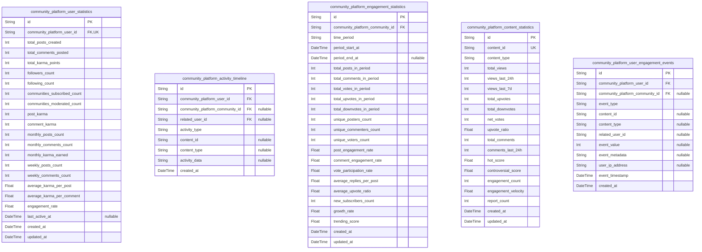

# Prisma Markdown

> Generated by [`prisma-markdown`](https://github.com/samchon/prisma-markdown)

- [Systematic](#systematic)
- [Actors](#actors)
- [Communities](#communities)
- [Subscriptions](#subscriptions)
- [Content](#content)
- [Engagement](#engagement)
- [Social](#social)
- [Notifications](#notifications)
- [Moderation](#moderation)
- [Analytics](#analytics)

## Systematic

### `community_platform_roles`

System-level user roles that define access control and permissions across
the entire platform. Represents the four core role types: Guest
(unauthenticated), Member (authenticated user), Moderator (community
manager), and Admin (platform administrator). These roles form the
foundation of the platform's authorization system and are referenced
throughout all domains.

Properties as follows:

- `id`: Primary Key
- `role_name`
  > Name of the platform role (Guest, Member, Moderator, Admin). Unique
  > identifier for the role that is referenced in access control decisions
  > throughout the platform.
- `role_description`
  > Detailed description of the role's purpose, capabilities, and use case.
  > Explains what actions users in this role can perform and what actions are
  > restricted.
- `display_order`
  > Display order for role listings in administrative interfaces. Used to
  > present roles in hierarchical order (Guest=1, Member=2, Moderator=3,
  > Admin=4) for UI presentation.
- `is_active`
  > Whether this role is currently active and available for assignment to
  > users. Inactive roles cannot be assigned to new users but may be retained
  > on existing accounts for data integrity.
- `created_at`
  > Timestamp when this role definition was created in the system (ISO 8601
  > UTC format). Used for audit trail and role history tracking.
- `updated_at`
  > Timestamp when this role definition was last modified (ISO 8601 UTC
  > format). Updated whenever role description, permissions, or status
  > changes.

### `community_platform_role_permissions`

Platform-level permissions that define what actions each role can perform
across the system. Establishes granular access control by mapping role
IDs to specific permissions (create_post, vote, moderate_content,
manage_users, etc.). This is the core authorization table that enforces
platform-wide security policies and role-based access control.

Properties as follows:

- `id`: Primary Key
- `community_platform_role_id`
  > Reference to the platform role this permission applies to. Foreign key to
  > [community_platform_roles.id](#community_platform_roles) that establishes which role is
  > granted this specific permission.
- `permission_key`
  > Machine-readable identifier for the permission (e.g., 'create_post',
  > 'vote_on_content', 'moderate_community', 'manage_users'). Used in
  > application code to check if a user has permission for an action.
- `permission_name`
  > Human-readable display name for this permission (e.g., 'Create Posts',
  > 'Vote on Content', 'Moderate Communities', 'Manage User Accounts'). Used
  > in administrative interfaces and documentation.
- `permission_description`
  > Detailed description of what this permission allows the role to do.
  > Explains the specific actions, scope, and any limitations or conditions
  > for this permission.
- `permission_category`
  > Category grouping related permissions (e.g., 'content_creation',
  > 'voting', 'moderation', 'user_management', 'system_administration').
  > Helps organize permissions in administrative interfaces.
- `is_active`
  > Whether this permission is currently active and enforced. Inactive
  > permissions cannot be checked but remain in database for audit trail and
  > historical records.
- `created_at`
  > Timestamp when this permission was created or assigned to the role (ISO
  > 8601 UTC format). Used for audit trail and tracking permission
  > assignments.
- `updated_at`
  > Timestamp when this permission assignment was last updated (ISO 8601 UTC
  > format). Modified when permission is activated/deactivated or its
  > definition changes.

## Actors

### `community_platform_users`

Core user account records representing authenticated members of the
platform. Stores essential authentication credentials, account status,
and creation metadata. Each user is the foundation for all platform
activities including posting, commenting, voting, and community
participation. This is the primary identity entity from which all other
user-related records reference.

Properties as follows:

- `id`: Primary Key.
- `email`
  > User's email address used for account login and communication. Must be in
  > valid RFC 5322 format and unique across the platform. This is the primary
  > authentication identifier.
- `password_hash`
  > Bcrypt-hashed password with salt rounds of 10 minimum. Never stores plain
  > text password. Used for authentication during login.
- `username`
  > Unique display name for the user (3-32 characters, alphanumeric with
  > underscore/hyphen). Used in @mentions and user profiles. Case-insensitive
  > uniqueness constraint enforced.
- `account_status`
  > Current status of the account. Valid values: 'active' (normal state),
  > 'suspended' (temporarily restricted by moderation), 'banned' (permanently
  > restricted), 'deleted' (user-requested deletion). Determines login and
  > posting eligibility.
- `email_verified`
  > Whether user has completed email verification. Required to be true before
  > accessing full posting/voting features. Users can still view content
  > while email_verified is false.
- `email_verified_at`
  > Timestamp when user completed email verification (UTC ISO 8601 format).
  > Null if email not yet verified. Used for audit trail and verification
  > tracking.
- `created_at`
  > Account creation timestamp in UTC ISO 8601 format. Immutable after
  > creation. Used for account age calculations and activity history.
- `updated_at`
  > Last modification timestamp in UTC ISO 8601 format. Updated whenever any
  > user record is modified. Used for audit trail tracking.
- `deleted_at`
  > Soft delete timestamp when user account was marked for deletion. Null if
  > account is active or non-deleted. Enables account recovery within grace
  > period (30 days).
- `last_login_at`
  > Timestamp of the user's most recent successful login. Null if user has
  > never logged in. Used to track activity and identify stale accounts.
- `failed_login_attempts`
  > Counter of consecutive failed login attempts (resets to 0 after
  > successful login). Used for account lockout after 5 failed attempts in 15
  > minutes.
- `locked_until`
  > Timestamp when account lockout expires (resets to null when user logs in
  > successfully or lockout period expires). Prevents login attempts during
  > lockout window.

### `community_platform_user_emails`

Email address records for users supporting email verification and
communication tracking. Stores verification tokens and status for email
confirmation workflow. Each user can have multiple email records for
managing email changes and verification history.

Properties as follows:

- `id`: Primary Key.
- `user_id`
  > Reference to the user this email belongs to. {@link
  > community_platform_users.id}
- `email`
  > Email address being verified. Must be in valid RFC 5322 format. Stored
  > for tracking multiple email addresses per user.
- `verified`
  > Whether this email address has been verified by the user clicking
  > verification link. False until user confirms ownership.
- `verification_token_hash`
  > SHA-256 hash of the verification token (never stores raw token). Used to
  > validate verification link clicks. Null after email is verified.
- `verification_token_expires_at`
  > Timestamp when verification token expires (24 hours after generation).
  > Null if email already verified. Prevents use of expired tokens.
- `verified_at`
  > Timestamp when email verification was completed (user clicked
  > verification link). Null until verified. Used for audit trail.
- `is_primary`
  > Whether this is the primary email for the user account. Only one email
  > per user should have is_primary=true. Used for login and communication.
- `created_at`
  > Timestamp when email record was created in UTC ISO 8601 format. Used for
  > tracking email history.
- `updated_at`
  > Last modification timestamp in UTC ISO 8601 format. Updated when
  > verification status changes.

### `community_platform_user_sessions`

User session records tracking active login sessions and authentication
tokens. Each session represents one login instance across devices. Used
for session management, logout, and detecting concurrent logins. Sessions
expire automatically after 30 days of inactivity.

Properties as follows:

- `id`: Primary Key.
- `user_id`: Reference to the authenticated user. [community_platform_users.id](#community_platform_users)
- `status`
  > Current session status. Valid values: 'active' (session is valid and can
  > be used), 'terminated' (user logged out), 'expired' (session timeout
  > after 30 days). Determines whether session can be used.
- `refresh_token_hash`
  > SHA-256 hash of the refresh token (never stores raw token). Used to
  > validate refresh token claims and prevent token reuse.
- `ip_address`
  > IP address from which session was created. Stored for security audit
  > trail and fraud detection. Used to identify suspicious access patterns.
- `user_agent`
  > User-Agent header from the login request. Identifies browser/device used
  > for login. Stored for security tracking and device identification.
- `created_at`
  > Timestamp when session was created (login occurred) in UTC ISO 8601
  > format. Used for session age calculation.
- `expires_at`
  > Timestamp when session will automatically expire (30 days after
  > creation). Sessions are automatically invalidated at this time. Used for
  > session timeout enforcement.
- `last_activity_at`
  > Timestamp of the last user activity in this session. Updated on each
  > request. Used to detect idle sessions and calculate inactivity duration.
- `terminated_at`
  > Timestamp when session was explicitly terminated by user logout or admin
  > action. Null while session is active. Enables session termination
  > tracking.

### `community_platform_user_profiles`

Extended user profile information including display name, biography,
avatar, and preference settings. Each user has one profile record
containing personalization data and account preferences. This is the main
profile entity that displays on user profile pages and in user info cards
throughout the platform.

Properties as follows:

- `id`: Primary Key.
- `user_id`: Reference to the user account. [community_platform_users.id](#community_platform_users)
- `display_name`
  > User's preferred display name (0-50 characters). Can differ from username
  > and may contain spaces/punctuation. Shown on profile and posts. Optional
  > field defaults to username if not set.
- `bio`
  > User's biography or about section (0-500 characters). Markdown formatting
  > supported. Displayed on user profile. Optional self-description field.
- `avatar_url`
  > URL to user's profile avatar image. Stored as URI. Null if no avatar
  > uploaded (shows default placeholder). Image should be 200x200 pixels for
  > optimal display.
- `avatar_thumbnail_url`
  > URL to small thumbnail version of avatar (50x50 pixels) for efficient
  > loading in lists and comments. Null if no avatar. Generated automatically
  > from uploaded avatar.
- `website_url`
  > Optional personal/professional website URL. Stored as URI and displayed
  > as clickable link on profile. User-provided, must start with http:// or
  > https://.
- `location`
  > User's location as free text (0-100 characters). Optional field for
  > geographic identification. May contain city, region, or country
  > information.
- `profile_visibility`
  > Profile visibility setting. Valid values: 'public' (visible to all
  > users), 'members_only' (visible to registered members only), 'private'
  > (visible only to self and admins). Controls who can view profile
  > information.
- `created_at`
  > Timestamp when profile record was created in UTC ISO 8601 format. Usually
  > same as user creation time.
- `updated_at`
  > Last modification timestamp in UTC ISO 8601 format. Updated whenever
  > profile information changes.

### `community_platform_user_karma`

User karma tracking and calculation records. Stores cumulative karma
scores, breakdown by posts vs comments, and historical karma changes.
Karma represents community-assigned reputation reflecting content
quality. This is the core reputation metric determining user status and
privileges on the platform.

Properties as follows:

- `id`: Primary Key.
- `user_id`: Reference to the user earning karma. [community_platform_users.id](#community_platform_users)
- `total_karma`
  > Total cumulative karma points earned by user (can be negative).
  > Calculated as sum of all post karma and comment karma. Updated in
  > real-time as votes arrive. No upper or lower limit.
- `post_karma`
  > Cumulative karma earned from posts only. Calculated as sum of (upvotes -
  > downvotes) on all user's posts. Updated when post votes change.
- `comment_karma`
  > Cumulative karma earned from comments only. Calculated as sum of (upvotes
  > - downvotes) on all user's comments. Updated when comment votes change.
- `karma_this_month`
  > Karma earned in the current calendar month (rolling monthly total). Reset
  > to zero on first day of each month. Trend metric for activity tracking.
- `karma_this_year`
  > Karma earned in the current calendar year (rolling yearly total). Reset
  > to zero on January 1st. Long-term activity metric.
- `karma_last_updated_at`
  > Timestamp when karma totals were last recalculated in UTC ISO 8601
  > format. Used to identify when karma calculations should be refreshed.
- `created_at`
  > Timestamp when karma record was created (same as user creation) in UTC
  > ISO 8601 format.
- `updated_at`
  > Last modification timestamp in UTC ISO 8601 format. Updated when karma
  > values change.

### `community_platform_user_reputation_levels`

User reputation level tiers based on karma achievements. Tracks which
reputation level badge the user has earned based on cumulative karma.
Reputation levels provide recognition and visual status on profiles and
posts. This is a denormalized view calculated from karma scores for
display efficiency.

Properties as follows:

- `id`: Primary Key.
- `user_id`
  > Reference to the user with this reputation level. {@link
  > community_platform_users.id}
- `current_level`
  > Current reputation level badge earned by user. Valid values: 'newcomer'
  > (1-99 karma), 'contributor' (100-499), 'active_member' (500-2499),
  > 'community_leader' (2500-9999), 'respected_elder' (10000-49999), 'legend'
  > (50000+). Automatically assigned based on total_karma.
- `level_achieved_at`
  > Timestamp when user first achieved current reputation level. Used to
  > track when level was reached and for achievement notifications.
- `previous_level`
  > Previous reputation level before current. Null if this is first level
  > achieved. Used to detect level progression and send achievement
  > notifications.
- `level_progress_percentage`
  > Percentage progress toward next reputation level (0-100). Calculated as
  > (current_karma - level_floor) / (level_ceiling - level_floor) * 100. Used
  > for progress bars on profile.
- `created_at`: Timestamp when reputation level record was created in UTC ISO 8601 format.
- `updated_at`
  > Last modification timestamp in UTC ISO 8601 format. Updated when karma
  > changes cause level changes.

### `community_platform_user_badges`

Achievement badges earned by users for specific accomplishments. Users
can earn multiple badges for milestones like first post, high engagement,
moderator status, or expert contributions. Badges are displayed on user
profiles and posts for recognition. This tracks earned achievements
beyond reputation levels.

Properties as follows:

- `id`: Primary Key.
- `user_id`
  > Reference to the user who earned this badge. {@link
  > community_platform_users.id}
- `badge_type`
  > Type/name of the badge earned. Valid values: 'verified_email',
  > 'first_post', 'commenter', 'post_master', 'discussion_star',
  > 'content_creator', 'decade_member', 'helpful', 'moderator', 'admin'.
  > Identifies which achievement was earned.
- `badge_name`
  > Human-readable display name for badge (e.g., 'Verified Contributor',
  > 'Post Master'). Shown to users on profiles and in achievement lists.
- `badge_description`
  > Description of what the badge represents and how to earn it (0-200
  > characters). Displayed in tooltip/hover information.
- `badge_icon_url`
  > URL to badge icon/image. Displayed next to badge name on profiles and
  > posts. Standard size 32x32 pixels.
- `earned_at`
  > Timestamp when user earned this badge in UTC ISO 8601 format. Used to
  > display achievement date and ordering on profiles.
- `created_at`: Timestamp when badge record was created in UTC ISO 8601 format.

### `community_platform_user_activity_history`

Complete audit trail of user actions on the platform. Records all user
activities including posts created, comments posted, votes cast,
communities joined, etc. This is a comprehensive activity log for user
statistics, timeline generation, and behavior analysis. Used to generate
user profile activity feeds and engagement metrics.

Properties as follows:

- `id`: Primary Key.
- `user_id`
  > Reference to the user performing the activity. {@link
  > community_platform_users.id}
- `activity_type`
  > Type of activity performed. Valid values: 'post_created',
  > 'comment_posted', 'vote_cast', 'community_subscribed', 'user_followed',
  > 'content_reported', 'account_login', 'password_changed', 'email_changed',
  > 'profile_updated'. Categorizes the activity.
- `content_type`
  > Type of content involved in activity (if applicable). Valid values:
  > 'post', 'comment', 'community', 'user', 'vote', null. Null for
  > non-content activities like login. Identifies what was acted upon.
- `content_id`
  > ID of the content involved in the activity (if applicable). Null for
  > activities not involving specific content. Used to link activity to
  > actual content for context.
- `community_id`
  > ID of the community context for the activity (if applicable). Null for
  > non-community activities. Used to group activities by community.
- `details`
  > Additional JSON details about the activity. Examples: vote type
  > (upvote/downvote), old/new values, action details. Stores structured
  > activity metadata.
- `ip_address`
  > IP address from which activity originated. Stored for security audit
  > trail and fraud detection.
- `created_at`
  > Timestamp when activity occurred in UTC ISO 8601 format. Used for
  > chronological ordering of activity timeline.

## Communities

### `community_platform_communities`

Represents individual communities on the platform. Each community is a
distinct space where members can create posts, comments, and engage in
discussions around a specific topic or theme. Communities have owners
(the creator), can be public or private, and contain metadata about their
purpose, rules, and settings.

Properties as follows:

- `id`: Primary Key.
- `community_creator_id`
  > Reference to the creator/owner of this community. The creator's {@link
  > community_platform_users.id}.
- `community_category_id`
  > Reference to the category this community belongs to. The category's
  > [community_platform_community_categories.id](#community_platform_community_categories).
- `name`
  > Unique community name (slug for URL). 3-32 characters, alphanumeric with
  > hyphens and underscores. Used in URLs like /c/community-name.
- `display_name`
  > Human-readable community name displayed to users. Can differ from the
  > slug (name field). Max 60 characters.
- `description`
  > Community description explaining its purpose and topic. 10-500
  > characters. Displayed on community page and in search results.
- `is_public`
  > Whether the community is public (visible to all, membership automatic) or
  > private (hidden, requires approval to join). Defaults to true.
- `icon_url`
  > URL to community icon/logo image. Optional visual identifier for the
  > community.
- `banner_url`
  > URL to community banner image. Optional header image displayed on
  > community page.
- `subscriber_count`
  > Denormalized count of total subscribers to this community. Updated when
  > members subscribe/unsubscribe. Used for sorting and trending
  > calculations.
- `post_count`
  > Denormalized count of total posts created in this community. Updated when
  > posts are created/deleted. Used for community statistics.
- `created_at`: Timestamp when this community was created. ISO 8601 UTC format.
- `updated_at`
  > Timestamp when this community was last updated (settings changed, etc.).
  > ISO 8601 UTC format.

### `community_platform_community_settings`

Stores configurable settings for each community including post type
restrictions, commenting policies, member requirements, and archival
settings. Allows moderators to customize how their community operates and
what content is allowed.

Properties as follows:

- `id`: Primary Key.
- `community_id`
  > Reference to the community these settings apply to. The community's
  > [community_platform_communities.id](#community_platform_communities).
- `allow_text_posts`: Whether text posts are allowed in this community. Default true.
- `allow_link_posts`: Whether link/URL posts are allowed in this community. Default true.
- `allow_image_posts`: Whether image posts are allowed in this community. Default true.
- `allow_comments`: Whether comments are enabled on posts in this community. Default true.
- `require_post_approval`
  > Whether new posts must be approved by moderators before appearing.
  > Default false.
- `require_comment_approval`
  > Whether new comments must be approved by moderators before appearing.
  > Default false.
- `min_karma_to_post`
  > Minimum karma required for members to create posts in this community. 0
  > means no requirement. Default 0.
- `min_account_age_days_to_post`
  > Minimum account age in days required to post in this community. 0 means
  > no requirement. Default 0.
- `min_karma_to_comment`
  > Minimum karma required for members to comment in this community. 0 means
  > no requirement. Default 0.
- `min_account_age_days_to_comment`
  > Minimum account age in days required to comment in this community. 0
  > means no requirement. Default 0.
- `post_archive_age_days`
  > Number of days after which posts become read-only (archived). Posts older
  > than this cannot receive votes or new comments. Default 180 (6 months).
- `spam_filter_sensitivity`
  > Spam filter sensitivity level. Values: 'low', 'medium', 'high'. Default
  > 'medium'. Controls automated spam detection.
- `created_at`: Timestamp when these settings were created. ISO 8601 UTC format.
- `updated_at`: Timestamp when these settings were last updated. ISO 8601 UTC format.

### `community_platform_community_rules`

Stores community-specific rules that define content standards and member
conduct expectations. Moderators create and manage rules to ensure
community standards are followed. Rules are displayed to members when
joining and referenced in moderation decisions.

Properties as follows:

- `id`: Primary Key.
- `community_id`
  > Reference to the community these rules apply to. The community's {@link
  > community_platform_communities.id}.
- `rule_number`
  > Ordinal position of this rule (1, 2, 3, etc.). Used for displaying rules
  > in consistent order.
- `title`
  > Short title of the rule (5-50 characters). Example: 'No harassment' or
  > 'Off-topic content prohibited'.
- `description`
  > Detailed description of the rule (10-500 characters). Explains what
  > behavior is prohibited and why.
- `enforcement_level`
  > Default enforcement approach for this rule. Values: 'warning',
  > 'temporary_removal', 'permanent_removal'. Can be overridden by
  > moderators.
- `created_at`: Timestamp when this rule was created. ISO 8601 UTC format.
- `updated_at`: Timestamp when this rule was last updated. ISO 8601 UTC format.

### `community_platform_community_categories`

Predefined categories that communities can be tagged with for
organization and discovery. System maintains a fixed list of categories
(Technology, Gaming, Sports, etc.) that help users find communities by
topic area.

Properties as follows:

- `id`: Primary Key.
- `name`
  > Category name (e.g., 'Technology', 'Gaming', 'Science'). 3-32 characters,
  > unique across all categories.
- `description`
  > Brief description of what communities belong in this category. Max 200
  > characters.
- `display_order`
  > Display order for presenting categories in UI lists. Lower numbers appear
  > first. Used for sorting category dropdowns.
- `icon_url`: Optional URL to category icon/image for visual identification.
- `created_at`: Timestamp when this category was created. ISO 8601 UTC format.

### `community_platform_moderators`

Tracks which users have moderator roles in which communities. Moderators
have elevated permissions to manage content, enforce rules, and maintain
community standards. Supports hierarchical roles (Moderator, Senior
Moderator, Community Owner) with different permission levels.

Properties as follows:

- `id`: Primary Key.
- `community_id`
  > Reference to the community this moderator manages. The community's {@link
  > community_platform_communities.id}.
- `user_id`
  > Reference to the user who is a moderator. The user's {@link
  > community_platform_users.id}.
- `role`
  > Moderator role level within this community. Values: 'moderator'
  > (standard), 'senior_moderator' (enhanced), 'community_owner' (full
  > control). Determines permissions.
- `appointed_at`
  > Timestamp when this user was appointed as moderator in this community.
  > ISO 8601 UTC format.
- `appointed_by_id`
  > User ID of the moderator who appointed this moderator. Tracks who made
  > the decision for audit purposes.

### `community_platform_moderator_permissions`

Defines what specific actions moderators with each role level can
perform. Maps moderator roles (moderator, senior_moderator,
community_owner) to specific permissions they have. Enables fine-grained
role-based access control.

Properties as follows:

- `id`: Primary Key.
- `role`
  > Moderator role this permission applies to. Values: 'moderator',
  > 'senior_moderator', 'community_owner'. Determines who can perform this
  > action.
- `permission`
  > Specific permission name. Examples: 'remove_post', 'warn_user',
  > 'ban_user', 'lock_thread', 'pin_post', 'edit_community_settings',
  > 'assign_moderator'. Controls what actions the role can take.
- `description`
  > Human-readable description of what this permission allows. Used for
  > documentation and UI display.

## Subscriptions

### `community_platform_community_subscriptions`

Tracks which users are subscribed to which communities. This is the
primary membership record establishing the user-community relationship.
When a user subscribes to a community, a record is created here. Users
can subscribe to multiple communities and communities can have thousands
of subscribers.

Properties as follows:

- `id`: Primary Key.
- `community_platform_user_id`
  > The user who is subscribed. Reference to {@link
  > community_platform_users.id}.
- `community_platform_community_id`
  > The community being subscribed to. Reference to {@link
  > community_platform_communities.id}.
- `subscription_status`
  > Status of the subscription: 'active' (normal member), 'muted' (receives
  > no notifications), 'archived' (hidden from list but can reactivate).
  > Subscription can transition between these states.
- `is_favorite`
  > Whether the member has marked this community as a favorite for easy
  > access and priority in feeds.
- `subscription_role`
  > Member's role in this community: 'member' (regular subscriber),
  > 'moderator' (can moderate), 'owner' (created or owns community).
  > Determines what actions they can perform.
- `created_at`
  > When the user subscribed to this community. Used for tracking membership
  > tenure and sorting 'oldest members first'.
- `updated_at`
  > When the subscription record was last modified (status change, role
  > change, etc.).
- `last_activity_at`
  > When the member last performed action in this community (post, comment,
  > vote, view). Used for engagement tracking and identifying active members.
- `notification_preferences`
  > JSON-encoded notification preferences for this community subscription:
  > digest frequency, content types to notify on, quiet hours, etc.

### `community_platform_community_members`

Alternative view of community membership with denormalized member
information for efficient querying and analytics. Stores member count
tracking and member statistics per community. Complementary to
subscriptions table, providing aggregated view of community membership
state.

Properties as follows:

- `id`: Primary Key.
- `community_platform_user_id`: The member user. Reference to [community_platform_users.id](#community_platform_users).
- `community_platform_community_id`: The community. Reference to [community_platform_communities.id](#community_platform_communities).
- `member_role`
  > Member's role in community: 'member', 'moderator', 'owner'. Denormalized
  > from subscription_role for quick access.
- `member_status`
  > Current status of the membership: 'active', 'suspended', 'banned'. Tracks
  > if member can participate.
- `posts_count`
  > Total posts created by this member in this community. Denormalized for
  > performance.
- `comments_count`
  > Total comments created by this member in this community. Denormalized for
  > analytics.
- `karma_in_community`
  > Total karma earned from posts and comments in this community.
  > Community-specific reputation metric.
- `joined_at`: When member joined this community. Used for tenure-based features.
- `last_active_at`
  > When member was last active in community (post, comment, vote). Tracks
  > engagement.
- `is_banned`
  > Whether this member is banned from the community. Banned members cannot
  > create content or interact.
- `ban_reason`: Reason for community ban if applicable. Explains why member was banned.
- `ban_expires_at`
  > When temporary ban expires. Null for permanent bans. Used for automatic
  > ban lifting.

### `community_platform_community_blocks`

Tracks users who have blocked other users within specific communities. A
blocked user cannot interact with the blocker in that community: cannot
message, cannot see content, cannot follow. This represents
community-level blocking separate from platform-wide blocking.

Properties as follows:

- `id`: Primary Key.
- `community_platform_blocker_user_id`
  > The user doing the blocking. Reference to {@link
  > community_platform_users.id}.
- `community_platform_blocked_user_id`: The user being blocked. Reference to [community_platform_users.id](#community_platform_users).
- `community_platform_community_id`
  > The community where the blocking applies. Reference to {@link
  > community_platform_communities.id}.
- `created_at`: When the block was initiated. Used for tracking block tenure and patterns.
- `block_reason`
  > User-provided reason for blocking (optional). Explains why the user
  > blocked another user.
- `is_active`
  > Whether this block is currently active. Allows for soft-deletion of
  > blocks.

### `community_platform_join_requests`

Tracks requests from users to join private communities. When a user
requests membership in a private community, a record is created here
pending moderator approval. Moderators review and accept or reject join
requests. Used for private community access control and membership
management.

Properties as follows:

- `id`: Primary Key.
- `community_platform_user_id`
  > The user requesting to join. Reference to {@link
  > community_platform_users.id}.
- `community_platform_community_id`
  > The private community being requested to join. Reference to {@link
  > community_platform_communities.id}.
- `reviewed_by_user_id`
  > The moderator who reviewed/approved/rejected this request. Reference to
  > [community_platform_users.id](#community_platform_users). Null while pending.
- `request_status`
  > Status of the join request: 'pending' (awaiting review), 'approved'
  > (accepted, user now member), 'rejected' (denied). Tracks the workflow
  > state.
- `request_message`
  > Optional message from requester explaining why they want to join. Maximum
  > 500 characters. Helps moderators decide.
- `created_at`
  > When the join request was submitted. Used for sorting requests by age and
  > enforcing review SLA.
- `reviewed_at`
  > When the request was reviewed (approved or rejected). Null while pending.
  > Used for tracking review time.
- `moderator_notes`
  > Notes from moderator reviewing the request. Explains decision to approve
  > or reject. Visible to requester.
- `rejection_reason`
  > Structured reason for rejection (if rejected): 'not_qualified',
  > 'community_full', 'rule_violation', 'other'. Helps user understand
  > decision.
- `expires_at`
  > When the request expires if not reviewed. Pending requests expire after
  > 30 days. Used for automatic cleanup.

## Content

### `community_platform_posts`

Represents user-created posts within communities. Posts are the primary
content type on the platform and can be text, links, or images. Each post
belongs to a community and author, tracks engagement metrics (views,
votes, comments), and maintains edit history.

Properties as follows:

- `id`: Primary Key.
- `community_platform_user_id`: Author of the post. Reference to [community_platform_users.id](#community_platform_users)
- `community_platform_community_id`
  > Community where the post was created. Reference to {@link
  > community_platform_communities.id}
- `title`: Post title (3-300 characters). Required for all post types.
- `post_type`
  > Type of post: 'text', 'link', or 'image'. Determines which content fields
  > are populated.
- `body_content`
  > Post body text (0-40,000 characters). Used for text posts, optional for
  > other types.
- `link_url`
  > External URL for link posts (HTTP/HTTPS only, max 2,000 characters).
  > Populated only for link posts.
- `link_domain`: Domain extracted from link_url for display and filtering purposes.
- `status`
  > Publication status: 'draft', 'published', 'archived', 'removed', or
  > 'deleted'. Controls visibility and functionality.
- `upvote_count`: Cached count of upvotes received. Updated in real-time as votes arrive.
- `downvote_count`: Cached count of downvotes received. Updated in real-time as votes arrive.
- `net_score`
  > Calculated score: upvote_count - downvote_count. Used for sorting and
  > ranking.
- `comment_count`
  > Cached count of root-level comments on this post. Updated when comments
  > are created or deleted.
- `view_count`
  > Number of unique user views of this post. Incremented once per user per
  > 24-hour period.
- `is_pinned`
  > Whether post is pinned by moderators. Pinned posts appear at top of
  > community feed.
- `is_locked`
  > Whether comments are disabled on this post. Locked posts remain visible
  > but cannot receive new comments.
- `is_removed`
  > Whether post was removed by moderators for policy violation. Soft delete
  > indicator.
- `removal_reason`
  > Reason for removal if is_removed=true. Category of policy violation
  > (spam, harassment, misinformation, etc.).
- `edit_count`
  > Number of times this post has been edited by the author. Incremented each
  > time post is modified.
- `created_at`
  > Timestamp when post was created (UTC). Used for sorting and age-based
  > algorithms.
- `edited_at`: Timestamp of most recent edit. Null if post has never been edited.
- `deleted_at`
  > Timestamp when post was soft-deleted by author. Null if post is active.
  > Used for soft delete recovery.
- `last_activity_at`
  > Timestamp of most recent vote or comment on this post. Used for hot
  > algorithm calculations.

### `community_platform_post_images`

Stores image files associated with image posts. One post can have
multiple images (up to 20). Each image record references the parent post
and stores file metadata, URLs, and dimensions for responsive delivery.

Properties as follows:

- `id`: Primary Key.
- `community_platform_post_id`
  > Post that contains this image. Reference to {@link
  > community_platform_posts.id}
- `image_order`
  > Display order of image within the post (1-based). Determines sequence in
  > carousel or grid.
- `image_url_full`: URL to full-resolution image (original size, up to 8000x8000 pixels).
- `image_url_medium`: URL to medium-sized image (800x800 pixels, optimized for post view).
- `image_url_thumbnail`: URL to thumbnail image (300x300 pixels, optimized for feed display).
- `image_width`: Original image width in pixels.
- `image_height`: Original image height in pixels.
- `image_format`
  > Image format (JPEG, PNG, GIF, WebP). All images stored internally as JPEG
  > for optimization.
- `image_size_bytes`: File size of original image in bytes. Used for bandwidth tracking.
- `caption`
  > Optional caption for this specific image (max 500 characters). Supports
  > markdown formatting.
- `created_at`: Timestamp when image was uploaded.

### `community_platform_comments`

Represents comments and nested replies on posts. Supports hierarchical
threading up to 10 levels deep. Each comment tracks engagement (votes,
edit history), parent relationships for nesting, and publication status.
Comments form the discussion backbone of the platform.

Properties as follows:

- `id`: Primary Key.
- `community_platform_post_id`
  > Post that this comment belongs to. Reference to {@link
  > community_platform_posts.id}
- `community_platform_user_id`: Author of the comment. Reference to [community_platform_users.id](#community_platform_users)
- `parent_comment_id`
  > Parent comment if this is a nested reply. Null for root-level comments.
  > Enables threaded discussion structure.
- `content`
  > Comment text content (1-10,000 characters). Supports markdown formatting
  > including code blocks.
- `nesting_depth`
  > Hierarchy level (1=root comment, 2=reply to root, max=10). Enforced to
  > prevent excessively deep threads.
- `upvote_count`: Cached count of upvotes received. Updated in real-time.
- `downvote_count`: Cached count of downvotes received. Updated in real-time.
- `net_score`
  > Calculated score: upvote_count - downvote_count. Used for sorting
  > comments.
- `status`
  > Publication status: 'published', 'removed', or 'deleted'. Controls
  > visibility.
- `is_removed`: Whether comment was removed by moderators. Soft delete indicator.
- `removal_reason`: Reason for removal if is_removed=true.
- `is_locked`
  > Whether replies to this comment are disabled. Locked comments remain
  > visible.
- `is_pinned`: Whether comment is pinned by moderator in its thread.
- `edit_count`: Number of times comment has been edited.
- `is_moderator_post`: Whether comment author is a moderator of the community. Shown with badge.
- `is_admin_post`: Whether comment author is a platform administrator. Shown with badge.
- `created_at`: Timestamp when comment was created.
- `edited_at`: Timestamp of most recent edit. Null if never edited.
- `deleted_at`: Timestamp when comment was soft-deleted by author. Null if active.

### `community_platform_post_edits`

Records historical edit history of posts for audit trail and change
tracking. Each edit entry captures the previous state before
modification. Allows reconstruction of edit timeline and detection of
suspicious patterns.

Properties as follows:

- `id`: Primary Key.
- `community_platform_post_id`: Post that was edited. Reference to [community_platform_posts.id](#community_platform_posts)
- `previous_title`: Post title before this edit. Captures state for comparison.
- `previous_body_content`: Post body content before this edit (for text posts only).
- `previous_link_url`: Post URL before this edit (for link posts only).
- `edit_number`
  > Sequential edit number (1st edit, 2nd edit, etc.). Used to maintain edit
  > order.
- `created_at`: Timestamp when this edit occurred.

### `community_platform_comment_edits`

Records historical edit history of comments for audit trail and change
tracking. Each edit entry captures the content state before modification.
Enables reconstruction of discussion evolution.

Properties as follows:

- `id`: Primary Key.
- `community_platform_comment_id`
  > Comment that was edited. Reference to {@link
  > community_platform_comments.id}
- `previous_content`: Comment content before this edit.
- `edit_number`: Sequential edit number (1st edit, 2nd edit, etc.).
- `created_at`: Timestamp when this edit occurred.

### `community_platform_content_views`

Tracks individual user views of posts for engagement metrics and view
count calculation. Records when users view posts with deduplication (one
view per user per 24 hours). Used for calculating view counts and
identifying engagement patterns.

Properties as follows:

- `id`: Primary Key.
- `community_platform_post_id`: Post that was viewed. Reference to [community_platform_posts.id](#community_platform_posts)
- `community_platform_user_id`: User who viewed the post. Reference to [community_platform_users.id](#community_platform_users)
- `created_at`
  > Timestamp when post was viewed. Used for deduplication (one per user per
  > 24 hours).

## Engagement

### `community_platform_votes`

Core voting records tracking all upvotes and downvotes on posts and
comments. This is the primary source of truth for community engagement
voting. Each record represents one user's vote on one piece of content
(post or comment). Users can change their vote (upvote to downvote) or
remove their vote entirely. Votes drive karma calculation and content
ranking algorithms (hot, top, controversial). The {@link
community_platform_users.id} user who votes, the voteable_type and
voteable_id identify what content received the vote.

Properties as follows:

- `id`: Primary Key.
- `voter_id`: User who cast this vote. References [community_platform_users.id](#community_platform_users).
- `voteable_type`
  > Type of content being voted on: 'post' or 'comment'. Determines whether
  > voteable_id references a post or comment.
- `voteable_id`
  > ID of the post or comment receiving the vote. Paired with voteable_type
  > to identify exact content.
- `vote_type`
  > Vote direction: 1 for upvote, -1 for downvote. Enables sorting by vote
  > direction and calculating net scores.
- `created_at`
  > When this vote was cast (ISO 8601 UTC). Used for vote velocity
  > calculations in hot algorithm.
- `updated_at`
  > When this vote was last updated (changed or revoked). Tracks vote change
  > history.

### `community_platform_vote_history`

Complete audit trail of all vote lifecycle events including creation,
changes (upvote to downvote conversions), and revocations. Enables
tracking of voting patterns, detecting manipulation, and providing
complete historical record. Records are append-only (never deleted). Each
entry captures the state at a point in time. {@link
community_platform_votes.id} is the current vote being tracked, and this
history preserves every change to it.

Properties as follows:

- `id`: Primary Key.
- `vote_id`
  > Reference to the vote being tracked in history. Links to {@link
  > community_platform_votes.id}.
- `event_type`
  > Type of event: 'created', 'changed', 'revoked'. Indicates what happened
  > to the vote.
- `previous_vote_type`
  > Vote type before this event (null for creation, 1/-1 for changes,
  > previous value for revocation). Enables detecting vote manipulation
  > patterns.
- `new_vote_type`
  > Vote type after this event (1/-1 for creation/change, null for
  > revocation). Null indicates vote was removed.
- `created_at`
  > When this history event was recorded (ISO 8601 UTC). Preserves complete
  > timeline of vote changes.

### `community_platform_karma_ledger`

Immutable transaction log of all karma changes for every user. Each entry
records one karma transaction: when user earns/loses karma, from what
source, and by how much. This is the authoritative source for calculating
user karma balances. Transactions are append-only (never deleted).
Enables accurate karma recalculation, identifies karma anomalies, and
provides audit trail. [community_platform_users.id](#community_platform_users) identifies the
user whose karma changed.

Properties as follows:

- `id`: Primary Key.
- `user_id`
  > User who earned or lost karma. References {@link
  > community_platform_users.id}.
- `transaction_type`
  > Source of karma change: 'upvote_received', 'downvote_received',
  > 'post_deleted', 'comment_deleted', 'achievement', 'milestone',
  > 'admin_adjustment'. Indicates why karma changed.
- `amount`
  > Amount of karma gained (positive) or lost (negative). Can be positive or
  > negative values.
- `reference_id`
  > ID of related object (post_id, comment_id, achievement_id, etc.)
  > depending on transaction_type. Enables tracing karma to source event.
- `reference_type`
  > Type of referenced object: 'post', 'comment', 'achievement', 'milestone',
  > 'adjustment'. Clarifies what reference_id refers to.
- `created_at`
  > When this karma transaction occurred (ISO 8601 UTC). Enables sequencing
  > transactions and identifying when karma changes occurred.

### `community_platform_karma_snapshots`

Point-in-time snapshots of user karma states, typically captured daily.
Preserves user's total karma value at specific moments, enabling
historical karma tracking, trend analysis, and reputation level history.
Snapshots are read-only after creation. {@link
community_platform_users.id} identifies the user whose karma was
snapshotted. Enables detection of rapid karma changes and analysis of
user activity patterns over time.

Properties as follows:

- `id`: Primary Key.
- `user_id`
  > User whose karma is being snapshotted. References {@link
  > community_platform_users.id}.
- `total_karma`
  > User's total karma at snapshot time. Sum of all karma ledger entries up
  > to snapshot_at timestamp.
- `post_karma`
  > Karma earned/lost from posts only. Sum of karma changes from
  > upvotes/downvotes on user's posts.
- `comment_karma`
  > Karma earned/lost from comments only. Sum of karma changes from
  > upvotes/downvotes on user's comments.
- `reputation_level`
  > User's reputation level at snapshot time based on total_karma: Newcomer
  > (1-99), Contributor (100-499), Active Member (500-2499), Community Leader
  > (2500-9999), Respected Elder (10000-49999), Legend (50000+).
- `snapshot_at`
  > When this snapshot was taken (ISO 8601 UTC). Typically once daily.
  > Enables tracking karma changes over time and detecting anomalies.
- `created_at`
  > When snapshot record was created. Same as snapshot_at for regular
  > snapshots.

### `community_platform_engagement_metrics`

Aggregated engagement statistics calculated daily from source events.
Tracks engagement metrics per user, per community, and per post for
efficient reporting and analytics. Includes vote statistics, activity
levels, growth metrics. Pre-calculated metrics enable fast analytics
queries without expensive aggregations. Records are refreshed daily, not
updated in-place. Used for trending algorithms, recommendations, and
engagement reports. [community_platform_users.id](#community_platform_users) for user metrics,
community_id for community metrics, voteable_id for post metrics.

Properties as follows:

- `id`: Primary Key.
- `metric_type`
  > Type of metric: 'user_engagement', 'community_engagement',
  > 'post_engagement'. Indicates what entity this metric measures.
- `entity_id`
  > ID of entity being measured: user_id, community_id, or post_id.
  > Identifies what this metric applies to.
- `posts_created`
  > Number of posts created (user) or published (community). For posts, this
  > is always 1 (the post itself).
- `comments_created`
  > Number of comments posted. For posts, total comments on the post. For
  > users, total comments by user. For communities, total comments in
  > community.
- `upvotes_received`
  > Total upvotes received on all user's posts/comments, or on community's
  > posts, or on this post.
- `downvotes_received`
  > Total downvotes received on all user's posts/comments, or on community's
  > posts, or on this post.
- `upvotes_given`: Number of upvotes user has cast. Only populated for user_engagement type.
- `downvotes_given`
  > Number of downvotes user has cast. Only populated for user_engagement
  > type.
- `views_count`: Number of times post was viewed. Only populated for post_engagement type.
- `engagement_score`
  > Calculated engagement metric: (upvotes * 1.0 + comments * 2.0 + views *
  > 0.1) / (age_in_days + 1). Higher score indicates more engagement.
- `period_date`
  > Date this metric represents (start of day in UTC). Metrics are calculated
  > daily.
- `created_at`
  > When this metric record was created (ISO 8601 UTC). Typically daily at
  > midnight UTC.

## Social

### `community_platform_user_follows`

User follow relationships enabling social networking and user discovery.
Records which users follow other users in an unidirectional manner.
Central to building social graphs, follow suggestions, and user
recommendations. Users can follow any other member and unfollow at any
time. Follow relationships are independent of community subscriptions and
represent direct social interest rather than community membership.

Properties as follows:

- `id`: Primary Key.
- `follower_id`: The user who is following. References [community_platform_users.id](#community_platform_users).
- `following_id`: The user being followed. References [community_platform_users.id](#community_platform_users).
- `created_at`: Timestamp when the follow relationship was created (ISO 8601 UTC).
- `relationship_status`
  > Status of the follow relationship: 'active' (normal follow), 'blocked'
  > (follower is blocked by following user), or 'inactive' (following user
  > account suspended/deleted). Determines if follow is functionally active.

### `community_platform_user_blocks`

User block relationships preventing interactions between users. When a
user blocks another user, the blocked user cannot view the blocker's
profile, activity, send direct messages, or interact with the blocker's
content. Blocks are unidirectional - user A can block user B without
affecting user B's ability to follow or interact unless user B separately
blocks user A. Critical for user safety, privacy protection, and
harassment prevention. Independent of community membership or follow
relationships.

Properties as follows:

- `id`: Primary Key.
- `blocker_id`
  > The user who initiated the block. References {@link
  > community_platform_users.id}.
- `blocked_id`: The user being blocked. References [community_platform_users.id](#community_platform_users).
- `created_at`: Timestamp when the block was created (ISO 8601 UTC).
- `reason`
  > Optional reason for the block provided by blocker (max 500 characters).
  > Can be null if no reason specified.
- `is_active`
  > Whether the block is currently active. When false, indicates block was
  > removed (unblock). Used for soft delete pattern to preserve block history
  > for audit purposes.

### `community_platform_mentions`

Records of user mentions (@username tags) in posts and comments. When a
user mentions another user using @username format in post or comment
content, this table tracks the mention relationship. Used for generating
mention notifications, tracking mention patterns, and maintaining mention
history. Supports the mention system enabling user tagging and user
discovery. Each mention is linked to the specific post or comment where
it occurred.

Properties as follows:

- `id`: Primary Key.
- `mentioned_user_id`
  > The user being mentioned with @ symbol. References {@link
  > community_platform_users.id}.
- `mentioning_user_id`
  > The user who created the mention by writing @username. References {@link
  > community_platform_users.id}.
- `content_id`
  > UUID of the post or comment containing the mention. References either
  > community_platform_posts.id or community_platform_comments.id depending
  > on content_type.
- `content_type`
  > Type of content containing the mention: 'post' (mention in post) or
  > 'comment' (mention in comment). Determines which content table to
  > reference.
- `created_at`
  > Timestamp when the mention was created (ISO 8601 UTC). Used for sorting
  > and filtering mention history.
- `notification_sent`
  > Whether a notification was sent to the mentioned user for this mention.
  > Tracks notification delivery status and prevents duplicate notifications.

## Notifications

### `community_platform_notifications`

Core notification records capturing all notification events sent to
users. Tracks what notification was sent, why it was sent, who triggered
it, and its status. Each record represents a single notification instance
delivered to a specific user.

Properties as follows:

- `id`: Primary Key
- `recipient_id`
  > User who receives this notification. Foreign key to {@link
  > community_platform_users.id}
- `trigger_user_id`
  > User who triggered this notification (who took the action causing
  > notification). Foreign key to [community_platform_users.id](#community_platform_users).
  > Nullable for system-generated notifications.
- `notification_type`
  > Type of notification (reply, mention, follow, moderator_action,
  > milestone, community_post, upvote). Enum values: reply, mention, follow,
  > moderator_action, milestone, community_post, upvote. Classifies the
  > notification for filtering and display.
- `related_content_id`
  > ID of the content (post, comment, or user) that this notification relates
  > to. Used with related_content_type to identify specific content
  > triggering notification. Nullable for system notifications.
- `related_content_type`
  > Type of related content (post, comment, user). Enum values: post,
  > comment, user. Indicates what type of resource related_content_id
  > references. Nullable if no specific content referenced.
- `notification_message`
  > Display text for the notification (max 200 characters). Short message
  > summarizing the notification event. Example: 'You received a new reply to
  > your post' or '[User] mentioned you in a comment'
- `notification_data`
  > JSON object storing additional context for different notification types.
  > Can include: content preview (first 100 chars), rule violated (for
  > moderator actions), ban duration (for suspensions), moderator note.
  > Stored as JSON string for database compatibility.
- `read_status`
  > Whether recipient has read this notification. True if read, false if
  > unread. Defaults to false. Updated when user views notification.
- `created_at`
  > Timestamp when notification was created (ISO 8601 UTC). System-managed,
  > never updated. Used for chronological ordering and pagination.
- `read_at`
  > Timestamp when notification was marked as read by recipient (ISO 8601
  > UTC). Nullable if notification not yet read. Set to current timestamp
  > when user views notification.
- `deleted_at`
  > Timestamp when notification was deleted by user (ISO 8601 UTC). Nullable
  > if notification not deleted. Uses soft delete pattern - notification
  > preserved in database for audit trail but excluded from user-facing
  > queries.
- `is_deleted`
  > Whether this notification has been soft-deleted by the user. True if
  > deleted, false if active. Used for filtering out deleted notifications
  > from queries. Defaults to false.

### `community_platform_notification_preferences`

User-specific notification settings controlling what types of
notifications are sent and how they are delivered. One preferences record
per user managing their complete notification configuration including
toggles, delivery methods, quiet hours, and per-community settings.

Properties as follows:

- `id`: Primary Key
- `user_id`
  > User who owns these notification preferences. Foreign key to {@link
  > community_platform_users.id}. One preferences record per user with unique
  > constraint.
- `reply_notifications_enabled`
  > Whether user receives notifications for replies to their posts and
  > comments. Default: true. When disabled, no reply notifications are sent.
- `mention_notifications_enabled`
  > Whether user receives notifications when mentioned with @username.
  > Default: true. When disabled, mentions do not trigger notifications.
- `follow_notifications_enabled`
  > Whether user receives notifications when someone follows them. Default:
  > false. When disabled, follow actions are silent.
- `moderator_action_notifications_enabled`
  > Whether user receives notifications about moderator actions (post
  > removal, warnings, suspensions). Default: true. Critical for user
  > awareness of violations.
- `community_post_notifications_enabled`
  > Whether user receives notifications for new posts in subscribed
  > communities. Default: false. When enabled, users get notified about new
  > posts they care about.
- `upvote_notifications_enabled`
  > Whether user receives notifications when their posts/comments receive
  > upvotes. Default: false. Milestone notifications (10, 100, 1000 upvotes)
  > sent separately.
- `milestone_notifications_enabled`
  > Whether user receives achievement notifications for milestones (1000
  > karma, 10000 karma, etc.). Default: false. Motivational notifications
  > about achievements.
- `delivery_method`
  > Primary delivery method for notifications (in_app, email, web_push). Enum
  > values: in_app (notifications appear in platform inbox), email (sent via
  > email), web_push (browser push notifications). In-app is always available
  > and cannot be disabled.
- `email_delivery_enabled`
  > Whether email notifications are enabled as delivery method. Default:
  > false. Independent toggle for email delivery.
- `web_push_delivery_enabled`
  > Whether web push notifications are enabled. Default: false. Requires
  > browser permission. Independent toggle for push delivery.
- `notification_frequency`
  > How often notifications are batched for delivery (instant, hourly_digest,
  > daily_digest, none). Enum values: instant (immediate), hourly_digest
  > (batched hourly), daily_digest (batched daily), none (no notifications
  > except critical). Affects when notifications are actually delivered.
- `quiet_hours_enabled`
  > Whether quiet hours are active. When true, notifications are suppressed
  > during quiet_hours_start to quiet_hours_end times. Default: false.
  > Respects user's requested silent periods.
- `quiet_hours_start`
  > Start time for quiet hours in HH:MM 24-hour format (e.g., '22:00' for 10
  > PM). Notifications not sent after this time. Nullable if quiet hours
  > disabled.
- `quiet_hours_end`
  > End time for quiet hours in HH:MM 24-hour format (e.g., '08:00' for 8
  > AM). Notifications resume after this time. Nullable if quiet hours
  > disabled. Can wrap midnight (e.g., 22:00 to 08:00).
- `timezone`
  > User's timezone (e.g., 'America/New_York', 'Europe/London',
  > 'Asia/Tokyo'). Used for calculating quiet hours and digest send times in
  > user's local timezone. Defaults to UTC if not set.
- `upvote_threshold`
  > Minimum upvotes required to trigger upvote notification (e.g., 10, 100,
  > 1000). Only notify after threshold reached. Reduces notification spam.
  > Default: 10 for standard thresholds.
- `per_community_settings`
  > JSON object storing per-community notification customization. Structure:
  > {community_id: {enabled: boolean, frequency: string}}. Allows disabling
  > notifications for specific communities while keeping them enabled
  > globally. Stored as JSON string.
- `created_at`
  > Timestamp when preferences record was created (ISO 8601 UTC). Set when
  > user account created or first preferences configured.
- `updated_at`
  > Timestamp when preferences were last updated (ISO 8601 UTC). Updated
  > whenever user changes any notification settings.

### `community_platform_notification_delivery_logs`

Audit trail of notification delivery attempts tracking when each
notification was delivered, how it was delivered, and the status of
delivery. Records each delivery attempt for every notification with
method and status for debugging failed deliveries and retry logic.

Properties as follows:

- `id`: Primary Key
- `notification_id`
  > Notification that was delivered. Foreign key to {@link
  > community_platform_notifications.id}. Multiple delivery log entries can
  > exist for same notification (retries).
- `delivery_method`
  > Method used to deliver this notification (in_app, email, web_push). Enum
  > values: in_app (added to notification inbox), email (sent via email
  > service), web_push (sent via push notification service). Shows which
  > channel was used.
- `delivery_status`
  > Current status of delivery attempt (pending, delivered, failed, bounced).
  > Enum values: pending (queued, not yet delivered), delivered (successfully
  > delivered), failed (delivery failed, will retry), bounced (email bounced,
  > won't retry). Tracks delivery state.
- `attempt_number`
  > Retry attempt number (1 = first attempt, 2 = first retry, etc.). Tracks
  > which attempt this is for the same notification. Used for exponential
  > backoff retry logic.
- `attempted_at`
  > Timestamp when this delivery attempt was made (ISO 8601 UTC). Used for
  > tracking when retry should occur and for display in audit logs.
- `delivered_at`
  > Timestamp when notification was successfully delivered (ISO 8601 UTC).
  > Nullable if delivery failed or still pending. Shows confirmation of
  > successful delivery.
- `error_message`
  > Error message if delivery failed (max 500 characters). Contains reason
  > for failure (email bounced, service unavailable, invalid token, etc.).
  > Nullable if delivery succeeded.
- `retry_count`
  > Number of retry attempts made or planned. Used for exponential backoff
  > (retry 1s, 2s, 4s, etc.). Maximum 3 retries before giving up. Tracks
  > total retry history.
- `next_retry_at`
  > Scheduled timestamp for next retry attempt (ISO 8601 UTC). Null if no
  > retry planned. Used by background job to determine when to retry.
- `delivery_provider`
  > External service used for delivery (e.g., 'sendgrid' for email,
  > 'firebase' for push, 'internal' for in-app). Helps track which provider
  > handled delivery and debug provider-specific issues.
- `provider_response`
  > Raw response from delivery provider for debugging (max 1000 characters).
  > Contains provider's status message or error details. Useful for
  > investigating failures with provider.
- `created_at`
  > Timestamp when delivery log entry was created (ISO 8601 UTC). Records
  > when attempt was logged. Used for audit trail ordering.

## Moderation

### `community_platform_reports`

Content reporting system for community safety. Users submit reports when
they encounter content violating platform policies or community rules.
Reports track reporter identity, reported content (post/comment), reason,
and moderation status throughout the review workflow.

Properties as follows:

- `id`: Primary Key.
- `reporter_id`: User who submitted the report. [community_platform_users.id](#community_platform_users)
- `reported_content_id`
  > ID of post or comment being reported. Can reference either posts or
  > comments table depending on content_type field.
- `community_id`
  > Community where reported content exists. {@link
  > community_platform_communities.id}
- `content_type`: Type of content being reported: 'post' or 'comment'
- `report_reason`
  > Primary reason for reporting: spam, harassment, misinformation,
  > hate_speech, violence, sexual_content, illegal_activity, ip_violation,
  > community_rule, other
- `reporter_details`
  > Optional detailed explanation from reporter about why content is being
  > reported (max 1000 characters)
- `report_status`
  > Current status of report: submitted, in_review, escalated, action_taken,
  > dismissed, closed. Tracks report lifecycle.
- `severity_level`
  > Report severity classification: critical (CSAM, threats), high (hate
  > speech, harassment), medium (spam, violations), low (borderline cases).
  > Determines review priority.
- `moderator_notes`
  > Notes from moderator during review process about assessment, decision
  > reasoning, or context considerations
- `appeal_submitted`: Whether an appeal has been submitted for this report decision
- `created_at`: When report was submitted (UTC timestamp)
- `first_review_at`: When moderator first claimed report for review
- `resolved_at`: When report received final resolution (action taken or dismissed)
- `closed_at`: When report was closed with final status

### `community_platform_moderation_actions`

Records of all moderation actions taken by moderators and administrators.
Tracks what action was taken (remove content, warn user, suspend, ban),
by whom, when, and the reason. Enables audit trail and appeals process.
Actions are reviewed to ensure consistency and prevent abuse.

Properties as follows:

- `id`: Primary Key.
- `report_id`: Report that triggered this action. [community_platform_reports.id](#community_platform_reports)
- `moderator_id`
  > User who performed the moderation action. {@link
  > community_platform_users.id}
- `affected_user_id`
  > User affected by moderation action (content creator, warned user, banned
  > user). [community_platform_users.id](#community_platform_users)
- `community_id`
  > Community where action was taken. {@link
  > community_platform_communities.id}
- `content_id`
  > ID of post or comment that was actioned (removed, warned, etc.).
  > References post or comment depending on content_type.
- `action_type`
  > Type of moderation action taken: remove_content, warn_user, suspend_user,
  > ban_user, lock_thread, pin_post, add_warning_label, restore_content
- `content_type`
  > Type of content actioned: 'post', 'comment', or 'user' (for account-level
  > actions)
- `action_reason`
  > Why action was taken: specific policy or rule violated. Examples: 'spam',
  > 'harassment', 'misinformation', 'hate_speech'
- `action_details`
  > Additional context about the action: removal reason for removed content,
  > warning text for warnings, suspension duration in hours for suspensions
- `moderator_notes`
  > Internal moderator notes documenting decision reasoning and any
  > mitigating circumstances considered
- `suspension_duration_hours`
  > For temporary suspensions: hours until user can post again. NULL for
  > permanent bans or non-suspension actions.
- `action_status`
  > Current status of action: active, reversed, expired (for time-limited
  > actions). Tracks whether action is still in effect.
- `created_at`: When moderation action was taken (UTC timestamp)
- `expires_at`
  > When time-limited action expires (for temporary suspensions). NULL for
  > permanent actions.
- `reversed_at`
  > When action was reversed or overturned (due to appeal or admin review).
  > NULL if action never reversed.

### `community_platform_content_removals`

Details of removed content (posts and comments). Stores original content
that was removed by moderators, reason for removal, removing moderator,
and restoration capability. Enables audit trail, appeals process, and
content recovery if removal was in error.

Properties as follows:

- `id`: Primary Key.
- `moderation_action_id`
  > Associated moderation action that caused removal. {@link
  > community_platform_moderation_actions.id}
- `content_id`
  > ID of removed post or comment. References either posts or comments table
  > depending on content_type.
- `community_id`
  > Community containing removed content. {@link
  > community_platform_communities.id}
- `moderator_id`: Moderator who removed the content. [community_platform_users.id](#community_platform_users)
- `content_type`: Type of removed content: 'post' or 'comment'
- `original_content`
  > Full original text of removed content (preserved for audit and potential
  > restoration)
- `removal_reason`
  > Why content was removed: policy violation category (spam, harassment,
  > misinformation, hate_speech, etc.)
- `removal_notes`
  > Detailed explanation from moderator about why removal was necessary and
  > policy cited
- `removal_status`
  > Current status: removed (hidden from public), restored (made visible
  > again), or permanently_deleted (hard delete after appeal period)
- `is_appealed`: Whether content author has appealed this removal decision
- `created_at`: When content was removed (UTC timestamp)
- `restored_at`
  > When content was restored (if appealed and removal was overturned). NULL
  > if never restored.

### `community_platform_user_warnings`

Official warnings issued to users for policy violations. Tracks warnings
progressively: accumulation of warnings can lead to temporary
restrictions, suspensions, or permanent bans. Warnings age out after 6
months unless new violations occur. Enables progressive discipline and
user behavior tracking.

Properties as follows:

- `id`: Primary Key.
- `user_id`: User who received the warning. [community_platform_users.id](#community_platform_users)
- `moderator_id`: Moderator who issued the warning. [community_platform_users.id](#community_platform_users)
- `community_id`
  > Community where violation occurred (for community-specific warnings).
  > NULL for platform-wide warnings. {@link
  > community_platform_communities.id}
- `related_content_id`
  > Post or comment that prompted the warning. References either posts or
  > comments depending on content_type.
- `content_type`
  > Type of content that prompted warning: 'post', 'comment', or 'user' (for
  > account-level behavior)
- `violation_reason`
  > Reason for warning: policy or rule violated. Examples: 'spam',
  > 'harassment', 'misinformation', 'community_rule_violation'
- `warning_text`
  > Detailed explanation of what policy was violated and why warning was
  > issued
- `warning_scope`
  > Whether warning applies to: 'community' (single community only) or
  > 'platform' (entire platform)
- `is_active`
  > Whether warning is currently active. Warnings age out after 6 months (set
  > to false) unless additional violations occur.
- `appeal_submitted`: Whether user has submitted an appeal of this warning
- `created_at`: When warning was issued (UTC timestamp)
- `expires_at`
  > When warning expires (ages out after 6 months). After this date, warning
  > is considered inactive for discipline purposes.

### `community_platform_moderation_appeals`

Appeals submitted by users to contest moderation decisions (removed
content, warnings, suspensions, bans). Tracks appeal submission, evidence
provided, reviewer decision, and outcome. Enables fair review process and
reversal of incorrect moderation actions.

Properties as follows:

- `id`: Primary Key.
- `appellant_id`: User appealing the decision. [community_platform_users.id](#community_platform_users)
- `original_action_id`
  > Moderation action being appealed. {@link
  > community_platform_moderation_actions.id}
- `original_warning_id`: User warning being appealed. [community_platform_user_warnings.id](#community_platform_user_warnings)
- `original_removal_id`
  > Content removal being appealed. {@link
  > community_platform_content_removals.id}
- `appeal_reviewer_id`
  > Moderator or admin who reviewed the appeal (different from original
  > moderator). [community_platform_users.id](#community_platform_users)
- `appeal_grounds`
  > Reason for appeal: moderator_error, policy_misinterpretation,
  > insufficient_context, new_evidence, unfair_bias, other
- `appeal_explanation`
  > Appellant's detailed explanation of why decision should be overturned
  > (max 1000 characters)
- `appeal_evidence`
  > New evidence or documentation provided by appellant to support appeal
  > (URLs, context, clarifications)
- `appeal_status`
  > Current status of appeal: submitted (awaiting review), under_review,
  > accepted (decision reversed), denied (decision upheld), closed
- `appeal_decision`
  > Decision on appeal: accepted (reverse original action), denied (uphold
  > original action), or null if not yet reviewed
- `appeal_decision_reason`: Explanation from appeal reviewer about why appeal was accepted or denied
- `created_at`: When appeal was submitted (UTC timestamp)
- `reviewed_at`: When appeal was reviewed and decision made. NULL if not yet reviewed.

### `community_platform_moderation_audit_log`

Complete immutable audit log of all moderation system activities for
accountability and transparency. Tracks every action, decision, appeal,
status change with timestamps and actor. Enables pattern detection,
moderator performance review, and policy enforcement verification.
Critical for legal compliance and dispute resolution.

Properties as follows:

- `id`: Primary Key.
- `actor_id`
  > User who performed the logged action (moderator, admin, or system).
  > [community_platform_users.id](#community_platform_users)
- `report_id`
  > Report involved in this log entry (if applicable). {@link
  > community_platform_reports.id}
- `moderation_action_id`
  > Moderation action involved in this log entry (if applicable). {@link
  > community_platform_moderation_actions.id}
- `appeal_id`
  > Appeal involved in this log entry (if applicable). {@link
  > community_platform_moderation_appeals.id}
- `event_type`
  > Type of moderation event: report_submitted, report_claimed, action_taken,
  > appeal_submitted, appeal_reviewed, content_restored, warning_issued,
  > user_suspended, etc.
- `entity_type`: Type of entity involved: report, action, warning, appeal, user, content
- `entity_id`: ID of primary entity involved in this event
- `action_description`
  > Human-readable description of what happened: 'Report #123 submitted by
  > user', 'Moderator removed post #456', etc.
- `status_before`: Status of entity before this action (for state changes)
- `status_after`: Status of entity after this action (for state changes)
- `metadata`
  > Additional context stored as JSON: {moderator_id, content_id, reason,
  > duration, etc}
- `ip_address`: IP address of user performing action (for audit trail security)
- `created_at`: When event was logged (UTC timestamp, immutable)

## Analytics

### `community_platform_user_statistics`

Aggregated user statistics for dashboard and profile display. Contains
denormalized metrics (total posts, comments, karma, followers) calculated
from operational data. Updated periodically (hourly or daily) via
background jobs to avoid transactional impact. Enables rapid statistics
access without expensive aggregations on every profile view.

Properties as follows:

- `id`: Primary Key.
- `community_platform_user_id`
  > Reference to the user whose statistics are tracked. {@link
  > community_platform_users.id}
- `total_posts_created`
  > Total number of posts created by this user across all communities
  > (lifetime count). Updated when posts are created or deleted.
- `total_comments_posted`
  > Total number of comments posted by this user across all posts (lifetime
  > count). Updated when comments are created or deleted.
- `total_karma_points`
  > Total cumulative karma score from all posts and comments. Can be
  > negative. Matches sum of upvotes minus downvotes on all user content.
- `followers_count`
  > Total number of users following this user. Derived from
  > community_platform_user_follows table where following_user_id = this
  > user.
- `following_count`
  > Total number of users this user is following. Derived from
  > community_platform_user_follows table where follower_user_id = this user.
- `communities_subscribed_count`
  > Total number of communities this user has subscribed to. Derived from
  > community_platform_community_subscriptions.
- `communities_moderated_count`
  > Total number of communities this user is a moderator for. Derived from
  > community_platform_moderators.
- `post_karma`
  > Karma earned specifically from posts (sum of net votes on posts). Subset
  > of total_karma_points.
- `comment_karma`
  > Karma earned specifically from comments (sum of net votes on comments).
  > Subset of total_karma_points.
- `monthly_posts_count`: Number of posts created in the last 30 days. Used for activity trending.
- `monthly_comments_count`: Number of comments posted in the last 30 days. Used for activity trending.
- `monthly_karma_earned`
  > Net karma earned in the last 30 days (can be negative). Shows recent
  > engagement quality.
- `weekly_posts_count`
  > Number of posts created in the last 7 days. Used for short-term activity
  > assessment.
- `weekly_comments_count`
  > Number of comments posted in the last 7 days. Used for short-term
  > activity assessment.
- `average_karma_per_post`
  > Average net karma earned per post (total_post_karma /
  > total_posts_created). Indicates post quality. 0 if no posts.
- `average_karma_per_comment`
  > Average net karma earned per comment (total_comment_karma /
  > total_comments_posted). Indicates comment quality. 0 if no comments.
- `engagement_rate`
  > Percentage of views that result in interactions (votes, comments). Ranges
  > 0-100. Calculated as (interactions / total_views) * 100.
- `last_active_at`
  > Timestamp of user's most recent activity (post, comment, vote, login).
  > Used for activity status indication.
- `created_at`
  > Timestamp when statistics record was first created (matches user account
  > creation).
- `updated_at`
  > Timestamp of last statistics update. Updated by background jobs that
  > recalculate metrics (hourly or daily).

### `community_platform_activity_timeline`

Chronological log of user activities for activity feed and timeline
display. Append-only pattern where new records are added but rarely
modified or deleted. Tracks user actions (posts, comments, votes,
follows, subscriptions) with full context. Optimized for displaying user
activity history on profiles and in notification systems.

Properties as follows:

- `id`: Primary Key.
- `community_platform_user_id`: User who performed the action. [community_platform_users.id](#community_platform_users)
- `community_platform_community_id`
  > Community where action occurred (if applicable). Null if action is not
  > community-specific. [community_platform_communities.id](#community_platform_communities)
- `related_user_id`
  > Other user involved in action if applicable (e.g., followed user in
  > follow action, mentioned user in mention action). Null if action only
  > involves self. [community_platform_users.id](#community_platform_users)
- `activity_type`
  > Type of activity: 'post_created', 'comment_posted', 'comment_reply',
  > 'post_voted', 'comment_voted', 'user_followed', 'community_subscribed',
  > 'community_moderated', 'post_edited', 'comment_edited'. Used for
  > filtering and categorizing activities.
- `content_id`
  > ID of the content involved (post or comment ID). Null if activity doesn't
  > involve specific content (e.g., follow action).
- `content_type`
  > Type of content: 'post' or 'comment'. Null if activity doesn't involve
  > specific content.
- `activity_data`
  > JSON object containing activity-specific metadata: for posts (title,
  > first 100 chars of body), for comments (first 100 chars), for votes
  > (vote_type: 'upvote'/'downvote'), for follows (followed_user_username).
  > Enables rich activity display without additional queries.
- `created_at`
  > Timestamp when activity occurred (ISO 8601 UTC). Immutable after
  > creation. Used for chronological ordering and historical analysis.

### `community_platform_engagement_statistics`

Aggregated engagement metrics for communities and time periods. Tracks
engagement rates, participation patterns, and interaction quality. Used
by discovery and recommendation systems to identify trending content and
engaging communities. Updated periodically (every hour or daily) from
vote and interaction data. Enables efficient trending queries without
scanning millions of votes.

Properties as follows:

- `id`: Primary Key.
- `community_platform_community_id`
  > Community these engagement statistics apply to. {@link
  > community_platform_communities.id}
- `time_period`
  > Time period for this aggregation: 'hourly', 'daily', 'weekly', 'monthly',
  > 'all_time'. Used to track trends across different time horizons.
- `period_start_at`
  > Start timestamp of the time period covered by these statistics (ISO 8601
  > UTC). For 'all_time', this is community creation timestamp.
- `period_end_at`
  > End timestamp of the time period covered by these statistics (ISO 8601
  > UTC). For 'all_time', this is null.
- `total_posts_in_period`
  > Total posts created in community during this period. Used for growth
  > trending.
- `total_comments_in_period`
  > Total comments posted in community during this period. Used for
  > discussion activity metrics.
- `total_votes_in_period`
  > Total votes (upvotes + downvotes) cast on posts and comments in community
  > during period. Measures participation.
- `total_upvotes_in_period`
  > Total upvotes in community during period. Indicates approval/positive
  > sentiment.
- `total_downvotes_in_period`
  > Total downvotes in community during period. Indicates
  > disapproval/disagreement.
- `unique_posters_count`
  > Number of unique users who posted in community during period. Indicates
  > community participation breadth.
- `unique_commenters_count`
  > Number of unique users who commented in community during period. Shows
  > discussion participation.
- `unique_voters_count`
  > Number of unique users who voted during period. Shows engagement
  > participation.
- `post_engagement_rate`
  > Percentage of posts that received engagement (comments or votes):
  > (posts_with_engagement / total_posts) * 100. Ranges 0-100. Indicates post
  > quality and relevance.
- `comment_engagement_rate`
  > Percentage of comments that received votes: (voted_comments /
  > total_comments) * 100. Ranges 0-100. Shows comment quality.
- `vote_participation_rate`
  > Percentage of community members who voted during period: (unique_voters /
  > total_members) * 100. Ranges 0-100. High rates indicate engaged
  > community.
- `average_replies_per_post`
  > Average number of comments per post in period. Shows discussion depth. 0
  > if no posts.
- `average_upvote_ratio`
  > Average upvote to total vote ratio: upvotes / (upvotes + downvotes).
  > Ranges 0-1. Indicates community sentiment positivity.
- `new_subscribers_count`
  > Number of new community subscriptions during period. Shows community
  > growth.
- `growth_rate`
  > Subscriber growth rate in period: (new_subscribers /
  > total_subscribers_at_period_start) * 100. Used for trending calculation.
- `trending_score`
  > Calculated trending score combining growth rate, engagement rate, and
  > post velocity. Higher = more trending. Used for community
  > recommendations.
- `created_at`: Timestamp when statistics record was created. Immutable.
- `updated_at`
  > Timestamp of last update. Updated only when new period completes or
  > recalculation needed.

### `community_platform_content_statistics`

Performance metrics for individual posts and comments. Tracks views,
engagement, and algorithmic scores (hot, top, controversial).
Denormalized from votes and view data for efficient sorting and
discovery. Updated as content receives votes or views. Enables ranking
without recalculating scores on every query.

Properties as follows:

- `id`: Primary Key.
- `content_id`
  > ID of the post or comment these statistics apply to. Non-nullable.
  > References either community_platform_posts or
  > community_platform_comments.
- `content_type`
  > Type of content: 'post' or 'comment'. Indicates which table content_id
  > references.
- `total_views`
  > Total number of times this content has been viewed by unique users.
  > Incremented when content detail page is loaded.
- `views_last_24h`
  > Number of views in last 24 hours. Used for trending and velocity
  > calculation.
- `views_last_7d`
  > Number of views in last 7 days. Shows content longevity and continued
  > interest.
- `total_upvotes`: Total upvotes received. Core metric for ranking and recommendation.
- `total_downvotes`: Total downvotes received. Indicates disapproval or low quality.
- `net_votes`
  > Calculated: upvotes - downvotes. Primary ranking metric for top and
  > controversial sorts.
- `upvote_ratio`
  > Ratio of upvotes to total votes: upvotes / (upvotes + downvotes). Ranges
  > 0-1. Shows community sentiment.
- `total_comments`
  > Total number of comments/replies on this content. Shows discussion
  > activity.
- `comments_last_24h`: Number of new comments in last 24 hours. Shows ongoing engagement.
- `hot_score`
  > Cached hot algorithm score: (net_votes / hours_old^1.8) *
  > engagement_multiplier. Used for ranking in hot sort without
  > recalculation.
- `controversial_score`
  > Cached controversial algorithm score: min(upvotes, downvotes) * 2 +
  > abs(upvotes - downvotes). High when votes are polarized.
- `engagement_count`
  > Total engagement: upvotes + downvotes + comments. Measures total
  > interaction.
- `engagement_velocity`
  > Engagement per hour since creation: engagement_count /
  > hours_since_creation. High velocity indicates trending/viral potential.
- `report_count`
  > Number of reports filed on this content. Indicates potential violations
  > or quality issues.
- `created_at`
  > Timestamp when statistics record was created (typically matches content
  > creation).
- `updated_at`
  > Timestamp of last statistics update. Updated when votes, views, or
  > comments change.

### `community_platform_user_engagement_events`

Detailed event log for analytics and BI system integration. Immutable
append-only event records tracking user interactions (posts, votes,
comments, follows, subscriptions). Each row represents a single user
action. Designed for data warehouse ingestion, historical analysis, and
trending detection. Never updated or deleted (except hard delete for
GDPR). Enables replaying user activity timeline and computing custom
analytics metrics.

Properties as follows:

- `id`: Primary Key.
- `community_platform_user_id`
  > User who performed the engagement action. {@link
  > community_platform_users.id}
- `community_platform_community_id`
  > Community where engagement occurred (if applicable). Null for user
  > actions that aren't community-specific (e.g., user follow). {@link
  > community_platform_communities.id}
- `event_type`
  > Type of engagement event: 'post_created', 'comment_posted',
  > 'post_upvoted', 'post_downvoted', 'comment_upvoted', 'comment_downvoted',
  > 'user_followed', 'community_subscribed', 'mention_sent',
  > 'report_submitted', 'content_viewed'. Used for filtering and categorizing
  > events.
- `content_id`
  > ID of content involved (post or comment). Null if event doesn't involve
  > specific content.
- `content_type`: Type of content: 'post', 'comment', or null if not applicable.
- `related_user_id`
  > ID of other user involved in event (e.g., followed user in follow event,
  > mentioned user in mention event). Null if only one user involved. {@link
  > community_platform_users.id}
- `event_value`
  > Numeric value associated with event if applicable. For votes: 1 (upvote)
  > or -1 (downvote). For views: 1 per view. For karma changes: actual karma
  > delta. 0 or null if not applicable.
- `event_metadata`
  > JSON object containing additional context: for posts (title, preview),
  > for votes (vote_type), for follows (followed_username), for reports
  > (report_reason). Enables rich event analysis without additional queries.
- `user_ip_address`
  > IP address of user when event occurred. Used for fraud detection and user
  > behavior analysis. Masked for privacy (last octet zero).
- `event_timestamp`
  > Exact timestamp when engagement event occurred (ISO 8601 UTC). Immutable.
  > Used for precise event ordering and time-series analysis.
- `created_at`
  > Timestamp when event record was created in database (may be shortly after
  > event_timestamp). Immutable.
