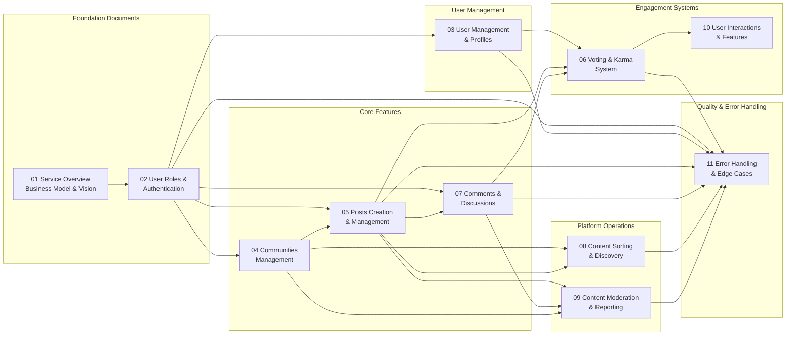
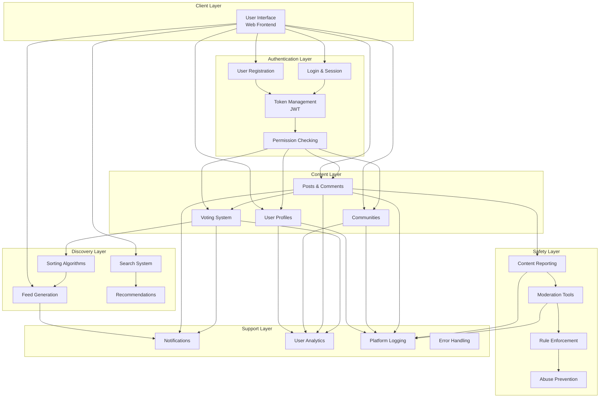

# Community Platform - Requirements Analysis Report

## Document Overview

Welcome to the comprehensive requirements specification for the **Community Platform**, a modern Reddit-like social community application. This documentation suite defines the complete business requirements, user workflows, technical specifications, and operational guidelines for building a scalable community engagement platform.

### Purpose of This Documentation

This table of contents document serves as the primary navigation hub for the entire requirements specification. It provides:
- An overview of the complete project scope and vision
- Navigation to all detailed requirement documents
- Summary of key features and their relationships
- Quick reference to user roles and permissions
- Understanding of how different system components interact

### How to Use This Documentation

**For Backend Developers:** Start with the [Service Overview Document](./01-service-overview.md) to understand the business context, then proceed through [User Roles and Authentication](./02-user-roles-authentication.md) before diving into feature-specific documents.

**For Project Managers:** Review this overview, then the [Service Overview](./01-service-overview.md) for business justification, and [Communities Management](./04-communities-management.md) for feature scope.

**For Product and QA Teams:** Review the [Key Features Summary](#key-features-summary) section below, then reference specific feature documents as needed.

---

## Documentation Structure

### Document Map and Relationships

The following diagram illustrates how all requirements documents connect and build upon each other:

### Reading Order Recommendation

**Phase 1 - Foundation (Required First)**
1. [Service Overview Document](./01-service-overview.md) - Understand why this platform exists
2. [User Roles and Authentication](./02-user-roles-authentication.md) - Foundation for all access control

**Phase 2 - Core User Features**
3. [User Management and Profiles](./03-user-management-profiles.md) - User account and profile system
4. [Communities Management](./04-communities-management.md) - Community creation and organization

**Phase 3 - Content Management**
5. [Posts Creation and Management](./05-posts-creation-management.md) - Post types and lifecycle
6. [Comments and Discussions](./07-comments-discussions.md) - Discussion threading
7. [Voting and Karma System](./06-voting-karma-system.md) - Engagement mechanics

**Phase 4 - Discovery and Operations**
8. [Content Sorting and Discovery](./08-content-sorting-discovery.md) - Feed generation and search
9. [Content Moderation and Reporting](./09-content-moderation-reporting.md) - Safety and enforcement

**Phase 5 - Advanced Features**
10. [User Interactions and Features](./10-user-interactions-features.md) - Notifications and social features

**Phase 6 - Quality and Resilience**
11. [Error Handling and Edge Cases](./11-error-handling-edge-cases.md) - Validation and error management

### Document Descriptions and Access

| Document | Type | Purpose | Audience |
|----------|------|---------|----------|
| [01 Service Overview](./01-service-overview.md) | Service Overview | Business justification, market analysis, and success metrics | Business stakeholders, Product managers |
| [02 User Roles & Authentication](./02-user-roles-authentication.md) | Requirements | Authentication flows, role definitions, and permission matrices | Backend developers, Security team |
| [03 User Management & Profiles](./03-user-management-profiles.md) | User Stories | User profile system, karma calculation, and account settings | Backend developers, Product managers |
| [04 Communities Management](./04-communities-management.md) | Requirements | Community creation, moderation, and subscription management | Backend developers, Community managers |
| [05 Posts Creation & Management](./05-posts-creation-management.md) | Requirements | Post types, content validation, and lifecycle management | Backend developers |
| [06 Voting & Karma System](./06-voting-karma-system.md) | Requirements | Voting mechanics, karma calculation, and reputation system | Backend developers, Analytics team |
| [07 Comments & Discussions](./07-comments-discussions.md) | Requirements | Comment threading, sorting, and discussion management | Backend developers |
| [08 Content Sorting & Discovery](./08-content-sorting-discovery.md) | Requirements | Feed algorithms, search, and content discovery | Backend developers, Analytics team |
| [09 Content Moderation & Reporting](./09-content-moderation-reporting.md) | Requirements | Reporting workflows, moderation actions, and rule enforcement | Backend developers, Moderators, Safety team |
| [10 User Interactions & Features](./10-user-interactions-features.md) | User Stories | Notifications, follows, mentions, and user analytics | Backend developers, Product managers |
| [11 Error Handling & Edge Cases](./11-error-handling-edge-cases.md) | Requirements | Input validation, error scenarios, and data consistency | Backend developers, QA team |

---

## Project Scope

### What Is Included (MVP Features)

The Community Platform delivers a complete social engagement system with these core capabilities:

**User Management (Complete)**
- User registration and login with email verification
- User profile creation and management
- Karma system tracking user reputation
- Account security features (password reset, email verification)

**Communities (Complete)**
- Public community creation by any registered member
- Community administration and moderation
- Community settings and customization
- Subscription and membership management

**Content Creation (Complete)**
- Text posts with title and content
- Link posts with URL sharing
- Image posts with single or multiple image uploads
- Post editing and deletion by authors
- View tracking and metadata

**Community Discussions (Complete)**
- Comments on posts
- Nested replies to comments with threading
- Comment editing and deletion by authors
- Comment sorting and display options

**Engagement System (Complete)**
- Upvote and downvote mechanics for posts and comments
- Karma earning based on vote counts
- Vote changing and revocation
- Karma display and user reputation levels

**Feed and Discovery (Complete)**
- Personalized homepage feed from subscribed communities
- Community browsing and search
- Post sorting (hot, new, top, controversial algorithms)
- Trending identification

**Safety and Moderation (Complete)**
- Content reporting system
- Moderator review workflows
- Content removal and restoration
- Community rules enforcement

**User Features (Complete)**
- User follow/follower system
- Notification system for engagement
- User mention system (@mentions)
- User activity history
- Badges and reputation levels

### System Boundaries

**What Is Out of Scope (Future Phases)**
- Direct messaging between users (scheduled for Phase 2)
- Live chat or real-time messaging (future enhancement)
- Video or audio content hosting (future enhancement)
- Third-party integrations or APIs (future phase)
- Mobile-specific applications (web-first approach)
- Advanced analytics dashboard (future enhancement)

### Feature Prioritization

**Tier 1 - Critical MVP (Launch Required)**
- User authentication and profiles
- Community creation and management
- Post and comment creation
- Voting and karma system
- Basic feed and sorting

**Tier 2 - Important (Launch + 1 Month)**
- Content moderation and reporting
- User notifications
- Search functionality
- Community discovery

**Tier 3 - Enhancement (Launch + 2-3 Months)**
- Advanced user interactions (follows, mentions)
- Badges and reputation levels
- Trending algorithms
- User activity analytics

---

## Key Features Summary

### Feature Categories and Overview

The Community Platform organizes around five major feature categories:

```mermaid
graph TB
    A["Community Platform<br/>Core Features"]
    
    subgraph "User & Auth"
        B["Registration & Login"]
        C["Email Verification"]
        D["Password Management"]
        E["User Profiles"]
    end
    
    subgraph "Communities"
        F["Create Communities"]
        G["Community Settings"]
        H["Moderator Tools"]
        I["Subscribe/Unsubscribe"]
    end
    
    subgraph "Content"
        J["Text Posts"]
        K["Link Posts"]
        L["Image Posts"]
        M["Comments & Replies"]
    end
    
    subgraph "Engagement"
        N["Voting System"]
        O["Karma Tracking"]
        P["Reputation Levels"]
        Q["Badges"]
    end
    
    subgraph "Discovery & Safety"
        R["Feed Generation"]
        S["Post Sorting"]
        T["Search"]
        U["Content Reporting"]
        V["Moderation"]
    end
    
    A --> B
    A --> F
    A --> J
    A --> N
    A --> R
    
    B --> C
    B --> D
    B --> E
    
    F --> G
    F --> H
    F --> I
    
    J --> K
    J --> L
    J --> M
    
    N --> O
    N --> P
    N --> Q
    
    R --> S
    R --> T
    R --> U
    R --> V
```

### User and Authentication System

**Core Capabilities:**
- Secure user registration with email verification
- Login and logout functionality
- Session and token management (JWT-based)
- Password reset and account recovery
- User profile creation with customizable information

**Key Features:**
- Four user roles with distinct permissions: Guest, Member, Moderator, Admin
- Role-based access control throughout the platform
- Secure authentication tokens with automatic expiration
- Email-based account verification and communication

**Related Documents:** [User Roles & Authentication](./02-user-roles-authentication.md) | [User Management & Profiles](./03-user-management-profiles.md)

### Communities System

**Core Capabilities:**
- Any registered member can create new communities
- Communities have descriptions, rules, and categorization
- Public and private community visibility settings
- Community moderation teams with delegated authority
- Membership subscription and management

**Key Features:**
- Community moderators enforce rules and content policies
- Community-specific settings and customization
- Subscriber management and notifications
- Community statistics and activity tracking
- Community discovery and browsing

**Related Documents:** [Communities Management](./04-communities-management.md)

### Content Creation System

**Core Capabilities:**
- Three post types: text posts, link posts, and image posts
- Rich content creation with title and body
- Single or multiple image uploads
- Post editing and deletion by authors
- Post pinning for community visibility

**Key Features:**
- Title character limits and validation
- Image storage and optimization
- View count tracking
- Post timestamp and metadata
- Nested comments with threaded discussions
- Comment editing and deletion capabilities

**Related Documents:** [Posts Creation & Management](./05-posts-creation-management.md) | [Comments & Discussions](./07-comments-discussions.md)

### Engagement and Reputation System

**Core Capabilities:**
- Upvote and downvote posts and comments
- Karma points awarded based on community engagement
- User reputation levels based on cumulative karma
- Badge achievements for platform milestones
- Vote history and modification

**Key Features:**
- Users earn karma from upvotes on their posts and comments
- Users lose karma from downvotes on their posts and comments
- Votes can be changed or revoked by users
- Karma calculation includes weighted scoring
- Reputation levels unlock features and recognition
- Achievement badges for community contributions

**Related Documents:** [Voting & Karma System](./06-voting-karma-system.md)

### Feed Generation and Discovery

**Core Capabilities:**
- Personalized homepage feed from subscribed communities
- Multiple sorting algorithms: hot, new, top, controversial
- Community and post search functionality
- Trending identification
- User-specific activity feeds

**Key Features:**
- "Hot" algorithm considers recency, vote velocity, and engagement
- "New" algorithm shows recent posts in chronological order
- "Top" algorithm shows highest-voted content over time periods
- "Controversial" algorithm highlights polarizing content
- Full-text search across posts and communities
- Trending communities based on activity and growth

**Related Documents:** [Content Sorting & Discovery](./08-content-sorting-discovery.md)

### Safety and Moderation System

**Core Capabilities:**
- User-initiated content reporting for rule violations
- Moderator review and action workflows
- Content removal and restoration capabilities
- Community rules enforcement
- Platform-wide abuse prevention

**Key Features:**
- Multiple report reasons (spam, harassment, misinformation, etc.)
- Report status tracking and moderator assignment
- Moderator approval or rejection of flagged content
- Audit trail of all moderation actions
- User warnings and consequence escalation
- Rate limiting and abuse detection

**Related Documents:** [Content Moderation & Reporting](./09-content-moderation-reporting.md) | [Error Handling & Edge Cases](./11-error-handling-edge-cases.md)

### User Interactions and Social Features

**Core Capabilities:**
- Follow and unfollow other users
- Notification system for engagement events
- User mention system (@username tags)
- User activity history and statistics
- Personalized recommendations

**Key Features:**
- Notifications for post replies, comment replies, and mentions
- Activity feed showing user interactions
- User statistics (post count, comment count, karma earned)
- User recommendations based on subscribed communities
- Follower/following relationships

**Related Documents:** [User Interactions & Features](./10-user-interactions-features.md)

---

## User Roles Overview

### Complete Role Hierarchy

The Community Platform implements a four-tier role hierarchy with increasing permissions and responsibilities:

```mermaid
graph TB
    A["User Role Hierarchy"]
    
    subgraph "Tier 1: Guest"
        B["Guest<br/>Unauthenticated"]
        B1["Browse public communities"]
        B2["View posts & comments"]
        B3["No voting power"]
        B4["No content creation"]
        B --> B1
        B --> B2
        B --> B3
        B --> B4
    end
    
    subgraph "Tier 2: Member"
        C["Member<br/>Authenticated User"]
        C1["Create posts & comments"]
        C2["Vote on content"]
        C3["Create communities"]
        C4["Subscribe to communities"]
        C5["Earn karma"]
        C --> C1
        C --> C2
        C --> C3
        C --> C4
        C --> C5
    end
    
    subgraph "Tier 3: Moderator"
        D["Moderator<br/>Community Leader"]
        D1["All Member permissions"]
        D2["Review reported content"]
        D3["Remove posts & comments"]
        D4["Manage community settings"]
        D5["Enforce community rules"]
        D --> D1
        D --> D2
        D --> D3
        D --> D4
        D --> D5
    end
    
    subgraph "Tier 4: Admin"
        E["Admin<br/>Platform Administrator"]
        E1["All Moderator permissions"]
        E2["Platform-wide moderation"]
        E3["Manage user accounts"]
        E4["System administration"]
        E5["Analytics & reporting"]
        E --> E1
        E --> E2
        E --> E3
        E --> E4
        E --> E5
    end
    
    A --> B
    A --> C
    A --> D
    A --> E
```

### Role Capabilities Matrix

| Capability | Guest | Member | Moderator | Admin |
|-----------|-------|--------|-----------|-------|
| Browse public content | ✅ | ✅ | ✅ | ✅ |
| Register account | ✅ | — | — | — |
| Create posts | ❌ | ✅ | ✅ | ✅ |
| Create comments | ❌ | ✅ | ✅ | ✅ |
| Vote on content | ❌ | ✅ | ✅ | ✅ |
| Create communities | ❌ | ✅ | ✅ | ✅ |
| Subscribe to communities | ❌ | ✅ | ✅ | ✅ |
| Edit own content | ❌ | ✅ | ✅ | ✅ |
| Delete own content | ❌ | ✅ | ✅ | ✅ |
| Report inappropriate content | ❌ | ✅ | ✅ | ✅ |
| Review content reports | ❌ | ❌ | ✅ | ✅ |
| Remove any post/comment | ❌ | ❌ | ✅ (in community) | ✅ |
| Manage community settings | ❌ | ❌ | ✅ (own community) | ✅ |
| Assign moderators | ❌ | ❌ | ✅ (own community) | ✅ |
| Platform-wide moderation | ❌ | ❌ | ❌ | ✅ |
| Manage user accounts | ❌ | ❌ | ❌ | ✅ |
| Access system analytics | ❌ | ❌ | ❌ | ✅ |

### Role Descriptions

**Guest (Unauthenticated User)**
- Access to public communities and content without login
- Can view posts, comments, and community information
- Cannot create content, vote, or participate in communities
- Can access registration and login pages
- Intended for new users evaluating the platform

**Member (Authenticated User)**
- Full platform participation after email verification
- Can create posts (text, links, images) in any community
- Can comment and reply to discussions
- Can vote on posts and comments
- Can create and manage their own communities
- Can subscribe to and participate in any community
- Earn and lose karma through community engagement
- Core user role for the platform

**Moderator (Community Manager)**
- Moderators manage one or more specific communities
- All Member capabilities plus moderation authority
- Review and action user-submitted content reports
- Remove posts and comments that violate community rules
- Manage community settings and rules
- Assign and manage other moderators in their community
- Enforce community policies and maintain order
- Operate within their assigned communities

**Admin (Platform Administrator)**
- System administrators with platform-wide authority
- All Moderator capabilities plus administrative functions
- Platform-wide content moderation and rule enforcement
- User account management and administration
- System configuration and settings
- Access to platform analytics and reporting
- Handle escalated moderation issues
- Manage platform policies and enforcement

### Role Assignment and Management

- **Guest:** Automatically assigned to all unauthenticated users
- **Member:** Assigned upon successful user registration and email verification
- **Moderator:** Assigned by community creators or existing moderators within specific communities
- **Admin:** Assigned by system through administrative tools to trusted platform operators

### Detailed Role Documentation

For complete information about each role's permissions, authentication flows, and authorization rules, please refer to the [User Roles and Authentication Document](./02-user-roles-authentication.md).

---

## System Architecture Overview

### Core System Components

The Community Platform comprises six major functional components that work together to deliver the complete user experience:

### Component Interactions

**Authentication Layer → All Other Layers**
- Every user action is authenticated and authorized
- Tokens validate user identity and permissions
- Role-based access control enforced at component boundaries

**Content Layer ↔ Voting System**
- Votes directly impact content visibility and ranking
- Karma calculations depend on voting patterns
- Content quality determined by community engagement

**Content Layer → Discovery Layer**
- Posts and comments populate feeds and search results
- Sorting algorithms organize content for users
- User subscriptions determine feed content

**Content Layer ↔ Safety Layer**
- User reports flag problematic content
- Moderators review and action reported content
- Enforcement maintains community standards

**All Layers → Support Layer**
- Notifications alert users to engagement
- Logging tracks all platform activity
- Error handling ensures reliability
- Analytics measure platform health and growth

---

## Implementation Phases and Timeline

### Phase 1: Foundation (Weeks 1-2)
**Deliverables:**
- User authentication system (registration, login, JWT tokens)
- User profile creation and management
- Basic role-based access control

**Documentation Reference:** [User Roles & Authentication](./02-user-roles-authentication.md) | [User Management & Profiles](./03-user-management-profiles.md)

### Phase 2: Core Communities (Weeks 3-4)
**Deliverables:**
- Community creation and management
- Community member subscription
- Community moderator assignment

**Documentation Reference:** [Communities Management](./04-communities-management.md)

### Phase 3: Content Creation (Weeks 5-6)
**Deliverables:**
- Text, link, and image post creation
- Comment and reply system
- Post and comment editing/deletion

**Documentation Reference:** [Posts Creation & Management](./05-posts-creation-management.md) | [Comments & Discussions](./07-comments-discussions.md)

### Phase 4: Engagement Systems (Weeks 7-8)
**Deliverables:**
- Voting system (upvote/downvote)
- Karma calculation and tracking
- Reputation levels and badges

**Documentation Reference:** [Voting & Karma System](./06-voting-karma-system.md)

### Phase 5: Discovery and Feed (Weeks 9-10)
**Deliverables:**
- Feed generation algorithms
- Post sorting (hot, new, top, controversial)
- Search functionality
- Trending identification

**Documentation Reference:** [Content Sorting & Discovery](./08-content-sorting-discovery.md)

### Phase 6: Safety and Moderation (Weeks 11-12)
**Deliverables:**
- Content reporting system
- Moderator review workflows
- Content removal and restoration

**Documentation Reference:** [Content Moderation & Reporting](./09-content-moderation-reporting.md)

### Phase 7: Advanced Features (Weeks 13-14)
**Deliverables:**
- User follow system
- Notification system
- User mentions and tagging
- User activity analytics

**Documentation Reference:** [User Interactions & Features](./10-user-interactions-features.md)

### Phase 8: Quality and Stability (Weeks 15-16)
**Deliverables:**
- Comprehensive error handling
- Input validation and edge cases
- Rate limiting and abuse prevention
- Performance optimization

**Documentation Reference:** [Error Handling & Edge Cases](./11-error-handling-edge-cases.md)

---

## Success Metrics and KPIs

### User Growth Metrics
- **Monthly Active Users (MAU):** Target 10,000+ by month 3
- **Daily Active Users (DAU):** Target 2,000+ by month 3
- **User Retention Rate:** Target 40%+ DAU/MAU ratio by month 3
- **Registration Completion Rate:** Target 70%+ registration → email verification

### Engagement Metrics
- **Posts Per Member:** Target 2+ posts/user/month
- **Comments Per Post:** Target 1.5+ comments/post
- **Vote Participation:** Target 30%+ of viewing users cast votes
- **Community Subscription Rate:** Target 3+ communities/user average

### Content Quality Metrics
- **Report Rate:** Target <1% of content reported
- **Moderation Resolution Time:** Target <4 hours average
- **Content Removal Rate:** Target 80%+ of substantiated reports result in removal

### Performance Metrics
- **Page Load Time:** Target <2 seconds for homepage
- **Feed Generation Time:** Target <500ms for feed queries
- **Search Response Time:** Target <1 second for typical searches
- **System Uptime:** Target 99.5%+ availability

---

## Quick Reference: Document Locations

**Foundational Understanding:**
- [Service Overview](./01-service-overview.md) - Business model and justification
- [User Roles & Authentication](./02-user-roles-authentication.md) - Security and access control

**Feature Implementation:**
- [User Management & Profiles](./03-user-management-profiles.md) - User accounts and karma
- [Communities Management](./04-communities-management.md) - Community system
- [Posts Creation & Management](./05-posts-creation-management.md) - Post types and lifecycle
- [Comments & Discussions](./07-comments-discussions.md) - Discussion threading
- [Voting & Karma System](./06-voting-karma-system.md) - Engagement mechanics

**Platform Operations:**
- [Content Sorting & Discovery](./08-content-sorting-discovery.md) - Feeds and search
- [Content Moderation & Reporting](./09-content-moderation-reporting.md) - Safety systems
- [User Interactions & Features](./10-user-interactions-features.md) - Social features

**Quality Assurance:**
- [Error Handling & Edge Cases](./11-error-handling-edge-cases.md) - Reliability and validation

---

## Conclusion

The Community Platform represents a comprehensive social engagement system designed to connect users through shared interests and community participation. This requirements specification provides the complete blueprint for developing a scalable, secure, and engaging platform.

The 11 detailed requirement documents that follow provide comprehensive coverage of every system component, feature, and requirement needed to implement the platform successfully. Each document addresses specific aspects of the system with sufficient detail for development teams to understand requirements, validate designs, and implement features with confidence.

By following this documentation structure and referencing the appropriate detailed documents, development teams can build a cohesive, well-integrated platform that delivers an excellent user experience while maintaining safety, performance, and reliability standards.

---

> *Developer Note: This document defines **business requirements only**. All technical implementations (architecture, APIs, database design, etc.) are at the discretion of the development team.*