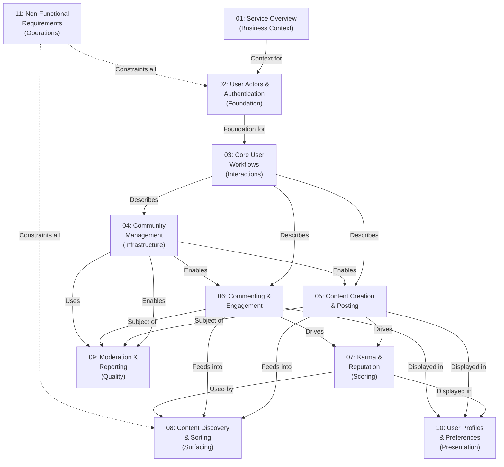
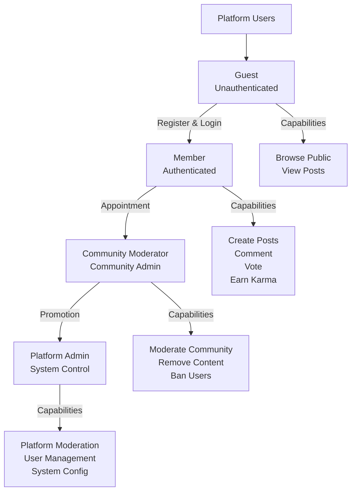
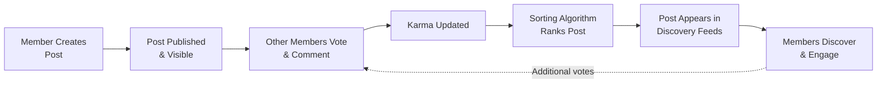
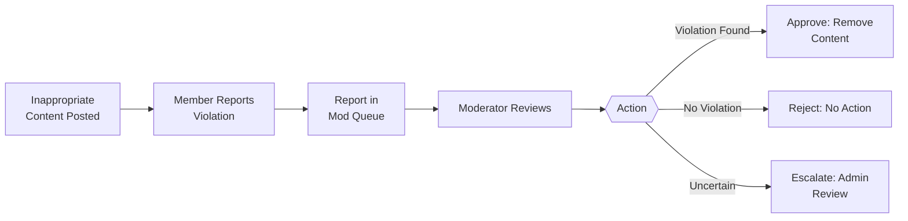
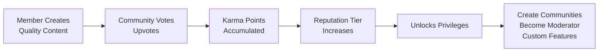

# Community Platform - Project Documentation

## Welcome to the Complete Requirements Suite

This is the master navigation document for the Community Platform project documentation suite. The Community Platform is a Reddit-like social community network that enables users to create communities, share diverse content formats, engage through voting and commenting, and build reputation through a transparent karma system.

This documentation contains 11 comprehensive requirement documents specifying all business logic, user workflows, system features, and non-functional requirements needed to implement the complete platform.

---

## 📋 Complete Document List Overview

### Document 1: Service Overview & Business Model
**File**: `01-service-overview.md`

**Purpose**: Establish business context, market positioning, and strategic vision for the platform.

**Key Content**:
- Service vision and long-term purpose of the platform
- Business model explaining why the platform exists and how it will sustain
- Target market demographics and user personas
- Core value proposition for members, moderators, and the business
- Success metrics and key performance indicators
- Competitive landscape analysis
- Revenue strategy and monetization approach
- Project scope defining what is and is not included in MVP

**Audience**: Development team (for business context), Product managers, Stakeholders, Executive leadership

**Read This**: First - provides essential business justification and context for all technical decisions

**Key Questions**: Why does this platform exist? What market problem does it solve? How will success be measured?

---

### Document 2: User Actors & Authentication System
**File**: `02-user-actors-authentication.md`

**Purpose**: Define all user types, their permissions, authentication flows, and authorization rules.

**Key Content**:
- Four user actor types: Guest, Member, Community Moderator, Platform Admin
- Complete permission matrix showing what each actor can do
- JWT-based authentication system with token management
- User registration workflow with email verification
- Login and session management process
- Password security requirements and recovery procedures
- Permission hierarchy and inheritance model
- Role-based access control (RBAC) for all operations
- Security requirements including HTTPS/TLS, password hashing, brute force prevention

**Audience**: Backend developers (security-critical), System architects, Security team

**Read This**: Second - authentication is foundational to all other features

**Key Questions**: What user types exist? What can each type do? How do users authenticate? What permissions exist for each operation?

**Critical Dependencies**: Everything depends on this authentication foundation

---

### Document 3: Core User Workflows
**File**: `03-core-user-workflows.md`

**Purpose**: Illustrate step-by-step user interactions and complete system workflows for major user actions.

**Key Content**:
- User registration and onboarding workflow
- User login and session management
- Member content discovery and feed browsing
- Member post creation with validation
- Commenting and engagement workflow
- Community subscription management
- User profile access and viewing
- Moderator content review workflow
- Complete flowcharts showing user journey decision points

**Audience**: Backend developers (API design), Frontend developers (UI design), QA testers (test scenarios)

**Read This**: Third - understand user interactions before detailed feature design

**Key Questions**: How do users complete major tasks? What steps are involved? Where do errors occur? What are decision points?

**Related Documents**: Builds on authentication system; feeds into all feature documents

---

### Document 4: Community Management
**File**: `04-community-management.md`

**Purpose**: Define community creation, management, moderation, and user management features.

**Key Content**:
- Community creation requirements with restrictions
- Community-level roles and permission hierarchy
- Moderator permission levels and capabilities
- Community settings and customization options
- Community rules creation and enforcement
- User subscription and membership management
- Community privacy levels (public, private, restricted)
- Moderator tools for content removal, user warnings, banning
- Community discovery and visibility
- Community statistics and analytics

**Audience**: Backend developers, Community managers (usage guide), Product managers

**Read This**: Fourth - establish community infrastructure before content features

**Key Questions**: How are communities created? Who manages them? What can moderators do? How are users managed?

**Dependencies**: Requires understanding of user actors and authentication

**Feeds Into**: All content features, moderation system

---

### Document 5: Content Creation & Posting
**File**: `05-content-creation-posting.md`

**Purpose**: Specify all requirements for creating and managing posts (text, links, images).

**Key Content**:
- Three post types: Text, Link, and Image posts
- Content validation and length limits for each type
- Image upload requirements, processing, and storage
- Post editing within 24-hour window
- Post deletion with soft-delete preservation
- Draft management and auto-save
- Post visibility and publishing states
- Content moderation flags and detection
- Post lifecycle from creation through deletion

**Audience**: Backend developers (core feature), Product managers

**Read This**: Fifth - foundation for all content-driven features

**Key Questions**: What post types exist? What are content limits? How are images handled? How is editing managed?

**Dependencies**: User workflows, authentication

**Used By**: Discovery, engagement, moderation, karma system

---

### Document 6: Commenting & Engagement
**File**: `06-commenting-engagement.md`

**Purpose**: Define nested comment threads, voting mechanics, and engagement features.

**Key Content**:
- Comment creation and validation
- Nested reply system with unlimited depth
- Comment threading and display logic
- Comment editing and deletion within 24 hours
- Upvote and downvote mechanics
- Vote count calculation and display
- Vote state management (changing votes, reversing votes)
- Comment sorting options (Best, Top, Newest, Oldest, Most Replies)
- Engagement metrics and analytics
- Error handling and edge cases

**Audience**: Backend developers (core feature), Product managers

**Read This**: Sixth - enables engagement and discussion features

**Key Questions**: How are comments organized? How does voting work? How are comments sorted?

**Dependencies**: Post creation, user authentication

**Used By**: Engagement metrics, karma system, content discovery

---

### Document 7: Karma & Reputation System
**File**: `07-karma-reputation-system.md`

**Purpose**: Define reputation mechanics, karma calculation, and user standing.

**Key Content**:
- Karma calculation from upvotes and downvotes
- Karma sources and distribution rules
- Karma decay mechanism for older contributions
- Reputation tiers (Bronze through Diamond)
- Badge system and achievement recognition
- Karma-based privileges and restrictions
- Community-specific karma tracking
- Karma visibility and transparency rules
- Moderator karma adjustment and appeals

**Audience**: Backend developers (calculation engine), Product managers, Community managers

**Read This**: Seventh - understand reputation before discovery features

**Key Questions**: How is karma calculated? What privileges does karma unlock? How does decay work?

**Dependencies**: Post/comment systems, voting mechanics

**Affects**: User profiles, content discovery, moderation

---

### Document 8: Content Discovery & Sorting
**File**: `08-content-discovery-sorting.md`

**Purpose**: Define feed algorithms, sorting mechanisms, and content discovery features.

**Key Content**:
- Five feed types for different user needs
- Hot sorting algorithm for trending content
- New sorting algorithm for chronological viewing
- Top sorting by highest-voted content
- Controversial sorting for debate-generating content
- Time-based filtering (24 hours, week, month, year, all-time)
- Full-text search functionality with advanced operators
- Community discovery and recommendations
- User discovery features
- Personalization options for feed customization
- Pagination strategy and performance optimization

**Audience**: Backend developers (algorithm implementation), Product managers

**Read This**: Eighth - understand content surfacing strategy

**Key Questions**: How do users find content? What sorting options exist? How are recommendations made?

**Dependencies**: All content systems, karma system, authentication

**Inputs**: Vote counts, post age, comment activity, karma scores

---

### Document 9: Moderation & Reporting
**File**: `09-moderation-reporting.md`

**Purpose**: Define content reporting, moderation workflows, and enforcement mechanisms.

**Key Content**:
- Content reporting system by members
- Report submission with violation categories
- Report documentation and preservation
- Community moderator review workflow
- Platform admin review process
- Content removal actions with reasons
- User warnings and restrictions
- Temporary and permanent user banning
- Ban appeals process
- Content removal appeals with 90-day retention
- Moderation action tracking and audit trails
- Escalation procedures for critical violations
- Reporter confidentiality and protection

**Audience**: Backend developers, Community moderators (usage guide), Platform admins

**Read This**: Ninth - critical for content quality and safety

**Key Questions**: How do users report violations? How are violations reviewed? What enforcement actions exist?

**Dependencies**: All content systems, user authentication, community management

**Integration**: Affects all user actions and content visibility

---

### Document 10: User Profiles & Preferences
**File**: `10-user-profiles-preferences.md`

**Purpose**: Define user profile structures, customization, and preference settings.

**Key Content**:
- Core profile information and display data
- Profile customization options (avatar, banner, bio)
- Notification preferences with granular control
- Content display preferences (theme, density, post per page)
- Interface customization (dark mode, font size, language)
- Privacy and visibility controls
- Activity history management
- Saved content and collections
- Profile statistics and karma breakdown
- Badge and achievement display
- Account security settings
- Data management and export options

**Audience**: Backend developers (data structure design), Product managers

**Read This**: Tenth - user experience and personalization

**Key Questions**: What information appears on profiles? What can users customize? What privacy controls exist?

**Dependencies**: Authentication, karma system, content creation

**Displays**: Karma, badges, posts, comments, activity, subscriptions

---

### Document 11: Non-Functional Requirements
**File**: `11-non-functional-requirements.md`

**Purpose**: Define performance, security, scalability, and operational requirements.

**Key Content**:
- Performance targets for response times (feeds under 2 seconds)
- Throughput and concurrent user support (1,000+ concurrent)
- Database query performance requirements
- Caching strategy and CDN integration
- Scalability to 10,000+ concurrent users
- Data growth projections and capacity planning
- Security requirements (HTTPS/TLS, password hashing)
- API security (rate limiting, input validation, CORS)
- Data privacy standards (GDPR, CCPA compliance)
- Audit trails and compliance logging
- Availability and reliability targets (99.5% uptime)
- Fault tolerance and automatic failover
- Disaster recovery procedures and backup strategy
- Monitoring, alerting, and logging standards
- Error handling and graceful degradation

**Audience**: Backend developers (architecture), DevOps/Infrastructure team, Security team

**Read This**: Last - operational foundation for deployment

**Key Questions**: What performance targets must be met? What security standards apply? How scalable is the system?

**Applies To**: All other documents - these are system-wide constraints

---

## 📚 Recommended Reading Sequence

### For Backend API Developers
**Reading Order & Timing**:
1. **Service Overview** (30 min) - Understand business context and vision
2. **User Actors & Authentication** (60 min) - Security foundation
3. **Core User Workflows** (45 min) - Understand user interactions
4. **Community Management** (45 min) - Community infrastructure
5. **Content Creation & Posting** (45 min) - Post management
6. **Commenting & Engagement** (45 min) - Discussion system
7. **Karma & Reputation** (45 min) - Reputation mechanics
8. **Content Discovery & Sorting** (60 min) - Feed algorithms
9. **Moderation & Reporting** (60 min) - Quality assurance
10. **User Profiles & Preferences** (30 min) - User customization
11. **Non-Functional Requirements** (60 min) - Performance/security

**Total Time**: Approximately 7-8 hours for complete review

**Why This Order**: Authentication first (security foundation), then workflows (understand interactions), then features (build incrementally), then quality (moderation), then operational concerns (performance/security).

---

### For Database/Data Modeling Specialist
**Reading Order & Timing**:
1. **Service Overview** (20 min) - Context
2. **User Actors & Authentication** (40 min) - User data structure
3. **Community Management** (40 min) - Community data structure
4. **Content Creation & Posting** (40 min) - Post/content structure
5. **Commenting & Engagement** (40 min) - Comment/vote structure
6. **Karma & Reputation** (30 min) - Reputation data tracking
7. **User Profiles & Preferences** (30 min) - Profile data
8. **Core User Workflows** (30 min) - Transaction patterns
9. **Non-Functional Requirements** (40 min) - Scalability/indexing

**Total Time**: Approximately 4-5 hours for database design

**Focus Areas**: Data structures, relationships, indexes, query patterns, scalability considerations

---

### For DevOps/Infrastructure Engineer
**Reading Order & Timing**:
1. **Non-Functional Requirements** (90 min) - All operational requirements
2. **Service Overview** (20 min) - Business context
3. **User Actors & Authentication** (30 min) - Security requirements
4. **Community Management** (20 min) - Feature scope
5. **Content Creation & Posting** (20 min) - Feature scope
6. **Core User Workflows** (30 min) - Traffic patterns

**Total Time**: Approximately 3-4 hours

**Focus Areas**: Performance targets, scalability, security, monitoring, backup/recovery, disaster recovery

---

### For QA/Testing Professional
**Reading Order & Timing**:
1. **Core User Workflows** (60 min) - Test scenarios
2. **User Actors & Authentication** (40 min) - Permission testing
3. **Community Management** (45 min) - Moderation testing
4. **Content Creation & Posting** (45 min) - Content validation
5. **Commenting & Engagement** (45 min) - Engagement features
6. **Karma & Reputation** (30 min) - Reputation calculations
7. **Moderation & Reporting** (45 min) - Enforcement testing
8. **Non-Functional Requirements** (45 min) - Performance testing

**Total Time**: Approximately 5-6 hours

**Focus Areas**: User scenarios, edge cases, error handling, performance, security, compatibility

---

### For Product Manager/Stakeholder
**Reading Order & Timing**:
1. **Service Overview** (45 min) - Complete business model
2. **Core User Workflows** (45 min) - User experience overview
3. **Community Management** (30 min) - Community strategy
4. **Content Creation & Posting** (20 min) - Content features
5. **Commenting & Engagement** (20 min) - Engagement features
6. **Karma & Reputation** (20 min) - Reputation system
7. **Moderation & Reporting** (25 min) - Safety strategy
8. **Content Discovery & Sorting** (25 min) - Discovery features

**Total Time**: Approximately 3-4 hours

**Focus Areas**: Features, user experience, business model, market positioning, competitive advantages

---

## 🔗 Document Dependencies & Integration

### Complete Dependency Graph

```mermaid
graph TD
    A["01: Service Overview<br/>(Business Context)"]
    B["02: User Actors &<br/>Authentication<br/>(Foundation)"]
    C["03: Core User<br/>Workflows<br/>(Interactions)"]
    D["04: Community<br/>Management<br/>(Infrastructure)"]
    E["05: Content Creation<br/>& Posting"]
    F["06: Commenting &<br/>Engagement"]
    G["07: Karma &<br/>Reputation<br/>(Scoring)"]
    H["08: Content Discovery<br/>& Sorting<br/>(Surfacing)"]
    I["09: Moderation &<br/>Reporting<br/>(Quality)"]
    J["10: User Profiles<br/>& Preferences<br/>(Presentation)"]
    K["11: Non-Functional<br/>Requirements<br/>(Operations)"]

    A -->|"Context for"| B
    B -->|"Foundation for"| C
    C -->|"Describes"| D
    C -->|"Describes"| E
    C -->|"Describes"| F
    
    D -->|"Enables"| E
    D -->|"Enables"| F
    D -->|"Enables"| I
    
    E -->|"Drives"| G
    F -->|"Drives"| G
    
    E -->|"Feeds into"| H
    F -->|"Feeds into"| H
    G -->|"Used by"| H
    
    G -->|"Displayed in"| J
    E -->|"Displayed in"| J
    F -->|"Displayed in"| J
    
    E -->|"Subject of"| I
    F -->|"Subject of"| I
    D -->|"Uses"| I
    
    K -.->|"Constraints all"| B
    K -.->|"Constraints all"| H
```

### Document Integration Matrix

| Primary Document | Consumes From | Provides To | Key Integration |
|---|---|---|---|
| **Service Overview** | None (foundation) | All others | Business context/vision |
| **Authentication** | Service Overview | All others | User identity & permissions |
| **User Workflows** | Authentication | All features | User interaction patterns |
| **Community Mgmt** | Authentication, Workflows | Content, Moderation | Community structure & rules |
| **Content Creation** | Community, Workflows, Auth | Discovery, Engagement, Moderation, Profiles | Posts/links/images |
| **Commenting** | Content Creation, Auth | Karma, Discovery, Engagement | Comments & voting |
| **Karma** | Content, Commenting | Discovery, Profiles, Moderation | Reputation scores |
| **Discovery** | All content systems, Karma | Moderation | Feed algorithms |
| **Moderation** | Community, Content, Commenting, Auth | All content systems | Policy enforcement |
| **Profiles** | All content systems, Karma, Auth | User experience | User presentation |
| **Non-Functional** | All others | Operations | Performance/security constraints |

---

## 🎯 Quick Reference: Finding Documentation by Feature

| Feature | Primary Document | Secondary Documents |
|---|---|---|
| **User Registration/Login** | 02-Authentication | 03-Workflows, 10-Profiles |
| **Community Creation** | 04-Community Management | 02-Authentication, 03-Workflows |
| **Posting Content** | 05-Content Creation | 04-Community, 07-Karma, 08-Discovery |
| **Commenting** | 06-Commenting & Engagement | 05-Content, 07-Karma, 08-Discovery |
| **Upvoting/Downvoting** | 06-Commenting & Engagement | 07-Karma, 08-Discovery |
| **Karma Calculation** | 07-Karma & Reputation | 05-Posting, 06-Commenting, 10-Profiles |
| **Content Discovery** | 08-Content Discovery & Sorting | All content documents, 07-Karma |
| **Post/Comment Sorting** | 08-Content Discovery & Sorting | 05-Posting, 06-Commenting |
| **Content Reporting** | 09-Moderation & Reporting | 04-Community, 05-Posting, 06-Commenting |
| **Content Removal** | 09-Moderation & Reporting | 04-Community, 05-Posting, 06-Commenting |
| **User Banning** | 09-Moderation & Reporting | 04-Community, 02-Authentication |
| **User Profiles** | 10-User Profiles & Preferences | 07-Karma, 05-Posting, 06-Commenting |
| **Performance/Scaling** | 11-Non-Functional Requirements | All documents |
| **Security/Encryption** | 11-Non-Functional Requirements | 02-Authentication, 10-Profiles |
| **Backup/Recovery** | 11-Non-Functional Requirements | All documents |

---

## 🏗️ Core System Concepts & Workflows

### The Four User Actors

```mermaid
graph TD
    A["Platform Users"]
    B["Guest<br/>Unauthenticated"]
    C["Member<br/>Authenticated"]
    D["Community Moderator<br/>Community Admin"]
    E["Platform Admin<br/>System Control"]
    
    A --> B
    B -->|"Register & Login"| C
    C -->|"Appointment"| D
    D -->|"Promotion"| E
    
    B -->|"Capabilities"| B1["Browse Public<br/>View Posts"]
    C -->|"Capabilities"| C1["Create Posts<br/>Comment<br/>Vote<br/>Earn Karma"]
    D -->|"Capabilities"| D1["Moderate Community<br/>Remove Content<br/>Ban Users"]
    E -->|"Capabilities"| E1["Platform Moderation<br/>User Management<br/>System Config"]
```

### Content Lifecycle: From Creation to Discovery

```mermaid
graph LR
    A["Member Creates<br/>Post"]
    B["Post Published<br/>& Visible"]
    C["Other Members Vote<br/>& Comment"]
    D["Karma Updated"]
    E["Sorting Algorithm<br/>Ranks Post"]
    F["Post Appears in<br/>Discovery Feeds"]
    G["Members Discover<br/>& Engage"]
    
    A --> B
    B --> C
    C --> D
    D --> E
    E --> F
    F --> G
    G -.->|"Additional votes"| C
```

### Moderation & Safety Flow

```mermaid
graph LR
    A["Inappropriate<br/>Content Posted"]
    B["Member Reports<br/>Violation"]
    C["Report in<br/>Mod Queue"]
    D["Moderator Reviews"]
    E{{"Action"}}
    F["Approve: Remove<br/>Content"]
    G["Reject: No Action"]
    H["Escalate: Admin<br/>Review"]
    
    A --> B
    B --> C
    C --> D
    D --> E
    E -->|"Violation Found"| F
    E -->|"No Violation"| G
    E -->|"Uncertain"| H
```

### Reputation & Privilege System

```mermaid
graph LR
    A["Member Creates<br/>Quality Content"]
    B["Community Votes<br/>Upvotes"]
    C["Karma Points<br/>Accumulated"]
    D["Reputation Tier<br/>Increases"]
    E["Unlocks Privileges"]
    F["Create Communities<br/>Become Moderator<br/>Custom Features"]
    
    A --> B
    B --> C
    C --> D
    D --> E
    E --> F
```

---

## 🔍 System Features by Category

### Authentication & Authorization
- User registration with email verification
- Secure login with JWT tokens
- Role-based access control (RBAC)
- Permission matrix for all operations
- Session management and logout
- Password reset and recovery
- Brute force protection
- 2FA support (optional enhancement)

### Community Features
- Community creation and management
- Community rules and enforcement
- Public/private/restricted visibility
- Moderator roles and permissions
- User subscription/unsubscription
- Community statistics and analytics

### Content Management
- Text, link, and image posts
- Comment system with unlimited nesting
- 24-hour edit window for posts/comments
- Soft deletion with 30-day recovery window
- Image upload and optimization
- Markdown formatting support
- Draft management and auto-save

### Engagement Features
- Upvote/downvote on posts and comments
- Vote reversal and change capability
- Comment sorting (Best, New, Top, Controversial)
- Real-time vote count updates
- Karma point awards/deductions
- Voting restrictions for low-karma users

### Discovery & Recommendation
- Hot sorting algorithm (trending content)
- New sorting (chronological)
- Top sorting (highest voted)
- Controversial sorting (debate-generating)
- Time-based filtering (24h, week, month, year, all-time)
- Full-text search with advanced operators
- Community recommendations
- User discovery
- Personalized feed customization

### Reputation System
- Global karma tracking
- Community-specific karma
- Reputation tiers (Bronze-Diamond)
- Badge achievements
- Karma decay over time
- Karma-based privileges and restrictions

### Moderation & Safety
- Content reporting by members
- Moderator review workflows
- Community moderation actions
- Platform admin enforcement
- User warnings and restrictions
- Temporary and permanent banning
- Appeal mechanisms with 90-day content retention
- Moderation audit trails

### User Experience
- Customizable profiles with avatar/banner
- Bio and about information
- Notification preferences (email, in-app)
- Display customization (theme, density, language)
- Privacy controls and visibility settings
- Saved content collections
- Activity history and statistics
- Account security settings

### Performance & Operations
- Feed response under 2 seconds
- Support for 1,000+ concurrent users
- Automatic scaling to 10,000+ users
- Database query optimization
- CDN integration for images
- Cache strategy for hot content
- Real-time sorting updates every 5 minutes

### Security & Compliance
- HTTPS/TLS encryption in transit
- Password hashing with bcrypt
- GDPR and CCPA compliance
- Data export and deletion rights
- Audit trails of moderation actions
- Rate limiting and DDoS protection
- SQL injection prevention
- XSS prevention through content sanitization

---

## ✅ Document Completeness Checklist

### Coverage Verification
- ✓ User registration and login flows defined
- ✓ All four user actor types specified with permissions
- ✓ Community creation and management requirements
- ✓ Post creation with three content types (text, link, image)
- ✓ Comment system with unlimited nesting depth
- ✓ Voting mechanics and score calculations
- ✓ Karma system with decay and tiers
- ✓ Hot, New, Top, and Controversial sorting algorithms
- ✓ Content discovery and search functionality
- ✓ Complete moderation and reporting workflows
- ✓ User profiles with customization options
- ✓ Performance targets and scalability requirements
- ✓ Security and compliance standards
- ✓ Backup and disaster recovery procedures
- ✓ Monitoring and logging requirements

### Quality Standards
- ✓ All requirements in EARS format (Event, Action, Result)
- ✓ Business rules documented for each feature
- ✓ Error handling scenarios specified
- ✓ Success criteria defined for workflows
- ✓ Integration points identified
- ✓ Visual diagrams provided with correct syntax
- ✓ Examples and scenarios included
- ✓ Dependencies clearly mapped

---

## 🚀 Getting Started with Implementation

### Phase 1: Foundation (Weeks 1-2)
**Read Documents**: 02-Authentication, 11-Non-Functional Requirements

**Focus**: Build authentication system, security foundation, and infrastructure

**Deliverables**: User registration, login, JWT tokens, database schema

### Phase 2: Core Features (Weeks 3-5)
**Read Documents**: 04-Community Management, 05-Content Creation, 06-Commenting

**Focus**: Implement community infrastructure and core content creation

**Deliverables**: Community CRUD, post creation, commenting system

### Phase 3: Engagement & Discovery (Weeks 6-8)
**Read Documents**: 07-Karma System, 08-Content Discovery

**Focus**: Implement voting, karma calculation, feed algorithms

**Deliverables**: Upvote/downvote, karma tracking, hot/new/top/controversial sorting

### Phase 4: Moderation & Quality (Weeks 9-10)
**Read Documents**: 09-Moderation & Reporting

**Focus**: Implement reporting, moderation workflows, enforcement

**Deliverables**: Report submission, moderator review, content removal

### Phase 5: User Experience (Weeks 11-12)
**Read Documents**: 10-User Profiles, 03-User Workflows

**Focus**: Implement profiles, preferences, complete workflows

**Deliverables**: User profiles, saved content, notifications, search

### Phase 6: Optimization & Hardening (Weeks 13-14)
**Read Documents**: 11-Non-Functional Requirements

**Focus**: Performance optimization, security hardening, monitoring

**Deliverables**: Caching, indexing, security audit, monitoring dashboards

---

> **Developer Note**: These requirements documents define **WHAT the system should do** from a business perspective. All technical implementations (architecture, frameworks, databases, APIs, etc.) are at the discretion of the development team. These documents describe business requirements, not technical specifications."
