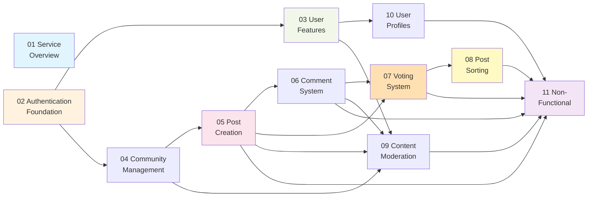

# Community Platform - Complete Requirements Documentation

## Document Overview

Welcome to the complete requirements documentation for **communityPlatform**, a Reddit-like community discussion platform. This table of contents provides comprehensive navigation through all backend requirements, specifications, and implementation standards.

This documentation set defines the complete system requirements for building a scalable, feature-rich community platform that allows users to create communities, share content, engage through voting and commenting, and participate in moderated discussions.

### How to Use This Documentation

**For Backend Developers**: Start with the authentication document (02), then proceed through feature areas in the recommended sequence. Each document builds upon foundations established in earlier documents. Use the quick reference table to jump to specific topics.

**For Project Managers**: Review the service overview (01) first for business context, then review non-functional requirements (11) to understand scope, resources, and timelines. Sample feature documents (05-08) for technical depth.

**For Stakeholders**: Begin with the service overview (01) to understand business rationale. Review individual feature documents (04-10) as needed to understand specific capabilities.

**For QA/Testing Teams**: Start with non-functional requirements (11) for quality standards, then review each feature document (03-10) systematically for test case development.

---

## Complete Documentation Structure

### Service Strategy & Foundation (Documents 1-2)

#### 01-service-overview.md
**Filename**: 01-service-overview.md | **Type**: Service Overview | **Complexity**: Low | **Reading Time**: 15 min

**Purpose**: Establishes business justification, market context, and long-term platform vision for stakeholders and development team alignment.

**Covers**: 
- Service mission and business model
- Market opportunity analysis and competitive landscape
- Core value proposition for users and creators
- Platform goals across 3-5 year roadmap
- Success metrics and KPIs
- Revenue model and growth strategy

**Audience**: Business stakeholders, leadership, development team

**Key Topics**: Platform philosophy, market gap identification, competitive advantages, financial projections, growth phases

**Reading Priority**: ⭐ First document - foundation for all decisions

---

#### 02-user-actors-authentication.md
**Filename**: 02-user-actors-authentication.md | **Type**: Technical Specification | **Complexity**: High | **Reading Time**: 30 min

**Purpose**: Defines complete user authentication system, actor hierarchy, and permission structure that governs all other system requirements.

**Covers**:
- Complete user actor definitions (Guest, Member, Moderator, Administrator)
- Authentication flows for each user type
- JWT token structure and refresh mechanisms
- Login, logout, and password management
- Session management across multiple devices
- Complete permission matrix for all features
- Account security features and email verification

**Audience**: Backend developers, security team, all technical staff

**Key Topics**: 
- Guest users (read-only access)
- Member users (content creation, voting, community subscription)
- Moderator users (community management and moderation)
- Administrator users (platform-wide governance)
- Login/registration/password reset workflows
- Token issuance, validation, and refresh
- Permission enforcement and audit trails

**User Actors Defined**:
- **Guest**: Read-only access to public content, no account required
- **Member**: Full authenticated user with content creation capabilities
- **Moderator**: Community managers with moderation powers
- **Administrator**: Platform-wide governance and system management

**Reading Priority**: ⭐⭐ Second document - foundation for all security and permissions

**Dependencies**: None (foundational)

---

### User Management & Profiles (Documents 3, 10)

#### 03-core-user-features.md
**Filename**: 03-core-user-features.md | **Type**: Technical Specification | **Complexity**: Medium | **Reading Time**: 25 min

**Purpose**: Specifies user registration, login, profile management, and the karma reputation system that drives community engagement.

**Covers**:
- User registration and email verification process
- Member login, logout, and password management
- User profile data and customization options
- Complete karma calculation system (earning, spending, tracking)
- User preferences and settings (notifications, display, privacy)
- Account security features and session management
- GDPR compliance and account deletion

**Audience**: Backend developers

**Key Topics**: 
- Registration validation and email verification
- Password requirements and security
- Profile information structure and editing
- Karma earning from posts, comments, and votes
- Karma restrictions and platform feature gates
- User preferences configuration
- Account deletion and data privacy

**Reading Priority**: ⭐⭐⭐ Third document - user account foundation

**Dependencies**: Requires authentication system from document 02

---

#### 10-user-profiles-analytics.md
**Filename**: 10-user-profiles-analytics.md | **Type**: Technical Specification | **Complexity**: Medium | **Reading Time**: 20 min

**Purpose**: Defines user profile pages, activity history display, and analytics showing user contributions and reputation.

**Covers**:
- Public profile page structure and information display
- User post and comment history with sorting/filtering
- User statistics and metrics (karma breakdown, activity counts)
- Follow/follower system and relationship management
- User activity timeline chronological display
- Community participation metrics
- Privacy controls for profile visibility

**Audience**: Backend developers

**Key Topics**: 
- Profile header with karma and verification badges
- Posts archive with multiple sort options
- Comments archive with sorting and filtering
- Karma score breakdown (post karma vs. comment karma)
- Activity statistics and community metrics
- Following/follower relationships and lists
- Activity timeline with privacy controls

**Reading Priority**: ⭐⭐⭐ Tenth document - user visibility layer

**Dependencies**: Requires understanding of user accounts (03) and karma system (07)

---

### Community Operations (Document 4)

#### 04-community-management.md
**Filename**: 04-community-management.md | **Type**: Technical Specification | **Complexity**: High | **Reading Time**: 35 min

**Purpose**: Specifies community creation, configuration, membership management, and governance through moderator roles.

**Covers**:
- Community creation with unique identifiers and categories
- Community settings configuration (visibility, posting permissions, content types)
- Community subscription and membership management
- Moderator hierarchy (Creator, Senior, Junior levels)
- Moderator permissions and action audit trails
- Community rules and enforcement mechanisms
- Community discovery and recommendation system
- Dormant community management and transfer

**Audience**: Backend developers

**Key Topics**: 
- Community creation requirements and validation
- Public vs. private community access control
- Post type restrictions and content filtering
- Moderator tier system with hierarchical permissions
- Moderator appointment and removal
- Community ban enforcement
- Community rules and moderation policies
- Appeal process for moderation decisions
- Community deletion and archival

**Reading Priority**: ⭐⭐⭐⭐ Fourth document - community structure foundation

**Dependencies**: Requires user actors and authentication (02)

---

### Content Management (Documents 5-6)

#### 05-content-posting.md
**Filename**: 05-content-posting.md | **Type**: Technical Specification | **Complexity**: Medium | **Reading Time**: 20 min

**Purpose**: Defines post creation, content types (text, link, image), editing, deletion, and validation workflows.

**Covers**:
- Three post types: text posts, link posts, and image posts
- Post creation with title, content, and metadata
- Text post support with markdown formatting
- Link post with automatic metadata extraction
- Image post with multiple image support and optimization
- Post editing with version history and time windows
- Soft-delete behavior preserving thread integrity
- Spam detection and rate limiting
- Post indexing for search and sorting

**Audience**: Backend developers

**Key Topics**: 
- Post type selection and content requirements
- Markdown support for text formatting
- Link preview generation with Open Graph data
- Image upload with format/size/dimension validation
- Image optimization and CDN delivery
- Edit history and versioning
- Soft-delete with "[deleted by user]" placeholder
- NSFW and spoiler flags
- Post locking by moderators
- Spam and duplicate detection

**Reading Priority**: ⭐⭐⭐⭐⭐ Fifth document - core content creation

**Dependencies**: Requires communities (04) and voting system (07)

---

#### 06-commenting-system.md
**Filename**: 06-commenting-system.md | **Type**: Technical Specification | **Complexity**: Medium | **Reading Time**: 25 min

**Purpose**: Details comment creation, nested replies, editing, deletion, and moderation workflows that enable threaded discussions.

**Covers**:
- Comment creation and submission validation
- Nested reply structure with 10-level maximum depth
- Parent-child relationships and thread organization
- Comment editing within 24-hour window
- Comment deletion and soft-delete behavior
- Comment sorting algorithms (best, new, top, controversial)
- Thread display and pagination
- Comment moderation and approval workflows
- Comment voting and karma impact
- Rate limiting for comment creation

**Audience**: Backend developers

**Key Topics**: 
- Comment content validation (1-10,000 characters)
- Nested reply threading structure
- Comment chain preservation during deletion
- Edit history and versioning for comments
- Soft-delete "[deleted by user]" display
- Comment sorting within posts
- Threaded display with proper indentation
- Moderator approval for new accounts
- Comment voting contributing to karma
- Moderation audit trails for comment actions

**Reading Priority**: ⭐⭐⭐⭐⭐ Sixth document - discussion system

**Dependencies**: Requires posts (05) and voting system (07)

---

### Community Engagement & Discovery (Documents 7-8)

#### 07-voting-system.md
**Filename**: 07-voting-system.md | **Type**: Technical Specification | **Complexity**: High | **Reading Time**: 35 min

**Purpose**: Specifies upvote/downvote mechanics, karma impact, fraud prevention, and vote-based sorting algorithms.

**Covers**:
- Upvote and downvote mechanics and eligibility
- Vote state management (changing votes, removing votes)
- Karma impact of votes (+1 for upvote, -1 for downvote)
- Double-voting prevention
- Rate limiting on voting frequency
- Vote manipulation detection and fraud prevention
- Sockpuppet account detection
- Vote reversal for confirmed fraud
- Hot algorithm with time-decay formula
- New/Top/Controversial sorting algorithms

**Audience**: Backend developers

**Key Topics**: 
- Upvote/downvote eligibility and restrictions
- Vote change mechanics and karma adjustment
- Vote fraud detection algorithms
- Rate limiting by account age (5-60 votes/hour)
- Vote manipulation patterns and detection
- Hot score calculation with time decay
- New posts chronological sorting
- Top posts ranking with time windows
- Controversial posts identifying division
- Real-time vote updates and caching
- Vote data consistency and integrity

**Reading Priority**: ⭐⭐⭐⭐⭐ Seventh document - engagement mechanics

**Dependencies**: Requires karma system (03) and comments (06)

---

#### 08-post-sorting-discovery.md
**Filename**: 08-post-sorting-discovery.md | **Type**: Technical Specification | **Complexity**: High | **Reading Time**: 40 min

**Purpose**: Details post sorting algorithms and content discovery mechanisms for surfacing relevant content.

**Covers**:
- Hot algorithm with engagement and time-decay factors
- New posts chronological sorting
- Top posts ranking with multiple time windows
- Controversial posts identifying balanced disagreement
- Home feed generation and personalization
- Community feed assembly
- Full-text search capabilities with filters
- Trending content discovery
- Pagination strategies (offset and cursor-based)
- Content exclusion rules
- Performance optimization with caching

**Audience**: Backend developers

**Key Topics**: 
- Hot score calculation: (upvotes - downvotes) × time decay
- Time decay formula: 1 / (1 + hours/24)
- New posts sorted by timestamp, newest first
- Top posts with Today/Week/Month/All Time windows
- Controversy score using MIN(upvotes, downvotes)
- Home feed combining subscriptions with hot sorting
- Community feed with custom sorting
- Search with full-text indexing
- Trending tabs showing popular content
- Pagination with 20-50 items per page
- Response time requirements (<500ms for first page)

**Reading Priority**: ⭐⭐⭐⭐⭐ Eighth document - content discovery system

**Dependencies**: Requires voting system (07) and posts (05)

---

### Platform Governance (Document 9)

#### 09-content-moderation.md
**Filename**: 09-content-moderation.md | **Type**: Technical Specification | **Complexity**: High | **Reading Time**: 40 min

**Purpose**: Specifies content reporting, moderation workflows, content removal, and disciplinary actions including appeals.

**Covers**:
- User reporting of inappropriate content
- 8 report categories (spam, harassment, hate speech, misinformation, copyright, adult, off-topic, other)
- Report triage and priority assignment
- Moderation queue and workflow
- Moderator decision types (approve, remove, warn, suspend, ban)
- Content removal with "[removed by moderator]" indicators
- User suspension (temporary durations)
- Permanent user bans
- Appeal process for moderation decisions
- Audit trail maintenance
- Moderator accountability metrics

**Audience**: Backend developers, moderators

**Key Topics**: 
- Report categories and priority levels
- Moderation queue with SLAs (4 hours for critical)
- Moderator assignment based on workload
- Content removal vs. user discipline
- Suspension durations: 1 day to 1 year
- Permanent ban with account deactivation
- Ban evasion detection
- Appeal submission and review
- Shadow banning for bot accounts
- Repeat offense tracking
- Audit logging of all moderation actions

**Reading Priority**: ⭐⭐⭐⭐⭐ Ninth document - governance framework

**Dependencies**: Requires communities (04), posts (05), comments (06), and users (03)

---

### Quality and Non-Functional Requirements (Document 11)

#### 11-non-functional-requirements.md
**Filename**: 11-non-functional-requirements.md | **Type**: Technical Specification | **Complexity**: High | **Reading Time**: 30 min

**Purpose**: Specifies performance targets, security standards, scalability expectations, and compliance requirements.

**Covers**:
- API response time SLAs (<500ms for most endpoints)
- Database query performance optimization
- Caching strategy (multi-layer: memory, browser, CDN)
- Rate limiting on API requests and actions
- Concurrent user support (10,000 initial, 100,000+ at scale)
- Data volume projections (500M posts, 5B comments by Year 3)
- Database scaling strategy (sharding at scale)
- Authentication security standards and JWT
- Password hashing and encryption (bcrypt, TLS/SSL)
- Input validation and XSS prevention
- Audit logging and security events
- Uptime SLA of 99.5% (3.5 hours downtime/month)
- Disaster recovery with 1-hour RTO
- GDPR compliance and user data rights
- Data retention policies
- Monitoring and alerting

**Audience**: Backend developers, DevOps, security team

**Key Topics**: 
- Response time targets: <200ms for posts, <100ms for votes
- Caching: Redis for sessions, Browser cache, CDN for media
- Rate limits: 100 API requests/min, 10 posts/hour
- 99.5% uptime SLA with disaster recovery
- TLS 1.2+, bcrypt password hashing (cost 12)
- OWASP Top 10 compliance
- GDPR: right to access, erasure, portability, objection
- Data retention: Posts 7 years, audit logs 2 years, sessions 30 days
- Monitoring: CPU/memory/disk/bandwidth/errors
- PostgreSQL with read replicas and sharding at scale

**Reading Priority**: ⭐⭐⭐⭐⭐ Eleventh document - implementation standards (refer throughout)

**Dependencies**: Applicable to all features

---

## Navigation by Feature Area

### User Account Features
- **[02-user-actors-authentication.md](./02-user-actors-authentication.md)** - Login, registration, sessions, permissions
- **[03-core-user-features.md](./03-core-user-features.md)** - Accounts, karma, preferences
- **[10-user-profiles-analytics.md](./10-user-profiles-analytics.md)** - Profile pages, activity history

### Community Features
- **[04-community-management.md](./04-community-management.md)** - Creation, settings, subscriptions
- **[09-content-moderation.md](./09-content-moderation.md)** - Rules enforcement, moderator powers

### Content Creation and Discovery
- **[05-content-posting.md](./05-content-posting.md)** - Creating posts, file uploads
- **[06-commenting-system.md](./06-commenting-system.md)** - Discussion, nested replies
- **[08-post-sorting-discovery.md](./08-post-sorting-discovery.md)** - Finding content, sorting algorithms
- **[07-voting-system.md](./07-voting-system.md)** - Engagement mechanics, karma

### Moderation and Safety
- **[09-content-moderation.md](./09-content-moderation.md)** - Reporting, removal, appeals
- **[11-non-functional-requirements.md](./11-non-functional-requirements.md)** - Data protection, compliance

---

## Navigation by User Actor

### Guest (Unauthenticated Users)
**Capabilities**: Read public content, view profiles, register/login

**Key Documents**:
- [02-user-actors-authentication.md](./02-user-actors-authentication.md) - Guest access, registration
- [08-post-sorting-discovery.md](./08-post-sorting-discovery.md) - Browsing content
- [10-user-profiles-analytics.md](./10-user-profiles-analytics.md) - Viewing profiles

**Features Available**: Browse communities, view posts, read comments, search, register for account

---

### Member (Authenticated Users)
**Capabilities**: Create content, vote, subscribe, build karma, participate in communities

**Key Documents**:
- [03-core-user-features.md](./03-core-user-features.md) - User accounts and karma
- [05-content-posting.md](./05-content-posting.md) - Creating posts
- [06-commenting-system.md](./06-commenting-system.md) - Creating comments
- [07-voting-system.md](./07-voting-system.md) - Voting and engagement
- [04-community-management.md](./04-community-management.md) - Subscribing to communities
- [10-user-profiles-analytics.md](./10-user-profiles-analytics.md) - Profile management

**Features Available**: Full platform participation, content creation, community subscription, voting, karma building

---

### Moderator (Community Managers)
**Capabilities**: Manage assigned communities, moderate content, suspend users, configure settings

**Key Documents**:
- [04-community-management.md](./04-community-management.md) - Community configuration and moderator roles
- [09-content-moderation.md](./09-content-moderation.md) - Content removal, user discipline
- [02-user-actors-authentication.md](./02-user-actors-authentication.md) - Permissions and access control
- [07-voting-system.md](./07-voting-system.md) - Understanding voting system for moderation

**Features Available**: Remove posts/comments, suspend members, configure community settings, manage other moderators (if senior), view moderation audit logs

---

### Administrator (Platform Administrators)
**Capabilities**: System-wide management, enforce policies, view analytics, resolve appeals

**Key Documents**:
- [09-content-moderation.md](./09-content-moderation.md) - Platform-wide moderation
- [11-non-functional-requirements.md](./11-non-functional-requirements.md) - Security and compliance standards
- [02-user-actors-authentication.md](./02-user-actors-authentication.md) - Admin permissions
- [04-community-management.md](./04-community-management.md) - Community oversight

**Features Available**: Platform-wide content removal, user suspension/banning, override community decisions, view analytics, manage administrators, emergency access

---

## Recommended Reading Sequence

### For Complete Implementation (All 11 Documents)

The following sequence ensures each document builds on previous foundations:

1. **[01-service-overview.md](./01-service-overview.md)** - Understand business context and goals
2. **[02-user-actors-authentication.md](./02-user-actors-authentication.md)** - Foundation: Users, authentication, permissions
3. **[03-core-user-features.md](./03-core-user-features.md)** - User accounts and karma system
4. **[04-community-management.md](./04-community-management.md)** - Community structure and organization
5. **[05-content-posting.md](./05-content-posting.md)** - Post creation and management
6. **[06-commenting-system.md](./06-commenting-system.md)** - Comment discussions and threading
7. **[07-voting-system.md](./07-voting-system.md)** - Voting mechanics and karma impact
8. **[08-post-sorting-discovery.md](./08-post-sorting-discovery.md)** - Sorting algorithms and content discovery
9. **[09-content-moderation.md](./09-content-moderation.md)** - Moderation and governance
10. **[10-user-profiles-analytics.md](./10-user-profiles-analytics.md)** - User profiles and analytics
11. **[11-non-functional-requirements.md](./11-non-functional-requirements.md)** - Implementation standards (reference throughout)

---

### For MVP (Minimum Viable Product)

**Phase 1 Priority** - Core functionality (Documents 02, 03, 04, 05, 07, 08, 11):
1. Authentication and users
2. Communities and subscriptions
3. Post creation
4. Voting and karma
5. Post sorting and feeds
6. Non-functional standards

**Phase 2 Addition** - Enhanced functionality (Documents 06, 09, 10):
7. Comments and discussions
8. Content moderation
9. User profiles and analytics

**Phase 3 Optional** - Advanced features (Document 01):
10. Business analytics and optimization

---

### For Different Implementation Roles

**Backend Developer** (Complete sequence 1-11):
- Read in order: 02 → 03 → 04 → 05 → 06 → 07 → 08 → 09 → 10 → 11
- Deep dive on voting/sorting algorithms (07-08)
- Reference moderation workflow (09)
- Consult non-functional requirements throughout (11)

**DevOps/Infrastructure** (Focus on 02, 09, 11):
- Authentication and security (02)
- Moderation and audit trails (09)
- Performance, scalability, and compliance (11)
- Reference concurrency requirements from feature docs as needed

**QA/Testing** (Start with 11, then 03-10):
- Non-functional requirements for quality standards (11)
- Each feature document (03-10) for test case development
- Moderation workflows (09) for edge case testing
- User actors (02) for permission-based testing

**Project Manager** (01, 11, sample of 03-10):
- Business context and goals (01)
- Non-functional requirements for resource planning (11)
- Skim feature documents (03-10) for project scoping

---

## Document Interdependencies

```mermaid
graph LR
    A["01 Service<br/>Overview"]
    B["02 Authentication<br/>Foundation"]
    C["03 User<br/>Features"]
    D["04 Community<br/>Management"]
    E["05 Post<br/>Creation"]
    F["06 Comment<br/>System"]
    G["07 Voting<br/>System"]
    H["08 Post<br/>Sorting"]
    I["09 Content<br/>Moderation"]
    J["10 User<br/>Profiles"]
    K["11 Non-<br/>Functional"]
    
    B --> C
    B --> D
    C --> J
    D --> E
    E --> F
    E --> G
    F --> G
    G --> H
    E --> I
    F --> I
    D --> I
    C --> I
    J --> K
    G --> K
    E --> K
    F --> K
    H --> K
    I --> K
    
    style A fill:#e1f5ff
    style B fill:#fff3e0
    style K fill:#f3e5f5
    style C fill:#f1f8e9
    style E fill:#fce4ec
    style G fill:#ffe0b2
    style H fill:#fff9c4
```

**Dependency Legend:**
- Gray arrows show where one document's concepts are used by another
- Foundation documents (02, 11) connect to most others
- Feature documents (03-10) build sequentially
- Document 11 (Non-Functional) applies to all implementations

---

## Key Definitions

### Platform Actors (User Types)

| Actor | Definition | Key Capabilities | Restrictions |
|-------|-----------|-----------------|----------------|
| **Guest** | Unauthenticated user | Read public content, register | Cannot post, vote, or subscribe |
| **Member** | Authenticated regular user | Create posts/comments, vote, subscribe | Cannot moderate or administer |
| **Moderator** | Community manager | Enforce rules, remove content, suspend users | Limited to assigned community (unless admin) |
| **Administrator** | Platform manager | System-wide governance and enforcement | Highest privilege level |

### Core Entities

| Entity | Definition | Purpose |
|--------|-----------|---------|
| **Community** | Organized space around topic | Container for posts and discussions |
| **Post** | User-created content (text/link/image) | Primary content unit |
| **Comment** | Reply to post or another comment | Threaded discussion |
| **Vote** | Upvote or downvote on post/comment | Engagement and ranking signal |
| **Karma** | User reputation score | Measures community contributions and trust |
| **User Profile** | Account and activity information | Public identity and history |

### Primary Features

| Feature | Description | Document |
|---------|-------------|----------|
| **Registration & Login** | Account creation and authentication | 02, 03 |
| **Communities** | Create and manage discussion spaces | 04 |
| **Posting** | Create text, link, or image posts | 05 |
| **Comments** | Threaded discussions under posts | 06 |
| **Voting** | Upvote/downvote on posts and comments | 07 |
| **Discovery** | Sort and find content (hot, new, top, controversial) | 08 |
| **Moderation** | Report and remove inappropriate content | 09 |
| **Profiles** | View user activity and reputation | 10 |

---

## Quick Reference: Document Map

| # | Document | Focus | Type | Complexity | Reading Time | Pages |
|---|----------|-------|------|-----------|--------------|-------|
| 01 | service-overview.md | Business | Strategy | Low | 15 min | ~25 |
| 02 | user-actors-authentication.md | Auth Foundation | Technical | High | 30 min | ~40 |
| 03 | core-user-features.md | User Accounts | Technical | Medium | 25 min | ~35 |
| 04 | community-management.md | Communities | Technical | High | 35 min | ~45 |
| 05 | content-posting.md | Posts | Technical | Medium | 20 min | ~30 |
| 06 | commenting-system.md | Comments | Technical | Medium | 25 min | ~35 |
| 07 | voting-system.md | Voting & Karma | Technical | High | 35 min | ~45 |
| 08 | post-sorting-discovery.md | Discovery | Technical | High | 40 min | ~50 |
| 09 | content-moderation.md | Moderation | Technical | High | 40 min | ~50 |
| 10 | user-profiles-analytics.md | Profiles | Technical | Medium | 20 min | ~30 |
| 11 | non-functional-requirements.md | Standards | Technical | High | 30 min | ~40 |

---

## Using These Requirements

### For Initial Development

1. Read documents 1-2 to understand context and architecture
2. Implement in feature order: 02 (auth) → 03 (users) → 04 (communities) → 05 (posts) → 06 (comments) → 07 (voting) → 08 (sorting)
3. Refer to document 11 throughout for quality standards
4. Implement moderation (09) and analytics (10) concurrently with core features
5. Validate each document's EARS requirements before declaring feature complete

### For Feature Expansion

1. Identify the relevant document(s) for the new feature
2. Review its dependencies to understand what must be in place first
3. Check document 11 for any new non-functional impacts
4. Integrate with existing systems as documented
5. Update audit trails and permission matrices as needed

### For Bug Fixes and Maintenance

1. Locate the relevant feature document
2. Review the specific requirement that needs fixing
3. Check related features for cascading impacts
4. Update or extend implementation as needed
5. Log changes in audit trail

### For Performance Optimization

1. Review document 11 (Non-Functional Requirements) for performance targets
2. Identify bottleneck features in related documents
3. Review sorting algorithms in document 08
4. Implement caching strategies from document 11
5. Monitor response times and adjust based on metrics

---

## Document Statistics

- **Total Documents**: 11 requirement specification files
- **Total Coverage**: All major platform features
- **Total Word Count**: 70,000+ words across all documents
- **User Actors Covered**: 4 types (Guest, Member, Moderator, Administrator)
- **Core Features**: 10 major functional areas
- **Quality Standards**: Comprehensive non-functional requirements
- **Estimated Implementation Time**: 6-12 months for full platform
- **Maintenance Frequency**: Review quarterly as product evolves

---

## Support and Updates

- **Questions about specific features?** Refer to the relevant feature document
- **Unclear requirements?** Check related documents and document 02 (foundation)
- **Need technical details?** All specifications in individual feature documents
- **Performance concerns?** Consult document 11 for operational standards
- **Security questions?** Document 02 (authentication) and 11 (data protection)
- **Compliance needs?** Document 11 covers GDPR, data retention, privacy

---

> *Developer Note: This documentation defines **business requirements only**. All technical implementations (architecture, APIs, database design, deployment strategies) are at the discretion of the development team. The team has full autonomy to choose the technology stack, architectural patterns, and deployment infrastructure that best serve the platform's needs.*
