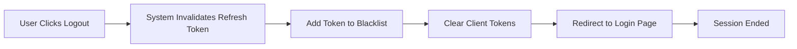

# User Actors and Authentication System

## 1. User Actor Hierarchy and Definitions

The community platform implements a four-tier user actor hierarchy, each with distinct capabilities, responsibilities, and access levels. This hierarchy supports content governance, community management, and platform administration while maintaining security boundaries between user types.

### 1.1 Guest Actor

**Description**: Unauthenticated users with read-only access to public platform content.

**Primary Responsibilities**:
- Browse public communities and their listings
- View published posts and their content
- Read comments and discussion threads
- Access user profile pages and public user information
- View community descriptions and member counts
- Access authentication endpoints (login and registration)

**Capabilities**:
- Search communities by name
- Search posts by keywords within public communities
- Browse posts sorted by hot, new, and top
- View user profiles with public activity history
- Read all comments and replies on public posts
- Access help documentation and platform information

**Restrictions**:
- Cannot create communities
- Cannot post text, links, or images
- Cannot comment on posts
- Cannot vote on posts or comments
- Cannot subscribe to communities
- Cannot maintain a user profile
- Cannot report content
- Cannot access personal preferences or settings

**Business Justification**: Guests provide low-friction access to platform content, encouraging exploration and community discovery. This tier converts users to members through positive content experiences without requiring registration friction upfront.

### 1.2 Member Actor

**Description**: Authenticated regular users who actively participate in communities through content creation, voting, and discussion.

**Primary Responsibilities**:
- Create and manage personal communities (subreddits)
- Contribute posts to communities (text, links, images)
- Participate in discussions through commenting
- Build personal reputation through karma
- Engage with content through voting
- Manage community subscriptions
- Maintain user profiles
- Report inappropriate content to moderators

**Capabilities**:
- Complete registration with email and password
- Authenticate with email and password credentials
- Create new communities and serve as community creator
- Post text content to communities they can access
- Post links to external content
- Upload and post images
- Edit their own posts within 24 hours of creation
- Delete their own posts (soft delete with history)
- Create comments on posts
- Create nested replies to comments (up to 10 levels deep)
- Edit their own comments within 24 hours
- Delete their own comments
- Upvote posts and comments
- Downvote posts and comments
- Change their votes (switch from upvote to downvote or vice versa)
- Subscribe to communities
- Unsubscribe from communities
- View their personal feed of subscribed communities
- Create and update personal profile
- View their own activity history
- View their own karma score and breakdown
- Report posts, comments, or users for moderation
- Access notification preferences
- Change password
- Verify email address
- View their subscribed communities list
- Receive notifications for subscribed communities

**Restrictions**:
- Cannot delete other users' content
- Cannot moderate communities they don't own/manage
- Cannot suspend or ban other users
- Cannot remove communities
- Cannot view platform-wide analytics
- Cannot change other users' karma manually
- Cannot modify community settings they don't own
- Cannot bypass content filters or moderation actions
- Cannot access administrative tools or dashboards
- Limited initial posting frequency based on karma (spam prevention)

**Business Justification**: Members are the core user type that creates platform value through content and community participation. The member tier enables monetization, engagement, and community building while restricting capabilities to prevent abuse.

### 1.3 Moderator Actor

**Description**: Community managers appointed by community creators or administrators who enforce community rules and manage community content.

**Primary Responsibilities**:
- Manage assigned communities
- Enforce community-specific rules and policies
- Review reported content within their communities
- Remove inappropriate posts and comments
- Suspend members from their communities
- Configure community settings
- Assign and remove other moderators
- Maintain moderation audit logs

**Capabilities**:
- All member capabilities (with additional permissions)
- Remove posts from their managed communities
- Remove comments from their managed communities
- Ban users from their managed communities temporarily or permanently
- Unban previously suspended users
- Assign moderator status to other members
- Revoke moderator status from other moderators
- Configure community settings (description, rules, visibility, post type restrictions)
- View community moderation queue and reports
- Approve or reject reported content
- Create community announcements
- Access moderation dashboard for their communities
- View community member list
- View moderation audit log for their actions
- View community statistics (post counts, member counts, activity trends)
- Create community flair (user titles/badges) and assign to members
- Edit community rules and policies
- Manage community styling and appearance settings
- Access community ban list and view banned users
- View report history for their communities

**Restrictions**:
- Can only moderate communities they're assigned to
- Cannot suspend administrators
- Cannot access other communities' moderation tools
- Cannot modify platform-wide settings
- Cannot view analytics beyond their assigned communities
- Cannot suspend members globally (only from their communities)
- Cannot access user personal information beyond what's public
- Cannot delete communities (owner only)
- Cannot overrule platform administrator decisions
- Cannot access administrative dashboards

**Moderator Hierarchy**: Within each community, moderators follow a hierarchy based on when they were assigned. The community creator is the top-level owner. Subsequent moderators have equal permissions unless explicitly configured otherwise. Moderators can only remove moderators who were assigned after them (lower in hierarchy).

**Business Justification**: Moderators scale community governance without platform overhead. By empowering community creators to manage their communities, the platform grows sustainably while maintaining quality through distributed moderation.

### 1.4 Administrator Actor

**Description**: Platform administrators with system-wide management capabilities, enforcement authority, and access to all platform functions.

**Primary Responsibilities**:
- Enforce platform-wide policies and rules
- Manage user accounts and suspensions
- Manage communities
- Review reports and moderation decisions
- Access and analyze platform analytics
- Configure platform settings
- Perform emergency actions to maintain platform integrity
- Monitor platform health and performance

**Capabilities**:
- All member and moderator capabilities on all communities
- Suspend or permanently ban users from the entire platform
- Unsuspend or unban previously suspended users
- Remove communities for policy violations
- Remove posts from any community
- Remove comments from any community
- Override moderator decisions
- Access global moderation dashboard
- View platform-wide analytics and statistics
- View all user accounts and their details
- View all communities and their details
- Access complete audit logs for all actions
- View reported content across the entire platform
- Approve or reject reports against users
- Suspend or remove moderators
- Configure platform-wide settings and policies
- View user activity timelines
- Access database administration tools
- View platform performance metrics
- Create administrator accounts
- Manage API rate limits and quotas
- Access system logs and error tracking

**Restrictions**:
- Even administrators should follow ethical guidelines when accessing user data
- Sensitive user information should only be accessed for legitimate platform governance
- Actions are logged and auditable by other administrators
- Should not manually manipulate karma scores without cause

**Business Justification**: Administrators provide the oversight and enforcement capability needed to maintain platform integrity, prevent abuse at scale, and ensure compliance with legal and policy requirements.

## 2. Authentication Requirements and System Overview

### 2.1 Overall Authentication System Design

THE community platform SHALL implement a JWT (JSON Web Token)-based authentication system that supports stateless API requests while maintaining security, performance, and user control.

**Authentication Approach**:
- JWT tokens for API authentication
- Stateless token validation (no server-side session store required)
- Refresh token mechanism for long-lived sessions
- Email verification for member registration
- Password hashing using bcrypt with salt
- Multi-device session tracking

**User Session Model**:
- Access tokens with 15-minute expiration for security
- Refresh tokens with 30-day expiration for extended sessions
- Users can have multiple active sessions across different devices
- Users can revoke all sessions from account settings
- Sessions are tracked server-side for revocation capability

### 2.2 Guest Access (No Authentication)

WHEN a guest user browses the platform, THE system SHALL grant read-only access to all public content without requiring authentication.

**Guest Capabilities**:
- Browse communities and posts without login
- View user profiles and activity
- Search public content
- Access all public information

**Security Model**:
- No authentication token required
- IP-based rate limiting to prevent abuse
- Same IP can make up to 30 requests per minute
- Excessive requests result in temporary IP blocking (1 hour)

### 2.3 Member Registration

WHEN a user submits the registration form with email and password, THE system SHALL create a new member account and send a verification email.

**Registration Requirements**:
- Email address (must be unique across platform)
- Password (minimum 8 characters, must contain uppercase, lowercase, number, and special character)
- Username (must be unique, 3-20 characters, alphanumeric with underscores and hyphens allowed)
- Terms of service acceptance (required)

**Registration Process**:
1. User submits registration form with credentials
2. System validates input format and constraints
3. System checks email uniqueness (case-insensitive)
4. System hashes password using bcrypt with salt rounds 12
5. System creates member account with initial karma score of 0
6. System generates email verification token (valid for 24 hours)
7. System sends verification email with unique link
8. Account is created but marked as "email_unverified"
9. User cannot post, comment, or vote until email is verified
10. User can resend verification email if needed

**Email Verification**:
WHEN a user clicks the verification link in their email, THE system SHALL mark the email as verified and enable full member capabilities.

Verification tokens:
- Single-use tokens
- Expire after 24 hours
- Cannot be reused after verification
- User can request new verification email multiple times

### 2.4 Member Login

WHEN a member submits login credentials (email and password), THE system SHALL validate the credentials and return JWT tokens for authentication.

**Login Process**:
1. User submits email and password
2. System validates email exists in database
3. System retrieves stored password hash
4. System compares submitted password against stored hash using bcrypt
5. IF credentials are valid: Generate JWT tokens and return to user
6. IF credentials are invalid: Return HTTP 401 Unauthorized with error message
7. System logs login event with timestamp and IP address

**Login Error Handling**:
- After 5 failed login attempts from same IP in 15 minutes, temporarily lock that IP for 15 minutes
- Error message must not reveal whether email exists (prevent email enumeration): "Invalid email or password"
- Users can request password reset if they forget credentials
- System tracks login attempts for security auditing

### 2.5 Member Logout

WHEN a member clicks logout, THE system SHALL invalidate the user's current session tokens.

**Logout Mechanism**:
- Remove refresh token from client storage
- Invalidate refresh token server-side (add to token blacklist)
- Access token becomes invalid on next request (or remains valid until expiration)
- User must provide new credentials to resume authenticated requests
- All logout events are logged with timestamp and IP address

**Multiple Device Logout**:
WHERE a user selects "logout from all devices", THE system SHALL invalidate all refresh tokens for that user across all active sessions.

### 2.6 Password Management

WHEN a member requests password reset, THE system SHALL send a password reset email with a secure token.

**Password Reset Process**:
1. User enters email address on password reset form
2. System checks if email exists (returns success message regardless for security)
3. IF email exists: Generate password reset token (valid for 1 hour)
4. System sends reset email with unique link containing token
5. User clicks link and enters new password
6. System validates token hasn't expired
7. System validates new password meets complexity requirements
8. System hashes new password with bcrypt
9. System updates stored password hash
10. System invalidates all existing refresh tokens (force login on all devices)
11. System sends confirmation email

**Password Change (Authenticated)**:
WHEN a member changes their password while logged in, THE system SHALL require current password verification before updating.

- User enters current password and new password
- System verifies current password is correct
- System validates new password meets complexity requirements
- System prevents reuse of last 5 passwords
- System updates password hash
- System sends confirmation email
- All existing tokens are invalidated (user must login again)

**Password Requirements**:
- Minimum 8 characters
- Must contain at least one uppercase letter (A-Z)
- Must contain at least one lowercase letter (a-z)
- Must contain at least one number (0-9)
- Must contain at least one special character (!@#$%^&*)
- Cannot be a common/dictionary password
- Cannot contain username

## 3. Core Authentication Flows

### 3.1 Guest to Member Conversion Flow

```mermaid
graph LR
    A["Guest User"] --> B{\"Visits Platform\"}
    B --> C["Browses Content"]
    C --> D{\"Clicks Register\"}
    D --> E["Registration Form"]
    E --> F["Submits Email/Password/Username"]
    F --> G["System Validates Input"]
    G --> H{\"Valid?\"}
    H -->|"No"| I["Show Error Message"]
    I --> E
    H -->|"Yes"| J["Create Account"]
    J --> K["Send Verification Email"]
    K --> L["Account Created - Email Unverified"]
    L --> M["User Clicks Verification Link"]
    M --> N["Email Verified"]
    N --> O["Member Account Active"]
```

### 3.2 Member Login Flow

```mermaid
graph LR
    A["Member User"] --> B["Login Page"]
    B --> C["Enter Email"]
    C --> D["Enter Password"]
    D --> E["Submit Login"]
    E --> F["System Validates Credentials"]
    F --> G{\"Credentials Valid?\"}
    G -->|"No"| H["Increment Failed Attempts"]
    H --> I{\"5 Failed Attempts?\"}
    I -->|"Yes"| J["Temporarily Block IP"]
    I -->|"No"| K["Show Error - Invalid Credentials"]
    K --> B
    G -->|"Yes"| L["Generate Access Token"]
    L --> M["Generate Refresh Token"]
    M --> N["Return Tokens to Client"]
    N --> O["User Authenticated - Dashboard"]
    J --> P["IP Blocked for 15 Minutes"]
```

### 3.3 Token Refresh Flow

```mermaid
graph LR
    A["Access Token Expired"] --> B["Client Has Refresh Token"]
    B --> C["Send Refresh Token to Server"]
    C --> D{\"Refresh Token Valid?\"}
    D -->|"No"| E["Redirect to Login"]
    D -->|"Yes"| F{\"Token Blacklisted?\"}
    F -->|"Yes"| G["Deny Refresh - Potential Compromise"]
    G --> E
    F -->|"No"| H["Generate New Access Token"]
    H --> I["Return New Access Token"]
    I --> J["Continue Authenticated Session"]
```

### 3.4 Logout Flow



## 4. User Permissions Matrix

### 4.1 Complete Permission Matrix

This matrix defines which operations each user actor can perform. Blank cells indicate the action is not applicable to that actor.

| Action | Guest | Member | Moderator | Administrator |
|--------|:-----:|:-------:|:---------:|:------------:|
| **Authentication** | | | | |
| Register new account | ✅ | ❌ | ❌ | ❌ |
| Login to account | N/A | ✅ | ✅ | ✅ |
| Logout from account | N/A | ✅ | ✅ | ✅ |
| Change password | N/A | ✅ | ✅ | ✅ |
| Reset forgotten password | ✅ | ✅ | ✅ | ✅ |
| Verify email address | ✅ | ✅ | ✅ | ✅ |
| **Community Access** | | | | |
| View public communities | ✅ | ✅ | ✅ | ✅ |
| Search communities | ✅ | ✅ | ✅ | ✅ |
| Subscribe to communities | ❌ | ✅ | ✅ | ✅ |
| Unsubscribe from communities | ❌ | ✅ | ✅ | ✅ |
| Create new communities | ❌ | ✅ | ✅ | ✅ |
| View subscribed communities | ❌ | ✅ | ✅ | ✅ |
| **Community Management** | | | | |
| Edit community settings (own) | ❌ | ✅ | ✅ | ✅ |
| Assign moderators (own) | ❌ | ✅ | ✅ | ✅ |
| Remove moderators (own) | ❌ | ✅ | ✅ | ✅ |
| Delete community (own) | ❌ | ✅ | ❌ | ✅ |
| Edit community settings (any) | ❌ | ❌ | ✅* | ✅ |
| Remove community | ❌ | ❌ | ❌ | ✅ |
| **Content Creation** | | | | |
| View posts | ✅ | ✅ | ✅ | ✅ |
| Create text posts | ❌ | ✅ | ✅ | ✅ |
| Create image posts | ❌ | ✅ | ✅ | ✅ |
| Create link posts | ❌ | ✅ | ✅ | ✅ |
| Edit own posts (24h window) | ❌ | ✅ | ✅ | ✅ |
| Delete own posts | ❌ | ✅ | ✅ | ✅ |
| Create comments | ❌ | ✅ | ✅ | ✅ |
| Reply to comments | ❌ | ✅ | ✅ | ✅ |
| Edit own comments (24h window) | ❌ | ✅ | ✅ | ✅ |
| Delete own comments | ❌ | ✅ | ✅ | ✅ |
| **Voting & Engagement** | | | | |
| View vote counts | ✅ | ✅ | ✅ | ✅ |
| Upvote posts/comments | ❌ | ✅ | ✅ | ✅ |
| Downvote posts/comments | ❌ | ✅ | ✅ | ✅ |
| Change vote (upvote ↔ downvote) | ❌ | ✅ | ✅ | ✅ |
| Remove own vote | ❌ | ✅ | ✅ | ✅ |
| **User Profiles** | | | | |
| View public user profiles | ✅ | ✅ | ✅ | ✅ |
| View own profile | ❌ | ✅ | ✅ | ✅ |
| Edit own profile | ❌ | ✅ | ✅ | ✅ |
| View own karma score | ❌ | ✅ | ✅ | ✅ |
| View own post history | ❌ | ✅ | ✅ | ✅ |
| View own comment history | ❌ | ✅ | ✅ | ✅ |
| View user's public activity | ✅ | ✅ | ✅ | ✅ |
| **Moderation** | | | | |
| Report content | ❌ | ✅ | ✅ | ✅ |
| View own reports | ❌ | ✅ | ✅ | ✅ |
| Remove posts (own community) | ❌ | ❌ | ✅ | ✅ |
| Remove comments (own community) | ❌ | ❌ | ✅ | ✅ |
| Ban user (own community) | ❌ | ❌ | ✅ | ✅ |
| Unban user (own community) | ❌ | ❌ | ✅ | ✅ |
| View community reports | ❌ | ❌ | ✅ | ✅ |
| View moderation queue | ❌ | ❌ | ✅ | ✅ |
| Access moderation log (own) | ❌ | ❌ | ✅ | ✅ |
| Remove posts (any community) | ❌ | ❌ | ❌ | ✅ |
| Remove comments (any community) | ❌ | ❌ | ❌ | ✅ |
| Ban user (global) | ❌ | ❌ | ❌ | ✅ |
| Unban user (global) | ❌ | ❌ | ❌ | ✅ |
| Suspend user account | ❌ | ❌ | ❌ | ✅ |
| View all reports | ❌ | ❌ | ❌ | ✅ |
| **Administration** | | | | |
| Access admin dashboard | ❌ | ❌ | ❌ | ✅ |
| View platform analytics | ❌ | ❌ | ❌ | ✅ |
| View all user accounts | ❌ | ❌ | ❌ | ✅ |
| View all communities | ❌ | ❌ | ❌ | ✅ |
| Access audit logs | ❌ | ❌ | ❌ | ✅ |
| Configure platform settings | ❌ | ❌ | ❌ | ✅ |
| Manage administrators | ❌ | ❌ | ❌ | ✅ |
| View system logs | ❌ | ❌ | ❌ | ✅ |

**Legend**:
- ✅ = Permitted capability
- ❌ = Denied capability
- N/A = Not applicable to this actor type
- ✅* = Permitted only for assigned communities (moderator can only modify communities they're assigned to)

## 5. JWT Token Management Strategy

### 5.1 JWT Structure and Payload

THE system SHALL use JWT (JSON Web Tokens) for all API authentication, with tokens signed using HS256 algorithm and a secure secret key (minimum 256 bits).

**Access Token Payload Structure**:
```json
{
  "iat": 1699000000,
  "exp": 1699900000,
  "sub": "user_id_12345",
  "userId": "user_id_12345",
  "email": "user@example.com",
  "username": "john_doe",
  "role": "member",
  "permissions": ["create_post", "create_comment", "vote", "subscribe"],
  "emailVerified": true,
  "karma": 125,
  "tokenType": "access"
}
```

**Token Details**:
- `iat` (Issued At): Unix timestamp when token was created
- `exp` (Expiration): Unix timestamp when token expires (15 minutes from creation)
- `sub` (Subject): User ID (standard JWT claim)
- `userId`: User ID for application reference
- `email`: User's email address
- `username`: User's unique username
- `role`: User's primary role (guest, member, moderator, administrator)
- `permissions`: Array of specific permissions this user has
- `emailVerified`: Boolean indicating if email is verified
- `karma`: User's current karma score (cached at token creation)
- `tokenType`: Always "access" for access tokens

**Refresh Token Payload Structure**:
```json
{
  "iat": 1699000000,
  "exp": 1699000000 + (30 * 24 * 60 * 60),
  "sub": "user_id_12345",
  "userId": "user_id_12345",
  "tokenType": "refresh",
  "version": 1
}
```

**Refresh Token Details**:
- Minimal payload for security (only essential data)
- `version`: Token version for invalidation strategy (when user changes password, increment version)
- Expiration: 30 days from creation
- Used only to obtain new access tokens
- Never used for API authorization

### 5.2 Token Issuance

WHEN a user successfully authenticates, THE system SHALL issue both an access token and a refresh token.

**Token Issuance Requirements**:
- Create access token with 15-minute expiration
- Create refresh token with 30-day expiration
- Store refresh token in secure database with user ID reference
- Hash refresh token before storage using SHA-256
- Return both tokens to client in response body
- Include token type in response: `{ "accessToken": "...", "refreshToken": "...", "tokenType": "Bearer" }`

**Token Storage Requirements**:
- Access tokens stored in client-side memory (not persistent)
- Refresh tokens stored in httpOnly secure cookies OR localStorage (developer choice)
- httpOnly cookies: Automatic CSRF protection, no JavaScript access required, but slightly higher setup complexity
- localStorage: JavaScript access required for management, must manually send in requests, but more flexible

### 5.3 Token Validation

WHEN an API request is received with an Authorization header, THE system SHALL validate the JWT token signature and claims before allowing access.

**Validation Process**:
1. Extract JWT from Authorization header (Bearer scheme)
2. Verify token signature using the secret key
3. Check token expiration time against current time
4. Verify token type is "access"
5. Verify token hasn't been blacklisted (for logout scenarios)
6. Extract user information from token payload
7. IF all validations pass: Allow request to proceed with user context
8. IF any validation fails: Return HTTP 401 Unauthorized

**Error Responses**:
- Invalid signature: "Invalid token"
- Expired token: "Token expired"
- Malformed token: "Malformed token"
- Missing token: "Missing authorization header"
- Wrong token type: "Invalid token type"

### 5.4 Token Refresh Mechanism

WHEN an access token expires, THE system SHALL allow clients to obtain a new access token using the refresh token without requiring re-authentication.

**Refresh Token Process**:
1. Client sends refresh token to `/auth/refresh` endpoint
2. System validates refresh token:
   - Check signature
   - Check expiration
   - Check token type is "refresh"
   - Check token hasn't been blacklisted
3. Retrieve user from database using subject claim
4. Verify user account is still active and not suspended
5. Verify token version matches current user version
6. IF all validations pass:
   - Create new access token with current user data
   - Return new access token to client
   - Optionally return new refresh token (rolling refresh)
7. IF any validation fails: Return HTTP 401 and require login

**Rolling Refresh Strategy**:
- Every refresh token usage generates both a new access token AND a new refresh token
- Old refresh token is marked as used (can be reused up to 5 minutes for network race conditions)
- Refresh tokens older than 30 days expire automatically
- This prevents indefinite session extension with a single refresh token

### 5.5 Token Revocation and Blacklisting

WHEN a user logs out or changes password, THE system SHALL invalidate their refresh tokens to prevent further session extension.

**Token Blacklist Requirements**:
- Maintain a blacklist of revoked refresh tokens
- Each blacklist entry includes:
  - Token hash (never store raw token)
  - User ID
  - Revocation timestamp
  - Reason for revocation (logout, password_changed, suspicious_activity, etc.)
- Check blacklist during token refresh validation
- Automatically clean up expired blacklist entries (remove entries older than 30 days)
- Use Redis for quick blacklist lookups (sub-millisecond response)

**Logout Revocation**:
WHEN a user logs out, THE system SHALL add their refresh token to the blacklist.
- Invalidate current refresh token
- User must login again to get new tokens

**Password Change Revocation**:
WHEN a user changes their password, THE system SHALL revoke all existing refresh tokens.
- Increment user's token version number
- All existing tokens become invalid (version mismatch)
- User forced to login again to get new tokens
- Prevents attacker with stolen refresh token from extending session

**Global Logout (All Devices)**:
WHERE a user selects "logout from all devices", THE system SHALL revoke all refresh tokens for that user.
- Increment user's token version number
- All active sessions across all devices become invalid
- User must login again on each device

## 6. Session Management and Security

### 6.1 Session Lifecycle

WHILE a user is authenticated with a valid access token, THE system SHALL maintain an active session context.

**Session States**:
- **Active**: User has valid access token; can make authenticated requests
- **Stale**: Access token expired; user can use refresh token to extend session
- **Terminated**: User logged out; session cannot be extended
- **Revoked**: Session invalidated due to security event; must re-authenticate
- **Expired**: Session reached maximum lifetime; must re-authenticate

**Session Duration Limits**:
- Access token valid for 15 minutes
- Refresh token valid for 30 days maximum
- Maximum session lifetime: 30 days (refresh tokens don't extend beyond this)
- Inactive session timeout: If access token not used for 30 days, refresh is denied

### 6.2 Concurrent Sessions

THE system SHALL allow each member to maintain multiple concurrent authenticated sessions across different devices.

**Multi-Device Support**:
- Users can be logged in simultaneously on mobile app, web browser, desktop app, etc.
- Each device gets its own access and refresh tokens
- Tokens are independent; logout on one device doesn't affect others
- Users can see list of active sessions with device information
- Users can remotely logout specific sessions

**Session Information Stored**:
- Device identifier (user agent hash)
- Last IP address
- Last activity timestamp
- Device type/name (user can customize)
- Browser/app type
- Operating system

### 6.3 Security Features

WHEN a user logs in, THE system SHALL implement multiple security measures to protect the user's account.

**Failed Login Protection**:
- After 3 failed login attempts, require CAPTCHA for subsequent attempts
- After 5 failed login attempts, temporarily lock account for 15 minutes
- Tracking is per email address and per IP address
- Lock is on whichever limit is reached first (email or IP)
- Security email sent when account is locked
- Users can request immediate unlock via email verification

**Suspicious Activity Detection**:
IF a login occurs from a new device or unusual location, THE system SHALL send a verification email.
- New device detected if user agent differs significantly from previous sessions
- Unusual location detected if IP geolocation differs from typical pattern
- User must verify login within 1 hour via email link
- Email contains device information and location details
- User can deny the login attempt if it wasn't them

**Session Invalidation Events**:
- Password changed (all sessions invalidated)
- Account suspended (all sessions terminated immediately)
- Email changed (sessions remain active but require re-verification)
- Global logout requested (all sessions terminated)
- Suspicious activity detected (sessions reviewed; may be terminated)

### 6.4 Account Security

WHEN managing account security, THE system SHALL provide users with tools to control their authentication.

**Available Security Features**:
- View active sessions with device information
- Remote logout from specific devices
- Logout from all devices simultaneously
- Change password anytime
- View login history with dates, times, and locations
- Receive notifications when account is accessed from new device
- Set security preferences (email notifications on sensitive actions)
- View all connected third-party applications (if OAuth implemented)

**Password Security Requirements**:
- Passwords stored using bcrypt with salt
- Salt rounds: 12 (security/performance balance)
- Each password gets unique salt
- Original password never stored or logged
- Password never sent over unencrypted connection (HTTPS required)

### 6.5 Email Verification

WHEN a user registers or changes their email, THE system SHALL require email verification before granting sensitive permissions.

**Email Verification Process**:
- System generates unique verification token (cryptographically random)
- Token valid for 24 hours
- Token is single-use (invalidated after verification)
- Verification email contains unique link with embedded token
- User clicks link to verify
- Upon verification, email is marked as verified in system
- User cannot post, comment, or vote until email is verified

**Resend Verification Email**:
- Users can request new verification email anytime (rate-limited to once per 5 minutes)
- Generating new email invalidates old token
- Old tokens don't work after new token is issued

**Email Change Verification**:
WHEN a user changes their email address, THE system SHALL verify both old and new email addresses.
- Verification email sent to new address
- User must verify new address to confirm change
- Original email remains unchanged until verification completes
- Email change can be canceled before verification

## 7. Permission Enforcement and Access Control

### 7.1 Role-Based Access Control (RBAC)

THE system SHALL enforce all permissions based on the user's role (actor) and apply permission checks before executing any operation.

**Permission Check Process**:
1. Identify user's role from JWT token
2. Load user's specific permissions
3. Check if user's permissions include the requested action
4. IF permission granted: Execute operation
5. IF permission denied: Return HTTP 403 Forbidden with error message

**Permission Error Responses**:
```json
{
  "error": "INSUFFICIENT_PERMISSIONS",
  "message": "You do not have permission to perform this action",
  "requiredRole": "moderator",
  "userRole": "member"
}
```

### 7.2 Community-Based Permissions

WHERE permissions depend on community ownership or moderator assignment, THE system SHALL verify community relationships before granting access.

**Community Permission Levels**:
- **Community Creator**: Full edit and moderation permissions for their community
- **Assigned Moderator**: Moderation permissions for assigned community
- **Community Member**: Limited permissions (post, comment, vote if not banned)
- **Non-Member**: Read-only access if community is public

**Permission Check for Community Actions**:
- Verify user has relationship to community
- Verify relationship grants required permission level
- Verify user is not banned from community
- Check community settings (posting enabled, commenting enabled, voting enabled)

### 7.3 Content Ownership Permissions

WHERE content editing or deletion is requested, THE system SHALL verify the requesting user is the content owner.

**Content Ownership Rules**:
- Only content creator can edit their post (within 24-hour window)
- Only content creator can delete their post
- Only content creator can edit their comment (within 24-hour window)
- Only content creator can delete their comment
- Moderators can delete any post/comment in their community
- Administrators can delete any post/comment on platform

**Ownership Verification**:
- Extract user ID from JWT token
- Load content metadata and verify creator ID matches user ID
- IF match: Allow operation
- IF no match: Return HTTP 403 Forbidden

### 7.4 Temporal Permissions

WHILE the 24-hour edit window is open, THE system SHALL allow users to edit their content.

IF the 24-hour edit window has closed, THE system SHALL deny edit requests.

**Edit Window Calculation**:
- Creation timestamp stored with content
- Edit request timestamp compared to creation timestamp
- If less than 24 hours: Allow edit
- If 24+ hours: Deny edit with error message "Edit window closed"

### 7.5 Ban Enforcement

IF a user is banned from a community, THE system SHALL deny all operations in that community except viewing.

**Ban Enforcement Rules**:
- Check if user has active ban in community
- Ban can be temporary (with expiration) or permanent
- Deny post creation, commenting, voting in banned community
- Allow viewing public posts in banned community
- Prevent subscribe action
- Show ban message to banned user

**Ban Status Checking**:
```json
{
  "userId": "user_id_12345",
  "communityId": "community_id_789",
  "bannedAt": "2024-01-15T10:30:00Z",
  "banExpires": "2024-01-22T10:30:00Z",
  "reason": "Repeated violations of community rules",
  "banType": "temporary"
}
```

IF `banExpires` is null: Ban is permanent
IF `banExpires` is in future: Ban is active
IF `banExpires` is in past: Ban expired; user can access community again

### 7.6 Permission Auditing

THE system SHALL maintain audit logs of all permission-related decisions for security and compliance.

**Audit Log Contents**:
- User ID making request
- Requested action
- Resource being accessed (post/comment/community ID)
- Permission decision (granted/denied)
- Reason for denial (if denied)
- Timestamp of request
- IP address of requestor
- User's role at time of request

**Audit Log Retention**:
- Access logs retained for 90 days minimum
- Permission denial logs retained for 1 year
- Moderator actions logged indefinitely
- Administrator actions logged indefinitely
- Logs used for security auditing and compliance verification

---

*Developer Note: This document defines **business requirements only**. All technical implementations (architecture, APIs, database design, etc.) are at the discretion of the development team.*