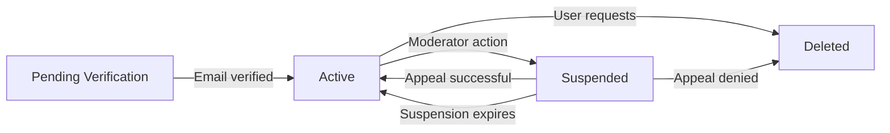

# Core User Features

## Overview and Scope

This document specifies the core user account features for the community platform, including registration, authentication, profile management, and the karma reputation system. These features form the foundation of user identity and engagement on the platform.

The scope covers:
- User registration and account creation workflow
- User authentication and login processes
- User profile management and customization
- The karma (reputation) system that tracks user contributions
- User preferences and settings management
- Account security and protection mechanisms
- User account lifecycle management and deletion

This document focuses on business requirements for how users interact with their accounts and build reputation. All user-facing behaviors and business logic are detailed here for backend developers to implement.

---

## User Registration System

### Registration Requirements

WHEN a guest user accesses the registration endpoint, THE system SHALL require the following information to create a new user account:
- Email address (must be a valid, unique email not already registered)
- Username (must be unique, 3-50 characters, alphanumeric characters plus hyphens and underscores allowed)
- Password (must meet security requirements specified below)

WHEN a guest user submits registration information, THE system SHALL validate all required fields are provided and properly formatted.

IF any required field is missing or invalid, THEN THE system SHALL return HTTP 400 with detailed validation error explaining what needs to be corrected.

### Username Validation Rules

THE username SHALL be the primary display identifier for the user across the platform.

THE system SHALL prevent username registration IF:
- The username is already taken by another user (case-insensitive check)
- The username is reserved for platform use (admin, moderator, system, etc.)
- The username contains offensive patterns or banned keywords (maintained by platform policy)
- The username is shorter than 3 characters or longer than 50 characters
- The username contains spaces or special characters (only alphanumeric, hyphens, underscores allowed)

WHEN a user attempts to register with an unavailable username, THE system SHALL return HTTP 409 Conflict with message: "This username is not available. Please try another."

THE system SHALL suggest alternative usernames if the requested username is taken: "Suggestions: username123, username_2024, realusername"

### Email Address Validation

THE system SHALL validate email addresses using RFC 5322 standard format.

WHEN a user submits an email address, THE system SHALL:
1. Verify format matches standard email pattern (local@domain.extension)
2. Check that email is not already registered (case-insensitive search)
3. Verify domain name is valid (has valid MX records, optional DNS validation)
4. Reject disposable email addresses (optional business policy)

IF email is already registered, THEN THE system SHALL return HTTP 409 with message: "This email is already in use. Please use a different email or reset your password if this is your account."

IF email format is invalid, THEN THE system SHALL return HTTP 400 with message: "Please enter a valid email address (e.g., name@example.com)."

### Password Requirements

THE system SHALL enforce these password security requirements:
- Minimum length of 8 characters
- Must contain at least one uppercase letter (A-Z)
- Must contain at least one lowercase letter (a-z)
- Must contain at least one number (0-9)
- Must not contain the user's username or email address (case-insensitive substring check)
- Must not be a common password from top 10,000 most used passwords list
- Must not repeat previous 5 passwords (for password changes)

THE password SHALL be hashed using bcrypt with a salt factor of 12 before storage in the system.

WHEN a user submits a password not meeting requirements, THE system SHALL return HTTP 400 with specific feedback:
- "Password must be at least 8 characters long."
- "Password must contain uppercase letters (A-Z)."
- "Password must contain lowercase letters (a-z)."
- "Password must contain numbers (0-9)."
- "Password must contain special characters (!@#$%^&*)."
- "Password cannot contain your username or email."
- "This password is too common. Please choose a stronger password."

### Email Verification Process

WHEN a user completes registration, THE system SHALL generate a unique email verification token and send it to the user's registered email address.

THE email verification token SHALL:
- Be cryptographically random (minimum 32 bytes of entropy)
- Expire after 24 hours
- Be single-use (invalidated after first use)
- Be delivered via HTTPS-only email link with unique token parameter

THE system SHALL require users to verify their email address before they can:
- Create posts in any community
- Create comments on any post
- Vote on posts or comments
- Create new communities
- Subscribe to communities

WHEN a user clicks the verification link in their email, THE system SHALL:
1. Validate the token has not expired
2. Check the token matches the one stored in database
3. Mark the user's email as verified
4. Invalidate the verification token (mark as used)
5. Enable all account features
6. Return success message: "Your email has been verified! You can now fully use the platform."

IF user does not verify their email within 24 hours, THEN THE system SHALL:
- Allow user to login but display banner: "Please verify your email to unlock full features."
- Prevent post creation with message: "Please verify your email before posting."
- Allow user to request new verification email (rate limited to once per 5 minutes)

WHEN user requests a new verification email, THE system SHALL:
- Generate a new token with 24-hour expiration
- Invalidate previous token
- Send new email with fresh verification link
- Display message: "A new verification email has been sent to [email@example.com]."

### Account Creation Success

WHEN email verification is complete, THE system SHALL:
- Create the user account with status "active"
- Initialize the user's karma score to 0
- Create empty preference and settings records
- Generate a unique user ID (UUID) for internal identification
- Enable all member features for the user
- Send welcome email with platform introduction

THE system SHALL return HTTP 201 Created with response containing:
```json
{
  "userId": "uuid-here",
  "username": "username",
  "email": "user@example.com",
  "createdAt": "2024-11-14T22:04:12Z",
  "emailVerified": true,
  "karma": 0,
  "message": "Account created successfully. Welcome to the community!"
}
```

---

## User Authentication and Login

### Login Process

WHEN a member attempts to login with email and password, THE system SHALL:
1. Verify the email address exists in the system
2. Retrieve the stored password hash for that email
3. Compare the provided password against the hash using bcrypt
4. If credentials match: Generate JWT tokens and return them to user
5. If credentials invalid: Return error without revealing which field failed

IF the email does not exist or password is incorrect, THEN THE system SHALL return HTTP 401 Unauthorized with generic message: "Invalid email or password."

This generic message prevents attackers from enumerating registered email addresses.

### Failed Login Attempt Tracking

THE system SHALL implement rate limiting on login attempts:

WHEN a failed login attempt occurs from an email or IP address, THE system SHALL:
- Increment the failed attempt counter for that identifier
- Log the failed attempt with timestamp and IP address

WHEN failed login attempts reach thresholds, THE system SHALL:
- After 3 failed attempts: Require CAPTCHA for subsequent login attempts
- After 5 failed attempts within 15 minutes: Temporarily lock that email/IP for 15 minutes
- Return HTTP 429 Too Many Requests with message: "Too many login attempts. Please try again after 15 minutes."
- Send security alert email to the account: "We detected multiple failed login attempts to your account. If this wasn't you, please secure your account."

THE system SHALL track failed attempts separately per:
- Email address (user could be from multiple IPs)
- IP address (multiple accounts on shared IP could be legitimate)
- Lock is applied to whichever threshold is reached first

THE system SHALL provide manual account unlock:
- Users can request immediate unlock via email verification link (valid 1 hour)
- Unlock link sent to registered email address
- Admin can manually unlock accounts if needed

### JWT Token Structure

THE system SHALL issue JWT tokens containing the following claims:
- `userId`: The unique identifier for the user
- `email`: The user's email address (included for convenience, not security-critical)
- `username`: The user's display username
- `role`: The user's role (member, moderator, administrator)
- `emailVerified`: Boolean indicating if email is verified (true/false)
- `karma`: Current karma score (cached at token creation)
- `iat`: Issued at timestamp (Unix epoch)
- `exp`: Expiration timestamp (15 minutes from issuance)
- `aud`: Audience claim set to "communityPlatform"
- `iss`: Issuer claim set to "communityPlatform"
- `jti`: Unique JWT ID for token tracking

THE JWT token SHALL be signed using HS256 algorithm with a secure secret key (minimum 256 bits of entropy).

THE access token expiration period SHALL be 15 minutes from creation. WHEN an access token expires, THE system SHALL require the user to either:
- Login again with credentials, OR
- Use a refresh token to obtain a new access token

### Login Success Response

WHEN credentials are valid, THE system SHALL return HTTP 200 with response:
```json
{
  "accessToken": "eyJhbGciOiJIUzI1NiIsInR5cCI6IkpXVCJ9...",
  "refreshToken": "eyJhbGciOiJIUzI1NiIsInR5cCI6IkpXVCJ9...",
  "expiresIn": 900,
  "user": {
    "userId": "uuid-here",
    "username": "username",
    "email": "user@example.com",
    "role": "member",
    "karma": 125,
    "emailVerified": true
  }
}
```

THE system SHALL log the successful login with:
- User ID
- Timestamp
- IP address
- User agent (device/browser info)

### Refresh Token Mechanism

WHEN a user has an expired access token, THE system SHALL allow them to obtain a new access token using a refresh token without re-entering credentials.

THE refresh token SHALL have the following properties:
- Expiration of 30 days from creation
- Stored in secure httpOnly cookie (prevent JavaScript access for XSS protection)
- Can only be used at the `/auth/refresh` endpoint
- Cannot be used for regular API requests

WHEN a user sends a refresh token to the `/auth/refresh` endpoint, THE system SHALL:
1. Validate refresh token signature and expiration
2. Retrieve user from database using subject claim
3. Verify user account is still active (not suspended)
4. Check that token hasn't been revoked (still in valid state)
5. Generate new access token with current user data
6. Optionally generate new refresh token (rolling refresh)
7. Return new access token to user

IF refresh token is invalid or expired, THEN THE system SHALL return HTTP 401 Unauthorized with message: "Session expired. Please login again."

### Logout Process

WHEN a member requests to logout, THE system SHALL:
- Remove refresh token from client storage
- Add refresh token to server-side revocation blacklist
- Invalidate the current access token
- Clear any session data associated with the user
- Log the logout event with timestamp and IP address

WHEN logout is complete, THE system SHALL return HTTP 200 with message: "Successfully logged out."

WHEN a user attempts to use a logged-out token, THE system SHALL return HTTP 401 Unauthorized with message: "Your session has ended. Please login to continue."

### Password Reset Process

WHEN a user requests a password reset (when they have forgotten their password), THE system SHALL:
1. Accept email address parameter
2. Check if email exists in system (return same message regardless for security)
3. If email exists: Generate password reset token (valid for 1 hour)
4. Send reset email with unique link containing token
5. Return HTTP 200 with message: "If this email is registered, password reset instructions have been sent."

THE password reset token SHALL:
- Be cryptographically random (32+ bytes)
- Expire after 1 hour
- Be single-use only
- Include hashed user ID for validation

WHEN a user submits a new password using the reset token, THE system SHALL:
- Validate the token has not expired (within 1 hour)
- Validate the token matches stored token for the account
- Validate the new password meets all password requirements
- Hash the new password with bcrypt using salt factor 12
- Update the user's stored password hash
- Invalidate all existing JWT tokens (force logout from all devices)
- Delete the reset token
- Send confirmation email to user: "Your password has been changed successfully."

IF the password reset token has expired (more than 1 hour old), THEN THE system SHALL return HTTP 400 with message: "This password reset link has expired. Please request a new password reset."

IF the password reset token is invalid, THEN THE system SHALL return HTTP 400 with message: "Invalid password reset link. Please request a new password reset."

### Session Management Details

WHEN a user logs in successfully, THE system SHALL create a session record containing:
- Session ID (unique identifier)
- User ID
- Login timestamp
- IP address of login
- User agent (device/browser identification)
- Last activity timestamp
- Session expiration timestamp (30 minutes of inactivity)

THE system SHALL maintain concurrent sessions for multiple devices:
- Each device/browser gets its own session record
- Each session has independent tokens
- Logout on one device does not affect other devices
- Users can view and manage active sessions from account settings

WHEN a session expires due to inactivity (30 minutes), THE system SHALL:
- Keep refresh token valid (allows resuming session)
- Invalidate access token
- Return HTTP 401 when access token is used
- Require refresh token or new login to continue

---

## User Profile Management

### User Profile Data

Each user profile SHALL include the following information:

**Core Profile Information:**
- User ID (system-generated UUID, immutable)
- Email address (private, only visible to the user themselves and admins)
- Username (public display name, immutable after creation)
- Account creation date (public, displayed as "Joined [Month] [Year]")
- Last activity timestamp (private, only visible to user)
- Current karma score (public, integer value)
- Email verification status (private, boolean: verified/unverified)

**Optional Profile Information:**
- Display name (full name or chosen display name, 0-100 characters, optional, public)
- Profile bio (short biography about user, 0-500 characters, optional, public)
- Profile image/avatar (user-uploaded image, optional, public URL)
- Location (text field for geographic location, 0-100 characters, optional, public)
- Website URL (external website link, 0-2048 characters, optional, public)
- Social media links (Twitter, GitHub, etc., optional, public)

**Account Status Information:**
- Account status (active, suspended, pending_deletion, deleted)
- Suspension end date (if applicable, null if permanent)
- Suspension reason (visible to user and admins)

### Profile Visibility Rules

WHEN a guest or member views another user's profile, THE system SHALL display:
- Username
- Account creation date (formatted as "Joined November 2024")
- Current karma score
- Verified email badge (if applicable)
- Moderator badges (list of communities where user moderates)
- Display name (if provided by user)
- Profile bio (if provided by user)
- Profile image (if provided by user)
- Location (if provided by user)
- Website URL (if provided by user)
- Social media links (if provided by user)
- Post and comment history (as documented in 10-user-profiles-analytics.md)
- Moderator/Administrator status badges

THE system SHALL NOT display to other users:
- Email address (except administrators)
- Last activity timestamp
- Account suspension details (except administrators)
- Password reset attempts
- Failed login attempts
- Account deletion requests

WHEN a user views their own profile, THE system SHALL additionally display:
- Email address (for account management)
- Last activity timestamp (for security awareness)
- All preferences and settings
- List of active sessions with device information
- Password change history
- Login history with dates and IP addresses

### Profile Editing

WHEN a member requests to edit their profile, THE system SHALL allow updates to:
- Display name (0-100 characters)
- Profile bio (0-500 characters)
- Profile image/avatar (image upload with specifications)
- Location (0-100 characters)
- Website URL (0-2048 characters, must be valid URL)
- Social media links (platform-specific validation)

THE system SHALL NOT allow users to change:
- Username (immutable after creation to maintain consistency)
- Email address (requires separate change process with verification)
- User ID (system-generated)
- Karma score (calculated by system only)
- Account creation date (immutable record)

WHEN a user updates their profile information, THE system SHALL:
- Validate all input according to constraints above
- Update the information immediately
- Display confirmation message: "Your profile has been updated successfully."
- Propagate changes throughout platform within 60 seconds
- Log the profile update in user's activity history

### Image Upload Specifications

WHEN a user uploads a profile image, THE system SHALL:
- Validate the image format (PNG, JPEG, WebP, GIF only)
- Validate the image file size (maximum 5 MB)
- Validate the image minimum dimensions (minimum 100x100 pixels)
- Validate the image maximum dimensions (maximum 10,000x10,000 pixels)
- Compress/optimize the image before storage (reduce file size without quality loss)
- Store the image in cloud storage
- Generate resized versions: thumbnail (100x100), medium (200x200), large (400x400)
- Return image URL with CDN path for fast delivery

IF the uploaded image fails validation, THEN THE system SHALL return HTTP 400 with specific error message:
- "File size exceeds 5 MB. Please choose a smaller image."
- "Image must be at least 100x100 pixels."
- "Unsupported image format. Use PNG, JPEG, WebP, or GIF."
- "File format does not match extension. Please verify the file."

WHEN a user uploads a new profile image, THE system SHALL replace the previous image and update all profile references within 60 seconds.

### Email Address Changes

WHEN a member requests to change their email address, THE system SHALL:
1. Require confirmation of the current password for security
2. Send a verification email to the new email address
3. Store the new email address in "pending" state
4. Require the user to verify the new email address before it becomes active
5. Send a confirmation email to the old email address notifying of the change

WHEN a user clicks the verification link in the new email address, THE system SHALL:
- Confirm the email change
- Update the email address to the new address
- Mark email as verified
- Send confirmation email to both old and new addresses
- Return success message: "Your email address has been updated successfully."

IF a user does not verify the new email within 24 hours, THEN THE system SHALL:
- Keep the old email address active
- Expire the pending email change
- Allow the user to try again with a new email address
- Display message: "Email change request expired. Please request a new change."

---

## Karma System

### Karma Overview

THE karma system is a reputation score that measures user contributions and community standing on the platform.

THE karma score reflects:
- Quality and value of posts created (positive contribution)
- Quality and value of comments created (positive contribution)
- Community votes received on posts and comments (positive from upvotes, negative from downvotes)
- Content removed by moderators (negative impact)
- User conduct and adherence to community rules (negative impact from violations)

THE karma score is:
- Public and visible on user profiles and next to their name in posts/comments
- Never reset (accumulates over user's lifetime on platform)
- Separate per user (one karma score per user account)
- Used to determine certain platform capabilities (documented below)

### Karma Calculation from Posts

WHEN a member creates a post that is published (not removed or deleted), THE system SHALL award the post creator 1 karma point.

WHEN a post created by a member receives an upvote, THE post creator SHALL receive 1 karma point.

WHEN a post created by a member receives a downvote, THE post creator SHALL lose 1 karma point.

WHEN a post's vote is changed (upvote to downvote, or vice versa), THE karma is recalculated:
- Removing upvote: -1 karma
- Removing downvote: +1 karma
- Changing from upvote to downvote: -2 karma net change
- Changing from downvote to upvote: +2 karma net change

### Karma Calculation from Comments

WHEN a member creates a comment that is published (not removed or deleted), THE system SHALL award the comment creator 1 karma point.

WHEN a comment created by a member receives an upvote, THE comment creator SHALL receive 1 karma point.

WHEN a comment created by a member receives a downvote, THE comment creator SHALL lose 1 karma point.

THE same vote change recalculation applies to comments as to posts.

### Karma Loss: Content Removal

WHEN a moderator removes a post, THE post creator SHALL lose karma equal to the number of upvotes that post received.

Example: If a post had 15 upvotes and 3 downvotes (net +12 karma), and is removed, the creator loses 15 karma (not 12).

WHEN a moderator removes a comment, THE comment creator SHALL lose karma equal to the number of upvotes that comment received.

WHEN a member deletes their own post, THE post creator SHALL lose karma equal to the net votes (upvotes minus downvotes). This encourages users to think before posting.

Example: If a post had 20 upvotes and 5 downvotes (net +15), and user deletes it, creator loses 15 karma.

WHEN a member deletes their own comment, THE comment creator SHALL lose karma equal to the net votes on that comment.

### Karma Loss: Content Violations

IF a member violates community rules and a moderator removes their content, THEN in addition to removing the post/comment, THE system SHALL deduct a one-time penalty:
- First violation in 90 days: -5 karma penalty
- Second violation in 90 days: -10 karma penalty
- Third violation in 90 days: -20 karma penalty
- Fourth+ violation in 90 days: -30 karma penalty each

THE violation penalties are cumulative and progressive (escalate with repeated violations).

IF a member is suspended by a moderator or administrator, THEN THE system SHALL deduct -50 karma as a platform-wide penalty.

IF a member is permanently banned, THEN THE system SHALL deduct -100 karma as a final penalty.

### Karma Thresholds and Restrictions

THE system SHALL restrict certain platform features based on karma score:

| Feature | Minimum Karma Required | Reason |\n|---|---|---|\n| Post creation | 0 karma | Open to all members once email verified |\n| Comment creation | 0 karma | Open to all members once email verified |\n| Image upload in posts | 10 karma | Prevents spam/abuse of image hosting |\n| External link posting | 20 karma | Prevents spam of external links |\n| Community creation | 50 karma | Requires demonstrated engagement |\n| Moderator assignment | 100 karma | Requires trusted, active member |\n| Community creation (any user) | No minimum | Any member can create after 1 week of membership |\n\nWHERE a community has custom karma requirements, those override the platform defaults.

WHEN a member attempts to perform an action they have insufficient karma for, THEN THE system SHALL return HTTP 403 Forbidden with message: \"You need [X] karma to do this. You currently have [Y] karma. You can earn karma by posting and receiving upvotes.\"

### Karma Display and Formatting

THE system SHALL display karma scores in the following contexts:
- User profile page (prominent display of lifetime karma)
- Next to username in posts (showing the author's karma at time of post)
- Next to username in comments (showing the author's karma at time of comment)
- In user listing/search results (showing current karma)
- In moderator listings (showing karma to establish credibility)

THE system SHALL display karma in standard numeric format (e.g., \"42\", \"1020\", \"-5\").

THE system SHALL NOT allow karma to go below 0. WHERE a calculation would result in negative karma, THE user's karma SHALL be set to 0 as the floor.

### Karma Tiers and Badges (Optional)

THE system MAY implement karma tier labels as visual indicators (optional feature):
- \"New Member\" - 0-10 karma
- \"Contributor\" - 11-100 karma
- \"Active Member\" - 101-500 karma
- \"Trusted Member\" - 501-2000 karma
- \"Community Leader\" - 2001+ karma

These badges are informational only and do NOT affect functionality or permissions.

### Karma Score Corrections

WHERE a moderator or administrator identifies a karma calculation error, THE system SHALL provide administrative action to correct it:
- Admin can view karma calculation details for any user
- Admin can manually adjust karma by ±X points with required reason
- Admin adjustments are logged in audit trail with timestamp and admin ID
- User is notified of significant adjustments via email

THE system SHALL track all karma adjustments for transparency and auditing.

---

## User Preferences and Settings

### Notification Preferences

WHEN a member accesses their settings, THE system SHALL allow configuration of the following notification preferences:

**Email Notification Settings:**
- Receive notifications when posts they created receive upvotes (default: enabled)
- Receive notifications when comments they created receive upvotes (default: enabled)
- Receive notifications when someone replies to their comment (default: enabled)
- Receive notifications when someone mentions them using @username (default: enabled)
- Receive notifications about community moderator actions affecting their content (default: enabled)
- Receive platform announcements and updates (default: enabled)

**Notification Frequency:**
- Instant (immediate email for each event)
- Daily digest (one email per day with all events at 9:00 AM user's timezone)
- Weekly digest (one email per week on Monday morning)
- Off (no notifications)

### Display Preferences

WHEN a member accesses their settings, THE system SHALL allow configuration of:
- Preferred post sorting default (hot, new, top, controversial - default: hot)
- Posts per page in feeds (10, 25, 50, 100 - default: 25)
- Preferred theme (light mode, dark mode, auto-detect - default: auto-detect)
- Show NSFW content (yes/no - default: no)
- Expand inline images and media (yes/no - default: yes)
- Open external links in new tab (yes/no - default: yes)

### Privacy Settings

WHEN a member accesses their settings, THE system SHALL allow configuration of:
- Show profile publicly (yes/no - default: yes)
- Show post history on profile (yes/no - default: yes)
- Show comment history on profile (yes/no - default: yes)
- Show karma score publicly (yes/no - default: yes)
- Allow direct messages from community members (yes/no/followers-only - default: yes)
- Show activity status (online/offline indicator - yes/no - default: no)
- Show follower/following lists (yes/no - default: yes)

### Content Filtering Preferences

WHEN a member accesses their settings, THE system SHALL allow filtering of content in feeds:
- Mute specific communities (posts from these communities won't appear in home feed)
- Mute specific keywords (posts/comments containing these words filtered from feed)
- Mute specific users (posts/comments from these users won't appear, but user can still view their profiles)
- Filter by content type (show/hide text-only posts, link posts, image posts independently)
- Hide NSFW-flagged content (respects global NSFW setting)

### Preference Storage and Application

WHEN a member makes changes to their preferences, THE system SHALL:
- Save changes immediately with confirmation: \"Your preferences have been saved.\"
- Apply changes to all future requests and feed generations
- NOT retroactively change previously displayed content
- Store preferences in encrypted user settings record

THE system SHALL retrieve and apply user preferences on every feed/list request and apply them consistently.

---

## Account Security Features

### Password Security

THE system SHALL store all passwords using bcrypt hashing with salt factor 12.

THE system SHALL never store passwords in plain text.

THE system SHALL never log or display passwords in any audit logs or error messages.

WHEN a password hash is stored, THE system SHALL ensure the hash includes the salt so password verification can be performed.

WHEN a user attempts to login, THE system SHALL compare the submitted password against the stored hash using bcrypt's timing-safe comparison to prevent timing attacks.

### Email Verification

THE system SHALL send verification emails with:
- Unique verification token (valid for 24 hours)
- Direct HTTPS link to verification endpoint with token parameter
- Plain language instructions for email verification
- Information about requesting a new verification email
- Expiration time clearly stated

THE verification endpoint SHALL:
- Accept the token as a URL parameter or POST parameter
- Validate the token exists and hasn't expired
- Validate the token hasn't been used before (single-use)
- Mark the email as verified in the system
- Return HTTP 200 with success message: \"Your email has been verified successfully!\"
- If token is invalid or expired, return HTTP 400 with explanation

### Account Session Management

WHEN a user logs in, THE system SHALL:
- Create a session record with login timestamp
- Store session ID securely in JWT token
- Store refresh token in httpOnly cookie
- Set session timeout to 30 minutes of inactivity
- Track session IP address and user agent for security analysis

IF a session expires due to inactivity, THEN THE system SHALL:
- Invalidate the access token
- Return HTTP 401 when access token is used
- Allow refresh token to extend session (user doesn't need to reauth)

THE system SHALL allow simultaneous login from multiple devices (each device maintains its own session).

WHEN logout-all-devices is requested (from Settings > Active Sessions), THE system SHALL:
- Provide option to \"Logout from all devices\"
- Invalidate all active sessions and JWT tokens for the user
- Send email notification confirming logout action
- Return success message: \"You have been logged out from all devices.\"

### Suspicious Activity Detection

WHERE enhanced security is desired, THE system SHALL detect unusual login patterns:

WHEN a login occurs from a new device or unusual location, THE system SHALL:
- Detect new device using user agent analysis and device fingerprinting
- Detect unusual location using IP geolocation (significant distance from usual locations)
- Send verification email to user: \"We detected a login from a new device [device type] in [location]. If this wasn't you, please secure your account immediately.\"
- Include device details: device type, browser, operating system, IP address, approximate location
- Require email confirmation within 1 hour to verify the login was authorized

WHEN user clicks verification link in email, THE system SHALL:
- Mark the device as verified/trusted
- Store device fingerprint for future reference
- Allow future logins from this device without additional verification

WHEN user denies the login attempt, THE system SHALL:
- Immediately revoke the suspicious token
- Force logout from that device
- Send alert email: \"If you did not authorize this login, please change your password immediately.\"

### Two-Factor Authentication (2FA) - Optional Enhancement

WHERE two-factor authentication is implemented, THE system SHALL support:
- Time-based One-Time Password (TOTP) using authenticator apps (Google Authenticator, Authy)
- Backup codes (10 single-use codes printed or downloaded at setup)

WHEN a user enables 2FA, THE system SHALL:
- Generate QR code for user to scan with authenticator app
- Require user to verify with first TOTP code before enabling
- Generate and display 10 backup codes (must be saved securely)
- Mark 2FA as enabled in user account
- Require TOTP or backup code at login after enabling

WHEN a user logs in with 2FA enabled, THE system SHALL:
- After password verification, request 6-digit TOTP code
- Accept either current TOTP code or one of backup codes (if backup code used, remove it from available codes)
- If code is invalid, return HTTP 401: \"Invalid verification code. Please try again.\"
- If too many failed attempts (3 fails in 15 minutes), temporarily lock account

---

## User Account Lifecycle

### Account States

Each user account can be in one of the following states:

**Pending Verification**: User has registered but not yet verified their email. Limited to viewing public content only. Expires after 30 days if not verified.

**Active**: User has verified email and is in good standing. Full access to all member features.

**Suspended**: User account has been temporarily suspended by a moderator or administrator. Cannot login, create content, or interact. Suspension has expiration date.

**Deleted**: User has deleted their account or was deleted by administrator. Account data has been removed per data retention policy.

### State Transition Diagram



### Account Suspension

WHEN a moderator or administrator suspends a user account, THE system SHALL:
- Set account status to \"Suspended\"
- Invalidate all active sessions and JWT tokens immediately
- Prevent any future login attempts with message: \"Your account has been suspended.\"
- Send suspension email to user explaining reason and duration
- Log the suspension action with timestamp, admin ID, and reason

THE suspension email SHALL include:
- Reason for suspension
- Duration (if temporary) or permanent notice
- Date user can resume access (if temporary)
- How to appeal the suspension
- Contact information for support

WHEN a moderator suspends a user, THE system SHALL also deduct -50 karma from the user's account as a consequence.

WHEN user appeals suspension, THE system SHALL follow the appeal process (documented in 09-content-moderation.md):
- Allow appeal submission within 30 days of suspension
- Route to moderator for review
- Notify user of appeal outcome
- If approved, reactivate account and restore -50 karma penalty

IF suspension duration expires, THE system SHALL automatically:
- Change account status back to \"Active\"
- Allow user to login again
- Send notification email: \"Your account suspension has ended. You can now login again.\"
- Restore -50 karma that was deducted (reinstate original karma value)

### Account Deletion

WHEN a user requests to delete their account, THE system SHALL:
1. Require password confirmation for security
2. Display warning: \"Deleting your account is permanent. Your posts and comments will be anonymized but not deleted.\"
3. Provide 48-hour cancellation period
4. After 48 hours without cancellation:
   - Set account status to \"Deleted\"
   - Permanently delete all personal account data (name, email, password, preferences)
   - Permanently delete email address so it can be registered again
   - Anonymize user ID (replace with system-generated anonymous ID)
   - All existing posts/comments marked with \"[deleted user]\" (content preserved)
   - Soft-delete user's posts and comments (hidden but archived)
   - Cancel all active subscriptions
   - Remove user from all communities
   - Delete all personal preferences and settings

THE system SHALL send confirmation emails at:
- Initial deletion request: \"Your account deletion request has been received. You have 48 hours to cancel this request.\"
- At cancellation deadline: \"If you have not canceled, your account will be permanently deleted [date/time].\"
- After deletion: \"Your account has been successfully deleted. All your personal information has been removed.\"

WHERE a user changes their mind during 48-hour cancellation period, THE system SHALL:
- Provide cancellation link in email
- Upon clicking: \"Your account deletion has been cancelled. Your account is still active.\"
- Re-activate account immediately

WHEN an administrator deletes a user account (for violations), THE system SHALL:
- Immediately delete the account without waiting period
- Delete all content created by user (hard delete)
- Send notification email to user explaining deletion and reason
- Log the deletion action for audit purposes
- NOT allow re-registration with same email (optional: prevent for 90 days)

### Account Recovery

WHEN a user has forgotten their password, THE system SHALL implement password reset as documented in \"Password Reset Process\" section above.

WHERE a user has lost access to their registered email, THE system SHALL:
- Provide account recovery form asking for username and security questions (if implemented)
- Verify user identity through security questions or other means
- Allow user to update their email address after verification
- Send verification email to new address
- After new email is verified, account is recovered

IF user cannot verify identity, THE system SHALL:
- Deny account recovery
- Provide support contact information
- Recommend contacting support@platform.com for manual verification

### Privacy Controls and Account Management

WHEN a user accesses their account settings, THE system SHALL provide:
- \"Account Information\" section showing username, email, join date, karma
- \"Security\" section with password change, 2FA settings, session management
- \"Privacy\" section with profile visibility and data settings
- \"Notifications\" section with email preferences
- \"Data\" section with options to download or delete personal data
- \"Account Deletion\" option with warning and 48-hour cancellation period

---

## Implementation Guidance for Backend Developers

### Validation Rules Summary

All user registration and update requests MUST validate:
- Email format using RFC 5322 regex and MX record verification (optional)
- Username format (alphanumeric, hyphens, underscores only; 3-50 characters)
- Password complexity (length, uppercase, lowercase, numbers, special chars)
- Profile fields (length limits, special character restrictions)
- Profile image uploads (format, size, dimensions)
- All inputs against SQL injection and XSS attack vectors

### Calculation Formulas

**Karma from Posts:**
```
karma_from_post = 1 (creation) + upvotes - downvotes - removal_penalty - violation_penalty
```

**Karma from Comments:**
```
karma_from_comment = 1 (creation) + upvotes - downvotes - removal_penalty - violation_penalty
```

**Total User Karma:**
```
total_karma = karma_from_all_posts + karma_from_all_comments + suspension_penalties
minimum_karma = 0
```

### Error Handling

- **400 Bad Request**: Invalid input (missing fields, wrong format, password too weak)
- **401 Unauthorized**: Invalid credentials, session expired, unauthorized access attempt
- **403 Forbidden**: User lacks sufficient karma, account suspended, action not allowed
- **404 Not Found**: User profile doesn't exist, account not found
- **409 Conflict**: Email already registered, username already taken
- **429 Too Many Requests**: Too many login attempts, rate limiting triggered
- **500 Internal Server Error**: System error, processed with logging for investigation

### Performance Expectations

- User registration: Complete within 2 seconds
- User login: Complete within 1 second (excluding network latency)
- Profile retrieval: Return within 300ms
- Profile update: Complete within 500ms
- Karma calculation and update: Complete within 500ms
- Preference update: Complete within 500ms
- Token refresh: Complete within 200ms

### Database Considerations

- All passwords stored as bcrypt hashes (never plain text)
- All timestamps stored as UTC
- Indexes required on: email, username, created_at, karma_score
- Sessions stored in Redis with TTL
- Audit logs stored separately with immutable timestamps

---

> *Developer Note: This document defines **business requirements only**. All technical implementations (architecture, APIs, database design, etc.) are at the discretion of the development team.*