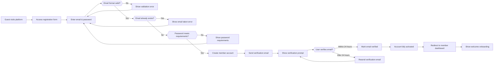
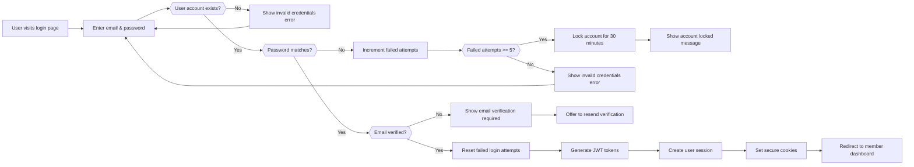
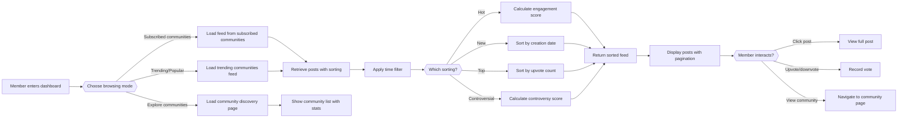
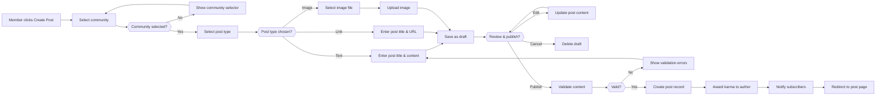
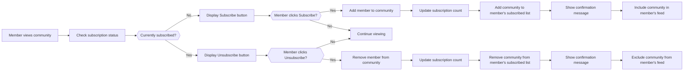
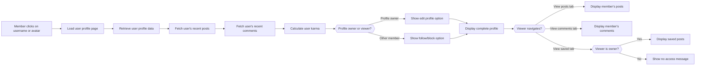
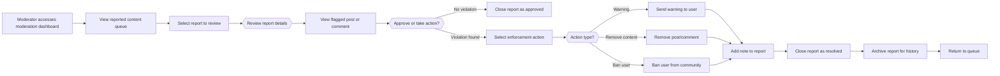

# Core User Workflows

## 1. Document Overview

This document defines the primary user journeys and workflows for the Community Platform. It describes how different user actors (guests, members, moderators, and admins) interact with the system to accomplish their goals. Each workflow includes step-by-step interactions, decision points, system validations, and error handling scenarios.

These workflows serve as the foundation for understanding how the platform operates and guide the implementation of core business logic, authentication flows, and feature functionality. Backend developers should use these workflows to understand the complete lifecycle of user interactions and implement appropriate validation, permission checking, and state management.

---

## 2. User Registration & Onboarding

### 2.1 Guest to Member Registration Workflow

### 2.2 Registration Requirements (EARS Format)

**Account Creation Rules:**

WHEN a guest submits registration credentials, THE system SHALL validate email format against RFC 5322 standard email format specification.

WHEN a guest submits registration credentials, THE system SHALL verify the email address is not already associated with an existing account.

WHEN a guest submits registration credentials, THE system SHALL enforce password requirements: minimum 8 characters, at least one uppercase letter, at least one lowercase letter, at least one number, and at least one special character.

IF password validation fails, THEN THE system SHALL reject the registration and return a specific error indicating which requirements were not met.

WHEN account creation succeeds, THE system SHALL generate a unique email verification token with 24-hour expiration.

WHEN account creation succeeds, THE system SHALL send a verification email containing a unique link to the guest's provided email address.

THE system SHALL allow registration only for guests (unauthenticated users).

**Email Verification:**

WHEN a user clicks the verification link within 24 hours, THE system SHALL mark the email as verified and fully activate the account.

IF a verification link expires after 24 hours, THEN THE system SHALL show an option to resend the verification email.

WHEN a user requests to resend verification email, THE system SHALL generate a new token and send a new email.

THE system SHALL allow maximum 5 verification email resends within 24-hour period.

IF a user exceeds 5 resend attempts, THEN THE system SHALL temporarily lock the registration and require manual support intervention.

**Onboarding:**

WHEN an account is fully activated, THE system SHALL create an empty user profile with default settings.

WHEN a new member completes verification, THE system SHALL display welcome information suggesting they browse communities or create their first post.

WHEN a new member logs in for the first time post-verification, THE system SHALL show an onboarding guide highlighting major features.

### 2.3 Success Outcome

Registration is successful when:
- Email is valid and unique
- Password meets all security requirements
- Email verification is completed within 24 hours
- Member account is activated and ready for login
- User receives confirmation and can begin participating

---

## 3. User Login & Session Management

### 3.1 Member Authentication Workflow

### 3.2 Authentication Requirements (EARS Format)

**Login Process:**

WHEN a user submits login credentials, THE system SHALL validate email format and check if account exists.

IF credentials are invalid, THEN THE system SHALL NOT disclose whether email exists or password is wrong (generic error message).

WHEN a user enters incorrect password, THE system SHALL increment a failed login counter for that account.

WHEN a user has 5 failed login attempts within 15 minutes, THE system SHALL lock the account for 30 minutes.

IF an account is locked, THEN THE system SHALL show the user the timestamp when they can attempt login again.

WHEN a locked account's 30-minute window expires, THE system SHALL automatically unlock the account.

WHEN login credentials are correct and account is not locked, THE system SHALL verify email is confirmed before granting access.

IF email is not confirmed, THEN THE system SHALL prompt user to verify email and offer to resend verification link.

**Session & Token Management:**

WHEN login is successful, THE system SHALL generate two JWT tokens: access token (15-minute expiration) and refresh token (7-day expiration).

THE access token SHALL contain userId, role (member/moderator/admin), and permissions array as JWT claims.

WHEN an access token expires, THE system SHALL require the user to use the refresh token to obtain a new access token.

WHEN a refresh token expires, THE system SHALL terminate the session and require re-authentication.

THE system SHALL allow members to maintain only ONE active session per device (logout from previous session).

WHEN a member logs in from a new device, THE system SHALL invalidate the refresh token from the previous device.

WHEN a member manually logs out, THE system SHALL invalidate both access and refresh tokens immediately.

THE system SHALL store refresh tokens securely server-side with expiration timestamps.

**Session Security:**

THE system SHALL use HTTPS/TLS for all authentication-related communications.

THE system SHALL NOT transmit passwords in plain text.

THE system SHALL hash passwords using bcrypt algorithm with minimum 12 salt rounds.

THE system SHALL implement CSRF (Cross-Site Request Forgery) protection using SameSite cookie attributes.

THE system SHALL require re-authentication for sensitive operations (password change, email change, account deletion).

### 3.3 Success Outcome

Login is successful when:
- Credentials are valid and email is verified
- Failed login attempts are reset to zero
- JWT tokens are generated and securely transmitted
- User session is created and authenticated
- User can access member-only features

---

## 4. Member Browse & Discovery Flow

### 4.1 Content Discovery Workflow

### 4.2 Discovery & Browsing Requirements (EARS Format)

**Feed Types:**

WHEN a member visits the dashboard, THE system SHALL display their personalized feed containing posts from communities they are subscribed to.

WHEN a member is not subscribed to any communities, THE system SHALL show trending and popular communities to encourage exploration.

WHEN a member accesses the public feed, THE system SHALL display posts from all public communities regardless of subscription status.

WHERE a member is a community moderator, THE system SHALL provide access to a moderation dashboard showing flagged content from their communities.

**Sorting & Filtering:**

WHEN a member selects "Hot" sorting, THE system SHALL calculate a hotness score based on upvote count and time since posting, showing recently popular posts.

WHEN a member selects "New" sorting, THE system SHALL display posts in reverse chronological order with newest first.

WHEN a member selects "Top" sorting, THE system SHALL display posts sorted by total upvotes in descending order.

WHEN a member selects "Controversial" sorting, THE system SHALL calculate a controversy score based on the difference between upvotes and downvotes, showing posts with high engagement but divided opinion.

WHEN a member applies a time filter, THE system SHALL limit results to posts created within the selected time period (Last 24 hours, Last week, Last month, All time).

WHEN a member applies filters, THE system SHALL persist filter preferences for the current session.

THE system SHALL return results using cursor-based pagination with 20 posts per page.

**Community Discovery:**

WHEN a member accesses the community exploration page, THE system SHALL display a list of all public communities with names, descriptions, member counts, and subscription buttons.

WHEN a member searches for a community, THE system SHALL perform full-text search across community names and descriptions.

THE system SHALL allow sorting communities by member count, activity level, or creation date.

WHEN a member clicks on a community, THE system SHALL navigate to the community page showing recent posts and community details.

**Post Preview Information:**

THE system SHALL display for each post: title, preview text, author name, creation timestamp, upvote/downvote counts, comment count, and community name.

THE system SHALL display post type indicator (text, link, or image) to members.

WHEN a post contains an image, THE system SHALL display a thumbnail image in the feed.

### 4.3 Success Outcome

Discovery browsing is successful when:
- Member can access personalized feed from subscribed communities
- Member can browse and filter posts using various sorting methods
- Member can discover new communities and content
- Member can view post previews with essential information
- Member can navigate to full posts and communities for detailed viewing

---

## 5. Member Post Creation Flow

### 5.1 Post Creation Workflow

### 5.2 Post Creation Requirements (EARS Format)

**Post Submission:**

WHEN a member clicks the create post button, THE system SHALL display a community selector showing all communities they are members of.

WHEN a member attempts to post in a community they are not subscribed to, THE system SHALL show a message offering to subscribe.

WHEN a member selects a community, THE system SHALL load the post creation form for that community.

WHEN a member is a community moderator, THE system SHALL provide an option to "Distinguish" the post as a moderator post.

**Post Types & Content:**

WHEN a member selects "Text" post type, THE system SHALL accept a title (required, 1-300 characters) and body text (required, 1-40000 characters).

WHEN a member selects "Link" post type, THE system SHALL accept a title (required, 1-300 characters) and URL (required, valid HTTP/HTTPS URL with domain validation).

WHEN a member selects "Image" post type, THE system SHALL accept a title (required, 1-300 characters) and image file (required, JPG/PNG/GIF format, maximum 50MB).

WHEN a member uploads an image, THE system SHALL validate file format by checking magic bytes (not just file extension).

WHEN a member uploads an image, THE system SHALL store the image and generate a permanent URL.

IF image upload fails, THEN THE system SHALL delete the temporary file and show error message to user.

THE system SHALL require all post titles to be non-empty and between 1-300 characters.

WHEN a member enters a title shorter than required, THE system SHALL show a real-time character counter.

**Draft Management:**

WHEN a member clicks away from the post creation form, THE system SHALL automatically save the post content as a draft.

WHEN a member returns to create a new post, THE system SHALL display an option to continue with their existing draft.

THE system SHALL store drafts for maximum 30 days before automatic deletion.

WHEN a member manually deletes a draft, THE system SHALL permanently remove the draft.

**Content Validation:**

BEFORE a post is published, THE system SHALL validate title is non-empty and within length limits.

BEFORE a post is published, THE system SHALL validate body/URL/image is provided according to post type.

BEFORE a post is published, THE system SHALL check if the member has received a community-level ban from this community.

IF the member is banned from the community, THEN THE system SHALL reject the post and show message.

BEFORE a post is published, THE system SHALL check if the member's account is in good standing (not suspended or restricted).

IF the member is restricted, THEN THE system SHALL reject the post with appropriate message.

**Publication & Notification:**

WHEN post validation succeeds, THE system SHALL create the post record with initial state as "published".

WHEN a post is published, THE system SHALL assign karma points to the author (base 1 point for creating a post).

WHEN a post is published, THE system SHALL notify all subscribers of the community about the new post.

WHEN a post is published, THE system SHALL make it visible in the community feed and subscribed members' feeds.

**Visibility Rules:**

WHEN a post is published, THE system SHALL be visible to all members of the public community.

WHERE a community is private, THE system SHALL make the post visible only to community members.

WHEN a community moderator removes a post, THE system SHALL replace post content with "[removed by moderator]" but keep the post structure intact.

WHEN a member deletes their own post, THE system SHALL soft-delete the post (retain data but mark as deleted) and deduct karma points.

### 5.3 Success Outcome

Post creation is successful when:
- Member selects a valid community
- Member provides required content according to post type
- Content passes all validation checks
- Post is published and visible to appropriate audience
- Author receives karma points
- Subscribers receive notifications

---

## 6. Member Commenting & Engagement Flow

### 6.1 Comment Creation & Threading Workflow

```mermaid
graph LR
    A["Member views post"] --> B["Review existing comments"]
    B --> C{{"Member wants to comment?"}}
    C -->|"No"| D["Continue browsing"]
    C -->|"Yes"| E{{"Reply to post or comment?"}}
    E -->|"Post level"| F["Enter comment text"]
    E -->|"Nested reply"| G["Select parent comment"]
    G --> F
    F --> H{{"Comment content valid?"}}
    H -->|"No"| I["Show validation error"]
    I --> F
    H -->|"Yes"| J["Create comment record"]
    J --> K["Award karma to author"]
    K --> L["Notify relevant users"]
    L --> M["Display comment in thread"]
    M --> N{{"Member votes?"}}
    N -->|"Upvote"| O["Record upvote"]
    N -->|"Downvote"| P["Record downvote"]
    N -->|"No vote"| Q["Continue viewing"]
    O --> R["Update vote count"]
    P --> R
    R --> Q
```

### 6.2 Commenting Requirements (EARS Format)

**Comment Submission:**

WHEN a member views a post, THE system SHALL display existing comments in a threaded view.

WHEN a member clicks to comment on a post, THE system SHALL display a comment composition form.

WHEN a member clicks to reply to a comment, THE system SHALL display a reply form nested under the parent comment with clear indication of the parent.

WHEN a member submits a comment, THE system SHALL validate the comment content is non-empty and between 1-5000 characters.

IF comment content is invalid, THEN THE system SHALL show validation error with specific requirements.

BEFORE a comment is posted, THE system SHALL verify the member can post in this community (not banned).

BEFORE a comment is posted, THE system SHALL verify the member's account is in good standing.

WHEN comment validation succeeds, THE system SHALL create the comment record with creation timestamp and linked to parent post or parent comment.

WHEN a comment is created, THE system SHALL assign karma points to the author (base 1 point for posting a comment).

**Comment Threading:**

WHEN a comment is posted as a reply to another comment, THE system SHALL create a parent-child relationship in the data structure.

THE system SHALL support unlimited nesting depth for comment threads.

WHEN a member views a post with many nested comments, THE system SHALL allow expanding/collapsing comment threads.

WHEN a member expands a collapsed comment thread, THE system SHALL load all child comments of that comment.

WHEN displaying comments, THE system SHALL show the comment tree structure with clear visual indentation to indicate nesting level.

**Comment Display & Sorting:**

WHEN a member views comments on a post, THE system SHALL display comments sorted by top-level first (highest scored parent comments first).

WHEN a member expands a comment thread, THE system SHALL display child comments sorted by score (highest upvoted first) by default.

WHEN a member selects different sorting for comments, THE system SHALL support "New" (newest first), "Top" (highest score first), and "Best" (Reddit algorithm).

WHEN a comment has many replies, THE system SHALL use pagination or lazy loading to avoid loading all replies at once.

**Comment Editing & Deletion:**

WHEN a member who authored a comment views it within 24 hours, THE system SHALL display an "Edit" option.

WHEN a member edits their comment after 24 hours, THE system SHALL show that the comment was edited and display the edit timestamp.

IF a member attempts to edit a comment after the time limit, THEN THE system SHALL disable editing.

WHEN a member deletes their own comment, THE system SHALL soft-delete the comment (replace content with "[deleted by user]" but keep structure).

WHEN a moderator removes a comment, THE system SHALL replace content with "[removed by moderator]".

WHEN a comment is deleted, THE system SHALL deduct karma points from the author if applicable.

**Notifications:**

WHEN a member receives a reply to their comment, THE system SHALL notify them with the reply content and link to the thread.

WHEN a member's comment receives significant engagement (10+ upvotes), THE system SHALL optionally notify them.

WHEN a member is mentioned in a comment (username tag), THE system SHALL notify them of the mention.

THE system SHALL allow members to configure notification preferences (real-time, digest, or disabled).

### 6.3 Voting on Comments (EARS Format)

**Vote Recording:**

WHEN a member clicks the upvote button on a comment, THE system SHALL record the vote and increment the vote counter.

WHEN a member clicks the downvote button on a comment, THE system SHALL record the vote and decrement the vote counter.

IF a member has already voted on a comment, THEN THE system SHALL allow them to change their vote by clicking the opposite button.

WHEN a member changes their vote, THE system SHALL update the vote count accordingly.

IF a member clicks the same vote button twice, THEN THE system SHALL remove the vote (toggle behavior).

THE system SHALL NOT allow a member to vote on their own comments.

IF a member attempts to vote on their own comment, THEN THE system SHALL show a message preventing the action.

**Vote Count Updates:**

THE system SHALL display current upvote and downvote counts for each comment.

WHEN a comment's total votes change, THE system SHALL update the displayed score in real-time.

THE system SHALL calculate the net score as upvotes minus downvotes.

WHERE the net score becomes negative (more downvotes than upvotes), THE system SHALL optionally collapse the comment with option to expand.

IF a comment's score drops below community thresholds, THE system MAY restrict its visibility.

### 6.4 Success Outcome

Commenting workflow is successful when:
- Member can post comments on posts and reply to comments
- Comment threads are properly structured and displayable
- Comments can be voted on and sorted appropriately
- Comment authors receive karma and notifications
- Members can edit and delete their own comments within allowed timeframes

---

## 7. Community Subscription Management

### 7.1 Subscribe/Unsubscribe Workflow

### 7.2 Subscription Requirements (EARS Format)

**Subscription Actions:**

WHEN a member views a community page, THE system SHALL display the current subscription status and allow subscribing/unsubscribing.

WHEN a member clicks the Subscribe button, THE system SHALL add them to the community's member list.

WHEN a member clicks the Unsubscribe button, THE system SHALL remove them from the community's member list.

WHEN a member subscribes to a community, THE system SHALL immediately begin including posts from that community in their personalized feed.

WHEN a member unsubscribes from a community, THE system SHALL immediately exclude posts from that community from their feed.

WHEN a member subscribes, THE system SHALL update the community's member count.

THE system SHALL allow a member to resubscribe to a community they previously unsubscribed from.

**Subscription Persistence:**

THE system SHALL maintain a list of all communities each member is subscribed to.

WHEN a member logs out and logs back in, THE system SHALL restore their subscription list.

THE system SHALL display the count of communities each member is subscribed to on their profile.

**Default Communities:**

WHEN a new member completes registration, THE system MAY optionally suggest popular communities to subscribe to.

IF the member accepts suggestions, THE system SHALL automatically subscribe them to those communities.

**Community Member List:**

WHEN a member views a community, THE system SHALL display the total count of members subscribed to that community.

WHERE a member is a community moderator, THE system SHALL allow viewing the list of all community members.

### 7.3 Success Outcome

Subscription management is successful when:
- Member can subscribe to any public community
- Member can unsubscribe from communities
- Subscription status is persistent across sessions
- Member's feed reflects current subscriptions
- Community member counts are accurate

---

## 8. User Profile Access Flow

### 8.1 Profile Viewing Workflow

### 8.2 Profile Access Requirements (EARS Format)

**Profile Display:**

WHEN a member clicks on another member's username or avatar, THE system SHALL load that member's profile page.

WHEN a profile page loads, THE system SHALL display the following information:
- Username
- Account creation date (join date)
- Total karma points (global and per-community breakdown)
- Badge/achievement information
- Brief bio or description (if provided by user)
- Profile picture (if uploaded)
- Counts of posts, comments, and awards received

WHERE a member is a community moderator or admin, THE system SHALL display a badge or indicator next to their name showing moderator/admin status.

WHEN a member views their own profile, THE system SHALL display the "Edit Profile" button.

**Profile Tabs:**

THE system SHALL display the following tabs on a member profile: Posts, Comments, Saved (for owner only), Overview.

WHEN a member clicks the "Posts" tab, THE system SHALL display all posts created by that member sorted by recency with pagination.

WHEN a member clicks the "Comments" tab, THE system SHALL display all comments created by that member sorted by recency with pagination.

WHEN a member (as profile owner) clicks the "Saved" tab, THE system SHALL display all posts and comments the member has saved/bookmarked.

WHEN a non-owner clicks the "Saved" tab, THE system SHALL show a message that this information is private.

**Profile Interactions:**

WHEN a member views another member's profile, THE system SHALL display options to follow/unfollow or block the member.

WHEN a member follows another member, THE system SHALL subscribe to notifications about that member's posts.

WHEN a member blocks another member, THE system SHALL prevent that member from viewing their profile or sending messages.

**Profile Privacy:**

WHEN a member views their own profile, THE system SHALL display private information (email, account settings, saved content).

WHEN another member views a profile, THE system SHALL only display publicly available information.

WHERE a member has enabled "Private Profile" mode, THE system SHALL restrict visibility of their posts and comments to limited audience.

### 8.3 Success Outcome

Profile access workflow is successful when:
- Member can view any public profile
- Profile displays complete user information and statistics
- Member can browse other member's posts and comments
- Saved content is only visible to profile owner
- Profile interactions (follow/block) work correctly

---

## 9. Moderator Content Review Flow

### 9.1 Community Moderation Workflow

### 9.2 Moderation Requirements (EARS Format)

**Report Review:**

WHEN a community moderator accesses their moderation dashboard, THE system SHALL display a queue of reported posts and comments.

WHEN a moderator selects a report, THE system SHALL display the report details including:
- Reported content (post or comment)
- Reason for report selected by reporter
- Reporter's comment/explanation
- Date and time of report
- Reporting user information

THE system SHALL display the flagged content in context (within the post/thread).

WHEN a moderator reviews a report, THE system SHALL show the user history of enforcement actions (previous warnings or bans) for the reported user.

**Moderator Actions:**

WHEN a moderator determines content is not in violation, THE system SHALL allow them to "Approve" the report and close it.

WHEN a moderator finds content violates rules, THE system SHALL allow the following actions:
1. **Send Warning**: Issue formal warning to content creator without removing content
2. **Remove Content**: Delete the post or comment and optionally notify the user
3. **Ban User**: Remove user from community and prevent future posts

WHEN a moderator removes content, THE system SHALL optionally provide a reason to display to the user.

WHEN a moderator bans a user, THE system SHALL allow setting the ban duration (temporary or permanent).

**Enforcement Tracking:**

WHEN a moderator takes action on a report, THE system SHALL create an enforcement record documenting:
- Action taken
- Reason provided by moderator
- Date and time of action
- Moderator who took action

THE system SHALL display enforcement history on the reported user's profile (visible to moderators and admins).

THE system SHALL allow moderators to appeal decisions made by other moderators (escalate to platform admin).

**Community Rules:**

WHERE a community has established rules, THE system SHALL display them to all users viewing the community.

WHEN a moderator creates/edits community rules, THE system SHALL display them prominently.

WHEN content violates stated community rules, THE system SHALL allow moderators to cite the specific rule when taking action.

### 9.3 Success Outcome

Moderation workflow is successful when:
- Moderators can access reports and review flagged content
- Moderators can take appropriate enforcement actions
- Users are notified of moderation decisions
- Enforcement history is tracked and accessible
- Community rules are enforced consistently

---

## 10. Error Handling & Recovery Scenarios

### 10.1 Common Error Scenarios

**Authentication Errors:**

IF a user submits incorrect login credentials, THEN THE system SHALL NOT reveal whether the email or password is wrong, showing generic "Invalid credentials" message.

IF a user's account is locked due to failed login attempts, THEN THE system SHALL show the time when they can retry.

IF a user's session expires, THEN THE system SHALL redirect them to login and notify them their session timed out.

**Content Validation Errors:**

IF a post title exceeds maximum length, THEN THE system SHALL show real-time character count and prevent submission.

IF an image upload fails, THEN THE system SHALL preserve the post draft and allow user to retry with different image.

IF a comment becomes too nested (if depth limits apply), THEN THE system SHALL prevent posting and explain the limitation.

**Permission Errors:**

IF a member attempts to vote on their own content, THEN THE system SHALL silently prevent the action or show message.

IF a member attempts to post in a community they don't have permission for, THEN THE system SHALL show "Access Denied" message.

IF a member attempts to access another member's private profile data, THEN THE system SHALL show "Not Found" or "No Access" message.

**Network & Technical Errors:**

WHEN a user experiences a network error during post submission, THE system SHALL save the post as a draft automatically.

WHEN an image upload is interrupted, THE system SHALL allow resuming the upload without losing progress.

WHEN a member's connection drops during active session, THE system SHALL gracefully handle reconnection without losing data.

### 10.2 Recovery Mechanisms

**Data Loss Prevention:**

WHEN a member is editing content, THE system SHALL auto-save at regular intervals (every 30 seconds).

WHEN a member navigates away from an unsaved form, THE system SHALL display confirmation dialog.

WHEN a form is submitted successfully, THE system SHALL clear any auto-save data.

**Session Recovery:**

WHEN a user's access token expires but refresh token is valid, THE system SHALL automatically request new access token.

THE system SHALL handle token refresh transparently without user intervention.

IF refresh token is also expired, THEN THE system SHALL redirect to login.

**Error Recovery UI:**

WHEN an error occurs, THE system SHALL display clear error message in user's locale language.

THE system SHALL provide actionable next steps (e.g., "Retry", "Go Back", "Report Issue").

WHERE applicable, THE system SHALL provide support documentation links.

---

## 11. End-to-End User Journey Summary

### Complete User Lifecycle

This section summarizes the complete journey of a typical community platform user:

1. **Guest to Member**: Unregistered user discovers the platform, completes registration, verifies email
2. **First Login**: Member authenticates and receives JWT tokens for session management
3. **Onboarding**: System suggests communities to join based on interests
4. **Exploration**: Member browses communities, discovers posts using various sorting methods
5. **Content Creation**: Member creates their first post in a community, earns karma points
6. **Engagement**: Member comments on posts, votes on content, builds reputation
7. **Community Building**: Member subscribes to multiple communities curated for their interests
8. **Profile Development**: Member's profile grows with posts, comments, karma, and badges
9. **Sustained Participation**: Member continues to browse, post, and engage with community
10. **Moderation (Optional)**: Active member becomes community moderator, helps manage community
11. **Admin (Optional)**: Trusted moderators promoted to platform admin for system-wide management

---

## 12. Business Rules Enforcement in Workflows

### Critical Business Rules Applied Across Workflows

**Karma System Enforcement:**

Karma is awarded for creating posts (+1), creating comments (+1), receiving upvotes (+1 per upvote).

Karma is deducted for receiving downvotes (-1 per downvote) and when user deletes content (-1 per point earned).

Users with negative karma may face posting restrictions.

Karma is tracked globally and per-community.

**Time-Based Restrictions:**

Users can edit posts/comments within 24 hours of creation.

Email verification must complete within 24 hours of registration.

Account lockout lasts 30 minutes after 5 failed login attempts.

Drafts are automatically deleted after 30 days of inactivity.

**Permission Hierarchy:**

Guests: View-only access to public communities and posts.

Members: Create content, vote, comment, subscribe, manage own profile.

Community Moderators: Remove content, ban users, manage community within their communities.

Platform Admins: Full system access, global moderation, user management.

**Validation Requirements:**

All user-generated content must pass validation before persistence.

Usernames must be unique and 3-20 characters long.

Passwords must meet security requirements (8+ chars, mixed case, numbers, special chars).

Post titles must be 1-300 characters.

Post body must be 1-40000 characters.

Comments must be 1-5000 characters.

Email addresses must be valid and unique.

---

## 13. Related Documentation

For implementation details and additional requirements, refer to the following documents:

- [Authentication & User Actors Documentation](./02-user-actors-authentication.md) - Detailed authentication flows and permission matrices
- [Community Management Requirements](./04-community-management.md) - Community creation and moderation features
- [Content Creation Specifications](./05-content-creation-posting.md) - Post types and content management
- [Commenting & Engagement System](./06-commenting-engagement.md) - Comment threading and voting mechanics
- [Karma & Reputation System](./07-karma-reputation-system.md) - Detailed karma calculation rules
- [Content Discovery & Sorting](./08-content-discovery-sorting.md) - Feed algorithms and sorting specifications
- [Moderation & Reporting](./09-moderation-reporting.md) - Content reporting and enforcement workflows

---

> *Developer Note: This document defines **business requirements only**. All technical implementations (architecture, APIs, database design, etc.) are at the discretion of the development team. This document describes WHAT the system should do from a business perspective, not HOW to build it technically.*