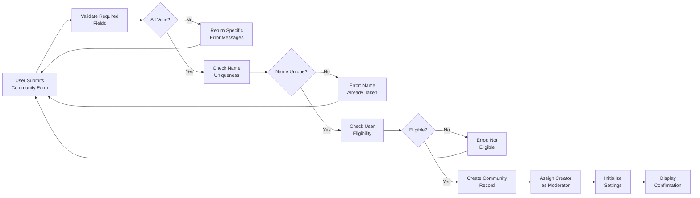

# Communities Creation, Management, and Moderation

## 1. Community Creation and Setup

### 1.1 Community Creation Eligibility

WHEN a member attempts to create a community, THE system SHALL verify that the member meets all eligibility requirements before allowing community creation.

**Eligibility Requirements:**
- THE user SHALL have member role or higher (members, moderators, and admins can create communities)
- THE user SHALL have verified their email address before creating a community
- THE user SHALL have at least 100 karma (accumulated from posts and comments)
- THE user SHALL not have been suspended or banned from the platform
- THE user SHALL not have created more than 10 communities in a rolling 30-day period

WHEN a member does not meet eligibility criteria, THE system SHALL deny the creation request and display the specific reason(s) why the member is not eligible. THE error message SHALL include the missing requirement (e.g., "You need 100 karma to create a community. Your current karma: 45") and suggest how to meet the requirement.

### 1.2 Community Information Requirements

WHEN a member creates a community, THE system SHALL require the following mandatory information:

**Required Community Information:**
- **Community Name**: 3-30 characters, must be unique across the platform, alphanumeric with hyphens and underscores allowed
  - THE system SHALL validate name is not already taken (case-insensitive comparison)
  - THE system SHALL reject names matching reserved system names (admin, system, moderator, official, etc.)
  - THE system SHALL reject names containing only numbers
  
- **Community Display Title**: Human-readable community name (different from URL slug), max 60 characters
  - THE system SHALL allow spaces and punctuation in display title
  - THE system SHALL accept same display title across multiple communities (display title can be non-unique)
  
- **Community Description**: 10-500 characters describing the community's purpose and topic
  - THE system SHALL reject descriptions with only whitespace
  - THE system SHALL accept markdown formatting in descriptions
  
- **Primary Category**: Select one from predefined categories (Technology, Gaming, Sports, Entertainment, News, Lifestyle, Education, Science, Creative, Other)
  - THE system SHALL validate category is from approved list only
  - THE system SHALL reject unknown or invalid category selections
  
- **Community Type**: Public or Private
  - THE system SHALL clearly explain differences (Public: visible to all, Private: members only)
  - THE system SHALL allow type change later by community owner

**Optional Community Information:**
- Community icon/logo image (PNG or JPG, max 2MB, recommended 256x256px)
  - THE system SHALL validate image format and size before accepting
  - THE system SHALL reject images that fail validation with specific error message
  
- Community banner image (PNG or JPG, max 5MB, recommended 1200x300px)
  - THE system SHALL validate image dimensions and file size
  - THE system SHALL reject oversized or improperly formatted images
  
- Community rules (1-10 rules, each 10-500 characters explaining community policy)
  - THE system SHALL enforce maximum 10 rules per community
  - THE system SHALL display rules prominently when members join
  
- Community sidebar content (up to 2000 characters for additional information)
  - THE system SHALL preserve formatting and links in sidebar content
  - THE system SHALL sanitize HTML and prevent injection attacks

### 1.3 Community Creation Process

WHEN a member submits a community creation request with all required information, THE system SHALL execute the following steps in order:

1. **Input Validation**: Validate all required fields meet format and content requirements
2. **Uniqueness Check**: Verify the community name is unique (case-insensitive)
3. **Slug Generation**: Generate a URL-safe slug from the community name for use in URLs
4. **Community Record Creation**: Create the community record with status "active"
5. **Creator Assignment**: Assign the creating member as the first moderator with full permissions
6. **Initialization**: Initialize community statistics counters at zero
7. **Default Settings**: Set default community settings (visibility, post types, archival age)
8. **Timestamp Recording**: Record creation timestamp and creator metadata
9. **Confirmation Display**: Display confirmation to the member with community details

IF any validation fails, THE system SHALL return specific error messages indicating what needs to be corrected. THE system SHALL allow the member to revise and resubmit without loss of entered information.

**Creation Validation Sequence:**

### 1.4 Initial Community Defaults

WHEN a community is created, THE system SHALL initialize the following default settings:

- **Visibility**: Based on member's selection (public or private at creation time)
- **Post Type Restrictions**: Allow text, link, and image posts by default (no restrictions)
- **Comment Settings**: Allow comments by default on all posts
- **Archive Age**: Posts automatically archived after 180 days (read-only, cannot be voted on)
- **Spam Filter**: Enabled with default sensitivity level (medium)
- **Posting Restrictions**: Any member can post by default (moderators can restrict later)
- **Member Karma Requirement**: No minimum karma required to post (default is 0)
- **Member Age Requirement**: No minimum account age requirement (default is 0 days)

WHEN a community owner configures settings after creation, THE new settings apply to posts created after the change. THE system SHALL NOT retroactively apply setting changes to existing content.

---

## 2. Community Metadata and Configuration

### 2.1 Community Information Display

THE community information page SHALL display the following information to all users who can view the community:

**Displayed Community Information:**
- Community name and URL slug (in browser address bar)
- Community icon and banner images (if provided)
- Community description (full text as entered by owner)
- Community category and theme
- Subscription button (for authenticated users) with current subscriber count
- Creation date ("Created on [Month Day, Year]")
- Community rules (if any, in dedicated Rules section)
- Moderator list (names, roles, and links to profiles)
- Community statistics (posts, comments, activity metrics)
- Pinned announcements or posts (if any)
- Community sidebar content (custom information from owner)

WHEN a guest user views a public community page, THE system SHALL display all public information listed above. WHEN a guest views a private community page, THE system SHALL display only the community name, description, subscriber count, and "Request to Join" option without displaying posts or members.

### 2.2 Configurable Community Settings

WHEN a community moderator accesses community settings, THE system SHALL display all configurable options with current values. THE moderator with appropriate permission level SHALL be able to modify the following settings:

**General Settings (Owner/Senior Moderator):**
- Community description (10-500 characters)
- Community icon and banner images (with upload/replace functionality)
- Primary category selection
- Secondary category (optional)
- Community sidebar content (up to 2000 characters)
- Community visibility (Public or Private toggle)
- Community theme/appearance (if applicable)

**Posting and Content Settings (Owner/Senior Moderator):**
- Allowed post types: Enable/disable text, image, link posts individually
- Post title character limits (minimum 5, maximum 300 characters)
- Post content character limit for text posts (minimum 10, maximum 50,000)
- Require post flair/category before posting (optional enforcement)
- Allow/disallow image posts independently
- Allow/disallow link posts independently
- Post approval requirement (off, for new members only, for all posts)

**Comment Settings (Owner/Senior Moderator):**
- Allow or disallow comments on posts (toggle)
- Comment character limit (minimum 1, maximum 10,000)
- Allow or disallow nested/reply comments (toggle)
- Comment approval requirement (off, for new members only, for all)

**Moderation Settings (Owner/Senior Moderator):**
- Spam filter sensitivity (low, medium, high scale)
- Automated moderation rules for content filtering (if applicable)
- Post approval workflow (automatic approval vs. queue for review)
- Comment approval workflow (automatic approval vs. queue for review)

**Member Requirements (Owner/Senior Moderator):**
- Minimum karma required to post (0-100,000 karma threshold)
- Minimum account age to post (0-365 days)
- Minimum karma required to comment (0-50,000 karma threshold)
- Minimum account age to comment (0-365 days)

**Archival Settings (Owner/Senior Moderator):**
- Archive age for posts (180-730 days after creation)
- Archived posts are read-only (cannot accept new votes or comments)

**Notification Settings (Owner/Senior Moderator):**
- Send notifications to moderators about reported content (toggle)
- Send notifications to subscribers about new posts (toggle for each content type)

WHEN a moderator modifies any setting, THE system SHALL:
1. Validate the new value meets constraints and acceptable ranges
2. Record the change with timestamp and which moderator made the change
3. Display success confirmation to the moderator
4. Apply the setting to all future posts/comments created after the change
5. Update the community metadata record in the database

THE system SHALL NOT retroactively apply new settings to existing content (archived setting changes preserve historical content as-is).

### 2.3 Community Editing and Deletion

THE community creator/owner SHALL have permission to edit community information and settings at any time. THE system SHALL allow the community owner to:

- Edit community description, category, and other metadata
- Upload or replace community icons and banners
- Modify community rules and settings
- Transfer community ownership to another moderator (if applicable)
- Request community deletion

WHEN a community owner requests deletion, THE system SHALL require confirmation and provide warning that deletion is permanent and irreversible.

IF an admin considers a community to be violating platform policies, THE admin MAY delete the community entirely, which SHALL:
- Remove the community and all associated posts and comments
- Notify the community creator and moderators of the deletion
- Record the deletion action in the platform audit log
- Provide deletion reason to the community creator
- Allow for appeal of the deletion if inappropriate

**Community Deletion Policy:**
- Only admins can delete communities (not moderators)
- Communities can be deleted for policy violations, spam, harassment, inactivity, or explicit owner request
- Deletion is permanent and cannot be undone automatically
- Community URL slug is released and can be reused for new communities after 90 days
- Community deletion creates permanent record in audit logs
- Subscribers are notified of community deletion

---

## 3. Community Visibility and Access Control

### 3.1 Public Communities

WHEN a guest or member browses public communities, THE system SHALL display all communities marked as public in search results, category listings, and discovery pages.

**Public Community Characteristics:**
- Visible to all users (guests and members) without login requirement
- Searchable in community search by name, description, and category
- Listed in category browsing and trending sections
- Appear in community recommendations to users
- Anyone can view posts and comments without joining
- Guests can view but cannot vote or comment on content
- Members can view, vote, comment, and post (subject to community settings)
- Anyone can subscribe without requiring moderator approval
- Subscription to public community is immediate (automatic approval)

### 3.2 Private Communities

WHEN a member attempts to access a private community they are not subscribed to, THE system SHALL:
1. Show a "Private Community" message with community name and description
2. Display community icon if available
3. Display "Request to Join" button (for members) or prompt to login (for guests)
4. NOT display any posts, comments, or member list
5. Provide information about joining: "This is a private community. Request membership to join."

**Private Community Characteristics:**
- Visible only to subscribed members and moderators
- Not searchable in public search results
- Not listed in category browsing
- Do not appear in trending communities lists
- Do not appear in community recommendations
- Only subscribed members can view posts and comments
- Membership requires moderator approval (not automatic)
- Only subscribers can vote or comment
- Moderators approve or deny membership requests manually
- Request to join requires moderator action before access granted

WHEN a member requests to join a private community, THE system SHALL:
1. Create a membership request record with status "pending"
2. Record timestamp of the request
3. Notify community moderators of the request (with member name and optional message)
4. Allow member to withdraw the request before moderator action
5. Allow moderators to approve or deny the request
6. Notify the member of the moderator's decision
7. Grant immediate access upon approval
8. Send rejection reason if request is denied

WHEN a moderator approves a membership request, THE system SHALL:
- Add the requesting member to the community
- Mark them as a subscriber/member
- Grant them posting and commenting privileges per community settings
- Send approval notification
- Update subscriber count

WHEN a moderator denies a membership request, THE system SHALL:
- Reject the request with optional reason from moderator
- Send denial notification to requester including reason
- Allow member to submit another request after 7 days if desired

---

## 4. Community Categories and Themes

### 4.1 Primary Community Categories

THE system SHALL support the following primary categories for community organization and discovery:

1. **Technology** - Software development, hardware, programming, tech news, gadgets, AI, cybersecurity
2. **Gaming** - Video games, esports, gaming culture, board games, gaming hardware
3. **Sports** - Sports teams, leagues, fitness, outdoor activities, professional sports
4. **Entertainment** - Movies, TV shows, music, celebrities, pop culture, streaming
5. **News** - Current events, politics, journalism, breaking news, world news
6. **Lifestyle** - Fashion, health, wellness, relationships, cooking, home improvement
7. **Education** - Learning, academics, professional development, courses, certifications
8. **Science** - Scientific research, discoveries, scientific discussion, nature, space
9. **Creative** - Art, writing, music creation, design, photography, creative expression
10. **Other** - General topics not fitting other categories

WHEN a member creates a community, THE member SHALL select one primary category. THE member MAY optionally select one secondary category for more specific classification.

WHEN browsing communities by category, THE system SHALL display all communities tagged with that category (both as primary and secondary). THE system SHALL allow filtering and sorting within each category.

### 4.2 Community Themes

EACH community MAY be assigned a visual theme affecting the presentation of the community page. THE following themes SHALL be available for community selection:

- **Default** - Clean, minimalist design with standard layout
- **Dark** - Dark mode optimized for dark theme users
- **Compact** - Condensed layout for high information density and efficient browsing
- **Image-Heavy** - Optimized for communities focused on images and visual content
- **Discussion** - Optimized for text and comment-heavy discussion communities

THE community moderators SHALL be able to select a theme from available options in community settings. THE system SHALL apply the selected theme to all community pages while maintaining consistent functionality across all themes.

---

## 5. Community Moderation Team

### 5.1 Moderator Roles and Hierarchy

THE system SHALL support the following moderator roles within each community, organized hierarchically with increasing permissions:

1. **Moderator** (Standard) - Basic moderation permissions for enforcement
2. **Senior Moderator** - Enhanced permissions including moderator management
3. **Community Owner** - Creator of the community with full permissions including ownership transfer and community deletion

THE community creator SHALL automatically become the Community Owner upon community creation. THE Community Owner can never be removed from the role (to maintain ownership chain) but can transfer ownership to another member if desired.

### 5.2 Moderator Permissions Matrix

THE following table defines what each moderator role can perform within their assigned community:

| Action | Moderator | Senior Moderator | Community Owner |
|--------|-----------|------------------|--------------------|
| Remove posts violating rules | ✅ | ✅ | ✅ |
| Remove comments violating rules | ✅ | ✅ | ✅ |
| Approve pending posts (if approval required) | ✅ | ✅ | ✅ |
| Approve pending comments (if approval required) | ✅ | ✅ | ✅ |
| Review and action content reports | ✅ | ✅ | ✅ |
| Issue warnings to members | ✅ | ✅ | ✅ |
| Temporary ban members (1-7 days) | ✅ | ✅ | ✅ |
| Permanent ban members from community | ❌ | ✅ | ✅ |
| Pin/unpin posts in community | ✅ | ✅ | ✅ |
| Lock/unlock posts (disable comments) | ✅ | ✅ | ✅ |
| Assign other moderators | ❌ | ✅ | ✅ |
| Remove moderators | ❌ | ✅ | ✅ |
| Change moderator roles | ❌ | ✅ | ✅ |
| Modify community description and metadata | ❌ | ✅ | ✅ |
| Create and modify community rules | ❌ | ✅ | ✅ |
| Change community settings and preferences | ❌ | ✅ | ✅ |
| Manage community categories/theme | ❌ | ✅ | ✅ |
| View community moderation audit log | ✅ | ✅ | ✅ |
| Delete community | ❌ | ❌ | ✅ |
| Transfer community ownership | ❌ | ❌ | ✅ |

### 5.3 Assigning Moderators

WHEN a Senior Moderator or Community Owner invites a member to become a moderator, THE system SHALL:
1. Send an invitation to the member with specified role and permissions details
2. Allow the member to accept or decline the invitation within 7 days
3. IF accepted, add the member as a moderator with the specified role
4. Notify all existing moderators that a new moderator has been added
5. Record the action in the community audit log with timestamp and assigning moderator

WHEN a Senior Moderator or Community Owner removes a moderator, THE system SHALL:
1. Revoke all moderator permissions for that member
2. Revert the member to regular member status
3. Notify the removed moderator of removal
4. Record the action in the community audit log
5. Reassign any pending moderation tasks to other moderators or auto-resolve

WHEN a Community Owner transfers ownership to another member, THE system SHALL:
1. Verify the new owner is an active member (not suspended)
2. Grant Community Owner role to the new owner
3. Optionally demote previous owner to Senior Moderator or other role
4. Send notifications to both old and new owners
5. Record ownership transfer in audit log
6. Update community records to reflect new owner

### 5.4 Moderator Activity and Accountability

THE system SHALL maintain a complete audit log for each community tracking all moderation actions:

- **Moderation Actions**: Removals, approvals, bans, warnings, pins, locks
- **Action Details**: WHO performed action, WHEN, WHAT content/member affected, WHY (reason provided)
- **Action Status**: Active, reversed, expired (for temporary actions)
- **Moderator Performance**: Track all actions per moderator for accountability

WHEN a Community Owner or Senior Moderator views the moderation audit log, THE system SHALL display:
- Chronological list of recent moderation actions (at least last 500 actions)
- Filter options by action type, moderator, affected member, or date range
- Undo options for recent actions (within 24 hours of action)
- Metrics on moderator activity and efficiency
- Trends in rule violations and action types

THE audit log SHALL be:
- Searchable by moderator name, action type, or content/member affected
- Sortable by date, moderator, or action type
- Accessible only to moderators and admins with permission
- Permanent and immutable (actions cannot be deleted, only undone with new action recorded)

---

## 6. Community Rules and Policies

### 6.1 Community Rules Creation

WHEN a Senior Moderator or Community Owner creates a community rule, THE system SHALL:
1. Accept rule title (5-50 characters describing the rule)
2. Accept rule description (10-500 characters explaining the rule in detail)
3. Allow selection of enforcement level: Warning, Temporary Removal, Permanent Removal
4. Store the rule with creation timestamp and creator information
5. Allow up to 20 community-specific rules maximum per community

THE community rules SHALL be displayed prominently on the community page in a dedicated "Rules" section. THE rules SHALL also be presented to new members joining the community with a requirement to acknowledge understanding before posting.

WHEN members create posts or comments, THE system SHALL display applicable rules relevant to that content type (e.g., "Image post rules" for image posts).

### 6.2 Rule Enforcement

WHEN a moderator removes content or warns a member, THE moderator SHALL be able to select which rule was violated (or mark as violating platform policy). THE system SHALL:
- Display the selected rule to the affected user as the reason for the action
- Track rule violations per member across their account history
- Use violation history for escalating consequences (first warning, then temporary ban, then permanent ban)
- Display rule violation count for repeat offenders in moderation tools
- Include rule reference in moderation notification to user

WHEN a user views removed content, THE system SHALL display: "This content was removed for violating [rule number]: [rule title]. Reason: [specific reason from moderator]"

### 6.3 Pinned Posts and Announcements

WHEN a moderator pins a post in their community, THE system SHALL:
1. Move the post to the top of the community feed (above other sorting order)
2. Mark the post with "PINNED" visual indicator
3. Allow up to 4 posts to be simultaneously pinned per community
4. Record the pin action in the audit log with timestamp and moderator
5. Notify post author that their post has been pinned

WHEN a pinned post is removed or unpinned, THE system SHALL:
- Remove it from the pinned position
- Return it to normal sorting order
- Record the unpin action in audit log

THE community MAY have "announcement" posts that are permanent pinned posts for communicating critical information. THE system SHALL support designation of announcement posts that:
- Always appear at the top of community feed
- Cannot be voted on
- Cannot receive comments (or comments disabled)
- Are visually distinct from regular pinned posts

---

## 7. Community Statistics and Metrics

### 7.1 Community Metrics Display

THE community statistics page SHALL display the following metrics:

**Membership Metrics:**
- Total subscriber count (current members)
- New subscribers in last 7 days (growth indicator)
- New subscribers in last 30 days (monthly growth)
- Active members (users who posted or commented in last 30 days)
- Total members ever (lifetime subscriber count)
- Member retention rate (percentage of members active from previous month)

**Activity Metrics:**
- Total posts created in community (lifetime)
- Posts created in last 7 days (weekly activity)
- Posts created in last 30 days (monthly activity)
- Total comments in community (lifetime)
- Comments in last 7 days
- Comments in last 30 days
- Average posts per day (last 30 days)
- Average comments per day (last 30 days)
- Peak activity time/day (when most posts/comments occur)

**Content Metrics:**
- Top posts of all time (ranked by score)
- Top posts of this month (ranked by score)
- Most commented posts (regardless of votes)
- Most controversial posts (most downvoted despite upvotes)
- Posts by category (if community uses post flairs/categories)
- Average post length (character count)
- Average comment length (character count)

**Growth Metrics:**
- Subscription growth chart (trend over time)
- Post creation trend (volume over time)
- Comment creation trend (volume over time)
- Member activity trends

### 7.2 Community Statistics Access

WHEN a member visits a public community page, THE system SHALL display summary statistics including:
- Subscriber count with "Join" button
- Community creation date ("Created [timeframe] ago")
- Last post date
- Most recent activity timestamp
- Basic member statistics (not detailed analytics)

WHEN a moderator accesses the community dashboard/analytics, THE system SHALL display detailed statistics including:
- All metrics listed in section 7.1
- Drill-down capabilities (filter by date range, post type, etc.)
- Comparison metrics (this month vs. previous month)
- Moderator activity statistics (posts approved, content removed, etc.)
- Member engagement breakdowns

WHEN an admin views platform analytics, THE system SHALL display community statistics aggregated across all communities to identify trends, flag problematic communities, and measure platform health.

---

## 8. Community Discovery and Browsing

### 8.1 Community Search

WHEN a user searches for communities, THE system SHALL:
1. Accept search query (1-50 characters)
2. Search community names, descriptions, and rules
3. Return matching public communities ranked by:
   - Exact name match (highest priority)
   - Partial name match
   - Description match
   - Subscriber count (larger communities ranked higher for same relevance)
   - Creation date (newer communities slightly prioritized for emerging communities)
4. Display top 20 results initially with pagination for more results
5. Show for each result: community icon, name, subscriber count, category, and description excerpt
6. Highlight matching search terms in results for clarity

IF search returns no results, THE system SHALL suggest:
- Related communities by category
- Similar communities by keyword
- Popular communities in related categories
- Option to create new community with that name

### 8.2 Community Browsing by Category

WHEN a user browses communities by category, THE system SHALL:
1. Display all communities in the selected category
2. Allow sorting by:
   - Newest (most recently created first)
   - Most subscribers (largest communities first)
   - Most active (most posts/comments in last week)
   - Trending (fastest growing subscriber count)
3. Display 20 communities per page with pagination
4. Show for each community: icon, name, subscriber count, category badge, brief description
5. Display growth indicator (↑ for trending communities)

### 8.3 Trending Communities

THE system SHALL identify and display trending communities based on:
- Subscriber growth rate (new subscribers per day)
- Post activity increase (change in post frequency)
- Comment activity increase (change in comment frequency)
- User engagement rates (interaction frequency)
- Viral post detection (posts reaching high engagement quickly)

WHEN a user views the trending communities page, THE system SHALL:
1. Display top 20 trending communities
2. Rank by trending score (weighted combination of growth metrics)
3. Refresh trending list daily (recalculated daily at midnight)
4. Show community icon, name, current subscribers, and trend direction (↑ with percentage)
5. Allow sorting by time period (today, this week, this month)
6. Display "trending in [category]" views for category-specific trending

**Trending Score Calculation:**
- Trending Score = (New Subscribers Last 7 Days / 7) × (Posts Last 7 Days / 7) × (1 + Community Age Factor)
- Community age factor gives slight boost to new communities (age 0-30 days) to enable discovery

### 8.4 Community Recommendations

WHEN a member views their homepage, THE system MAY display:
1. Recommended communities based on:
   - Communities related to topics of communities they're subscribed to
   - Communities popular among users with similar interests
   - Communities in categories similar to their subscriptions
   - New communities in categories showing growth
   - Communities matching their content interaction patterns
2. Up to 10 community recommendations displayed
3. With option to dismiss recommendations or hide a specific community from suggestions
4. With option to subscribe directly from recommendation card

THE system SHALL personalize recommendations based on member's activity:
- Communities in topics they frequently post in
- Communities with similar member demographics
- Communities at similar maturity level as ones they enjoy

---

## 9. Subscription Management

### 9.1 Subscribing to Communities

WHEN a member clicks "Subscribe" on a public community, THE system SHALL:
1. Immediately add the community to their subscriptions
2. Begin showing posts from that community in their personalized homepage feed
3. Send confirmation message: "You've subscribed to [Community Name]"
4. Display "Subscribed" state on the community button
5. Add the community to their subscriptions list in preferences
6. Increment community's subscriber count

WHEN a member requests to join a private community, THE system SHALL:
1. Create a join request record
2. Notify community moderators of the request
3. Allow member to withdraw request before moderator decision
4. Upon moderator approval, add member to subscribers
5. Upon moderator denial, notify member of decision and any reason provided

### 9.2 Unsubscribing from Communities

WHEN a member clicks "Unsubscribe" on a community, THE system SHALL:
1. Immediately remove the community from their subscriptions
2. Stop showing posts from that community in their feed
3. Display "Subscribe" button again on the community
4. Record the unsubscribe action (for analytics)
5. Decrement community's subscriber count

IF a member unsubscribes and then resubscribes later, THE system SHALL treat it as a new subscription (no special state or history requirements).

### 9.3 Subscription Management Interface

WHEN a member accesses their subscriptions management page, THE system SHALL:
1. Display all subscribed communities organized by category or alphabetical order
2. Show subscriber count for each community
3. Allow sorting subscriptions by:
   - Name (A-Z)
   - Recently subscribed (newest first)
   - Most active (most posts in last week)
   - Creation date (oldest first)
4. Provide quick unsubscribe options (one-click unsubscribe)
5. Allow search within subscriptions
6. Display "Subscribed" status clearly
7. Show last activity date for each community

### 9.4 Subscription-Based Feed Generation

WHEN a member views their homepage feed, THE system SHALL:
1. Retrieve recent posts from all subscribed communities
2. Sort posts using the user's selected sorting algorithm (Hot/New/Top/Controversial - see Content Sorting document)
3. Display posts in personalized feed with newest first (or based on user's sort preference)
4. Remove duplicates (same post cannot appear twice)
5. Apply any content filters or user preferences
6. Show approximately 20-30 posts initially with infinite scroll or pagination for more
7. Indicate which community each post belongs to (with community icon/link)
8. Preserve member's scroll position for return visits

WHEN a member has no subscriptions, THE system SHALL:
1. Display the "welcome" state
2. Recommend popular communities to subscribe to (with quick subscribe buttons)
3. Explain how subscriptions and feeds work
4. Provide "Browse Communities" and "Search" links
5. Show featured or trending communities

### 9.5 Subscription Notifications

IF member has enabled notifications for a community, THE system MAY notify the member when:
- Someone replies to their post in that community
- Their post or comment receives significant engagement (threshold configurable)
- A new post is created in the community (optional per-community setting)
- A moderator takes action on their content in that community

WHEN a member configures subscription settings for a community, THE member MAY:
- Enable/disable all notifications for that community
- Customize notification preferences (replies only, popular posts only, etc.)
- Set quiet hours (no notifications between certain times)
- Set notification frequency (instant, daily digest, weekly digest, none)

---

## 10. Community Moderation Workflows

### 10.1 Report Handling in Communities

WHEN a member reports a post or comment as violating community rules, THE system SHALL:
1. Accept the report with reason (selected from community rule list)
2. Create a report ticket for the community moderators
3. Notify moderators of the report (via in-app notification)
4. Track reports on a dashboard showing:
   - Pending reports (awaiting moderator action)
   - Reports under review (moderator has claimed it)
   - Resolved reports (action taken)
   - Dismissed reports (no violation found)
5. Allow reporters to check their report status (with report ID)

WHEN a moderator reviews a report, THE moderator MAY take one of these actions:

**Action 1: Approve and Remove Content**
- Content becomes hidden from public view
- Content creator is notified of removal
- Reason for removal is displayed to creator
- Report is marked resolved
- Creator's post/comment count is decremented

**Action 2: Approve and Warn User**
- Content remains visible but member receives warning
- Warning is recorded in member's profile
- Accumulation of warnings can lead to temporary/permanent bans
- Report is marked resolved

**Action 3: Deny the Report**
- Content remains visible
- Report is marked resolved
- No notification sent to content creator
- Reporter can appeal if appropriate

**Action 4: Escalate to Platform Admin**
- Report is forwarded to platform admins
- Marked as escalated in system
- Moderator can add notes about why escalation recommended
- Admin reviews and makes final decision

### 10.2 Content Removal and Restoration

WHEN a moderator removes content (post or comment) due to rule violation, THE system SHALL:
1. Hide content from public view (marked as removed)
2. Remove from feed sorting and community listings
3. Record removal reason and moderator identity
4. Preserve all content metadata, votes, and replies for audit purposes
5. Display removal notice if users navigate directly to content
6. Notify content creator with reason and which rule was violated
7. Record removal timestamp in audit log
8. Allow content creator to appeal the removal

WHEN a moderator restores previously removed content, THE system SHALL:
1. Make content visible again
2. Restore original vote counts and engagement
3. Notify content creator of restoration
4. Record restoration in audit log
5. Preserve full history of removal and restoration

---

## 11. Error Handling for Community Operations

### 11.1 Community Creation Errors

| Error Scenario | Error Code | HTTP Status | User Message | Recovery |
|---|---|---|---|---|
| Name already taken | COMMUNITY_NAME_EXISTS | 409 | "Community name is already taken. Try another name." | Suggest available alternatives |
| Invalid name format | COMMUNITY_NAME_INVALID | 400 | "Name must be 3-32 characters, alphanumeric with hyphens/underscores only." | Show valid format example |
| Insufficient karma | COMMUNITY_KARMA_REQUIRED | 403 | "You need 100 karma to create communities. Your karma: [X]." | Show path to earn karma |
| Email not verified | COMMUNITY_EMAIL_NOT_VERIFIED | 403 | "Verify your email before creating communities." | Resend verification link |
| Community limit reached | COMMUNITY_CREATION_LIMIT | 429 | "You've created 10 communities in the last 30 days. Try again later." | Show when limit resets |
| Account suspended | COMMUNITY_ACCOUNT_SUSPENDED | 403 | "Your account is suspended. You cannot create communities." | Contact support |

### 11.2 Subscription Errors

| Error Scenario | Error Code | HTTP Status | User Message | Recovery |
|---|---|---|---|---|
| Already subscribed | COMMUNITY_DUPLICATE_SUBSCRIPTION | 409 | "You're already subscribed to this community." | Treat as success (idempotent) |
| Community not found | COMMUNITY_NOT_FOUND | 404 | "Community not found." | Browse or search communities |
| No permission to subscribe | COMMUNITY_NO_PERMISSION | 403 | "You don't have permission to subscribe." | Log in if guest |
| Community archived | COMMUNITY_ARCHIVED | 410 | "This community is archived." | Show archived community info |

### 11.3 Moderation Errors

| Error Scenario | Error Code | HTTP Status | User Message | Recovery |
|---|---|---|---|---|
| No moderation permission | MODERATOR_PERMISSION_DENIED | 403 | "You don't have permission to perform this action." | Request moderator role |
| Content already removed | CONTENT_ALREADY_REMOVED | 409 | "This content has already been removed." | View removal reason |
| Invalid moderator role | MODERATOR_INVALID_ROLE | 400 | "Moderator role is invalid or not available." | Select valid role |
| Cannot remove owner | MODERATOR_CANNOT_REMOVE_OWNER | 403 | "Community owner cannot be removed." | Transfer ownership first |

---

## 12. Integration with Other Platform Components

### 12.1 Integration with User Roles and Authentication
- Communities respect user authentication state (guest vs. authenticated)
- Community permissions enforce role-based access (member, moderator, admin)
- Moderator assignments tie to User Roles system ([02-user-roles-authentication.md](./02-user-roles-authentication.md))

### 12.2 Integration with User Profiles
- Community creation and moderation tracked in moderator activity
- User profile shows communities owned and moderated
- Moderator badge displayed on profiles of community moderators
- ([03-user-management-profiles.md](./03-user-management-profiles.md))

### 12.3 Integration with Posts System
- Posts created in communities follow community settings
- Community rules affect post creation and validation
- Post visibility depends on community type (public/private)
- ([05-posts-creation-management.md](./05-posts-creation-management.md))

### 12.4 Integration with Moderation System
- Community moderation feeds into platform moderation dashboard
- Escalated reports go to platform admins
- User warnings/bans in community tracked in moderation history
- ([09-content-moderation-reporting.md](./09-content-moderation-reporting.md))

### 12.5 Integration with Content Discovery
- Communities appear in discovery, search, and recommendations
- Community feed generation uses sorting algorithms
- Community trending calculated as part of discovery system
- ([08-content-sorting-discovery.md](./08-content-sorting-discovery.md))

---

## 13. Summary of Community Management Requirements

This specification defines a comprehensive community management system enabling:

1. **Community Creation**: Eligibility requirements, required information, validation, and setup
2. **Community Configuration**: Customizable settings, metadata, categories, and themes
3. **Access Control**: Public vs. private communities with appropriate visibility
4. **Moderation Team**: Hierarchical roles with clearly defined permissions
5. **Rules and Enforcement**: Community-specific rules with consistent enforcement
6. **Discovery**: Multiple pathways for users to find communities
7. **Subscriptions**: User-controlled subscription management and feed integration
8. **Statistics**: Comprehensive metrics tracking community health and growth
9. **Error Handling**: Clear error messages and recovery paths for all operations

All requirements follow EARS format (WHEN-THE-IF-THEN) for clarity and testability. Backend developers should implement all specifications to support a healthy, scalable community ecosystem.

> *Developer Note: This document defines **business requirements only**. All technical implementations (database schema, API endpoints, server architecture, caching strategies) are at the discretion of the development team.*"