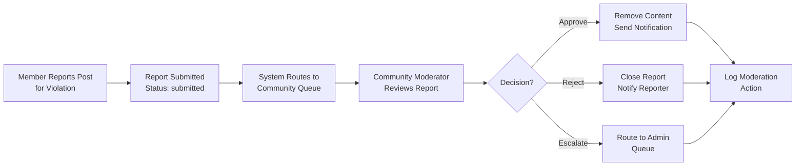
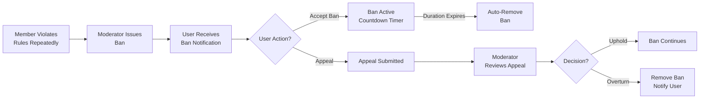
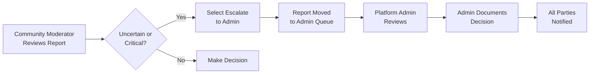

# Community Management System Requirements

## 1. Community Creation & Setup

### 1.1 Community Creation Requirements

WHEN a member initiates community creation through the system, THE system SHALL validate the following requirements before allowing community creation:

**Account Age Requirement:**
- THE member SHALL have an account age of minimum 7 days before community creation is allowed
- IF account age is less than 7 days, THEN the system SHALL prevent creation and display message: "Account must be at least 7 days old to create communities. Your account will be eligible on [DATE]"

**Minimum Karma Requirement:**
- THE member SHALL have accumulated minimum 100 karma points globally before community creation
- IF karma is below 100, THEN the system SHALL prevent creation and display message: "Minimum 100 karma required to create communities. You have [CURRENT KARMA] karma points"

**Community Name Requirements:**
- THE community name SHALL be between 3-21 characters in length
- THE community name SHALL contain only letters, numbers, and underscores (no spaces or special characters except underscore)
- THE community name SHALL be converted to lowercase for consistency
- THE community name SHALL be unique across the entire platform (case-insensitive)
- IF name already exists, THEN the system SHALL reject with message: "Community name 'r/[NAME]' already exists. Please choose another name"
- THE system SHALL suggest available alternatives based on the requested name

**Community Description:**
- THE community description SHALL be optional during creation but highly recommended
- IF provided, description SHALL be maximum 500 characters
- THE description SHALL support plain text (no markdown or HTML for security)
- THE system SHALL display a character counter showing remaining available characters

**Community Category/Topic:**
- THE creator SHALL select a primary category from predefined list: Technology, Entertainment, Sports, Gaming, News, Education, Lifestyle, Business, Other
- THE category SHALL be required for community creation
- THE system SHALL use category for discovery and recommendation purposes
- THE category can be changed by community moderators after creation

### 1.2 Community Creation Workflow (EARS Format)

WHEN all validation requirements are met, THE system SHALL execute the following steps:

1. Create community record with:
   - Unique community identifier (auto-generated, immutable)
   - Community name (normalized to lowercase)
   - Description (if provided)
   - Category assignment
   - Creation timestamp (server-side, stored as ISO 8601)
   - Member count initialized to 1 (creator)
   - Post count initialized to 0
   - Community status set to "active"

2. Automatically assign creator as primary community moderator with full permissions

3. Initialize default community settings:
   - Post type restrictions: All types allowed (text, link, image)
   - Post approval required: False
   - Voting enabled: True
   - Comments enabled: True
   - Community visibility: Public (by default)
   - NSFW flag: False
   - Auto-moderation: Disabled

4. Create community icon/banner placeholder (system default provided)

5. Log community creation event for platform analytics with creator ID and timestamp

THEN the system SHALL return success confirmation, redirect creator to community management dashboard, and display welcome message: "Community r/[NAME] created successfully. You are now the primary moderator."

### 1.3 Community Visibility Upon Creation

WHEN a community is created, THE system SHALL enforce:
- THE community SHALL be public and discoverable immediately upon creation by default
- THE creator SHALL be able to change visibility settings immediately after creation
- THE creator/moderators SHALL automatically be subscribed to their own community
- THE community SHALL appear in community discovery and search within 1 minute of creation
- THE community SHALL be searchable by community name and description within 5 minutes of creation

---

## 2. Community Hierarchy & Roles

### 2.1 Community-Level Role Structure

THE community management system supports a clear hierarchical role structure:

#### Primary Moderator (Community Creator)

WHEN a community is created, THE system SHALL automatically assign the creator as primary moderator with these characteristics:
- THE community creator's role is immutable by other moderators
- THE primary moderator SHALL have all community moderator permissions (see Section 4)
- THE primary moderator SHALL be able to add and remove other moderators
- THE primary moderator SHALL be able to transfer community ownership to another moderator with high karma in that community
- THE primary moderator SHALL be able to permanently delete the community (if no posts exist, or after archiving all content)
- THE primary moderator can appoint moderators of different permission levels

#### Additional Moderators

WHEN the primary moderator designates additional moderators, THE system SHALL enforce:
- THE primary moderator SHALL be able to add up to 10 additional moderators per community
- THE primary moderator SHALL assign specific permission levels to each additional moderator (Content, User, Full levels as defined below)
- THE primary moderator SHALL be able to remove moderators at any time by revoking moderator status
- THE additional moderators SHALL NOT be able to remove the primary moderator or transfer ownership
- THE additional moderators can only perform actions within their assigned permission level
- THE system SHALL notify newly appointed moderators via notification system of their moderator assignment with permissions detail

#### Moderator Permission Levels

THE system SHALL support three moderator permission levels:

**Level 1: Content Moderator**
- Can remove posts and comments that violate rules
- Can pin/unpin posts within community
- Can issue content warnings/labels
- Cannot ban users or manage moderators
- Cannot restrict users or limit their posting
- Can view all reports in their community
- Cannot access user account information

**Level 2: User Moderator**
- Can perform all Level 1 actions
- Can issue temporary user bans (1-30 days, customizable)
- Can mute users (prevent commenting for 24-72 hours)
- Cannot permanently ban users
- Cannot manage other moderators
- Can warn users with custom messages
- Can view community member list

**Level 3: Full Moderator**
- Can perform all Level 1 and Level 2 actions
- Can issue permanent user bans from community
- Can add/remove other moderators (except primary)
- Can modify community settings and rules
- Can create and edit community rules
- Can view complete moderation dashboard for community
- Can lock posts (prevent new comments)

### 2.2 Community Member Roles

THE system identifies members in communities by status:

**Regular Member**
- Subscribed user with standard permissions (create posts, comment, vote, view community)
- Can earn community-specific karma
- Can be promoted to moderator

**Suspended Member (Temporary Ban)**
- Member with temporary ban from posting/commenting (1-30 days)
- Can still view community content but cannot engage
- Cannot post, comment, or vote
- Receives notification with ban duration and appeal information

**Banned Member (Permanent Ban)**
- Member permanently removed from community
- Cannot view, post, or comment in this community
- Cannot re-subscribe without explicit moderator approval
- Cannot be elevated back to membership except through appeal
- Existing posts remain visible but marked accordingly

---

## 3. Moderator Permissions & Authority

### 3.1 Complete Moderator Permission Matrix

| Action | Content Mod | User Mod | Full Mod | Primary Mod | Platform Admin |
|--------|---|---|---|---|---|
| **Remove Posts** | ✅ | ✅ | ✅ | ✅ | ✅ |
| **Remove Comments** | ✅ | ✅ | ✅ | ✅ | ✅ |
| **Pin/Unpin Posts** | ✅ | ✅ | ✅ | ✅ | ✅ |
| **Issue Content Warning** | ✅ | ✅ | ✅ | ✅ | ✅ |
| **Lock Posts** | ✅ | ✅ | ✅ | ✅ | ✅ |
| **Temporary Ban (1-30d)** | ❌ | ✅ | ✅ | ✅ | ✅ |
| **Mute Users (24-72h)** | ❌ | ✅ | ✅ | ✅ | ✅ |
| **Permanent Ban** | ❌ | ❌ | ✅ | ✅ | ✅ |
| **Add Moderators** | ❌ | ❌ | ✅ | ✅ | ✅ |
| **Remove Moderators** | ❌ | ❌ | ✅ | ✅ | ✅ |
| **Modify Settings** | ❌ | ❌ | ✅ | ✅ | ✅ |
| **Create/Edit Rules** | ❌ | ❌ | ✅ | ✅ | ✅ |
| **Transfer Ownership** | ❌ | ❌ | ❌ | ✅ | ✅ |
| **Delete Community** | ❌ | ❌ | ❌ | ✅ | ✅ |
| **Override Decisions** | ❌ | ❌ | ❌ | ✅ | ✅ |

### 3.2 Moderator Responsibilities & Accountability

THE community moderators SHALL be responsible for:
- Enforcing community rules and policies consistently and fairly
- Removing violating content promptly (within 48 hours for non-critical violations)
- Responding to user reports within 24 hours (SLA target)
- Maintaining respectful community environment
- Communicating moderation decisions to affected users with specific reasons
- Documenting moderation actions in the community moderation log

THE system SHALL track all moderator actions with:
- Action type (remove post, remove comment, ban user, pin post, mute, etc.)
- Timestamp of action (ISO 8601 format)
- Reason/justification provided by moderator
- User ID performing action
- Content or user ID affected by action
- Any action reversals or appeals related to the original action
- Whether the action was within moderator's permission level

---

## 4. Community Settings & Configuration

### 4.1 Configurable Community Settings

THE community moderators (Full Moderator level or above) SHALL be able to configure:

#### Display & Identity Settings
- **Community Name**: Cannot exceed 21 characters, same validation as creation, can be changed by Full Moderator+
- **Community Description**: Maximum 500 characters, updatable at any time, displayed on community page
- **Community Category**: Primary category affecting discovery, can be changed, affects recommendation algorithms
- **Community Icon**: Image upload (see image management below)
- **Community Banner**: Image upload for header (see image management below)

#### Post Type & Content Settings
- **Post Type Restrictions**: Can restrict to specific types (text-only, link-only, image-only, or allow all types)
- **Post Requirement**: Text posts can require minimum character count (0-5000 characters, can enforce quality standard)
- **Link Post Domains**: Can whitelist/blacklist specific domains for link posts (security and topicality control)
- **Image Post Requirements**: Can require image posts to include description/caption

#### Engagement & Interaction Settings
- **Allow Voting**: Enable/disable upvote/downvote functionality for community
- **Allow Comments**: Enable/disable commenting feature (posts-only mode possible)
- **Comment Restrictions**: Require minimum karma to comment in community (e.g., minimum 50 karma to prevent low-quality comments)
- **Restricted Post Creation**: Require minimum karma (e.g., 100+) or account age to post in community
- **Post Lock Duration**: Automatically lock posts after N days (optional, e.g., lock after 6 months)

#### Notification & Communication Settings
- **New Post Notifications**: Enable/disable for subscribers
- **New Comment Notifications**: Enable/disable for post authors
- **Community-Wide Announcements**: Allow moderator-pinned announcements on community page
- **Welcome Message**: Custom welcome message for new members

#### Moderation & Content Policy Settings
- **Auto-Moderation**: Enable/disable automatic content filtering (profanity patterns, spam detection)
- **Approval Queue**: Require moderator approval for first-time posts (new members)
- **NSFW Flag**: Mark community as containing adult content
- **Report Review Required**: Minimum reports before automated action (default 1, can increase)

### 4.2 Community Icon & Banner Management

WHEN moderators upload community icon or banner, THE system SHALL:

1. Accept image file formats: JPEG, PNG only (maximum 5MB per file)
2. Store images in community-specific storage location with redundancy
3. Generate thumbnail versions for list display (200x200px for icon, 1200x300px for banner)
4. Return CDN URL for rapid access with global distribution
5. Support image replacement (old images automatically deleted after 30 days)
6. IF upload fails, THEN preserve existing icon/banner and display error message
7. IF image is malicious/malware, THEN reject silently (prevent attack probing)
8. THE system SHALL validate image dimensions and aspect ratios
9. THE system SHALL compress images for bandwidth optimization

---

## 5. Community Rules & Content Policies

### 5.1 Community Rules System (EARS Format)

THE community moderators SHALL be able to create and enforce up to 10 community-specific rules:

WHEN a moderator creates a rule, THE system SHALL require:
- **Rule Title**: Maximum 100 characters, concise rule statement (e.g., "No Spam or Self-Promotion")
- **Rule Description**: Maximum 1000 characters, detailed explanation of the rule with examples
- **Rule Category**: Select from: Content, Behavior, Spam, Off-Topic, Harassment, Adult Content, Other
- **Enforcement Action**: Select consequence tier: Warning, Remove, Temporary Ban (1-30 days), or Permanent Ban
- **Appeal Allowable**: Boolean indicating if this rule violation allows appeals (default: true)

WHEN a rule is created, THE system SHALL:
- Display rules prominently in community sidebar
- Display rules on community settings page
- Show relevant rule during post/comment creation as reminder
- Include rule option in report form when members report content
- Display rule citation in moderation notifications to affected users

### 5.2 Rule Display & User Communication

WHEN NEW members access a community, THE system SHALL:
- Display community rules acceptance checkbox during first subscription to community
- Require members to acknowledge understanding of rules before posting
- Display rules consistently throughout community experience

WHEN a moderator removes content for rule violation, THE system SHALL:
- Include specific rule citation in removal notice to user
- Display the exact rule text that was violated
- Provide link to full community rules
- Specify appeal process and timeframe

THE system SHALL track:
- Which rules are violated most frequently
- Which rules result in user removals most often
- Rule enforcement consistency over time
- Which rules result in successful appeals (too strict)

### 5.3 Rule Enforcement & Evolution

THE system SHALL provide moderators with enforcement analytics:
- Heat map showing most-violated rules
- Trends over time (e.g., spam violations increasing)
- Recommendations to clarify rules generating confusion
- Comparison to other communities (if feature enabled)

WHEN a rule generates excessive appeals, THE system SHALL:
- Flag rule for moderator review (e.g., >50% appeal success rate)
- Suggest clarification or rule revision
- Provide feedback that rule may be too subjective or unclear

---

## 6. User Subscription Management

### 6.1 Subscription Workflow & Requirements

#### Subscribing to a Community

WHEN an authenticated member views a public community and clicks subscribe, THE system SHALL:

1. Validate member is not already subscribed (prevent duplicates)
2. Check if member is permanently banned from this community
3. IF member is banned, THEN deny subscription and display: "You have been banned from this community and cannot rejoin"
4. Add member to community's subscriber list
5. Initialize community preferences for this member (optional per-community settings)
6. Update community member count incrementally
7. Log subscription event with timestamp and member ID for analytics
8. Add community posts to member's feed (from current date forward)
9. IF auto-subscribe new communities is enabled, THEN add to member's recommended list

THEN the system SHALL confirm subscription success with message: "Successfully subscribed to r/[COMMUNITY]" and update UI to show "Subscribed" status.

#### Unsubscribing from a Community

WHEN a member clicks unsubscribe, THE system SHALL:

1. Remove member from community's subscriber list
2. Delete community preferences for this member (resume defaults on re-subscribe)
3. Update community member count decrementally
4. Remove community posts from member's feed immediately
5. Log unsubscription event with timestamp and member ID
6. Display confirmation: "Successfully unsubscribed from r/[COMMUNITY]"
7. Suggest similar communities (optional feature)

WHEN a member who was previously unsubscribed wishes to resubscribe, THE system SHALL:
- Treat as new subscription (no memory of previous subscription)
- Check ban status again
- Initialize fresh community preferences
- Reset position in feed to current posts

### 6.2 Subscription Status & Visibility

THE member SHALL be able to:
- View list of all communities they are subscribed to with subscription count for each
- Sort subscriptions by join date, activity level, post frequency, or name
- Search within their subscriptions (e.g., "find communities about photography")
- Access subscribed communities from main navigation (sidebar)
- Customize subscription settings per community (if enabled)

THE community moderators SHALL be able to see:
- Total subscriber count displayed on community page
- New subscriptions over time period (daily, weekly, monthly trends)
- Unsubscription rate and reasons (when available through exit surveys)
- Top subscribed communities in platform (aggregated rankings)

### 6.3 Subscription Permissions & Access Rules

THE subscription status determines user permissions within community:
- **Subscribed Member**: Can post, comment, vote, and participate fully
- **Non-Subscribed Member**: Can view public community but cannot post or comment (can browse only)
- **WHILE member is on temporary ban**: THE system SHALL prevent posting/commenting in community despite subscription status
- **IF member is permanently banned**: THE system SHALL automatically unsubscribe and prevent resubscription (unless appeal approved)

---

## 7. Community Privacy & Access Control

### 7.1 Community Privacy Level Definitions

THE system supports three distinct privacy levels for communities:

#### Public Community (Default)

THE system SHALL enforce for public communities:
- Community is visible to all users (authenticated and guests)
- Community appears in community discovery lists and search results
- Non-members can view all posts and comments in the community
- Non-members can view community sidebar (rules, description, statistics)
- Non-members CANNOT create posts or comments (prevented with login prompt)
- WHEN non-member attempts to post, THE system SHALL display: "You must be subscribed to post in this community. [Subscribe Button]"
- Posts appear in platform-wide search and global feed algorithms
- Guest users can browse community content but cannot interact
- Public communities drive traffic and organic discovery

#### Private Community

THE system SHALL enforce for private communities:
- Community is invisible to non-members and guests
- Community does NOT appear in community discovery or public search
- ONLY accepts subscriptions via moderator invitation (no self-subscription)
- Moderators must manually approve each membership request
- Private community posts are NOT visible to non-members under any circumstances
- IF non-member attempts to access private community URL directly, THE system SHALL return 403 Forbidden: "This community is private. You do not have permission to access it"
- Private communities cannot be discovered through search (private by definition)
- WHEN member unsubscribes from private community, THEN member loses all access immediately
- Member cannot view archived content after unsubscribing

#### Restricted Community

THE system SHALL enforce for restricted communities:
- Community is visible in discovery and search results
- Community description/information is visible to all users
- Member list and post list are hidden (only titles visible)
- Anyone can request membership (similar workflow to private)
- Moderators review membership requests within 24 hours
- WHEN request accepted, member gains full viewing and posting access
- IF request rejected, THEN user is notified and can reapply after 7 days
- Community can serve as gatekeeping mechanism while maintaining discoverability

### 7.2 Access Control Implementation Levels

THE system enforces access control at multiple layers:

1. **Discovery Access**: Determines if community appears in search/discovery
   - Public: Visible to all
   - Restricted: Visible to all
   - Private: Visible only to moderators and members

2. **View Access**: Determines if user can view community details and posts
   - Public: All users can view
   - Restricted: Members can view
   - Private: Members only

3. **Post Access**: Determines if user can create posts
   - Public: Subscribers can post (unless restricted by karma requirement)
   - Restricted: Members can post
   - Private: Members can post

4. **Moderation Access**: Determines if user can perform moderation
   - Only assigned moderators of community have access
   - Platform admins can override any community

---

## 8. Moderator Moderation Capabilities

### 8.1 Content Removal Workflow

#### Post Removal (EARS Format)

WHEN a moderator removes a post from community, THE system SHALL:

1. Validate moderator has "Content Moderator" permission level or higher
2. IF moderator lacks permission, THEN deny action and display error
3. Mark post as removed (soft delete - preserve data in database)
4. Display removal reason selected or entered by moderator (predefined list or custom, max 500 characters)
5. IF post had comments, THEN mark comment visibility as affected but preserve structure
6. Remove post from community feed and search results
7. Send notification to post author with removal reason and appeal link
8. Track removal in moderation log: timestamp, moderator ID, reason, post ID
9. IF post removal results in appeal request, THEN route to different moderator or admin for review

THE system SHALL display removal notice at post location: "[This post was removed by community moderators for violating community rules: REASON]"

#### Comment Removal (EARS Format)

WHEN a moderator removes a comment, THE system SHALL:

1. Validate moderator has "Content Moderator" permission level or higher
2. Mark comment as removed (soft delete)
3. Display removal reason to comment author with appeal information
4. Preserve comment replies (show as orphaned to maintain thread context)
5. Send notification to comment author explaining removal
6. Track in moderation log: timestamp, moderator ID, reason, comment ID
7. Update parent post's comment count to reflect removal

THE system SHALL display removal notice: "[This comment was removed by community moderators]"

### 8.2 Pinning & Featuring Content

THE community moderators SHALL be able to:
- Pin up to 3 posts at top of community feed
- Each pinned post displays "📌 PINNED BY MODERATORS" badge
- Pinned posts remain at top for specified duration (1-30 days customizable)
- Moderators can unpin posts at any time (before duration expires)
- Post author receives notification when post is pinned/unpinned
- Pinned posts still appear in sorting algorithms within pinned section (secondary sort by Hot/New)
- Community members see pinned posts as special/important content

### 8.3 Content Warning System

WHEN moderator issues content warning, THE system SHALL:

1. Add warning label to post/comment (predefined categories: Sexual Content, Violence, Spoilers, Misinformation, Hate Speech, Other)
2. Content displays with warning overlay (content hidden behind "Show Content" button)
3. Post/comment remains visible but flagged
4. User receives notification content warning was added with reason
5. Warning reason shown to user viewing content
6. Track in moderation log: warning type, timestamp, moderator
7. Display warning statistics (how many warnings by category)

WHEN user views content with warning, THE system SHALL:
- Display warning message: "This content contains [warning type]. [Show Anyway Button]"
- Require explicit user action to view content
- User can dismiss warning with single click

### 8.4 User Interaction Restrictions

#### Muting Users (EARS Format)

WHEN moderator mutes a user (User Moderator level or higher), THE system SHALL:

1. Prevent user from commenting in community for 24-72 hour duration (moderator-specified)
2. User CAN still view community and posts
3. User's existing comments remain visible (mute doesn't hide past content)
4. Send notification to user: "You are muted in r/[COMMUNITY] until [DATE TIME] for [REASON]"
5. Display countdown in user's community view showing mute duration remaining
6. Track mute action with: duration, expiration timestamp, reason, moderator ID
7. WHEN mute expires, THE system SHALL automatically regain commenting ability
8. Mute can be lifted early by Full Moderator+ or original moderator
9. Multiple mutes stack (if muted again while already muted, duration extends)

#### Post Approval Queue (EARS Format)

WHEN moderator applies post approval restriction, THE system SHALL:

1. Require moderator approval for all posts/comments before they appear publicly
2. User submits post normally but receives message: "Your post is pending moderator review"
3. Post goes into moderation queue visible only to moderators
4. Moderators review and approve/reject within 24 hours (SLA)
5. IF approved, THEN post appears publicly with normal distribution
6. IF rejected, THEN user notified with reason and option to resubmit with modifications
7. Duration: 1-30 days (moderator-specified), automatically removes when expired
8. Applies to both posts and comments

---

## 9. Community User Management & Banning

### 9.1 Temporary Ban System

WHEN Full Moderator or higher issues temporary ban, THE system SHALL:

1. Specify ban duration (preset options: 3, 7, 14, 30 days, or custom range 1-90 days)
2. Specify ban reason (predefined categories: Spam, Harassment, Rule Violation, Abuse, Other or custom text max 500 characters)
3. Prevent user from:
   - Creating new posts in community
   - Creating new comments in community
   - Voting on posts/comments
   - Subscribing to community (if not already subscribed)
4. Preserve user's existing posts and comments (remain visible, but user cannot edit/delete)
5. Send ban notification: "You are temporarily banned from r/[COMMUNITY] until [DATE]. Reason: [REASON]. [APPEAL LINK]"
6. Track ban in moderation log: start date, end date, reason, moderator ID, appeal status
7. Display to banned user: "[You are temporarily banned from this community until DATE]" on community page
8. WHEN ban duration expires, THE system SHALL automatically restore full access
9. Allow early ban lifting by Full Moderator+

### 9.2 Permanent Ban System

WHEN Full Moderator or higher issues permanent ban, THE system SHALL:

1. Require primary moderator approval if Full Moderator initiated (non-primary moderators create request)
2. Unsubscribe user from community immediately
3. Prevent user from:
   - Viewing community posts and comments (403 access denied)
   - Subscribing/resubscribing to community ever
   - Creating any content in community
   - Voting in community
4. Preserve user's historical posts and comments (visible to other members with "[Posted by banned user]" indicator)
5. Send permanent ban notification: "You are permanently banned from r/[COMMUNITY]. Reason: [REASON]. [APPEAL LINK]"
6. Track ban in moderation log: permanent marker, timestamp, reason, moderator ID
7. Allow appeal process (user can request review after 30 days minimum)

### 9.3 Ban Appeal Process (EARS Format)

WHEN banned user submits appeal, THE system SHALL:

1. Display appeal form accessible even to banned users (special access)
2. Collect appeal reason (max 500 characters, user explains why ban was unfair)
3. Route appeal to community primary moderator (bypasses original moderator to avoid bias)
4. Set 7-day review window SLA
5. Send notification to primary moderator with appeal details and ban context
6. Display appeal status to user: "Your appeal is under review. You will be notified of decision within 7 days"

WHEN primary moderator reviews appeal, THE system SHALL:

1. Display ban details: date, reason, content history
2. Display user's appeal explanation and evidence provided
3. Allow reviewer to choose:
   - **Uphold Ban**: Appeal rejected, ban remains in effect
   - **Reduce Duration**: Modify temporary ban to shorter duration
   - **Overturn Completely**: Remove ban, restore user access
4. Require moderator to provide decision reasoning (max 500 characters)
5. Log appeal outcome: timestamp, reviewer ID, decision, reasoning

WHEN appeal is decided, THE system SHALL:

1. Notify user: IF upheld: "Your appeal was reviewed and the ban was upheld. You may submit one additional appeal with new evidence. Next appeal available in [DATE]."
2. IF overturned: "Your appeal was successful. You have been unbanned from r/[COMMUNITY]. Welcome back!"
3. For upheld appeals: Allow user to submit ONE additional appeal after 60 days
4. For overturned appeals: Restore community access immediately, send confirmation notification

### 9.4 Ban Management & Tracking

THE community moderators SHALL be able to:
- View list of all banned users (temporary and permanent, paginated)
- See ban duration and expiration date for temporary bans
- See ban reason and which moderator issued ban
- Lift temporary ban early (Full Moderator+ level)
- Reverse permanent ban (primary moderator only)
- Search banned users by username or ban reason
- View ban history including overturned bans
- See appeal history and outcomes for each user

THE system SHALL automatically:
- Remove expired temporary bans from active bans list
- Update UI to reflect active bans only
- Track ban history (even reversed bans for pattern detection)
- Alert moderators if user has been banned multiple times (repeat offender)
- Flag users who appeal multiple times without success as potential appeals abuse

---

## 10. Community Discovery & Visibility

### 10.1 Community Discovery Features

#### Browse Communities (EARS Format)

WHEN community browser interface is accessed, THE system SHALL provide:
- **Featured Communities**: Selected by platform admins (5-10 communities)
- **Trending Communities**: Sorted by new subscribers, posts, activity in past 7 days (top 20)
- **Popular Communities**: Sorted by total subscribers (top 20)
- **New Communities**: Sorted by creation date, newest first (top 20)
- **Communities by Category**: Organized by Technology, Entertainment, Sports, Gaming, News, Education, Lifestyle, Business

FOR each community display, THE system SHALL show:
- Community icon and name (r/[NAME])
- Brief description (first 200 characters)
- Subscriber count (formatted: "2.5K members")
- Activity metric (posts per day or "High Activity")
- Subscribe button (or "Subscribed" indicator if already member)

#### Search Communities (EARS Format)

WHEN user searches for communities, THE system SHALL:
- Search across community names (exact and partial matches)
- Search across community descriptions
- Search across community topic tags
- Return results ranked by relevance and size

RESULTS shall display in order of:
1. Exact community name matches
2. Partial community name matches
3. Description keyword matches
4. Size and activity (larger communities ranked higher for same relevance)

WHEN no results match search, THE system SHALL:
- Display "No communities found for '[QUERY]'"
- Suggest related search terms
- Show popular communities in the category

---

## 11. Community Statistics & Analytics

### 11.1 Community-Level Statistics

THE system SHALL track and display community statistics:

**Display Statistics** (public to all members):
- Total subscriber count (with growth trend: "+500 this week")
- Total post count (lifetime)
- Total comment count (lifetime)
- Community creation date / age (display as "Created 2 years ago")
- Average posts per day (last 30 days)
- Most active time of day for community (e.g., "Peak activity 8-10 PM")
- Top posts of community (all-time, this month, this week)
- Top commenters in community (by posts)

**Moderator-Level Statistics** (visible to moderators only):
- Daily/weekly/monthly post creation trends (chart display)
- Daily/weekly/monthly comment creation trends
- User join trends (new subscribers over time)
- User retention rate (churn rate, unsubscription rate)
- Most frequently violated community rules
- Moderation actions by type (removals, bans, warnings, mutes)
- Average response time to reports
- Content removal reasons breakdown

**Admin-Level Statistics** (visible to platform admins only):
- All moderator-level statistics
- Moderator actions and decision patterns
- Community compliance with platform policies
- Appeal outcomes and trends
- Banned user appeal success rate

---

## 12. Community Moderation Workflows

### 12.1 Standard Content Removal Workflow

### 12.2 User Ban Workflow

### 12.3 Escalation Workflow

---

## 13. Business Rules & Validation

### 13.1 Community Creation Rules (EARS Format)

- WHEN user attempts community creation, THE user's account SHALL be minimum 7 days old
- WHEN user attempts community creation, THE user SHALL have minimum 100 global karma
- WHEN community name is submitted, THE name SHALL be unique (case-insensitive) across entire platform
- WHEN community name contains invalid characters, THE system SHALL reject and display: "Community names can only contain letters, numbers, and underscores"
- WHEN community name submitted, THE length SHALL be between 3-21 characters
- WHEN community name is too short (<3 chars), THE system SHALL display: "Community name must be at least 3 characters"
- WHEN community is created, THE creator SHALL be automatically subscribed and made primary moderator
- WHEN community is created, THE community SHALL be public by default
- WHEN community is created, THE community post count SHALL initialize at 0

### 13.2 Community Management Rules (EARS Format)

- WHEN community contains posts, THE system SHALL NOT allow community deletion (archive only)
- WHEN community is created, THE system SHALL require at least one active primary moderator at all times
- WHEN moderator list is full (10+ moderators), THE system SHALL prevent adding additional moderators
- WHEN community rules are created, THE system SHALL not allow more than 10 rules per community
- WHEN pins are managed, THE system SHALL NOT allow more than 3 pinned posts simultaneously
- WHEN community settings change, THE system SHALL log change with timestamp and moderator ID
- WHEN community visibility changes, THE system SHALL immediately update discovery status

### 13.3 User Management Rules (EARS Format)

- WHEN user is banned, THE system SHALL prevent resubscription for ban duration (temporary) or indefinitely (permanent)
- WHEN temporary ban is issued, THE duration SHALL be minimum 1 day, maximum 90 days
- WHEN permanent ban is issued, THE system SHALL allow appeal only after 30 days of ban issuance
- WHEN user is muted, THE system SHALL preserve their existing comment visibility (mute = future only)
- WHEN permanent ban is issued, THE system SHALL require documented reason (not optional)
- WHEN moderator attempts to ban other moderator, THE system SHALL deny action except for primary moderator

### 13.4 Moderator Authority Boundaries

- WHEN Content Moderator attempts to ban user, THE system SHALL deny with message: "Full Moderator permission required to ban users"
- WHEN Full Moderator removes moderator, THE system SHALL ALLOW removal of other Full Moderators or lower levels
- WHEN Full Moderator attempts to remove primary moderator, THE system SHALL deny: "Cannot remove primary moderator"
- WHEN moderator attempts action outside their community, THE system SHALL deny: "You are not a moderator of this community"

---

## 14. Error Handling & User Scenarios

### 14.1 Community Creation Errors

**Scenario 1: Account Too New**
- User with 3-day-old account attempts community creation
- System response: "Account must be at least 7 days old to create communities. Your account will be eligible on [DATE]. [Countdown timer showing 4 days remaining]"

**Scenario 2: Insufficient Karma**
- User with 50 karma attempts community creation
- System response: "Minimum 100 karma required to create communities. You currently have 50 karma. Earn 50 more karma to create communities. [Link to FAQ: How to earn karma]"

**Scenario 3: Community Name Exists**
- User attempts to create "Technology" but it exists
- System response: "Community 'r/Technology' already exists. Try one of these alternatives: [Suggested names]. [Link to existing community]"

**Scenario 4: Invalid Name Characters**
- User enters "Tech & Design" (contains space and special char)
- System response: "Community names can only contain letters, numbers, and underscores. 'Tech & Design' contains invalid characters. Try 'Tech_Design' instead."

### 14.2 Subscription Errors

**Scenario 5: Previously Banned User Attempts Resubscribe After Expiration**
- User previously temp-banned, ban expires, attempts to resubscribe
- System allows resubscription
- System displays: "Note: You were previously banned from this community. Please follow the community rules carefully."

**Scenario 6: Permanently Banned User Attempts Resubscribe**
- Permanently banned user attempts to subscribe
- System denies with: "You cannot subscribe to this community. You have been permanently banned. [Appeal link]"

**Scenario 7: Temporarily Banned User Attempts to Post**
- Temporarily banned user tries to create post
- System rejects with: "You are temporarily banned from posting in this community until [DATE, TIME]. Reason: [BAN REASON]. [Appeal link]"

### 14.3 Moderator Action Errors

**Scenario 8: Insufficient Permission**
- Content Moderator attempts to permanently ban user
- System denies: "Full Moderator level required for permanent bans. Contact a Full Moderator in this community."

**Scenario 9: Primary Moderator Removal Attempt**
- Full Moderator attempts to remove primary moderator
- System denies: "Cannot remove primary moderator. Transfer community ownership first. [Link to ownership transfer]"

**Scenario 10: Moderator Removal During Active Action**
- Moderator removed from role while moderation action is in progress
- System completes the action already initiated
- System logs action completion attributed to system (not specific moderator)
- System preserves audit trail showing original moderator who initiated

### 14.4 Privacy & Access Errors

**Scenario 11: Non-Member Access to Private Community**
- Non-member tries to access private community directly
- System returns 403 Forbidden: "This is a private community. Request membership to join. [Request Membership button]"

**Scenario 12: Permanently Banned User Access Attempt**
- Permanently banned user navigates to community
- System displays: "You have been permanently banned from this community. [Appeal link]"

### 14.5 Data Consistency Errors

**Scenario 13: Member Count Discrepancy**
- Member count becomes inconsistent with actual subscriptions
- System runs nightly reconciliation
- System detects discrepancy and corrects automatically
- System logs issue for investigation

**Scenario 14: Settings Conflict**
- User has private profile but post visibility set to public
- System applies most restrictive (private overrides)
- System alerts user: "Your post visibility has been adjusted due to profile privacy settings"

---

## 15. Integration with Related Systems

### 15.1 Community & Authentication Integration

WHEN moderator roles are assigned, THE system references [02-user-actors-authentication.md](./02-user-actors-authentication.md):
- Community moderators are a specialized actor type within the authentication system
- Moderator permissions are enforced through the role-based access control system
- Moderator sessions are managed using the same JWT token system as regular members
- Permission verification occurs on every API call affecting community content or users

### 15.2 Community & Content Creation Integration

WHEN posts and comments are created within communities, THE system references [05-content-creation-posting.md](./05-content-creation-posting.md) and [06-commenting-engagement.md](./06-commenting-engagement.md):
- Posts are scoped to specific communities
- Community settings affect post type restrictions
- Moderation applies to all content types
- Karma earned is tracked both globally and per-community

### 15.3 Community & Moderation Integration

WHEN reports are submitted in communities, THE system references [09-moderation-reporting.md](./09-moderation-reporting.md):
- Community moderators review reports within their communities
- Community rules are enforced through moderation actions
- Bans and restrictions are enforced through the moderation system
- Appeals follow the moderation system's appeal workflow

### 15.4 Community & User Profiles Integration

WHEN viewing user profiles, THE system references [10-user-profiles-preferences.md](./10-user-profiles-preferences.md):
- User profiles display communities moderated
- User profiles display community karma scores
- Community membership is shown on user profiles
- Moderator status is displayed as a badge on user profiles

### 15.5 Community & Karma Integration

WHEN karma is calculated, THE system references [07-karma-reputation-system.md](./07-karma-reputation-system.md):
- Community-specific karma is tracked separately from global karma
- Community karma requirements can restrict posting
- High community karma indicates expertise in that topic area
- Moderator selection often based on high community karma

---

## 16. Summary of Key Requirements

### Community Operations
1. Communities created with 7-day account age and 100 karma minimum
2. Three privacy levels (public, private, restricted)
3. Primary moderator is immutable community creator
4. Up to 10 additional moderators with three permission levels
5. Community rules system (max 10 rules)
6. Customizable settings for posts, voting, comments, and moderation
7. Comprehensive statistics tracking

### User Management
1. Subscription system with automatic validation
2. Temporary bans (1-90 days, auto-removal)
3. Permanent bans (manual removal via appeal)
4. Appeal system (primary moderator reviews)
5. Muting, post approval, and graduated restrictions
6. Ban history and repeat-offender detection

### Moderation
1. Content removal with soft deletion
2. Content warnings and labeling
3. Post pinning (max 3)
4. User restrictions (mute, ban, approval queue)
5. Complete audit trail of all actions
6. SLA for report response (24 hours for non-critical)

### Accountability
1. All moderator actions logged with timestamp and reasoning
2. Appeals process with multi-tier review
3. Override capabilities for admins
4. Consistency monitoring for moderators
5. Transparency to community members about moderation

---

> *Developer Note: This document defines **business requirements only**. All technical implementations (API design, database schema, repository patterns, caching mechanisms, etc.) are at the discretion of the development team. This document describes WHAT communities must do, not HOW to build them.*"