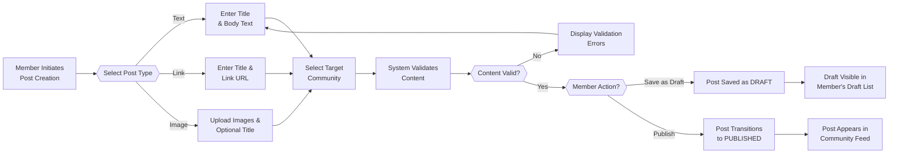
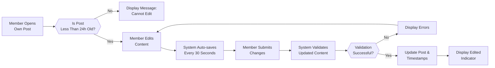
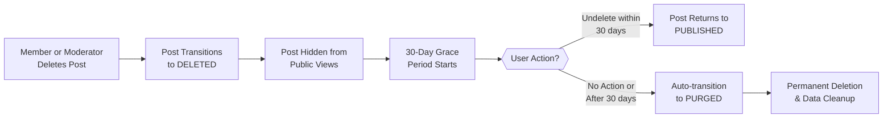
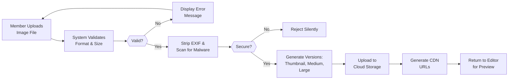

# Content Creation & Posting Requirements

## Post Creation System Overview

### System Purpose & Business Value

The post creation system is the primary content generation mechanism that enables authenticated members to contribute diverse content formats to communities. Posts form the foundational unit of engagement within the platform, driving discussion, knowledge sharing, and community participation. By supporting multiple content types (text, links, images), the system enables rich communication while maintaining content quality through validation and moderation capabilities.

### System Scope

WHEN a member initiates content creation, THE system SHALL enable the creation of three distinct post types within communities where the member has appropriate permissions.

GUESTS cannot create posts; THE system SHALL require authentication and community membership for post creation capability.

THE post creation system encompasses:
- Three post type supports: text, link, and image posts
- Content validation and quality assurance
- Draft management with auto-save functionality
- Image upload and processing
- Edit and deletion capabilities within defined windows
- Visibility and publishing state management
- Soft deletion with 30-day grace period for content preservation

### Business Justification

The post creation system drives platform value through:
- **User Engagement**: Multiple content formats enable diverse expression and participation
- **Content Quality**: Validation rules ensure baseline quality standards
- **User Control**: Edit windows and soft deletion preserve user autonomy
- **Moderation Support**: Clear audit trails enable effective community management
- **Knowledge Preservation**: Soft deletion with recovery maintains community value

---

## Post Types & Content Formats

### Supported Post Types

WHEN a member selects the post creation option, THE system SHALL present three distinct post type choices: Text Post, Link Post, and Image Post.

#### Text Posts

WHEN a member creates a text post, THE system SHALL require:
- **Title**: Required field, between 3 and 300 characters inclusive
- **Body Content**: Required field, between 1 and 40,000 characters inclusive

TEXT posts SHALL support markdown formatting including:
- Bold text: `**text**` or `__text__`
- Italic text: `*text*` or `_text_`
- Code blocks: `` ```language code``` ``
- Inline code: `` `code` ``
- Headers: `# H1`, `## H2`, `### H3`
- Lists: unordered (`-`, `*`, `+`) and ordered (`1.`, `2.`, etc.)
- Blockquotes: `> quoted text`
- Links: `[text](url)`

WHEN rendering text post content, THE system SHALL escape all HTML tags and prevent script execution to prevent XSS attacks.

#### Link Posts

WHEN a member creates a link post, THE system SHALL require:
- **Title**: Required field, between 3 and 300 characters inclusive
- **URL**: Required field, valid HTTP/HTTPS URL format, maximum 2,048 characters

WHEN a member provides a link URL, THE system SHALL:
- Validate URL format by checking for protocol (`http://` or `https://`)
- Attempt to fetch link metadata including page title, description, and thumbnail image if available
- Store and display metadata to help other members understand the link without clicking
- Cache link metadata for 7 days to reduce redundant requests
- Display a preview of the linked page content

OPTIONAL body description: THE link post MAY include optional descriptive text (up to 40,000 characters) allowing the member to add commentary or context about the link.

IF the URL is invalid format or unreachable, THE system SHALL display error message: "Please enter a valid URL starting with http:// or https://" and prevent post creation until valid URL provided.

#### Image Posts

WHEN a member creates an image post, THE system SHALL require:
- **Image Upload**: Required, minimum 1 image, maximum 10 images per post
- **Title**: Optional; if not provided, THE system SHALL use the first image filename as default title

IMAGE post uploads SHALL:
- Support formats: JPEG, PNG, GIF, WebP
- Limit individual file size to 20 MB maximum
- Limit total post size to 100 MB across all images
- Accept multiple images in a single post
- Allow member to reorder images before publishing
- Process and optimize images for web delivery

OPTIONAL descriptive text: IMAGE posts MAY include optional body text (up to 40,000 characters) providing caption or description of the images.

### Post Type Properties

For all post types, THE system SHALL capture and persist:

- **Post ID**: Unique system identifier (UUID format)
- **Post Type**: Enum value: TEXT, LINK, or IMAGE
- **Community ID**: Which community the post belongs to (required)
- **Creator User ID**: Member who created the post (automatically assigned)
- **Created Timestamp**: ISO 8601 format timestamp (automatically set to server time)
- **Updated Timestamp**: Modification timestamp (updated on edits)
- **Title**: Post title (required for TEXT and LINK posts; optional for IMAGE posts)
- **Body Content**: Post body text (required for TEXT posts; optional for LINK and IMAGE posts)
- **URL**: Link destination (required for LINK posts only)
- **Images**: Array of image objects with URLs and metadata (required for IMAGE posts)
- **Post State**: DRAFT, PUBLISHED, or DELETED (initially DRAFT, then PUBLISHED)
- **Edit History**: Complete record of all edits with timestamps and content snapshots

---

## Post Content Requirements & Validation

### Content Limits & Constraints

#### Title Requirements

WHEN a member creates a text or link post, THE title field is REQUIRED.

THE title SHALL be between 3 and 300 characters in length inclusive.

IF a member enters a title shorter than 3 characters, THE system SHALL display validation error: "Title must be at least 3 characters long."

IF a member enters a title longer than 300 characters, THE system SHALL display validation error: "Title cannot exceed 300 characters (currently: [count])."

THE title SHALL NOT be empty or contain only whitespace characters.

THE title MAY contain any UTF-8 characters including emojis, unicode characters, and special symbols.

WHEN a member enters a title and pauses typing, THE system SHALL display a real-time character counter showing "245 / 300 characters" allowing preview of character usage.

#### Text Post Body Requirements

WHEN a member creates a text post, THE body content is REQUIRED.

THE body SHALL be between 1 and 40,000 characters in length inclusive.

IF a member enters body text shorter than 1 character, THE system SHALL display validation error: "Post content must contain at least 1 character."

IF a member enters body text longer than 40,000 characters, THE system SHALL display validation error: "Post content cannot exceed 40,000 characters (currently: [count])."

THE body SHALL NOT be empty or contain only whitespace after trimming.

THE body MAY contain markdown formatting syntax for enhanced formatting (see markdown support in Section 2.1).

THE system SHALL preserve line breaks and spacing as entered by the member.

#### Link Post Requirements

FOR link posts, THE URL field is REQUIRED.

THE URL SHALL be a valid HTTP or HTTPS URL format.

THE URL length SHALL NOT exceed 2,048 characters.

WHEN validating the URL, THE system SHALL check that the protocol (`http://` or `https://`) is explicitly present.

IF the URL is invalid format, THE system SHALL display error: "Please enter a valid URL starting with http:// or https://."

THE optional body description for link posts SHALL follow the same rules as text post body: 1-40,000 characters, supports markdown formatting.

THE system SHALL validate that the link URL is accessible (not returning 404 or other error status) before allowing publication.

IF a URL is inaccessible, THE system MAY show warning: "This link appears to be inaccessible. Your post may have limited engagement."

### Content Validation & Filtering

#### Offensive Content Detection

THE system SHALL implement automated content filtering to detect potentially offensive language and hate speech.

WHEN potentially offensive content is detected by automated systems, THE system SHALL:
- Flag the content for moderator review
- Display confirmation dialog to member: "This post may contain content that violates community standards. Are you sure you want to post this?"
- Allow member to proceed or edit content
- Log the flagged content attempt for moderation analytics

IF content violates severe policies (extreme hate speech, incitement to violence, child safety violations), THE system SHALL:
- BLOCK post creation entirely
- Display error message: "This content violates platform policies and cannot be posted."
- Log the violation attempt
- Notify platform administrators of the violation

OFFENSIVE content detection SHALL NOT use overly aggressive filtering that blocks legitimate content, as determined by community moderation standards.

#### Spam & Abuse Prevention

THE system SHALL prevent members from creating duplicate posts within short timeframes.

WHEN a member attempts to create a post with identical content (title and body) within 10 minutes of their previous post, THE system SHALL display: "You've already posted this content recently. Please wait at least 10 minutes before posting similar content."

THE system SHALL monitor for rapid-fire post creation and limit members to maximum 10 posts per hour per community.

IF a member exceeds the 10-post-per-hour rate limit, THE system SHALL:
- Prevent further post creation in that community
- Display message: "You're posting too quickly. Please wait 60 minutes before posting again."
- Reset the rate limit counter after 60 minutes have passed

THE system SHALL log all rate limit violations for pattern detection of spam behavior.

#### Member Karma Restrictions

WHEN a member with karma score below -50 attempts to create a post, THE system SHALL display warning message: "Your account currently has low reputation. Your post will be subject to additional review before appearing publicly."

WHEN a member with karma below -100 attempts to create a post, THE system SHALL BLOCK the post creation with message: "Your account currently has restrictions. Please contact support or improve your community contributions."

THE member SHALL be able to attempt post creation again once their karma improves above the restriction threshold through positive community engagement.

KARMA-based restrictions are intended to prevent low-reputation members from spam abuse while still allowing appeals through positive behavior.

---

## Image Upload & Management

### Image Upload Requirements

#### File Format Support

THE system SHALL accept image files in the following formats only: JPEG, PNG, GIF, WebP.

THE system SHALL NOT accept video files, SVG files, executables, or any non-image file types.

IF a member attempts to upload a file in an unsupported format, THE system SHALL display error: "Only JPEG, PNG, GIF, and WebP images are supported. You uploaded: [format]."

WHEN validating file format, THE system SHALL check both the file extension AND the file header signature (magic bytes) to prevent disguised executable files.

#### File Size Constraints

THE maximum file size for a single image SHALL be 20 MB.

IF a member attempts to upload an image larger than 20 MB, THE system SHALL display: "File size [size] MB exceeds maximum of 20 MB. Please compress or resize the image."

THE maximum combined size for all images in a single post SHALL be 100 MB total.

IF adding another image would cause the post to exceed 100 MB total, THE system SHALL display: "Total image size would exceed 100 MB limit ([current] MB + [new file] MB). Please remove or compress images."

THE system SHALL provide guidance on image compression tools and techniques if files are too large.

#### Image Processing & Optimization

WHEN an image is uploaded, THE system SHALL automatically generate and store multiple resized versions:
- **Thumbnail**: 200x200 pixels (for feed display and community listings)
- **Medium**: 600x600 pixels (for post preview and comment display)
- **Large**: 1600x1600 pixels (for full-size viewing)

THE system SHALL preserve image aspect ratio during resizing, adding letterboxing if necessary to maintain proportions.

THE system SHALL automatically compress images to optimize storage and bandwidth while maintaining visual quality.

THE system SHALL compress JPEG images to 85% quality or higher and PNG images with lossless compression.

THE system SHALL strip EXIF metadata from uploaded images including GPS coordinates, camera information, and timestamps to protect user privacy.

THE system SHALL limit animated images (GIF, WebP) to prevent excessive animation by showing only first 3 animation loops on initial display.

#### Image Validation & Security

THE system SHALL scan uploaded images for malware and malicious content using antivirus scanning before persistence.

IF malware is detected, THE system SHALL reject the upload silently (without revealing detection to prevent probing attacks).

WHEN a detected malware file is rejected, THE system SHALL log the incident including timestamp, user ID, and file signature for security analysis.

THE system SHALL validate image file headers to prevent disguised executable files by checking magic bytes against expected values.

IF file header does not match the declared file type, THE system SHALL reject the upload with: "Invalid image file. The file signature does not match the declared format."

### Image Storage & URLs

THE system SHALL store uploaded images on reliable cloud storage (S3, Azure Blob Storage, Google Cloud Storage, or equivalent).

WHEN an image is successfully processed and stored, THE system SHALL generate permanent URLs for each image version (thumbnail, medium, large) that remain accessible as long as the post exists.

THE system SHALL use Content Delivery Network (CDN) for image delivery to minimize latency globally for all users.

IF an image is accessed before processing is complete, THE system SHALL return a processing placeholder image indicating "Image processing in progress..." with automatic refresh every 2 seconds.

WHEN processing completes, THE system SHALL serve the final processed image versions through CDN.

WHEN the member deletes a post, THE system SHALL schedule image deletion from cloud storage after the 30-day soft deletion grace period expires.

### Image Ordering & Gallery Display

WHEN multiple images are uploaded to a single image post, THE system SHALL display them in the order uploaded by the member in the upload sequence.

BEFORE publishing an image post, THE member SHALL be able to reorder images by dragging or using up/down buttons to change their display sequence.

WHEN displaying an image post with multiple images, THE system SHALL show all images in a gallery view:
- **Desktop**: Grid layout or carousel view (member can toggle)
- **Mobile**: Vertical scroll or swipe carousel

THE first image in the post SHALL be used as the preview/thumbnail in feed listings and search results.

---

## Post Editing & Deletion

### Post Editing Capabilities

#### Edit Time Window

WHEN a member creates a post, THE system SHALL allow editing within 24 hours of creation timestamp.

AFTER 24 hours have passed since creation, THE system SHALL prevent further editing.

IF a member attempts to edit a post older than 24 hours, THE system SHALL display: "This post cannot be edited (older than 24 hours). You can delete it and create a new post if you wish."

THE system SHALL display a countdown timer on eligible posts showing time remaining to edit (e.g., "Editable for 6 more hours").

#### What Can Be Edited

THE member SHALL be able to edit the post title (text and link posts only).

THE member SHALL be able to edit the post body/description (text posts and optional link post descriptions).

FOR image posts specifically, THE member SHALL be able to:
- Add additional images (up to 10 total per post)
- Remove previously added images
- Reorder images
- Edit the optional description text

BUT THE member SHALL NOT be able to change the post type after creation (TEXT cannot become LINK, etc.).

THE member SHALL NOT be able to change the community where the post was originally published.

#### Edit Tracking & History

WHEN a post is edited, THE system SHALL update the "Updated Timestamp" to the current server time.

THE system SHALL display an "Edited" indicator on the post showing "Edited 3 hours ago" in grey text below the post metadata.

WHEN a member clicks the "Edited" indicator, THE system MAY display a popup showing:
- Original post creation time
- Most recent edit time
- Number of total edits
- Option to view full edit history (for post owner and moderators)

THE system SHALL maintain a complete edit history for moderator review including:
- Timestamps of each edit
- Content before and after each edit
- Member who performed the edit (always the post creator)

THE member SHALL be able to view their own edit history through a "View Edit History" link on their post.

#### Edit Validation

WHEN a member submits an edited post, THE system SHALL apply all content validation rules (length limits, offensive content detection, etc.).

IF edited content violates validation rules, THE system SHALL display the validation error and prevent the save.

THE system SHALL NOT allow editing to bypass or circumvent restrictions on the original post (e.g., if post was flagged for review, editing doesn't clear that flag).

### Post Deletion & Soft Delete

#### Deletion Process

WHEN a member deletes their own post, THE system SHALL perform a soft delete operation (not permanent deletion).

THE post SHALL be marked as DELETED in the database but NOT permanently removed or visible to other users.

THE post SHALL be hidden from all public feeds, searches, and user profile views immediately upon deletion.

IF the post has accumulated comments, THE system SHALL keep the comment history intact but mark them as "comments on deleted post" and preserve them for archival purposes.

#### Soft Delete Grace Period

THE system SHALL maintain a 30-day grace period after soft deletion during which the post can be recovered.

DURING the grace period, THE member can access their "Deleted Posts" section and use an "Undo Delete" option to restore the post.

AFTER 30 days, THE system SHALL automatically transition the post to PURGED state and permanently delete it from the database.

IF the member attempts to undelete after the grace period expires, THE system SHALL display: "This post has been permanently deleted and cannot be recovered."

#### Deletion Restrictions

THE member SHALL be able to delete posts they created at any time without restriction (no time window for deletion).

COMMUNITY MODERATORS SHALL be able to remove posts in their communities that violate community standards (see Section 4.2 for moderator removal).

WHEN a moderator removes a post, THE system SHALL log the moderator's ID, action timestamp, and removal reason.

THE post creator SHALL be notified when their post is removed by a moderator with a message explaining the specific violation reason and appeal instructions.

#### Permanent Deletion by Admins

PLATFORM ADMINS SHALL have the ability to permanently delete posts, bypassing the soft delete grace period entirely.

WHEN an admin permanently deletes a post, THE system SHALL log the action with timestamp, reason, and admin identifier.

THE post creator SHALL be notified of permanent deletion with explanation and appeal instructions.

---

## Post Visibility & Publishing States

### Post State Machine

Posts transition through defined states during their lifecycle:

```
DRAFT → PUBLISHED → [ACTIVE] → [DELETED] → PURGED
```

#### Draft State

WHEN a member creates a post but does not publish it, THE post enters DRAFT state.

THE post SHALL only be visible to the creator in their "Drafts" section (private to the creator).

THE post SHALL NOT appear in community feeds, user profiles, or search results.

THE member SHALL be able to continue editing draft posts with no time restrictions (24-hour edit limit only applies after PUBLISHED).

THE system SHALL NOT enforce content validation on draft posts until publication is attempted.

#### Published State

WHEN a member explicitly publishes a post (clicks "Post" or "Publish" button), THE post transitions to PUBLISHED state.

THE system SHALL apply all content validation rules before allowing publication (length limits, offensive content detection, community rules, etc.).

IF validation fails, THE post SHALL remain in DRAFT state and display validation errors preventing publication.

ONCE published, THE post becomes visible in the community feed and user profile according to visibility rules (see Section 6.2).

THE system SHALL apply the "Active" sub-state immediately after successful publishing.

#### Active Sub-State

THE post remains ACTIVE while visible and receiving engagement (votes, comments).

THE post SHALL accumulate karma points based on community votes (upvotes = +1 karma, downvotes = -1 karma per vote).

THE post SHALL be eligible for sorting algorithms (hot, new, top, controversial sorting mechanisms).

THE post MAY be pinned by community moderators, causing it to remain at the top of the community.

#### Deleted State

WHEN a member or moderator deletes a post, THE post transitions to DELETED state.

THE post SHALL be hidden from public views but not permanently removed.

THE system SHALL preserve the post for audit and potential recovery.

THE soft delete grace period clock starts when entering DELETED state.

#### Purged State

AFTER the 30-day soft delete grace period expires, THE post automatically transitions to PURGED state.

THE post is permanently removed from the system with no recovery option.

ASSOCIATED image files are deleted from cloud storage.

ASSOCIATED comment tree is also purged (comments marked as "deleted post" with timestamps preserved).

### Content Visibility Rules

#### Community-Based Visibility

WHEN a post is published to a community, THE post visibility is determined by community settings:
- **Public Community**: Post is visible to ALL users including guests and members
- **Private Community**: Post is visible ONLY to subscribed members of that community
- **Restricted Community**: Post visibility determined by community moderator rules

#### User-Based Visibility

GUESTS can view posts in public communities.

MEMBERS can view posts in communities they are subscribed to.

MEMBERS can view posts in their own profile (their created posts and comments).

MEMBERS cannot view posts in private communities unless they are subscribed.

#### Moderator/Admin Visibility

COMMUNITY MODERATORS can see all posts in their communities (including deleted and reported posts).

PLATFORM ADMINS can see all posts in the system (including deleted, flagged, and archived posts).

### Post Indexing & Discoverability

THE system SHALL index published posts for search functionality.

THE system SHALL NOT index draft posts or deleted posts in search results.

THE post title, body content, and community name SHALL be searchable.

THE system SHALL update search indexes within 5 minutes of post publication or editing.

---

## Draft Management System

### Automatic Draft Saving

#### Auto-Save Functionality

WHILE a member is composing a post in the editor, THE system SHALL automatically save the draft every 30 seconds.

THE member SHALL see a visual indicator showing "Saving..." when auto-save is in progress, then "Saved" after completion.

IF the member's connection is lost during auto-save, THE system SHALL display: "Draft saved locally. It will sync when connection is restored."

THE auto-save SHALL capture all post content including title, body, images, post type, and target community.

#### Browser Storage & Sync

IF the member closes the browser before publishing, THE system SHALL preserve the draft in persistent storage.

WHEN the member returns to the post creation page, THE system SHALL offer to restore the draft: "You have an unsaved draft. Would you like to continue editing?"

THE member SHALL be able to select "Restore" to continue editing the draft or "Discard" to start fresh with a new post.

WHEN restoring a draft, THE system SHALL load all previous content including any images that were uploaded before the session ended.

### Draft Organization

#### Viewing Drafts

EACH member SHALL have a "Drafts" section in their profile showing all their unpublished posts.

THE drafts list SHALL display:
- Draft title (or "Untitled Draft" if no title exists)
- Post type icon (TEXT, LINK, IMAGE)
- Community where it will be posted
- Last saved/modified timestamp formatted as "Modified X hours/days ago"
- "Continue Editing" button for each draft

THE member SHALL be able to sort drafts by most recently modified or alphabetically by title.

#### Managing Drafts

THE member SHALL be able to delete individual drafts permanently.

WHEN a draft is deleted, THE system SHALL remove it permanently (no grace period for drafts, unlike published posts).

THE member SHALL be able to create a duplicate/copy of a draft using a "Clone Draft" option, creating a new independent draft with the same content.

THE member SHALL be able to schedule a draft to be published at a future time (optional feature, if implemented).

#### Draft Expiration

DRAFTS that have not been modified for 90 days SHALL be automatically deleted.

BEFORE expiration, THE system SHALL notify members 7 days before deletion: "Your draft '[title]' will be deleted in 7 days if not edited."

THE member can extend the expiration by editing the draft again (resets the 90-day timer).

---

## Post Lifecycle Workflows

### Complete Post Creation Workflow



### Post Editing Workflow



### Post Deletion Workflow



### Image Upload & Processing Workflow



---

## Content Moderation Flags

### Automatic Content Flagging

WHEN a post is published, THE system SHALL automatically scan for policy violations.

THE system SHALL flag content that:
- Contains detected hate speech or slurs (based on word list updated regularly)
- Appears to be spam or promotional (excessive caps, repetitive patterns, suspicious URLs)
- Contains explicit violence or adult content (image analysis for image posts)
- Violates community-specific rules

FLAGGED posts SHALL still be published but marked internally for moderator review.

THE post SHALL have a "Report" indicator visible to community moderators.

### Moderator Review Integration

COMMUNITY MODERATORS SHALL receive notifications when posts are flagged in their community.

PLATFORM ADMINS SHALL have a dashboard showing all flagged posts system-wide.

MODERATORS can take action on flagged posts: approve (remove flag), remove post, or warn member.

THE moderation action history SHALL be logged and associated with the post for accountability.

---

## Performance & Pagination

### Feed Performance

WHEN loading a community feed or user profile, THE system SHALL use pagination to limit results.

THE system SHALL display 25 posts per page by default.

THE member can select alternative pagination (10, 50, or 100 posts per page) from settings.

THE system SHALL implement cursor-based pagination for efficient loading using opaque cursor tokens.

WHEN scrolling through feeds, THE system SHALL support "infinite scroll" with lazy loading of next pages.

### Load Times & Caching

POST data SHALL be cached in-memory for frequently accessed posts for minimum 5 minutes.

IMAGE URLs shall be served through CDN for optimal delivery speed (target: <1 second global load time).

THE system SHALL aim to serve post feeds within 2 seconds for typical users on typical connections.

SEARCH queries SHALL return results within 3 seconds for large result sets.

---

## Error Handling & User Experience

### Validation Error Messages

THE system SHALL provide clear, actionable error messages for all post creation validation failures:

| Error Condition | Error Message |
|---|---|
| Title too short | "Title must be at least 3 characters long." |
| Title too long | "Title cannot exceed 300 characters (currently: [count])." |
| Body too short (text post) | "Post content must contain at least 1 character." |
| Body too long (text post) | "Post content cannot exceed 40,000 characters (currently: [count])." |
| Invalid URL | "Please enter a valid URL starting with http:// or https://." |
| No content selected | "Please add title or content to your post." |
| Unsupported image format | "Only JPEG, PNG, GIF, and WebP images are supported. You uploaded: [format]." |
| Image too large | "File size [size] MB exceeds maximum of 20 MB." |
| Total images too large | "Total image size would exceed 100 MB limit. Please remove or compress images." |
| No community selected | "Please select a community to post in." |
| Low karma restriction | "Your account currently has restrictions. Please contact support." |
| Rate limit exceeded | "You're posting too quickly. Please wait 60 minutes before posting again." |

### Network Error Recovery

IF the post submission fails due to network error, THE system SHALL display: "Failed to post. Please check your connection and try again."

THE system SHALL preserve all entered content in the editor for manual retry.

THE member SHALL be able to attempt publishing again without re-entering content.

THE system SHALL implement automatic retry with exponential backoff for transient failures (up to 3 retries over 30 seconds).

---

## Integration with Other Systems

### Post-Community Relationship

Each post is PERMANENTLY associated with the community it was created in.

Posts cannot be moved to different communities after creation.

Community deletion affects all associated posts per community deletion policy in Community Management document (04).

### Post-Vote Relationship

When members vote on posts, THE post's karma score is updated in real-time.

The voting system is detailed in the Commenting & Engagement document (06).

Vote counts directly determine post ranking in Hot, Top, and Controversial sorts.

### Post-Comment Relationship

Each comment is linked to its parent post.

Deleting a post triggers cascade handling of associated comments.

Comment details are specified in the Commenting & Engagement document (06).

### Post-Search Integration

Published posts are indexed for full-text search functionality.

Draft and deleted posts are NOT searchable.

Search integration is detailed in the Content Discovery & Sorting document (08).

### Post-Report Integration

Posts can be reported for policy violations.

Moderation workflow is detailed in the Moderation & Reporting document (09).

---

## Business Rules & Validation Requirements

### Post Creation Rules

1. THE user's account **MUST** be verified (email confirmed) before creating posts
2. THE user **MUST** be subscribed to the community where posting
3. THE post title **MUST** be 3-300 characters
4. THE post body **MUST** be 1-40,000 characters (for text posts)
5. THE URL **MUST** be valid HTTP/HTTPS format (for link posts)
6. THE images **MUST** be JPEG, PNG, GIF, or WebP format (for image posts)
7. THE member **MUST** not exceed rate limits (10 posts per hour per community)
8. THE member with negative karma **MUST** meet approval requirements before posting
9. THE post **SHALL** be tagged with creation timestamp (server-generated)
10. THE post **SHALL** be associated with exactly one community

### Post Management Rules

1. THE post **CAN** be edited within 24 hours of creation only
2. THE post edit window **CANNOT** be extended or disabled
3. THE deleted post **MUST** be recoverable for 30 days
4. THE permanent deletion **MUST** be admin-only action
5. THE post title **CANNOT** be changed after community publication (community cannot change)
6. THE post **SHALL** display edit indicator if edited after publication
7. THE draft **SHALL** auto-save every 30 seconds
8. THE draft **SHALL** expire after 90 days of inactivity

### Image Handling Rules

1. THE image **MUST** be validated by file header and extension
2. THE image **MUST** not exceed 20 MB individually
3. THE images **MUST** not exceed 100 MB total per post
4. THE image **MUST** be scanned for malware before persistence
5. THE image **SHALL** be processed into three size versions (thumbnail, medium, large)
6. THE image EXIF metadata **SHALL** be stripped for privacy
7. THE deleted post images **MUST** be deleted from storage after 30-day grace period

### Validation Rules

1. Content **MUST** pass all validation checks before PUBLISHED state
2. Spam detection **MUST** check for exact duplicates within 10 minutes
3. Markdown rendering **MUST** escape HTML and prevent script execution
4. Title **MUST** contain at least one non-whitespace character
5. URL validation **MUST** check for proper protocol prefix

---

## Edge Cases & Special Scenarios

### Draft Expiration Notification

WHEN a draft is scheduled to expire in 7 days, THE system SHALL email the member: "Your draft '[title]' will be automatically deleted in 7 days if you don't make any edits. [Edit Now Button]"

### Image Processing Failure

IF image processing fails after upload validation succeeded, THE system SHALL:
- Delete any partial processed versions
- Restore the upload form with the failed image removed
- Display message: "Failed to process image. Please retry upload."
- Log the technical error for investigation

### Concurrent Edit Conflicts

WHEN two edit requests arrive simultaneously for the same post, THE system SHALL:
- Accept the first request completely
- Reject the second with message: "This post was edited elsewhere. Please refresh and retry."
- Display the updated content so member can see the other edit

### Post Visibility During Moderation

IF a post is flagged and under review, THE system SHALL:
- Keep it visible to the member who posted it
- Keep it visible to community moderators
- Show it normally to other members during review period
- Only hide from public if moderator explicitly removes it

---

> *Developer Note: This document defines **business requirements only**. All technical implementations (architecture, APIs, database design, storage strategy, image processing libraries, CDN integration, etc.) are at the discretion of the development team. Developers have full autonomy over technology stack, service architecture, and implementation approaches.*