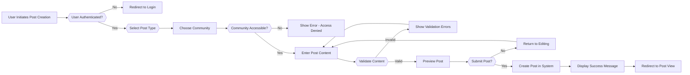
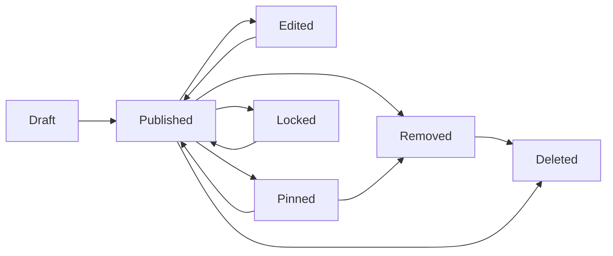

# Posts Creation and Management

## 1. Post Types and Content Overview

THE community platform SHALL support three distinct post types, each with specific content requirements and use cases:

1. **Text Posts** - User-generated written content with optional formatting
2. **Link Posts** - External URL references with metadata
3. **Image Posts** - Visual content with single or multiple images

Each post type serves different user needs and requires specific validation, storage, and display handling. Users SHALL choose their post type at creation time, and THE system SHALL enforce type-specific requirements.

---

## 2. Post Creation Requirements and Validation

### 2.1 User Permission Requirements

WHEN a guest user attempts to create a post, THE system SHALL deny the action and display a message indicating that user registration is required.

WHEN a member user attempts to create a post in a community, THE system SHALL verify the member has not been banned from the community.

WHEN a member user attempts to create a post in a private community, THE system SHALL verify the member is subscribed to or is a moderator of the community.

WHEN a moderator or admin attempts to create a post in any community, THE system SHALL permit post creation regardless of community settings.

### 2.2 Community Context Requirements

WHEN a member attempts to create a post, THE system SHALL require the user to specify a target community.

THE system SHALL validate that THE specified community exists and is accessible to THE user.

IF the specified community is in a suspended or archived state, THEN THE system SHALL deny post creation.

### 2.3 Post Creation Workflow

The post creation process follows this workflow:



### 2.4 General Content Validation Rules

THE system SHALL require that all posts have non-empty, substantive content appropriate to the post type.

THE system SHALL reject posts containing only whitespace or special characters without meaningful content.

THE system SHALL apply these validation rules consistently across all post types.

THE system SHALL provide specific error messages indicating which validation rule was violated.

---

## 3. Text Posts Specification

### 3.1 Text Post Definition

Text posts are user-generated written content that users can create to start discussions, share thoughts, or contribute to community conversations. Text posts are THE most flexible post type and support rich discussion.

### 3.2 Text Post Fields

WHEN a member creates a text post, THE system SHALL require:

1. **Post Title** (Mandatory)
   - Minimum length: 3 characters
   - Maximum length: 300 characters
   - Content: Text with spaces, punctuation, and basic Unicode characters
   - Validation: Non-empty, not purely whitespace
   - Purpose: Display in listings, search results, and post views
   - Character Counter: THE system SHALL display real-time character count (current/maximum)

2. **Post Body Content** (Mandatory or Optional based on content strategy)
   - Minimum length: 1 character (allowing title-only posts or minimal content if desired)
   - Maximum length: 40,000 characters
   - Content: Plain text or markdown formatting
   - Validation: At least title must be substantive
   - Purpose: Main content of THE post
   - Markdown Support: Bold (**text**), Italic (*text*), Code blocks (```), Links, Lists, Blockquotes
   - Character Counter: THE system SHALL display real-time character count in post body field

### 3.3 Text Post Validation Rules

WHEN a user submits a text post title, THE system SHALL validate that:
- Title is between 3 and 300 characters
- Title is not purely whitespace or special characters
- Title does not contain excessive repeated characters (e.g., "!!!!!!!!" is rejected)
- Title is not identical to another post title from THE same user within THE past 24 hours (to prevent spam)
- Title does not contain malicious scripts or code (sanitize HTML)

WHEN a user submits post body content, THE system SHALL validate that:
- Content does not exceed 40,000 characters
- If body is provided, it contains substantive text (not just whitespace)
- Content does not contain malicious scripts or code
- Markdown formatting is valid and renders correctly

**Error Messages:**
- IF title is empty: "Post title is required"
- IF title is too short: "Post title must be at least 3 characters"
- IF title exceeds limit: "Post title cannot exceed 300 characters (current: X)"
- IF title has excessive repeated characters: "Post title contains too many repeated characters"
- IF body exceeds limit: "Post content cannot exceed 40,000 characters (current: X)"
- IF content is only whitespace: "Post content cannot be empty or contain only spaces"

### 3.4 Text Post Creation Constraints

THE system SHALL create text posts in an "unpublished" state, pending moderation review if THE community requires it.

THE system SHALL immediately publish text posts visible to THE community if THE community does not require moderation.

THE system SHALL associate THE text post with THE creating user, target community, and creation timestamp.

THE system SHALL track post creation IP address and user agent for fraud detection purposes (stored securely).

---

## 4. Link Posts Specification

### 4.1 Link Post Definition

Link posts enable users to share external URLs with THE community. Link posts are useful for sharing articles, videos, resources, or other external content. When users create link posts, THE system attempts to extract metadata about THE linked resource.

### 4.2 Link Post Fields

WHEN a member creates a link post, THE system SHALL require:

1. **Post Title** (Mandatory)
   - Minimum length: 3 characters
   - Maximum length: 300 characters
   - Content: Text with spaces, punctuation, and basic Unicode characters
   - Validation: Non-empty, not purely whitespace
   - Purpose: Display description of THE link content
   - Pre-fill Option: THE system MAY automatically populate title from webpage title (with user override)

2. **URL** (Mandatory)
   - Format: Valid HTTP or HTTPS URL
   - Validation: Must be accessible and well-formed
   - Validation: Protocol must be http:// or https://
   - Maximum length: 2,048 characters
   - Purpose: THE external resource link
   - Storage: Stored exactly as provided by user
   - Auto-correction: THE system SHALL prepend https:// if protocol is missing

3. **URL Metadata** (Auto-extracted, optional fields)
   - Domain name (extracted from URL)
   - Favicon (if available from domain)
   - Preview image (if available from page metadata)
   - Description snippet (if available from page metadata)
   - Page title (from page header or OpenGraph)

### 4.3 Link Post Validation Rules

WHEN a user submits a link post URL, THE system SHALL validate that:
- URL follows valid URL format (http:// or https:// required or auto-add https://)
- URL is not blacklisted (spam domains, known malicious sites)
- URL is not a shortened URL that redirects to blacklisted content
- URL does not point to THE platform itself (preventing self-referential links)
- Domain is reachable and responds to requests within 5 seconds (health check)
- URL does not point to internal IP addresses (10.0.0.0/8, 172.16.0.0/12, 192.168.0.0/16, 127.0.0.1)

WHEN a user submits a link post title, THE system SHALL apply THE same validation rules as text posts.

**Error Messages:**
- IF URL format is invalid: "Please enter a valid URL starting with http:// or https://"
- IF URL is blacklisted: "This URL has been flagged as potentially unsafe or spam"
- IF URL is unreachable: "Cannot access this URL. Verify it's correct and publicly accessible"
- IF URL is internal network: "Cannot link to internal network addresses"
- IF URL exceeds length limit: "URL is too long. Keep it under 2,048 characters"

### 4.4 URL Metadata Extraction

WHEN a member creates a link post with a valid URL, THE system SHALL attempt to extract metadata from THE target URL:

THE system SHALL extract THE domain name from THE URL for display purposes.

THE system SHALL attempt to retrieve THE page title, description, and preview image using page metadata (Open Graph tags, Twitter Card tags, or page headers).

THE system SHALL store extracted metadata but display THE link even if metadata extraction fails.

THE system SHALL cache extracted metadata for 30 days to avoid repeated requests to THE same domain.

WHEN metadata extraction fails, THE system SHALL display THE URL with domain name only (no preview image or description).

THE system SHALL timeout URL fetching after 5 seconds and allow post creation without metadata.

### 4.5 Link Post Creation Constraints

THE system SHALL create link posts in an "unpublished" state if THE community requires moderation.

THE system SHALL immediately publish link posts if THE community does not require moderation.

THE system SHALL associate THE link post with THE creating user, target community, URL, and creation timestamp.

THE system SHALL prevent editing THE URL after post creation (URL cannot be changed post-creation, only title and metadata).

---

## 5. Image Posts Specification

### 5.1 Image Post Definition

Image posts enable users to share images with THE community. Users can upload one or multiple images with optional captions. Image posts are popular for visual content, screenshots, artwork, and photography.

### 5.2 Image Post Fields

WHEN a member creates an image post, THE system SHALL require:

1. **Post Title** (Mandatory)
   - Minimum length: 3 characters
   - Maximum length: 300 characters
   - Content: Text with spaces, punctuation, and basic Unicode characters
   - Validation: Non-empty, not purely whitespace
   - Purpose: Display description of THE image content

2. **Images** (Mandatory - at least 1 image)
   - Minimum images: 1
   - Maximum images: 10 (to balance functionality with storage)
   - File format: JPEG, PNG, GIF, WebP
   - Maximum file size per image: 50 MB
   - Minimum dimensions: 50x50 pixels
   - Maximum dimensions: 20,000x20,000 pixels
   - Aspect ratio: Flexible (no specific ratio requirement)
   - Upload Progress: THE system SHALL display upload progress bar for each image
   - Drag-and-drop: THE system SHALL support drag-and-drop image upload

3. **Image Captions** (Optional)
   - Per-image optional text (separate from post title)
   - Maximum caption length: 500 characters per image
   - Purpose: Additional context for specific images in multi-image posts
   - Markdown Support: THE system SHALL support basic markdown in captions (bold, italic, links)

### 5.3 Image Upload Validation Rules

WHEN a user uploads an image for a post, THE system SHALL validate that:
- File is in an allowed format (JPEG, PNG, GIF, WebP)
- File size does not exceed 50 MB per image
- Image dimensions are between 50x50 and 20,000x20,000 pixels
- File is not corrupted (magic number validation)
- File does not contain malicious content (virus scanning recommended)
- Total images uploaded do not exceed 10 per post

IF an uploaded image fails validation, THEN THE system SHALL display a specific error message indicating THE reason (file format, size, dimensions, or corruption).

THE system SHALL reject images containing explicit NSFW content and flag them for moderation unless THE post is created in a community marked for mature content.

**Error Messages:**
- IF format invalid: "Image format not supported. Use JPEG, PNG, GIF, or WebP"
- IF too large: "Image file is too large (max 50 MB). Current size: X MB"
- IF dimensions too small: "Image is too small. Minimum: 50x50 pixels. Current: X x Y"
- IF dimensions too large: "Image is too large. Maximum: 20,000x20,000 pixels. Current: X x Y"
- IF corrupted: "Image file is corrupted or invalid. Please use a different image"
- IF exceeds count: "Maximum 10 images per post. You have uploaded X"

### 5.4 Image Processing and Storage

WHEN an image is successfully uploaded, THE system SHALL:

1. Generate a unique identifier for THE image
2. Store THE original image file in secure storage
3. Generate thumbnails for different display contexts:
   - Thumbnail size: 300x300 pixels (for feed display)
   - Medium size: 800x800 pixels (for post view)
   - Full resolution: Original size (for viewing full image)
4. Optimize image quality while maintaining visual fidelity
5. Store metadata: dimensions, file size, upload timestamp, format
6. Store EXIF metadata (preserve image creation date, remove geolocation)

THE system SHALL support asynchronous image processing to avoid blocking post creation.

THE system SHALL display upload progress to user with percentage and time estimate.

THE system SHALL allow user to replace or remove individual images before submission.

### 5.5 Image Post Creation Constraints

THE system SHALL require at least one image to create an image post.

THE system SHALL create image posts in an "unpublished" state if THE community requires moderation.

THE system SHALL immediately publish image posts if THE community does not require moderation.

THE system SHALL associate THE image post with THE creating user, target community, image files, and creation timestamp.

THE system SHALL not display broken images in post feeds; if an image becomes unavailable, THE system SHALL show a placeholder and log THE incident.

THE system SHALL generate responsive image srcsets (2x, 3x) for display optimization on different devices.

---

## 6. Post Metadata and Fields

### 6.1 Standard Post Metadata

Every post, regardless of type, SHALL include THE following metadata fields:

| Metadata Field | Data Type | Purpose | Editable |
|---|---|---|---|
| Post ID | UUID | Unique identifier for THE post | No |
| Author ID | UUID | User who created THE post | No |
| Community ID | UUID | Community where post was created | No |
| Post Type | Enum (text/link/image) | Type of post | No |
| Title | String | Post title (all types) | Yes (before deletion) |
| Created At | Timestamp | When post was created | No |
| Updated At | Timestamp | When post was last edited | No |
| Published At | Timestamp | When post became visible | No |
| Status | Enum | Publication and moderation status | System-managed |
| View Count | Integer | Total views of THE post | System-managed |
| Comment Count | Integer | Number of direct comments | System-managed |
| Upvote Count | Integer | Number of upvotes received | System-managed |
| Downvote Count | Integer | Number of downvotes received | System-managed |
| Net Score | Integer | Upvotes minus downvotes | System-managed |
| Is Pinned | Boolean | Whether post is pinned in community | Moderator-managed |
| Is Locked | Boolean | Whether comments are disabled | Moderator-managed |
| Is Removed | Boolean | Whether post was removed by moderation | Moderator-managed |
| Removal Reason | String | Reason for removal (if applicable) | Moderator-managed |
| Author Username | String | Username of post creator (for display) | Denormalized |
| Community Name | String | Name of community (for display) | Denormalized |

### 6.2 Post Status States

Posts progress through THE following status states during their lifecycle:

1. **Draft** - Post created but not yet published (rarely exposed to end users)
2. **Published** - Post is visible in THE community and feeds
3. **Pinned** - Post is featured at THE top of THE community (subset of Published)
4. **Edited** - Post has been edited after creation (Published with edit indicator)
5. **Locked** - Post comments are disabled but post remains visible
6. **Removed** - Post removed by moderators (hidden from users, visible to moderators)
7. **Deleted** - Post deleted by author or system

**Status Transitions:**


### 6.3 Post Timestamps

WHEN a post is created, THE system SHALL record THE creation timestamp in UTC timezone.

WHEN a post is published, THE system SHALL record THE publication timestamp (may differ from creation if moderation delay occurs).

WHEN a post is edited, THE system SHALL update THE "Updated At" timestamp and set an "Edit Count" field.

THE system SHALL preserve all timestamps in UTC timezone for consistency and shall convert to user's local timezone during display.

THE system SHALL display timestamps as relative format in feeds ("2 hours ago") and absolute format in detail views ("November 15, 2024 at 2:30 PM").

---

## 7. Post Editing and Deletion

### 7.1 Post Editing by Author

WHEN a member requests to edit their own post, THE system SHALL verify THE user is THE original author.

THE system SHALL permit editing of THE following fields:
- Post title
- Post body content (for text posts)
- Image captions (for image posts)
- Post body content SHALL NOT include URL changes (for link posts; link cannot be changed)

THE system SHALL NOT permit editing of:
- Post type
- Target community
- Original URL (for link posts)
- Posted images (images cannot be replaced; new images cannot be added)

### 7.2 Edit Time Window

WHEN a member edits a text or link post, THE system SHALL allow editing within 48 hours of post creation.

WHEN a member edits an image post, THE system SHALL allow editing within 48 hours of post creation.

IF a post receives comments or votes, THE system SHALL still permit editing within THE 48-hour window but SHALL display an "edited" indicator to readers.

AFTER 48 hours have passed, THE system SHALL deny edit requests from THE author and display a message indicating THE post is no longer editable.

**Error Message:** "This post cannot be edited. Edit window closed. (Original posted X days ago)"

### 7.3 Edit Tracking

WHEN a post is edited, THE system SHALL:
1. Record THE edit timestamp
2. Increment THE edit count
3. Display an "Edited X hours ago" indicator on THE post
4. Store edit history (for audit purposes - accessible to moderators and admins)
5. Preserve THE original content (for moderation and dispute resolution)

THE system SHALL display edit indicator only if edited within 5 minutes of publication (grace period for typo fixes).

THE system SHALL show full edit history to moderators: "Edited 3 times. Last edit: 2 hours ago"

### 7.4 Post Deletion by Author

WHEN a member requests to delete their own post, THE system SHALL require confirmation from THE user.

WHEN a member confirms post deletion, THE system SHALL:
1. Mark THE post as deleted in THE database
2. Remove THE post from all feeds and search results immediately
3. Remove THE post from THE user's profile
4. Preserve THE post data for moderation audit trail (not permanently erased)
5. Display a message indicating THE post has been deleted

**Confirmation Message:** "Are you sure you want to delete this post? This action cannot be undone. All comments and votes will be deleted."

THE system SHALL permit post deletion at any time after creation, including posts with comments and votes.

### 7.5 Post Deletion by Moderators

WHEN a moderator removes a post due to rule violation, THE system SHALL:
1. Mark THE post as removed (not deleted)
2. Record THE moderator who removed THE post
3. Record THE removal reason
4. Hide THE post from community feeds and search results
5. Display THE removal reason to THE original author
6. Allow THE original author to view THE removed post with THE removal reason
7. Log THE action for platform audit trail

THE system SHALL allow moderators to provide a removal reason from a predefined list:
- Violates community rules
- Spam or misleading
- Hate speech or harassment
- Misinformation
- Adult content (in non-adult community)
- Other (with custom text)

THE system SHALL send notification to author: "Your post was removed by moderators for: [reason]"

### 7.6 Post Restoration

WHEN a post is incorrectly removed, a moderator with appropriate permissions SHALL be able to restore THE post.

WHEN a post is restored, THE system SHALL:
1. Change THE status back to Published or Pinned (as appropriate)
2. Make THE post visible in feeds and search again
3. Log THE restoration action with timestamp and moderating user
4. Notify THE original author that THE post was restored

---

## 8. Post Display and Rendering

### 8.1 Post Display in Feed Context

WHEN a post is displayed in a feed or community listing, THE system SHALL show:

**For Text Posts:**
- Post title
- Community name (with icon if available)
- Author username
- Time ago posted
- View count
- Comment count
- Score (upvotes - downvotes)
- Optional preview of post body (first 200 characters with "..." if truncated)
- [Edit] and [Delete] buttons if user is author
- [Report] button visible to all authenticated users

**For Link Posts:**
- Post title
- Community name
- Author username
- Time ago posted
- External domain name and icon
- View count
- Comment count
- Score
- Optional preview image (if extracted from metadata)
- Domain favicon (if available)
- [Edit] and [Delete] buttons if user is author
- [Report] button visible to all authenticated users

**For Image Posts:**
- Post title
- Community name
- Author username
- Time ago posted
- Thumbnail image(s) - up to 3 thumbnails visible, "+X more" if additional
- View count
- Comment count
- Score
- [Edit] and [Delete] buttons if user is author
- [Report] button visible to all authenticated users

### 8.2 Post Display in Full Post View

WHEN a post is displayed in its full detailed view, THE system SHALL show:

**All Post Types Display:**
- Complete post title
- Full author name with link to profile
- Author avatar image
- Author karma score
- Author reputation level badge
- Creation timestamp (e.g., "Posted 2 hours ago")
- Community name with link to community
- Complete vote count breakdown (upvotes and downvotes separately)
- Total comment count
- View count
- Edit indicator if post was edited (showing when)
- "Pinned" indicator if post is pinned
- "Locked" indicator if comments disabled
- Moderator removal reason (if applicable)
- Share button (copy link, share to social media)
- Report button

**Text Posts Additional Display:**
- Complete post body content with formatting preserved
- Markdown rendering if supported
- Code syntax highlighting in code blocks
- Line breaks and paragraph spacing preserved

**Link Posts Additional Display:**
- Full URL displayed prominently
- Preview image if available
- Page metadata (title, domain, favicon)
- "Open in new window" button/link
- Domain reputation indicator (safe, potentially unsafe, etc.)

**Image Posts Additional Display:**
- All uploaded images displayed in carousel or grid
- Per-image captions (if provided)
- Download image option for each image
- Image metadata display (dimensions, file size, upload date)
- Option to view image in lightbox/full-screen mode
- Image navigation arrows in carousel ("Image X of Y")

### 8.3 Post Display for Removed Content

IF a post has been removed by moderators, THE system SHALL:

**For THE Original Author:**
- Display THE post with a banner indicating removal
- Show THE moderator's removal reason
- Provide option to appeal THE removal (if platform supports appeals)
- Allow viewing removal details and moderator notes

**For Other Users:**
- Not display THE post in community feeds or search results
- If user attempts to access direct link: show message "This content has been removed"
- Not display THE post in THE author's profile to other users

**For Moderators and Admins:**
- Display THE post with "Removed" indicator
- Show THE removal reason and removing moderator
- Provide option to restore THE post
- Show removal timestamp and appeal status

### 8.4 Post Display for Deleted Content

IF a post has been deleted by THE author, THE system SHALL:
- Not display THE post in any feeds or search results
- Not display THE post in THE author's profile
- Show "Deleted" message if user attempts to access direct link
- Preserve THE deletion in audit logs

### 8.5 Vote Display and Interaction

WHEN displaying a post in any context, THE system SHALL show:
- Vote count display: "[+] upvotes [-] downvotes" or "(+50 upvotes, -5 downvotes)"
- Vote buttons (upvote/downvote arrows) for authenticated members
- Current user's vote highlighted/filled if they have voted
- Real-time vote count updates within 2 seconds of voting
- Vote count tooltip showing: "X upvotes, Y downvotes"

---

## 9. View Tracking and Timestamps

### 9.1 View Count Tracking

WHEN a registered member or guest user loads a post's full view page, THE system SHALL increment THE post's view count by 1.

THE system SHALL track THE view only once per unique user per 24-hour period (same user visiting THE post multiple times in one day counts as one view).

THE system SHALL not count page refreshes from THE same user within 5 minutes as new views.

THE system SHALL display THE total view count on THE post with label "Views" or similar.

THE system SHALL calculate "Views per hour" metric for trending calculations.

### 9.2 Timestamp Display

WHEN displaying posts, THE system SHALL show human-readable relative timestamps such as:
- "Posted now" (0-5 minutes ago)
- "Posted 5 minutes ago"
- "Posted 1 hour ago"
- "Posted 1 day ago"
- "Posted 1 week ago"
- "Posted 1 month ago"
- "Posted 1 year ago"

THE system SHALL display full timestamps (e.g., "November 15, 2024 at 2:30 PM EST") on hover or in THE detailed post view.

THE system SHALL convert all timestamps to user's local timezone for display (if timezone is available).

### 9.3 Edit Timestamp Display

IF a post has been edited, THE system SHALL display "Edited X time ago" indicator near THE creation timestamp.

THE system SHALL show THE most recent edit timestamp, not THE count of edits, in THE main display.

THE system SHALL include edit indicator only if edited after 5-minute grace period.

Moderators and admins MAY see THE full edit history when viewing THE post in moderation tools.

---

## 10. Post Deletion and Purging

### 10.1 Soft Delete Implementation

THE system SHALL implement "soft delete" for all posts, meaning:
- Posts are marked as deleted but data is retained
- Deleted posts are excluded from all user-facing queries
- Deleted posts remain accessible to admins and moderators for audit purposes
- Deleted posts can theoretically be restored (though THE platform may not expose this to users)

### 10.2 Permanent Purging Policy

THE system MAY implement permanent purging of deleted posts after a retention period (e.g., 90 days) to manage storage and comply with privacy regulations.

WHEN a user requests account deletion, THE system SHALL delete or anonymize all posts created by that user according to privacy policy.

WHEN content is permanently purged, THE system SHALL:
1. Verify THE action in logs
2. Remove all associated images and files
3. Cascade delete any comments that depend on THE post
4. Update THE post count for THE community and user profile

---

## 11. Edge Cases and Constraints

### 11.1 Post Creation Rate Limiting

THE system SHALL implement rate limiting to prevent spam:

WHEN a member creates a post, THE system SHALL track creation frequency.

THE system SHALL allow a member to create maximum 10 posts per hour in THE same community.

THE system SHALL allow a member to create maximum 50 posts per day across all communities.

WHEN members have been on platform less than 7 days, THE system SHALL reduce limits to: maximum 3 posts per day total.

IF a member exceeds these limits, THE system SHALL deny THE post creation and display a message indicating THE limit was reached and when THE limit will reset.

**Error Message:** "You are posting too frequently. You can post again in [X minutes]. (Daily limit: X/10 posts)"

### 11.2 Duplicate Content Detection

WHEN a member creates a post with a title and content identical to another post THE same user created within THE past 24 hours, THE system SHALL warn THE user about THE potential duplicate.

THE system SHALL allow THE user to override THE warning and create THE duplicate if intentional.

**Warning Message:** "You already posted similar content [time ago]. Are you sure you want to post again? [Cancel] [Post Anyway]"

### 11.3 Community-Specific Post Types

Communities MAY have settings that restrict which post types are allowed:
- Text only
- Links only
- Images only
- All types (default)

WHEN a member attempts to create a post type not allowed in a community, THE system SHALL deny THE creation and display a message indicating which post types are permitted.

**Error Message:** "This community only allows [text/link/image] posts. [Post Type] posts are not permitted here."

### 11.4 Concurrent Editing

IF two users attempt to edit THE same post simultaneously (which should be rare since only THE author can edit), THE system SHALL:
1. Accept THE first edit
2. Reject THE second edit with a "conflict" message
3. Display THE current post content to THE second user
4. Require THE second user to refresh and reapply their changes

**Error Message:** "This post was modified by another user. Please refresh to see latest version and try again."

### 11.5 Large-Scale Data Consistency

THE system SHALL ensure post counts are accurate and consistent:

WHEN a post is deleted or removed, THE system SHALL decrement THE community's post count and THE user's post count.

WHEN a post is restored, THE system SHALL increment THE counts appropriately.

THE system SHALL periodically audit post counts to detect and correct inconsistencies (weekly consistency checks).

### 11.6 Handling Deleted Users

IF a user account is deleted, THE system SHALL:

**Option 1 - Anonymization:**
- Replace THE author information with "[Deleted User]"
- Keep THE post visible but attribute it to a deleted account
- Preserve vote and comment history
- Update profile link to show deleted account notice

**Option 2 - Full Deletion:**
- Delete all posts created by THE user
- Delete all comments created by THE user
- This may be configurable based on community or platform policy

THE system SHALL choose one approach consistently across THE platform.

---

## 12. Error Handling for Post Operations

### 12.1 Validation Errors

IF a user provides invalid input when creating a post (e.g., title exceeds 300 characters), THE system SHALL:

1. Return a specific error message explaining THE validation failure
2. Identify THE problematic field
3. Suggest corrections or limits
4. Preserve THE user's input so they can fix it without re-entering everything

**Error Messages:**
- "Post title cannot exceed 300 characters. Current: X/300"
- "Post body cannot exceed 40,000 characters. Current: X/40,000"
- "Post title must be at least 3 characters"
- "At least one image is required for image posts"
- "Images must be 100x100 to 8000x8000 pixels"

### 12.2 Conflict Errors

IF a user attempts to change their post content to something identical to another user's post, THE system SHALL NOT reject (different users can post same content).

IF a user attempts to change their post title to one they already used in another post, THE system SHALL allow but display warning.

### 12.3 Permission Errors

IF a guest user attempts to create a post, THE system SHALL:

1. Redirect to login
2. Display message: "You must be logged in to create a post. Log in or register now."

IF a user attempts to edit another user's post, THE system SHALL:

1. Return error: "You don't have permission to edit this post. Only the author can edit posts."

IF a user attempts to create post in community they're banned from, THE system SHALL:

1. Return error: "You are banned from this community and cannot post here."

### 12.4 Rate Limiting Errors

IF a user attempts to create posts too frequently (more than 10 per hour in same community), THE system SHALL:

1. Return error: "You are posting too frequently. You can post again in [X minutes]"
2. Indicate remaining quota: "Daily limit: 3/10 posts used"

### 12.5 Community Not Found

IF a user attempts to create post in non-existent community, THE system SHALL:

1. Return error: "This community does not exist. Check the spelling or browse communities."

---

## 13. Integration with Other Systems

### 13.1 Relationship to Voting System

Voting and karma systems integrate with posts as defined in [Voting and Karma System Document](./06-voting-karma-system.md). Post votes directly affect:
- Post karma calculation
- Post ranking in feeds (hot, top, controversial)
- Author karma accumulation

### 13.2 Relationship to Comments System

Comments system integrates with posts as defined in [Comments and Discussions Document](./07-comments-discussions.md). Posts can have:
- Multiple root-level comments
- Comment threads with nested replies
- Comment counts displayed on posts

### 13.3 Relationship to Community Management

Communities system integration as defined in [Communities Management Document](./04-communities-management.md):
- Posts belong to specific communities
- Community settings affect post creation and visibility
- Community moderators can remove or pin posts

### 13.4 Relationship to Content Discovery

Content sorting and discovery integration as defined in [Content Sorting and Discovery Document](./08-content-sorting-discovery.md):
- Posts are ranked by hot, new, top, and controversial algorithms
- Posts populate feeds based on user subscriptions
- Posts are searchable through full-text search

### 13.5 Relationship to Moderation System

Moderation integration as defined in [Content Moderation and Reporting Document](./09-content-moderation-reporting.md):
- Posts can be reported for violations
- Moderators can remove or restore posts
- Removal reasons are tracked and audited

---

## 14. Performance Requirements

### 14.1 Post Creation Performance

THE system SHALL complete post creation (validation, storage, publishing) within 3 seconds for 95% of requests.

WHEN post contains images, THE system SHALL:
- Accept image uploads within 10 seconds for 95% of requests
- Complete image processing asynchronously (don't block post publication)
- Allow post to be published immediately while images process in background

### 14.2 Post Retrieval Performance

WHEN retrieving a single post detail view, THE system SHALL respond within 500 milliseconds.

WHEN retrieving a feed of posts, THE system SHALL respond within 2 seconds for 95% of requests.

WHEN retrieving community feed with 100+ posts, THE system SHALL paginate and respond within 2 seconds per page.

### 14.3 Image Processing Performance

THE system SHALL resize and optimize images asynchronously (background job) to avoid blocking post creation.

WHEN user views image post, THE system SHALL serve appropriately-sized image (responsive srcsets) within 1 second.

THE system SHALL cache processed images and serve from cache for subsequent requests.

### 14.4 Search Performance

WHEN searching posts by title/content, THE system SHALL respond within 1 second for typical queries.

THE system SHALL use full-text search indexes to enable efficient searching.

---

## 15. Business Rules Summary

| Rule | Specification |
|------|---|
| Post Types Supported | Text, Link, Image |
| Max Title Length | 300 characters |
| Max Text Body Length | 40,000 characters |
| Max Images per Post | 10 images |
| Max Image File Size | 50 MB per image |
| Edit Window | 48 hours from creation |
| Delete Permission | Author only (moderators can remove) |
| View Tracking | 1 per user per 24 hours |
| Rate Limit | 10 posts/hour same community, 50/day all |
| Minimum Title Length | 3 characters |
| Deletion Strategy | Soft delete (preserve for audit) |

---

> *Developer Note: This document defines **business requirements only**. All technical implementations (APIs, database schema, image storage solutions, caching strategies, etc.) are at the discretion of the development team.*