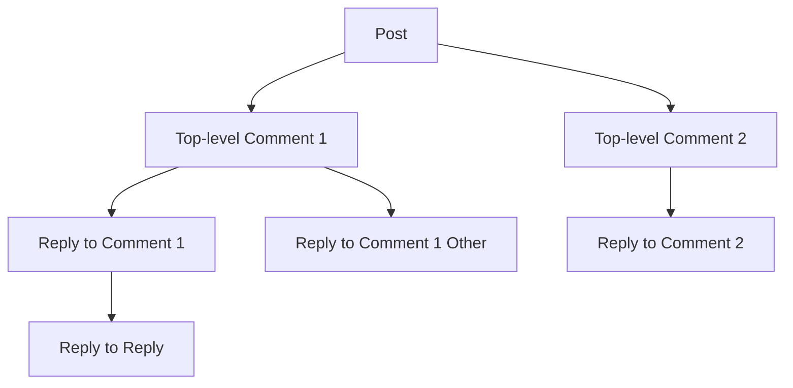

# Commenting System Requirements

## Overview and Purpose

The commenting system is the core mechanism for user interaction and discussion within the community platform. Comments enable users to provide feedback, engage in meaningful conversations, and build community relationships under each post. This system supports nested replies, creating threaded discussions that reflect the natural flow of conversation.

The commenting system is critical because:
- **Community Engagement**: Comments transform posts into conversations, driving user retention and platform activity
- **Reputation Building**: Comment voting contributes to user karma and community recognition
- **Content Moderation**: Comments require active moderation to maintain community standards
- **Discussion Quality**: Proper threading and sorting mechanisms ensure high-quality conversations
- **User Expression**: Nested replies allow nuanced, context-aware discussions

This document specifies all comment-related functionality including creation, editing, deletion, display, voting, and moderation workflows.

## 1. Comment Creation and Submission

### 1.1 Basic Comment Requirements

WHEN a member submits a comment on a post, THE system SHALL create a new comment record with the following required information:
- Comment author (the authenticated user)
- Comment body text (the content of the comment)
- Parent post ID (the post being commented on)
- Parent comment ID (if this is a reply to another comment, otherwise null)
- Creation timestamp
- Community context (inherited from the parent post)

WHEN a guest attempts to submit a comment, THE system SHALL deny the request and show an authentication required message.

WHEN a member submits a comment, THE system SHALL validate that the comment author has not been suspended or banned from the community.

### 1.2 Comment Content Validation

WHEN a member submits a comment, THE system SHALL enforce the following content constraints:
- Comment text length: minimum 1 character, maximum 10,000 characters
- Comment text is required (cannot be empty or whitespace-only)
- Comment must be UTF-8 encoded text
- Comments cannot contain unescaped HTML tags (plain text only, markdown supported for formatting)

IF a comment exceeds maximum length of 10,000 characters, THEN THE system SHALL reject the submission and provide character count feedback: "Comment exceeds maximum length of 10,000 characters. Your comment has [X] characters."

IF a comment is empty or contains only whitespace, THEN THE system SHALL reject the submission with message: "Comment cannot be empty. Please enter content."

### 1.3 Comment Submission Workflow

THE system SHALL execute the following steps when a member submits a comment:

1. **Validation Phase**:
   - Verify the member is authenticated and in good standing
   - Validate parent post exists and belongs to an accessible community
   - Validate parent comment exists (if replying to another comment)
   - Validate comment content meets length and format requirements
   - Check that member has not exceeded rate limits

2. **Creation Phase**:
   - Generate unique comment ID
   - Store comment with all metadata
   - Record creation timestamp (UTC)
   - Update comment count on parent post
   - Update comment count on parent comment (if reply)

3. **Engagement Phase**:
   - Initialize comment with zero upvotes and zero downvotes
   - Initialize comment with zero karma impact
   - Update member's comment count
   - Update community's comment statistics

4. **Notification Phase** (future enhancement):
   - Notify author of parent post that a comment was added
   - Notify author of parent comment that a reply was added
   - Queue notifications for community subscribers

### 1.4 Rate Limiting for Comment Submission

THE system SHALL implement rate limiting to prevent spam:
- Members can submit a maximum of 10 comments per minute
- Members can submit a maximum of 100 comments per hour per community
- Members with suspension warnings have stricter limits: 5 comments per minute

IF a member exceeds rate limits, THEN THE system SHALL reject the submission with HTTP 429 Too Many Requests and indicate when they can comment again: "You are posting too fast. Please wait [X] seconds before posting again."

### 1.5 Karma and Account Restrictions

IF a member's account karma is below -50, THEN THE system SHALL restrict comment posting in all communities with a message: "Your karma is too low to participate. You need to build community trust by creating quality content."

IF a member is a new account (created less than 24 hours ago), THEN THE system SHALL require their first 3 comments to be approved by a moderator before appearing publicly.

## 2. Nested Reply Structure and Threading

### 2.1 Comment Hierarchy and Nesting

Comments in the community platform support nested replies, creating a tree structure of discussion:

**Nesting Depth Limit**: THE system SHALL support a maximum nesting depth of 10 levels.

- Level 0: Top-level comments (direct replies to the post)
- Level 1-9: Nested replies (comments replying to other comments)
- Level 10: Maximum depth (replies at this level appear as Level 10, further replies show as Level 10)

IF a member attempts to reply to a comment at Level 10 nesting depth, THEN THE system SHALL allow the reply but display it as replying to the Level 10 comment (flattened threading at maximum depth).

### 2.2 Parent-Child Relationships

Each comment maintains two possible parent relationships:

**For top-level comments**:
- Parent Post ID: The ID of the post being commented on
- Parent Comment ID: Null (not a reply to another comment)

**For nested replies**:
- Parent Post ID: The ID of the post (same as top-level comment)
- Parent Comment ID: The ID of the comment being replied to

WHEN querying comments, THE system SHALL be able to retrieve:
- All top-level comments on a post (WHERE parent_comment_id IS NULL)
- All replies to a specific comment (WHERE parent_comment_id = {comment_id})
- Complete thread chain from any comment back to the post

### 2.3 Thread Organization

THE system SHALL organize all comments and replies into a hierarchical tree structure where:
- Posts contain top-level comments
- Comments contain nested replies
- The complete discussion tree can be rendered from any starting point

THE system SHALL support efficient querying of:
- All direct replies to a comment
- Complete thread chain (all ancestors of a comment)
- All descendants of a comment (all replies, replies to replies, etc.)
- Siblings (other top-level comments or replies to same parent)

### 2.4 Comment Chain Preservation

WHEN a comment is deleted, THE system SHALL preserve the comment chain structure:
- Replies to deleted comments remain intact
- The deleted comment parent-child relationship persists in the database (soft delete)
- Replies still reference their original parent comment
- The thread structure remains logically intact even with deleted comments

## 3. Comment Editing and Deletion

### 3.1 Edit Window and Permissions

THE system SHALL allow members to edit their own comments for 24 hours after creation:
- Comments can be edited up to 24 hours after creation
- Edits are only allowed by the comment author or moderators
- Edits close 24 hours after creation for regular members

WHEN a member attempts to edit a comment after 24 hours have passed, THE system SHALL deny the edit and show message: "The edit window for this comment has closed. Comments can only be edited within 24 hours of creation."

WHEN a moderator edits another member's comment, THE system SHALL mark the edit with a flag indicating it was modified by moderation staff: "[edited by moderator: reason]"

### 3.2 Edit History and Versioning

WHEN a member edits a comment, THE system SHALL:
- Store the original comment text in edit history
- Record the edit timestamp (UTC)
- Record the edit reason if provided by moderator
- Update the comment's "last edited" timestamp
- Display an indicator that the comment has been edited

THE system SHALL maintain complete edit history for each comment:
- Original version
- All subsequent edited versions
- Edit timestamps
- Edit reasons (for moderator edits)

WHEN displaying a comment, THE system SHALL show:
- The current edited version as the main text
- A visual indicator "(edited)" with timestamp if the comment has been modified
- A link to view edit history (if available to viewer)

### 3.3 Soft Delete Behavior

THE system SHALL implement soft deletes for comments, where deleted comments are marked as deleted but remain in the database:

WHEN a member deletes their own comment, THE system SHALL:
- Mark the comment as deleted (set deleted_at timestamp)
- Preserve the original comment text in the database
- Maintain all parent-child relationships
- Keep all associated vote data
- Preserve comment metadata

WHEN displaying a deleted comment, THE system SHALL show:
- A placeholder message "[deleted]" where the comment text was
- The comment's voting information (if visible)
- The comment's timestamp
- The "edited" indicator if the comment was edited before deletion
- All replies to the deleted comment remain visible

### 3.4 Comment Restoration

THE system SHALL allow comment restoration within 30 days of deletion:

WHEN a member requests to restore a comment they deleted, THE system SHALL:
- Check that the deletion occurred within 30 days
- Restore all comment content and metadata
- Restore all vote data
- Update the comment's timestamps appropriately
- Notify any users who had interacted with the comment

After 30 days, deleted comments cannot be restored.

## 4. Comment Display and Threading

### 4.1 Comment Sorting Within a Post

Comments within a post are displayed according to multiple sorting algorithms:

**Default Sort - "Best"**: THE system SHALL display comments sorted by a combination of vote score and recency:
- Recent high-scoring comments appear first
- Time decay reduces older comments in ranking
- Comments with many upvotes from the last 24 hours rank higher
- Formula: score × (1 / (1 + time_hours/24))

**Sort - "New"**: WHEN selected, THE system SHALL display all comments sorted by creation timestamp, newest first (most recent first).

**Sort - "Top"**: WHEN selected, THE system SHALL display all comments sorted by total upvote count minus downvote count (net vote score), highest first.

**Sort - "Controversial"**: WHEN selected, THE system SHALL display comments where upvotes and downvotes are closest in magnitude (high engagement but divided opinion).
- Formula: MIN(upvotes, downvotes) where both are significant
- Requires minimum 5 total votes to be considered "controversial"

**Sort - "Oldest"**: WHEN selected, THE system SHALL display all comments sorted by creation timestamp, oldest first.

### 4.2 Nested Reply Display Format

THE system SHALL display nested replies in a threaded format:

- **Top-level comments**: Display at full width, visually distinct
- **Level 1 replies**: Indented/nested under their parent comment with visual indentation
- **Deeper levels**: Progressively indented, maintaining visual hierarchy with consistent indentation increment
- **Collapsed state**: Long threads can be collapsed to show only top-level plus count of hidden replies
- **Expand state**: Users can expand to see all replies in a thread

For each comment, display:
- Author name and avatar
- Author karma badge (if applicable)
- Comment text
- Creation timestamp
- "Edited" indicator (if edited)
- Vote count (upvotes - downvotes)
- Vote buttons (upvote/downvote)
- Reply button
- Share/link button
- More options (edit, delete, report)

### 4.3 Pagination for Long Threads

THE system SHALL implement pagination for comments:

WHEN a post has more than 100 top-level comments, THE system SHALL:
- Display the first 100 comments by default (using selected sort algorithm)
- Provide "Load more" or pagination controls
- Load additional comments in batches of 50-100

WHEN a comment has more than 50 nested replies, THE system SHALL:
- Display the first 50 replies
- Provide "Load more" link to load additional replies
- Maintain the selected sorting algorithm for replies

### 4.4 Threading Algorithm

THE system SHALL implement the following threading display algorithm:

**Recursive Loading**: THE system SHALL load comment replies recursively to a maximum depth of 10 levels, but only fetch replies for comments the user can see (respecting pagination).

## 5. Comment Voting and Karma Impact

### 5.1 Voting on Comments

THE system SHALL support voting on comments using the same mechanism as post voting.

WHEN a member upvotes a comment, THE system SHALL:
- Increment the comment's upvote count by 1
- Record the vote in member's vote history
- Update comment karma calculation
- Prevent double-voting (if member already voted on this comment)

WHEN a member downvotes a comment, THE system SHALL:
- Increment the comment's downvote count by 1
- Record the vote in member's vote history
- Update comment karma calculation
- Prevent double-voting

WHEN a member removes their vote (clicking the same vote button again), THE system SHALL:
- Remove the vote record
- Decrement the appropriate vote count
- Recalculate comment karma

### 5.2 Karma Impact from Comment Votes

THE system SHALL award karma to comment authors based on votes:

- **Upvote on comment**: +1 karma to comment author
- **Downvote on comment**: -1 karma to comment author
- **Vote removal**: Reverse the karma change

WHEN a vote is changed (from upvote to downvote), THE system SHALL:
- Remove the upvote record (-1 karma reversal)
- Record the new downvote (-1 karma)
- Net result: -2 karma change from original upvote state

WHEN a vote is changed (from downvote to upvote), THE system SHALL:
- Remove the downvote record (+1 karma reversal)
- Record the new upvote (+1 karma)
- Net result: +2 karma change from original downvote state

## 6. Comment Moderation

### 6.1 Moderator Comment Capabilities

Moderators of a community can take the following actions on comments:

THE system SHALL allow moderators to:
- **Remove comments**: Delete comments that violate community rules
- **Edit comments**: Modify comment content and mark as "edited by moderator"
- **Lock comments**: Prevent further replies to a comment (but keep comment visible)
- **Pin/feature comments**: Highlight high-quality comments for visibility
- **Approve comments**: Whitelist comments from new members or flagged content
- **Suspend commenting**: Temporarily prevent a user from commenting in the community

WHEN a moderator removes a comment, THE system SHALL:
- Mark the comment as removed by moderation
- Display a message indicating removal by moderator
- Preserve nested replies
- Log the moderator action with timestamp and reason
- Notify the comment author of removal with reason

### 6.2 Comment Approval Workflow

FOR new member accounts (less than 24 hours old), THE system SHALL require moderation approval:

WHEN a new member submits their first 3 comments, THE system SHALL:
- Hold comments in pending state
- Show author that comment is awaiting approval
- Queue comments for moderator review
- Provide moderators with review interface

WHEN a moderator approves a pending comment, THE system SHALL:
- Publish the comment
- Notify the comment author
- Remove from review queue

WHEN a moderator rejects a pending comment, THE system SHALL:
- Delete the comment
- Notify the comment author with reason
- Allow the user to revise and resubmit

### 6.3 Audit Trails for Moderation

THE system SHALL maintain complete audit logs of all moderator actions on comments:

For each moderation action, log:
- **Moderator ID**: Who took the action
- **Comment ID**: Which comment was affected
- **Action type**: What action was performed (remove, edit, lock, pin, approve, suspend)
- **Timestamp**: When the action occurred (UTC)
- **Reason**: Why the action was taken (if provided)
- **Previous state**: What the comment was before modification
- **New state**: What the comment is after modification

WHEN an administrator reviews moderation activities, THE system SHALL display the complete audit trail in chronological order with full context.

### 6.4 User Comment Restrictions

THE system SHALL enforce the following restrictions on member commenting:

**Karma-based restrictions**:
- IF a member's karma is below -50, THEN they cannot comment in any community
- IF a member's account is less than 1 day old AND karma is below 0, THEN new member approval is required

**Suspension-based restrictions**:
- IF a member is suspended from a community, THEN they cannot comment in that community
- IF a member is suspended from the platform, THEN they cannot comment anywhere

**Rate limiting**:
- Members cannot post more than 10 comments per minute
- Members cannot post more than 100 comments per hour in a single community
- Suspended members have stricter limits: 5 comments per minute, 50 per hour

WHEN a member attempts to comment but is restricted, THE system SHALL provide a clear message explaining the restriction and when it will be lifted (if applicable).

## 7. Comment Permissions Matrix

THE following table defines which operations each user actor can perform on comments:

| Action | Guest | Member | Moderator | Administrator |
|--------|:-----:|:-------:|:---------:|:------------:|
| **Content Viewing** | | | | |
| View public comments | ✅ | ✅ | ✅ | ✅ |
| View deleted comments | ❌ | ❌ | ✅* | ✅ |
| View removed comments | ❌ | ❌ | ✅* | ✅ |
| **Content Creation** | | | | |
| Create comment | ❌ | ✅** | ✅ | ✅ |
| Reply to comment | ❌ | ✅** | ✅ | ✅ |
| **Content Management** | | | | |
| Edit own comment (24h) | N/A | ✅ | ✅ | ✅ |
| Delete own comment | N/A | ✅ | ✅ | ✅ |
| Edit any comment | ❌ | ❌ | ✅ | ✅ |
| Delete any comment | ❌ | ❌ | ✅ | ✅ |
| **Voting** | | | | |
| Upvote comment | ❌ | ✅ | ✅ | ✅ |
| Downvote comment | ❌ | ✅ | ✅ | ✅ |
| Change vote | ❌ | ✅ | ✅ | ✅ |
| Remove vote | ❌ | ✅ | ✅ | ✅ |
| **Moderation** | | | | |
| Report comment | ❌ | ✅ | ✅ | ✅ |
| Review reports | ❌ | ❌ | ✅ | ✅ |
| Remove comment | ❌ | ❌ | ✅ | ✅ |
| Lock comment | ❌ | ❌ | ✅ | ✅ |
| Approve pending comment | ❌ | ❌ | ✅ | ✅ |
| Suspend user commenting | ❌ | ❌ | ✅ (community) | ✅ (platform-wide) |
| View moderation log | ❌ | ❌ | ✅ (own) | ✅ (all) |

**Legend**: ✅* = Moderators can only view deleted/removed comments in their communities; ✅** = Subject to approval for accounts < 24 hours old

## 8. Business Rules Summary

### Core Comment Rules

| Rule | Specification |
|------|---|
| **Maximum length** | 10,000 characters |
| **Minimum length** | 1 character |
| **Nesting depth** | Maximum 10 levels |
| **Edit window** | 24 hours from creation |
| **Soft delete retention** | 30 days (then permanent) |
| **Rate limit** | 10 per minute, 100 per hour per community |
| **Approval required** | First 3 comments from new accounts (< 24 hours old) |
| **Karma restriction** | Below -50 karma = cannot comment |
| **Encoding** | UTF-8 text only |
| **Top-level comments per page** | 100 comments (paginated) |
| **Nested replies per parent** | 50 replies (paginated) |
| **Default sort** | Best (engagement + recency) |

### Performance Expectations

THE system SHALL meet the following performance requirements:

- **Comment submission**: Complete within 2 seconds (99th percentile)
- **Comment display**: Load top-level comments within 1 second
- **Thread loading**: Load nested replies within 1 second per level
- **Vote processing**: Update vote on comment within 500ms
- **Pagination**: Load next batch of comments within 1 second
- **Comment search**: Find comments in community within 2 seconds

THE system SHALL cache frequently accessed comment threads and invalidate caches on comment modification.

### Data Integrity Requirements

THE system SHALL maintain data integrity for comments:

- Every comment MUST have a valid author
- Every comment MUST have a valid parent post
- IF a comment has a parent comment, that comment MUST exist
- Comment vote counts MUST be consistent with vote records
- Comment karma MUST match calculated values from votes
- Deleted comments MUST preserve thread structure
- Comment timestamps MUST be immutable after creation

---

*Developer Note: This document defines business requirements only. All technical implementations (architecture, APIs, database design, query optimization strategies) are at the discretion of the development team. This document specifies WHAT the commenting system should do and how users interact with it, not HOW to implement it technically.*