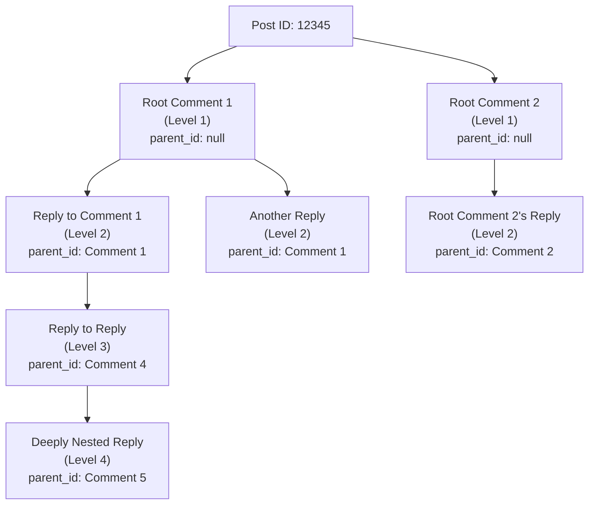

# Comments and Discussions System Specification

## 1. Comment System Overview

The comment system enables users to create threaded discussions on posts within communities. Comments form a hierarchical structure where users can reply to posts directly or reply to other comments, creating nested conversations. This system is core to fostering community engagement and discussion around shared content.

### 1.1 Core Purpose
The comment system allows community members to:
- Engage in threaded conversations on posts
- Build hierarchical discussion threads through nested replies
- Express opinions and share knowledge through comments
- Receive visibility through upvotes and community interaction
- Contribute to their user karma through comment engagement

### 1.2 Comment Hierarchy Model
Comments operate in a strict hierarchical tree structure:
- **Root Comments**: Comments posted directly on a post (direct reply to the post)
- **Nested Comments**: Comments posted as replies to other comments (creating threads)
- **Threading Depth**: Comments can be nested up to 10 levels deep (a root comment is level 1, a reply to that comment is level 2, and so on)
- **Thread Isolation**: Each comment thread is visually and logically independent from sibling threads

### 1.3 Access and Visibility
- Comments on public posts are visible to all guest users
- Comments on private posts are visible only to authorized community members
- Comment visibility matches post visibility permissions
- Comments on deleted posts are logically associated but may not be independently discoverable

---

## 2. Comment Creation and Submission

### 2.1 Permission Requirements

WHEN a guest user attempts to create a comment, THE system SHALL deny the action and show a message indicating that user registration is required.

WHEN a member user navigates to a post, THE system SHALL display comment creation interface with text input field.

WHEN a moderator navigates to a post in their managed community, THE system SHALL display comment creation interface with any moderator-specific options.

WHEN an admin navigates to any post, THE system SHALL display comment creation interface with all available options.

### 2.2 Community Context Requirements

WHEN a member attempts to create a comment, THE system SHALL require the post being commented on to exist and be accessible.

THE system SHALL validate that THE specified post exists and is not deleted or removed.

IF the post is deleted or removed, THEN THE system SHALL deny comment creation and display error: "This post is no longer available."

IF the post is in an archived state, THEN THE system SHALL deny comment creation and display error: "This post is archived and no longer accepting comments."

### 2.3 Post Creation Workflow

The comment creation process follows this workflow:

```mermaid
graph LR
  A["User Viewing Post"] --> B{\"User Authenticated?\"}
  B -->|\"No\"| C["Display Login Prompt"]
  B -->|\"Yes\"| D["Display Comment Form"]
  D --> E["User Enters Comment Text"]
  E --> F{\"Validate Content\"}
  F -->|\"Invalid\"| G["Show Validation Errors"]
  G --> E
  F -->|\"Valid\"| H["Submit Comment"]
  H --> I{\"Rate Limit Check\"}
  I -->|\"Limit Exceeded\"| J["Show Rate Limit Error"]
  J --> K["Disable Submit for X Seconds"]
  I -->|\"Allowed\"| L["Create Comment in System"]
  L --> M["Display Success & Show Comment"]
  M --> N["Update Comment Count"]
```

### 2.4 General Content Validation Rules

THE system SHALL require that all comments have non-empty, substantive content appropriate to discussion.

THE system SHALL reject comments containing only whitespace or special characters without meaningful content.

THE system SHALL apply these validation rules consistently across all comment submissions.

THE system SHALL provide specific error messages indicating which validation rule was violated.

IF a comment is submitted with content fewer than 1 character after whitespace removal, THEN THE system SHALL reject with error: "Comment cannot be empty."

IF a comment exceeds 10,000 characters, THEN THE system SHALL reject with error: "Comment cannot exceed 10,000 characters (current: [X])."

---

## 3. Comment Structure and Metadata

### 3.1 Comment Data Model

Each comment in the system contains the following mandatory fields:

| Field | Type | Description | Editable | Required |
|-------|------|-------------|----------|----------|
| comment_id | UUID | Unique identifier for the comment | No | Yes |
| post_id | UUID | Reference to the post this comment is on | No | Yes |
| parent_comment_id | UUID or null | Reference to parent comment if reply; null if root | No | No |
| author_id | UUID | User who created the comment | No | Yes |
| content | Text | The comment text content (supports markdown) | Yes | Yes |
| created_at | Timestamp | When the comment was created (ISO 8601) | No | Yes |
| edited_at | Timestamp or null | When last edited; null if never edited | No | No |
| deleted_at | Timestamp or null | When deleted (soft delete); null if not deleted | No | No |
| is_deleted | Boolean | Whether this comment is soft-deleted | No | Yes |
| edit_count | Integer | Number of times edited | No | Yes |
| upvote_count | Integer | Total upvotes received | No | Yes |
| downvote_count | Integer | Total downvotes received | No | Yes |
| net_score | Integer | Calculated: upvote_count - downvote_count | No | Yes |
| nesting_depth | Integer | Hierarchy level (1=root, 2=reply to root, max 10) | No | Yes |
| is_moderator_post | Boolean | Whether posted by community moderator | No | Yes |
| is_admin_post | Boolean | Whether posted by platform admin | No | Yes |
| is_pinned | Boolean | Whether pinned by moderator (always visible top) | No | Yes |
| moderation_flags | Array | Any content flags or moderation markers | No | No |

### 3.2 Comment Display Fields

When comments are displayed to users, THE system SHALL show:

- Author name and avatar (linked to profile)
- Author karma score displayed prominently
- Author role badge (Moderator, Admin) if applicable
- Comment text with rendered markdown formatting
- Comment creation timestamp in relative format ("2 hours ago")
- "Edited X times" indicator if edited_at is not null
- Vote counts (upvotes and downvotes separately)
- Current user's vote status on this comment (if applicable)
- Reply button to enable nested discussion
- Full timestamp in ISO format on hover
- Edit and delete buttons (if user is author)
- Moderator options (if user is moderator)

### 3.3 Moderator and Admin Indicators

IF a comment is posted by a community moderator in their managed community, THE system SHALL display a "Moderator" or "Mod" badge next to their username.

IF a comment is posted by a platform admin, THE system SHALL display an "Admin" badge next to their username.

IF a comment is posted by the original post author, THE system SHALL display an "Author" or "OP" badge to indicate original poster.

THE system SHALL display these badges consistently throughout the comment thread view.

### 3.4 Post Author Indicator

WHEN displaying a comment, THE system SHALL check if the comment author is the original post creator.

IF the author created the post, THE system SHALL display "OP" (Original Poster) badge with distinct visual styling.

THE "OP" badge helps readers quickly identify the original post author in discussions.

---

## 4. Nested Reply System and Threading Model

### 4.1 Parent-Child Relationships

#### 4.1.1 Establishing Relationships

WHEN a member replies to a post directly, THE system SHALL create a root-level comment with post_id set and parent_comment_id set to null.

WHEN a member replies to an existing comment, THE system SHALL create a comment with parent_comment_id set to the target comment's ID.

WHEN a member submits a reply, THE system SHALL validate that the parent comment exists and has not been deleted.

IF the parent comment is deleted, THE system SHALL display error: "This comment is no longer available. You cannot reply to it."

IF the parent comment has been removed by moderators, THE system SHALL display error: "This comment has been removed."

#### 4.1.2 Thread Hierarchy Validation

THE system SHALL enforce that each comment has at most one parent comment.

THE system SHALL prevent circular references (a comment cannot be its own ancestor).

THE system SHALL validate nesting depth before accepting a new reply.

IF a user attempts to reply at maximum nesting depth (level 10), THE system SHALL display error: "This comment thread is at maximum depth (10 levels). Please start a new root comment instead."

WHEN validating depth, THE system SHALL traverse the parent chain to calculate current depth.

THE depth calculation SHALL be: depth = 1 + parent_comment.depth (or depth = 1 if no parent).

### 4.2 Comment Threading Structure



### 4.3 Comment Thread Navigation

WHEN viewing a post, THE system SHALL display all root comments in the selected sort order (default: newest first).

WHEN a user clicks "Expand" or "View replies" on a root comment, THE system SHALL load and display all direct child comments of that root.

WHEN a user clicks on a child comment's "Reply" button, THE system SHALL display a visual indicator showing which comment they are replying to (e.g., "Replying to [author]: [first 50 chars]").

WHEN viewing nested comments, THE system SHALL use visual indentation or left-border styling to show hierarchy clearly.

THE visual indentation SHALL increase by 20-30 pixels per level, capped at 5 levels to prevent off-screen rendering.

### 4.4 Collapsed Comments Behavior

WHEN a comment has 5 or more direct child comments, THE system SHALL display a "[+X more replies]" link instead of showing all children initially.

WHEN a user clicks this link, THE system SHALL load and display all child comments with a fade-in animation.

WHEN viewing a comment thread with deep nesting (level 6+), THE system MAY collapse comments after level 5 to improve readability.

WHEN a user collapses a comment thread, THE system SHALL not display its child comments until expanded again.

THE system SHALL preserve collapse/expand state in user session (not permanently).

---

## 5. Comment Nesting Depth and Hierarchy Management

### 5.1 Maximum Nesting Depth

THE system SHALL allow comments to be nested up to 10 levels deep.

The nesting depth is calculated as follows: root comments are level 1, their direct replies are level 2, replies to level 2 are level 3, and so on.

WHEN a user attempts to reply to a comment at level 10, THE system SHALL prevent the reply and display message: "This thread is at maximum depth. Please continue in a new root comment."

THE system SHALL calculate nesting_depth automatically for each comment based on parent hierarchy.

THE nesting_depth calculation SHALL use the formula: nesting_depth = 1 + parent.nesting_depth (or 1 if parent is null).

### 5.2 Depth Calculation Rules

WHEN a comment is created as a direct reply to a post (no parent comment), THE system SHALL set nesting_depth = 1.

WHEN a comment is created as a reply to another comment, THE system SHALL calculate nesting_depth = parent_comment.nesting_depth + 1.

WHEN a comment's parent is deleted, THE system SHALL preserve the nesting_depth of the child comment for display purposes.

THE system SHALL validate depth constraints before accepting new comments in all cases.

IF calculated nesting_depth would exceed 10, THEN THE system SHALL reject with HTTP 400 Bad Request and error code "NESTING_DEPTH_EXCEEDED".

### 5.3 Handling Deep Nesting

WHEN a comment thread reaches significant depth (level 7+), THE system SHOULD display a visual indicator of depth (e.g., depth counter "Level 7 of 10").

WHEN displaying very deep threads, THE system MAY use a "Continue thread" link to navigate to collapsed branches for better UX.

THE system SHALL ensure that performance remains acceptable even with 10-level nesting using efficient database indexing.

THE system SHALL use parent_comment_id index to quickly retrieve child comments at any level.

### 5.4 Preventing Nesting Abuse

THE system SHALL reject replies that would exceed maximum nesting depth with specific error message.

IF a user encounters the maximum depth limit, THE system SHALL suggest: "Start a new root comment to continue this discussion."

WHEN displaying the composition form, THE system SHALL indicate current nesting level and remaining levels available.

---

## 6. Comment Editing and Author Modifications

### 6.1 Edit Permissions

WHEN a member user views their own comment, THE system SHALL display an "Edit" button in the comment actions menu.

WHEN a member clicks the Edit button, THE system SHALL display the comment in edit mode with a text input form containing the original content.

WHEN a moderator or admin views any comment in their community, THE system MAY display additional moderation options but SHALL NOT allow editing comments of other users (only their own).

THE system SHALL prevent users from editing comments authored by others.

EXCEPTION: THE system SHALL preserve moderator/admin ability to remove comments but not edit them.

### 6.2 Edit Process and Validation

WHEN a member submits edited comment content, THE system SHALL validate the new content using the same rules as comment creation (length, format, etc.).

IF edited content violates validation rules, THE system SHALL reject the edit and display appropriate error message.

WHEN a member successfully edits a comment, THE system SHALL:
1. Update the comment content in database
2. Set edited_at timestamp to current time (ISO 8601 UTC)
3. Increment edit_count by 1
4. Display "(edited)" or "edited X times" indicator next to timestamp
5. Preserve the original creation timestamp (created_at) - never modify
6. Record the edit in audit log with old and new content

### 6.3 Edit History and Tracking

THE system SHALL track that a comment has been edited via the edited_at and edit_count fields.

THE system SHOULD display "(edited)" next to the timestamp if edited_at is not null.

THE system SHALL display "edited X times" in the timestamp area if edit_count > 1.

THE system MAY implement detailed edit history (previous versions) for auditing purposes.

WHEN displaying a comment with edit_count > 1, THE system SHALL show "edited X times" in the timestamp area with hoverable details.

### 6.4 Edit Time Constraints

WHEN a member edits a comment, THE system SHALL allow editing at any time after creation (no time limit).

THE system MAY implement a "grace period" of 5 minutes where edits do not show "(edited)" indicator (optional feature), but this SHOULD be documented to users.

IF grace period is implemented, THE system SHALL clearly document this behavior to users in help section.

EDITS within the grace period: Do not show "(edited)" marker
EDITS after grace period: Always show "(edited)" marker

### 6.5 Content of Edits

WHEN a comment is edited, THE system SHALL preserve the meaning and intent of discussion but allow content changes.

THE system SHALL NOT prevent users from significantly rewriting comment content.

THE system SHALL NOT prevent users from deleting and replacing comment content with different text.

AFTER editing, THE system SHALL preserve all associated votes and karma (votes do not reset on edit).

---

## 7. Comment Deletion and Removal Mechanisms

### 7.1 Soft Delete Strategy

THE system SHALL implement soft deletion for comments (logical deletion, not physical removal).

WHEN a comment is deleted, THE system SHALL:
1. Set is_deleted = true
2. Set deleted_at = current timestamp (ISO 8601 UTC)
3. Keep the original comment data in the database (no permanent removal)
4. Make the comment invisible in normal browsing but preserve for audit

### 7.2 Author Deletion

WHEN a member user views their own comment, THE system SHALL display a "Delete" button in the comment actions menu.

WHEN a member clicks Delete on their comment, THE system SHALL show a confirmation dialog: "Are you sure you want to delete this comment? This cannot be undone."

WHEN a member confirms deletion, THE system SHALL:
1. Mark the comment as deleted (is_deleted = true, deleted_at = now)
2. Replace comment content with "[deleted]" for privacy
3. Preserve comment metadata (timestamps, scores) for data integrity
4. Keep child comments (replies to this comment) visible but orphaned
5. Remove all associated votes on the deleted comment
6. Immediately recalculate author's karma for lost votes

### 7.3 Moderator Deletion

WHEN a moderator or admin views a comment in their community, THE system SHALL display a "Remove" button in the comment actions menu.

WHEN a moderator removes a comment due to policy violation, THE system SHALL:
1. Mark the comment as deleted (is_deleted = true)
2. Set deleted_at timestamp
3. Add moderation flag indicating "removed_by_moderator"
4. Display "[removed]" instead of "[deleted]" to indicate moderator action
5. Send notification to author about removal reason and which rule violated
6. Record action in community moderation audit log
7. Optionally include moderator notes about removal reason

### 7.4 Displaying Deleted Comments

WHEN displaying a deleted comment by author, THE system SHALL show "[deleted]" as the comment content.

WHEN displaying a comment removed by moderator, THE system SHALL show "[removed]" as the comment content.

THE system SHALL still display:
- Author information and timestamp
- Vote counts (to preserve discussion context)
- Child comments that may reference or depend on context
- Edit indicator (if edited before deletion)

WHEN a user hovers over "[deleted]" or "[removed]", THE system MAY display reason if available (optional feature).

### 7.5 Impact on Child Comments (Replies)

WHEN a comment with child replies is deleted, THE system SHALL keep child replies visible (orphaned but preserved).

THE system SHALL display these orphaned comments with a note: "Replying to [deleted]" or similar indicator.

THE system SHALL allow threaded viewing of orphaned comments for context preservation.

THE system SHALL NOT delete child comments when parent is deleted.

CHILD COMMENT NESTING: When parent is deleted, children maintain their original depth level for thread structure integrity.

### 7.6 Comment Restoration

WHEN a member deletes a comment, THE system MAY implement a recovery mechanism (optional feature with 30-day grace period).

IF recovery is implemented, THE system SHALL allow author to restore their own deleted comments within grace period.

WHEN restoring a deleted comment, THE system SHALL:
1. Set is_deleted = false
2. Preserve original timestamps
3. Display comment normally again
4. Remove "[deleted]" marker
5. Restore all vote associations (votes become active again)
6. Recalculate author's karma to include restored votes

### 7.7 Admin Hard Deletion

WHEN a platform admin issues a hard delete command (extreme cases like GDPR right to be forgotten), THE system MAY permanently remove the comment from database.

THIS feature is optional and SHOULD be implemented with extreme caution and additional confirmation requirements.

WHEN hard deleting a comment, THE system SHOULD:
1. Preserve a sanitized audit log entry (no content, just fact of deletion and reason)
2. Handle orphaned child comments appropriately (mark as orphaned)
3. Require additional admin confirmation before executing
4. Send notification to content author about permanent deletion
5. Log deletion in permanent audit trail

---

## 8. Comment Display and Rendering

### 8.1 Comment List Rendering Order

#### 8.1.1 Default Sort (Within Each Thread)

WHEN displaying root comments on a post, THE system SHALL display them in the selected sort order (hot, new, top, controversial as per 08-content-sorting-discovery.md).

WHEN displaying child comments under a root comment, THE system SHALL display them in chronological order (newest first) by default.

WHEN a user selects a sort option from the sort dropdown, THE system SHALL apply it to root comments only, not to nested child comments.

WITHIN a child thread, THE system SHALL always preserve chronological ordering (newest first) unless explicitly configured otherwise.

IF implementing child comment sorting, THE system SHALL apply the selected sort consistently to all comment siblings (all level-2 replies use same sort).

### 8.1.2 Comment Thread Indentation

WHEN displaying a root comment (level 1), THE system SHALL use 0 indentation or minimal indentation for base alignment.

WHEN displaying a level 2 comment (reply to root), THE system SHALL indent by 20-30 pixels from the left.

WHEN displaying deeper comments (levels 3-10), THE system SHALL increase indentation proportionally (e.g., 20px per level up to level 5).

WHEN displaying very deep comments (level 6+), THE system MAY cap indentation to prevent off-screen rendering (max 120-150px total indent).

THE indentation SHALL be visually distinct but not excessive to maintain readability.

### 8.1.3 Visual Thread Connectors

THE system MAY display left-border lines or connectors to visually link parent and child comments (optional visual enhancement).

THE system MAY use different background colors or highlighting for author's own comments (optional).

THE system SHOULD maintain consistent visual styling throughout comment threads for readability.

IF implementing visual connectors, THE system SHALL use subtle colors (gray or accent color) that don't distract from content.

### 8.2 Collapsed Comment Threads

WHEN a comment has 5 or more direct child comments, THE system MAY display a "[+X more replies]" link instead of showing all children.

WHEN a user clicks this link, THE system SHALL expand and display all child comments with animation or fade-in effect.

WHEN a comment thread is collapsed, THE system SHALL:
1. Hide child comments from initial view
2. Display count of hidden replies
3. Show highest-voted or most recent child as optional preview
4. Provide clear visual affordance for expansion

WHEN a user expands a collapsed thread, THE system SHALL smoothly render the comments with visual feedback (animation recommended).

### 8.3 Author Information Display

WHEN displaying a comment, THE system SHALL show:
- Author's username (linked to profile)
- Author's avatar image (if available) at 32x32 or 48x48px
- Author's current karma score displayed prominently
- [Moderator] badge if posted by community moderator
- [Admin] badge if posted by platform admin
- [OP] badge if posted by original post author
- Member since date or account age if public

THE system SHALL link the author name and avatar to their user profile.

THE system SHALL make author information clearly visible above comment content.

THE author section SHALL be consistent across all comment displays.

### 8.4 Vote Counts and Voting Interface

WHEN displaying a comment, THE system SHALL show:
- Upvote count displayed prominently (e.g., "+45")
- Downvote count (optional, may be combined into net score)
- Net score (upvotes - downvotes) in a consistent format
- Examples: "+42" for net positive, "-5" for net negative, "0" for neutral

WHEN a user who is not logged in views a comment, THE system SHALL display vote counts but not allow voting interaction.

WHEN a logged-in member views a comment, THE system SHALL display voting buttons (upvote/downvote arrows or similar affordance).

WHEN a user has already voted on a comment, THE system SHALL highlight their vote choice visually (different color, filled icon, or similar).

THE system SHALL update vote counts in real-time when users vote (within 2 seconds maximum).

VOTES SHALL be displayed in a consistent location (typically top or bottom of comment, or inline with content).

### 8.5 Timestamp Display

WHEN displaying a comment, THE system SHALL show relative timestamp (e.g., "2 hours ago", "1 day ago", "2 weeks ago").

WHEN a user hovers over the timestamp, THE system SHALL display full absolute timestamp in ISO 8601 format (e.g., "2024-10-15T14:30:00Z").

IF a comment has been edited, THE system SHALL display "(edited)" or "(edited 3 times)" next to timestamp.

IF a comment was edited within a grace period (if implemented), THE system MAY omit the "(edited)" indicator with clear user documentation.

WHEN displaying timestamps, THE system SHALL use user's local timezone if available, or UTC as default.

TIMESTAMPS SHALL be updated in real-time on the client side (showing relative time like "5 seconds ago" → "6 seconds ago").

### 8.6 Comment Content Rendering

WHEN displaying comment content, THE system SHALL render markdown formatting correctly.

THE system SHALL properly escape HTML to prevent injection attacks (sanitize user input).

WHEN a comment contains code blocks, THE system SHALL display with syntax highlighting (optional enhancement).

WHEN a comment contains links, THE system SHALL render as clickable hyperlinks with appropriate styling.

WHEN a comment contains mentions (@username), THE system SHALL render as links to user profiles.

THE system SHALL preserve line breaks and formatting as entered by user.

MARKDOWN SUPPORT: Bold, italic, code inline/blocks, lists (ordered and unordered), blockquotes, links, mentions SHALL all be supported.

HTML TAGS: All HTML tags SHALL be escaped or sanitized (no script execution possible).

### 8.7 Comment Actions Menu

WHEN displaying a comment, THE system SHALL display an actions menu (three dots icon or similar) with context-specific options:

**For the comment author:**
- "Edit" - Opens edit dialog
- "Delete" - Shows confirmation dialog
- "Copy link" - Copies direct link to clipboard
- "Report" - Opens content reporting interface

**For moderators/admins in their communities:**
- "Remove" - Removes comment with reason selection
- "Restore" (if removed) - Restores removed comment
- "Pin" - Pins comment to top of thread
- "Lock" - Prevents replies to this comment
- "Report reason" - Documents why removal occurred (moderator notes)
- "View moderation log" - Shows history of actions on this comment

**For all authenticated users:**
- "Report" - Opens content reporting interface (per 09-content-moderation-reporting.md)
- "Share" - Provides permalink and copy-to-clipboard
- "Reply" - Opens reply composition form

WHEN a user clicks "Share", THE system SHALL provide a permanent permalink to the comment and copy-to-clipboard functionality.

WHEN a user clicks "Report", THE system SHALL open the content reporting interface as specified in 09-content-moderation-reporting.md.

---

## 9. Comment Sorting and Organization Options

### 9.1 Sorting Algorithms for Root Comments

#### 9.1.1 Newest First Sort

WHEN a user selects "Newest" sort, THE system SHALL order root comments by created_at timestamp in descending order (most recent first).

WHEN displaying nested child comments under a root comment with this sort, THE system SHALL order them by created_at in descending order.

THIS sort option emphasizes the most recent discussion contributions and is useful for following evolving conversations.

WHEN sorting by newest, THE system SHALL display newest comment first, then progressively older comments below.

#### 9.1.2 Oldest First Sort

WHEN a user selects "Oldest" sort, THE system SHALL order root comments by created_at timestamp in ascending order (oldest first).

THIS sort option is useful for following original discussion from start and understanding conversation evolution.

WHEN displaying nested comments in this sort, THE system SHALL order child comments chronologically (oldest first).

THE oldest first sort helps users understand the discussion timeline and how opinions evolved.

#### 9.1.3 Best Sort (Highest Net Score)

WHEN a user selects "Best" sort, THE system SHALL order root comments by net_score in descending order (highest net votes first).

THE system SHALL calculate net_score as upvote_count - downvote_count for each comment.

WHEN scores are equal, THE system SHALL use created_at as tiebreaker (more recent first).

THIS sort option emphasizes community consensus and well-received comments.

THE "Best" sort is useful for finding the most valuable discussion contributions as voted by the community.

#### 9.1.4 Top Sort (Most Upvotes)

WHEN a user selects "Top" sort, THE system SHALL order root comments by upvote_count in descending order (most upvoted first).

WHEN upvote counts are equal, THE system SHALL use created_at as tiebreaker (more recent first).

THIS sort option emphasizes positively-received content regardless of downvotes and shows consensus.

THE "Top" sort prioritizes broadly popular comments over controversial ones.

#### 9.1.5 Controversial Sort

WHEN a user selects "Controversial" sort, THE system SHALL prioritize comments with mixed voting (significant upvotes AND downvotes).

THE system SHALL calculate a controversy_score as: MIN(upvotes, downvotes) * 2 + ABS(upvotes - downvotes) / (upvotes + downvotes + 1).

This formula prioritizes balanced disagreement: a comment with 50 up and 50 down scores higher than 100 up and 0 down.

WHEN applying controversial sort, THE system SHALL order by controversy_score in descending order.

THIS sort option emphasizes polarizing or divisive discussion and helps discover comments generating debate.

**Controversy Score Examples:**
- Comment with 100 upvotes, 5 downvotes: score = min(100,5)*2 + |100-5|/(100+5+1) = 10 + 0.94 = 10.94
- Comment with 100 upvotes, 95 downvotes: score = min(100,95)*2 + |100-95|/(100+95+1) = 190 + 0.025 = 190.025 (MORE controversial)
- Comment with 50 upvotes, 50 downvotes: score = min(50,50)*2 + |50-50|/(50+50+1) = 100 + 0 = 100

### 9.2 Child Comment Sorting

WHEN displaying replies under a root comment, THE system SHALL default to Newest first (chronological order).

THE system MAY allow users to change child comment sort order independently (optional feature).

WHEN nested comments are displayed with changed sort, THE system SHALL consistently apply the same sort to all comment siblings (all level-2 replies use same sort).

IF implementing child comment sorting, THE system SHALL respect user's selection throughout the thread session.

**Default Behavior:** Chronological order (newest first) for maximum thread readability and following conversation flow.

### 9.3 Sort Persistence

THE system SHALL remember the user's selected sort option for the current session.

WHEN a user navigates to a different post, THE system MAY reset sort order to default or preserve their preference (product decision).

THE system SHALL allow users to change sort at any time without refreshing the page.

WHEN sort order changes, THE system SHALL smoothly transition comments to new order (animation recommended for UX).

SORT PERSISTENCE: In-session only (not permanent across sessions, to avoid user confusion).

### 9.4 Sort Performance

THE system SHALL calculate sort scores (Best, Top, Controversial) efficiently.

THE system SHOULD cache comment sort scores for 5 minutes to avoid recalculation on every request.

WHEN comment votes change, THE system SHALL invalidate sort cache for affected comments.

THE system SHALL handle large comment threads (1000+ comments) efficiently with pagination or lazy loading.

**Performance Target:** Sort and retrieve first 50 comments within 1 second for threads with 1000+ comments.

---

## 10. Comment Metadata and Timestamp Management

### 10.1 Timestamp Fields

#### 10.1.1 Created Timestamp

THE system SHALL record created_at timestamp when comment is first posted.

THE system SHALL use UTC timestamp in ISO 8601 format (e.g., 2024-10-15T14:30:00Z).

THE created_at timestamp SHALL be immutable (never modified after creation).

WHEN displaying created time to users, THE system SHALL convert to relative format (e.g., "2 hours ago").

THE system SHALL automatically update relative timestamps on the client side (show "just now" → "5 seconds ago" → "1 minute ago" progression).

#### 10.1.2 Edited Timestamp

THE system SHALL record edited_at timestamp only when comment is edited.

WHEN a comment has never been edited, edited_at SHALL be null.

WHEN a comment is edited, THE system SHALL update edited_at to current timestamp.

WHEN a comment is edited multiple times, edited_at SHALL be updated each time to the most recent edit time.

WHEN displaying to users, THE system SHALL show "edited X times" where X is the edit_count value.

IF edit_count = 1: Display "edited" or "edited once"
IF edit_count > 1: Display "edited 3 times" (showing count)

#### 10.1.3 Deleted Timestamp

THE system SHALL record deleted_at timestamp when comment is deleted (soft delete).

WHEN a comment is not deleted, deleted_at SHALL be null.

WHEN a comment is deleted by author, THE system SHALL set deleted_at = current time.

WHEN a comment is deleted by moderator, THE system SHALL set deleted_at = current time and add moderation flag.

IF comment is restored (via appeal or admin action), THE system SHALL set deleted_at back to null.

### 10.2 Additional Metadata

THE system SHALL track comment depth (nesting_depth) for hierarchy management.

THE system SHALL track vote counts (upvote_count, downvote_count) for sorting and karma calculation.

THE system SHALL track edit_count to show revision history indicator.

THE system SHALL record is_moderator_post flag if posted by moderator in their community.

THE system SHALL record is_admin_post flag if posted by admin.

THE system SHALL record is_pinned flag for pinned comments (see Section 10.3).

THE system SHALL track moderation_flags array for content review status and action history.

### 10.3 Pinned Comments Feature

WHEN a community moderator views a comment thread, THE system SHALL display a "Pin" option in comment actions menu.

WHEN a moderator pins a comment, THE system SHALL:
1. Set is_pinned = true
2. Move pinned comment to top of root comments list (above normal sort order)
3. Display "[PINNED]" indicator on the pinned comment
4. Allow multiple pinned comments per post (ordered by pin time, newest first)
5. Record pin action in moderation log

WHEN a moderator unpins a comment, THE system SHALL set is_pinned = false and return to normal sort order.

PINNED comments are useful for highlighting important discussions, helpful answers, or official moderator responses.

**Display Order:** Pinned comments → Regular comments sorted by selected algorithm.

### 10.4 Moderation Metadata

THE system SHALL maintain optional moderation_flags array to track moderation status.

WHEN content is reported, THE system MAY add "reported", "under_review", "flagged_spam" flags.

WHEN moderator takes action, THE system SHALL record action type: "removed_by_moderator", "marked_spam", "warned_author", etc.

THE system SHALL include moderator ID and reason in moderation flags (optional).

WHEN retrieving comments, THE system SHALL filter out comments with active moderation flags based on user role (guests don't see flagged content, moderators see everything for review).

---

## 11. Business Rules and Validation

### 11.1 Permission-Based Rules

#### 11.1.1 Who Can Comment

| Action | Guest | Member | Moderator | Admin |
|--------|-------|--------|-----------|-------|
| Create comments on posts | ❌ | ✅ | ✅ | ✅ |
| Create replies to comments | ❌ | ✅ | ✅ | ✅ |
| Edit own comments | ❌ | ✅ | ✅ | ✅ |
| Delete own comments | ❌ | ✅ | ✅ | ✅ |
| Remove other's comments | ❌ | ❌ | ✅ (in community) | ✅ |
| View all comments | ✅ | ✅ | ✅ | ✅ |
| Pin comments | ❌ | ❌ | ✅ (in community) | ✅ |
| Restore removed comments | ❌ | ❌ | ✅ (in community) | ✅ |

#### 11.1.2 Community-Specific Permissions

WHEN a member comments in a community, THE system SHALL check if they have access to the community (subscribed or public).

WHEN a moderator removes a comment, THE system SHALL verify they are a moderator of the community containing the post.

WHEN an admin removes a comment, THE system SHALL grant full access regardless of community status.

### 11.2 Content Validation Rules

#### 11.2.1 Text Content Rules

THE system SHALL require comment content to be between 1 and 10,000 characters.

THE system SHALL reject comments consisting of only whitespace or special characters with no actual content.

THE system SHALL allow and preserve markdown formatting (bold, italic, links, code, lists, blockquotes).

THE system SHALL not reject comments for spelling or grammar errors (allow any valid text content).

THE system SHALL escape HTML to prevent injection but preserve markdown-safe formatting.

#### 11.2.2 Spam Detection

WHEN a comment is identical to another comment posted in the same thread within 30 seconds, THE system SHALL reject as potential duplicate with error: "This comment appears identical to a recently posted comment. Please revise or wait before reposting."

WHEN a member posts more than 5 comments in any 60-second window, THE system SHALL reject with rate limit error: "You are commenting too frequently. Please wait [X] seconds before posting another comment."

WHEN a user with negative karma below -100 posts a comment, THE system SHALL apply 10-minute cooldown between comments with error: "Your account is temporarily restricted. Please wait X minutes before posting again."

THE system SHALL flag content containing excessive URLs or links (more than 5 URLs in single comment) for review.

### 11.3 Relationship Validation Rules

#### 11.3.1 Parent Validation

WHEN a comment is created as a reply to another comment, THE system SHALL verify parent comment exists.

IF parent comment does not exist, THE system SHALL reject with HTTP 404 Not Found and error message: "Parent comment not found."

IF parent comment is deleted, THE system SHALL reject reply with error: "Cannot reply to deleted comment."

WHEN verifying parent, THE system SHALL ensure parent is on the same post (prevent cross-post replies).

#### 11.3.2 Depth Validation

WHEN a comment is created, THE system SHALL check nesting_depth does not exceed 10.

IF depth would exceed limit, THE system SHALL reject with HTTP 400 Bad Request and error message: "Thread is too deep. Please start a new root comment."

THE system SHALL calculate depth correctly based on parent hierarchy at submission time.

#### 11.3.3 Post Existence Validation

WHEN a comment is created on a post, THE system SHALL verify the post exists.

IF the post does not exist, THE system SHALL reject with HTTP 404 Not Found and error message: "Post not found."

IF the post is deleted, THE system SHALL reject with error message: "Cannot comment on deleted post."

WHEN verifying post, THE system SHALL ensure post is in an accessible community (user has permission).

---

## 12. Error Handling and Edge Cases

### 12.1 Invalid Comment References

IF a user attempts to view a non-existent comment, THE system SHALL return HTTP 404 Not Found and message: "Comment not found."

IF a user attempts to edit a non-existent comment, THE system SHALL return HTTP 404 Not Found with error: "Comment not found."

IF a user attempts to delete a non-existent comment, THE system SHALL return HTTP 404 Not Found without updating anything.

IF a user attempts to reply to a non-existent parent comment, THE system SHALL return HTTP 404 Not Found with error: "Parent comment not found."

### 12.2 Permission Denied Scenarios

IF a user attempts to edit another user's comment, THE system SHALL deny with HTTP 403 Forbidden and error: "You don't have permission to edit this comment."

IF a user attempts to delete another user's comment (non-moderator), THE system SHALL deny with HTTP 403 Forbidden and error: "You don't have permission to delete this comment."

IF a guest attempts to comment, THE system SHALL return HTTP 403 Forbidden with error: "Please log in to comment."

IF a user attempts to moderate a comment in a community they don't moderate, THE system SHALL deny the action with HTTP 403 Forbidden.

### 12.3 Rate Limiting Errors

IF a user submits comments too rapidly (>5 per 60 seconds), THE system SHALL return HTTP 429 Too Many Requests with error: "You are commenting too frequently. Please wait X seconds before posting another comment."

THE system SHALL display remaining wait time in the error message.

IF a user with negative karma attempts to comment within cooldown period, THE system SHALL return error: "Your account is temporarily restricted. Please wait X minutes before posting again."

### 12.4 Concurrent Edit Conflicts

IF two users attempt to edit the same comment simultaneously, THE system SHALL accept the first edit and reject the second with HTTP 409 Conflict and error: "Comment was modified by another user. Please refresh and try again."

WHEN conflicts occur, THE system SHALL show the conflicting version to the second user with option to re-edit.

THE system SHALL preserve the first user's changes and not overwrite them.

### 12.5 Cascade Deletion Handling

WHEN a post is deleted, THE system SHALL soft-delete all comments and child comments on that post.

WHEN a post is restored, THE system SHALL restore all soft-deleted comments related to that post.

WHEN a parent comment is deleted, THE system SHALL keep child comments visible but mark them as orphaned.

THE system SHALL display orphaned comments with "[Replying to deleted comment]" indicator.

### 12.6 Data Consistency Edge Cases

#### 12.6.1 Orphaned Comments

IF a parent comment is hard-deleted without proper cascade, THE system SHALL handle orphaned child comments gracefully.

ORPHANED child comments SHALL display with parent_comment_id pointing to non-existent parent.

THE system SHALL not crash when displaying orphaned comments; instead show them with context loss warning.

#### 12.6.2 Corrupted Relationships

IF nesting_depth is inconsistent with actual parent hierarchy, THE system SHALL recalculate during migration.

IF edit_count exceeds actual edit records, THE system SHALL reconcile on next update.

THE system SHALL have background job to detect and fix data inconsistencies weekly.

#### 12.6.3 Vote Count Discrepancies

IF upvote_count and downvote_count totals don't match vote records, THE system SHALL recalculate from source-of-truth votes table.

THE system SHALL schedule periodic reconciliation jobs (weekly) to fix vote count discrepancies.

IF discrepancy is detected during request, THE system SHALL log issue but still serve cached counts with note: "counts may be inaccurate."

### 12.7 Performance Timeouts

IF retrieving a comment thread takes longer than 30 seconds, THE system SHALL timeout and display message: "Comment thread is taking too long to load. Please try again."

THE system SHALL implement pagination or lazy loading to prevent loading entire deep threads at once.

IF comment sorting takes longer than 5 seconds, THE system SHALL use cached sort scores and background recalculation.

---

## 13. Performance and Data Consistency Requirements

### 13.1 Query Performance Targets

WHEN retrieving root comments for a post, THE system SHALL return results within 2 seconds even for posts with 1000+ comments.

WHEN loading child comments for a root comment, THE system SHALL return within 1 second even with hundreds of child comments.

WHEN applying sorting (Best, Top, Controversial), THE system SHALL return sorted results within 2 seconds.

WHEN searching or filtering comments, THE system SHALL return results within 3 seconds.

**Performance SLA:** 95th percentile response time for comment operations must meet the above targets.

### 13.2 Pagination Strategy

WHEN displaying comments, THE system SHALL implement pagination or cursor-based pagination to load 20-50 comments per page.

THE system SHALL support "Load More" button or infinite scroll to dynamically fetch next batch of comments.

WHEN nested comments exceed 50 items, THE system SHALL collapse and display "[+X more replies]" with pagination on expand.

**Pagination Size:** 30 comments per page is recommended for desktop, 20 for mobile.

### 13.3 Caching Strategy

THE system SHALL cache comment display data for 5 minutes to reduce database load.

WHEN a comment receives a new vote, THE system SHALL invalidate cached data for that comment and its thread.

WHEN a comment is edited or deleted, THE system SHALL invalidate cache for post's comment list.

THE system SHALL use cache-aside pattern: check cache first, fetch from database if miss, update cache.

**Cache Invalidation:** Immediate for critical changes (edit, delete), 5-minute TTL for vote count changes.

### 13.4 Data Consistency Rules

THE system SHALL maintain eventual consistency for vote counts (may take up to 5 seconds to fully reflect).

THE system SHALL maintain strong consistency for comment content (edits immediately visible).

WHEN a comment is posted, THE system SHALL immediately make it visible to all users (strong consistency).

WHEN calculating net_score, THE system SHALL use consistent formula: upvote_count - downvote_count.

**Consistency Model:** Strongly consistent for content, eventually consistent for engagement metrics (votes, karma).

### 13.5 Async Processing

THE system MAY process comment notifications asynchronously (send notifications after comment is created).

THE system MAY update user karma asynchronously but SHALL update vote counts synchronously.

THE system SHALL not block comment creation while processing notifications or karma updates.

WHEN failures occur in async processing, THE system SHALL have retry mechanism to ensure eventual processing.

**Retry Strategy:** Exponential backoff with max 5 retries over 24-hour period for critical async tasks.

### 13.6 Database Indexing

THE system SHALL index comments table on: post_id (for retrieving all comments on a post).

THE system SHALL index on parent_comment_id (for retrieving child comments).

THE system SHALL index on created_at and net_score (for sorting).

THE system SHALL index on author_id (for user profile comment history).

THE system SHALL index on is_deleted (for filtering deleted comments).

WITH proper indexing, comment queries SHALL perform efficiently even with millions of comments.

### 13.7 Audit and Logging

THE system SHALL log all comment modifications (create, edit, delete) with timestamp, user ID, and action details.

THE system SHALL log all moderation actions (remove, pin, unpin) with moderator ID and reason.

THE system SHALL maintain audit trail for at least 1 year.

WHEN investigating disputes, THE system SHALL be able to retrieve full comment edit history and moderation action history.

---

## 14. Integration with Other System Components

### 14.1 Relationship to Voting System

For detailed voting mechanics on comments, refer to [Voting and Karma System Document](./06-voting-karma-system.md).

Comments participate in the voting system identical to posts.

Upvotes and downvotes on comments affect author karma directly.

Vote counts directly influence comment sorting (Best, Top, Controversial).

### 14.2 Relationship to User Profiles

For user profile and karma tracking, refer to [User Management and Profiles Document](./03-user-management-profiles.md).

Comments posted by a user are displayed on their user profile.

User comment history contributes to overall user karma.

Comment activity is part of user statistics (total comments count).

### 14.3 Relationship to Moderation System

For content reporting and moderator actions, refer to [Content Moderation and Reporting Document](./09-content-moderation-reporting.md).

Comments can be reported for violation of community rules or platform policies.

Moderators review reported comments and take action (remove, warn, etc.).

Moderation actions on comments are tracked in audit logs.

### 14.4 Relationship to Notifications

For notification system details, refer to [User Interactions and Features Document](./10-user-interactions-features.md).

Users receive notifications when their comments receive replies.

Users receive notifications when their comments receive votes (optional).

Users receive notifications when mentions (@username) occur in replies.

### 14.5 Relationship to Posts

For post management details, refer to [Posts Creation and Management Document](./05-posts-creation-management.md).

Comments exist only in context of posts (cannot exist independently).

Deleting a post triggers soft-deletion of all associated comments.

Posts and comments both participate in the discussion system.

---

## 15. Summary

The comment and discussion system is fundamental to the Reddit-like community platform's value proposition. It enables rich threaded discussions with flexible nesting, user-friendly sorting options, and robust moderation capabilities. The system prioritizes:

1. **User Engagement**: Multiple sort options let users discover valuable discussions and follow conversations
2. **Content Quality**: Voting and karma integration surfaces high-quality contributions
3. **Discussion Integrity**: Hierarchical threading preserves conversation context and references
4. **Moderation**: Community moderators can enforce rules and maintain quality standards
5. **Performance**: Efficient pagination and caching ensure responsiveness at scale
6. **Data Integrity**: Soft deletion and audit trails maintain accountability and recovery

Backend developers implementing this specification should prioritize database indexing, efficient sorting algorithms, and robust pagination to ensure the system performs well as communities grow and discussions expand.

---

> *Developer Note: This document defines **business requirements only**. All technical implementations (architecture, APIs, database design, performance optimization techniques) are at the discretion of the development team.*
