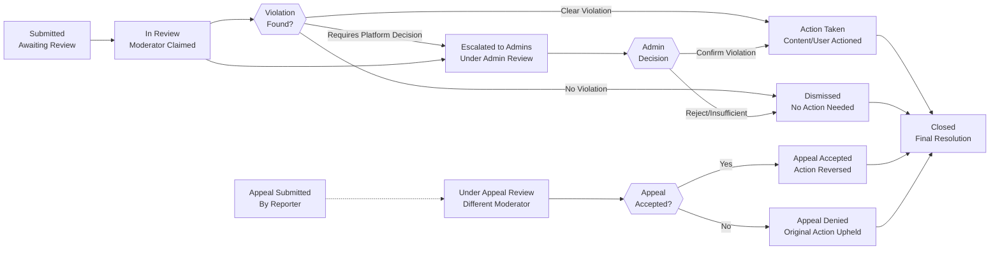

# Content Moderation and Reporting

## Content Reporting System Overview

THE community platform SHALL provide a comprehensive content reporting system that allows users to report violations of platform policies and community rules. THE reporting system SHALL be designed to identify, document, and address inappropriate content while maintaining community safety and platform integrity.

### System Purpose and Goals

The content reporting system exists to:

- Enable users to flag content that violates platform policies or community standards
- Provide moderators and administrators with efficient tools to review reported content
- Enable consistent enforcement of community rules and platform policies
- Maintain an audit trail of all moderation decisions for accountability and transparency
- Facilitate fair review processes with clear workflows and user communication

### Who Can Report Content

WHEN a registered member user attempts to report content, THE system SHALL accept the report and document it. WHEN a guest user attempts to report content, THE system SHALL deny access and display message: "You must be logged in to report content. Please register or log in to participate in community moderation."

WHEN a moderator or admin user attempts to report content, THE system SHALL accept the report with the same process as regular members.

Members can report the following content types:
- Posts (text, link, or image posts)
- Comments and nested replies to comments
- User profiles (for policy violations visible in profile content or user behavior)

### Report Lifecycle and Statuses

THE system SHALL track reports through the following status states:

1. **Submitted** - Report has been created and is waiting for moderator review (initial state)
2. **In Review** - A moderator has claimed the report and is actively reviewing it
3. **Under Moderator Review** - Report is being investigated by community moderators (may remain in this state for 24-48 hours)
4. **Escalated to Admins** - Report has been escalated to platform administrators for platform-wide policy decisions
5. **Action Taken** - Moderators have taken action on the report (content removed, user warned, etc.)
6. **Dismissed** - Report was reviewed and determined to not violate applicable policies
7. **Closed** - Report has been resolved and no further action will be taken

THE system SHALL track the following timestamps for each report:
- Report submission timestamp (UTC, ISO 8601 format)
- First review timestamp (when moderator first claims report)
- Final action completion timestamp (when status becomes Action Taken or Dismissed)
- Appeal submission timestamp (if appeal is requested)
- Appeal decision timestamp (if applicable)

THE system SHALL record which moderator took each action and maintain complete history of status transitions.

---

## Report Types and Reasons

### Available Report Reasons

Users SHALL be able to select from the following standardized report reasons when reporting content. Each reason maps to specific policy violations:

#### Harassment and Bullying
- Content that targets, demeans, or harasses a specific user or group
- Cyberbullying or personal attacks directed at individuals
- Threatening language toward individuals or communities
- Coordinated harassment campaigns or targeted downvoting
- **Examples of reportable content**: "Kill yourself," personal attacks on appearance, coordinated mockery campaigns
- **Examples NOT reportable**: Disagreement with ideas, constructive criticism of posts

#### Misinformation and False Information
- Content containing deliberate falsehoods presented as facts
- Misleading claims that could cause harm (health misinformation, financial fraud advice)
- Disproven conspiracy theories presented as current truth or fact
- Deliberately misleading statistics or cherry-picked data
- **Examples of reportable content**: "Vaccines cause autism" (medically false), "XYZ stock at $500 next week" (pump and dump), false election fraud claims
- **Examples NOT reportable**: Speculation labeled as such, personal opinions, satire clearly marked

#### Spam
- Repetitive or unsolicited content posted across multiple communities
- Commercial advertisements or promotion outside designated communities
- Phishing attempts, credential harvesting, or malicious links
- Bot-generated or automated spam content
- Repeated identical comments attempting to game algorithms
- **Examples of reportable content**: "Buy XYZ product now: [link]" in unrelated communities, phishing links, repeated bot comments
- **Examples NOT reportable**: Legitimate product recommendations in appropriate communities, occasional self-promotion with value

#### Hate Speech and Discrimination
- Content targeting individuals based on protected characteristics (race, ethnicity, religion, gender, sexual orientation, disability status)
- Slurs, dehumanizing language, or calls for discrimination against groups
- Content promoting discrimination or violence against protected groups
- Racist, sexist, transphobic, or other bigoted statements
- **Examples of reportable content**: Racial slurs, "all [group] are criminals," "[group] don't deserve rights"
- **Examples NOT reportable**: Criticism of ideology or beliefs, criticism of individual behavior, satire or academic discussion

#### Violence and Gore
- Content depicting graphic violence or gore
- Instructions for causing harm to individuals or groups
- Content glorifying or encouraging violence or self-harm
- Direct threats of physical violence
- **Examples of reportable content**: Graphic injury images without context, "here's how to make a bomb," "kill [person]," suicide promotion
- **Examples NOT reportable**: Medical/educational images, violence in historical/news context, fictional violence in entertainment

#### Sexual Content and Exploitation
- Sexually explicit content in non-adult-designated areas
- Child sexual abuse material (CSAM) - any sexualized content involving minors
- Non-consensual intimate imagery (revenge porn)
- Sexual exploitation or coercion
- Grooming or solicitation of sexual content from minors
- **Examples of reportable content**: Explicit sexual images, CSAM (report to NCMEC immediately), revenge porn, "send me nudes or I'll leak your info"
- **Examples NOT reportable**: Adult discussions of sexuality, consensual intimate content between adults in appropriate communities

#### Illegal Activity
- Content describing or facilitating illegal activities
- Drug production, distribution, or use instructions
- Weapons trafficking, illegal weapons manufacturing or acquisition
- Fraud schemes, scams, or financial crimes
- Theft, hacking, or other crimes
- **Examples of reportable content**: "How to make methamphetamine," "buy cocaine here," credit card scam tutorial, "hacking tutorial"
- **Examples NOT reportable**: Discussion of drug legalization, historical information about weapons, legal financial advice

#### Intellectual Property Violation
- Content infringing copyrights, trademarks, or patents
- Unauthorized distribution of copyrighted material
- Software piracy or leaked proprietary information
- **Examples of reportable content**: Full movie posted without permission, leaked software, unauthorized use of copyrighted images, counterfeited goods
- **Examples NOT reportable**: Fair use excerpts for review/discussion, licensed content, user's own creation

#### Community Rule Violation
- Content that violates specific community rules (selected after primary reason)
- Off-topic content in communities with strict topic requirements
- Violation of community-specific policies (formatting, post types, etc.)
- **Examples of reportable content**: Programming question in cooking community, image post in text-only community, low-effort content where rules prohibit

#### Other Violations
- Violations not covered by other categories
- Allows for additional context or explanation in description field
- **Examples of reportable content**: Unusual violations not fitting above categories

### Report Severity Levels

THE system SHALL internally classify reports into severity levels to prioritize moderation:

- **Critical (P0)** - CSAM, active threats of violence, content requiring immediate removal for legal/safety reasons, grooming of minors
  - **Response time requirement**: Within 1 hour of submission
  - **Action**: Immediate escalation to admin, potential law enforcement notification
  - **Special handling**: Remove immediately, preserve evidence, notify authorities

- **High (P1)** - Hate speech, coordinated harassment, content causing immediate harm, severe threats
  - **Response time requirement**: Within 4 hours of submission
  - **Action**: Prioritize for moderator review, likely removal
  - **User notification**: Required immediately upon action

- **Medium (P2)** - Spam, most violations of community rules, standard policy breaches, misinformation
  - **Response time requirement**: Within 24 hours of submission
  - **Action**: Review by community moderators, decision on removal
  - **User notification**: Provided with action taken

- **Low (P3)** - Minor infractions, borderline cases requiring moderator judgment, potential false reports
  - **Response time requirement**: Within 72 hours of submission
  - **Action**: May remain unreviewed if queue is long, reviewed in order
  - **User notification**: Provided upon final decision

CRITICAL severity reports SHALL be prioritized for immediate review by administrators. HIGH severity reports SHALL be reviewed before LOW severity reports within the same review queue.

---

## Report Submission Process

### Report Creation Workflow

WHEN a member user views a post or comment and selects the report option, THE system SHALL display a report form containing the following elements:

**Report Form Fields:**

1. **Primary Report Reason** (Mandatory) - Dropdown field allowing selection from available report reasons listed above
2. **Specific Details** (Optional) - Text field (maximum 1,000 characters) allowing reporter to provide context or explanation
   - THE system SHALL display character count with remaining characters indicator
   - THE system SHALL allow user to see what they've typed in preview format
3. **Content Preview** (Display Only) - Display of the content being reported
   - For posts: Show title, first 200 characters of content, and community name
   - For comments: Show comment text (up to 500 characters), parent post title, and community name
4. **Community Context** (Display Only) - If applicable, identification of which community the content is in
5. **Report Confirmation** (Mandatory) - Checkbox confirming "I understand this report will be reviewed by moderators and I'm reporting in good faith"
6. **Submit Button** - Submit report for processing

### Report Submission Validation

WHEN a user attempts to submit a report, THE system SHALL validate in the following order:

**Validation Step 1: User Authentication**
- THE user must be authenticated as a member (not guest or anonymous)
- IF user is not authenticated, THE system SHALL return error: "You must be logged in to report content. Please log in to participate."
- HTTP Status: 403 Forbidden

**Validation Step 2: Primary Reason Selection**
- THE primary report reason must be selected from available options
- IF no reason selected, THE system SHALL return error: "Please select a report reason from the dropdown."
- THE system SHALL highlight the dropdown field

**Validation Step 3: Content Existence**
- THE content being reported must still exist and not be deleted
- IF content is already deleted, THE system SHALL return error: "This content has already been removed. No further action needed."
- IF content is already removed by moderators, THE system SHALL return error: "This content is already under moderation review."

**Validation Step 4: User Authorization**
- THE user must have permission to access the community containing the content
- IF user is in private community and not a member, THE system SHALL reject
- THE user can report content in public communities they're not subscribed to

**Validation Step 5: Duplicate Report Check**
- THE system SHALL check if reporter has already reported this exact content
- IF reporter has submitted report on same content within last 30 days, THE system SHALL return error: "You have already reported this content. Your previous report (ID: [ID]) is still pending review."
- EXCEPTION: Different violation reasons in new report are allowed (may indicate new understanding)

**Validation Step 6: False Report Pattern Check**
- THE system SHALL track if reporter has submitted 3+ dismissed reports in past 7 days
- IF pattern detected, THE system SHALL display warning: "Several of your recent reports were dismissed. Please review community rules before reporting."
- THE system SHALL still allow submission but flag for moderator attention

**Validation Step 7: Form Completeness**
- THE report confirmation checkbox must be checked
- IF not checked, THE system SHALL return error: "Please confirm you're reporting in good faith."
- THE system SHALL prevent form submission until checkbox is checked

IF any validation check fails, THE system SHALL display clear error messages indicating what needs to be corrected and allow the member to revise and resubmit.

### Report Submission and Confirmation

WHEN a report passes all validation checks, THE system SHALL execute the following procedure:

1. Create a new report record with status "Submitted"
2. Record the following information:
   - Report ID (unique identifier for tracking)
   - Reporter user ID
   - Reported content type (post, comment, or user) and content ID
   - Community context (community ID if applicable)
   - Primary report reason selected
   - Reporter's detailed explanation (if provided)
   - Report submission timestamp (UTC, ISO 8601)
   - Reporter's IP address (for abuse pattern detection)
   - Report severity classification (Critical, High, Medium, Low based on reason)
3. Display confirmation message to the reporter

**Confirmation Message Display:**
```
✓ Report Submitted

Thank you for helping keep our community safe. Your report has been received.

Report ID: [Unique ID for reference]
What's next: Community moderators will review your report. You'll receive a notification when action is taken on this content (if you've enabled notifications).

[View my reports] [Browse communities]
```

THE system SHALL allow reporter to check report status anytime using report ID.

### Reporter Identity and Privacy

WHEN a member submits a report, THE report SHALL be attributed to that member's user account. THE system SHALL NOT display reporter identity to the reported user or in public contexts.

THE system SHALL allow moderators and administrators to view reporter identity for:
- Determining reporter credibility and history
- Investigating reporter abuse patterns
- Appeal and transparency purposes

WHEN a moderator takes action based on a report (removes content, warns user), THE action notification to the affected user SHALL NOT reveal who reported the content. THE notification SHALL state: "Your content was reported for violating community guidelines. Reason: [reason]. Review the rules: [link]"

### Anonymous Reporting (Optional Community Feature)

WHEN a member wishes to submit a report, THE system MAY provide an option to mark the report as "Anonymous to Community" (visible to admins only, not community moderators). THIS option SHALL NOT provide complete anonymity from platform administration but SHALL limit distribution of reporter identity to platform administrators only.

WHEN "Anonymous" option is selected, THE system SHALL:
- NOT display reporter identity to community moderators
- Display reporter name only to platform admins
- Still require reporter to be authenticated member
- Still track reporter identity for abuse detection purposes

---

## Report Status Tracking

### Report Status State Machine and Transitions



### Status State Definitions and Transitions

**Submitted** - Initial state when report is created
- Report is waiting in the moderation queue
- Moderator has not yet claimed the report
- Reporter can view report status but not detailed moderator notes
- Transitions to: "In Review" (when moderator claims report)
- Average time in this state: 0-24 hours (depends on queue length)

**In Review** - Moderator has begun evaluating the report
- Moderator has accessed the report and is evaluating content
- Moderator reads the reported content and reporter's explanation
- Moderator reviews report reason and determines if content violates policies
- Moderator documents their preliminary assessment
- Transitions to: "Action Taken" (if violation confirmed), "Dismissed" (if no violation), or "Escalated to Admins" (if unclear)
- Time limit in state: Moderators SHALL complete review within 24 hours or report is automatically escalated

**Escalated to Admins** - Report requires administrator review
- Used for complex cases requiring platform-wide policy decisions
- Used when moderator is uncertain or conflicted about policy interpretation
- Used for cases crossing multiple community boundaries or affecting platform stability
- Admins review moderator's notes and make independent determination
- Transitions to: "Action Taken" (if admin confirms violation), "Dismissed" (if admin rejects), or back to moderator with guidance
- Time limit in state: Admins SHALL complete review within 48 hours

**Action Taken** - Moderation action has been executed
- Content has been removed, or user has been warned/restricted
- Action details and reasoning are documented with the report
- User notifications have been sent regarding consequences
- Report is ready for closure
- Transitions to: "Closed" (automatically after 30 days or when no appeals pending)
- Special case: May transition to "Under Appeal Review" if reporter or affected user appeals

**Dismissed** - Report was reviewed and found not to violate policies
- Moderator determined content does not require action
- Report reasoning and decision are documented
- Reporter can view dismissal reason (general reason, not detailed moderator notes)
- Reporter can submit appeal within 30 days with new evidence
- Transitions to: "Closed" (automatically after 30 days or when no appeals pending)
- May transition to: "Under Appeal Review" if reporter appeals

**Closed** - Report process is complete
- No further action will be taken unless new evidence surfaces
- Report remains in system as historical record for pattern detection
- Cannot be reopened without new evidence or formal appeal process
- Final state (may only return to appeal states via appeal process)

**Under Appeal Review** - Appeal to prior decision has been submitted
- Different moderator or admin reviews the original decision
- Appealing party's new evidence or arguments are considered
- Transitions to: "Appeal Accepted" (action reversed) or "Appeal Denied" (action upheld)
- Time limit: Appeal SHALL be reviewed within 14 days

**Appeal Accepted** - Appeal was successful
- Original action is reversed
- Removed content is restored
- Any warnings or restrictions are cleared
- Original moderator is notified of reversal
- Transitions to: "Closed" (report fully resolved)

**Appeal Denied** - Appeal was unsuccessful
- Original action remains in effect
- No further appeals allowed for same report
- User can contact support if they believe there's bias/injustice
- Transitions to: "Closed" (report fully resolved)

### Report Status Visibility

WHEN the reporter views the status of their reports, THE system SHALL display:

**To Reporter:**
- Current status of the report
- Timestamp of report submission
- When the report was last updated
- High-level outcome (if action was taken: "Content was removed", if dismissed: "No action taken")
- General reason for dismissal (if applicable)
- Appeal deadline (if applicable)
- Report ID for reference
- Button to view community rules (to understand why dismissed)

**To Moderator:**
- All information above PLUS:
- Reporter identity and history
- Detailed moderator notes from prior reviews
- Vote/engagement history on reported content
- Reporter's previous report history (pattern detection)
- Recommended action based on severity
- Similar reports flagged (pattern detection)

**To Admin:**
- All moderator information PLUS:
- Full audit trail of report status transitions
- Appeal history if applicable
- Moderator who made decisions
- Escalation reasons and notes
- Associated reports and patterns
- User behavior patterns

**To Affected User (Whose Content Was Removed):**
- Notification that content was removed
- General reason: "Violates community guidelines - [reason]"
- Which community's rules were violated
- Appeal process and deadline
- NOT shown: Reporter identity, detailed moderator notes

### Report Status Notifications

WHEN a report's status changes, THE system SHALL send notifications to relevant parties according to their notification preferences:

**To Reporter - When status changes:**
- Report claimed for review: Optional notification "Moderator is reviewing your report"
- Action taken: Mandatory notification "Action has been taken on the reported content"
- Report dismissed: Mandatory notification "Your report was reviewed"
- Appeal deadline approaching: Reminder notification "You can appeal this decision until [date]"

**To Affected User - When content is actioned:**
- Content removed: Mandatory notification with reason and appeal process
- User warned: Mandatory notification with warning text and policy reference
- User restricted/banned: Mandatory notification with duration and appeal process
- All notifications SHALL include: reason, policy violated, appeal deadline, appeal process

**To Moderators - When report is escalated:**
- Report escalated: Notification that decision was overturned or case reassigned
- Appeal submitted: Notification if appeal is submitted on their decision

**To Admins - When critical reports arrive:**
- Critical severity reports: Immediate notification (email + dashboard alert)
- High severity reports: Notifications every 4 hours if not reviewed
- Pattern detection: Alert if same user/content is being reported multiple times

---

## Moderation Workflows

### Moderation Queue and Assignment

THE system SHALL maintain a moderation queue visible to moderators and administrators with all reports requiring action.

**Queue Display Features:**
- Shows all reports with status "Submitted" or "In Review"
- Displays reports sorted by priority:
  - Severity level first (Critical → High → Medium → Low)
  - Within same severity, sorted by submission timestamp (oldest first)
  - Time-sensitive reports (lockout expiring soon) moved to front
- Displays filters allowing moderators to view:
  - Reports by severity, reason, community, time received
  - Reports assigned to specific moderator
  - Reports in specific status states
- Displays quick-view interface showing:
  - Report ID, submission time, severity
  - Content preview (title/excerpt)
  - Report reason and brief summary
  - Moderator assigned (if any)
- Displays statistics:
  - Number of reports awaiting review
  - Number of reports currently in review
  - Average time for report resolution
  - Reports assigned to current moderator

### Report Claim and Assignment Workflow

WHEN a moderator selects a report from the queue to review, THE system SHALL execute the following procedure:

**Step 1: Claim Report**
1. Change report status from "Submitted" to "In Review"
2. Record the moderator's user ID as the assigned reviewer
3. Record the timestamp of assignment
4. Lock the report to prevent other moderators from simultaneously reviewing it

**Step 2: Load Full Report Context**
1. Display the complete reported content (full post text, comment, or profile)
2. Display reporter's reason for reporting
3. Display reporter's optional explanation details
4. Display community context and applicable community rules
5. Display content metadata:
   - Creation date and author information
   - Edit history (if applicable)
   - Current upvote/downvote counts
   - Comment count
6. Display user violation history:
   - Previous warnings or suspensions for reported user
   - Previous actions taken on similar content
   - Total reports submitted/received by this user
   - User's karma and reputation level
7. Display similar reports for reference:
   - Other reports on content from same user
   - Other reports with same reason category
   - Patterns or trends noticed

**Step 3: Timer and Monitoring**
- THE system SHALL start a timer tracking how long report has been in review
- IF report remains in "In Review" status for more than 24 hours, THE system SHALL:
  - Flag the report for admin review
  - Notify administrators that report is stalled
  - Allow admin to reassign to another moderator or escalate

### Moderator Review and Decision Making

WHEN reviewing a report, the moderator SHALL:

1. **Read the Reported Content in Full Context**
   - Review complete text of post or comment
   - Understand context of where content appears
   - Review any previous comments or replies providing context

2. **Review Applicable Policies**
   - Consult community rules (for community-specific violations)
   - Consult platform-wide policies (for policy violations)
   - Review previous interpretations by other moderators (for consistency)

3. **Assess Violation**
   - Determine if content clearly violates stated policies
   - Consider intent vs. impact of the content
   - Review user's previous behavior and context
   - Compare to previous moderation decisions for similar content

4. **Make Determination**
   - **Clear Violation**: Content violates policies, action should be taken
   - **No Violation**: Content complies with policies, no action needed
   - **Borderline/Unclear**: Requires escalation for administrator guidance

5. **Document Decision**
   - Record determination (violation found vs. not found)
   - Document which specific policy or rule was violated
   - Record severity assessment (user education vs. removal vs. escalation)
   - Provide moderator's reasoning (2-3 sentences minimum)
   - Note any mitigating circumstances (first offense, user cooperated, etc.)

### Escalation to Administrators

WHEN a moderator determines that a report requires escalation, THE system SHALL:

1. Change report status to "Escalated to Admins"
2. Record escalating moderator's name and rationale for escalation
3. Move the report to admin-only queue with high priority
4. Notify administrators of escalation with priority based on severity
5. Include moderator's notes and recommendation in escalation

**Appropriate Escalation Scenarios:**
- Report involves potential legal issues (CSAM, threats of violence, illegal activity)
- Moderator is conflicted or involved in the reported situation
- Report straddles multiple communities or affects platform-wide operations
- Decision would set precedent for platform policy interpretation
- Moderator is uncertain about policy interpretation
- User is high-profile or appeal is likely
- Report involves coordinated harassment or manipulation
- Technical complexity requires admin investigation

**Inappropriate Escalation Scenarios (Moderator Should Decide):**
- Clear community rule violations in moderator's own community
- Obvious spam or off-topic content
- Straightforward policy violations with clear precedent
- Simple appeals of moderator decisions

### Administrator Review of Escalated Reports

WHEN an administrator reviews an escalated report, THE administrator SHALL:

1. Review moderator's notes and recommendation
2. Independently review reported content and all context
3. Consult platform-wide policies and legal guidance if needed
4. Make final determination: Confirm violation, Reject escalation, or Request additional investigation
5. Document admin decision with reasoning
6. Update report status appropriately

**Admin Decision Options:**
- **Confirm Violation**: Approve escalated decision, proceed with action
- **Reverse Decision**: Moderator was incorrect, no action taken
- **Request Guidance**: Provide moderator with policy interpretation and return for review
- **Investigate Further**: Request additional information before deciding
- **Refer to Law Enforcement**: If illegal activity suspected

---

## Moderation Workflows - Platform vs Community Level

WHEN a report involves a community-specific rule violation, THE community moderators SHALL conduct initial review. IF the violation also involves platform-wide policies (hate speech, violence, harassment), THE report SHALL be escalated to admins.

WHEN a report involves only platform-wide policy violations (hate speech, violence, illegal content, CSAM, threats), THE report SHALL be escalated to admins immediately without community moderator review (or with admin copy of community moderator review).

**Platform-Wide Violations (Immediate Admin Escalation):**
- Child sexual abuse material (CSAM)
- Threats of violence or imminent harm
- Coordinated harassment campaigns
- Hate speech and discrimination
- Illegal activity or fraud
- Grooming or sexual exploitation of minors
- Non-consensual intimate imagery
- Terrorism or extremism content

**Community-Specific Violations (Community Moderator Review First):**
- Off-topic content in topic-specific communities
- Low-effort content in communities prohibiting it
- Formatting violations
- Community-specific naming or tagging rules
- Content type violations (images in text-only communities)

**Hybrid Violations (Moderator Review → Potential Escalation):**
- Harassment (community moderator reviews, escalates if severe)
- Misinformation (moderator reviews context, escalates if flagged as dangerous)
- Spam (moderator reviews, escalates if coordinated)

---

## Content Review Process

### Review Criteria and Guidelines

WHEN evaluating reported content, moderators SHALL consider the following criteria in this order:

**1. Policy Matching (Highest Priority)**
- Does content match any stated policy or rule?
- Is the violation clear and unambiguous?
- Are there legitimate exceptions or clarifications?
- What is the exact policy or rule referenced?

**2. Intent vs. Impact**
- What was the likely intent of the poster?
- What is the actual impact or harm caused?
- Is content satire, sarcasm, or obviously joking?
- Is context missing that would change interpretation?

**3. Community Context**
- What are the community standards and norms?
- Has similar content been tolerated in the past?
- Is the violation consistent with past enforcement?
- What tone does the community expect?

**4. User History**
- Is this a pattern of behavior or isolated incident?
- What is the user's previous conduct record?
- Have they been warned about this behavior before?
- Are they generally positive community contributors?

**5. Severity and Reach**
- How severe is the violation?
- How many people are affected?
- Is content still spreading or already contained?
- Will removal prevent further harm?

**6. Precedent and Consistency**
- How have similar reports been handled previously?
- Is this decision consistent with prior moderations?
- Would moderators make same decision for similar content?
- Is there documented precedent to reference?

### Decision Documentation Requirements

THE moderator's decision regarding a report SHALL be documented with ALL of the following:

- **Violation Determination**: Clear statement ("Violation found" or "No violation found")
- **Specific Policy Referenced**: Exact policy or rule violated with quotation if applicable
- **Severity Classification**: Whether violation is critical, high, medium, or low severity
- **Reasoning**: 2-3 sentence explanation of how moderator reached determination
- **Evidence**: Specific quotes or references from reported content
- **Mitigating Circumstances**: Any factors that lessened or increased severity (first offense, pattern of behavior, user cooperation, etc.)
- **Recommended Action**: What action should be taken if violation confirmed (removal, warning, suspension, etc.)
- **Moderator Identity**: Name or ID of moderator making decision
- **Timestamp**: Date and time of decision in UTC
- **References**: Links to applicable policies and previous similar decisions

This documentation SHALL be stored with the report for:
- Audit trail and accountability
- Appeals review
- Pattern detection and training
- Legal or compliance purposes

### Appeal Process

IF a user whose content was removed or who received a warning wishes to appeal, THE system SHALL:

**Appeal Submission:**
1. Accept an appeal submission within 30 days of the moderation action
2. Require the appellant to specify grounds for appeal (choose from list):
   - "Moderator error or misunderstanding of policy"
   - "Policy was misinterpreted or applied inconsistently"
   - "Insufficient context was considered"
   - "I have new evidence or information"
   - "The action was biased or unfair"
   - "Other reason" (allows custom explanation)
3. Require appellant to provide explanation (100-1000 characters)
4. Display information about appeal process and timeline

**Appeal Review:**
1. Route the appeal to a different moderator or administrator than original decision maker
2. Original moderator is NOT involved in appeal review
3. Appealing party receives copy of original moderator's notes
4. Appeal reviewer conducts fresh evaluation of reported content and original decision
5. Appeal reviewer considers:
   - Original moderator's reasoning
   - Whether policy was correctly applied
   - Any new evidence provided by appellant
   - Consistency with other similar cases
   - Potential bias or error in original decision

**Appeal Decision Timeline:**
- THE system SHALL review appeals within 14 days of submission
- Appellant SHALL receive notification of appeal outcome
- Notification SHALL include:
  - Appeal outcome (Accepted or Denied)
  - Explanation of decision reasoning (2-3 sentences)
  - Which parts of appeal were accepted/rejected
  - Final appeal outcome (no further appeals available)

**Appeal Outcomes:**

**Appeal Accepted:**
- Original action is reversed
- Removed content is restored (if applicable)
- User is notified: "Your appeal was successful. Your content has been restored."
- Any warning is removed from user's record
- Original moderator is notified of reversal (for learning/improvement)
- Report is closed and archived
- User can re-engage with community

**Appeal Denied:**
- Original action remains in effect
- User is notified: "Your appeal was reviewed and denied. The original decision has been upheld."
- Explanation of why appeal was denied is provided
- No further appeals allowed for same report
- User can contact support if they believe there is bias or injustice

**User Escalation Option:**
- IF user still believes there was an error, they can escalate to support
- Support shall escalate to admin if complaint has merit
- Admin conducts final review (last-resort appeal)

---

## Content Removal and Restoration

### Content Removal Procedures

WHEN a moderator determines that content violates policies and has decided action is warranted, THE system SHALL support multiple removal-related workflows:

#### For Posts - Complete Removal Process

WHEN a post is removed due to policy violation, THE system SHALL:

1. **Visibility Change**
   - Change the post's status to "Hidden" or "Removed" (not permanently deleted)
   - Remove the post from all feed listings and searches
   - Remove the post from community pages
   - Remove the post from user's profile
   - Mark post as removed for auditing

2. **Metadata Preservation**
   - Retain all post metadata, votes, and comments for audit purposes
   - Store original post content in archive
   - Record removal timestamp and moderating user ID
   - Record removal reason and applicable policy

3. **User Notification**
   - Notify post author with message:
     ```
     Your post has been removed

     Title: [original title]
     Reason: Violates community guidelines - [specific reason]
     Community: [community name] - Rules: [link to rules]
     Your options:
     - Read the rules and edit the post (if applicable)
     - Submit an appeal: [appeal link]
     - Contact moderators with questions: [contact link]
     ```
   - Include removal timestamp, moderator note (if provided), and appeal deadline (30 days)

4. **Community Notification**
   - IF post had significant engagement (50+ comments/votes), notify community subscribers:
     ```
     Post removed for violating community guidelines
     Reason: [category of violation]
     This action was taken to maintain community standards.
     ```
   - Do NOT identify the post author in community notification

5. **Cascading Changes**
   - Decrease community's post count
   - Decrease author's post count
   - Remove all votes on the post from vote tallies
   - Reverse karma gained by author from votes on this post
   - Keep all comments (they remain visible but marked as related to removed post)

#### For Comments - Removal Process

WHEN a comment is removed due to policy violation, THE system SHALL:

1. **Visibility Change**
   - Change comment status to "Hidden" or "Removed"
   - Remove comment from display in threads
   - Mark comment with "[This comment has been removed]" or "[removed]" placeholder

2. **Metadata Preservation**
   - Preserve original comment text in archive
   - Record removal timestamp and moderator ID
   - Record removal reason and applicable policy

3. **User Notification**
   - Notify comment author with removal reason and appeal process
   - Display same notification format as posts

4. **Thread Integrity**
   - Keep the comment thread structure intact
   - Display "[removed]" placeholder so thread flow is understandable
   - Preserve replies to removed comment (show they're orphaned)
   - Allow users to understand what was being discussed

5. **Vote and Karma Reversal**
   - Remove all votes on the removed comment
   - Reverse karma gained by author from votes on this comment
   - Do NOT delete child comments/replies to this comment

### Display of Removed Content

**To the Original Author:**
- Content is marked as removed with reason
- Author can view their removed content in "My Posts" section marked "[Removed]"
- Author sees removal reason and moderator note
- Author is prompted with appeal option

**To Other Users:**
- If post is removed: Post does not appear in feeds, searches, or community listings
- If comment is removed: Comment thread shows "[This comment was removed by moderators]"
- Users cannot navigate to removed content directly
- If users try direct URL: Display message "This content has been removed for violating community guidelines. Reason: [reason]. View community rules: [link]"

**To Moderators and Admins:**
- Full content is displayed with "[Removed]" indicator
- Removal reason and removing moderator are shown
- Original content can be viewed for audit purposes
- Restoration option is available

### Hidden vs. Deleted Content Distinction

THE system SHALL clearly distinguish between:

**Hidden Content** - Removed by moderation due to policy violation
- Content is removed from public view
- Author and moderators can still view it
- Appeals can result in restoration
- Marked as "[removed]" in threads
- Preservation in audit logs

**Deleted Content** - Removed by the author themselves
- Author chose to delete their own content
- Marked as "[deleted]" (with generic author name)
- Permanently deleted (typically irretrievable)
- Marked as "user deleted" in audit logs
- No appeal process

### Restoration Process

WHEN a moderator determines that hidden content should be restored, THE system SHALL:

1. **Change Content Status**
   - Change visibility back to "Visible"
   - Remove "[removed]" marker

2. **Restore to Public View**
   - Restore content to feeds and community listings
   - Restore to user's profile
   - Re-include in search results

3. **Notification**
   - Notify content author: "Your content has been restored after appeal"
   - Notify moderators of restoration decision

4. **Audit Trail**
   - Record restoration with reason and moderator identity
   - Create complete entry in removal/restoration history

**Automatic Restoration Scenarios:**
- Appeal is accepted by appeals moderator
- Platform administrator overturns community moderator's decision
- Time-limited removal period expires (if applicable)

### Audit Trail for Removed Content

THE system SHALL maintain a complete audit trail for all removed content:

- **Original Content**: Full text preserved (even if removed)
- **Removal Details**:
  - Reason for removal (policy/rule violated)
  - Applicable policy quoted in full
  - Moderator who took action and timestamp
  - Community context (if applicable)
- **Appeals History**:
  - Appeal submitted (if any)
  - Appeal reviewed by (moderator name)
  - Appeal decision and reasoning
  - Appeal timestamp
- **Restoration History**:
  - If restored, reason and moderator for restoration
  - Restoration timestamp
  - Whether restoration was due to appeal or admin review

**Audit Trail Accessibility:**
- Only visible to administrators
- Used to detect patterns of overly aggressive or lenient moderation
- Used to provide feedback to moderators
- Available for user appeals and disputes
- Preserved for legal compliance (minimum 2 years retention)

---

## Moderator Actions and Authority

### Available Actions on Content

WHEN a moderator has determined that content requires action, THE system SHALL provide the following content-level actions:

#### 1. Remove Content
- **What it does**: Hide post or comment from public view
- **Visibility**: Content shows as "[removed]" in threads; not visible in feeds/search
- **Author notification**: Receives removal reason and appeal option
- **Reversibility**: YES - content can be restored via appeal or admin review
- **Karma impact**: All votes reversed, author loses gained karma
- **Use case**: Clear policy violations, unsuitable content

#### 2. Add Warning Label
- **What it does**: Add visible warning to content (e.g., "Potentially Misinformation - See community notes")
- **Visibility**: Content remains visible but flagged with warning
- **Author notification**: Author is notified label was added
- **Reversibility**: YES - label can be removed if label was inappropriate
- **Karma impact**: No karma impact
- **Use case**: Borderline content, unproven claims, potentially misleading but not clearly false

#### 3. Lock Thread/Comments
- **What it does**: Prevent new comments on post while keeping existing content visible
- **Visibility**: Post and existing comments remain visible; NEW comments are disabled
- **Author notification**: Author sees "Comments locked" notification
- **Reversibility**: YES - thread can be unlocked later
- **Karma impact**: No karma impact; existing votes continue
- **Use case**: Heated discussions escalating, harassment in comments, off-topic tangents

#### 4. Pin Post (Moderator Highlight)
- **What it does**: Move post to top of community or highlight section
- **Visibility**: Post is prioritized in feeds and listings
- **Author notification**: Author is notified post was highlighted
- **Reversibility**: YES - pin can be removed
- **Karma impact**: No karma impact
- **Use case**: Excellent community contributions, important announcements, exemplary posts

#### 5. Remove and Warn User (Combined Action)
- **What it does**: Remove content AND issue official warning to user
- **Visibility**: Content is hidden, user receives warning
- **Author notification**: Notification includes removal reason and warning
- **Reversibility**: Partial - content can be restored, but warning remains unless appealed
- **Karma impact**: Votes reversed, karma reversed
- **Use case**: Policy violations requiring both removal and user awareness

### Available Actions on Users

WHEN a moderator has determined that user behavior requires action against the user (not just content), THE system SHALL support the following user-level actions:

#### 1. Issue Official Warning
- **Scope**: Community-specific or platform-wide (depending on moderator authority)
- **What user sees**: Warning notification with reason and policy reference
- **Recording**: Warning is recorded in user's moderation history (visible to moderators)
- **Impact on user**: No posting restrictions, but warning is tracked
- **Reversibility**: Can be removed by appeal or admin review
- **Timeline**: Warnings accumulate over 6-month rolling period
- **Use case**: First violation, minor infractions, educational opportunity

#### 2. Temporary Community Restriction (Community Ban)
- **Scope**: Single community only
- **Duration**: 1 hour to 30 days (moderator selects)
- **What user sees**: Cannot create posts or comments in community for specified duration
- **Visibility**: Can still view community and read content
- **Notification**: User is notified of restriction duration and reason
- **Reversibility**: Can be appealed or lifted early by moderator
- **Timeline**: Expires automatically after specified duration
- **Use case**: Repeated community rule violations, temporary escalation

#### 3. Temporary Platform Suspension
- **Scope**: Entire platform (all communities)
- **Duration**: 1 hour to 30 days (moderator selects, admins required for >7 days)
- **What user sees**: Cannot log in or post, but account still exists
- **Notification**: User receives notification of suspension duration and reason
- **Reversibility**: Can be appealed, expires automatically after duration
- **Timeline**: Expires automatically at end of suspension period
- **Use case**: Platform-wide policy violations, repeated severe violations

#### 4. Permanent Community Ban
- **Scope**: Single community permanently
- **What user sees**: Cannot post or comment in community; can still view
- **Notification**: User is notified of ban reason
- **Reversibility**: Can be appealed, reversed by moderators/admins
- **Timeline**: Remains in effect unless reversed
- **Use case**: Serious ongoing violations specific to one community

#### 5. Permanent Platform Ban
- **Scope**: Entire platform (all communities)
- **Requires**: Admin approval (moderators recommend, admins approve)
- **What user sees**: Cannot log in, account is permanently restricted
- **Notification**: User is notified of ban reason and appeal process
- **Reversibility**: Can be appealed to admins (appeal rarely succeeds)
- **Timeline**: Permanent (no automatic expiration)
- **Use case**: Severe violations (violence, CSAM, repeated abuse), banned for legal reasons

### Action Severity and Progressive Discipline

THE system SHALL support progressive discipline where violations accumulate:

**Progression Timeline and Escalation:**

1. **First Violation (within 6 months)**
   - **Action**: Official warning or content removal
   - **User sees**: Warning notification, content removed if applicable
   - **Recovery**: Warning can be dismissed by appeals, expires after 6 months

2. **Second Violation (within 6 months of first)**
   - **Action**: Formal warning + optional temporary community restriction (1-3 days)
   - **User sees**: Second warning, may see posting restriction
   - **Impact**: Account flagged as repeat violator (visible to moderators)

3. **Third Violation (within 6 months of first)**
   - **Action**: Temporary community ban (3-7 days) or temporary platform suspension
   - **User sees**: Cannot post for specified period
   - **Duration**: 3-7 days depending on violation severity

4. **Fourth Violation (within 6 months of first)**
   - **Action**: Extended platform suspension (7-30 days)
   - **User sees**: Account restricted from all posting
   - **Duration**: 7-30 days depending on violation severity

5. **Fifth+ Violation (within 6 months of first)**
   - **Action**: Permanent platform ban (requires admin approval)
   - **User sees**: Account banned from platform
   - **Timeline**: Permanent ban (appeals reviewed by admin)

**Exceptions to Progressive Discipline:**

The following violations bypass progressive discipline and may result in immediate permanent ban:

- CSAM or child exploitation content
- Direct threats of violence or harm
- Hate speech or severe harassment campaigns (may start at Step 3-4)
- Illegal activity or fraud
- Repeated violation of SAME rule after suspensions
- Evasion of previous bans (new account to circumvent restrictions)
- Coordinated harassment campaigns

### Moderator Authority Scope

WHEN a moderator takes action, their authority is scoped by their role:

#### Community Moderators Authority
- **Can remove** posts and comments in their assigned community only
- **Can warn/restrict/ban** users FROM THEIR COMMUNITY only
- **Can lock** threads in their community
- **Can add** warning labels in their community
- **Cannot** access platform-wide moderation functions
- **Cannot** take actions outside their community
- **Cannot** implement platform-wide suspensions or bans
- **Can escalate** to admins for platform-level decisions
- **Cannot override** admin decisions

#### Senior Moderators / Lead Moderators Authority
- **Can do** everything community moderators can do PLUS:
- **Can assign/remove** other moderators in their community
- **Can establish** community rules and policies
- **Can lock** community from new member joins (if needed)
- **Scope remains**: Community-specific (not platform-wide)

#### Admin Authority
- **Can perform** all moderation actions in ALL communities
- **Can override** community moderator decisions
- **Can implement** platform-wide suspensions and bans
- **Can remove admins** and moderators
- **Can access** all moderation logs and appeals
- **Can set** platform-wide policies
- **Can escalate** to law enforcement if needed (CSAM, threats)

### Action Notification to Users

WHEN a moderator takes action against a user or their content, THE system SHALL send the affected user a notification containing ALL of the following elements:

**For Content Removal:**
- **What happened**: "Your [post/comment] has been removed"
- **Why it happened**: "Violates [Community Name] rules - [specific rule]" or "Violates platform guidelines - [specific policy]"
- **Which rule/policy**: Link to specific rule in community guidelines or platform policies
- **When it happened**: Timestamp of removal
- **Who took action**: "Moderation Team" (do NOT identify specific moderator or reporter)
- **Moderator note** (if provided): Optional context about why removed
- **Appeal process**: "You can appeal this decision: [appeal link] (Deadline: 30 days)"
- **Additional resources**: "Review community rules: [link]" or "Contact moderators: [link]"

**For User Warnings:**
- **What happened**: "You have received an official warning"
- **Reason**: "For [violation reason] in [community name]"
- **Policy**: Specific policy or rule violated with text quoted
- **Timestamp**: When warning was issued
- **Moderator note**: Explanation of violation (2-3 sentences)
- **Implications**: "Warnings accumulate over 6 months. Additional violations may result in temporary restrictions."
- **Appeal**: "You can appeal this warning: [link] (Deadline: 30 days)"

**For Temporary Restrictions:**
- **What happened**: "You have been temporarily [restricted/suspended]"
- **Duration**: "Your account is restricted until [specific date and time]"
- **Reason**: "For [violation reason] in [community/platform]"
- **Restrictions**: "During this period, you [cannot post in this community / cannot post anywhere on platform]"
- **Can still do**: "You can still [read posts, view communities, review messages, etc.]"
- **When it ends**: "Restrictions will be lifted automatically on [date]"
- **Appeal**: "You can appeal this action: [link] (Deadline: 30 days)"
- **Support**: "Contact us if you believe this action was unfair: [support link]"

**For Permanent Bans:**
- **What happened**: "Your account has been permanently banned"
- **Reason**: "For [violation reason(s)]"
- **Policy**: Specific policy violated with text quoted
- **Finality**: "This decision has been made based on serious policy violations"
- **Appeals**: "You may appeal this decision within 30 days: [appeal link]"
- **Appeal process**: "Appeals are reviewed by administrators who will consider new evidence"
- **Support**: "Contact support if you have additional information: [support link]"

**Format:**
- All notifications SHALL be email + in-app message
- Language SHALL be clear and non-accusatory
- Notifications SHALL include links to relevant policies
- Notifications SHALL include appeal information prominently
- Notifications SHALL avoid technical jargon

---

## Community Rules Enforcement

### Community-Specific Rules

WHEN community moderators create rules for their community, THE system SHALL:

1. **Store Rules Properly**
   - Store rules with clear titles (required, 5-50 characters)
   - Store rule descriptions (required, 10-500 characters)
   - Store rule in numbered order (Rule 1, Rule 2, etc.)
   - Limit to 20 rules maximum per community
   - Store rule creation timestamp and creator identity
   - Version rules (track if rules change) for consistency tracking

2. **Display Rules Prominently**
   - Display rules in community sidebar/information section (always visible)
   - Show rules to new members joining community
   - Make rules available when reporting content in that community
   - Reference rules in moderation decisions
   - Display in user-friendly format with examples (if provided)

3. **Apply Rules Consistently**
   - Moderators SHALL enforce rules consistently with documented precedent
   - Similar violations SHALL result in similar actions
   - Rule interpretation SHALL be consistent across moderators
   - Rule changes SHALL be announced to community members

### Rule Violation Report Workflow

WHEN a user reports content for "Community Rule Violation," THE report form SHALL:

1. Display applicable rules for that community
2. Require the reporter to specify which rule was violated
3. Allow reporter to provide explanation of violation
4. Display the specific rule text for reference

THE community moderators SHALL:

1. Review the report for the specific rule violation
2. Consult the community rules for context
3. Determine if the content genuinely violates that rule
4. Check for any exceptions or special cases
5. Make moderation decision based on community standards
6. Document which rule was violated in their decision

### Platform vs. Community-Specific Violations Distinction

THE system SHALL clearly distinguish between and handle differently:

**Platform-Wide Violations** (Immediate escalation to admin review):
- Hate speech and discrimination (against protected classes)
- Violence, threats of harm, or self-harm
- Child sexual abuse material (CSAM)
- Illegal activity or fraud
- Severe harassment or coordinated attacks
- Sexual exploitation or grooming
- Terrorism or extremism content
- Non-consensual intimate imagery

**Community-Specific Violations** (Community moderator review):
- Off-topic content in topic-specific communities (e.g., politics in cooking community)
- Low-effort content in communities prohibiting it
- Formatting violations (required format not followed)
- Content type violations (images in text-only communities)
- Community-specific naming or tagging rules
- Duplicate posts within timeframe
- Self-promotion in communities prohibiting it
- Post length requirements violations

**Hybrid Violations** (Moderator reviews, escalates if severe):
- Mild harassment (community reviews, escalates if targeted/coordinated)
- Misinformation (moderator reviews context, escalates if dangerous)
- Spam (moderator reviews, escalates if coordinated)
- Controversial topics (allowed if community accepts, escalate if becomes harassment)

### Rule Violation Consistency and Appeals

WHEN different community moderators enforce the same rule inconsistently, THE appeal process SHALL:

1. Allow users to appeal to administrators for consistency review
2. Admins review the decision against community rules and platform policies
3. If inconsistency found, admins can override and provide guidance to moderators
4. Provide corrected interpretation of rule to community moderators
5. May reverse action if deemed inconsistently enforced

---

## User Warnings and Consequences

### Warning System and Recording

THE system SHALL maintain a user warning record for each user tracking:

**For Each Warning:**
- Date and time warning was issued (UTC timestamp)
- Specific reason/policy violated
- Moderator who issued warning (with community context if community-specific)
- Community context (if warning is community-specific, not platform-wide)
- Whether warning is still active (warnings age out after 6 months)
- Appeal status (if appeal was submitted)
- Content details (what specific content prompted warning, if applicable)

**Warning Record Storage:**
- THE system SHALL preserve complete warning history (never delete)
- THE system SHALL display warning status in user moderation profile (visible to mods only)
- THE system SHALL preserve even after appeals (mark as "appealed" not deleted)
- THE system SHALL provide warnings to new moderators taking over community

### Warning Visibility and Communication

**User Receiving Warning Sees:**
- Notification of warning with reason
- Description of what behavior prompted warning
- Which community rule or platform policy was violated
- When warning was issued and who issued it
- Number of active warnings on their account
- Potential consequences of future violations
- How to appeal the warning (30-day window)
- Link to community rules or platform policies

**Community Moderators See:**
- All warnings on users in their community
- Warning history (when warnings were issued and by whom)
- Appeal status of warnings
- Pattern detection (user with 5+ warnings in 6 months)
- Warnings from other communities (for context when considering actions)

**Platform Admins See:**
- All warnings across all communities
- Complete warning audit trail
- Appeal outcomes
- Moderator who issued each warning (for quality assurance)

### Progressive Consequences System

WHEN a user accumulates warnings and continues violating policies, THE system SHALL apply the following consequences based on violation count and severity:

#### Level 1 - First Violation
- **Action Taken**: Official warning recorded
- **User Restriction**: None initially
- **Notification**: Warning notification with policy details
- **Duration**: Warning remains active for 6 months (accumulates with other warnings)
- **Recovery**: Warning can be removed via appeal if deemed incorrect

#### Level 2 - Second Violation (within 6 months of first)
- **Action Taken**: Formal warning + potential temporary community restriction
- **User Restriction**: May implement 1-3 day community posting restriction
- **Notification**: Second warning notification, restriction notice if applicable
- **Duration**: Restriction expires after specified duration
- **Account flag**: User account flagged as "repeat violator" (visible to moderators)

#### Level 3 - Third Violation (within 6 months of first)
- **Action Taken**: Temporary community suspension
- **User Restriction**: 3-7 day suspension from posting in community
- **Notification**: Suspension notice with reason and duration
- **Duration**: Automatically expires after specified days
- **Moderator flag**: Moderators notified that user may need additional action

#### Level 4 - Fourth Violation (within 6 months of first)
- **Action Taken**: Temporary platform suspension OR permanent community ban
- **User Restriction**: Cannot post anywhere on platform for 7-30 days
- **Notification**: Platform suspension notice with duration
- **Duration**: Automatically expires at end of suspension
- **Admin notification**: Admins are notified of escalation

#### Level 5 - Fifth+ Violation (within 6 months)
- **Action Taken**: Permanent platform ban (requires admin approval)
- **User Restriction**: Account is banned from platform permanently
- **Notification**: Ban notice with reason and appeal information
- **Duration**: Permanent (no automatic expiration)
- **Appeal**: Can be appealed but review is stricter

### Exceptions to Progressive Discipline

**Severe Violations That Bypass Progressive Discipline:**

The following violations may result in immediate action at higher levels without progressive escalation:

- **CSAM or Child Exploitation**: Immediate permanent ban + law enforcement notification
- **Direct Threats of Violence**: Immediate temporary/permanent ban depending on severity
- **Hate Speech or Severe Harassment**: May start at Level 3 or Level 4 instead of Level 1
- **Repeated Violation of Same Rule After Suspensions**: Each suspension after warning restarts at higher level
- **Coordinated Harassment Campaigns**: Immediate platform ban for organizers
- **Evasion of Previous Bans**: Immediate permanent ban (ban evasion is itself violation)
- **Ban Evasion Using Multiple Accounts**: All accounts banned immediately

**Severity-Based Escalation:**
- **Critical violations**: May jump directly to Level 4 or 5
- **Repeated moderate violations**: Progress through levels as specified
- **First-time minor violations**: May remain at warning only without escalation

### Temporary vs. Permanent Action Handling

**Temporary Actions (Restrictions and Suspensions):**
- Restrictions expire automatically at end of specified period
- User is notified when restriction will expire: "Your restriction expires on [date]"
- Upon expiration, full privileges are automatically restored
- User can appeal for early removal (reviewed by moderator)
- Account history shows restrictions were temporary

**Permanent Actions (Permanent Bans):**
- Bans do NOT expire automatically
- User is notified ban is permanent and appeal process available
- Appeal is reviewed by administrator (different from person who issued ban)
- Successful appeal removes ban; unsuccessful appeal maintains ban
- Accounts shows permanent ban status in moderation records

### Appeals and Dispute Resolution

WHEN a user receives a warning or disciplinary action, THE user SHALL:

1. **Be Notified Immediately** with action details and reason
2. **Have Access to Appeal Process** Information in the notification
3. **Be Able to Submit Appeal** within 30 days of action
4. **Receive Decision** on appeal within 14 days of submission
5. **Have Right to Escalate** to administrator if community moderator's decision is appealed

#### Appeal Submission Process

THE user's appeal submission form SHALL require:
- Selection of which action is being appealed
- Selection of appeal grounds from predefined list:
  - "Moderator made an error in understanding the policy"
  - "Policy was misinterpreted or applied inconsistently"
  - "Context was not considered"
  - "I have new evidence"
  - "The action was unfair or biased"
  - "Other reason (please explain)"
- Explanation of appeal (100-1,000 characters)
- Optional evidence (links, screenshots, additional context)

#### Appeal Review Process

THE appeal SHALL be reviewed by:
- **Different moderator** than original decision maker (different person ensures fresh perspective)
- **OR administrator** if appealing community moderator decision (admin provides oversight)
- Fresh review of original content and original decision
- Appeal reviewer SHALL consider:
  - Original moderator's documented reasoning
  - Whether policy was correctly applied
  - Any new evidence provided by appellant
  - Consistency with other similar cases (precedent)
  - Potential bias or error in original decision
  - Community impact if action is reversed

#### Appeal Decision and Notification

**Appeal Accepted:**
- Original action is reversed completely
- Content is restored if removed
- Warnings are cleared from record
- Restrictions/suspensions are lifted immediately
- User is notified: "Your appeal was successful. Your action/warning has been reversed."
- Original moderator is notified of reversal (for feedback and improvement)
- Report is closed

**Appeal Denied:**
- Original action remains in effect
- User is notified with explanation: "Your appeal was reviewed and the original decision has been upheld. Reason: [explanation]."
- No further appeals allowed for same report
- User can contact support for additional assistance
- Support can escalate to admin if complaint alleges bias/misconduct

**Admin Escalation Option:**
- IF user still believes there is significant error, they can escalate to support/admin
- Support shall escalate to admin if complaint has substantial merit
- Admin conducts final review (true last-resort appeal)
- Admin decision is final and binding

---

## Audit Trail and Accountability

### Comprehensive Audit Logging

THE system SHALL maintain detailed audit logs for ALL moderation actions:

**For Each Report:**
- Reporter identity and reputation
- What content is being reported (post/comment ID, text preserved)
- Report reason and category selected
- Reporter's detailed explanation
- All moderators who reviewed the report (with timestamps)
- All decisions made by each moderator with reasoning
- All actions taken (removal, warning, ban, etc.)
- Date/time of each action
- Outcome of report
- Any appeals submitted
- Appeal outcomes
- Complete history of status transitions
- Moderator notes and evidence considered

**Audit Log Access Control:**

THE following users can access audit logs:

- **Admins**: Full access to all audit logs
- **Community Moderators**: Access to logs for their own community only
- **User (for their own content)**: Can view basic action info but not detailed moderator notes

**Users CANNOT access:**
- Other moderators' notes and reasoning
- Decision-making process details
- System patterns or analysis

### Audit Log Preservation and Retention

THE system SHALL:
- Preserve all audit log entries (never delete, only archive)
- Maintain logs for minimum 2 years (longer if required by law)
- Back up logs regularly for disaster recovery
- Encrypt logs to protect confidentiality
- Timestamp all entries in UTC
- Prevent audit log modification (immutable records)

### Moderation Statistics and Patterns

THE system SHALL generate reports on moderation activity:

- **Per Moderator**: Total reports reviewed, action rates, appeal success rates
- **Per Community**: Reports submitted, action rates, appeal rates
- **Per Violation Type**: Most common violations, enforcement consistency
- **Temporal Trends**: When violations occur, seasonal patterns
- **Quality Metrics**: Appeal success rate (high appeals = inconsistent moderation)
- **Moderator Consistency**: Are similar violations handled consistently?

### Transparency and Public Reporting

THE platform SHALL generate and publish transparency reports including:

- Total reports submitted per month/year
- Report status distribution (resolved, pending, dismissed)
- Average resolution time for reports
- Most common report reasons
- Most common moderation actions taken
- Content removal statistics by community and reason
- User account action statistics (warnings, bans, suspensions)
- Appeals submitted and success rate
- Public overview of moderation efforts (with anonymization)

**Report publication**: Quarterly or annually, with anonymization to protect individual users.

---

## Conclusion

This comprehensive content moderation and reporting specification ensures the Community Platform maintains safety and integrity while providing fair processes for users. Every report must be handled thoughtfully, every decision must be documented thoroughly, and every user must have the opportunity to appeal. The system is designed to be transparent, consistent, and fair while protecting communities from harmful content.

Backend developers implementing this specification must ensure all validation rules, workflows, and audit trails are implemented completely to create a robust moderation infrastructure that users trust.

