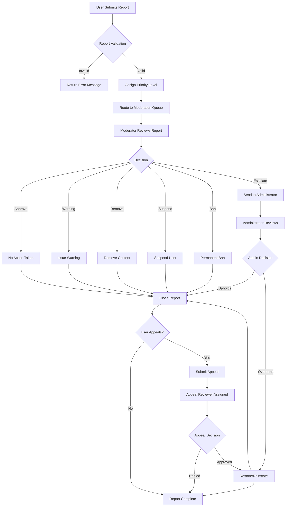

# Content Moderation and Compliance Requirements

## Overview

The content moderation system provides mechanisms for users to report inappropriate content and enables moderators and administrators to review reports, take corrective actions, and enforce community standards. This system balances user empowerment to maintain healthy communities with fair processes for content creators and users facing disciplinary actions.

The moderation system is critical to platform health because:
- **Community Safety**: Enables removal of harmful, illegal, or policy-violating content
- **User Empowerment**: Allows community members to maintain their communities
- **Fairness**: Provides transparent processes and appeals mechanisms
- **Accountability**: Creates audit trails for all moderation decisions
- **Compliance**: Ensures legal compliance with platform policies and jurisdictional laws

This document specifies all moderation-related functionality including reporting, review workflows, content removal, user discipline, appeals, and audit requirements.

---

## 1. Content Reporting System

### 1.1 User Reporting Capability

WHEN an authenticated member user navigates to a post or comment, THE system SHALL display a "Report" option accessible through a menu button on that content.

WHEN a member selects "Report Content", THE system SHALL display a report form requiring the following inputs:
- **Report Category** (required): Dropdown list selecting violation type from predefined categories
- **Additional Details** (optional): Text field (0-500 characters) allowing reporter to provide context
- **Contact Information** (optional checkbox): Whether reporter wants platform to contact them about report status

IF the reporter checks the contact option, THE system SHALL store their email address with the report for follow-up communication.

WHEN a guest user (unauthenticated) attempts to report content, THE system SHALL deny the action and display a message: "You must be logged in to report content. Please sign up or log in to help us keep communities safe."

WHEN a member submits a report, THE system SHALL validate that:
- A report category has been selected
- The reported content exists and is accessible to the reporter
- The reporter is not the content creator (unless reporting on behalf of community)
- No duplicate report from same user on same content exists within 30 days

IF validation fails, THE system SHALL return specific error message explaining the issue.

WHEN validation succeeds, THE system SHALL:
1. Generate unique report ID
2. Store report with all metadata in database
3. Assign priority level based on violation category
4. Route to appropriate moderation queue
5. Return confirmation message to reporter: "Thank you for the report. Our team will review it shortly."
6. Send confirmation email if reporter provided contact information

### 1.2 Report Metadata Captured

THE system SHALL store the following information with every report:

- **Report ID**: Unique identifier (UUID format)
- **Reported Content Type**: "post" or "comment"
- **Reported Content ID**: ID of the post or comment being reported
- **Reported Content Creator ID**: User ID of the content creator (for filtering by creator)
- **Reporter User ID**: User ID of the member who submitted report
- **Report Category**: Selected violation category from predefined list
- **Additional Details**: User-provided explanation (up to 500 characters)
- **Report Timestamp**: Creation timestamp (ISO 8601 UTC)
- **Report Status**: Current state (submitted, in_review, pending_decision, resolved, dismissed)
- **Priority Level**: Auto-assigned based on category (critical, high, medium, low)
- **Reporter Contact Email**: Optional contact information for reporter follow-up
- **Report Update Timestamp**: Last modification time
- **Moderation Assigned To**: Moderator ID if assigned to specific moderator
- **Resolution Details**: Final decision and action taken (populated after resolution)

### 1.3 Report Privacy and Confidentiality

WHEN a report is submitted, THE system SHALL maintain reporter confidentiality from the content creator during the moderation process.

THE content creator SHALL NOT be informed who submitted the report, only that their content was reported and what category was used.

WHEN a report is resolved, THE reporter SHALL be able to view the outcome through "My Reports" section in their account settings:
- Report status (approved/resolved/dismissed)
- Brief explanation of action taken (if any)
- Content removal confirmation (if applicable)

IF the reporter opted into contact communications, THE system SHALL notify them via email when their report is resolved.

THE system SHALL NOT publish reporter identity unless required by law enforcement or judicial process.

### 1.4 Duplicate Report Handling

WHEN a member attempts to submit a second report on the same content within 30 days, THE system SHALL:
1. Check for existing report by same user on same content
2. IF found: Display message "You've already reported this content on [DATE]. Your report is being reviewed."
3. IF not found within 30 days: Allow new report and treat as separate report

WHERE multiple members report the same content, THE system SHALL:
- Maintain separate report records for each reporter
- Aggregate similar reports for moderator dashboard visibility
- Display count of total reports on content in moderator queue
- Increase priority if multiple reports received within 24 hours

---

## 2. Report Types and Categories

### 2.1 Complete Reportable Violation Categories

THE system SHALL support exactly the following report categories:

#### Category 1: Spam
**Description**: Repetitive, unsolicited, or commercial content designed to promote products/services or manipulate platform visibility

**Examples of Reportable Spam**:
- Repetitive identical posts/comments (same content posted 3+ times)
- Commercial advertising for products/services
- Misleading links or bait-and-switch content ("Click here to win free iPhone!")
- Excessive self-promotion by user (>50% of user's posts linking to own website)
- Bot-like behavior (automated posting patterns)
- Link farming or URL shortener abuse
- Cryptocurrency/NFT pump-and-dump schemes

**Resolution Options**:
- Warn user (first offense)
- Remove content and warn user (repeat offense)
- Suspend user for 24-72 hours (multiple offenses)

#### Category 2: Harassment and Bullying
**Description**: Targeted attacks on individuals or groups causing discomfort, fear, or harm through repeated negative behavior

**Examples of Reportable Harassment**:
- Personal insults targeting specific user ("You're an idiot")
- Sustained pattern of negative comments on user's profile
- Threats of violence or harm ("I know where you live")
- Doxxing (sharing of private information like address, phone, workplace)
- Cyberstalking or obsessive contact
- Encouraging others to harass target ("Everyone message this user")
- Unwanted sexual advances or messages
- Impersonation of another user

**Resolution Options**:
- Warn user and require apology
- Remove content and suspend for 7-30 days
- Permanent ban for severe cases
- Report to law enforcement if threats made

#### Category 3: Hate Speech
**Description**: Content promoting violence, discrimination, or dehumanization based on protected characteristics

**Protected Characteristics**: Race, ethnicity, national origin, religion, caste, sexual orientation, gender identity, sex, disability, serious disease/disability status

**Examples of Reportable Hate Speech**:
- Slurs or dehumanizing language ("All [group] are [negative term]")
- Content calling for violence against group ("[Group] should be eliminated")
- Conspiracy theories targeting protected groups
- Denial of documented genocide or atrocities
- Memes/images promoting superiority of one group over another
- Religious extremist content (recruitment, glorification of violence)
- Segregationist content (calling for separation/exclusion based on protected characteristics)

**Resolution Options**:
- Remove content immediately
- Suspend user 7-90 days
- Permanent ban for repeat offenses or severe cases
- Report to law enforcement if calls for violence

#### Category 4: Misinformation
**Description**: Deliberately false or misleading information that causes real-world harm

**Examples of Reportable Misinformation**:
- False health information ("Vaccine causes [illness]" with no scientific basis)
- Election fraud claims without supporting evidence
- Medical advice that contradicts established science
- Harmful conspiracy theories (e.g., false claims about groups causing disease)
- Deliberately manipulated images/videos (deepfakes)
- False instructions causing physical harm

**Resolution Options**:
- Add community note with fact-check link
- Remove content if misinformation relates to imminent harm
- Warn user and link to authoritative sources
- Suspend if pattern of harmful misinformation

#### Category 5: Copyright and Intellectual Property Violations
**Description**: Sharing of copyrighted material, plagiarized content, or unauthorized use of intellectual property

**Examples of Reportable IP Violations**:
- Full article or book chapters without permission
- Copyrighted music/video shared without license
- Software piracy links or activation keys
- Plagiarized writing (copied without attribution)
- Trademark misuse (using company logos/names to impersonate)
- Unauthorized use of brand imagery

**Resolution Options**:
- Remove content upon copyright owner request (DMCA takedown)
- Notify copyright holder
- Warn user
- Suspend repeat infringers

#### Category 6: Adult Content and Sexual Material
**Description**: Sexually explicit material (when not permitted in community) and non-consensual intimate images

**Examples of Reportable Content**:
- Non-consensual intimate images (revenge porn)
- Sexualization of minors (any age <18 in sexual context)
- Extreme pornography in non-adult communities
- Child sexual abuse material (CSAM) - reported to NCMEC
- Sexual coercion or exploitation material

**Resolution Options**:
- Remove immediately if CSAM
- Remove if non-consensual intimate images
- Flag CSAM to National Center for Missing & Exploited Children (NCMEC)
- Report to law enforcement
- Permanent ban for CSAM-related accounts

#### Category 7: Off-Topic or Community Guidelines Violation
**Description**: Content violating specific community rules or posted in wrong location

**Examples of Reportable Content**:
- Political posts in non-political community (if community rules prohibit)
- Advertising in communities that forbid self-promotion
- Image posts in text-only communities
- Low-effort content (spam memes) in communities with quality standards
- Off-topic discussion in specialized communities

**Resolution Options**:
- Remove with link to community rules
- Move to appropriate community (if applicable)
- Warn user
- Temporary removal pending moderator review

#### Category 8: Self-Harm or Suicide Risk
**Description**: Content indicating imminent self-harm or suicide risk

**Examples of Reportable Content**:
- Suicide note or detailed suicide plan
- Content indicating active self-harm ("I just cut myself")
- Encouragement of self-harm in others
- Detailed methods or instructions for self-harm

**Resolution Options**:
- Remove immediately
- Direct user to crisis resources (National Suicide Prevention Lifeline, Crisis Text Line)
- Notify mental health crisis team
- Report to law enforcement if imminent danger
- Support user with resources

#### Category 9: Illegal Content
**Description**: Content describing, promoting, or facilitating illegal activities

**Examples of Reportable Content**:
- Drug trafficking or manufacturing instructions
- Weapons sales or acquisition instructions
- Human trafficking recruitment or promotion
- Fraud schemes or scam instructions
- Child exploitation or abuse material
- Terrorism or violent extremism recruitment
- Illegal weapons manufacturing instructions

**Resolution Options**:
- Remove immediately
- Report to law enforcement
- Preserve evidence for investigation
- Permanent ban
- Comply with legal requirements for disclosure

#### Category 10: Other Violations
**Description**: Violations not fitting the above categories, allowing user to report custom violations

WHEN "Other" is selected, THE system SHALL require user to provide detailed explanation (minimum 20 characters) explaining the violation.

### 2.2 Category-Specific Priority and SLA

THE system SHALL assign priority levels based on violation category and activate appropriate response timelines:

| Category | Priority | Response Time SLA | Action Priority |
|----------|----------|------|---|
| Illegal Content | CRITICAL | 2 hours | Contact law enforcement |
| CSAM or Abuse Material | CRITICAL | 1 hour | Immediate removal, contact NCMEC |
| Self-Harm/Suicide Risk | CRITICAL | 2 hours | Provide resources, consider authorities |
| Threats/Violence | CRITICAL | 4 hours | Assess credibility, contact authorities if needed |
| Hate Speech | HIGH | 8 hours | Remove content, suspend user |
| Non-Consensual Intimate Images | HIGH | 8 hours | Remove immediately, support victim |
| Harassment (targeted) | HIGH | 12 hours | Assess pattern, take action |
| Copyright Claim | HIGH | 24 hours | Remove upon valid claim |
| Misinformation (health/election) | MEDIUM | 24 hours | Add notes or remove if harmful |
| Spam | MEDIUM | 48 hours | Remove pattern, warn user |
| Self-Promotion/Off-Topic | LOW | 72 hours | Remove if clear violation |
| Other | MEDIUM | 48 hours | Moderator discretion |

WHEN a report is marked CRITICAL priority, THE system SHALL immediately notify all available platform administrators via SMS/phone alert within 5 minutes.

WHERE response time SLA is exceeded without action, THE system SHALL escalate to platform administrator for review.

### 2.3 Community-Specific Categories

ADDITIONAL to platform-wide categories, communities can define custom violation categories in their rules. Examples:
- "Spoilers without spoiler tag" (for entertainment communities)
- "Unverified job posting" (for job board communities)
- "Unapproved use of AI-generated content" (for artist communities)

WHEN a community has custom categories enabled, THE system SHALL display them as options alongside platform-wide categories in the report form.

---

## 3. Moderation Queue and Workflow

### 3.1 Report Triage and Queue Assignment

WHEN a report is submitted, THE system SHALL immediately execute the following triage process:

1. **Priority Assignment**:
   - Assign priority level based on category using table from Section 2.2
   - CRITICAL priority: Route directly to administrator queue
   - HIGH priority: Route to community moderator queue
   - MEDIUM/LOW priority: Route to community queue based on availability

2. **Queue Organization**:
   - Organize queue by priority (CRITICAL > HIGH > MEDIUM > LOW)
   - Within each priority tier, organize by submission timestamp (oldest first)
   - Escalate reports stuck in queue > 2x SLA time to next authority level

3. **Load Balancing**:
   - Calculate current workload for each moderator (number of reports in progress)
   - Assign new reports to moderator with lowest current workload in relevant community
   - Maximum 10 active reports per moderator at any time

4. **Escalation Logic**:
   - IF report involves reported user's legal name/address: Escalate to administrator
   - IF report involves multiple communities or coordinated abuse: Escalate to administrator
   - IF report targets moderator or administrator: Escalate to different administrator
   - IF report backlog exceeds 50 reports: Escalate to administrator for resource allocation

### 3.2 Moderator Assignment and Review Interface

WHEN a moderator claims a report from the queue, THE system SHALL:
1. Immediately lock the report (prevent other moderators from claiming it)
2. Display full moderation review interface with the following sections:

**Section A: Reported Content Display**
- Full text/content of the reported post or comment
- Surrounding context (parent post if comment, replies if post)
- Metadata: Creator username, creation timestamp, current vote count, comment count
- Content creator's profile link and history summary

**Section B: Report Information**
- Reporter's report category selection
- Reporter's explanation text
- Report submission timestamp
- Unique report ID
- Any previous reports on same content or same creator

**Section C: Creator Context**
- Content creator's username and karma
- Creator's account age
- Previous moderation actions against creator (if any)
- Creator's disciplinary history in community
- Recent content from creator

**Section D: Community Context**
- Community name and rules (relevant rules highlighted)
- Community policies on this violation type
- Similar recent reports in this community
- Moderation precedent (how similar violations were handled previously)

**Section E: Moderation Tools**
- Buttons for each available action (see Section 3.4)
- Text field for moderation reason (required, minimum 10 characters)
- Optional internal notes field (visible only to moderators/admins)
- Preview of notification message that will be sent to creator

### 3.3 Moderator Decision Time Limit

WHEN a moderator accepts a report, THE system SHALL enforce a decision deadline:
- Must decide within 8 hours for HIGH/MEDIUM priority reports
- Must decide within 24 hours for LOW priority reports
- CRITICAL priority reports must be decided immediately (within 1 hour)

IF moderator does not decide by deadline, THE system SHALL:
1. Send reminder notification to moderator
2. If still no decision after 2 hours: Flag report for administrator review
3. If still unresolved: Assign to different moderator

### 3.4 Moderation Decision Types

THE system SHALL support exactly the following moderator actions:

**Action 1: No Action / Approve Content**
- Content complies with policies
- No violation occurred
- Report is marked "dismissed" / "no violation found"
- Creator is NOT notified (to prevent rewarding false reports)
- Report is closed

WHEN approving content, moderator must select reason:
- Content complies with community rules
- Content complies with platform policies
- Violation cannot be substantiated with available evidence
- Report submitted in error

**Action 2: Warning Only**
- Content is marginal/borderline violation not requiring removal
- Creator receives warning about conduct
- Content remains visible
- Warning is recorded on creator's account
- If user receives 3+ warnings within 90 days: Escalate to suspension consideration

WHEN issuing warning, moderator MUST specify warning type:
- Spam warning ("Your post contains promotional content...")
- Community rule warning ("Your post violates community rule #3...")
- Quality warning ("Your post is low-effort...")
- Civility warning ("Your comment is disrespectful...")

**Action 3: Remove Content**
- Content violates rules
- Post or comment is hidden from public view
- Soft-delete performed (content retained in database for appeals/investigation)
- Creator receives notification with removal reason
- Creator can appeal the removal

WHEN removing content, moderator must select primary reason:
- Violates community rules
- Violates platform policy: [specific policy]
- Harmful misinformation
- Spam
- Copyright/IP violation
- Other: [explanation]

THE system SHALL display pre-populated removal notice to creator:
"Your [post/comment] was removed for violating [community/platform policy]. Reason: [selected reason]. [Appeal link if available]"

**Action 4: Remove Content and Issue Warning**
- Combination of Actions 2 and 3
- Content is removed AND warning recorded
- Creator receives notification of both removal and warning
- Appropriate for repeat offenders or escalating violations

**Action 5: Suspend User (Temporary Discipline)**
- User temporarily banned from community or platform
- Cannot create posts/comments/votes during suspension
- Can view content but not interact
- Suspension duration determined by moderator

WHEN suspending user, moderator must select suspension duration:
- 24 hours (1 day)
- 3 days (72 hours)
- 7 days (1 week)
- 14 days (2 weeks)
- 30 days (1 month)
- 90 days (3 months)
- Custom duration (1 to 365 days)

WHEN a user is suspended, THE system SHALL:
1. Prevent all content creation and voting
2. Send notification: "You've been suspended from [community] for [duration]. Reason: [reason]. Suspension ends: [date/time]. You can appeal this decision."
3. Record suspension in user's disciplinary history
4. Deduct 5 karma points per day of suspension (permanent)
5. Remove any draft posts in progress

**Action 6: Permanently Ban User**
- User permanently removed from community or platform
- Cannot create account with same email address
- All future attempts to join are blocked
- Account can be manually appealed after 1 year

WHEN banning user, moderator must explain in required field (minimum 50 characters) the rationale for permanent ban. Examples:
- "Repeated severe harassment after warnings and suspension"
- "Posted CSAM material"
- "Coordinated harassment campaign targeting community members"

WHEN a user is permanently banned, THE system SHALL:
1. Immediately deactivate ability to login
2. Hide all content from public view (soft-delete all posts/comments)
3. Send notification: "You have been permanently banned from [community/platform] for: [reason]. You may appeal this decision after 1 year."
4. Record ban in user's disciplinary history
5. Deduct 50 karma points (permanent)
6. Block all future access attempts

**Action 7: Escalate to Administrator**
- Report requires administrative review
- Moderator cannot make final decision
- Content remains in pending state pending admin review
- Used for ambiguous cases or potential legal issues

WHEN escalating, moderator must explain reason for escalation:
- Involves legal/intellectual property issue
- Involves multiple communities
- Involves account ban (not just community suspension)
- Involves moderator or administrator
- Unclear violation

### 3.5 Moderation Documentation Requirements

WHEN a moderator takes ANY action on a report, THE system SHALL require completion of:

**Required Field 1: Action Taken** - Dropdown selection from Actions 1-7 above

**Required Field 2: Moderation Reason** - Text field (minimum 10 characters)
- Must explain WHY the action was taken
- Must reference specific rule(s) violated
- Example: "Post violates community rule #2 (no promotional content) by including link to user's Etsy store"

**Optional Field 3: Internal Notes** - Text field for moderator comments
- Visible only to other moderators and administrators
- Used for documentation of investigation
- Example: "User is new account (2 days old) with pattern of spam links. Recommend 3-day suspension."

**Optional Field 4: Evidence** - Ability to attach/link to evidence
- Screenshots, archived versions, or links to supporting material
- Useful for hate speech, threats, or complex cases

WHEN moderation action is saved, THE system SHALL:
1. Record decision timestamp
2. Record moderator ID
3. Record all action details
4. Generate notification to content creator
5. Generate notification to reporter (if opted in)
6. Update user's disciplinary history
7. Update community moderation statistics

### 3.6 Moderation Escalation to Administrators

IF a moderator encounters a report requiring administrative authority, THE system SHALL provide "Escalate to Administrator" button.

WHEN moderator escalates, THE system SHALL:
1. Remove from moderator queue
2. Add to administrator review queue
3. Preserve all moderator notes and analysis
4. Mark escalation reason in system
5. Notify relevant administrators (via Slack/email alert)

WHEN administrator reviews escalated report, THE system SHALL:
- Display all moderator analysis and notes
- Show escalation reason
- Allow administrator to override moderator decision or accept it
- Provide same decision options as moderators (with additional administrative options)

---

## 4. Content Removal and Restoration

### 4.1 Post Removal Process

WHEN a moderator removes a post through moderation system, THE system SHALL:

1. **Immediate Visibility Changes**:
   - Remove post from all community feeds
   - Remove post from user's public profile
   - Remove post from search results
   - Remove post from "top posts" sorting

2. **Soft-Delete Implementation**:
   - Mark post with deleted_at timestamp
   - Mark post visibility_status = "removed_by_moderator"
   - Retain all post data in database for potential restoration
   - Retain all vote records for audit purposes
   - Preserve comment thread structure (replies remain visible)

3. **Visibility to Users**:
   - **To general users**: Display placeholder "[Post removed by moderator for violating community rules]"
   - **To original author**: Display removal notice with reason, timestamp, and appeal link
   - **To moderators/administrators**: Display original content with removal indicator and moderator notes

4. **Comment Thread Handling**:
   - Comments on removed post remain visible
   - Comments show: "Parent post was removed by moderator"
   - Users can still read comment thread even with removed parent

5. **Creator Notification**:
   - Send email notification immediately
   - Subject: "Your post was removed - [Community] Community"
   - Include removal reason from moderator
   - Include appeal link and instructions
   - Include community rules reference

### 4.2 Comment Removal Process

WHEN a moderator removes a comment, THE system SHALL follow same process as post removal with following differences:

1. **Display in Thread**:
   - Comment is replaced with: "[Comment removed by moderator]"
   - Timestamp of removal is shown
   - Direct replies to removed comment remain visible and indented

2. **Reply Visibility**:
   - Replies to removed comment are still visible
   - Each reply shows context: "In response to removed comment"
   - Allows thread continuity even with removed intermediate comment

3. **Vote Handling**:
   - All votes on removed comment become invisible
   - Vote records preserved in database for audit
   - Creator loses karma for removed comment

### 4.3 Bulk Content Removal

WHEN multiple posts/comments from same user or across community violate same rule, moderators can perform bulk removal:

WHEN moderator selects "Remove multiple" action, THE system SHALL:
1. Display list of content to be removed (maximum 100 items at once)
2. Require moderator to confirm bulk removal with reason
3. Apply same removal process to each item
4. Send single consolidated notification to creator
5. Log as bulk action with count in audit trail

WHEN bulk removing 10+ items from same creator, THE system SHALL automatically:
- Recommend suspension consideration to moderator
- Prompt: "This user has [count] violations. Consider suspension?"

### 4.4 Content Restoration

WHEN a user appeals a removal and appeal is approved, THE system SHALL:

1. **Restoration Process**:
   - Restore content visibility (deleted_at = null)
   - Reappear in feeds and search results
   - Re-enable voting on restored content
   - Display "Restored after appeal" indicator

2. **Notifications**:
   - Notify content creator: "Your [post/comment] has been restored after appeal"
   - Notify original moderator: "Your removal decision on [content] was overturned on appeal"
   - Update report status to "overturned on appeal"

3. **Audit Trail**:
   - Record restoration with admin who approved appeal
   - Preserve removal details for transparency
   - Log complete history of removal and restoration

### 4.5 Permanent Deletion (Administrator Only)

THE system SHALL distinguish between moderator removal (soft-delete) and permanent deletion (hard-delete).

ONLY administrators can permanently delete content. WHEN administrator permanently deletes content:

1. **Deletion Process**:
   - Permanently remove from database
   - Delete all associated vote records
   - Delete all associated comment chains
   - Cannot be recovered except from backup

2. **When Permanent Deletion Occurs**:
   - User account deletion (user requests right to be forgotten)
   - Legal requirement (DMCA, court order, law enforcement request)
   - Criminal content (CSAM, terrorism, illegal activity)
   - System corruption or accidental duplication

3. **Audit Trail**:
   - Log permanent deletion with administrator ID, timestamp, and reason
   - Preserve deletion log for minimum 2 years
   - Do NOT delete audit record even if content is deleted

### 4.6 Restoration Time Limits

WHEN content is removed by moderator, THE creator has following restoration options:

- **Appeal window**: 30 days from removal date
- **Early restoration**: If appeal is approved
- **Automatic restoration**: If 180 days pass and content was not removed for illegal reasons

AFTER 180 days, soft-deleted posts are automatically re-enabled (unless specifically permanent deleted by admin).

---

## 5. User Suspension and Bans

### 5.1 Suspension System Overview

THE system SHALL implement temporary user suspensions as a disciplinary action short of permanent ban.

DURING a suspension, THE suspended user:
- **CAN**: View public content, read comments, access their own profile and history, upload appeal
- **CANNOT**: Create new posts, create new comments, vote on content, send messages, create communities, moderate

### 5.2 Suspension Duration Options

WHEN moderator selects suspension action, THE system SHALL provide these duration options:

| Duration | Days | Use Case | Appeal Eligible After |
|----------|------|----------|---|
| 24 hours | 1 | First minor violations (spam, low-effort posts) | 24 hours |
| 3 days | 3 | Repeated minor violations or first harassment | 24 hours |
| 7 days | 7 | Harassment, targeted disruption, or multiple warnings | 24 hours |
| 14 days | 14 | Serious violations, hate speech, or abuse | 48 hours |
| 30 days | 30 | Very serious violations or multiple suspensions | 72 hours |
| 90 days | 90 | Severe violations requiring extended break | 1 week |
| Custom | 1-365 | Unusual circumstances requiring specific duration | Case by case |

THE moderator may also set custom duration between 1 and 365 days for scenarios not covered above.

### 5.3 Suspension Notification and Enforcement

WHEN a user is suspended, THE system SHALL immediately:

1. **Prevent Access**:
   - Block all content creation API calls with HTTP 403 "Forbidden"
   - Block all voting API calls
   - Display message: "You are suspended from [community] until [date/time]. Suspension reason: [reason given by moderator]."

2. **Send Notification Email**:
   - Subject: "You've been suspended from [Community]"
   - Content includes:
     - Duration of suspension
     - Reason for suspension
     - Specific rule(s) violated
     - Date/time when suspension ends
     - Appeal instructions and link

3. **Display Suspension Banner**:
   - When suspended user logs in, display prominent banner
   - Banner shows: "You are suspended until [date]. [Appeal link]"
   - Appears on all pages until suspension expires

4. **Update Disciplinary Record**:
   - Record suspension in user's account history
   - Calculate karma penalty: 5 karma points × number of days suspended
   - Deduct karma immediately
   - Record suspension details: reason, moderator, timestamp, duration

### 5.4 Community vs Platform Suspension

WHEN a user is suspended, THE suspension scope can be:

**Community-Level Suspension**:
- User suspended from specific community only
- User can still post/comment in other communities
- Suspension notification specifies community name
- Moderators can only suspend from their own community

**Platform-Level Suspension**:
- User suspended from entire platform
- User cannot create content anywhere
- Only administrators can implement platform-wide suspensions
- Used for severe violations or repeated violations across communities

WHEN moderator suspends from their community, THE system SHALL prevent them from creating platform-wide suspensions. Only administrators have that authority.

### 5.5 Permanent Ban System

PERMANENT bans are the most severe discipline, preventing a user from ever using the platform.

WHEN administrator bans user permanently, THE system SHALL:

1. **Immediate Deactivation**:
   - Disable all login attempts
   - Prevent account recovery
   - Show message: "Your account has been permanently terminated"

2. **Content Handling**:
   - Soft-delete all existing posts (visible only to admins)
   - Soft-delete all existing comments (visible only to admins)
   - Prevent content from appearing in feeds or search
   - Preserve content in database for appeals/investigation

3. **Future Access Prevention**:
   - Block email address from new account registration
   - Block IP address from new account registration (for 90 days)
   - Flag suspicious accounts from same IP for review
   - Prevent username reuse

4. **Account Recovery Block**:
   - Disable password reset
   - Disable account recovery options
   - Disable deletion/recovery period (normally 30-day grace period waived)

5. **Notifications**:
   - Send email: "Your account has been permanently terminated"
   - Include reason for ban
   - Include how long user must wait before appeal (minimum 1 year)
   - Include appeal instructions

### 5.6 Ban Appeals After Time

WHEN a user who was permanently banned 1+ year ago submits appeal:

THE system SHALL:
1. Notify administrator of appeal
2. Display user's account history and ban reason
3. Show evidence of reform (if account still exists in database)
4. Allow administrator to:
   - **Deny appeal**: Ban remains permanent
   - **Conditional reinstatement**: Restore account with conditions:
     - Account probation period (user posts require moderator approval)
     - Reduced posting limits
     - Required participation in community conduct guidelines
     - Probation period: 90 days before full restoration

### 5.7 Multiple Suspension Escalation

WHEN a user receives multiple suspensions, THE system SHALL implement escalation:

| Suspensions in 6 Months | Automatic Action | Moderator Notification |
|---|---|---|
| 1st suspension | Normal process | Logged |
| 2nd suspension | Same duration as first OR longer | Alert moderator |
| 3rd suspension | Recommend 30+ day suspension | Alert moderator + administrator |
| 4th suspension | Recommend administrator review for permanent ban | Force administrator review |

WHEN 4th suspension is issued, THE system SHALL automatically escalate to administrator review queue with message: "User has received [N] suspensions. Consider permanent ban."

### 5.8 Ban Evasion Detection

WHEN a user who is banned attempts to create a new account, THE system SHALL detect evasion through:

**Email Address Detection**:
- Prevent registration with same email as banned user
- Message: "This email is associated with a terminated account"

**IP Address Detection**:
- Flag account creation from same IP as banned user within 90 days
- Place account in review queue for manual approval
- Alert moderators of potential evasion

**Pattern Detection**:
- Monitor new accounts with similar usernames/behavior to banned users
- Flag suspicious accounts for review
- Track ban evasion attempts for escalation

WHEN evasion is confirmed, THE system SHALL:
- Immediately ban new account
- Extend ban duration on original account
- Report to administrator
- Potentially escalate to law enforcement if repeated evasion

---

## 6. Appeal Process and User Rights

### 6.1 Appeal Eligibility

WHEN content is removed or user receives discipline (suspension/ban), THE affected user SHALL be able to submit an appeal within time window:

| Action Type | Appeal Window | Appeal Permitted |
|---|---|---|
| Content removal | 30 days from removal | Yes |
| Warning only | 30 days from warning | Yes |
| 24-hour suspension | 24 hours after suspension | Yes |
| 7-30 day suspension | 2 days after suspension starts | Yes |
| 90+ day suspension | 1 week after suspension starts | Yes |
| Permanent ban | 1 year after ban | Yes |

IF user does not appeal within appeal window, THE right to appeal expires (with exception of permanent ban after 1 year).

### 6.2 Appeal Submission Process

WHEN user clicks "Appeal this decision" link in notification or finds appeal form:

THE system SHALL display form requiring:

**Appeal Information Required**:
- **Appeal Type**: Dropdown (Content removal, Suspension, Ban)
- **Appeal Reason**: Required text (minimum 50 characters, maximum 1,000 characters)
  - User explains why they believe decision was incorrect
  - Examples: "I didn't realize that violated rules", "The content wasn't actually [violation]", "The punishment seems too harsh"
- **Supporting Evidence**: Optional file upload or link
  - Screenshots, context, corrections, etc.
- **Request Type**: User selects primary request:
  - "Overturn decision (restore content)"
  - "Reduce punishment (e.g., shorter suspension)"
  - "Explain decision (understand reasoning)"

WHEN appeal is submitted, THE system SHALL:
1. Generate unique appeal ID
2. Record appeal timestamp
3. Store all user-provided information
4. Send confirmation email: "We received your appeal. Decision typically made within [7] days."
5. Add to appeals review queue
6. Notify moderators/admins: "[User] appealed [action] on [content]"

### 6.3 Appeal Review Process

WHEN an appeal reaches review queue, THE system SHALL assign it to reviewer:

**Reviewer Selection Rules**:
- CANNOT be the moderator who made original decision (if possible)
- SHOULD be a senior moderator or administrator
- If community-specific decision, assign to different community moderator if available
- If administrator decision, assign to different administrator

**Reviewer Information Provided**:
- Original moderation decision and reason
- Content that was removed (full text/media)
- User's disciplinary history
- User's appeal explanation
- Any supporting evidence user provided
- Similar past cases and how they were resolved

**Reviewer Decision Timeline**:
- Must review within 7 days of appeal submission
- High-priority appeals (bans) reviewed within 3 days
- Reviewer must document their reasoning

### 6.4 Appeal Decision Types

THE system SHALL support exactly these appeal outcomes:

**Decision 1: Appeal Denied**
- Original decision stands unchanged
- User receives notification: "Your appeal was reviewed and the original decision has been upheld."
- Include explanation of why appeal was denied
- User notified of expiration of further appeal rights

**Decision 2: Appeal Approved - Decision Overturned**
- Original action completely reversed
- Removed content restored to visibility
- Suspension or ban removed immediately
- User receives notification: "Your appeal was approved. [Content restored / You have been reinstated]."
- Include brief explanation

**Decision 3: Appeal Approved - Discipline Reduced**
- Original action modified (lesser consequence)
- Example outcomes:
  - 30-day suspension reduced to 7-day suspension
  - Permanent ban changed to 90-day suspension
  - Content removal changed to warning only
- User receives notification with new consequence
- Include brief explanation of why reduced

**Decision 4: Appeal Approved - Modified Outcome**
- Different action taken than original
- Example: Original 1-day suspension extended to 3-day (evidence of evasion pattern found)
- User receives notification of new consequence
- Include explanation

WHEN appeal is decided, THE system SHALL:
1. Update user's appeal status
2. Send notification email to user
3. Notify original moderator of outcome
4. Update user's appeal history
5. Log decision in audit trail
6. If overturned, restore content/access immediately

### 6.5 Appeal Escalation to Administrator

WHEN a moderator's decision is appealed and moderator initially approved the appeal, THE system MAY require administrator approval before implementation:

WHEN appeal reversal affects:
- Permanent ban (must be approved by administrator)
- User who has multiple appeals (pattern of appeals)
- Content involving potential legal issues
- Moderator conduct that seems arbitrary

THE system SHALL escalate to administrator review queue with reviewer's recommendation.

### 6.6 Limited Appeal Rights

WHEN user has submitted appeals on the same action multiple times, THE system SHALL:

**First Appeal**: Full review and reconsideration
**Second Appeal (same action)**: Limited review (only new evidence considered)
**Third+ Appeals (same action)**: No further appeals permitted

THE system SHALL enforce one appeal per action per user. IF user attempts to appeal twice on same content removal:
- First appeal proceeds normally
- Second appeal rejected with message: "You have already appealed this decision. No further appeals permitted."

---

## 7. Moderation Auditing and Accountability

### 7.1 Comprehensive Audit Trail

THE system SHALL maintain immutable audit logs of ALL moderation activities.

**Audit Log Entry Structure**:
Each audit log entry SHALL include:
- **Timestamp**: Exact ISO 8601 UTC timestamp of action
- **Moderator ID**: User ID of person taking action
- **Moderator Role**: (Creator, Senior Moderator, Junior Moderator, Administrator)
- **Community ID**: Community where action occurred (if applicable)
- **Action Type**: Specific action taken (remove_post, suspend_user, issue_warning, etc.)
- **Target Type**: What was acted upon (post, comment, user)
- **Target ID**: ID of post/comment/user affected
- **Reason Provided**: Moderator's explanation of action
- **Internal Notes**: Moderator's private notes (if any)
- **Previous State**: What the data was before action
- **New State**: What the data is after action
- **IP Address**: IP address from which moderator took action
- **User Agent**: Browser/app information for location tracking
- **Status**: Result of action (success, failed, partial)
- **Duration**: How long action took to complete

### 7.2 Audit Log Retention and Accessibility

AUDIT logs SHALL be retained with following timeline:

| Log Type | Retention | Accessibility |
|---|---|---|
| Content removal logs | 2 years | Moderators (own community only), Admins (all) |
| User suspension/ban logs | 3 years | Moderators (own community only), Admins (all) |
| Report submissions | 1 year | Admins only |
| Moderator actions | 2 years | Admins only |
| Authentication/access logs | 90 days | Admins only |
| Appeal logs | 3 years | Admins, user (own appeals) |

THE system SHALL store audit logs in append-only database that prevents modification or deletion by any user.

WHEN moderators request audit trail, THE system SHALL:
- Display only logs relevant to their community (cannot see other communities)
- Show action, timestamp, reason, and outcome
- Allow filtering by date range, action type, moderator
- Prevent export of confidential data

WHEN administrators request audit trail, THE system SHALL:
- Display all logs across all communities
- Show all fields including private moderator notes
- Allow filtering and reporting
- Support export to CSV/JSON for analysis

### 7.3 Moderator Performance Metrics

THE system SHALL track performance metrics for each moderator:

**Tracked Metrics**:
- **Reports Reviewed**: Total number of reports handled
- **Average Review Time**: Average time from report receipt to decision
- **Decision Types**: Breakdown of actions taken (removals, warnings, suspensions, etc.)
- **Appeals Received**: Total appeals of moderator's decisions
- **Appeal Overturn Rate**: Percentage of appeals that resulted in reversal
- **Appeal Reduction Rate**: Percentage of appeals that resulted in reduced discipline
- **Review Completeness**: Did moderator provide sufficient reasoning (yes/no)

### 7.4 Moderator Accountability Thresholds

WHEN moderator metrics exceed thresholds, THE system SHALL trigger reviews:

| Metric | Threshold | Action |
|---|---|---|
| Appeal overturn rate | >15% | Flag for quality review |
| Average review time | >12 hours (for < Critical reports) | Coaching offered |
| Decisions without reasoning | >10% | Reminder of documentation requirement |
| Very low overturn rate | <1% (possible over-lenience) | Review for consistency |
| High suspension rate | >30% of decisions | Review for appropriateness |
| Slow to respond | Response time >2x SLA | Escalate to administrator |

WHEN flag is triggered, THE system SHALL:
- Notify moderator of issue
- Offer additional training or coaching
- Escalate to administrator if pattern continues
- Consider removing moderation privileges if serious pattern

### 7.5 Community Transparency Reports

THE system SHALL generate monthly transparency reports for each community showing:

**Report Contents**:
- Total reports submitted
- Reports by category (breakdown)
- Actions taken (removals, warnings, suspensions)
- Appeal statistics (total, approved, denied)
- Most active moderators
- Moderation trends (increasing/decreasing reports)

THE community creator SHALL be able to:
- View their community's report
- Publish report to community members
- Use report for moderator training/evaluation

WHEN transparency report is published, THE community members can see:
- Overview of moderation activity
- Types of violations most common
- Actions taken on violations
- Appeal success rates
- Builds trust through transparency

### 7.6 Monitoring for Moderator Misconduct

THE system SHALL implement monitoring to detect potential moderator misconduct:

**Misconduct Patterns to Detect**:
- Moderator consistently removes content from political opponents (bias detection)
- Moderator removes content but provides no reason (documentation failure)
- Moderator overturns other moderators' decisions frequently (authority conflict)
- Moderator issues warnings/suspensions inconsistently for same violation type
- Moderator accepts reports on their own posts (conflict of interest)

WHEN misconduct pattern detected, THE system SHALL:
1. Generate alert for administrator
2. Preserve evidence (moderation logs)
3. Open investigation
4. Interview affected users if necessary
5. Take corrective action (retraining, privilege suspension, removal)

---

## 8. Moderation Workflows and Escalation

### 8.1 Moderation Workflow Diagram

THE following diagram illustrates complete moderation workflow from report submission to resolution:

### 8.2 Escalation Paths

WHEN a report requires escalation from moderator to administrator:

**Escalation Trigger 1: Report Complexity**
- Escalate if report involves copyright/legal issue
- Escalate if report involves potential criminal activity
- Escalate if report involves CSAM or severe abuse
- Escalate if report involves multiple communities or users

**Escalation Trigger 2: Moderator Conflict**
- Escalate if reported user is a moderator
- Escalate if reported user is an administrator
- Escalate if original moderator has conflict of interest
- Escalate if moderator and reporter are in conflict

**Escalation Trigger 3: Report Backlog**
- Escalate if moderator backlog exceeds 10 reports
- Escalate if report waiting > 2x SLA time
- Escalate if critical priority report not reviewed within 1 hour

WHEN report is escalated, THE system SHALL:
1. Move from moderator queue to administrator queue
2. Preserve all moderator notes and analysis
3. Mark escalation reason
4. Assign to available administrator
5. Send notification to administrator with priority flag

---

## 9. Summary of Business Requirements

This content moderation specification establishes:

1. **User Reporting**: Comprehensive reporting system with 10 violation categories and priority-based routing
2. **Moderation Workflow**: Complete workflow from report submission through decision-making
3. **Content Removal**: Soft-delete mechanism preserving content history while protecting community
4. **User Discipline**: Graduated discipline system (warnings → suspensions → bans) with defined escalation
5. **Appeal Rights**: Fair appeal process with independent review and transparent decision-making
6. **Audit Trails**: Complete audit logging ensuring accountability and transparency
7. **Moderator Accountability**: Performance metrics and misconduct detection ensuring moderator quality

The system balances user safety and community health with fairness to content creators and respect for human dignity through transparent, appealable processes.

---

*Developer Note: This document defines business requirements only. All technical implementations (architecture, database design, API specifications, moderation queue systems, decision-tree algorithms, notification delivery mechanisms) are at the discretion of the development team. This document specifies WHAT the moderation system must accomplish and how users interact with it, not HOW to implement it technically.*