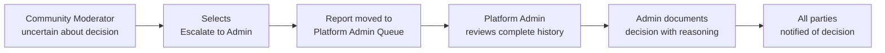

# Moderation & Reporting System

## 1. Content Reporting System

### 1.1 Report Submission Overview
Members of the community platform must be able to report content that violates community standards or platform policies. The reporting system captures detailed information about violations and routes reports to appropriate reviewers.

### 1.2 Reportable Content Types
Members may report the following content types:
- Posts (text, link, or image posts)
- Comments (including nested replies within comment threads)
- User profiles (for violations in profile content or behavior)

### 1.3 Report Categories & Reasons
WHEN a member submits a content report, THE system SHALL require selection of one of the following violation categories:

| Violation Category | Description | Severity |
|---|---|---|
| Spam | Repetitive, unwanted, or commercial content | Medium |
| Harassment | Targeting, bullying, or threatening behavior | High |
| Hate Speech | Content promoting discrimination based on protected characteristics | Critical |
| Misinformation | False or misleading information presented as fact | Medium |
| Adult Content | Sexually explicit or adult material in non-adult communities | High |
| Violence | Content promoting or glorifying violence | Critical |
| Copyright Violation | Unauthorized use of copyrighted material | Medium |
| Off-Topic | Content not relevant to the community's purpose | Low |
| Inappropriate Language | Excessive profanity or disruptive language | Low |
| Impersonation | Content falsely representing another person or entity | High |
| Self-Harm Promotion | Content encouraging self-harm or suicide | Critical |
| Other | Content violating community standards not covered above | Medium |

### 1.4 Report Submission Requirements
WHEN a member initiates a content report, THE system SHALL:
- Display the reportable content (post, comment, or user profile) with context
- Present the violation category options as defined in Section 1.3
- Allow the member to provide additional details explaining the violation (optional but recommended)
- Require confirmation before submitting the report
- Assign a unique report ID upon successful submission
- Record the report submission timestamp
- Confirm report receipt to the reporting member

### 1.5 Reporter Identity Management
WHEN storing report information, THE system SHALL:
- Record the reporter's user ID for administrative auditing purposes
- NOT display the reporter's identity to community moderators (except for platform admins)
- NOT display the reporter's identity to the content creator whose content was reported
- Maintain reporter confidentiality to encourage honest reporting without fear of retaliation

---

## 2. Report Submission & Documentation

### 2.1 Required Report Information
WHEN a report is submitted, THE system SHALL capture and store the following information:

| Field | Type | Required | Description |
|-------|------|----------|-------------|
| Report ID | UUID | Yes | Unique identifier for tracking |
| Reported Content Type | Enum | Yes | "post", "comment", or "profile" |
| Reported Content ID | String | Yes | ID of the post, comment, or user profile |
| Community ID | String | Yes | Which community the content belongs to |
| Violation Category | String | Yes | Selected from violation categories list |
| Reporter User ID | String | Yes | ID of the member submitting report |
| Additional Details | Text | No | Member's explanation of the violation (max 2000 characters) |
| Report Status | String | Yes | Initial value: "submitted" |
| Submission Timestamp | DateTime | Yes | ISO 8601 format timestamp when report created |
| Attachments/Evidence | Array | No | Optional screenshots or additional evidence provided by reporter |

### 2.2 Report Data Preservation
WHEN a report is stored, THE system SHALL:
- Create an immutable snapshot of the reported content at the time of report submission
- Store the content's text, metadata, and any attached images as they existed at report time
- Preserve this snapshot for 90 days minimum, even if the original content is deleted
- Allow moderators and admins to view the original content version during review

### 2.3 Multiple Reports on Same Content
WHEN multiple members report the same content, THE system SHALL:
- Create separate report records for each submission
- Link related reports together by reported content ID
- Display to moderators that this content has been reported N times
- Aggregate similar violation categories to show patterns
- Increase report priority if the same content receives 5+ reports within 24 hours

---

## 3. Report Review Workflow

### 3.1 Report Queue Management
THE system SHALL maintain separate report queues:
- **Community Moderation Queue**: Reports for content in communities with assigned moderators
- **Platform Admin Queue**: Reports requiring platform-wide enforcement or appeals

WHEN a new report is submitted in a community with moderators, THE system SHALL:
- Add the report to that community's moderation queue
- Notify assigned community moderators of new reports
- Set initial status to "assigned" with timestamp

WHEN a new report is submitted in a community without moderators, THE system SHALL:
- Route the report to the Platform Admin Queue automatically
- Set initial status to "escalated_to_admin"

### 3.2 Report Prioritization
THE system SHALL assign priority levels to reports based on severity:

| Violation Category | Initial Priority | SLA for Review |
|---|---|---|
| Self-Harm Promotion | Critical | 2 hours |
| Hate Speech | Critical | 2 hours |
| Violence | Critical | 2 hours |
| Harassment | High | 24 hours |
| Adult Content | High | 24 hours |
| Impersonation | High | 24 hours |
| Misinformation | Medium | 48 hours |
| Spam | Medium | 48 hours |
| Copyright Violation | Medium | 48 hours |
| Off-Topic | Low | 5 days |
| Inappropriate Language | Low | 5 days |
| Other | Medium | 48 hours |

### 3.3 Community Moderator Review Process
WHEN a community moderator accesses the moderation queue, THE system SHALL display:
- Report ID and submission timestamp
- Violation category selected by reporter
- Reporter's additional details (if provided)
- The reported content with full context
- Original post/comment or user profile being reported
- History of previous reports on this content (if any)
- Reporter identity HIDDEN (for community moderators only)
- Action history if previous moderators reviewed this report

WHEN reviewing a report, the community moderator SHALL choose one of these actions:
- **Approve Report & Remove Content**: The content violates community standards
- **Reject Report**: The content does not violate community standards
- **Request More Information**: Additional context needed from reporter (resets 24-hour review window)
- **Escalate to Platform Admin**: The violation requires platform-level intervention

WHEN a community moderator approves a report, THE system SHALL:
- Set report status to "approved_by_moderator"
- Execute the selected content removal action (see Section 4.1)
- Record the moderator's ID, action taken, and timestamp
- Notify the content creator with the specific violation reason

### 3.4 Platform Admin Review Process
WHEN a platform admin accesses reports, THE system SHALL display:
- All reports regardless of community assignment
- Complete report information including reporter identity
- Moderation history if previously reviewed by community moderators
- User history of the content creator (previous violations, warnings, bans)
- Reporter identity and report history

WHEN reviewing a report, the platform admin SHALL choose one of these actions:
- **Approve Report & Execute Action**: Remove content and/or apply user restrictions
- **Reject Report**: Content does not violate policies
- **Override Moderator Decision**: Change a community moderator's decision
- **Appeal Review Approved/Rejected**: Determine outcome of user appeal

WHEN a platform admin approves a report, THE system SHALL:
- Set report status to "approved_by_admin"
- Execute enforcement action (see Section 5.1)
- Record the admin's ID, action, and timestamp
- May apply penalties beyond community level (account warnings, platform-wide restrictions)

### 3.5 Report Review Notifications
WHEN a moderator or admin takes action on a report, THE system SHALL:
- Notify the content creator about the decision
- Include the specific violation reason
- For removals: Provide appeal instructions if applicable
- For rejections: Notify the reporter (without revealing reviewer identity)

---

## 4. Community Moderation Actions

### 4.1 Content Removal Within Communities
WHEN a community moderator approves a report for content removal, THE system SHALL:
- Soft-delete the post or comment (preserve in database but hide from public view)
- Display a moderation notice where the content was: "This content was removed by community moderators"
- Preserve the content ID and creation data for appeals processing
- Record the removal: timestamp, moderator ID, violation reason

WHEN content is soft-deleted, THE system SHALL:
- Remove it from all feed displays and search results
- Remove it from the community's content list
- Remove it from the content creator's profile
- Decrease comment counts in parent posts (for deleted comments)
- Preserve vote and engagement data for analytics
- Allow users with direct link to see removal notice instead of content

WHEN a member who created removed content visits their profile or the community, THE system SHALL:
- Display a notification: "Your [post/comment] was removed for violating community standards: [reason]"
- Provide a link to appeal the removal (see Section 6.2)
- Show the removal timestamp and affected moderator (optional, configurable by community)

### 4.2 Content Warnings
WHEN a community moderator issues a warning for content (instead of removal), THE system SHALL:
- Keep the content visible
- Add a warning label: "Content flagged: Contains [violation type]. Report flagged content in feeds."
- Display the warning to all users viewing the content
- Record the warning: timestamp, moderator ID, reason, label text
- Notify the content creator of the warning

### 4.3 User Warnings Within Communities
WHEN a community moderator issues a warning to a user for violations, THE system SHALL:
- Send the user a direct notification about the warning
- Include the violation details and community name
- Specify the behavior that was problematic
- Indicate consequences of future violations
- Allow moderator to customize warning message
- Record warning: timestamp, violating member ID, reason, moderator ID

### 4.4 Temporary Restrictions Within Communities
WHEN a community moderator applies temporary restrictions, THE system SHALL support:
- **Mute**: Member cannot create posts in this community for N days (default 7 days)
- **Post Restriction**: Posts require moderator approval before appearing
- **Temporary Ban**: Member cannot access community for N days (default 30 days)

WHEN a restriction is applied:
- Record restriction type, duration, reason, timestamp, and moderator ID
- Display countdown to restriction end on member's community view
- Send notification to restricted member explaining restriction, reason, and duration
- If post restriction is applied, route submitted posts to moderator approval queue
- If member is banned, show "You are banned from this community until DATE" on community view

### 4.5 Moderator Action Transparency
WHEN a member views a post or comment in a moderated community, THE system MAY display:
- Moderator removal notices (indicating action was taken)
- Content warnings (if applicable)
- Context about moderation if the community's policies permit visibility

THE system SHALL always provide:
- Removal reason to the content creator
- Appeal mechanism if content was removed
- Explanation of the community's rules

---

## 5. Platform Admin Moderation

### 5.1 Platform-Level Content Removal
WHEN a platform admin approves a report for content removal, THE system SHALL:
- Soft-delete the content across the entire platform
- Notify the user that content violated platform policies (not just community standards)
- Preserve content for appeal review (90-day retention minimum)
- Record removal: timestamp, admin ID, violation reason, severity level

WHEN platform-wide content is removed, THE system SHALL:
- Remove from all feeds and search
- Display removal notice to content creator
- Provide mandatory appeal mechanism
- Notify the community moderators of the removal if applicable

### 5.2 User Account Warnings
WHEN a platform admin issues a warning to a user account, THE system SHALL:
- Send account-level notification about violation of platform policies
- Include specific violation details
- Warn of escalation to temporary or permanent ban if violations continue
- Record warning: timestamp, user ID, reason, admin ID
- Store on user account record for history tracking

### 5.3 Temporary Account Suspension
WHEN a platform admin applies temporary suspension, THE system SHALL:
- Temporarily disable the user account for N days (default 3-30 days, configurable)
- Prevent user from logging in during suspension period
- Queue all user's pending posts/comments for removal
- Notify the user of suspension duration, reason, and appeal process
- Display countdown to account reactivation
- Record suspension: timestamp, duration, reason, admin ID
- Store suspension in user's moderation history

WHEN a user tries to access account during suspension:
- Display message: "Your account has been temporarily suspended until [DATE]. Reason: [reason]. Appeal: [link]"
- Prevent any platform access or content creation

### 5.4 Permanent Account Ban
WHEN a platform admin permanently bans a user, THE system SHALL:
- Disable the user account permanently
- Prevent all login attempts with that account
- Display message on login page: "This account has been permanently suspended. Contact support for appeal information."
- Remove user's ability to create any new content
- Archive user's existing content (soft-delete all posts and comments)
- Record ban: timestamp, reason, admin ID
- Store permanent ban flag on user account

WHEN a user is permanently banned, THE system SHALL:
- Notify the user immediately with reason and appeal instructions
- Provide email address for ban appeals
- Store appeal submission capability on user account (even when banned)

### 5.5 Escalating Violations
WHEN a user accumulates multiple violations, THE system SHALL:
- Track violation history per user
- Apply escalating penalties:
  - 1st violation: Official warning
  - 2nd violation within 90 days: Temporary restriction in violating community
  - 3rd violation within 90 days: 3-day account suspension
  - 4th violation within 90 days: 7-day account suspension
  - 5th violation within 90 days: Permanent ban

- Allow admins to override escalation rules for severe violations (hate speech, violence, self-harm promotion)
- Display violation history to platform admins
- Consider violation severity (critical violations skip steps and accelerate to ban)

### 5.6 Admin Moderation History & Audit Trail
WHEN any platform admin takes a moderation action, THE system SHALL:
- Record complete audit trail: action type, actor, affected user/content, timestamp, reason, metadata
- Store immutable moderation log (cannot be edited or deleted)
- Display moderation history to other admins
- Generate audit reports showing admin actions over time
- Support filtering by admin, action type, user, or violation category
- Retain audit logs for minimum 2 years

---

## 6. Content Removal & Appeals

### 6.1 Removal Notification Requirements
WHEN content is removed (by moderator or admin), THE system SHALL notify the content creator immediately with:
- Notification type: "Your [post/comment] was removed"
- Specific violation reason (category + details)
- Who removed it: "Community Moderators" (for community actions) or "Platform Moderators" (for admin actions)
- When it will be permanently deleted (if applicable)
- Direct link to appeal the decision
- Example: "Your post 'Best coffee shops downtown' in r/CityGuide was removed for Off-Topic content. Community moderators determined it was not relevant to the community's purpose. You may appeal this decision: [APPEAL LINK]"

### 6.2 Appeal Submission Process
WHEN a member whose content was removed clicks the appeal link, THE system SHALL:
- Display the appeal form
- Show the removed content (in read-only form)
- Show the removal reason and moderator decision
- Provide text area for member to explain why decision should be overturned (max 1000 characters)
- Allow member to provide new evidence or context

WHEN member submits an appeal, THE system SHALL:
- Create appeal record with: appeal ID, original report ID, content ID, reason for appeal
- Set appeal status to "pending_review"
- Route to appropriate reviewer (community moderator if removed by moderator, platform admin if removed by admin)
- Notify reviewer of pending appeal within notification system
- Record timestamp and appealing member's ID

### 6.3 Appeal Review Process
WHEN a moderator or admin reviews an appeal, THE system SHALL:
- Display original content and removal reason
- Display member's appeal explanation and evidence
- Display original report (if applicable) and moderator's decision rationale
- Allow reviewer to choose:
  - **Uphold Removal**: Appeal rejected, content remains removed
  - **Overturn & Restore**: Appeal approved, content is restored
  - **Modify Decision**: Content partially restored or different action taken

WHEN appeal is reviewed, THE system SHALL:
- Set appeal status to "approved" or "rejected" with timestamp
- Record reviewer ID and decision rationale
- Complete appeal review within 5 business days (SLA)

### 6.4 Appeal Outcome Notification
WHEN an appeal is decided, THE system SHALL notify the member:
- **If appeal approved**: "Your appeal was successful. Your [post/comment] has been restored."
- **If appeal rejected**: "Your appeal was reviewed and the removal decision was upheld. Your content will remain removed. You may submit one additional appeal if you have new evidence."
- Include decision timestamp and (optionally) reviewer comments
- For rejected appeals, allow one additional appeal submission with new evidence

### 6.5 Permanent Content Deletion Timeline
THE system SHALL:
- Retain removed content in database for 90 days minimum
- Allow member appeals during entire 90-day retention period
- After 90 days without successful appeal, permanently delete from database
- Preserve anonymized removal statistics for moderation analytics
- For content removed for critical violations (self-harm promotion, hate speech), extend retention to 180 days for legal compliance

### 6.6 Content Restoration Procedures
WHEN content is restored after appeal approval, THE system SHALL:
- Restore post/comment to original location
- Restore vote counts and engagement statistics
- Display restoration notification to community (optional, configurable)
- Update content creator's profile to show restored content
- Clear removal notice from content display
- Preserve record that content was removed and then restored

---

## 7. User Banning & Restrictions

### 7.1 Restriction Types & Scope

**Community-Level Restrictions** (applied by community moderators):
- Apply only within specific communities
- Do not affect user's access to other communities
- User receives notification specifying the community

**Platform-Level Restrictions** (applied by platform admins):
- Apply across entire platform
- Prevent user access to all communities and features
- User receives explicit platform-wide notification

### 7.2 Progressive Restriction Levels

| Restriction Level | Scope | Duration | Actions Prevented | Community View |
|---|---|---|---|---|
| Warning | Platform | Permanent (on record) | None (informational only) | "Official Warning on file" |
| Mute | Community | 1-30 days (default 7) | Cannot post or comment | "Muted until DATE" banner |
| Post Approval | Community | 1-30 days (default 14) | Posts require mod approval | "Posts require approval" |
| Temporary Ban | Community | 1-30 days (default 30) | Cannot access community | "Banned until DATE" |
| Temporary Suspension | Platform | 1-30 days (default 7) | Cannot access platform | Cannot login |
| Permanent Ban | Community | Permanent | Cannot access community ever | "Permanently banned" |
| Platform Ban | Platform | Permanent | Cannot access platform ever | Cannot login |

### 7.3 Restriction Application
WHEN a moderator or admin applies a restriction, THE system SHALL:
- Record restriction details: type, duration (if applicable), scope, reason, timestamp, and actor ID
- Validate that restriction type is appropriate for scope (e.g., cannot apply "Platform Ban" at community level)
- Apply restriction immediately upon confirmation

### 7.4 Restricted User Experience

**When accessing a community where restricted:**
WHEN a restricted member attempts to access a community, THE system SHALL:
- Display appropriate restriction notice based on type:
  - Muted: "You are muted in this community until [DATE]. You can view content but cannot post or comment."
  - Post Approval: "Your posts in this community require moderator approval."
  - Banned: "You are banned from this community until [DATE]."
  - Permanent Ban: "You are permanently banned from this community."
- Prevent the restricted actions:
  - Muted users: Hide "Create Post" button, show warning on comment form
  - Post Approval users: Accept posts but route to mod queue
  - Banned users: Hide community content entirely

**When accessing platform during suspension:**
WHEN a suspended user attempts to login, THE system SHALL:
- Reject login attempt
- Display message: "Your account is temporarily suspended until [DATE] for violating platform policies. Reason: [reason]. To appeal: [LINK]"
- Prevent any platform access
- Preserve account data for reactivation

**When accessing platform when permanently banned:**
WHEN a permanently banned user attempts to login, THE system SHALL:
- Reject login attempt
- Display message: "Your account has been permanently suspended. For information about appeals, contact support@platform.com."
- Provide appeal submission form even when banned (for special review)

### 7.5 Automatic Restriction Removal
WHEN a temporary restriction's duration expires, THE system SHALL:
- Automatically remove the restriction
- Restore user's access/posting capabilities
- Send notification to user: "Your [restriction type] in [community] has expired. You now have full access."
- Record removal timestamp and reason

### 7.6 Restriction Appeal Process
WHEN a restricted user appeals a restriction, THE system SHALL:
- Create appeal record: type "restriction_appeal"
- Route appeal based on restriction scope:
  - Community restrictions → community moderator first, then platform admin if rejected
  - Platform restrictions → platform admin only
- Allow user to explain why restriction should be removed early
- Store appeal: user ID, restriction ID, appeal reason, timestamp

WHEN moderator/admin reviews restriction appeal:
- Review appeal explanation and any new evidence
- Consider good behavior history if applicable
- Choose to: uphold restriction, reduce duration, or remove immediately
- Notify user of decision with reasoning

### 7.7 Banning User Content Handling
WHEN a user is permanently banned from a community, THE system SHALL:
- Keep user's existing content visible in the community (unless separately removed)
- Display "Banned user" or similar marker on their posts/comments
- Prevent future content creation in this community

WHEN a user is permanently banned from the platform:
- Soft-delete all of user's posts and comments platform-wide
- Display removal notice: "Content from banned user"
- Preserve content data for potential appeal review
- Remove user from all community membership lists
- Archive user profile (cannot be accessed)

---

## 8. Moderation System Permissions

### 8.1 Permission Matrix

| Action | Member | Community Moderator | Platform Admin |
|--------|--------|---|---|
| **Report Content** | ✅ Yes | ✅ Yes | ✅ Yes |
| **View Own Reports** | ✅ Yes | ❌ No | ✅ Yes |
| **View Reports in Own Community** | ❌ No | ✅ Yes | ✅ Yes |
| **Access Moderation Queue** | ❌ No | ✅ Yes (own community) | ✅ Yes (all) |
| **Review & Approve Reports** | ❌ No | ✅ Yes (own community) | ✅ Yes (all) |
| **Remove Community Content** | ❌ No | ✅ Yes | ✅ Yes |
| **Remove Platform Content** | ❌ No | ❌ No | ✅ Yes |
| **Issue Community Warnings** | ❌ No | ✅ Yes | ✅ Yes |
| **Restrict/Mute User (Community)** | ❌ No | ✅ Yes | ✅ Yes |
| **Suspend Account (Temporary)** | ❌ No | ❌ No | ✅ Yes |
| **Ban User (Permanent)** | ❌ No | ❌ No | ✅ Yes |
| **Review Appeals** | ❌ No | ✅ Yes (own community appeals) | ✅ Yes (all appeals) |
| **Override Moderator Decision** | ❌ No | ❌ No | ✅ Yes |
| **Assign Community Moderators** | ❌ No | ❌ No | ✅ Yes |
| **View Audit Trail** | ❌ No | ❌ No | ✅ Yes |

### 8.2 Community Moderator Limitations
WHEN a community moderator performs moderation actions, THE system SHALL enforce:
- Community moderators can ONLY act on content within their assigned communities
- Community moderators CANNOT access reports for other communities
- Community moderators CANNOT see reporter identity
- Community moderators CANNOT apply platform-level restrictions
- Community moderators CANNOT view audit logs
- Community moderators CANNOT assign other moderators
- Community moderators CAN be overridden by platform admins at any time

### 8.3 Platform Admin Oversight
WHEN a platform admin reviews moderation actions, THE system SHALL:
- Allow access to all reports across all communities
- Show reporter identity to admins
- Show complete moderation history
- Allow overriding any community moderator decision
- Generate audit trails of all admin actions
- Track admin decision patterns for consistency

---

## 9. Moderation Workflows & Scenarios

### 9.1 Standard Report Workflow

```mermaid
graph LR
  A["Member reports<br/>post for violation"] --> B["Report submitted<br/>Status: submitted"]
  B --> C["System routes to<br/>Community Queue"]
  C --> D["Community Moderator<br/>reviews within SLA"]
  D --> E{["Moderator<br/>decision?"]}
  E -->|"Approve"| F["Content removed<br/>Member notified"]
  E -->|"Reject"| G["Report closed<br/>Reporter notified"]
  E -->|"Escalate"| H["Routes to<br/>Platform Admin"]
  F --> I["Appeal window<br/>opens 90 days"]
  G --> J["Process complete"]
  H --> K["Admin reviews<br/>complete history"]
  K --> L["Admin decides"]
```

### 9.2 Escalation Workflow



### 9.3 Appeal Workflow

```mermaid
graph LR
  A["Content removed by<br/>Community Moderator"] --> B["Creator receives<br/>notification with appeal link"]
  B --> C["Creator submits appeal<br/>with explanation"]
  C --> D["Appeal routed to<br/>same Moderator or Admin"]
  D --> E["Reviewer reassesses<br/>original decision"]
  E --> F{["Decision?"]}
  F -->|"Uphold"| G["Appeal rejected<br/>One retry option"]
  F -->|"Overturn"| H["Content restored<br/>immediately"]
  G --> I["Process complete"]
  H --> J["Process complete"]
```

### 9.4 Critical Violation Workflow

```mermaid
graph LR
  A["Member reports<br/>Self-Harm Promotion"] --> B["Report routed<br/>IMMEDIATELY to Admin"]
  B --> C["Admin reviews<br/>within 2 hours"]
  C --> D["Admin decides"]
  D --> E{["Action?"]}
  E -->|"Remove"| F["Content removed<br/>Account suspended"]
  F --> G["Emergency notifications<br/>sent to creator"]
  G --> H["Community moderators<br/>notified of escalation"]
```

---

## 10. Moderation System Performance & Reliability

### 10.1 Report Processing SLA
THE system SHALL meet these Service Level Agreements for report review:

| Violation Severity | Initial Queue Time | Review Completion Time | Response Time |
|---|---|---|---|
| Critical | Immediate | 2 hours | 10 minutes |
| High | 1 hour | 24 hours | 1 hour |
| Medium | 4 hours | 48 hours | 6 hours |
| Low | 8 hours | 5 days | 24 hours |

### 10.2 Moderation Dashboard Performance
WHEN moderators or admins access moderation dashboards, THE system SHALL:
- Load report queues within 2 seconds
- Display report details with full context within 1 second
- Return search results (by report ID, user, content) within 2 seconds
- Support filtering by status, category, date range, and severity
- Display real-time updates (new reports appear without page refresh)

### 10.3 Moderation Action Execution
WHEN a moderation action is executed (remove, restrict, ban), THE system SHALL:
- Apply action and notify all stakeholders within 5 seconds
- Update user-facing views within 10 seconds
- Log audit trail record within 2 seconds
- Ensure consistency (action appears for all users viewing same content)

### 10.4 Data Retention for Moderation
THE system SHALL:
- Retain reports indefinitely (with encrypted storage after 1 year)
- Retain removed content snapshots for 90 days minimum (180 days for critical violations)
- Retain moderation history on user accounts for 2 years minimum
- Retain audit logs for minimum 2 years
- Support data export for legal/compliance investigations

---

## 11. Moderation Transparency & Accountability

### 11.1 Public Moderation Transparency
THE system MAY provide (configurable by community):
- Moderation log visible to community members showing recent removals
- Anonymous moderation stats: "15 posts removed this month for spam"
- Community rules and enforcement philosophy
- Moderator team list and their responsibilities

WHEN displaying moderation to the public, THE system SHALL:
- NEVER display reporter identity
- NEVER display specific user accounts restricted (only count: "3 users warned")
- Show only violation category and removal reason
- Show removal timestamp and appeal availability

### 11.2 Moderator Accountability
THE system SHALL track:
- All moderator actions with complete audit trail
- Decision consistency per moderator (rate of approve vs. reject vs. escalate)
- Appeal overturn rate for each moderator
- Response time metrics
- Comparisons across moderators to identify inconsistency

WHEN admin reviews moderator performance, THE system SHALL allow:
- Sorting moderators by: approval rate, appeal overturn rate, response time, consistency
- Identifying moderators with high overturn rates for coaching
- Identifying moderators with extremely high approval rates for verification
- Flagging moderators who frequently escalate for training

### 11.3 Moderator Removal & Escalation
IF a moderator's actions are found to be systematically unfair or abusive:
- Platform admin can review all moderation decisions by that moderator
- Admin can override decisions and restore content in bulk
- Moderator can be warned or removed from moderation role
- Admin can prevent moderator from taking moderation actions pending investigation

---

## 12. Special Cases & Exceptions

### 12.1 Self-Reported Content
WHEN a user reports their own content, THE system SHALL:
- Accept self-reports but flag as unusual
- Route to immediate moderator review
- Allow user to delete own content without moderation (different process)
- If deletion requested, soft-delete within 1 hour

### 12.2 Reporting Closed/Archived Communities
WHEN a user reports content in a community with no active moderators:
- Route to Platform Admin Queue automatically
- Set status to "escalated_to_admin"
- Treat with admin SLA (24-48 hours for non-critical)

### 12.3 Moderator Conflict of Interest
IF a community moderator is reported for violating policies in their own community:
- Automatically escalate report to Platform Admin (bypass community moderator review)
- Mark as "moderator conflict of interest"
- Platform admin reviews without involving the accused moderator

### 12.4 High-Volume Report Situations
WHEN a post receives 50+ reports in 1 hour:
- Automatically flag as urgent
- Immediately route to available moderator/admin regardless of SLA
- Soft-delete content pending review if critical violation category
- Notify multiple moderators simultaneously

---

## 13. Integration with Other Systems

### 13.1 Moderation & Karma System
WHEN a user's content is removed, THE system SHALL:
- Remove upvotes/downvotes associated with removed content
- NOT penalize user's karma for removal (moderation is separate from karma)
- ONLY penalize karma if violation involved the member's own actions (e.g., spam karma reduction allowed)

### 13.2 Moderation & User Profiles
WHEN viewing a user's profile, THE system MAY display:
- Public warning badges: "User has platform warnings"
- Restriction status in communities: "Muted in r/SomeCommunity"
- NEVER display specific moderation reasons publicly (only to user themselves and admins)

### 13.3 Moderation & Community Features
WHEN a restricted or banned user views their community list:
- Show restrictions clearly: "r/SomeCommunity (You are banned)"
- Allow access to community view but show restriction notice
- Prevent posting/commenting/voting in restricted communities

---

## 14. Business Rules & Enforcement Logic

### 14.1 Double Jeopardy Prevention
WHEN a report is rejected or content is restored, THE system SHALL:
- Prevent the exact same content from being reported again for the same reason
- Allow re-reporting only with substantially different violation category
- Log all duplicate report attempts for analytics

### 14.2 Reporter Bad Faith Detection
WHEN a member submits reports that are consistently rejected, THE system SHALL:
- Track reporter's approval rate (percentage of their reports that were approved)
- If reporter's approval rate drops below 10% over last 50 reports, flag as "potentially bad faith"
- Admin review: require additional verification or warning to reporter
- If confirmed, restrict that member's reporting privileges to once per day

### 14.3 Moderator Consistency Standards
WHEN platform admin analyzes moderation decisions, THE system SHALL:
- Flag outliers: moderators who consistently differ from platform standards
- Example: "Moderator rejects 80% of spam reports while community average is 40%"
- Generate consistency scores per moderator
- Escalate low consistency scores to admin review

### 14.4 Appeal Win Rate Standards
WHEN users appeal moderation decisions, THE system SHALL:
- Track appeal approval rate by moderator and by violation type
- If a moderator's decisions are overturned in 40%+ of appeals, flag for review
- If appeals in a violation category show greater than 50% overturn rate, review category definition
- Monitor to ensure appeals are genuinely considered, not automatically rejected

---

## 15. Requirements Summary in EARS Format

### Report Submission
- **UBIQUITOUS**: THE reporting system SHALL require selection of violation category from predefined list.
- **EVENT**: WHEN a member submits a content report, THE system SHALL capture violation category, additional details, content ID, and reporter ID.
- **EVENT**: WHEN multiple members report the same content within 24 hours, THE system SHALL increase report priority.
- **STATE**: WHILE a report is pending review, THE system SHALL preserve immutable snapshot of reported content.

### Report Review
- **UBIQUITOUS**: THE system SHALL route reports to appropriate queue based on community moderator availability.
- **TEMPORAL**: WHILE a report is assigned to moderator, THE system SHALL target completion within SLA based on violation severity.
- **EVENT**: WHEN a moderator approves a report, THE system SHALL execute content removal action and notify content creator.
- **CONDITIONAL**: WHERE a violation is critical (self-harm, hate speech, violence), THE system SHALL escalate immediately to admin.

### Content Removal
- **UBIQUITOUS**: THE system SHALL perform soft deletion on removed content, preserving data for appeals.
- **EVENT**: WHEN content is removed, THE system SHALL create removal record with moderator ID, timestamp, and reason.
- **TEMPORAL**: WHILE removed content is within 90-day grace period, THE system SHALL allow member appeals.
- **EVENT**: AFTER 90 days without successful appeal, THE system SHALL permanently delete removed content.

### User Restrictions
- **UBIQUITOUS**: THE system SHALL enforce restrictions immediately upon application.
- **TEMPORAL**: WHILE temporary restriction active, THE system SHALL prevent specified actions by restricted user.
- **TEMPORAL**: WHEN temporary restriction duration expires, THE system SHALL automatically remove restriction.
- **EVENT**: WHEN user accumulates 5+ violations within 90 days, THE system SHALL escalate to permanent platform ban.

### Appeals
- **EVENT**: WHEN member appeals removed content, THE system SHALL route appeal to appropriate reviewer with full context.
- **TEMPORAL**: WHILE appeal is pending, THE system SHALL complete review within 5 business days (SLA).
- **CONDITIONAL**: WHERE appeal is approved, THE system SHALL restore content immediately and restore vote counts.
- **CONDITIONAL**: WHERE appeal is rejected, THE system SHALL allow one additional appeal with new evidence.

### Moderation History
- **UBIQUITOUS**: THE system SHALL maintain immutable audit log of all moderation actions.
- **UBIQUITOUS**: THE system SHALL track moderator decision patterns for accountability review.
- **UBIQUITOUS**: THE system SHALL measure moderator consistency and appeal overturn rates.

---

> *Developer Note: This document defines **business requirements only**. All technical implementations (architecture, APIs, database design, moderation queue systems, audit logging infrastructure, etc.) are at the discretion of the development team.*