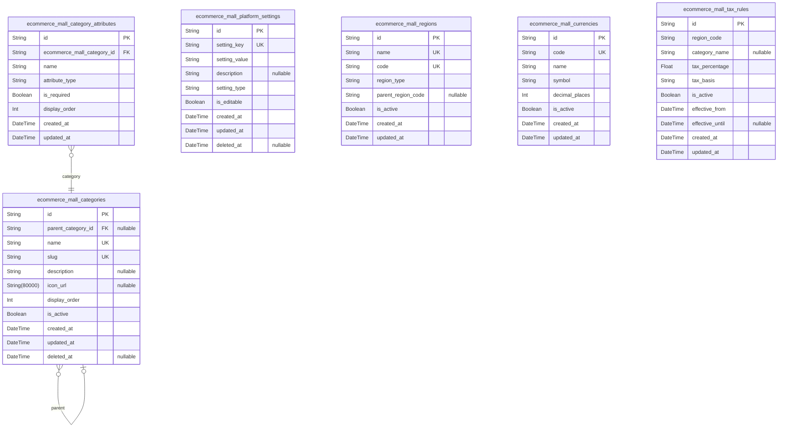
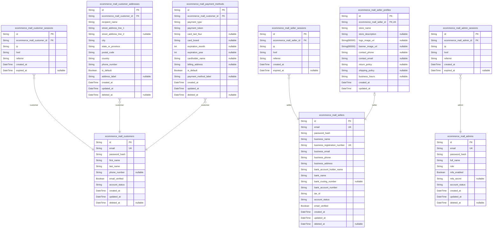
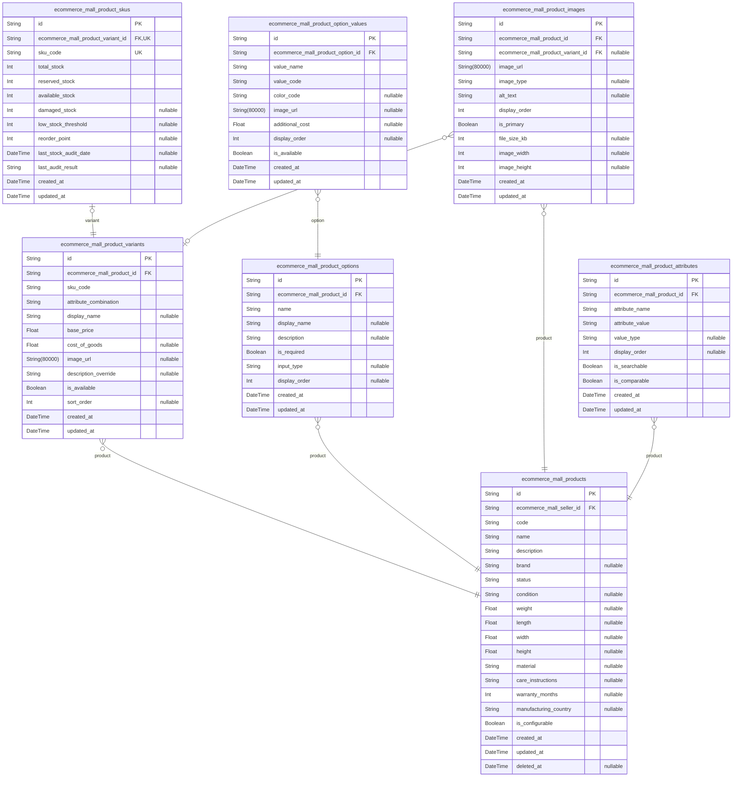
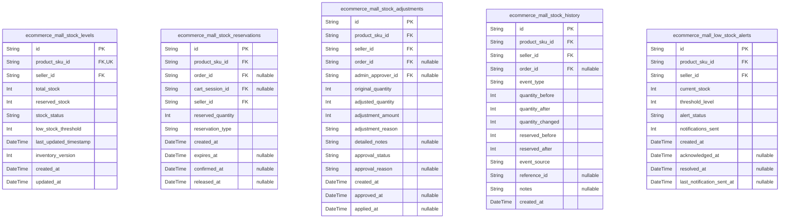
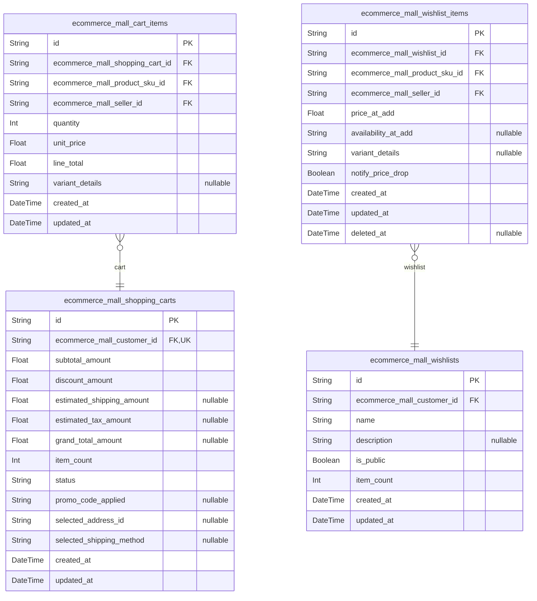
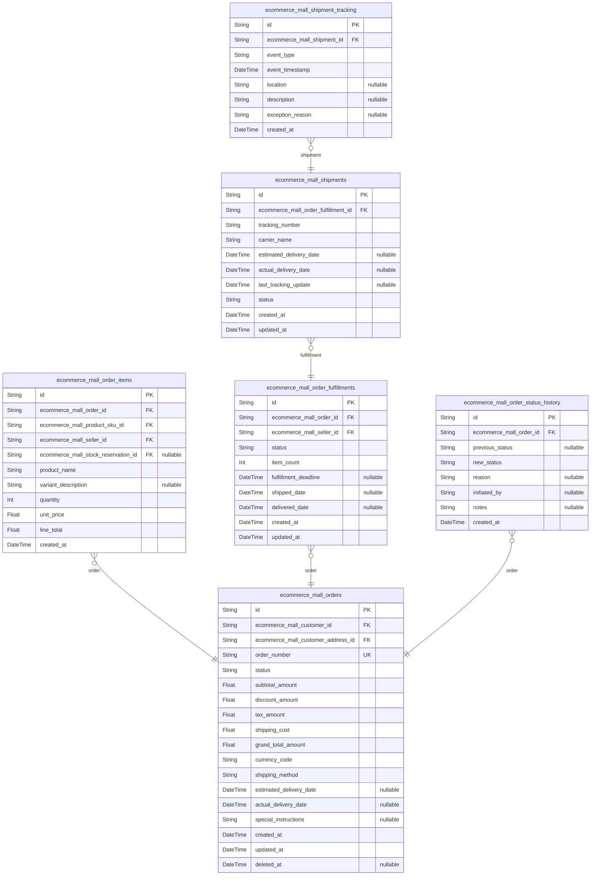
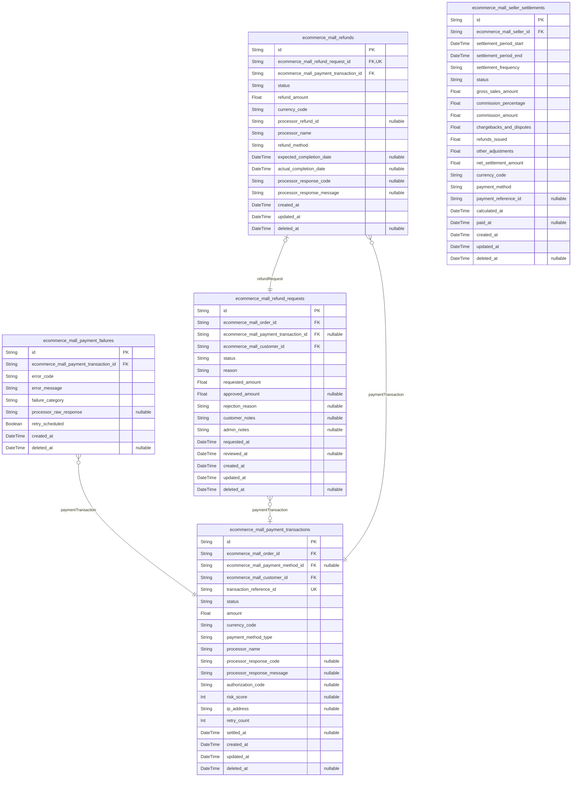
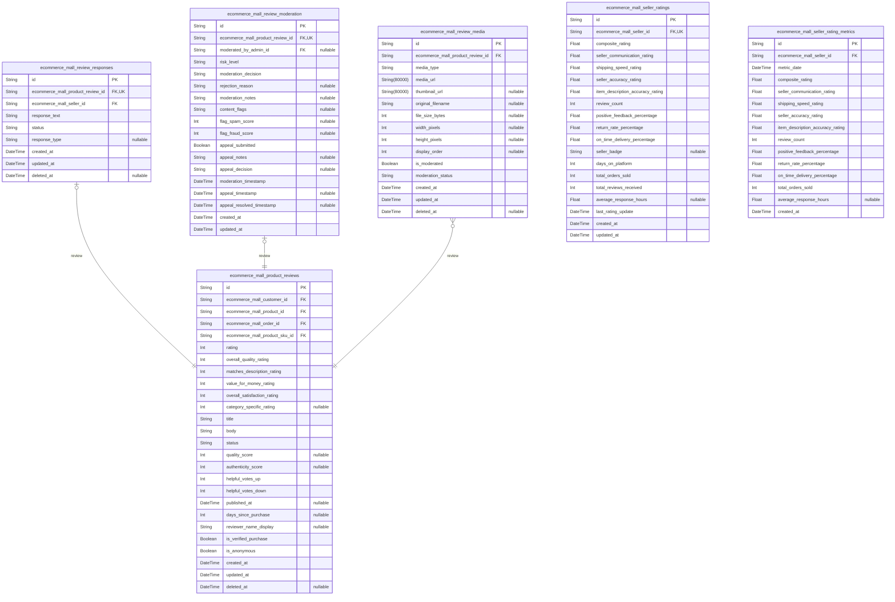
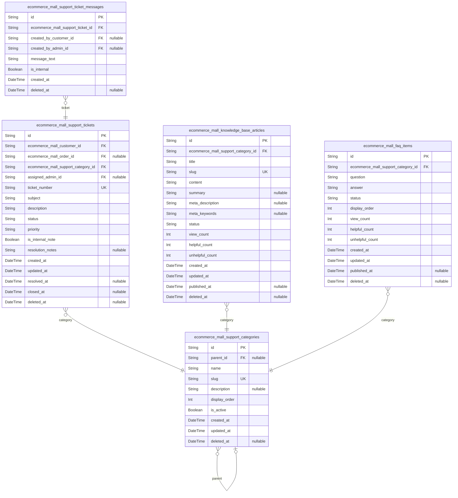
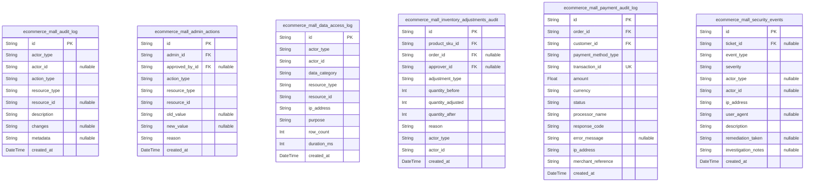

# Prisma Markdown

> Generated by [`prisma-markdown`](https://github.com/samchon/prisma-markdown)

- [Systematic](#systematic)
- [Actors](#actors)
- [Products](#products)
- [Inventory](#inventory)
- [Shopping](#shopping)
- [Orders](#orders)
- [Payments](#payments)
- [Reviews](#reviews)
- [Support](#support)
- [Analytics](#analytics)
- [Audit](#audit)

## Systematic

```mermaid
erDiagram
"ecommerce_mall_categories" {
  String id PK
  String parent_category_id FK "nullable"
  String name UK
  String slug UK
  String description "nullable"
  String(80000) icon_url "nullable"
  Int display_order
  Boolean is_active
  DateTime created_at
  DateTime updated_at
  DateTime deleted_at "nullable"
}
"ecommerce_mall_category_attributes" {
  String id PK
  String ecommerce_mall_category_id FK
  String name
  String attribute_type
  Boolean is_required
  Int display_order
  DateTime created_at
  DateTime updated_at
}
"ecommerce_mall_platform_settings" {
  String id PK
  String setting_key UK
  String setting_value
  String description "nullable"
  String setting_type
  Boolean is_editable
  DateTime created_at
  DateTime updated_at
  DateTime deleted_at "nullable"
}
"ecommerce_mall_regions" {
  String id PK
  String name UK
  String code UK
  String region_type
  String parent_region_code "nullable"
  Boolean is_active
  DateTime created_at
  DateTime updated_at
}
"ecommerce_mall_currencies" {
  String id PK
  String code UK
  String name
  String symbol
  Int decimal_places
  Boolean is_active
  DateTime created_at
  DateTime updated_at
}
"ecommerce_mall_tax_rules" {
  String id PK
  String region_code
  String category_name "nullable"
  Float tax_percentage
  String tax_basis
  Boolean is_active
  DateTime effective_from
  DateTime effective_until "nullable"
  DateTime created_at
  DateTime updated_at
}
"ecommerce_mall_categories" }o--o| "ecommerce_mall_categories" : parent
"ecommerce_mall_category_attributes" }o--|| "ecommerce_mall_categories" : category
```

### `ecommerce_mall_categories`

Product category taxonomy and hierarchical structure for organizing
products. Categories provide the foundational organization system that
sellers use to classify products and customers use for browsing and
navigation. The category system supports multi-level hierarchies where
categories can have parent categories, enabling flexible organizational
structures from broad top-level categories down to specific product
types. Each category defines attributes that products in that category
must or optionally provide, ensuring consistent product information at
the database level.

Properties as follows:

- `id`: Primary Key.
- `parent_category_id`
  > Optional parent category for hierarchical organization. Enables
  > multi-level category structure where each category can have a parent
  > category. Self-referencing relationship to ecommerce_mall_categories.
  > Null for top-level categories.
- `name`
  > Category name displayed to customers and sellers. Must be unique within
  > the platform. Examples: Electronics, Clothing, Home & Garden.
- `slug`
  > URL-friendly slug for the category used in category pages. Generated from
  > category name, lowercase with hyphens. Example: home-and-garden.
- `description`
  > Detailed description of the category explaining what products it
  > contains. Displayed on category pages to help customers understand
  > category scope.
- `icon_url`
  > URL to icon or image representing the category. Displayed in category
  > navigation and category pages for visual identification.
- `display_order`
  > Sort order for displaying categories in navigation menus and category
  > lists. Lower numbers appear first. Allows admins to customize category
  > display order.
- `is_active`
  > Whether the category is visible to customers. Inactive categories are
  > hidden from browsing but existing products remain in the system. Allows
  > temporarily disabling categories without data deletion.
- `created_at`
  > Timestamp when the category was created. Used for audit trail and
  > category age tracking.
- `updated_at`
  > Timestamp of the last update to the category. Tracks when category
  > information was last modified.
- `deleted_at`
  > Soft delete timestamp. When set, category is considered deleted but data
  > is retained for compliance and historical purposes. Used for soft
  > deletion allowing data recovery.

### `ecommerce_mall_category_attributes`

Attribute specifications for product categories. Each category can define
required and optional attributes that products must provide (e.g.,
apparel requires size, color; electronics requires specifications,
warranty). Category attributes establish consistency expectations for
products in each category, enabling structured product information
capture and display. Attributes defined here are enforced when sellers
create products in these categories.

Properties as follows:

- `id`: Primary Key.
- `ecommerce_mall_category_id`
  > The category this attribute belongs to. Links to
  > ecommerce_mall_categories.id. Cannot be changed after creation.
- `name`
  > Attribute name that sellers provide values for. Examples: Color, Size,
  > Material, Warranty Period, Specifications.
- `attribute_type`
  > Data type for the attribute value: text (free text input), select
  > (predefined options), multiselect (multiple options), number, boolean.
  > Determines how sellers input values for this attribute.
- `is_required`
  > Whether sellers must provide a value for this attribute when creating
  > products in this category. Required attributes must have values; optional
  > attributes can be left empty.
- `display_order`
  > Display order for attributes in the product creation form. Lower numbers
  > appear first, organizing the form for better user experience.
- `created_at`: Timestamp when the attribute was defined. Used for audit trail.
- `updated_at`: Timestamp of last update to the attribute definition.

### `ecommerce_mall_platform_settings`

System-wide configuration settings that control platform behavior and
policies. Platform settings define defaults for commissions, return
windows, payment methods, notification preferences, feature flags, and
other system-wide parameters. Admin users modify these settings to
configure platform behavior without code changes. Settings are referenced
by multiple systems (order processing, refund handling, payment
processing) to enforce consistent policies across the platform.

Properties as follows:

- `id`: Primary Key.
- `setting_key`
  > Unique identifier for the setting. Examples: default_commission_rate,
  > return_window_days, payment_retry_attempts, platform_name, support_email.
  > Used as lookup key when retrieving setting values.
- `setting_value`
  > The configuration value for the setting. Stored as string and converted
  > to appropriate type (number, boolean, etc.) by application code.
  > Examples: 15, 30, 5, ecommercemall@company.com.
- `description`
  > Human-readable description explaining what this setting controls and how
  > it affects platform behavior. Displayed in admin configuration UI to
  > guide admins in setting values.
- `setting_type`
  > Data type for the setting: string, integer, decimal, boolean, email, url.
  > Indicates how the value should be interpreted and validated by the
  > application.
- `is_editable`
  > Whether admins can modify this setting through the admin panel. Core
  > system settings may be read-only to prevent misconfiguration. Editable
  > settings can be changed by authorized admins.
- `created_at`: Timestamp when the setting was created. Used for audit trail.
- `updated_at`
  > Timestamp of last update to the setting value. Tracks when configuration
  > was last changed.
- `deleted_at`
  > Soft delete timestamp. Allows settings to be archived without deletion.
  > Deleted settings are not used but data is retained for compliance.

### `ecommerce_mall_regions`

Geographic regions supported by the platform for shipping, tax, and
currency operations. Regions represent distinct geographic areas
(countries, states, provinces) where the platform operates and where
specific shipping methods, tax rules, and currencies apply. Regions are
referenced when calculating shipping costs, applying taxes, and
displaying region-specific information. The platform uses regions to
determine which shipping carriers serve an address and which tax rules
apply.

Properties as follows:

- `id`: Primary Key.
- `name`
  > Region name displayed in dropdowns and configuration. Examples: United
  > States, California, United Kingdom, Japan. Unique within the platform.
- `code`
  > Standardized code for the region. Uses ISO 3166-1 alpha-2 for countries
  > (US, GB, JP) or ISO 3166-2 for states (US-CA, US-TX). Used for lookups
  > and integrations.
- `region_type`
  > Type of region: country or state/province. Indicates the hierarchical
  > level. Used for organizing regions and determining shipping zone
  > calculations.
- `parent_region_code`
  > For states/provinces, the country code of the parent country. Enables
  > hierarchical organization (e.g., CA region's parent is US). For
  > countries, null.
- `is_active`
  > Whether the region is available for operations (shipping, tax
  > calculations). Inactive regions are not presented to customers as
  > shipping destinations or tax jurisdictions.
- `created_at`: Timestamp when the region was added to the system. Used for audit trail.
- `updated_at`: Timestamp of last update to region configuration.

### `ecommerce_mall_currencies`

Currencies supported by the platform for pricing and payment processing.
Each currency represents a specific monetary unit (USD, EUR, GBP, JPY,
etc.) that the platform uses for displaying prices, calculating totals,
and processing payments. Currencies are associated with regions (USD for
US, EUR for EU countries, GBP for UK) to determine which currencies
customers see when shopping. The platform uses currency records to format
prices correctly and convert between currencies for international orders.

Properties as follows:

- `id`: Primary Key.
- `code`
  > ISO 4217 currency code (3 characters). Examples: USD (US Dollar), EUR
  > (Euro), GBP (British Pound), JPY (Japanese Yen). Unique identifier for
  > the currency.
- `name`
  > Full currency name for display in user interfaces. Examples: US Dollar,
  > Euro, British Pound, Japanese Yen.
- `symbol`
  > Currency symbol for displaying prices. Examples: $ for USD, € for EUR, £
  > for GBP, ¥ for JPY. Used in price formatting for customer display.
- `decimal_places`
  > Number of decimal places for this currency. Most currencies use 2 (USD,
  > EUR = $19.99), some use 0 (JPY = ¥1999), some use 3 (KWD = د.ك 19.999).
  > Used for price rounding and formatting.
- `is_active`
  > Whether the currency is currently available for transactions and display.
  > Inactive currencies are not presented to customers but existing prices in
  > that currency are preserved for historical records.
- `created_at`
  > Timestamp when the currency was added to the platform. Used for audit
  > trail.
- `updated_at`: Timestamp of last update to currency configuration.

### `ecommerce_mall_tax_rules`

Tax calculation rules that apply to orders based on shipping destination
and product category. Tax rules define the percentage of tax to apply and
the conditions under which they apply (which region, which product
category, base amount calculation). The platform uses tax rules to
automatically calculate tax amounts during checkout based on the
customer's shipping address and the products they're purchasing. Tax
rules can be region-specific (different tax rates for different
countries/states) and may vary by product category.

Properties as follows:

- `id`: Primary Key.
- `region_code`
  > Region code (e.g., US, US-CA, GB) that this tax rule applies to. The tax
  > rate specified applies when the customer's shipping address is in this
  > region. Must match a region code in ecommerce_mall_regions table.
- `category_name`
  > Product category this tax rule applies to. If null, the rule applies to
  > all categories (default tax rate). If specified, applies only to products
  > in that category. Enables category-specific tax rates (e.g., groceries
  > may be tax-exempt).
- `tax_percentage`
  > The tax rate as a percentage (0-100). Examples: 8.5 for 8.5%, 0 for
  > tax-exempt, 20 for 20% VAT. Stored as decimal for accurate calculations.
- `tax_basis`
  > What the tax percentage applies to: subtotal (merchandise only),
  > subtotal_with_shipping (includes shipping cost), or gross (after
  > discounts). Determines how tax is calculated for orders in this
  > jurisdiction.
- `is_active`
  > Whether this tax rule is currently applied during tax calculations.
  > Inactive rules are not used but are retained for historical reference and
  > potential reactivation.
- `effective_from`
  > Date when this tax rule becomes effective. Used for tracking tax law
  > changes. Orders after this date use this rule; orders before may use
  > older rules.
- `effective_until`
  > Date when this tax rule expires. When set, the rule is no longer used
  > after this date. Used for temporary tax changes or seasonal variations.
  > Null means rule has no end date.
- `created_at`: Timestamp when the tax rule was created. Used for audit trail.
- `updated_at`: Timestamp of last update to the tax rule.

## Actors

```mermaid
erDiagram
"ecommerce_mall_customers" {
  String id PK
  String email UK
  String password_hash
  String first_name
  String last_name
  String phone_number "nullable"
  Boolean email_verified
  String account_status
  DateTime created_at
  DateTime updated_at
  DateTime deleted_at "nullable"
}
"ecommerce_mall_customer_sessions" {
  String id PK
  String ecommerce_mall_customer_id FK
  String ip
  String href
  String referrer
  DateTime created_at
  DateTime expired_at "nullable"
}
"ecommerce_mall_sellers" {
  String id PK
  String email UK
  String password_hash
  String business_name
  String business_registration_number UK
  String business_email
  String business_phone
  String business_address
  String bank_account_holder_name
  String bank_name
  String bank_routing_number "nullable"
  String bank_account_number
  String tax_id
  String account_status
  Boolean email_verified
  DateTime created_at
  DateTime updated_at
  DateTime deleted_at "nullable"
}
"ecommerce_mall_seller_sessions" {
  String id PK
  String ecommerce_mall_seller_id FK
  String ip
  String href
  String referrer
  DateTime created_at
  DateTime expired_at "nullable"
}
"ecommerce_mall_admins" {
  String id PK
  String email UK
  String password_hash
  String full_name
  String role
  Boolean mfa_enabled
  String mfa_secret "nullable"
  String account_status
  DateTime created_at
  DateTime updated_at
  DateTime deleted_at "nullable"
}
"ecommerce_mall_admin_sessions" {
  String id PK
  String ecommerce_mall_admin_id FK
  String ip
  String href
  String referrer
  DateTime created_at
  DateTime expired_at "nullable"
}
"ecommerce_mall_customer_addresses" {
  String id PK
  String ecommerce_mall_customer_id FK
  String recipient_name
  String street_address_line_1
  String street_address_line_2 "nullable"
  String city
  String state_or_province
  String postal_code
  String country
  String phone_number
  Boolean is_default
  String address_label "nullable"
  DateTime created_at
  DateTime updated_at
  DateTime deleted_at "nullable"
}
"ecommerce_mall_seller_profiles" {
  String id PK
  String ecommerce_mall_seller_id FK,UK
  String store_name
  String store_description "nullable"
  String(80000) logo_image_url "nullable"
  String(80000) banner_image_url "nullable"
  String contact_phone "nullable"
  String contact_email "nullable"
  String return_policy "nullable"
  String shipping_policy "nullable"
  String business_hours "nullable"
  DateTime created_at
  DateTime updated_at
}
"ecommerce_mall_payment_methods" {
  String id PK
  String ecommerce_mall_customer_id FK
  String payment_type
  String payment_token
  String card_last_four "nullable"
  String card_brand "nullable"
  Int expiration_month "nullable"
  Int expiration_year "nullable"
  String cardholder_name "nullable"
  String billing_address "nullable"
  Boolean is_default
  String payment_method_label "nullable"
  DateTime created_at
  DateTime updated_at
  DateTime deleted_at "nullable"
}
"ecommerce_mall_customer_sessions" }o--|| "ecommerce_mall_customers" : customer
"ecommerce_mall_seller_sessions" }o--|| "ecommerce_mall_sellers" : seller
"ecommerce_mall_admin_sessions" }o--|| "ecommerce_mall_admins" : admin
"ecommerce_mall_customer_addresses" }o--|| "ecommerce_mall_customers" : customer
"ecommerce_mall_seller_profiles" |o--|| "ecommerce_mall_sellers" : seller
"ecommerce_mall_payment_methods" }o--|| "ecommerce_mall_customers" : customer
```

### `ecommerce_mall_customers`

Registered customer accounts for the e-commerce platform. Customers are
authenticated users who can browse products, manage shopping carts, place
orders, and interact with the marketplace through reviews and wishlists.

Each customer account is created through self-registration with email
verification. The account stores authentication credentials (hashed
password), profile information, and account status tracking. Customer
accounts are linked to multiple addresses, payment methods, orders, and
sessions for multi-device support.

Soft deletion is supported to maintain audit trails while allowing
account recovery. Account status transitions from pending_verification →
active → suspended/deactivated as needed.

Properties as follows:

- `id`: Primary Key.
- `email`
  > Customer's email address used for authentication and communication. Must
  > be unique across all customers. Email verification required before
  > account activation.
- `password_hash`
  > Hashed password using bcrypt (work factor 12). Never stores plain text
  > passwords. Used for login authentication and password reset
  > functionality.
- `first_name`
  > Customer's first name. Minimum 2 characters, maximum 50 characters. Used
  > for personalization and order communication.
- `last_name`
  > Customer's last name. Minimum 2 characters, maximum 50 characters. Used
  > for personalization and order communication.
- `phone_number`
  > Customer's phone number for order coordination and customer support.
  > Optional field, customer can add/update during account setup or checkout.
- `email_verified`
  > Whether the customer's email address has been verified. Customers must
  > verify email before placing orders. Set to true only after clicking
  > verification link.
- `account_status`
  > Current account status. Valid values: pending_verification (awaiting
  > email verification), active (verified and able to purchase), suspended
  > (temporarily disabled by admin), deactivated (voluntarily paused by
  > customer). Defaults to pending_verification.
- `created_at`
  > Timestamp of account creation. Set when customer completes initial
  > registration form.
- `updated_at`
  > Timestamp of last account modification. Updated whenever customer
  > profile, password, or settings are changed.
- `deleted_at`
  > Soft delete timestamp. Set when customer requests account deletion. NULL
  > means account is active. Allows account recovery and maintains audit
  > trail.

### `ecommerce_mall_customer_sessions`

Authentication sessions for customer users. Each session represents a
login instance on a specific device/browser. Sessions store connection
context (IP, URL, referrer) and track session lifecycle from creation to
expiration.

Customers can maintain multiple concurrent sessions across different
devices. Each session is identified by a unique ID and tracks the
authenticated customer. Sessions expire after extended inactivity,
forcing re-authentication. Session creation automatically occurs on
successful login. Session expiration can be triggered by logout, browser
close, or inactivity timeout.

Session data is used for security monitoring (detect unusual access
patterns), audit logging (track user actions per session), and device
management (customers can view and revoke sessions from specific
devices).

Properties as follows:

- `id`: Primary Key.
- `ecommerce_mall_customer_id`
  > Foreign key referencing the authenticated customer. Each session belongs
  > to exactly one customer. Relationship is many-to-one (customer can have
  > multiple sessions). [ecommerce_mall_customers.id](#ecommerce_mall_customers)
- `ip`
  > IP address of the device/network creating this session. Used for security
  > monitoring (detect suspicious geographic changes, multiple simultaneous
  > logins from different IPs).
- `href`
  > URL/href where the session was created. Captures the entry point to the
  > application (homepage, product page, checkout, etc.).
- `referrer`
  > HTTP referrer URL indicating how customer arrived at the platform
  > (direct, search engine, social media, email link, etc.). Used for
  > marketing attribution and traffic analysis.
- `created_at`
  > Session creation timestamp (when customer logged in). UTC timezone. Used
  > for session age tracking and SLA monitoring.
- `expired_at`
  > Session expiration timestamp (when customer logged out or session was
  > terminated). NULL means session is still active. Set to current timestamp
  > when session expires due to inactivity or explicit logout.

### `ecommerce_mall_sellers`

Registered seller/merchant accounts on the marketplace. Sellers are
independent business entities that create stores, manage product
catalogs, process orders, and track sales performance.

Each seller account is created through business registration requiring
business information (name, registration number), contact details, and
banking information for commission settlements. Sellers must complete
verification (typically 5 business days) before they can list products.

Seller accounts track account status (pending_verification, active,
suspended, deactivated, rejected) and support soft deletion. Sellers have
their own authentication sessions, separate store profiles, and linked
payment settlement records. Seller ratings are calculated from customer
feedback across all their orders.

Properties as follows:

- `id`: Primary Key.
- `email`
  > Seller's business email address used for authentication and official
  > communication. Must be unique across all sellers. Email verification
  > required during registration process.
- `password_hash`
  > Hashed password using bcrypt (work factor 12). Used for seller dashboard
  > login. Never stored in plain text.
- `business_name`
  > Official business name for the seller. Used for store branding and legal
  > identification. Displayed prominently on seller's storefront.
- `business_registration_number`
  > Business registration or tax identification number from business
  > registration authority. Verified during seller application. Used for
  > legal compliance and commission calculations.
- `business_email`
  > Official business email address (may differ from login email). Used for
  > formal communications, notifications, and official documents.
- `business_phone`
  > Business phone number for platform communication and order coordination.
  > Required for contacting seller regarding account, operations, or
  > disputes.
- `business_address`
  > Physical business address (street, city, postal code, country). Used for
  > verification, compliance, and legal identification.
- `bank_account_holder_name`
  > Name on bank account for commission payments. Must match bank records
  > exactly for settlement transfers to succeed.
- `bank_name`
  > Name of the bank where seller's account is held. Used for identifying
  > bank for international transfers and verification.
- `bank_routing_number`
  > Routing number for bank transfers (US format) or equivalent for other
  > countries. Required for direct deposit settlement payments.
- `bank_account_number`
  > Bank account number for receiving commission payments. Encrypted before
  > storage. Used for automated settlement transfers.
- `tax_id`
  > Tax identification number for the seller's jurisdiction. Used for
  > compliance, tax reporting, and 1099 form generation.
- `account_status`
  > Current seller account status. Valid values: pending_verification
  > (awaiting business verification), active (verified and can list
  > products), suspended (temporarily disabled by admin, no new listings or
  > orders), deactivated (voluntarily paused by seller), rejected
  > (application rejected). Defaults to pending_verification.
- `email_verified`
  > Whether the seller's email has been verified. Required before seller can
  > list products. Set to true after email verification link is clicked.
- `created_at`
  > Timestamp when seller application was submitted. Marks the start of
  > verification process.
- `updated_at`
  > Timestamp of last account modification (status changes, banking info
  > updates, profile changes).
- `deleted_at`
  > Soft delete timestamp. Set when seller requests account closure. NULL
  > means account is active. Allows account recovery and maintains
  > order/transaction history.

### `ecommerce_mall_seller_sessions`

Authentication sessions for seller users. Each session represents a login
instance from a seller on a specific device/browser. Sessions store
connection context (IP address, URL, referrer) and track session state.

Sellers can maintain multiple concurrent sessions across different
devices and browsers. Each session tracks the authenticated seller and
records connection metadata for security monitoring and audit purposes.

Session data enables: security monitoring (detect unusual access patterns
from unexpected locations), device management (sellers can view active
sessions and revoke access from specific devices), and audit logging
(track seller actions per session for compliance).

Properties as follows:

- `id`: Primary Key.
- `ecommerce_mall_seller_id`
  > Foreign key referencing the authenticated seller. Each session belongs to
  > exactly one seller. Relationship is many-to-one (seller can have multiple
  > concurrent sessions). [ecommerce_mall_sellers.id](#ecommerce_mall_sellers)
- `ip`
  > IP address of the device/network initiating this session. Used for
  > security monitoring (detect logins from unusual locations or multiple
  > concurrent locations).
- `href`
  > URL/href where the session was created. Captures the entry point
  > (dashboard, product management, orders, analytics, etc.).
- `referrer`
  > HTTP referrer URL showing how seller arrived at the platform (direct
  > access, email link, bookmark, etc.).
- `created_at`
  > Session creation timestamp (when seller logged in). UTC timezone. Used
  > for session age tracking and SLA monitoring.
- `expired_at`
  > Session expiration timestamp (when seller logged out or session was
  > terminated). NULL means session is still active. Set to current timestamp
  > when session expires.

### `ecommerce_mall_admins`

System administrator accounts with elevated permissions for platform
oversight and management. Admins have full access to user management,
order management, product oversight, dispute resolution, analytics, and
system configuration.

Unlike customer and seller accounts which are created through public
registration, admin accounts are created internally by system owners or
existing admins. Admin accounts require multi-factor authentication (MFA)
for enhanced security due to elevated privileges.

Admin authentication uses separate admin-only sessions. Admins cannot
simultaneously operate as customers or sellers (separate account types).
All admin actions are fully logged in audit trails for compliance and
security purposes.

Properties as follows:

- `id`: Primary Key.
- `email`
  > Admin's email address used for authentication and official communication.
  > Must be unique across all admins. Verified during admin account creation.
- `password_hash`
  > Hashed password using bcrypt (work factor 12). Admin passwords must meet
  > high complexity requirements (minimum 16 characters with mixed case,
  > numbers, special characters). Never stored in plain text.
- `full_name`
  > Admin's full name. Used for admin action logging and audit trails to
  > identify who performed each action.
- `role`
  > Admin role designation. Valid values: super_admin (full platform access),
  > operations_admin (order/customer management), product_admin (product
  > catalog oversight), seller_admin (seller account management),
  > analytics_admin (reporting only). Defines permission scope.
- `mfa_enabled`
  > Whether multi-factor authentication is enabled for this admin account.
  > Required for all admin accounts. Admin must provide MFA code (TOTP) in
  > addition to password during login.
- `mfa_secret`
  > Encrypted TOTP secret for multi-factor authentication. Used to generate
  > time-based one-time passwords for login. Encrypted before storage for
  > security.
- `account_status`
  > Current account status. Valid values: active (can login), deactivated
  > (disabled by system owner). Admins cannot suspend their own accounts
  > (prevents accidental lockout).
- `created_at`
  > Timestamp when admin account was created. Set by system owner or existing
  > admin during account creation.
- `updated_at`
  > Timestamp of last account modification (password changes, role changes,
  > MFA updates).
- `deleted_at`
  > Soft delete timestamp. Set when admin account is deactivated. NULL means
  > account is active. Allows account recovery.

### `ecommerce_mall_admin_sessions`

Authentication sessions for admin users. Each session represents an
authenticated admin login on a specific device/browser. Sessions store
connection context (IP, URL, referrer) and track session lifecycle.

Admin sessions are monitored more strictly than regular user sessions for
security. Unusual access patterns (logins from unexpected locations,
multiple simultaneous logins from different countries, unusual times)
trigger security alerts and may require additional verification.

Each admin session is tied to a specific admin user and records
connection metadata for comprehensive audit logging of all admin
activities on the platform.

Properties as follows:

- `id`: Primary Key.
- `ecommerce_mall_admin_id`
  > Foreign key referencing the authenticated admin. Each session belongs to
  > exactly one admin. Relationship is many-to-one (admin can have multiple
  > concurrent sessions). [ecommerce_mall_admins.id](#ecommerce_mall_admins)
- `ip`
  > IP address of the device/network accessing the admin panel. Used for
  > security monitoring (detect unusual geographic locations, rate limiting,
  > suspicious access patterns).
- `href`
  > URL/href where the admin panel session was initiated. Captures entry
  > point to admin system.
- `referrer`
  > HTTP referrer URL showing how admin accessed the platform (direct link,
  > bookmark, email notification, etc.).
- `created_at`
  > Session creation timestamp (when admin logged into admin panel). UTC
  > timezone. Used for session age tracking and security monitoring.
- `expired_at`
  > Session expiration timestamp (when admin logged out or session was
  > terminated). NULL means session is still active. Admin sessions have
  > shorter timeout (30 minutes) than customer sessions.

### `ecommerce_mall_customer_addresses`

Delivery addresses associated with customer accounts. Customers can save
multiple addresses and select one during checkout for order delivery.

Each address is linked to a specific customer and includes complete
delivery information (street, city, postal code, country) plus contact
details (phone number). Addresses are not independently managed - they
are managed through the customer's account address management interface.

One address can be marked as the customer's default address for faster
checkout. Addresses cannot be deleted if currently associated with active
orders (awaiting fulfillment or delivery). Soft deletion preserves
address history after completion of all associated orders.

Properties as follows:

- `id`: Primary Key.
- `ecommerce_mall_customer_id`
  > Foreign key referencing the customer who owns this address. Each address
  > belongs to exactly one customer. Relationship is many-to-one (customer
  > can have multiple addresses). [ecommerce_mall_customers.id](#ecommerce_mall_customers)
- `recipient_name`
  > Name of the person receiving the delivery at this address. Used on
  > shipping labels and delivery instructions.
- `street_address_line_1`
  > Primary street address (house number and street name). Required for all
  > addresses.
- `street_address_line_2`
  > Secondary street address information (apartment number, suite, building
  > name, etc.). Optional for addresses that don't have additional location
  > information.
- `city`: City or municipality name where the address is located.
- `state_or_province`
  > State, province, or region name. Used for tax calculation and shipping
  > routing.
- `postal_code`
  > Postal code or ZIP code. Format varies by country. Validated for correct
  > format based on selected country.
- `country`
  > Country name or country code. Determines tax rules, shipping options, and
  > currency. Validates that seller ships to this country.
- `phone_number`
  > Contact phone number for the delivery address. Used by shipping carrier
  > for delivery coordination if needed (e.g., to confirm door access).
- `is_default`
  > Whether this is the customer's default address for checkout. Only one
  > address per customer can be marked as default. When customer places
  > order, default address is pre-selected for speed.
- `address_label`
  > Customer-defined label for this address (e.g., 'Home', 'Work', 'Parent's
  > House'). Helps customer identify addresses quickly when managing multiple
  > saved addresses.
- `created_at`: Timestamp when address was added to customer's account.
- `updated_at`
  > Timestamp of last address modification (correcting typo, updating
  > apartment number, etc.).
- `deleted_at`
  > Soft delete timestamp. Set when customer deletes address from their
  > account. NULL means address is active. Allows recovery if customer needs
  > address back.

### `ecommerce_mall_seller_profiles`

Store profile information for sellers. Each seller has exactly one
profile storing their storefront branding, description, and
store-specific policies.

The seller profile contains the public-facing information displayed to
customers visiting the seller's store page, including store name,
description, logo/banner images, and contact information. Store policies
(return policy, refund policy, shipping policy) are stored here and
displayed to customers before purchase.

Profile information is managed by the seller through their dashboard and
updated immediately (within 2 minutes) for customer visibility.

Properties as follows:

- `id`: Primary Key.
- `ecommerce_mall_seller_id`
  > Foreign key referencing the seller who owns this profile. Each seller has
  > exactly one profile. One-to-one relationship with ecommerce_mall_sellers.
  > [ecommerce_mall_sellers.id](#ecommerce_mall_sellers)
- `store_name`
  > Public display name for the seller's store. Used on storefront, in search
  > results, and in product listings. Can differ from business legal name for
  > branding purposes.
- `store_description`
  > Detailed description of the store, products, and seller's business.
  > Displayed on store homepage. 500-2000 characters. Optional field allowing
  > seller to tell their story.
- `logo_image_url`
  > URL to store logo image (200x200px recommended, max 2MB). Displayed in
  > store header and in product listings. Optional - store can operate
  > without logo.
- `banner_image_url`
  > URL to store banner/header image (1200x300px recommended, max 5MB).
  > Displayed at top of store page for branding. Optional field.
- `contact_phone`
  > Public phone number for customers to contact the seller. Optional -
  > seller may prefer email/messaging only.
- `contact_email`
  > Public email address for customer inquiries. Can differ from business
  > email for customer-facing communications.
- `return_policy`
  > Seller's return and refund policy displayed to customers. Specifies
  > return window (days), restocking fees if any, condition requirements, and
  > exclusions. 500-2000 characters.
- `shipping_policy`
  > Seller's shipping policy including processing time, available shipping
  > methods, and any regional restrictions. Displayed during checkout.
  > 500-2000 characters.
- `business_hours`
  > Seller's operating hours (e.g., 'Mon-Fri 9am-5pm EST'). Displayed on
  > store page and helps set customer expectations for response times.
- `created_at`
  > Timestamp when seller profile was created (typically when seller account
  > was created).
- `updated_at`: Timestamp of last profile update (when seller edited store information).

### `ecommerce_mall_payment_methods`

Saved payment methods (credit cards, debit cards, digital wallets) for
customer accounts. Customers can save multiple payment methods and select
one during checkout for transaction processing.

Payment method information is tokenized - the system never stores full
credit card numbers, CVV codes, or complete payment card data. Instead,
tokenized references are stored for compliance with PCI DSS requirements.
Customers can manage their saved payment methods, set a default method
for faster checkout, and delete methods they no longer use.

Payment methods are primary entities requiring independent CRUD
operations since customers directly manage them from their account
settings.

Properties as follows:

- `id`: Primary Key.
- `ecommerce_mall_customer_id`
  > Foreign key referencing the customer who owns this payment method. Each
  > payment method belongs to exactly one customer. Relationship is
  > many-to-one (customer can have multiple payment methods). {@link
  > ecommerce_mall_customers.id}
- `payment_type`
  > Type of payment method. Valid values: credit_card, debit_card,
  > digital_wallet (Apple Pay, Google Pay), bank_transfer. Determines how
  > payment is processed and displayed to customer.
- `payment_token`
  > Tokenized reference to the actual payment method from payment processor.
  > This is a unique, non-reversible token representing the saved payment
  > method. Never exposes actual card/account numbers.
- `card_last_four`
  > Last four digits of credit/debit card number (e.g., '4242'). Displayed to
  > customer for identification. Only these digits are stored; full card
  > number is never stored.
- `card_brand`
  > Brand/issuer of the card. Valid values: visa, mastercard, amex, discover,
  > diners. Displayed in payment method list. NULL for non-card payment
  > types.
- `expiration_month`
  > Card expiration month (1-12). Used for determining if card is expired.
  > NULL for non-card payment types.
- `expiration_year`
  > Card expiration year (4-digit format, e.g., 2025). Used for determining
  > if card is expired. NULL for non-card payment types.
- `cardholder_name`
  > Name printed on the payment card. Used for verification during checkout.
  > NULL for non-card payment types.
- `billing_address`
  > Street address associated with this payment method for fraud
  > verification. Optional - some payment processors don't require this.
- `is_default`
  > Whether this is the customer's default payment method. When customer
  > checks out without explicitly selecting a payment method, the default is
  > pre-selected. Only one payment method per customer can be default.
- `payment_method_label`
  > Customer-defined label for this payment method (e.g., 'My Visa', 'Work
  > Card'). Helps customer identify methods when multiple are saved.
- `created_at`: Timestamp when payment method was added to customer's saved methods.
- `updated_at`
  > Timestamp of last modification (label change, default status change,
  > etc.).
- `deleted_at`
  > Soft delete timestamp. Set when customer removes payment method from
  > their account. NULL means payment method is active and available for
  > checkout.

## Products

```mermaid
erDiagram
"ecommerce_mall_products" {
  String id PK
  String ecommerce_mall_seller_id FK
  String code
  String name
  String description
  String brand "nullable"
  String status
  String condition "nullable"
  Float weight "nullable"
  Float length "nullable"
  Float width "nullable"
  Float height "nullable"
  String material "nullable"
  String care_instructions "nullable"
  Int warranty_months "nullable"
  String manufacturing_country "nullable"
  Boolean is_configurable
  DateTime created_at
  DateTime updated_at
  DateTime deleted_at "nullable"
}
"ecommerce_mall_product_variants" {
  String id PK
  String ecommerce_mall_product_id FK
  String sku_code
  String attribute_combination
  String display_name "nullable"
  Float base_price
  Float cost_of_goods "nullable"
  String(80000) image_url "nullable"
  String description_override "nullable"
  Boolean is_available
  Int sort_order "nullable"
  DateTime created_at
  DateTime updated_at
}
"ecommerce_mall_product_skus" {
  String id PK
  String ecommerce_mall_product_variant_id FK,UK
  String sku_code UK
  Int total_stock
  Int reserved_stock
  Int available_stock
  Int damaged_stock "nullable"
  Int low_stock_threshold "nullable"
  Int reorder_point "nullable"
  DateTime last_stock_audit_date "nullable"
  String last_audit_result "nullable"
  DateTime created_at
  DateTime updated_at
}
"ecommerce_mall_product_options" {
  String id PK
  String ecommerce_mall_product_id FK
  String name
  String display_name "nullable"
  String description "nullable"
  Boolean is_required
  String input_type "nullable"
  Int display_order "nullable"
  DateTime created_at
  DateTime updated_at
}
"ecommerce_mall_product_option_values" {
  String id PK
  String ecommerce_mall_product_option_id FK
  String value_name
  String value_code
  String color_code "nullable"
  String(80000) image_url "nullable"
  Float additional_cost "nullable"
  Int display_order "nullable"
  Boolean is_available
  DateTime created_at
  DateTime updated_at
}
"ecommerce_mall_product_images" {
  String id PK
  String ecommerce_mall_product_id FK
  String ecommerce_mall_product_variant_id FK "nullable"
  String(80000) image_url
  String image_type "nullable"
  String alt_text "nullable"
  Int display_order
  Boolean is_primary
  Int file_size_kb "nullable"
  Int image_width "nullable"
  Int image_height "nullable"
  DateTime created_at
  DateTime updated_at
}
"ecommerce_mall_product_attributes" {
  String id PK
  String ecommerce_mall_product_id FK
  String attribute_name
  String attribute_value
  String value_type "nullable"
  Int display_order "nullable"
  Boolean is_searchable
  Boolean is_comparable
  DateTime created_at
  DateTime updated_at
}
"ecommerce_mall_product_variants" }o--|| "ecommerce_mall_products" : product
"ecommerce_mall_product_skus" |o--|| "ecommerce_mall_product_variants" : variant
"ecommerce_mall_product_options" }o--|| "ecommerce_mall_products" : product
"ecommerce_mall_product_option_values" }o--|| "ecommerce_mall_product_options" : option
"ecommerce_mall_product_images" }o--|| "ecommerce_mall_products" : product
"ecommerce_mall_product_images" }o--o| "ecommerce_mall_product_variants" : variant
"ecommerce_mall_product_attributes" }o--|| "ecommerce_mall_products" : product
```

### `ecommerce_mall_products`

Core product catalog entities representing logical product groupings.

Products serve as the parent entity for all product variants and contain
general product information shared across all configurations. Each
product is owned and managed by exactly one seller and belongs to one or
more product categories. Products maintain complete lifecycle management
through status tracking (draft, published, unpublished, archived)
enabling sellers to control visibility and availability.

The product entity stores product-level information that applies
uniformly across all variants, including descriptions, manufacturer
details, and general specifications. Product-specific images and
attributes are linked through separate related tables, enabling granular
media and specification management.

Soft deletion is supported through the deleted_at timestamp, preserving
product history for compliance and analytics while removing products from
active visibility. Products are indexed by seller for efficient dashboard
operations and by category for catalog organization.

Properties as follows:

- `id`: Primary Key.
- `ecommerce_mall_seller_id`
  > Seller who owns and manages this product. {@link
  > ecommerce_mall_sellers.id}
- `code`
  > Seller-defined product SKU code for inventory reference. Unique per
  > seller within category.
- `name`
  > Product name displayed to customers. 100-255 characters, unique per
  > seller per category.
- `description`
  > Detailed product description with formatting support (500-5000
  > characters). Includes features, benefits, care instructions, and
  > specifications.
- `brand`: Product brand or manufacturer name for categorization and filtering.
- `status`
  > Product lifecycle status: draft (unpublished), published (visible),
  > unpublished (hidden temporarily), archived (retired). Controls customer
  > visibility and purchase availability.
- `condition`
  > Product condition: New, Like New, Refurbished, Used. Indicates product
  > quality and origin.
- `weight`
  > Product weight in kilograms for shipping calculations. Required for
  > accurate rate quotes.
- `length`: Product length in centimeters for shipping and packaging dimensions.
- `width`: Product width in centimeters for shipping and packaging dimensions.
- `height`: Product height in centimeters for shipping and packaging dimensions.
- `material`
  > Primary material composition (textile, plastic, metal, wood, etc.). Used
  > for filtering and category-specific requirements.
- `care_instructions`
  > Detailed care and maintenance instructions for the product. Helps
  > customers properly use and maintain purchased items.
- `warranty_months`
  > Warranty coverage period in months (0 means no warranty). Used for seller
  > differentiation and customer confidence.
- `manufacturing_country`
  > Country where product is manufactured. Required for international
  > shipping and compliance documentation.
- `is_configurable`
  > Whether product has variants with selectable options (true) or is a
  > single-item product (false). Determines variant hierarchy.
- `created_at`: Timestamp when product was created by seller.
- `updated_at`: Timestamp when product information was last modified.
- `deleted_at`
  > Soft deletion timestamp. When set, product is hidden from customers but
  > preserved for compliance and historical reference.

### `ecommerce_mall_product_variants`

Specific product configurations defined by attribute combinations.

Variants represent distinct combinations of product attributes (such as
color, size, material, or custom options) that constitute separate
purchasable items. Each variant is uniquely identified by its attribute
combination and linked to exactly one SKU for inventory tracking.
Variants enable sellers to offer products in multiple configurations
while maintaining a unified product identity.

Variants inherit product-level information (name, description, images)
from their parent product but can have variant-specific pricing, images,
and descriptions. This separation allows flexible product management
where base information is shared but configuration-specific details can
be customized.

Variants support the core e-commerce requirement of allowing customers to
select product configurations during checkout. The variant structure
enables precise inventory tracking at the SKU level while maintaining
logical product grouping.

Properties as follows:

- `id`: Primary Key.
- `ecommerce_mall_product_id`: Parent product this variant belongs to. [ecommerce_mall_products.id](#ecommerce_mall_products)
- `sku_code`
  > System-generated or seller-provided SKU code uniquely identifying this
  > variant. Used for inventory tracking and order fulfillment.
- `attribute_combination`
  > JSON string encoding the attribute combination defining this variant
  > (e.g., {"color": "Red", "size": "Large"}). Used to identify and group
  > variants by configuration.
- `display_name`
  > Human-readable variant name shown to customers (e.g., "Red, Size Large").
  > Generated from attributes or manually set by seller.
- `base_price`
  > Base price in the platform's default currency (USD or regional
  > equivalent). Variant-specific pricing allows different costs for
  > different configurations.
- `cost_of_goods`
  > Seller's cost to source this variant (not visible to customers). Used for
  > margin calculations and seller analytics.
- `image_url`
  > URL to variant-specific product image. If empty, variant uses parent
  > product images. Allows showing actual color/configuration to customers.
- `description_override`
  > Variant-specific description override (e.g., "This version includes extra
  > padding"). Supplements parent product description with
  > configuration-specific details.
- `is_available`
  > Whether this variant is currently available for purchase. Can be false
  > while product is published (e.g., out of stock, discontinued specific
  > configuration).
- `sort_order`
  > Display order for variant in customer selection interface. Lower numbers
  > display first.
- `created_at`: Timestamp when variant was created.
- `updated_at`: Timestamp when variant was last modified.

### `ecommerce_mall_product_skus`

Stock-keeping units tracking inventory at the variant level.

SKUs represent the atomic unit for inventory management, linking each
product variant to a unique inventory tracking identifier. Each SKU
maintains a 1:1 relationship with a product variant, enabling precise
stock tracking for specific configurations. SKUs serve as the
authoritative record for inventory quantities, reservations, and
historical stock data.

The SKU record stores inventory state information required for accurate
stock management, including current available quantity, reserved
inventory for pending orders, and low-stock thresholds. SKUs are
referenced during order placement to verify availability and allocate
inventory, ensuring accurate inventory counts and preventing overselling.

SKU records integrate with the inventory management system, linking to
stock level records, reservations, and adjustment history. This
separation of inventory tracking from variant definition enables
efficient inventory operations without coupling product configuration
management to stock management.

Properties as follows:

- `id`: Primary Key.
- `ecommerce_mall_product_variant_id`
  > Product variant this SKU represents. 1:1 relationship with variant.
  > [ecommerce_mall_product_variants.id](#ecommerce_mall_product_variants)
- `sku_code`
  > Unique SKU identifier matching variant's sku_code. Redundant copy for
  > inventory system efficiency and denormalization.
- `total_stock`
  > Total physical inventory quantity available. Sum of available plus
  > reserved plus damaged units.
- `reserved_stock`
  > Inventory quantity allocated to confirmed but unfulfilled orders.
  > Calculated as sum of inventory reservations for pending orders.
- `available_stock`
  > Calculated available quantity for purchase (total_stock - reserved_stock
  > - damaged). Used for checkout validation and display.
- `damaged_stock`
  > Inventory quantity determined to be defective or unsaleable. Tracked
  > separately for inventory accuracy and loss analysis.
- `low_stock_threshold`
  > Seller-configured quantity threshold triggering low-stock alerts.
  > Defaults based on product price tier. When available_stock <= threshold,
  > alerts are sent.
- `reorder_point`
  > Calculated quantity suggesting when seller should reorder based on sales
  > velocity. Future feature for demand planning.
- `last_stock_audit_date`
  > Timestamp of most recent physical inventory count verification. Used to
  > assess inventory accuracy and identify discrepancies.
- `last_audit_result`
  > Result of last inventory audit: Pass (matched), Fail (discrepancy), or
  > Pending (not yet audited).
- `created_at`: Timestamp when SKU record was created.
- `updated_at`: Timestamp when SKU inventory quantities were last modified.

### `ecommerce_mall_product_options`

Configurable product attributes enabling variant definition.

Product options represent the attributes that can be selected when
configuring product variants (such as color, size, material, or custom
options). Each option defines a set of possible values that customers can
choose from when purchasing. Options are product-level configuration
templates that define what attributes are available for selection.

Options are typically drawn from a standard set (Color, Size, Material)
but sellers can also define custom options for specialized products. Each
option has a name, description, and a set of associated option values
representing the specific choices available for that option.

The product options table serves as a configuration registry, defining
what variant attributes are configurable for each product. This
separation enables efficient management of variant possibilities without
requiring variant records to store attribute metadata, supporting
scalable product variant management.

Properties as follows:

- `id`: Primary Key.
- `ecommerce_mall_product_id`: Product this option applies to. [ecommerce_mall_products.id](#ecommerce_mall_products)
- `name`
  > Option name (e.g., "Color", "Size", "Material"). Standard values include
  > Color, Size, Style, Capacity, Width, Length. Supports custom options for
  > specialized products.
- `display_name`
  > Customer-facing option label (e.g., "Available Colors", "Size Options").
  > Used in variant selection interface.
- `description`
  > Description of what this option represents and how customer selection
  > affects the product. Helps customers understand option impact.
- `is_required`
  > Whether customer must select this option to complete product
  > configuration (true) or if it's optional (false). Controls variant
  > selection requirements.
- `input_type`
  > How option values are presented to customers: dropdown (select from
  > list), color_swatch (visual color selection), size_chart (size
  > selection), text_input (customer enters custom value), numeric (numeric
  > input with range).
- `display_order`
  > Order in which options appear in variant selection interface. Lower
  > numbers display first.
- `created_at`: Timestamp when option was created.
- `updated_at`: Timestamp when option was last modified.

### `ecommerce_mall_product_option_values`

Specific values available for product options.

Option values represent the distinct choices available for each product
option. For example, a Color option might have values like Red, Blue,
Green, etc., while a Size option might have S, M, L, XL. Option values
are the concrete selections customers make when configuring product
variants.

Each option value stores its display information, including the value
name, color code (for color options), and sort order. Option values can
be standard predefined values (from platform color palette or size
charts) or custom values defined by the seller for specialty items.

Option values are linked to product options, creating the complete option
configuration template. When sellers define variant attributes, they
specify which option values are available for each option, and the system
automatically generates all possible variant combinations from the
selected option values.

Properties as follows:

- `id`: Primary Key.
- `ecommerce_mall_product_option_id`
  > Product option this value belongs to. {@link
  > ecommerce_mall_product_options.id}
- `value_name`
  > Display name of this option value (e.g., "Red", "Large", "Cotton"). Shown
  > to customers during variant selection.
- `value_code`
  > Internal code for the value (e.g., "red", "lg", "cotton"). Used in
  > attribute_combination JSON and system processing.
- `color_code`
  > Hex color code for color-type options (e.g., "#FF0000" for red). Used for
  > visual color swatches in UI.
- `image_url`
  > Image URL showing this option value (e.g., shoe in this color). Used for
  > visual representation in variant selection.
- `additional_cost`
  > Additional price for this option value (e.g., larger sizes might cost
  > more). Allows price variation based on selected options.
- `display_order`
  > Display order of this value within the option. Lower numbers display
  > first.
- `is_available`
  > Whether this option value is currently available for new variant
  > creation. Can be false for discontinued options.
- `created_at`: Timestamp when option value was created.
- `updated_at`: Timestamp when option value was last modified.

### `ecommerce_mall_product_images`

Product and variant-specific images for customer viewing.

Product images represent the visual media assets associated with products
and variants, enabling customers to see what they're purchasing. Images
can be attached at the product level (applying to all variants) or at the
variant level (showing specific configurations like a product in a
particular color).

Each image record stores the image URL, image type (main, detail,
lifestyle, size_chart), display order, and variant-specific association.
The system automatically generates optimized versions for different
device sizes (mobile, tablet, desktop) and formats (WebP, PNG) to ensure
fast loading and proper display across platforms.

Images are critical for e-commerce conversion, allowing customers to
evaluate products visually before purchase. Variant-specific images
showing the actual color or configuration help reduce returns and
increase customer satisfaction by eliminating ambiguity about product
appearance.

Properties as follows:

- `id`: Primary Key.
- `ecommerce_mall_product_id`: Product these images belong to. [ecommerce_mall_products.id](#ecommerce_mall_products)
- `ecommerce_mall_product_variant_id`
  > Specific variant this image applies to (if variant-specific). If null,
  > image applies to all variants. [ecommerce_mall_product_variants.id](#ecommerce_mall_product_variants)
- `image_url`
  > URL to the product image hosted on CDN. Optimized for web delivery with
  > format conversion and responsive sizing.
- `image_type`
  > Image purpose/type: main (primary product view), detail (close-up of
  > features), lifestyle (product in use), size_chart (size reference),
  > comparison (comparison to similar items), other.
- `alt_text`
  > Accessibility alt text describing image content. Used for SEO and screen
  > readers. Example: "Blue Nike Running Shoe, lateral view showing
  > cushioning detail".
- `display_order`
  > Display order of image in product gallery. Lower numbers show first. Main
  > image typically has order 1.
- `is_primary`
  > Whether this is the primary/featured image shown in search results and
  > product thumbnails. Only one per product should be primary.
- `file_size_kb`
  > Original uploaded image file size in kilobytes. Helps track optimization
  > effectiveness and storage usage.
- `image_width`
  > Original image width in pixels. Used for responsive sizing and aspect
  > ratio calculations.
- `image_height`
  > Original image height in pixels. Used for responsive sizing and aspect
  > ratio calculations.
- `created_at`: Timestamp when image was uploaded.
- `updated_at`: Timestamp when image metadata was last updated (alt text, order, etc.).

### `ecommerce_mall_product_attributes`

Product specifications and detailed attribute information.

Product attributes represent detailed product characteristics and
specifications beyond variant-defining options. Attributes provide
structured, searchable information about product properties such as
material composition, care instructions, safety certifications, and
technical specifications.

Unlike options which define variant configurations, attributes are fixed
product specifications that apply uniformly across all variants (or can
vary by variant if needed). Attributes enable rich product information
presentation and support category-specific attribute requirements,
allowing customers to compare products based on detailed specifications.

Attributes are commonly used for filtering and search refinement, helping
customers find products matching their specific needs (e.g., filter
shirts by material = cotton). The attribute structure supports both
predefined category-specific attributes and custom seller-defined
attributes for specialized product types.

Properties as follows:

- `id`: Primary Key.
- `ecommerce_mall_product_id`: Product this attribute describes. [ecommerce_mall_products.id](#ecommerce_mall_products)
- `attribute_name`
  > Name of the attribute (e.g., "Material", "Care Instructions", "Water
  > Resistance", "Warranty"). Maps to category-defined attribute templates.
- `attribute_value`
  > Specific value for this attribute (e.g., "Cotton", "Machine wash cold",
  > "IP67 waterproof"). Can be predefined or free-form text depending on
  > attribute type.
- `value_type`
  > Data type of the attribute value: text (free text), predefined (from
  > standard list), numeric (number with unit), boolean (yes/no), list
  > (comma-separated values).
- `display_order`
  > Display order of attribute in product detail page. Lower numbers display
  > first.
- `is_searchable`
  > Whether customers can filter products by this attribute in search/browse.
  > Used to optimize search facets.
- `is_comparable`
  > Whether this attribute should appear in product comparison tools. Helps
  > customers compare similar products side-by-side.
- `created_at`: Timestamp when attribute was assigned to product.
- `updated_at`: Timestamp when attribute value was last modified.

## Inventory

```mermaid
erDiagram
"ecommerce_mall_stock_levels" {
  String id PK
  String product_sku_id FK,UK
  String seller_id FK
  Int total_stock
  Int reserved_stock
  String stock_status
  Int low_stock_threshold
  DateTime last_updated_timestamp
  Int inventory_version
  DateTime created_at
  DateTime updated_at
}
"ecommerce_mall_stock_reservations" {
  String id PK
  String product_sku_id FK
  String order_id FK "nullable"
  String cart_session_id FK "nullable"
  String seller_id FK
  Int reserved_quantity
  String reservation_type
  DateTime created_at
  DateTime expires_at "nullable"
  DateTime confirmed_at "nullable"
  DateTime released_at "nullable"
}
"ecommerce_mall_stock_adjustments" {
  String id PK
  String product_sku_id FK
  String seller_id FK
  String order_id FK "nullable"
  String admin_approver_id FK "nullable"
  Int original_quantity
  Int adjusted_quantity
  Int adjustment_amount
  String adjustment_reason
  String detailed_notes "nullable"
  String approval_status
  String approval_reason "nullable"
  DateTime created_at
  DateTime approved_at "nullable"
  DateTime applied_at "nullable"
}
"ecommerce_mall_stock_history" {
  String id PK
  String product_sku_id FK
  String seller_id FK
  String order_id FK "nullable"
  String event_type
  Int quantity_before
  Int quantity_after
  Int quantity_changed
  Int reserved_before
  Int reserved_after
  String event_source
  String reference_id "nullable"
  String notes "nullable"
  DateTime created_at
}
"ecommerce_mall_low_stock_alerts" {
  String id PK
  String product_sku_id FK
  String seller_id FK
  Int current_stock
  Int threshold_level
  String alert_status
  Int notifications_sent
  DateTime created_at
  DateTime acknowledged_at "nullable"
  DateTime resolved_at "nullable"
  DateTime last_notification_sent_at "nullable"
}
```

### `ecommerce_mall_stock_levels`

Real-time inventory tracking at the individual SKU level. This table
maintains the authoritative source of truth for product variant stock
quantities, preventing overselling and providing immediate visibility to
customers and sellers.

Each SKU (Stock-Keeping Unit) represents a unique product variant
combination (base product + color + size + options). This table tracks
the current state: total available inventory, quantities reserved for
pending orders, and stock status classification.

The system guarantees inventory accuracy through atomic transactions and
prevents double-booking of inventory to multiple customers. Stock levels
are updated in real-time when orders are placed, cancelled, or fulfilled,
and when sellers manually adjust inventory.

Integration with order management ensures inventory reservations are
created at checkout and confirmed at payment. Integration with product
catalog displays current availability to customers. Sellers access this
table through their inventory management dashboard.

Properties as follows:

- `id`: Primary Key.
- `product_sku_id`
  > Link to the specific product variant's {@link
  > ecommerce_mall_product_skus.id}. Each SKU has independent inventory
  > tracking.
- `seller_id`
  > Link to the seller who owns this product and manages this inventory.
  > Enforces complete inventory isolation between sellers. Seller ID is
  > inherited from the product_skus relationship's parent product.
- `total_stock`
  > Total physical inventory quantity currently held. This is the complete
  > count of all units available. Must be non-negative. Updated when orders
  > are placed (decrease), cancelled (increase), or seller adjusts inventory.
- `reserved_stock`
  > Quantity allocated to orders that are confirmed or processing but not yet
  > shipped. Reserved inventory is unavailable for new customer purchases.
  > Released back to available when orders are cancelled. Becomes sold
  > inventory when orders are fulfilled and shipped.
- `stock_status`
  > Current classification of this SKU's inventory status. Valid values: 'In
  > Stock' (above low stock threshold), 'Low Stock' (at or below threshold
  > but above zero), 'Out of Stock' (zero units available), 'Discontinued'
  > (seller no longer offering this variant). Status determines customer
  > visibility and add-to-cart availability.
- `low_stock_threshold`
  > Seller-configured quantity that triggers low stock alerts. When available
  > inventory equals or falls below this threshold, the system generates low
  > stock alert notifications. Default thresholds: 5 for products <$50, 3 for
  > products $50-$500, 1 for products >$500.
- `last_updated_timestamp`
  > UTC timestamp of the most recent inventory change. Updated whenever
  > total_stock, reserved_stock, or stock_status changes. Provides audit
  > trail of inventory modifications. Precision to the second.
- `inventory_version`
  > Version number incremented with each inventory change. Prevents stale
  > update conflicts in high-concurrency scenarios where multiple processes
  > attempt simultaneous inventory modifications. Enables optimistic locking
  > for data consistency.
- `created_at`
  > Timestamp when this stock level record was initially created (typically
  > when seller creates the product variant). Used for audit trail and
  > historical reference.
- `updated_at`
  > Timestamp of the most recent update to any field in this record. Updated
  > whenever any inventory change occurs including stock quantity changes,
  > status changes, or threshold adjustments.

### `ecommerce_mall_stock_reservations`

Temporary inventory holds during the checkout and order placement
process. This table manages the inventory lifecycle from cart through
order confirmation, preventing overselling when multiple customers
purchase the same limited-stock item simultaneously.

Reservations are created when customers initiate checkout (soft
reservation for 30 minutes), validated at payment time, and converted to
permanent allocations when orders are confirmed. Reservations are
released if checkout is abandoned, payment fails, or order is cancelled.

The system uses reservations to enable the customer experience of
protecting their cart items through the checkout process while still
making inventory available if customers abandon their carts. Automatic
expiration of aged reservations returns inventory to available stock.

Reservations are strictly managed by the system and not directly visible
to end users. They enable the atomic all-or-nothing order creation:
either the entire order reserves inventory and is created, or nothing is
reserved and order creation fails with specific error message.

Properties as follows:

- `id`: Primary Key.
- `product_sku_id`
  > Link to the specific product variant being reserved. References {@link
  > ecommerce_mall_product_skus.id}. Each SKU can have multiple reservations
  > from different customers or carts.
- `order_id`
  > Link to the order that this inventory reservation belongs to. References
  > [ecommerce_mall_orders.id](#ecommerce_mall_orders). When order is confirmed, reservation is
  > converted to permanent allocation. When order is cancelled, reservation
  > is released.
- `cart_session_id`
  > Link to the shopping cart session. References {@link
  > ecommerce_mall_shopping_carts.id}. During checkout, inventory is
  > soft-reserved for the cart. If checkout completes, order_id is set and
  > cart_session_id is cleared. If checkout abandoned, reservation expires.
- `seller_id`
  > Link to the seller who owns this inventory. References {@link
  > ecommerce_mall_sellers.id}. Enables seller-specific reservation tracking
  > and isolation of inventory across sellers.
- `reserved_quantity`
  > Number of units of this SKU that are being held by this reservation. Must
  > be positive integer. Exactly matches the quantity the customer is
  > attempting to purchase (no partial reservations allowed).
- `reservation_type`
  > Classification of reservation lifecycle stage. Valid values:
  > 'soft_reservation' (temporary hold during checkout, expires after 30
  > minutes), 'hard_reservation' (confirmed for confirmed orders, released
  > when order shipped), 'expired' (aged soft reservation, inventory released
  > back to available).
- `created_at`
  > UTC timestamp when this reservation was created. For soft reservations,
  > this is when customer initiated checkout. For hard reservations, this is
  > when order was confirmed and payment succeeded.
- `expires_at`
  > UTC timestamp when soft reservation automatically expires and inventory
  > is released. Calculated as created_at + 30 minutes for soft reservations.
  > NULL for hard reservations (no expiration).
- `confirmed_at`
  > UTC timestamp when soft reservation was confirmed/converted to hard
  > reservation (order payment succeeded). NULL for soft reservations that
  > haven't yet been confirmed.
- `released_at`
  > UTC timestamp when this reservation was released/cancelled. Set when
  > order is cancelled, checkout abandoned, or soft reservation expires. NULL
  > for active reservations.

### `ecommerce_mall_stock_adjustments`

Record of inventory adjustments made by sellers and system processes.
This table tracks all modifications to inventory quantities beyond normal
order-based changes, providing complete audit trail for inventory
reconciliation and compliance.

Adjustments capture manual seller corrections (damaged goods discovered,
inventory count discrepancies), automatic system adjustments (order
cancellations restoring stock, returns processed), and administrative
corrections. Each adjustment includes detailed reason codes and optional
notes for investigation.

Small adjustments (0-5 units) are applied immediately. Medium adjustments
(5-25 units) require admin approval within 24 hours. Large adjustments
(25+ units) require priority admin review within 4 hours. The approval
workflow prevents fraud and ensures data integrity.

All adjustments are immutable once recorded (cannot be edited),
maintaining strict audit trail. Adjustment history is available for 3+
years for compliance and forensic analysis.

Properties as follows:

- `id`: Primary Key.
- `product_sku_id`
  > Link to the specific product variant being adjusted. References {@link
  > ecommerce_mall_product_skus.id}. Each adjustment applies to one SKU only
  > (no bulk adjustments in single record).
- `seller_id`
  > Link to the seller who requested or initiated this adjustment. References
  > [ecommerce_mall_sellers.id](#ecommerce_mall_sellers). Records which seller's inventory is
  > being adjusted (audit trail).
- `order_id`
  > Link to related order if adjustment is order-related (cancellation,
  > return, fulfillment). References [ecommerce_mall_orders.id](#ecommerce_mall_orders). NULL
  > for non-order adjustments (damage, count correction, loss). Enables
  > tracing adjustments back to specific orders.
- `admin_approver_id`
  > Link to the admin user who approved this adjustment (if approval was
  > required). References [ecommerce_mall_admins.id](#ecommerce_mall_admins). NULL for
  > adjustments that didn't require approval (small amounts, automatic system
  > adjustments) or those pending approval.
- `original_quantity`
  > Inventory quantity before this adjustment was applied. Captured for audit
  > trail and to enable reversal if needed. Used to calculate the adjustment
  > delta (original - new = change amount).
- `adjusted_quantity`
  > Inventory quantity after this adjustment is applied. New quantity that
  > replaces the original quantity. Must be non-negative (system prevents
  > negative inventory).
- `adjustment_amount`
  > Calculated delta of the adjustment (adjusted_quantity -
  > original_quantity). Positive for inventory increases, negative for
  > decreases. Used for analytics and trend analysis (which adjustments
  > reduce inventory most frequently).
- `adjustment_reason`
  > Reason code for this adjustment from predefined list. Valid values:
  > 'damage_discovered', 'inventory_count_correction', 'loss_or_theft',
  > 'order_cancellation_restore', 'order_fulfillment_complete',
  > 'return_item_received', 'restock_received', 'system_correction',
  > 'supplier_error_correction', 'other'. Enables tracking patterns (which
  > reasons cause most adjustments).
- `detailed_notes`
  > Optional detailed explanation of the adjustment. Up to 1000 characters.
  > Used for context beyond the reason code (e.g., 'Physical count was 15,
  > system showed 10. Count performed by: John Smith on 2024-01-15'). Helps
  > with investigation and prevents future discrepancies.
- `approval_status`
  > Status of the adjustment in the approval workflow. Valid values:
  > 'applied' (no approval required, already in effect), 'pending_approval'
  > (waiting for admin review), 'approved' (admin approved, now applied),
  > 'denied' (admin rejected, not applied), 'cancelled' (was pending or
  > approved, now cancelled).
- `approval_reason`
  > If approval_status is 'denied' or 'cancelled', this explains why. Helps
  > seller understand rejection and prevents resubmission of same adjustment.
- `created_at`
  > UTC timestamp when this adjustment request was submitted. For
  > seller-initiated adjustments, this is when seller requested the
  > adjustment. For system-initiated adjustments, this is when system created
  > the adjustment.
- `approved_at`
  > UTC timestamp when this adjustment was approved by admin (if approval was
  > required). NULL if adjustment didn't require approval or is still pending
  > approval.
- `applied_at`
  > UTC timestamp when this adjustment was actually applied to the
  > stock_levels table. For small adjustments, same as created_at. For
  > approved adjustments, same as approved_at. For denied adjustments, NULL
  > (never applied).

### `ecommerce_mall_stock_history`

Complete immutable audit trail of all inventory movements and changes.
This append-only table records every inventory adjustment with full
context, enabling reconciliation, forensic analysis, and compliance
reporting.

Unlike stock_levels which stores only current state, stock_history
preserves all historical inventory states. Each entry represents a single
inventory event: order placed (reduction), order cancelled (restoration),
order fulfilled (permanent decrease), seller adjustment (manual change),
return processed (increase), etc.

The historical record enables reconstruction of inventory state at any
point in time (point-in-time recovery), investigation of discrepancies,
trend analysis of inventory movements, and audit trail compliance.
Entries are never deleted or modified (immutable log).

Daily reconciliation compares current recorded inventory against
historical events to detect data corruption or unauthorized
modifications. Historical data retained for 7+ years per compliance
requirements.

Properties as follows:

- `id`: Primary Key.
- `product_sku_id`
  > Link to the product variant whose inventory changed. References {@link
  > ecommerce_mall_product_skus.id}. Each history entry tracks changes for
  > one SKU.
- `seller_id`
  > Link to the seller who owns this inventory. References {@link
  > ecommerce_mall_sellers.id}. Enables seller-specific history queries and
  > inventory isolation verification.
- `order_id`
  > Link to related order if inventory change is order-related (placed,
  > cancelled, fulfilled, return). References {@link
  > ecommerce_mall_orders.id}. NULL for non-order changes (manual
  > adjustments, damage).
- `event_type`
  > Classification of the inventory event that triggered this history entry.
  > Valid values: 'order_placed' (inventory reserved), 'order_cancelled'
  > (inventory released), 'order_fulfilled' (inventory marked sold),
  > 'manual_adjustment' (seller or admin adjusted), 'damage_recorded' (items
  > found damaged), 'return_received' (customer returned items),
  > 'return_rejected' (return not accepted), 'inventory_count_correction'
  > (count discrepancy fixed), 'system_correction' (system error corrected),
  > 'restock' (new inventory received).
- `quantity_before`
  > Total available inventory immediately before this event. Used to
  > reconstruct historical inventory state at any point in time. Combined
  > with quantity_after, shows the exact change.
- `quantity_after`
  > Total available inventory immediately after this event. The new inventory
  > state after this event completed.
- `quantity_changed`
  > Change amount (quantity_after - quantity_before). Positive for increases,
  > negative for decreases. Enables quick analysis of inventory trends
  > without calculation.
- `reserved_before`
  > Reserved inventory quantity before this event. Tracks both available and
  > reserved changes during order lifecycle.
- `reserved_after`
  > Reserved inventory quantity after this event. Shows how this event
  > affected reservations (orders placed create reservations, cancellations
  > remove reservations).
- `event_source`
  > Who or what triggered this inventory event. Valid values:
  > 'customer_order' (customer placed order), 'seller_adjustment' (seller
  > manually adjusted), 'admin_adjustment' (admin corrected),
  > 'system_process' (automatic system process), 'return_process' (return
  > fulfillment), 'order_cancellation' (automated cancellation).
- `reference_id`
  > Reference identifier for tracking the event source. For order events,
  > this is the order ID. For adjustments, this is the adjustment ID. For
  > system processes, this is the process/job ID. Enables drilling down to
  > specific business event.
- `notes`
  > Optional contextual notes about this inventory event. For example:
  > 'Return received from customer, condition acceptable', 'Damage discovered
  > during restock count', 'System correction after payment reversal'. Helps
  > with investigation and troubleshooting.
- `created_at`
  > UTC timestamp when this inventory event occurred and was recorded.
  > Precise to the second. Enables timeline reconstruction and temporal
  > queries.

### `ecommerce_mall_low_stock_alerts`

Alerts generated when product inventory falls below seller-configured
thresholds. This table tracks low stock events and enables the
notification system to alert sellers of depleting inventory.

When a product's available inventory decreases to or below the seller's
configured low_stock_threshold, the system creates an alert record.
Alerts trigger notifications to sellers via email, SMS, and in-app
messaging to encourage timely reordering.

The table prevents alert fatigue by tracking alert history and limiting
notification frequency (maximum one alert per SKU per day). It also
tracks alert acknowledgment (when seller marks they're aware and
reordering) and resolution (when inventory is restocked above threshold).

Low stock alerts are system-generated based on inventory changes, not
created manually. Each alert is immutable once created (represents a
point-in-time event). Alert history enables analysis of which products
frequently run low on stock, indicating demand patterns or inventory
planning issues.

Properties as follows:

- `id`: Primary Key.
- `product_sku_id`
  > Link to the product variant with low inventory. References {@link
  > ecommerce_mall_product_skus.id}. Each alert is specific to one SKU.
- `seller_id`
  > Link to the seller who owns this inventory and will receive the low stock
  > alert. References [ecommerce_mall_sellers.id](#ecommerce_mall_sellers). Enables
  > seller-specific alert tracking and notification delivery.
- `current_stock`
  > Actual available inventory quantity when this low stock alert was
  > created. The quantity that triggered the alert. Snapshot of inventory
  > state at alert time (used for historical reference).
- `threshold_level`
  > The seller's configured low stock threshold that was breached to trigger
  > this alert. Recorded for audit trail (threshold may be changed by seller
  > later).
- `alert_status`
  > Current status of this alert. Valid values: 'active' (alert triggered,
  > notifications sent, awaiting action), 'acknowledged' (seller confirmed
  > aware and is reordering), 'resolved' (inventory restocked above
  > threshold), 'snoozed' (seller temporarily suppressed alerts for 24
  > hours), 'dismissed' (seller marked as not concerning).
- `notifications_sent`
  > Count of notifications sent for this alert (email, SMS, push, etc.).
  > Tracks notification delivery volume. Limited to 1 notification per
  > 24-hour period to prevent alert fatigue.
- `created_at`
  > UTC timestamp when this low stock alert was automatically generated by
  > the system (when inventory dropped to/below threshold).
- `acknowledged_at`
  > UTC timestamp when seller acknowledged this alert (if acknowledged). NULL
  > if still awaiting acknowledgment. Used to track seller response time to
  > alerts.
- `resolved_at`
  > UTC timestamp when this alert was resolved (inventory restocked above
  > threshold or alert manually resolved). NULL if still active or
  > unresolved.
- `last_notification_sent_at`
  > UTC timestamp of most recent notification sent for this alert. Used to
  > enforce 24-hour notification frequency limit (don't spam seller with
  > duplicate alerts for same SKU).

## Shopping

```mermaid
erDiagram
"ecommerce_mall_shopping_carts" {
  String id PK
  String ecommerce_mall_customer_id FK,UK
  Float subtotal_amount
  Float discount_amount
  Float estimated_shipping_amount "nullable"
  Float estimated_tax_amount "nullable"
  Float grand_total_amount "nullable"
  Int item_count
  String status
  String promo_code_applied "nullable"
  String selected_address_id "nullable"
  String selected_shipping_method "nullable"
  DateTime created_at
  DateTime updated_at
}
"ecommerce_mall_cart_items" {
  String id PK
  String ecommerce_mall_shopping_cart_id FK
  String ecommerce_mall_product_sku_id FK
  String ecommerce_mall_seller_id FK
  Int quantity
  Float unit_price
  Float line_total
  String variant_details "nullable"
  DateTime created_at
  DateTime updated_at
}
"ecommerce_mall_wishlists" {
  String id PK
  String ecommerce_mall_customer_id FK
  String name
  String description "nullable"
  Boolean is_public
  Int item_count
  DateTime created_at
  DateTime updated_at
}
"ecommerce_mall_wishlist_items" {
  String id PK
  String ecommerce_mall_wishlist_id FK
  String ecommerce_mall_product_sku_id FK
  String ecommerce_mall_seller_id FK
  Float price_at_add
  String availability_at_add "nullable"
  String variant_details "nullable"
  Boolean notify_price_drop
  DateTime created_at
  DateTime updated_at
  DateTime deleted_at "nullable"
}
"ecommerce_mall_cart_items" }o--|| "ecommerce_mall_shopping_carts" : cart
"ecommerce_mall_wishlist_items" }o--|| "ecommerce_mall_wishlists" : wishlist
```

### `ecommerce_mall_shopping_carts`

Shopping cart storage for authenticated customers, maintaining temporary
collections of products before checkout.

Stores the customer's current shopping cart with aggregated totals
including subtotal, discounts, shipping estimates, and tax calculations.
Each customer maintains one active cart that persists across sessions and
devices. Cart state includes metadata for checkout flow such as selected
shipping address, shipping method preference, and applied promotional
codes.

Carts are not converted to orders in this table; instead, successful
checkouts create separate order records in the order management system.
Abandoned carts may exist indefinitely in the system but are marked with
last_modified timestamps for analytics and recovery email campaigns.

Includes comprehensive totals for display (subtotal, estimated shipping,
estimated tax, discount amount, grand total) and state tracking (whether
address and shipping selections are finalized).

Properties as follows:

- `id`: Primary Key.
- `ecommerce_mall_customer_id`
  > Reference to the customer who owns this cart. Each customer has exactly
  > one active cart. [ecommerce_mall_customers.id](#ecommerce_mall_customers)
- `subtotal_amount`
  > Sum of all line item subtotals (item price × quantity) before taxes,
  > shipping, and discounts. Recalculated when cart items change.
- `discount_amount`
  > Total discount amount applied through promotional codes or platform
  > promotions. Stored separately for transparency.
- `estimated_shipping_amount`
  > Estimated shipping cost based on selected shipping address and shipping
  > method. Recalculated if address or method changes.
- `estimated_tax_amount`
  > Estimated tax calculated based on shipping destination address. Updated
  > if address changes during checkout.
- `grand_total_amount`
  > Final total including subtotal, discount, shipping, and tax. Used for
  > display during checkout and payment authorization.
- `item_count`
  > Denormalized count of cart items for quick display (shows number of
  > products in cart). Incremented/decremented when items added/removed.
- `status`
  > Cart status indicating its lifecycle state. Values: ACTIVE (customer
  > shopping), ABANDONED (inactive 30+ days), CONVERTED (order placed). Used
  > for analytics and recovery campaigns.
- `promo_code_applied`
  > Promotional code or coupon code currently applied to this cart, if any.
  > Stored for tracking and validation.
- `selected_address_id`
  > UUID reference to the selected shipping address for this cart
  > (denormalized for performance). Optional field; address may not be
  > selected until checkout.
- `selected_shipping_method`
  > Selected shipping method name (Standard, Express, Overnight, etc.). Null
  > if not yet selected during checkout.
- `created_at`
  > Timestamp when the shopping cart was created or first accessed by the
  > customer.
- `updated_at`
  > Timestamp of the most recent modification to the cart (items
  > added/removed, address/shipping updated).

### `ecommerce_mall_cart_items`

Individual line items stored within a shopping cart, representing
specific product variants with quantity and pricing.

Each cart item represents one specific product variant (SKU) with
denormalized price, quantity, and seller information captured at the time
of addition to cart. Cart items maintain independent pricing records so
that if a seller changes their product price after the item was added,
the customer still sees the original price.

Cart items link to product_skus for inventory validation during checkout.
Seller information is stored for display and multi-seller cart
organization. When customers modify quantity or remove items, cart items
are deleted entirely (no soft delete needed for ephemeral cart data).

Prices and totals are recalculated when quantities change, and line item
subtotals are aggregated up to the parent cart's subtotal.

Properties as follows:

- `id`: Primary Key.
- `ecommerce_mall_shopping_cart_id`
  > Reference to the parent shopping cart that contains this item. {@link
  > ecommerce_mall_shopping_carts.id}
- `ecommerce_mall_product_sku_id`
  > Reference to the specific product variant (SKU) being added to cart.
  > Links to inventory for stock validation. {@link
  > ecommerce_mall_product_skus.id}
- `ecommerce_mall_seller_id`
  > Reference to the seller offering this product variant. Stored for
  > multi-seller cart organization and fulfillment. {@link
  > ecommerce_mall_sellers.id}
- `quantity`
  > Number of units of this product variant in the cart. Must be positive
  > integer. Limited to maximum 100 to prevent bulk buying abuse.
- `unit_price`
  > Price per unit captured at the time the item was added to cart. Frozen
  > price independent of future seller price changes.
- `line_total`
  > Calculated subtotal for this line item (unit_price × quantity).
  > Recalculated when quantity changes.
- `variant_details`
  > Denormalized description of selected variant attributes (e.g., 'Color:
  > Blue, Size: Large, Width: Standard'). Used for display in cart.
- `created_at`: Timestamp when this item was added to the shopping cart.
- `updated_at`
  > Timestamp of most recent modification to this cart item (quantity
  > changed).

### `ecommerce_mall_wishlists`

Wishlist collections where customers save products they are interested in
purchasing later, separate from shopping carts.

Allows customers to maintain one or more named wishlists (e.g., 'Summer
Clothes', 'Gifts for Mom') for organizing products of interest. Wishlists
are persistent across sessions and customer logins, used for price
tracking, demand signals, and notifications when items are back in stock.

Wishlists can be marked as public to share with other customers via
shareable links, or kept private for personal use only. Wishlist metadata
includes whether it's public/private and visibility status. Multiple
wishlists per customer enable organization by theme or recipient.

Contains aggregated count of items in the wishlist for display and
reference. Timestamps track creation date and recent modifications.

Properties as follows:

- `id`: Primary Key.
- `ecommerce_mall_customer_id`
  > Reference to the customer who owns this wishlist. Customer can have
  > multiple wishlists. [ecommerce_mall_customers.id](#ecommerce_mall_customers)
- `name`
  > User-friendly name for the wishlist (e.g., 'Summer Clothes', 'Birthday
  > Gifts'). Max 255 characters for display in UI.
- `description`
  > Optional description of the wishlist's purpose or context. Helps customer
  > organize and remember why items are grouped together.
- `is_public`
  > Whether this wishlist is publicly shareable via link or kept private.
  > Default false (private).
- `item_count`
  > Denormalized count of items in this wishlist for quick display.
  > Incremented/decremented when items added/removed.
- `created_at`: Timestamp when the wishlist was created by the customer.
- `updated_at`
  > Timestamp of most recent modification to the wishlist (items
  > added/removed, visibility changed).

### `ecommerce_mall_wishlist_items`

Individual items saved in a customer's wishlist, representing product
variants they are interested in for potential future purchase.

Each wishlist item represents one specific product variant (SKU) added to
a wishlist without quantity selection (wishlists save single units of
each variant, not quantities). Wishlist items store denormalized pricing
and availability information captured at the time of addition for display
purposes.

Wishlist items maintain independent reference to product SKUs for
tracking availability and detecting when items come back in stock
(triggering optional customer notifications). Seller information is
stored to display which seller offers each wishlist item and their
ratings.

Unlike cart items, wishlist items can be soft-deleted (marked with
deleted_at) to preserve history while hiding items from active wishlist
display. This supports recovery if customer wishes to restore
accidentally removed items.

Properties as follows:

- `id`: Primary Key.
- `ecommerce_mall_wishlist_id`
  > Reference to the parent wishlist that contains this item. {@link
  > ecommerce_mall_wishlists.id}
- `ecommerce_mall_product_sku_id`
  > Reference to the specific product variant (SKU) saved in the wishlist.
  > Used for availability and price tracking. {@link
  > ecommerce_mall_product_skus.id}
- `ecommerce_mall_seller_id`
  > Reference to the seller offering this product variant. Stored for display
  > of seller information and ratings. [ecommerce_mall_sellers.id](#ecommerce_mall_sellers)
- `price_at_add`
  > Product price captured at the time the item was added to the wishlist.
  > Stored to show customer price changes (if current price differs).
- `availability_at_add`
  > Availability status captured when item was added (In Stock, Low Stock,
  > Out of Stock). Stored to detect availability changes.
- `variant_details`
  > Denormalized description of the product variant attributes (e.g., 'Color:
  > Blue, Size: Large'). Used for display in wishlist.
- `notify_price_drop`
  > Whether customer wants to be notified if the price drops for this
  > wishlist item. Default false (no notification).
- `created_at`: Timestamp when this item was added to the wishlist.
- `updated_at`
  > Timestamp of most recent modification to this wishlist item (notification
  > preference changed).
- `deleted_at`
  > Soft delete timestamp. Null if item is active in wishlist, set to
  > deletion time if item was removed.

## Orders

```mermaid
erDiagram
"ecommerce_mall_orders" {
  String id PK
  String ecommerce_mall_customer_id FK
  String ecommerce_mall_customer_address_id FK
  String order_number UK
  String status
  Float subtotal_amount
  Float discount_amount
  Float tax_amount
  Float shipping_cost
  Float grand_total_amount
  String currency_code
  String shipping_method
  DateTime estimated_delivery_date "nullable"
  DateTime actual_delivery_date "nullable"
  String special_instructions "nullable"
  DateTime created_at
  DateTime updated_at
  DateTime deleted_at "nullable"
}
"ecommerce_mall_order_items" {
  String id PK
  String ecommerce_mall_order_id FK
  String ecommerce_mall_product_sku_id FK
  String ecommerce_mall_seller_id FK
  String ecommerce_mall_stock_reservation_id FK "nullable"
  String product_name
  String variant_description "nullable"
  Int quantity
  Float unit_price
  Float line_total
  DateTime created_at
}
"ecommerce_mall_order_fulfillments" {
  String id PK
  String ecommerce_mall_order_id FK
  String ecommerce_mall_seller_id FK
  String status
  Int item_count
  DateTime fulfillment_deadline "nullable"
  DateTime shipped_date "nullable"
  DateTime delivered_date "nullable"
  DateTime created_at
  DateTime updated_at
}
"ecommerce_mall_shipments" {
  String id PK
  String ecommerce_mall_order_fulfillment_id FK
  String tracking_number
  String carrier_name
  DateTime estimated_delivery_date "nullable"
  DateTime actual_delivery_date "nullable"
  DateTime last_tracking_update "nullable"
  String status
  DateTime created_at
  DateTime updated_at
}
"ecommerce_mall_shipment_tracking" {
  String id PK
  String ecommerce_mall_shipment_id FK
  String event_type
  DateTime event_timestamp
  String location "nullable"
  String description "nullable"
  String exception_reason "nullable"
  DateTime created_at
}
"ecommerce_mall_order_status_history" {
  String id PK
  String ecommerce_mall_order_id FK
  String previous_status "nullable"
  String new_status
  String reason "nullable"
  String initiated_by "nullable"
  String notes "nullable"
  DateTime created_at
}
"ecommerce_mall_order_items" }o--|| "ecommerce_mall_orders" : order
"ecommerce_mall_order_fulfillments" }o--|| "ecommerce_mall_orders" : order
"ecommerce_mall_shipments" }o--|| "ecommerce_mall_order_fulfillments" : fulfillment
"ecommerce_mall_shipment_tracking" }o--|| "ecommerce_mall_shipments" : shipment
"ecommerce_mall_order_status_history" }o--|| "ecommerce_mall_orders" : order
```

### `ecommerce_mall_orders`

Core order records representing committed customer purchases containing
items from one or multiple sellers.

Each order captures a complete transaction from a customer including
delivery address, shipping method selected, payment details, and overall
order status. Orders are created when payment is successfully authorized
and serve as the primary reference point for fulfillment, shipping, and
customer order tracking.

Multi-seller orders are supported - a single order can contain items from
different sellers, with each seller's items tracked separately in
order_items table and fulfillment managed independently through
order_fulfillments table.

Order status transitions through a defined lifecycle: pending → confirmed
→ processing → shipped → delivered → complete, with optional cancellation
or refund states. Complete audit trail of all status changes is
maintained in order_status_history table.

Properties as follows:

- `id`: Primary Key.
- `ecommerce_mall_customer_id`
  > Customer who placed the order. References {@link
  > ecommerce_mall_customers.id}.
- `ecommerce_mall_customer_address_id`
  > Delivery address for the order. References {@link
  > ecommerce_mall_customer_addresses.id}.
- `order_number`
  > Human-readable order identifier (e.g., ORD-2024-001234). Unique and
  > displayed to customers for reference. This is the order number customers
  > use to track and reference their order.
- `status`
  > Current order status in lifecycle. Valid values: pending,
  > payment_processing, payment_failed, confirmed, processing, shipped,
  > delivered, in_refund, refunded, complete, cancellation_pending,
  > cancelled. Status determines what actions customers and sellers can take.
- `subtotal_amount`
  > Sum of all order item prices before discounts, taxes, and shipping.
  > Stored as precise decimal value in order currency.
- `discount_amount`
  > Total discount applied from promo codes or promotions. Subtracted from
  > subtotal to get discounted subtotal. Value is zero if no discount
  > applied.
- `tax_amount`
  > Calculated sales tax based on delivery address and applicable tax
  > jurisdiction. Included in final order total.
- `shipping_cost`
  > Shipping cost for the order. Locked in at checkout and not changed after
  > order placement. May include regional surcharges or promotional free
  > shipping.
- `grand_total_amount`
  > Final order total: (subtotal - discount) + tax + shipping. This is the
  > amount charged to customer. Calculation: subtotal_amount -
  > discount_amount + tax_amount + shipping_cost.
- `currency_code`
  > ISO 4217 currency code for all monetary amounts in this order (e.g., USD,
  > EUR, JPY). All prices recorded in this currency.
- `shipping_method`
  > Shipping method selected by customer during checkout (e.g., standard,
  > express, overnight). Determines delivery timeline and cost.
- `estimated_delivery_date`
  > Estimated delivery date based on shipping method selected. Calculated at
  > order time. Updated with actual delivery date when order is delivered.
- `actual_delivery_date`
  > Actual delivery date when carrier confirms delivery. Set when order
  > transitions to delivered status. Null until order is actually delivered.
- `special_instructions`
  > Special delivery instructions from customer (e.g., leave at front door,
  > ring doorbell twice). Optional customer notes for delivery handler.
- `created_at`
  > Timestamp when order was created (payment confirmed). Represents the
  > point in time the order was placed and committed.
- `updated_at`
  > Timestamp of most recent order update. Updated whenever order status,
  > items, or details change.
- `deleted_at`
  > Soft delete timestamp. Null for active orders. Set when order is deleted
  > (for compliance, historical orders are soft-deleted not permanently
  > removed).

### `ecommerce_mall_order_items`

Individual items within an order, representing specific product variants
(SKUs) and quantities ordered.

When customers place orders containing items from multiple sellers, each
item is a separate record in this table. This allows proper tracking of
which items come from which sellers, enabling independent fulfillment by
each seller.

Each order item captures the product details at time of order (price,
variant specifications, seller information) to maintain historical
accuracy. If product details change after order is placed, the order item
retains the original details from order time.

Order items are referenced by fulfillment records which track
seller-specific fulfillment status, allowing multiple sellers to
independently manage their portion of the order.

Properties as follows:

- `id`: Primary Key.
- `ecommerce_mall_order_id`: Order this item belongs to. References [ecommerce_mall_orders.id](#ecommerce_mall_orders).
- `ecommerce_mall_product_sku_id`
  > Specific product variant (SKU) ordered. References {@link
  > ecommerce_mall_product_skus.id}.
- `ecommerce_mall_seller_id`
  > Seller providing this item. References [ecommerce_mall_sellers.id](#ecommerce_mall_sellers).
  > Allows identifying which seller fulfills this item.
- `ecommerce_mall_stock_reservation_id`
  > Inventory reservation for this item. References {@link
  > ecommerce_mall_stock_reservations.id}. Links to reserved stock tracking.
- `product_name`
  > Product name at time of order (denormalized for historical accuracy).
  > Stored in case product details are changed after order is placed.
- `variant_description`
  > Description of product variant (color, size, options) selected for this
  > item. Documents what specific variant was ordered.
- `quantity`
  > Quantity of this item ordered. Positive integer, minimum 1 unit per order
  > item.
- `unit_price`
  > Price per unit at time of order (locked in). Quantity multiplied by
  > unit_price equals line subtotal.
- `line_total`
  > Total for this line item: quantity × unit_price. Contribution to order
  > subtotal.
- `created_at`
  > Timestamp when item was added to order. Matches order creation time
  > (items created with order).

### `ecommerce_mall_order_fulfillments`

Seller-specific fulfillment tracking for orders containing items from
multiple sellers.

When an order contains items from multiple sellers, a separate
fulfillment record is created for each seller. This allows each seller to
independently manage their portion of the order - tracking items they
need to fulfill, managing shipment, and updating delivery status.

Fulfillment records maintain seller-specific status (processing, shipped,
delivered) independent from the main order status. This enables one
seller to ship while another is still processing, with complete
transparency to customer on per-seller fulfillment progress.

Each fulfillment contains all order items from that specific seller,
referenced through order_items table. Shipment information is tracked
through shipments table linked to fulfillments.

Properties as follows:

- `id`: Primary Key.
- `ecommerce_mall_order_id`
  > Order this fulfillment is part of. References {@link
  > ecommerce_mall_orders.id}.
- `ecommerce_mall_seller_id`
  > Seller responsible for fulfilling their items. References {@link
  > ecommerce_mall_sellers.id}.
- `status`
  > Fulfillment status from seller perspective. Valid values: pending,
  > confirmed, preparing, ready_to_ship, shipped, delivered, cancelled.
  > Tracks seller's progress fulfilling their items.
- `item_count`
  > Number of order items from this seller in the order. Denormalized for
  > quick reference of how many items seller needs to fulfill.
- `fulfillment_deadline`
  > Expected date seller should ship order items. Based on order placement
  > plus seller's configured processing time. Used to track SLA compliance.
- `shipped_date`
  > Timestamp when seller marked items as shipped. Set when seller confirms
  > shipment and provides tracking number.
- `delivered_date`
  > Timestamp when order items from this seller were confirmed delivered. Set
  > from shipment tracking when carrier confirms delivery.
- `created_at`
  > Timestamp when fulfillment record was created (when order was confirmed).
  > Marks when fulfillment begins for this seller.
- `updated_at`: Timestamp of most recent fulfillment status update.

### `ecommerce_mall_shipments`

Shipping records representing physical shipments of order fulfillments
from sellers to customers.

Each shipment represents one physical package being sent by a seller
(fulfillment). Shipments contain tracking information provided by the
carrier and link to the shipping carrier's tracking system for real-time
updates.

Multiple shipments can exist for a single order if different sellers ship
from different locations or at different times. Each shipment has
independent tracking and delivery status.

Shipment information is captured at time of shipment creation (carrier,
tracking number, estimated delivery) and updated as carrier provides
tracking events through shipment_tracking records.

Properties as follows:

- `id`: Primary Key.
- `ecommerce_mall_order_fulfillment_id`
  > Order fulfillment this shipment is for. References {@link
  > ecommerce_mall_order_fulfillments.id}.
- `tracking_number`
  > Carrier's tracking number for this shipment. Used to retrieve tracking
  > information from carrier's system. Unique per carrier but not globally
  > unique.
- `carrier_name`
  > Name of shipping carrier (FedEx, UPS, USPS, DHL, regional carriers,
  > etc.). Identifies which carrier's tracking system to query.
- `estimated_delivery_date`
  > Estimated delivery date provided by carrier at shipment time. Based on
  > carrier's service level and destination. Updated as carrier provides new
  > estimates.
- `actual_delivery_date`
  > Actual delivery confirmation date from carrier tracking. Set when carrier
  > confirms delivery. Null until item is delivered.
- `last_tracking_update`
  > Timestamp of most recent tracking event from carrier. Indicates freshness
  > of tracking information.
- `status`
  > Current shipment status from carrier. Values: in_transit,
  > out_for_delivery, delivered, exception, lost, returned. Reflects
  > carrier's last reported status.
- `created_at`
  > Timestamp when shipment record was created (when seller marked items as
  > shipped).
- `updated_at`
  > Timestamp of most recent shipment update. Updated as tracking information
  > is received from carrier.

### `ecommerce_mall_shipment_tracking`

Historical tracking events for shipments, capturing each status update
from carrier.

As shipments move through the carrier's system, they generate tracking
events (picked up, in transit, out for delivery, delivered, etc.). Each
event is recorded here with timestamp and event details for complete
visibility into shipment journey.

Tracking events are received from carrier APIs or webhooks and stored
chronologically. This creates audit trail of shipment progression and
enables reconstructing complete delivery timeline.

Each tracking event includes carrier-provided information such as
location, status, and any delivery exceptions or special events.

Properties as follows:

- `id`: Primary Key.
- `ecommerce_mall_shipment_id`
  > Shipment this tracking event is for. References {@link
  > ecommerce_mall_shipments.id}.
- `event_type`
  > Type of tracking event (picked_up, in_transit, arrival_at_facility,
  > out_for_delivery, delivery_attempted, delivered, exception, returned).
  > Indicates what happened to shipment.
- `event_timestamp`
  > When the tracking event occurred according to carrier. This is the actual
  > event time, not when it was reported to our system.
- `location`
  > Location where event occurred (city, facility name, or address).
  > Optional, not all carriers provide detailed location info.
- `description`
  > Human-readable description of tracking event from carrier. Example:
  > 'Package picked up' or 'Out for delivery today'.
- `exception_reason`
  > If event type is exception, reason for exception (address issue, delivery
  > failed, weather delay, etc.). Null for non-exception events.
- `created_at`
  > Timestamp when this tracking event was recorded in our system (when we
  > received update from carrier).

### `ecommerce_mall_order_status_history`

Audit trail recording all order status transitions throughout order
lifecycle.

Every time an order's status changes, a history record is created
documenting the transition. This maintains complete history of how order
progressed from creation through completion or cancellation.

Status history enables reconstructing the complete order timeline,
investigating why orders are in particular states, and tracking when key
milestones occurred (when payment was confirmed, when seller started
processing, when order was shipped, when delivered).

Each history record includes the status change, timestamp, and
reason/notes explaining why the change occurred (automatic system
transition, customer cancellation request, seller action, admin
intervention, etc.).

Properties as follows:

- `id`: Primary Key.
- `ecommerce_mall_order_id`: Order whose status changed. References [ecommerce_mall_orders.id](#ecommerce_mall_orders).
- `previous_status`
  > Status before this transition. Null for initial order creation (no
  > previous status).
- `new_status`: Status after this transition. The status the order moved to.
- `reason`
  > Reason for status change. Examples: 'Payment authorized', 'Customer
  > cancellation request', 'Seller marked shipped', 'Carrier delivered',
  > 'Return approved'.
- `initiated_by`
  > Who/what initiated the status change. Values: 'system' (automatic
  > transition), 'customer', 'seller', 'admin', 'carrier' (tracking update).
- `notes`
  > Additional context or notes about the status change. Optional field for
  > capturing extra information about transition.
- `created_at`: Timestamp when status transition occurred.

## Payments

```mermaid
erDiagram
"ecommerce_mall_payment_transactions" {
  String id PK
  String ecommerce_mall_order_id FK
  String ecommerce_mall_payment_method_id FK "nullable"
  String ecommerce_mall_customer_id FK
  String transaction_reference_id UK
  String status
  Float amount
  String currency_code
  String payment_method_type
  String processor_name
  String processor_response_code "nullable"
  String processor_response_message "nullable"
  String authorization_code "nullable"
  Int risk_score "nullable"
  String ip_address "nullable"
  Int retry_count
  DateTime settled_at "nullable"
  DateTime created_at
  DateTime updated_at
  DateTime deleted_at "nullable"
}
"ecommerce_mall_payment_failures" {
  String id PK
  String ecommerce_mall_payment_transaction_id FK
  String error_code
  String error_message
  String failure_category
  String processor_raw_response "nullable"
  Boolean retry_scheduled
  DateTime created_at
  DateTime deleted_at "nullable"
}
"ecommerce_mall_refund_requests" {
  String id PK
  String ecommerce_mall_order_id FK
  String ecommerce_mall_payment_transaction_id FK "nullable"
  String ecommerce_mall_customer_id FK
  String status
  String reason
  Float requested_amount
  Float approved_amount "nullable"
  String rejection_reason "nullable"
  String customer_notes "nullable"
  String admin_notes "nullable"
  DateTime requested_at
  DateTime reviewed_at "nullable"
  DateTime created_at
  DateTime updated_at
  DateTime deleted_at "nullable"
}
"ecommerce_mall_refunds" {
  String id PK
  String ecommerce_mall_refund_request_id FK,UK
  String ecommerce_mall_payment_transaction_id FK
  String status
  Float refund_amount
  String currency_code
  String processor_refund_id "nullable"
  String processor_name
  String refund_method
  DateTime expected_completion_date "nullable"
  DateTime actual_completion_date "nullable"
  String processor_response_code "nullable"
  String processor_response_message "nullable"
  DateTime created_at
  DateTime updated_at
  DateTime deleted_at "nullable"
}
"ecommerce_mall_seller_settlements" {
  String id PK
  String ecommerce_mall_seller_id FK
  DateTime settlement_period_start
  DateTime settlement_period_end
  String settlement_frequency
  String status
  Float gross_sales_amount
  Float commission_percentage
  Float commission_amount
  Float chargebacks_and_disputes
  Float refunds_issued
  Float other_adjustments
  Float net_settlement_amount
  String currency_code
  String payment_method
  String payment_reference_id "nullable"
  DateTime calculated_at
  DateTime paid_at "nullable"
  DateTime created_at
  DateTime updated_at
  DateTime deleted_at "nullable"
}
"ecommerce_mall_payment_failures" }o--|| "ecommerce_mall_payment_transactions" : paymentTransaction
"ecommerce_mall_refund_requests" }o--o| "ecommerce_mall_payment_transactions" : paymentTransaction
"ecommerce_mall_refunds" |o--|| "ecommerce_mall_refund_requests" : refundRequest
"ecommerce_mall_refunds" }o--|| "ecommerce_mall_payment_transactions" : paymentTransaction
```

### `ecommerce_mall_payment_transactions`

Core payment transaction records tracking all payment processing attempts
and their outcomes. Records the complete lifecycle of a customer payment
from initiation through completion or failure.

Each transaction represents a single payment attempt for an order or
partial order. Transactions are immutable once created and include
complete details of the payment including amount, method, processor
response, and authorization codes.

Transactions link to orders and payment methods, enabling tracking of
which payment method was used and what order it paid for. Status field
tracks workflow (pending → processing → authorized → completed or
failed). Soft deletion preserves all payment history for compliance and
audit purposes.

The transaction table is the source of truth for all financial records
and integrates with seller settlements for commission calculations and
payment distributions.

Properties as follows:

- `id`: Primary Key.
- `ecommerce_mall_order_id`: Reference to the order being paid for. [ecommerce_mall_orders.id](#ecommerce_mall_orders).
- `ecommerce_mall_payment_method_id`
  > Reference to the payment method used (credit card, debit card, digital
  > wallet, etc.). [ecommerce_mall_payment_methods.id](#ecommerce_mall_payment_methods).
- `ecommerce_mall_customer_id`
  > Reference to the customer who initiated the payment. {@link
  > ecommerce_mall_customers.id}.
- `transaction_reference_id`
  > Unique transaction reference from payment processor (e.g., Stripe
  > transaction ID, PayPal transaction ID). Used for tracking and
  > reconciliation with payment processor.
- `status`
  > Current transaction status. Valid values: pending (awaiting processing),
  > processing (payment is being processed), authorized (payment authorized
  > but not yet settled), completed (payment successfully completed and
  > settled), failed (payment failed), cancelled (transaction cancelled by
  > user or system), refunded (payment refunded to customer). Determines
  > which operations are allowed on the transaction.
- `amount`
  > Amount charged to customer in the transaction currency. Must be a
  > positive number with maximum 2 decimal places. This is the gross amount
  > including all fees.
- `currency_code`
  > ISO 4217 currency code for the transaction (e.g., USD, EUR, GBP).
  > Determines how amount is interpreted and enables multi-currency support.
- `payment_method_type`
  > Type of payment method used. Valid values: credit_card, debit_card,
  > digital_wallet (Apple Pay, Google Pay), bank_transfer, paypal, bnpl (Buy
  > Now Pay Later), other. Helps categorize payments for analytics and
  > compliance.
- `processor_name`
  > Name of the payment processor handling the transaction (e.g., Stripe,
  > PayPal, Square, Adyen). Identifies which processor handled the payment
  > for troubleshooting and reconciliation.
- `processor_response_code`
  > Response code from payment processor indicating the authorization result.
  > Examples: 200 (success), 400 (bad request), 402 (payment required), 403
  > (forbidden), 429 (rate limited), 500 (server error). Used for error
  > handling and debugging.
- `processor_response_message`
  > Human-readable response message from payment processor explaining the
  > result. Examples: 'Card approved', 'Insufficient funds', 'Invalid card',
  > 'Declined by bank'. Shown to customer to explain transaction outcome.
- `authorization_code`
  > Authorization code returned by payment processor for approved
  > transactions. Used to settle (capture) the payment and for processor
  > reconciliation. Required for completed transactions.
- `risk_score`
  > Fraud risk score from payment processor (0-100 scale where 0=low risk,
  > 100=high risk). Used for fraud detection and triggering additional
  > verification steps. Scores above 75 may trigger manual review.
- `ip_address`
  > IP address of the customer making the payment. Used for fraud detection,
  > geographic verification, and security auditing. Stored for compliance
  > investigation.
- `retry_count`
  > Number of times this payment has been retried by the system. Starts at 0
  > for first attempt. System may automatically retry failed payments up to 2
  > times. Helps prevent duplicate charges by tracking retry attempts.
- `settled_at`
  > Timestamp when the payment was settled (funds captured from customer
  > account). Empty for pending or failed transactions. For completed
  > transactions, this marks when funds actually moved.
- `created_at`
  > Timestamp when the transaction was initiated. Marks the start of the
  > payment lifecycle.
- `updated_at`
  > Timestamp of the last status update or modification to the transaction.
  > Tracks when transaction state last changed.
- `deleted_at`
  > Soft delete timestamp. Null for active transactions. When set, indicates
  > transaction has been logically deleted while preserving audit trail.
  > Compliance requirement for 7-year payment retention.

### `ecommerce_mall_payment_failures`

Detailed records of payment processing failures and their error details.
Tracks every failed payment attempt to enable root cause analysis, retry
mechanisms, and compliance reporting.

When a payment transaction fails (is declined, times out, or returns an
error), a failure record is created capturing the specific error code,
message, and context. This enables the system to understand why payments
fail and take appropriate action (retry, notify customer, escalate to
support).

Failure records link to the associated payment transaction and maintain
complete error information from the payment processor. They support the
automatic retry system and fraud detection mechanisms.

The failure table is subsidiary to payment transactions - it exists only
to supplement transaction records with failure-specific details. Failures
are immutable once created and preserved for PCI compliance and audit
purposes.

Properties as follows:

- `id`: Primary Key.
- `ecommerce_mall_payment_transaction_id`
  > Reference to the payment transaction that failed. {@link
  > ecommerce_mall_payment_transactions.id}.
- `error_code`
  > Error code from payment processor identifying the type of failure.
  > Examples: insufficient_funds, card_declined, expired_card, invalid_cvv,
  > processing_error, timeout, rate_limited. Used to categorize failures for
  > analysis and automated remediation.
- `error_message`
  > Human-readable error message from payment processor explaining the
  > failure. Examples: 'Your card was declined', 'Your card has expired',
  > 'Payment processor is temporarily unavailable'. Shown to customer to
  > explain payment failure.
- `failure_category`
  > Categorization of failure type: temporary (transient issue that may
  > succeed on retry), permanent (customer action required), processor_error
  > (payment processor issue). Used to determine retry strategy and customer
  > notification.
- `processor_raw_response`
  > Complete raw response from payment processor including all fields and
  > metadata. Stored for debugging and compliance purposes. Helps investigate
  > complex failures.
- `retry_scheduled`
  > Whether system has automatically scheduled a retry of this payment.
  > Temporary failures may be automatically retried. This flag indicates if
  > retry is planned.
- `created_at`
  > Timestamp when the payment failure was recorded. Marks when the failure
  > occurred.
- `deleted_at`
  > Soft delete timestamp. Null for active failure records. When set,
  > indicates failure has been logically deleted. Soft delete preserves audit
  > trail for compliance.

### `ecommerce_mall_refund_requests`

Customer or system-initiated refund requests for completed payments.
Records the intention to refund an order or partial order and tracks the
approval/denial workflow.

Refund requests capture the business context for why a refund is needed:
customer initiated return, system-detected issue, seller non-shipment, or
damage claim. They represent the customer's intent to get money back and
guide the refund processing workflow.

Each request has independent status tracking (pending, approved,
rejected, processing, completed) enabling management of the refund
lifecycle separate from the original payment. Refund requests can
reference the original payment transaction and associated order.

This is a primary table because refund requests are independently managed
through a complete workflow, not merely attached to another entity.
Customers can submit refund requests, they can be approved/denied, and
they trigger actual payment reversals (refunds table).

Properties as follows:

- `id`: Primary Key.
- `ecommerce_mall_order_id`
  > Reference to the order for which refund is being requested. {@link
  > ecommerce_mall_orders.id}.
- `ecommerce_mall_payment_transaction_id`
  > Reference to the original payment transaction being refunded. {@link
  > ecommerce_mall_payment_transactions.id}.
- `ecommerce_mall_customer_id`
  > Reference to the customer requesting the refund. {@link
  > ecommerce_mall_customers.id}.
- `status`
  > Current status of the refund request. Valid values: pending (awaiting
  > approval), approved (approved and ready for processing), rejected
  > (denied, no refund will be issued), processing (refund is being
  > processed), completed (refund successfully processed and paid to
  > customer), failed (refund processing failed). Tracks workflow progress.
- `reason`
  > Reason for the refund request from the customer or system. Valid values:
  > customer_initiated (customer requested refund), damaged_item (item
  > arrived damaged), defective_product (product doesn't work as described),
  > wrong_item (order contained wrong item), no_shipment (seller didn't
  > ship), seller_issue (seller service issue), payment_error (system charged
  > incorrect amount), fraud_dispute (customer disputes the charge). Used to
  > understand refund patterns.
- `requested_amount`
  > Amount customer is requesting to be refunded. Must be a positive number
  > not exceeding the original order amount. For partial refunds, this is
  > less than full order. Decimal with 2 places maximum.
- `approved_amount`
  > Amount actually approved for refund after review. May differ from
  > requested amount (e.g., restocking fee applied, partial refund approved).
  > Null until request is reviewed.
- `rejection_reason`
  > Reason for rejecting the refund request if status is rejected. Examples:
  > outside_return_window, item_condition_unacceptable, duplicate_request,
  > no_supporting_evidence. Explains why refund was denied.
- `customer_notes`
  > Detailed notes from customer explaining why they want a refund. May
  > include description of damage, product issues, or other context
  > supporting the request. Max 2000 characters.
- `admin_notes`
  > Internal notes from admin or support team during refund review. May
  > include investigation findings, decision rationale, or customer
  > communication details. Not visible to customer.
- `requested_at`
  > Timestamp when the customer submitted the refund request. Marks the start
  > of the refund request lifecycle.
- `reviewed_at`
  > Timestamp when the refund request was reviewed and approved/rejected.
  > Null while request is pending. Marks when decision was made.
- `created_at`
  > Timestamp when the refund request record was created in the system.
  > Should match requested_at in most cases.
- `updated_at`
  > Timestamp of the last update to the refund request (approval, status
  > change, notes added, etc). Tracks when request state last changed.
- `deleted_at`
  > Soft delete timestamp. Null for active refund requests. When set,
  > indicates request has been logically deleted. Soft deletion preserves
  > audit trail for compliance.

### `ecommerce_mall_refunds`

Processed refunds representing actual payment reversals to customer
accounts. Records the complete lifecycle of refund transactions from
approval through settlement.

When a refund request is approved, a refund record is created capturing
the refund transaction details. The refund tracks the actual reversal of
funds to the customer's original payment method (or alternative method if
necessary).

Each refund maintains complete transaction data including amount,
currency, processor reference, and status throughout the reversal
process. Refunds may be processed immediately or may take several
business days depending on the payment method and processor.

The refund table is subsidiary to refund requests - it exists to
implement the approved refund through actual payment reversal. Refunds
are immutable once created and preserved for complete financial audit
trail and compliance with 7-year payment retention requirements.

Properties as follows:

- `id`: Primary Key.
- `ecommerce_mall_refund_request_id`
  > Reference to the refund request that triggered this refund. {@link
  > ecommerce_mall_refund_requests.id}.
- `ecommerce_mall_payment_transaction_id`
  > Reference to the original payment transaction being refunded. {@link
  > ecommerce_mall_payment_transactions.id}.
- `status`
  > Current status of the refund processing. Valid values: processing (refund
  > initiated, awaiting processor confirmation), completed (refund
  > successfully processed and funds returned to customer), failed (refund
  > processing failed, requires retry or manual intervention), cancelled
  > (refund was cancelled before completion). Tracks refund lifecycle.
- `refund_amount`
  > Amount being refunded to customer. Must be a positive number with maximum
  > 2 decimal places. May be less than original payment for partial refunds
  > or if restocking fees applied.
- `currency_code`
  > ISO 4217 currency code for the refund (e.g., USD, EUR, GBP). Should match
  > the original payment transaction currency.
- `processor_refund_id`
  > Unique refund transaction ID from payment processor (e.g., Stripe refund
  > ID). Used to track refund status with processor and reconcile payments.
  > Critical for processor communication.
- `processor_name`
  > Name of the payment processor handling the refund (e.g., Stripe, PayPal,
  > Square). Should match the original transaction processor.
- `refund_method`
  > How the refund is being issued. Valid values: original_payment_method
  > (refunded to original card/payment method), bank_transfer (direct bank
  > transfer), store_credit (issued as store credit balance), check (issued
  > as physical check). Determines where funds go.
- `expected_completion_date`
  > Estimated date when customer will see refund in their account. Varies by
  > payment method (2-5 business days typical). Communicated to customer for
  > expectation setting.
- `actual_completion_date`
  > Actual date when refund was confirmed complete and funds returned to
  > customer. Set when processor confirms completion. Null while processing.
- `processor_response_code`
  > Response code from payment processor for the refund request. Examples:
  > 200 (success), 400 (bad request), 422 (unprocessable), 500 (server
  > error). Used for debugging refund failures.
- `processor_response_message`
  > Human-readable message from processor explaining the refund result.
  > Examples: 'Refund successfully submitted', 'Original transaction not
  > found', 'Refund amount exceeds original'. Helps explain refund status.
- `created_at`
  > Timestamp when the refund was initiated. Marks when the refund processing
  > began.
- `updated_at`
  > Timestamp of the last status update or modification to the refund. Tracks
  > when refund state last changed.
- `deleted_at`
  > Soft delete timestamp. Null for active refunds. When set, indicates
  > refund has been logically deleted. Soft deletion preserves audit trail
  > for 7-year compliance requirement.

### `ecommerce_mall_seller_settlements`

Seller commission calculations and payment settlement records. Tracks the
financial settlement between the platform and sellers for their sales.

Seller settlements aggregate payment transactions across a settlement
period (weekly, bi-weekly, or monthly based on seller preference) and
calculate the net amount owed to the seller after deducting platform
commissions and fees.

Each settlement record captures the complete financial picture: total
gross sales, commission amount deducted, any adjustments or chargebacks,
and the final net settlement amount to be paid to the seller. Settlements
drive the actual payments made to sellers via their configured bank
accounts.

This is a primary table because settlements represent critical financial
records independently tracked for each seller. Settlements are primary
business entities that drive seller payments, require comprehensive
tracking, and need detailed analytics and reporting.

Settlements maintain immutable records of all historical settlements for
each seller, enabling complete financial audit trails and enabling
sellers to understand their earnings over time.

Properties as follows:

- `id`: Primary Key.
- `ecommerce_mall_seller_id`
  > Reference to the seller this settlement is for. {@link
  > ecommerce_mall_sellers.id}.
- `settlement_period_start`
  > Start date of the settlement period (date from which sales are included).
  > All transactions on or after this date are included in settlement
  > calculations.
- `settlement_period_end`
  > End date of the settlement period (last date on which sales are
  > included). All transactions before this date are included in settlement
  > calculations.
- `settlement_frequency`
  > Frequency of settlement for this seller. Valid values: weekly (every 7
  > days), biweekly (every 14 days), monthly (once per month). Set by
  > seller's preference and controls when settlements are calculated.
- `status`
  > Current status of the settlement. Valid values: pending (calculated but
  > not yet paid), processing (payment in progress), completed (payment
  > successfully made to seller), failed (payment failed and requires retry
  > or manual intervention), cancelled (settlement was cancelled without
  > payment). Tracks settlement lifecycle.
- `gross_sales_amount`
  > Total gross sales amount before commission deduction. Sum of all
  > transaction amounts from the settlement period for this seller. Decimal
  > with 2 places maximum.
- `commission_percentage`
  > Commission rate applied as percentage (e.g., 15.5 for 15.5%). The rate
  > may vary by product category. This is the rate applied to calculate
  > commission_amount.
- `commission_amount`
  > Total commission deducted from gross sales (calculated as
  > gross_sales_amount × commission_percentage / 100). This is the platform's
  > fee.
- `chargebacks_and_disputes`
  > Total amount deducted due to chargebacks, disputes, or customer
  > complaints. These represent costs to the seller for disputed
  > transactions. Default 0 if no disputes.
- `refunds_issued`
  > Total amount of refunds issued during the settlement period for this
  > seller's products. Refunds reduce the net settlement amount owed to
  > seller.
- `other_adjustments`
  > Any other adjustments to the settlement (credits, penalties, bonuses,
  > etc). Can be positive (credit to seller) or negative (deduction from
  > seller). Includes manual adjustments made by admin.
- `net_settlement_amount`
  > Final net amount to be paid to seller after all deductions and
  > adjustments. Calculated as: gross_sales_amount - commission_amount -
  > chargebacks_and_disputes - refunds_issued + other_adjustments. This is
  > what seller actually receives.
- `currency_code`
  > ISO 4217 currency code for settlement amounts (e.g., USD, EUR). Should
  > match seller's preferred settlement currency.
- `payment_method`
  > Method used to pay the seller. Valid values: bank_transfer (direct to
  > seller's bank account), check (mailed check), paypal (PayPal transfer),
  > cryptocurrency (crypto transfer). Determined by seller's payment
  > preferences.
- `payment_reference_id`
  > Reference ID for the actual payment transaction (e.g., bank transfer ID,
  > check number, PayPal transaction ID). Null until payment is completed.
- `calculated_at`
  > Timestamp when the settlement was calculated and amounts determined.
  > Marks when settlement figures were finalized.
- `paid_at`
  > Timestamp when the settlement payment was actually made to the seller's
  > account. Null until payment completes. Marks when seller receives their
  > money.
- `created_at`: Timestamp when the settlement record was created in the system.
- `updated_at`
  > Timestamp of the last update to the settlement (status change, payment
  > made, adjustment applied, etc). Tracks when settlement state last
  > changed.
- `deleted_at`
  > Soft delete timestamp. Null for active settlements. When set, indicates
  > settlement has been logically deleted. Soft deletion preserves audit
  > trail for compliance and seller financial records.

## Reviews

```mermaid
erDiagram
"ecommerce_mall_product_reviews" {
  String id PK
  String ecommerce_mall_customer_id FK
  String ecommerce_mall_product_id FK
  String ecommerce_mall_order_id FK
  String ecommerce_mall_product_sku_id FK
  Int rating
  Int overall_quality_rating
  Int matches_description_rating
  Int value_for_money_rating
  Int overall_satisfaction_rating
  Int category_specific_rating "nullable"
  String title
  String body
  String status
  Int quality_score "nullable"
  Int authenticity_score "nullable"
  Int helpful_votes_up
  Int helpful_votes_down
  DateTime published_at "nullable"
  Int days_since_purchase "nullable"
  String reviewer_name_display "nullable"
  Boolean is_verified_purchase
  Boolean is_anonymous
  DateTime created_at
  DateTime updated_at
  DateTime deleted_at "nullable"
}
"ecommerce_mall_review_responses" {
  String id PK
  String ecommerce_mall_product_review_id FK,UK
  String ecommerce_mall_seller_id FK
  String response_text
  String status
  String response_type "nullable"
  DateTime created_at
  DateTime updated_at
  DateTime deleted_at "nullable"
}
"ecommerce_mall_review_moderation" {
  String id PK
  String ecommerce_mall_product_review_id FK,UK
  String moderated_by_admin_id FK "nullable"
  String risk_level
  String moderation_decision
  String rejection_reason "nullable"
  String moderation_notes "nullable"
  String content_flags "nullable"
  Int flag_spam_score "nullable"
  Int flag_fraud_score "nullable"
  Boolean appeal_submitted
  String appeal_notes "nullable"
  String appeal_decision "nullable"
  DateTime moderation_timestamp
  DateTime appeal_timestamp "nullable"
  DateTime appeal_resolved_timestamp "nullable"
  DateTime created_at
  DateTime updated_at
}
"ecommerce_mall_review_media" {
  String id PK
  String ecommerce_mall_product_review_id FK
  String media_type
  String(80000) media_url
  String(80000) thumbnail_url "nullable"
  String original_filename "nullable"
  Int file_size_bytes "nullable"
  Int width_pixels "nullable"
  Int height_pixels "nullable"
  Int display_order "nullable"
  Boolean is_moderated
  String moderation_status
  DateTime created_at
  DateTime updated_at
  DateTime deleted_at "nullable"
}
"ecommerce_mall_seller_ratings" {
  String id PK
  String ecommerce_mall_seller_id FK,UK
  Float composite_rating
  Float seller_communication_rating
  Float shipping_speed_rating
  Float seller_accuracy_rating
  Float item_description_accuracy_rating
  Int review_count
  Float positive_feedback_percentage
  Float return_rate_percentage
  Float on_time_delivery_percentage
  String seller_badge "nullable"
  Int days_on_platform
  Int total_orders_sold
  Int total_reviews_received
  Float average_response_hours "nullable"
  DateTime last_rating_update
  DateTime created_at
  DateTime updated_at
}
"ecommerce_mall_seller_rating_metrics" {
  String id PK
  String ecommerce_mall_seller_id FK
  DateTime metric_date
  Float composite_rating
  Float seller_communication_rating
  Float shipping_speed_rating
  Float seller_accuracy_rating
  Float item_description_accuracy_rating
  Int review_count
  Float positive_feedback_percentage
  Float return_rate_percentage
  Float on_time_delivery_percentage
  Int total_orders_sold
  Float average_response_hours "nullable"
  DateTime created_at
}
"ecommerce_mall_review_responses" |o--|| "ecommerce_mall_product_reviews" : review
"ecommerce_mall_review_moderation" |o--|| "ecommerce_mall_product_reviews" : review
"ecommerce_mall_review_media" }o--|| "ecommerce_mall_product_reviews" : review
```

### `ecommerce_mall_product_reviews`

Customer product reviews and ratings system.

Stores product reviews submitted by customers who have verified
purchases. Each review contains a rating (1-5 stars), detailed review
text, and category-specific dimension ratings. Reviews go through
moderation workflow before publication and can be edited or deleted by
the reviewer. Soft deletion is supported for moderation needs.

Reviews are independently managed - customers can search reviews across
products, moderate reviews across the platform, and engage in review
moderation workflows independent of the products themselves. This makes
reviews a primary entity requiring direct CRUD operations.

Properties as follows:

- `id`: Primary Key.
- `ecommerce_mall_customer_id`
  > Verified customer who submitted the review. Reference to {@link
  > ecommerce_mall_customers.id}.
- `ecommerce_mall_product_id`: Product being reviewed. Reference to [ecommerce_mall_products.id](#ecommerce_mall_products).
- `ecommerce_mall_order_id`
  > Order containing the purchased product being reviewed. Reference to
  > [ecommerce_mall_orders.id](#ecommerce_mall_orders). Establishes verified purchase
  > connection.
- `ecommerce_mall_product_sku_id`
  > Specific product variant (SKU) being reviewed. Reference to {@link
  > ecommerce_mall_product_skus.id}. Enables SKU-specific feedback.
- `rating`
  > Overall product rating on 1-5 star scale. Range: 1 (poor) to 5
  > (excellent). Mandatory for all reviews.
- `overall_quality_rating`
  > Rating for overall product quality on 1-5 scale. Part of
  > dimension-specific ratings for analytics.
- `matches_description_rating`
  > Rating for product matching seller's description on 1-5 scale. Critical
  > for identifying misleading listings.
- `value_for_money_rating`
  > Rating for product value relative to price on 1-5 scale. Helps customers
  > assess pricing fairness.
- `overall_satisfaction_rating`
  > Overall satisfaction rating on 1-5 scale. General customer satisfaction
  > metric.
- `category_specific_rating`
  > Category-specific dimension rating (e.g., fit for apparel, performance
  > for electronics) on 1-5 scale. Varies by product category.
- `title`
  > Review title summarizing the review in 50-150 characters. Appears in
  > search results and review lists.
- `body`
  > Detailed review text (minimum 20 characters, maximum 5000 characters).
  > Contains customer's detailed experience and assessment.
- `status`
  > Review moderation status. Valid values: pending (awaiting moderation),
  > approved (published), rejected (not published), unlisted (hidden after
  > publishing). Controls review visibility to customers.
- `quality_score`
  > Automated quality score (0-100) based on completeness, authenticity, and
  > relevance. Used for moderation prioritization and fraud detection.
- `authenticity_score`
  > Authenticity score (0-100) calculated from verified purchase status,
  > reviewer history, and fraud indicators. Identifies potentially fraudulent
  > reviews.
- `helpful_votes_up`
  > Number of customers who marked review as helpful. Starts at 0,
  > incremented as customers vote. Used for review ranking.
- `helpful_votes_down`
  > Number of customers who marked review as not helpful. Starts at 0. If
  > significantly exceeds helpful votes, review may be delisted.
- `published_at`
  > Timestamp when review was published/approved. Null if review not yet
  > approved. Enables review freshness tracking.
- `days_since_purchase`
  > Number of days between order delivery and review submission. Used for
  > authenticity scoring (ideal: 7-180 days).
- `reviewer_name_display`
  > Display name for reviewer (customer's name or 'Anonymous'). Allows
  > customers to hide identity while maintaining verified purchase badge.
- `is_verified_purchase`
  > Whether review is from verified customer purchase. True if customer
  > actually purchased the product. Critical for authenticity.
- `is_anonymous`
  > Whether reviewer chose to post anonymously. True hides reviewer name but
  > keeps verified purchase badge.
- `created_at`
  > Review submission timestamp. Used for sorting (most recent first) and
  > calculating review age.
- `updated_at`
  > Last update timestamp (edit, status change, moderation action). Tracks
  > review modification history.
- `deleted_at`
  > Soft deletion timestamp for reviews removed by moderator or author. Null
  > if review not deleted. Preserves review history.

### `ecommerce_mall_review_responses`

Seller responses to customer product reviews.

Allows sellers to respond to customer reviews with contextual
information, problem resolution, or clarification. Each review can have
maximum one seller response, implementing 1:1 relationship via unique
constraint on review_id. Response goes through basic moderation to
prevent abuse. Responses help sellers engage with customer feedback and
address concerns.

Responses are subsidiary - managed through parent review and not
independently searched or managed by customers. Sellers access responses
through their product reviews.

Properties as follows:

- `id`: Primary Key.
- `ecommerce_mall_product_review_id`
  > Parent review being responded to. Reference to {@link
  > ecommerce_mall_product_reviews.id}. Establishes 1:1 relationship.
- `ecommerce_mall_seller_id`
  > Seller providing the response. Reference to {@link
  > ecommerce_mall_sellers.id}. Enables seller management of responses.
- `response_text`
  > Seller's response to the review (maximum 1000 characters). Professional,
  > factual response addressing customer concerns or providing context.
- `status`
  > Response moderation status. Valid values: pending (awaiting moderation),
  > approved (published), rejected (not published). Prevents abusive
  > responses.
- `response_type`
  > Type of response: acknowledgment (thank you), clarification (additional
  > context), resolution (problem solved), apology (acknowledgment of issue).
  > Helps categorize seller engagement.
- `created_at`: Response submission timestamp. Used for sorting responses chronologically.
- `updated_at`: Last update timestamp for response edits. Tracks modification history.
- `deleted_at`
  > Soft deletion timestamp if response is removed. Null if response not
  > deleted. Preserves history.

### `ecommerce_mall_review_moderation`

Review moderation workflow tracking and decision records.

Tracks the complete moderation lifecycle for each review including
submission, manual review, approval/rejection decisions, and appeals.
Each review has one moderation record controlling its visibility to
customers. Records moderator decisions with reasons and timestamps for
compliance and audit purposes.

Moderation is subsidiary - system-maintained through reviews with no
independent customer management. Supports admin oversight of content
quality.

Properties as follows:

- `id`: Primary Key.
- `ecommerce_mall_product_review_id`
  > Review being moderated. Reference to {@link
  > ecommerce_mall_product_reviews.id}. One moderation record per review.
- `moderated_by_admin_id`
  > Admin who moderated the review. Reference to {@link
  > ecommerce_mall_admins.id}. Null if auto-approved. Tracks human
  > moderation.
- `risk_level`
  > Moderation risk classification: low (auto-approved), medium (manual
  > review), high (priority review). Determines moderation priority.
- `moderation_decision`
  > Moderation outcome: auto_approved (automated approval), approved (manual
  > approval), rejected (not published), unlisted (hidden after publish).
  > Controls review visibility.
- `rejection_reason`
  > Reason for rejection if moderation_decision is 'rejected'. Values:
  > policy_violation, offensive_content, spam, fraudulent, off_topic,
  > low_quality, duplicate. Guides reviewer correction.
- `moderation_notes`
  > Moderator's internal notes about the review (maximum 1000 characters).
  > Additional context or flags for future review.
- `content_flags`
  > Comma-separated flags detected in review: profanity, spam_patterns,
  > fraud_indicators, contact_info, competitor_ref. Used for automated
  > flagging.
- `flag_spam_score`
  > Spam detection score (0-100). Higher indicates more likely spam. Used for
  > automated flagging.
- `flag_fraud_score`
  > Fraud detection score (0-100). Higher indicates more likely fraudulent
  > review. Used for authenticity assessment.
- `appeal_submitted`
  > Whether reviewer appealed moderation decision. True if appeal exists.
  > Enables appeal workflow.
- `appeal_notes`
  > Reviewer's appeal explanation (maximum 1000 characters). Justification
  > for why decision should be reversed.
- `appeal_decision`
  > Appeal outcome: pending (awaiting review), approved (appeal accepted),
  > denied (appeal rejected). Null if no appeal submitted.
- `moderation_timestamp`: When moderation decision was made. Used for SLA tracking and audit.
- `appeal_timestamp`: When appeal was submitted. Null if no appeal. Tracks appeal timing.
- `appeal_resolved_timestamp`
  > When appeal was resolved. Null if appeal pending or not submitted. Tracks
  > appeal completion.
- `created_at`: Moderation record creation timestamp. Set when review is submitted.
- `updated_at`
  > Last update timestamp for moderation record. Changes when decision made
  > or appeal resolved.

### `ecommerce_mall_review_media`

Images and media attached to customer product reviews.

Stores references to photos and videos customers attach to reviews for
visual evidence (product condition, quality, usage). Supports up to 5
images per review. Images are stored on CDN and referenced by URL.
Enables visual feedback that helps other customers understand product
quality.

Review media is subsidiary - managed through parent review and not
independently managed by customers.

Properties as follows:

- `id`: Primary Key.
- `ecommerce_mall_product_review_id`
  > Parent review containing this media. Reference to {@link
  > ecommerce_mall_product_reviews.id}. Multiple media items per review
  > allowed.
- `media_type`
  > Type of media: image (JPEG/PNG), video. Determines how media is displayed
  > and processed.
- `media_url`
  > URL to media stored on CDN. https:// URL pointing to optimized media.
  > Enables fast delivery from global CDN.
- `thumbnail_url`
  > URL to thumbnail version for display in lists. Smaller version for faster
  > loading in review listings.
- `original_filename`
  > Original filename uploaded by customer. Preserved for audit trail and
  > debugging.
- `file_size_bytes`
  > Size of original media file in bytes. Used for bandwidth tracking and
  > quota management.
- `width_pixels`: Image width in pixels. Used for responsive display and CDN optimization.
- `height_pixels`: Image height in pixels. Used for responsive display.
- `display_order`
  > Order of display in review (1, 2, 3, etc.). Allows customers to control
  > image sequence.
- `is_moderated`
  > Whether media was reviewed by moderator. True if image passed content
  > filtering (no violation). Tracks moderation status.
- `moderation_status`
  > Media moderation status: pending (awaiting review), approved (no issues),
  > rejected (violates policy). Controls display.
- `created_at`: Media upload timestamp. Used for sorting media chronologically.
- `updated_at`
  > Last update timestamp for media metadata. Changes when moderation status
  > updates.
- `deleted_at`
  > Soft deletion timestamp if media removed. Null if media not deleted.
  > Preserves history.

### `ecommerce_mall_seller_ratings`

Aggregated seller performance ratings across all orders.

Calculates composite seller rating based on customer feedback dimensions:
seller communication, shipping speed, accuracy, and overall satisfaction.
One rating record per seller aggregating all customer feedback for that
seller. Ratings determine seller badges (Top Seller, Trusted Seller) and
influence search ranking.

Seller ratings are subsidiary - computed from reviews and displayed
read-only to customers. Sellers cannot directly manage ratings.

Properties as follows:

- `id`: Primary Key.
- `ecommerce_mall_seller_id`
  > Seller being rated. Reference to [ecommerce_mall_sellers.id](#ecommerce_mall_sellers). One
  > rating record per seller.
- `composite_rating`
  > Overall seller rating on 1-5 scale with 1 decimal precision (e.g., 4.3).
  > Calculated from weighted average of dimension ratings. Displayed
  > prominently on seller profile.
- `seller_communication_rating`
  > Average communication responsiveness rating (1-5 scale). How quickly
  > seller responds to customer inquiries.
- `shipping_speed_rating`
  > Average shipping speed rating (1-5 scale). How quickly seller ships
  > orders from confirmation.
- `seller_accuracy_rating`
  > Average accuracy rating (1-5 scale). How accurately seller fulfills
  > orders (correct items, quantity, condition).
- `item_description_accuracy_rating`
  > Average description accuracy rating (1-5 scale). How well product
  > descriptions match actual items received.
- `review_count`
  > Total number of customer reviews for this seller. Higher count = more
  > reliable rating. Used for badge qualification.
- `positive_feedback_percentage`
  > Percentage of orders with positive customer feedback (4-5 stars). Target:
  > 90%+. Indicates customer satisfaction.
- `return_rate_percentage`
  > Percentage of seller's orders that were returned. Lower is better.
  > Target: <5%. Indicates product quality.
- `on_time_delivery_percentage`
  > Percentage of orders delivered on or before estimated date. Target: 95%+.
  > Indicates reliability.
- `seller_badge`
  > Seller quality badge: top_seller (4.6+★, 200+ reviews, 95%+ positive),
  > trusted_seller (4.3+★, 100+ reviews, 90%+ positive), verified_seller
  > (email verified), new_seller (< 30 days), none. Displayed on store and
  > products.
- `days_on_platform`
  > Number of days since seller joined platform. Used for new seller
  > identification and trust assessment.
- `total_orders_sold`
  > Cumulative number of orders fulfilled by this seller. High count
  > indicates experience and scale.
- `total_reviews_received`
  > Total number of distinct customer reviews. Higher count makes rating more
  > statistically significant.
- `average_response_hours`
  > Average hours for seller to respond to customer inquiries. Lower is
  > better. Used for communication rating.
- `last_rating_update`
  > Timestamp of most recent rating calculation. Updated daily. Ensures
  > freshness of displayed ratings.
- `created_at`
  > Seller rating record creation timestamp. Set when seller first gets a
  > review.
- `updated_at`
  > Last update timestamp for rating record. Updates when new reviews are
  > published or calculation occurs.

### `ecommerce_mall_seller_rating_metrics`

Time-series seller rating metrics for trend analysis and historical
tracking.

Stores daily snapshots of seller ratings to track rating trends over time
(improving, declining, stable). Enables identification of sudden rating
changes and long-term performance trends. Supports seller performance
analytics and business intelligence reporting.

Rating metrics are subsidiary - calculated from reviews and used for
analytics only. Not directly managed by users.

Properties as follows:

- `id`: Primary Key.
- `ecommerce_mall_seller_id`
  > Seller whose metrics are recorded. Reference to {@link
  > ecommerce_mall_sellers.id}. Multiple time-series records per seller.
- `metric_date`
  > Date of metric snapshot (typically daily at midnight UTC). Enables
  > time-series charting.
- `composite_rating`
  > Seller's composite rating on this date (1-5 scale). Captured for trend
  > tracking.
- `seller_communication_rating`
  > Communication rating on this date. Tracks trend in communication
  > responsiveness.
- `shipping_speed_rating`: Shipping speed rating on this date. Tracks trend in fulfillment speed.
- `seller_accuracy_rating`: Accuracy rating on this date. Tracks trend in order accuracy.
- `item_description_accuracy_rating`: Description accuracy rating on this date. Tracks trend in listing quality.
- `review_count`: Total reviews on this date. Tracks how review volume grows.
- `positive_feedback_percentage`: Positive feedback percentage on this date. Tracks satisfaction trend.
- `return_rate_percentage`: Return rate on this date. Tracks quality trend.
- `on_time_delivery_percentage`: On-time delivery percentage on this date. Tracks reliability trend.
- `total_orders_sold`: Cumulative orders on this date. Tracks seller growth.
- `average_response_hours`: Average response time on this date. Tracks communication speed trend.
- `created_at`
  > Record creation timestamp (when snapshot was taken). Set at metric
  > calculation time.

## Support

```mermaid
erDiagram
"ecommerce_mall_support_categories" {
  String id PK
  String parent_id FK "nullable"
  String name
  String slug UK
  String description "nullable"
  Int display_order
  Boolean is_active
  DateTime created_at
  DateTime updated_at
  DateTime deleted_at "nullable"
}
"ecommerce_mall_support_tickets" {
  String id PK
  String ecommerce_mall_customer_id FK
  String ecommerce_mall_order_id FK "nullable"
  String ecommerce_mall_support_category_id FK
  String assigned_admin_id FK "nullable"
  String ticket_number UK
  String subject
  String description
  String status
  String priority
  Boolean is_internal_note
  String resolution_notes "nullable"
  DateTime created_at
  DateTime updated_at
  DateTime resolved_at "nullable"
  DateTime closed_at "nullable"
  DateTime deleted_at "nullable"
}
"ecommerce_mall_support_ticket_messages" {
  String id PK
  String ecommerce_mall_support_ticket_id FK
  String created_by_customer_id FK "nullable"
  String created_by_admin_id FK "nullable"
  String message_text
  Boolean is_internal
  DateTime created_at
  DateTime deleted_at "nullable"
}
"ecommerce_mall_knowledge_base_articles" {
  String id PK
  String ecommerce_mall_support_category_id FK
  String title
  String slug UK
  String content
  String summary "nullable"
  String meta_description "nullable"
  String meta_keywords "nullable"
  String status
  Int view_count
  Int helpful_count
  Int unhelpful_count
  DateTime created_at
  DateTime updated_at
  DateTime published_at "nullable"
  DateTime deleted_at "nullable"
}
"ecommerce_mall_faq_items" {
  String id PK
  String ecommerce_mall_support_category_id FK
  String question
  String answer
  String status
  Int display_order
  Int view_count
  Int helpful_count
  Int unhelpful_count
  DateTime created_at
  DateTime updated_at
  DateTime published_at "nullable"
  DateTime deleted_at "nullable"
}
"ecommerce_mall_support_categories" }o--o| "ecommerce_mall_support_categories" : parent
"ecommerce_mall_support_tickets" }o--|| "ecommerce_mall_support_categories" : category
"ecommerce_mall_support_ticket_messages" }o--|| "ecommerce_mall_support_tickets" : ticket
"ecommerce_mall_knowledge_base_articles" }o--|| "ecommerce_mall_support_categories" : category
"ecommerce_mall_faq_items" }o--|| "ecommerce_mall_support_categories" : category
```

### `ecommerce_mall_support_categories`

Support ticket and knowledge base article categories for organizing
support content.

Provides hierarchical categorization system for support tickets,
knowledge base articles, and FAQ items. Enables customers and support
agents to browse and filter support content by topic areas such as
shipping, returns, product quality, payment issues, etc.

Categories can be nested (parent-child hierarchy) for detailed
organization. Each category tracks creation timestamps and supports soft
deletion for audit compliance. Categories remain available even after
soft deletion to maintain historical integrity of categorized items.

Properties as follows:

- `id`: Primary Key.
- `parent_id`
  > Parent category for hierarchical organization. Allows self-referencing
  > for nested category structures. {@link
  > ecommerce_mall_support_categories.id}.
- `name`
  > Category name displayed to customers and support staff. Examples:
  > 'Shipping & Delivery', 'Returns & Refunds', 'Product Quality', 'Payment
  > Issues'. Unique within each category level.
- `slug`
  > URL-friendly slug for category identification. Used in support portal
  > URLs. Examples: 'shipping-delivery', 'returns-refunds'. Lowercase with
  > hyphens.
- `description`
  > Detailed description of the support category explaining what types of
  > issues it covers. Displayed to customers when browsing support topics.
- `display_order`
  > Sort order for displaying categories to users. Lower numbers appear first
  > in category listings.
- `is_active`
  > Whether this category is active and visible to customers. Inactive
  > categories are hidden from support portals but historical associations
  > are preserved.
- `created_at`: Timestamp when the support category was created.
- `updated_at`: Timestamp when the support category was last updated.
- `deleted_at`
  > Soft delete timestamp. When set, category is marked as deleted but
  > retained in database for audit trail and historical reference.

### `ecommerce_mall_support_tickets`

Customer support tickets capturing inquiries, issues, and service requests.

Core entity for the support system. Customers create tickets when they
need assistance with orders, products, shipping, returns, or general
platform issues. Each ticket is assigned a unique ticket number for
customer reference and tracking.

Tickets progress through status workflow: open → in_progress → resolved →
closed. Support agents are assigned to tickets and can leave messages and
internal notes. Tickets are categorized by support category and linked to
relevant orders when applicable. System tracks priority level, allowing
urgent issues to be addressed first.

Tickets support full soft deletion for compliance while maintaining
historical records. Created and updated timestamps enable SLA tracking
and support performance monitoring.

Properties as follows:

- `id`: Primary Key.
- `ecommerce_mall_customer_id`
  > Customer who created this support ticket. {@link
  > ecommerce_mall_customers.id}.
- `ecommerce_mall_order_id`
  > Associated order if ticket is related to a specific order. May be null
  > for general inquiries. [ecommerce_mall_orders.id](#ecommerce_mall_orders).
- `ecommerce_mall_support_category_id`
  > Support category this ticket belongs to. Enables routing to appropriate
  > support team. [ecommerce_mall_support_categories.id](#ecommerce_mall_support_categories).
- `assigned_admin_id`
  > Admin user assigned to handle this ticket. Null if unassigned. {@link
  > ecommerce_mall_admins.id}.
- `ticket_number`
  > Unique human-readable ticket identifier for customer reference. Format:
  > TICKET-YYYYMMDD-NNNN. Example: TICKET-20240115-0042.
- `subject`
  > Brief subject line summarizing the customer's issue. Examples: 'Order not
  > received', 'Wrong item shipped', 'Quality concern with product'.
- `description`
  > Detailed description of the customer's issue or inquiry. May include
  > problem context, screenshots, or specific details needed for resolution.
- `status`
  > Current ticket status. Values: open (new, unassigned), in_progress (being
  > handled), resolved (solution provided), closed (completed). Drives
  > workflow routing.
- `priority`
  > Priority level affecting response time. Values: low, normal, high,
  > urgent. Urgent issues get immediate attention. Supports SLA tracking.
- `is_internal_note`
  > Flag indicating if this ticket contains internal notes/communication.
  > Internal tickets are not visible to customers in their support portal.
- `resolution_notes`
  > Notes from support agent describing how the ticket was resolved.
  > Populated when status changes to resolved or closed.
- `created_at`: Timestamp when the support ticket was created by customer.
- `updated_at`
  > Timestamp when the support ticket was last updated (message added, status
  > changed, reassigned).
- `resolved_at`
  > Timestamp when ticket was marked as resolved. Used for SLA tracking and
  > response time metrics.
- `closed_at`
  > Timestamp when ticket was closed. After closure, no new messages can be
  > added unless ticket is reopened.
- `deleted_at`
  > Soft delete timestamp. When set, ticket is marked as deleted but retained
  > in database for historical reference and compliance.

### `ecommerce_mall_support_ticket_messages`

Conversation messages within support tickets creating communication thread.

Captures all communication between customer and support agents on a
specific ticket. Each message is timestamped and attributed to the
creator (customer or admin). Messages form the conversation history and
context for ticket resolution.

Supports both customer-visible messages and internal support team notes
marked as internal. Messages cannot be edited after creation (immutable
for audit compliance) but can be soft-deleted if inappropriate or
accidental.

Messages are essential for maintaining complete audit trail of support
interactions and providing customer with documented resolution process.

Properties as follows:

- `id`: Primary Key.
- `ecommerce_mall_support_ticket_id`
  > Parent support ticket this message belongs to. {@link
  > ecommerce_mall_support_tickets.id}.
- `created_by_customer_id`
  > Customer who created this message (if message from customer). Null if
  > message from support agent. [ecommerce_mall_customers.id](#ecommerce_mall_customers).
- `created_by_admin_id`
  > Admin who created this message (if message from support agent). Null if
  > message from customer. [ecommerce_mall_admins.id](#ecommerce_mall_admins).
- `message_text`
  > Content of the support message. Supports formatted text and basic
  > markdown for emphasis and links.
- `is_internal`
  > Flag indicating if this is an internal note visible only to support team,
  > not to customer. Allows private team discussion.
- `created_at`
  > Timestamp when the message was created. Messages are immutable after
  > creation.
- `deleted_at`
  > Soft delete timestamp. When set, message is hidden but retained for audit
  > trail and historical reference.

### `ecommerce_mall_knowledge_base_articles`

Self-service support articles providing detailed help content and guides.

Comprehensive knowledge base for customer self-service support. Articles
cover topics like how-to guides, troubleshooting steps, policy
explanations, product specifications, and common solutions. Customers can
search and browse articles to resolve issues independently without
contacting support.

Articles are organized by support category and tagged for searchability.
Each article tracks view counts, helpfulness ratings, and search engine
optimization metadata (SEO). Articles support draft and published states,
allowing content creators to prepare articles before making them public.

Articles include detailed content with formatted text support for better
readability and understanding. Publishing metadata enables content
freshness tracking and automatic archival of outdated articles.

Properties as follows:

- `id`: Primary Key.
- `ecommerce_mall_support_category_id`
  > Support category this knowledge base article belongs to. Enables browsing
  > articles by topic. [ecommerce_mall_support_categories.id](#ecommerce_mall_support_categories).
- `title`
  > Article title as displayed to customers. Should be clear and descriptive
  > of article content. Examples: 'How to Track Your Order', 'Understanding
  > Our Return Policy'.
- `slug`
  > URL-friendly slug for article identification. Used in knowledge base
  > URLs. Lowercase with hyphens. Example: 'how-to-track-order'.
- `content`
  > Full article content with detailed explanation, steps, images, or
  > examples. Supports formatted text (bold, italic, lists, links) for rich
  > content presentation.
- `summary`
  > Brief summary of article content for search results and preview displays.
  > Maximum 200 characters.
- `meta_description`
  > SEO meta description for search engine result snippets. Helps with search
  > visibility and click-through rates.
- `meta_keywords`
  > Comma-separated keywords for article search engine optimization. Improves
  > article discoverability in searches.
- `status`
  > Publication status: draft (not visible), published (visible to
  > customers), archived (hidden but preserved). Enables content versioning
  > and scheduling.
- `view_count`
  > Number of times this article has been viewed by customers. Used for
  > popularity metrics and content effectiveness analysis.
- `helpful_count`
  > Number of times customers marked this article as helpful. Used to
  > identify high-quality, effective content.
- `unhelpful_count`
  > Number of times customers marked this article as not helpful. Indicates
  > articles needing review or updating.
- `created_at`: Timestamp when the knowledge base article was created.
- `updated_at`
  > Timestamp when the knowledge base article was last updated with new
  > content or corrections.
- `published_at`
  > Timestamp when article was published and made visible to customers. Null
  > if article is still in draft status.
- `deleted_at`
  > Soft delete timestamp. When set, article is archived and removed from
  > search results but retained for historical reference.

### `ecommerce_mall_faq_items`

Frequently asked questions providing quick answers to common customer
inquiries.

Curated collection of frequently asked questions and their concise
answers. FAQs provide quick reference for common issues, policies, and
procedures. Customers can quickly search FAQs for answers before
submitting support tickets.

Each FAQ item consists of a question and answer pair. FAQs are organized
by support category for easy navigation. Items track view counts and
helpful votes to identify most valuable content and guide content
curation.

FAQs are simpler and more concise than full knowledge base articles,
providing quick answers rather than detailed guides. Published FAQs are
visible to customers; draft FAQs are used for preparation. Soft deletion
enables content management while preserving historical records.

Properties as follows:

- `id`: Primary Key.
- `ecommerce_mall_support_category_id`
  > Support category this FAQ item belongs to. Enables browsing FAQs by topic
  > area. [ecommerce_mall_support_categories.id](#ecommerce_mall_support_categories).
- `question`
  > The frequently asked question. Should be phrased as customer would ask
  > it. Examples: 'How long does shipping take?', 'What is your return
  > policy?'.
- `answer`
  > Concise answer to the question. Should be brief but complete, providing
  > the information needed without excessive detail. Supports formatted text.
- `status`
  > Publication status: draft (not visible), published (visible to
  > customers), archived (hidden). Enables content management and versioning.
- `display_order`
  > Sort order for displaying FAQ items. Lower numbers appear first in
  > category FAQ lists.
- `view_count`
  > Number of times this FAQ has been viewed by customers. Used for
  > popularity and engagement metrics.
- `helpful_count`
  > Number of times customers marked this FAQ as helpful. Indicates
  > high-quality, useful FAQs.
- `unhelpful_count`
  > Number of times customers marked this FAQ as not helpful. Indicates FAQs
  > needing review or updating.
- `created_at`: Timestamp when the FAQ item was created.
- `updated_at`
  > Timestamp when the FAQ item was last updated with new content or
  > corrections.
- `published_at`
  > Timestamp when FAQ was published and made visible to customers. Null if
  > FAQ is still in draft status.
- `deleted_at`
  > Soft delete timestamp. When set, FAQ is archived and removed from
  > listings but retained for historical reference.

## Analytics

```mermaid
erDiagram
"ecommerce_mall_event_log" {
  String id PK
  String ecommerce_mall_customer_id FK "nullable"
  String ecommerce_mall_seller_id FK "nullable"
  String ecommerce_mall_product_id FK "nullable"
  String ecommerce_mall_order_id FK "nullable"
  String event_type
  String event_category
  String actor_type
  String ip_address "nullable"
  String user_agent "nullable"
  String event_data "nullable"
  String session_id "nullable"
  DateTime created_at
}
"ecommerce_mall_daily_metrics" {
  String id PK
  DateTime metric_date UK
  Int total_orders
  Float total_revenue
  Float total_refunds
  Int active_customers
  Int active_sellers
  Int new_customer_registrations
  Int new_seller_registrations
  Int page_views
  Int product_views
  Int search_queries
  Int cart_additions
  Int checkout_initiations
  Float payment_success_rate
  Float order_cancellation_rate
  Int reviews_submitted
  Float average_order_value
  DateTime created_at
}
"ecommerce_mall_monthly_metrics" {
  String id PK
  Int year
  Int month
  Int total_orders
  Float total_revenue
  Float total_refunds
  Float net_revenue
  Int unique_customers
  Int unique_sellers
  Int new_customer_registrations
  Int new_seller_registrations
  Int total_page_views
  Int total_product_views
  Int total_search_queries
  Int total_reviews_submitted
  Float average_order_value
  Float average_payment_success_rate
  Float average_order_cancellation_rate
  Float customer_retention_rate
  DateTime created_at
}
"ecommerce_mall_product_metrics" {
  String id PK
  String ecommerce_mall_product_id FK
  String ecommerce_mall_seller_id FK
  DateTime metric_date
  Int units_sold
  Float revenue
  Int page_views
  Int add_to_cart_count
  Float conversion_rate
  Float average_rating
  Int review_count
  Int new_reviews
  Int refund_count
  Int stock_level
  DateTime created_at
}
"ecommerce_mall_seller_metrics" {
  String id PK
  String ecommerce_mall_seller_id FK
  DateTime metric_date
  Int total_orders
  Float total_revenue
  Float average_order_value
  Int customer_count
  Int new_customers
  Int repeat_customers
  Float fulfillment_rate
  Float average_shipping_speed_hours
  Int refund_count
  Float refund_rate
  Float average_rating
  Int new_reviews
  Float customer_satisfaction_score
  Int cancellation_count
  Float cancellation_rate
  DateTime created_at
}
"ecommerce_mall_customer_segments" {
  String id PK
  String ecommerce_mall_customer_id FK,UK
  Int cohort_month
  Int cohort_year
  String value_segment
  String engagement_segment
  String acquisition_channel "nullable"
  Float lifetime_spend
  Int lifetime_orders
  Float repeat_purchase_rate
  Float average_order_value
  DateTime last_purchase_date "nullable"
  Int days_since_last_purchase "nullable"
  String churn_risk
  DateTime segment_updated_at
  DateTime created_at
}
"ecommerce_mall_performance_metrics" {
  String id PK
  DateTime metric_hour UK
  Float api_response_time_p95
  Float api_response_time_p99
  Float search_response_time_p95
  Float database_query_time_p95
  Float error_rate
  Float payment_processor_availability
  Float shipping_provider_availability
  Float server_cpu_usage_percent
  Float server_memory_usage_percent
  Float database_cpu_usage_percent
  Int database_connection_count
  Float requests_per_second
  Int concurrent_users
  Float uptime_percent
  Float cache_hit_rate
  Float payment_success_rate
  DateTime created_at
}
```

### `ecommerce_mall_event_log`

Raw event tracking for user behavior and system activities. Captures
granular, time-series events including page views, purchases, reviews,
errors, and platform actions. This table serves as the authoritative
source for all business activity analytics and user behavior patterns.

Each event record contains a timestamp, event type classification, actor
information (customer or seller), and flexible event data stored as JSON
to accommodate diverse event types without schema modifications. This
append-only, immutable log enables comprehensive historical analysis and
reconstructing user journeys.

The event_log is optimized for high-volume ingestion and time-range
queries, with indexes supporting efficient filtering by timestamp, event
type, and actor. Events are retained for 12 months with older events
archived to cold storage for compliance and historical analysis.

Properties as follows:

- `id`: Primary Key.
- `ecommerce_mall_customer_id`
  > Reference to customer who triggered the event. Nullable for guest events
  > or seller-initiated events. [ecommerce_mall_customers.id](#ecommerce_mall_customers)
- `ecommerce_mall_seller_id`
  > Reference to seller who triggered the event. Nullable for customer or
  > guest events. [ecommerce_mall_sellers.id](#ecommerce_mall_sellers)
- `ecommerce_mall_product_id`
  > Reference to product involved in the event. Nullable for non-product
  > events. [ecommerce_mall_products.id](#ecommerce_mall_products)
- `ecommerce_mall_order_id`
  > Reference to order involved in the event. Nullable for non-order events.
  > [ecommerce_mall_orders.id](#ecommerce_mall_orders)
- `event_type`
  > Classification of the event. Examples: product_view, product_add_to_cart,
  > checkout_initiated, order_placed, payment_processed, shipment_created,
  > delivery_confirmed, review_submitted, seller_product_created,
  > seller_order_fulfilled. Used for event filtering and categorization.
- `event_category`
  > Higher-level grouping of event types. Values: customer_activity,
  > seller_activity, product_activity, order_activity, payment_activity,
  > shipping_activity, review_activity, system_activity, error_activity.
  > Enables broad event filtering and dashboard segmentation.
- `actor_type`
  > Type of actor triggering the event. Values: guest, customer, seller,
  > admin, system. Determines which IDs are populated and how event is
  > attributed.
- `ip_address`
  > IP address from which event originated. Used for geographic analysis,
  > fraud detection, and user behavior tracking. Stored for compliance with
  > up to 12 months retention.
- `user_agent`
  > HTTP User-Agent header identifying browser, device, and operating system.
  > Enables device-type segmentation and OS analysis for platform
  > optimization.
- `event_data`
  > Flexible JSON object containing event-specific data. Structure varies by
  > event_type. Examples: {product_id, quantity, price} for purchase events;
  > {review_rating, review_length} for review events. Enables extensibility
  > without schema changes.
- `session_id`
  > Session identifier for grouping related events from same user session.
  > Enables session-based analytics and user journey reconstruction.
- `created_at`
  > Timestamp when event occurred, in UTC. Critical for time-series analysis
  > and temporal queries. Events are immutable after creation.

### `ecommerce_mall_daily_metrics`

Daily aggregated performance metrics calculated from event_log. Provides
pre-calculated key metrics by date for efficient dashboard and report
generation. Each record represents a single day's aggregated data across
the entire platform.

Metrics captured include total orders, revenue, active users (customers
and sellers), page views, search queries, product views, cart additions,
conversion rates, payment success rate, and order cancellation rate.
These daily snapshots enable trend analysis and performance monitoring
without requiring real-time aggregation of millions of events.

Daily metrics are recalculated each day at off-peak hours (2 AM UTC) and
immutable once calculated. Historical daily metrics enable week-over-week
and year-over-year comparisons for business intelligence.

Properties as follows:

- `id`: Primary Key.
- `metric_date`
  > Date for which metrics are calculated (UTC midnight). One record per day.
  > Format: YYYY-MM-DD 00:00:00 UTC. Used as identifier for daily metrics.
- `total_orders`
  > Total number of orders placed on this date. Includes all order types
  > (single seller, multi-seller). Orders only counted if payment was
  > successfully authorized.
- `total_revenue`
  > Total gross revenue from all orders placed on this date. Includes product
  > prices, shipping, taxes. Does not deduct refunds (captured separately).
  > In primary currency (USD equivalent).
- `total_refunds`
  > Total refund amount issued on this date (when refund was processed, not
  > when requested). Enables net revenue calculation.
- `active_customers`
  > Number of unique customers who generated at least one event on this date.
  > Includes page views, clicks, purchases, reviews, etc.
- `active_sellers`
  > Number of unique sellers who generated at least one event on this date.
  > Includes product uploads, order fulfillments, etc.
- `new_customer_registrations`
  > Number of new customer accounts created on this date. Tracks customer
  > acquisition rate.
- `new_seller_registrations`
  > Number of new seller accounts created on this date. Tracks seller
  > acquisition rate.
- `page_views`
  > Total number of page views across the platform on this date. Includes
  > product pages, category pages, seller stores, etc.
- `product_views`
  > Number of product detail page views on this date. Indicates product
  > discovery activity.
- `search_queries`
  > Number of search queries executed on this date. Tracks search volume and
  > product discovery patterns.
- `cart_additions`
  > Number of items added to shopping carts on this date. Indicates purchase
  > intent.
- `checkout_initiations`
  > Number of checkouts started on this date. Excludes completions (see
  > total_orders). Enables cart abandonment analysis.
- `payment_success_rate`
  > Percentage of payment attempts that succeeded on this date. Range: 0.0 to
  > 100.0. Calculated as (successful_payments / total_payment_attempts) *
  > 100.
- `order_cancellation_rate`
  > Percentage of orders that were cancelled on this date. Range: 0.0 to
  > 100.0. Calculated as (cancelled_orders / total_orders) * 100.
- `reviews_submitted`
  > Number of product reviews submitted on this date. Tracks customer
  > engagement and feedback volume.
- `average_order_value`
  > Average revenue per order on this date. Calculated as total_revenue /
  > total_orders. Indicates customer spending patterns.
- `created_at`
  > Timestamp when daily metrics were calculated. Typically 2 AM UTC on the
  > day following metric_date.

### `ecommerce_mall_monthly_metrics`

Monthly aggregated performance metrics calculated from daily_metrics or
event_log. Provides high-level monthly summaries for executive reporting
and year-over-year comparisons. Each record represents all aggregated
activity for a calendar month.

Monthly metrics include total orders, revenue, customer acquisition,
seller acquisition, average metrics, and trend indicators. These monthly
rollups enable executive dashboards to track business growth, seasonal
patterns, and performance trends without needing to aggregate raw events.

Monthly metrics are immutable once calculated (first day of following
month). Historical monthly data supports strategic planning and business
intelligence for growth analysis.

Properties as follows:

- `id`: Primary Key.
- `year`
  > Calendar year for which metrics are calculated. Examples: 2024, 2025.
  > Used with month to identify metric period.
- `month`
  > Calendar month (1-12) for which metrics are calculated. Combined with
  > year to identify month. Range: 1 (January) to 12 (December).
- `total_orders`
  > Total number of orders placed during the month. Sum of
  > daily_metrics.total_orders for the month.
- `total_revenue`
  > Total gross revenue from all orders in the month. Sum of
  > daily_metrics.total_revenue for the month. In USD equivalent.
- `total_refunds`
  > Total refunds issued in the month. Sum of daily_metrics.total_refunds for
  > the month.
- `net_revenue`
  > Net revenue after refunds. Calculated as total_revenue - total_refunds.
  > True economic value in the month.
- `unique_customers`
  > Total number of unique customers who had at least one event during the
  > month. Distinct count from daily active_customers.
- `unique_sellers`
  > Total number of unique sellers who had at least one event during the
  > month. Distinct count from daily active_sellers.
- `new_customer_registrations`
  > Number of new customer accounts created during the month. Sum of daily
  > new_customer_registrations.
- `new_seller_registrations`
  > Number of new seller accounts created during the month. Sum of daily
  > new_seller_registrations.
- `total_page_views`
  > Total page views across platform during the month. Sum of daily
  > page_views.
- `total_product_views`
  > Total product detail page views during the month. Sum of daily
  > product_views.
- `total_search_queries`
  > Total search queries executed during the month. Sum of daily
  > search_queries.
- `total_reviews_submitted`
  > Total product reviews submitted during the month. Sum of daily
  > reviews_submitted.
- `average_order_value`
  > Average order value for the month. Calculated as total_revenue /
  > total_orders. Indicates customer spending level.
- `average_payment_success_rate`
  > Average daily payment success rate for the month. Calculated as average
  > of daily_metrics.payment_success_rate for the month.
- `average_order_cancellation_rate`
  > Average daily order cancellation rate for the month. Calculated as
  > average of daily_metrics.order_cancellation_rate for the month.
- `customer_retention_rate`
  > Percentage of customers from previous month who made a purchase in this
  > month. Indicates customer retention. Range: 0.0 to 100.0.
- `created_at`
  > Timestamp when monthly metrics were calculated. Typically first day of
  > following month.

### `ecommerce_mall_product_metrics`

Product-level performance metrics tracking individual product sales,
popularity, and customer satisfaction. Aggregated daily from event_log
capturing product-specific activity. Each record represents performance
metrics for a specific product on a specific date.

Metrics include units sold, revenue, page views, click-through rate,
conversion rate, customer rating, and review count. These product metrics
enable sellers to understand which products perform well, which
underperform, and identify optimization opportunities.

Daily product metrics are calculated each day at off-peak hours and
support seller dashboards, product search ranking optimization, and
inventory management decision-making.

Properties as follows:

- `id`: Primary Key.
- `ecommerce_mall_product_id`: Reference to the product being tracked. [ecommerce_mall_products.id](#ecommerce_mall_products)
- `ecommerce_mall_seller_id`
  > Reference to the seller who owns the product. Enables seller-level
  > product analytics. [ecommerce_mall_sellers.id](#ecommerce_mall_sellers)
- `metric_date`
  > Date for which product metrics are calculated (UTC midnight). One record
  > per product per day. Format: YYYY-MM-DD 00:00:00 UTC.
- `units_sold`
  > Number of units of this product sold on this date. Aggregated from order
  > items.
- `revenue`
  > Total revenue from this product on this date. Calculated as sum of
  > (unit_price × quantity) for all orders containing this product.
- `page_views`
  > Number of times the product detail page was viewed on this date.
  > Indicates product visibility and interest.
- `add_to_cart_count`
  > Number of times this product was added to shopping carts on this date.
  > Indicates purchase intent.
- `conversion_rate`
  > Percentage of product page views that resulted in purchase on this date.
  > Calculated as (units_sold / page_views) * 100. Range: 0.0 to 100.0+.
- `average_rating`
  > Current average rating for this product (as of this date). Captured daily
  > to track rating changes over time. Range: 1.0 to 5.0.
- `review_count`
  > Total number of reviews/ratings for this product (as of this date).
  > Tracked daily to monitor review accumulation.
- `new_reviews`
  > Number of new reviews submitted for this product on this date. Indicates
  > feedback velocity.
- `refund_count`
  > Number of orders containing this product that were refunded on this date.
  > Indicates product quality or satisfaction issues.
- `stock_level`
  > Current available inventory level for this product (as of end of this
  > date). Tracked daily to monitor stock depletion.
- `created_at`
  > Timestamp when product metrics were calculated. Typically 2 AM UTC on the
  > day following metric_date.

### `ecommerce_mall_seller_metrics`

Seller-level performance metrics aggregated daily from order and review
data. Tracks individual seller sales performance, customer satisfaction,
fulfillment quality, and operational efficiency. Each record represents
aggregated metrics for a specific seller on a specific date.

Metrics include total orders, revenue, average order value, shipping
speed, refund rate, customer satisfaction ratings, and fulfillment
performance. Sellers use these metrics to monitor their store performance
and understand customer satisfaction.

Daily seller metrics support seller dashboards, performance badges,
search ranking optimization, and business intelligence. Metrics are
recalculated daily at off-peak hours.

Properties as follows:

- `id`: Primary Key.
- `ecommerce_mall_seller_id`: Reference to the seller being tracked. [ecommerce_mall_sellers.id](#ecommerce_mall_sellers)
- `metric_date`
  > Date for which seller metrics are calculated (UTC midnight). One record
  > per seller per day. Format: YYYY-MM-DD 00:00:00 UTC.
- `total_orders`
  > Number of orders placed from this seller on this date. Includes
  > completed, pending, and cancelled orders.
- `total_revenue`
  > Total gross revenue from orders placed with this seller on this date.
  > Does not deduct refunds.
- `average_order_value`
  > Average order value for orders from this seller on this date. Calculated
  > as total_revenue / total_orders.
- `customer_count`: Number of unique customers who purchased from this seller on this date.
- `new_customers`
  > Number of first-time customers of this seller on this date. Indicates new
  > customer acquisition.
- `repeat_customers`
  > Number of returning customers who purchased again from this seller on
  > this date. Indicates customer loyalty.
- `fulfillment_rate`
  > Percentage of orders from this seller that were fulfilled (shipped) on
  > time during this date range. Range: 0.0 to 100.0.
- `average_shipping_speed_hours`
  > Average hours from order confirmation to shipment dispatch for this
  > seller on this date. Lower is better. Indicates fulfillment speed.
- `refund_count`: Number of refunds issued for orders from this seller on this date.
- `refund_rate`
  > Percentage of this seller's orders that were refunded. Calculated as
  > (refund_count / total_orders) * 100. Range: 0.0 to 100.0. High rates
  > indicate quality issues.
- `average_rating`
  > Current average rating for this seller (as of this date). Calculated from
  > all customer reviews. Range: 1.0 to 5.0.
- `new_reviews`: Number of new reviews/ratings for this seller on this date.
- `customer_satisfaction_score`
  > Overall customer satisfaction metric for this seller on this date.
  > Calculated from average rating and review sentiment. Range: 0.0 to 100.0.
- `cancellation_count`: Number of orders from this seller that were cancelled on this date.
- `cancellation_rate`
  > Percentage of this seller's orders that were cancelled on this date.
  > Calculated as (cancellation_count / total_orders) * 100. Range: 0.0 to
  > 100.0.
- `created_at`
  > Timestamp when seller metrics were calculated. Typically 2 AM UTC on the
  > day following metric_date.

### `ecommerce_mall_customer_segments`

Customer cohort analysis and segmentation data for targeted marketing and
business intelligence. Captures customer groupings by acquisition date
(cohorts), spending patterns, and engagement levels. Enables cohort-based
retention analysis and customer lifetime value (CLV) calculations.

Segmentation includes customer cohorts (grouped by registration month),
customer value segments (high/medium/low value based on lifetime spend),
engagement segments (active/moderate/inactive based on purchase
frequency), and acquisition channel segments (organic/paid/referral).

Customer segments are recalculated monthly to reflect changing customer
status and value. Segments enable targeted retention campaigns and help
identify at-risk customers for proactive engagement.

Properties as follows:

- `id`: Primary Key.
- `ecommerce_mall_customer_id`
  > Reference to the customer being segmented. {@link
  > ecommerce_mall_customers.id}
- `cohort_month`
  > Registration month (1-12) of the customer's cohort. Customers registered
  > in same month are grouped into same cohort.
- `cohort_year`
  > Registration year of the customer's cohort. Combined with cohort_month to
  > identify the cohort period.
- `value_segment`
  > Customer value classification based on lifetime spend and purchase
  > frequency. Values: high_value (>90th percentile spending), medium_value
  > (40-90th percentile), low_value (<40th percentile). Enables targeted
  > retention strategies.
- `engagement_segment`
  > Customer engagement level based on purchase frequency and recent
  > activity. Values: active (purchased in last 30 days), moderate (purchased
  > in last 90 days), inactive (no purchases in 90+ days). Identifies at-risk
  > customers.
- `acquisition_channel`
  > How customer was acquired to the platform. Values: organic
  > (direct/search), paid (advertising), referral (referred by existing
  > customer), affiliate (partner program). Enables marketing ROI analysis.
- `lifetime_spend`
  > Total lifetime spending by this customer across all orders. Enables CLV
  > analysis and value segmentation.
- `lifetime_orders`
  > Total number of orders placed by this customer. Indicates purchase
  > frequency and engagement.
- `repeat_purchase_rate`
  > Percentage of customers in this cohort who made repeat purchases (2+
  > orders). Calculated as (repeat_customers / cohort_size) * 100. Range: 0.0
  > to 100.0. Indicates cohort retention.
- `average_order_value`
  > Average order value for this customer. Calculated as lifetime_spend /
  > lifetime_orders. Indicates customer spending capacity.
- `last_purchase_date`
  > Date of this customer's most recent order. Used to identify at-risk
  > customers (no recent purchases).
- `days_since_last_purchase`
  > Number of days since this customer's last purchase. Calculated daily.
  > Used to determine engagement_segment.
- `churn_risk`
  > Assessment of likelihood customer will churn (stop purchasing). Values:
  > high (inactive 90+ days), medium (inactive 30-90 days), low (active
  > purchase within 30 days). Identifies customers for retention campaigns.
- `segment_updated_at`
  > Timestamp when customer segment was last calculated or updated. Typically
  > monthly recalculation.
- `created_at`
  > Timestamp when customer segment record was created (when customer segment
  > analysis started).

### `ecommerce_mall_performance_metrics`

System and platform performance tracking metrics capturing infrastructure
health, API performance, and operational status. Metrics include server
response times, database performance, error rates, payment processor
performance, and external service integrations. Enables operational
monitoring and SLA (Service Level Agreement) compliance tracking.

Performance metrics are collected and aggregated hourly from multiple
monitoring sources (application logs, infrastructure monitoring,
third-party integrations). These metrics feed into operational dashboards
and trigger alerts when performance falls below targets.

Metrics support incident response (understanding performance during
issues), performance optimization (identifying bottlenecks), and capacity
planning (understanding growth trends). Performance data is retained for
1 year.

Properties as follows:

- `id`: Primary Key.
- `metric_hour`
  > Hour for which performance metrics are collected (UTC rounded to hour
  > boundary). Format: YYYY-MM-DD HH:00:00 UTC. One record per hour.
- `api_response_time_p95`
  > 95th percentile API response time in milliseconds for this hour.
  > Indicates response time for most (95%) of API requests. Target: <500ms.
- `api_response_time_p99`
  > 99th percentile API response time in milliseconds for this hour.
  > Indicates slowest acceptable response times. Target: <2000ms.
- `search_response_time_p95`: 95th percentile search API response time in milliseconds. Target: <1000ms.
- `database_query_time_p95`
  > 95th percentile database query execution time in milliseconds. Target:
  > <100ms.
- `error_rate`
  > Percentage of API requests that resulted in error (5xx response codes)
  > during this hour. Range: 0.0 to 100.0. Target: <0.1%.
- `payment_processor_availability`
  > Percentage of time payment processor API was available during this hour.
  > Range: 0.0 to 100.0. Target: >99.9%.
- `shipping_provider_availability`
  > Percentage of time shipping provider APIs were available during this
  > hour. Range: 0.0 to 100.0. Target: >99%.
- `server_cpu_usage_percent`
  > Average CPU usage percentage across all application servers during this
  > hour. Range: 0.0 to 100.0. Alert threshold: >80%.
- `server_memory_usage_percent`
  > Average memory usage percentage across all application servers during
  > this hour. Range: 0.0 to 100.0. Alert threshold: >85%.
- `database_cpu_usage_percent`
  > Database server CPU usage during this hour. Range: 0.0 to 100.0. Alert
  > threshold: >80%.
- `database_connection_count`
  > Average number of active database connections during this hour. Alert
  > threshold: >80% of pool size.
- `requests_per_second`
  > Average number of API requests per second handled during this hour.
  > Indicates traffic volume.
- `concurrent_users`: Peak number of concurrent users on the platform during this hour.
- `uptime_percent`
  > Percentage of time platform was available during this hour. Range: 0.0 to
  > 100.0. Target: >99.9%.
- `cache_hit_rate`
  > Percentage of cache requests that hit cache (vs going to database) during
  > this hour. Range: 0.0 to 100.0. Higher is better (less DB load).
- `payment_success_rate`
  > Percentage of payment attempts that succeeded during this hour. Range:
  > 0.0 to 100.0. Target: >99.5%.
- `created_at`: Timestamp when performance metrics were collected/calculated.

## Audit

```mermaid
erDiagram
"ecommerce_mall_audit_log" {
  String id PK
  String actor_type
  String actor_id "nullable"
  String action_type
  String resource_type
  String resource_id "nullable"
  String description
  String changes "nullable"
  String metadata "nullable"
  DateTime created_at
}
"ecommerce_mall_admin_actions" {
  String id PK
  String admin_id FK
  String approved_by_id FK "nullable"
  String action_type
  String resource_type
  String resource_id
  String old_value "nullable"
  String new_value "nullable"
  String reason
  DateTime created_at
}
"ecommerce_mall_data_access_log" {
  String id PK
  String actor_type
  String actor_id
  String data_category
  String resource_type
  String resource_id
  String ip_address
  String purpose
  Int row_count
  Int duration_ms
  DateTime created_at
}
"ecommerce_mall_inventory_adjustments_audit" {
  String id PK
  String product_sku_id FK
  String order_id FK "nullable"
  String approver_id FK "nullable"
  String adjustment_type
  Int quantity_before
  Int quantity_adjusted
  Int quantity_after
  String reason
  String actor_type
  String actor_id
  DateTime created_at
}
"ecommerce_mall_payment_audit_log" {
  String id PK
  String order_id FK
  String customer_id FK
  String payment_method_type
  String transaction_id UK
  Float amount
  String currency
  String status
  String processor_name
  String response_code
  String error_message "nullable"
  String ip_address
  String merchant_reference
  DateTime created_at
}
"ecommerce_mall_security_events" {
  String id PK
  String ticket_id FK "nullable"
  String event_type
  String severity
  String actor_type "nullable"
  String actor_id "nullable"
  String ip_address
  String user_agent "nullable"
  String description
  String remediation_taken "nullable"
  String investigation_notes "nullable"
  DateTime created_at
}
```

### `ecommerce_mall_audit_log`

Complete system-wide audit trail of all significant platform events.

This table captures every meaningful action across the platform including
user activities, system changes, administrative operations, and automated
processes. It serves as the authoritative record for compliance,
investigation, and troubleshooting.

The audit log is immutable (append-only) and designed to support GDPR
compliance, financial auditing, security investigations, and regulatory
requirements. All records include who performed the action, what was
affected, when it occurred, and relevant context.

Properties as follows:

- `id`: Primary Key.
- `actor_type`
  > Type of actor who performed the action. Valid values: admin, system,
  > automation, customer, seller. Identifies the source/origin of the action
  > for filtering and investigation.
- `actor_id`
  > ID of the actor who performed the action. References admin, customer, or
  > seller account. Nullable for system-initiated events with no specific
  > actor.
- `action_type`
  > Categorizes the specific action performed. Examples: create, update,
  > delete, access, approve, suspend, payment_processed. Used for filtering
  > events by action category in compliance reports.
- `resource_type`
  > Identifies the type of resource affected by the action. Examples: order,
  > product, customer, seller, payment, inventory. Enables finding all events
  > related to specific resource types.
- `resource_id`
  > ID of the specific resource affected by the action. Links audit event to
  > the affected entity for investigation and correlation. Nullable for
  > system-wide events not tied to specific resource.
- `description`
  > Detailed natural-language description of what happened, why it happened,
  > and the outcome. Provides human-readable context for audit investigators
  > reviewing compliance reports.
- `changes`
  > JSON object containing before/after values for modification events.
  > Captures what changed during update operations. Format: {"field_name":
  > {"old": value, "new": value}}. Null for non-modification events.
- `metadata`
  > JSON object with additional contextual information. May include: IP
  > address, HTTP method, request path, user agent, session ID, geographic
  > location, error codes. Used for security investigations and trend
  > analysis.
- `created_at`
  > UTC timestamp when the audit event was recorded. Defines event ordering
  > and enables time-range queries for compliance reports and investigations.
  > No update_at field (immutable append-only log).

### `ecommerce_mall_admin_actions`

Audit trail of all administrative actions and changes made by platform
administrators.

Tracks every action taken by admins including user management
(suspension, approval), configuration changes, commission adjustments,
dispute resolutions, and operational decisions. This is the authoritative
record for admin accountability and oversight.

Each record documents the admin who took the action, what was changed,
old and new values, the business reason for the action, and approval
chain for sensitive operations. Designed for admin accountability,
compliance review, and operational investigation.

Properties as follows:

- `id`: Primary Key.
- `admin_id`
  > References the admin who performed the action. Links to {@link
  > ecommerce_mall_admins.id} to identify accountability. Enables tracking
  > all actions by specific admin.
- `approved_by_id`
  > References the admin who approved this action if dual-approval was
  > required. Links to [ecommerce_mall_admins.id](#ecommerce_mall_admins). Null for actions not
  > requiring secondary approval. Documents approval chain.
- `action_type`
  > Specific admin action performed. Examples: create_user, approve_seller,
  > suspend_account, adjust_commission, update_category, resolve_dispute,
  > delete_product, update_settings. Enables filtering admin actions by type.
- `resource_type`
  > Type of resource affected by admin action. Examples: customer, seller,
  > product, category, setting, configuration, commission_rate. Identifies
  > what was being managed.
- `resource_id`
  > ID of the specific resource that was affected by the admin action. Links
  > to the resource being managed (customer ID, product ID, seller ID, etc.)
  > for investigation and correlation.
- `old_value`
  > JSON representation of the resource's state before the admin action. Null
  > if action was creation (no previous state). Enables before/after
  > comparison for change analysis.
- `new_value`
  > JSON representation of the resource's state after the admin action.
  > Contains the actual values that were set/changed. May be null if action
  > was deletion.
- `reason`
  > Business reason for the admin action. Examples: 'Seller violated quality
  > standards', 'Customer fraud detected', 'Platform maintenance',
  > 'Commission adjustment per agreement'. Required for all admin actions for
  > accountability.
- `created_at`
  > UTC timestamp when the admin action was executed. Defines action ordering
  > and enables investigation of admin decisions in chronological order. No
  > update_at (immutable record).

### `ecommerce_mall_data_access_log`

Comprehensive log of all access to sensitive customer and business data
for GDPR and privacy compliance.

Tracks every query, export, or access to personally identifiable
information (PII) and sensitive business data. This is critical for GDPR
Subject Access Requests, privacy audits, and detecting unauthorized
access patterns.

Records identify who accessed what data, when, from where, and for what
purpose. Enables investigation of data breaches, compliance with data
retention policies, and validation that access controls are working
properly.

Properties as follows:

- `id`: Primary Key.
- `actor_type`
  > Type of entity accessing data. Valid values: admin, system, customer,
  > seller. Identifies the class of user accessing sensitive data for access
  > control verification.
- `actor_id`
  > ID of the specific user/admin/system accessing the data. Links to
  > customer, seller, or admin account. Enables tracking all data accessed by
  > specific user for GDPR subject access requests.
- `data_category`
  > Category of sensitive data accessed. Examples: customer_pii,
  > customer_email, customer_address, payment_data, order_history,
  > seller_bank_info, admin_config. Enables filtering access by data
  > sensitivity level.
- `resource_type`
  > Type of resource containing the data. Examples: customer, seller, order,
  > payment, product, support_ticket. Identifies entity type being accessed.
- `resource_id`
  > ID of the specific resource whose data was accessed. Links to customer,
  > seller, order, etc. Enables finding all data access for specific subject
  > in compliance investigations.
- `ip_address`
  > Source IP address from which data was accessed. Identifies location of
  > access for geographic anomaly detection and investigating unauthorized
  > access from unexpected locations.
- `purpose`
  > Stated purpose for accessing data. Examples: customer_support,
  > fraud_investigation, billing_verification, analytics, compliance_audit.
  > Validates that access has legitimate business reason.
- `row_count`
  > Number of data rows/records accessed in this access event. Helps identify
  > suspicious large-scale data exports or queries. High counts may indicate
  > data breach attempt.
- `duration_ms`
  > Duration of the data access operation in milliseconds. Helps identify
  > slow queries that might indicate performance issues or suspicious
  > activity. Typical query 50-500ms.
- `created_at`
  > UTC timestamp when the data access occurred. Enables time-range queries
  > for investigating data access patterns around specific incidents.
  > Immutable record.

### `ecommerce_mall_inventory_adjustments_audit`

Immutable audit trail of all inventory quantity adjustments for
accountability and discrepancy investigation.

Records every change to inventory levels including system-generated
adjustments from orders, manual corrections by sellers, damage/loss
adjustments, and admin interventions. Enables complete reconstruction of
inventory history and investigation of discrepancies.

Each adjustment includes quantity before/after, reason for change, who
made the adjustment, and approval chain for large adjustments. Supports
inventory audits, detects anomalies, and proves accountability for
inventory accuracy.

Properties as follows:

- `id`: Primary Key.
- `product_sku_id`
  > References the specific product SKU whose inventory was adjusted. Links
  > to [ecommerce_mall_product_skus.id](#ecommerce_mall_product_skus). Enables finding all
  > adjustments for specific product variant.
- `order_id`
  > References the order related to this inventory adjustment (if
  > applicable). Links to [ecommerce_mall_orders.id](#ecommerce_mall_orders). Null for
  > non-order-related adjustments (damage, loss, correction). For
  > returns/fulfillments.
- `approver_id`
  > References the admin who approved this adjustment (for large adjustments
  > requiring approval). Links to [ecommerce_mall_admins.id](#ecommerce_mall_admins). Null for
  > small adjustments not requiring approval. Documents approval chain.
- `adjustment_type`
  > Type of inventory adjustment performed. Valid values: increase
  > (restocking), decrease (sold/lost), correction (physical count
  > correction), return (customer return received), loss (damage/theft).
  > Categorizes adjustment purpose.
- `quantity_before`
  > Inventory quantity before the adjustment. Enables verification of
  > before-state. Zero or positive integer representing available units.
- `quantity_adjusted`
  > Quantity changed by the adjustment. Can be positive (increase) or
  > negative (decrease). Allows recalculating: quantity_after =
  > quantity_before + quantity_adjusted.
- `quantity_after`
  > Inventory quantity after the adjustment. Enables verification of
  > after-state. Must be non-negative. System enforces: quantity_after >= 0.
- `reason`
  > Business reason for the inventory adjustment. Examples: 'Restock received
  > from supplier', 'Physical count discrepancy (actual 15 vs system 12)',
  > 'Customer return received', '3 units damaged in transit'. Required for
  > all adjustments.
- `actor_type`
  > Type of actor making the adjustment. Valid values: seller, admin, system.
  > Identifies who is responsible for this inventory change.
- `actor_id`
  > ID of the actor (seller or admin) who requested/performed the adjustment.
  > Links to seller or admin account for accountability.
- `created_at`
  > UTC timestamp when the inventory adjustment was recorded. Enables
  > chronological reconstruction of inventory history. Immutable audit
  > record.

### `ecommerce_mall_payment_audit_log`

Comprehensive PCI DSS-compliant audit trail of all payment transactions
and processing events.

Records every payment interaction including authorization requests,
capture, refunds, and failures. This is the authoritative record for
payment compliance, chargeback disputes, and financial auditing. Critical
for PCI DSS Level 1 compliance.

Documents payment method type, processor response codes, transaction
success/failure, associated customer and order, and source IP. Does NOT
store sensitive payment data (card numbers, CVV) - only references tokens
from payment processors. Enables investigation of payment issues, fraud
detection, and regulatory compliance.

Properties as follows:

- `id`: Primary Key.
- `order_id`
  > References the order associated with this payment. Links to {@link
  > ecommerce_mall_orders.id}. Enables finding payment history for specific
  > order and correlating payment with fulfillment.
- `customer_id`
  > References the customer who made the payment. Links to {@link
  > ecommerce_mall_customers.id}. Enables finding all payments by customer
  > and detecting fraud patterns.
- `payment_method_type`
  > Type of payment method used. Valid values: credit_card, debit_card,
  > digital_wallet, bank_transfer, other. Identifies payment method for
  > analysis and compliance reporting.
- `transaction_id`
  > External transaction ID from payment processor (Stripe charge ID, PayPal
  > transaction ID, etc.). Unique identifier for payment processor's
  > transaction for reconciliation and dispute resolution.
- `amount`
  > Transaction amount in specified currency. Positive number representing
  > funds transferred. Used for financial reconciliation and sales reporting.
- `currency`
  > Currency code for the transaction (USD, EUR, GBP, JPY, etc.).
  > Three-letter ISO 4217 code. Used for multi-currency financial reporting.
- `status`
  > Payment transaction status. Valid values: authorized, captured, failed,
  > refunded, disputed, pending. Indicates outcome of payment processing.
  > Critical for order reconciliation.
- `processor_name`
  > Name of the payment processor handling the transaction. Examples: Stripe,
  > PayPal, Square, Authorize.net. Identifies which service processed the
  > payment.
- `response_code`
  > Response code returned by payment processor. Examples: '100' (success),
  > '201' (unsuccessful), '202' (error). Provides detailed reason for
  > transaction outcome.
- `error_message`
  > Error message from processor if transaction failed. Examples:
  > 'Insufficient funds', 'Card expired', 'CVV mismatch'. Null for successful
  > transactions. Helps diagnose payment issues.
- `ip_address`
  > Source IP address from which payment was initiated. Used for fraud
  > detection (comparing against historical customer IPs). Identifies
  > geographic location of payment.
- `merchant_reference`
  > Internal merchant reference/order number for this transaction. Links
  > payment processor's records to our system. Used for reconciliation
  > between systems.
- `created_at`
  > UTC timestamp when payment was processed. Enables time-based queries for
  > financial reporting and chargeback investigations. Immutable audit record
  > per PCI DSS requirements.

### `ecommerce_mall_security_events`

Comprehensive security incident and anomaly log for breach detection,
investigation, and forensics.

Tracks all security-related events including suspicious login attempts,
rate limit violations, fraud detections, policy violations, and account
lockouts. Critical for security monitoring, incident response, and
post-breach forensics.

Each event is classified by type and severity, includes the affected
account and source IP, documents remediation taken, and links to related
support investigations. Enables identifying security patterns, detecting
coordinated attacks, and proving security posture to regulators and
stakeholders.

Properties as follows:

- `id`: Primary Key.
- `ticket_id`
  > References related support ticket if security event required
  > investigation. Links to [ecommerce_mall_support_tickets.id](#ecommerce_mall_support_tickets). Null
  > if event was automatically remediated without ticket. Links security
  > events to support system.
- `event_type`
  > Classification of security event. Valid values: suspicious_login,
  > rate_limit_exceeded, fraud_detected, breach_attempt, policy_violation,
  > account_locked, unusual_activity. Categorizes security incident type.
- `severity`
  > Severity level of security event. Valid values: critical, high, medium,
  > low, info. Determines response priority and escalation. Critical events
  > require immediate action.
- `actor_type`
  > Type of account involved in security event. Valid values: customer,
  > seller, admin, anonymous. Null for events not tied to specific actor
  > type. Identifies who was affected.
- `actor_id`
  > ID of the account involved in security event. References customer,
  > seller, or admin account. Null for anonymous events (external breach
  > attempts, etc.). Identifies affected user.
- `ip_address`
  > Source IP address of security event. Used for geographic anomaly
  > detection and identifying attack sources. Enables blocking malicious IPs
  > and trend analysis.
- `user_agent`
  > Browser/client user agent string from security event. Identifies device
  > type and software making the suspicious request. Null for non-web events.
  > Helps identify automated attacks.
- `description`
  > Detailed description of the security incident. Examples: 'Failed login
  > attempt from unusual country (China) for US-based customer', '50 requests
  > per second from IP 192.168.1.1', 'Credit card fraud pattern detected'.
  > Provides context for investigation.
- `remediation_taken`
  > Description of remediation actions taken in response to security event.
  > Examples: 'Account temporarily locked and password reset required', 'IP
  > address blocked', 'Transaction reversed'. Null if no automatic
  > remediation. Documents response actions.
- `investigation_notes`
  > JSON object containing detailed investigation notes and findings. May
  > include: analyst name, analysis date, root cause, impact assessment,
  > recommendations. Null until investigation completes. Captures
  > investigation results.
- `created_at`
  > UTC timestamp when security event was recorded. Defines event sequence
  > for forensics. Enables time-based queries for breach investigations and
  > timeline reconstruction. Immutable record.
