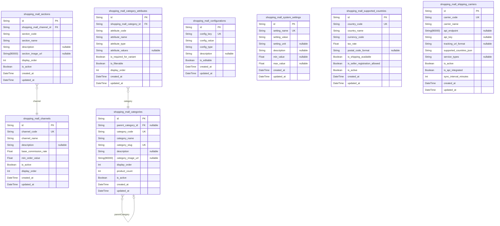
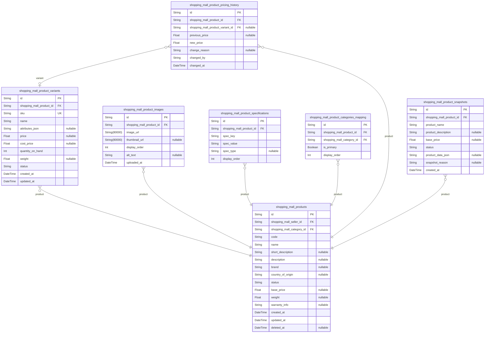
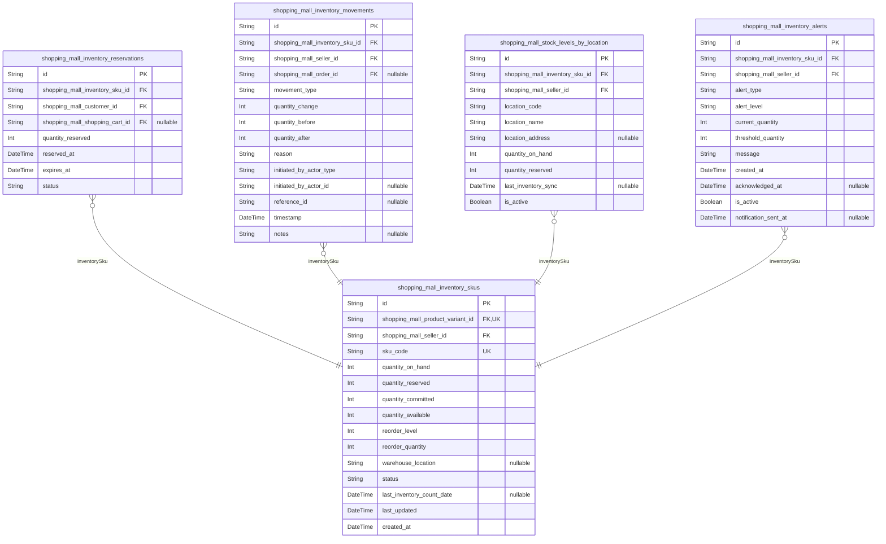
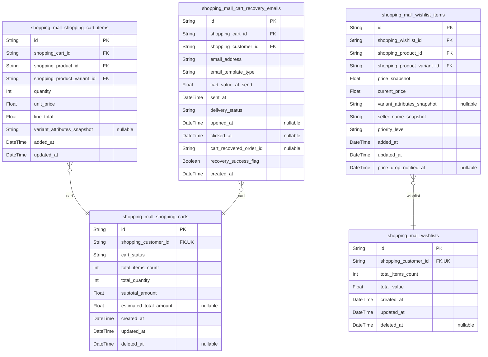
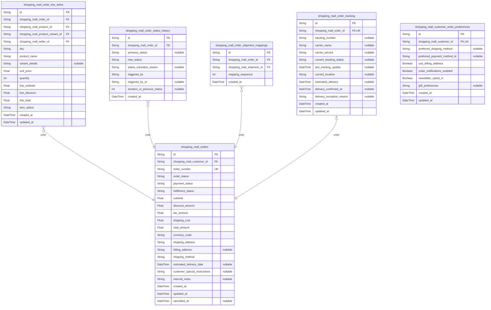
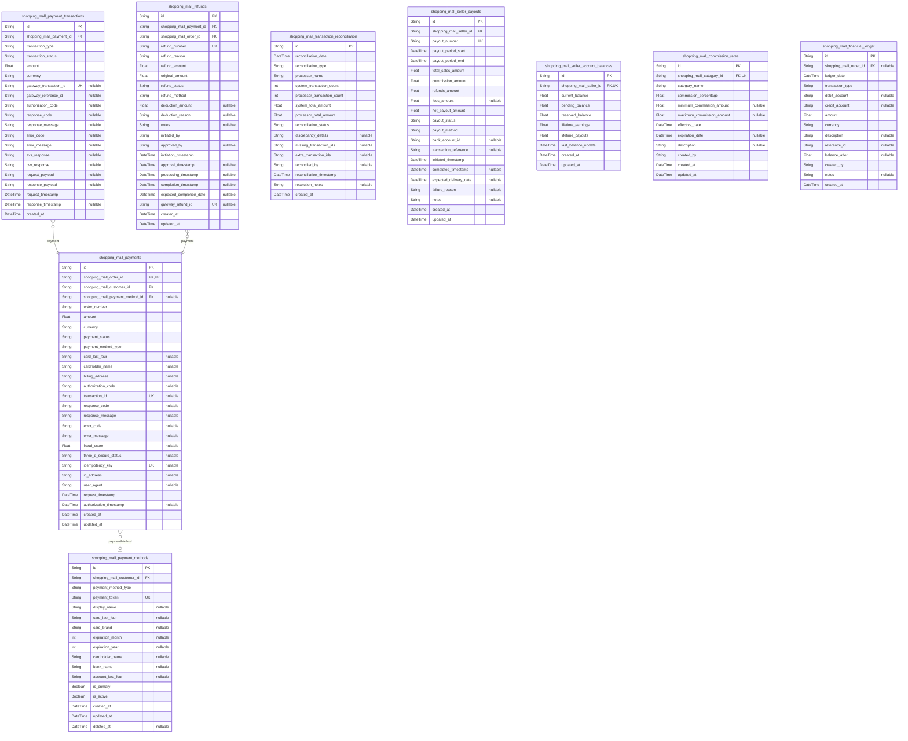
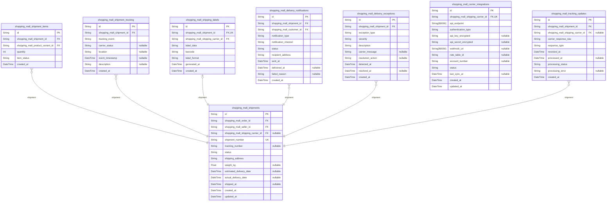
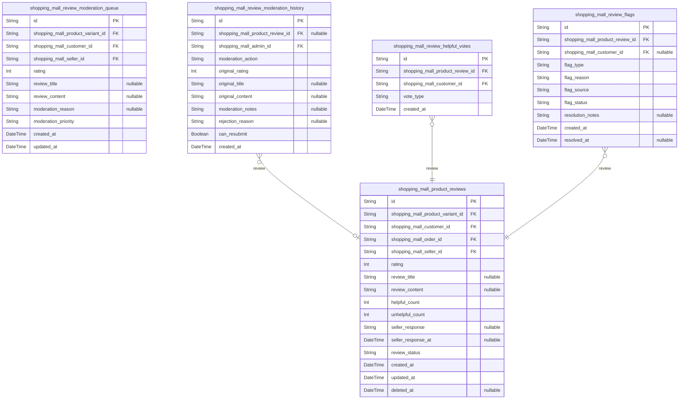
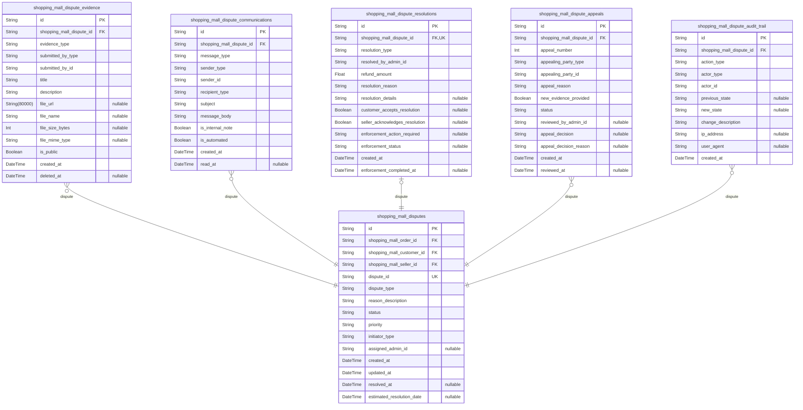
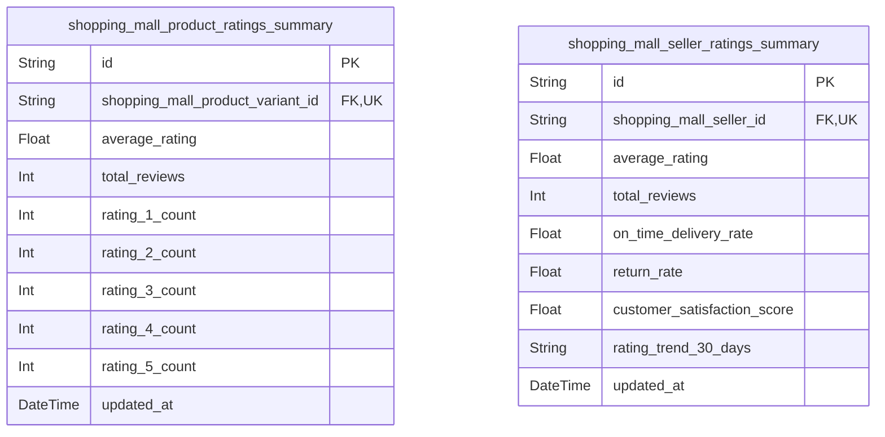

# Prisma Markdown

> Generated by [`prisma-markdown`](https://github.com/samchon/prisma-markdown)

- [Systematic](#systematic)
- [Actors](#actors)
- [Products](#products)
- [Inventory](#inventory)
- [Shopping](#shopping)
- [Orders](#orders)
- [Payments](#payments)
- [Shipping](#shipping)
- [Reviews](#reviews)
- [Returns](#returns)
- [Disputes](#disputes)
- [default](#default)

## Systematic

```mermaid
erDiagram
"shopping_mall_channels" {
  String id PK
  String channel_code UK
  String channel_name
  String description "nullable"
  Float base_commission_rate
  Float min_order_value
  Boolean is_active
  Int display_order
  DateTime created_at
  DateTime updated_at
}
"shopping_mall_sections" {
  String id PK
  String shopping_mall_channel_id FK
  String section_code
  String section_name
  String description "nullable"
  String(80000) section_image_url "nullable"
  Int display_order
  Boolean is_active
  DateTime created_at
  DateTime updated_at
}
"shopping_mall_categories" {
  String id PK
  String parent_category_id FK "nullable"
  String category_code UK
  String category_name
  String category_slug UK
  String description "nullable"
  String(80000) category_image_url "nullable"
  Int display_order
  Int product_count
  Boolean is_active
  DateTime created_at
  DateTime updated_at
}
"shopping_mall_category_attributes" {
  String id PK
  String shopping_mall_category_id FK
  String attribute_code
  String attribute_name
  String attribute_type
  String attribute_values "nullable"
  Boolean is_required_for_variant
  Boolean is_filterable
  Int display_order
  DateTime created_at
  DateTime updated_at
}
"shopping_mall_configurations" {
  String id PK
  String config_key UK
  String config_value
  String config_type
  String description "nullable"
  Boolean is_editable
  DateTime created_at
  DateTime updated_at
}
"shopping_mall_system_settings" {
  String id PK
  String setting_name UK
  String setting_value
  String setting_unit "nullable"
  String description "nullable"
  Float min_value "nullable"
  Float max_value "nullable"
  DateTime created_at
  DateTime updated_at
}
"shopping_mall_supported_countries" {
  String id PK
  String country_code UK
  String country_name
  String currency_code
  Float tax_rate
  String postal_code_format "nullable"
  Boolean is_shipping_available
  Boolean is_seller_registration_allowed
  Boolean is_active
  DateTime created_at
  DateTime updated_at
}
"shopping_mall_shipping_carriers" {
  String id PK
  String carrier_code UK
  String carrier_name
  String(80000) api_endpoint "nullable"
  String api_key "nullable"
  String tracking_url_format "nullable"
  String supported_countries_json
  String service_types "nullable"
  Boolean is_active
  Boolean is_api_integrated
  Int sync_interval_minutes
  DateTime created_at
  DateTime updated_at
}
"shopping_mall_sections" }o--|| "shopping_mall_channels" : channel
"shopping_mall_categories" }o--o| "shopping_mall_categories" : parentCategory
"shopping_mall_category_attributes" }o--|| "shopping_mall_categories" : category
```

### `shopping_mall_channels`

Core system channels representing different seller communities or market
segments. Channels organize the overall marketplace structure and enable
multiple independent market communities to operate within the platform.
Each channel has its own configuration for commission rates, policies,
and branding.

Properties as follows:

- `id`: Primary Key.
- `channel_code`
  > Unique channel identifier code in format like CHANNEL_PRIMARY,
  > CHANNEL_LUXURY, etc. Used in URLs and system references. Maximum 50
  > characters.
- `channel_name`
  > Display name for the channel shown to customers and sellers. Example:
  > 'Primary Marketplace', 'Premium Store', 'Local Sellers'. Maximum 100
  > characters.
- `description`
  > Detailed description of the channel's purpose and positioning. Helps
  > sellers understand which channel suits their business. Maximum 1000
  > characters.
- `base_commission_rate`
  > Default commission percentage (0-100) charged to sellers in this channel.
  > Example: 10.5 means 10.5% commission. Specific product categories can
  > override this.
- `min_order_value`
  > Minimum order value in platform currency required for orders in this
  > channel. Prevents very small orders. Example: 100.00
- `is_active`
  > Whether this channel is currently active and accepting new sellers and
  > orders. Inactive channels may have read-only access.
- `display_order`
  > Sort order for displaying channels in user interfaces. Lower numbers
  > appear first. Used for UI ordering, not business logic.
- `created_at`
  > Timestamp when this channel was created in the system. ISO 8601 format
  > with timezone.
- `updated_at`
  > Timestamp when this channel was last updated. Updated whenever any
  > channel field changes. ISO 8601 format with timezone.

### `shopping_mall_sections`

Organizational sections within channels that group related product
categories. Sections provide a second-level organization hierarchy
between channels and specific product categories. Enables structured
navigation for customers browsing products. Example sections:
Electronics, Clothing, Home & Garden.

Properties as follows:

- `id`: Primary Key.
- `shopping_mall_channel_id`
  > Reference to the parent channel this section belongs to. {@link
  > shopping_mall_channels.id}
- `section_code`
  > Unique section identifier code within a channel. Format:
  > SECTION_ELECTRONICS, SECTION_FASHION. Maximum 50 characters.
- `section_name`
  > Display name for the section shown in navigation and category browsing.
  > Example: 'Electronics & Gadgets'. Maximum 100 characters.
- `description`
  > Detailed description of the section's scope and types of products
  > included. Helps customers understand what products are in this section.
  > Maximum 500 characters.
- `section_image_url`
  > URL to an image/icon representing this section for visual display in
  > category navigation. Optional visual identifier.
- `display_order`
  > Sort order for displaying sections within parent channel. Lower numbers
  > appear first in UI navigation.
- `is_active`
  > Whether this section is currently active. Inactive sections are hidden
  > from customer view but preserved for historical data.
- `created_at`: Timestamp when this section was created. ISO 8601 format with timezone.
- `updated_at`
  > Timestamp when this section was last updated. ISO 8601 format with
  > timezone.

### `shopping_mall_categories`

Product categories that organize the product catalog into hierarchical
browsing structure. Categories enable customers to navigate and discover
products. Categories can be nested in a tree structure where each
category may have a parent category. Examples: Smartphones, Laptops,
Clothing, Shoes, Accessories. Used for both customer browsing and seller
product organization.

Properties as follows:

- `id`: Primary Key.
- `parent_category_id`
  > Reference to parent category in hierarchical structure for nested
  > categories. Null if this is a top-level category. {@link
  > shopping_mall_categories.id}
- `category_code`
  > Unique category identifier code used internally. Format: CAT_ELECTRONICS,
  > CAT_SMARTPHONES, etc. Maximum 50 characters.
- `category_name`
  > Display name for the category shown in navigation and product listings.
  > Example: 'Smartphones', 'Laptop Computers'. Maximum 100 characters.
- `category_slug`
  > URL-friendly slug for SEO and navigation URLs. Lowercase alphanumeric
  > with hyphens. Example: 'smartphones', 'laptop-computers'. Maximum 100
  > characters.
- `description`
  > Detailed description of products in this category. Displayed on category
  > landing page. Maximum 1000 characters.
- `category_image_url`
  > URL to an image/icon representing this category for visual display in
  > navigation and category pages.
- `display_order`
  > Sort order for displaying categories at same hierarchy level. Lower
  > numbers appear first in navigation.
- `product_count`
  > Denormalized count of active products in this category (includes products
  > in subcategories). Updated when products are added/removed from category.
  > Used for display efficiency.
- `is_active`
  > Whether this category is currently visible to customers. Inactive
  > categories are hidden but preserved for historical data and existing
  > product references.
- `created_at`: Timestamp when this category was created. ISO 8601 format with timezone.
- `updated_at`
  > Timestamp when this category was last updated. ISO 8601 format with
  > timezone.

### `shopping_mall_category_attributes`

Configurable attributes that products in a specific category can have.
Attributes define the possible variants (colors, sizes, materials, etc.)
that products in a category can use. Enables structured product variant
management and customer filtering. Example: In Clothing category,
attributes might be Color, Size, Material, Style.

Properties as follows:

- `id`: Primary Key.
- `shopping_mall_category_id`
  > Reference to the category these attributes are available for. {@link
  > shopping_mall_categories.id}
- `attribute_code`
  > Unique identifier for this attribute within the category. Format:
  > ATTR_COLOR, ATTR_SIZE, ATTR_MATERIAL. Maximum 50 characters.
- `attribute_name`
  > Display name for the attribute. Example: 'Color', 'Size', 'Material'.
  > Maximum 100 characters.
- `attribute_type`
  > Data type of attribute values: 'text' (free text), 'number' (numeric
  > values), 'selection' (predefined options from attribute_values),
  > 'boolean' (true/false toggle). Determines how attribute values are
  > managed and displayed.
- `attribute_values`
  > JSON array of predefined values for selection-type attributes. Example:
  > ["Red", "Blue", "Green"] for color. Null for text/number types. Stored as
  > JSON string.
- `is_required_for_variant`
  > Whether products in this category MUST specify a value for this attribute
  > when creating variants. Mandatory attributes for variant definition.
- `is_filterable`
  > Whether customers can filter products by this attribute in category view.
  > Affects customer-facing filtering options.
- `display_order`
  > Sort order for displaying attributes in variant selector and product
  > forms. Lower numbers appear first.
- `created_at`: Timestamp when this attribute was created. ISO 8601 format with timezone.
- `updated_at`
  > Timestamp when this attribute was last updated. ISO 8601 format with
  > timezone.

### `shopping_mall_configurations`

Global platform configuration settings for feature toggles, system
behavior, and operational policies. Single-purpose configuration table
storing key-value pairs that control platform-wide behavior. Examples:
enable/disable review system, enable/disable wishlist feature, maximum
cart items, etc.

Properties as follows:

- `id`: Primary Key.
- `config_key`
  > Unique configuration key identifier. Format: 'feature_reviews_enabled',
  > 'feature_wishlist_enabled', 'max_cart_items',
  > 'default_order_timeout_minutes'. Maximum 100 characters. Used as primary
  > identifier for lookups.
- `config_value`
  > Configuration value as string. Interpretations: 'true'/'false' for
  > boolean flags, numeric strings for numbers, JSON for complex objects.
  > Stored as text for flexibility. Maximum 5000 characters.
- `config_type`
  > Data type indicator: 'boolean', 'integer', 'decimal', 'string', 'json'.
  > Helps with value interpretation and validation.
- `description`
  > Human-readable description of this configuration's purpose and expected
  > values. Helps admins understand what each setting controls. Maximum 500
  > characters.
- `is_editable`
  > Whether admins can modify this configuration from the admin panel. Some
  > system-critical configs may be read-only. Controls admin UI visibility.
- `created_at`
  > Timestamp when this configuration was created. ISO 8601 format with
  > timezone.
- `updated_at`
  > Timestamp when this configuration was last updated. ISO 8601 format with
  > timezone.

### `shopping_mall_system_settings`

System-wide operational settings for business rules, policies, and
limits. Stores global business settings like minimum order values,
maximum product price, commission structures, default timeouts, and
policy parameters. Unlike configurations which are feature toggles,
settings are business rule values.

Properties as follows:

- `id`: Primary Key.
- `setting_name`
  > Identifier for this setting. Format: 'minimum_order_value',
  > 'maximum_product_price', 'default_commission_rate',
  > 'payment_timeout_minutes', 'order_cancellation_window_hours'. Maximum 100
  > characters.
- `setting_value`
  > Value for this setting as string. Numeric settings stored as numeric
  > strings, currency amounts include decimal point. Maximum 1000 characters.
- `setting_unit`
  > Unit of measurement if applicable. Examples: 'currency', 'minutes',
  > 'hours', 'days', 'percentage', 'units'. Helps interpret numeric values.
  > Maximum 50 characters.
- `description`
  > Explanation of what this setting controls and why it matters. Helps
  > admins understand business impact. Maximum 500 characters.
- `min_value`
  > Minimum allowed value for this setting if numeric. Used for validation
  > when setting is updated. Null for non-numeric settings.
- `max_value`
  > Maximum allowed value for this setting if numeric. Used for validation
  > when setting is updated. Null for non-numeric settings.
- `created_at`: Timestamp when this setting was created. ISO 8601 format with timezone.
- `updated_at`
  > Timestamp when this setting was last updated. ISO 8601 format with
  > timezone.

### `shopping_mall_supported_countries`

Registry of countries supported by the platform for shipping, tax, and
regulatory purposes. Defines which countries are available for customer
addresses, seller registration, and shipping destinations. Each country
entry includes tax rates, shipping info, and operational flags.

Properties as follows:

- `id`: Primary Key.
- `country_code`
  > ISO 3166-1 alpha-2 country code (e.g., 'US', 'GB', 'IN', 'JP'). Used for
  > all country references throughout the system. Exactly 2 uppercase
  > letters.
- `country_name`
  > Full country name as displayed to users (e.g., 'United States', 'United
  > Kingdom', 'India'). Maximum 100 characters.
- `currency_code`
  > ISO 4217 currency code for this country (e.g., 'USD', 'GBP', 'INR'). Used
  > for pricing and financial transactions. Exactly 3 uppercase letters.
- `tax_rate`
  > Default VAT/sales tax rate as percentage (0-100). Example: 15.5 for 15.5%
  > tax. Applied to orders shipping to this country unless category-specific
  > rate exists.
- `postal_code_format`
  > Regular expression pattern for validating postal codes in this country.
  > Example: '^[0-9]{5}(-[0-9]{4})?$' for US zip codes. Used in address
  > validation.
- `is_shipping_available`
  > Whether the platform can ship orders to this country. Used to determine
  > available shipping destinations for customers.
- `is_seller_registration_allowed`
  > Whether sellers can register and operate from this country. May be false
  > for countries with regulatory restrictions.
- `is_active`
  > Whether this country is currently active on the platform. Inactive
  > countries are hidden from selection but historical data is preserved.
- `created_at`
  > Timestamp when this country was added to the system. ISO 8601 format with
  > timezone.
- `updated_at`
  > Timestamp when this country configuration was last updated. ISO 8601
  > format with timezone.

### `shopping_mall_shipping_carriers`

Shipping carriers available on the platform for order fulfillment.
Registry of carrier integrations including courier services, postal
services, and logistics providers. Stores carrier information, API
endpoints, tracking URL formats, and operational details for carrier
integration.

Properties as follows:

- `id`: Primary Key.
- `carrier_code`
  > Unique identifier for this carrier used in system references. Format:
  > 'CARRIER_FEDEX', 'CARRIER_UPS', 'CARRIER_DHL'. Maximum 50 characters.
  > Used for internal references, not display.
- `carrier_name`
  > Display name of the shipping carrier shown to customers and sellers.
  > Example: 'FedEx', 'UPS', 'DHL Express'. Maximum 100 characters.
- `api_endpoint`
  > API endpoint URL for carrier tracking and rate queries. Used by system to
  > integrate with carrier systems. Example: 'https://api.fedex.com/v1/'. May
  > be null for manual carriers.
- `api_key`
  > Encrypted API key or credentials for carrier API authentication. Stored
  > encrypted in database. Decrypted only when needed for API calls. Null if
  > no API integration.
- `tracking_url_format`
  > URL template for customer tracking pages. Format:
  > 'https://tracking.fedex.com/tracking?tracknumbers={TRACKING_NUMBER}'.
  > {TRACKING_NUMBER} is placeholder for actual tracking number.
- `supported_countries_json`
  > JSON array of ISO country codes this carrier operates in. Example:
  > '["US", "CA", "MX"]'. Used to filter available carriers by destination.
- `service_types`
  > JSON array of service types offered (Standard, Express, Overnight, etc.).
  > Format: '["Standard", "Express", "Overnight"]'. Used for service
  > selection during shipping.
- `is_active`
  > Whether this carrier is currently available for shipping. Inactive
  > carriers are hidden from seller selections.
- `is_api_integrated`
  > Whether carrier has active API integration for tracking and rate quotes.
  > False means manual tracking number entry required.
- `sync_interval_minutes`
  > Frequency (in minutes) to poll carrier API for tracking updates. Example:
  > 120 = check every 2 hours. Null or 0 means no automatic syncing.
- `created_at`
  > Timestamp when this carrier was added to the system. ISO 8601 format with
  > timezone.
- `updated_at`
  > Timestamp when this carrier configuration was last updated. ISO 8601
  > format with timezone.

## Actors

```mermaid
erDiagram
"shopping_mall_customers" {
  String id PK
  String email UK
  String password_hash
  String first_name
  String last_name
  String phone_number "nullable"
  Boolean email_verified
  String account_status
  Int failed_login_attempts
  DateTime locked_until "nullable"
  DateTime created_at
  DateTime updated_at
  DateTime deleted_at "nullable"
}
"shopping_mall_customer_sessions" {
  String id PK
  String shopping_mall_customer_id FK
  String ip
  String href
  String referrer
  DateTime created_at
  DateTime expired_at "nullable"
}
"shopping_mall_customer_addresses" {
  String id PK
  String shopping_mall_customer_id FK
  String label
  String recipient_name
  String street_address_line_1
  String street_address_line_2 "nullable"
  String city
  String state_province
  String postal_code
  String country_code
  String phone_number
  Boolean is_default_shipping
  Boolean is_default_billing
  String address_type
  Boolean is_verified
  DateTime created_at
  DateTime updated_at
  DateTime deleted_at "nullable"
}
"shopping_mall_sellers" {
  String id PK
  String email UK
  String password_hash
  String business_name
  String business_registration_number UK
  String tax_identification_number
  String primary_contact_name
  String primary_contact_phone
  String business_address
  String correspondence_address
  String business_description
  String store_name
  String verification_status
  String account_status
  Int failed_login_attempts
  DateTime locked_until "nullable"
  DateTime created_at
  DateTime updated_at
  DateTime deleted_at "nullable"
}
"shopping_mall_seller_sessions" {
  String id PK
  String shopping_mall_seller_id FK
  String ip
  String href
  String referrer
  DateTime created_at
  DateTime expired_at "nullable"
}
"shopping_mall_seller_profiles" {
  String id PK
  String shopping_mall_seller_id FK,UK
  String store_url_slug UK
  String(80000) store_logo_url "nullable"
  String(80000) store_banner_url "nullable"
  String store_description "nullable"
  String return_policy "nullable"
  String shipping_policy "nullable"
  String cancellation_policy "nullable"
  String contact_email "nullable"
  String contact_phone "nullable"
  String business_hours "nullable"
  String(80000) website_url "nullable"
  String social_media_links "nullable"
  DateTime created_at
  DateTime updated_at
}
"shopping_mall_seller_verification_documents" {
  String id PK
  String shopping_mall_seller_id FK
  String document_type
  String(80000) document_url
  String document_name
  String issuing_country
  String document_number "nullable"
  DateTime issue_date "nullable"
  DateTime expiration_date "nullable"
  String verification_status
  String verification_notes "nullable"
  String verified_by_admin_id "nullable"
  DateTime verified_at "nullable"
  DateTime created_at
  DateTime updated_at
}
"shopping_mall_admins" {
  String id PK
  String email UK
  String password_hash
  String full_name
  String admin_level
  String department "nullable"
  Boolean is_mfa_enabled
  String mfa_method "nullable"
  String mfa_secret "nullable"
  String account_status
  Int failed_login_attempts
  DateTime locked_until "nullable"
  DateTime last_login_at "nullable"
  String last_login_ip "nullable"
  DateTime created_at
  DateTime updated_at
  DateTime deleted_at "nullable"
}
"shopping_mall_admin_sessions" {
  String id PK
  String shopping_mall_admin_id FK
  String ip
  String href
  String referrer
  Boolean mfa_verified
  DateTime created_at
  DateTime expired_at "nullable"
}
"shopping_mall_admin_roles" {
  String id PK
  String role_name UK
  String display_name
  String description
  String permission_scope
  Boolean can_manage_admins
  Boolean can_modify_settings
  Boolean can_override_decisions
  DateTime created_at
  DateTime updated_at
}
"shopping_mall_admin_permissions" {
  String id PK
  String permission_name UK
  String display_name
  String description
  String category
  String risk_level
  String required_admin_level
  DateTime created_at
  DateTime updated_at
}
"shopping_mall_customer_sessions" }o--|| "shopping_mall_customers" : customer
"shopping_mall_customer_addresses" }o--|| "shopping_mall_customers" : customer
"shopping_mall_seller_sessions" }o--|| "shopping_mall_sellers" : seller
"shopping_mall_seller_profiles" |o--|| "shopping_mall_sellers" : seller
"shopping_mall_seller_verification_documents" }o--|| "shopping_mall_sellers" : seller
"shopping_mall_admin_sessions" }o--|| "shopping_mall_admins" : admin
```

### `shopping_mall_customers`

Core customer entity representing end-user shoppers. Stores essential
customer account information including authentication credentials, email
verification status, and account lifecycle management. Customers can
browse products, manage shopping carts, place orders, and leave product
reviews.

Properties as follows:

- `id`: Primary Key.
- `email`
  > Customer's unique email address used for account login and communication.
  > RFC 5322 format validated. Serves as the primary authentication
  > identifier.
- `password_hash`
  > Securely hashed customer password using bcrypt with minimum 10 salt
  > rounds. Never stored in plain text. Used for login authentication.
- `first_name`
  > Customer's first name (1-100 characters). Used for personalization in
  > communications and order confirmations.
- `last_name`
  > Customer's last name (1-100 characters). Used for personalization in
  > communications and order confirmations.
- `phone_number`
  > Customer's phone number in international or local format. Optional
  > contact method for delivery and customer service purposes.
- `email_verified`
  > Flag indicating whether the customer's email address has been verified.
  > Required to be true before customer can place orders. Email verification
  > prevents unauthorized account creation.
- `account_status`
  > Current customer account status: 'active', 'email_unverified',
  > 'suspended', or 'deactivated'. Determines account access level and order
  > placement eligibility.
- `failed_login_attempts`
  > Count of consecutive failed login attempts. Used for security lockout
  > mechanism. Resets to 0 on successful login. Triggers 15-minute lockout
  > after 5 failures.
- `locked_until`
  > Timestamp indicating when account lockout expires after excessive failed
  > login attempts. Null if account is not currently locked. Used to enforce
  > 15-minute security lockout period.
- `created_at`
  > Account creation timestamp in UTC timezone. Records when the customer
  > registered on the platform.
- `updated_at`
  > Timestamp of last account modification (profile update, password change,
  > etc.). Updated whenever customer information is modified.
- `deleted_at`
  > Soft deletion timestamp. When set, indicates customer account has been
  > deactivated. Null for active accounts. Enables account recovery and audit
  > trail maintenance.

### `shopping_mall_customer_sessions`

Authentication sessions for customers. One session per active
device/browser. Records connection context (IP, URL, referrer) for
security tracking and fraud detection. Session expires after 30 days of
inactivity. Enables stateless authentication via JWT tokens while
maintaining optional server-side session records.

Properties as follows:

- `id`: Primary Key.
- `shopping_mall_customer_id`
  > Foreign key reference to customer's [shopping_mall_customers.id](#shopping_mall_customers).
  > Links session to the authenticated customer.
- `ip`
  > IP address from which the session was initiated. Used for security
  > tracking, anomaly detection, and fraud prevention.
- `href`
  > Connection URL (HTTP referrer) indicating the page or service from which
  > authentication occurred. Stored for security audit and access pattern
  > analysis.
- `referrer`
  > HTTP referrer header value indicating the source page that initiated the
  > session. Used for tracking where customers came from during
  > authentication.
- `created_at`
  > Session creation timestamp in UTC timezone. Records when authentication
  > session was established.
- `expired_at`
  > Session expiration timestamp indicating when the session ended (either
  > due to timeout, logout, or explicit termination). Null for active
  > sessions. Sessions default to 30-day expiration.

### `shopping_mall_customer_addresses`

Customer delivery and billing addresses. Customers can save multiple
addresses (maximum 10) for convenient checkout. Each address includes
recipient name, complete address details, and delivery/billing
designation. Addresses are profile-related data essential for order
fulfillment and customer convenience.

Properties as follows:

- `id`: Primary Key.
- `shopping_mall_customer_id`
  > Foreign key reference to customer's [shopping_mall_customers.id](#shopping_mall_customers).
  > Associates address with the customer account.
- `label`
  > User-friendly address label (e.g., 'Home', 'Work', 'Apartment'). Max 50
  > characters. Helps customer identify which address to use during checkout.
- `recipient_name`
  > Full name of the person to receive the delivery. 2-100 characters. Used
  > on shipping labels and delivery confirmation.
- `street_address_line_1`
  > Primary street address line. 5-200 characters. Includes street number,
  > name, and building/unit details as needed.
- `street_address_line_2`
  > Secondary address line for apartment, suite, or additional location
  > details. Optional. Max 200 characters.
- `city`
  > City or municipality name. 2-100 characters. Validated against known
  > cities in the selected country.
- `state_province`
  > State, province, or regional subdivision code/name. 2-50 characters.
  > Format validated per country requirements.
- `postal_code`
  > Postal/ZIP code. Format varies by country (5-20 characters). Validated
  > against country's postal system requirements for accurate delivery.
- `country_code`
  > ISO 3166-1 alpha-2 country code (e.g., 'US', 'GB', 'JP'). Determines tax
  > jurisdiction, shipping options, and address format validation rules.
- `phone_number`
  > Contact phone number for delivery. Validated international or local
  > format. Used by carrier for delivery coordination and customer contact.
- `is_default_shipping`
  > Flag indicating this is the customer's default shipping address. Used to
  > pre-populate checkout shipping field. Only one address per customer can
  > have this set to true.
- `is_default_billing`
  > Flag indicating this is the customer's default billing address. Used to
  > pre-populate checkout billing field. Only one address per customer can
  > have this set to true.
- `address_type`
  > Address type classification: 'shipping', 'billing', or 'both'. Determines
  > whether address is used for delivery, payment, or both purposes.
- `is_verified`
  > Flag indicating address has been validated against address verification
  > service. Verified addresses are more reliable for delivery success.
- `created_at`
  > Address creation timestamp in UTC timezone. Records when customer saved
  > this address.
- `updated_at`
  > Timestamp of last address modification. Updated when customer edits
  > address details or changes default designation.
- `deleted_at`
  > Soft deletion timestamp. When set, indicates address has been deleted by
  > customer. Null for active addresses. Preserves historical order
  > references.

### `shopping_mall_sellers`

Core seller entity representing merchants/vendors operating on the
platform. Stores seller business identity, authentication credentials,
verification status, and account lifecycle. Sellers list products, manage
inventory, fulfill orders, and receive payments. Must complete
verification before selling.

Properties as follows:

- `id`: Primary Key.
- `email`
  > Seller's business email address used for authentication and official
  > communications. RFC 5322 format validated. Unique across all seller
  > accounts.
- `password_hash`
  > Securely hashed seller password using bcrypt with minimum 10 salt rounds.
  > Never stored in plain text. Used for seller dashboard login
  > authentication.
- `business_name`
  > Seller's legal business name (2-200 characters). Used for business
  > identification and displayed to customers on seller profile and product
  > listings.
- `business_registration_number`
  > Official business registration/license number from relevant government
  > authority. Used for seller verification and compliance purposes. Format
  > varies by jurisdiction.
- `tax_identification_number`
  > Tax ID, VAT number, or equivalent tax identifier. Required for commission
  > calculation and regulatory compliance. Format varies by country.
- `primary_contact_name`
  > Name of primary contact person for the seller business. Used for
  > verification and communication purposes.
- `primary_contact_phone`
  > Primary contact phone number in valid international or local format. Used
  > for seller verification and urgent business communications.
- `business_address`
  > Complete business address matching registration documents. 5-200
  > characters. Used for seller verification and official correspondence.
- `correspondence_address`
  > Official correspondence address for legal communications. May differ from
  > business address. Used for formal notices and regulatory correspondence.
- `business_description`
  > Description of seller's business and products (50-500 characters).
  > Displayed on seller profile to help customers understand the business.
- `store_name`
  > Store/brand name for display (2-100 characters). Shown to customers on
  > product listings and seller profile. May differ from legal business name.
- `verification_status`
  > Seller verification lifecycle state: 'pending_email_verification',
  > 'pending_approval', 'active', 'verification_rejected',
  > 'permanently_banned'. Controls seller dashboard access and product
  > listing ability.
- `account_status`
  > Current account status: 'active', 'suspended', 'deactivated',
  > 'terminated'. Determines if seller can list products and fulfill orders.
- `failed_login_attempts`
  > Count of consecutive failed login attempts. Resets to 0 on successful
  > login. Triggers 15-minute lockout after 5 failures for security.
- `locked_until`
  > Timestamp when login lockout expires after excessive failures. Null if
  > account not locked. Used to enforce 15-minute security lockout.
- `created_at`
  > Account creation timestamp in UTC timezone. Records when seller applied
  > to the platform.
- `updated_at`
  > Timestamp of last account modification (profile update, status change,
  > verification, etc.).
- `deleted_at`
  > Soft deletion timestamp. When set, indicates seller account has been
  > deactivated or terminated. Null for active accounts. Preserves seller
  > history and order records.

### `shopping_mall_seller_sessions`

Authentication sessions for sellers. One session per active
device/browser. Records connection context (IP, URL, referrer) for
security monitoring. Sessions expire after 30 days of inactivity. Enables
secure seller dashboard access while maintaining audit trail of login
activity.

Properties as follows:

- `id`: Primary Key.
- `shopping_mall_seller_id`
  > Foreign key reference to seller's [shopping_mall_sellers.id](#shopping_mall_sellers). Links
  > session to the authenticated seller.
- `ip`
  > IP address from which the session was initiated. Used for seller security
  > tracking and suspicious activity detection.
- `href`
  > Connection URL indicating the seller dashboard or service endpoint where
  > authentication occurred. Stored for security audit.
- `referrer`
  > HTTP referrer header value indicating source page for the session. Used
  > for tracking seller access patterns.
- `created_at`
  > Session creation timestamp in UTC timezone. Records when seller
  > authenticated and session was established.
- `expired_at`
  > Session expiration timestamp. When set, indicates session has ended
  > (logout or timeout). Null for active sessions. Default 30-day expiration.

### `shopping_mall_seller_profiles`

Extended seller profile information including store branding, policies,
and business metadata. Stores seller customization options like logo,
banner images, return policy, shipping policy, and business hours.
Enables sellers to personalize their storefront and communicate their
policies to customers.

Properties as follows:

- `id`: Primary Key.
- `shopping_mall_seller_id`
  > Foreign key reference to seller's [shopping_mall_sellers.id](#shopping_mall_sellers).
  > Associates profile with the seller account. 1:1 relationship.
- `store_url_slug`
  > URL-friendly identifier for seller's store (alphanumeric with hyphens,
  > max 50 characters). Used to create seller storefront URL:
  > store.com/seller/{slug}. Must be unique.
- `store_logo_url`
  > URL to seller's store logo image for display on storefront. Image should
  > be 2MB max, JPEG or PNG format with minimum 200x200 pixels resolution.
- `store_banner_url`
  > URL to seller's store banner image displayed at top of storefront. Image
  > should be 5MB max, JPEG or PNG format, recommended dimensions 1200x300
  > pixels.
- `store_description`
  > Seller's store description for public display (max 500 characters). Shown
  > on seller profile to help customers understand the business.
- `return_policy`
  > Seller's return and refund policy text (max 2000 characters). Displayed
  > to customers during checkout and on seller profile. Communicates return
  > window and conditions.
- `shipping_policy`
  > Seller's shipping policy and carrier information (max 2000 characters).
  > Displayed to customers explaining shipping methods, costs, and delivery
  > timeframes.
- `cancellation_policy`
  > Seller's order cancellation policy (max 2000 characters). Explains
  > conditions under which orders can be cancelled and any associated fees or
  > restrictions.
- `contact_email`
  > Seller's public contact email for customer inquiries. May differ from
  > account email. Used for customer communications through the platform.
- `contact_phone`
  > Seller's public contact phone number for customer support. Used when
  > customers need to reach seller directly for urgent issues.
- `business_hours`
  > Seller's customer service business hours (formatted text, max 500
  > characters). Helps customers understand when seller is available for
  > support.
- `website_url`
  > Link to seller's external business website if they have one. Provides
  > additional information about the seller's operations.
- `social_media_links`
  > JSON-formatted social media profile links (e.g., Facebook, Instagram,
  > Twitter). Enables customers to follow and verify seller's presence.
- `created_at`
  > Profile creation timestamp in UTC timezone. Records when seller profile
  > was first created.
- `updated_at`
  > Timestamp of last profile modification. Updated whenever seller updates
  > policies, images, or business information.

### `shopping_mall_seller_verification_documents`

Documents submitted by sellers for identity and business verification
during onboarding. Stores references to uploaded documentation (business
license, tax certificates, ID proofs, address verification). Enables
platform to verify seller legitimacy and comply with regulatory
requirements.

Properties as follows:

- `id`: Primary Key.
- `shopping_mall_seller_id`
  > Foreign key reference to seller's [shopping_mall_sellers.id](#shopping_mall_sellers).
  > Associates verification documents with the seller account.
- `document_type`
  > Type of verification document submitted: 'business_license',
  > 'tax_certificate', 'identity_proof', 'address_verification',
  > 'bank_verification'. Determines what the document proves.
- `document_url`
  > URL to the uploaded document file. Image or PDF format (JPEG, PNG, PDF).
  > Maximum 10MB. Stored in secure cloud storage with access control.
- `document_name`
  > Original filename or descriptive name of the document (max 200
  > characters). Helps identify which specific document this is.
- `issuing_country`
  > ISO 3166-1 alpha-2 country code indicating where the document was issued.
  > Used for validation rules and compliance checking.
- `document_number`
  > Official document number (e.g., business registration number, license
  > number, passport number, tax ID). Used for verification and
  > cross-checking.
- `issue_date`
  > Date when the document was issued. Used to verify document is not expired
  > or suspiciously recent.
- `expiration_date`
  > Document expiration date if applicable. Null if document has no
  > expiration. Used to verify document is still valid.
- `verification_status`
  > Verification status of this document: 'pending_review', 'approved',
  > 'rejected'. Indicates whether admin has reviewed and validated the
  > document.
- `verification_notes`
  > Admin notes regarding verification (max 1000 characters). Explains reason
  > for approval/rejection or requests for specific clarifications.
- `verified_by_admin_id`
  > Admin user ID who reviewed and verified the document. Null if not yet
  > verified. Used for audit trail of verification decisions.
- `verified_at`
  > Timestamp when document was verified by admin. Null if pending
  > verification. Used to track verification workflow timing.
- `created_at`
  > Document upload timestamp in UTC timezone. Records when seller submitted
  > the document.
- `updated_at`: Timestamp of last modification (status change, notes update, etc.).

### `shopping_mall_admins`

Platform administrator accounts with system-wide access and control
capabilities. Administrators manage users, moderate content, handle
disputes, process refunds, and oversee platform operations. Require
strong authentication with multi-factor authentication support and
comprehensive audit logging.

Properties as follows:

- `id`: Primary Key.
- `email`
  > Admin's unique email address used for authentication and administrative
  > notifications. RFC 5322 format validated. Must be unique across all admin
  > accounts.
- `password_hash`
  > Securely hashed admin password using bcrypt with minimum 10 salt rounds.
  > Never stored in plain text. Used for admin dashboard login
  > authentication.
- `full_name`
  > Admin's full name (2-100 characters). Used for identification in audit
  > logs and admin interface.
- `admin_level`
  > Admin permission level: 'super_admin', 'operations_admin',
  > 'content_admin', 'financial_admin', 'support_admin'. Determines feature
  > access and operational scope.
- `department`
  > Admin's department or team assignment (max 100 characters). Used for
  > organizational tracking and access control scoping.
- `is_mfa_enabled`
  > Flag indicating whether multi-factor authentication is enabled for this
  > admin. Required for enhanced security. Super admins must have MFA
  > enabled.
- `mfa_method`
  > MFA method preference: 'email_otp', 'authenticator_app', or null if MFA
  > not enabled. Admin can authenticate via selected method.
- `mfa_secret`
  > Encrypted MFA secret key for TOTP authenticator app (if using
  > authenticator). Never displayed to admin. Used for OTP code generation.
- `account_status`
  > Current account status: 'active', 'inactive', 'suspended', 'deactivated'.
  > Determines if admin can access the platform.
- `failed_login_attempts`
  > Count of consecutive failed login attempts. Resets to 0 on successful
  > login. Triggers 15-minute lockout after 5 failures for security.
- `locked_until`
  > Timestamp when login lockout expires. Null if account not locked. Used to
  > enforce 15-minute security lockout for excessive failures.
- `last_login_at`
  > Timestamp of most recent successful admin login. Used for security
  > monitoring and activity tracking. Null if admin never logged in.
- `last_login_ip`
  > IP address from the most recent login. Used for suspicious activity
  > detection and security investigations.
- `created_at`
  > Admin account creation timestamp in UTC timezone. Records when the admin
  > account was first created by existing admin.
- `updated_at`
  > Timestamp of last account modification (role change, MFA setup, status
  > update, etc.).
- `deleted_at`
  > Soft deletion timestamp. When set, indicates admin account has been
  > deactivated. Null for active accounts. Preserves admin action audit
  > trail.

### `shopping_mall_admin_sessions`

Authentication sessions for administrators. Records admin login sessions
with connection context for security monitoring. Sessions expire after 8
hours (shorter than customer/seller for security). Multi-factor
authentication required. Complete audit trail of all admin access.

Properties as follows:

- `id`: Primary Key.
- `shopping_mall_admin_id`
  > Foreign key reference to admin's [shopping_mall_admins.id](#shopping_mall_admins). Links
  > session to the authenticated administrator.
- `ip`
  > IP address from which the session was initiated. Critical for admin
  > security monitoring and unusual access detection.
- `href`
  > Connection URL indicating the admin dashboard endpoint where
  > authentication occurred. Used for access pattern audit.
- `referrer`
  > HTTP referrer header value indicating source of authentication request.
  > Used for security tracking and anomaly detection.
- `mfa_verified`
  > Flag indicating whether MFA was successfully completed for this session.
  > Must be true for session to be valid. Required security measure for
  > admins.
- `created_at`
  > Session creation timestamp in UTC timezone. Records when admin
  > authenticated and session was established.
- `expired_at`
  > Session expiration timestamp. When set, indicates session has ended
  > (logout, timeout, or forced termination). Null for active sessions.
  > Default 8-hour expiration.

### `shopping_mall_admin_roles`

Role definitions for admin access control and permission management.
Defines available roles (Super Admin, Operations Admin, Content Admin,
Financial Admin, Support Admin) with descriptions. Enables role-based
access control for fine-grained permission management and organizational
structure.

Properties as follows:

- `id`: Primary Key.
- `role_name`
  > Unique role identifier (max 50 characters, lowercase with underscores).
  > Examples: 'super_admin', 'operations_admin', 'content_admin',
  > 'financial_admin', 'support_admin'.
- `display_name`
  > Human-friendly role display name (max 100 characters). Shown in admin
  > interface for easy identification. Example: 'Super Administrator',
  > 'Operations Manager'.
- `description`
  > Role description explaining responsibilities and scope (max 1000
  > characters). Helps administrators understand what each role can do.
- `permission_scope`
  > Comma-separated list of permission scopes this role has access to.
  > Examples: 'users,sellers,products,orders,payments,disputes,system'. Used
  > for authorization checks.
- `can_manage_admins`
  > Flag indicating if this role can create, modify, or delete other admin
  > accounts. Only super admin should have this enabled.
- `can_modify_settings`
  > Flag indicating if this role can modify platform-wide settings and
  > policies. Typically only super admin.
- `can_override_decisions`
  > Flag indicating if this role can override system decisions (force refund,
  > suspend accounts, etc.). Only higher-level admins should have this.
- `created_at`: Role definition creation timestamp in UTC timezone.
- `updated_at`
  > Timestamp of last role modification (description update, permission scope
  > change, etc.).

### `shopping_mall_admin_permissions`

Individual permission definitions for granular access control. Maps
specific actions (e.g., 'approve_sellers', 'process_refunds') to
permission names. Enables flexible role-based access control by assigning
permissions to roles.

Properties as follows:

- `id`: Primary Key.
- `permission_name`
  > Unique permission identifier (max 50 characters, lowercase with
  > underscores). Examples: 'approve_sellers', 'manage_products',
  > 'process_refunds', 'view_analytics', 'manage_admins'.
- `display_name`
  > Human-friendly permission display name (max 100 characters). Shown in
  > permission management interface.
- `description`
  > Permission description explaining what action/resource it controls (max
  > 500 characters). Helps admins understand the scope of the permission.
- `category`
  > Permission category for organization: 'users', 'sellers', 'products',
  > 'orders', 'payments', 'disputes', 'reporting', 'system'. Used for
  > grouping related permissions.
- `risk_level`
  > Risk level of this permission: 'low', 'medium', 'high', 'critical'.
  > Critical permissions (system config, financial) require higher admin
  > level.
- `required_admin_level`
  > Minimum admin level required for this permission. Examples:
  > 'support_admin', 'operations_admin', 'super_admin'. Limits who can
  > perform the action.
- `created_at`: Permission definition creation timestamp in UTC timezone.
- `updated_at`: Timestamp of last permission modification.

## Products

```mermaid
erDiagram
"shopping_mall_products" {
  String id PK
  String shopping_mall_seller_id FK
  String shopping_mall_category_id FK
  String code
  String name
  String short_description "nullable"
  String description "nullable"
  String brand "nullable"
  String country_of_origin "nullable"
  String status
  Float base_price "nullable"
  Float weight "nullable"
  String warranty_info "nullable"
  DateTime created_at
  DateTime updated_at
  DateTime deleted_at "nullable"
}
"shopping_mall_product_variants" {
  String id PK
  String shopping_mall_product_id FK
  String sku UK
  String name
  String attributes_json "nullable"
  Float price "nullable"
  Float cost_price "nullable"
  Int quantity_on_hand
  Float weight "nullable"
  String status
  DateTime created_at
  DateTime updated_at
}
"shopping_mall_product_images" {
  String id PK
  String shopping_mall_product_id FK
  String(80000) image_url
  String(80000) thumbnail_url "nullable"
  Int display_order
  String alt_text "nullable"
  DateTime uploaded_at
}
"shopping_mall_product_specifications" {
  String id PK
  String shopping_mall_product_id FK
  String spec_key
  String spec_value
  String spec_type "nullable"
  Int display_order
}
"shopping_mall_product_categories_mapping" {
  String id PK
  String shopping_mall_product_id FK
  String shopping_mall_category_id FK
  Boolean is_primary
  Int display_order
}
"shopping_mall_product_pricing_history" {
  String id PK
  String shopping_mall_product_id FK
  String shopping_mall_product_variant_id FK "nullable"
  Float previous_price "nullable"
  Float new_price
  String change_reason "nullable"
  String changed_by
  DateTime changed_at
}
"shopping_mall_product_snapshots" {
  String id PK
  String shopping_mall_product_id FK
  String product_name
  String product_description "nullable"
  Float base_price "nullable"
  String status
  String product_data_json "nullable"
  String snapshot_reason "nullable"
  DateTime created_at
}
"shopping_mall_product_variants" }o--|| "shopping_mall_products" : product
"shopping_mall_product_images" }o--|| "shopping_mall_products" : product
"shopping_mall_product_specifications" }o--|| "shopping_mall_products" : product
"shopping_mall_product_categories_mapping" }o--|| "shopping_mall_products" : product
"shopping_mall_product_pricing_history" }o--|| "shopping_mall_products" : product
"shopping_mall_product_pricing_history" }o--o| "shopping_mall_product_variants" : variant
"shopping_mall_product_snapshots" }o--|| "shopping_mall_products" : product
```

### `shopping_mall_products`

Core product entity representing items listed for sale. Contains
product-level information including name, description, category
assignment, and seller ownership. Each product can have multiple variants
(SKUs) with different prices, colors, sizes, and other options. Products
are the primary discovery unit for customers and serve as containers for
variant-specific inventory and pricing management.

Properties as follows:

- `id`: Primary Key.
- `shopping_mall_seller_id`
  > Reference to the seller who owns and manages this product. {@link
  > shopping_mall_sellers.id}
- `shopping_mall_category_id`
  > Reference to the primary product category. {@link
  > shopping_mall_categories.id}
- `code`
  > Unique product code identifier assigned by seller (business identifier,
  > not same as SKU which is variant-specific)
- `name`: Product name or title displayed to customers (3-200 characters)
- `short_description`: Brief product summary displayed in listings (up to 255 characters)
- `description`
  > Complete product description with detailed information (up to 5000
  > characters)
- `brand`: Manufacturer or brand name (up to 100 characters)
- `country_of_origin`: ISO 3166-1 alpha-2 country code where product is manufactured
- `status`
  > Product status: active (visible to customers), inactive (hidden), draft
  > (not yet published), discontinued (permanently removed from sale)
- `base_price`
  > Base product price in platform currency (can be overridden by
  > variant-specific pricing)
- `weight`: Product weight in kilograms (for shipping calculations)
- `warranty_info`
  > Warranty or guarantee information provided by seller (up to 500
  > characters)
- `created_at`: Timestamp when product was created
- `updated_at`: Timestamp when product information was last modified
- `deleted_at`
  > Soft delete timestamp - product can be restored if deleted within grace
  > period

### `shopping_mall_product_variants`

Product variant (SKU) entities representing specific product options like
color, size, material combinations. Each variant has its own price,
inventory tracking, and unique SKU identifier. Variants enable customers
to select specific product configurations while maintaining normalized
data structure (prevents nullable field explosion in main product table).
Each product can have multiple variants with independent pricing and
inventory.

Properties as follows:

- `id`: Primary Key.
- `shopping_mall_product_id`
  > Reference to parent product containing this variant. {@link
  > shopping_mall_products.id}
- `sku`
  > Unique Stock Keeping Unit identifier (6-50 alphanumeric characters with
  > hyphens/underscores, globally unique across all sellers)
- `name`
  > Variant descriptive name (e.g., 'Red - Size M' or 'Blue - 256GB', 3-100
  > characters)
- `attributes_json`
  > JSON object storing variant attribute key-value pairs (e.g., {"color":
  > "Red", "size": "M", "material": "Cotton"})
- `price`: Variant-specific price (overrides product base_price if set)
- `cost_price`
  > Seller's cost for this variant (for profitability tracking, not displayed
  > to customers)
- `quantity_on_hand`
  > Current inventory quantity available for this variant (non-negative
  > integer)
- `weight`: Variant-specific weight in kilograms (overrides product weight if set)
- `status`
  > Variant status: active (available for sale), inactive (hidden),
  > discontinued (no longer sold)
- `created_at`: Timestamp when variant was created
- `updated_at`: Timestamp when variant was last modified

### `shopping_mall_product_images`

Product image metadata and references for display in product catalogs and
detail pages. Stores image URLs, metadata, and display order. Multiple
images per product enable comprehensive product visualization from
different angles and contexts. Images are essential for customer product
discovery and decision-making.

Properties as follows:

- `id`: Primary Key.
- `shopping_mall_product_id`
  > Reference to the product this image belongs to. {@link
  > shopping_mall_products.id}
- `image_url`: URL or path to the product image file (stored in CDN or cloud storage)
- `thumbnail_url`: URL to optimized thumbnail version of the image for listings
- `display_order`
  > Sequence order for displaying images (primary image is typically
  > display_order = 1)
- `alt_text`: Alternative text for accessibility and SEO (describes image content)
- `uploaded_at`: Timestamp when image was uploaded

### `shopping_mall_product_specifications`

Flexible key-value product specifications storing technical and
functional details (e.g., processor type, RAM, color options, materials).
Enables products with diverse attributes without schema modification.
Specifications are displayed on product detail pages to help customers
understand detailed product features and make informed purchasing
decisions.

Properties as follows:

- `id`: Primary Key.
- `shopping_mall_product_id`
  > Reference to the product these specifications belong to. {@link
  > shopping_mall_products.id}
- `spec_key`
  > Specification name/key (e.g., 'Color', 'Material', 'Processor', 'Memory',
  > 'Resolution')
- `spec_value`
  > Specification value (e.g., 'Red', 'Cotton', 'Intel i7', '16GB',
  > '1920x1080')
- `spec_type`
  > Data type of specification: text, number, boolean, selection (for
  > filtering and display purposes)
- `display_order`: Order in which specification is displayed on product detail page

### `shopping_mall_product_categories_mapping`

Junction table managing many-to-many relationship between products and
categories. Enables a product to belong to multiple categories for
improved discoverability (primary category + up to 4 secondary
categories). Supports category hierarchy navigation and advanced
filtering in product search and browse experiences.

Properties as follows:

- `id`: Primary Key.
- `shopping_mall_product_id`
  > Reference to the product in this category mapping. {@link
  > shopping_mall_products.id}
- `shopping_mall_category_id`
  > Reference to the category this product is assigned to. {@link
  > shopping_mall_categories.id}
- `is_primary`
  > Flag indicating if this is the product's primary category (only one
  > primary per product)
- `display_order`
  > Order in which category should be displayed in category
  > navigation/breadcrumbs

### `shopping_mall_product_pricing_history`

Historical audit trail of all product price changes tracking when prices
were modified, what they changed to, and who initiated the change.
Enables price trend analysis, seller pricing behavior tracking, and
dispute resolution by providing complete pricing history. Supports
business intelligence on pricing strategies and market dynamics.

Properties as follows:

- `id`: Primary Key.
- `shopping_mall_product_id`
  > Reference to the product whose price changed. {@link
  > shopping_mall_products.id}
- `shopping_mall_product_variant_id`
  > Reference to specific variant if price change is variant-specific
  > (optional, null if product-level change). {@link
  > shopping_mall_product_variants.id}
- `previous_price`: Price before the change
- `new_price`: Price after the change
- `change_reason`
  > Reason for price change (e.g., 'promotion', 'cost_adjustment',
  > 'competitor_response', 'manual_adjustment')
- `changed_by`: Identity of who initiated the price change ('seller', 'admin', 'system')
- `changed_at`: Timestamp when price change was applied

### `shopping_mall_product_snapshots`

Point-in-time historical snapshots of complete product state capturing
product details, prices, specifications, and variant information at
specific moments. Used for audit trails, price history tracking, and
dispute resolution. Enables reconstruction of exact product state at any
past date. Snapshots preserve product data even after product is modified
or deleted.

Properties as follows:

- `id`: Primary Key.
- `shopping_mall_product_id`
  > Reference to the product this snapshot captures. {@link
  > shopping_mall_products.id}
- `product_name`: Product name at snapshot time
- `product_description`: Product description at snapshot time
- `base_price`: Product base price at snapshot time
- `status`: Product status at snapshot time (active, inactive, draft, discontinued)
- `product_data_json`
  > Complete product data serialized as JSON (includes all details, variants,
  > specifications) for historical preservation
- `snapshot_reason`
  > Reason snapshot was created (e.g., 'price_change', 'description_update',
  > 'status_change', 'pre_order', 'dispute_evidence')
- `created_at`
  > Timestamp when snapshot was captured (represents the moment in time this
  > snapshot documents)

## Inventory

```mermaid
erDiagram
"shopping_mall_inventory_skus" {
  String id PK
  String shopping_mall_product_variant_id FK,UK
  String shopping_mall_seller_id FK
  String sku_code UK
  Int quantity_on_hand
  Int quantity_reserved
  Int quantity_committed
  Int quantity_available
  Int reorder_level
  Int reorder_quantity
  String warehouse_location "nullable"
  String status
  DateTime last_inventory_count_date "nullable"
  DateTime last_updated
  DateTime created_at
}
"shopping_mall_inventory_reservations" {
  String id PK
  String shopping_mall_inventory_sku_id FK
  String shopping_mall_customer_id FK
  String shopping_mall_shopping_cart_id FK "nullable"
  Int quantity_reserved
  DateTime reserved_at
  DateTime expires_at
  String status
}
"shopping_mall_inventory_movements" {
  String id PK
  String shopping_mall_inventory_sku_id FK
  String shopping_mall_seller_id FK
  String shopping_mall_order_id FK "nullable"
  String movement_type
  Int quantity_change
  Int quantity_before
  Int quantity_after
  String reason
  String initiated_by_actor_type
  String initiated_by_actor_id "nullable"
  String reference_id "nullable"
  DateTime timestamp
  String notes "nullable"
}
"shopping_mall_stock_levels_by_location" {
  String id PK
  String shopping_mall_inventory_sku_id FK
  String shopping_mall_seller_id FK
  String location_code
  String location_name
  String location_address "nullable"
  Int quantity_on_hand
  Int quantity_reserved
  DateTime last_inventory_sync "nullable"
  Boolean is_active
}
"shopping_mall_inventory_alerts" {
  String id PK
  String shopping_mall_inventory_sku_id FK
  String shopping_mall_seller_id FK
  String alert_type
  String alert_level
  Int current_quantity
  Int threshold_quantity
  String message
  DateTime created_at
  DateTime acknowledged_at "nullable"
  Boolean is_active
  DateTime notification_sent_at "nullable"
}
"shopping_mall_inventory_reservations" }o--|| "shopping_mall_inventory_skus" : inventorySku
"shopping_mall_inventory_movements" }o--|| "shopping_mall_inventory_skus" : inventorySku
"shopping_mall_stock_levels_by_location" }o--|| "shopping_mall_inventory_skus" : inventorySku
"shopping_mall_inventory_alerts" }o--|| "shopping_mall_inventory_skus" : inventorySku
```

### `shopping_mall_inventory_skus`

Current inventory state tracking at the SKU (Stock Keeping Unit) level.
This table maintains the latest inventory counts for each product
variant, including on-hand quantity, reserved units, and committed sales.
The SKU-level approach enables precise tracking of variant-specific
availability without aggregating across different colors, sizes, or
configurations. This table is the authoritative source for real-time
inventory status displayed to customers and sellers.

Properties as follows:

- `id`: Primary Key.
- `shopping_mall_product_variant_id`
  > Reference to product variant being tracked. {@link
  > shopping_mall_product_variants.id}
- `shopping_mall_seller_id`
  > Reference to seller who owns this SKU inventory. {@link
  > shopping_mall_sellers.id}
- `sku_code`
  > Unique SKU identifier for this variant (e.g., SHIRT-BLUE-M-001). Maximum
  > 50 characters, alphanumeric with hyphens and underscores allowed.
- `quantity_on_hand`
  > Current physical inventory count available in warehouse. Non-negative
  > integer representing units physically in stock.
- `quantity_reserved`
  > Units temporarily held for active customer shopping carts. These units
  > are unavailable for other customers but not yet committed to orders.
- `quantity_committed`
  > Units allocated to confirmed orders awaiting fulfillment. These represent
  > sold inventory in the fulfillment pipeline.
- `quantity_available`
  > Calculated field: quantity_on_hand minus quantity_reserved minus
  > quantity_committed. Represents units available for immediate purchase.
- `reorder_level`
  > Inventory threshold that triggers low-stock alerts to seller. When
  > quantity_on_hand falls to or below this level, seller receives
  > notification. Default value 10 units.
- `reorder_quantity`
  > Suggested reorder amount when stock falls below reorder level. Calculated
  > based on sales velocity and storage capacity. Default 50 units.
- `warehouse_location`
  > Physical warehouse or storage location for this SKU (e.g., 'Warehouse A -
  > Shelf 3-B'). Optional field for sellers with multiple fulfillment
  > locations.
- `status`
  > Inventory status: 'on_hand' (in stock and available), 'back_order'
  > (temporarily out, reorder pending), 'discontinued' (no longer stocked).
  > Determines product availability to customers.
- `last_inventory_count_date`
  > Timestamp of most recent physical inventory count or audit for this SKU.
  > Used to identify stale inventory data.
- `last_updated`
  > Timestamp when any inventory field was last modified. Updated on every
  > inventory change (purchase, restock, adjustment).
- `created_at`: Timestamp when this SKU inventory record was first created.

### `shopping_mall_inventory_reservations`

Tracks temporary inventory holds for items in customer shopping carts.
When a customer adds items to cart, inventory is reserved to prevent
overselling during the checkout window. Reservations are automatically
released after inactivity timeout (15 minutes default) or converted to
committed sales when order is placed. This table enables accurate
real-time availability display to multiple concurrent customers.

Properties as follows:

- `id`: Primary Key.
- `shopping_mall_inventory_sku_id`
  > Reference to the SKU being reserved. {@link
  > shopping_mall_inventory_skus.id}
- `shopping_mall_customer_id`
  > Reference to customer who created the reservation. {@link
  > shopping_mall_customers.id}
- `shopping_mall_shopping_cart_id`
  > Reference to shopping cart containing this reservation. {@link
  > shopping_mall_shopping_carts.id}
- `quantity_reserved`
  > Number of units reserved for this customer's cart. Positive integer
  > representing held inventory.
- `reserved_at`: Timestamp when inventory was reserved (when customer added item to cart).
- `expires_at`
  > Timestamp when reservation automatically expires if not converted to
  > order. Typically 15 minutes after reserved_at. After this time, inventory
  > is automatically released.
- `status`
  > Reservation status: 'active' (currently reserved), 'expired' (reservation
  > timed out), 'released' (customer removed from cart), 'converted'
  > (converted to committed sales). Used to track reservation lifecycle.

### `shopping_mall_inventory_movements`

Immutable audit trail of every inventory change (purchase, restock,
return, adjustment, damage). Each movement record captures the complete
context of the inventory change including reason, actor, and before/after
quantities. This append-only table prevents data loss and enables
complete compliance reporting and historical analysis. Movements are
never updated, only added; inventory corrections are recorded as new
movements.

Properties as follows:

- `id`: Primary Key.
- `shopping_mall_inventory_sku_id`
  > Reference to SKU affected by this movement. {@link
  > shopping_mall_inventory_skus.id}
- `shopping_mall_seller_id`
  > Reference to seller owning the inventory affected by this movement.
  > [shopping_mall_sellers.id](#shopping_mall_sellers)
- `shopping_mall_order_id`
  > Reference to order if movement is purchase-related. {@link
  > shopping_mall_orders.id}
- `movement_type`
  > Type of inventory movement: 'sale' (customer purchase), 'restock' (new
  > inventory received), 'return' (customer returned item), 'adjustment'
  > (manual correction), 'damage' (damaged items removed), 'loss' (inventory
  > loss/theft), 'correction' (system correction)
- `quantity_change`
  > Quantity affected by movement. Positive for increases (restock), negative
  > for decreases (sale, damage). Can be zero for no-op movements.
- `quantity_before`
  > Inventory on-hand quantity before this movement. Snapshot of the state
  > before change.
- `quantity_after`
  > Inventory on-hand quantity after this movement. Should equal
  > quantity_before + quantity_change.
- `reason`
  > Explanation for the inventory movement (e.g., 'Customer order placed',
  > 'Damaged in warehouse', 'Supplier restock received', 'Inventory count
  > discrepancy'). Maximum 500 characters.
- `initiated_by_actor_type`
  > Who initiated the movement: 'customer' (via purchase), 'seller' (via
  > restock upload), 'admin' (manual adjustment), 'system' (automatic process
  > like failed payment release)
- `initiated_by_actor_id`
  > ID of the actor (customer/seller/admin user) who initiated the movement.
  > NULL for system-initiated movements.
- `reference_id`
  > External reference for tracing the movement to source (e.g., order ID,
  > return authorization number, receipt number). Optional context for audit
  > purposes.
- `timestamp`
  > Exact timestamp when inventory movement occurred. Used for complete audit
  > trail and chronological ordering.
- `notes`
  > Additional notes about the movement (e.g., 'Items received in damaged
  > condition', 'Partial return accepted'). Maximum 1000 characters,
  > optional.

### `shopping_mall_stock_levels_by_location`

Optional multi-location inventory tracking for sellers with multiple
warehouses or fulfillment centers. Tracks inventory quantities at
specific geographic locations or facilities. Enables sellers to manage
stock across warehouses and make location-based fulfillment decisions.
Only used if seller has multiple locations; single-location sellers use
main inventory_skus table.

Properties as follows:

- `id`: Primary Key.
- `shopping_mall_inventory_sku_id`
  > Reference to SKU tracked at this location. {@link
  > shopping_mall_inventory_skus.id}
- `shopping_mall_seller_id`
  > Reference to seller who owns this location inventory. {@link
  > shopping_mall_sellers.id}
- `location_code`
  > Unique identifier for warehouse/fulfillment location (e.g.,
  > 'WAREHOUSE_NYC', 'WAREHOUSE_LA', 'FULFILLMENT_CENTER_1'). Maximum 50
  > characters.
- `location_name`
  > Human-readable location name (e.g., 'New York Warehouse', 'Los Angeles
  > Distribution Center'). Maximum 200 characters.
- `location_address`
  > Physical address of the warehouse location for reference and shipping
  > purposes. Maximum 500 characters.
- `quantity_on_hand`
  > Physical inventory quantity at this specific location. Non-negative
  > integer.
- `quantity_reserved`
  > Units reserved for orders at this location (should sum to
  > quantity_on_hand across all locations).
- `last_inventory_sync`
  > Timestamp when inventory was last synchronized across locations. Used to
  > identify stale data.
- `is_active`
  > Whether this location is currently active for fulfillment. Inactive
  > locations may be archived or temporarily closed.

### `shopping_mall_inventory_alerts`

Notifications triggered when inventory reaches threshold conditions (low
stock, stockout, overstock). Tracks alert generation and acknowledgment
status. Helps sellers proactively manage inventory before stockouts
occur. Supports both automatic threshold-based alerts and manual alerts
for inventory issues.

Properties as follows:

- `id`: Primary Key.
- `shopping_mall_inventory_sku_id`
  > Reference to SKU that triggered the alert. {@link
  > shopping_mall_inventory_skus.id}
- `shopping_mall_seller_id`
  > Reference to seller who owns the SKU and receives the alert. {@link
  > shopping_mall_sellers.id}
- `alert_type`
  > Type of inventory condition triggering alert: 'low_stock' (below reorder
  > level), 'stockout' (zero available), 'overstock' (exceeds warehouse
  > capacity), 'slow_moving' (high inventory but low sales), 'discrepancy'
  > (inventory mismatch)
- `alert_level`
  > Severity level: 'info' (informational only), 'warning' (action
  > recommended), 'critical' (immediate action required). Determines
  > notification urgency.
- `current_quantity`: Current inventory level when alert was triggered. Snapshot for reference.
- `threshold_quantity`
  > Threshold that was crossed to trigger this alert (e.g., reorder level,
  > zero for stockout, warehouse capacity limit).
- `message`
  > Alert message description (e.g., 'Stock level fell below reorder
  > threshold of 10 units'). Maximum 500 characters.
- `created_at`: Timestamp when alert was generated.
- `acknowledged_at`
  > Timestamp when seller acknowledged/dismissed the alert. NULL if not yet
  > acknowledged.
- `is_active`
  > Whether alert is still active or has been resolved. Alert becomes
  > inactive when inventory recovers to normal levels.
- `notification_sent_at`
  > Timestamp when notification was sent to seller (email, SMS, in-app). Used
  > to track notification delivery.

## Shopping

```mermaid
erDiagram
"shopping_mall_shopping_carts" {
  String id PK
  String shopping_customer_id FK,UK
  String cart_status
  Int total_items_count
  Int total_quantity
  Float subtotal_amount
  Float estimated_total_amount "nullable"
  DateTime created_at
  DateTime updated_at
  DateTime deleted_at "nullable"
}
"shopping_mall_shopping_cart_items" {
  String id PK
  String shopping_cart_id FK
  String shopping_product_id FK
  String shopping_product_variant_id FK
  Int quantity
  Float unit_price
  Float line_total
  String variant_attributes_snapshot "nullable"
  DateTime added_at
  DateTime updated_at
}
"shopping_mall_wishlists" {
  String id PK
  String shopping_customer_id FK,UK
  Int total_items_count
  Float total_value
  DateTime created_at
  DateTime updated_at
  DateTime deleted_at "nullable"
}
"shopping_mall_wishlist_items" {
  String id PK
  String shopping_wishlist_id FK
  String shopping_product_id FK
  String shopping_product_variant_id FK
  Float price_snapshot
  Float current_price
  String variant_attributes_snapshot "nullable"
  String seller_name_snapshot
  String priority_level
  DateTime added_at
  DateTime updated_at
  DateTime price_drop_notified_at "nullable"
}
"shopping_mall_cart_recovery_emails" {
  String id PK
  String shopping_cart_id FK
  String shopping_customer_id FK
  String email_address
  String email_template_type
  Float cart_value_at_send
  DateTime sent_at
  String delivery_status
  DateTime opened_at "nullable"
  DateTime clicked_at "nullable"
  String cart_recovered_order_id "nullable"
  Boolean recovery_success_flag
  DateTime created_at
}
"shopping_mall_shopping_cart_items" }o--|| "shopping_mall_shopping_carts" : cart
"shopping_mall_wishlist_items" }o--|| "shopping_mall_wishlists" : wishlist
"shopping_mall_cart_recovery_emails" }o--|| "shopping_mall_shopping_carts" : cart
```

### `shopping_mall_shopping_carts`

Shopping cart metadata for customers. Maintains persistent shopping carts
per customer across sessions and devices. Each customer has their active
shopping cart that persists independently from orders. The cart
represents pre-purchase state and serves as the staging area before
checkout. Relates to [shopping_mall_shopping_cart_items](#shopping_mall_shopping_cart_items) containing
individual items and to [shopping_mall_customers](#shopping_mall_customers) for ownership.

Properties as follows:

- `id`: Primary Key.
- `shopping_customer_id`
  > Reference to the customer who owns this cart. {@link
  > shopping_mall_customers.id}
- `cart_status`
  > Current cart status tracking: 'active' (in use), 'abandoned' (inactive
  > 30+ days), 'converted' (order placed from this cart). Used for cart
  > recovery analytics and cleanup.
- `total_items_count`
  > Denormalized count of distinct items (SKUs) in cart. Updated when items
  > are added/removed. Used for quick display without querying items table.
- `total_quantity`
  > Denormalized sum of all item quantities in cart. Total units across all
  > line items. Updated whenever cart items change.
- `subtotal_amount`
  > Denormalized subtotal of all items (sum of unit_price × quantity for all
  > items). Calculated value updated when items are modified. Does not
  > include taxes or shipping.
- `estimated_total_amount`
  > Estimated total with taxes and shipping. Recalculated based on shipping
  > address and method. Used for display purposes before final checkout
  > calculation.
- `created_at`
  > Timestamp when this cart was created for this customer. Records cart
  > creation time for analytics.
- `updated_at`
  > Timestamp of most recent modification to cart (item
  > added/removed/quantity changed). Tracks last activity for abandonment
  > detection and idle timeout.
- `deleted_at`
  > Soft delete timestamp. Null if cart is active, populated when cart is
  > archived. Enables cart recovery and historical analysis.

### `shopping_mall_shopping_cart_items`

Individual line items within shopping carts. Represents selected products
with chosen variants (color, size, etc.) and quantities. Each cart item
is a specific product variant with customer's quantity selection. Relates
to [shopping_mall_shopping_carts](#shopping_mall_shopping_carts) (parent cart), {@link
shopping_mall_products} (product reference), and {@link
shopping_mall_product_variants} (specific SKU chosen). Tracks selected
options and timestamps for each item.

Properties as follows:

- `id`: Primary Key.
- `shopping_cart_id`
  > Reference to the parent shopping cart. {@link
  > shopping_mall_shopping_carts.id}
- `shopping_product_id`
  > Reference to the product being added to cart. {@link
  > shopping_mall_products.id}
- `shopping_product_variant_id`
  > Reference to the specific product variant (SKU) selected. Customer chose
  > this specific color/size/option combination. {@link
  > shopping_mall_product_variants.id}
- `quantity`
  > Number of units of this variant in the cart. Must be positive integer.
  > Customer can have multiple units of same variant in cart.
- `unit_price`
  > Price per unit at time item was added to cart. Snapshot of price to show
  > customer what they will pay. May differ from current product price if
  > product was repriced.
- `line_total`
  > Denormalized line item total: unit_price × quantity. Cached value for
  > quick display. Should match calculated value.
- `variant_attributes_snapshot`
  > JSON snapshot of variant attributes selected (e.g., {"color": "Red",
  > "size": "M"}). Preserves the exact configuration customer selected in
  > case variant options change later.
- `added_at`
  > Timestamp when this item was added to the cart. Tracks item addition
  > order for analytics.
- `updated_at`
  > Timestamp of most recent modification to this cart item (quantity
  > changed, etc.). Tracks item-level activity.

### `shopping_mall_wishlists`

Wishlist metadata for customers. Maintains wish lists for future purchase
tracking and price tracking. Each customer has one wishlist for tracking
products of interest. Similar structure to carts but for aspirational
rather than committed purchases. Relates to {@link
shopping_mall_wishlist_items} containing individual wish list items and
to [shopping_mall_customers](#shopping_mall_customers) for ownership.

Properties as follows:

- `id`: Primary Key.
- `shopping_customer_id`
  > Reference to the customer who owns this wishlist. {@link
  > shopping_mall_customers.id}
- `total_items_count`
  > Denormalized count of distinct items (SKUs) in wishlist. Updated when
  > items are added/removed. Used for quick display of wishlist size.
- `total_value`
  > Denormalized sum of all item prices in wishlist. Represents total value
  > if all items were purchased at current prices. Used for analytics and
  > feature display.
- `created_at`
  > Timestamp when this wishlist was created (typically at customer
  > registration). Records wishlist creation time.
- `updated_at`
  > Timestamp of most recent modification to wishlist (item
  > added/removed/price changed). Tracks activity for engagement metrics.
- `deleted_at`
  > Soft delete timestamp. Null if wishlist is active, populated if wishlist
  > was archived. Enables historical tracking.

### `shopping_mall_wishlist_items`

Individual items within customer wishlists. Represents products (with
specific variants) that customers are interested in purchasing. Each
wishlist item is a specific product variant with price snapshot and
metadata. Relates to [shopping_mall_wishlists](#shopping_mall_wishlists) (parent wishlist),
[shopping_mall_products](#shopping_mall_products) (product reference), and {@link
shopping_mall_product_variants} (specific SKU). Tracks when item was
added and any price changes for notification purposes.

Properties as follows:

- `id`: Primary Key.
- `shopping_wishlist_id`: Reference to the parent wishlist. [shopping_mall_wishlists.id](#shopping_mall_wishlists)
- `shopping_product_id`: Reference to the product in wishlist. [shopping_mall_products.id](#shopping_mall_products)
- `shopping_product_variant_id`
  > Reference to the specific product variant (SKU) in wishlist. Customer
  > wishlist-added this specific variant. {@link
  > shopping_mall_product_variants.id}
- `price_snapshot`
  > Price of the variant when item was added to wishlist. Snapshot to track
  > price changes and notify customer of drops. Allows comparison with
  > current price.
- `current_price`
  > Current price of the variant. Updated periodically from product pricing.
  > Compared to price_snapshot to detect price drops and trigger
  > notifications.
- `variant_attributes_snapshot`
  > JSON snapshot of variant attributes (e.g., {"color": "Blue", "size":
  > "L"}). Preserves exact variant configuration customer selected.
- `seller_name_snapshot`
  > Seller name at time of wishlist addition. Stores seller information for
  > tracking without requiring FK query. May differ if seller name changes.
- `priority_level`
  > Priority level for this wishlist item: 'low', 'medium', 'high'. Helps
  > customer organize wishlist importance. Default is 'medium'.
- `added_at`
  > Timestamp when this item was added to wishlist. Tracks when customer
  > expressed interest in product.
- `updated_at`
  > Timestamp of most recent change to this wishlist item (price updated,
  > priority changed). Tracks item-level modifications.
- `price_drop_notified_at`
  > Timestamp when customer was last notified of price drop for this item.
  > Prevents duplicate notifications. Null if not yet notified.

### `shopping_mall_cart_recovery_emails`

Tracks abandoned cart recovery email notifications sent to customers.
Records when recovery emails are sent, delivery status, and customer
interactions. Supports abandoned cart recovery marketing campaigns to
re-engage customers with carts left incomplete. Relates to {@link
shopping_mall_shopping_carts} and [shopping_mall_customers](#shopping_mall_customers). Used
for email campaign analytics and effectiveness tracking.

Properties as follows:

- `id`: Primary Key.
- `shopping_cart_id`
  > Reference to the abandoned shopping cart. {@link
  > shopping_mall_shopping_carts.id}
- `shopping_customer_id`
  > Reference to the customer receiving recovery email. {@link
  > shopping_mall_customers.id}
- `email_address`
  > Email address to which recovery email was sent. Stored as snapshot in
  > case customer changes email after recovery is sent.
- `email_template_type`
  > Type of recovery email template used: 'first_reminder' (sent after 1 day
  > idle), 'second_reminder' (sent after 3 days idle), 'final_offer' (sent
  > after 7 days with special discount). Tracks which campaign variant was
  > used.
- `cart_value_at_send`
  > Cart total value at time recovery email was sent. Snapshot for tracking
  > email effectiveness and value recovery metrics.
- `sent_at`
  > Timestamp when recovery email was sent to customer. Records email
  > dispatch time.
- `delivery_status`
  > Email delivery status: 'pending' (awaiting send), 'sent' (dispatched),
  > 'delivered' (confirmed by email provider), 'bounced' (rejected), 'opened'
  > (customer opened), 'clicked' (customer clicked link). Tracks email
  > campaign performance.
- `opened_at`
  > Timestamp when customer opened the recovery email (if tracked by email
  > provider). Null if email not opened. Used for engagement analytics.
- `clicked_at`
  > Timestamp when customer clicked a link in recovery email. Null if link
  > not clicked. Indicates high engagement with recovery campaign.
- `cart_recovered_order_id`
  > Order ID if customer completed purchase from this recovered cart. Links
  > recovery email to successful conversion. Null if recovery unsuccessful
  > (cart abandoned without purchase).
- `recovery_success_flag`
  > Whether recovery was successful (cart_recovered_order_id is not null).
  > True if recovery email led to order completion, false otherwise. Used for
  > campaign effectiveness metrics.
- `created_at`
  > Timestamp when this recovery email record was created. Records when
  > recovery campaign entry was made.

## Orders

```mermaid
erDiagram
"shopping_mall_orders" {
  String id PK
  String shopping_mall_customer_id FK
  String order_number UK
  String order_status
  String payment_status
  String fulfillment_status
  Float subtotal
  Float discount_amount
  Float tax_amount
  Float shipping_cost
  Float total_amount
  String currency_code
  String shipping_address
  String billing_address "nullable"
  String shipping_method
  DateTime estimated_delivery_date "nullable"
  String customer_special_instructions "nullable"
  String internal_notes "nullable"
  DateTime created_at
  DateTime updated_at
  DateTime cancelled_at "nullable"
}
"shopping_mall_order_line_items" {
  String id PK
  String shopping_mall_order_id FK
  String shopping_mall_product_id FK
  String shopping_mall_product_variant_id FK
  String shopping_mall_seller_id FK
  String sku
  String product_name
  String variant_details "nullable"
  Float unit_price
  Int quantity
  Float line_subtotal
  Float line_discount
  Float line_total
  String item_status
  DateTime created_at
  DateTime updated_at
}
"shopping_mall_order_status_history" {
  String id PK
  String shopping_mall_order_id FK
  String previous_status "nullable"
  String new_status
  String status_transition_reason "nullable"
  String triggered_by
  String triggered_by_id "nullable"
  Int duration_in_previous_status "nullable"
  DateTime created_at
}
"shopping_mall_order_shipment_mappings" {
  String id PK
  String shopping_mall_order_id FK
  String shopping_mall_shipment_id FK
  Int mapping_sequence
  DateTime created_at
}
"shopping_mall_order_tracking" {
  String id PK
  String shopping_mall_order_id FK,UK
  String tracking_number "nullable"
  String carrier_name "nullable"
  String carrier_service "nullable"
  String current_tracking_status "nullable"
  DateTime last_tracking_update "nullable"
  String current_location "nullable"
  DateTime estimated_delivery "nullable"
  DateTime delivery_confirmed_at "nullable"
  String delivery_exception_reason "nullable"
  DateTime created_at
  DateTime updated_at
}
"shopping_mall_customer_order_preferences" {
  String id PK
  String shopping_mall_customer_id FK,UK
  String preferred_shipping_method "nullable"
  String preferred_payment_method_id "nullable"
  Boolean use_billing_address
  Boolean order_notifications_enabled
  Boolean newsletter_opted_in
  String gift_preferences "nullable"
  DateTime created_at
  DateTime updated_at
}
"shopping_mall_order_line_items" }o--|| "shopping_mall_orders" : order
"shopping_mall_order_status_history" }o--|| "shopping_mall_orders" : order
"shopping_mall_order_shipment_mappings" }o--|| "shopping_mall_orders" : order
"shopping_mall_order_tracking" |o--|| "shopping_mall_orders" : order
```

### `shopping_mall_orders`

Core order records representing customer purchases. Contains order-level
data including customer reference, total amount, payment and fulfillment
status, shipping address, and order timestamps. This is the primary
entity for order management on the platform. Each order may contain items
from multiple sellers (multi-seller orders handled through
order_line_items). Links to customer, payment system, and fulfillment
infrastructure. Historical record retention is indefinite for compliance
and financial auditing purposes.

Properties as follows:

- `id`: Primary Key
- `shopping_mall_customer_id`
  > Customer who placed this order. Reference to {@link
  > shopping_mall_customers.id}
- `order_number`
  > Unique human-readable order number in format ORD-YYYYMMDDHHMMSS-XXXXXX.
  > Used for customer and seller references.
- `order_status`
  > Current order status: pending_payment, payment_confirmed,
  > order_confirmed, preparing_shipment, shipped, in_transit,
  > out_for_delivery, delivered, cancelled, payment_failed. Status
  > transitions tracked in order_status_history table.
- `payment_status`
  > Payment processing state: pending, processing, authorized, captured,
  > failed, refunded, partially_refunded. Independent of order_status for
  > detailed payment tracking.
- `fulfillment_status`
  > Overall fulfillment progress: not_started, in_progress,
  > partially_shipped, fully_shipped, delivered, cancelled. Aggregated from
  > individual line items.
- `subtotal`
  > Order subtotal before discounts, in base currency. Sum of all line item
  > prices. Stored in cents precision.
- `discount_amount`
  > Total discount amount applied to order from all sources (promotional
  > codes, platform promotions, seller discounts). Stored in cents precision.
- `tax_amount`
  > Total tax amount calculated based on destination address and applicable
  > tax rates. Stored in cents precision. Tax rate is locked at order time
  > and not recalculated.
- `shipping_cost`
  > Shipping cost for this order based on selected shipping method and
  > destination. Stored in cents precision.
- `total_amount`
  > Final order total = subtotal - discount_amount + tax_amount +
  > shipping_cost. This is the amount charged to customer. Stored in cents
  > precision.
- `currency_code`
  > ISO 4217 currency code for order (e.g., USD, EUR, INR). All monetary
  > amounts in this order use this currency.
- `shipping_address`
  > Shipping address as structured JSON containing: street_line_1,
  > street_line_2, city, state, postal_code, country, recipient_name, phone.
  > Snapshot of customer's selected address at order time.
- `billing_address`
  > Billing address as structured JSON. May differ from shipping address.
  > Snapshot at order time.
- `shipping_method`
  > Selected shipping method (e.g., standard, express, overnight). Determines
  > shipping cost and estimated delivery time.
- `estimated_delivery_date`
  > Estimated delivery date calculated at order creation based on shipping
  > method and destination. May be updated as carrier provides new estimates.
- `customer_special_instructions`
  > Special instructions or notes provided by customer during checkout (max
  > 500 characters). Examples: 'leave at door', 'ring doorbell twice',
  > 'fragile items'.
- `internal_notes`
  > Internal notes visible only to admin and seller. Used for flagging
  > special circumstances, investigation notes, or order-specific context
  > (max 1000 characters).
- `created_at`
  > Timestamp when order was placed (ISO 8601 format with timezone).
  > Immutable after creation.
- `updated_at`
  > Timestamp of last order update (status change, notes added, etc.).
  > Updated on any order modification.
- `cancelled_at`
  > Timestamp when order was cancelled (if applicable). Null for
  > non-cancelled orders. Enables tracking cancellation timing.

### `shopping_mall_order_line_items`

Individual items within an order. Each line item represents one product
variant (SKU) from one seller. Orders can contain multiple line items
from different sellers (multi-seller orders). Maintains 1:many
relationship with orders table. Stores line-item-specific pricing,
quantity, fulfillment status, and seller reference. Enables proper
normalization by separating item-level data from order-level data.

Properties as follows:

- `id`: Primary Key
- `shopping_mall_order_id`
  > Parent order containing this line item. Reference to {@link
  > shopping_mall_orders.id}
- `shopping_mall_product_id`
  > Product being purchased. Reference to [shopping_mall_products.id](#shopping_mall_products).
  > Stored for historical reference (product may be updated or deleted
  > later).
- `shopping_mall_product_variant_id`
  > Specific product variant (SKU) purchased. Reference to {@link
  > shopping_mall_product_variants.id}. Captures exact variant at time of
  > order.
- `shopping_mall_seller_id`
  > Seller fulfilling this line item. Reference to {@link
  > shopping_mall_sellers.id}. Multi-seller orders have multiple line items
  > with different sellers.
- `sku`
  > Stock Keeping Unit identifier for this specific product variant. Snapshot
  > of SKU at order time.
- `product_name`
  > Product name snapshot at time of order (product may be renamed or deleted
  > later). Used for customer-facing receipts and order history.
- `variant_details`
  > JSON snapshot of variant attributes (color, size, options, etc.) at time
  > of order. Enables customers to remember exact variant purchased.
- `unit_price`
  > Price per unit at time of order in order's currency. Locked in at order
  > creation, not affected by later price changes. Stored in cents precision.
- `quantity`: Number of units ordered for this line item. Must be positive integer.
- `line_subtotal`
  > Line item subtotal = unit_price × quantity before line-item-specific
  > discounts. Stored in cents precision.
- `line_discount`
  > Discount applied to this specific line item (if any). Stored in cents
  > precision. Used for items with quantity-based discounts.
- `line_total`
  > Line item total = line_subtotal - line_discount. This is the amount for
  > this item in the order. Stored in cents precision.
- `item_status`
  > Fulfillment status of this specific line item: pending, confirmed,
  > picked, packed, shipped, in_transit, out_for_delivery, delivered,
  > cancelled, returned. Enables tracking individual items in multi-seller
  > orders.
- `created_at`
  > Timestamp when line item was added to order. Normally same as
  > order.created_at but may differ if order items are added asynchronously.
- `updated_at`
  > Timestamp of last line item update (status change, etc.). Enables
  > tracking item-level changes.

### `shopping_mall_order_status_history`

Immutable append-only audit trail of all order status transitions.
Captures point-in-time snapshots of status changes with exact timestamp
and triggering actor. Enables complete visibility into order lifecycle
for customers, sellers, and admins. Each status change creates a new
record (never updated or deleted). Used for compliance auditing, dispute
resolution, and performance analytics.

Properties as follows:

- `id`: Primary Key
- `shopping_mall_order_id`
  > Order for which status changed. Reference to {@link
  > shopping_mall_orders.id}
- `previous_status`
  > Order status before this transition. Null if this is the initial status
  > at order creation.
- `new_status`
  > Order status after this transition. The current status of the order at
  > this point in time.
- `status_transition_reason`
  > Reason or context for status change (e.g., 'payment authorized', 'seller
  > confirmed', 'carrier pickup', 'delivered by carrier'). Helps understand
  > why transition occurred.
- `triggered_by`
  > Actor who triggered the status change: 'customer', 'seller', 'admin',
  > 'system', 'payment_processor', 'carrier'. Identifies source of the
  > transition.
- `triggered_by_id`
  > ID of actor who triggered change (customer_id, seller_id, admin_id, or
  > 'system'). Enables audit trail of specific users.
- `duration_in_previous_status`
  > Number of seconds order spent in previous status before transitioning.
  > Null if first status. Used for SLA tracking and performance analytics.
- `created_at`
  > Timestamp when status transition occurred. ISO 8601 format with timezone.
  > Immutable after creation - defines exact moment of transition.

### `shopping_mall_order_shipment_mappings`

Junction table linking orders to shipments. Enables mapping between
orders and their corresponding shipment records. Supports multi-shipment
orders (order split across multiple packages) and multi-order shipments
(consolidation). Maintains relationship between order fulfillment and
shipping infrastructure.

Properties as follows:

- `id`: Primary Key
- `shopping_mall_order_id`: Order being shipped. Reference to [shopping_mall_orders.id](#shopping_mall_orders)
- `shopping_mall_shipment_id`
  > Shipment record for this order. Reference to {@link
  > shopping_mall_shipments.id}. One order may have multiple shipments.
- `mapping_sequence`
  > Sequence number if order has multiple shipments. First shipment = 1,
  > second = 2, etc. Enables ordering of multiple packages.
- `created_at`
  > Timestamp when mapping was created (when shipment was assigned to order).
  > Records when relationship was established.

### `shopping_mall_order_tracking`

Order-specific tracking information and details. Maintains current
tracking state for orders including tracking number, carrier, estimated
delivery, and tracking status. Enables customers to monitor order
progress through fulfillment and delivery. Links orders to carrier
tracking systems.

Properties as follows:

- `id`: Primary Key
- `shopping_mall_order_id`: Order being tracked. Reference to [shopping_mall_orders.id](#shopping_mall_orders)
- `tracking_number`
  > Carrier-provided tracking number for this shipment. May be multiple
  > numbers if order split across packages (stored as comma-separated list).
- `carrier_name`
  > Shipping carrier name (e.g., 'FedEx', 'UPS', 'DHL', 'USPS'). Enables
  > linking to carrier tracking systems.
- `carrier_service`
  > Carrier service type (e.g., 'Ground', 'Express', 'Priority'). Indicates
  > service level selected.
- `current_tracking_status`
  > Latest tracking status from carrier: 'pending_pickup', 'picked_up',
  > 'in_transit', 'out_for_delivery', 'delivered', 'failed_delivery',
  > 'returned'. Current state of shipment.
- `last_tracking_update`
  > Timestamp of most recent carrier tracking update. Enables detection of
  > stale tracking data.
- `current_location`
  > Current location of shipment if provided by carrier (city, country, or
  > facility name). JSON format if detailed coordinates available.
- `estimated_delivery`
  > Current carrier estimate for delivery (may differ from order's original
  > estimate). Updated as carrier provides new information.
- `delivery_confirmed_at`
  > Timestamp when delivery was confirmed by carrier or customer signature.
  > Marks completion of shipping phase.
- `delivery_exception_reason`
  > If delivery failed, reason provided by carrier (address invalid,
  > recipient unavailable, refused, weather delay, etc.).
- `created_at`
  > Timestamp when tracking record was created (when shipment was assigned).
  > Marks start of tracking.
- `updated_at`
  > Timestamp of last tracking update. Updated whenever carrier provides new
  > tracking information.

### `shopping_mall_customer_order_preferences`

Customer-specific preferences and settings for their orders. Captures
customer's default choices and order-related preferences (shipping method
preference, notification settings, etc.). Enables personalization of
order experience. Subsidiary table managed through customer account
settings.

Properties as follows:

- `id`: Primary Key
- `shopping_mall_customer_id`
  > Customer whose preferences are stored. Reference to {@link
  > shopping_mall_customers.id}. One-to-one relationship per customer.
- `preferred_shipping_method`
  > Customer's preferred shipping method (standard, express, overnight,
  > etc.). Pre-selected in checkout for convenience.
- `preferred_payment_method_id`
  > Customer's preferred payment method ID (reference to payment method in
  > payment system). Pre-selected in checkout.
- `use_billing_address`
  > Whether customer prefers to use billing address same as shipping address.
  > Simplifies checkout.
- `order_notifications_enabled`
  > Whether customer wants order status notifications (email, SMS, push).
  > Controls notification delivery.
- `newsletter_opted_in`
  > Whether customer opted into promotional newsletter. Used for marketing
  > communications.
- `gift_preferences`
  > Gift preferences JSON (gift wrap preference, gift message, delivery
  > timing, etc.). Enables gift order personalization.
- `created_at`
  > Timestamp when preferences were first created. Marks when customer set up
  > preferences.
- `updated_at`
  > Timestamp of last preference update. Tracks when customer last modified
  > settings.

## Payments

```mermaid
erDiagram
"shopping_mall_payments" {
  String id PK
  String shopping_mall_order_id FK,UK
  String shopping_mall_customer_id FK
  String shopping_mall_payment_method_id FK "nullable"
  String order_number
  Float amount
  String currency
  String payment_status
  String payment_method_type
  String card_last_four "nullable"
  String cardholder_name "nullable"
  String billing_address "nullable"
  String authorization_code "nullable"
  String transaction_id UK "nullable"
  String response_code "nullable"
  String response_message "nullable"
  String error_code "nullable"
  String error_message "nullable"
  Float fraud_score "nullable"
  String three_d_secure_status "nullable"
  String idempotency_key UK "nullable"
  String ip_address "nullable"
  String user_agent "nullable"
  DateTime request_timestamp
  DateTime authorization_timestamp "nullable"
  DateTime created_at
  DateTime updated_at
}
"shopping_mall_payment_transactions" {
  String id PK
  String shopping_mall_payment_id FK
  String transaction_type
  String transaction_status
  Float amount
  String currency
  String gateway_transaction_id UK "nullable"
  String gateway_reference_id "nullable"
  String authorization_code "nullable"
  String response_code "nullable"
  String response_message "nullable"
  String error_code "nullable"
  String error_message "nullable"
  String avs_response "nullable"
  String cvv_response "nullable"
  String request_payload "nullable"
  String response_payload "nullable"
  DateTime request_timestamp
  DateTime response_timestamp "nullable"
  DateTime created_at
}
"shopping_mall_refunds" {
  String id PK
  String shopping_mall_payment_id FK
  String shopping_mall_order_id FK
  String refund_number UK
  String refund_reason
  Float refund_amount
  Float original_amount
  String refund_status
  String refund_method
  Float deduction_amount "nullable"
  String deduction_reason "nullable"
  String notes "nullable"
  String initiated_by
  String approved_by "nullable"
  DateTime initiation_timestamp
  DateTime approval_timestamp "nullable"
  DateTime processing_timestamp "nullable"
  DateTime completion_timestamp "nullable"
  DateTime expected_completion_date "nullable"
  String gateway_refund_id UK "nullable"
  DateTime created_at
  DateTime updated_at
}
"shopping_mall_payment_methods" {
  String id PK
  String shopping_mall_customer_id FK
  String payment_method_type
  String payment_token UK
  String display_name "nullable"
  String card_last_four "nullable"
  String card_brand "nullable"
  Int expiration_month "nullable"
  Int expiration_year "nullable"
  String cardholder_name "nullable"
  String bank_name "nullable"
  String account_last_four "nullable"
  Boolean is_primary
  Boolean is_active
  DateTime created_at
  DateTime updated_at
  DateTime deleted_at "nullable"
}
"shopping_mall_transaction_reconciliation" {
  String id PK
  DateTime reconciliation_date
  String reconciliation_type
  String processor_name
  Int system_transaction_count
  Int processor_transaction_count
  Float system_total_amount
  Float processor_total_amount
  String reconciliation_status
  String discrepancy_details "nullable"
  String missing_transaction_ids "nullable"
  String extra_transaction_ids "nullable"
  String reconciled_by "nullable"
  DateTime reconciliation_timestamp
  String resolution_notes "nullable"
  DateTime created_at
}
"shopping_mall_seller_payouts" {
  String id PK
  String shopping_mall_seller_id FK
  String payout_number UK
  DateTime payout_period_start
  DateTime payout_period_end
  Float total_sales_amount
  Float commission_amount
  Float refunds_amount
  Float fees_amount "nullable"
  Float net_payout_amount
  String payout_status
  String payout_method
  String bank_account_id "nullable"
  String transaction_reference "nullable"
  DateTime initiated_timestamp
  DateTime completed_timestamp "nullable"
  DateTime expected_delivery_date "nullable"
  String failure_reason "nullable"
  String notes "nullable"
  DateTime created_at
  DateTime updated_at
}
"shopping_mall_seller_account_balances" {
  String id PK
  String shopping_mall_seller_id FK,UK
  Float current_balance
  Float pending_balance
  Float reserved_balance
  Float lifetime_earnings
  Float lifetime_payouts
  DateTime last_balance_update
  DateTime created_at
  DateTime updated_at
}
"shopping_mall_commission_rates" {
  String id PK
  String shopping_mall_category_id FK,UK
  String category_name
  Float commission_percentage
  Float minimum_commission_amount "nullable"
  Float maximum_commission_amount "nullable"
  DateTime effective_date
  DateTime expiration_date "nullable"
  String description "nullable"
  String created_by
  DateTime created_at
  DateTime updated_at
}
"shopping_mall_financial_ledger" {
  String id PK
  String shopping_mall_order_id FK "nullable"
  DateTime ledger_date
  String transaction_type
  String debit_account "nullable"
  String credit_account "nullable"
  Float amount
  String currency
  String description "nullable"
  String reference_id "nullable"
  Float balance_after "nullable"
  String created_by
  String notes "nullable"
  DateTime created_at
}
"shopping_mall_payments" }o--o| "shopping_mall_payment_methods" : paymentMethod
"shopping_mall_payment_transactions" }o--|| "shopping_mall_payments" : payment
"shopping_mall_refunds" }o--|| "shopping_mall_payments" : payment
```

### `shopping_mall_payments`

Core payment records for customer orders. Stores order-level payment
information including customer, order reference, payment method, and
final payment status. This is separate from detailed payment processor
transactions to maintain clean separation of concerns between order-level
payment state and gateway-level transaction details.

Properties as follows:

- `id`: Primary Key.
- `shopping_mall_order_id`: Reference to the order being paid for. [shopping_mall_orders.id](#shopping_mall_orders)
- `shopping_mall_customer_id`: Customer making the payment. [shopping_mall_customers.id](#shopping_mall_customers)
- `shopping_mall_payment_method_id`
  > Payment method used for this transaction. {@link
  > shopping_mall_payment_methods.id}
- `order_number`: Human-readable order number for reference (e.g., ORD-20250115-ABC123)
- `amount`
  > Payment amount in platform currency (stored in cents to avoid floating
  > point errors)
- `currency`: ISO 4217 currency code (USD, EUR, INR, etc.)
- `payment_status`
  > Current payment status: pending_payment, payment_processing,
  > payment_confirmed, payment_failed, payment_pending, refund_processing,
  > refund_completed, refund_failed
- `payment_method_type`
  > Type of payment method: credit_card, debit_card, paypal, bank_transfer,
  > digital_wallet
- `card_last_four`: Last 4 digits of card (if card payment), masked for security
- `cardholder_name`: Name on the payment method
- `billing_address`
  > Billing address provided at payment time (JSON formatted for address
  > components)
- `authorization_code`: Authorization code from payment processor if transaction was approved
- `transaction_id`: Unique transaction ID from payment processor
- `response_code`: Standardized response code from payment processor (00 for success, etc.)
- `response_message`: Human-readable response message from payment processor
- `error_code`: Error code if transaction failed (insufficient funds, expired card, etc.)
- `error_message`: Detailed error explanation if transaction declined or failed
- `fraud_score`: Risk assessment score from payment processor (0-100, higher = more risky)
- `three_d_secure_status`
  > 3D Secure authentication status: not_applicable, authenticated,
  > attempted, not_enrolled
- `idempotency_key`: Unique key for idempotent payment processing to prevent duplicate charges
- `ip_address`: Customer IP address when payment was attempted
- `user_agent`: Browser/device user agent information
- `request_timestamp`: When the payment request was received
- `authorization_timestamp`: When payment authorization was received from processor
- `created_at`: Payment record creation timestamp
- `updated_at`: Last update timestamp for this payment record

### `shopping_mall_payment_transactions`

Detailed payment processor transaction records. Captures every
interaction with the payment gateway including authorization, capture,
decline, refund, reversal events. Maintains complete audit trail of
payment processor responses. Separate from shopping_mall_payments to
preserve immutable transaction history while allowing payment status
updates.

Properties as follows:

- `id`: Primary Key.
- `shopping_mall_payment_id`: Reference to the parent payment record. [shopping_mall_payments.id](#shopping_mall_payments)
- `transaction_type`
  > Type of transaction: authorization, capture, decline, refund, reversal,
  > adjustment, chargeback
- `transaction_status`
  > Status of this specific transaction: pending, successful, failed,
  > cancelled
- `amount`
  > Transaction amount (may differ from original payment if partial refund,
  > etc.)
- `currency`: Currency code for this transaction
- `gateway_transaction_id`: Transaction ID from payment processor
- `gateway_reference_id`: Reference ID from payment processor (for linking related transactions)
- `authorization_code`: Authorization code if applicable
- `response_code`: Response code from payment processor
- `response_message`: Response message from payment processor
- `error_code`: Error code if transaction failed
- `error_message`: Error message if transaction failed
- `avs_response`: Address Verification System response (if card transaction)
- `cvv_response`: CVV verification response (if card transaction)
- `request_payload`
  > Full request JSON sent to payment processor (for audit trail, no
  > sensitive data)
- `response_payload`: Full response JSON received from payment processor (for audit trail)
- `request_timestamp`: When request was sent to payment processor
- `response_timestamp`: When response was received from payment processor
- `created_at`: Record creation timestamp

### `shopping_mall_refunds`

Refund request and processing records. Tracks lifecycle of refunds from
initiation through completion. Separate entity (not nullable fields on
payments) enables proper refund state management and audit trail. Refunds
can be partial, have multiple statuses, and require approval workflows.

Properties as follows:

- `id`: Primary Key.
- `shopping_mall_payment_id`
  > Reference to the original payment being refunded. {@link
  > shopping_mall_payments.id}
- `shopping_mall_order_id`: Reference to the order. [shopping_mall_orders.id](#shopping_mall_orders)
- `refund_number`: Unique refund identifier (REF-YYYYMMDD-XXXXXX format)
- `refund_reason`
  > Reason for refund: customer_request, payment_failure,
  > seller_cancellation, order_cancellation, return_accepted,
  > dispute_resolution, chargeback, other
- `refund_amount`
  > Amount to be refunded (may be less than original payment for partial
  > refunds)
- `original_amount`: Original payment amount (for reference)
- `refund_status`
  > Current refund status: initiated, approved, processing, completed,
  > failed, reversed, cancelled
- `refund_method`
  > How refund will be issued: original_payment_method, store_credit,
  > bank_transfer, other
- `deduction_amount`: Amount deducted from refund (restocking fee, condition deduction, etc.)
- `deduction_reason`: Reason for deduction (e.g., item condition, restocking fee)
- `notes`
  > Internal notes about this refund (admin comments, investigation notes,
  > etc.)
- `initiated_by`: Who initiated the refund: customer, seller, admin, system
- `approved_by`: Admin ID who approved the refund (if applicable)
- `initiation_timestamp`: When refund was initiated
- `approval_timestamp`: When refund was approved for processing
- `processing_timestamp`: When refund processing was initiated with payment processor
- `completion_timestamp`: When refund was completed/credited to customer
- `expected_completion_date`: Expected date/time refund will appear in customer account
- `gateway_refund_id`: Refund ID from payment processor
- `created_at`: Record creation timestamp
- `updated_at`: Last update timestamp

### `shopping_mall_payment_methods`

Customer payment methods stored on file. Tokenized payment references for
reuse, avoiding storage of complete sensitive data. Each payment method
is linked to a customer and can be marked as primary or deleted. Supports
credit cards, digital wallets, and bank accounts.

Properties as follows:

- `id`: Primary Key.
- `shopping_mall_customer_id`: Customer who owns this payment method. [shopping_mall_customers.id](#shopping_mall_customers)
- `payment_method_type`
  > Type of payment method: credit_card, debit_card, paypal, bank_account,
  > digital_wallet
- `payment_token`
  > Tokenized reference from payment processor (never stores actual
  > card/account data)
- `display_name`
  > Customer-friendly name for this payment method (e.g., "My VISA", "PayPal
  > Account")
- `card_last_four`: Last 4 digits of card (if card payment) for display
- `card_brand`: Card brand for card payments: visa, mastercard, amex, discover
- `expiration_month`: Expiration month (1-12) for card payments
- `expiration_year`: Expiration year (4-digit) for card payments
- `cardholder_name`: Name on the card
- `bank_name`: Bank name for bank account payments
- `account_last_four`: Last 4 digits of bank account
- `is_primary`: Whether this is the customer's default payment method
- `is_active`: Whether this payment method is active/available for use
- `created_at`: When this payment method was added
- `updated_at`: Last update timestamp
- `deleted_at`: Soft delete timestamp if payment method is no longer available

### `shopping_mall_transaction_reconciliation`

Reconciliation records comparing system payment records with payment
processor settlements. Ensures all transactions are accounted for and any
discrepancies are detected. Tracks daily or periodic reconciliation runs.

Properties as follows:

- `id`: Primary Key.
- `reconciliation_date`: Date for which reconciliation was performed
- `reconciliation_type`: Type of reconciliation: daily, weekly, monthly, manual, processor_report
- `processor_name`: Which payment processor this reconciliation is for
- `system_transaction_count`: Number of transactions recorded in our system for this period
- `processor_transaction_count`: Number of transactions reported by payment processor
- `system_total_amount`: Total transaction amount in our system
- `processor_total_amount`: Total transaction amount reported by processor
- `reconciliation_status`
  > Status of reconciliation: matched, discrepancy_found,
  > pending_investigation, resolved
- `discrepancy_details`: Description of any discrepancies found
- `missing_transaction_ids`: JSON array of transaction IDs missing from system
- `extra_transaction_ids`: JSON array of transaction IDs in system but not in processor report
- `reconciled_by`: Admin user ID who performed or approved the reconciliation
- `reconciliation_timestamp`: When reconciliation was performed
- `resolution_notes`: Notes on how discrepancies were resolved
- `created_at`: Record creation timestamp

### `shopping_mall_seller_payouts`

Seller payment records tracking when payouts are issued to sellers.
Records amount, status, and settlement details. Separate from customer
refunds - this is seller compensation for successful sales.

Properties as follows:

- `id`: Primary Key.
- `shopping_mall_seller_id`: Seller receiving the payout. [shopping_mall_sellers.id](#shopping_mall_sellers)
- `payout_number`: Unique payout identifier (PAYOUT-YYYYMMDD-XXXXXX format)
- `payout_period_start`: Start date of the period covered by this payout
- `payout_period_end`: End date of the period covered by this payout
- `total_sales_amount`: Gross sales amount before commissions and fees
- `commission_amount`: Platform commission deducted from sales
- `refunds_amount`: Total refunds processed in this period
- `fees_amount`: Other fees deducted (payment processing, etc.)
- `net_payout_amount`: Final amount to be paid to seller (gross - commissions - refunds - fees)
- `payout_status`
  > Status of payout: pending, approved, processing, completed, failed,
  > cancelled
- `payout_method`: How payout is issued: bank_transfer, wire, check, digital_wallet
- `bank_account_id`: Reference to seller's saved bank account for payout (if applicable)
- `transaction_reference`: Transaction ID or reference from payment processor
- `initiated_timestamp`: When payout was initiated
- `completed_timestamp`: When payout was completed/deposited
- `expected_delivery_date`: Expected date funds will appear in seller's account
- `failure_reason`: Reason for payout failure if applicable
- `notes`: Internal notes about this payout
- `created_at`: Record creation timestamp
- `updated_at`: Last update timestamp

### `shopping_mall_seller_account_balances`

Current account balance for each seller. Tracks the amount owed to seller
from completed sales, updated as orders are fulfilled and refunds
processed. Enables sellers to view their current available balance for
payout requests.

Properties as follows:

- `id`: Primary Key.
- `shopping_mall_seller_id`: Seller whose balance this tracks. [shopping_mall_sellers.id](#shopping_mall_sellers)
- `current_balance`: Current available balance ready for payout
- `pending_balance`: Balance from orders not yet confirmed delivered
- `reserved_balance`: Balance held due to disputes or pending investigation
- `lifetime_earnings`: Total cumulative earnings since seller joined platform
- `lifetime_payouts`: Total cumulative payouts already processed
- `last_balance_update`: Last time balance was updated
- `created_at`: Record creation timestamp
- `updated_at`: Last update timestamp

### `shopping_mall_commission_rates`

Commission rate configuration by product category. Defines what
percentage of each sale the platform retains as commission. Supports
variable rates to optimize for different categories. Historical records
track rate changes over time.

Properties as follows:

- `id`: Primary Key.
- `shopping_mall_category_id`
  > Product category this commission rate applies to. {@link
  > shopping_mall_categories.id}
- `category_name`: Category name for reference (denormalized from category table)
- `commission_percentage`: Commission percentage (0-100) that platform retains from each sale
- `minimum_commission_amount`: Minimum commission amount even if percentage would be less
- `maximum_commission_amount`: Maximum commission amount capped at this value
- `effective_date`: Date when this commission rate becomes effective
- `expiration_date`: Date when this commission rate expires (null if current)
- `description`
  > Description of why this rate was set (e.g., promotional rate, category
  > adjustment)
- `created_by`: Admin ID who created this rate
- `created_at`: Record creation timestamp
- `updated_at`: Last update timestamp

### `shopping_mall_financial_ledger`

General ledger tracking all financial movements: customer payments,
seller payouts, refunds, commissions, adjustments. Immutable audit trail
of financial transactions for accounting and compliance. Supports
platform financial reporting and reconciliation.

Properties as follows:

- `id`: Primary Key.
- `shopping_mall_order_id`: Related order if applicable. [shopping_mall_orders.id](#shopping_mall_orders)
- `ledger_date`: Date of the financial transaction
- `transaction_type`
  > Type of financial transaction: sale, refund, payout, commission,
  > adjustment, chargeback, fee
- `debit_account`: Account being debited (reduced) - typically customer or seller account ID
- `credit_account`: Account being credited (increased) - typically platform or seller account
- `amount`: Transaction amount
- `currency`: Currency code
- `description`: Description of the transaction
- `reference_id`
  > Reference ID from related transaction (payment ID, refund ID, payout ID,
  > etc.)
- `balance_after`: Platform balance after this transaction (for reconciliation)
- `created_by`: System or user who initiated this transaction
- `notes`: Additional notes about this transaction
- `created_at`: Record creation timestamp (immutable)

## Shipping

```mermaid
erDiagram
"shopping_mall_shipments" {
  String id PK
  String shopping_mall_order_id FK
  String shopping_mall_seller_id FK
  String shopping_mall_shipping_carrier_id FK "nullable"
  String shipment_number UK
  String tracking_number "nullable"
  String status
  String shipping_address
  Float weight_kg "nullable"
  DateTime estimated_delivery_date "nullable"
  DateTime actual_delivery_date "nullable"
  DateTime shipped_at "nullable"
  DateTime created_at
  DateTime updated_at
}
"shopping_mall_shipment_items" {
  String id PK
  String shopping_mall_shipment_id FK
  String shopping_mall_product_variant_id FK
  Int quantity
  String item_status
  DateTime created_at
}
"shopping_mall_shipment_tracking" {
  String id PK
  String shopping_mall_shipment_id FK
  String tracking_event
  String carrier_status "nullable"
  String location "nullable"
  DateTime event_timestamp "nullable"
  String description "nullable"
  DateTime created_at
}
"shopping_mall_shipping_labels" {
  String id PK
  String shopping_mall_shipment_id FK,UK
  String shopping_mall_shipping_carrier_id FK
  String label_data
  String barcode
  String label_format
  DateTime generated_at
  DateTime created_at
}
"shopping_mall_delivery_notifications" {
  String id PK
  String shopping_mall_shipment_id FK
  String shopping_mall_customer_id FK
  String notification_type
  String notification_channel
  String status
  String recipient_address
  DateTime sent_at
  DateTime delivered_at "nullable"
  String failed_reason "nullable"
  DateTime created_at
}
"shopping_mall_delivery_exceptions" {
  String id PK
  String shopping_mall_shipment_id FK
  String exception_type
  String severity
  String description
  String carrier_message "nullable"
  String resolution_action "nullable"
  DateTime detected_at
  DateTime resolved_at "nullable"
  DateTime created_at
}
"shopping_mall_carrier_integrations" {
  String id PK
  String shopping_mall_shipping_carrier_id FK,UK
  String(80000) api_endpoint
  String authentication_type
  String api_key_encrypted "nullable"
  String api_secret_encrypted "nullable"
  String(80000) webhook_url "nullable"
  String rate_table_id "nullable"
  String account_number "nullable"
  String status
  DateTime last_sync_at "nullable"
  DateTime created_at
  DateTime updated_at
}
"shopping_mall_tracking_updates" {
  String id PK
  String shopping_mall_shipment_id FK
  String shopping_mall_shipping_carrier_id FK "nullable"
  String carrier_response_raw
  String response_type
  DateTime received_at
  DateTime processed_at "nullable"
  String processing_status
  String processing_error "nullable"
  DateTime created_at
}
"shopping_mall_shipment_items" }o--|| "shopping_mall_shipments" : shipment
"shopping_mall_shipment_tracking" }o--|| "shopping_mall_shipments" : shipment
"shopping_mall_shipping_labels" |o--|| "shopping_mall_shipments" : shipment
"shopping_mall_delivery_notifications" }o--|| "shopping_mall_shipments" : shipment
"shopping_mall_delivery_exceptions" }o--|| "shopping_mall_shipments" : shipment
"shopping_mall_tracking_updates" }o--|| "shopping_mall_shipments" : shipment
```

### `shopping_mall_shipments`

Represents physical shipments/packages. One order can have multiple
shipments if split across sellers or inventory locations. Core
fulfillment entity tracking the journey from seller warehouse to customer
delivery. Links logical orders to physical package fulfillment.
Integrates with carrier systems for tracking.

Properties as follows:

- `id`: Primary Key.
- `shopping_mall_order_id`
  > Reference to the order being fulfilled. The {@link
  > shopping_mall_orders.id}.
- `shopping_mall_seller_id`
  > Reference to the seller fulfilling this shipment. The {@link
  > shopping_mall_sellers.id}.
- `shopping_mall_shipping_carrier_id`
  > Reference to the carrier transporting this shipment. The {@link
  > shopping_mall_shipping_carriers.id}.
- `shipment_number`
  > Human-readable shipment identifier (e.g., SHP-20250115-001). Unique
  > format for easy tracking reference.
- `tracking_number`
  > Carrier tracking number for this shipment. Used by customers and carriers
  > to track package. May be NULL until carrier assignment.
- `status`
  > Current shipment status: pending, confirmed, picked, packed, shipped,
  > in_transit, out_for_delivery, delivered, failed_delivery, returned.
  > Indicates fulfillment stage.
- `shipping_address`
  > Full shipping address for this shipment (snapshot from order at shipment
  > time). Stored as JSON or formatted string with street, city, state,
  > postal code, country.
- `weight_kg`
  > Total weight of shipment in kilograms. Used for shipping cost calculation
  > and carrier requirements.
- `estimated_delivery_date`
  > Estimated delivery date calculated from carrier service level and
  > origin-to-destination route. Updated when carrier provides revised
  > estimate.
- `actual_delivery_date`
  > Actual delivery date when carrier confirms successful delivery. NULL
  > until delivery is confirmed.
- `shipped_at`
  > Date and time when shipment was picked up by carrier or left seller's
  > warehouse. Marks beginning of transit phase.
- `created_at`
  > Timestamp when shipment record was created (when order was confirmed and
  > shipment reserved).
- `updated_at`
  > Timestamp of most recent update to shipment record (status change,
  > delivery update, etc.).

### `shopping_mall_shipment_items`

Maps products/variants to shipments. Records which items from an order
are included in each physical package. Enables independent tracking of
items within a shipment and item-level fulfillment status. Subsidiary to
shipment management.

Properties as follows:

- `id`: Primary Key.
- `shopping_mall_shipment_id`
  > Reference to the shipment containing this item. The {@link
  > shopping_mall_shipments.id}.
- `shopping_mall_product_variant_id`
  > Reference to the product variant being shipped. The {@link
  > shopping_mall_product_variants.id}.
- `quantity`
  > Number of units of this variant in the shipment. Positive integer
  > representing items packed.
- `item_status`
  > Status of this specific item in the shipment: pending, picked, packed,
  > shipped, in_transit, delivered, damaged. Tracks individual item
  > fulfillment.
- `created_at`: Timestamp when this item was added to the shipment.

### `shopping_mall_shipment_tracking`

Real-time tracking events from carrier APIs and webhooks. Records all
status updates as shipment moves through carrier network. Append-only
audit trail of shipment journey. Enables customer visibility and delivery
management. Updates received from carrier systems at regular intervals.

Properties as follows:

- `id`: Primary Key.
- `shopping_mall_shipment_id`
  > Reference to the shipment being tracked. The {@link
  > shopping_mall_shipments.id}.
- `tracking_event`
  > Type of tracking event: picked_up, in_transit, at_facility,
  > out_for_delivery, delivered, delivery_failed, returned. Describes what
  > happened to the package.
- `carrier_status`
  > Raw status string from carrier (e.g., 'EN' for FedEx, 'P' for UPS). May
  > differ from standardized tracking_event for integration purposes.
- `location`
  > Location description from carrier (city, facility name, etc.). May
  > include latitude/longitude if carrier provides it.
- `event_timestamp`
  > When the carrier reported this event (timestamp from carrier, may differ
  > from when we received it).
- `description`
  > Human-readable description of the tracking event. Example: 'Package
  > picked up from sender' or 'Out for delivery'.
- `created_at`
  > Timestamp when this tracking event was recorded in the system (when we
  > received the update).

### `shopping_mall_shipping_labels`

Generated shipping labels for carrier fulfillment. Stores barcode, label
data, and carrier-specific formatting. Created when shipment is ready to
be handed to carrier. May be regenerated if label is lost or damaged.
Subsidiary to shipment fulfillment.

Properties as follows:

- `id`: Primary Key.
- `shopping_mall_shipment_id`
  > Reference to the shipment this label is for. The {@link
  > shopping_mall_shipments.id}.
- `shopping_mall_shipping_carrier_id`
  > Reference to the carrier this label was generated for. The {@link
  > shopping_mall_shipping_carriers.id}.
- `label_data`
  > Raw label data (PDF content, ZPL format, or other carrier format). Stored
  > as base64 encoded or reference to file storage location.
- `barcode`
  > Barcode/tracking number embedded in label. Should match shipment tracking
  > number.
- `label_format`
  > Format of label data: pdf, zpl, espl, image. Indicates how label should
  > be displayed or printed.
- `generated_at`
  > Timestamp when label was generated. Used to determine if label needs to
  > be regenerated.
- `created_at`: Timestamp when label record was created in system.

### `shopping_mall_delivery_notifications`

Tracks all notifications sent to customers about their shipments. Records
what was sent, when, to whom, via which channel (email, SMS, push).
Enables notification history, resend capability, and communication
compliance tracking. Subsidiary to shipment management.

Properties as follows:

- `id`: Primary Key.
- `shopping_mall_shipment_id`
  > Reference to the shipment this notification is about. The {@link
  > shopping_mall_shipments.id}.
- `shopping_mall_customer_id`
  > Reference to the customer who received this notification. The {@link
  > shopping_mall_customers.id}.
- `notification_type`
  > Type of notification: order_confirmed, order_shipped, out_for_delivery,
  > delivery_attempted, delivered, delivery_failed. Indicates what stage of
  > delivery the notification is about.
- `notification_channel`
  > Channel used to send notification: email, sms, push, in_app. Records how
  > notification was delivered to customer.
- `status`
  > Notification delivery status: pending, sent, delivered, failed, bounced.
  > Tracks if notification reached customer successfully.
- `recipient_address`
  > Destination address (email, phone, push token). Records where
  > notification was sent.
- `sent_at`: Timestamp when notification was sent to customer (or queued for sending).
- `delivered_at`
  > Timestamp when delivery was confirmed (if available from provider). NULL
  > if not yet delivered or not trackable.
- `failed_reason`
  > Reason for notification failure if status is 'failed' (invalid address,
  > provider error, etc.).
- `created_at`: Timestamp when this notification record was created.

### `shopping_mall_delivery_exceptions`

Exceptional situations and problems during delivery. Records failed
delivery attempts, address issues, delays, customer contact failures, and
other delivery exceptions. Enables exception management and escalation
workflows. Subsidiary to shipment fulfillment.

Properties as follows:

- `id`: Primary Key.
- `shopping_mall_shipment_id`
  > Reference to the shipment with the delivery exception. The {@link
  > shopping_mall_shipments.id}.
- `exception_type`
  > Type of exception: failed_delivery, address_invalid,
  > recipient_unavailable, package_damaged, weather_delay, customs_issue,
  > returned_to_sender, lost_package. Categorizes the problem.
- `severity`
  > Severity level: low (minor delays), medium (delivery issue requiring
  > customer contact), high (package lost/damaged). Determines escalation
  > priority.
- `description`
  > Detailed description of the exception. Provides context for problem
  > resolution.
- `carrier_message`: Message or note from carrier about the exception (from tracking update).
- `resolution_action`
  > Action taken to resolve: retry_delivery, return_to_sender,
  > refund_initiated, replacement_sent, pending_action. Records what's being
  > done.
- `detected_at`
  > Timestamp when exception was first detected (from carrier update or
  > manual report).
- `resolved_at`: Timestamp when exception was resolved or closed. NULL if still open.
- `created_at`: Timestamp when exception record was created in system.

### `shopping_mall_carrier_integrations`

Carrier-specific API integration configurations and credentials. Stores
connection details for each carrier (endpoint, authentication method, API
key). Separate from carrier master data. Enables integration with
multiple carriers for real-time tracking and rate queries. Primary entity
for admin carrier configuration management.

Properties as follows:

- `id`: Primary Key.
- `shopping_mall_shipping_carrier_id`
  > Reference to the carrier this integration is for. The {@link
  > shopping_mall_shipping_carriers.id}.
- `api_endpoint`
  > Base URL for carrier's API endpoint. Example:
  > https://api.fedex.com/shipping or https://onlinetools.ups.com/track.
- `authentication_type`
  > Type of authentication: api_key, oauth2, basic_auth, certificate.
  > Indicates how to authenticate with carrier API.
- `api_key_encrypted`
  > Encrypted API key or authentication credential. Stored encrypted per
  > security requirements. Never logged or displayed in plain text.
- `api_secret_encrypted`
  > Encrypted API secret or password (if needed for authentication). Stored
  > encrypted.
- `webhook_url`
  > URL for carrier to send webhook notifications about tracking updates. Our
  > endpoint that receives real-time updates.
- `rate_table_id`
  > Carrier account identifier or rate table ID for looking up shipping
  > rates. Used for rating shipments.
- `account_number`
  > Carrier account number (may be different from API key). Used in shipment
  > labels and requests.
- `status`
  > Integration status: active, inactive, testing, deprecated. Controls
  > whether integration is used for production shipments.
- `last_sync_at`
  > Timestamp of last successful API sync/connection test with carrier. Used
  > to detect connectivity issues.
- `created_at`: Timestamp when integration was configured.
- `updated_at`: Timestamp of last configuration update.

### `shopping_mall_tracking_updates`

Raw historical record of all tracking data received from carriers. Stores
complete raw API responses and webhook payloads. Enables audit trail,
system debugging, and carrier response analysis. Append-only record for
compliance. Subsidiary to carrier integration management.

Properties as follows:

- `id`: Primary Key.
- `shopping_mall_shipment_id`
  > Reference to the shipment this tracking data is for. The {@link
  > shopping_mall_shipments.id}.
- `shopping_mall_shipping_carrier_id`
  > Reference to the carrier that sent this tracking update. The {@link
  > shopping_mall_shipping_carriers.id}.
- `carrier_response_raw`
  > Raw JSON or XML response from carrier API/webhook. Stored as-is for
  > debugging and audit purposes. May contain full tracking event details.
- `response_type`
  > Type of response: webhook_payload, api_query_response, batch_update.
  > Indicates source of the tracking data.
- `received_at`: Timestamp when tracking data was received from carrier.
- `processed_at`
  > Timestamp when tracking data was processed and parsed into
  > shipment_tracking. NULL if not yet processed.
- `processing_status`
  > Processing status: pending, processed, failed, skipped. Indicates if raw
  > data was successfully parsed.
- `processing_error`
  > Error message if processing failed. Records why raw data couldn't be
  > parsed.
- `created_at`: Timestamp when this record was created (when we received the data).

## Reviews

```mermaid
erDiagram
"shopping_mall_product_reviews" {
  String id PK
  String shopping_mall_product_variant_id FK
  String shopping_mall_customer_id FK
  String shopping_mall_order_id FK
  String shopping_mall_seller_id FK
  Int rating
  String review_title "nullable"
  String review_content "nullable"
  Int helpful_count
  Int unhelpful_count
  String seller_response "nullable"
  DateTime seller_response_at "nullable"
  String review_status
  DateTime created_at
  DateTime updated_at
  DateTime deleted_at "nullable"
}
"shopping_mall_review_moderation_queue" {
  String id PK
  String shopping_mall_product_variant_id FK
  String shopping_mall_customer_id FK
  String shopping_mall_seller_id FK
  Int rating
  String review_title "nullable"
  String review_content "nullable"
  String moderation_reason "nullable"
  String moderation_priority
  DateTime created_at
  DateTime updated_at
}
"shopping_mall_review_moderation_history" {
  String id PK
  String shopping_mall_product_review_id FK "nullable"
  String shopping_mall_admin_id FK
  String moderation_action
  Int original_rating
  String original_title "nullable"
  String original_content "nullable"
  String moderation_notes "nullable"
  String rejection_reason "nullable"
  Boolean can_resubmit
  DateTime created_at
}
"shopping_mall_review_helpful_votes" {
  String id PK
  String shopping_mall_product_review_id FK
  String shopping_mall_customer_id FK
  String vote_type
  DateTime created_at
}
"shopping_mall_review_flags" {
  String id PK
  String shopping_mall_product_review_id FK
  String shopping_mall_customer_id FK "nullable"
  String flag_type
  String flag_reason
  String flag_source
  String flag_status
  String resolution_notes "nullable"
  DateTime created_at
  DateTime resolved_at "nullable"
}
"shopping_mall_review_moderation_history" }o--o| "shopping_mall_product_reviews" : review
"shopping_mall_review_helpful_votes" }o--|| "shopping_mall_product_reviews" : review
"shopping_mall_review_flags" }o--|| "shopping_mall_product_reviews" : review
```

### `shopping_mall_product_reviews`

Customer product reviews with ratings and written feedback. Contains
approved reviews from verified purchasers. Reviews are immutable once
approved. Separated from moderation queue to maintain proper
normalization - each review exists in only one state (approved or
pending, never both). Enables independent search, filtering, and
management of reviews across articles and customers.

Properties as follows:

- `id`: Primary Key.
- `shopping_mall_product_variant_id`
  > Reference to the specific product variant (SKU) being reviewed. Links to
  > [shopping_mall_product_variants.id](#shopping_mall_product_variants).
- `shopping_mall_customer_id`
  > Reference to the customer who submitted the review. Links to {@link
  > shopping_mall_customers.id}. Must be verified purchaser.
- `shopping_mall_order_id`
  > Reference to the order proving customer purchased this product. Links to
  > [shopping_mall_orders.id](#shopping_mall_orders). Establishes verified purchase.
- `shopping_mall_seller_id`
  > Reference to the seller who sold this product variant. Links to {@link
  > shopping_mall_sellers.id}. Enables seller-specific review tracking.
- `rating`
  > Star rating from 1-5 representing customer satisfaction. 1=Poor, 2=Fair,
  > 3=Average, 4=Good, 5=Excellent. Required field, must be integer value.
- `review_title`
  > Brief headline summarizing the review. Optional field, maximum 100
  > characters. Provides quick context for review content.
- `review_content`
  > Main review text with detailed product feedback. Optional field, maximum
  > 1000 characters. Contains customer's specific comments about product
  > quality, usage, condition.
- `helpful_count`
  > Number of customers who found this review helpful. Calculated from
  > helpful votes table. Used for review ranking and relevance.
- `unhelpful_count`
  > Number of customers who found this review not helpful. Calculated from
  > helpful votes table. Used for review quality assessment.
- `seller_response`
  > Optional public response from the seller addressing the review. Maximum
  > 500 characters. Seller can respond to customer feedback.
- `seller_response_at`
  > Timestamp when seller submitted their response to this review. ISO 8601
  > format with timezone.
- `review_status`
  > Status of the review. Values: 'approved' (visible to customers),
  > 'rejected' (removed due to policy violation), 'deleted' (customer
  > removed), 'archived' (product removed but review preserved). Only
  > approved reviews count toward ratings.
- `created_at`
  > Timestamp when customer submitted the review. ISO 8601 format. Used for
  > sorting reviews chronologically.
- `updated_at`
  > Timestamp when review was last modified (edited by customer or response
  > added). Updated on every change.
- `deleted_at`
  > Timestamp when review was deleted by customer or admin. Null if review is
  > not deleted. Enables soft delete and historical tracking.

### `shopping_mall_review_moderation_queue`

Pending product reviews awaiting moderation before approval. Contains
newly submitted reviews with 'pending_moderation' status. Separate from
approved reviews to maintain proper normalization - review exists in
moderation queue OR approved reviews, never both. Enables review
moderation workflow and audit trail.

Properties as follows:

- `id`: Primary Key.
- `shopping_mall_product_variant_id`
  > Reference to the product variant being reviewed. Links to {@link
  > shopping_mall_product_variants.id}.
- `shopping_mall_customer_id`
  > Reference to customer who submitted the review. Links to {@link
  > shopping_mall_customers.id}.
- `shopping_mall_seller_id`: Reference to the seller. Links to [shopping_mall_sellers.id](#shopping_mall_sellers).
- `rating`: Star rating from 1-5 submitted by customer pending approval.
- `review_title`: Review title pending moderation. Maximum 100 characters.
- `review_content`
  > Review text pending moderation. Maximum 1000 characters. Will be
  > sanitized and checked for policy violations.
- `moderation_reason`
  > Reason why this review was flagged for moderation. Examples:
  > 'spam_detected', 'external_links', 'profanity', 'policy_violation',
  > 'routine_review'. Helps moderator prioritize.
- `moderation_priority`
  > Priority level for moderation. Values: 'low' (routine review), 'medium'
  > (minor flags), 'high' (policy violations), 'critical' (severe issues).
  > Higher priority reviewed first.
- `created_at`
  > Timestamp when review was submitted. ISO 8601 format. Used to track
  > moderation SLA (24-hour target).
- `updated_at`: Timestamp when moderation record was last updated.

### `shopping_mall_review_moderation_history`

Audit trail recording all review moderation decisions and actions.
Captures every approval, rejection, and modification of reviews.
Immutable snapshot of moderation workflow. Enables tracking of moderation
patterns, compliance auditing, and decision transparency.

Properties as follows:

- `id`: Primary Key.
- `shopping_mall_product_review_id`
  > Reference to the review being moderated. Links to {@link
  > shopping_mall_product_reviews.id} or null if review was rejected and
  > never published.
- `shopping_mall_admin_id`
  > Reference to the admin who made this moderation decision. Links to {@link
  > shopping_mall_admins.id}.
- `moderation_action`
  > Action taken during moderation. Values: 'approved' (made visible to
  > customers), 'rejected' (hidden due to violations), 'flagged_for_review'
  > (needs additional review), 'removed' (deleted after approval), 'edited'
  > (content modified during moderation). Tracks complete decision.
- `original_rating`
  > Star rating from submitted review. Captured for audit trail to track if
  > rating changed.
- `original_title`: Original review title as submitted. Captured before any edits.
- `original_content`
  > Original review content as submitted. Captured before any edits or
  > sanitization.
- `moderation_notes`
  > Detailed notes from moderator explaining their decision. Maximum 1000
  > characters. May reference policy violations, content issues, or special
  > circumstances.
- `rejection_reason`
  > If action was 'rejected', the specific reason. Values: 'spam',
  > 'profanity', 'harassment', 'misleading', 'external_links',
  > 'policy_violation', 'other'. Helps customer understand why review was
  > rejected.
- `can_resubmit`
  > Whether customer can resubmit a modified version after rejection. False
  > if severe policy violation (prevents repeated violations).
- `created_at`
  > Timestamp when this moderation decision was recorded. ISO 8601 format.
  > Captures when moderator took action.

### `shopping_mall_review_helpful_votes`

Customer votes on whether reviews were helpful. Tracks which customers
voted on which reviews to prevent duplicate voting. Separate table
enables one-vote-per-customer-per-review constraint. Used to rank reviews
by helpfulness and identify valuable feedback.

Properties as follows:

- `id`: Primary Key.
- `shopping_mall_product_review_id`
  > Reference to the review being voted on. Links to {@link
  > shopping_mall_product_reviews.id}.
- `shopping_mall_customer_id`
  > Reference to the customer voting on review. Links to {@link
  > shopping_mall_customers.id}. Prevents same customer voting multiple
  > times.
- `vote_type`
  > Type of vote: 'helpful' (found review useful) or 'unhelpful' (did not
  > find review useful). Determines if vote increments helpful or unhelpful
  > count.
- `created_at`
  > Timestamp when customer submitted their vote. ISO 8601 format. Records
  > when vote was cast.

### `shopping_mall_review_flags`

Flags on reviews indicating content issues or community reports. Tracks
customer-reported inappropriate reviews and system-detected violations.
Enables review moderation queue management and content policy
enforcement.

Properties as follows:

- `id`: Primary Key.
- `shopping_mall_product_review_id`
  > Reference to the flagged review. Links to {@link
  > shopping_mall_product_reviews.id}.
- `shopping_mall_customer_id`
  > Reference to customer who reported the flag (if user-reported). Links to
  > [shopping_mall_customers.id](#shopping_mall_customers). Null if system-generated flag.
- `flag_type`
  > Category of flag. Values: 'spam' (promotional/irrelevant), 'abusive'
  > (offensive language/harassment), 'misleading' (false claims),
  > 'external_links' (promotional URLs), 'policy_violation' (other
  > violations), 'system_detected' (automated scan). Used for prioritization.
- `flag_reason`
  > Detailed explanation of why review was flagged. Maximum 500 characters.
  > Provides context for moderation team.
- `flag_source`
  > Source of flag. Values: 'customer_report' (customer reported),
  > 'system_scan' (automated detection), 'admin_manual' (admin flagged
  > manually). Indicates trustworthiness.
- `flag_status`
  > Current status of flag. Values: 'open' (awaiting action), 'investigating'
  > (under review), 'resolved' (action taken), 'dismissed' (not a violation).
  > Tracks moderation workflow.
- `resolution_notes`
  > Notes from moderator about how flag was resolved. Maximum 500 characters.
  > Documents decision and rationale.
- `created_at`
  > Timestamp when flag was created. ISO 8601 format. Indicates when issue
  > was first reported.
- `resolved_at`
  > Timestamp when flag was resolved. ISO 8601 format. Null if flag still
  > open.

## Returns

```mermaid
erDiagram
"shopping_mall_return_requests" {
  String id PK
  String shopping_mall_order_id FK
  String shopping_mall_customer_id FK
  String shopping_mall_order_line_item_id FK "nullable"
  String return_request_number UK
  String return_reason
  String additional_details "nullable"
  String requested_resolution "nullable"
  Int quantity_to_return
  String evidence_urls "nullable"
  String status
  DateTime created_at
  DateTime updated_at
  DateTime deleted_at "nullable"
}
"shopping_mall_return_authorizations" {
  String id PK
  String shopping_mall_return_request_id FK,UK
  String shopping_mall_seller_id FK
  String authorization_decision
  String decision_reason "nullable"
  String requested_information "nullable"
  DateTime information_deadline "nullable"
  String return_shipping_address "nullable"
  String prepaid_label_tracking_number "nullable"
  DateTime authorized_at
  DateTime created_at
  DateTime updated_at
}
"shopping_mall_return_shipments" {
  String id PK
  String shopping_mall_return_request_id FK
  String shopping_mall_return_authorization_id FK,UK "nullable"
  String shopping_mall_customer_id FK
  String shopping_mall_shipping_carrier_id FK "nullable"
  String return_tracking_number "nullable"
  String carrier_name "nullable"
  String origin_address
  String destination_address
  String shipment_status
  DateTime shipped_at "nullable"
  DateTime received_at "nullable"
  DateTime expected_receipt_date "nullable"
  DateTime created_at
  DateTime updated_at
}
"shopping_mall_return_inspections" {
  String id PK
  String shopping_mall_return_shipment_id FK,UK
  String shopping_mall_seller_id FK
  String inspection_status
  String item_condition_assessment
  String condition_details "nullable"
  String sku_verification
  Boolean all_accessories_present
  String missing_items "nullable"
  Int refund_deduction_percentage
  String deduction_reason "nullable"
  String inspection_notes "nullable"
  String inspection_evidence_urls "nullable"
  DateTime inspected_at
  DateTime created_at
  DateTime updated_at
}
"shopping_mall_return_decisions" {
  String id PK
  String shopping_mall_return_request_id FK
  String shopping_mall_return_inspection_id FK "nullable"
  String shopping_mall_order_id FK
  String shopping_mall_seller_id FK "nullable"
  String decision_status
  Float original_order_amount
  Float refund_amount
  String deductions "nullable"
  String decision_reason
  Boolean appeal_eligible
  DateTime decided_at
  String decision_made_by
  DateTime created_at
  DateTime updated_at
}
"shopping_mall_refund_processing" {
  String id PK
  String shopping_mall_return_decision_id FK,UK
  String shopping_mall_order_id FK
  String shopping_mall_customer_id FK
  String shopping_mall_seller_id FK
  String refund_number UK
  Float refund_amount
  String refund_method
  String refund_status
  String payment_processor_transaction_id "nullable"
  DateTime refund_initiated_at "nullable"
  DateTime refund_completed_at "nullable"
  DateTime expected_arrival_date "nullable"
  String failure_reason "nullable"
  Int retry_count
  DateTime created_at
  DateTime updated_at
}
"shopping_mall_restocking_inventory" {
  String id PK
  String shopping_mall_return_inspection_id FK "nullable"
  String shopping_mall_product_variant_id FK
  String shopping_mall_seller_id FK
  String shopping_mall_return_request_id FK
  Int quantity_restocked
  String restock_condition
  String restock_status
  String restock_reason
  String inventory_movement_id "nullable"
  Boolean resale_permission
  String notes "nullable"
  DateTime restocked_at "nullable"
  DateTime created_at
  DateTime updated_at
}
"shopping_mall_return_authorizations" |o--|| "shopping_mall_return_requests" : returnRequest
"shopping_mall_return_shipments" }o--|| "shopping_mall_return_requests" : returnRequest
"shopping_mall_return_shipments" |o--o| "shopping_mall_return_authorizations" : authorization
"shopping_mall_return_inspections" |o--|| "shopping_mall_return_shipments" : returnShipment
"shopping_mall_return_decisions" }o--|| "shopping_mall_return_requests" : returnRequest
"shopping_mall_return_decisions" }o--o| "shopping_mall_return_inspections" : inspection
"shopping_mall_refund_processing" |o--|| "shopping_mall_return_decisions" : returnDecision
"shopping_mall_restocking_inventory" }o--o| "shopping_mall_return_inspections" : inspection
"shopping_mall_restocking_inventory" }o--|| "shopping_mall_return_requests" : returnRequest
```

### `shopping_mall_return_requests`

Customer-initiated return requests for delivered orders. Stores the
initial return request with customer reason, optional evidence (photos),
and desired resolution. This is the first stage of the return lifecycle
where customers express intent to return a product.

Properties as follows:

- `id`: Primary Key.
- `shopping_mall_order_id`: Reference to the order being returned. [shopping_mall_orders.id](#shopping_mall_orders)
- `shopping_mall_customer_id`
  > Customer who initiated the return request. {@link
  > shopping_mall_customers.id}
- `shopping_mall_order_line_item_id`
  > Specific line item being returned (if partial return). {@link
  > shopping_mall_order_line_items.id}
- `return_request_number`
  > Human-readable return request number in format RR-YYYYMMDD-XXXXXX for
  > customer reference
- `return_reason`
  > Customer-selected reason for return: Item not as described, Item arrived
  > defective, Wrong item received, Item arrived damaged, Changed mind, Not
  > needed, Other reason
- `additional_details`: Customer's detailed explanation of return reason (up to 500 characters)
- `requested_resolution`
  > Customer's desired outcome: Full refund, Replacement, Store credit,
  > Partial refund
- `quantity_to_return`: Number of units customer wants to return (for multi-unit orders)
- `evidence_urls`
  > JSON array of uploaded evidence image URLs (max 3 images) for
  > damaged/defective items
- `status`
  > Return request status: pending, authorized, rejected, dispute_opened,
  > withdrawn. Controls workflow progression.
- `created_at`: Timestamp when return request was initiated by customer
- `updated_at`: Last update timestamp for return request
- `deleted_at`: Soft delete timestamp if return request is withdrawn

### `shopping_mall_return_authorizations`

Seller's authorization decision on customer return requests. Records
whether seller approves or rejects the return, with reason and timestamp.
This is the authorization stage where seller determines if return is
eligible.

Properties as follows:

- `id`: Primary Key.
- `shopping_mall_return_request_id`
  > Associated return request being authorized. {@link
  > shopping_mall_return_requests.id}
- `shopping_mall_seller_id`: Seller making the authorization decision. [shopping_mall_sellers.id](#shopping_mall_sellers)
- `authorization_decision`
  > Seller's decision: approved, rejected, more_information_requested.
  > Controls next workflow step.
- `decision_reason`: Seller's explanation for approval or rejection of return
- `requested_information`
  > If decision is 'more_information_requested', details about what
  > information customer should provide
- `information_deadline`
  > Deadline for customer to provide additional information (typically 7 days
  > from authorization)
- `return_shipping_address`: Full return shipping address seller will accept returns to
- `prepaid_label_tracking_number`: Tracking number if prepaid return shipping label was provided by seller
- `authorized_at`: Timestamp when seller made the authorization decision
- `created_at`: Timestamp when authorization record was created
- `updated_at`: Last update timestamp for authorization

### `shopping_mall_return_shipments`

Tracks the physical return shipment journey from customer back to seller.
Records carrier, tracking number, and shipping status as return moves
through logistics. This is the shipment stage of the return lifecycle.

Properties as follows:

- `id`: Primary Key.
- `shopping_mall_return_request_id`
  > Associated return request being shipped. {@link
  > shopping_mall_return_requests.id}
- `shopping_mall_return_authorization_id`
  > Associated return authorization approval. {@link
  > shopping_mall_return_authorizations.id}
- `shopping_mall_customer_id`
  > Customer initiating the return shipment. {@link
  > shopping_mall_customers.id}
- `shopping_mall_shipping_carrier_id`
  > Carrier handling the return shipment (optional). {@link
  > shopping_mall_shipping_carriers.id}
- `return_tracking_number`: Carrier tracking number for outbound return shipment provided by customer
- `carrier_name`: Shipping carrier name (FedEx, UPS, DHL, etc.) for the return
- `origin_address`: Customer's address from which return is being shipped
- `destination_address`: Seller's return receiving address (typically seller's warehouse)
- `shipment_status`
  > Return shipment status: not_shipped, in_transit, received_by_seller,
  > returned_to_customer. Tracks physical journey.
- `shipped_at`: Timestamp when customer shipped the return (based on carrier pickup)
- `received_at`: Timestamp when seller confirmed receipt of return shipment
- `expected_receipt_date`: Estimated date seller expects to receive return based on carrier estimate
- `created_at`: Timestamp when return shipment record was created
- `updated_at`: Last update timestamp for return shipment

### `shopping_mall_return_inspections`

Records seller's inspection of received return item. Documents item
condition, whether condition is acceptable for refund, and any deductions
(restocking fees, condition issues). This is the inspection stage after
return is received.

Properties as follows:

- `id`: Primary Key.
- `shopping_mall_return_shipment_id`: Return shipment being inspected. [shopping_mall_return_shipments.id](#shopping_mall_return_shipments)
- `shopping_mall_seller_id`: Seller performing the inspection. [shopping_mall_sellers.id](#shopping_mall_sellers)
- `inspection_status`
  > Inspection outcome: pending, approved, rejected, partial_approval.
  > Determines if refund proceeds.
- `item_condition_assessment`
  > Seller's assessment of returned item condition: new, like_new, good,
  > fair, poor, damaged_unsaleable
- `condition_details`
  > Detailed description of item condition, visible wear, damage, missing
  > components, etc.
- `sku_verification`
  > Verification that returned item matches ordered SKU: verified_match,
  > mismatch, unable_to_verify
- `all_accessories_present`
  > Whether all original accessories, documentation, and components are
  > included
- `missing_items`: List of missing accessories or components if not all present
- `refund_deduction_percentage`
  > Percentage deduction from refund for condition issues (0, 10, 25, 50, 100
  > for no refund)
- `deduction_reason`: Reason for any refund deduction applied
- `inspection_notes`: Seller's detailed inspection notes and findings
- `inspection_evidence_urls`: JSON array of photos taken during inspection showing item condition
- `inspected_at`: Timestamp when inspection was completed
- `created_at`: Timestamp when inspection record was created
- `updated_at`: Last update timestamp for inspection

### `shopping_mall_return_decisions`

Final decision on return and refund eligibility after inspection.
Documents whether return is approved for full/partial/no refund, with
calculated refund amount and reasoning. This synthesizes return request
through inspection into final decision.

Properties as follows:

- `id`: Primary Key.
- `shopping_mall_return_request_id`
  > Original return request being decided upon. {@link
  > shopping_mall_return_requests.id}
- `shopping_mall_return_inspection_id`
  > Associated inspection findings (if applicable). {@link
  > shopping_mall_return_inspections.id}
- `shopping_mall_order_id`: Original order being returned. [shopping_mall_orders.id](#shopping_mall_orders)
- `shopping_mall_seller_id`
  > Seller providing final decision (or admin if escalated). {@link
  > shopping_mall_sellers.id}
- `decision_status`
  > Final decision: approved_full_refund, approved_partial_refund, rejected,
  > disputed, admin_override
- `original_order_amount`: Original order total amount in base currency
- `refund_amount`
  > Amount to be refunded to customer (may be less than original due to
  > deductions)
- `deductions`
  > JSON object documenting all deductions: restocking_fee,
  > condition_deduction, shipping_cost_retained, etc.
- `decision_reason`: Explanation for the decision (why full/partial/no refund)
- `appeal_eligible`
  > Whether customer can appeal this decision (typically true unless fraud
  > detected)
- `decided_at`: Timestamp when decision was finalized
- `decision_made_by`: Who made the decision: seller, admin, system_auto, dispute_resolution
- `created_at`: Timestamp when decision record was created
- `updated_at`: Last update timestamp for decision

### `shopping_mall_refund_processing`

Tracks refund processing workflow from approval through completion.
Records refund payment method, status, and timeline. This is the
financial execution stage where refund is actually paid to customer.

Properties as follows:

- `id`: Primary Key.
- `shopping_mall_return_decision_id`
  > Associated return decision authorizing the refund. {@link
  > shopping_mall_return_decisions.id}
- `shopping_mall_order_id`: Original order being refunded. [shopping_mall_orders.id](#shopping_mall_orders)
- `shopping_mall_customer_id`: Customer receiving the refund. [shopping_mall_customers.id](#shopping_mall_customers)
- `shopping_mall_seller_id`
  > Seller responsible for refund (usually product seller). {@link
  > shopping_mall_sellers.id}
- `refund_number`: Unique refund identifier in format REF-YYYYMMDD-XXXXXX
- `refund_amount`: Amount being refunded to customer in base currency
- `refund_method`
  > Refund destination: original_card, original_account, store_credit,
  > bank_transfer, check
- `refund_status`
  > Refund processing status: pending, initiated, processing, completed,
  > failed, reversed. Controls payment state.
- `payment_processor_transaction_id`: Transaction ID from payment processor for the refund (if applicable)
- `refund_initiated_at`: Timestamp when refund processing was initiated
- `refund_completed_at`
  > Timestamp when refund was successfully completed (appeared in customer
  > account)
- `expected_arrival_date`
  > Estimated date refund will appear in customer's account (typically 3-5
  > business days)
- `failure_reason`
  > If refund failed, reason for failure (invalid payment method, account
  > closed, etc.)
- `retry_count`
  > Number of times refund has been attempted (max 3 retries before
  > escalation)
- `created_at`: Timestamp when refund record was created
- `updated_at`: Last update timestamp for refund

### `shopping_mall_restocking_inventory`

Records when returned items are restocked into seller's inventory. Tracks
whether returned item is marked as new, open-box, or used, and the
inventory restoration process. This links returns back to inventory
system for stock replenishment.

Properties as follows:

- `id`: Primary Key.
- `shopping_mall_return_inspection_id`
  > Associated inspection confirming item acceptable for restocking. {@link
  > shopping_mall_return_inspections.id}
- `shopping_mall_product_variant_id`
  > Product variant (SKU) being restocked. {@link
  > shopping_mall_product_variants.id}
- `shopping_mall_seller_id`
  > Seller whose inventory is being replenished. {@link
  > shopping_mall_sellers.id}
- `shopping_mall_return_request_id`
  > Associated return request that triggered restocking. {@link
  > shopping_mall_return_requests.id}
- `quantity_restocked`: Number of units being added back to inventory
- `restock_condition`
  > Condition of restocked item: new, open_box, used, refurbished. Determines
  > how it can be sold.
- `restock_status`
  > Restock processing status: pending, approved, failed_no_inventory_slot,
  > completed
- `restock_reason`
  > Why item is being restocked: return_approved, quality_check_passed,
  > inventory_correction
- `inventory_movement_id`
  > Reference to corresponding inventory movement record in inventory system
  > (if synchronized)
- `resale_permission`
  > Whether this item can be resold to other customers (false if item is
  > defective/unsaleable)
- `notes`: Additional notes about restock condition or handling requirements
- `restocked_at`: Timestamp when item was added back to inventory
- `created_at`: Timestamp when restocking record was created
- `updated_at`: Last update timestamp for restocking

## Disputes

```mermaid
erDiagram
"shopping_mall_disputes" {
  String id PK
  String shopping_mall_order_id FK
  String shopping_mall_customer_id FK
  String shopping_mall_seller_id FK
  String dispute_id UK
  String dispute_type
  String reason_description
  String status
  String priority
  String initiator_type
  String assigned_admin_id "nullable"
  DateTime created_at
  DateTime updated_at
  DateTime resolved_at "nullable"
  DateTime estimated_resolution_date "nullable"
}
"shopping_mall_dispute_evidence" {
  String id PK
  String shopping_mall_dispute_id FK
  String evidence_type
  String submitted_by_type
  String submitted_by_id
  String title
  String description
  String(80000) file_url "nullable"
  String file_name "nullable"
  Int file_size_bytes "nullable"
  String file_mime_type "nullable"
  Boolean is_public
  DateTime created_at
  DateTime deleted_at "nullable"
}
"shopping_mall_dispute_communications" {
  String id PK
  String shopping_mall_dispute_id FK
  String message_type
  String sender_type
  String sender_id
  String recipient_type
  String subject
  String message_body
  Boolean is_internal_note
  Boolean is_automated
  DateTime created_at
  DateTime read_at "nullable"
}
"shopping_mall_dispute_resolutions" {
  String id PK
  String shopping_mall_dispute_id FK,UK
  String resolution_type
  String resolved_by_admin_id
  Float refund_amount
  String resolution_reason
  String resolution_details "nullable"
  Boolean customer_accepts_resolution "nullable"
  Boolean seller_acknowledges_resolution "nullable"
  String enforcement_action_required "nullable"
  String enforcement_status "nullable"
  DateTime created_at
  DateTime enforcement_completed_at "nullable"
}
"shopping_mall_dispute_appeals" {
  String id PK
  String shopping_mall_dispute_id FK
  Int appeal_number
  String appealing_party_type
  String appealing_party_id
  String appeal_reason
  Boolean new_evidence_provided
  String status
  String reviewed_by_admin_id "nullable"
  String appeal_decision "nullable"
  String appeal_decision_reason "nullable"
  DateTime created_at
  DateTime reviewed_at "nullable"
}
"shopping_mall_dispute_audit_trail" {
  String id PK
  String shopping_mall_dispute_id FK
  String action_type
  String actor_type
  String actor_id
  String previous_state "nullable"
  String new_state "nullable"
  String change_description
  String ip_address "nullable"
  String user_agent "nullable"
  DateTime created_at
}
"shopping_mall_dispute_evidence" }o--|| "shopping_mall_disputes" : dispute
"shopping_mall_dispute_communications" }o--|| "shopping_mall_disputes" : dispute
"shopping_mall_dispute_resolutions" |o--|| "shopping_mall_disputes" : dispute
"shopping_mall_dispute_appeals" }o--|| "shopping_mall_disputes" : dispute
"shopping_mall_dispute_audit_trail" }o--|| "shopping_mall_disputes" : dispute
```

### `shopping_mall_disputes`

Core dispute entity representing a customer-seller dispute or complaint.
Stores the central dispute record with all metadata but not the detailed
evidence, communications, or resolutions (those are in separate tables).
This is the primary entity that other dispute-related tables reference.

Properties as follows:

- `id`: Primary Key.
- `shopping_mall_order_id`
  > Reference to the order involved in this dispute. {@link
  > shopping_mall_orders.id}.
- `shopping_mall_customer_id`
  > Reference to the customer who initiated the dispute. {@link
  > shopping_mall_customers.id}.
- `shopping_mall_seller_id`
  > Reference to the seller involved in the dispute. {@link
  > shopping_mall_sellers.id}.
- `dispute_id`
  > Unique human-readable dispute identifier in format
  > DIS-YYYYMMDDHHMMSS-XXXXXX for easy reference by users.
- `dispute_type`
  > Type of dispute: quality_issue, delivery_issue, seller_communication,
  > payment_issue, other. Categorizes the nature of the complaint.
- `reason_description`
  > Detailed description of the dispute reason provided by the customer when
  > initiating the dispute (up to 2000 characters).
- `status`
  > Current dispute status: open, under_review, pending_resolution, resolved,
  > closed, appealed. Reflects the current stage of dispute resolution.
- `priority`
  > Dispute priority level: low, medium, high, critical. Used for triage and
  > admin review ordering.
- `initiator_type`
  > Who initiated the dispute: customer, seller, admin, system. Tracks the
  > originating actor.
- `assigned_admin_id`
  > ID of the admin assigned to review/resolve this dispute (optional until
  > assignment).
- `created_at`: Timestamp when dispute was created (ISO 8601 format with timezone).
- `updated_at`: Timestamp of the most recent update to the dispute record.
- `resolved_at`: Timestamp when dispute was marked as resolved (null if not yet resolved).
- `estimated_resolution_date`
  > Expected date when dispute should be resolved (based on SLA - typically 5
  > business days from creation).

### `shopping_mall_dispute_evidence`

Stores evidence and supporting documentation provided by dispute parties
(customer, seller, witnesses). Each evidence record is immutable once
created. Separate from dispute table to prevent nullable fields and
ensure evidence integrity.

Properties as follows:

- `id`: Primary Key.
- `shopping_mall_dispute_id`
  > Reference to the parent dispute this evidence belongs to. {@link
  > shopping_mall_disputes.id}.
- `evidence_type`
  > Type of evidence: photo, message, receipt, tracking, description,
  > document, other. Categorizes the evidence kind.
- `submitted_by_type`
  > Who submitted this evidence: customer, seller, admin, system. Identifies
  > the evidence source.
- `submitted_by_id`: ID of the user or system entity that submitted the evidence.
- `title`: Brief title or description of the evidence (up to 255 characters).
- `description`
  > Detailed description of the evidence and its relevance to the dispute (up
  > to 2000 characters).
- `file_url`
  > URL to the evidence file if uploaded (photo, document, etc.). Null if
  > evidence is text-only.
- `file_name`: Original file name if file was uploaded (up to 255 characters).
- `file_size_bytes`: Size of uploaded file in bytes (null if no file uploaded).
- `file_mime_type`
  > MIME type of uploaded file (e.g., image/jpeg, application/pdf). Null if
  > text-only.
- `is_public`
  > Whether this evidence is visible to all dispute parties or only to
  > admins/submitter. Sensitive evidence may be admin-only.
- `created_at`: Timestamp when evidence was submitted (ISO 8601 format).
- `deleted_at`
  > Soft delete timestamp if evidence was removed (null if active). Evidence
  > is not hard-deleted for audit purposes.

### `shopping_mall_dispute_communications`

Tracks all communications between dispute parties (customer, seller,
admin) related to the dispute. Creates audit trail of all messages,
responses, and interactions throughout dispute lifecycle.

Properties as follows:

- `id`: Primary Key.
- `shopping_mall_dispute_id`
  > Reference to the parent dispute this communication relates to. {@link
  > shopping_mall_disputes.id}.
- `message_type`
  > Type of message: customer_message, seller_response, admin_communication,
  > system_notification, status_update. Categorizes message purpose.
- `sender_type`
  > Type of sender: customer, seller, admin, system. Identifies who sent the
  > message.
- `sender_id`: ID of the user or system that sent the message.
- `recipient_type`
  > Who receives this message: customer, seller, admin, all_parties, system.
  > Determines visibility.
- `subject`: Subject line of the message (up to 255 characters).
- `message_body`
  > Full message content (up to 5000 characters). The actual communication
  > text.
- `is_internal_note`
  > Whether this is an internal admin note (only visible to admins) or
  > party-facing communication (visible to relevant parties).
- `is_automated`
  > Whether this is an automated system message (e.g., status update
  > notification) or manually written message.
- `created_at`: Timestamp when message was sent/created (ISO 8601 format).
- `read_at`: Timestamp when recipient first read the message (null if unread).

### `shopping_mall_dispute_resolutions`

Stores the final resolution/decision for a dispute including the decision
made, reasoning, and outcome. Separate from dispute table (not nullable
in dispute record) to preserve immutability and complete resolution
history.

Properties as follows:

- `id`: Primary Key.
- `shopping_mall_dispute_id`
  > Reference to the dispute this resolution applies to. {@link
  > shopping_mall_disputes.id}.
- `resolution_type`
  > Type of resolution: favor_customer, favor_seller, partial_refund,
  > replacement, compensation, compromise, other. Indicates the decision
  > outcome.
- `resolved_by_admin_id`: ID of the admin who made the resolution decision.
- `refund_amount`
  > Amount to be refunded to customer (if applicable, in platform currency).
  > Zero if no refund.
- `resolution_reason`
  > Detailed explanation of the resolution decision and reasoning (up to 2000
  > characters). Justifies the outcome based on evidence.
- `resolution_details`
  > Specific details about the resolution implementation (e.g., refund
  > method, replacement SKU, compensation method). Up to 1000 characters.
- `customer_accepts_resolution`
  > Whether customer has accepted and acknowledged the resolution decision
  > (null if still pending acknowledgment).
- `seller_acknowledges_resolution`
  > Whether seller has acknowledged the resolution decision (null if still
  > pending acknowledgment).
- `enforcement_action_required`
  > Type of enforcement action needed: none, refund_processing,
  > inventory_restore, seller_compensation, suspension, other. Null if no
  > action needed.
- `enforcement_status`
  > Status of enforcement action: pending, in_progress, completed, failed.
  > Tracks implementation of the resolution.
- `created_at`: Timestamp when resolution was recorded (ISO 8601 format).
- `enforcement_completed_at`
  > Timestamp when enforcement action was completed (null if not yet
  > completed).

### `shopping_mall_dispute_appeals`

Tracks appeals submitted by dispute parties who disagree with the
resolution decision. Creates audit trail of appeals and appeal decisions.
Allows one-time appeal escalation for disputes.

Properties as follows:

- `id`: Primary Key.
- `shopping_mall_dispute_id`
  > Reference to the dispute being appealed. {@link
  > shopping_mall_disputes.id}.
- `appeal_number`
  > Sequential appeal number for this dispute (1st appeal, 2nd appeal, etc.).
  > System only allows 1 appeal per dispute.
- `appealing_party_type`
  > Who is appealing: customer or seller. Identifies which party disagrees
  > with the resolution.
- `appealing_party_id`: ID of the customer or seller submitting the appeal.
- `appeal_reason`
  > Detailed explanation of why appealing party disagrees with the resolution
  > (up to 2000 characters).
- `new_evidence_provided`
  > Whether appeal includes new evidence not previously considered in
  > original dispute resolution.
- `status`
  > Appeal status: pending, under_review, upheld, overturned, rejected.
  > Tracks appeal processing state.
- `reviewed_by_admin_id`
  > ID of the admin reviewing the appeal (different admin than original
  > resolution reviewer).
- `appeal_decision`
  > Final decision on appeal: uphold_original_resolution,
  > overturn_and_reverse, overturn_and_modify, reject_appeal. Null if not yet
  > decided.
- `appeal_decision_reason`
  > Detailed reasoning for appeal decision (up to 2000 characters). Explains
  > why appeal was upheld or overturned.
- `created_at`: Timestamp when appeal was submitted (ISO 8601 format).
- `reviewed_at`
  > Timestamp when appeal was reviewed and decision made (null if not yet
  > decided).

### `shopping_mall_dispute_audit_trail`

Immutable audit log of all significant actions and state changes on
disputes. Records every operation performed on dispute records by any
actor (customer, seller, admin, system). Essential for compliance and
investigation.

Properties as follows:

- `id`: Primary Key.
- `shopping_mall_dispute_id`: Reference to the dispute being audited. [shopping_mall_disputes.id](#shopping_mall_disputes).
- `action_type`
  > Type of action performed: created, status_changed, evidence_added,
  > communication_sent, resolution_recorded, appeal_submitted,
  > appeal_decided, assigned_to_admin, reassigned, closed. Categorizes the
  > audit entry.
- `actor_type`
  > Type of actor performing the action: customer, seller, admin, system.
  > Identifies who made the change.
- `actor_id`: ID of the user or system performing the action.
- `previous_state`
  > JSON-serialized previous state (for status changes or modifications).
  > Null if action created new record or has no prior state.
- `new_state`
  > JSON-serialized new state after action. Stores the resulting state for
  > audit comparison.
- `change_description`
  > Human-readable description of what changed (up to 1000 characters).
  > Explains the action in business terms.
- `ip_address`: IP address from which action was initiated (for security auditing).
- `user_agent`
  > User agent string from client device (browser/device information). Helps
  > identify device used for action.
- `created_at`
  > Timestamp when action was performed (ISO 8601 format, UTC). Immutable
  > record timestamp.

## default

```mermaid
erDiagram
"shopping_mall_product_ratings_summary" {
  String id PK
  String shopping_mall_product_variant_id FK,UK
  Float average_rating
  Int total_reviews
  Int rating_1_count
  Int rating_2_count
  Int rating_3_count
  Int rating_4_count
  Int rating_5_count
  DateTime updated_at
}
"shopping_mall_seller_ratings_summary" {
  String id PK
  String shopping_mall_seller_id FK,UK
  Float average_rating
  Int total_reviews
  Float on_time_delivery_rate
  Float return_rate
  Float customer_satisfaction_score
  String rating_trend_30_days
  DateTime updated_at
}
```

### `shopping_mall_product_ratings_summary`

Denormalized materialized view aggregating product ratings.
Pre-calculates average rating, total review count, and rating
distribution for each product. Provides fast access to rating data
without expensive aggregation queries. Read-only table updated via batch
job.

Properties as follows:

- `id`: Primary Key.
- `shopping_mall_product_variant_id`
  > Reference to the product variant these ratings summarize. Links to {@link
  > shopping_mall_product_variants.id}. Aggregates all reviews for this
  > variant.
- `average_rating`
  > Calculated average star rating (1-5 scale). Rounded to 1 decimal place.
  > Only includes approved reviews. Used for product ranking and display.
- `total_reviews`
  > Total count of approved reviews for this product. Zero if no reviews
  > exist. Used for confidence indicator.
- `rating_1_count`: Count of 1-star reviews. Used for rating distribution display.
- `rating_2_count`: Count of 2-star reviews.
- `rating_3_count`: Count of 3-star reviews.
- `rating_4_count`: Count of 4-star reviews.
- `rating_5_count`: Count of 5-star reviews.
- `updated_at`
  > Timestamp when this materialized view was last calculated/refreshed. ISO
  > 8601 format. Indicates freshness of aggregated data.

### `shopping_mall_seller_ratings_summary`

Denormalized materialized view aggregating seller performance ratings.
Pre-calculates seller's average rating across all their products, review
count, and performance trends. Used for seller ranking, storefront
display, and performance monitoring. Read-only table updated via batch
job.

Properties as follows:

- `id`: Primary Key.
- `shopping_mall_seller_id`
  > Reference to the seller these ratings summarize. Links to {@link
  > shopping_mall_sellers.id}. Aggregates all reviews for seller's products.
- `average_rating`
  > Calculated average seller rating (1-5 scale). Rounded to 1 decimal place.
  > Aggregates across all seller's products. Used for seller ranking.
- `total_reviews`
  > Total count of reviews across all seller's products. Used for seller
  > credibility indication.
- `on_time_delivery_rate`
  > Percentage of orders delivered on or before estimated delivery date.
  > 0-100 scale. Calculated from order fulfillment data.
- `return_rate`
  > Percentage of orders returned by customers. 0-100 scale. Indicates
  > product quality satisfaction.
- `customer_satisfaction_score`
  > Composite score combining ratings, return rate, and on-time delivery.
  > 0-100 scale. Used for seller tier calculation and visibility.
- `rating_trend_30_days`
  > Trend of seller rating over last 30 days. Values: 'improving', 'stable',
  > 'declining'. Indicates recent performance direction.
- `updated_at`
  > Timestamp when this materialized view was last calculated/refreshed. ISO
  > 8601 format.
