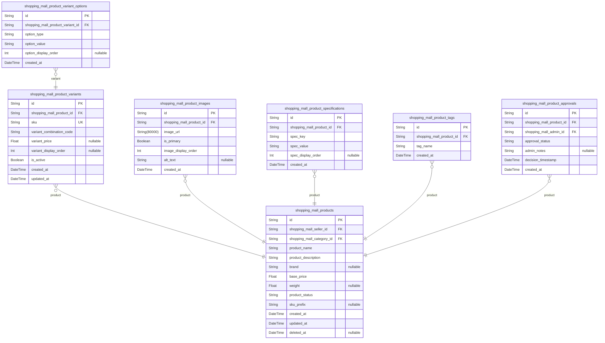

# Prisma Markdown

> Generated by [`prisma-markdown`](https://github.com/samchon/prisma-markdown)

- [Authentication](#authentication)
- [Actors](#actors)
- [Systematic](#systematic)
- [Products](#products)
- [Inventory](#inventory)
- [Shopping](#shopping)
- [Orders](#orders)
- [Payments](#payments)
- [Shipping](#shipping)
- [Returns](#returns)
- [Reviews](#reviews)
- [Commission](#commission)

## Authentication

### `shopping_mall_auth_tokens`

JWT token storage for authentication. Stores both access tokens and
refresh tokens issued during login. Access tokens are short-lived (15
minutes) for immediate API access, while refresh tokens are long-lived
(30 days) for session continuation. Tokens are stored hashed (never
plaintext) for security compliance. Tracks token status (active, revoked,
expired) and associated session information.

Properties as follows:

- `id`: Primary Key.
- `shopping_mall_customer_id`
  > Reference to authenticated user (customer, seller, or admin). {@link
  > shopping_mall_customer.id}
- `token_type`
  > Type of token: 'access' for short-lived API tokens (15 min) or 'refresh'
  > for long-lived session tokens (30 days). Determines token expiration and
  > usage rules.
- `token_hash`
  > Bcrypt-hashed token value for secure storage. Never store plaintext
  > tokens. Hash generated with 12 salt rounds. Original token returned to
  > client only at creation time.
- `issued_at`
  > ISO 8601 timestamp when token was issued. Used to calculate token age and
  > enforce expiration. Immutable after creation.
- `expires_at`
  > ISO 8601 timestamp when token expires and becomes invalid. Access tokens
  > expire at issued_at + 15 minutes, refresh tokens at issued_at + 30 days.
- `revoked_at`
  > ISO 8601 timestamp when token was revoked (if applicable). Null if token
  > has never been revoked. Tokens are revoked on logout or during security
  > incidents.
- `last_used_at`
  > ISO 8601 timestamp when token was last used in an API request. Null if
  > token has never been used. Updated on each token usage for tracking
  > activity patterns.
- `device_id`
  > Device fingerprint hash identifying the device/browser that requested the
  > token. Used to detect token usage from unexpected devices. Generated from
  > user agent and IP address.
- `ip_address`
  > IP address from which token was requested. Used for geolocation checks
  > and detecting unusual access patterns. Supports both IPv4 and IPv6
  > formats.
- `user_agent`
  > Browser/device user agent string from token request. Used for device
  > fingerprinting and detecting browser changes. Maximum 500 characters.
- `status`
  > Current token status: 'active' (valid for use), 'revoked' (invalidated),
  > 'expired' (past expiration time). Tokens transition from active to
  > expired at expiration timestamp.

### `shopping_mall_sessions`

Server-side session management tracking user authentication state across
requests. Each active session represents a user logged in from a specific
device/browser. Stores session metadata, device information, and tracks
login/activity timestamps. Implements concurrent session limits (5 for
regular users, 10 for admins) by terminating oldest sessions when limit
exceeded.

Properties as follows:

- `id`: Primary Key.
- `shopping_mall_customer_id`
  > Reference to authenticated user who owns this session (customer, seller,
  > or admin). [shopping_mall_customer.id](#shopping_mall_customer)
- `session_token`
  > Cryptographically secure session identifier (minimum 32 random
  > characters). Used to associate requests with this session. Unique
  > globally across all sessions.
- `created_at`
  > ISO 8601 timestamp when session was created (user login time). Immutable
  > after creation. Used to calculate session age and enforce 90-day session
  > lifetime.
- `last_activity_at`
  > ISO 8601 timestamp of most recent request using this session. Updated on
  > every API request. Used to detect inactive sessions and calculate idle
  > time.
- `expires_at`
  > ISO 8601 timestamp when session expires. Sessions expire 90 days after
  > creation regardless of activity. When expired, new login required.
- `ip_address`
  > Primary IP address from which session was initiated. Used for geolocation
  > tracking and detecting impossible travel patterns. May change during
  > mobile roaming.
- `user_agent`
  > Browser/device user agent string at session creation. Used for device
  > fingerprinting and detecting suspicious agent changes. Maximum 500
  > characters.
- `device_fingerprint`
  > Cryptographic hash of device characteristics (user agent, browser, screen
  > resolution). Used to detect when same session is used from different
  > devices.
- `browser_name`
  > Parsed browser name from user agent (Chrome, Firefox, Safari, etc.). Used
  > for security analysis and user device identification.
- `operating_system`
  > Parsed operating system from user agent (Windows, macOS, iOS, Android,
  > Linux). Used for device type classification.
- `device_type`
  > Device category: 'mobile', 'tablet', 'desktop'. Determined from user
  > agent parsing. Used for responsive experience and security
  > classification.
- `status`
  > Session status: 'active' (usable), 'suspended' (locked for
  > investigation), 'expired' (past expiration time), 'terminated' (user
  > logout). Determines whether session can be used.

### `shopping_mall_session_devices`

Device tracking for multi-device session management. Records each unique
device/browser combination a user logs in from. Used to enforce
concurrent session limits (5 for users, 10 for admins), detect
unauthorized devices, and improve security through device recognition.
Links devices to sessions for holistic user authentication history.

Properties as follows:

- `id`: Primary Key.
- `shopping_mall_customer_id`
  > Reference to user who owns this device record. {@link
  > shopping_mall_customer.id}
- `shopping_mall_session_id`
  > Reference to the session associated with this device login. {@link
  > shopping_mall_sessions.id}
- `device_name`
  > User-friendly device name set by user (e.g., 'My Laptop', 'iPhone 14
  > Pro', 'Office Desktop'). Optional custom name for easy device
  > identification. Maximum 100 characters.
- `device_fingerprint`
  > Cryptographic hash identifying this specific device/browser combination.
  > Generated from user agent, resolution, plugins, timezone, and other
  > characteristics.
- `browser_name`
  > Browser name parsed from user agent (Chrome, Firefox, Safari, Edge). Used
  > for device classification and user-friendly display.
- `browser_version`
  > Browser version number (e.g., '120.0.1234.567'). Used for security checks
  > and deprecation warnings for outdated browsers.
- `operating_system`
  > Operating system name (Windows, macOS, iOS, Android, Linux). Used for
  > device classification and compatibility tracking.
- `os_version`
  > Operating system version (e.g., 'Windows 11', 'macOS 14.1'). Used for
  > security analysis and support decisions.
- `device_type`
  > Device category: 'mobile', 'tablet', 'desktop'. Determines responsive
  > behavior and interaction patterns.
- `first_login_at`
  > ISO 8601 timestamp of first login from this device. Used to identify new
  > devices and track device age.
- `last_login_at`
  > ISO 8601 timestamp of most recent login from this device. Updated on each
  > login from this device.
- `login_count`
  > Total number of times user has logged in from this device. Incremented on
  > each successful login. Used to identify frequently used devices.
- `last_ip_address`
  > Most recent IP address used with this device. May change for mobile
  > devices due to roaming. Used for location tracking.
- `trust_status`
  > Device trust level: 'trusted' (recognized), 'new' (first use, may require
  > verification), 'suspicious' (flagged for unusual behavior). Used to
  > determine if extra verification needed.
- `is_active`
  > Whether device is currently active. True if device has been used within
  > last 30 days. False marks device as dormant.

### `shopping_mall_password_reset_tokens`

Secure password reset token management for account recovery. Issues
time-limited (1 hour) tokens that allow users to reset forgotten
passwords. Tokens are one-time use only - invalidated after first use to
prevent brute force attacks. Tracks token status, usage timestamps, and
consumed status for security.

Properties as follows:

- `id`: Primary Key.
- `shopping_mall_customer_id`
  > Reference to user account requesting password reset. {@link
  > shopping_mall_customer.id}
- `token`
  > Cryptographically secure reset token (minimum 32 random characters). Sent
  > to user's email. Must be provided to verify password reset request. Never
  > displayed to user after initial generation.
- `token_hash`
  > Bcrypt-hashed token value stored in database. Original token never stored
  > plaintext. Hash generated with 12 salt rounds for security.
- `created_at`
  > ISO 8601 timestamp when reset token was generated. Used to calculate
  > token age and enforce 1-hour expiration window.
- `expires_at`
  > ISO 8601 timestamp when token expires and becomes unusable. Set to
  > created_at + 1 hour. More restrictive than access tokens (1 hour vs 15
  > minutes) for security.
- `used_at`
  > ISO 8601 timestamp when token was successfully used to reset password.
  > Null if never used. Indicates token has been consumed.
- `ip_address`
  > IP address from which token was requested. Used for fraud detection and
  > tracking password reset requests. May differ from IP of actual password
  > reset.
- `user_agent`
  > Browser/device user agent string from token request. Used for device
  > fingerprinting and detecting suspicious reset patterns.
- `status`
  > Token status: 'pending' (waiting for use), 'used' (successfully
  > redeemed), 'expired' (past expiration time). Tokens transition from
  > pending to used on successful password reset.

## Actors

### `shopping_mall_customer`

Customer user accounts representing authenticated buyers on the platform.
Stores core customer profile information including personal details,
account status, email verification state, and security settings.
Customers are the primary users who browse products, create orders, write
reviews, and manage their shopping experience on the platform.

Properties as follows:

- `id`: Primary Key.
- `email`
  > Customer's email address used for login and communication. Must be unique
  > across all customers on the platform. Email is verified during
  > registration before account activation.
- `password_hash`
  > Bcrypt-hashed password for account authentication. The plain password is
  > never stored; only the cryptographic hash is maintained for security.
  > Password updates create new hash.
- `first_name`
  > Customer's first name. Used for personalization in communications and
  > order fulfillment. Required field for all customers.
- `last_name`
  > Customer's last name. Combined with first name for complete customer
  > identification in orders and communications.
- `phone_number`
  > Customer's contact phone number in international format. Optional field
  > that enables SMS notifications and seller communication. Stored in E.164
  > format (e.g., +1-555-123-4567).
- `date_of_birth`
  > Customer's date of birth for age verification and personalization.
  > Optional field used for age-restricted products and birthday promotions.
- `gender`
  > Customer's gender for personalization and targeted recommendations.
  > Values: 'M', 'F', 'O' (Other), 'N' (Prefer not to say). Optional field.
- `profile_image_url`
  > URL to customer's profile picture. Used for display in reviews, comments,
  > and public-facing customer profiles. Optional field.
- `account_status`
  > Current status of customer account: 'ACTIVE' (normal operation),
  > 'SUSPENDED' (temporary restriction), 'DEACTIVATED' (account closed),
  > 'PENDING_EMAIL_VERIFICATION' (awaiting email confirmation). Controls
  > account access and functionality.
- `email_verified`
  > Flag indicating whether customer's email address has been verified. Email
  > verification is required for account activation and must be completed
  > within 24 hours of registration.
- `two_factor_enabled`
  > Whether two-factor authentication (2FA) is enabled for this customer
  > account. When enabled, login requires secondary verification (SMS code,
  > authenticator app).
- `two_factor_method`
  > Method used for two-factor authentication if enabled. Values: 'SMS',
  > 'EMAIL', 'AUTHENTICATOR_APP', 'BACKUP_CODES'. Null if 2FA not enabled.
- `last_login_at`
  > Timestamp of customer's most recent successful login. Used for tracking
  > account activity and detecting suspicious access patterns.
- `account_locked_until`
  > Timestamp until which account is locked due to failed login attempts.
  > Account automatically unlocks when this timestamp is reached. Null if
  > account is not locked.
- `failed_login_attempts`
  > Count of consecutive failed login attempts. Resets to zero on successful
  > login. Account locks after 5 failed attempts within 15 minutes.
- `created_at`
  > Timestamp when customer account was created. Immutable field set at
  > registration completion.
- `updated_at`
  > Timestamp of most recent account update including profile changes, status
  > changes, or password updates.
- `deleted_at`
  > Soft delete timestamp when customer account was permanently deleted. Null
  > for active/suspended accounts. Enables account recovery within compliance
  > window.
- `account_flags`
  > Comma-separated flags for account restrictions or notes:
  > 'FRAUD_INVESTIGATION', 'POLICY_VIOLATION', 'CHARGEBACK_HISTORY',
  > 'MULTIPLE_RETURNS'. Used by admins for account moderation.

### `shopping_mall_seller`

Seller merchant accounts representing businesses selling products on the
platform. Stores seller business profile, verification status, commission
configuration, and account settings. Sellers manage product inventory,
fulfill customer orders, and operate their online stores within the
marketplace ecosystem.

Properties as follows:

- `id`: Primary Key.
- `email`
  > Seller's business email address used for login and official
  > communications. Must be unique across all sellers. Email is verified
  > during onboarding.
- `password_hash`
  > Bcrypt-hashed password for seller account authentication. Plain password
  > never stored for security compliance.
- `store_name`
  > Official name of seller's store as displayed to customers. Must be unique
  > across platform. Used in product listings, orders, and customer
  > communications.
- `store_code`
  > Unique alphanumeric code for seller store (e.g., 'SELLER-001'). Used for
  > internal routing and metrics. Format: seller-assigned or system-generated
  > during registration.
- `store_description`
  > Seller's store description visible on public store page. Up to 5000
  > characters describing business, policies, and seller story. Optional
  > field.
- `store_logo_url`
  > URL to seller's store logo displayed on store page and product listings.
  > Optional field for branding.
- `store_banner_url`
  > URL to seller's store banner image displayed at top of store page.
  > Optional field for visual branding.
- `business_type`
  > Type of business entity: 'INDIVIDUAL' (sole proprietor), 'SMALL_BUSINESS'
  > (1-50 employees), 'MEDIUM_BUSINESS' (50-500 employees), 'ENTERPRISE'
  > (500+ employees). Affects commission rates and feature access.
- `business_registration_number`
  > Official business registration number (e.g., EIN, Company Registration
  > Number). Varies by jurisdiction. Optional for individual sellers in some
  > regions.
- `tax_id`
  > Tax identification number (e.g., VAT ID, GST number) for tax compliance.
  > Encrypted in database. Optional field.
- `contact_person_name`
  > Name of primary contact person for seller account. Used for communication
  > and verification purposes.
- `contact_phone`
  > Business phone number in international format. Used for seller contact
  > and verification.
- `business_address`
  > Complete business address including street, city, state, postal code,
  > country. Used for order fulfillment and seller identity verification.
- `country`
  > Country code (ISO 3166-1 alpha-2) where seller business is registered.
  > Affects tax rates, shipping capabilities, and payment processing.
- `account_status`
  > Seller account status: 'PENDING_VERIFICATION' (awaiting approval),
  > 'VERIFIED' (approved to sell), 'REJECTED' (application rejected),
  > 'SUSPENDED' (temporary restriction), 'DEACTIVATED' (account closed). Only
  > verified sellers can list and sell products.
- `verification_status`
  > Document verification status: 'PENDING' (awaiting review), 'VERIFIED'
  > (documents approved), 'REJECTED' (documents not acceptable), 'EXPIRED'
  > (verification documents expired). Separate from account_status.
- `average_rating`
  > Seller's average rating calculated from customer reviews. Range: 1.0 to
  > 5.0. Updated when new reviews are published. Used for seller visibility
  > and trust metrics.
- `total_reviews`
  > Total count of approved customer reviews for this seller's products.
  > Updated when reviews are published or removed.
- `fulfillment_rate`
  > Percentage of orders successfully fulfilled on time (0-100). Calculated
  > as: (on-time orders / total orders) * 100. Used for seller ranking and
  > visibility.
- `response_time_hours`
  > Average response time to customer inquiries in hours. Calculated from
  > support ticket response times. Used for seller performance metrics.
- `commission_rate`
  > Percentage commission charged on seller's sales (0-100). Default: 10%.
  > Premium sellers or negotiated rates may differ. Updated when seller tier
  > changes.
- `seller_tier`
  > Seller's tier/status level: 'STANDARD' (default), 'PREMIUM' (top
  > performer), 'ENTERPRISE' (high volume). Affects commission rates and
  > feature access.
- `two_factor_enabled`: Whether two-factor authentication is enabled for seller account.
- `last_login_at`: Timestamp of most recent seller dashboard login.
- `account_locked_until`
  > Timestamp until which seller account is locked due to failed login
  > attempts. Null if not locked.
- `failed_login_attempts`
  > Count of consecutive failed seller login attempts. Resets on successful
  > login.
- `created_at`: Timestamp when seller account was created during registration.
- `updated_at`: Timestamp of most recent seller account update.
- `deleted_at`
  > Soft delete timestamp when seller account was closed. Null for active
  > accounts. Enables account data retention for compliance.
- `account_flags`
  > Comma-separated admin flags: 'FRAUD_INVESTIGATION', 'POLICY_VIOLATION',
  > 'HIGH_CHARGEBACK_RATE'. Used for account moderation.

### `shopping_mall_admin`

Administrator accounts with platform management and moderation
capabilities. Admins have elevated permissions to manage users, approve
products, handle disputes, process refunds, configure settings, and
access audit logs. Admin accounts track access control levels and
maintain security audit trails.

Properties as follows:

- `id`: Primary Key.
- `email`
  > Admin's email address used for login and official administrative
  > communications. Must be unique across all admins.
- `password_hash`
  > Bcrypt-hashed password for admin authentication. Plain password never
  > stored.
- `first_name`: Admin's first name for identification and audit trails.
- `last_name`: Admin's last name for identification in administrative records.
- `admin_role`
  > Admin permission level: 'SUPER_ADMIN' (full platform access), 'ADMIN'
  > (general admin functions), 'MODERATOR' (content moderation only),
  > 'SUPPORT_ADMIN' (customer support), 'FINANCE_ADMIN' (payment management).
  > Determines feature access.
- `permission_level`
  > Numeric permission hierarchy (0-100): 100=Super Admin with all
  > permissions, 75=Admin with most permissions, 50=Moderator with
  > moderation-only permissions, 25=Support with limited access. Used for
  > permission checks.
- `account_status`
  > Admin account status: 'ACTIVE' (can access platform), 'INACTIVE' (cannot
  > access), 'SUSPENDED' (temporary restriction). Controls admin access.
- `two_factor_enabled`
  > Whether two-factor authentication is required for this admin. Mandatory
  > for Super Admin and recommended for all admins.
- `last_login_at`: Timestamp of admin's most recent login.
- `account_locked_until`
  > Timestamp until which admin account is locked due to failed login
  > attempts. Null if not locked.
- `failed_login_attempts`
  > Count of consecutive failed admin login attempts. Resets on successful
  > login.
- `created_at`: Timestamp when admin account was created.
- `updated_at`: Timestamp of most recent admin account update.
- `deleted_at`
  > Soft delete timestamp when admin account was deactivated. Null for active
  > accounts. Enables audit trail preservation.
- `notes`
  > Administrative notes about this admin account (e.g., department,
  > responsibilities, creation reason). Optional field for documentation.

### `shopping_mall_guest`

Guest user profiles for unauthenticated users browsing the platform.
Tracks guest sessions for analytics, recommendations, and fraud
detection. Guests can browse products and read reviews but cannot
purchase or create accounts. Guest data enables anonymous user experience
tracking and recommendations.

Properties as follows:

- `id`: Primary Key.
- `guest_code`
  > Unique anonymous identifier for guest session. Generated format: 'GUEST-'
  > + random string. Used to track guest activity without personal
  > identification.
- `session_id`
  > Reference to the guest's current session. Links to session tracking
  > system for timeout and activity monitoring.
- `device_fingerprint`
  > Hash of device characteristics (user agent, IP, browser) for fraud
  > detection and session security. Can identify same device accessing
  > platform.
- `ip_address`
  > IP address of guest user request. Used for geographic targeting and fraud
  > detection. Stored for security audit.
- `country`
  > Country code (ISO 3166-1 alpha-2) derived from IP or user preference.
  > Used for product availability and recommendation localization.
- `preferred_language`
  > Guest's language preference (ISO 639-1 code, e.g., 'en', 'fr'). Can be
  > inferred from browser settings or explicitly set.
- `browsing_history`
  > Comma-separated list of recently viewed product IDs for recommendation
  > engine. Stored as denormalized data for performance. Cleared on session
  > timeout.
- `cart_items_count`
  > Count of items in guest's temporary shopping cart (not persisted if guest
  > doesn't register). Used for analytics.
- `created_at`: Timestamp when guest session was initiated.
- `last_activity_at`
  > Timestamp of guest's most recent activity. Used to determine session
  > timeout.
- `deleted_at`
  > Soft delete timestamp when guest session expired or ended. Null for
  > active guest sessions.

### `shopping_mall_customer_addresses`

Multiple delivery addresses associated with customers for flexible order
fulfillment. Customers can save multiple addresses (home, work, family,
etc.) and select delivery address during checkout. Addresses include
validation status and default address tracking for convenient ordering.

Properties as follows:

- `id`: Primary Key.
- `shopping_customer_id`
  > Reference to the customer who owns this address. {@link
  > shopping_mall_customer.id}
- `address_label`
  > User-defined label for address: 'Home', 'Work', 'Office', 'Parents',
  > 'Vacation Home', etc. Helps customer quickly identify desired address
  > during checkout.
- `is_default`
  > Whether this is the customer's default delivery address. Used for quick
  > checkout. Only one address per customer can be default.
- `recipient_name`
  > Name of person who will receive delivery at this address. May differ from
  > customer name for household members or business locations.
- `recipient_phone`
  > Contact phone number for delivery. Used by shipping carriers for delivery
  > coordination and exception handling.
- `street_address`
  > Full street address including number and street name. Example: '123 Main
  > Street Apt 4B' or 'PO Box 456'.
- `city`: City or town name where address is located.
- `state_province`
  > State, province, or region code. Format varies by country (e.g., 'CA' for
  > California, 'BC' for British Columbia).
- `postal_code`
  > Postal code in country-specific format. Examples: '90210' (USA), 'V6B
  > 4X8' (Canada), 'SW1A 1AA' (UK). Validated against country format rules.
- `country`
  > Country code (ISO 3166-1 alpha-2) where address is located. Determines
  > shipping availability and tax calculations.
- `address_type`
  > Type of address: 'RESIDENTIAL' (home address), 'BUSINESS'
  > (office/business), 'PO_BOX' (postal box). Used for delivery method
  > selection.
- `delivery_instructions`
  > Special delivery instructions (e.g., 'Use back gate', 'Leave with
  > neighbor', 'Ring twice'). Passed to shipping carrier for delivery
  > optimization.
- `is_verified`
  > Whether address has been verified as deliverable by shipping carriers.
  > Unverified addresses may have delivery issues.
- `created_at`: Timestamp when customer added this address.
- `updated_at`: Timestamp of most recent address modification.
- `deleted_at`
  > Soft delete timestamp when customer archived address. Null for active
  > addresses. Allows removal without losing order history.

### `shopping_mall_seller_bank_accounts`

Bank account information for seller commission payouts and fund
transfers. Stores encrypted bank details for financial transactions and
seller fund management. Includes verification status and preferred
payment method configuration. Critical for seller payment processing and
financial reconciliation.

Properties as follows:

- `id`: Primary Key.
- `shopping_seller_id`
  > Reference to the seller who owns this bank account. {@link
  > shopping_mall_seller.id}
- `account_holder_name`
  > Name of bank account holder. Must match bank records for account
  > verification and compliance.
- `bank_name`
  > Official name of the bank issuing the account. Example: 'JPMorgan Chase',
  > 'Bank of America'.
- `bank_code`
  > Bank's routing number (USA), SWIFT code, or country-specific bank code
  > for wire transfers.
- `account_number_encrypted`
  > Bank account number encrypted using application-level encryption. Never
  > stored in plain text for PCI compliance. Encryption key stored
  > separately.
- `account_number_last4`
  > Last 4 digits of bank account for customer reference (e.g., '5678'). Used
  > to display account without revealing full number.
- `account_type`
  > Type of bank account: 'CHECKING' (standard business account), 'SAVINGS'
  > (interest-bearing), 'MONEY_MARKET' (limited transfers). Affects transfer
  > capabilities.
- `currency`
  > ISO 4217 currency code for the bank account (e.g., 'USD', 'EUR', 'GBP').
  > Payouts are made in this currency.
- `is_primary`
  > Whether this is the primary payout account for commissions. Only one
  > account per seller can be primary. Fallback for disputes and reversals.
- `verification_status`
  > Bank account verification status: 'PENDING' (awaiting verification),
  > 'VERIFIED' (confirmed valid), 'FAILED' (rejected during verification),
  > 'UNVERIFIED' (needs re-verification). Only verified accounts receive
  > payouts.
- `verification_attempts`
  > Number of verification attempts made for this bank account. Failed
  > verification may indicate incorrect account details.
- `verified_at`
  > Timestamp when bank account was successfully verified. Null if not
  > verified.
- `created_at`: Timestamp when seller added this bank account.
- `updated_at`: Timestamp of most recent bank account update.
- `deleted_at`
  > Soft delete timestamp when bank account was removed. Null for active
  > accounts. Preserves payment history.

### `shopping_mall_seller_verification_documents`

Seller identity and business verification documents for regulatory
compliance and fraud prevention. Stores document types, upload status,
verification results, and rejection reasons. Enables multi-step seller
onboarding with document validation and compliance tracking.

Properties as follows:

- `id`: Primary Key.
- `shopping_seller_id`
  > Reference to the seller who submitted this verification document. {@link
  > shopping_mall_seller.id}
- `document_type`
  > Type of verification document submitted: 'BUSINESS_LICENSE' (official
  > business registration), 'TAX_ID_DOCUMENT' (tax identification),
  > 'BANK_STATEMENT' (account verification), 'OWNER_ID' (identity
  > verification), 'ARTICLES_OF_INCORPORATION' (business formation),
  > 'PASSPORT' (personal identification), 'UTILITY_BILL' (address
  > verification). Determines validation requirements.
- `document_url`
  > URL to uploaded document file. Stored in secure cloud storage with access
  > restricted to authorized personnel. Documents expire and must be
  > re-uploaded periodically.
- `document_name`
  > Original filename of uploaded document. Used for reference in
  > verification process.
- `document_issue_date`
  > Date document was issued by issuing authority. Null if not applicable.
  > Used for expiration calculation.
- `document_expiry_date`
  > Date document expires if applicable. Null for non-expiring documents.
  > System alerts seller when expiry approaches.
- `verification_status`
  > Document verification status: 'PENDING_REVIEW' (awaiting human review),
  > 'VERIFIED' (approved as valid), 'REJECTED' (failed verification),
  > 'EXPIRED' (document needs renewal). Controls seller account eligibility.
- `verification_notes`
  > Admin notes from verification process. For rejected documents, explains
  > reason for rejection (e.g., 'Document illegible', 'Expired', 'Does not
  > match seller information'). Guides seller on corrective action.
- `verified_by_admin_id`
  > Reference to admin who verified this document. Null if not yet verified.
  > Used for audit trail.
- `verified_at`: Timestamp when document was verified or rejected. Null if still pending.
- `created_at`: Timestamp when seller uploaded this document.
- `updated_at`: Timestamp of most recent document status update.
- `deleted_at`
  > Soft delete timestamp when document was archived. Null for active
  > documents. Preserves verification history.

### `shopping_mall_user_preferences`

User-configurable preferences and settings for personalized platform
experience. Enables customers to customize interface language, currency
display, search preferences, recommendation settings, and shopping
behavior. Applies to both customers and sellers for UX personalization.

Properties as follows:

- `id`: Primary Key.
- `shopping_customer_id`
  > Reference to the customer these preferences belong to. {@link
  > shopping_mall_customer.id} Set for customer preferences, null for seller
  > preferences.
- `shopping_seller_id`
  > Reference to the seller these preferences belong to. {@link
  > shopping_mall_seller.id} Set for seller preferences, null for customer
  > preferences.
- `preferred_language`
  > ISO 639-1 language code for UI language (e.g., 'en', 'es', 'fr', 'de',
  > 'zh', 'ja'). Defaults to account creation language.
- `preferred_currency`
  > ISO 4217 currency code for price display (e.g., 'USD', 'EUR', 'GBP',
  > 'JPY'). Can differ from account currency.
- `timezone`
  > IANA timezone identifier (e.g., 'America/New_York', 'Europe/London',
  > 'Asia/Tokyo'). Used for time-based notifications and reports.
- `enable_search_history`
  > Whether to save search history for personalized recommendations. Users
  > can delete history anytime.
- `enable_personalized_recommendations`
  > Whether to enable AI-powered product recommendations based on browsing
  > and purchase history.
- `enable_price_drop_alerts`: Whether to enable notifications when prices drop on wishlisted items.
- `theme_preference`
  > UI theme preference: 'LIGHT' (light mode), 'DARK' (dark mode), 'AUTO'
  > (follow system preference). Default: 'LIGHT'.
- `product_sorting_default`
  > Default product sort order: 'RELEVANCE' (search relevance), 'PRICE_ASC'
  > (low to high), 'PRICE_DESC' (high to low), 'NEWEST' (latest first),
  > 'BEST_RATED' (highest rating). Default: 'RELEVANCE'.
- `items_per_page`
  > Number of items displayed per page (20, 50, 100). Default: 50. Affects
  > pagination.
- `show_adult_products`
  > Whether to show age-restricted products in search results. Default: false
  > (unless user verified as adult).
- `created_at`
  > Timestamp when preference record was created (usually at user
  > registration).
- `updated_at`: Timestamp of most recent preference update.

### `shopping_mall_user_notification_settings`

Detailed notification channel preferences and frequency controls for both
customers and sellers. Enables granular control over email, SMS, in-app,
and push notifications for different event types. Supports opt-in/opt-out
by channel and event category with quiet hours configuration.

Properties as follows:

- `id`: Primary Key.
- `shopping_customer_id`
  > Reference to the customer these notification settings belong to. {@link
  > shopping_mall_customer.id} Set for customer notification settings, null
  > for seller settings.
- `shopping_seller_id`
  > Reference to the seller these notification settings belong to. {@link
  > shopping_mall_seller.id} Set for seller notification settings, null for
  > customer settings.
- `email_enabled`
  > Whether to receive email notifications. Controls all email-based alerts.
  > Default: true.
- `sms_enabled`
  > Whether to receive SMS text notifications. Requires verified phone
  > number. Default: false.
- `push_enabled`
  > Whether to receive push notifications on mobile app. Default: true (if
  > app installed).
- `in_app_enabled`
  > Whether to receive in-app notifications. These always appear regardless
  > of other settings. Default: true.
- `order_notifications_enabled`
  > Whether to receive order-related notifications (confirmation, shipping,
  > delivery). Default: true.
- `review_notifications_enabled`
  > Whether to receive notifications about product reviews and ratings.
  > Default: true.
- `promotion_notifications_enabled`
  > Whether to receive promotional and marketing notifications (deals, new
  > arrivals). Default: true.
- `message_notifications_enabled`
  > Whether to receive notifications about direct messages from
  > sellers/customers. Default: true.
- `payment_notifications_enabled`: Whether to receive payment and billing notifications. Default: true.
- `notification_frequency`
  > Frequency of non-urgent notifications: 'REAL_TIME' (immediate),
  > 'DAILY_DIGEST' (batched daily), 'WEEKLY_DIGEST' (batched weekly).
  > Default: 'REAL_TIME'.
- `quiet_hours_start`
  > Start time of quiet hours in HH:MM format (24-hour). No notifications
  > sent during quiet hours. Example: '21:00'. Null if quiet hours disabled.
- `quiet_hours_end`
  > End time of quiet hours in HH:MM format (24-hour). Example: '08:00'. Null
  > if quiet hours disabled. Can be next day if wraps midnight.
- `quiet_hours_enabled`: Whether quiet hours (do-not-disturb period) are enabled. Default: false.
- `unsubscribe_all_marketing`
  > One-click unsubscribe from all marketing communications. GDPR/CAN-SPAM
  > compliance. Default: false.
- `created_at`
  > Timestamp when notification settings were first created (usually at user
  > registration).
- `updated_at`: Timestamp of most recent notification settings update.

## Systematic

### `shopping_mall_categories`

Product categories representing the hierarchical taxonomy of products.
This is a foundational system table that organizes all products into
logical groupings (e.g., Electronics, Clothing, Home & Garden).
Categories are used for product browsing, filtering, and navigation
within the platform. Works in conjunction with {@link
shopping_mall_category_hierarchy} for multi-level category organization.

Properties as follows:

- `id`: Primary Key.
- `category_name`
  > Name of the category (e.g., 'Electronics', 'Clothing', 'Home & Garden').
  > Must be unique within the system to prevent duplicate categories.
- `description`
  > Detailed description of what products are included in this category.
  > Helps customers understand the category scope and purpose.
- `category_code`
  > System-generated unique code for the category used in APIs and internal
  > references. Format: uppercase alphanumeric (e.g., 'ELEC', 'CLOTH').
- `is_active`
  > Whether this category is currently active and visible to customers.
  > Inactive categories are hidden from browse but can be reactivated without
  > data loss.
- `created_at`: Timestamp when the category was created in ISO 8601 format (UTC timezone).
- `updated_at`
  > Timestamp when the category was last modified. Auto-updated on any
  > changes to category information.
- `deleted_at`
  > Timestamp when category was soft-deleted (archived). Null if category is
  > active. Allows recovery of deleted categories.

### `shopping_mall_category_hierarchy`

Defines the hierarchical parent-child relationships between categories,
enabling multi-level category structures (e.g., Electronics > Computers >
Laptops). This allows categories to be organized into a tree structure
for improved product navigation and filtering. Works with {@link
shopping_mall_categories} to establish the category taxonomy.

Properties as follows:

- `id`: Primary Key.
- `parent_category_id`
  > Reference to the parent category's [shopping_mall_categories.id](#shopping_mall_categories).
  > This establishes the hierarchical relationship. Root-level categories
  > have null parent_id.
- `child_category_id`
  > Reference to the child category's [shopping_mall_categories.id](#shopping_mall_categories).
  > This is the subcategory in the hierarchical relationship.
- `hierarchy_level`
  > Depth level in the hierarchy (1 for root, 2 for first-level children, 3
  > for second-level, etc.). Used for navigation and breadcrumb generation.
- `sort_order`
  > Display order of this subcategory within its parent category siblings.
  > Used for consistent category ordering in UI.
- `created_at`: Timestamp when the hierarchy relationship was established.
- `updated_at`: Timestamp when the hierarchy relationship was last modified.

### `shopping_mall_sections`

Major platform sections that organize content and features into distinct
areas (e.g., Featured Products, New Arrivals, Flash Sales, Top Sellers).
Sections are different from categories - they represent feature areas or
promotional sections that may contain products from multiple categories.
These are configured by admins to organize the customer shopping
experience.

Properties as follows:

- `id`: Primary Key.
- `section_name`
  > Display name of the section visible to customers (e.g., 'Featured
  > Products', 'New Arrivals', 'Flash Sales'). Should be concise and clear.
- `section_type`
  > Type classification of section (e.g., 'featured', 'new_arrivals',
  > 'flash_sale', 'top_sellers', 'curated'). Used for organizing and
  > filtering sections by type.
- `description`
  > Detailed description explaining the section's purpose and what customers
  > can expect to find. Helps customers understand the content.
- `sort_order`
  > Display order of this section on the platform homepage and section pages.
  > Lower numbers appear first.
- `is_active`
  > Whether this section is currently visible to customers. Inactive sections
  > are hidden but can be reactivated.
- `is_featured_on_homepage`
  > Whether this section should be displayed on the platform homepage. Allows
  > selective promotion of important sections.
- `created_at`: Timestamp when the section was created.
- `updated_at`: Timestamp when the section was last modified.
- `deleted_at`
  > Timestamp when section was soft-deleted (archived). Null if section is
  > active.

### `shopping_mall_channels`

Distribution channels representing different sales paths or business
models (e.g., Direct Sales, Marketplace, B2B Channel, Wholesale, Premium
Channel). Channels allow the platform to segment products and sellers for
different sales strategies and customer groups. Products and sellers can
be assigned to specific channels.

Properties as follows:

- `id`: Primary Key.
- `channel_name`
  > Name of the sales channel (e.g., 'Direct Sales', 'Marketplace', 'B2B',
  > 'Wholesale', 'Premium'). Identifies the channel for admin configuration.
- `channel_code`
  > System code for the channel used in APIs and internal references. Format:
  > uppercase alphanumeric (e.g., 'DIRECT', 'MARKETPLACE').
- `description`
  > Detailed description of the channel's purpose, target audience, and
  > business model. Helps stakeholders understand channel positioning.
- `commission_rate`
  > Default commission rate (as percentage) for sellers on this channel.
  > Example: 0.10 for 10% commission. Can be overridden per seller.
- `min_order_value`
  > Minimum order value required for purchases on this channel. Orders below
  > this value are not processed. Example: 10.00 for $10 minimum.
- `max_order_value`
  > Maximum order value allowed for purchases on this channel. Orders
  > exceeding this value are rejected. Used to prevent fraud or system
  > issues.
- `is_active`
  > Whether this channel is currently active and accepting orders. Inactive
  > channels are temporarily closed.
- `is_public`
  > Whether this channel is visible to customers. Private channels can be
  > used for internal testing or invitation-only access.
- `created_at`: Timestamp when the channel was created.
- `updated_at`: Timestamp when the channel was last modified.
- `deleted_at`
  > Timestamp when channel was soft-deleted (archived). Null if channel is
  > active.

### `shopping_mall_system_configurations`

Global system configuration settings that control platform behavior,
policies, and operational parameters. Includes settings for commission
rates, refund policies, shipping rules, fraud detection thresholds, and
other operational constants. These configurations are managed by admins
and affect all users across the platform.

Properties as follows:

- `id`: Primary Key.
- `config_key`
  > Unique identifier/name for this configuration setting. Format:
  > CONSTANT_CASE (e.g., 'DEFAULT_COMMISSION_RATE', 'REFUND_WINDOW_DAYS',
  > 'MAX_CART_ITEMS'). Used for programmatic access.
- `config_value`
  > The configuration value as a string. Can represent various types
  > (percentage, number, boolean, text, JSON). Must be parsed appropriately
  > by application based on config_key.
- `data_type`
  > Data type of the configuration value (e.g., 'string', 'number',
  > 'boolean', 'percentage', 'json'). Helps application parse the
  > config_value correctly.
- `description`
  > Human-readable explanation of what this configuration controls and its
  > impact on platform behavior. Helps admins understand the setting.
- `is_editable`
  > Whether this configuration can be modified by admins. Some critical
  > settings may be read-only after initial setup.
- `environment`
  > Environment where this configuration applies (e.g., 'development',
  > 'staging', 'production', 'all'). Allows different configurations per
  > environment.
- `created_at`: Timestamp when this configuration was created.
- `updated_at`: Timestamp when this configuration was last modified.
- `updated_by`
  > Admin ID or username who last updated this configuration. For audit trail
  > purposes.

### `shopping_mall_feature_flags`

Feature flags enabling/disabling platform features for A/B testing,
gradual rollouts, and controlled feature releases. Allows admins to
toggle features on/off without code deployment. Supports targeting by
user segment (e.g., enable for 10% of users, specific user roles,
specific regions).

Properties as follows:

- `id`: Primary Key.
- `feature_name`
  > Unique identifier for this feature flag (e.g., 'new_checkout_flow',
  > 'ai_recommendations', 'one_click_purchase'). Used to check flag status in
  > application code.
- `feature_description`
  > Human-readable description of what this feature does and why it exists.
  > Helps admins understand the feature's purpose and impact.
- `is_enabled`
  > Master toggle controlling whether this feature is enabled globally. When
  > false, the feature is disabled for all users regardless of other
  > settings.
- `rollout_percentage`
  > Percentage of users who see this feature (0-100). Example: 25 means 25%
  > of users get the feature, 75% don't. Enables gradual rollout.
- `target_user_roles`
  > Comma-separated list of user roles who can access this feature (e.g.,
  > 'customer,seller,admin' or 'admin' for admins only). Empty/null means all
  > roles.
- `target_regions`
  > Comma-separated list of country codes where feature is available (e.g.,
  > 'US,CA,UK' or 'ALL' for all regions). Enables regional feature testing.
- `environment`
  > Environment where this flag applies (e.g., 'development', 'staging',
  > 'production', 'all'). Allows different flag states per environment.
- `created_at`: Timestamp when this feature flag was created.
- `updated_at`: Timestamp when this feature flag was last modified.
- `created_by`: Admin ID or username who created this feature flag.
- `updated_by`: Admin ID or username who last updated this feature flag.

## Products

### `shopping_mall_products`

Core product entity representing individual products in the shopping mall
catalog. Each product is a distinct offering with metadata, category
assignment, seller ownership, and status tracking. Products progress
through lifecycle states from DRAFT (initial creation) through ACTIVE
(published and available for purchase) to INACTIVE (temporarily hidden)
or ARCHIVED (historical record). This is the main product table that
anchors all variant, image, specification, and approval data. Products
are distinct from shopping_mall_product_variants which represent specific
SKU combinations with independent pricing.

Properties as follows:

- `id`: Primary Key.
- `shopping_mall_seller_id`
  > Seller who owns and manages this product. References the seller's {@link
  > shopping_mall_seller.id} account.
- `shopping_mall_category_id`
  > Primary category assignment for product organization and browsing.
  > References [shopping_mall_categories.id](#shopping_mall_categories). Required for catalog
  > organization.
- `product_name`
  > Display name of the product for catalog and search. Required field
  > between 3-255 characters. Examples: 'Premium Cotton T-Shirt', 'Wireless
  > Bluetooth Headphones'.
- `product_description`
  > Detailed product description and usage information provided by seller.
  > Required field between 10-5000 characters. HTML formatting allowed but
  > sanitized for XSS prevention. Should include material composition, care
  > instructions, and key features.
- `brand`
  > Product brand or manufacturer name. Optional field between 1-100
  > characters. Examples: 'Nike', 'Samsung', 'Apple'. Used for brand-based
  > filtering in catalog.
- `base_price`
  > Base/default price for the product in platform currency (typically USD).
  > Stored with exactly 2 decimal places. Minimum $0.01, maximum $999,999.99.
  > Individual variant SKUs may have different prices. Used as default when
  > variant-specific pricing not defined.
- `weight`
  > Product weight in kilograms (kg) for shipping cost calculation. Used in
  > logistics and fulfillment operations. Optional field. Example: 0.5 for
  > 500 grams.
- `product_status`
  > Lifecycle status of the product: 'DRAFT' (being created, not visible),
  > 'ACTIVE' (published and available for purchase), 'INACTIVE' (temporarily
  > hidden but data preserved), 'ARCHIVED' (permanently historical record, no
  > new orders). Status determines search visibility and purchase
  > eligibility.
- `sku_prefix`
  > Optional prefix for auto-generated SKU identifiers for this product's
  > variants. Examples: 'TSHIRT', 'HEADPHONE'. Used in variant SKU generation
  > for easier identification of product families.
- `created_at`
  > Timestamp when product was initially created. ISO 8601 format in UTC.
  > Immutable field set at creation. Used for sorting and audit trails.
- `updated_at`
  > Timestamp of last product information modification. ISO 8601 format in
  > UTC. Auto-updated whenever product details change. Used for change
  > tracking and freshness indicators.
- `deleted_at`
  > Timestamp when product was soft-deleted. NULL if product is active. ISO
  > 8601 format in UTC. Enables data recovery and audit trail of deletions.
  > Used for implementing soft delete pattern.

### `shopping_mall_product_variants`

Product variant entities representing specific SKU (Stock Keeping Unit)
combinations with distinct variant attributes (color, size, material,
etc.), independent pricing, and inventory tracking. Each variant is a
purchasable unit with its own SKU identifier, price, and inventory record
in the shopping_mall_inventory_skus table. Multiple variants of the same
product enable customers to select specific attribute combinations (e.g.,
Blue Size-M vs Red Size-L). Variants inherit basic information from
parent product but have independent operational characteristics. Each
variant maps to exactly one inventory SKU record for stock tracking.

Properties as follows:

- `id`: Primary Key.
- `shopping_mall_product_id`
  > Parent product that this variant belongs to. References {@link
  > shopping_mall_products.id}. All variants of a product share the same
  > parent product record.
- `sku`
  > Globally unique Stock Keeping Unit identifier for this specific variant
  > combination. Format typically: {PRODUCT_PREFIX}-{VARIANT_CODE} (e.g.,
  > 'TSHIRT-BLU-M' for Blue Medium T-Shirt). Must be unique across entire
  > platform and immutable after creation. Used for inventory tracking, order
  > fulfillment, and customer reference.
- `variant_combination_code`
  > Machine-readable identifier for variant attribute combination. Encodes
  > the specific combination of variant options like color+size. Examples:
  > 'blue-large', 'red-small-cotton'. Used for programmatic variant
  > identification and grouping.
- `variant_price`
  > Price specific to this variant, overriding the product base price if set.
  > Stored with exactly 2 decimal places. Minimum $0.01, maximum $999,999.99.
  > If null, base product price is used. Enables premium pricing for larger
  > sizes or special colors.
- `variant_display_order`
  > Display sequence for ordering variants on product detail page. Lower
  > numbers display first. Used to highlight popular variants or organize
  > presentation logically. Default: 0 (sequential order if not specified).
- `is_active`
  > Whether this specific variant is available for purchase. False to hide
  > variant without deleting data. Used to temporarily disable variants while
  > preserving order history and inventory records.
- `created_at`
  > Timestamp when variant was created. ISO 8601 format in UTC. Immutable
  > field. Used for audit trail and variant lifecycle tracking.
- `updated_at`
  > Timestamp of last variant modification. ISO 8601 format in UTC.
  > Auto-updated on changes to pricing, status, or variant attributes.

### `shopping_mall_product_variant_options`

Individual variant attribute values that compose product variants. Each
record represents an atomic variant attribute (e.g., Color='Blue',
Size='Large', Material='Cotton'). Multiple variant_options combine to
form a complete variant combination. For example, a T-shirt variant
'TSHIRT-BLU-M' is composed of: variant_option(Color=Blue),
variant_option(Size=Medium). These options enable flexible variant
definition and searchable attribute filtering in product catalog.

Properties as follows:

- `id`: Primary Key.
- `shopping_mall_product_variant_id`
  > Parent variant that contains this option. References {@link
  > shopping_mall_product_variants.id}. Multiple variant_options belong to
  > each variant.
- `option_type`
  > Type/category of variant attribute. Standard types: 'color'
  > (Color/Finish), 'size' (Size dimension), 'material' (Material
  > composition), 'style' (Alternative style), 'pattern' (Visual pattern),
  > 'configuration' (Product-specific config). Used for organizing variant
  > attributes logically.
- `option_value`
  > Specific value for this variant attribute. Examples for color: 'Blue',
  > 'Red', 'Black'; for size: 'Small', 'Medium', 'Large'; for material:
  > 'Cotton', 'Polyester'. Used for customer-facing variant selection display
  > and filtering.
- `option_display_order`
  > Display sequence for ordering this option within its type. Lower numbers
  > display first. Used to highlight preferred options or organize
  > presentation. Default: 0.
- `created_at`
  > Timestamp when variant option was created. ISO 8601 format in UTC.
  > Immutable field used for audit trail.

### `shopping_mall_product_images`

Product images for visual catalog presentation. Each image represents a
single product photo with ordering for display sequencing on product
detail pages. Exactly one image per product should be marked as primary
(used as thumbnail in search results and category listings). Images are
stored as URI references to external image storage (CDN) rather than as
BLOB data in database. Soft deletion is implemented through status
changes rather than hard deletion to preserve order history references.

Properties as follows:

- `id`: Primary Key.
- `shopping_mall_product_id`
  > Product that this image belongs to. References {@link
  > shopping_mall_products.id}. Multiple images can belong to single product.
- `image_url`
  > URL/URI pointing to the actual image file stored in CDN or external
  > storage. Should be a direct HTTP(S) link to the image file. Examples:
  > 'https://cdn.example.com/products/img123.jpg',
  > 'https://storage.example.com/images/product456.png'. Never stored as BLOB
  > in database.
- `is_primary`
  > Whether this image is the primary/thumbnail image for the product. Only
  > one image per product should have is_primary=true. Used in search
  > results, category listings, and product cards. Used for determining which
  > image to display when full gallery not available.
- `image_display_order`
  > Display sequence for image ordering in product gallery. Lower numbers
  > display first. Used to show product photos in seller-preferred order.
  > Typically: primary image first (order 0), then additional angles/details.
- `alt_text`
  > Accessibility alt text describing image content for screen readers.
  > Should clearly describe what the image shows. Example: 'Blue cotton
  > t-shirt worn by model, showing front design'. Used for accessibility
  > compliance and SEO.
- `created_at`
  > Timestamp when image record was created. ISO 8601 format in UTC.
  > Immutable field used for audit trail.

### `shopping_mall_product_specifications`

Product specifications and detailed attribute information stored as
flexible key-value pairs. Specifications include technical details like
dimensions, weight, material composition, care instructions, battery
life, processor specs, etc. This model provides extensible attribute
storage without requiring schema changes for new specification types.
Unlike rigid structured fields, specifications allow sellers to define
arbitrary attributes relevant to their product categories.

Properties as follows:

- `id`: Primary Key.
- `shopping_mall_product_id`
  > Product that this specification describes. References {@link
  > shopping_mall_products.id}. Multiple specifications can describe single
  > product.
- `spec_key`
  > Specification attribute name/key. Examples: 'material', 'dimensions',
  > 'weight', 'battery_life', 'processor', 'memory', 'color',
  > 'warranty_period'. Seller-defined keys allow flexible attribute
  > representation without schema modifications.
- `spec_value`
  > Specification attribute value. Examples: 'Cotton 100%', '10cm x 5cm x
  > 2cm', '250g', '20 hours', 'Intel i7', '16GB', 'Care: Hand wash only, dry
  > flat'. Can store complex specification details as text.
- `spec_display_order`
  > Display sequence for specification on product detail page. Lower numbers
  > display first. Organizes specifications in logical groupings (e.g.,
  > material specs before care specs).
- `created_at`
  > Timestamp when specification was added. ISO 8601 format in UTC. Immutable
  > field used for audit trail.

### `shopping_mall_product_tags`

Searchable tags for product categorization, SEO optimization, and
enhanced product discovery beyond the hierarchical category system. Tags
enable cross-category product finding and flexible organization. Unlike
rigid category hierarchies, tags allow multiple overlapping
classifications (e.g., 'outdoor', 'waterproof', 'summer-collection',
'trending' on same product). Tags are indexed for full-text search
enabling customers to find products by multiple faceted attributes.

Properties as follows:

- `id`: Primary Key.
- `shopping_mall_product_id`
  > Product that this tag is applied to. References {@link
  > shopping_mall_products.id}. Multiple tags can be applied to single
  > product.
- `tag_name`
  > Searchable tag keyword for product discovery. Examples: 'eco-friendly',
  > 'bestseller', 'new-arrival', 'premium', 'outdoor', 'waterproof',
  > 'organic'. Tags enable flexible faceted search and product filtering
  > beyond category hierarchy. Should be lowercase, hyphen-separated for
  > consistency.
- `created_at`
  > Timestamp when tag was applied to product. ISO 8601 format in UTC.
  > Immutable field used for audit trail.

### `shopping_mall_product_approvals`

Audit trail and approval workflow history for product submissions and
modifications. Captures all product approval decisions made by
administrators including approval/rejection decisions, timestamps, and
admin notes. This snapshot/audit table preserves complete product
lifecycle history tracking when products were submitted, approved,
rejected, and why. Each approval record is immutable, creating a complete
accountability record for product catalog governance. Multiple approval
records per product track submission iterations (e.g., initial rejection,
resubmission, approval).

Properties as follows:

- `id`: Primary Key.
- `shopping_mall_product_id`
  > Product that was approved or rejected. References {@link
  > shopping_mall_products.id}. Multiple approval records track approval
  > history for single product.
- `shopping_mall_admin_id`
  > Administrator who made the approval decision. References {@link
  > shopping_mall_admin.id}. Tracks accountability for approval decisions.
- `approval_status`
  > Decision on product approval: 'PENDING' (awaiting admin review),
  > 'APPROVED' (product published to catalog), 'REJECTED' (product not
  > approved, returned for corrections). Tracks product submission outcomes.
- `admin_notes`
  > Administrative notes explaining approval decision or rejection reason.
  > For approvals: general comments. For rejections: specific issues
  > requiring correction (e.g., 'Image resolution too low - minimum
  > 1000x1000px required', 'Product description contains prohibited
  > keywords'). Max 2000 characters for detailed feedback.
- `decision_timestamp`
  > Timestamp when approval decision was made. ISO 8601 format in UTC.
  > Records exact moment of approval/rejection decision. Immutable field used
  > for accountability and audit trail.
- `created_at`
  > Timestamp when approval record was created. ISO 8601 format in UTC.
  > Typically matches decision_timestamp but may differ if retroactive
  > recording occurs. Immutable audit field.

## Inventory

### `shopping_mall_inventory_skus`

Master SKU inventory records tracking unique product variants with seller
ownership. Represents each Stock Keeping Unit (color, size, options
combination) separately for independent inventory management. Links to
product variants and enables multi-warehouse inventory operations. Core
table for inventory domain that connects to all inventory transactions
and stock levels.

Properties as follows:

- `id`: Primary Key.
- `shopping_mall_product_variant_id`
  > Reference to product variant defining this SKU's characteristics. {@link
  > shopping_mall_product_variants.id}
- `shopping_mall_seller_id`
  > Reference to seller who owns and manages this SKU's inventory. {@link
  > shopping_mall_seller.id}
- `sku_code`
  > Unique SKU identifier code combining product ID and variant options
  > (e.g., PROD-123-BLU-M). Used for human reference and order line item
  > tracking.
- `reorder_level`
  > Minimum inventory threshold before low stock alert triggers. Seller
  > configurable, typically 10 units. Helps seller manage restocking
  > proactively.
- `status`
  > Current SKU status: active (available for sale), inactive (temporarily
  > unavailable but data preserved), discontinued (no longer sold, archived).
  > Controls whether SKU appears in catalog.
- `created_at`
  > Timestamp when this SKU was created, typically when product variant is
  > first set up for inventory tracking.
- `updated_at`
  > Last modification timestamp for SKU metadata. Updated when status or
  > reorder level changes.

### `shopping_mall_inventory_quantities`

Real-time stock quantity tracking at SKU level. Maintains current on-hand
inventory, reserved quantities (committed to orders), and calculated
available quantities. Critical for preventing overselling. Optimized for
frequent reads and updates during order processing. Separate from
transactions table for performance.

Properties as follows:

- `id`: Primary Key.
- `shopping_mall_inventory_sku_id`
  > Reference to the SKU master record for which this quantity record
  > maintains stock levels. [shopping_mall_inventory_skus.id](#shopping_mall_inventory_skus)
- `current_quantity`
  > Total on-hand inventory units available (should never be negative).
  > Decreases when orders confirmed, increases when returns received or
  > manual adjustments add stock.
- `reserved_quantity`
  > Inventory units committed to confirmed but not yet shipped orders.
  > Reserved = placed in active orders, not available for new orders.
  > Calculated from reservation records.
- `available_quantity`
  > Calculated field: current_quantity minus reserved_quantity. Represents
  > actual available inventory for new orders. Read-only calculated value.
- `last_updated_at`
  > Timestamp of most recent inventory change (order, adjustment, return,
  > etc.). Enables tracking of inventory update frequency for monitoring
  > purposes.

### `shopping_mall_inventory_transactions`

Immutable audit trail of all inventory changes (orders, adjustments,
returns, damages). Append-only transaction log ensuring complete
accountability for every inventory unit moved. Supports compliance
auditing, historical analysis, and reconciliation. Snapshot stance
because transactions are permanent historical records never modified
after creation.

Properties as follows:

- `id`: Primary Key.
- `shopping_mall_inventory_sku_id`
  > Reference to the SKU affected by this transaction. {@link
  > shopping_mall_inventory_skus.id}
- `shopping_mall_order_id`
  > Reference to order that triggered this inventory transaction, if
  > applicable. [shopping_mall_orders.id](#shopping_mall_orders)
- `shopping_mall_inventory_adjustment_id`
  > Reference to manual adjustment request that triggered this transaction,
  > if applicable. [shopping_mall_inventory_adjustments.id](#shopping_mall_inventory_adjustments)
- `transaction_type`
  > Type of transaction: order_fulfillment (inventory allocated to order),
  > order_cancellation (order cancelled, inventory restored), return_received
  > (customer returned items), manual_adjustment (seller or admin adjusted
  > stock), damage_reported (items damaged or lost), inventory_correction
  > (system correction).
- `quantity_change`
  > Net quantity change: positive for additions (returns, restocks), negative
  > for deductions (orders, damage). Can be positive or negative depending on
  > transaction type.
- `quantity_before`
  > Inventory quantity before this transaction. Enables before/after
  > verification and reconciliation.
- `quantity_after`
  > Inventory quantity after this transaction. Should equal quantity_before +
  > quantity_change.
- `reason`
  > Detailed reason for transaction from predefined list: Restock,
  > Damage/Loss, Physical Count Correction, Return Received, System Error
  > Correction, Order Fulfillment, Other. Helps categorize and analyze
  > inventory changes.
- `notes`
  > Optional detailed notes about the transaction (max 500 characters). May
  > include explanation of discrepancies, damage details, or adjustment
  > justification.
- `initiated_by_type`
  > Type of user initiating transaction: seller (seller-initiated
  > adjustment), admin (admin-initiated correction), system (automatic
  > order/return processing). Tracks responsibility for changes.
- `initiated_by_id`
  > UUID of user (seller or admin) or system identifier initiating this
  > transaction. Enables audit trail showing who made change.
- `ip_address`
  > IP address from which transaction was initiated, if applicable
  > (seller/admin adjustment). Null for system-generated transactions.
  > Security audit trail.
- `transaction_timestamp`
  > Exact timestamp when transaction occurred. Enables precise sequencing of
  > inventory changes for reconciliation.

### `shopping_mall_inventory_reservations`

Inventory holds for pending or processing orders. Tracks reserved
quantities to prevent overselling when multiple customers simultaneously
purchase limited stock. Reservation timeout mechanism (15 minutes
typical) releases expired holds. Bridges order system with inventory
tracking for concurrent safety. Primary stance because sellers may
directly query their reservations.

Properties as follows:

- `id`: Primary Key.
- `shopping_mall_inventory_sku_id`
  > Reference to SKU whose inventory is being reserved. {@link
  > shopping_mall_inventory_skus.id}
- `shopping_mall_order_id`
  > Reference to order for which inventory is reserved. {@link
  > shopping_mall_orders.id}
- `shopping_mall_order_item_id`
  > Reference to specific order line item being reserved. {@link
  > shopping_mall_order_items.id}
- `reserved_quantity`
  > Number of units reserved for this order item. Subtracted from available
  > inventory until order confirms or reservation expires.
- `status`
  > Reservation status: reserved (hold active), released (hold
  > cancelled/expired), committed (converted to permanent allocation). Tracks
  > lifecycle of hold.
- `reserved_at`
  > Timestamp when inventory was reserved for this order. Marks start of hold
  > period.
- `reservation_expires_at`
  > When this reservation automatically expires if not converted to confirmed
  > order (typically 15 minutes after reserved_at). Prevents indefinite
  > holds.
- `confirmed_at`
  > Timestamp when reservation was confirmed (converted to permanent
  > inventory allocation when order payment processed). Null if still
  > reserved or released.
- `released_at`
  > Timestamp when reservation was released (order cancelled, session
  > timeout, or refund processed). Null if still reserved or committed.

### `shopping_mall_inventory_adjustments`

Records seller-initiated inventory quantity adjustments for restock,
damage corrections, or physical count discrepancies. Requires
documentation of reason and optional admin approval for certain
adjustment types. Bridges manual operations with inventory transaction
audit trail. Enables tracking of all inventory modifications with
approval workflows.

Properties as follows:

- `id`: Primary Key.
- `shopping_mall_inventory_sku_id`: Reference to SKU being adjusted. [shopping_mall_inventory_skus.id](#shopping_mall_inventory_skus)
- `shopping_mall_seller_id`
  > Reference to seller initiating this adjustment. {@link
  > shopping_mall_seller.id}
- `adjustment_type`
  > Type of adjustment: restock (adding new inventory), correction (fixing
  > count discrepancy), damage (removing damaged units), loss (theft/missing
  > units), return_received (manual return entry), other. Categorizes reason
  > for change.
- `quantity_change`
  > Net quantity adjustment: positive for additions (restocking), negative
  > for removals (damage, correction). Applied to current inventory.
- `reason`
  > Detailed reason for adjustment from predefined list: Restock,
  > Damage/Loss, Physical Count Correction, Return Received, System Error
  > Correction, Other. Explains justification for change.
- `notes`
  > Optional seller notes providing additional context (max 1000 characters).
  > May explain discrepancy details, damage circumstances, or correction
  > justification.
- `requires_approval`
  > Whether this adjustment requires admin approval before taking effect
  > (true for damage/loss/corrections exceeding threshold, false for routine
  > restock). Controls workflow.
- `approval_status`
  > Status of approval workflow: pending (awaiting admin review), approved
  > (admin approved, applied), rejected (admin rejected, not applied). If
  > requires_approval=false, defaults to approved immediately.
- `approved_by_id`
  > Admin ID who approved or rejected this adjustment. Null if pending or not
  > requiring approval. Tracks admin accountability.
- `approval_notes`
  > Admin comments on approval/rejection decision (max 500 characters).
  > Explains approval reasoning or rejection justification.
- `requested_at`
  > Timestamp when seller submitted adjustment request. Marks beginning of
  > approval workflow.
- `approved_at`
  > Timestamp when adjustment was approved and applied. Null if pending or
  > rejected.

### `shopping_mall_low_stock_alerts`

Alerts triggered when SKU inventory falls below seller-configured reorder
level threshold. Tracks alert generation, seller acknowledgment, and
resolution status. Supports seller notifications and inventory management
workflows. Enables inventory forecasting showing estimated days to
stockout based on sales velocity. Helps prevent unexpected stock
shortages.

Properties as follows:

- `id`: Primary Key.
- `shopping_mall_inventory_sku_id`
  > Reference to SKU that triggered the low stock alert. {@link
  > shopping_mall_inventory_skus.id}
- `alert_type`
  > Type of alert: low_stock (below threshold but>0), out_of_stock
  > (quantity=0), critical_stock (below 5 units). Differentiates severity of
  > inventory situation.
- `threshold_value`
  > Reorder threshold that was breached to trigger this alert. Typically 10
  > units or seller-configured value. For reference to understand alert
  > trigger.
- `current_quantity`
  > SKU quantity at time alert was triggered. Captures stock level context
  > for alert history.
- `status`
  > Alert status: pending (new alert, not yet addressed), acknowledged
  > (seller reviewed), resolved (inventory restocked/addressed). Tracks alert
  > lifecycle.
- `estimated_days_to_stockout`
  > Forecast of days until inventory reaches zero based on recent sales
  > velocity. Helps seller prioritize restocking urgency. Null if
  > insufficient sales history.
- `recent_sales_velocity`
  > Average units sold per day in last 30 days. Used to calculate
  > estimated_days_to_stockout. Null if insufficient sales history.
- `alert_triggered_at`
  > Timestamp when alert was generated and detected by system. Marks when
  > stock fell below threshold.
- `acknowledged_at`
  > Timestamp when seller acknowledged/reviewed this alert. Null if still
  > pending.
- `resolved_at`
  > Timestamp when alert was resolved (inventory was restocked or issue
  > addressed). Null if still pending or acknowledged.

### `shopping_mall_inventory_history`

Historical snapshots of SKU inventory quantities at point-in-time
intervals for reporting and trend analysis. Complements transaction log
with period summaries. Enables historical reporting, forecasting, and
inventory trending analysis. Read-only archival data supporting business
intelligence. Snapshot stance because records are immutable historical
captures.

Properties as follows:

- `id`: Primary Key.
- `shopping_mall_inventory_sku_id`
  > Reference to SKU for which this is a historical snapshot. {@link
  > shopping_mall_inventory_skus.id}
- `current_quantity`
  > SKU quantity at snapshot time. Captures point-in-time inventory level for
  > historical tracking.
- `reserved_quantity`
  > SKU reserved quantity at snapshot time. Shows how much inventory was on
  > hold for pending orders.
- `available_quantity`
  > Calculated available quantity at snapshot time (current - reserved).
  > Shows actual sellable inventory at historical point.
- `snapshot_period`
  > Snapshot aggregation period: daily (once per day), weekly (once per
  > week), monthly (once per month). Helps categorize history granularity.
- `snapshot_date`
  > Date (typically end of period) for which this snapshot was taken. For
  > daily snapshots, represents that calendar day.
- `created_at`
  > Timestamp when this historical snapshot record was created/captured.
  > Precise timing of when snapshot was recorded.

## Shopping

### `shopping_mall_shopping_carts`

Customer shopping carts representing temporary collections of items
prepared for purchase. Each authenticated customer has at most one active
cart at any given time. Carts track items the customer intends to buy in
current session, with status lifecycle (active, abandoned,
converted_to_order). Carts persist across sessions enabling interrupted
shopping experiences. Related to [shopping_mall_customer.id](#shopping_mall_customer).

Properties as follows:

- `id`: Primary Key.
- `customer_id`
  > Customer who owns this shopping cart. Reference to {@link
  > shopping_mall_customer.id}.
- `status`
  > Cart status lifecycle: 'active' (current shopping), 'abandoned' (inactive
  > 30+ days), 'converted_to_order' (checkout completed). Tracks cart state
  > for recovery campaigns and analytics.
- `total_items`
  > Denormalized count of items in cart (updated on item addition/removal)
  > for quick dashboard display without joins. Should match sum of quantities
  > in shopping_cart_items.
- `subtotal_amount`
  > Denormalized subtotal of all items (price  quantity per item, summed).
  > Calculated from cart items but cached here for performance. In seller's
  > currency.
- `estimated_tax`
  > Estimated tax based on current delivery address and product types.
  > Recalculated when address changes or items added. Null if no address
  > selected yet.
- `estimated_shipping`
  > Estimated shipping cost based on destination address and selected
  > shipping method. Null if address or method not yet selected.
- `promo_code`
  > Applied promotional code if customer entered discount code. Null if no
  > promo applied. Used to validate discount applicability.
- `discount_amount`
  > Discount amount from applied promo code or store credits. In seller's
  > currency. Zero if no discount.
- `created_at`: Timestamp when cart was created. ISO 8601 format, UTC timezone.
- `updated_at`
  > Timestamp when cart was last modified (item added/removed/quantity
  > changed). ISO 8601 format, UTC timezone.
- `abandoned_at`
  > Timestamp when cart was marked as abandoned. Null while cart is active.
  > Used for recovery campaign targeting.
- `converted_to_order_id`
  > If cart was converted to order, stores the resulting order ID for
  > reference. Null for active/abandoned carts. Enables tracking cartorder
  > conversion.

### `shopping_mall_shopping_cart_items`

Individual items within a shopping cart. Each cart item represents one
product variant (SKU) at a specific quantity with price snapshot. Items
store prices at addition time to prevent price-change surprises during
shopping. Multiple cart items can reference same SKU from different
customers. Related to [shopping_mall_shopping_carts.id](#shopping_mall_shopping_carts) and {@link
shopping_mall_product_variants.id}.

Properties as follows:

- `id`: Primary Key.
- `shopping_cart_id`
  > Shopping cart this item belongs to. Reference to {@link
  > shopping_mall_shopping_carts.id}.
- `product_variant_id`
  > Product variant (SKU) being added to cart. Reference to {@link
  > shopping_mall_product_variants.id}.
- `quantity`
  > Number of units of this SKU in the cart. Must be positive integer (1-999
  > per business rules). Customer can adjust this value.
- `unit_price_snapshot`
  > Price of one unit at time item was added to cart. Captured for historical
  > accuracy - prevents price increase surprises. In seller's currency.
- `line_total`
  > Total for this line item (unit_price_snapshot  quantity). Calculated at
  > addition, may differ from current price if product price changed.
- `created_at`: Timestamp when item was added to cart. ISO 8601 format, UTC timezone.
- `updated_at`
  > Timestamp when item details were last modified (quantity changed). ISO
  > 8601 format, UTC timezone.

### `shopping_mall_wishlists`

Customer wishlists for saving products to review later. Each customer can
create multiple wishlists (e.g., 'Birthday Gift Ideas', 'Home Decor',
'Tech Wishlist'). Wishlists persist indefinitely enabling long-term
shopping plans and price tracking. Unlike carts, wishlists don't convert
to orders but rather customers add items from wishlist to cart. Related
to [shopping_mall_customer.id](#shopping_mall_customer).

Properties as follows:

- `id`: Primary Key.
- `customer_id`
  > Customer who owns this wishlist. Reference to {@link
  > shopping_mall_customer.id}.
- `name`
  > Display name for wishlist provided by customer. Examples: 'Birthday
  > Ideas', 'Home Decor', 'Tech Gadgets'. Max 100 characters.
- `description`
  > Optional description of wishlist purpose. Max 500 characters. Helps
  > customer remember what this wishlist is for.
- `is_public`
  > Whether this wishlist is publicly shareable with others or private to
  > customer only. True = shareable link generated, false = private.
- `total_items`
  > Denormalized count of items in wishlist for quick display. Should match
  > count in wishlist_items table.
- `total_value`
  > Denormalized sum of current prices of all items in wishlist. Used to show
  > customer total value of saved items.
- `created_at`: Timestamp when wishlist was created. ISO 8601 format, UTC timezone.
- `updated_at`
  > Timestamp when wishlist was last modified (item added/removed). ISO 8601
  > format, UTC timezone.

### `shopping_mall_wishlist_items`

Individual items saved in a wishlist. Each wishlist item represents one
product variant (SKU) customer wants to track. Unlike cart items,
wishlist items don't have quantity (one per item - customer can add to
cart with desired quantity later). Stores price history to track if item
is on sale. Related to [shopping_mall_wishlists.id](#shopping_mall_wishlists) and {@link
shopping_mall_product_variants.id}.

Properties as follows:

- `id`: Primary Key.
- `wishlist_id`
  > Wishlist this item belongs to. Reference to {@link
  > shopping_mall_wishlists.id}.
- `product_variant_id`
  > Product variant (SKU) saved in wishlist. Reference to {@link
  > shopping_mall_product_variants.id}.
- `price_when_added`
  > Price of product when customer added it to wishlist. Stored to track
  > price changes - enables 'item on sale' notifications. In seller's
  > currency.
- `priority`
  > Wishlist item priority: 'low', 'medium', 'high'. Allows customer to mark
  > must-have items. Helps with gift registry use cases.
- `customer_notes`
  > Personal notes customer can add about why they saved this item. Max 500
  > characters. Examples: 'Color preference: Blue', 'Size: Large'.
- `price_drop_notified`
  > Whether customer has already been notified about a price drop on this
  > item. Prevents duplicate notifications.
- `created_at`: Timestamp when item was added to wishlist. ISO 8601 format, UTC timezone.
- `updated_at`
  > Timestamp when wishlist item was last modified (notes changed, priority
  > changed). ISO 8601 format, UTC timezone.

## Orders

### `shopping_mall_orders`

Main order records capturing complete customer purchases with
transactional context. Each order represents a committed transaction from
a customer containing one or more items from potentially multiple
sellers. Orders maintain immutable pricing snapshots and track complete
lifecycle from creation through fulfillment or cancellation. Central hub
linking customers to their purchases with complete billing and shipping
information.

Properties as follows:

- `id`: Primary Key.
- `shopping_mall_customer_id`: Owned customer's [shopping_mall_customer.id](#shopping_mall_customer)
- `shopping_mall_payment_id`: Associated payment transaction's [shopping_mall_payments.id](#shopping_mall_payments)
- `order_number`
  > Human-readable order number in format ORD-YYYYMMDD-XXXXXX for customer
  > reference. Unique identifier visible to customer.
- `order_status`
  > Current order lifecycle status: PENDING (awaiting payment), CONFIRMED
  > (payment received), PROCESSING (seller preparing), SHIPPED (handed to
  > carrier), DELIVERED (received by customer), COMPLETED (order finalized),
  > CANCELLED (cancelled), RETURNED (return processed). Immutable status
  > history maintained in order_status_history table.
- `payment_status`
  > Payment status: PENDING (awaiting payment processing), COMPLETED (payment
  > received and captured), FAILED (payment declined/failed), REFUNDED
  > (refund issued). Tracks payment lifecycle independent of order status.
- `shipping_status`
  > Shipping/fulfillment status: NOT_SHIPPED (not yet sent), IN_TRANSIT (with
  > carrier), DELIVERED (confirmed delivery), EXCEPTION (delivery issue).
  > Updated from shipment tracking.
- `subtotal`
  > Calculated sum of all order items (unit_price  quantity for each item).
  > Excludes taxes and shipping. Snapshot value at order time.
- `tax_amount`
  > Calculated tax amount based on delivery address jurisdiction and
  > applicable tax rate. Immutable snapshot at order confirmation time.
- `tax_rate`
  > Tax rate percentage applied to this order (e.g., 0.08 for 8%). Stored for
  > historical accuracy and audit purposes.
- `shipping_cost`
  > Selected shipping method cost. Calculated based on destination, weight,
  > and shipping method selected by customer. Immutable after confirmation.
- `shipping_method`
  > Selected shipping method name: Standard (5-7 days), Express (2-3 days),
  > Overnight (1 day), Same-Day (same day for local), Economy (7-14 days).
  > Determines delivery timeline and cost.
- `discount_amount`
  > Total discount amount applied from promotional codes or platform
  > promotions. Snapshot value at order confirmation. Stored for financial
  > reporting and audit.
- `total_amount`
  > Final order total: subtotal + tax + shipping - discount. This is the
  > amount charged to customer. Immutable after payment confirmation for
  > billing accuracy.
- `delivery_address`
  > Complete delivery address in JSON format captured at order time: {street,
  > city, state, zip, country, recipient_name, phone}. Immutable snapshot
  > ensures historical accuracy if customer changes address later.
- `billing_address`
  > Complete billing address in JSON format captured at order time. May
  > differ from delivery address. Used for payment processing and
  > verification.
- `customer_email`
  > Customer email address at time of order (snapshot). Ensures confirmation
  > emails can be sent even if customer updates email later.
- `customer_phone`
  > Customer phone number at time of order (snapshot). Used for shipping
  > coordination if needed.
- `order_notes`
  > Internal platform notes about order for admin/support. Limited to 500
  > characters. Examples: special handling, customer service issues,
  > fulfillment notes.
- `created_at`
  > Order creation timestamp in ISO 8601 UTC. Marks when customer initiated
  > checkout and order was created in PENDING status.
- `updated_at`
  > Last modification timestamp. Updated when order status changes, payment
  > confirmed, or administrative updates occur.
- `confirmed_at`
  > Timestamp when payment was successfully confirmed and order transitioned
  > to CONFIRMED status. Null until payment completes.
- `cancelled_at`
  > Timestamp when order was cancelled. Null for non-cancelled orders. Set
  > when order transitions to CANCELLED status.
- `refund_status`
  > Refund status if applicable: NO_REFUND (no refund needed), PENDING
  > (refund requested but not processed), PROCESSING (refund in progress),
  > COMPLETED (refund issued), REJECTED (refund denied). Tracks refund
  > lifecycle separate from order status.

### `shopping_mall_order_items`

Line items within orders representing individual products with quantities
and pricing. Each order contains one or more items which may be from
different sellers. Items capture immutable price snapshots at order time
ensuring billing accuracy. Items are managed exclusively through parent
order operations and represent the detailed product composition of each
purchase.

Properties as follows:

- `id`: Primary Key.
- `shopping_mall_order_id`: Parent order's [shopping_mall_orders.id](#shopping_mall_orders)
- `shopping_mall_product_variant_id`: SKU variant's [shopping_mall_product_variants.id](#shopping_mall_product_variants)
- `shopping_mall_seller_id`: Seller owning this product's [shopping_mall_seller.id](#shopping_mall_seller)
- `product_name`
  > Product name snapshot at order time. Captured immutably so order displays
  > original product name even if seller updates name later.
- `variant_details`
  > Variant details JSON snapshot: {color, size, material, other_options}.
  > Documents exact variant customer ordered (e.g., 'Blue, Size M, Cotton').
- `unit_price`
  > Price per unit at time of order (immutable snapshot). This is the price
  > charged, not affected by any later price changes by seller.
- `quantity`
  > Number of units ordered for this line item. Positive integer between 1
  > and 999.
- `line_total`
  > Line item total: unit_price  quantity (immutable). Pre-calculated and
  > stored for quick access and audit trail.
- `item_status`
  > Individual item fulfillment status within order: PENDING (awaiting
  > fulfillment), PROCESSING (seller preparing), SHIPPED (shipped), DELIVERED
  > (received), CANCELLED (item cancelled), RETURNED (returned by customer).
  > Enables per-item tracking in multi-seller orders.
- `created_at`
  > Line item creation timestamp. Same as parent order creation time (set
  > when order is created).

### `shopping_mall_order_status_history`

Audit trail capturing every order status transition with complete
metadata for compliance and troubleshooting. Each record documents when
and why order status changed, who made the change, and supporting notes.
Implements snapshot pattern for historical accuracy - append-only records
never modified after creation. Essential for dispute resolution, SLA
tracking, and operational auditing.

Properties as follows:

- `id`: Primary Key.
- `shopping_mall_order_id`: Order being tracked's [shopping_mall_orders.id](#shopping_mall_orders)
- `status_from`
  > Previous order status before this transition (e.g., PENDING, CONFIRMED,
  > PROCESSING). Documents the state being transitioned from.
- `status_to`
  > New order status after this transition (e.g., CONFIRMED, PROCESSING,
  > SHIPPED). Documents the new state being entered.
- `changed_by`
  > Identifier of who triggered the status change: admin_user_id, seller_id,
  > system, customer. Tracks origin of status change for audit.
- `changed_by_type`
  > Type of entity making the change: ADMIN, SELLER, SYSTEM, CUSTOMER. Helps
  > identify source of change for auditing.
- `reason`
  > Explanation for the status change. Examples: 'Payment received', 'Seller
  > accepted order', 'Customer cancelled', 'Delivery confirmed'. Limited to
  > 500 characters.
- `admin_notes`
  > Internal admin notes about this status change. Used for documenting
  > special circumstances or operational decisions. Limited to 1000
  > characters.
- `ip_address`
  > IP address of the entity making the change. Used for security audit
  > trail. Can be null for system-generated changes.
- `user_agent`
  > User agent/device info for the entity making the change. Helps track
  > which system/device initiated change.
- `created_at`
  > Timestamp when status transition occurred. Records exact moment of change
  > for audit trail.

### `shopping_mall_order_notes`

Flexible note system for operational and administrative communication
about orders. Captures notes from sellers, customers, and admins with
visibility controls determining who can see each note. Enables tracking
of special requests, fulfillment issues, customer service interactions,
and internal coordination. Notes are append-only (not edited after
creation) for audit trail integrity.

Properties as follows:

- `id`: Primary Key.
- `shopping_mall_order_id`: Associated order's [shopping_mall_orders.id](#shopping_mall_orders)
- `note_type`
  > Type of note: INTERNAL_ADMIN (admin-only internal notes),
  > CUSTOMER_VISIBLE (customer can see on order), SELLER_NOTE
  > (seller-to-admin communication), CUSTOMER_REQUEST (customer-provided
  > special requests). Determines visibility and context.
- `content`
  > Note text content. Maximum 5000 characters. Examples: special delivery
  > instructions, customer service issues, fulfillment coordination,
  > operational notes.
- `created_by`
  > Identifier of who created the note: admin_id, seller_id, customer_id, or
  > 'system'. Tracks origin for audit.
- `created_by_type`
  > Type of creator: ADMIN, SELLER, CUSTOMER, SYSTEM. Indicates role of
  > person/system creating the note.
- `visibility_scope`
  > Who can view this note: ADMIN_ONLY (admin and support staff), SELLER_ONLY
  > (seller and admin), CUSTOMER_VISIBLE (customer, seller, and admin),
  > INTERNAL (all internal parties). Controls access per business rules.
- `created_at`: Note creation timestamp. Immutable - notes have permanent creation time.

### `shopping_mall_order_timestamps`

Complete lifecycle timestamps for order tracking and SLA management.
Captures all significant temporal events in order progression from
creation through fulfillment or cancellation. Separates timestamp
concerns from main orders table for clarity and enables efficient
timeline queries. All timestamps stored in UTC ISO 8601 format.
Implements 1:1 relationship with shopping_mall_orders enabling optional
addition without polluting main table.

Properties as follows:

- `id`: Primary Key.
- `shopping_mall_order_id`: Corresponding order's [shopping_mall_orders.id](#shopping_mall_orders)
- `created_at`
  > Order creation timestamp. When order was first placed in PENDING status.
  > Marks start of order lifecycle.
- `confirmed_at`
  > Payment confirmation timestamp. When payment was successfully processed
  > and order transitioned to CONFIRMED status. Null until payment completes.
- `processing_started_at`
  > Fulfillment start timestamp. When seller marked order as PROCESSING and
  > began preparing items. Null until seller begins fulfillment.
- `shipped_at`
  > Shipment timestamp. When seller provided tracking number and order
  > transitioned to SHIPPED status. Marks handoff to carrier.
- `delivered_at`
  > Delivery confirmation timestamp. When carrier confirmed delivery and
  > order transitioned to DELIVERED status. Marks customer receipt.
- `completed_at`
  > Order completion timestamp. When order transitioned to COMPLETED status,
  > typically 7 days after delivery when return window closes. Marks end of
  > active order lifecycle.
- `cancelled_at`
  > Cancellation timestamp. When order was cancelled and transitioned to
  > CANCELLED status. Null for non-cancelled orders.
- `refunded_at`
  > Refund completion timestamp. When refund was successfully processed and
  > paid to customer. Null if no refund occurred.
- `last_updated_at`
  > Last status update timestamp. Most recent timestamp when any order event
  > occurred. Used for identifying recently active orders.

## Payments

### `shopping_mall_payments`

Main payment records for customer orders. Stores complete payment
information including payment method, amount, status, and order
reference. Serves as the primary transaction record for all customer
payments processed through the platform. Links each payment to a specific
order and customer for financial tracking and reconciliation.

Properties as follows:

- `id`: Primary Key.
- `shopping_mall_customer_id`: Customer making the payment. References [shopping_mall_customer.id](#shopping_mall_customer).
- `shopping_mall_payment_method_id`
  > Payment method used for this payment. References {@link
  > shopping_mall_payment_methods.id}.
- `amount`
  > Amount charged to customer in smallest currency unit (e.g., cents for
  > USD). Must match order total exactly with no variance.
- `currency_code`
  > ISO 4217 currency code for payment (e.g., USD, EUR, GBP). Must match
  > order currency code.
- `payment_status`
  > Current payment status: PENDING (awaiting processing), COMPLETED
  > (successfully charged), FAILED (declined or error), REFUNDED (money
  > returned), DISPUTED (chargeback filed). Status transitions are: PENDING 
  > COMPLETED|FAILED, COMPLETED  REFUNDED|DISPUTED.
- `payment_method_type`
  > Type of payment method: CREDIT_CARD (Visa, Mastercard, etc.), DEBIT_CARD,
  > DIGITAL_WALLET (Apple Pay, Google Pay), BANK_TRANSFER. Snapshot of method
  > type at time of payment.
- `settlement_status`
  > Settlement status with payment processor: NOT_SETTLED (awaiting batch
  > settlement), SETTLED (funds received by merchant), DISPUTED (funds held
  > due to chargeback), CHARGEDBACK (customer won dispute). Tracks fund
  > availability.
- `error_code`
  > Payment processor error code if payment failed. Examples:
  > INSUFFICIENT_FUNDS, CARD_EXPIRED, FRAUD_DETECTED, NETWORK_ERROR. Null for
  > successful payments.
- `error_message`
  > Human-readable error message from payment gateway if payment failed. For
  > customer communication and troubleshooting.
- `idempotency_key`
  > Unique idempotency key to prevent duplicate charge attempts. Combines
  > order ID, customer ID, and timestamp. Used to detect and reject duplicate
  > payment submissions.
- `attempts`
  > Number of payment processing attempts made for this order. Starts at 1.
  > Incremented on automatic retry. Helps identify problematic payments
  > requiring manual review.
- `created_at`: Timestamp when payment record was created (payment initiated by customer).
- `updated_at`: Timestamp of last payment status update.
- `completed_at`
  > Timestamp when payment was successfully completed or finally failed. Null
  > until payment reaches terminal state.
- `settled_at`
  > Timestamp when payment settlement was confirmed by payment processor.
  > Null until funds are actually received.
- `deleted_at`
  > Soft delete timestamp. Null for active records. Set when payment is
  > archived (no longer needed for active operations).

### `shopping_mall_payment_transactions`

Individual transaction records for each payment processing attempt.
Multiple transactions can exist per payment if retry logic is triggered.
Each transaction captures complete request/response details with payment
gateway including authorization codes, processor references, and all
transaction metadata. Supports payment reconciliation and transaction
tracking.

Properties as follows:

- `id`: Primary Key.
- `shopping_mall_payment_id`
  > Reference to parent payment record. Links this transaction to {@link
  > shopping_mall_payments.id}.
- `shopping_mall_payment_gateway_record_id`
  > Reference to payment gateway record with external processor details.
  > Links to [shopping_mall_payment_gateway_records.id](#shopping_mall_payment_gateway_records).
- `transaction_sequence`
  > Sequence number of this transaction attempt (1 for first attempt, 2 for
  > first retry, etc.). Helps identify transaction history and retry
  > attempts.
- `transaction_type`
  > Type of transaction: AUTHORIZATION (card authorization), CAPTURE (fund
  > capture), REFUND (refund processing), VOID (cancellation). Tracks
  > transaction purpose.
- `amount`
  > Amount involved in this specific transaction in smallest currency unit.
  > May differ from parent payment amount if partial transaction.
- `transaction_status`
  > Transaction status: SUBMITTED (sent to gateway), PROCESSING (gateway
  > processing), APPROVED (gateway approved), DECLINED (gateway declined),
  > ERROR (technical error), TIMEOUT (no response received within timeout
  > period).
- `gateway_response_code`
  > Code returned by payment gateway (e.g., 00 for approval, 05 for
  > declined). Specific to payment processor used.
- `gateway_response_message`
  > Message returned by payment gateway describing transaction result. May be
  > error description or success confirmation.
- `authorization_code`
  > Authorization code from payment processor for approved transactions. Used
  > for settlement and reconciliation. Null for declined/error transactions.
- `processor_transaction_id`
  > Unique transaction identifier assigned by payment processor. Used for
  > dispute investigation and transaction lookup with payment provider.
- `avs_result_code`
  > Address Verification System result code from processor. Examples: M
  > (match), N (no match), U (unavailable). Used for fraud detection.
- `cvv_result_code`
  > CVV verification result code from processor. M (match), N (no match), U
  > (unavailable). Used for fraud detection.
- `request_ip_address`
  > Customer's IP address when payment was submitted. Used for fraud
  > detection and geographic verification.
- `created_at`: Timestamp when transaction was submitted to payment gateway.
- `response_received_at`
  > Timestamp when response was received from payment gateway. Null if no
  > response (timeout).
- `processing_duration_ms`
  > Time in milliseconds from submission to response received. Null if
  > timeout. Used for performance monitoring.

### `shopping_mall_payment_methods`

Secure storage of payment method information including tokenized card
data, digital wallet references, and bank account details. Implements
PCI-DSS compliance by storing only card tokens (never full card numbers),
last 4 digits, card brand, and issuer information. Supports multiple
payment method types: credit cards, debit cards, digital wallets, and
bank transfers. Each payment method is tied to a customer for future
reference and recurring payments.

Properties as follows:

- `id`: Primary Key.
- `shopping_mall_customer_id`
  > Customer who owns this payment method. References {@link
  > shopping_mall_customer.id}.
- `payment_method_type`
  > Type of payment method: CREDIT_CARD, DEBIT_CARD, DIGITAL_WALLET (Apple
  > Pay, Google Pay), BANK_TRANSFER. Determines which fields are populated.
- `card_token`
  > Tokenized card data from payment gateway. PCI-compliant - replaces full
  > card number. Never contains full 16-digit card number. Null for bank
  > transfer methods.
- `card_last_four`
  > Last 4 digits of card number for customer reference and verification
  > (e.g., 4242). Used for displaying card in UI. Null for non-card methods.
- `card_brand`
  > Card brand/network: VISA, MASTERCARD, AMEX, DISCOVER, DINERS, JCB, etc.
  > Null for non-card methods. Used for displaying payment option.
- `card_issuer`
  > Issuing bank or financial institution name (e.g., Bank of America,
  > Chase). Optional for customer reference. Null if not available.
- `card_expiration_month`
  > Card expiration month (1-12). Must be validated at each payment attempt.
  > Null for non-card methods.
- `card_expiration_year`
  > Card expiration year (e.g., 2025). Used to validate card hasn't expired.
  > Null for non-card methods.
- `cardholder_name`
  > Name on the card as it appears. Used for validation. Null for non-card
  > methods.
- `wallet_provider`
  > Digital wallet provider name: APPLE_PAY, GOOGLE_PAY, PAYPAL, etc. Null
  > for card/bank methods.
- `wallet_token`
  > Token received from digital wallet provider. Used for payment processing.
  > Null for non-wallet methods.
- `bank_account_token`
  > Tokenized bank account from gateway for bank transfers. PCI-compliant
  > alternative to storing full account numbers. Null for non-bank methods.
- `bank_account_last_four`
  > Last 4 digits of bank account number for customer reference. Null for
  > non-bank methods.
- `bank_routing_number_last_four`
  > Last 4 digits of routing number for bank transfers. For customer
  > reference only. Null for non-bank methods.
- `bank_name`: Bank name associated with bank transfer method. Null for non-bank methods.
- `is_default`
  > Whether this is customer's default payment method. Used for checkout
  > default selection. Only one method per customer should have
  > is_default=true.
- `is_active`
  > Whether this payment method is currently active and available for use.
  > Set to false if customer reports the method as invalid or compromised.
- `failed_attempts`
  > Count of consecutive failed payment attempts using this method. Reset to
  > 0 on successful payment. Incremented on failures. Helps identify
  > problematic payment methods.
- `last_used_at`
  > Timestamp of last successful payment using this method. Null if never
  > successfully used. Used to identify stale/forgotten payment methods.
- `created_at`: Timestamp when payment method was added to customer's account.
- `updated_at`
  > Timestamp when payment method details were last updated (e.g., card
  > reactivated).
- `deleted_at`
  > Soft delete timestamp. Set when customer removes payment method.
  > Preserves payment history.

### `shopping_mall_payment_gateway_records`

Records of all requests sent to and responses received from external
payment gateway providers (e.g., Stripe, PayPal). Captures complete
request/response payloads for troubleshooting, reconciliation, and audit
purposes. Implements PCI compliance by not storing sensitive card data.
Enables investigation of gateway issues and payment discrepancies. Each
record represents one complete interaction with payment provider.

Properties as follows:

- `id`: Primary Key.
- `shopping_mall_payment_id`
  > Reference to payment record for this gateway interaction. Links to {@link
  > shopping_mall_payments.id}.
- `gateway_provider`
  > Name of payment gateway provider: STRIPE, PAYPAL, SQUARE, AUTHORIZE_NET,
  > etc. Identifies which processor this record is for.
- `gateway_api_version`
  > API version of payment gateway used for this request (e.g., v1, v2).
  > Helps track compatibility issues across gateway versions.
- `request_id`
  > Unique request identifier generated by platform for request tracking.
  > Used to correlate requests across systems.
- `gateway_request_id`
  > Request ID assigned by payment gateway provider. May be null if request
  > never reached gateway (network error).
- `request_type`
  > Type of gateway request: AUTHORIZATION, CAPTURE, REFUND, VOID, INQUIRY,
  > CHARGEBACK_INQUIRY. Determines request payload structure.
- `request_payload`
  > Complete JSON request payload sent to payment gateway. IMPORTANT:
  > Sensitive data (full card numbers, CVV) must be masked or not included.
  > Format: sanitized JSON string.
- `response_payload`
  > Complete JSON response payload received from payment gateway. Contains
  > transaction result, error codes, authorization codes, processor
  > references. Format: JSON string.
- `response_status_code`
  > HTTP status code from gateway: 200 (success), 400 (bad request), 401
  > (unauthorized), 500 (server error). Helps identify gateway communication
  > issues.
- `response_received`
  > Whether response was successfully received from gateway. False indicates
  > timeout or network failure. True means HTTP response received (may still
  > indicate transaction decline).
- `created_at`: Timestamp when request was submitted to payment gateway.
- `response_received_at`
  > Timestamp when response was received from gateway. Null if request timed
  > out or never reached gateway.

### `shopping_mall_payment_refunds`

Records of refund requests and refund processing for customer orders.
Tracks complete refund lifecycle from request submission through refund
completion. Supports full refunds (entire order amount) and partial
refunds (specific line items). Records refund approvals, denials,
reversals, and completion status. Links to original payment for reversal
operations. Enables tracking of refund status including estimated arrival
date for customer communication.

Properties as follows:

- `id`: Primary Key.
- `shopping_mall_payment_id`
  > Reference to original payment being refunded. Links to {@link
  > shopping_mall_payments.id}.
- `shopping_mall_order_id`
  > Reference to the order for which refund is being processed. Links to
  > [shopping_mall_orders.id](#shopping_mall_orders).
- `requested_by_admin_id`
  > Admin user who requested or approved the refund (if admin-initiated).
  > References [shopping_mall_admin.id](#shopping_mall_admin). Null if customer-initiated
  > refund.
- `refund_amount`
  > Amount to be refunded in smallest currency unit. May be less than
  > original payment amount for partial refunds.
- `original_payment_amount`
  > Original payment amount for reference. Used to validate partial vs full
  > refund.
- `refund_status`
  > Current refund status: REQUESTED (awaiting approval), APPROVED (admin
  > approved, awaiting processing), PROCESSING (refund submitted to gateway),
  > COMPLETED (refund successfully processed), FAILED (refund attempt
  > failed), REVERSED (refund was reversed/cancelled). Status progression:
  > REQUESTED  APPROVED  PROCESSING  COMPLETED|FAILED.
- `refund_reason`
  > Reason for refund: CUSTOMER_REQUEST, PRODUCT_DEFECTIVE,
  > PRODUCT_NOT_AS_DESCRIBED, WRONG_ITEM_SHIPPED, DAMAGED_IN_TRANSIT,
  > DUPLICATE_CHARGE, FRAUD, PAYMENT_ERROR, SELLER_FRAUD, ORDER_CANCELLED,
  > RETURN_RECEIVED. Used for analytics and dispute handling.
- `refund_method`
  > How refund will be issued: ORIGINAL_METHOD (back to original card/payment
  > method), STORE_CREDIT (account credit), WALLET (digital wallet).
  > ORIGINAL_METHOD is default if payment method supports reversal.
- `is_full_refund`
  > Whether this is full refund of entire order (true) or partial refund of
  > specific items (false). Affects eligibility checks and processing.
- `affected_order_items`
  > For partial refunds, JSON array of order item IDs being refunded. Format:
  > ["item_id_1", "item_id_2"]. Empty array for full refund. Used to
  > calculate proportional tax and shipping.
- `notes`
  > Admin or system notes about the refund request. May include reason
  > clarifications, dispute details, or special handling instructions.
- `gateway_refund_id`
  > Refund transaction ID assigned by payment gateway after processing. Used
  > for tracking with payment provider and reconciliation.
- `requested_at`: Timestamp when refund was requested (by customer or admin).
- `approved_at`
  > Timestamp when refund was approved by admin or automatically approved
  > based on policy. Null until approval occurs.
- `processing_started_at`
  > Timestamp when refund processing began (submitted to payment gateway).
  > Null until processing starts.
- `completed_at`
  > Timestamp when refund was completed successfully. Funds have been
  > returned to customer. Null until completion.
- `estimated_completion_date`
  > Estimated date refund will appear in customer's account. Typically 3-7
  > business days for card refunds. Used for customer communication.
- `created_at`: Timestamp when refund record was created in system.
- `updated_at`: Timestamp when refund record was last updated.

### `shopping_mall_payment_disputes`

Records of payment disputes and chargebacks filed by customers or payment
processors. Tracks dispute lifecycle from initial filing through
investigation and final resolution. Supports multiple dispute types:
chargeback (card processor initiated), payment complaint (customer
initiated), fraud claim (security concern). Records all evidence,
communications, and resolution details. Links to payment and includes
admin investigation tracking for fair resolution of payment conflicts.

Properties as follows:

- `id`: Primary Key.
- `shopping_mall_payment_id`
  > Reference to payment under dispute. Links to {@link
  > shopping_mall_payments.id}.
- `shopping_mall_order_id`
  > Reference to order associated with disputed payment. Links to {@link
  > shopping_mall_orders.id}.
- `investigating_admin_id`
  > Admin assigned to investigate this dispute. References {@link
  > shopping_mall_admin.id}. Null if dispute not yet assigned.
- `dispute_type`
  > Type of dispute: CHARGEBACK (card processor), FRAUD_CLAIM (security
  > concern), CUSTOMER_COMPLAINT (customer filed), PAYMENT_ERROR
  > (system/gateway error). Determines investigation approach.
- `dispute_status`
  > Current dispute status: OPEN (filed, awaiting investigation),
  > INVESTIGATING (admin reviewing evidence), PENDING_RESOLUTION (awaiting
  > final decision), RESOLVED (decision made - customer wins, merchant wins,
  > or partial), APPEALING (one party appealed). Progression: OPEN 
  > INVESTIGATING  PENDING_RESOLUTION  RESOLVED|APPEALING.
- `dispute_amount`
  > Amount in dispute in smallest currency unit. May be less than full
  > payment amount.
- `customer_complaint`
  > Customer's description of the dispute issue. Null for chargebacks
  > initiated by card processor. User complaint text for investigation.
- `processor_chargeback_code`
  > Chargeback code from card processor (e.g., 4855, 1040, etc.). Null for
  > non-chargeback disputes. Used to understand processor's reason category.
- `processor_chargeback_reason`
  > Human-readable reason provided by processor for the chargeback. Examples:
  > 'Fraudulent Transaction', 'Product Not Received', 'Unauthorized'. Null
  > for non-chargeback disputes.
- `investigation_notes`
  > Admin's investigation notes including findings, evidence reviewed, and
  > reasoning. Updated as investigation progresses.
- `resolution_decision`
  > Final resolution decision: CUSTOMER_WINS (refund issued), MERCHANT_WINS
  > (dispute rejected), PARTIAL (compromise reached). Null until dispute
  > resolved.
- `resolution_reason`
  > Detailed explanation of resolution decision for both parties. Explains
  > findings and reasoning for outcome.
- `evidence_customer_provided`
  > JSON array of evidence URLs provided by customer or on their behalf.
  > Examples: ["https://evidence1.pdf", "https://evidence2.jpg"]. Used for
  > investigation.
- `evidence_merchant_provided`
  > JSON array of evidence URLs provided by merchant/admin. Examples:
  > delivery confirmation, customer communication, etc.
- `is_appealed`
  > Whether dispute has been appealed by either party. If true, should create
  > appeal workflow.
- `filed_at`: Timestamp when dispute was filed (by customer, processor, or system).
- `investigation_started_at`
  > Timestamp when investigation began (admin assigned). Null until
  > investigation starts.
- `deadline_for_response`
  > Processor deadline for merchant to respond to chargeback (typically 7-10
  > days from filing). Critical for compliance with payment processor
  > requirements.
- `resolved_at`
  > Timestamp when dispute was resolved with final decision. Null until
  > resolution occurs.
- `created_at`: Timestamp when dispute record was created in system.
- `updated_at`: Timestamp when dispute record was last updated.

### `shopping_mall_payment_reconciliation`

Records of batch payment reconciliation processes comparing platform
transaction records against payment processor settlement reports. Tracks
daily/weekly/monthly reconciliation cycles identifying discrepancies,
missing transactions, and settlement confirmations. Enables
identification and investigation of payment anomalies and ensures all
payments are properly accounted for. Stores reconciliation results and
any identified issues requiring manual intervention.

Properties as follows:

- `id`: Primary Key.
- `reconciliation_admin_id`
  > Admin user responsible for initiating or managing this reconciliation.
  > References [shopping_mall_admin.id](#shopping_mall_admin). Null if reconciliation is
  > automated.
- `reconciliation_type`
  > Type of reconciliation: DAILY (end of day), WEEKLY (weekly summary),
  > MONTHLY (monthly close), ON_DEMAND (manual ad-hoc). Determines
  > reconciliation scope and frequency.
- `reconciliation_period_start`
  > Start timestamp for transactions included in reconciliation period.
  > Inclusive.
- `reconciliation_period_end`
  > End timestamp for transactions included in reconciliation period.
  > Inclusive.
- `reconciliation_status`
  > Status of reconciliation: PENDING (in progress), COMPLETED (successfully
  > reconciled), DISCREPANCIES_FOUND (mismatches identified),
  > REQUIRES_INVESTIGATION (manual review needed), RESOLVED (issues
  > resolved). Indicates reconciliation outcome.
- `platform_transaction_count`: Count of transactions recorded in platform during reconciliation period.
- `platform_transaction_total`
  > Total value of all transactions recorded in platform during
  > reconciliation period (smallest currency unit).
- `processor_transaction_count`
  > Count of transactions reported by payment processor for reconciliation
  > period.
- `processor_transaction_total`
  > Total value of transactions reported by payment processor for
  > reconciliation period (smallest currency unit).
- `matched_transaction_count`: Count of transactions that matched between platform and processor records.
- `unmatched_in_platform`
  > Count of transactions in platform records but missing from processor
  > report. May indicate settlement lag or processing issues.
- `unmatched_in_processor`
  > Count of transactions in processor report but missing from platform
  > records. May indicate late transaction creation or system errors.
- `total_discrepancy_amount`
  > Total dollar amount of discrepancies found (smallest currency unit).
  > Absolute value of platform total vs processor total difference.
- `discrepancy_details`
  > JSON structure describing identified discrepancies:
  > {unmatched_transaction_ids: [...], amount_differences: [{transaction_id,
  > platform_amount, processor_amount}]}. Null if no discrepancies.
- `processor_gateway`
  > Name of payment processor being reconciled: STRIPE, PAYPAL, SQUARE,
  > AUTHORIZE_NET, etc. Identifies which processor's report this
  > reconciliation covers.
- `processor_settlement_batch_id`
  > Settlement batch ID from processor for this reconciliation. Used to match
  > against processor records. Null if not provided.
- `investigation_required`
  > Whether this reconciliation requires admin investigation. Set to true if
  > discrepancies exceed threshold or errors detected.
- `investigation_notes`
  > Admin notes about investigation findings and actions taken to resolve
  > discrepancies.
- `created_at`: Timestamp when reconciliation process was created/initiated.
- `completed_at`
  > Timestamp when reconciliation process completed. Null if reconciliation
  > still in progress.
- `updated_at`: Timestamp when reconciliation record was last updated.

## Shipping

### `shopping_mall_shipments`

Primary shipment records representing the physical fulfillment unit
created from orders. Contains shipment-level information including
carrier, tracking status, and timeline. Each shipment may contain
multiple items from an order and represents a distinct fulfillment
package sent to customer.

Properties as follows:

- `id`: Primary Key.
- `shopping_order_id`: Reference to the order being fulfilled. [shopping_mall_orders.id](#shopping_mall_orders)
- `shopping_shipping_carrier_id`
  > Reference to the carrier handling this shipment. {@link
  > shopping_mall_shipping_carriers.id}
- `shopping_shipping_address_id`
  > Reference to the validated delivery address for this shipment. {@link
  > shopping_mall_shipping_addresses.id}
- `shipment_number`
  > Human-readable shipment identifier in format SHIP-YYYYMMDD-XXXXXX for
  > customer reference and tracking.
- `tracking_number`
  > Carrier-provided tracking number for real-time package tracking. Unique
  > identifier from shipping carrier.
- `carrier_service_code`
  > Carrier-specific service code (e.g., 'FEDEX_GROUND', 'UPS_EXPRESS',
  > 'DHL_INTERNATIONAL') identifying service level selected.
- `status`
  > Current shipment status from carrier: pending_pickup, picked_up,
  > in_transit, out_for_delivery, delivered, exception, returned_to_sender.
  > Reflects carrier-reported status.
- `weight_kg`
  > Total weight of shipment in kilograms including all items and packaging.
  > Used for shipping cost calculation and carrier requirements.
- `estimated_delivery_date`
  > Expected delivery date and time provided by carrier based on service
  > level. May be updated as shipment progresses.
- `actual_delivery_date`
  > Actual date and time when delivery was confirmed by carrier. Null until
  > delivery is confirmed.
- `signature_required`
  > Whether signature is required upon delivery for added security and proof
  > of delivery.
- `insurance_amount`
  > Insurance coverage amount in order currency for high-value shipments.
  > Null if no insurance purchased.
- `created_at`
  > Timestamp when shipment record was created in system (when shipped from
  > warehouse).
- `updated_at`: Timestamp of last update to shipment status or information.
- `deleted_at`
  > Soft delete timestamp if shipment record is archived or voided. Null for
  > active shipments.

### `shopping_mall_shipment_items`

Individual items contained within a shipment. Represents line-items that
are part of a specific shipment, linking SKU/inventory to the shipment.
Each item references an order item and its corresponding inventory.
Enables per-item tracking and management within shipment.

Properties as follows:

- `id`: Primary Key.
- `shopping_shipment_id`
  > Reference to the parent shipment containing this item. {@link
  > shopping_mall_shipments.id}
- `shopping_order_item_id`
  > Reference to the order line item being shipped. {@link
  > shopping_mall_order_items.id}
- `shopping_inventory_sku_id`
  > Reference to the SKU inventory record for this item. {@link
  > shopping_mall_inventory_skus.id}
- `quantity`
  > Quantity of this SKU included in the shipment. May be partial if order
  > item split across multiple shipments.
- `item_status`
  > Status of this specific item within shipment: pending, packed, scanned,
  > in_transit, out_for_delivery, delivered, damaged, missing.
- `tracking_status`
  > Item-level tracking status synchronized from shipment tracking. May
  > differ from shipment status if item damaged/missing.
- `created_at`: Timestamp when shipment item record was created.
- `updated_at`: Timestamp of last update to item status or information.

### `shopping_mall_shipment_tracking`

Immutable audit trail of all tracking events and status updates
throughout shipment lifecycle. Records every status change reported by
carrier including timestamps, locations, and event details. Enables
complete historical tracking and troubleshooting.

Properties as follows:

- `id`: Primary Key.
- `shopping_shipment_id`
  > Reference to the shipment this tracking event belongs to. {@link
  > shopping_mall_shipments.id}
- `event_timestamp`
  > Timestamp when the tracking event occurred according to carrier (ISO 8601
  > format UTC timezone).
- `event_code`
  > Carrier-specific event code (e.g., 'PKG_DELIVERED', 'IN_TRANSIT',
  > 'DELIVERY_ATTEMPTED'). Enables carrier-agnostic event handling.
- `event_status`
  > Status name from event: pending_pickup, picked_up, in_transit,
  > out_for_delivery, delivered, exception, returned. Human-readable status.
- `event_description`
  > Detailed description of the tracking event from carrier (e.g., 'Package
  > delivered to customer', 'Delivery attempted - customer not home').
- `location_city`
  > City or facility location where event occurred. Null if location
  > unavailable from carrier.
- `location_state`: State or province of event location. Null if location unavailable.
- `location_country`: Country of event location. Null if location unavailable.
- `exception_code`
  > Carrier exception code if event indicates problem (e.g.,
  > 'DELIVERY_FAILED', 'WEATHER_DELAY'). Null if no exception.
- `exception_description`
  > Detailed description of exception or problem. Null if no exception. Helps
  > troubleshoot delivery issues.
- `created_at`
  > Timestamp when tracking record was received and stored in system (server
  > time).

### `shopping_mall_shipping_addresses`

Validated delivery addresses for shipments, captured at time of shipment
creation for historical accuracy. Denormalizes customer address data to
preserve exact delivery location even if customer address changes later.
Enables address history tracking and dispute resolution.

Properties as follows:

- `id`: Primary Key.
- `recipient_name`: Full name of package recipient as provided in shipment order.
- `phone_number`
  > Contact phone number for delivery coordination (international format
  > accepted).
- `street_address`
  > Street address including street number and name (e.g., '123 Main Street',
  > 'PO Box 456').
- `street_address_2`
  > Secondary address line for apartment, suite, building number, etc.
  > Optional for addresses without secondary lines.
- `city`: City or town name for the delivery address.
- `state_province`
  > State, province, or region name depending on country (e.g., 'California',
  > 'Ontario').
- `postal_code`
  > ZIP code or postal code in format appropriate to country (e.g., '90210'
  > for US, 'M5V 3A8' for Canada).
- `country`
  > Country name or ISO country code for international delivery address
  > validation.
- `special_instructions`
  > Delivery instructions from customer (e.g., 'Leave at back door', 'Require
  > signature', 'Call upon arrival'). Max 500 characters.
- `address_validated`
  > Whether address was validated by carrier API or address verification
  > service before shipment creation.
- `created_at`: Timestamp when shipping address record was created (at shipment time).

### `shopping_mall_delivery_confirmations`

Final delivery confirmation records representing successful package
receipt by customer. Captures proof of delivery details including
signature, photos, recipient information, and exact delivery timestamp.
Creates immutable record of delivery completion for order fulfillment and
dispute resolution.

Properties as follows:

- `id`: Primary Key.
- `shopping_shipment_id`: Reference to the delivered shipment. [shopping_mall_shipments.id](#shopping_mall_shipments)
- `confirmation_timestamp`
  > Exact date and time when carrier confirmed delivery (ISO 8601 format UTC
  > timezone).
- `delivered_to`
  > Name or description of person/entity that received the package (e.g.,
  > 'John Doe', 'Signature on file', 'Left at door').
- `delivery_location`
  > Specific location where package was left or delivered (e.g., 'Front
  > porch', 'Back door', 'Delivery box', 'Office entrance').
- `signature_image_url`
  > URL/URI to signature image proof of delivery if signature was required.
  > Null if no signature collected.
- `delivery_photo_url`
  > URL/URI to photo taken at delivery for verification purposes. Null if no
  > photo captured.
- `weather_conditions`
  > Weather conditions reported at delivery time (e.g., 'Clear', 'Rainy').
  > Optional detail from carrier.
- `temperature_fahrenheit`
  > Temperature in Fahrenheit at delivery time for temperature-sensitive
  > items tracking. Null if not applicable.
- `carrier_confirmation_code`
  > Carrier's confirmation code for this delivery event. Used for dispute
  > resolution and verification.
- `created_at`: Timestamp when delivery confirmation record was created in system.

### `shopping_mall_return_shipments`

Records for return shipments handling reverse logistics when customers
return ordered items. Tracks outbound return shipping to
seller/warehouse, managing the reverse fulfillment process including
return authorization, return tracking, and receipt confirmation. Linked
to original shipments for complete order return workflow.

Properties as follows:

- `id`: Primary Key.
- `shopping_shipment_id`
  > Reference to the original forward shipment being returned. {@link
  > shopping_mall_shipments.id}
- `shopping_shipping_carrier_id`
  > Reference to the carrier handling the return shipment (may differ from
  > forward shipment). [shopping_mall_shipping_carriers.id](#shopping_mall_shipping_carriers)
- `return_authorization_number`
  > Return authorization (RMA) number issued to customer for return shipment
  > identification and tracking.
- `return_reason`
  > Reason for return from customer (e.g., 'defective', 'not_as_described',
  > 'wrong_item', 'changed_mind').
- `return_tracking_number`
  > Carrier-provided tracking number for the return shipment. Enables
  > tracking of items returning to seller.
- `return_status`
  > Status of return shipment: pending, return_label_issued, in_transit,
  > received_by_seller, inspected, completed, cancelled.
- `return_label_url`
  > URL to downloadable return shipping label PDF for customer to print. Null
  > until label is generated.
- `return_label_expiry_date`
  > Deadline by which customer must ship return using provided label. After
  > this date label may be invalid.
- `shipment_sent_date`
  > Date when customer shipped the return package (when tracking picked up by
  > carrier). Null until shipped.
- `return_received_date`
  > Date when seller received and recorded receipt of returned package. Null
  > until received.
- `inspection_notes`
  > Notes from seller's inspection of returned item (condition, damages,
  > completeness check). Null until inspected.
- `inspection_status`
  > Result of inspection: pending_inspection, accepted, partial_damage,
  > condition_issue, missing_parts, not_as_returned.
- `prepaid_return_shipping`
  > Whether return shipping was prepaid by platform/seller (true) or customer
  > responsible (false).
- `created_at`
  > Timestamp when return shipment record was created (when return
  > authorized).
- `updated_at`: Timestamp of last update to return shipment status or information.

### `shopping_mall_shipping_carriers`

Carrier master data containing information about shipping service
providers (USPS, FedEx, UPS, DHL, etc.). Stores carrier integration
details, service codes, supported countries, and API configuration for
real-time tracking integration. Enables multi-carrier support and carrier
selection during checkout.

Properties as follows:

- `id`: Primary Key.
- `carrier_code`
  > Unique carrier code identifier (e.g., 'USPS', 'FEDEX', 'UPS', 'DHL').
  > Used internally for carrier selection.
- `carrier_name`
  > Full human-readable name of carrier for customer display (e.g., 'United
  > States Postal Service', 'FedEx Ground').
- `carrier_logo_url`
  > URL to carrier logo image for customer-facing interfaces. Used in order
  > tracking displays.
- `api_key`
  > Carrier API key for authentication with carrier tracking API. Encrypted
  > at rest for security.
- `api_secret`
  > Carrier API secret/password for authentication. Encrypted at rest and
  > never exposed in logs.
- `api_endpoint`
  > Base URL for carrier's API endpoint used for tracking lookups and
  > shipping label generation.
- `is_active`
  > Whether this carrier integration is currently active and available for
  > use in shipment creation.
- `supports_international`: Whether carrier supports international shipping to multiple countries.
- `supported_countries`
  > Comma-separated list of ISO country codes this carrier supports (e.g.,
  > 'US,CA,MX'). Null if international support limited.
- `tracking_url_template`
  > URL template for customer tracking page (e.g.,
  > 'https://tracking.carrier.com/track?number={tracking_number}'). Use
  > {tracking_number} as placeholder.
- `max_package_weight_kg`
  > Maximum package weight limit in kilograms this carrier will accept. Null
  > if no limit.
- `max_package_length_cm`
  > Maximum package length in centimeters. Combined with width/height used
  > for dimension limits.
- `max_package_width_cm`: Maximum package width in centimeters.
- `max_package_height_cm`: Maximum package height in centimeters.
- `estimated_delivery_days_standard`
  > Standard estimated delivery time in business days for standard shipping
  > service.
- `estimated_delivery_days_express`
  > Estimated delivery time in business days for express shipping service.
  > Null if carrier doesn't offer express.
- `estimated_delivery_days_overnight`
  > Estimated delivery time in business days for overnight shipping. Null if
  > not offered.
- `created_at`: Timestamp when carrier record was created/integrated into system.
- `updated_at`: Timestamp of last update to carrier configuration or integration details.

## Returns

### `shopping_mall_return_requests`

Main return request entity representing customer requests to return
purchased items. Captures the complete return workflow from initial
request through completion. Links to orders and customers, and tracks
return lifecycle including approval status, reason for return, and
resolution. Central entity for managing post-fulfillment reverse
transactions.

Properties as follows:

- `id`: Primary Key.
- `shopping_mall_order_id`
  > Reference to the original order being returned. Links to {@link
  > shopping_mall_orders.id}.
- `shopping_mall_customer_id`
  > Customer who initiated the return request. Links to {@link
  > shopping_mall_customer.id}.
- `shopping_mall_return_reason_id`
  > Predefined return reason selected by customer. Links to {@link
  > shopping_mall_return_reasons.id}.
- `return_number`
  > Unique human-readable return request number in format RET-YYYYMMDD-XXXXXX
  > for customer reference and tracking.
- `return_status`
  > Current status of return request: PENDING (awaiting approval), APPROVED
  > (approved by seller/admin), RECEIVED (items received), INSPECTED
  > (inspection completed), COMPLETED (return processed), CANCELLED, REJECTED
  > (by seller).
- `customer_description`
  > Detailed description provided by customer explaining reason for return,
  > up to 2000 characters.
- `return_window_days`
  > Number of days allowed for customer to initiate return from delivery
  > date, typically 30 days.
- `return_authorization_number`
  > Unique Return Merchandise Authorization (RMA) number generated when
  > return is approved, used for shipment tracking.
- `approved_at`: Timestamp when return request was approved by seller or admin.
- `received_at`: Timestamp when returned items were received at return destination.
- `inspection_completed_at`: Timestamp when inspection of returned items was completed.
- `created_at`: Timestamp when return request was initially created by customer.
- `updated_at`: Timestamp of most recent modification to return request.
- `deleted_at`
  > Soft delete timestamp for logical deletion while preserving data
  > integrity.

### `shopping_mall_return_items`

Individual items included in a return request. Represents specific
products being returned from an order. Each return item links to the
original order item and captures item-level return information including
condition and quantity being returned. Always managed through parent
return request.

Properties as follows:

- `id`: Primary Key.
- `shopping_mall_return_request_id`
  > Parent return request containing this item. Links to {@link
  > shopping_mall_return_requests.id}.
- `shopping_mall_order_item_id`
  > Original order item being returned. Links to {@link
  > shopping_mall_order_items.id}.
- `shopping_mall_product_id`: Product being returned. Links to [shopping_mall_products.id](#shopping_mall_products).
- `quantity_returned`: Number of units being returned from original order quantity.
- `item_condition`
  > Condition of returned item: UNOPENED (original packaging intact), USED
  > (shows wear but functional), DAMAGED (defective or damaged), OTHER.
- `refund_eligible`
  > Whether this item is eligible for refund based on condition and return
  > policy.
- `created_at`: Timestamp when return item was added to return request.

### `shopping_mall_return_inspections`

Inspection records for quality assurance of returned items. Captures
detailed inspection findings when returned items are received and
examined. Determines whether items meet return conditions and refund
eligibility. Can be searched and managed independently by inspection
staff.

Properties as follows:

- `id`: Primary Key.
- `shopping_mall_return_item_id`
  > The return item being inspected. Links to {@link
  > shopping_mall_return_items.id}.
- `inspection_status`
  > Current inspection status: PENDING (awaiting inspection), IN_PROGRESS
  > (inspection underway), APPROVED (item meets conditions), REJECTED (item
  > does not meet conditions).
- `inspection_notes`
  > Detailed inspection notes documenting condition of item, damage
  > assessment, and findings, up to 2000 characters.
- `defect_found`
  > Whether inspection identified defect or damage caused by
  > manufacturer/shipping rather than customer use.
- `customer_damage`
  > Whether inspection identified damage caused by customer misuse or
  > improper handling.
- `restocking_fee_applicable`
  > Percentage restocking fee to be deducted from refund (0-25% depending on
  > condition), if applicable.
- `approved_at`: Timestamp when inspection was completed and approved.
- `created_at`: Timestamp when inspection record was created.
- `updated_at`: Timestamp of most recent inspection update.

### `shopping_mall_refund_requests`

Refund request management entity tracking customer requests for financial
reimbursement. Represents monetary refund workflows separate from
physical return tracking. Links to return requests and orders, tracks
refund amounts, methods, and processing status. Requires independent
management and API operations.

Properties as follows:

- `id`: Primary Key.
- `shopping_mall_return_request_id`
  > Associated return request if this refund is for returned items. Links to
  > [shopping_mall_return_requests.id](#shopping_mall_return_requests).
- `shopping_mall_order_id`: Original order being refunded. Links to [shopping_mall_orders.id](#shopping_mall_orders).
- `shopping_mall_customer_id`
  > Customer requesting the refund. Links to {@link
  > shopping_mall_customer.id}.
- `refund_number`
  > Unique human-readable refund request number in format REF-YYYYMMDD-XXXXXX
  > for tracking.
- `refund_status`
  > Current refund status: PENDING (awaiting approval), APPROVED (approved
  > for processing), PROCESSING (refund being processed), COMPLETED (refund
  > issued), FAILED (processing failed), CANCELLED.
- `refund_reason`: Customer-provided reason for refund request, up to 1000 characters.
- `refund_amount`
  > Total refund amount in customer's currency after deductions (restocking
  > fees, return shipping, etc.).
- `original_amount`: Original order amount before any refund deductions.
- `deductions_amount`
  > Total amount deducted from refund (restocking fees, return shipping fees,
  > etc.).
- `refund_method`
  > Method of refund: ORIGINAL_PAYMENT (back to original payment method),
  > STORE_CREDIT (credit in customer account), OTHER.
- `approved_at`: Timestamp when refund request was approved by seller or admin.
- `processing_started_at`: Timestamp when refund processing began.
- `completed_at`: Timestamp when refund was successfully processed and issued to customer.
- `created_at`: Timestamp when refund request was initially created.
- `updated_at`: Timestamp of most recent modification to refund request.

### `shopping_mall_refund_processing`

Refund processing workflow entity tracking stages in the refund
processing pipeline. Represents individual processing steps and actions
taken during refund execution. Links to refund requests and tracks
payment processing details, approval chain, and processing status at each
step.

Properties as follows:

- `id`: Primary Key.
- `shopping_mall_refund_request_id`
  > The refund request being processed. Links to {@link
  > shopping_mall_refund_requests.id}.
- `processing_step`
  > Current processing step: VALIDATION (validating refund eligibility),
  > APPROVAL (awaiting approval), PAYMENT_PROCESSING (submitting to payment
  > gateway), PAYMENT_CONFIRMED (payment processed), COMPLETED (refund
  > issued).
- `processing_status`: Status of current step: PENDING, IN_PROGRESS, SUCCESSFUL, FAILED.
- `payment_transaction_id`
  > Transaction ID from payment gateway when refund is submitted for
  > processing.
- `payment_confirmation_code`
  > Confirmation code from payment gateway when refund is successfully
  > processed.
- `processing_notes`
  > Notes about processing step, issues encountered, or actions taken, up to
  > 1000 characters.
- `retry_count`
  > Number of times this processing step has been retried if failures
  > occurred.
- `next_retry_at`: Scheduled time for next retry attempt if processing step failed.
- `created_at`: Timestamp when processing step was initiated.
- `updated_at`: Timestamp of most recent processing update.

### `shopping_mall_refund_history`

Historical audit trail of all refund transactions and state changes.
Append-only snapshot records capturing complete refund processing history
for compliance and audit purposes. Read-only from user perspective with
immutable records for financial compliance and dispute resolution.

Properties as follows:

- `id`: Primary Key.
- `shopping_mall_refund_request_id`
  > The refund request this history entry is for. Links to {@link
  > shopping_mall_refund_requests.id}.
- `event_type`
  > Type of history event: CREATED (refund request created), APPROVED (refund
  > approved), PROCESSING_STARTED (processing began), PAYMENT_SUBMITTED
  > (payment sent to gateway), PAYMENT_COMPLETED (payment successful), FAILED
  > (processing failed), CANCELLED, COMPLETED.
- `previous_status`: Previous refund status before this event occurred.
- `new_status`: New refund status after this event.
- `refund_amount`: Refund amount at time of this historical event.
- `event_details`
  > Detailed information about event (approver, system action, error message,
  > etc.), up to 2000 characters.
- `created_by`
  > Who or what caused this event (admin username, system process, customer,
  > automated job, etc.).
- `created_at`: Timestamp when this history event was recorded (immutable).

### `shopping_mall_return_reasons`

Reference table containing predefined return reasons that customers can
select when initiating return requests. Static lookup table managed by
system administration for standardized return reason categorization. Used
for analytics and process improvement.

Properties as follows:

- `id`: Primary Key.
- `reason_code`
  > Unique code for this return reason (e.g., DEFECTIVE, WRONG_ITEM,
  > NOT_DESCRIBED, DAMAGED_SHIPPING, CHANGED_MIND).
- `reason_label`
  > Customer-facing display label for this return reason, up to 100
  > characters.
- `reason_description`
  > Detailed description explaining this return reason to customers, up to
  > 500 characters.
- `requires_inspection`
  > Whether items returned for this reason require formal inspection before
  > refund approval.
- `refund_eligibility`
  > Refund eligibility for this reason: FULL (full refund), PARTIAL (may
  > incur fees), STORE_CREDIT_ONLY, CASE_BY_CASE.
- `sort_order`: Display order in customer-facing return reason dropdown (0 = first).
- `is_active`: Whether this reason is currently available for customer selection.
- `created_at`: Timestamp when this return reason was created.
- `updated_at`: Timestamp of most recent update to this return reason.

## Reviews

### `shopping_mall_reviews`

Core product review records capturing customer feedback after delivery.
Stores verified purchase reviews with content, ratings, and moderation
status. Each review represents one customer's experience with one product
from one order, enabling comprehensive feedback management and social
proof for the platform.

Properties as follows:

- `id`: Primary Key.
- `shopping_mall_order_id`
  > Reference to the customer's order for purchase verification. {@link
  > shopping_mall_orders.id}
- `shopping_mall_product_id`
  > Reference to the product being reviewed for aggregation and analytics.
  > [shopping_mall_products.id](#shopping_mall_products)
- `shopping_mall_customer_id`
  > Reference to the customer who wrote the review for reviewer tracking and
  > activity patterns. [shopping_mall_customer.id](#shopping_mall_customer)
- `rating`
  > Star rating from 1 to 5. Whole numbers only representing customer
  > satisfaction level (1=Terrible, 5=Excellent). Used for average rating
  > calculation and product sorting.
- `title`
  > Review title between 5 and 100 characters summarizing the review. Appears
  > in review lists and search results. Used for indexing and display.
- `content`
  > Detailed review text between 10 and 2000 characters describing customer
  > experience. Can include product quality feedback, delivery experience,
  > and recommendations. Subject to content moderation before publication.
- `review_status`
  > Current moderation status of the review. Values: DRAFT (initial
  > submission), PENDING_MODERATION (awaiting admin review), APPROVED
  > (published and visible), REJECTED (failed moderation), EDITED (customer
  > modified after approval). Determines visibility to other customers.
- `is_verified_purchase`
  > Whether this review is from a verified purchase verified by matching
  > order delivery. Always true for reviews in this table as unverified
  > reviews are rejected at submission. Used to display 'Verified Purchase'
  > badge to customers.
- `helpful_count`
  > Number of customers who marked this review as helpful via voting system.
  > Used for sorting reviews by helpfulness. Updated when review votes are
  > added/removed.
- `unhelpful_count`
  > Number of customers who marked this review as unhelpful. Used to
  > calculate net helpfulness score. Updated when review votes change.
- `moderation_notes`
  > Internal notes from moderators explaining approval, rejection, or edits
  > made to review content. Visible only to admins. Helps document moderation
  > decisions for compliance.
- `rejection_reason`
  > If rejected, the business reason for rejection (PROFANITY, HATE_SPEECH,
  > SPAM, CONTACT_INFO, OFF_TOPIC, etc.). Shown to customer to explain why
  > review was not published.
- `created_at`
  > Timestamp when review was first submitted by customer in ISO 8601 format.
  > Immutable after creation. Used to enforce 365-day review window and sort
  > reviews chronologically.
- `updated_at`
  > Timestamp when review was last modified by customer or moderator. Updated
  > when review content is edited or status changes. Helps track review
  > history.
- `published_at`
  > Timestamp when review status changed to APPROVED and became visible to
  > customers. Null until approval. Used to track when review became part of
  > product rating.
- `deleted_at`
  > Soft delete timestamp if review was removed. Null for active reviews.
  > Used for compliance and audit trails. Allows recovery if needed. Reviews
  > are soft-deleted, not permanently removed.

### `shopping_mall_review_ratings`

Aggregated rating statistics for products calculated from individual
reviews. Stores pre-calculated average ratings, rating distribution, and
review counts. Materialized quasi-view that updates when reviews are
approved/rejected. Enables efficient product search sorting and rating
display without expensive aggregation queries.

Properties as follows:

- `id`: Primary Key.
- `shopping_mall_product_id`
  > Reference to the product these ratings aggregate. One rating record per
  > product. [shopping_mall_products.id](#shopping_mall_products)
- `average_rating`
  > Calculated average rating from all approved reviews (1-5 scale with 2
  > decimal places). Examples: 4.37, 3.82, 5.00. Updated atomically when
  > reviews are approved. Used for product sorting and display.
- `total_reviews`
  > Total count of approved reviews for this product. Used for sorting by
  > popularity and displaying review count to customers (e.g., '506
  > reviews'). Updated when reviews are approved or rejected.
- `five_star_count`
  > Count of approved 5-star reviews. Part of rating distribution displayed
  > to customers. Updated atomically with review approvals.
- `four_star_count`: Count of approved 4-star reviews. Part of rating distribution bar chart.
- `three_star_count`: Count of approved 3-star reviews. Part of rating distribution.
- `two_star_count`: Count of approved 2-star reviews. Part of rating distribution.
- `one_star_count`: Count of approved 1-star reviews. Part of rating distribution.
- `rating_percentage_five_star`
  > Percentage of 5-star reviews (0-100). Calculated as (five_star_count /
  > total_reviews * 100). Rounded to 2 decimal places. Used for display and
  > filtering.
- `rating_percentage_four_star`: Percentage of 4-star reviews.
- `rating_percentage_three_star`: Percentage of 3-star reviews.
- `rating_percentage_two_star`: Percentage of 2-star reviews.
- `rating_percentage_one_star`: Percentage of 1-star reviews.
- `last_updated_at`
  > Timestamp when ratings were last recalculated. Updated every time a
  > review is approved or rejected. Used to track freshness of aggregated
  > data.

### `shopping_mall_review_moderation`

Tracks the moderation workflow and approval status for reviews. Records
which admin reviewed the review, what decision was made, and notes
explaining the decision. Provides audit trail for content moderation
compliance and enables tracking of moderation queue status.

Properties as follows:

- `id`: Primary Key.
- `shopping_mall_review_id`
  > Reference to the review being moderated. Each review has at most one
  > moderation record. [shopping_mall_reviews.id](#shopping_mall_reviews)
- `shopping_mall_admin_id`
  > Reference to the admin who performed the moderation decision. Tracks
  > which moderator approved or rejected. [shopping_mall_admin.id](#shopping_mall_admin)
- `moderation_status`
  > Current status of moderation review. Values: PENDING (awaiting review),
  > APPROVED (content accepted), REJECTED (content failed policy), EDITED
  > (moderator modified content). Determines if review becomes visible.
- `decision_reason`
  > Business reason for the moderation decision. For approvals: 'Content
  > approved' or specific reason. For rejections: PROFANITY, HATE_SPEECH,
  > SPAM, CONTACT_INFO, OFF_TOPIC, PLAGIARISM, UNSUBSTANTIATED_CLAIMS, OTHER.
- `moderator_notes`
  > Detailed internal notes from moderator explaining the decision, any
  > content issues found, or actions taken. Only visible to admins. Used for
  > compliance documentation.
- `content_modifications`
  > If moderator edited review content, describes what changes were made
  > (e.g., 'Removed external URLs', 'Removed phone number'). Null if no
  > modifications made. Used to track content curation.
- `auto_flagged`
  > Whether this review was automatically flagged by spam detection system or
  > manually reported by customer. True if automated system flagged for
  > review.
- `flagged_reason`
  > If auto-flagged, the specific reason from spam filter
  > (PROFANITY_DETECTED, SPAM_PATTERN, CONTACT_INFO_DETECTED, URL_DETECTED,
  > EXCESSIVE_CAPS, etc.). Null if manually reported.
- `created_at`
  > Timestamp when review was submitted and entered moderation queue. Records
  > when moderation process started.
- `moderated_at`
  > Timestamp when moderator completed review and made decision. Null until
  > moderation completes. Used to track moderation SLA (should be <24 hours).
- `appeal_deadline`
  > Deadline for customer to appeal rejection decision (typically 14 days
  > from rejection). After this date, rejection cannot be appealed. Null for
  > approved reviews.

### `shopping_mall_seller_responses`

Seller responses to customer reviews. Allows sellers to respond
professionally to feedback within 30 days of review publication.
Responses are publicly visible alongside reviews enabling seller
accountability and customer trust building. Sellers can edit their
responses anytime after initial submission.

Properties as follows:

- `id`: Primary Key.
- `shopping_mall_review_id`
  > Reference to the review being responded to. Each review can have at most
  > one seller response. [shopping_mall_reviews.id](#shopping_mall_reviews)
- `shopping_mall_seller_id`
  > Reference to the seller providing the response. Sellers can only respond
  > to reviews of their own products. [shopping_mall_seller.id](#shopping_mall_seller)
- `response_content`
  > Seller's response text (maximum 1000 characters). Professional response
  > to customer feedback. Subject to content moderation. Used to show seller
  > accountability and address customer concerns.
- `response_status`
  > Status of seller response. Values: DRAFT (unsaved), PUBLISHED (visible to
  > customers), DELETED (soft deleted by seller). Controls visibility.
- `created_at`
  > Timestamp when seller first submitted response. Immutable. Used to
  > enforce 30-day response window from review publication.
- `updated_at`
  > Timestamp when seller last edited response. Updated each time response
  > content changes. Shows customers if response was updated after initial
  > submission.
- `published_at`
  > Timestamp when response status changed to PUBLISHED. Used to track when
  > response became visible to customers.

### `shopping_mall_review_votes`

Tracks whether customers found reviews helpful or unhelpful. Enables
review community voting to identify most helpful reviews. One vote record
per customer per review. Used to sort reviews by usefulness and calculate
helpfulness metrics.

Properties as follows:

- `id`: Primary Key.
- `shopping_mall_review_id`: Reference to the review being voted on. [shopping_mall_reviews.id](#shopping_mall_reviews)
- `shopping_mall_customer_id`
  > Reference to the customer casting the vote. Customers can vote only once
  > per review. [shopping_mall_customer.id](#shopping_mall_customer)
- `vote_type`
  > Type of vote cast. Values: HELPFUL (found review useful), UNHELPFUL (did
  > not find useful), or null (vote removed/withdrawn). Determines whether
  > this vote increases helpful or unhelpful counts.
- `created_at`: Timestamp when vote was first cast.
- `updated_at`: Timestamp when vote was modified or removed. Used to track vote changes.

### `shopping_mall_review_images`

Product images attached to reviews as evidence or proof. Customers can
upload 1-3 images per review showing product condition, packaging, or use
case. Images are moderated before review publication. Helps other
customers evaluate product quality based on real customer photos.

Properties as follows:

- `id`: Primary Key.
- `shopping_mall_review_id`
  > Reference to the review this image belongs to. Multiple images per review
  > allowed (maximum 3). [shopping_mall_reviews.id](#shopping_mall_reviews)
- `image_url`
  > URL pointing to the uploaded product image. Images stored in cloud
  > storage (S3, CloudFront, etc.). Used to display photo evidence in review.
- `thumbnail_url`
  > URL pointing to thumbnail version of the image for list view display.
  > Smaller file size for faster loading in review lists.
- `image_caption`
  > Optional customer-provided description of what the image shows (max 200
  > characters). Examples: 'Product packaging', 'Item quality', 'In use'.
  > Helps other customers understand image context.
- `image_order`
  > Display order of this image in the review (1, 2, or 3). Determines
  > sequence when showing review images to customers. Used for consistent
  > display order.
- `image_status`
  > Moderation status of the image. Values: PENDING (awaiting scan), APPROVED
  > (scanned and safe), REJECTED (policy violation). Images with explicit
  > content are rejected.
- `created_at`: Timestamp when image was uploaded with review.

## Commission

### `shopping_mall_commission_rates`

Stores commission rate configurations for sellers. Tracks both default
platform commission rates and custom seller-specific rates with effective
dating for rate changes over time. Enables flexible commission management
and historical rate tracking for financial reconciliation.

Properties as follows:

- `id`: Primary Key.
- `shopping_mall_seller_id`
  > Reference to seller this commission rate applies to. If null, represents
  > default platform commission rate. [shopping_mall_seller.id](#shopping_mall_seller)
- `commission_rate`
  > Commission percentage applied to seller transactions. Valid range 0.0 to
  > 100.0 representing percentage (e.g., 10.0 for 10% commission).
- `commission_type`
  > Type of commission: 'PERCENTAGE' for percentage-based commission or
  > 'FIXED' for fixed amount per transaction. Default is PERCENTAGE.
- `effective_from`
  > Date and time when this commission rate becomes effective. Commission
  > rates can be scheduled for future implementation.
- `effective_to`
  > Date and time when this commission rate ceases to be effective. Null
  > indicates rate is currently active or no end date set.
- `reason_for_change`
  > Explanation for commission rate change (e.g., 'Top seller promotion',
  > 'Performance penalty', 'Seasonal adjustment'). Provides audit trail for
  > rate changes.
- `minimum_order_value`
  > Minimum order subtotal that qualifies for this commission rate. Orders
  > below this value may have different commission treatment.
- `maximum_order_value`
  > Maximum order subtotal subject to this commission rate. Orders exceeding
  > this value may have tiered commission treatment.
- `is_active`
  > Whether this commission rate is currently active and applicable to new
  > transactions. Inactive rates are historical only.
- `created_at`
  > Timestamp when commission rate record was created. Used for audit trail
  > and historical tracking.
- `updated_at`
  > Timestamp when commission rate record was last modified. Null indicates
  > no updates after creation.
- `created_by`
  > Admin user ID who created this commission rate. Used for audit trail
  > accountability.
- `updated_by`
  > Admin user ID who last updated this commission rate. Used for audit trail
  > accountability.

### `shopping_mall_seller_earnings`

Aggregated earnings and commission tracking per seller. Maintains running
totals of seller revenue, platform commissions deducted, and pending
payouts. Single record per seller enables efficient earnings dashboard
queries and payout processing.

Properties as follows:

- `id`: Primary Key.
- `shopping_mall_seller_id`
  > Reference to seller this earnings record belongs to. One-to-one
  > relationship with seller. [shopping_mall_seller.id](#shopping_mall_seller)
- `total_gross_sales`
  > Total gross sales amount (before commission deductions) accumulated over
  > seller's lifetime on platform. Updated whenever order is completed.
- `total_commission_deducted`
  > Total platform commission amount deducted from seller's sales over
  > lifetime. Calculated as sum of all commission charges across all orders.
- `total_net_earnings`
  > Total net earnings for seller (gross sales minus commissions). Represents
  > seller's cumulative profit after platform fees.
- `current_month_gross_sales`
  > Gross sales amount for current calendar month. Reset to zero on first day
  > of each month for monthly reporting.
- `current_month_commission`
  > Commission charged to seller in current calendar month. Reset to zero
  > monthly for tracking monthly commission accumulation.
- `current_month_net_earnings`
  > Net earnings for seller in current calendar month
  > (current_month_gross_sales - current_month_commission).
- `pending_commission_amount`
  > Commission amount that has been calculated but not yet transferred to
  > seller. Amount awaiting payout processing.
- `total_paid_out`
  > Total amount that has been successfully paid out to seller through
  > payouts. Cumulative lifetime payout amount.
- `total_orders_completed`
  > Count of orders successfully completed by seller that resulted in
  > earnings. Used for seller performance metrics.
- `total_orders_cancelled`
  > Count of orders cancelled that affected earnings (refunds issued). Used
  > to track order success rate.
- `total_refunds_issued`
  > Total amount refunded to customers from seller's earnings. Represents
  > earnings that were reversed due to returns.
- `commission_rate_applied`
  > Current active commission rate percentage applied to this seller's
  > transactions. May differ from platform default rate.
- `last_payout_date`
  > Date and time when seller received last payout. Null if seller has never
  > been paid out.
- `next_scheduled_payout`
  > Scheduled date and time for next payout to this seller. Based on payout
  > schedule (typically weekly).
- `created_at`
  > Timestamp when seller earnings record was created (typically at seller
  > account creation).
- `updated_at`
  > Timestamp when seller earnings were last updated. Updated whenever new
  > order is completed or payout processed.

### `shopping_mall_seller_payouts`

Individual payout transactions sent to sellers. Each record represents
one payment sent or scheduled to be sent to a seller. Tracks payout
status, amount, method, and processing details for complete financial
accounting.

Properties as follows:

- `id`: Primary Key.
- `shopping_mall_seller_id`: Reference to seller receiving this payout. [shopping_mall_seller.id](#shopping_mall_seller)
- `shopping_mall_seller_earnings_id`
  > Reference to seller's earnings record this payout applies to. {@link
  > shopping_mall_seller_earnings.id}
- `payout_reference_id`
  > Unique identifier for this payout (e.g., PAY-20241016-000123). Used for
  > tracking and reference purposes.
- `payout_amount`
  > Amount being paid to seller in this payout. Net amount after all
  > deductions and adjustments.
- `payout_period_start`
  > Start date of the earning period this payout covers (typically Monday of
  > payout week).
- `payout_period_end`
  > End date of the earning period this payout covers (typically Sunday of
  > payout week).
- `orders_included_count`
  > Number of orders included in this payout calculation. Indicates scope of
  > earnings aggregated.
- `total_commission_deducted`: Total commission amount deducted from earnings in this payout period.
- `total_adjustments`
  > Total amount of adjustments (positive or negative) applied to seller
  > earnings in this payout.
- `payout_method`
  > Method of payout: 'BANK_TRANSFER', 'WIRE_TRANSFER', 'DIGITAL_WALLET',
  > 'CHECK'. Indicates how payment will be delivered.
- `bank_account_last_four`
  > Last 4 digits of bank account used for payout (for security display and
  > verification).
- `payout_status`
  > Current status of payout: 'SCHEDULED', 'PROCESSING', 'COMPLETED',
  > 'FAILED', 'REVERSED'. Tracks payout lifecycle.
- `scheduled_date`
  > Date when payout is scheduled to be sent. Payout may be scheduled in
  > advance before actual processing.
- `processed_date`
  > Date and time when payout was actually processed/sent to seller. Null if
  > not yet processed.
- `completed_date`
  > Date when payout was confirmed as received/completed. Null if not yet
  > completed.
- `failure_reason`
  > If payout failed, explanation of failure reason (e.g., 'Invalid bank
  > account', 'Insufficient funds', 'Bank rejected'). Null for successful
  > payouts.
- `retry_count`
  > Number of times failed payout was retried. Tracks retry attempts for
  > failed payments.
- `created_at`: Timestamp when payout record was created (when payout was scheduled).
- `updated_at`
  > Timestamp when payout record was last updated. Updated as payout status
  > changes.

### `shopping_mall_payout_history`

Complete historical record of all payout transactions. Provides immutable
audit trail of seller payments for reconciliation, compliance, and
financial reporting. Each record represents finalized payout state.

Properties as follows:

- `id`: Primary Key.
- `shopping_mall_seller_id`
  > Reference to seller who received this payout. {@link
  > shopping_mall_seller.id}
- `shopping_mall_seller_payout_id`
  > Reference to source payout record this history entry documents. {@link
  > shopping_mall_seller_payouts.id}
- `payout_reference_id`
  > Reference identifier for this payout (copied from payout record for
  > historical tracking).
- `payout_amount`
  > Amount paid in this payout transaction. Historical snapshot of paid
  > amount.
- `commission_deducted`: Commission amount deducted from seller earnings in this period.
- `payout_period_start`: Start of earning period covered by this payout.
- `payout_period_end`: End of earning period covered by this payout.
- `orders_included_count`: Number of orders included in this payout's calculation.
- `payout_method`: Method used to deliver payment (BANK_TRANSFER, WIRE_TRANSFER, etc.).
- `final_status`
  > Final status of this payout: 'COMPLETED', 'FAILED', or 'REVERSED'.
  > Snapshot of final state.
- `processed_date`: Date payout was actually processed/sent.
- `completed_date`: Date payout was confirmed as completed. Null if failed.
- `failure_reason`: If payout failed, the reason for failure. Null for successful payouts.
- `created_at`: Timestamp when this history record was created (snapshot capture time).
- `notes`
  > Additional notes or details about this payout for audit/reference
  > purposes.

### `shopping_mall_commission_calculations`

Line-item commission records for individual orders. Each record
represents commission calculation for one order from one seller. Provides
detailed audit trail of how each commission amount was derived, enabling
financial reconciliation and dispute resolution.

Properties as follows:

- `id`: Primary Key.
- `shopping_mall_seller_id`
  > Reference to seller whose commission is being calculated. {@link
  > shopping_mall_seller.id}
- `shopping_mall_order_id`
  > Reference to order that generated this commission. {@link
  > shopping_mall_orders.id}
- `order_subtotal`
  > Order subtotal amount (sum of item prices before tax/shipping) used as
  > basis for commission calculation.
- `commission_rate_applied`
  > Commission rate percentage applied to this order (e.g., 10.0 for 10%).
  > Rate may vary based on seller status at time of order.
- `commission_amount`
  > Calculated commission amount (order_subtotal  commission_rate_applied 
  > 100). Amount deducted from seller's earnings.
- `deductions`
  > Any additional deductions from commission (e.g., refunds, chargebacks,
  > adjustments). Reduces seller's net amount.
- `net_commission`
  > Final commission amount after deductions (commission_amount -
  > deductions). Amount credited to seller.
- `order_date`
  > Date and time when order was placed. Used for period tracking and payout
  > grouping.
- `order_status`
  > Order status when commission was calculated (e.g., 'DELIVERED',
  > 'COMPLETED'). Only calculates commission for delivered/completed orders.
- `is_refunded`
  > Whether order was refunded. If true, commission may be reversed or
  > adjusted.
- `refund_amount`
  > If refunded, the amount refunded to customer. Used to calculate
  > commission reversal.
- `commission_status`
  > Status of commission: 'PENDING' (awaiting payout), 'PAID' (included in
  > payout), 'REVERSED' (refunded), 'ADJUSTED' (modified).
- `payout_id`
  > ID of payout that included this commission (if paid). Null if commission
  > is still pending.
- `calculation_notes`
  > Additional notes about commission calculation (e.g., 'Applied top seller
  > rate', 'Partial refund applied'). Audit trail purposes.
- `created_at`
  > Timestamp when commission was calculated (typically when order
  > transitioned to completed/delivered status).
- `updated_at`
  > Timestamp when commission record was last updated (if commission was
  > adjusted or refund applied).

### `shopping_mall_commission_adjustments`

Manual adjustments to seller commissions for corrections, penalties,
bonuses, or special circumstances. Maintains complete audit trail of all
commission modifications with justification and approver information.
Enables transparent seller financial management and dispute resolution.

Properties as follows:

- `id`: Primary Key.
- `shopping_mall_seller_id`
  > Reference to seller whose commission is being adjusted. {@link
  > shopping_mall_seller.id}
- `shopping_mall_commission_calculation_id`
  > Reference to specific commission calculation being adjusted. Null if
  > adjustment is to overall seller account. {@link
  > shopping_mall_commission_calculations.id}
- `adjustment_type`
  > Type of adjustment: 'BONUS' (positive addition), 'PENALTY' (negative
  > deduction), 'CORRECTION' (error fix), 'REVERSAL' (undo previous),
  > 'REFUND_ADJUSTMENT' (refund-related).
- `adjustment_amount`
  > Amount of adjustment (positive or negative). Positive for
  > bonuses/credits, negative for penalties/deductions.
- `reason`
  > Detailed explanation of why adjustment was made. Required for audit trail
  > and seller transparency. Examples: 'Correcting double-commission error',
  > 'Performance bonus for top seller', 'Penalty for policy violation'.
- `adjustment_status`
  > Status of adjustment: 'PENDING' (awaiting approval), 'APPROVED'
  > (authorized), 'REJECTED' (denied), 'APPLIED' (included in payout).
  > Workflow status tracking.
- `created_by_admin_id`
  > Admin user ID who created/requested this adjustment. Audit trail for who
  > initiated the change.
- `approved_by_admin_id`
  > Admin user ID who approved this adjustment. Null if pending or rejected.
  > Two-level approval for financial changes.
- `requested_date`
  > Timestamp when adjustment was requested/created. Tracks when change was
  > initiated.
- `approved_date`: Timestamp when adjustment was approved. Null if not yet approved.
- `applied_date`
  > Timestamp when adjustment was actually applied to seller earnings. Null
  > if not yet applied.
- `rejection_reason`
  > If adjustment was rejected, explanation of why. Null for approved
  > adjustments.
- `supporting_documents`
  > References to supporting documentation (file IDs, URLs) justifying the
  > adjustment. Used for complex adjustments requiring evidence.
- `related_order_id`
  > If adjustment relates to specific order, the order ID. Helps track which
  > order triggered the adjustment.
- `notes`
  > Additional internal notes about adjustment for admin reference. May
  > include investigation details or follow-up required.
- `created_at`: Timestamp when adjustment record was created in system.
- `updated_at`
  > Timestamp when adjustment record was last modified (status change,
  > approval, rejection).
