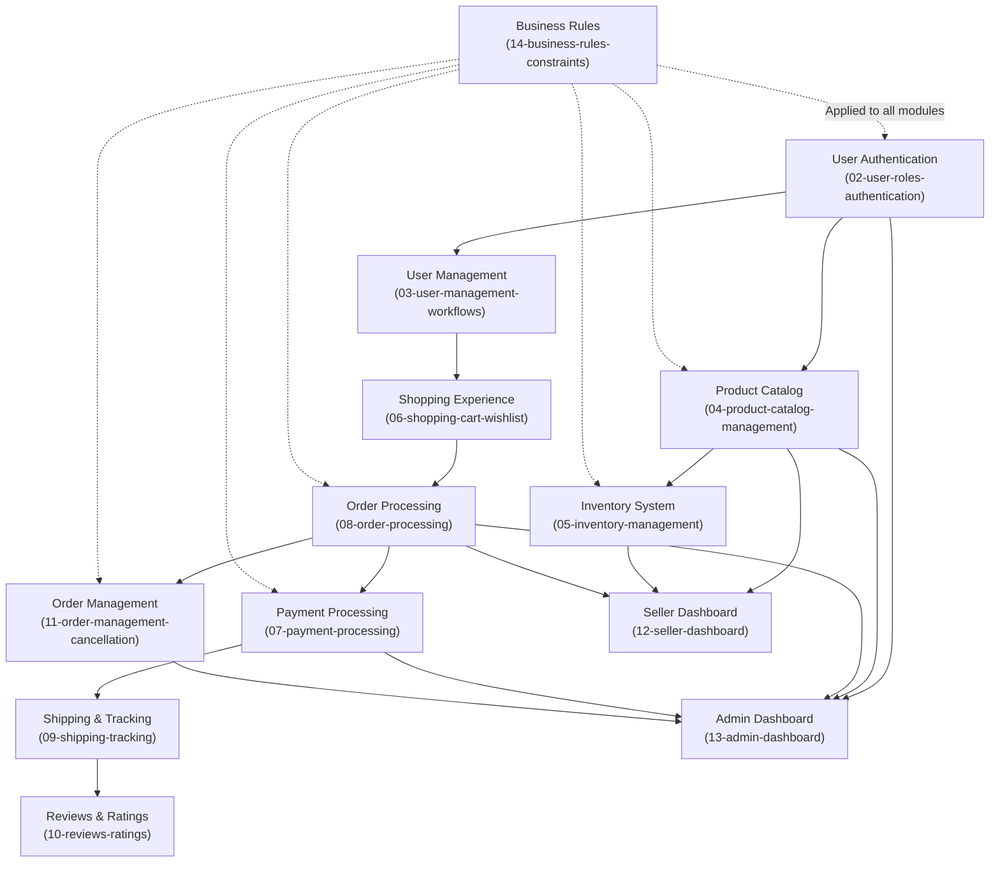

# Shopping Mall E-Commerce Platform - Complete Requirements Documentation

## Document Set Overview

This comprehensive requirements package contains 14 detailed documents defining all business requirements, user workflows, technical specifications, and operational policies for the Shopping Mall e-commerce platform. The platform enables customers to discover and purchase products from multiple sellers in a secure, trusted marketplace environment.

## Document List with Descriptions

### Core Platform Documentation

#### [00-toc.md - Table of Contents](./00-toc.md)
**Purpose**: Navigation hub and project overview
- Complete index of all 14 documentation files
- Quick-reference guide for stakeholders and developers
- Implementation phases and recommended reading order
- Feature modules overview and dependencies

#### [01-service-overview.md - Service Overview](./01-service-overview.md)
**Purpose**: Business foundation and strategic direction
- Executive summary of the shopping mall platform
- Market opportunity and competitive analysis
- Business model and revenue strategy
- Core value proposition for customers and sellers
- Platform vision and long-term goals
- Success metrics and KPIs
- Target user personas and their pain points

#### [02-user-roles-authentication.md - User Roles & Authentication](./02-user-roles-authentication.md)
**Purpose**: Complete authentication and authorization framework
- Four user roles: Guest, Customer, Seller, Admin
- Detailed capabilities and limitations for each role
- JWT token management and session handling
- Password security policies
- Two-factor authentication support
- Complete permission matrix for all features
- Role-based access control implementation

#### [03-user-management-workflows.md - User Management Workflows](./03-user-management-workflows.md)
**Purpose**: User lifecycle and account management
- Customer registration and email verification
- Login and session management
- Customer profile and account settings
- Multiple address management for delivery
- Seller onboarding process and verification
- Account deactivation and data handling
- Password reset and security procedures
- Account recovery options

### Product & Inventory Management

#### [04-product-catalog-management.md - Product Catalog Management](./04-product-catalog-management.md)
**Purpose**: Product data structure and catalog organization
- Product information schema and complete attributes
- Category hierarchy and organization
- Product variants and SKU system
- Pricing and discount management
- Product visibility and approval workflow
- Seller product management capabilities
- Product search and filtering features
- Data validation and integrity requirements

#### [05-inventory-management.md - Inventory Management](./05-inventory-management.md)
**Purpose**: Real-time inventory tracking at SKU level
- SKU-level inventory architecture
- Stock quantity management and updates
- Inventory transactions during orders, returns, cancellations
- Low stock warnings and alerts
- Inventory validation rules and overselling prevention
- Inventory visibility for sellers and admins
- Reporting and analytics capabilities
- Performance and reliability requirements

### Shopping & Order Processing

#### [06-shopping-cart-wishlist.md - Shopping Cart & Wishlist](./06-shopping-cart-wishlist.md)
**Purpose**: Customer shopping preparation features
- Shopping cart management and persistence
- Item addition, removal, and quantity adjustment
- Cart validation and availability checking
- Wishlist functionality and management
- Cart-to-order conversion process
- Business rules and constraints
- Error handling and edge cases

#### [07-payment-processing.md - Payment Processing](./07-payment-processing.md)
**Purpose**: Payment workflows and transaction management
- Supported payment methods (credit card, wallet, bank transfer)
- Complete payment processing flow
- Transaction lifecycle and status management
- Payment security and PCI-DSS compliance
- Fraud detection measures
- Refund processing and payment reversals
- Error handling and recovery procedures

#### [08-order-processing.md - Order Processing](./08-order-processing.md)
**Purpose**: Complete order lifecycle management
- Order placement workflow and validation
- Order creation and confirmation process
- Order status lifecycle and transitions
- Order details and record structure
- Multiple items and multi-seller orders
- Order fulfillment by sellers
- Seller order view and management

#### [09-shipping-tracking.md - Shipping & Tracking](./09-shipping-tracking.md)
**Purpose**: Shipping management and customer visibility
- Shipping methods and cost calculation
- Delivery address validation
- Shipping status tracking and updates
- Customer tracking information
- Status notifications and communications
- Delivery confirmation
- Return shipping workflows

### Customer Experience & Reviews

#### [10-reviews-ratings.md - Product Reviews & Ratings](./10-reviews-ratings.md)
**Purpose**: Review system and social proof features
- Review submission requirements and validation
- 5-star rating system and calculations
- Review content moderation and approval
- Review visibility and display options
- Seller response to reviews
- Review analytics and insights
- Business rules and constraints

### Returns & Disputes

#### [11-order-management-cancellation.md - Order Cancellation & Refunds](./11-order-management-cancellation.md)
**Purpose**: Order cancellation, refund, and return processes
- Order cancellation policy and windows
- Cancellation eligibility rules by order status
- Refund request process and workflow
- Return procedures and tracking
- Refund processing and payment handling
- Partial and full refund calculation
- Dispute resolution and escalation
- Customer communication workflows

### Dashboard & Administration

#### [12-seller-dashboard.md - Seller Dashboard](./12-seller-dashboard.md)
**Purpose**: Seller management and analytics interface
- Sales analytics and performance metrics
- Product management interface
- Order management and fulfillment view
- Inventory monitoring and adjustment
- Revenue and commission tracking
- Customer communication interface
- Performance insights and recommendations
- Account settings and preferences

#### [13-admin-dashboard.md - Admin Dashboard](./13-admin-dashboard.md)
**Purpose**: Administrative platform management
- User management (customer, seller, admin)
- Product approval and moderation
- Order management and monitoring
- Payment and commission processing
- Dispute resolution interface
- Platform analytics and reporting
- System configuration and settings
- Audit logging and compliance

### Business Rules & Policies

#### [14-business-rules-constraints.md - Business Rules & Constraints](./14-business-rules-constraints.md)
**Purpose**: Operational policies and validation rules
- Data validation requirements
- Inventory management rules
- Pricing and discount policies
- Order processing rules
- Payment validation rules
- Refund and cancellation policies
- Review moderation standards
- Seller commission structures
- Compliance and security rules

## Architecture and Integration

### System Components and Their Relationships

The platform consists of interconnected functional modules:

## Key Platform Features

### Customer Journey

WHEN a customer accesses the platform, THE customer experiences the following journey:

1. **Discovery Phase**
   - Browse product catalog with search and filtering
   - View product details, images, and variants
   - Read customer reviews and ratings
   - Save items to wishlist

2. **Shopping Phase**
   - Add selected items to shopping cart
   - Review cart contents and adjust quantities
   - Move items between cart and wishlist

3. **Checkout Phase**
   - Select or add delivery address
   - Choose shipping method
   - Select payment method
   - Review order and apply discounts

4. **Payment Phase**
   - Process payment securely
   - Receive order confirmation
   - Order enters fulfillment workflow

5. **Fulfillment Phase**
   - Seller prepares and ships items
   - Customer receives tracking information
   - Track shipment in real-time

6. **Delivery Phase**
   - Product delivered to customer
   - Delivery confirmation recorded
   - Customer can submit review

7. **Post-Purchase Phase**
   - Write product reviews and ratings
   - Request returns or refunds if needed
   - Manage order history

### Seller Operations

WHEN a seller manages their business on the platform, THE seller performs:

1. **Onboarding**
   - Register seller account
   - Submit business verification documents
   - Complete account setup
   - Receive verification approval

2. **Product Management**
   - Create product listings with variants
   - Manage pricing and inventory
   - Update product information
   - Monitor product performance

3. **Order Fulfillment**
   - Receive new order notifications
   - View order details and customer info
   - Pack and prepare shipments
   - Update order status and tracking

4. **Business Management**
   - Monitor sales and revenue
   - View analytics and performance metrics
   - Manage customer messages
   - Track inventory levels
   - Monitor ratings and reviews

### Admin Operations

WHEN an admin manages the platform, THE admin performs:

1. **User Management**
   - Verify new seller accounts
   - Manage customer and seller accounts
   - Handle account suspensions
   - Create admin accounts

2. **Content Moderation**
   - Approve product submissions
   - Remove non-compliant products
   - Moderate reviews for policy violations
   - Manage promotional content

3. **Order and Payment Management**
   - Monitor all platform orders
   - Process refunds and handle disputes
   - Manage payment transactions
   - Calculate and process commissions

4. **Dispute Resolution**
   - Investigate customer complaints
   - Evaluate seller misconduct claims
   - Make resolution decisions
   - Appeal high-value disputes

5. **Platform Management**
   - Configure business policies
   - Manage promotional campaigns
   - Monitor system health
   - Generate business reports
   - Access audit logs

## User Roles and Permissions

### Guest User
- Browse product catalog
- Search and filter products
- View product details and reviews
- Cannot purchase or create accounts

### Customer
- Complete profile with addresses
- Search and browse products
- Create wishlist
- Manage shopping cart
- Place and track orders
- Submit reviews and ratings
- Request refunds and returns

### Seller
- Create and manage products with variants
- Manage inventory per SKU
- View and fulfill orders
- Access seller dashboard with analytics
- Respond to customer reviews
- Request support

### Admin
- Manage all user accounts
- Approve and remove products
- View all orders and transactions
- Process refunds and handle disputes
- Configure system settings
- Access audit logs and reports

## Implementation Recommendations

### Phase 1: Foundation (Months 1-3)
Implement user authentication, registration, and core account management:
- User registration and email verification
- Login and session management system
- Customer and seller onboarding
- Basic account settings

### Phase 2: Product Catalog (Months 2-4)
Implement product management and inventory system:
- Product catalog with categories
- SKU and variant management
- Inventory tracking per SKU
- Product search and filtering

### Phase 3: Shopping and Orders (Months 3-6)
Implement shopping cart, checkout, and order processing:
- Shopping cart and wishlist
- Payment processing integration
- Order creation and management
- Basic order fulfillment

### Phase 4: Fulfillment (Months 5-7)
Implement shipping and tracking:
- Shipping method selection
- Tracking integration
- Delivery confirmation
- Customer notifications

### Phase 5: Reviews and Support (Months 6-8)
Implement reviews, ratings, and customer support:
- Review system with moderation
- Rating calculations
- Seller response system
- Customer messaging

### Phase 6: Returns and Disputes (Months 7-9)
Implement cancellation, refund, and dispute resolution:
- Cancellation workflow
- Refund processing
- Return management
- Dispute resolution system

### Phase 7: Analytics (Months 8-10)
Implement seller and admin dashboards:
- Seller analytics and metrics
- Admin platform management
- Financial reporting
- Business intelligence

### Phase 8: Optimization (Months 9-12)
Performance tuning and feature refinement:
- System optimization
- Security hardening
- Scaling preparation
- Documentation finalization

## Business Model and Revenue

THE shopping mall platform generates revenue through multiple streams:

**Commission on Sales (40-50% of revenue)**
- Transaction commission: 8-15% depending on product category
- Premium seller services: $9.99-$99.99 per month
- Reduced commission for higher tiers

**Seller Services (20-30% of revenue)**
- Featured product listings and promotion
- Advanced analytics tools
- Inventory management services
- Marketing and optimization tools

**Advertising and Promotions (15-25% of revenue)**
- Sponsored product placements
- Category page advertising
- Search keyword bidding
- Email marketing campaigns

**Payment Processing (10-20% of revenue)**
- Processing fees from payment gateway
- Installment payment options
- Digital wallet integration

## Success Metrics

THE platform defines success through measurable KPIs:

**User Metrics**
- 100,000+ customers by end of Year 1
- 1,000+ sellers by end of Year 1
- 50%+ customer retention rate
- 80%+ seller retention rate

**Transaction Metrics**
- $5-10M GMV (Gross Merchandise Value) Year 1
- $50-100M GMV Year 2
- 95%+ order fulfillment rate
- 90%+ on-time delivery rate

**Business Metrics**
- Break-even by Month 18
- 15%+ net margins by Year 3
- NPS score of 45+ from customers
- NPS score of 40+ from sellers

## Data Security and Compliance

THE platform implements comprehensive security measures:

**Data Protection**
- End-to-end encryption for payments
- PCI-DSS compliance for payment processing
- GDPR compliance for customer data
- Regular security audits

**Fraud Prevention**
- Real-time fraud detection
- Chargeback management
- Seller verification processes
- Customer dispute handling

**Audit and Logging**
- Complete action audit trails
- Admin activity logging
- Payment transaction records
- Dispute resolution documentation

## Next Steps for Development

1. **Review All Documentation**: Development leads should review all 14 documents thoroughly
2. **Technical Design**: Create technical architecture documents based on these requirements
3. **Database Schema**: Design database schema implementing all business rules
4. **API Specifications**: Create detailed API specifications for frontend integration
5. **Testing Strategy**: Develop comprehensive test cases based on all requirements
6. **Development Sprint Planning**: Plan development sprints aligned with implementation phases

---

**Document Version**: 1.0  
**Last Updated**: 2024  
**Status**: Production-Ready

All business requirements have been comprehensively documented. The development team has complete specifications to begin technical design and implementation. These requirements define the complete business functionality; developers have full autonomy over technical architecture, technology choices, and implementation approaches.