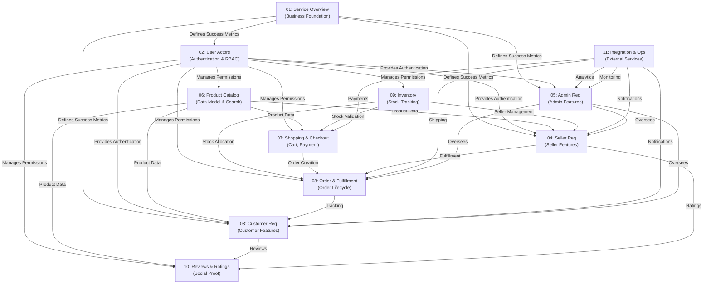

# eCommerceMall Platform - Documentation Table of Contents

## Overview

Welcome to the eCommerceMall Platform documentation suite. This comprehensive specification defines all requirements for building a modern e-commerce shopping mall platform that supports multiple user types, complex product catalogs, and complete order management capabilities.

The eCommerceMall platform is designed to serve as a complete digital marketplace where customers can discover and purchase products from multiple sellers, sellers can manage their product catalogs and fulfill orders, and administrators maintain platform integrity and operations.

This table of contents provides a roadmap through all documentation and helps you understand how each component fits into the complete system.

## How to Use This Documentation

**For Development Teams**: Start with this TOC to understand the full scope, then refer to specific documents as needed during implementation. Each document contains detailed requirements for a specific system component.

**For Project Managers**: Review the Feature Area Organization and Implementation Roadmap sections to understand project structure, timeline dependencies, and feature groupings for sprint planning.

**For Business Stakeholders**: Read the Executive Summary below, then explore individual feature documents relevant to your interests to understand business capabilities and value proposition.

**For Product Managers**: Use Feature Area Organization to understand feature groupings, and refer to specific documents when defining features, acceptance criteria, or product roadmaps.

---

## Executive Summary

### Platform Vision

The eCommerceMall platform creates a dynamic digital marketplace where independent sellers can establish their stores and reach customers globally, while customers enjoy a seamless shopping experience with diverse product selection, secure payment processing, and reliable order fulfillment.

### Core Platform Capabilities

- **Multi-user architecture** with four distinct actor types (Guests, Customers, Sellers, Admins)
- **Comprehensive product catalog** with categories, variants (SKUs), and rich media management
- **Complete shopping experience** including discovery, cart, checkout, and payment processing
- **Secure order management** from placement through fulfillment and tracking
- **Seller empowerment** with store management, inventory control, and sales analytics
- **Platform administration** with oversight, user management, and operational control
- **Review and rating system** for trust and social proof
- **Multi-region integration** with payment processors, shipping carriers, and communication services

### Key User Actors

| Actor | Role | Primary Capabilities |
|-------|------|---------------------:|
| **Guest** | Unauthenticated browser | View products, search, browse reviews (no purchase) |
| **Customer** | Registered shopper | Purchase, manage cart/wishlist, track orders, leave reviews |
| **Seller** | Registered merchant | Manage products, track inventory, process orders, view analytics |
| **Admin** | System administrator | Manage users, oversee orders, configure platform, view analytics |

### Success Metrics

The platform's success will be measured by:
- Customer acquisition and retention rates
- Average order value and transaction frequency
- Seller satisfaction and catalog growth
- Platform uptime and performance
- Customer satisfaction and review ratings
- Inventory accuracy and fulfillment speed

---

## Complete Documentation Suite

The eCommerceMall platform documentation is organized into 11 comprehensive documents covering all aspects of the system. Each document is self-contained yet interconnected with related documents.

### [01. Service Overview and Business Model](./01-service-overview.md)

**Purpose**: Establish the business foundation and strategic vision for the eCommerceMall platform.

**Key Topics**:
- Executive summary and platform positioning
- Business vision and long-term mission
- Market opportunity and problem statement
- Core value proposition for customers, sellers, and the platform
- Business model and revenue streams
- Success metrics and key performance indicators
- Platform differentiation and competitive advantages
- Growth strategy and roadmap

**Document Type**: Service Overview (Executive/Strategic)

**Audience**: Business stakeholders, product managers, investors, executive leadership

**Primary Length**: 3,000+ characters covering strategic business aspects

**Use This Document When**:
- You need to understand why the platform exists and market positioning
- Making strategic decisions about platform direction
- Understanding revenue model and business metrics
- Evaluating competitive advantages
- Planning long-term product roadmap

---

### [02. User Actors and Authentication](./02-user-actors-and-authentication.md)

**Purpose**: Define all user types in the system, their capabilities, authentication methods, and security protocols.

**Key Topics**:
- Complete user actor definitions (Guest, Customer, Seller, Admin)
- Authentication system requirements and flows
- JWT token management and structure
- Complete permission matrix for all features
- Session management and security
- Access control implementation requirements
- Password and account security requirements
- Multi-factor authentication for admins

**Document Type**: Technical Requirements (Authentication & Authorization)

**Audience**: Development team, security specialists, product managers

**Primary Length**: 5,000+ characters covering authentication, authorization, and security

**Use This Document When**:
- Building authentication systems
- Implementing user authorization
- Designing access controls
- Defining permission matrices
- Implementing security protocols

---

### [03. Customer Requirements](./03-customer-requirements.md)

**Purpose**: Define all functional requirements for the customer user type, from account management through order completion and review submission.

**Key Topics**:
- Customer account registration and profile management
- Address management and default address handling
- Product discovery, search, and browsing
- Shopping cart operations and persistence
- Wishlist management and saved items
- Complete checkout and order placement process
- Payment method management
- Order tracking and shipping status updates
- Order history and reorder capabilities
- Cancellation and refund request processes
- Product review and rating submission
- Customer dashboard and personal features

**Document Type**: Functional Requirements (Customer Features)

**Audience**: Development team, product managers, customer experience team

**Primary Length**: 5,000+ characters covering customer user journey

**Use This Document When**:
- Implementing customer-facing features
- Understanding complete customer journey
- Designing customer dashboards
- Building payment and checkout features
- Implementing review capabilities

---

### [04. Seller Requirements](./04-seller-requirements.md)

**Purpose**: Define all requirements for seller store management, product catalogs, inventory, and order fulfillment.

**Key Topics**:
- Seller store setup and account management
- Store profile and branding capabilities
- Product catalog creation and management
- Product variants (SKU) and option management
- Color, size, and attribute combinations
- Pricing management per SKU
- Inventory level management and updates
- Product visibility and featured product management
- Order fulfillment workflow
- Shipping status update capabilities
- Sales analytics and performance metrics
- Seller settings, policies, and configurations
- Commission tracking and payment reports

**Document Type**: Functional Requirements (Seller Features)

**Audience**: Development team, product managers, seller support team

**Primary Length**: 5,000+ characters covering seller capabilities

**Use This Document When**:
- Building seller-facing features
- Implementing store management
- Creating inventory management systems
- Building seller dashboards
- Implementing analytics for sellers

---

### [05. Admin Requirements](./05-admin-requirements.md)

**Purpose**: Define administrative capabilities for platform oversight, user management, and system configuration.

**Key Topics**:
- Admin dashboard and overview features
- User account management and suspension capabilities
- Product and category management across all sellers
- Order management and oversight
- Dispute resolution and refund handling
- Platform analytics and reporting
- System configuration and settings management
- Promotional campaign creation and management
- Seller commission calculation and payment management
- Audit logs and compliance tracking
- Platform health monitoring

**Document Type**: Functional Requirements (Admin Features)

**Audience**: Development team, administrators, business stakeholders

**Primary Length**: 5,000+ characters covering admin capabilities

**Use This Document When**:
- Implementing administrative features
- Building platform oversight capabilities
- Creating admin dashboards
- Implementing compliance and audit features
- Building analytics for business intelligence

---

### [06. Product Catalog System](./06-product-catalog-system.md)

**Purpose**: Define the product catalog architecture, structure, and management requirements.

**Key Topics**:
- Product catalog architecture and organization
- Category and taxonomy management
- Product information and metadata requirements
- Product variants and SKU relationships
- Color and size option management
- Additional product attributes and options
- Product images and media management
- Product pricing strategies
- Product status and lifecycle management
- Search and filtering requirements
- Product visibility and discoverability features
- Product performance metrics

**Document Type**: Technical Requirements (Data Model & Systems)

**Audience**: Development team, product managers, data architects

**Primary Length**: 5,000+ characters covering catalog architecture

**Use This Document When**:
- Designing product data model
- Implementing catalog management features
- Building search and filtering
- Managing product variants and SKUs
- Implementing product lifecycle

---

### [07. Shopping and Checkout](./07-shopping-and-checkout.md)

**Purpose**: Define the shopping cart, wishlist, and checkout process requirements.

**Key Topics**:
- Shopping cart functionality and design
- Cart item management and quantity handling
- Cart persistence across sessions and devices
- Cart validation and inventory verification
- Wishlist management and item saving
- Wishlist sharing capabilities
- Complete checkout flow and steps
- Address selection and management during checkout
- Shipping method selection and calculation
- Order confirmation and receipt generation
- Payment integration points and methods
- Tax calculation and application
- Discount and coupon handling
- Order summary and review before completion

**Document Type**: Functional Requirements (Shopping & Checkout)

**Audience**: Development team, product managers, payment specialists

**Primary Length**: 5,000+ characters covering shopping and checkout

**Use This Document When**:
- Implementing shopping cart
- Building checkout process
- Integrating payment processing
- Calculating taxes and discounts
- Managing cart persistence

---

### [08. Order and Fulfillment](./08-order-and-fulfillment.md)

**Purpose**: Define order management, lifecycle, fulfillment processes, and tracking requirements.

**Key Topics**:
- Order creation and placement process
- Order status lifecycle and transitions
- Order confirmation and notification requirements
- Inventory reservation during order placement
- Order fulfillment workflow
- Seller fulfillment responsibilities
- Shipping integration and label generation
- Real-time order tracking capabilities
- Delivery status update notifications
- Order cancellation requests and processes
- Refund workflows and handling
- Order modification capabilities
- Order history and archival
- Order analytics and reporting

**Document Type**: Functional Requirements (Order Management)

**Audience**: Development team, operations teams, fulfillment specialists

**Primary Length**: 5,000+ characters covering order lifecycle

**Use This Document When**:
- Implementing order management system
- Building fulfillment workflows
- Integrating with shipping providers
- Implementing order tracking
- Handling cancellations and refunds

---

### [09. Inventory Management](./09-inventory-management.md)

**Purpose**: Define inventory tracking, stock management, and synchronization requirements.

**Key Topics**:
- Inventory system architecture for multi-SKU products
- Stock tracking at the individual SKU level
- Inventory level thresholds and categories
- Stock reservation during order placement
- Inventory updates and real-time synchronization
- Low stock alerts and notifications
- Manual inventory adjustments by sellers
- Inventory discrepancy handling
- Multi-seller inventory isolation
- Inventory history and audit trail
- Preventing overselling and overbooking
- Inventory forecasting and demand planning
- Seasonal inventory management

**Document Type**: Technical Requirements (Inventory Systems)

**Audience**: Development team, sellers, operations team

**Primary Length**: 5,000+ characters covering inventory management

**Use This Document When**:
- Implementing inventory tracking
- Building SKU management features
- Preventing overselling
- Creating low stock alerts
- Implementing inventory auditing

---

### [10. Reviews and Ratings](./10-reviews-and-ratings.md)

**Purpose**: Define the review and rating system for products and sellers.

**Key Topics**:
- Review and rating system architecture
- Customer review submission process
- Rating scale and criteria definitions
- Review content validation and requirements
- Review moderation workflow
- Rating aggregation and calculation
- Rating display and presentation
- Seller performance ratings
- Review authenticity verification
- Helpful vote functionality on reviews
- Review removal and appeals process
- Review analytics and insights
- Preventing duplicate or fraudulent reviews

**Document Type**: Functional Requirements (Review System)

**Audience**: Development team, product managers, community management

**Primary Length**: 5,000+ characters covering review and rating systems

**Use This Document When**:
- Implementing review submission
- Building review moderation
- Calculating ratings
- Preventing fraudulent reviews
- Creating review analytics

---

### [11. Platform Integration and Operations](./11-platform-integration-and-operations.md)

**Purpose**: Define external system integrations, compliance requirements, and operational infrastructure.

**Key Topics**:
- Payment gateway integration requirements
- Supported payment methods and processors
- Payment security and PCI DSS compliance
- Shipping provider integrations
- Real-time shipping rate calculations
- Email notification system integration
- SMS and push notification services
- Analytics and reporting platforms
- Search engine optimization requirements
- Customer support tool integration
- Data privacy and GDPR compliance
- Performance and scalability requirements
- System monitoring and alerting
- Backup and disaster recovery procedures
- Security auditing and penetration testing
- Third-party service management

**Document Type**: Technical Requirements (Integration & Operations)

**Audience**: Development team, operations, security, DevOps

**Primary Length**: 5,000+ characters covering integrations and operations

**Use This Document When**:
- Integrating external services
- Implementing operational infrastructure
- Designing payment processing
- Building monitoring systems
- Planning disaster recovery

---

## Feature Areas Organization

The platform's functionality is organized into seven major feature areas, each spanning multiple documents:

### Core User Management
Essential foundation for all platform features
- **[User Actors and Authentication](./02-user-actors-and-authentication.md)**: Authentication system, JWT tokens, permission matrix
- **[Customer Requirements](./03-customer-requirements.md)**: Customer account management and profile
- **[Seller Requirements](./04-seller-requirements.md)**: Seller store setup and account management
- **[Admin Requirements](./05-admin-requirements.md)**: Admin capabilities and oversight

### Shopping & Discovery
Features enabling customers to find and understand products
- **[Product Catalog System](./06-product-catalog-system.md)**: Product data model, categories, search
- **[Reviews and Ratings](./10-reviews-and-ratings.md)**: Product reviews and social proof

### Shopping Experience
Features enabling customers to complete purchases
- **[Shopping and Checkout](./07-shopping-and-checkout.md)**: Cart, wishlist, checkout, payment
- **[Product Catalog System](./06-product-catalog-system.md)**: Product availability and information

### Order Management & Fulfillment
Features managing orders from placement through delivery
- **[Order and Fulfillment](./08-order-and-fulfillment.md)**: Complete order lifecycle, tracking
- **[Inventory Management](./09-inventory-management.md)**: Stock reservations during orders
- **[Seller Requirements](./04-seller-requirements.md)**: Seller fulfillment capabilities

### Inventory & Product Management
Features for managing product catalogs and stock
- **[Product Catalog System](./06-product-catalog-system.md)**: Product data, variants, SKUs
- **[Inventory Management](./09-inventory-management.md)**: Real-time stock tracking per SKU
- **[Seller Requirements](./04-seller-requirements.md)**: Seller product and inventory management

### Business Analytics & Operations
Features for analytics, reporting, and operational management
- **[Service Overview and Business Model](./01-service-overview.md)**: Business metrics and KPIs
- **[Seller Requirements](./04-seller-requirements.md)**: Seller analytics and dashboards
- **[Admin Requirements](./05-admin-requirements.md)**: Platform analytics and reporting
- **[Platform Integration and Operations](./11-platform-integration-and-operations.md)**: Monitoring, alerts, and analytics platforms

### External Integrations
Features integrating with external services
- **[Shopping and Checkout](./07-shopping-and-checkout.md)**: Payment processing integration
- **[Order and Fulfillment](./08-order-and-fulfillment.md)**: Shipping carrier integration
- **[Platform Integration and Operations](./11-platform-integration-and-operations.md)**: Complete integration architecture

---

## Implementation Roadmap & Dependencies

The following implementation roadmap shows the logical order and dependencies for building the platform. Phase dependencies ensure each component is built on a solid foundation.

### Phase 1: Foundation (Core Infrastructure & Authentication)
**Duration**: Weeks 1-4  
**Critical Path**: All other phases depend on these features

1. **User Actors and Authentication** (Start: Week 1)
   - Implement user registration and authentication
   - Create JWT token system
   - Build permission matrix and RBAC
   - Establish session management
   - **Dependencies**: None (foundation)
   - **Blocking**: Phases 2-4 (all require authentication)

2. **Service Overview and Business Model** (Start: Week 1)
   - Define business requirements
   - Establish revenue model implementation
   - Create success metrics
   - **Dependencies**: None (business foundation)
   - **Blocking**: All later phases (guides all decisions)

3. **Database Schema Design** (Start: Week 1)
   - Design core tables (users, products, orders)
   - Implement data modeling
   - Plan for scalability
   - **Dependencies**: Service Overview (business requirements)
   - **Output**: Foundation for all data models

### Phase 2: Product Catalog Foundation
**Duration**: Weeks 5-10  
**Depends On**: Phase 1 (Authentication)  
**Blocks**: Phases 3-4

1. **Product Catalog System** (Start: Week 5)
   - Implement product data model
   - Create category/taxonomy system
   - Build product variant (SKU) system
   - Implement product images/media
   - Create product search indexing
   - **Dependencies**: User Actors (seller authentication)
   - **Blocking**: Shopping experience, inventory management

2. **Inventory Management** (Start: Week 7, parallel)
   - Implement SKU-level inventory tracking
   - Create stock reservation system
   - Build low stock alerts
   - Create inventory audit system
   - **Dependencies**: Product Catalog System (SKU definitions)
   - **Blocking**: Order management, shopping cart validation

### Phase 3: Customer Shopping Experience
**Duration**: Weeks 11-16  
**Depends On**: Phases 1-2 (Authentication, Products, Inventory)  
**Blocks**: Phase 4

1. **Shopping and Checkout** (Start: Week 11)
   - Build shopping cart system
   - Implement wishlist
   - Create checkout flow (steps 1-5)
   - Integrate payment processing
   - Calculate taxes and discounts
   - **Dependencies**: Product Catalog, Inventory Management, Authentication
   - **Blocking**: Order and Fulfillment

2. **Reviews and Ratings** (Start: Week 14, parallel)
   - Create review submission system
   - Build review moderation workflow
   - Implement rating aggregation
   - Create review analytics
   - **Dependencies**: User Actors (customer authentication), Shopping experience (purchase verification)

### Phase 4: Order Management & Fulfillment
**Duration**: Weeks 17-24  
**Depends On**: Phase 3 (Shopping) + Platform Integration  
**Blocks**: Seller capabilities, admin oversight

1. **Order and Fulfillment** (Start: Week 17)
   - Implement order creation from checkout
   - Create order status lifecycle
   - Build seller fulfillment workflow
   - Integrate shipping provider APIs
   - Implement real-time tracking
   - Create order cancellation/refund process
   - **Dependencies**: Shopping and Checkout, Inventory Management
   - **Blocking**: Seller dashboard, admin oversight

2. **Platform Integration and Operations** (Start: Week 10, parallel early)
   - Integrate payment processors
   - Integrate shipping providers
   - Setup email/SMS notifications
   - Configure monitoring and logging
   - Implement compliance (PCI, GDPR)
   - **Dependencies**: None initially, but critical before Phase 4
   - **Blocking**: Order processing, payment handling

### Phase 5: Seller & Admin Features
**Duration**: Weeks 20-28  
**Depends On**: Phases 1-4 (all core features)

1. **Seller Requirements** (Start: Week 20)
   - Build seller store dashboard
   - Create product management interface
   - Implement inventory management UI
   - Build order fulfillment interface
   - Create seller analytics dashboard
   - Commission tracking system
   - **Dependencies**: Product Catalog, Inventory, Order Management, User Actors
   - **Blocking**: Seller onboarding and operations

2. **Admin Requirements** (Start: Week 22, parallel)
   - Build admin dashboard
   - Create user management interface
   - Implement product oversight tools
   - Build order management interface
   - Create dispute resolution system
   - Implement analytics/reporting
   - Commission payment system
   - **Dependencies**: All previous phases
   - **Blocking**: Platform operations and monitoring

### Phase 6: Optimization & Enhancement
**Duration**: Weeks 28+

1. **Performance Optimization**
   - Implement caching strategies
   - Optimize database queries
   - CDN implementation
   - Search optimization

2. **Advanced Features**
   - Recommendation engine
   - Advanced analytics
   - Seller payment automation
   - Customer loyalty programs

### Timeline Summary

```
Phase 1: Foundation (Weeks 1-4)
├─ User Auth & RBAC
├─ Business Model
└─ Database Design

Phase 2: Catalog (Weeks 5-10)
├─ Product Catalog
├─ Inventory (Weeks 7-10)
└─ Platform Integration starts (Week 10)

Phase 3: Shopping (Weeks 11-16)
├─ Cart & Checkout
└─ Reviews & Ratings (Weeks 14-16)

Phase 4: Orders (Weeks 17-24)
├─ Order Management
└─ Seller Features begin (Week 20)

Phase 5: Admin (Weeks 22-28)
├─ Seller Dashboard
└─ Admin Dashboard

Phase 6: Optimization (Weeks 28+)
```

**Critical Path**: Phase 1 → Phase 2 → Phase 3 → Phase 4 → Phase 5

**Parallel Opportunities**: Inventory (Week 7) can start while Catalog is finishing; Reviews (Week 14) can run parallel; Admin features (Week 22) can overlap with final Order features

---

## Key Concepts and Terminology

### Products and Variants
- **Product**: A logical grouping of related items (e.g., "Nike T-Shirt Model XYZ")
  - Contains general product information, description, and media
  - Managed by a single seller
  - Belongs to one or more categories
  
- **Variant**: A specific combination of product attributes (e.g., "Nike T-Shirt Model XYZ in Red, Size M")
  - Defined by product attributes (color, size, options)
  - Has unique pricing and inventory
  - Has unique SKU identifier
  
- **SKU (Stock-Keeping Unit)**: Unique identifier for inventory tracking
  - One SKU per variant
  - Tracks quantity, reservations, and sales
  - Used for order fulfillment and returns

**Example**: Product "Nike Running Shoe Model XYZ" has variants: Blue-Size 9, Blue-Size 10, Red-Size 9, Red-Size 10, etc. Each variant has unique SKU like "NIKE-XYZ-BLU-9" for inventory tracking.

### User Actors & Permissions
- **Guest**: Unauthenticated user browsing catalog (no cart/purchase)
- **Customer**: Registered user making purchases and leaving reviews
- **Seller**: Registered merchant managing store and fulfilling orders
- **Admin**: System operator with platform-wide oversight and control

**Permission Model**: Role-based access control (RBAC) where each actor has specific capabilities defined in permission matrix.

### Order States & Progression
Orders follow a defined lifecycle with specific states:
- **Pending**: Order created, awaiting payment
- **Confirmed**: Payment processed, order ready for fulfillment
- **Processing**: Seller preparing order
- **Shipped**: Order in transit
- **Delivered**: Order received by customer
- **Cancelled**: Order cancelled (with inventory restored)
- **Refunded**: Payment returned to customer

### Inventory Management Concepts
- **Total Stock**: Physical quantity available
- **Reserved Stock**: Quantity allocated to confirmed orders
- **Available Stock**: Total - Reserved (what customers can purchase)
- **Low Stock**: When available falls below threshold (triggers alert)
- **Overselling Prevention**: System never allows sales exceeding available stock

### Ratings and Reviews
- **Rating**: Numerical score (1-5 stars) for product or seller quality
- **Review**: Written feedback from verified customer
- **Composite Rating**: Average of all individual ratings
- **Review Moderation**: Process of approving reviews before public display
- **Seller Rating**: Aggregate evaluation based on all orders from that seller

### Financial Concepts
- **GMV (Gross Merchandise Value)**: Total value of all orders
- **Commission**: Percentage of order value paid to platform
- **Take Rate**: Commission as percentage of GMV
- **Customer Lifetime Value (CLV)**: Total revenue from customer over relationship
- **Order Value (AOV)**: Average value per order across all customers

### Compliance & Security
- **PCI DSS**: Payment Card Industry standard for payment security
- **GDPR**: European data protection regulation
- **CCPA**: California consumer privacy protection
- **JWT Token**: Secure authentication token with expiration
- **Tokenization**: Process of replacing sensitive data with non-sensitive tokens

---

## Document Navigation Quick Reference

### By User Type

**If you're a Developer**:
1. Start with [User Actors and Authentication](./02-user-actors-and-authentication.md) - understand user types and permissions
2. Read system documents relevant to your assigned component:
   - Cart/checkout → [Shopping and Checkout](./07-shopping-and-checkout.md)
   - Orders → [Order and Fulfillment](./08-order-and-fulfillment.md)
   - Products → [Product Catalog System](./06-product-catalog-system.md)
   - Inventory → [Inventory Management](./09-inventory-management.md)
   - Reviews → [Reviews and Ratings](./10-reviews-and-ratings.md)
   - Integrations → [Platform Integration and Operations](./11-platform-integration-and-operations.md)
3. Reference [Seller Requirements](./04-seller-requirements.md) or [Customer Requirements](./03-customer-requirements.md) for user journey context

**If you're a Product Manager**:
1. Read [Service Overview and Business Model](./01-service-overview.md) for business context
2. Review [Feature Areas Organization](#feature-areas-organization) to understand feature groupings
3. Read specific feature documents for your assigned area:
   - Customer features → [Customer Requirements](./03-customer-requirements.md)
   - Seller features → [Seller Requirements](./04-seller-requirements.md)
   - Admin features → [Admin Requirements](./05-admin-requirements.md)
   - Product catalog → [Product Catalog System](./06-product-catalog-system.md)
4. Use [Implementation Roadmap](#implementation-roadmap--dependencies) for feature sequencing

**If you're a Business Stakeholder**:
1. Read [Service Overview and Business Model](./01-service-overview.md) for complete business context
2. Skim [Feature Areas Organization](#feature-areas-organization) to understand platform scope
3. Review specific feature documents as relevant to your interests:
   - Customer experience → [Customer Requirements](./03-customer-requirements.md) + [Shopping and Checkout](./07-shopping-and-checkout.md)
   - Seller success → [Seller Requirements](./04-seller-requirements.md)
   - Platform health → [Admin Requirements](./05-admin-requirements.md) + [Platform Integration and Operations](./11-platform-integration-and-operations.md)

**If you're an Operations/DevOps Engineer**:
1. Read [Platform Integration and Operations](./11-platform-integration-and-operations.md) for complete operational architecture
2. Review [Order and Fulfillment](./08-order-and-fulfillment.md) for order processing workflows
3. Reference [Inventory Management](./09-inventory-management.md) for stock synchronization
4. Check [Admin Requirements](./05-admin-requirements.md) for monitoring/alerting needs

### By Feature Area

**User Management & Authentication**:
→ [User Actors and Authentication](./02-user-actors-and-authentication.md)

**Products & Catalog**:
→ [Product Catalog System](./06-product-catalog-system.md)

**Shopping Experience**:
→ [Shopping and Checkout](./07-shopping-and-checkout.md)

**Order Processing**:
→ [Order and Fulfillment](./08-order-and-fulfillment.md)

**Inventory Management**:
→ [Inventory Management](./09-inventory-management.md)

**Customer Features**:
→ [Customer Requirements](./03-customer-requirements.md)

**Seller Features**:
→ [Seller Requirements](./04-seller-requirements.md)

**Admin Features**:
→ [Admin Requirements](./05-admin-requirements.md)

**Reviews & Social Proof**:
→ [Reviews and Ratings](./10-reviews-and-ratings.md)

**External Integrations & Operations**:
→ [Platform Integration and Operations](./11-platform-integration-and-operations.md)

**Business Context & Strategy**:
→ [Service Overview and Business Model](./01-service-overview.md)

### By Development Task

**Building APIs**:
1. Start with [User Actors and Authentication](./02-user-actors-and-authentication.md) for auth/permissions
2. Read system document for your API endpoint (Product, Order, Cart, Inventory, etc.)
3. Reference [Platform Integration and Operations](./11-platform-integration-and-operations.md) for integration requirements

**Designing Database Schema**:
1. Read [Product Catalog System](./06-product-catalog-system.md) for product/SKU data model
2. Read [Inventory Management](./09-inventory-management.md) for inventory tables
3. Read [Order and Fulfillment](./08-order-and-fulfillment.md) for order/transaction tables
4. Read [User Actors and Authentication](./02-user-actors-and-authentication.md) for user/permission tables
5. Read [Shopping and Checkout](./07-shopping-and-checkout.md) for cart/wishlist tables
6. Read [Reviews and Ratings](./10-reviews-and-ratings.md) for review/rating tables

**Implementing Business Logic**:
1. Identify feature area (Cart, Orders, Inventory, Products, Reviews)
2. Read corresponding requirements document
3. Extract specific business rules and constraints sections
4. Implement logic according to EARS-formatted requirements

**Setting Up Infrastructure**:
→ [Platform Integration and Operations](./11-platform-integration-and-operations.md) covering:
- Payment processing setup
- Shipping integration
- Monitoring and alerting
- Backup and disaster recovery
- Performance and scalability

**Writing Tests**:
1. Read requirements document for your component
2. Extract all "WHEN/THE/SHALL" statements
3. Create test cases for each requirement
4. Test both success and failure paths (error handling requirements)

---

## Document Relationships

The following diagram illustrates how documentation components relate to and support each other. Arrows show dependencies and relationships.


```mermaid
graph TB
    A["01: Service Overview<br/>(Business Foundation)"]
    B["02: User Actors<br/>(Authentication & RBAC)"]
    C["03: Customer Req<br/>(Customer Features)"]
    D["04: Seller Req<br/>(Seller Features)"]
    E["05: Admin Req<br/>(Admin Features)"]
    F["06: Product Catalog<br/>(Data Model & Search)"]
    G["07: Shopping & Checkout<br/>(Cart, Payment)"]
    H["08: Order & Fulfillment<br/>(Order Lifecycle)"]
    I["09: Inventory<br/>(Stock Tracking)"]
    J["10: Reviews & Ratings<br/>(Social Proof)"]
    K["11: Integration & Ops<br/>(External Services)"]
    
    A -->|"Defines Success Metrics"| B
    A -->|"Defines Success Metrics"| C
    A -->|"Defines Success Metrics"| D
    A -->|"Defines Success Metrics"| E
    
    B -->|"Provides Authentication"| C
    B -->|"Provides Authentication"| D
    B -->|"Provides Authentication"| E
    B -->|"Manages Permissions"| F
    B -->|"Manages Permissions"| G
    B -->|"Manages Permissions"| H
    B -->|"Manages Permissions"| I
    B -->|"Manages Permissions"| J
    
    F -->|"Product Data"| C
    F -->|"Product Data"| D
    F -->|"Product Data"| G
    F -->|"Product Data"| J
    
    I -->|"Stock Validation"| G
    I -->|"Stock Allocation"| H
    I -->|"Seller Management"| D
    
    G -->|"Order Creation"| H
    D -->|"Fulfillment"| H
    H -->|"Tracking"| C
    
    C -->|"Reviews"| J
    D -->|"Ratings"| J
    
    K -->|"Payments"| G
    K -->|"Shipping"| H
    K -->|"Notifications"| C
    K -->|"Notifications"| D
    K -->|"Analytics"| E
    K -->|"Monitoring"| E
    
    E -->|"Oversees"| C
    E -->|"Oversees"| D
    E -->|"Oversees"| H
```

### Cross-Document References

**Customer Journey Path**:
Authentication (02) → Product Discovery (06) → Shopping (07) → Checkout & Payment (07) → Order (08) → Delivery (08) → Review (10)

**Seller Operations Path**:
Authentication (02) → Catalog Management (06) → Inventory Management (09) → Order Fulfillment (08) → Analytics (04) → Commission Tracking (04)

**Admin Oversight Path**:
Authentication (02) → User Management (05) → Order Monitoring (08) → Dispute Resolution (05) → Analytics (05) → Configuration (05)

**Inventory Integration Path**:
Product Catalog (06) ← → Inventory System (09) ← → Shopping Validation (07) ← → Order Processing (08) ← → Seller Management (04)

**External Services Path**:
Platform Integration (11) → Payment Processing (07) → Order Fulfillment (08) → Shipping Tracking (08) → Notifications (anywhere)

---

## Document Summary Table

| # | Document | Focus | Type | Audience | Size | Phase |
|---|----------|-------|------|----------|------|-------|
| 01 | Service Overview | Business | Strategic | Business | 3K+ | 1 |
| 02 | User Actors | Auth & RBAC | Technical | Dev/Security | 5K+ | 1 |
| 03 | Customer Req | Customer Features | Functional | Dev/PM | 5K+ | 3 |
| 04 | Seller Req | Seller Features | Functional | Dev/PM | 5K+ | 5 |
| 05 | Admin Req | Admin Features | Functional | Dev/PM | 5K+ | 5 |
| 06 | Product Catalog | Data Model | Technical | Dev/PM | 5K+ | 2 |
| 07 | Shopping & Checkout | Payment Flow | Functional | Dev/PM | 5K+ | 3 |
| 08 | Order & Fulfillment | Order Lifecycle | Functional | Dev/PM | 5K+ | 4 |
| 09 | Inventory | Stock Management | Technical | Dev | 5K+ | 2 |
| 10 | Reviews & Ratings | Social Features | Functional | Dev/PM | 5K+ | 3 |
| 11 | Integration & Ops | Infrastructure | Technical | Dev/DevOps | 5K+ | 2-6 |

---

## Getting Started Guide

### For New Team Members
1. **Day 1-2**: Read this TOC and [Service Overview](./01-service-overview.md) to understand platform vision
2. **Day 3**: Read [User Actors and Authentication](./02-user-actors-and-authentication.md) to understand user types
3. **Day 4-5**: Read requirements documents for your assigned component
4. **Week 2**: Start implementation following business requirements in assigned documents

### For Project Kickoff
1. Review [Service Overview](./01-service-overview.md) for business alignment
2. Review [Implementation Roadmap](#implementation-roadmap--dependencies) for phasing
3. Break down each phase into sprints (1-2 week sprints)
4. Assign developers to components based on [Feature Areas](#feature-areas-organization)
5. Track progress against roadmap phases

### For Code Review
1. Understand requirements from relevant documents
2. Verify implementation matches EARS-formatted requirements
3. Check business rules and constraints are implemented
4. Verify error handling for all error scenarios
5. Validate integration points with other systems

---

## Conclusion

The eCommerceMall Platform documentation provides comprehensive requirements for building a complete, enterprise-grade e-commerce marketplace. By following this documentation structure, development teams can systematically build each component with clear understanding of business requirements, dependencies, and integration points.

The phased implementation approach ensures a solid foundation (authentication and core data models) before building customer-facing features, enabling efficient development and rapid delivery of functionality.

Each document is self-contained yet interconnected, allowing teams to focus on their component while understanding how it fits into the complete system. The documentation follows EARS (Easy Approach to Requirements Syntax) format, making requirements specific, measurable, and testable.

Start with this table of contents to understand the complete scope, then dive into specific documents relevant to your role and responsibilities.

---

> *Last Updated: 2024*  
> *Version: 1.0 - Complete Documentation Suite*  
> *Status: Production Ready*  
> *Developer Note: This documentation defines business requirements only. All technical implementations (architecture, APIs, database design, etc.) are at the discretion of the development team.*
