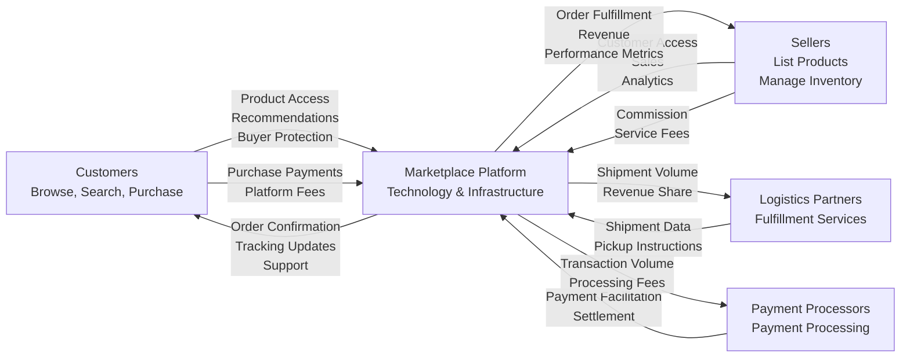

# E-Commerce Shopping Mall Platform - Service Overview

## Executive Summary

The ecommerceMall platform is a comprehensive B2C marketplace designed to democratize e-commerce by connecting a diverse seller community with millions of customers seeking convenient, curated shopping experiences. Built on a scalable multi-seller model, the platform enables entrepreneurs and established retailers to reach customers without the burden of building and maintaining their own sales channels, while providing customers with centralized access to a vast product selection, competitive pricing, and reliable fulfillment services. The platform serves as both a marketplace operator and a trusted intermediary, capturing value through commission-based revenue, seller services fees, and marketplace optimization features.

The ecommerceMall platform addresses a fundamental inefficiency in current e-commerce ecosystems: the fragmentation of shopping and selling experiences. Customers must visit multiple websites to find comparable products from different sellers, compare prices, and evaluate trustworthiness. Small and medium-sized retailers lack affordable, integrated platforms to reach customers beyond their local markets. The platform solves this fragmentation by creating a unified marketplace where customers discover and compare products from hundreds of sellers in a single destination, while sellers gain access to millions of customers without individual infrastructure investment.

## Business Vision and Mission

### Vision
To become the leading regional e-commerce marketplace that empowers sellers of all sizes to build thriving businesses while delivering customers an unparalleled shopping experience characterized by product variety, transparent pricing, genuine reviews, and dependable delivery.

### Mission
EcommerceMall exists to reduce friction in commerce by creating a trustworthy digital marketplace where sellers can grow their businesses efficiently and customers can discover, compare, and purchase products with confidence.

### Core Platform Principles

**Trust and Transparency**: All transactions, reviews, and seller information are authentic and verifiable, creating a foundation of trust that attracts and retains both customers and sellers. The platform implements rigorous review moderation, seller verification, and buyer protection mechanisms to ensure every actor has confidence in platform integrity.

**Seller Empowerment**: The platform provides comprehensive tools and services that help sellers succeed and grow their business, from inventory management to analytics to fulfillment integration. Rather than extracting maximum value from sellers, the platform succeeds when sellers succeed, creating aligned incentives throughout the ecosystem.

**Customer Centricity**: Every feature, policy, and decision prioritizes customer convenience and satisfaction. The platform design reduces friction in the shopping experience, provides transparent product information, protects customer interests, and delivers reliable fulfillment. Customer satisfaction is the primary success metric.

**Quality Over Quantity**: The marketplace maintains rigorous standards that ensure consistent product quality and seller reliability. The platform would rather have fewer, higher-quality sellers and products than maximize quantity at the expense of customer experience. Quality standards attract quality sellers and customers, creating a virtuous cycle.

**Fair Competition**: The platform creates equal opportunities for all sellers while maintaining quality standards. Unlike some marketplaces that favor large sellers or create conflicts of interest, ecommerceMall provides transparent rules, fair commission structures, and equal access to discovery mechanisms (search, categories, featured placement).

## Market Opportunity and Problem Statement

### The Market Gap

The current e-commerce landscape presents several critical opportunities that the platform directly addresses:

**Fragmented Shopping Experience**: Customers seeking to compare products, prices, and options across multiple retailers must visit numerous websites, create multiple accounts, and conduct piecemeal searches. This fragmentation creates friction that reduces purchase conversion rates and customer satisfaction. A unified marketplace reduces this friction dramatically, enabling customers to discover, compare, and purchase from multiple sellers in a single experience.

**Seller Barriers to Entry**: Small retailers, local businesses, and emerging brands face prohibitive barriers to reaching customers nationally or internationally. Building an e-commerce presence requires significant technical expertise (website development, payment integration, SEO), operational complexity (inventory management, order fulfillment, returns processing), and marketing investment. These barriers create a market opportunity for a platform that eliminates these barriers and enables small sellers to compete globally.

**Inventory and Logistics Challenges**: Sellers struggle with inventory management across multiple sales channels, payment processing delays, and complex fulfillment logistics. These operational challenges prevent sellers from scaling efficiently and increase operational costs. A platform that coordinates inventory, provides unified payment processing, and integrates with fulfillment providers solves these challenges at scale.

**Trust and Authentication Issues**: Customers lack confidence in unknown sellers and struggle to distinguish authentic reviews from fraudulent ones. This limits customer willingness to purchase from emerging sellers, preventing new entrants from building market share. A platform with rigorous review moderation, seller verification, and buyer protection mechanisms creates trust that benefits new and established sellers alike.

**Limited Seller Performance Tools**: Existing platforms provide minimal analytics, inventory management, and optimization tools, forcing sellers to rely on external systems and spreadsheets. This creates an opportunity for a platform offering integrated, seller-centric tools that help sellers make data-driven decisions and optimize operations.

### Target Market Definition

**Primary Customer Segments**:
- **Urban Professionals (25-45)**: Educated, tech-savvy customers seeking convenience and product variety. High purchasing power and preference for curated selections. Representative of early adopters in urban centers.
- **Price-Conscious Shoppers**: Customers actively comparing prices and seeking value. High willingness to use multiple tools and review options. Represent significant volume in price-sensitive categories.
- **Category Specialists**: Customers with specific product interests (fashion, electronics, home goods, fitness) who research extensively and value deep selection. High lifetime value through repeat purchases in preferred categories.
- **Mobile-First Shoppers**: Customers preferring app-based shopping and mobile-first experiences. Represent growing demographic, especially younger customers and international markets with lower desktop penetration.

**Geographic Focus**: Major metropolitan areas and urban centers with strong internet penetration and developed logistics infrastructure. Secondary expansion to secondary cities with growing e-commerce adoption and emerging logistics networks.

**Market Size and TAM**: The target market spans millions of potential customers in regions with developing e-commerce infrastructure and growing internet adoption. Conservative estimates suggest addressable market of 500M+ potential customers in target regions with $500B+ annual e-commerce spending.

### Competitive Landscape Analysis

The competitive environment consists of several categories of competitors, each with distinct strengths and weaknesses:

**Category 1: Large Marketplace Giants** (Amazon, Alibaba, eBay, Shopee, Lazada)
- **Strengths**: Massive scale with billions of products, established brand recognition, network effects, abundant capital for innovation and infrastructure investment, advanced fulfillment infrastructure
- **Weaknesses**: Complex seller interfaces making onboarding difficult for small sellers, high commission rates (30-40%) reducing seller profitability, one-size-fits-all approach to seller support, prioritization of speed/quantity over quality
- **Market Position**: Dominant with switching costs (buyer habit, seller lock-in)

**Category 2: Niche Vertical Marketplaces** (Etsy for handmade goods, Reverb for musical instruments, Grailed for fashion)
- **Strengths**: Deep category expertise, strong community and brand loyalty, category-specific features, seller support optimized for their niche
- **Weaknesses**: Limited product breadth restricting total addressable market, vulnerability to trends and category shifts, limited seller discovery mechanisms, can't cross-sell across categories
- **Market Position**: Category leaders with loyal communities but limited TAM

**Category 3: Local and Regional Players** (OLX, Carousell, regional marketplaces)
- **Strengths**: Strong local brand recognition, understanding of regional preferences and logistics, relationships with local sellers
- **Weaknesses**: Limited scale and product breadth, outdated technology, minimal international capabilities, lack of capital for innovation and infrastructure investment
- **Market Position**: Regional leaders vulnerable to disruption by better-resourced competitors

**Category 4: Direct-to-Consumer Brands** (established retailers with owned channels)
- **Strengths**: Strong brand recognition, loyal customers, optimized customer experience for their products
- **Weaknesses**: Limited product breadth (only their products), high customer acquisition costs, miss cross-selling opportunities, duplicative infrastructure investment across multiple brands
- **Market Position**: Strong in their niche but limited marketplace participation

**EcommerceMall Competitive Differentiation Strategy**:
1. **Superior Seller Economics**: Transparent commission structures (15-18% vs. competitors' 25-35%), bundle of seller tools (analytics, inventory management, featured placement discounts) that empower seller success
2. **Quality-First Approach**: Rigorous seller vetting and ongoing quality standards create premium marketplace perception, attracting quality sellers and customers willing to pay for reliability
3. **Customer-Centric Quality Standards**: Comprehensive review moderation, seller accountability, and buyer protection mechanisms create trust that attracts price-sensitive and quality-conscious customers
4. **Integrated Fulfillment**: Partnerships with regional logistics providers reduce seller barriers and enable fast, reliable delivery that builds customer loyalty
5. **Category-Agnostic Flexibility**: Horizontal approach serves diverse product categories with customizable seller tools, avoiding vertical marketplace vulnerability to category trends
6. **Data-Driven Seller Support**: Advanced seller dashboards with competitive analytics, demand forecasting, and optimization recommendations help sellers succeed and reduce churn
7. **Regional Optimization**: Deep understanding of regional preferences, logistics, payment methods, and customer behavior, creating better experience than global-only platforms

### Why Now: Market Readiness

Several converging trends create ideal timing for market entry:

**Digital Transformation Acceleration**: Economic conditions and consumer behavior shifts have dramatically accelerated e-commerce adoption. Mobile penetration has reached critical mass, with >70% of customers shopping via mobile. Digital payment adoption has reached >80% in target markets, eliminating payment friction that previously hindered e-commerce.

**Logistics Infrastructure Maturity**: Regional logistics networks have reached sufficient maturity to support reliable, cost-effective delivery. Last-mile providers, fulfillment centers, and tracking technology have commoditized, making logistics affordable for platforms and sellers without massive capital investment.

**Seller Readiness**: Small and medium retailers increasingly recognize the necessity of online channels. Traditional retail is experiencing secular decline, pushing retailers toward digital channels. The tools and infrastructure required for e-commerce have commoditized and become accessible to small sellers.

**Mobile-First Adoption**: Smartphone penetration exceeds 70% in target markets, creating mobile-first customer base. App-based commerce has normalized, with >40% of e-commerce occurring via mobile apps. This enables lower development costs and better user experience than web-only platforms required 5-10 years ago.

**Technology Commoditization**: Cloud infrastructure, payment processing, search engines, and marketplace platforms have commoditized, reducing technical barriers to entry. Open-source solutions and managed services enable lean teams to build platforms that previously required enormous engineering investments. This creates opportunity for well-executed, customer-focused platforms to compete with incumbents.

## Core Value Proposition

### For Customers

**Product Discovery and Selection Without Fragmentation**: Access a comprehensive catalog across hundreds of categories and thousands of sellers through a single, unified interface. Powerful search with typo tolerance, intelligent filtering by price/rating/attributes, and personalized recommendations reduce friction in product discovery. Customers can compare products, prices, and sellers without visiting multiple websites, saving time and enabling more informed purchasing decisions.

**Price Transparency and Competitive Leverage**: Compare prices across multiple sellers for the same product, enabling customers to identify the best value. Transparent pricing (no hidden fees) and seller ratings empower customers to make confident purchasing decisions. The marketplace competition between sellers benefits customers through lower prices and better service quality.

**Trust and Authenticity Through Rigorous Curation**: Genuine customer reviews from verified purchasers, comprehensive seller verification, and platform moderation ensure customers can trust feedback and seller reliability. Buyers' protection programs provide recourse if transactions go wrong. This trust reduces purchase risk and increases willingness to buy from unfamiliar sellers.

**Convenient Unified Shopping Experience**: One cart, one checkout process serving multiple sellers eliminates duplication of registration, address entry, and payment information. Customers see clear delivery timelines and shipping costs upfront, enabling informed decisions. Consolidated order tracking and support reduce friction post-purchase.

**Reliable Fulfillment with Transparency**: Integrated logistics partnerships and standardized fulfillment processes ensure consistent delivery quality. Real-time tracking provides visibility into order status. Standardized return policies and buyer protection programs give customers confidence their purchases will arrive as promised.

**Customer Protection and Recourse Mechanisms**: Comprehensive order protection, clear refund policies, structured dispute resolution, and seller accountability mechanisms ensure customers have recourse if things go wrong. This reduces purchase friction and increases platform adoption.

### For Sellers

**Market Access Without Infrastructure Investment**: Reach millions of customers without building website, payment processing infrastructure, customer service channels, or logistics networks. Sellers avoid massive capital investment and operational complexity of direct-to-consumer models. Platform provides all customer-facing infrastructure, enabling sellers to focus on product sourcing and quality.

**Business Growth Through Integrated Tools**: Seller dashboard with inventory management, pricing optimization, promotional tools, and analytics enable data-driven decisions. Real-time visibility into sales, customer behavior, and market trends helps sellers optimize product selection and pricing. Demand forecasting and competitive analytics help sellers anticipate market changes and plan inventory accordingly.

**Simplified Logistics Operations**: Partnership with trusted fulfillment providers eliminates seller burden in handling shipping, returns, and logistics. Standardized fulfillment processes and tracking integration reduce operational complexity. This enables sellers to focus on sourcing and customer satisfaction rather than logistics administration.

**Transparent Payment Processing and Reliable Settlement**: Integrated payment processing handles complex multi-currency transactions seamlessly. Clear commission structures and settlement mechanics provide predictability. Automated payment processing with regular settlements (weekly or bi-weekly) improve seller cash flow versus traditional retail supply chain.

**Brand Building and Customer Loyalty**: Seller storefronts enable brand identity with custom branding, product curation, and customer communication. Customer reviews and ratings build seller reputation and trust. Repeat customer identification and communication tools help sellers build loyalty and increase lifetime value per customer.

**Performance Intelligence for Optimization**: Detailed analytics on sales, customer behavior, product performance, and market trends enable sellers to optimize pricing, inventory, and product selection. Benchmarking against category averages and top sellers provides motivation and guidance for improvement. Access to market data helps sellers identify trends and opportunities early.

### For the Platform

**Network Effects and Exponential Value Creation**: Each new seller increases customer value through more product variety and competition; each new customer increases seller value through more sales potential. This creates virtuous cycle where value compounds with scale. Network effects create competitive advantages difficult for new entrants to overcome.

**Multi-Sided Revenue Model with Aligned Incentives**: Commission-based model aligns platform incentives with customer value (competition benefits customers through lower prices) and seller success (platform only earns when sellers make sales). Unlike advertising-based models where platform incentives may misalign with customer/seller interests, commission model creates natural alignment.

**Customer Lifetime Value Beyond Single Seller**: Traditional e-commerce creates relationship between customer and individual seller. Marketplace aggregates sellers and products, creating customer relationship with platform. This increases switching costs and lifetime value as customers return for broader selection and improved experience.

**Valuable Data Assets and Intelligence**: Comprehensive marketplace data enables performance optimization, fraud detection, trend analysis, and marketplace innovations. Data on customer preferences, product performance, seller metrics, and market trends becomes increasingly valuable for business intelligence and competitive advantage.

**Reduced Capital Requirements**: Unlike traditional retail with massive inventory investment, or logistics companies with infrastructure investment, marketplace requires primarily technology investment and working capital. Network effects and inventory owned by sellers rather than platform reduce capital intensity and increase scalability.

## Business Model

### Marketplace Architecture and Participants

The ecommerceMall platform operates as a **technology-enabled multi-seller marketplace**, structurally and strategically different from traditional retail or single-vendor e-commerce. The marketplace connects three primary stakeholders:

1. **Sellers**: Independent retailers, brands, and businesses offering products through the platform. Sellers own inventory, manage pricing, and fulfill orders. Sellers retain ownership of customer relationship (email, communication) subject to platform policies.

2. **Customers**: Individual consumers searching for, comparing, and purchasing products. Customers maintain relationship with platform for discovery and checkout, but interaction for fulfillment and support is with individual sellers.

3. **Platform Operator**: EcommerceMall, providing marketplace infrastructure (website, app, search), payment processing, fulfillment partnerships, dispute resolution, and quality assurance. Platform enables ecosystem but doesn't own inventory or directly fulfill orders.

### Value Exchange and Flow

The platform creates value for all participants through a clearly defined value flow:

### Commission-Based Revenue Model

The primary value capture mechanism is a **commission-based model** where the platform earns a percentage (10-25% depending on category) of each transaction's gross merchandise value (GMV). This model:

- **Aligns Incentives**: Platform only earns when sellers make sales and customers complete purchases. Platform incentives align naturally with customer satisfaction (trust, selection, delivery quality) and seller success (sales volume, operational efficiency).
- **Creates Transparency**: Commission is visible, predictable, and easy to calculate. Sellers can predict earnings and platform can predict revenue, creating mutual confidence.
- **Scales Economically**: As transaction volumes grow, commission revenue grows without proportional cost increases, creating economies of scale and operational leverage.
- **Reflects Value Creation**: Commission structure fairly reflects platform value contribution (customer access, infrastructure, trust mechanisms) compared to seller value (product sourcing, pricing, customer service).

### Order Flow and Value Capture

A typical transaction illustrates the value flow:

1. **Customer Browses and Purchases**: Customer discovers product ($100 price), adds to cart, completes checkout with selected shipping method ($10) and applicable tax ($8.50). Customer pays platform $118.50.

2. **Order Confirmation and Fulfillment**: Platform confirms receipt, allocates inventory, initiates payment processing. Platform sends order to seller with delivery address and timeline. Seller receives notification and begins fulfillment process.

3. **Seller Fulfillment**: Seller packs order, generates shipping label through platform's logistics integration, hands package to carrier. Seller receives no payment initially (funds held in pending status).

4. **Logistics and Delivery**: Carrier picks up package, updates tracking, delivers to customer. Platform updates customer with tracking information in real-time.

5. **Platform Value Capture**: After order delivery and refund window expires (typically 30 days), platform calculates commissions and settles with seller. From $100 product sale: platform retains $15 (15% commission), seller receives $85. Shipping ($10) and tax ($8.50) flows are handled separately based on policies.

6. **Seller Settlement**: Platform aggregates seller earnings, deducts any fees or chargebacks, and deposits net amount to seller's bank account (weekly or bi-weekly per seller's preference). Seller receives $85 × volume + analytics on performance.

### Key Business Mechanics

**Inventory and Fulfillment Architecture**: Sellers maintain inventory on platform and can fulfill orders directly or through fulfillment-by-platform services. Inventory allocation happens at order time, ensuring real-time accuracy. Fulfillment coordination through platform integrations ensures reliable delivery.

**Customer Acquisition and Retention**: Platform invests in marketing, SEO, and user experience to drive customer acquisition. Network effects amplify marketing ROI (existing seller base makes platform more attractive to new customers). Retention focuses on selection, quality, and reliability rather than lock-in mechanisms.

**Seller Recruitment and Enablement**: Platform recruits sellers through direct sales, partnerships, and API integrations. Seller support, analytics tools, and transparent structures reduce barriers to success. Seller concentration monitoring prevents dependency on small number of large sellers.

**Trust and Quality Assurance**: Comprehensive review systems, seller verification, buyer protection programs, and dispute resolution create trusted marketplace. Proactive identification and removal of fraudulent sellers, counterfeit products, and policy violators maintains reputation.

## Revenue Streams and Financial Model

### Primary Revenue Streams

**1. Marketplace Commission** (70-80% of revenue)
- **Structure**: Percentage of Gross Merchandise Value (GMV) captured as commission
- **Rate**: Category-based rates from 10-25%
  - Low-margin categories (electronics): 10-12%
  - Standard categories (fashion, home): 15-18%
  - High-value categories (beauty, specialty): 18-20%
- **Justification**: Rates reflect platform contribution value, competitive positioning, and category profit margins
- **Scaling**: Revenue grows directly with transaction volume without proportional cost increases

**2. Seller Service Fees** (10-15% of revenue)
- **Basic Seller Plan**: Free tier with limited features, supporting small sellers and encouraging platform adoption
- **Premium Seller Plan**: $49-99/month including advanced analytics, inventory management, promotional tools, dedicated support
- **Enterprise Seller Plan**: Custom pricing ($500+/month) for large sellers with 1000+ products including API access, custom integrations, priority support
- **Justification**: Premium features reduce seller operational costs and improve performance, justifying fee structure
- **Scaling**: High-margin recurring revenue with strong customer retention

**3. Advertising and Promotional Services** (5-10% of revenue, future growth area)
- **Sponsored Products**: Pay-per-click advertising for prominent placement ($0.10-2.00 per click depending on category and demand)
- **Category Sponsorships**: Premium positioning for specific categories, seasonal events, flash sales
- **Promoted Brands**: Co-marketing opportunities with established brands for featured placement and co-promotions
- **Justification**: Sellers willingly pay for visibility and traffic, platform provides valuable advertising platform
- **Scaling**: High-margin revenue with direct ROI to sellers, increasing as advertiser competition grows

**4. Fulfillment and Logistics Services** (future growth opportunity)
- **Fulfillment by Platform**: Warehousing, packing, shipping, returns processing fees for third-party fulfillment
- **Integration Fees**: Per-shipment fees for logistics partner integration and coordination
- **Returns Management**: Processing fees for centralized return and refund handling
- **Justification**: Platform coordinates logistics at scale, achieving rates impossible for individual sellers
- **Scaling**: Significant growth opportunity as fulfillment services launch, high-margin business

**5. Payment Processing Revenue** (passive, 2-3% of revenue)
- **Mechanism**: Revenue share with payment processors or captured spread from payment processing
- **Structure**: Per-transaction fees or percentage of payment volume
- **Justification**: Platform enables payment processing at significant scale
- **Scaling**: Passive revenue that scales linearly with transaction volume

**6. Financial Services** (future, significant growth potential)
- **Seller Working Capital**: Financing for sellers to fund inventory, with platform capturing interest
- **Protection Plans**: Insurance and protection products for buyers and sellers
- **Justification**: Platform data enables risk assessment that traditional lenders struggle with
- **Scaling**: High-margin financial services revenue once platform reaches scale

## Success Metrics and Key Performance Indicators

### Customer Acquisition and Engagement Metrics

**Monthly Active Users (MAU)**: Target 1M+ MAU by end of Year 3, growing at 100%+ annually. This metric indicates platform reach and indicates whether growth is sustainable.

**Customer Acquisition Cost (CAC)**: Target $8-15 per customer. This metric reflects how efficiently the platform acquires customers through paid channels, partnerships, and referrals. At this CAC with $500+ CLV, payback occurs within 3 months, indicating healthy unit economics.

**Customer Lifetime Value (CLV)**: Target $500+ by end of Year 3, calculated as average transaction value × repeat purchase frequency × gross margin. Higher CLV than CAC indicates profitable growth model.

**CLV:CAC Ratio**: Target 30:1+ for sustainable business model. Ratio above 3:1 indicates profitable customer acquisition; 30:1+ indicates highly efficient growth engine with plenty of room for marketing investment.

**Monthly Repeat Purchase Rate**: Target 40%+ of customers making repeat purchases in given month. This metric indicates customer satisfaction, product-market fit, and platform stickiness. Repeat customers have 5-10x higher lifetime value than one-time buyers.

**Average Order Value (AOV)**: Target $35-50 per order. Growing AOV indicates improved product selection, customer confidence, and cross-selling effectiveness.

**Cart Abandonment Rate**: Target <30% abandonment rate. High abandonment indicates friction in checkout process or payment issues. Optimization of checkout reduces abandonment and increases conversion.

### Marketplace Growth and Activity Metrics

**Gross Merchandise Value (GMV)**: Target $50M Year 1, $200M Year 2, $800M Year 3. GMV is primary indicator of marketplace size and economic activity. Growing GMV indicates healthy customer demand and seller supply.

**Total Order Volume**: Target 5M+ orders annually by Year 3 (50k/day average). Order volume indicates transaction density and efficiency of matching customers with products.

**Active Seller Base**: Target 5,000+ sellers Year 1, 50,000+ Year 2, 200,000+ Year 3. Growing seller base indicates healthy supply-side growth and competitive market building.

**Product SKU Count**: Target 500K+ unique SKUs Year 1, 5M+ Year 3. Large SKU counts indicate product breadth, selection advantages, and competitive advantage over single-vendor models.

**Category Coverage**: Target balanced presence across 50+ primary categories with no single category exceeding 20% of GMV. Balanced portfolio reduces concentration risk and provides resilience to category-specific downturns.

**New Seller Activation Rate**: Target 70%+ of registered sellers achieving first sale within 30 days. High activation indicates effective seller onboarding, support, and alignment with customer demand.

### Quality and Trust Metrics

**Average Product Rating**: Target 4.3+ stars (out of 5.0). High average ratings indicate product quality and customer satisfaction. Ratings below 4.0 indicate quality issues requiring investigation.

**Seller On-Time Delivery Rate**: Target 95%+. On-time delivery is critical trust metric. Rates below 90% trigger support investigation and potential seller remediation or suspension.

**Seller Defect Rate**: Target <3% (returns + refunds as percentage of orders). Low defect rates indicate product quality and accurate descriptions. Rates above 5% trigger seller review.

**Customer Satisfaction (Net Promoter Score)**: Target NPS 40+. Scores 50+ indicate best-in-class satisfaction. Scores below 30 indicate problems requiring immediate attention.

**Seller Satisfaction (NPS)**: Target NPS 35+. Seller satisfaction drives retention and network effect. Low seller satisfaction increases churn and constrains growth.

**Dispute Resolution Rate**: Target 90%+ of disputes resolved to customer satisfaction. Low resolution rates indicate trust issues or support effectiveness problems.

### Revenue and Financial Metrics

**Take Rate** (Commission as % of GMV): Target 15-18% blended rate across categories. This reflects platform's value capture and indicates whether commission structure achieves business model targets.

**Total Revenue**: Target $2-3M Year 1, $12-15M Year 2, $60-80M Year 3. Revenue targets reflect GMV targets, take rate, and additional services revenue. Achievement indicates business model validation.

**Gross Margin**: Target 60%+ (post-logistics partnership costs). Gross margin reflects payment processing costs, customer service, support infrastructure, and other platform operating costs. High margins indicate operational efficiency.

**Customer Acquisition Payback Period**: Target 6-9 months. This metric indicates when CAC is recovered through customer profit contribution. Shorter payback enables faster reinvestment in acquisition.

**Unit Economics**: Target positive unit economics by Month 12. Positive unit economics (CLV > CAC) indicates business model sustainability and paths to profitability.

### Platform Health Metrics

**Fraud and Chargeback Rate**: Target <0.5% fraud rate. Higher fraud rates indicate trust issues and place platform at risk for payment processor sanctions.

**Account Suspension Rate**: Target <2% of accounts suspended (indicating platform quality maintenance). Higher suspension rates may indicate overly strict policies; lower rates may indicate inadequate enforcement.

**System Uptime**: Target 99.9%+ availability (acceptable downtime: 43 minutes/month). High uptime indicates reliable infrastructure and builds customer confidence.

**Page Load Time**: Target <2 seconds for 95th percentile page load. Slow load times increase bounce rates and reduce conversions.

**Mobile Traffic Percentage**: Target 65%+ of traffic from mobile devices. This reflects target market behavior and platform design priorities.

## Platform Differentiation

The competitive landscape is crowded with established players, so ecommerceMall must articulate clear, defensible differentiation:

### 1. Seller-Centric Economics and Success
Unlike competitors who extract maximum possible commission (30-40%), ecommerceMall offers transparent, predictable, and category-based commission structures (10-25%) that enable seller profitability. Premium seller tiers provide advanced analytics, inventory management, promotional tools, and dedicated support specifically designed for seller success and growth. This creates alignment where platform growth is directly tied to seller success rather than adversarial extraction.

### 2. Quality-First Marketplace Curation
Rather than maximizing seller quantity and product volume, ecommerceMall maintains rigorous seller verification, onboarding standards, and ongoing compliance monitoring. Sellers must meet quality standards (ratings, response times, return rates) to maintain listing privileges. This creates a curated marketplace experience where customers and competitors feel confident in quality, enabling premium positioning and pricing power.

### 3. Customer-Centric Review and Rating System
Comprehensive review moderation, authenticity verification, and seller response mechanisms create a transparent marketplace where customer opinions genuinely influence purchasing decisions. Seller ratings based on service metrics (delivery speed, accuracy, responsiveness) create accountability. This differentiates from competitors with questionable review quality or minimal seller accountability.

### 4. Integrated Fulfillment Ecosystem
Strategic partnerships with regional logistics providers reduce seller barriers to reliable fulfillment. Fulfillment by Platform services enable small sellers to compete with larger retailers through warehousing, packing, and shipping integration. This reduces operational burden on sellers and improves delivery speeds and reliability, directly improving customer experience.

### 5. Advanced Analytics and Intelligence for Sellers
Comprehensive seller dashboards provide real-time sales analytics, inventory optimization recommendations, demand forecasting, and competitive pricing insights. These tools enable sellers to make data-driven decisions and optimize operations, reducing dependency on external tools and spreadsheets. Many competitors offer minimal analytics, creating opportunity for differentiation through data-driven seller empowerment.

### 6. Multi-Category Flexibility and Customization
Unlike vertical-focused marketplaces (fashion-only, electronics-only), ecommerceMall's horizontal approach serves diverse product categories through customizable seller interfaces and category-specific tools. This enables balanced growth across categories, reduces dependency on category-specific trends, and provides resilience to market changes.

### 7. Regional Optimization and Localization
Deep understanding of regional preferences, logistics infrastructure, payment methods, and customer behavior enables better experience than global-only platforms. Localization of language, payment methods, currency, and customer service creates competitive advantage in target markets.

### 8. Customer Protection and Dispute Resolution
Comprehensive buyer protection programs, seller accountability mechanisms, and structured dispute resolution processes create customer confidence in marketplace transactions. This enables higher AOV, increased repeat purchase rates, and customer willingness to try new sellers.

## Long-term Growth Strategy and Roadmap

### Phase 1: Market Establishment and Product-Market Fit (Year 1-2)

**Objective**: Build marketplace foundation and achieve product-market fit in initial target market, demonstrating business model viability and customer/seller adoption.

**Key Initiatives**:
- **Platform Launch**: Launch MVP with core customer, seller, and admin functionality. Complete checkout flow, order management, and review system. Beta testing with 100-500 sellers and 10k-50k customers to validate product-market fit.
- **Seller Recruitment**: Recruit and onboard initial seller base of 500-1,000 quality sellers across 15-20 product categories. Provide dedicated seller support to ensure success and gather feedback for product optimization.
- **Customer Acquisition**: Build customer base through targeted digital marketing in initial geographic markets. Focus on organic growth, word-of-mouth, and SEO. Target 100k-500k MAU by end of Year 2.
- **Fulfillment Partnerships**: Establish relationships with regional logistics providers (2-3 carriers per region). Negotiate volume-based rates and integrate with platform for seamless seller experience.
- **Seller and Customer Satisfaction**: Implement comprehensive monitoring of seller and customer satisfaction through NPS surveys, support feedback, and engagement metrics. Iterate on platform features based on feedback.
- **Unit Economics Validation**: Demonstrate positive unit economics (CLV > CAC, healthy gross margins) indicating business model sustainability.

**Success Criteria**: 
- 5,000+ active sellers across 20+ categories
- 100k+ MAU with 30%+ repeat purchase rate
- $50M+ GMV at 15%+ take rate
- Positive unit economics with customer payback within 6-9 months
- Customer NPS 35+, Seller NPS 30+
- Product-market fit evidenced by organic growth and seller/customer expansion

### Phase 2: Market Expansion and Monetization Optimization (Year 2-3)

**Objective**: Scale marketplace operations across geographies and seller/customer segments, expand revenue streams beyond commission, and optimize marketplace dynamics.

**Key Initiatives**:
- **Geographic Expansion**: Expand to 3-5 additional major metropolitan markets. Adapt marketing, fulfillment, and logistics to each region. Establish regional partnerships and seller support teams.
- **Seller Base Growth**: Grow to 50,000+ sellers through direct sales teams, affiliate programs, and API integrations. Recruit both small sellers and established brands. Implement seller tiering program with premium services.
- **Customer Base Growth**: Scale to 1M+ MAU through increased marketing investment (now unit economics support this), brand partnerships, and customer acquisition optimizations. Expand from urban professionals to broader customer segments.
- **Fulfillment Expansion**: Launch Fulfillment by Platform services offering warehousing, packing, shipping integration. Partner with 2-3 major fulfillment providers to offer capacity. Generate incremental revenue while improving customer delivery times.
- **Analytics and Tools**: Build advanced seller analytics platform including demand forecasting, competitive pricing analysis, and inventory optimization recommendations. Introduce seller subscription tiers with tiered feature access.
- **Advertising Platform**: Launch sponsored product advertising (pay-per-click) and category sponsorship opportunities. Provide sellers with self-service advertising tools and performance tracking.
- **Commission Optimization**: Optimize commission rates by category based on performance data, competitive positioning, and seller needs. Potentially introduce variable rates for volume discounts or premium sellers.

**Success Criteria**:
- 50,000+ sellers with 70%+ retention rate
- 1M+ MAU with 40%+ repeat purchase rate
- $200M+ GMV with 16%+ take rate
- $12-15M revenue including $2-3M from premium services and advertising
- Fulfillment by Platform operational with 20%+ of new orders
- Seller NPS 35+, Customer NPS 40+

### Phase 3: Market Leadership and Ecosystem Expansion (Year 3+)

**Objective**: Establish market leadership in target region, diversify revenue streams, and expand ecosystem to adjacent opportunities.

**Key Initiatives**:
- **Category Expansion**: Expand to specialized categories (automotive, groceries, professional services) requiring specialized logistics or expertise. Develop category-specific seller tools and fulfillment processes.
- **International Expansion**: Expand to regional neighbors with similar customer profiles and logistics infrastructure. Adapt platform for language, currency, payment methods, and regulations.
- **Financial Services**: Launch seller working capital financing leveraging platform data for underwriting. Introduce buyer protection insurance and seller liability insurance products. Generate high-margin financial services revenue.
- **Data Monetization**: Launch marketplace analytics and competitive intelligence products providing aggregated, anonymized data to sellers and brands. Build B2B SaaS business around platform data assets.
- **Brand Services**: Develop brand and consumer research services leveraging marketplace data. Offer trend analysis, market research, and consumer insights to brands and manufacturers.
- **AI and Personalization**: Implement machine learning for product recommendations, demand forecasting, and fraud detection. Improve customer experience and operational efficiency through AI.
- **Loyalty and Engagement**: Launch customer loyalty program with points/rewards, VIP membership tiers, and community features. Increase retention and lifetime value through engagement tools.

**Success Criteria**:
- 200,000+ sellers with sustained 70%+ retention
- 3M+ MAU with 45%+ repeat purchase rate
- $800M+ GMV with 16-18% take rate
- $60-80M revenue with diversified sources (commission 60%, premium services 15%, advertising 15%, fulfillment 10%)
- Market leadership in target region with 20%+ share of e-commerce GMV
- Fulfillment by Platform handling 30%+ of orders
- Net Promoter Scores: Customer 45+, Seller 40+

### Strategic Imperatives for Success

**Network Effects Management**: Growth strategy prioritizes building strong network effects where each new seller attracts customers and vice versa. Success requires balancing seller and customer growth, maintaining quality standards that attract both sides, and avoiding concentration in either direction.

**Quality Maintenance**: As scale increases, maintaining quality standards becomes critical differentiator and risk. Strategy includes continuous seller quality monitoring, proactive removal of bad actors, and customer education around quality signals.

**Capital Efficiency**: Strategy emphasizes achieving unit economic viability before scaling, using profitable unit economics to self-fund growth rather than relying on continuous funding. This reduces dilution and creates sustainable business.

**Regional Adaptation**: Expansion strategy recognizes that markets differ substantially in logistics, payment methods, customer preferences, and competitive landscape. Success requires customization of platform, marketing, and partnerships for each region rather than one-size-fits-all approach.

**Seller Empowerment**: Long-term strategy depends on seller success and satisfaction. Continued investment in seller tools, support, and economics remains critical throughout growth stages. Sellers who succeed become advocates and drive organic growth.

---

## Conclusion

EcommerceMall is positioned to capitalize on a significant market opportunity created by fragmentation in current e-commerce ecosystems. By providing customers with convenient, curated shopping experiences and sellers with tools and market access to succeed, the platform creates value for both sides of the marketplace. The aligned commission-based business model, focus on quality and trust, and commitment to seller empowerment differentiate the platform in a crowded competitive landscape.

Success requires disciplined execution across product development, seller recruitment, customer acquisition, and operational excellence. The three-phase growth strategy provides clear milestones for validating business model, scaling profitably, and establishing market leadership. With execution excellence and commitment to platform values, ecommerceMall can become a leading regional marketplace serving millions of customers and empowering tens of thousands of sellers to build thriving businesses.

The market opportunity is substantial, competitive timing is favorable, and technology commoditization has reduced barriers to entry. The strategic imperative now is to execute the vision with focus, discipline, and customer obsession, building a platform that earns user trust through quality, transparency, and genuine value creation for all participants.

---

> *Developer Note: This document defines **business requirements and strategic direction only**. All technical implementations (architecture, APIs, database design, infrastructure) are at the discretion of the development team. This document describes the business opportunity and strategic vision; subsequent detailed requirement documents specify functional needs for implementation.*