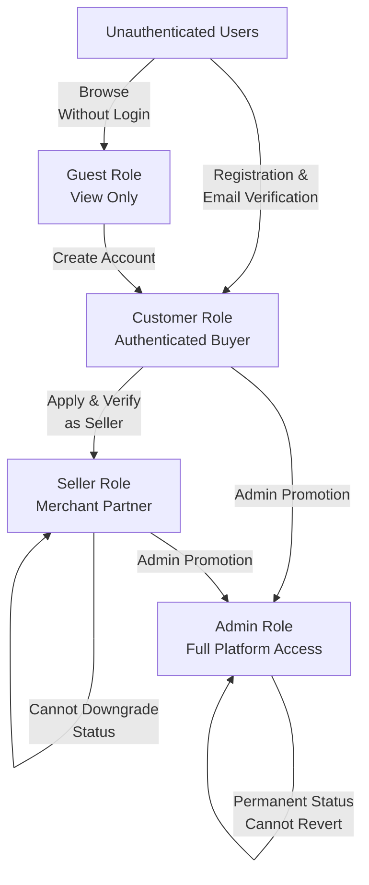
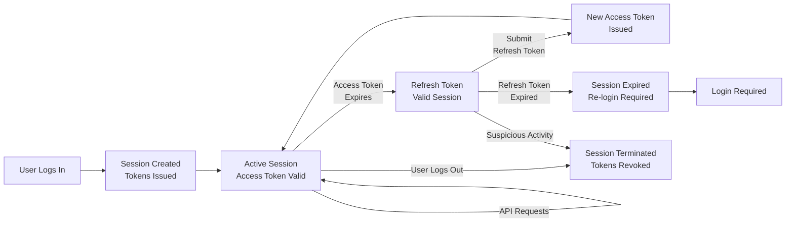

# User Roles and Authentication System

## Authentication System Overview

### Core Authentication Architecture

The shopping mall platform implements a token-based authentication system using JWT (JSON Web Tokens) to secure all user interactions and API access. This system ensures that every authenticated action is properly identified and authorized according to the user's role.

**WHEN a user attempts to access any protected resource, THE system SHALL authenticate using JWT tokens issued during login and verified on every API request.**

**THE system SHALL maintain server-side session state to track active user sessions, including device information, login timestamps, and token validity status.**

**THE system SHALL support concurrent sessions allowing users to be logged in from multiple devices simultaneously, with a maximum limit of 5 concurrent sessions per user (non-admin users) and 10 concurrent sessions for admins.**

### Authentication Flow Overview

Authentication in the shopping mall operates through the following core processes:

1. **User Registration**: New users create accounts with verified email addresses and secure passwords
2. **Login**: Authenticated users receive JWT tokens granting access to protected resources
3. **Token Verification**: Every request is validated using the JWT token before processing
4. **Session Maintenance**: Sessions persist until logout or token expiration
5. **Token Refresh**: Expired access tokens can be refreshed without re-login
6. **Logout**: Users terminate sessions and invalidate tokens immediately

### JWT Token Structure and Components

**WHEN a user logs in successfully, THE system SHALL issue JWT tokens containing the following mandatory claims:**

- **sub (Subject)**: User ID (unique identifier for the authenticated user)
- **aud (Audience)**: "shopping-mall-api" (identifies intended recipient)
- **iat (Issued At)**: Token issue time as Unix timestamp (seconds since epoch)
- **exp (Expiration)**: Token expiration time as Unix timestamp
- **role**: User role name (guest, customer, seller, admin)
- **permissions**: Array of specific permissions/capabilities granted
- **email**: User's email address
- **device_id**: Unique hash identifying the device making the request
- **session_id**: Server-side session reference identifier
- **token_type**: Specifies "accessToken" or "refreshToken"

**WHEN a user logs in, THE system SHALL issue two distinct tokens:**

1. **Access Token**: Valid for 15 minutes (900 seconds), used for API request authentication
2. **Refresh Token**: Valid for 30 days (2,592,000 seconds), stored securely and used to obtain new access tokens

**THE system SHALL use HS256 (HMAC with SHA-256) algorithm to sign all JWT tokens with a secure server secret key.**

### Session Management Architecture

**WHEN a user logs in successfully, THE system SHALL create a server-side session record containing:**

- **Session ID**: Unique, cryptographically secure random identifier (minimum 32 characters)
- **User ID and Role**: Identifies user and their authentication level
- **Login Timestamp**: ISO 8601 format datetime (UTC timezone)
- **Last Activity Timestamp**: Updated with each API request
- **Device Information**: User agent, browser type, OS, device fingerprint
- **IP Address(es)**: Primary IP and change history (supports mobile roaming)
- **Refresh Token Hash**: Bcrypt-hashed refresh token (never store plaintext)
- **Session Status**: "active", "suspended", or "expired"
- **Session Metadata**: Browser capabilities, screen resolution, device type

**WHILE a session is active, THE system SHALL update the last activity timestamp with each authenticated request.**

**WHEN user activity exceeds 30 consecutive days without any API request, THE system SHALL mark the session as expired and invalidate all associated tokens.**

**WHEN a user explicitly logs out, THE system SHALL mark the session as terminated, revoke all tokens immediately, and delete refresh token hashes.**

**THE system SHALL limit each customer/seller user to maximum 5 concurrent active sessions across different devices/browsers.**

**THE system SHALL limit each admin user to maximum 10 concurrent active sessions.**

**WHEN a user creates a session beyond the concurrent limit, THE system SHALL terminate the oldest session (by last activity timestamp) and create the new session.**

---

## User Role Hierarchy and Definitions

The shopping mall platform implements four distinct user roles, each with specific capabilities, responsibilities, and access constraints:

### Role Hierarchy Relationship Diagram



### Guest Role

**Definition**: Unauthenticated users who browse the platform without creating accounts or logging in.

**Purpose**: Allow potential customers to explore the product catalog, understand platform offerings, and build confidence before committing to registration.

**Access Scope - PERMITTED Actions:**
- View all public product listings and product details (name, description, specifications, images, variants)
- Search products by keywords and browse categories
- Filter products by price range, ratings, seller, availability
- View product reviews and average ratings from other customers
- View seller profiles and store information (name, ratings, return policy)
- Explore product categories and subcategories
- Browse featured or recommended products

**Access Restrictions - PROHIBITED Actions:**
- WHEN guest user attempts to add items to shopping cart, THE system SHALL deny access and display "Login required to use shopping cart"
- WHEN guest user attempts to create or manage wishlists, THE system SHALL deny access and display "Login required to save items"
- WHEN guest user attempts to write reviews or ratings, THE system SHALL deny access and display "Login required to write reviews"
- WHEN guest user attempts to contact sellers or view messages, THE system SHALL deny access
- WHEN guest user attempts to access order history or track orders, THE system SHALL deny access
- WHEN guest user attempts to view pricing discounts or personalized offers, THE system SHALL deny access
- WHEN guest user attempts to create seller account, THE system SHALL deny access

### Customer Role

**Definition**: Authenticated buyers who purchase products, manage wishlists, provide feedback, and maintain customer accounts.

**Purpose**: Enable individuals to purchase products, manage their shopping experience, receive customer support, and provide product feedback through reviews.

**Key Responsibilities:**
- Maintain accurate account information (name, email, contact details)
- Provide valid delivery addresses for order fulfillment
- Complete purchases responsibly and follow refund policies
- Provide honest and accurate product reviews
- Manage order fulfillment cooperatively (provide delivery instructions, accept deliveries, confirm receipt)

**Comprehensive Capabilities - Customer Users CAN:**

*Account Management:*
- Create and manage customer profile with personal information
- Manage multiple delivery addresses (up to 10 addresses per customer)
- Update profile information (name, phone, preferences)
- Change password with verification of current password
- Configure notification preferences and communication settings
- View login history and active sessions
- Manage two-factor authentication settings (if enabled)

*Shopping Experience:*
- Add and remove items from shopping cart
- Create unlimited wishlists with custom organization
- Adjust item quantities in cart or wishlist
- View cart totals with automatic tax and shipping calculation
- Search for products using keywords, categories, filters
- Apply promotional discount codes to orders
- Save items for later purchase

*Order Management:*
- Place orders with complete checkout process
- Select payment method from available options
- Specify delivery address and shipping method
- View complete order history with order details and status
- Track order status and shipping updates in real-time
- Receive notifications about order status changes
- Request order cancellation (within defined windows)
- Request refunds (within defined refund windows)
- View estimated and actual delivery dates

*Post-Purchase Activities:*
- Write product reviews and ratings after delivery (within 365 days)
- Edit or delete own reviews and ratings
- View seller responses to reviews
- Upload photos/images as evidence with product reviews
- Request product returns and manage return process
- Track return shipments and refund status

*Communication:*
- Message sellers with product inquiries
- Receive customer support assistance
- Receive order and shipping notifications
- View communication history with sellers and support

**Customer Access Restrictions - CANNOT:**
- WHEN customer attempts to view other customers' personal information, THE system SHALL deny access
- WHEN customer attempts to view other customers' orders, THE system SHALL deny access
- WHEN customer attempts to access seller inventory or business data, THE system SHALL deny access
- WHEN customer attempts to access administrative functions, THE system SHALL deny access
- WHEN customer attempts to view another customer's wishlist, THE system SHALL deny access
- WHEN customer attempts to modify another customer's address or account, THE system SHALL deny access
- WHEN customer attempts to approve or remove products, THE system SHALL deny access

### Seller Role

**Definition**: Authenticated merchants who list and manage products, fulfill customer orders, operate online stores, and build customer relationships.

**Purpose**: Enable entrepreneurs and businesses to sell products on the platform, manage inventory, process orders, and grow their online business.

**Key Responsibilities:**
- Maintain accurate and complete product information and descriptions
- Keep inventory counts current and updated in real-time
- Fulfill orders within defined service level agreement (48-hour processing window)
- Respond to customer inquiries professionally within 24 hours
- Maintain minimum 4.0 average seller rating to remain active
- Maintain order fulfillment rate above 95%
- Comply with all seller policies and platform guidelines
- Not create duplicate accounts or use proxy accounts to circumvent restrictions
- Provide valid business and banking information for commission payments

**Comprehensive Seller Capabilities:**

*Store Management:*
- Create and manage seller store profile with business information
- Update store name, description, policies, and contact information
- Configure store settings and seller policies
- Set default commission payout method and frequency
- Manage store visibility and configuration

*Product Management - Sellers CAN:*
- Add new products with complete information and variants
- Edit own products (name, description, specifications, pricing)
- Create and manage product variants (SKUs) with individual pricing
- Upload and manage product images (up to 10 per product)
- Assign products to appropriate categories (up to 5 categories per product)
- View product performance metrics and sales data
- Set product availability status (active/inactive/discontinued)
- View sales history per product and SKU

*Inventory Management - Sellers CAN:*
- View real-time inventory status for all own SKUs
- Manually adjust inventory quantities with reason codes
- Set low stock warning thresholds (customizable per SKU)
- Monitor inventory trends and reorder recommendations
- View complete inventory transaction history
- Perform bulk inventory uploads via CSV
- Manage inventory across multiple product variants

*Order Fulfillment - Sellers CAN:*
- View orders containing their products only
- Review order details including customer name and delivery address
- Update order processing status (pending → processing → shipped)
- Provide shipping tracking numbers and carrier information
- Mark orders as shipped and ready for pickup
- Communicate with customers about orders
- Add order processing notes and updates
- Request order cancellation (within defined windows with customer approval)

*Analytics and Business Intelligence - Sellers CAN:*
- Access seller dashboard with real-time sales metrics
- View revenue and commission tracking
- Review sales trends and performance analytics
- Analyze product performance (units sold, revenue, conversion rates)
- Monitor customer reviews and average rating
- Track fulfillment rate and response time metrics
- Generate business reports for analysis

*Customer Interaction - Sellers CAN:*
- Respond to customer reviews with professional responses
- Message customers about orders or products
- Provide customer support within platform messaging system
- View customer feedback and improvement suggestions

**Seller Restrictions - CANNOT:**
- WHEN seller attempts to view, edit, or manage other sellers' products, THE system SHALL deny access and log unauthorized attempt
- WHEN seller attempts to view orders not containing their products, THE system SHALL deny access
- WHEN seller attempts to view other sellers' customer information, THE system SHALL deny access
- WHEN seller attempts to view other sellers' pricing or inventory data, THE system SHALL deny access
- WHEN seller attempts to change own role or verification status, THE system SHALL deny access
- WHEN seller attempts to access administrative functions or dashboards, THE system SHALL deny access
- WHEN seller attempts to directly approve or process refunds, THE system SHALL route to admin-only refund processing
- WHEN seller attempts to modify product category after publication, THE system SHALL deny access (prevents data inconsistency)
- WHEN seller attempts to create product variants after initial publication without admin approval, THE system SHALL require approval

### Admin Role

**Definition**: System administrators with complete platform access for oversight, moderation, operational management, and governance.

**Purpose**: Enable platform operators to maintain data integrity, resolve disputes, ensure regulatory compliance, manage users, and ensure the platform operates smoothly.

**Key Responsibilities:**
- Monitor platform health, performance, and system metrics
- Manage and verify user accounts according to policies
- Ensure compliance with all platform policies and regulations
- Handle disputes between customers and sellers fairly
- Process financial transactions and commission payments
- Maintain data integrity and prevent fraud
- Respond to customer and seller escalations
- Generate reports for business stakeholders

**Complete Admin Capabilities - Admins CAN:**

*User Management - Admins CAN:*
- View and search all user accounts (customers, sellers, admins) with complete profiles
- Verify seller identity and approve seller account registrations
- Suspend or deactivate user accounts for policy violations (customer, seller)
- Temporarily suspend accounts for investigation (data preserved)
- Permanently delete user accounts (with data retention per policy)
- Reset user passwords and force re-authentication
- Create new administrator accounts and assign permission levels
- Manage other admin accounts and permissions
- View complete user transaction history and behavior patterns

*Product and Catalog Management - Admins CAN:*
- View and approve all product submissions before publication
- Remove or hide products for policy violations or quality issues
- Modify product information if necessary to maintain standards
- Manage product categories and catalog structure
- Review product compliance with platform guidelines
- View all product variants, pricing, and inventory data
- Reject products with explanatory feedback to sellers
- Request product modifications from sellers

*Order Management - Admins CAN:*
- View and access all orders on the platform (no restrictions)
- Modify order status and fulfillment details when necessary
- Process refunds and handle payment reversals
- Resolve order disputes and exceptions
- Cancel orders for compliance or fraud reasons
- Access complete transaction history and payment records
- Investigate order issues and discrepancies

*Financial and Commission Management - Admins CAN:*
- Monitor all payment transactions and settlements across platform
- Calculate and manage seller commission rates (default and custom)
- Process payments to sellers on configured schedules
- Generate financial reports and revenue analysis
- Handle payment disputes and chargebacks
- Reconcile payment transactions and identify discrepancies
- Reverse or adjust commission payments if necessary
- Set system commission rates and fee structures

*Dispute Resolution - Admins CAN:*
- Access all open disputes and investigate details
- Request additional information from disputing parties
- Review evidence and supporting documentation
- Make final resolution decisions (approve refund, uphold seller, etc.)
- Apply seller penalties for policy violations
- Issue customer credits or compensation
- Escalate complex disputes to senior management

*Dashboard and Analytics - Admins CAN:*
- Access comprehensive admin dashboard with full platform visibility
- Generate platform-wide analytics and performance reports
- Monitor system health and performance metrics
- View audit logs of all platform activities
- Export data for analysis and compliance
- Configure system settings and business policies
- Access all customer and seller data for investigation

**Admin Restrictions:**
- WHEN admin attempts to impersonate a user account, THE system SHALL deny access and log as security violation
- WHEN admin attempts to bypass audit logging, THE system SHALL prevent action and flag for investigation
- WHEN admin attempts to delete historical transaction records, THE system SHALL deny access (audit trail preservation)
- WHEN admin attempts to modify audit logs, THE system SHALL deny access (audit trail integrity)

---

## Authentication System Implementation Details

### Login Request Processing

**WHEN a customer/seller/admin submits login credentials (email and password), THE system SHALL:**

1. Validate that both email and password fields are provided (not empty)
2. Search for user account with matching email (case-insensitive comparison)
3. IF no account found with that email, THEN display "No account found with this email address" and do NOT reveal whether email is registered
4. If account found, verify the entered password against the stored password hash using bcrypt comparison
5. IF password does not match, THEN display "Email or password is incorrect" (deliberately vague for security)
6. Check the account status (not suspended, not deactivated, not locked)
7. IF account is suspended, THEN display "This account has been suspended. Please contact support to resolve the issue"
8. IF account is locked (too many failed attempts), THEN display "Account is locked due to multiple failed login attempts. Please try again in 15 minutes"

**WHEN all validations pass, THE system SHALL:**

1. Generate JWT access token with 15-minute expiration
2. Generate JWT refresh token with 30-day expiration
3. Create server-side session record with device fingerprint
4. Hash and store refresh token (never store plaintext)
5. Return both tokens to client with token metadata
6. Record successful login with timestamp, IP, user agent
7. Send login notification email to user with device/location information

### Token Generation and Claims

**WHEN generating access token, THE system SHALL include these claims:**

```json
{
  "iss": "shopping-mall",
  "aud": "shopping-mall-api",
  "iat": 1697001600,
  "exp": 1697002500,
  "sub": "user-uuid-12345",
  "email": "customer@example.com",
  "role": "customer",
  "permissions": [
    "product:browse",
    "cart:manage",
    "order:create",
    "review:write",
    "wishlist:manage"
  ],
  "device_id": "hash-of-user-agent-and-ip",
  "session_id": "session-uuid-67890",
  "token_type": "access"
}
```

**WHEN generating refresh token, THE system SHALL include these claims:**

```json
{
  "iss": "shopping-mall",
  "aud": "shopping-mall-api",
  "iat": 1697001600,
  "exp": 1730537600,
  "sub": "user-uuid-12345",
  "session_id": "session-uuid-67890",
  "token_type": "refresh"
}
```

### Token Refresh Mechanism

**WHEN a client's access token expires and they attempt to access protected resource, THE API SHALL return HTTP 401 status with error: "Access token expired. Please refresh token".**

**WHEN a client submits their refresh token to the token refresh endpoint (/auth/refresh), THE system SHALL:**

1. Validate refresh token format and signature
2. Verify token has not expired (exp claim < current time)
3. Check refresh token against stored hash in session record
4. Verify session is still active (not terminated or revoked)
5. Perform optional device consistency check (user agent matches original login)
6. Generate new access token with identical user claims but updated iat/exp timestamps
7. Optionally rotate refresh token (generate new one if security policy requires)
8. Return new access token to client immediately

**IF any validation fails during token refresh, THE system SHALL deny the refresh request and require user to log in again.**

---

## Permission Matrix and Access Control

### Product Management Permissions

| Feature | Guest | Customer | Seller | Admin |
|---------|-------|----------|--------|-------|
| View public products | ✅ | ✅ | ✅ | ✅ |
| Search and filter products | ✅ | ✅ | ✅ | ✅ |
| View product details | ✅ | ✅ | ✅ | ✅ |
| Create product listing | ❌ | ❌ | ✅ | ✅ |
| Edit own products | ❌ | ❌ | ✅* | ❌ |
| Edit any product | ❌ | ❌ | ❌ | ✅ |
| Delete product | ❌ | ❌ | ✅* | ✅ |
| Approve product for listing | ❌ | ❌ | ❌ | ✅ |
| Remove product from catalog | ❌ | ❌ | ❌ | ✅ |
| Manage product variants/SKUs | ❌ | ❌ | ✅* | ❌ |
| Adjust inventory | ❌ | ❌ | ✅* | ✅ |

*Only for own products/inventory

### Shopping and Order Permissions

| Feature | Guest | Customer | Seller | Admin |
|---------|-------|----------|--------|-------|
| View product catalog | ✅ | ✅ | ✅ | ✅ |
| Add to cart | ❌ | ✅ | ✅* | ✅* |
| View own cart | ❌ | ✅ | ✅ | ✅ |
| Place order | ❌ | ✅ | ✅ | ✅ |
| View own orders | ❌ | ✅ | ✅* | ❌ |
| View all orders | ❌ | ❌ | ❌ | ✅ |
| Process payment | ❌ | ✅ | ✅ | ❌ |
| Update order status | ❌ | ❌ | ✅* | ✅ |
| Cancel order | ❌ | ✅* | ✅* | ✅ |
| Process refund | ❌ | ❌ | ❌ | ✅ |

*Limited scope: sellers view only orders for their products

### Additional Security Specifications

**WHEN an unauthenticated user attempts to access protected endpoint, THE system SHALL return HTTP 401 Unauthorized with response body:**

```json
{
  "error": "AUTHENTICATION_REQUIRED",
  "message": "Authentication token is missing or invalid",
  "status": 401,
  "timestamp": "2024-10-16T01:18:49.232Z"
}
```

**WHEN an authenticated user attempts to access resource outside their permission scope, THE system SHALL return HTTP 403 Forbidden with response body:**

```json
{
  "error": "INSUFFICIENT_PERMISSIONS",
  "message": "User role does not have permission for this action",
  "required_role": "admin",
  "user_role": "customer",
  "status": 403,
  "timestamp": "2024-10-16T01:18:49.232Z"
}
```

**WHEN a seller attempts to modify another seller's product, THE system SHALL:**
1. Return HTTP 403 Forbidden response
2. Log unauthorized access attempt with seller ID, product ID, timestamp
3. Alert admin if multiple unauthorized attempts detected from same seller
4. Not reveal that the product belongs to another seller

---

## Session Management and Token Lifecycle

### Session State Diagram



### Session Timeout Policies

**WHEN 30 consecutive days pass without any authenticated API request, THE system SHALL:**
1. Mark session as "expired"
2. Invalidate refresh token
3. Require user to log in again when they next attempt access
4. Notify user that session expired (in login screen or email)

**WHEN 90 days have elapsed since session creation (regardless of activity), THE system SHALL:**
1. Mark session as "terminated"
2. Revoke all tokens
3. Delete session record from active sessions
4. Archive session data for audit purposes

**WHEN a user logs out explicitly, THE system SHALL:**
1. Mark session as "terminated" immediately
2. Revoke access token (add to token blacklist if implemented)
3. Revoke refresh token (delete token hash)
4. Clear session cookies on client
5. Send confirmation email to user

### Concurrent Session Management

**THE system SHALL allow these session limits:**
- **Customer/Seller accounts**: Maximum 5 concurrent sessions
- **Admin accounts**: Maximum 10 concurrent sessions
- **Guest accounts**: No session tracking (stateless)

**WHEN a user creates session beyond limit, THE system SHALL:**
1. Identify all active sessions for this user
2. Sort by last activity timestamp (oldest first)
3. Terminate the oldest session
4. Create the new session
5. Send notification email about logout from previous device

**THE system SHALL track and display to user:**
- Device type and name
- Browser and OS information
- IP address and approximate location
- Last activity timestamp
- Option to logout this session remotely

### Multi-Device Scenario

**WHEN customer logs in on mobile, then logs in on desktop, THE system SHALL:**
1. Create two separate sessions (one per device)
2. Issue separate tokens for each session
3. Allow independent token refresh per session
4. Allow independent logout per device
5. Display both active sessions in security settings

**WHEN customer logs out from desktop, THE system SHALL:**
1. Terminate only the desktop session
2. Keep mobile session active
3. Not affect mobile device tokens
4. Notify customer of logout from desktop

---

## Security Considerations and Best Practices

### Password Security

**THE system SHALL hash all passwords using bcrypt with salt rounds of 12 minimum.**

**THE system SHALL enforce password expiration every 90 days, requiring users to create new password.**

**WHEN user creates password, THE system SHALL validate against common weak password list and dictionary words.**

**WHEN user attempts password reset, THE system SHALL require email verification and invalidate all existing sessions for security.**

### Token Security

**THE system SHALL store JWT signing secret key in secure configuration (not in code repository).**

**THE system SHALL use strong cryptographic algorithms (HS256 minimum, RS256 preferred).**

**THE system SHALL validate JWT signature on every API request using the same secret key.**

**THE system SHALL never expose complete JWT tokens in logs or error messages (only first 8 characters visible).**

### Transport Security

**ALL authentication requests SHALL use HTTPS with TLS 1.2 or higher encryption.**

**THE system SHALL set secure and httpOnly flags on authentication cookies.**

**THE system SHALL implement CSRF token protection on state-changing endpoints.**

### Attack Prevention

**WHEN login attempts fail 5 times within 15 minutes, THE system SHALL lock account for 30 minutes.**

**WHEN suspicious authentication patterns detected (impossible travel, too many device changes), THE system SHALL require additional verification.**

**WHEN token is used from drastically different IP/location than original login, THE system SHALL request re-authentication.**

---

## API Endpoint Authorization Examples

### Protected Endpoint Authorization Flow

**For endpoint: POST /api/orders (Create Order)**

1. Extract Authorization header: "Bearer {access_token}"
2. Verify JWT signature using server secret key
3. Check token expiration (exp claim > current time)
4. Extract user ID and role from token claims
5. Verify user role is "customer" (orders require customer or admin role)
6. Query database to verify user exists and is not suspended
7. Verify user session is still active in database
8. Process the request with authenticated user context
9. Log successful authorization with user ID, timestamp, action

**For endpoint: GET /api/sellers/:sellerId/products (View Seller Products)**

1. Extract and verify JWT token (same process as above)
2. Extract sellerId from URL path
3. IF requesting user is a seller AND sellerId matches their ID, THEN allow (sellers view own products)
4. IF requesting user is admin, THEN allow (admins can view any seller's products)
5. IF requesting user is customer, THEN deny with 403 Forbidden
6. IF requesting seller is a different seller, THEN deny with 403 Forbidden
7. Return product list or 403 error accordingly

---

## Summary

The authentication and authorization system provides:

- **JWT-based stateless authentication** for API security
- **Server-side session management** for tracking user activity and device information
- **Four user roles** with distinct capabilities and restrictions (Guest, Customer, Seller, Admin)
- **Comprehensive permission matrix** defining access to features and endpoints
- **Token refresh mechanism** enabling long-lived user sessions without compromising security
- **Concurrent session management** supporting multi-device authentication with configurable limits
- **Security hardening** including password policies, token signing, HTTPS requirements, and attack prevention

This system balances security requirements with user experience, enabling customers and sellers to maintain authenticated sessions across devices while preventing unauthorized access and protecting sensitive user data.

> *Developer Note: This document defines **business requirements only**. All technical implementations (JWT library selection, token storage mechanism, session backend choice, password hashing library, database schema design, etc.) are at the discretion of the development team. The document describes WHAT the authentication system should accomplish, not HOW to build it.*