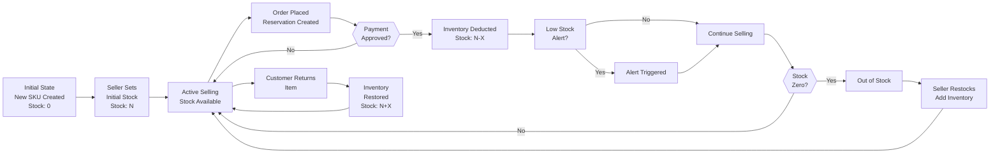

# Inventory Management System

## Inventory System Overview

The inventory management system is the critical operational backbone of the shopping mall platform that ensures accurate stock tracking, prevents overselling, and maintains real-time visibility of product availability across the platform. This system operates at the Stock Keeping Unit (SKU) level, meaning each unique combination of a product with its specific variants (such as color, size, or other options) is tracked independently with its own inventory quantity.

### Purpose and Scope

THE inventory management system SHALL track product availability at the most granular level—the SKU—to ensure accurate real-time stock information for customers, sellers, and administrators. The system must prevent double-selling of the same item, maintain consistent stock counts despite concurrent orders, and provide visibility into inventory levels for business decision-making.

### Core Inventory Concepts

- **Product**: A general item offered on the platform (e.g., "Blue Wireless Headphones")
- **SKU (Stock Keeping Unit)**: A unique identifier representing a specific product variant with a specific combination of options (e.g., "Blue Wireless Headphones - Color: Blue, Size: Large, Connection: Bluetooth 5.0")
- **Stock Quantity**: The number of units available for purchase for a specific SKU
- **Inventory Transaction**: Any event that changes stock quantity (purchase, return, adjustment, restock)
- **On-Hand Stock**: Current quantity physically available for sale
- **Reserved Stock**: Quantity held for orders that are placed but not yet completed or confirmed

### Business Justification

Accurate inventory management directly impacts customer satisfaction, prevents financial loss from overselling, and enables sellers to manage their supply effectively. Real-time inventory tracking prevents the frustration of customers purchasing items that are actually out of stock, protects sellers from inventory shortfalls, and helps administrators monitor platform health and compliance.

---

## SKU-Level Inventory Architecture

### SKU and Variants Relationship

Each product on the platform can have multiple variants, and each unique combination of variants creates a distinct SKU that requires independent inventory tracking. For example, a "Cotton T-Shirt" product might have multiple SKUs:

- SKU-001: Cotton T-Shirt (Color: Red, Size: Small)
- SKU-002: Cotton T-Shirt (Color: Red, Size: Medium)
- SKU-003: Cotton T-Shirt (Color: Blue, Size: Small)
- SKU-004: Cotton T-Shirt (Color: Blue, Size: Medium)

Each SKU above maintains its own independent stock quantity and pricing.

### SKU Inventory Data Structure

THE inventory system SHALL maintain the following information for each SKU:

- **SKU Identifier**: Unique identifier linking to the specific product variant
- **Current Stock Quantity**: The current number of units available for purchase
- **Reserved Stock**: Units committed to placed orders but not yet shipped
- **Available Stock**: Calculated as Current Stock minus Reserved Stock
- **Reorder Level**: Minimum stock threshold; when inventory falls below this level, alerts trigger
- **Last Updated Timestamp**: When the inventory quantity was last modified
- **Stock History**: Complete transaction log of all inventory changes

### Seller Inventory Ownership

WHEN a seller creates a product with variants on the platform, THE system SHALL automatically create individual SKU records for each variant combination, with inventory initially set to zero. THE system SHALL assign ownership of each SKU to the seller who created the product, ensuring sellers can only modify inventory for their own products.

---

## Stock Quantity Management

### Initial Stock Entry

WHEN a seller adds a new product with variants to their catalog, THE system SHALL require the seller to specify the initial stock quantity for each unique SKU variant. THE system SHALL validate that stock quantities are non-negative integers before accepting them.

THE seller product management interface SHALL display an inventory input form showing all variant combinations and their individual stock quantity fields. Sellers must explicitly set stock for each SKU, as stock defaults to zero if not specified.

### Stock Adjustments and Updates

THE seller inventory dashboard SHALL provide functionality to adjust stock quantities for any of their SKUs through manual stock corrections. WHEN a seller adjusts stock quantities manually, THE system SHALL:

1. Log the adjustment as an inventory transaction with timestamp
2. Record the adjustment reason (e.g., "Physical count correction", "Damage/loss", "Restock from warehouse")
3. Calculate the difference between previous and new quantity
4. Update the current stock quantity
5. Notify the seller of the successful adjustment
6. Maintain complete audit trail of the change

Sellers can only adjust inventory for their own products' SKUs.

### Stock Transfer Between Variants

WHERE a seller has excess inventory of one variant and insufficient inventory of another variant of the same product, THE system MAY allow sellers to transfer stock between SKUs. WHEN a seller initiates a stock transfer between two SKUs, THE system SHALL:

1. Validate that both SKUs belong to the same seller
2. Validate that the source SKU has sufficient available (non-reserved) inventory
3. Atomically deduct from the source SKU and add to the destination SKU
4. Log the transfer as two linked inventory transactions
5. Maintain audit trail showing source and destination SKUs

---

## Inventory Updates During Order Transactions

### Inventory Hold and Reservation System

The inventory system uses a reservation model to handle the time gap between when a customer places an order and when payment is confirmed. This prevents the same inventory from being sold to multiple customers during checkout.

WHEN a customer adds items to their shopping cart, THE system SHALL NOT reserve inventory. Cart items represent intent to purchase, not a commitment.

WHEN a customer initiates order placement with selected items from their cart, THE system SHALL attempt to reserve the requested quantities for each SKU. IF sufficient available inventory (on-hand stock minus reserved stock) exists for all items in the order, THE system SHALL create inventory reservations for those quantities and temporarily hold them for 15 minutes (or until payment is processed, whichever is sooner).

IF insufficient inventory exists for any item in the order, THE system SHALL:

1. Reject the order placement
2. Display the specific SKU(s) that lack sufficient inventory
3. Show the customer the current available quantity for each insufficient SKU
4. Allow the customer to either reduce quantities or remove items
5. NOT create any reservations for the order

### Atomic Inventory Deduction on Order Confirmation

WHEN an order payment is successfully processed and the order status transitions to "Confirmed", THE system SHALL atomically convert the inventory reservations into actual inventory deductions. This means:

1. Reserved quantities for that order become permanent stock reductions
2. Stock quantity for each SKU is permanently decreased
3. The system records an inventory transaction for each SKU involved
4. Available stock is recalculated for all affected SKUs
5. The operation completes atomically—either all SKUs update successfully or the entire operation rolls back

THE system SHALL prevent any partial completion of inventory deductions. If any SKU fails to update during this process, the entire order confirmation operation SHALL fail, and the system SHALL attempt to restore reservations for manual review.

### Inventory Restoration on Order Cancellation

WHEN a customer requests order cancellation while the order is in "Pending Confirmation" status (before payment), THE system SHALL release the inventory reservations without affecting stock quantity.

WHEN an order is cancelled after payment confirmation (status "Confirmed" or beyond), THE system SHALL:

1. Restore the inventory quantities for all SKUs in that order
2. Create an inventory transaction recording the restoration
3. Mark the restoration as "Order Cancellation [Order ID]"
4. Recalculate available stock for affected SKUs
5. Notify the seller that inventory has been restored due to cancellation

### Inventory Restoration on Refund/Return

WHEN a customer initiates a return request for an order (or order items) in "Shipped" or "Delivered" status, THE system SHALL place a hold on inventory restoration pending return receipt verification.

WHEN the seller confirms receipt of returned items (order status transitions to "Return Received"), THE system SHALL:

1. Restore inventory quantities for the returned SKUs
2. Create an inventory transaction recording the restoration as "Return Received [Order ID]"
3. Mark the item status as "Returned"
4. Recalculate available stock

WHERE the refund request is approved but the seller waives the physical return requirement, THE system MAY restore inventory without requiring physical return verification.

### Inventory Transaction Logging

EVERY inventory update—whether from orders, manual adjustments, transfers, or returns—SHALL create an immutable audit log entry. Each transaction record SHALL include:

- **Transaction ID**: Unique identifier for this transaction
- **SKU Identifier**: Which SKU was affected
- **Transaction Type**: (Order Purchase, Manual Adjustment, Transfer, Return, Cancellation, etc.)
- **Quantity Change**: The numeric change (positive for additions, negative for deductions)
- **Quantity Before**: Stock quantity before this transaction
- **Quantity After**: Stock quantity after this transaction
- **Timestamp**: When the transaction occurred
- **Reason/Reference**: Related order ID, reason for adjustment, etc.
- **Initiated By**: Who made the change (seller, admin, system)

This audit trail enables tracking inventory history, investigating discrepancies, and supporting seller reconciliation.

---

## Low Stock Warnings and Alerts

### Low Stock Threshold Configuration

Each seller can configure a low stock alert threshold for their products. WHEN a seller sets up a product with variants, THE system SHALL allow them to define a "Reorder Level" or "Low Stock Alert Threshold" for each SKU.

THE system SHALL use this threshold to monitor inventory levels and trigger alerts when stock falls below the configured level.

### Low Stock Notifications to Sellers

WHEN a SKU's available stock quantity falls to or below its configured reorder level (after an order confirmation), THE system SHALL:

1. Trigger a low stock alert notification
2. Send the alert to the seller who owns that product
3. Display the alert in the seller's inventory dashboard
4. Include information about: SKU identifier, product name, variant details, current stock quantity, reorder level threshold
5. Enable the seller to quickly navigate to restock or adjust the product

LOW stock alerts are informational and do not prevent customers from purchasing. However, the system can display "Limited Stock Available" or similar messaging to customers when viewing products with low inventory, encouraging faster purchase.

### Automatic Reorder Suggestions

WHERE a seller has configured automated reorder rules for a product, THE system MAY automatically generate reorder suggestions or reminders when inventory falls below the reorder level. These suggestions appear in the seller dashboard and help sellers maintain optimal inventory levels.

---

## Inventory Validation Rules

### Overselling Prevention

THE CRITICAL RULE to prevent overselling is that THE system SHALL NEVER allow total committed inventory (on-hand stock minus reserved quantities) to go negative. This rule is enforced at every transaction point:

- WHEN a customer attempts to place an order with quantities for specific SKUs, THE system SHALL validate that each SKU has available inventory equal to or greater than the requested quantity
- WHEN a seller attempts to transfer inventory between SKUs, THE system SHALL validate that the source SKU has unreserved inventory available
- WHEN an admin manually modifies inventory, THE system SHALL prevent reductions that would create negative inventory values

### Inventory Consistency Validation

THE system SHALL perform periodic validation of inventory data integrity to ensure:

- Current stock quantity for any SKU is never negative
- Reserved quantity for any SKU does not exceed current stock
- Available stock (current minus reserved) is correctly calculated
- Sum of all SKU quantities for a product matches expected totals
- All inventory transactions have corresponding audit trail entries
- Timestamp ordering of inventory transactions is logical and consistent

WHEN consistency validation detects discrepancies, THE system SHALL:

1. Log the discrepancy with detailed information
2. Alert administrators to the inventory inconsistency
3. Provide tools to view and correct the discrepancy
4. Create an audit record of any corrections made

### Inventory Atomicity Rules

WHEN processing any inventory update that affects multiple SKUs simultaneously (such as multi-item orders or bulk adjustments), THE system SHALL apply atomic transaction principles:

- All SKU updates complete successfully or none complete at all
- No partial inventory deductions or reservations
- Consistent state is maintained even if system fails mid-operation
- Database rollback occurs if any update fails

### Inventory Accuracy Requirements

THE system SHALL maintain inventory accuracy such that:

- THE difference between recorded inventory and actual physical inventory does not exceed tolerance thresholds (typically <1% for actively sold SKUs, <2% for slow-moving SKUs)
- Inventory records are updated within 2 seconds of order confirmation in production systems
- All inventory changes are audit-logged within 5 seconds of occurrence
- Inventory queries return current stock levels within 1-2 seconds (eventual consistency acceptable for read operations)

---

## Inventory Visibility and Access Control

### Seller Inventory Visibility

THE seller inventory dashboard SHALL display:

1. **Inventory Status Per SKU**: A detailed table or list showing each SKU with:
   - Product name and variant details (color, size, options)
   - Current stock quantity
   - Reserved quantity (items in active orders)
   - Available quantity (current minus reserved)
   - Reorder level threshold
   - Status indicator (In Stock, Low Stock, Out of Stock)
   - Last updated timestamp

2. **Inventory Trends**: A visual representation showing:
   - Stock quantity changes over the last 7, 14, and 30 days
   - Sales velocity (units sold per day)
   - Recommended reorder timing based on sales velocity

3. **SKU Performance Metrics**: For each SKU:
   - Total units sold (current month, last 30 days)
   - Revenue generated
   - Sell-through rate (units sold vs average inventory level)
   - Stock-out incidents and duration

4. **Low Stock Alerts**: A prominent section highlighting:
   - SKUs currently below reorder level
   - Out-of-stock SKUs
   - Recently restocked SKUs

WHEN a seller accesses their inventory view, THE system SHALL display only inventory data for products and SKUs they own. Sellers cannot view inventory for other sellers' products.

### Admin Inventory Management

THE admin inventory dashboard SHALL provide complete visibility into:

1. **Platform-Wide Inventory Status**: Aggregated view of:
   - Total active SKUs across platform
   - SKUs by stock status (in stock, low stock, out of stock)
   - Inventory value (quantity × price) across platform
   - Recent inventory transactions across all sellers

2. **Per-Seller Inventory Monitoring**: Ability to:
   - View complete inventory for any seller
   - Adjust inventory quantities if needed (with detailed logging)
   - Investigate inventory discrepancies
   - Set inventory requirements or policies for specific sellers

3. **Inventory Transaction History**: Detailed audit log showing:
   - All inventory changes across entire platform
   - Filtering by seller, product, SKU, date range, transaction type
   - Ability to drill into any transaction details
   - Export capabilities for reporting

4. **Inventory Analytics**: Reports and analytics showing:
   - Inventory turnover rates by SKU
   - Slow-moving inventory identification
   - Stock-out impact on sales
   - Inventory forecasting based on trends

WHEN an admin adjusts inventory or overrides inventory rules, THE system SHALL:

1. Create a detailed audit record identifying the admin, timestamp, and reason
2. Notify relevant sellers of inventory changes to their products
3. Provide explanation in audit trail for any bypassed validations

### Guest and Customer Inventory Visibility

WHEN a guest or customer views a product listing, THE system SHALL display:

- Stock availability status: "In Stock", "Limited Stock", "Pre-Order", "Out of Stock"
- For "Limited Stock" products: quantity indicator like "Only 3 left in stock"
- For each variant (SKU), whether it's in stock or out of stock

THE system SHALL NOT display exact inventory quantities to customers (e.g., customers should not see "7 units in stock"). This protects seller competitive information and prevents inventory-based demand manipulation.

---

## Inventory Reporting and Analytics

### Inventory Status Reports

THE admin inventory reports SHALL include:

**Stock Level Report**:
- Complete list of all SKUs with current stock levels
- Available stock vs reserved stock breakdown
- Variance from optimal stock levels
- Exportable as CSV/Excel for external analysis

**Stock Movement Report**:
- SKUs with highest sales velocity
- Newly restocked items
- Items approaching stock-out
- Slow-moving inventory (no sales in past 30 days)

**Inventory Value Report**:
- Total inventory value (quantity × cost/price) by seller
- Inventory value trending over time
- High-value inventory identification
- Concentration analysis (percentage of value in top 20% of SKUs)

### Seller Inventory Reports

Sellers can generate reports within their dashboard showing:

- Stock levels for each SKU
- Sales and stock movements for a date range
- Reorder recommendations based on sales velocity
- Inventory efficiency metrics
- Stock-out history and duration

### Inventory Forecasting

WHERE the system has collected sufficient historical sales data for a SKU (at least 30 days of sales history), THE system MAY provide inventory forecasts suggesting:

- Recommended stock level to minimize stock-outs
- Estimated reorder date based on current sales velocity
- Projected stock-out date if no restocking occurs

These forecasts aid sellers in proactive inventory management.

---

## Inventory Workflow Examples

### Example 1: Successful Order with Inventory Deduction

1. **Customer browses product**: Views "Blue Wireless Headphones - Size: Large" (SKU-001)
   - System displays "In Stock" (Current stock: 5 units, no reservation)

2. **Customer adds to cart**: Adds 1 unit to shopping cart
   - No inventory change; no reservation created

3. **Customer initiates checkout**: Reviews order with 1 unit of SKU-001
   - System validates available inventory: 5 units available ≥ 1 requested ✓
   - System creates reservation: SKU-001 reserved quantity increases by 1 (current: 5, reserved: 1, available: 4)
   - Reservation expires in 15 minutes

4. **Customer completes payment**: Payment gateway confirms successful payment
   - Order status changes to "Confirmed"
   - System performs atomic inventory deduction:
     - SKU-001 current stock: 5 → 4
     - SKU-001 reserved: 1 → 0
     - Inventory transaction logged: "Order Purchase [Order-12345], -1 unit"

5. **Order fulfillment**: Seller picks and ships the item
   - Inventory remains at 4 units (already deducted at order confirmation)
   - No additional inventory adjustments

### Example 2: Stock-Out Prevention During Concurrent Orders

1. **Initial state**: SKU-002 (Red T-Shirt, Size: Medium) has 2 units in stock

2. **Two customers simultaneously attempt order**:
   - Customer A: Places order for 2 units of SKU-002
     - Validation: 2 available ≥ 2 requested ✓
     - Reservation created: 2 units reserved (current: 2, reserved: 2, available: 0)
   
   - Customer B: Places order for 1 unit of SKU-002 (milliseconds after Customer A)
     - Validation: 0 available ≥ 1 requested ✗
     - Reservation rejected
     - Error message: "This item is no longer available"

3. **Result**: Customer B is prevented from overselling; only Customer A's order is confirmed

### Example 3: Return and Inventory Restoration

1. **Order delivered**: Customer receives order with SKU-003 (1 unit)
   - Inventory state: Current: 8 units (already deducted when order confirmed)

2. **Customer requests return**: Initiates return within return window
   - Order status: "Return Requested"
   - Inventory state: No change yet (awaiting return receipt)

3. **Seller receives return**: Verifies returned item matches order
   - Order status: "Return Received"
   - System performs inventory restoration:
     - SKU-003 current stock: 8 → 9
     - Inventory transaction logged: "Return Received [Order-12345], +1 unit"

4. **Final inventory state**: SKU-003 returns to availability

---

## Integration with Related Systems

### Integration with Product Catalog

WHEN a seller adds a new product with multiple variant combinations (e.g., 3 colors × 4 sizes = 12 combinations), THE inventory system SHALL automatically create 12 unique SKU inventory records, each initialized with zero stock. The seller can then set initial stock quantities for each SKU.

WHEN a seller modifies product variants (e.g., adds a new color option), THE system SHALL create new SKU records for the new variant combinations. Existing SKU records remain unchanged.

WHEN a seller removes product variant options (e.g., discontinues a color), THE system SHALL handle affected SKUs based on their stock status:
- IF SKU has zero stock, the system MAY archive or delete the SKU record
- IF SKU has remaining inventory, the system SHALL preserve the SKU and alert the seller about stranded inventory

### Integration with Order Processing

Detailed order processing requirements referencing inventory are documented in [Order Processing Document](./08-order-processing.md). Key inventory integration points:

- Order placement triggers inventory validation
- Order confirmation triggers atomic inventory deduction
- Order cancellation triggers inventory restoration
- Returns trigger inventory restoration

### Integration with Seller Dashboard

Detailed seller dashboard requirements are documented in [Seller Dashboard Document](./12-seller-dashboard.md). The inventory management section provides sellers with visibility and control over their stock.

### Integration with Admin Dashboard

Detailed admin dashboard requirements are documented in [Admin Dashboard Document](./13-admin-dashboard.md). The inventory management section provides administrators with platform-wide inventory oversight.

---

## Non-Functional Inventory Requirements

### Performance Requirements

- **Inventory queries**: Inventory status lookups must complete within 500ms
- **Inventory updates**: Atomic inventory deductions must complete within 2 seconds
- **Inventory holds**: Reservation creation must complete within 1 second
- **Bulk inventory operations**: Admin bulk adjustments (up to 1,000 SKUs) must complete within 30 seconds
- **Inventory reports**: Report generation for up to 100,000 SKUs must complete within 60 seconds

### Reliability Requirements

- **Inventory accuracy**: System must maintain inventory accuracy without human intervention
- **Atomicity guarantees**: All-or-nothing inventory updates ensure data consistency
- **Audit trail**: 100% of inventory changes must be logged
- **Recovery**: System recovery after failure must restore inventory to last consistent state
- **Availability**: Inventory system must be available 99.9% of the time

### Scalability Requirements

- System must handle inventory operations for platforms with:
  - Up to 1 million active SKUs
  - 10,000+ concurrent inventory operations per second
  - Sellers with up to 100,000 SKUs each
  - Order processing rates of 1,000+ orders per minute at peak

---

## Inventory System Workflow Diagram

```mermaid
graph LR
    A["Customer Views Product"] --> B{{"Add to Cart?"}}
    B -->|"Yes"| C["Add to Cart<br/>No Reservation"]
    B -->|"No"| A
    C --> D["Customer Proceeds<br/>to Checkout"]
    D --> E["Initiate Order<br/>Placement"]
    E --> F{{"Validate Inventory<br/>Available?"}}
    F -->|"No"| G["Reject Order<br/>Insufficient Stock"]
    G --> H["Show Available<br/>Quantities to Customer"]
    F -->|"Yes"| I["Create Inventory<br/>Reservations<br/>15 min Timeout"]
    I --> J["Process Payment"]
    J --> K{{"Payment<br/>Successful?"}}
    K -->|"No"| L["Release Reservations<br/>Restore Availability"]
    L --> M["Payment Failed<br/>Notification"]
    K -->|"Yes"| N["Confirm Order<br/>Status: Confirmed"]
    N --> O["Atomic Inventory<br/>Deduction<br/>Reservations Converted"]
    O --> P["Log Inventory<br/>Transaction"]
    P --> Q["Calculate<br/>Available Stock"]
    Q --> R["Check Low Stock<br/>Alerts"]
    R --> S{{"Stock Below<br/>Threshold?"}}
    S -->|"Yes"| T["Send Alert<br/>to Seller"]
    S -->|"No"| U["Update Complete"]
    T --> U
    U --> V["Order Ready<br/>for Fulfillment"]
```

---

## Inventory State Transitions

---

> *Developer Note: This document defines **business requirements only**. All technical implementations (database schemas, caching strategies, queue systems, API endpoints, etc.) are at the discretion of the development team. The document describes WHAT the inventory system must do and the business rules it must enforce, not HOW to technically implement it.*