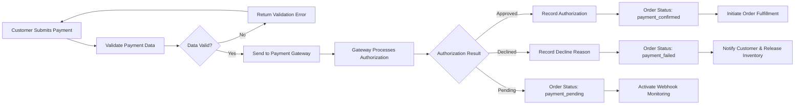
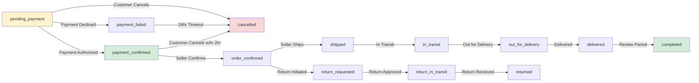

# Payment and Order Processing

## Overview

The payment and order processing system is the financial and operational core of the shopping mall e-commerce platform. This system manages the complete lifecycle from checkout through order confirmation, including payment authorization, transaction tracking, order creation, status management, and financial settlement. The system must handle multiple payment methods securely, manage complex multi-seller orders, prevent transaction failures from causing data inconsistencies, and provide complete visibility and audit trails for customers, sellers, and administrators.

The payment system integrates directly with external payment processors while maintaining PCI compliance and security standards. Order processing must synchronize with inventory management, seller fulfillment, and customer communication systems to ensure seamless operation across all platform modules.

---

## Payment Methods and Integration

### Supported Payment Methods

THE platform SHALL support the following payment methods for customer purchases:

1. **Credit and Debit Cards**
   - Visa, Mastercard, and American Express
   - Support for both domestic and international cards
   - 3D Secure (3DS) authentication for fraud prevention
   - Token storage for returning customers (with explicit consent)

2. **Digital Wallets**
   - PayPal integration with single-click checkout
   - Apple Pay for iOS mobile app (future implementation)
   - Google Pay for Android mobile app (future implementation)

3. **Bank Transfers**
   - Direct bank transfer for high-value orders (above ₹50,000 or equivalent)
   - Bank account number tokenization for security
   - Automatic reconciliation via webhook from payment processor

4. **Installment Plans (Future)**
   - Buy-now-pay-later (BNPL) options for eligible customers
   - 3, 6, and 12-month payment plans
   - Automatic payment collection through payment processor

### Payment Gateway Integration Architecture

THE system SHALL integrate with a PCI DSS Level 1 compliant payment gateway that provides:

- **Secure Tokenization**: Payment instrument data is tokenized at the gateway; the platform never stores complete card numbers
- **Multiple Currency Support**: Processing in USD, EUR, and local currencies as configured by admin
- **Fraud Detection**: Real-time fraud scoring and prevention through gateway's machine learning system
- **Webhook Notifications**: Real-time payment status updates via secure webhooks for asynchronous processing
- **Transaction Logging**: Complete transaction audit trail maintained by payment processor
- **Refund and Reversal Support**: Full refund capabilities and payment reversals up to 30 days post-transaction
- **API Rate Limiting**: Gateway enforces rate limits on API calls (typically 1,000 requests per minute)

THE system SHALL never transmit complete credit card information directly to the platform servers. Instead, all payment data SHALL be collected through iframe-based payment forms provided by the payment gateway, with only tokenized references stored in the platform database.

### Security and Compliance Framework

THE payment processing system SHALL comply with the following security standards:

**PCI DSS Level 1 Compliance:**
- WHEN a customer enters payment information, THE system SHALL use encryption with TLS 1.2 or higher for all data transmission
- THE system SHALL never log complete payment instrument details in application logs
- THE system SHALL implement network segmentation isolating payment processing from other systems
- THE system SHALL conduct quarterly security assessments via external security firm

**HTTPS and Data Encryption:**
- ALL payment-related endpoints MUST use HTTPS with valid SSL/TLS certificates
- THE system SHALL reject any HTTP requests to payment endpoints with HTTP 403 Forbidden response
- Payment data in transit SHALL be encrypted using AES-256 encryption
- Payment data at rest (if stored) SHALL be encrypted using AES-256 with key management via hardware security module

**API Credential Management:**
- Payment gateway API keys SHALL be stored in secure environment variables, never in source code
- API keys SHALL be rotated quarterly and archived securely
- Access to API keys SHALL be logged and audited
- Developers SHALL NOT have direct access to production API keys

---

## Order Creation Workflow

### Pre-Payment Validation and Order Generation

BEFORE a customer can proceed to payment, THE system SHALL perform comprehensive pre-payment validation:

**Customer and Account Verification:**
- WHEN a customer initiates checkout, THE system SHALL verify the customer account is active (not suspended)
- THE system SHALL verify the customer's email address is confirmed and verified
- THE system SHALL check if the customer account has any fraud flags or restrictions

**Shopping Cart Validation:**
- THE system SHALL verify the cart contains at least one item with positive quantity
- THE system SHALL validate that each item's quantity does not exceed the available inventory for that SKU
- THE system SHALL verify all SKUs in the cart still exist and are not discontinued
- THE system SHALL confirm all products in the cart are from active sellers (not suspended)

**Address Validation:**
- THE system SHALL require the customer to select a valid shipping address from saved addresses or create a new address
- THE system SHALL validate the shipping address contains all required fields (street, city, state, postal code, country)
- THE system SHALL verify the postal code format matches the selected country's format requirements
- THE system SHALL check if the address is deliverable by attempting validation through address verification service

**Pricing and Total Calculation:**
- THE system SHALL calculate item subtotal as SUM of (unit price × quantity) for all items
- THE system SHALL identify and apply all eligible discounts (product-level, category-level, cart-level discounts)
- THE system SHALL calculate applicable taxes based on shipping address and item categories
- THE system SHALL calculate shipping cost based on selected shipping method, weight, and destination
- THE system SHALL compute final order total as: subtotal − discounts + taxes + shipping
- THE system SHALL verify the calculated total matches the amount the customer will be charged (within 1 cent tolerance for rounding)

**Inventory Reservation:**
- THE system SHALL reserve the exact quantity of each SKU for this order (preventing overselling)
- THE system SHALL transition reserved inventory from "available" status to "reserved" status
- THE system SHALL record the reservation timestamp and order ID for tracking
- THE system SHALL set a 15-minute expiration on the reservation; if payment is not completed within 15 minutes, inventory is auto-released

IF any validation fails, THEN THE system SHALL provide a specific error message to the customer explaining which requirement is not met and preventing order creation.

### Order Entity Creation

WHEN all pre-payment validation passes, THE system SHALL create an order entity with the following data structure:

**Order Header Information:**
```
- Order ID: Unique identifier in format "ORD-[YYYYMMDDHHMMSS]-[XXXXXX]"
- Customer ID: Reference to the purchasing customer
- Customer Email: Snapshot of email at order time (for receipt delivery)
- Customer Name: Snapshot of name at order time (for address matching)
- Order Creation Timestamp: ISO 8601 format with timezone
- Order Status: Initially set to "pending_payment"
- Order Currency: Currency code (USD, EUR, INR, etc.)
```

**Line Items (for each product in order):**
```
- Product ID: Reference to the product catalog entry
- SKU (Variant ID): Specific product variant ordered
- Seller ID: The seller fulfilling this line item
- Product Name: Snapshot of product name at order time
- Variant Details: Selected options (color "Red", size "M", etc.)
- Unit Price: Price per unit at time of order placement
- Quantity: Number of units ordered
- Line Item Subtotal: Unit price × Quantity
- Line Item Status: Initially "pending" (awaiting seller fulfillment)
```

**Order Financial Breakdown:**
```
- Subtotal: Sum of all line item subtotals
- Discount Amount: Total discounts applied
- Discount Details: Breakdown of each discount applied (code, type, amount)
- Subtotal After Discount: Subtotal − Discount Amount
- Tax Amount: Calculated tax for the order
- Tax Breakdown: Per-item or per-category tax details
- Shipping Cost: Cost of selected shipping method
- Order Total: Subtotal after discount + Tax + Shipping
```

**Shipping Information:**
```
- Shipping Address: Complete recipient address from customer selection
- Shipping Method: Selected method (Standard, Express, Overnight)
- Shipping Method Carrier: Carrier name and service level
- Estimated Delivery Date: Calculated delivery date based on carrier transit times
- Estimated Delivery Window: Day or date range when delivery is expected
```

**Billing Information:**
```
- Billing Address: Address associated with payment method
- Payment Method Used: Type of payment (credit_card, paypal, bank_transfer)
- Payment Method Token: Tokenized reference (no complete card numbers)
- Card Last 4 Digits: Masked display of payment instrument
- Cardholder Name: Name associated with payment method
```

**Order Metadata:**
```
- Promotional Codes Applied: List of promo/coupon codes used
- Customer Special Instructions: Any order-specific notes from customer
- Internal Admin Notes: Notes visible only to platform administrators
- Order Source: Where order came from (web, mobile_app, admin_console)
- Referral Source: How customer found the product (organic, ads, referral, etc.)
```

THE system SHALL record the order creation timestamp in UTC timezone and include both UTC and customer's local timezone in timestamps for clarity.

WHEN the order is created, THE system SHALL transition order status to "pending_payment" and await customer payment authorization.

### Multi-Seller Order Handling

WHEN an order contains items from multiple sellers, THE system SHALL create a single parent order with multiple line items segmented by seller:

**Parent Order Structure:**
```
Order ID: ORD-20250115-ABC123 (single order)
├── Seller 1 Items (2 products)
├── Seller 2 Items (1 product)
└── Seller 3 Items (3 products)
```

**Financial Aggregation for Multi-Seller Orders:**
- THE system SHALL aggregate all line item prices across all sellers for total subtotal
- THE system SHALL calculate and aggregate taxes for all items into single tax amount
- THE system SHALL calculate shipping as: SUM of individual seller shipping costs (if shipped separately) OR single shipping cost (if consolidated shipment)
- THE system SHALL aggregate all discounts into single discount total
- THE system SHALL compute final order total for the complete multi-seller order

**Seller-Specific Order Processing:**
WHEN payment is confirmed for a multi-seller order:
- THE system SHALL create individual fulfillment tasks for each seller
- EACH seller receives only their portion of the order (not full order details)
- EACH seller processes their line items independently on their own timeline
- THE system aggregates fulfillment status across sellers for customer order tracking

---

## Payment Processing

### Payment Initiation and Authorization Workflow



WHEN a customer confirms their payment method and amount at checkout, THE system SHALL:

1. **Validate Payment Input Data:**
   - Verify all required payment fields are present and properly formatted
   - Validate card number passes Luhn algorithm check (for card payments)
   - Verify card expiration date is not past or within 30 days of expiration
   - Validate CVV is 3-4 numeric digits
   - Confirm billing address matches a valid customer address

2. **Prepare Payment Request:**
   - Create a payment request object containing:
     - Order ID (as merchant reference)
     - Order total amount in cents (to avoid floating-point errors)
     - Currency code (USD, EUR, INR, etc.)
     - Customer email address for payment processor records
     - Billing address for Address Verification System (AVS) check
     - Shipping address for validation
     - Item descriptions for payment processor records
   - Generate unique idempotency key to prevent duplicate charges if request is retried
   - Sign the request with payment gateway API secret key

3. **Submit to Payment Gateway:**
   - Send encrypted payment request to payment gateway API endpoint via HTTPS
   - Implement 30-second timeout; if gateway does not respond within 30 seconds, THE system SHALL treat response as pending
   - Receive response from payment gateway containing authorization result

4. **Process Payment Gateway Response:**
   - Extract authorization status (approved, declined, pending, or error)
   - Record authorization code if provided by gateway
   - Extract transaction ID from gateway response
   - Store any error or decline reason message from gateway

### Payment Status Transitions and Order State Management

THE system SHALL manage payment and order status according to these transition rules:

**Status 1: pending_payment**
- Order created but payment not yet initiated
- Inventory is reserved for 15 minutes
- Customer may cancel order and get inventory released immediately
- Transition out occurs when payment authorization request is sent to gateway

**Status 2: payment_processing**
- Payment authorization request submitted to gateway
- Gateway is processing the authorization
- Customer should NOT be charged during this state
- Duration: typically 1-10 seconds
- Transition to: payment_confirmed, payment_failed, or payment_pending

**Status 3: payment_confirmed (Authorization Approved)**
WHEN payment gateway approves authorization:
- THE system SHALL record the authorization code and transaction ID
- THE system SHALL update order status to "payment_confirmed"
- THE system SHALL convert reserved inventory to committed inventory (actual sale)
- THE system SHALL notify the seller that order requires fulfillment
- THE system SHALL send order confirmation email to customer
- THE system SHALL transition to next workflow step (order fulfillment)

**Status 4: payment_failed (Authorization Declined)**
WHEN payment gateway declines authorization:
- THE system SHALL record the decline reason (insufficient funds, expired card, etc.)
- THE system SHALL update order status to "payment_failed"
- THE system SHALL release reserved inventory back to available stock immediately
- THE system SHALL send failure notification email to customer within 2 seconds
- THE system SHALL provide customer with link to retry payment
- THE system SHALL set retry deadline to 24 hours from failure time

**Status 5: payment_pending (Authorization Pending)**
WHEN payment gateway returns pending status (e.g., customer needs to complete 3D Secure):
- THE system SHALL update order status to "payment_pending"
- THE system SHALL keep inventory reserved for full 24 hours
- THE system SHALL activate webhook monitoring to detect when payment completes
- THE system SHALL send email to customer explaining next steps needed
- WHEN payment confirmation is received via webhook, THE system SHALL transition to payment_confirmed
- WHEN payment confirmation NOT received within 24 hours, THE system SHALL auto-cancel order and release inventory

### Payment Failure Handling and Recovery

WHEN a payment authorization fails, THE system SHALL implement recovery workflows:

**Immediate Failure Handling (Within 1 Hour):**
- THE system SHALL release reserved inventory back to available stock immediately
- THE system SHALL notify customer of failure with specific reason
- THE system SHALL provide customer with retry link
- THE system SHALL display suggested alternative payment methods based on failure reason

**Retry Mechanism:**
WHEN customer clicks "Retry Payment" link within 24-hour window:
- THE system SHALL validate the order still exists and is in "payment_failed" status
- THE system SHALL reserve inventory again for retry attempt
- THE system SHALL allow customer to retry with same payment method or different method
- THE system SHALL process retry through same payment gateway
- IF retry succeeds, THEN THE system SHALL transition to "payment_confirmed"
- IF retry fails after 3 attempts, THEN THE system SHALL lock the order and notify customer to contact support

**Automatic Order Expiration:**
IF customer does not retry payment within 24 hours:
- THE system SHALL automatically transition order to "cancelled" status
- THE system SHALL release all reserved inventory to available stock
- THE system SHALL send reminder email to customer that order was cancelled
- THE system SHALL provide link to recreate order if customer still wants it

**Payment Failure Communication:**
THE system SHALL provide specific error messages for different failure reasons:
- "Insufficient funds - Please verify your account balance or use another payment method"
- "Expired card - Your card has expired. Please update your card or use another method"
- "Card declined by issuer - Your bank declined this transaction. Contact your bank for details"
- "Incorrect CVV - The security code is invalid. Please verify and retry"
- "Billing address mismatch - The address doesn't match your bank records"

### Concurrent Payment Processing and Idempotency

WHEN multiple payment requests for the same order are submitted simultaneously, THE system SHALL:

1. **Generate Idempotency Key:**
   - THE system SHALL create a unique idempotency key for each order: SHA-256 hash of (customer_id + order_id + timestamp)
   - THE system SHALL include this key in all payment requests to the gateway
   - THE system SHALL store the key with the order record

2. **Prevent Duplicate Charges:**
   WHEN a payment request is received:
   - THE system SHALL check if idempotency key already exists in the database
   - IF idempotency key exists AND payment already processed, THEN THE system SHALL return the same transaction ID without re-processing
   - IF idempotency key exists BUT payment not completed, THEN THE system SHALL return pending status and NOT recharge customer
   - IF idempotency key is new, THEN THE system SHALL proceed with normal payment processing

3. **Handle Gateway Duplicates:**
   IF payment gateway receives same idempotency key twice:
   - THE gateway SHALL process only once and return same transaction ID for both requests
   - THE system SHALL receive same transaction ID in both responses
   - THE system SHALL recognize as single charge based on identical transaction ID
   - THE system SHALL NOT create duplicate orders

### Multi-Currency and Exchange Rate Handling

WHEN processing payments in multiple currencies:

- THE system SHALL display prices in customer's local currency
- THE system SHALL lock exchange rate at order creation time
- THE system SHALL use locked exchange rate for all order calculations and refunds
- THE system SHALL NOT recalculate order total if exchange rates change after order creation
- WHEN calculating payment amount to send to gateway:
  - THE system SHALL convert order total from display currency to processing currency (typically USD)
  - THE system SHALL use real-time exchange rate from payment gateway at time of authorization
  - THE system SHALL store both the display currency total and processing currency total in order record
- IF exchange rate changes between order creation and payment:
  - THE system SHALL notify customer of the new total in processing currency
  - THE system SHALL require customer explicit confirmation before proceeding

---

## Order Status Tracking and Lifecycle Management

### Complete Order Status Lifecycle

THE order progresses through defined states with specific business logic for each transition:



**Status Detailed Definitions:**

| Status | Description | Duration | Transitions Out | Actor |
|--------|-------------|----------|-----------------|-------|
| pending_payment | Payment being authorized | 0-30 seconds | confirmed, failed, pending | System |
| payment_confirmed | Payment authorized, inventory committed | 0-7 days | order_confirmed, cancelled | Seller |
| order_confirmed | Seller accepted order, picking items | 0-2 days | shipped, return_requested | Seller |
| shipped | Order handed to carrier | 0-14 days | in_transit, delivery_failed | Carrier |
| in_transit | Package moving through carrier network | 1-14 days | out_for_delivery, delivery_failed | Carrier |
| out_for_delivery | Package on delivery vehicle today | 2-8 hours | delivered, delivery_failed | Carrier |
| delivered | Package delivered to recipient | Terminal | completed, return_requested | System |
| completed | Return window expired, order finished | Terminal | None | System |
| cancelled | Order cancelled before shipment | Terminal | None | System |
| payment_failed | Payment declined or failed | 24 hours | cancelled (auto) | System |
| return_requested | Customer initiated return request | 2 days | returned (approved), cancelled (rejected) | Seller |
| return_in_transit | Return package in transit to seller | 1-14 days | return_received | Carrier |
| returned | Return received by seller | Terminal | None | Seller |

### Status Transition Rules and Business Logic

**WHEN order is in "pending_payment" status:**
- THE system SHALL hold reserved inventory for exactly 15 minutes
- THE customer MAY cancel the order at any time; system immediately releases inventory
- THE system SHALL automatically cancel the order if payment is not completed within 15 minutes
- THE system SHALL transition to "payment_confirmed" ONLY when payment authorization is received from gateway

**WHEN order transitions from "payment_confirmed" to "order_confirmed":**
- THE seller receives notification to pick and pack items
- THE seller has 48 hours to confirm they can fulfill the order
- IF seller does not confirm within 48 hours, THEN THE system automatically marks order as "order_confirmed" ready for shipment
- THE customer MAY cancel within first 2 hours of payment confirmation; after 2 hours, seller controls cancellation eligibility

**WHEN order is in "shipped" status:**
- THE seller has provided tracking information (tracking number and carrier)
- THE system begins polling carrier API for status updates
- THE customer receives tracking number and carrier information
- THE system SHALL NOT allow cancellation at this stage; customer directed to returns process if dissatisfied

**WHEN order is in "delivered" status:**
- THE carrier confirmed package delivery to the address
- THE customer enters a 30-day return eligibility window
- THE system enables product review and rating submission 24 hours after delivery
- THE order transitions to "completed" after 180 days (return window expires and no return initiated)

**WHEN order is in "cancelled" status:**
- THE order is terminal (cannot transition to other states)
- THE reserved/committed inventory is released back to available stock
- THE refund is processed to the customer's original payment method
- THE seller is notified that order will not proceed

### Order Status Visibility by Actor

**Customer-Visible Status Information:**
THE customer SHALL see:
- Current status with clear description of what it means
- Estimated delivery date (when applicable)
- Tracking number and link to carrier tracking (when shipped)
- Timeline showing all previous statuses and when they occurred
- Estimated delivery window with hours/date

**Seller-Visible Status Information:**
THE seller SHALL see:
- Order status specific to their items in multi-seller orders
- Items included in their portion of the order
- Current fulfillment status (picking, packing, ready to ship, shipped)
- Tracking information for shipments they created
- Refund impact if order is cancelled or returned

**Admin-Visible Status Information:**
THE admin SHALL see:
- Complete order status with full history of all transitions
- Payment status and transaction details
- Seller fulfillment progress for each line item
- Shipping and delivery status
- Any exceptions, disputes, or issues with the order

---

## Payment Confirmation and Receipts

### Automated Confirmation Workflow

WHEN payment is successfully authorized, THE system SHALL immediately:

1. **Generate Order Confirmation:**
   - Create confirmation record with order number, date/time, and customer email
   - Calculate final order total with all components itemized
   - Generate unique order ID if not already generated

2. **Send Confirmation Email:**
   THE system SHALL send email to customer's registered email address containing:
   - Order confirmation header with order number and date
   - Order itemization (products, quantities, unit prices, line totals)
   - Subtotal, taxes, shipping cost, and total order amount
   - Shipping address for confirmation
   - Billing address (last 4 digits of card, payment method type)
   - Estimated delivery date and shipping method
   - Link to track order status in real-time
   - Link to order details page
   - Customer service contact information
   - Return policy summary
   - Seller information for each product

3. **Update Customer Dashboard:**
   - THE system SHALL display order in customer's "My Orders" section
   - THE order SHALL appear at the top of the list (most recent first)
   - THE system SHALL show current status and estimated delivery date

4. **Notify Seller(s):**
   - THE system SHALL send notification to each seller with their portion of the order
   - Seller notification SHALL NOT include complete customer address (seller receives only country/city, full address only for fulfillment)
   - Seller receives order items, quantities, and customer contact information for delivery

### Receipt Generation and Display

WHEN a customer requests their receipt, THE system SHALL generate a comprehensive receipt containing:

**Header Information:**
```
Receipt / Invoice
[Platform Company Name]
[Platform Address]
[Platform Tax ID / Business Registration]
Invoice Number: [Same as Order Number]
Invoice Date: [Order Date]
```

**Customer Information:**
```
Bill To:
[Customer Name]
[Billing Address from Order]
[Customer Email]
[Customer Phone]

Ship To:
[Recipient Name]
[Shipping Address from Order]
```

**Itemized Product List:**
```
Product Name | SKU | Variant | Qty | Unit Price | Line Total
[Product 1] | [SKU] | [Color/Size] | [Qty] | [Price] | [Total]
[Product 2] | [SKU] | [Color/Size] | [Qty] | [Price] | [Total]
```

**Financial Breakdown:**
```
Subtotal (items):                          ₹[Amount]
Discounts Applied:
  - [Discount Name/Code]                   -₹[Amount]
Subtotal After Discount:                   ₹[Amount]
Taxes (applied to destination):            ₹[Amount]
Shipping & Handling:                       ₹[Amount]
─────────────────────────────
ORDER TOTAL:                               ₹[Amount]
```

**Payment Information:**
```
Payment Method: [Card type] ending in [Last 4 Digits]
Authorization Code: [Code from Payment Processor]
Transaction ID: [Gateway Transaction ID]
Payment Status: Completed
```

**Delivery Information:**
```
Estimated Delivery: [Date Range]
Shipping Method: [Standard/Express/Overnight]
Carrier: [Carrier Name]
Tracking Number: [Number] (when available)
```

**Policies and Terms:**
```
Return Policy: [Summary]
Refund Policy: [Summary]
Warranty: [If applicable]
```

**Footer:**
```
Questions? Contact [Support Email] or [Support Phone]
Thank you for your purchase!
```

THE receipt SHALL be available in two formats:

1. **HTML Format** (in email and web view):
   - Professional formatting with company branding
   - Clickable links for order tracking and return requests
   - Responsive design for mobile viewing

2. **PDF Format** (downloadable):
   - Professional printable format
   - Company logo and branding
   - QR code linking to order tracking page
   - Suitable for printing and record-keeping

### Notification Channels and Delivery

WHEN THE system generates notifications, THE system SHALL deliver through these channels:

**Email Notifications (Primary):**
- WHEN order is confirmed: Send immediately within 1 minute
- WHEN payment fails: Send within 2 seconds
- WHEN order ships: Send within 2 hours of shipment
- WHEN order is delivered: Send within 15 minutes of carrier confirmation
- THE email SHALL include all relevant order details and links

**SMS Notifications (Optional, if enabled):**
- WHEN order ships: Send SMS with tracking number and carrier link
- WHEN order is out for delivery: Send SMS with estimated delivery window
- WHEN order is delivered: Send SMS with delivery confirmation
- THE SMS SHALL include order number and tracking link (shortened URL)

**In-App Notifications (Platform):**
- WHEN customer logs into their account: Display banner if orders have status changes
- WHEN new order confirmation: Display notification in notification center
- WHEN shipment tracking updates: Display notification with status change
- THE notification SHALL persist in notification center for 90 days

**Push Notifications (Mobile App, Future):**
- WHEN order ships: Send push notification with tracking link
- WHEN out for delivery: Send push notification with delivery window
- WHEN delivered: Send push notification with confirmation

---

## Transaction History and Audit Trail

### Complete Transaction Record Structure

THE system SHALL maintain comprehensive transaction records containing:

**Transaction Identification:**
```
Transaction ID: Unique ID from payment processor
Order ID: Reference to associated order
Customer ID: Reference to customer account
Transaction Timestamp: ISO 8601 format with timezone
```

**Financial Details:**
```
Amount Charged: In cents (to avoid floating-point errors)
Currency: Currency code (USD, EUR, INR, etc.)
Payment Method Type: credit_card, debit_card, paypal, bank_transfer
Payment Method Token: Tokenized reference (NOT complete card number)
Last 4 Digits: Masked display (e.g., 4242)
Cardholder Name: Name on payment instrument
```

**Transaction Status:**
```
Status: authorized, captured, failed, refunded, reversed, disputed
Authorization Code: Code from payment processor authorization
Response Code: Standardized response code (e.g., 00 for success)
Response Message: Human-readable message (e.g., "Approved")
Error Code: Error code if transaction failed
Error Message: Detailed error explanation
```

**Refund Information (if applicable):**
```
Original Transaction ID: Reference to original charge
Refund Amount: Amount being refunded
Refund Status: initiated, processing, completed, failed
Refund Timestamp: When refund was processed
Refund Method: Original payment method, store credit, etc.
```

**Audit and Compliance Data:**
```
User IP Address: IP address of payment request
User Agent: Browser/device information
Request Timestamp: When transaction request was received
Webhook Received Timestamp: When confirmation webhook was received
Fraud Score: Risk assessment score from payment processor
3D Secure: Whether 3DS authentication was performed
3DS Result: Authenticated, Attempted, Not Enrolled
```

### Transaction Visibility and Access Control

**Customer Transaction Visibility:**
WHEN a customer views their transaction history:
- THE system SHALL display their own transactions only
- THE customer SHALL see order number, date, amount, payment method (masked), status
- THE customer SHALL NOT see payment processor transaction IDs or authorization codes
- THE customer SHALL NOT see fraud scores or other admin-only data
- THE customer SHALL be able to filter by date range, amount, status
- THE customer SHALL be able to download transaction statements as CSV or PDF

**Seller Transaction Visibility:**
WHEN a seller views their payment and refund information:
- THE seller SHALL see sales they've processed (orders containing their products)
- THE seller SHALL see payment amounts received (commission already deducted)
- THE seller SHALL see payout history showing when payments were transferred
- THE seller SHALL NOT see customer payment method details
- THE seller SHALL NOT see other seller payment information

**Admin Transaction Visibility:**
WHEN an admin accesses transaction reports:
- THE admin SHALL see all transactions across the platform
- THE admin SHALL see complete transaction details including payment method (last 4 digits)
- THE admin SHALL see authorization codes and response codes from payment processor
- THE admin SHALL see fraud scores and 3DS authentication results
- THE admin SHALL see refund history and adjustments
- THE admin MAY view complete audit trail of all transaction changes
- THE admin SHALL be able to filter by customer, seller, date range, amount, status
- THE admin SHALL be able to generate transaction reports for compliance

### Transaction Data Retention and Compliance

**Retention Periods:**
- Completed transactions: Retained indefinitely for audit purposes
- Failed transactions: Retained for 90 days for troubleshooting, then archived
- Refunded transactions: Retained for minimum 5 years for dispute resolution
- Dispute-related transactions: Retained for minimum 7 years for compliance
- PCI audit logs: Retained for minimum 2 years per PCI DSS standards

**Data Archival:**
- THE system SHALL automatically archive transactions older than 1 year to compressed storage
- THE archived data SHALL remain queryable and accessible for compliance investigations
- THE archived data SHALL be encrypted at rest using AES-256
- THE admin SHALL be able to restore archived transactions if needed for investigation

**Audit Trail Immutability:**
- THE system SHALL maintain immutable audit logs of all transaction-related changes
- WHEN a transaction is updated (e.g., marked as disputed), THE system SHALL create an audit log entry
- THE audit log entry SHALL include: what changed, who changed it (admin ID), when, and why
- THE audit logs SHALL be stored separately from transaction data
- THE audit logs SHALL NEVER be deleted or modified (except by database-level archival process)

---

## Error Handling and Edge Cases

### Payment Validation Failures

WHEN payment authorization fails due to validation errors:

**Insufficient Funds Error:**
- THE gateway returns error code indicating insufficient funds
- THE system SHALL display message: "Your account does not have sufficient funds. Please verify your account balance or use another payment method."
- THE system SHALL NOT charge the customer
- THE system SHALL allow immediate retry with different payment method
- THE system SHALL reserve inventory for 15 additional minutes for retry

**Expired Card Error:**
- THE gateway returns error code indicating card expiration
- THE system SHALL display message: "Your card has expired. Please update your card information or use another payment method."
- THE system SHALL allow customer to update card or select different method
- THE system SHALL preserve cart contents and pricing for retry

**Address Verification System (AVS) Mismatch:**
- THE gateway performs AVS check and detects mismatch between billing address and bank records
- THE system SHALL display message: "Your billing address does not match our records. Please verify and retry."
- THE customer SHALL verify billing address is correct before retry
- THE system SHALL allow retry OR use alternate payment method

**CVV/CVC Verification Failure:**
- THE gateway detects invalid CVV (security code)
- THE system SHALL display message: "The security code is invalid. Please verify and retry."
- THE system SHALL mask CVV fields to prevent accidental re-entry of same value
- THE system SHALL preserve other payment information for easy retry

### Concurrent Transaction Scenarios

WHEN multiple simultaneous transactions occur for the same order:

**Duplicate Submission Scenario:**
- WHEN customer submits payment form, then immediately clicks "Place Order" button again
- THE system SHALL use idempotency key to recognize duplicate
- THE first transaction is processed normally
- THE second transaction is rejected with error: "Payment is already being processed"
- THE system SHALL NOT charge the customer twice
- THE system SHALL display result of first transaction to customer

**Payment During System Outage:**
- WHEN payment gateway becomes temporarily unavailable during transaction
- THE system SHALL receive timeout after 30 seconds
- THE system SHALL transition order to "payment_pending" status
- THE system SHALL set up webhook monitoring to detect eventual completion
- THE system SHALL notify customer: "Payment is being verified. We'll send confirmation shortly."
- WHEN webhook confirms success, THE system automatically transitions to "payment_confirmed"
- WHEN webhook confirms failure after 24 hours, THE system automatically cancels order

**Inventory Depletion During Checkout:**
- WHEN inventory for a product reaches zero while customer is on checkout page
- THE system SHALL detect this during final order validation (step 2)
- THE system SHALL prevent order creation with error: "Item [Product Name] is no longer available"
- THE system SHALL suggest related products
- THE system SHALL allow customer to remove item and complete order with remaining items
- THE system SHALL release all reserved inventory for this attempt

### Network and Gateway Timeout Handling

WHEN network timeouts occur:

**API Timeout During Authorization:**
- WHEN payment gateway does not respond within 30 seconds
- THE system SHALL log the timeout event with timestamp and order ID
- THE system SHALL treat the request as "payment_pending" (in-flight)
- THE system SHALL activate webhook monitoring
- THE system SHALL send email to customer: "Your payment is being verified. Confirmation coming shortly."
- WHEN gateway responds (late), THE system SHALL process the response normally
- WHEN gateway never responds AND 24 hours pass, THE system SHALL cancel order

**Webhook Delivery Failure:**
- WHEN payment processor attempts to deliver webhook but system is unavailable
- THE payment processor SHALL retry webhook delivery multiple times over 24 hours
- WHEN system comes back online, THE system SHALL accept late webhook
- THE system SHALL process payment status update even if late
- THE system SHALL recover order state to match payment reality

### Multi-Seller Order Payment Splitting

WHEN an order contains items from multiple sellers:

**Combined Payment, Split Commission:**
- THE customer pays once for the entire order (single payment)
- THE payment processor charges customer total amount
- THE system SHALL split payment across sellers:
  - Calculate each seller's portion: (seller_item_total / order_total) × payment_amount
  - Calculate platform commission: seller_portion × commission_rate
  - Calculate seller net: seller_portion − commission
  - Create separate payout records for each seller

**Commission Calculation Example:**
```
Seller A items: ₹1,000 (electronics, 15% commission)
Seller B items: ₹500 (books, 8% commission)
Order total: ₹1,500

Seller A payment:
  Commission: ₹1,000 × 15% = ₹150
  Net to seller: ₹1,000 − ₹150 = ₹850

Seller B payment:
  Commission: ₹500 × 8% = ₹40
  Net to seller: ₹500 − ₹40 = ₹460

Platform revenue: ₹150 + ₹40 = ₹190
```

**Payment Failure in Multi-Seller Order:**
- IF payment authorization fails, THEN THE entire order fails
- THE system SHALL NOT charge customer partial amount
- THE system SHALL release all inventory for all sellers
- THE system SHALL send single failure notification (not multiple)
- THE customer may retry entire order (not partial)

### Refund Failure and Recovery

WHEN refund processing encounters errors:

**Refund to Invalid Payment Method:**
- WHEN refund payment method no longer exists (account closed, card invalidated)
- THE payment processor returns error on refund attempt
- THE system SHALL flag the refund as "failed"
- THE system SHALL notify customer: "Your refund encountered an issue. Please provide alternate refund method."
- THE system SHALL store failed refund attempt for retry
- THE admin SHALL contact customer to resolve alternate refund method
- THE customer MAY request store credit instead of payment method refund

**Refund Amount Discrepancy:**
- WHEN refund amount differs from order amount (due to partial return, restocking fee, etc.)
- THE system SHALL calculate exact refund amount based on return authorization
- THE system SHALL display refund calculation to customer with itemization
- THE system SHALL require customer acknowledgment of partial refund amount
- THE system SHALL process refund only after customer confirms
- IF customer disputes the refund amount, THEN THE system escalates to dispute resolution

**Duplicate Refund Prevention:**
- WHEN a refund request is submitted, THE system SHALL check for existing pending refunds
- THE system SHALL use idempotency key to prevent duplicate refunds
- IF refund already processed for this order, THEN THE system SHALL return the existing transaction ID
- THE system SHALL NEVER refund the same order twice

---

## Business Rules and Constraints

### Payment Processing Rules

**Pricing Consistency Requirement:**
- THE system SHALL verify calculated order total matches payment amount (within 1 cent tolerance)
- IF discrepancy > 1 cent, THEN THE system SHALL reject payment and notify customer
- THE error message SHALL show both calculated total and submitted payment amount

**Currency Locking:**
- WHEN order is created, THE system SHALL lock all currency conversion rates
- THE locked rate SHALL be used for all future calculations for this order
- THE order SHALL be charged in the locked currency even if exchange rates change

**Duplicate Order Prevention:**
- THE system SHALL use idempotency keys to prevent duplicate charges
- IF same idempotency key received within 24 hours, THEN THE system SHALL return existing transaction ID
- THE system SHALL NOT create duplicate orders for same payment

**Maximum Transaction Amount:**
- THE system SHALL enforce maximum order total limit: ₹999,999,999
- IF customer attempts order exceeding this limit, THEN THE system SHALL reject with error
- THE error message SHALL explain the limit and suggest splitting into multiple orders

**Minimum Transaction Amount:**
- THE system SHALL enforce minimum order total limit: ₹0.01
- IF cart total is below minimum after discounts, THEN THE system SHALL prevent checkout
- THE system SHALL display message: "Minimum order amount is [currency][amount]"

### Inventory Reservation Rules

**Reservation Timing:**
- THE system SHALL reserve inventory ONLY when order is created (not when items added to cart)
- THE reservation SHALL expire automatically after 15 minutes if payment is not completed
- THE reserved inventory SHALL NOT be visible to other customers (truly reserved)

**Reservation Limits:**
- THE customer SHALL NOT exceed 50% of total available inventory for any product in single order
- IF customer attempts to order more than 50%, THEN THE system SHALL cap quantity at 50% limit
- THE system SHALL display message: "Maximum available for order: [quantity] (50% of stock reserved for other customers)"

**Multi-SKU Reservation:**
- WHEN order contains multiple SKUs of same product (different variants), THE system SHALL reserve each separately
- IF total of all SKU variants exceeds 50% available, THEN THE system SHALL proportionally limit quantities

### Payment Timing and Constraints

**Payment Authorization Expiration:**
- WHEN payment is authorized but not captured, THE system SHALL capture within 24 hours
- IF capture is not completed within 24 hours, THE system SHALL automatically void the authorization
- THE system SHALL notify customer and ask to retry payment if voided

**Refund Time Limits:**
- THE system SHALL process refunds within 5-10 business days after approval
- WHEN refund is processed, THE system SHALL show expected arrival date to customer
- IF refund not received within expected date + 3 business days, THE system SHALL escalate

**Order Completion Timeline:**
- WHEN order is delivered, THE system SHALL consider it completed 180 days after delivery
- THE completed order cannot be cancelled or returned after 180 days
- THE system SHALL enforce this limit automatically

---

## Integration with Related Systems

### Connection to [Order Cancellation and Returns](./09-order-cancellation-and-returns.md)

THE payment and order processing system integrates with returns management through:

- **Refund Processing**: When a return is approved, THE Order Cancellation and Returns module requests refund from this module
- **Inventory Synchronization**: When return is received and verified, THE returns module notifies this module to restore inventory
- **Payment Status Tracking**: The returns module uses order payment status to determine refund eligibility
- **Transaction History**: Refund transactions are recorded in this module's transaction history linked to original order payment

### Connection to [Customer User Experience](./03-customer-user-experience.md)

THE payment system integrates with customer experience through:

- **Checkout Initiation**: Customer checkout creates order record in this module
- **Cart to Order**: Customer User Experience module converts cart to order, triggering payment processing
- **Order Confirmation Display**: Payment confirmation status feeds back to customer dashboard
- **Address Validation**: Shipping address validation occurs at checkout before order creation in this module

### Connection to [Seller Management and Operations](./05-seller-management-and-operations.md)

THE payment system integrates with seller operations through:

- **Seller Fulfillment Trigger**: Payment confirmation automatically creates fulfillment tasks in seller dashboard
- **Commission Calculation**: Payment processing deducts seller commissions and calculates net payment
- **Payout Processing**: Seller payments are aggregated from individual order payments in this module
- **Order Visibility**: Seller sees only their portion of payment in multi-seller orders

### Connection to [Admin Dashboard and Management](./10-admin-dashboard-and-management.md)

THE payment system integrates with admin management through:

- **Transaction Monitoring**: Admin dashboard displays real-time transaction summaries from this module
- **Dispute Management**: Admin escalation of disputes triggers manual refund processing in this module
- **Payment Reconciliation**: Admin accesses transaction records for reconciliation and audit
- **Financial Reporting**: Admin generates reports using transaction history data from this module

---

## Performance and Reliability Requirements

### Response Time Standards

THE system SHALL meet these response time requirements:

- **Payment Authorization**: Complete authorization within 30 seconds (gateway timeout threshold)
- **Order Confirmation**: Display confirmation page to customer within 5 seconds of successful payment
- **Refund Processing Initiation**: Begin refund process within 5 minutes of approval
- **Order Status Updates**: Update and display order status within 60 seconds of status change event
- **Transaction History Query**: Return transaction history results within 3 seconds for queries up to 1 year of data

### System Reliability Requirements

THE system SHALL maintain these reliability metrics:

- **Payment Gateway Availability**: 99.9% uptime (allowing 3.6 hours downtime monthly)
- **Order Processing Uptime**: 99.95% availability during customer checkout hours
- **Data Consistency**: 100% accuracy of financial data (zero tolerance for discrepancies)
- **Transaction Atomicity**: All-or-nothing transaction processing (no partial transactions)
- **Refund Processing SLA**: 100% of approved refunds processed within 5 business days

### Scalability Requirements

THE system SHALL support:

- **Concurrent Transactions**: Minimum 1,000 concurrent payment processing operations
- **Transaction Volume**: Minimum 10,000 transactions per hour
- **Peak Load**: Support 10x average transaction volume during peak shopping periods
- **Data Growth**: Maintain response times as transaction volume grows to 1 billion+ records

---

## Summary

The payment and order processing system forms the financial core of the e-commerce platform, managing the complete transaction lifecycle from payment authorization through order confirmation and settlement. The system ensures security through PCI compliance, prevents fraud through idempotency and validation, and maintains consistency through careful state management and atomic operations.

By integrating with inventory, fulfillment, and customer systems, the payment module orchestrates the entire order workflow while providing transparent tracking and audit trails for all stakeholders. The robust error handling and recovery procedures ensure that payment failures do not leave the system in inconsistent states, while comprehensive logging enables compliance audits and dispute resolution.

---

> *Developer Note: This document defines **business requirements only**. All technical implementations (architecture, APIs, database design, payment gateway SDK selection, transaction storage systems, error handling patterns, retry logic implementation, etc.) are at the discretion of the development team. This document describes WHAT the payment system should accomplish from a business perspective, not HOW to build it technically.*