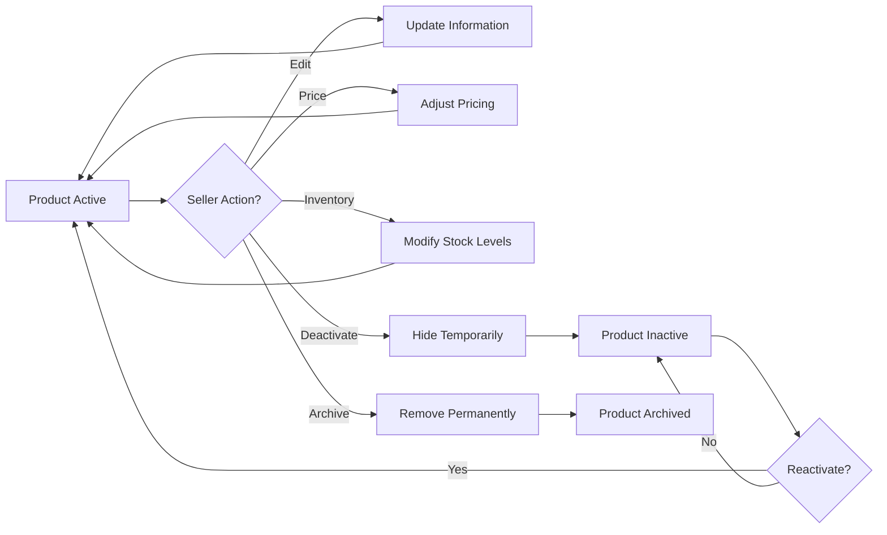

# Product Catalog System Requirements

## Executive Overview

The product catalog system is the foundation of the e-commerce shopping mall platform, organizing and presenting millions of products from multiple sellers to customers worldwide. This system manages the complete product lifecycle from seller creation through customer discovery, enabling customers to browse, search, and purchase products while providing sellers with comprehensive management capabilities.

The product catalog system must support exceptional scale—millions of products across thousands of sellers—while maintaining fast search performance, accurate real-time inventory tracking, and flexible product organization. This document defines all functional requirements for organizing products, managing variants and SKUs, supporting multiple pricing models, and enabling efficient product discovery.

---

## 1. Product Catalog Architecture

### 1.1 Catalog Architecture Principles

THE platform SHALL organize products in a multi-level hierarchy that supports efficient browsing and searching while maintaining data consistency across multiple sellers' inventories.

WHEN a customer or seller accesses the catalog, THE system SHALL provide comprehensive access to product information, variant options, pricing, and real-time availability status for all products.

THE catalog system SHALL maintain complete isolation between sellers' products while presenting a unified catalog to customers, ensuring sellers cannot view or access other sellers' product data.

WHEN the admin accesses the catalog, THE system SHALL provide complete visibility and management capabilities across all sellers' products for quality control, category management, and platform oversight.

### 1.2 Product, Variant, and SKU Relationship Architecture

THE system SHALL define three distinct levels in the product hierarchy with clear relationships:

**Product (Parent Entity)**:
- Represents the logical grouping of all related variants (e.g., "Nike Air Zoom Pegasus Running Shoes")
- Contains product-level metadata, comprehensive descriptions, and general information shared across all variants
- Has one or more variants representing different option combinations
- Belongs to one or more product categories
- Managed exclusively by a single seller (one-to-one seller relationship)
- Includes product images that may apply to all variants or be variant-specific

**Variant (Specific Configuration)**:
- Represents a unique combination of product options (e.g., "Nike Air Zoom Pegasus in Red, Size 10, Regular Width")
- Defined by a distinct combination of product attributes such as color, size, material composition, or custom options
- Maintains independent pricing from base product or other variants
- Has independent inventory tracking via unique SKU
- May have variant-specific images, descriptions, or specifications
- Customers select variants during product viewing and cart/checkout operations

**SKU (Stock Keeping Unit)**:
- Serves as the unique identifier for each distinct product variant
- Tracks inventory quantity for that specific variant combination
- Links to variant-specific pricing and availability information
- Used for order fulfillment, inventory management, and reporting
- Platform-assigned or seller-provided unique identifier
- Cannot be duplicated within a product or across products from same seller

**EXAMPLE**: A "Blue Nike Running Shoe, Size 10, Standard Width" represents one parent product (Nike Running Shoe Model XYZ), one specific variant (the color-size-width combination), and one unique SKU (e.g., "NIKE-XYZ-BLU-10-STD"). When a customer orders this specific variant, the order references the SKU to ensure the correct inventory is allocated.

---

## 2. Category and Taxonomy Management

### 2.1 Hierarchical Category Structure

THE system SHALL support a multi-level category hierarchy enabling intuitive product organization:

- **Level 1 (Main Categories)**: Top-level classification (Electronics, Clothing, Home & Garden, Sports, Beauty)
- **Level 2 (Subcategories)**: Mid-level refinement (Computers, Smartphones, Laptops under Electronics)
- **Level 3 (Sub-subcategories)**: Detailed classification (Gaming Laptops, Business Laptops, Ultrabooks under Laptops)
- **Level 4 (Leaf Categories)**: Most specific level where products are directly assigned

WHEN a customer browses the catalog, THE system SHALL display all category levels with expandable navigation, allowing customers to drill down from broad categories to specific product types.

THE system SHALL display the count of products available in each category to help customers understand category scope.

### 2.2 Category-Specific Attributes and Requirements

EACH category SHALL define required product attributes that sellers must complete when listing products in that category.

**EXAMPLE Category Requirements**:
- **Apparel Category**: Requires Size, Color, Material, Care Instructions, Fit Type
- **Electronics Category**: Requires Brand, Model Number, Specifications, Warranty Period, Power Requirements
- **Home & Garden Category**: Requires Dimensions, Weight, Material, Indoor/Outdoor Classification

WHEN a seller creates a product and assigns it to a category, THE system SHALL validate that all category-required attributes are provided before allowing product publication.

### 2.3 Product Categorization Requirements

WHEN a seller creates a product, THE system SHALL require assignment to a primary category (mandatory) and optionally to additional categories (up to three secondary categories).

WHEN customers browse categories, THE system SHALL display products in all assigned categories, enabling discovery through multiple category paths and accommodating products that logically fit multiple classifications.

WHEN a seller moves a product to a different category, THE system SHALL validate that the product's attributes satisfy requirements of the new category.

### 2.4 Category Search and Navigation

THE system SHALL provide customers with intuitive category browsing capabilities displaying:
- Category names and descriptions
- Product count in each category with percentage of total catalog
- Visual category icons or banner images
- Expandable subcategory navigation
- Category-level filtering options (price range, brand, rating) within selected category
- Related categories (often purchased together)

---

## 3. Product Information and Metadata

### 3.1 Required Product Attributes

WHEN a seller creates a product, THE system SHALL require the following core product information:

**Product Identity Information**:
- Product name (100-255 characters, must be unique per seller within category)
- Product SKU code (seller-defined alphanumeric, up to 50 characters, unique per seller)
- Product description (500-5000 characters, formatted text support with bold, italics, lists, images)
- Brand or manufacturer name
- Product type selection (Simple, Configurable, Bundle)
- Category assignment (required primary, optional secondary categories)

**Physical Product Details**:
- Product weight (in pounds or kilograms with unit selection)
- Product dimensions (length, width, height in inches or centimeters)
- Material composition (especially for apparel, furniture, food products)
- Product color(s) available
- Care instructions (cleaning, maintenance, storage)
- Warranty information (if applicable)
- Certification or standards compliance (safety certifications, quality marks)

**Organizational Information**:
- Seller account (automatically linked to seller creating the product)
- Supplier or distributor information (optional)
- Manufacturing country for international shipping designation
- Product SKU in seller's inventory system

### 3.2 Product Descriptions and Rich Content

THE system SHALL support comprehensive product descriptions including:
- Detailed feature descriptions explaining what the product does and key benefits
- Use cases and application scenarios
- Technical specifications in table format
- Shipping and handling notes specific to the product
- Return and replacement policy details specific to the product
- Comparison information with similar competing products (optional)
- Warranty details and coverage periods
- Assembly or setup instructions

WHEN displaying product descriptions, THE system SHALL support formatted text including:
- Bold and italic text styling
- Bullet point and numbered lists
- Embedded images within description text
- Text alignment and spacing
- Section headings and subheadings

WHEN a seller updates product descriptions, THE system SHALL apply changes immediately for new customer views while preserving existing order fulfillment for orders placed before changes.

### 3.3 SEO Metadata and Search Optimization

WHEN a seller creates or updates a product, THE system SHALL allow optional SEO metadata entry:
- Meta title (60-120 characters, displayed in search results)
- Meta description (120-160 characters, search engine summary text)
- Meta keywords (5-10 relevant search terms for indexing)
- Custom URL slug (auto-generated from product name but customizable)
- Structured data markup (automatically generated by system)

WHEN a seller does not provide custom SEO metadata, THE system SHALL automatically generate appropriate defaults based on product name and description.

---

## 4. Product Variants and SKU System

### 4.1 Variant Definition and Structure

THE system SHALL support product variants as distinct combinations of product attributes resulting in unique product offerings. Each variant SHALL include:
- Unique SKU (Stock Keeping Unit) identifier distinguishing from all other variants
- Distinct pricing (may inherit from parent or be unique per variant)
- Distinct inventory quantity tracked independently
- Variant-specific images (may inherit from parent if not provided)
- Variant-specific attributes (color, size, custom options)
- Optional variant-specific specifications or descriptions

WHEN a seller creates a "Configurable" product with variants, THE system SHALL require selection of which product attributes will define the variants (e.g., Color and Size for apparel).

### 4.2 Variant Type Support

THE system SHALL support the following variant configuration approaches:

**Single Attribute Variants**: One attribute defines variants
- EXAMPLE: T-shirt available in Red, Blue, Green colors
- Customer selects one color to complete product specification

**Multiple Attribute Variants**: Two or more attributes define variants
- EXAMPLE: T-shirt with Color (Red, Blue) × Size (Small, Medium, Large)
- System automatically generates all logical combinations (6 total)
- Customer selects each required attribute to define the complete product

**Simple Products**: No variants or configurable options
- Single product with one SKU
- Single price and inventory level
- No attribute selection required

WHEN a seller defines variants using multiple attributes, THE system SHALL automatically generate all logical variant combinations from attribute values provided.

### 4.3 SKU Identification and Management

THE system SHALL support SKU identification using seller-defined or system-generated approaches:

**Seller-Defined SKUs**:
- Seller provides custom alphanumeric SKU codes (up to 50 characters)
- EXAMPLE: "NIKE-SHOE-BLU-10-WID"
- System validates uniqueness per seller within product category
- Seller can update SKU before product publication, not after

**System-Generated SKUs**:
- System auto-generates unique SKUs using product ID and variant attributes
- EXAMPLE: Product ID "PROD123" generates "PROD123-RED-SMALL-STD"
- System ensures uniqueness automatically
- Seller receives generated SKU for their reference

WHEN a product is added to customer cart or order, THE system SHALL use the SKU to identify the exact variant ordered, ensuring inventory accuracy and order fulfillment precision.

### 4.4 Variant-Specific Pricing and Inventory

WHEN a seller creates product variants, THE system SHALL support independent pricing per variant:
- **Uniform Pricing Model**: All variants inherit same base price
- **Variant-Specific Pricing**: Each SKU has independent price
- **Dynamic Pricing**: Automatic price adjustments based on size/material costs (percentage-based markup per variant)

WHEN a customer views a product with variants, THE system SHALL display:
- All available variant options with visual selectors (color swatches, size buttons)
- Current inventory status per variant (in stock, low stock, out of stock)
- Price for selected variant combination
- Unavailable variants marked clearly but visible (enabling customers to see full range)

THE system SHALL prevent customers from selecting variant combinations that are out of stock, displaying message: "This combination is currently unavailable."

---

## 5. Color and Size Options

### 5.1 Standardized Color System

THE system SHALL provide a standardized color palette maintaining consistency across the platform:

**Predefined Color Options** (24 standard colors):
- Neutral: Black, White, Gray, Silver, Beige, Brown, Gold, Cream
- Primary: Red, Blue, Green, Yellow, Orange, Purple
- Earth Tones: Maroon, Navy, Teal, Olive, Burgundy, Coral
- Additional: Pink, Cyan, Lime, Rose Gold

WHEN a seller creates a product variant, THE system SHALL require color selection from the predefined palette OR allow custom color entry for specialized products.

WHEN a seller adds a custom color, THE system SHALL capture:
- Color name (for display)
- Hex color code (for visual representation)
- Alternatively: RGB values or color image sample

WHEN displaying product variants, THE system SHALL show visual color swatches (square color representations) next to each color option enabling customers to visualize product colors.

WHEN customers filter products by color, THE system SHALL search using the standardized color system, finding all products matching selected colors across all sellers.

### 5.2 Standard Size Systems

THE system SHALL support different size systems based on product category:

**Clothing Size Options**:
- Letter sizes: XS, S, M, L, XL, XXL (with optional XXXL)
- Numeric sizes: Heights in inches (e.g., 30, 32, 34 for pants) or chest circumference
- International sizing: EU, UK, Japanese sizes with conversion references
- Width options (for apparel): Regular, Narrow, Wide, Extra Wide

**Footwear Size Options**:
- US sizes: 5-15 in half-size increments (5, 5.5, 6, 6.5, etc.)
- EU sizes: 35-50
- Width options: Standard (Regular), Narrow, Wide, Extra Wide

**General Product Sizes**:
- Descriptive sizing: Small, Medium, Large, Extra Large (for bags, blankets, accessories)
- Category-specific: XXS, XS, S, M, L, XL, XXL, XXXL (T-shirts and body-fitting items)

WHEN a seller creates a clothing product, THE system SHALL allow configuration including:
- Primary size system (e.g., US Letter Sizes for clothing)
- Optional secondary size system (e.g., European sizes as reference)
- Applicable width options (for footwear and some clothing)

### 5.3 Custom Sizing Support

WHEN a product requires custom sizing (tailored clothing, custom furniture), THE system SHALL support custom size attributes:
- Attribute name definition (e.g., "Custom Waist Size", "Custom Length")
- Input type (numeric range with unit, free text, dropdown)
- Constraints (minimum and maximum values, required units)

EXAMPLE: Custom tailor product defines "Custom Waist Size: numeric range 24-50 inches" and "Custom Inseam Length: numeric range 26-40 inches"

WHEN a customer orders a product with custom sizing, THE system SHALL capture and preserve specific custom measurements in order details for seller's use during fulfillment.

### 5.4 Variant Combination Constraints

THE system SHALL support constraints on valid variant option combinations:

**Restricted Combinations**: Certain option combinations are unavailable
- EXAMPLE: Large t-shirt may not be available in all colors
- System marks restricted combinations as unavailable
- Customers cannot select restricted combinations

**Dependent Options**: Selection of one option affects available options for another
- EXAMPLE: Selecting "Sneaker" shoe type only allows certain sizes and widths appropriate for sneakers
- System dynamically updates available options based on selections

**Required Options**: Certain options must be selected for product completion
- EXAMPLE: T-shirt selection always requires Size selection
- System displays required option indicators

WHEN a customer selects variant options, THE system SHALL:
- Validate selected combination is available
- Update available options for dependent selections
- Display inventory status for selected combination
- Prevent selection of unavailable combinations with clear messaging

---

## 6. Product Images and Media Management

### 6.1 Image Requirements and Technical Specifications

WHEN a seller uploads product images, THE system SHALL enforce:

**Image Quality Standards**:
- Supported formats: JPG, PNG, WebP (WebP recommended for modern browsers)
- Minimum resolution: 500×500 pixels
- Recommended resolution: 1200×1200 pixels for high-quality display
- Maximum file size: 10MB per image
- Preferred aspect ratio: Square (1:1), accepts 1:0.75 to 1:1.33

**Image Purpose and Quantity**:
- Main image (required): Primary product image shown in search results and listings
- Additional images (minimum 2 required): Alternate product views
- Maximum images per product: 15 images
- Variant-specific images (optional): Unique images for specific color/size combinations

### 6.2 Product Media Asset Organization

THE system SHALL organize product media with clear hierarchy:

**Product-Level Media** (applies to all variants):
- Main product images (generic product photography)
- 360-degree product views (if provided by seller)
- Product demonstration videos (up to 2 per product, MP4 format, max 100MB)
- Instruction manual or specification documents (optional, max 20MB PDF)

**Variant-Specific Media** (tied to specific options):
- Color-specific images (automatically associated with color variants)
- Size-specific images (optional, shows fit on different body types or dimensions)
- Option-specific images (showing different configurations or setups)

WHEN a customer views a product, THE system SHALL:
- Display main product image prominently
- Show thumbnail gallery of all product images
- Allow customer to click thumbnails to view full-size images
- Display variant-specific images when specific variant is selected
- Display product videos in embedded player with autoplay disabled

### 6.3 Variant-Specific Image Assignment

WHEN a seller creates product variants with different colors, THE system SHALL allow assigning specific images to each color variant.

WHEN a customer selects a specific color variant, THE system SHALL automatically display images showing that specific color (if variant-specific images exist) OR fall back to generic product images (if variant-specific images are unavailable).

EXAMPLE: Blue t-shirt variant displays images showing the blue color, while red t-shirt variant displays images showing the red color. If only main product images exist, those are shown for all variants.

### 6.4 Media Hosting and Delivery

THE system SHALL manage all product media with these requirements:

**Media Storage and Performance**:
- Images hosted on platform's content delivery network (CDN)
- Images automatically optimized for different display devices (mobile, tablet, desktop)
- Images cached for fast loading and reduced server load
- Thumbnail versions automatically generated for listing pages
- Lazy-loading of images below viewport fold (performance optimization)

**Image Accessibility**:
- All product images SHALL include alt text (for accessibility and SEO)
- Alt text describes the product image clearly
- EXAMPLE: "Blue Nike Air Zoom Pegasus Running Shoe, lateral view showing shoe profile and cushioning detail"

WHEN a seller uploads product images, THE system SHALL:
- Compress images automatically while maintaining quality
- Remove metadata from images (privacy and file size optimization)
- Generate multiple versions optimized for different screen sizes
- Create thumbnail versions for listing page display
- Optimize image format (WebP for modern browsers, PNG fallback)

---

## 7. Product Pricing Strategy

### 7.1 Pricing Models and Support

WHEN a seller creates a product, THE system SHALL support two flexible pricing models:

**Uniform Pricing Model** (all variants same price):
- Seller sets one base price
- All variants inherit and share the same price
- EXAMPLE: All shirt colors and sizes are $29.99

**Variant-Specific Pricing Model** (each variant has independent price):
- Seller sets different prices for different variant combinations
- Accommodates different manufacturing costs per variant
- EXAMPLE: Small size is $24.99, Medium is $29.99, Large is $34.99

WHEN a seller implements variant-specific pricing, THE system SHALL:
- Display individual prices for each variant combination
- Enable bulk price editing for multiple variants simultaneously
- Highlight price differences between variants clearly
- Support percentage-based price adjustments (e.g., "Large sizes add 10% to base price")

THE system SHALL display lowest price prominently in product listings when variants have different prices (e.g., "From $24.99").

### 7.2 Promotional and Discount Pricing

WHEN a seller or admin creates a promotion, THE system SHALL support:

**Discount Types**:
- Percentage discount (e.g., 15% off original price)
- Fixed amount discount (e.g., $5 off)
- Special promotional price (alternative price for period, e.g., $19.99 instead of $29.99)
- Bundle discount (discount when purchasing multiple items together)

**Discount Application Scope**:
- Whole product (all variants)
- Specific variants only
- Products in specific category only
- Seller-wide promotion

**Promotion Timeline**:
- Start date and time
- End date and time
- Active/inactive toggle for immediate control

WHEN a product has an active discount, THE system SHALL:
- Display original price (struck through) and discounted price
- Show discount percentage or amount saved
- Include promotion end date for urgency
- Store discount pricing separately from base pricing (enabling easy removal)

### 7.3 Cost Tracking Per SKU

THE system SHALL allow sellers to optionally track product costs for each SKU:

**Cost Information** (seller-private, never customer-visible):
- Manufacturer cost per unit
- Shipping cost to seller's warehouse
- Storage and handling cost
- Total cost of goods sold (COGS)

WHEN a seller enters cost information, THE system SHALL:
- Use cost data for profit margin calculations (seller dashboard only)
- Calculate profit per unit sold
- Enable filtering products by margin for seller analytics
- NEVER display cost information to customers, competitors, or other sellers

### 7.4 Multi-Currency Pricing Support

THE system SHALL support multiple currencies for international reach:

**Supported Currencies**:
- US Dollar (USD) - Default
- Euro (EUR), British Pound (GBP), Japanese Yen (JPY), Canadian Dollar (CAD)
- Australian Dollar (AUD), Chinese Yuan (CNY), Indian Rupee (INR)
- Additional currencies available on-demand per region

WHEN a customer accesses the platform, THE system SHALL:
- Detect customer location or language preference
- Display all prices in customer's preferred currency
- Convert prices using current daily exchange rates
- Show original price currency as reference (e.g., "$29.99 USD" or "€27.50 EUR")

WHEN a seller sets pricing, THE system SHALL:
- Allow sellers to set pricing in their local currency
- Automatically convert to other currencies for customer display
- Enable manual adjustment of converted prices for specific currencies (if desired)

---

## 8. Product Status and Lifecycle

### 8.1 Product Status States

THE system SHALL define and maintain product status states reflecting the product lifecycle:

**Draft Status**:
- Product is being created or edited but not yet published
- Not visible to any customers or in platform catalogs
- Can be freely edited or deleted by seller
- Seller can save progress and resume editing later

**Active Status**:
- Product has been published and is available for customer purchase
- Visible in search results, categories, and product listings
- Can be purchased by customers
- Can be edited by seller (changes take effect immediately)
- Customers can view details and add to cart/wishlist

**Inactive Status**:
- Product is temporarily hidden from customer view
- Existing orders continue normally (fulfillment not affected)
- Can be reactivated by seller without data loss
- Not visible in search results or listings
- Useful for temporary unavailability (out of stock, seasonal products)

**Archived Status**:
- Product has been permanently removed from active sale
- Cannot be reactivated without admin approval
- Existing orders still accessible (fulfillment continues)
- Not visible to customers
- Useful for discontinued products

**Suspended Status**:
- Admin has suspended the product due to policy violation or quality issues
- Not available for purchase
- Visible only to seller and admin
- Requires admin review before reactivation

### 8.2 Publication Requirements and Validation

WHEN a seller attempts to publish a product (transition from Draft to Active), THE system SHALL validate:

**Required Information** (must be present):
- Product name and description complete and meeting length requirements
- At least one category assigned (primary category required)
- At least one product image uploaded
- For configurable products: at least one variant defined
- Pricing set for all variants (all prices > $0)
- Inventory quantities specified for all SKUs (non-negative values)

**Validation Rule Enforcement**:
- Configurable products must have minimum one variant defined
- Configurable products should have images (defaults available)
- Product description minimum 50 characters
- Price greater than zero and less than $100,000
- All required category-specific attributes provided

WHEN validation fails, THE system SHALL display specific error messages indicating:
- Exactly what information is missing or invalid
- What the requirement is
- How to correct the issue
- An actionable correction suggestion

### 8.3 Status Transitions and Business Rules

THE system SHALL enforce the following valid status transitions:

```
Draft → Active (Publication)
Active → Inactive (Hide temporarily)
Inactive → Active (Republish)
Active → Archived (Retire permanently)
Active/Inactive → Suspended (Admin action)
Suspended → Active/Inactive (Admin approval)
Draft → Deleted (Only if no orders exist)
```

WHEN a seller attempts to delete a product, THE system SHALL:
- Check if product has active orders
- IF active orders exist: prevent deletion with message "Product cannot be deleted while active orders are pending."
- IF no active orders: allow deletion (with option to archive instead)

### 8.4 Deactivation and Retirement Workflows

WHEN a seller deactivates a product (Active → Inactive transition), THE system SHALL:
- Remove product from search results and category listings
- Mark product as "Unavailable" in existing customer carts
- Prevent new purchases through direct URL access
- Keep product editable by seller for future reactivation
- Allow completion of orders placed before deactivation

WHEN a seller archives a product (Active → Archived transition), THE system SHALL:
- Permanently remove product from all public views
- Retain complete historical data (for reporting and compliance)
- Allow seller to request reactivation with written justification (for audit trail)
- Make product visible only to seller and admin

WHEN a product is archived or deactivated, THE system SHALL send notifications to:
- Customers with product in wishlist: "A product in your wishlist is no longer available"
- Customers with pending orders: "One of your ordered items has been archived and may experience fulfillment delays"

---

## 9. Search and Filtering Requirements

### 9.1 Full-Text Search Capabilities

WHEN a customer enters a search query, THE system SHALL:

**Search Scope Coverage**:
- Search product names and descriptions
- Search product metadata (brand, category, specifications, tags)
- Search product keywords and manufacturer information
- Search seller store names (optional, with clear seller indication in results)
- Search across all 10+ million products in the catalog

**Search Behavior Requirements**:
- Match whole words and partial words (e.g., "shoe" matches "shoes", "shoelace")
- Support typo tolerance (e.g., "shue" matches "shoe")
- Return results sorted by relevance score (match quality, popularity, rating)
- Return results instantly (within 1 second for 95th percentile)
- Provide result count (e.g., "Showing 1,234 results for 'running shoes'")

**Search Result Display**:
- Show product name, primary image, and price
- Show seller name and seller rating (stars)
- Show number of reviews and average rating
- Show product availability status (in stock, low stock, out of stock)
- Highlight matching keywords in product name/description
- Show relevant product variants/colors

WHEN a search returns no results, THE system SHALL:
- Suggest alternative searches based on common misspellings
- Suggest similar searches (e.g., if "shoe" returns nothing, suggest "shoes", "footwear")
- Show popular products in related categories
- Display search tips for improving query

### 9.2 Advanced Filtering and Refinement

THE system SHALL support comprehensive filtering options:

**Attribute Filters**:
- Price Range: Min-Max slider or input fields (e.g., $25-$100)
- Category: Hierarchical category selection (parent and subcategories)
- Brand: Checkbox or dropdown selection of available brands
- Color: Visual color swatches or text selection
- Size: Predefined size options (relevant to product category)
- Material: Checkbox/dropdown (for applicable categories like apparel)
- Condition: New, Like New, Refurbished (if applicable)

**Seller Filters**:
- Seller Rating: Filter by minimum seller rating (e.g., 4.5+ stars only)
- Seller Type: Filter by seller tier (verified, premium, new seller)

**Availability Filters**:
- Stock Status: In Stock, Out of Stock, Low Stock
- Shipping: Ships to [selected country/region]
- Delivery Speed: Standard, Express, Next-Day (based on seller offerings)

**Quality Filters**:
- Relevance: Show only products matching query exactly
- Reviews Only: Show only products with customer reviews
- Ratings: Minimum rating threshold (e.g., 4.0+ stars)

**Sort and Display Options**:
- Sort by Relevance (default), Price (Low to High), Price (High to Low)
- Sort by Newest, Most Popular, Highest Rated, Most Reviewed
- Display items per page (20, 50, 100)

WHEN a customer applies filters, THE system SHALL:
- Update search results immediately (within 500ms)
- Show number of results matching filter criteria
- Highlight applied filters with option to clear individual filters
- Allow combining multiple filters (AND logic)
- Remember applied filters as user navigates results (pagination)
- Display filters remaining available for current result set

### 9.3 Search Performance Requirements

THE system SHALL meet strict search performance targets:

- **Search Response Time**: Return results within 1 second for 95th percentile of all queries
- **Result Quantity**: Display up to 60 products per page (configurable, typical 20-30 per page)
- **Pagination**: Support fast navigation through result pages (to page 10+ quickly)
- **Lazy Loading**: Product images load progressively as customers scroll (not blocking initial page load)
- **Search Caching**: Popular searches cached for instant retrieval
- **Peak Load Handling**: Maintain <1 second response time even with 100,000 concurrent searches

WHEN a customer performs a search, THE system SHALL:
- Log the search query for analytics purposes
- Track popular searches for platform insights
- Use search analytics to improve product catalog organization
- Identify trending product categories
- Detect common misspellings and missing categories

### 9.4 Advanced Search Capabilities

THE system SHALL optionally support advanced search features:

**Advanced Query Syntax**:
- Exact match: Search for exact product names or phrases (in quotes)
- Exclusion: Exclude products containing certain keywords (minus operator: -keyword)
- Category-specific search: Limit search to specific category
- Date range: Find products added to platform within specific dates
- Rating range: Find products with ratings between specific values (3.5-5 stars)
- Price thresholds: Complex price filtering with multiple ranges

**Intelligent Search Features**:
- Autocomplete: Suggest search terms as customer types (based on popular products, categories, brands)
- Did You Mean: Suggest correct spelling for mistyped searches
- Related Searches: Show searches related to current query (customers also searched for...)
- Trending Searches: Display currently trending search terms on search page
- Search Analytics: Show what others are searching for (popular product discoveries)

---

## 10. Product Visibility and Discoverability

### 10.1 Product Visibility Controls

WHEN a seller publishes a product, THE system SHALL enforce visibility rules:

**Default Visibility**:
- All active products visible to customers by default
- Products searchable and browsable in categories
- Products appear in customer search results

**Seller Visibility Options**:
- **Public**: Product visible to all customers (default)
- **Hidden**: Product not visible in search/categories but accessible via direct URL (for exclusive products, preview links)
- **Scheduled**: Product visible starting on specific date/time (for pre-launches, limited-time offerings)
- **Private**: Product visible only to seller and admin (for discontinued or paused sales)

WHEN a seller sets visibility to "Hidden", THE system SHALL:
- Generate shareable URL for the product
- Allow seller to share direct link with specific customers
- Prevent product from appearing in search results
- Prevent product from appearing in category listings
- Track clicks on shared URL for seller analytics

WHEN a seller sets visibility to "Scheduled", THE system SHALL:
- Hide product until scheduled start date/time
- Automatically publish product at scheduled time
- Show "Coming Soon" badge to customers with direct URL access (if permitted)
- Notify seller when scheduled time approaches
- Allow modification of scheduled start time before activation

### 10.2 Featured Product Management

THE system SHALL support featured/promoted product placement:

**Featured Product Levels**:
- Category Featured Products: Up to 5 highlighted at top of category page
- Homepage Featured Products: Up to 20 highlighted on platform homepage
- Seller Featured Products: Up to 10 highlighted on seller's storefront
- Seasonal/Promotional Featured: Special featured slots during campaigns

**Featured Product Display**:
- Featured products appear before regular search results
- Featured products have visual "Featured" badge
- Featured products maintain position regardless of relevance sorting
- Sellers may purchase featured placement (premium optional feature)

WHEN a product is featured, THE system SHALL:
- Increase product visibility in search and category views
- Track click-through rate and conversion rate for featured placement
- Allow sellers to view featured product performance metrics
- Report effectiveness of featured placement to seller

### 10.3 Search Ranking and Sorting Logic

THE system SHALL use sophisticated ranking algorithm for search results:

**Ranking Factors** (contribution to relevance score):
- Text Match Quality: How well product matches search query (40% weight - highest priority)
- Popularity: Sales volume and search frequency (20% weight)
- Customer Rating: Product review rating and review count (20% weight)
- Recency: How recently product was added (5% weight)
- Seller Rating: Seller's reputation and customer ratings (5% weight)
- Inventory Level: In-stock products ranked higher than low-stock (5% weight)
- Price Competitiveness: Lower prices slightly ranked higher (5% weight)

**Sorting Options Available**:
- **Relevance** (default): Ranked by relevance score calculation
- **Price: Low to High**: Cheapest products first
- **Price: High to Low**: Most expensive products first
- **Newest First**: Recently added products first
- **Highest Rated**: Best-reviewed products first
- **Most Popular**: Best-selling products first
- **Most Reviewed**: Products with highest review counts first

WHEN a customer applies sorting options, THE system SHALL:
- Resort results according to selected sort criterion
- Maintain filter criteria while sorting (filter + sort combined)
- Update result display immediately (within 500ms)
- Save customer's sort preference for session (not permanently)

### 10.4 Trending and Popular Products

THE system SHALL automatically identify and display trending products:

**Trending Product Identification**:
- Products with rapidly increasing sales velocity (20%+ week-over-week growth)
- Products with high search frequency
- Products with high customer engagement (views, wishlist additions, shares)
- Products receiving excellent new customer reviews and ratings

**Trending Product Display Areas**:
- "Trending Now" section on homepage
- "Trending in [Category]" section within category pages
- "Customers Also Liked" recommendations (personalized for each customer)
- "Best Sellers in [Category]" lists with badges
- Category-specific trending products carousel

WHEN displaying trending products, THE system SHALL:
- Refresh trending lists daily based on most recent data
- Show trends specific to time period (daily trends, weekly trends, monthly trends)
- Calculate trend metrics using: daily trend (7 days), weekly trend (30 days), monthly trend (90 days)
- Display "Trending" badge or label on trending products in search results
- Link trending trends to seasonal events and sales periods

THE system SHALL calculate trend metrics using:
- Sales velocity (rate of sales increase, %/week)
- Search frequency trend (increasing searches for product)
- Wishlist additions rate
- Social mentions and shares (if integrated)
- Customer review recency and sentiment analysis

---

## 11. Complete Product Lifecycle Flow

THE product lifecycle in the platform flows as follows:

```mermaid
graph LR
  A["Seller Registers"] --> B["Access Seller Dashboard"]
  B --> C["Click Create Product"]
  C --> D["Enter Product Information"]
  D --> E["Select Category & Attributes"]
  E --> F["Define Variants & SKUs"]
  F --> G["Set Pricing & Inventory"]
  G --> H["Upload Images/Media"]
  H --> I["Review Product"]
  I --> J["Publish Product"]
  J --> K["Product Active in Catalog"]
  K --> L["Customer Searches/Browses"]
  L --> M["Product Appears in Results"]
  M --> N["Customer Views Product"]
  N --> O["Selects Variants & Adds to Cart"]
  O --> P["Inventory Reserved"]
  P --> Q["Order Created"]
  Q --> R["Seller Fulfills Order"]
  R --> S["Product Lifecycle Complete"]
```



---

## 12. Seller Product Management Workflow

THE seller product management system enables complete lifecycle management:



---

## 13. Business Rules and Constraints

### 13.1 Product Creation and Management
- Sellers can create unlimited products (no per-seller limit)
- Maximum 100 variants per product (practical limit for variant selection UX)
- Maximum 15 images per product
- Product names must be unique per seller per category
- SKUs must be unique per seller (within their entire product catalog)
- Only seller who created product can edit/manage it (no sharing)
- Product categories cannot be changed without admin approval if product has sales

### 13.2 Inventory Constraints
- Available inventory can never be negative (system-enforced)
- Minimum inventory value: 0
- Maximum inventory value: 999,999 units per SKU
- Inventory updates must be atomic (complete all-or-nothing)
- No overbooking allowed (reserved inventory cannot exceed available)
- Sellers limited to 100 unit purchases per order (prevents bulk buying abuse)

### 13.3 Pricing Constraints
- Minimum price: $0.01 USD (or equivalent in other currencies)
- Maximum price: $100,000 USD (or equivalent)
- All prices displayed with 2 decimal places
- Prices cannot be changed for active orders (lock at order time)
- Discount cannot exceed order subtotal
- Commission deduction cannot result in negative price to seller

### 13.4 Category and Taxonomy
- All products must have primary category (minimum 1)
- Products can have up to 3 secondary categories
- Categories cannot be deleted if products assigned (archive instead)
- Category hierarchies limited to 4 levels
- Parent categories cannot be deleted if subcategories exist

### 13.5 Search and Discoverability
- Indexing delay: Maximum 1 minute after product creation before searchable
- Search results: Up to 100,000 returned (paginated, default 20/page)
- Filters return only available options for current result set
- Old searches: Retain search analytics for 12 months
- Auto-complete: Based on actual product names/categories, not external data

### 13.6 Media and Images
- Image files must be processed within 5 minutes of upload
- Product must have minimum 1 image before publication
- Each image limited to 10MB file size
- Supported formats: JPG, PNG, WebP
- Image optimization: Must complete within 30 seconds
- Video storage: Limited to 2 videos per product, 100MB max each

---

## 14. Integration Points with Other Systems

### 14.1 Product Catalog ↔ Inventory Management System
- Product catalog maintains product definitions and images
- Inventory system maintains stock quantities for each SKU
- Real-time sync: Inventory changes reflected in catalog within 2 seconds
- SKU identifiers must match between systems
- Low stock alerts originate from inventory system but display in catalog

### 14.2 Product Catalog ↔ Order and Fulfillment System
- Product SKU used as order item reference
- Price locked at time of order (not subject to future catalog price changes)
- Product images stored with order for historical reference
- Inventory reserved when order placed (managed by inventory system)

### 14.3 Product Catalog ↔ Reviews and Ratings System
- Ratings calculated from review system and displayed in catalog
- Product detail pages show average rating and review count
- Review system has dedicated interface (separate from catalog)
- Ratings update in catalog within 1 hour of new review published

### 14.4 Product Catalog ↔ Search System
- Product search powered by Elasticsearch or similar search engine
- Full-text indexing of product names, descriptions, categories
- Category data indexed for faceted search
- Search index updated within 1 minute of product changes
- Search system enables instant search across 10+ million products

---

## 15. Performance and Scalability Targets

### 15.1 Query Performance
- Product detail page load: <2 seconds (95th percentile)
- Category page load: <2 seconds (95th percentile)
- Search results: <1 second response time (95th percentile)
- Image serving: <100ms from CDN (95th percentile)
- Database queries: <100ms for single product queries (95th percentile)

### 15.2 Catalog Scale
- Support 10+ million products across all sellers
- Support 100,000+ sellers
- Support 500+ categories and subcategories
- Handle 100,000+ concurrent product views
- Index 10+ million products for search within 1 second response time

### 15.3 Concurrent Operations
- Simultaneous product creation from 1,000+ sellers
- Handle 10,000+ concurrent searches
- Process 100+ inventory updates per second
- Update ratings and reviews in real-time without performance degradation

---

## Summary

The Product Catalog System provides comprehensive product organization, variant management, and customer discovery capabilities. Through support for multi-level categories, flexible SKU-based variants, sophisticated search and filtering, and real-time inventory integration, the system enables sellers to effectively present their products while customers discover them efficiently. The system's architecture supports massive scale (10+ million products) while maintaining fast search performance and data consistency across multiple sellers.

---

> *Developer Note: This document defines **business requirements only**. All technical implementations (architecture, APIs, database design, search indexing strategies, image CDN selection, caching mechanisms, etc.) are at the discretion of the development team.*