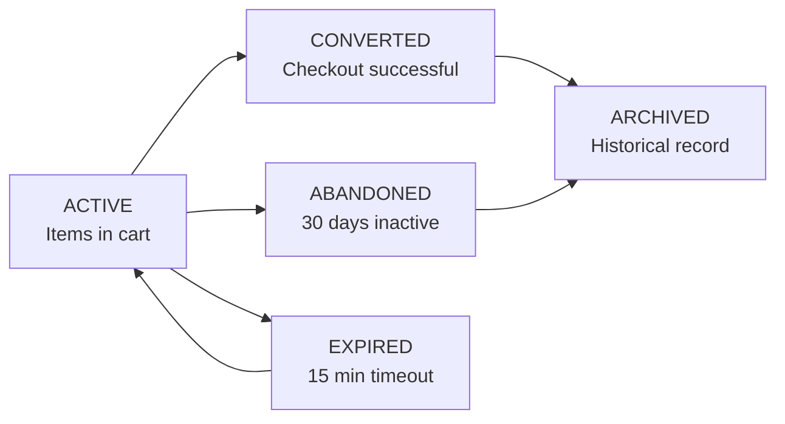

# Shopping Cart and Wishlist Management System

## 1. Overview

The Shopping Cart and Wishlist system enables customers to manage their purchase selections and save products for future consideration. These complementary features form the core of the customer purchase preparation workflow, acting as the bridge between product browsing and order placement. The cart functions as a temporary purchase container with transient state, while the wishlist serves as a personal collection for later review with persistent storage.

### 1.1 Business Purpose

**Shopping Cart:**
- Allows customers to accumulate items before committing to purchase
- Enables quantity and variant selection for flexible shopping
- Facilitates final price review before checkout
- Persists customer selections across sessions to prevent data loss
- Serves as the staging area for order creation and payment processing

**Wishlist:**
- Enables customers to save products for future consideration
- Helps customers organize items they are interested in
- Supports purchase planning and budgeting activities
- Provides customers with easy access to previously reviewed products
- Can be used for gift registries and personal collections

### 1.2 Core System Objectives

- Provide seamless shopping experience with easy item management
- Maintain data integrity and prevent customer frustration from lost cart contents
- Prevent overselling through real-time inventory validation
- Support multi-item orders from multiple sellers in single transaction
- Enable flexible shopping patterns (browsing, saving, purchasing)
- Maintain performance with large carts and concurrent user operations

---

## 2. Shopping Cart Functionality

### 2.1 Cart Purpose and Design

THE shopping cart system SHALL allow authenticated customers to accumulate multiple products with specific variants and quantities before checkout. THE system SHALL maintain cart state persistently for each customer, enabling interrupted shopping sessions to resume without data loss.

WHEN a customer adds a product variant with a quantity from the product detail page, THE system SHALL add the item to their shopping cart. WHEN the same product variant is added again, THE system SHALL update the quantity rather than create a duplicate cart entry.

### 2.2 Add Items to Cart

**Functional Requirements:**

WHEN a customer selects a product variant with a quantity, THE system SHALL validate that:
- The selected SKU exists and represents a valid product variant
- The product is in "Active" or "Available" status (not archived or deleted)
- The seller owning the product is verified and not suspended
- The requested quantity is between 1 and the maximum purchasable amount (system default: 999 units)
- The current inventory level supports the requested quantity

IF any validation fails, THEN THE system SHALL reject the request and display a specific error message indicating the failure reason.

WHEN adding an item to cart, THE system SHALL capture:
- Product ID and SKU (unique variant identifier)
- All selected variant attributes (color: "Blue", size: "Large", pattern: "Striped")
- Quantity requested (example: 2)
- Unit price at time of addition (price snapshot for reference)
- Variant option values selected by customer
- Timestamp of addition (ISO 8601 format)

THE system SHALL store the price snapshot with each cart item so customer sees the price that was current when they added the item, protecting them from unexpected price increases during browsing.

### 2.3 Update Cart Item Quantity

WHEN a customer modifies the quantity of an existing cart item, THE system SHALL:
1. Accept the new quantity value
2. Validate that new quantity is between 1 and maximum (999 units)
3. Validate that new quantity does not exceed current available inventory for that SKU
4. Update the quantity in the cart
5. Recalculate cart subtotal, taxes, and totals immediately

IF customer attempts to set quantity to zero, THE system SHALL interpret this as item removal request and delete the item from cart.

IF requested quantity exceeds available inventory (example: customer tries to order 10 units but only 5 in stock), THE system SHALL reject the update and display message: "Only 5 units are currently available. Would you like to update quantity to 5?"

### 2.4 Remove Items from Cart

WHEN a customer removes an item from cart, THE system SHALL:
- Permanently delete that line item and associated data
- Recalculate cart totals immediately
- Preserve all other cart items unchanged
- Confirm removal with success message

THE system SHALL support:
- Removal of individual items by clicking "Remove" button
- Bulk removal of multiple selected items
- Complete cart clearing with "Clear Cart" button

WHEN customer clears entire cart, THE system SHALL display confirmation dialog: "Are you sure you want to clear your cart? All items will be removed."

### 2.5 View Shopping Cart

THE shopping cart display SHALL present all accumulated items with complete details and calculated totals.

**Cart Item Display Requirements:**

FOR each item in the cart, THE system SHALL display:
- Product name (example: "Premium Cotton T-Shirt")
- Product thumbnail image
- Selected variant attributes formatted clearly (Color: Blue | Size: Medium | Material: Cotton)
- Unit price (price at time of addition, example: $24.99)
- Quantity ordered
- Line item total (unit price × quantity, example: $24.99 × 2 = $49.98)
- Current inventory status for this SKU (In Stock, Low Stock, Out of Stock)
- Seller name and store link
- SKU/variant identifier (for reference)
- Individual item actions: "Update Quantity", "Remove", "Move to Wishlist"

**Cart Summary Section:**

THE system SHALL display a summary section showing:
- Subtotal: sum of all line item totals (example: $149.97)
- Estimated tax: calculated based on items and delivery address (example: $9.99)
- Estimated shipping: based on items and selected shipping method or "Calculated at checkout" if not yet selected
- Grand total: subtotal + tax + shipping (example: $159.96)
- Number of items in cart (example: "3 items")
- Number of unique products (example: "2 products from 1 seller")

**Availability and Status Alerts:**

THE system SHALL display warnings for any items with issues:
- "⚠️ This item is now out of stock" - product no longer available
- "⚠️ Price has changed from $24.99 to $26.99" - if seller raised price
- "⚠️ This item is from a seller who is no longer active" - seller account suspended

### 2.6 Cart Persistence Across Sessions

THE system SHALL maintain each customer's shopping cart persistently, preserving cart contents across browser sessions, application restarts, and time periods.

**Persistence Implementation:**

THE shopping cart SHALL be stored server-side and associated with the authenticated customer account, not relying on client-side storage alone.

WHEN a customer logs in, THE system SHALL automatically load their current cart contents and display them immediately.

WHEN a customer closes the browser or logs out, THE system SHALL preserve the cart in its current state.

WHEN the same customer logs in again (even days later), THE system SHALL restore the complete cart with all items and quantities exactly as they left it.

THE system SHALL maintain cart contents for minimum of 30 days of inactivity. IF a customer has not accessed their account for 30+ days, THE system SHALL display message: "Your saved cart is from X days ago. Items may no longer be available. Would you like to review your cart?"

### 2.7 Cart Item Validation and Availability Checking

WHEN a customer accesses their shopping cart, THE system SHALL validate all items for current availability and provide status indicators.

**Real-Time Validation Checks:**

THE system SHALL verify and validate each cart item by checking:

**Product Status Validation:**
- WHEN validating, THE system SHALL verify that product status is still "Active"
- IF product has been deactivated or removed, THE system SHALL flag item with warning "This product is no longer available"
- THE system SHALL prevent checkout if any items are from deactivated products

**Seller Status Validation:**
- THE system SHALL verify that product's seller is still verified and active
- IF seller account has been suspended or deactivated, THE system SHALL flag items with warning "This item is no longer available from this seller"
- THE system SHALL prevent checkout with items from inactive sellers

**Inventory Validation:**
- THE system SHALL check current inventory levels for each SKU
- IF requested quantity exceeds current inventory, THE system SHALL flag item showing current available quantity
- EXAMPLE: Customer has 10 units in cart but only 6 in stock → display "Only 6 available. Adjust quantity?"
- THE system SHALL prevent checkout unless all quantities are available

**Price Validation:**
- THE system SHALL compare stored price with current product price
- IF price has increased more than 10%, THE system SHALL display alert: "Price increased from $24.99 to $31.99 (24% increase)"
- IF price has decreased, THE system SHALL display positive message: "Price decreased from $24.99 to $22.99 - you save $2!"
- WHEN customer acknowledges price change, THE system SHALL allow proceeding with new price or removing item

**Variant Validation:**
- THE system SHALL verify that all variant attributes (color, size, etc.) are still valid for the product
- IF product variants have been removed or modified, THE system SHALL flag item "This product option is no longer available"

### 2.8 Shopping Cart Business Rules

THE following business rules SHALL govern shopping cart operations:

**Quantity Rules:**
- THE maximum quantity per item SHALL be 999 units (prevents bulk purchases through individual SKU)
- THE minimum quantity per item SHALL be 1 unit
- IF customer attempts to add more than maximum, THE system SHALL reject with message "Maximum 999 units per item"
- THE system SHALL accept only whole number quantities (no 2.5 units, must be 2 or 3)

**Item Limits:**
- THE maximum number of unique items (distinct SKUs) in cart SHALL be 100
- IF customer attempts to add 101st unique SKU, THE system SHALL display message "Maximum 100 different products in cart"
- HOWEVER, customer may exceed 100 total items if increasing quantities of existing cart items

**Price Calculation:**
- THE subtotal SHALL be calculated as sum of (unit price × quantity) for each item
- THE subtotal formula: Σ(Price_i × Quantity_i) where i = each cart line item
- IF applicable, shipping costs SHALL be calculated based on items, total weight, destination address, selected shipping method
- IF applicable, taxes SHALL be calculated based on shipping address, item type (taxable vs. non-taxable), and applicable jurisdiction
- THE grand total SHALL be: Subtotal + Shipping + Taxes - Any Applied Discounts

**Discount Application:**
- WHEN customer applies promotional code, THE system SHALL validate code:
  - Verify code is currently active and not expired
  - Verify code is applicable to items in cart (some codes restricted to specific categories)
  - Verify customer hasn't exceeded usage limit for this code
  - Verify code minimum purchase amount is met (if applicable)
- WHEN valid code applied, THE system SHALL recalculate totals with discount applied
- THE system SHALL display discount breakdown showing original price, discount amount, and new total

**Multi-Seller Orders:**
- THE system SHALL allow single cart containing items from multiple sellers
- THE system SHALL clearly indicate which items are from which seller
- THE system SHALL calculate fulfillment separately per seller during order placement
- EACH seller SHALL receive order for only their items

### 2.9 Cart Validation Before Checkout

WHEN customer initiates checkout from their shopping cart, THE system SHALL perform comprehensive validation:

**Complete Validation Sequence:**

1. **Cart Not Empty:** Validate cart contains at least one item → if empty, prevent checkout
2. **All Items Available:** Re-validate inventory for each item at checkout time
   - IF any item now out of stock → display which items unavailable
   - ALLOW customer to remove unavailable items and retry checkout
3. **Product Status:** Verify all products still active (not removed/archived)
4. **Seller Verification:** Verify all sellers still verified and active
5. **Price Current:** Display to customer any price changes since adding to cart
   - IF prices increased >10%, REQUIRE customer to explicitly confirm accepting new prices
6. **Customer Eligible:** Verify customer account in good standing (not suspended)
7. **Address Valid:** Verify customer has selected or entered valid delivery address
8. **Inventory Reservation:** Attempt to reserve inventory for all items
   - IF reservation fails for any item, DISPLAY which item(s) cannot be reserved
   - ALLOW customer to modify cart and retry

WHEN all validations pass, THE system SHALL mark items as reserved and proceed to shipping/payment selection.

---

## 3. Cart Persistence and State Management

### 3.1 Cart Storage Architecture

WHEN a customer adds items to their cart, THE system SHALL store the complete cart state on the server database, associating it with the customer's account ID.

**Storage Requirements:**

THE shopping cart SHALL be stored in persistent database (not temporary session storage) with following data:
- customer_id: Links cart to authenticated customer
- item records: Each line item with (sku, variant_attributes, quantity, unit_price_snapshot, timestamp_added)
- cart_created_timestamp: When this cart was first created
- cart_modified_timestamp: Most recent modification time
- cart_status: "active", "archived", "converted_to_order"
- session_id: Reference to current session (for concurrent access handling)

THE system SHALL use atomic operations to prevent race conditions when multiple concurrent requests modify same cart.

WHEN cart is modified from multiple devices simultaneously (example: customer shopping on laptop while also shopping on phone), THE system SHALL:
- Use database-level locking to prevent inconsistent states
- Allow most recent modification to take precedence
- Notify customer if items were removed/modified due to inventory changes
- Provide option to resolve conflicts manually

### 3.2 Cart Synchronization Across Devices

WHEN a customer accesses the shopping cart from different devices or browsers, THE system SHALL provide unified, current cart state.

**Synchronization Requirements:**

THE system SHALL retrieve current server-side cart regardless of device or browser used.

THE system SHALL display consistent cart contents across all customer devices:
- EXAMPLE: Customer adds item on laptop → item visible on phone within 5 seconds
- EXAMPLE: Customer updates quantity on tablet → phone cart updates automatically on next load

IF customer accesses cart on multiple devices simultaneously, THE system SHALL:
- Use timestamps to determine most recent changes
- Display most recent state to all devices
- Show notification: "Your cart was updated from another device" if conflicts detected
- Allow customer to manually sync or resolve conflicts

### 3.3 Cart Status Transitions

THE shopping cart transitions through various states during its lifecycle:

**States:**
- **ACTIVE**: Cart contains items and customer is actively shopping/managing
- **CONVERTED**: Cart has been converted to order during successful checkout
- **ABANDONED**: Cart has been inactive for 30 days (customer stopped shopping)
- **ARCHIVED**: Cart preserved for reference after conversion or abandonment
- **EXPIRED**: Cart reserved items have been released due to timeout

**State Transitions:**

WHEN customer initiates checkout, THE system transitions cart from ACTIVE to CONVERTED and creates new empty ACTIVE cart for future shopping.

WHEN 30 days pass without cart modification, THE system transitions cart to ABANDONED status but preserves all contents for potential recovery.

WHEN checkout process times out (customer doesn't complete payment within 15 minutes), THE system transitions to EXPIRED status and releases reserved inventory, but allows customer to resume by re-adding items.

---

## 4. Wishlist Functionality

### 4.1 Wishlist Purpose and Design

THE wishlist system SHALL allow authenticated customers to save products for future consideration without adding them to shopping cart. THE wishlist operates independently from shopping cart and serves as personal product collection.

### 4.2 Add Items to Wishlist

WHEN customer selects "Add to Wishlist" button on product detail page, THE system SHALL:
1. Validate product SKU/variant selected is valid
2. Check if customer has already added this exact product variant to wishlist
3. Add item to wishlist with timestamp
4. Display confirmation: "Added to wishlist ✓"

WHEN same product variant is added to wishlist again, THE system SHALL NOT create duplicate (idempotent operation).

THE system SHALL capture for each wishlist item:
- Product ID and variant details (color, size, options selected)
- SKU identifier for reference
- Timestamp of addition (ISO 8601 format)
- Current product price at time of addition (price snapshot)
- Customer notes (optional, 200-character limit)
- Priority/importance flag (Can mark as "High Priority")

**Price Snapshot for Wishlist:**

WHEN item is added, THE system SHALL capture current price (example: $24.99).

WHEN displaying wishlist, THE system SHALL show:
- Original saved price (example: "Saved at: $24.99 on March 15")
- Current product price (example: "Now: $22.99")
- Price change indicator (↓ Decreased by $2 | ↑ Increased by $5)

IF price decreased significantly (threshold: 15%), THE system SHALL notify customer: "Price dropped! This item on your wishlist is now $22.99 (was $24.99). Add to cart?"

IF price increased significantly (threshold: 20%), THE system SHALL display warning: "Price increased to $29.99 (was $24.99)."

### 4.3 Remove Items from Wishlist

WHEN customer removes an item from wishlist, THE system SHALL immediately delete that item and update wishlist display.

THE system SHALL support:
- Removal of individual items (click "Remove from wishlist")
- Bulk removal of multiple selected items
- Complete wishlist clearing ("Clear all items" with confirmation)

WHEN customer clears entire wishlist, THE system SHALL display confirmation: "Are you sure? All saved items will be removed."

### 4.4 Move Items Between Cart and Wishlist

**Move to Shopping Cart:**

WHEN customer clicks "Add to cart" from wishlist item, THE system SHALL:
1. Add item to shopping cart with quantity of 1
2. Optionally remove from wishlist (ask customer: "Keep in wishlist?" or "Remove after adding to cart?")
3. Use current product price (not historical price from wishlist)
4. Display confirmation: "Added to cart"

THE system SHALL set quantity to 1 when moving to cart; customer can adjust quantity later.

**Move from Cart to Wishlist:**

WHEN customer clicks "Save for later" on cart item, THE system SHALL:
1. Remove item from shopping cart
2. Add to wishlist with price snapshot
3. Update cart totals
4. Display confirmation: "Moved to wishlist"

### 4.5 View and Manage Wishlist

**Wishlist Display:**

WHEN customer accesses their wishlist, THE system SHALL display:

FOR each item:
- Product name and thumbnail image
- Selected variant attributes formatted (Color: Blue | Size: Large)
- Saved price and current price comparison
- Current availability status (In Stock | Out of Stock | Limited Stock with quantity)
- Product rating (average stars)
- Seller name and store
- Date added to wishlist (example: "Added March 15")
- Action buttons: "Add to cart", "Remove", "Edit notes"
- Priority indicator (if marked as high priority)

**Wishlist Summary:**

THE system SHALL display:
- Total number of items in wishlist
- Total value of wishlist items (sum of current prices)
- Number of items currently in stock
- Number of items currently out of stock
- Filter/Sort options

**Wishlist Organization Features:**

THE system SHALL allow customers to:
- Sort wishlist by: date added, price (low to high), price (high to low), availability, rating
- Filter by: price range, in-stock items only, specific sellers
- Add personal notes to items (max 200 characters, example: "Blue only, not red variant")
- Mark items as "High Priority" or "Regular Priority"
- Create multiple wishlists (optional feature: "Birthday Wishlist", "Home Decor", etc.)

### 4.6 Wishlist Persistence and Lifecycle

THE system SHALL maintain each customer's wishlist persistently across sessions and time periods.

**Persistence Requirements:**

THE wishlist SHALL be stored server-side associated with customer account.

THE system SHALL restore complete wishlist when customer logs in.

WHEN customer accesses wishlist, THE system SHALL display items exactly as saved, with current product information (current price, availability) overlaid on historical data.

THE system SHALL maintain wishlist items for extended period (minimum 90 days, maximum 180 days of inactivity before archival).

THE system SHALL only delete wishlist items when:
- Customer explicitly removes item
- Customer deletes entire wishlist
- Customer account is deleted (per data retention policy)

---

## 5. Wishlist Notifications and Features

### 5.1 Wishlist Price Drop Notifications

WHEN a product price in customer's wishlist decreases by 15% or more, THE system SHALL:
1. Detect price change through inventory system integration
2. Calculate discount percentage (example: from $24.99 to $18.74 = 25% savings)
3. Send notification to customer:
   - Email subject: "Price drop! [Product Name] now $18.74 (was $24.99)"
   - In-app notification: "📉 This wishlist item has dropped to $18.74"
4. Display notification in wishlist view with visual highlight
5. Provide one-click "Add to cart" button in notification

THE system SHALL NOT spam customers with every tiny price change; only notify for significant drops (15%+ threshold).

### 5.2 Wishlist Item Availability Notifications

WHEN a product in customer's wishlist changes from "Out of Stock" to "In Stock", THE system SHALL:
1. Detect availability change
2. Send notification:
   - "Back in stock! [Product Name] is now available"
   - Include current price
   - Provide "View product" and "Add to cart" buttons
3. Highlight item in wishlist with "Just restocked!" badge

THE system SHALL send ONE notification per restocking event, not continuous reminders.

### 5.3 Wishlist Sharing (Optional Feature)

WHEN customer clicks "Share wishlist" button, THE system SHALL:
1. Generate shareable link (example: "shopping-mall.com/wishlist/abc123xyz")
2. Allow customer to copy link or email to friends
3. Display link with options: "Copy link" or "Email wishlist"

WHEN someone accesses shared wishlist link (without login), THE system SHALL:
- Display wishlist items with current prices and availability
- Allow "Add to cart" button (redirects to login if not authenticated)
- NOT show customer's personal information, notes, or priority markings
- Indicate "Shared by John D."

---

## 6. Cart to Order Conversion

### 6.1 Checkout Initiation Process

WHEN customer clicks "Proceed to checkout" from shopping cart, THE system SHALL execute following workflow:

**Step 1: Cart Validation (Described in Section 2.9)**
- Verify cart not empty
- Validate all items in stock
- Check inventory reservation

**Step 2: Delivery Address Confirmation**
- THE system SHALL present customer's saved addresses
- ALLOW customer to select existing address or enter new address
- REQUIRE full address entry: street, city, state, zip, country
- DISPLAY message: "Items will be delivered to this address"

**Step 3: Shipping Method Selection**
- THE system SHALL present available shipping methods for selected destination
- DISPLAY for each method: name, cost, estimated delivery date
- EXAMPLES:
  - Standard Shipping: $5.99 (5-7 business days)
  - Express Shipping: $12.99 (2-3 business days)
  - Overnight: $24.99 (1 business day)
- ALLOW customer to select preferred shipping method
- UPDATE estimated delivery date based on selection

**Step 4: Order Review**
- THE system SHALL display order summary:
  - All items with quantities, unit prices, line totals
  - Subtotal amount
  - Shipping cost (based on selection)
  - Tax amount (calculated)
  - Grand total
- ALLOW customer to modify order (return to cart to adjust quantities/remove items)
- ALLOW customer to modify address or shipping method
- REQUIRE explicit customer confirmation before proceeding to payment

**Step 5: Payment Processing**
- THE system SHALL transition to payment processing workflow
- FOR details on payment, refer to [Payment Processing Document](./07-payment-processing.md)

### 6.2 Order Creation from Cart

WHEN customer successfully completes payment, THE system SHALL create order from cart contents:

**Atomic Order Creation Process:**

THE system SHALL atomically:
1. Create order record with status "Payment Confirmed"
2. Copy all cart items to order with captured prices/quantities
3. Reduce inventory for each SKU (permanent inventory deduction)
4. Link order to customer account
5. Link order to relevant sellers (if multi-seller order)
6. Clear/archive shopping cart

**Order Record Creation:**

THE system SHALL generate order record containing:
- Unique order number (format: ORD-YYYYMMDD-XXXXXX)
- Order creation timestamp
- Customer ID and verified contact info
- Order items with quantities, unit prices, product details
- Subtotal, taxes, shipping, and total amounts
- Delivery address and selected shipping method
- Payment method and transaction ID
- Initial order status "Payment Confirmed"

IF multi-seller order (items from 3 different sellers), THE system SHALL:
1. Create ONE customer order record with all items
2. Create separate fulfillment records per seller showing their portion
3. Calculate seller's portion of total and commissions
4. Link each seller order to parent customer order

**Example Multi-Seller Order:**
- Customer Order Total: $150
- Items from Seller A: $80 (Seller A commission: $8)
- Items from Seller B: $50 (Seller B commission: $5)
- Items from Seller C: $20 (Seller C commission: $2)

### 6.3 Post-Checkout Cart Handling

WHEN order is successfully created, THE system SHALL:

1. **Mark Original Cart as Converted:**
   - Set cart status to "CONVERTED"
   - Record conversion timestamp
   - Preserve converted cart for reference/analytics

2. **Create New Empty Cart:**
   - Generate new empty cart for same customer
   - Set status to "ACTIVE"
   - Allow immediate new shopping session

3. **Send Confirmations:**
   - Display on-screen confirmation with order number
   - Send order confirmation email to customer within 1 minute
   - Send order notifications to all relevant sellers

4. **Redirect Customer:**
   - Display order confirmation page with:
     - Order number and confirmation code
     - Order summary details
     - Estimated delivery date
     - Link to view order status
     - "Continue shopping" button

---

## 7. Error Handling and Edge Cases

### 7.1 Out of Stock Scenarios

**Scenario: Item Becomes Out of Stock After Adding to Cart**

WHEN item is in customer's cart but inventory reaches zero before checkout:
- THE system SHALL flag the item in cart view as "Out of Stock"
- DISPLAY message: "This item is no longer available"
- PREVENT checkout with message: "Remove out-of-stock items before continuing"
- OFFER option to remove item or receive notification when back in stock

**Scenario: Insufficient Inventory for Requested Quantity**

WHEN customer attempts to order 10 units but only 5 available:
- THE system SHALL prevent checkout with message: "Only 5 units available"
- SUGGEST customer reduce quantity to 5
- ALLOW customer to change to 5 units and continue, or remove item

### 7.2 Price Change Scenarios

**Scenario: Product Price Increases After Adding to Cart**

WHEN price increases >10%, THE system SHALL:
- DISPLAY alert in cart: "Price changed from $24.99 to $27.99"
- SHOW savings or increase amount and percentage
- ALLOW customer to:
  - Accept new price and continue
  - Remove item from cart
  - Replace with different variant

**Scenario: Product Price Decreases After Adding to Cart**

WHEN price decreases, THE system SHALL:
- UPDATE displayed price automatically
- SHOW customer savings: "Savings: $2 (8% off)"
- APPLY lower price at checkout

### 7.3 Seller Status Changes

**Scenario: Seller Account Suspended**

WHEN seller's account is suspended while their products in customer carts:
- FLAG cart items: "This item is no longer available from this seller"
- PREVENT checkout with these items
- REQUIRE customer to remove items before continuing
- SUGGEST alternatives from other sellers (if applicable)

### 7.4 Checkout Timeout

**Scenario: Checkout Process Times Out**

WHEN customer doesn't complete checkout within 15 minutes:
- RELEASE inventory reservations
- PRESERVE shopping cart with all items
- DISPLAY: "Your checkout session expired. Your cart has been saved."
- ALLOW customer to resume checkout with same cart

---

## 8. Business Rules Summary

**Cart Quantity Limits:**
- Minimum: 1 unit per item
- Maximum: 999 units per item
- Maximum unique items: 100 SKUs per cart

**Wishlist Limits:**
- No item limit on wishlist
- Price snapshot retention: Stored with each item
- Persistence: 90-180 days minimum

**Checkout Validation:**
- ALL items must be in stock (re-validated at checkout)
- Address must be complete and valid
- Shipping method must be selected
- Payment amount must match order total exactly

**Cart Persistence:**
- Server-side storage (not client-side only)
- Minimum 30-day retention
- Cross-device synchronization within 5 seconds

---

## Integration with Related Systems

**Inventory Management:**
- Cart validates against real-time inventory
- Checkout reserves inventory for 15 minutes
- Order creation atomically reduces inventory
- Cancellation restores inventory

**Payment Processing:**
- Cart-to-order conversion triggers payment processing
- Payment amount must match cart total exactly
- Successful payment triggers order creation

**Order Processing:**
- Cart items become order items
- Multi-seller carts create multiple seller orders
- Cart history preserved with order record

---

> *Developer Note: This document defines **business requirements only**. All technical implementations (architecture, APIs, database design, caching strategies, etc.) are at the discretion of the development team.*