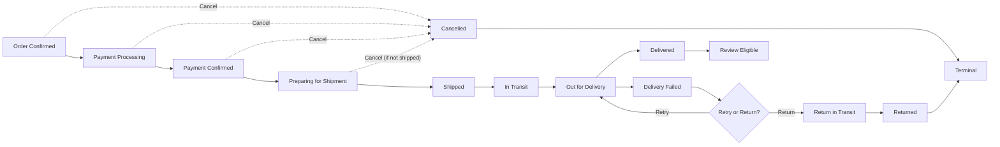
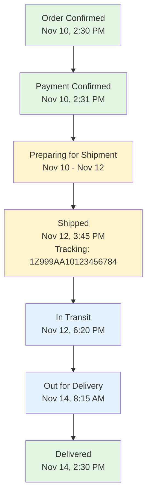

# Order Tracking and Shipping

## Executive Summary

The order tracking and shipping module is a critical component of the e-commerce shopping mall platform that provides customers with real-time visibility into their order fulfillment and delivery status. This system enables customers to monitor their purchases from the moment an order is confirmed through final delivery, while simultaneously providing sellers and administrators with the tools needed to manage fulfillment operations efficiently.

The order tracking system must support multiple shipping carriers, provide accurate estimated delivery dates, send proactive notifications at key lifecycle stages, and handle various exception scenarios gracefully. This requirements document specifies the complete tracking workflow, notification system, carrier integration, and customer experience expectations for the shopping mall platform.

---

## Order Tracking System Overview

### Core Tracking Principles

WHEN a customer places an order, THE system SHALL create a trackable order record with unique order ID and store all tracking-related data for the complete order lifecycle.

THE order tracking system SHALL provide customers with comprehensive visibility into their order status from placement through delivery, with real-time updates reflecting current fulfillment stage.

WHEN order status changes, THE system SHALL maintain a complete audit trail of all status changes, timestamps, associated tracking data, and triggering events for each order.

The order tracking system serves as the central nervous system connecting customers, sellers, and shipping carriers. It provides real-time status updates, proactive notifications, and comprehensive order history while maintaining data integrity and supporting various carrier integrations.

### Key Stakeholders and Their Information Needs

| Stakeholder | Primary Information Needs | Update Frequency |
|-------------|---------------------------|---------------------|
| **Customer** | Current status, location (if available), estimated delivery date, next steps | Real-time or immediate on status change |
| **Seller** | Orders pending fulfillment, prepared for shipment, in transit, delivered | Real-time updates from tracking system |
| **Shipping Carrier** | Pickup details, delivery address, weight, special handling | At order confirmation and fulfillment |
| **Admin** | System-wide tracking status, carrier performance, exception tracking | Real-time with historical analytics |

---

## Order Lifecycle and Status Progression

### Order Status Definitions

THE order progresses through defined lifecycle stages with specific status values that communicate the current fulfillment state:

| Status | Definition | Duration | Actor Responsible | Customer Visibility |
|--------|-----------|----------|------------------|-------------------|
| **Order Confirmed** | Order has been placed and payment processed successfully | 0-2 minutes | System | ✅ Visible |
| **Payment Processing** | Payment is being validated and confirmed with payment gateway | 1-30 seconds | Payment system | ✅ Visible |
| **Payment Confirmed** | Payment has been successfully charged and confirmed | 1-2 minutes | System | ✅ Visible |
| **Preparing for Shipment** | Seller is picking, packing, and preparing items for shipment | 1-7 days | Seller | ✅ Visible |
| **Shipped** | Order has been picked up by carrier and is in transit | Variable | Seller/Carrier | ✅ Visible with tracking number |
| **In Transit** | Package is moving through carrier's distribution network | 1-14 days | Carrier | ✅ Visible with location updates |
| **Out for Delivery** | Package is on delivery vehicle and will arrive today | 2-8 hours | Carrier | ✅ Visible (high priority) |
| **Delivered** | Package has been successfully delivered to customer address | Terminal state | Carrier | ✅ Visible with delivery timestamp |
| **Delivery Failed** | Delivery attempt failed; package will be returned or retried | 1-3 days | Carrier | ✅ Visible with reason |
| **Cancelled** | Order was cancelled before shipment | Terminal state | Customer/Admin | ✅ Visible |
| **Return in Transit** | Package is in transit back to seller after return authorization | 1-14 days | Carrier | ✅ Visible |
| **Returned** | Package has been received back by seller | Terminal state | Seller | ✅ Visible |

### Status Transition Rules

WHEN an order is in "Order Confirmed" status and payment processing has been initiated, THE system SHALL transition to "Payment Processing" status.

WHEN payment has been successfully charged and confirmed by the payment gateway, THE system SHALL transition the order to "Payment Confirmed" status.

WHEN a seller receives the order in "Payment Confirmed" status, THE system SHALL allow the seller to transition the order to "Preparing for Shipment" status and record the transition timestamp.

WHILE an order is in "Preparing for Shipment" status, THE system SHALL display an estimated preparation time (default 3 business days) to the customer and update this estimate daily as the seller progresses.

WHEN a seller marks an order as shipped and provides tracking information (tracking number, carrier name, estimated delivery date), THE system SHALL transition the order to "Shipped" status and immediately notify the customer with tracking details within 2 hours of shipment confirmation.

WHEN the carrier reports that a package has been picked up and is moving through their distribution network, THE system SHALL update the order status to "In Transit" if not already in that state.

WHEN the carrier reports that a package is on a delivery vehicle and will arrive the same day, THE system SHALL transition the order status to "Out for Delivery" and send high-priority notification to the customer.

WHEN the carrier confirms successful package delivery to the address (with timestamp from carrier API), THE system SHALL transition the order to "Delivered" status and notify the customer of successful delivery within 15 minutes of confirmation.

IF a delivery attempt fails (address not found, recipient unavailable, package refused), THE system SHALL transition the order to "Delivery Failed" status with the specific reason for failure and notify the customer within 1 hour of failure confirmation.

WHEN a customer initiates a return request and it is approved, THE system SHALL transition the order to "Return in Transit" once the package is confirmed in transit back to the seller by the carrier.

WHEN a customer initiates a cancellation request WHILE the order is in "Order Confirmed" or "Payment Processing" status, THE system SHALL cancel the order immediately and initiate a refund without requiring further approvals.

WHEN a customer initiates a cancellation request WHILE the order is in "Preparing for Shipment" status, THE system SHALL attempt to cancel and notify the seller to stop processing; IF the order has already shipped, cancellation SHALL be denied and the customer directed to the returns process as defined in [Order Cancellation and Returns](./09-order-cancellation-and-returns.md).

IF an order reaches "Delivered" status, THE system SHALL mark the order as complete and enable the review and rating functionality after a 24-hour grace period to allow customers to inspect the product before reviewing.

### Status Transition Workflow Visualization

---

## Shipping Information and Tracking Numbers

### Tracking Number Assignment and Management

WHEN a seller confirms shipment by marking an order as "Shipped" and providing carrier details, THE system SHALL assign or receive a tracking number from the seller for the order.

THE system SHALL store the tracking number associated with each shipment along with the carrier name and ship date, supporting multiple tracking numbers if an order is split across multiple packages.

WHEN a customer views their order, THE system SHALL display the tracking number prominently along with the carrier name, allowing customers to click through to carrier tracking if available.

WHEN a carrier provides tracking number validation, THE system SHALL verify the format matches the carrier's standard (e.g., UPS format, FedEx format, DHL format) and store both the carrier and tracking number together.

WHILE an order has a valid tracking number, THE system SHALL periodically poll the carrier API to retrieve updated tracking status and delivery estimates at intervals appropriate to current order state (every 2-4 hours for in-transit packages).

### Multiple Packages per Order Handling

WHEN an order contains items from multiple sellers or is split for inventory availability, THE system SHALL create separate shipment records and tracking records for each package.

THE system SHALL link each shipment to the original order and track them as separate fulfillment units with independent status progression.

WHEN displaying order status to a customer with multiple packages, THE system SHALL show the status of each package separately with individual tracking numbers and provide an overall order status reflecting the latest/slowest package status.

THE customer SHALL be able to view a timeline of all packages within a single order and track each independently.

WHEN all packages in a multi-package order have been delivered, THE system SHALL mark the entire order as "Delivered" and enable review submission for all items in the order.

### Tracking Number Display Requirements

WHEN an order transitions to "Shipped" status, THE system SHALL display the tracking number in:
- The order details page with prominent placement
- The notification email with direct link to carrier tracking
- The customer's order history with quick access
- SMS notification (if customer has SMS enabled) with shortened URL or carrier info

THE system SHALL format tracking numbers according to each carrier's standards and provide clickable links to carrier tracking pages when available (e.g., "Track with FedEx" button).

THE tracking number SHALL remain visible to the customer for minimum 1 year after delivery for reference purposes.

---

## Carrier Integration Framework

### Supported Carriers and Integration

THE system SHALL support integration with major shipping carriers including FedEx, UPS, DHL, national postal services, and regional carriers as configured by admin.

WHEN a seller creates a shipment, THE system SHALL provide a selection of available carriers based on:
- Delivery address location (country, region, rural vs. urban)
- Order weight and dimensions
- Delivery speed requirements (standard, express, overnight)
- Carrier service availability in that region
- Seller's negotiated carrier agreements

THE system SHALL maintain carrier-specific information including carrier name, API endpoints, authentication credentials, tracking URL formats, service types, cutoff times, and operational hours.

### Carrier API Integration and Real-Time Updates

THE system SHALL integrate with carrier APIs to retrieve real-time tracking updates for all in-transit orders using secure authenticated connections.

WHEN a carrier status update is received via API or webhook, THE system SHALL parse the tracking data and update the order status accordingly without requiring manual intervention.

WHEN THE carrier provides specific location data (latitude/longitude), THE system SHALL store this information and MAY display it on a map interface if the carrier permits public map display.

IF a carrier API becomes unavailable, THE system SHALL implement graceful degradation by:
- Using cached tracking data from previous API call
- Notifying administrators of the outage
- Retrying connection every 30 minutes
- Displaying last-known status to customers with update timestamp

THE system SHALL sync carrier tracking data at configurable intervals:
- Every 2-4 hours for packages in "In Transit" or "Out for Delivery" status
- Every 6-12 hours for packages in "Shipped" status (first 24 hours)
- Every 24 hours for packages past estimated delivery date

WHERE a carrier provides tracking webhook/push notifications, THE system SHALL implement webhook handlers to receive real-time updates rather than polling, reducing latency from hours to minutes.

### Estimated Delivery Date Calculation

WHEN a seller confirms shipment with carrier information, THE system SHALL calculate an estimated delivery date based on:
- Carrier's published estimated transit time for the origin-to-destination route
- Current date and time
- Carrier's operating hours (excluding nights and weekends based on carrier schedule)
- Business day calculations (excluding Saturdays, Sundays, and holidays in both origin and destination countries)
- Package weight and dimensions (may affect service tier eligibility)
- Current carrier backlog or delays (if available from carrier API)

THE system SHALL display the estimated delivery date to the customer with a confidence indicator (e.g., "Expected by Thursday, November 14" or "Expected between November 14-16").

WHEN the carrier provides an updated estimated delivery date via tracking API, THE system SHALL update the customer's estimated delivery date and notify them with clear messaging if the date has changed by more than 24 hours.

IF the estimated delivery date passes without the package being delivered, THE system SHALL flag the order as potentially delayed within 4 hours of the estimated date passing.

WHEN an order is flagged as delayed, THE system SHALL:
- Update customer-visible order status to show "Delayed" indicator
- Send notification to customer explaining the delay
- Provide carrier contact information for customer to investigate
- Monitor for resolution and update customer daily

---

## Delivery Notifications and Customer Communications

### Comprehensive Notification Trigger System

The system must proactively notify customers at all critical points in the order fulfillment journey with appropriate messaging and urgency levels:

| Trigger Event | Timing | Notification Channels | Content Requirements |
|--------------|--------|----------------------|---------------------|
| **Order Confirmed** | Immediately (within 1 min) | Email, SMS, In-app | Order confirmation with order number, total amount, estimated delivery window |
| **Payment Confirmed** | Immediately (within 1 min) | Email, In-app | Payment receipt, order confirmation, link to order tracking |
| **Order Shipped** | Within 2 hours of shipment | Email, SMS, Push | Tracking number, carrier name, carrier link, estimated delivery date |
| **In Transit** | Within 2 hours of carrier pickup | Email, In-app, Push | Status update confirming package is in transit, updated delivery estimate |
| **Out for Delivery** | Within 2 hours of delivery route | SMS, Push notification (high priority) | Urgent notification that package will arrive today with delivery time window if available |
| **Delivered** | Within 15 minutes of delivery confirmation | Email, SMS, Push | Delivery confirmed with timestamp, signature (if applicable), next steps (review, track, return) |
| **Delivery Failed** | Within 1 hour of failure | Email, SMS, Push | Clear explanation of failure reason and next steps (retry, return, contact) |
| **Estimated Delivery Update** | Immediately when change occurs | Email, In-app, Push | Only sent if change exceeds 24 hours, explaining reason if known |
| **Delayed Package Alert** | After 4 hours past estimated delivery | Email, SMS | Alert that package is delayed, carrier contact info, support link |
| **Return Request Approved** | Immediately (within 5 min) | Email | Return authorization number, return shipping address or label, instructions |

### Notification Channels and Preferences

WHEN a customer creates an account, THE system SHALL enable email and in-app notifications by default and allow customers to opt-in to SMS and push notifications during account setup or settings.

THE system SHALL store customer notification preferences for each notification type and communication channel, respecting customer opt-out choices and regulatory requirements.

WHERE a customer has opted in to SMS notifications, THE system SHALL send critical notifications (Shipped, Out for Delivery, Delivered, Failed Delivery) via SMS in addition to email.

WHERE a customer has opted in to push notifications, THE system SHALL send time-sensitive updates (Out for Delivery, Delivered, Delivery Failed) as push notifications to enable fastest possible notification.

WHEN sending notifications, THE system SHALL use the customer's preferred language and timezone for all timestamps, dates, and estimated delivery information.

IF a customer has disabled notifications for a specific order, THE system SHALL still make the order tracking page accessible and update it in real-time, but not send unsolicited notifications.

THE customer SHALL be able to update notification preferences at any time from their account settings, with changes taking effect for all future shipments immediately.

### Notification Content and Personalization

THE system SHALL provide customizable notification templates for each event type that include:
- Order number and item summary (product names if space permits)
- Current order status with human-friendly description
- Tracking number and carrier name (if applicable) with clickable link
- Estimated delivery date and time window (if available)
- Direct link to order tracking page (customized per order)
- Customer support contact information with response time expectations
- Relevant action buttons (track package, initiate return, contact seller, contact support)
- Seller name and rating (for transparency and customer confidence)

WHEN generating a notification, THE system SHALL personalize it with:
- Customer's first name
- Specific product details (e.g., "Red XL T-Shirt")
- Customer's delivery address (street name, city for context)
- Expected delivery time window if available from carrier

THE system SHALL include tracking URL links in notifications that allow one-click tracking without requiring customer to log in.

THE system SHALL ensure all notification content is accurate, complete, and matches current order status in the system.

---

## Customer Tracking Experience

### Order Tracking Dashboard and Interface

WHEN a customer logs in and views their order history, THE system SHALL display all orders in reverse chronological order (most recent first) with consistent, scannable formatting.

FOR each order in the order list, THE system SHALL display:
- Order number (prominently, as primary identifier)
- Order date and time (showing when order was placed)
- Current status indicator with visual badge (color-coded: blue=pending, orange=processing, green=shipped/delivered)
- Estimated delivery date or actual delivery date
- Seller name (clickable to view seller profile)
- Total order amount
- Quick action buttons (view details, track package, return, contact seller)

WHEN a customer clicks on an order, THE system SHALL display a comprehensive tracking page with:
- Full order details (itemized list with quantities, prices, seller for each item)
- Current order status with clear explanation of what this status means
- Complete order status history showing all previous statuses with exact timestamps
- Tracking number(s) with direct link to carrier tracking page
- Carrier name and contact information
- Estimated delivery date or actual delivery timestamp
- Shipping address (delivery destination)
- Seller information (name, rating, store link)
- Package timeline visualization showing order progression from placed to current status
- Related actions (view invoice, contact seller, return items, download receipt)

### Tracking Timeline Visualization

THE system SHALL display a visual timeline showing the order's journey from placement through delivery:

THE timeline SHALL show:
- Each status as a node with exact timestamp
- Transitions between statuses with arrows
- Color coding: completed statuses in green, in-progress in blue, pending in gray
- Duration between statuses (e.g., "2 days in transit")
- Tracking number and carrier info prominently displayed when available

### Multi-Package Order Display

WHERE an order contains multiple packages from different sellers or shipments, THE system SHALL display each package separately in a tabbed or accordion interface:

FOR each package, display:
- Individual tracking number for that package
- Separate status progression showing where this specific package is in fulfillment
- Individual carrier information and carrier contact
- Individual estimated delivery date for this package
- Seller name who is fulfilling this package
- Items included in this specific package

THE overall order view SHALL show the status of the slowest/latest package prominently while allowing customer to expand and view individual package details.

WHEN all packages are delivered, THE system SHALL aggregate them into a single "Complete" status and allow customer to review all items together.

### Tracking Number and Carrier Link Integration

WHEN a customer views a tracking number on their order page, THE system SHALL display a clear "Track with [Carrier Name]" button or link that opens the carrier's tracking page in a new window with the tracking number pre-filled.

THE system SHALL construct carrier-specific tracking URLs using each carrier's standard format to enable direct access to their tracking interface, not requiring customer to manually enter tracking number on carrier site.

THE tracking link SHALL include proper tracking number encoding and URL encoding to ensure compatibility with all carriers.

IF a carrier link becomes invalid or carrier stops providing public tracking, THE system SHALL gracefully handle this and display a note directing customer to carrier's homepage.

### Estimated Delivery Date Accuracy and Display

WHEN a customer views an order, THE system SHALL display the estimated delivery date prominently with a clear label (e.g., "Estimated Delivery: Thursday, November 14" or "Estimated Delivery: Nov 14-16").

THE system SHALL update the estimated delivery date in real-time as new carrier updates are received, reflecting the most current carrier estimate.

IF the estimated delivery date falls on a weekend or holiday, THE system SHALL automatically adjust to the next business day and clearly indicate this to the customer.

IF the actual delivery date differs from the estimate by more than 1 day, THE system SHALL highlight the variance and provide explanation if available (e.g., "Arrived earlier than expected" or "Delayed due to weather").

---

## Real-Time Tracking Updates and Synchronization

### Carrier Data Polling and Synchronization Strategy

THE system SHALL poll carrier APIs for updated tracking information at regular intervals calibrated to the package's current status:

- For orders in "In Transit" status: every 2-4 hours to capture movement through distribution network
- For orders in "Out for Delivery" status: every 1-2 hours to capture timely delivery updates
- For orders in "Shipped" status (first 24 hours): every 4-6 hours to track pickup and initial movement
- For orders with failed delivery attempts: every 6-12 hours to monitor retry or return processing
- For orders past estimated delivery date: every 4 hours to identify delays promptly

WHEN a carrier API provides location data (latitude/longitude coordinates with timestamp), THE system SHALL:
- Store the location data with timestamp
- MAY display this on a map interface if the carrier permits public map display
- Use location data to provide additional transparency to customers (showing package is in specific city/facility)
- Calculate updated estimated delivery time based on location progress

### Status Update Propagation and Customer Notification

WHEN a carrier status update is received from the carrier API, THE system SHALL immediately:
1. Update the order status in the database with new status code and timestamp
2. Add an entry to the order status history audit trail
3. Evaluate whether a customer notification should be sent based on status change type
4. Update the estimated delivery date if provided by the carrier
5. Make the update visible to all stakeholders (customer, seller, admin) within 60 seconds

IF a status update indicates a significant change (delivery failed, package delayed, exception), THE system SHALL prioritize customer notification and send within 15 minutes of update receipt.

IF a status update is minor (scanned at intermediate facility), THE system SHALL batch updates and notify customer once per business hour to avoid notification fatigue.

THE system SHALL prevent duplicate notifications by tracking which updates have already been notified to the customer.

---

## Exception Handling and Edge Cases

### Delayed or Missing Tracking Updates

IF an order has been in "In Transit" status for more than 2 days past the estimated delivery date without being updated, THE system SHALL flag the order as "Potentially Delayed" within 4 hours of the threshold being exceeded.

WHEN an order is flagged as potentially delayed, THE system SHALL:
- Send customer notification with explanation that package is delayed
- Display "Delayed" indicator on the order tracking page
- Provide customer with carrier contact information and tracking number to investigate with carrier
- Offer option to initiate dispute or return process
- Provide link to customer support for assistance

IF a carrier API fails to provide updates for more than 24 hours and the package should still be in transit based on estimated timeline, THE system SHALL:
- Notify admin team of the API outage
- Fall back to displaying the last known status with clear "Last updated [timestamp]" indicator
- Continue attempting API connection every 30 minutes
- Alert customer when API service is restored and package tracking is current again

### Delivery Failures and Exception Handling

WHEN the carrier reports a delivery failure (address invalid, recipient unavailable, refused delivery, weather delay), THE system SHALL:
1. Transition order to "Delivery Failed" status
2. Display the specific failure reason to the customer
3. Provide options: retry delivery, arrange new address, initiate return, contact support
4. Send immediate notification to customer with explanation and next steps

IF a delivery fails due to invalid address, THE system SHALL allow the customer to:
- Provide a corrected address and request reattempted delivery to new address
- Initiate a return to sender
- Contact support for assistance

IF a delivery fails due to recipient unavailable, THE system SHALL allow the customer to:
- Contact the carrier to schedule new delivery attempt
- Arrange alternative delivery location or time
- Initiate a return if reattempt is not possible

IF a customer refuses delivery, THE system SHALL:
- Facilitate return initiation immediately
- Provide options: full refund, replacement order, or partial credit
- Notify seller of refused delivery for records

### Lost or Severely Delayed Packages

IF a package remains in "In Transit" status for more than 7 days beyond the estimated delivery date, THE system SHALL automatically escalate the order for admin investigation and customer support contact within 4 hours of the threshold.

WHEN an order is escalated for a lost or severely delayed package, THE system SHALL:
- Create a support ticket with priority flag
- Notify the customer that investigation is underway
- Provide temporary solution options (full refund, replacement shipment, store credit)
- Require admin approval for resolution and ensure resolution within 3 business days

THE system SHALL automatically coordinate with the carrier to file a claim for lost or severely delayed packages if escalation period exceeds 14 days.

### Carrier Service Outages and Fallback Procedures

IF a carrier's API becomes unavailable or returns error responses consistently, THE system SHALL:
1. Continue displaying the last known tracking status from cache
2. Indicate to the customer when the status was last updated (e.g., "Last updated 2 hours ago")
3. Show a message indicating tracking is temporarily unavailable
4. Retry API connection every 30 minutes automatically
5. Log the outage in admin system with timestamp and affected order count
6. Notify admins of the outage for potential action

WHEN the carrier API becomes available again, THE system SHALL:
- Immediately fetch updated tracking data to synchronize any missed updates
- Update all affected orders with latest carrier status
- Send catch-up notifications to customers for status changes that occurred during outage

THE system SHALL NOT permanently alter order status based on assumption if carrier is unavailable; status remains frozen until confirmed by carrier.

---

## Seller Fulfillment Integration

### Order Fulfillment Workflow and Seller Dashboard

WHEN a seller receives an order in "Payment Confirmed" status, THE system SHALL present it in the seller's order fulfillment dashboard with:
- Order number, date, and timestamp
- Customer name and verified delivery address
- Itemized list of ordered products with quantities and SKU details
- Any special customer instructions or delivery notes
- Expected preparation deadline (default 3 business days from order placement)
- Current fulfillment status and time elapsed

WHEN a seller begins preparing an order, THE system SHALL allow the seller to update the order status to "Preparing for Shipment" and optionally provide an updated preparation timeline (e.g., "Ready to ship tomorrow by 5 PM").

WHEN a seller is ready to ship an order, THE system SHALL enable the seller to:
- Select shipping carrier from available options based on destination and weight
- Enter tracking number provided by carrier
- Confirm shipment date and time
- Specify estimated delivery date if different from carrier estimate
- Add shipping cost if applicable (for seller to track fulfillment costs)

WHEN a seller confirms shipment, THE system SHALL immediately:
1. Transition the order to "Shipped" status
2. Generate customer notification with tracking number and carrier info
3. Begin polling carrier API for tracking updates
4. Notify admin system of shipment confirmation
5. Record shipment timestamp for fulfillment metrics

### Seller Dashboard Tracking View

THE seller dashboard SHALL display all orders grouped by fulfillment status (New Orders, Preparing, Shipped, Delivered, Failed/Issues) with separate tabs or sections for easy navigation.

FOR shipped orders, THE seller dashboard SHALL provide:
- Real-time status of orders they have shipped with current carrier-reported status
- Tracking information and carrier contact details
- Notification alerts for delivery failures or issues requiring seller attention
- Ability to contact carriers regarding issues
- Analytics on average delivery times by carrier and destination

THE seller dashboard SHALL also display summary metrics:
- Total orders shipped this week/month
- Average time from order to shipment
- On-time delivery percentage
- Return/complaint rate by shipment
- Carrier performance comparison

---

## Administrative Oversight and Monitoring

### Admin Dashboard Tracking Visibility

THE admin dashboard SHALL provide system-wide visibility into all order tracking with:
- Real-time status of all orders in the system grouped by status category
- Filtering and sorting by status, date range, carrier, seller, customer, destination
- Alert system for orders with issues (delayed, failed delivery, exceptions requiring intervention)
- Carrier performance metrics and analytics (on-time delivery %, average transit time, failure rate by carrier)
- Historical analytics and reporting capabilities
- Ability to manually adjust order status in exceptional circumstances

WHEN an admin reviews tracking issues, THE system SHALL provide:
- Complete order history and full status timeline with all transitions
- All carrier tracking data and API responses received
- Customer communication history related to the order
- Seller notes and fulfillment records
- Options to manually adjust status, contact carrier, escalate, or resolve exception

### Manual Intervention Capabilities

WHERE the system cannot automatically resolve a tracking issue or carrier data appears inconsistent, THE system SHALL allow admins to:
- Manually update order status with reason documentation
- Add internal notes and comments visible only to admin team
- Contact customers proactively with support information or resolution
- Coordinate with carriers for issue resolution
- Process exceptions (approve refunds for undelivered packages, process forced returns)
- Generate carrier dispute/claim tickets for lost or damaged packages

WHEN an admin manually updates an order status, THE system SHALL:
- Record the change with exact timestamp and admin user ID
- Document the reason for the manual change
- Notify affected parties (customer, seller) of the status change if it impacts them
- Update all downstream systems accordingly
- Log the action in the audit trail for compliance

---

## Business Rules and Constraints

### Tracking Data Accuracy and Reliability

THE system SHALL maintain 99.5% uptime for order tracking functionality during business hours, allowing maximum 3.6 hours of downtime per month.

ALL order status updates SHALL be logged with timestamps accurate to the second for audit, dispute resolution, and service level compliance purposes.

THE system SHALL never display conflicting status information for the same order (e.g., showing both "In Transit" and "Out for Delivery" simultaneously).

THE system SHALL prevent status regressions (e.g., order cannot transition from "Delivered" back to "In Transit").

### Notification Frequency and Optimization

THE system SHALL not send more than one distinct status update notification to a customer within a 30-minute window, batching multiple carrier updates if necessary.

THE system SHALL not send more than three SMS notifications per day per order, prioritizing critical updates (delivery failure, out for delivery, delivered).

THE system SHALL implement notification throttling to prevent overwhelming customers while maintaining timely communication of important updates.

### Performance and Response Time Requirements

WHEN a customer views the order tracking page, THE tracking page SHALL load completely including all tracking data and status information within 3 seconds.

WHEN the system makes a carrier API call to retrieve tracking data, THE system SHALL complete the request within 10 seconds, with automatic fallback to cached data if the carrier times out.

WHEN a status update is received from a carrier, THE system SHALL update the customer-visible order status within 60 seconds of receiving the update.

WHEN a customer receives a notification, THE notification shall be delivered within the channel SLA (email within 5 minutes, SMS within 2 minutes, push notification within 30 seconds).

### Data Retention and History Management

THE system SHALL maintain complete order status history indefinitely for audit, dispute resolution, and analytics purposes, with records retained for minimum 7 years.

WHEN a customer views order history, THE system SHALL display all orders including those delivered or cancelled for minimum 2 years from order completion.

WHEN customers request historical data or receive a refund dispute notice, THE system SHALL provide complete tracking history including all status transitions and timestamps.

WHEN tracking data is archived for storage or compliance reasons, THE system SHALL maintain separate archive with admin access for minimum 5 years.

### Handling Concurrent Operations and Race Conditions

IF a customer initiates a return while the carrier is simultaneously reporting delivery updates, THE system SHALL queue the actions and apply them in the correct sequence to prevent status inconsistencies.

WHEN multiple sellers update status for different packages in a single multi-package order, THE system SHALL apply all updates and reflect the correct overall order status immediately.

IF an admin manually updates order status while a carrier API update arrives simultaneously, THE system SHALL use database-level locking to ensure only one operation succeeds and the system maintains consistent state.

---

## Integration with Related Systems

### Connection to Order Processing System

THE order tracking system SHALL receive order information from the [Payment and Order Processing](./06-payment-and-order-processing.md) module when orders are created and payments are confirmed, with order ID as the primary linking identifier.

WHEN an order status changes in the tracking system, THE system SHALL update the order status in the payment and order processing system to maintain consistency across modules and enable accurate financial settlement.

### Connection to Customer Experience

THE order tracking system SHALL provide real-time tracking information to the [Customer User Experience](./03-customer-user-experience.md) module for display in the customer dashboard, order history view, and order detail pages.

WHEN a customer initiates a return or cancellation from the customer experience module, THE tracking system SHALL validate the current order status to determine eligibility for the requested action (e.g., cannot return an order still in "Pending" status).

### Connection to Seller Operations

THE order tracking system SHALL integrate with the [Seller Management and Operations](./05-seller-management-and-operations.md) module to display seller-specific fulfillment tasks, shipment tracking updates, and performance metrics based on fulfillment and delivery data.

WHEN sellers update shipment status and tracking information, THE tracking system SHALL sync immediately with the payment and order processing system to trigger related workflows (payment settlement, refund eligibility evaluation).

### Connection to Returns and Cancellations

THE order tracking system SHALL support the [Order Cancellation and Returns](./09-order-cancellation-and-returns.md) module by providing current order status to determine eligibility for cancellation or returns operations.

WHEN a return is authorized, THE system SHALL create a return shipment tracking record linked to the original order as defined in the returns module, tracking the return journey back to the seller.

WHEN an order is cancelled, THE tracking system SHALL update the order status to "Cancelled" and mark the order as terminal (no further fulfillment possible).

### Connection to Admin Functions

THE order tracking system SHALL provide comprehensive real-time data to the [Admin Dashboard and Management](./10-admin-dashboard-and-management.md) module for platform-wide monitoring, reporting, and intervention capabilities.

WHEN admins investigate tracking issues or customer complaints, THE system SHALL provide all relevant data from this module including complete status history, carrier information, API responses, and exception details.

---

## Success Metrics and Measurement Criteria

### Key Performance Indicators

The success of the order tracking system is measured through comprehensive KPIs:

| Metric | Target | Measurement Method | Frequency |
|--------|--------|-------------------|-----------| 
| **Tracking Page Load Time** | < 3 seconds (median), < 5 seconds (95th percentile) | Client-side performance monitoring | Continuous |
| **Status Update Latency** | < 60 seconds from carrier API receipt to customer visibility | System logs timestamping | Real-time analysis |
| **Customer Notification Delivery** | 99.5% successful delivery via intended channel | Email provider/SMS/push service metrics | Daily reporting |
| **Estimated Delivery Accuracy** | 85%+ of orders delivered within 1 business day of estimate | Historical order completion analysis | Weekly analysis |
| **Carrier API Availability** | 99% uptime across all carriers | API monitoring tools | Continuous monitoring |
| **Customer Support Tickets Related to Tracking** | < 5% of total orders | Support ticket categorization and tagging | Weekly analysis |
| **Tracking Page Bounce Rate** | < 10% (customers leaving without issue) | Google Analytics / web analytics | Weekly |
| **Delayed Package Identification Time** | < 4 hours after estimated delivery date passes | System threshold triggers | Real-time logging |

### Customer Satisfaction Metrics

THE system SHALL track customer satisfaction through:
- Post-delivery surveys about tracking accuracy and usefulness (target NPS > 50)
- Customer support feedback on tracking-related issues (target satisfaction > 4.0/5.0)
- Return rates correlated with tracking concerns (target < 2% returns due to delivery issues)
- Repeat order rates correlated with positive tracking experiences (target > 70% reorder rate)
- Customer review sentiment analysis of delivery experience (target 4.5+ star rating for shipping/delivery)

### Operational Metrics

THE system SHALL monitor operational effectiveness through:
- Average time from order placement to shipment (target < 2 days)
- Percentage of orders shipped on schedule (target > 95%)
- Average delivery time once shipped (target < 5 business days)
- Exception rate (delivery failures, delays, issues) (target < 3% of orders)
- Manual intervention rate (admin manual adjustments) (target < 1% of orders)

---

## Summary

The order tracking and shipping system provides the critical link between fulfillment execution and customer experience. By maintaining real-time visibility into order status, coordinating with multiple shipping carriers, delivering proactive notifications, and handling exceptions gracefully, the system builds customer trust and enables effective order management across the entire platform.

The system serves as the operational nervous system connecting customers who want transparency, sellers who manage fulfillment, carriers who deliver packages, and admins who oversee the entire operation. Real-time status updates, accurate estimated delivery dates, and timely notifications ensure customers remain informed and confident in their purchases throughout the delivery journey.

---

> *Developer Note: This document defines **business requirements only**. All technical implementations (architecture, APIs, database design, integration strategies, caching mechanisms, webhook handling, carrier API SDKs, etc.) are at the discretion of the development team. This document describes WHAT the tracking system should do from a business perspective, not HOW to build it. The development team has complete autonomy over technical architecture decisions, API design, database structure, integration patterns, and implementation technologies.*