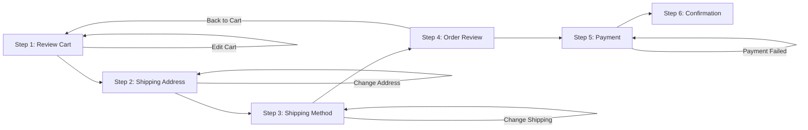

# Shopping and Checkout System Requirements

## Executive Overview

The shopping and checkout system is the core commerce engine of the e-commerce shopping mall platform. It enables customers to add products to their cart, manage their selections, proceed through a structured checkout process, and complete purchases with payment processing. This system must provide a seamless experience while maintaining inventory accuracy, calculating costs correctly, and integrating securely with payment processors.

The system serves as the bridge between product discovery and order fulfillment, requiring careful coordination with inventory management, product catalog, customer accounts, and payment processing systems.

---

## 1. Shopping Cart System

### 1.1 Cart Overview

THE shopping cart system SHALL maintain a list of products selected by customers for potential purchase, including quantities, product variants, and real-time pricing information.

### 1.2 Cart Data Structure

THE shopping cart SHALL maintain the following information for each active cart:

**Cart-Level Information**:
- Unique cart identifier (UUID or similar)
- Associated customer ID (linked to authenticated user account)
- Cart creation timestamp
- Last modified timestamp
- Cart status (ACTIVE, ABANDONED, CONVERTED_TO_ORDER)

**Cart Item Information** (for each product in cart):
- Product ID and product name
- Selected SKU variant identifier (specific color, size, option combination)
- Product variant description (e.g., "Red, Size Large, Standard Width")
- Unit price at time of addition (displayed to customer)
- Quantity requested by customer (integer ≥ 1)
- Line item subtotal (quantity × unit price)
- Product availability status (IN_STOCK, LOW_STOCK, OUT_OF_STOCK)
- Associated seller ID
- Inventory reservation ID (link to reserved inventory, if reserved)

**Cart Totals**:
- Subtotal (sum of all line item subtotals before taxes, shipping, discounts)
- Applied discount amount (if any promo code applied)
- Subtotal after discount
- Estimated shipping cost (if address entered)
- Estimated tax amount (if address entered)
- Grand total (all-inclusive, ready for payment)

### 1.3 Adding Items to Cart

WHEN a customer clicks "Add to Cart" on a product detail page, THE system SHALL execute the following sequence:

**Validation Phase**:
1. THE system SHALL verify the product exists and is published (status = ACTIVE)
2. THE system SHALL verify the product is not discontinued or archived
3. IF the product has required variant options (e.g., color, size), THE system SHALL check that customer has selected all mandatory options
   - IF any mandatory variant is unselected, THE system SHALL display error message: "Please select [variant name] before adding to cart"
   - THE system SHALL prevent addition until all mandatory variants are selected
4. THE system SHALL verify the requested quantity is a positive integer (≥1)
5. THE system SHALL check current inventory for the specific SKU (product + selected variant combination)

**Inventory Check**:
6. THE system SHALL query current available inventory for the selected SKU
   - Available inventory = (Total stock) - (Already reserved quantity) - (Sold quantity)
7. IF available inventory is less than requested quantity, THE system SHALL:
   - Display error message: "[Product name] has [available quantity] units available, not [requested quantity]"
   - Show current available quantity to customer
   - Allow customer to adjust quantity down or abandon the addition
   - Block addition of the item to cart
8. IF available inventory meets or exceeds requested quantity, THE system SHALL proceed to Addition Phase

**Addition Phase**:
9. THE system SHALL check if this product variant (same SKU) already exists in the customer's current cart
   - IF SKU already in cart, THE system SHALL:
     - Increase the quantity of existing cart item
     - Recalculate line subtotal
     - Validate that new total quantity still has sufficient inventory
     - IF insufficient inventory, THE system SHALL reduce quantity to maximum available and notify customer
   - IF SKU not in cart, THE system SHALL create new cart line item with specified quantity
10. THE system SHALL fetch current pricing for the selected SKU (to account for any price changes since product was viewed)
11. THE system SHALL record the cart addition timestamp
12. THE system SHALL update cart "last modified" timestamp
13. THE system SHALL display success message: "[Product name] added to cart" with:
    - Unit price
    - Quantity added
    - Updated cart item count in navigation bar
    - Link to view cart or continue shopping

**Cart Persistence**:
14. THE system SHALL immediately persist the updated cart to the database
15. THE system SHALL make cart visible in customer's navigation (show item count badge)

### 1.4 Updating Cart Item Quantities

WHEN a customer changes the quantity of an item in their cart, THE system SHALL:

**Quantity Update Validation**:
1. THE system SHALL accept the new quantity as a positive integer
2. IF new quantity is 0, THE system SHALL interpret as item removal request (see section 1.5)
3. THE system SHALL check current available inventory for the item's SKU
4. IF new quantity exceeds available inventory, THE system SHALL:
   - Display error message: "Only [available quantity] units of [product name] are available"
   - Show maximum available quantity
   - Prevent the quantity increase
   - Suggest reducing quantity to maximum available
5. IF new quantity is valid, THE system SHALL proceed with update

**Quantity Update Execution**:
6. THE system SHALL update the cart item's quantity to the new value
7. THE system SHALL immediately recalculate line item subtotal (quantity × unit price)
8. THE system SHALL recalculate cart subtotal (sum of all line item subtotals)
9. THE system SHALL update all displayed totals
10. THE system SHALL update cart "last modified" timestamp
11. THE system SHALL display confirmation: "Quantity updated for [product name]"
12. THE system SHALL persist updated cart to database immediately

**Pricing Consistency**:
13. THE system SHALL use the existing unit price stored with the cart item (not query current price)
14. REASON: Customer price should be locked when item added to cart, not change if seller updates price

### 1.5 Removing Items from Cart

WHEN a customer clicks remove button on a cart item, THE system SHALL:

**Removal Confirmation**:
1. THE system SHALL display confirmation dialog: "Remove [product name] from cart?"
2. THE system SHALL show the product and quantity being removed
3. UNLESS customer explicitly confirms removal, THE system SHALL not proceed

**Removal Execution**:
4. WHEN customer confirms removal, THE system SHALL delete the entire cart line item
5. THE system SHALL not create a partial removal (all quantities removed at once)
6. THE system SHALL immediately recalculate cart subtotal
7. THE system SHALL update all displayed totals and prices
8. THE system SHALL update cart item count in navigation
9. THE system SHALL update cart "last modified" timestamp
10. THE system SHALL display success message: "[Product name] removed from cart"

**Cart Cleanup**:
11. IF cart now contains zero items, THE system SHALL not display checkout button
12. THE system SHALL display message: "Your cart is empty. Continue shopping?"
13. THE system SHALL persist updated cart to database

**Clear Entire Cart**:
14. THE system SHALL provide "Clear Cart" button for customers to remove all items at once
15. WHEN customer clicks "Clear Cart", THE system SHALL display warning: "This will remove all [X] items from your cart. Continue?"
16. IF customer confirms, THE system SHALL delete all cart items simultaneously
17. THE system SHALL display: "Your cart has been cleared"

### 1.6 Cart Item Validation Before Checkout

WHEN a customer initiates checkout (clicks "Proceed to Checkout"), THE system SHALL validate the cart state:

**Pre-Checkout Validation Steps**:
1. THE system SHALL verify that cart is not empty
   - IF cart contains zero items, THE system SHALL display error: "Your cart is empty. Add items before checking out"
   - THE system SHALL prevent checkout
2. FOR each item in cart, THE system SHALL:
   - Re-check current availability status in product catalog
   - IF product is no longer published (unpublished by seller), THE system SHALL:
     - Display error: "[Product name] is no longer available and has been removed from your cart"
     - Remove the item from cart
     - Stop checkout until issue is resolved
   - IF seller of product has been suspended, THE system SHALL:
     - Display error: "Products from [seller name] are no longer available"
     - Remove all items from that seller from cart
   - Verify current inventory levels
   - IF ordered quantity exceeds current available inventory, THE system SHALL:
     - Display error: "[Product name] has only [available quantity] available, not [ordered quantity]"
     - Suggest reducing quantity or removing item
     - Prevent checkout
3. THE system SHALL re-validate all prices
   - IF product price has increased by >10% since added to cart, THE system SHALL:
     - Display notice: "[Product name] price has increased from [old price] to [new price]. Do you want to continue?"
     - Allow customer to accept new price or modify cart
   - IF product price has decreased, THE system SHALL silently update to lower price (benefit customer)
4. THE system SHALL verify customer is authenticated and has verified email address
   - IF not authenticated, THE system SHALL redirect to login/registration
   - IF email not verified, THE system SHALL require email verification before checkout

**Checkout Readiness**:
5. IF all validations pass, THE system SHALL allow checkout to proceed
6. THE system SHALL proceed to Step 1: Review Cart (see section 2.1)

### 1.7 Cart Persistence and Multi-Session Support

THE shopping cart system SHALL persist carts server-side linked to customer accounts:

**Cart Storage**:
- THE system SHALL store each customer's cart in the database, linked to customer account
- THE system SHALL NOT rely on browser cookies or local storage for cart persistence
- REASON: Ensures cart survives browser closures, device changes, and technical issues

**Cart Retrieval on Login**:
WHEN a customer logs into their account:
1. THE system SHALL query the database for any existing active cart (status = ACTIVE)
2. THE system SHALL retrieve and load the customer's cart from most recent session
3. THE system SHALL validate all items in loaded cart (verify products still exist, prices haven't drastically changed)
4. THE system SHALL display the loaded cart to customer
5. THE system SHALL preserve item quantities and variant selections from previous session exactly
6. THE system SHALL update "last accessed" timestamp

**Merging Carts from Multiple Sessions**:
IF a customer added items to a guest/anonymous cart, then logs in:
1. THE system SHALL identify if guest cart items exist (stored by session ID)
2. THE system SHALL identify if logged-in cart exists (stored by customer account)
3. THE system SHALL merge both carts:
   - FOR each item in guest cart, add to logged-in cart
   - IF same SKU exists in both carts, combine quantities
   - Guest cart items are added, not replaced
4. THE system SHALL delete guest cart after merge
5. THE system SHALL display confirmation: "We've added items from your previous visit to your cart"

**Cart Timeout and Abandonment**:
WHEN a cart remains inactive (not modified) for 30 days:
1. THE system SHALL mark cart as ABANDONED status
2. THE system SHALL preserve all cart contents (don't delete)
3. THE system SHALL release inventory reservations (if any were made) - items become available for other customers
4. THE system SHALL send abandoned cart email reminder:
   - Subject: "Don't forget your items in [store name]"
   - Include cart items with photos and prices
   - Include link to resume shopping from saved cart
   - Include discount code (optional) to incentivize completion
   - Send 24 hours after abandonment
5. IF customer returns within 7 days, THE system SHALL re-activate the ABANDONED cart
6. IF customer does not return within 30 days of abandonment notification, THE system MAY delete the abandoned cart

### 1.8 Multi-Seller Cart Management

WHEN a customer's cart contains items from multiple sellers:

**Multi-Seller Display**:
1. THE system SHALL display cart items organized by seller
   - GROUP items by seller name
   - Show seller information (name, rating, store link)
   - Display items under each seller grouping
2. THE system SHALL allow customers to remove items by seller (optional feature for future)

**Multi-Seller Checkout**:
3. THE system SHALL process single customer checkout for all items
4. THE system SHALL collect single shipping address
5. THE system SHALL process single payment transaction
6. AFTER payment succeeds, THE system SHALL create separate fulfillment orders for each seller
   - Each seller receives their items as separate fulfillment order
   - Each seller fulfills and ships independently
7. THE system SHALL display: "Your order contains items from [X] sellers. Each will ship separately."
8. Customer receives single order confirmation, but items may arrive in multiple shipments

---

## 2. Wishlist Functionality

### 2.1 Creating and Managing Wishlists

WHEN a customer clicks "Add to Wishlist" on a product detail page:
1. THE system SHALL create or update the customer's wishlist
2. THE system SHALL add the product to the wishlist with current timestamp
3. THE system SHALL allow customer to optionally select a specific SKU variant to save
4. THE system SHALL allow customers to add the same product multiple times with different variant selections
5. THE system SHALL provide confirmation: "[Product name] added to wishlist"
6. THE system SHALL display heart icon as filled/highlighted to show product is wishlisted

**Viewing Wishlist**:
WHEN a customer accesses their wishlist:
1. THE system SHALL display all wishlisted items in a dedicated page
2. FOR each item, THE system SHALL show:
   - Product image
   - Product name
   - Current price (updated from current product pricing, not wishlisted price)
   - "Move to Cart" button
   - "Remove from Wishlist" button
   - If variant selected, the specific variant
   - Product rating and number of reviews
3. THE system SHALL allow sorting by:
   - Date added (newest/oldest)
   - Price (low/high)
   - Product rating
4. THE system SHALL display number of items in wishlist
5. THE system SHALL show if items are in stock or out of stock

**Managing Wishlists**:
6. THE system SHALL allow customers to remove items from wishlist by clicking remove button
   - Display confirmation: "Remove [product name] from wishlist?"
   - Upon confirmation, remove item immediately
   - Update wishlist count
7. THE system SHALL allow customers to move items directly from wishlist to shopping cart
   - Click "Move to Cart" button
   - Add item to cart with selected variant (if specified)
   - Follow standard cart addition rules (verify inventory, pricing)
   - Optionally remove from wishlist after moving (customer choice)
   - Display confirmation: "[Product name] added to cart"

### 2.2 Wishlist Pricing and Availability Updates

WHEN a customer views their wishlist:
1. THE system SHALL display current product prices (not the price when wishlisted)
2. REASON: Show customer current pricing to help purchasing decision
3. WHEN price changes significantly (>10% change), THE system SHALL highlight the product:
   - If price DECREASED, show in green with "Price Down" badge
   - If price INCREASED by >10%, show in yellow with "Price Up" badge
4. THE system SHALL display current availability status:
   - Green badge if in stock
   - Yellow badge if low stock
   - Red badge if out of stock

**Price Drop Notifications**:
5. THE system SHALL optionally send notifications when wishlist item prices drop
6. WHEN customer enables "Notify when price drops" for a wishlist item:
   - THE system SHALL track the current price
   - WHEN price drops by ≥10%, THE system SHALL:
     - Send email notification: "[Product name] price dropped to [new price]"
     - Include link to product page
     - Include link to "Move to Cart"
   - THE system SHALL limit notifications (max 1 per product per week) to avoid spam

---

## 3. Checkout Process Flow

### 3.1 Checkout Overview and Steps

THE checkout process SHALL be a guided, multi-step flow that directs customers from cart review through order confirmation. The process prevents customers from proceeding until all required information is provided.

**Checkout Steps** (in sequential order):



**Flow Characteristics**:
- Linear progression (can't skip steps)
- Allow backward navigation to previous steps
- Allow returning to shopping
- Prevent proceeding without completing current step
- Timeout session after 30 minutes of inactivity
- Save progress periodically (auto-save)

### 3.2 Step 1: Review Cart

WHEN a customer arrives at the review cart step:
1. THE system SHALL display all items in their shopping cart with:
   - Product image (thumbnail)
   - Product name and description
   - Selected variant details (color, size, etc.)
   - Unit price
   - Quantity
   - Line item subtotal
   - Remove item button
   - Update quantity controls
2. THE system SHALL display cart-level totals:
   - Subtotal (sum of all line items, before taxes/shipping/discounts)
   - Applied discounts (if any)
   - Subtotal after discounts
   - Estimated shipping (if address entered) or "Shipping calculated at next step"
   - Estimated tax (if address entered) or "Tax calculated at next step"
   - Grand total (all inclusive)
3. THE system SHALL allow customer to:
   - Modify quantities of items
   - Remove items from cart
   - Continue shopping (return to product pages)
   - Proceed to next step (shipping address selection)
4. WHEN customer modifies cart at this step:
   - Apply changes immediately
   - Recalculate totals
   - Show success message for change
   - BUT do not exit checkout - allow continuing to next step

### 3.3 Step 2: Shipping Address Selection

WHEN a customer reaches the shipping address step:
1. THE system SHALL display a list of customer's saved addresses (if any exist)
2. FOR each saved address, THE system SHALL show:
   - Full address formatted clearly
   - City, State, Postal Code on separate line for scannability
   - Label/nickname (if saved)
   - Radio button to select this address
3. THE system SHALL include "Use a different address" option for one-time checkout address
4. THE system SHALL allow customer to select an existing saved address OR enter new address

**Using Existing Address**:
5. WHEN customer selects a saved address:
   - Highlight as selected
   - Enable "Continue" button
   - Allow proceeding to next step

**Entering New Address**:
6. WHEN customer selects "Use a different address":
   - Display address entry form with fields:
     - Full name of recipient (required)
     - Street address line 1 (required)
     - Street address line 2 (optional, apartment/suite number)
     - City (required)
     - State/Province (required)
     - Country (required dropdown)
     - Postal/ZIP code (required)
     - Phone number (required)
   - Include helpful labels and examples
   - Provide "Save this address for future orders" checkbox
7. WHEN customer enters address and clicks "Save & Continue":
   - THE system SHALL validate all required fields are filled
   - THE system SHALL validate address format (postal code format matches country, etc.)
   - IF validation fails, THE system SHALL display specific field errors in red
   - IF validation passes, THE system SHALL proceed to Step 3: Shipping Method

**Address Validation**:
8. THE system SHALL validate:
   - All required fields populated (no empty values)
   - Postal code matches country format (US: 5 digits or 5+4 format; UK: valid postcode format)
   - Street address contains numbers and text (not just numbers or just letters)
   - Phone number is valid format for country
   - Address is in a country/region supported by seller

**Save Address Option**:
9. IF customer checks "Save this address", THE system SHALL:
   - Store address in customer's saved address list after order is placed
   - Make available for future checkouts
   - Allow nickname/label for easy identification
   - Limit to 20 saved addresses per customer (older addresses deleted if limit exceeded)

### 3.4 Step 3: Shipping Method Selection

WHEN a customer selects a shipping address and reaches the shipping method step:
1. THE system SHALL contact shipping providers (UPS, FedEx, USPS, etc.) for rate quotes
2. THE system SHALL calculate available shipping methods and costs based on:
   - Destination address
   - Total order weight (sum of all product weights)
   - Order dimensions
   - Selected items' origins (if multi-seller, from each seller's location)
3. THE system SHALL retrieve estimated delivery dates from carrier information

**Displaying Shipping Options**:
4. THE system SHALL display available shipping methods in order of speed/cost:

```
[ ] Standard Shipping - $6.99 - Delivery within 5-10 business days
    Estimated delivery: Friday, January 20

[ ] Express Shipping - $14.99 - Delivery within 2-3 business days
    Estimated delivery: Wednesday, January 18

[ ] Overnight Shipping - $24.99 - Delivery within 1 business day
    Estimated delivery: Tuesday, January 17

[ ] Local Pickup - Free - Pick up tomorrow at 123 Main St
    Available pickup time: 10am - 6pm
```

5. FOR each shipping method, THE system SHALL display:
   - Method name and description
   - Cost ($X.XX format)
   - Estimated delivery date range
   - Carrier name (if applicable)
   - Expected delivery date (human-readable: "Friday, January 20" rather than "2024-01-20")

**Shipping Cost Calculation**:
6. THE shipping cost displayed SHALL be the final cost charged to customer (no hidden fees added later)
7. THE system SHALL calculate shipping cost using:
   - Base rate for selected shipping method
   - Weight-based surcharges (if applicable, e.g., $2 extra per pound over 50 lbs)
   - Zone-based surcharges (e.g., remote areas, island delivery)
   - Free shipping threshold (if applicable, e.g., free standard shipping over $50)
   - Applied discounts (if free shipping promotional code applied)
8. THE system SHALL NOT add additional shipping fees after order placement

**Selecting Shipping Method**:
9. WHEN customer selects a shipping method:
   - Highlight as selected
   - Update order total to reflect shipping cost
   - Display confirmation of selection
   - Enable "Continue to Review" button
10. WHEN customer clicks "Continue to Review":
    - Lock in the selected shipping method and cost
    - Move to Step 4: Order Review

**Unavailable Shipping**:
11. IF shipping is unavailable to the destination address:
    - THE system SHALL disable unavailable methods (grayed out)
    - PROVIDE explanation: "[Carrier name] does not ship to [address]"
    - Show available alternatives
    - REQUIRE customer to select available method before continuing

### 3.5 Step 4: Order Review

WHEN a customer reaches the order review step before payment:
1. THE system SHALL display complete order summary:

```
ORDER SUMMARY
═════════════════════════════════════════════════════════

ITEMS (from [X] sellers):
  1. Wireless Bluetooth Headphones (Black, Large)
     Qty: 1 × $79.99 = $79.99
     Seller: TechStore Plus (Rating: 4.8★)
  
  2. USB-C Cable 2-Pack (White)
     Qty: 1 × $12.99 = $12.99
     Seller: Electronic Accessories Co (Rating: 4.5★)

SUBTOTAL:                        $92.98
Promo Code Applied (SAVE10):    -$9.30
Subtotal after discount:        $83.68

SHIPPING (Standard):             $6.99
ESTIMATED TAX:                   $7.25
═════════════════════════════════════════════════════════
TOTAL DUE:                       $97.92

DELIVERY ADDRESS:
John Smith
123 Main Street, Apt 4B
Springfield, IL 62701
Phone: (217) 555-0123

ESTIMATED DELIVERY: Friday, January 20, 2024
```

2. THE system SHALL display order breakdown showing:
   - All items with quantities, prices
   - Subtotal (sum of items)
   - Applied discounts with description and amount
   - Subtotal after discounts
   - Shipping method and cost
   - Tax calculation and amount
   - **Grand total (all-inclusive)**
   - Delivery address (in readable format, partially masked for privacy if needed)
   - Estimated delivery date/date range
   - Shipping carrier and estimated delivery window

3. THE system SHALL allow customer to:
   - Review all details before committing payment
   - Click "Back" to modify items, address, or shipping method
   - Click "Proceed to Payment" to continue to payment step

**Final Validation Before Payment**:
4. WHEN customer clicks "Proceed to Payment":
   - THE system SHALL verify all items still have available inventory
   - THE system SHALL re-validate shipping address (still valid)
   - THE system SHALL recalculate totals (in case prices changed)
   - IF any items are no longer available, THE system SHALL:
     - Display error message
     - Allow adjusting quantities or removing items
     - Recalculate totals
     - Prevent payment until resolved
   - IF all validations pass, THE system SHALL proceed to Step 5: Payment

### 3.6 Step 5: Payment Processing

WHEN a customer reaches the payment step:
1. THE system SHALL display:
   - Order total amount (prominently displayed)
   - Currency (USD, EUR, etc.)
   - Payment method selection options
   - Message assuring security ("Your payment is secure" with security badge)

**Payment Method Selection**:
2. THE system SHALL display available payment methods:
   - Credit cards (Visa, Mastercard, American Express)
   - Debit cards
   - Digital wallets (Apple Pay, Google Pay, PayPal)
   - Bank transfer (if applicable to region)

3. WHEN customer has saved payment methods, THE system SHALL:
   - Display saved payment methods (card ending in ****1234, etc.)
   - Show default payment method as pre-selected
   - Allow selecting different saved payment method
   - Allow entering new payment method

4. WHEN customer selects saved payment method:
   - Use tokenized reference (never store full card number)
   - FOR security, may require CVC/CVV re-entry for saved cards
   - Proceed to payment authorization

**Entering New Payment Method**:
5. WHEN customer enters new payment method:
   - FOR credit/debit cards:
     - Card number (16 digits, formatted with spaces)
     - Cardholder name
     - Expiration date (MM/YY format)
     - CVV/CVC security code (3-4 digits)
   - THE system SHALL validate:
     - Card number using Luhn algorithm (catches typos)
     - Expiration date is not in past
     - CVV is 3-4 digits
   - THE system SHALL NOT store full card data locally
   - THE system SHALL use payment processor's secure form/tokenization

**Save Payment Method**:
6. THE system SHALL provide checkbox: "Save this card for future orders"
7. IF checked, THE system SHALL:
   - Store payment method as tokenized reference
   - Display as saved option on future checkouts
   - Allow removing saved payment methods from account settings

**Payment Authorization**:
8. WHEN customer clicks "Complete Purchase":
   - THE system SHALL send payment request to payment processor
   - THE system SHALL include:
     - Order amount and currency
     - Customer information (name, email)
     - Billing address (if required by card issuer)
     - Shipping address
     - Order ID
     - Payment method token/reference
   - THE system SHALL wait for authorization response (typically 2-5 seconds)

**Payment Authorization Responses**:

**Success**: THE system SHALL:
1. Receive authorization code from payment processor
2. Record transaction ID and authorization code
3. Create order in database with status "Payment Confirmed"
4. Reserve/lock inventory quantities
5. Clear shopping cart
6. Move to Step 6: Confirmation

**Failure**: THE system SHALL:
1. Display specific error message:
   - "Your card was declined. Please try another payment method."
   - "Insufficient funds. Please verify your card details."
   - "This card has expired. Please use a valid card."
   - "The security code you entered is invalid."
2. Display support contact: "Contact your bank or try a different card"
3. Preserve cart and checkout progress
4. Allow customer to retry with same or different payment method
5. Do NOT charge customer for failed attempts
6. After 5 consecutive failed attempts, temporarily lock the account (require support contact)

**Processing Errors**:
7. IF payment processor is unreachable:
   - Display error: "Payment processing unavailable. Please try again in a few moments."
   - Queue the payment for automatic retry
   - Attempt automatic retry for up to 24 hours
   - Send customer update email when payment eventually processes
   - Do NOT charge for failed retry attempts

### 3.7 Step 6: Order Confirmation

WHEN payment is successfully authorized:
1. THE system SHALL generate a unique order ID (e.g., "ORDER-20240118-00512")
2. THE system SHALL display immediate confirmation page showing:

```
✓ ORDER CONFIRMED

ORDER NUMBER: ORDER-20240118-00512
Order Date: January 18, 2024 at 2:45 PM

Thank you for your purchase! Your order is being prepared.

NEXT STEPS:
1. Look for order confirmation email (check spam folder)
2. Track your order: [Track Order Button]
3. View order details: [View Details Button]

ITEMS ORDERED:
- Wireless Bluetooth Headphones (Black, Large) × 1  $79.99
- USB-C Cable 2-Pack (White) × 1                    $12.99

DELIVERY ADDRESS:
John Smith
123 Main Street, Apt 4B
Springfield, IL 62701

ESTIMATED DELIVERY: Friday, January 20, 2024

TOTAL PAID: $97.92
```

3. THE system SHALL send order confirmation email within 30 seconds containing:
   - Order number
   - Order date and time
   - Itemized list (product name, quantity, price per item, line total)
   - Subtotal, discount, shipping, tax, and total amount
   - Delivery address
   - Estimated delivery date
   - Tracking information (when available)
   - Link to track order
   - Customer service contact information
   - Return policy information

4. THE system SHALL notify seller(s) that order was placed:
   - FOR each seller whose products are in order:
     - Send order notification to seller email
     - Display in seller dashboard
     - Include items to fulfill, customer address, requested delivery date

5. THE system SHALL clear the customer's shopping cart:
   - Remove all items that were just ordered
   - Cart becomes empty and ready for future shopping

6. THE system SHALL allow customer to:
   - Download order confirmation (PDF receipt)
   - Track order status
   - Return to shopping
   - View order details
   - Contact support if issues

---

## 4. Tax Calculations

### 4.1 Tax Calculation Requirements

WHEN a customer enters a shipping address during checkout, THE system SHALL calculate applicable sales tax:

**Tax Jurisdiction Determination**:
1. THE system SHALL identify the tax jurisdiction based on:
   - Customer's shipping address (country and state/province)
   - NOT customer's billing address (shipping destination determines tax)
2. THE system SHALL look up the applicable tax rate for that jurisdiction

**Tax Rate Lookup**:
3. THE system SHALL maintain a database of tax rates by jurisdiction:
   - US states (e.g., California: 7.25%, Texas: 6.25%)
   - Canadian provinces (e.g., Ontario: 13% HST, Alberta: 5% GST)
   - EU countries (where applicable)
   - Other international jurisdictions
4. THE system SHALL update tax rates when jurisdictions change their rates (quarterly minimum)

**Tax Calculation Logic**:
5. THE system SHALL calculate tax as:
   ```
   Taxable Amount = (Subtotal + Shipping Cost)
   Tax Amount = Taxable Amount × Tax Rate
   Tax Amount = rounded to 2 decimal places
   ```
6. Example:
   ```
   Subtotal:          $92.98
   Shipping:          $ 6.99
   Taxable Amount:   $99.97
   Tax Rate:         8.625% (California)
   Tax Amount:       $8.62
   Total:           $108.59
   ```

7. THE system SHALL include tax in the displayed grand total on the order review page
8. THE system SHALL display tax amount separately so customer sees tax calculation

**Tax Recalculation on Address Change**:
9. IF customer changes shipping address during checkout:
   - THE system SHALL immediately recalculate tax for new jurisdiction
   - THE system SHALL update displayed total
   - THE system SHALL show new tax amount
   - THE system SHALL confirm customer accepts new total before proceeding

### 4.2 Tax Exemptions

WHEN a customer qualifies for tax exemption (with proper documentation):
1. THE system SHALL allow admin to mark customer account as "tax-exempt"
2. WHEN tax-exempt customer checks out:
   - THE system SHALL skip tax calculation
   - THE system SHALL display: "Tax Amount: $0.00 (Tax-exempt account)"
   - THE system SHALL calculate total without tax
3. THE system SHALL maintain audit trail of tax exemptions:
   - Date exemption granted
   - Admin who granted exemption
   - Exemption document reference
   - Date exemption was revoked (if applicable)

### 4.3 Supported Tax Jurisdictions

THE system SHALL calculate and collect taxes for:
- **United States**: All 50 states plus Washington D.C.
- **Canada**: All 13 provinces and territories
- **Other regions**: Configurable by admin to support additional jurisdictions

THE system SHALL not calculate tax for regions/countries where tax is not applicable (e.g., some countries use VAT instead of sales tax).

---

## 5. Discount and Promotion System

### 5.1 Discount Types

THE platform SHALL support these discount mechanisms:

**Percentage-Based Discounts**:
- Apply percentage reduction to order total
- Example: "10% off" applies 10% reduction to subtotal
- Formula: `Discount Amount = Subtotal × Percentage / 100`

**Fixed Amount Discounts**:
- Apply fixed dollar amount reduction
- Example: "$10 off" reduces total by exactly $10
- Limited by: Discount cannot exceed order subtotal (minimum $0 total after discount)

**Free Shipping Promotions**:
- Waive shipping cost completely
- Example: "Free shipping on orders over $50"
- Formula: `Shipping Cost = $0.00`

**Buy One Get One (BOGO)**:
- Purchase one item, get another item at discount
- Example: "Buy one, get second 50% off"
- Application: Discount applied to lower-priced item automatically

**Category-Specific Discounts**:
- Apply discount only to items in specific category
- Example: "15% off electronics"
- Application: Only items from "Electronics" category get discount

**Minimum Purchase Requirements**:
- Discount only valid if order total meets minimum
- Example: "20% off orders over $100"
- Example: "Free shipping on orders over $50"

**New Customer Discounts**:
- Discount applicable only to new customers' first order
- Example: "New customers: 15% off first order"
- Tracking: THE system tracks whether customer placed order before

**Seller-Specific Discounts**:
- Discount applicable only to products from specific seller
- Example: "10% off TechStore Plus products"
- THE seller controls this promotion in their dashboard

### 5.2 Promo Code Entry and Validation

WHEN a customer has a promotional code, THE system SHALL provide entry mechanism:

**Promo Code Field Placement**:
1. THE system SHALL display promo code entry field:
   - On order review page (Step 4) - most common location
   - During checkout (Step 1) - alternative location
2. THE system SHALL display label: "Have a promo code? Enter it here"
3. THE system SHALL provide input field with placeholder: "Promo code"
4. THE system SHALL provide "Apply Code" button
5. THE system SHALL provide "Remove Code" button (if code already applied)

**Promo Code Format**:
6. THE system SHALL accept promo codes as:
   - Alphanumeric strings (letters and numbers)
   - Case-insensitive (SAVE10 = save10 = SaVe10)
   - Up to 20 characters
7. THE system SHALL trim whitespace (remove leading/trailing spaces)
8. THE system SHALL validate code format before checking validity

**Promo Code Validation Process**:

WHEN customer clicks "Apply Code":
1. THE system SHALL validate code format (alphanumeric, reasonable length)
2. THE system SHALL look up code in promotional codes database
3. THE system SHALL verify:
   - Code exists in system
   - Code has not expired (current date/time is before expiration date)
   - Code has remaining uses (not all uses exhausted)
   - Code is not yet active (current date/time is at/after start date)
4. THE system SHALL verify customer eligibility:
   - IF code requires new customer: verify customer has no prior orders
   - IF code is seller-specific: verify customer has items from that seller
   - IF code is category-specific: verify customer has items from that category
   - IF code has minimum purchase: verify current subtotal meets minimum
5. THE system SHALL verify order eligibility:
   - All items in cart are eligible for this promotion
   - No conflicting promotions already applied

**Valid Code - Apply Discount**:
6. IF all validations pass:
   - THE system SHALL calculate discount amount
   - THE system SHALL display discount description: "Promo code SAVE10 applied"
   - THE system SHALL show discount amount: "-$X.XX"
   - THE system SHALL subtract discount from subtotal
   - THE system SHALL update displayed order total
   - THE system SHALL display message: "Promo code applied successfully!"
   - THE system SHALL display "[Discount description]: -$X.XX"

**Invalid Code - Error Messages**:
7. IF code doesn't exist:
   - Display error: "Promo code 'INVALID' not found"
8. IF code has expired:
   - Display error: "This promo code expired on [date]"
9. IF code has no remaining uses:
   - Display error: "This promo code has reached its usage limit"
10. IF code is not yet active:
    - Display error: "This promo code is not yet valid. It becomes active on [date]"
11. IF minimum purchase not met:
    - Display error: "This promo code requires a minimum order of $[amount]. Current order: $[current]"
12. IF customer ineligible:
    - Display error: "This promo code is for new customers only"
    - OR "This promo code is for [seller name] products only"
    - OR "This promo code is for [category name] products only"

**Removing Applied Code**:
13. WHEN customer clicks "Remove Code":
    - THE system SHALL remove discount
    - THE system SHALL recalculate subtotal (add discount back to total)
    - THE system SHALL update displayed total
    - THE system SHALL display: "Promo code removed"

### 5.3 Discount Application Rules

**Single Code Per Order**:
1. THE system SHALL allow only ONE promo code per order
2. WHEN customer attempts to apply second code:
   - Display error: "Only one promo code per order. Remove current code to try another"
3. REASON: Prevent code stacking and promotional abuse

**Discount Amount Limitations**:
4. THE discount amount SHALL NOT exceed the order subtotal
5. Example: If subtotal is $50 and code offers 50% off + $30 additional:
   - First discount: 50% = $25 off
   - Second discount: $30 off
   - Total would be $55 off, but subtotal is only $50
   - Discount capped at $50 (order total becomes $0, not negative)
6. THE system SHALL prevent orders with negative totals

**Discount Display**:
7. THE system SHALL display discount clearly as separate line item:
   ```
   Subtotal:              $92.98
   Promo Code (SAVE10):  -$9.30
   Subtotal after discount: $83.68
   ```
8. THE system SHALL not hide or minimize discount information

**Discount Compatibility**:
9. WHEN customer has items from multiple sellers:
   - Seller-specific discounts apply only to that seller's items
   - Platform-wide discounts apply to all items
   - Calculate correctly for multi-seller cart

**Discount Redemption**:
10. WHEN order with promo code is successfully placed:
    - THE system SHALL increment the promo code's "usage count"
    - IF code has usage limit, decrement remaining uses
    - IF remaining uses reaches zero, deactivate code automatically
    - Log the redemption with order ID for audit trail

---

## 6. Error Handling and Validation

### 6.1 Cart Errors

**Empty Cart Checkout Error**:
WHEN customer attempts to checkout with empty cart:
- Display error message: "Your cart is empty. Add items to your cart before checking out."
- Show "Continue Shopping" button
- Do not allow checkout

**Insufficient Inventory Error**:
WHEN customer attempts to add item with insufficient inventory:
- Display error: "[Product name] has only [available qty] available, not [requested qty]"
- Suggest maximum available quantity
- Show "Add [available qty] to cart" button for one-click adjustment
- Allow customer to accept lower quantity or abandon addition

**Out of Stock Notification**:
WHEN customer cart item becomes out of stock before checkout:
- Display warning banner: "[Product name] is now out of stock"
- Show "Remove from cart" button
- Show "Check back soon" button
- Prevent checkout until item removed

**Product No Longer Available Error**:
WHEN product is unpublished/archived before checkout:
- Display error: "[Product name] is no longer available"
- Show "Remove from cart" button
- Prevent checkout
- Suggest similar products

### 6.2 Address Validation Errors

**Missing Required Field Error**:
WHEN required address field is empty:
- Highlight field in red
- Display error message below field: "[Field name] is required"
- Example: "City is required"
- Prevent proceeding until all required fields filled

**Invalid Postal Code Error**:
WHEN postal code doesn't match country format:
- Display error: "Invalid postal code for [country]"
- Show expected format: "US ZIP codes must be 5 digits (e.g., 62701)"
- Highlight field in red
- Allow correction

**Invalid Phone Number Error**:
WHEN phone number is invalid format:
- Display error: "Please enter a valid phone number"
- Show format requirement: "US phone: (XXX) XXX-XXXX or XXX-XXX-XXXX"
- Allow re-entry

**Address Not Serviceable Error**:
WHEN address cannot be shipped to:
- Display error: "We cannot ship to this address at this time"
- Show "Try different address" option
- Suggest nearby serviceable locations if available
- Allow going back to address entry

### 6.3 Shipping Errors

**No Available Shipping Methods Error**:
WHEN no shipping methods available to destination:
- Display error: "We cannot ship to [address] at this time"
- Show "Use different address" button
- Provide explanation of shipping limitations (if applicable)

**Shipping Rate Error**:
WHEN shipping provider doesn't return rates:
- Display error: "Unable to calculate shipping costs. Please try again."
- Provide "Retry" button
- Show alternative shipping methods if available
- Contact support link

### 6.4 Payment Errors

**Card Declined Error**:
WHEN payment processor declines card:
- Display error: "Your card was declined. Please try another payment method."
- Provide possible reasons: "Card may be expired, flagged for suspicious activity, or have insufficient funds"
- Show "Try different card" option
- Allow updating payment method

**Invalid Card Information Error**:
WHEN card details are invalid:
- Display error: "The card information you entered is not valid"
- Show which field is problematic: "Invalid expiration date" or "Invalid CVV"
- Allow re-entry

**Payment Processor Timeout Error**:
WHEN payment processor doesn't respond:
- Display error: "Payment processing unavailable. Please try again in a few moments."
- Provide option to retry
- Queue for automatic retry
- Do NOT charge customer multiple times
- Send email when payment eventually succeeds/fails

**Duplicate Payment Prevention**:
WHEN customer submits payment form multiple times quickly:
- First submission processes normally
- Subsequent submissions are ignored
- Display message: "Your payment is being processed. Please wait..."
- Prevent button mashing/double-submission

### 6.5 Discount/Promotion Errors

**Invalid Promo Code Error** (covered in section 5.2):
- Display specific error message indicating why code is invalid
- Provide helpful guidance for customer action

**Expired Promo Code Error**:
- Display error: "This promo code expired on [date]"
- Do not apply discount
- Allow continuing without code

**Minimum Purchase Not Met Error**:
- Display error: "This promo code requires a minimum order of $[amount]"
- Show current order total: "Your current order total: $[amount]"
- Show how much more to spend: "Add $[difference] more to qualify"
- Allow proceeding without code or adding more items

### 6.6 Session Timeout Handling

WHEN customer's checkout session expires (after 30 minutes of inactivity):
1. THE system SHALL preserve all checkout progress
   - Save current cart state
   - Save entered addresses
   - Save selected shipping method
   - Do NOT save payment information (security)
2. THE system SHALL require re-authentication
3. WHEN customer logs back in:
   - THE system SHALL restore checkout to previous step
   - Display message: "Welcome back! Resuming your checkout..."
   - Show: "Your cart is saved. Please complete your order."
4. THE system SHALL verify inventory is still available
   - IF items now out of stock, notify customer and remove
   - IF prices changed significantly, notify customer
5. THE system SHALL NOT force re-entering address/shipping information (unless changed during timeout)

---

## 7. Business Rules and Constraints

### 7.1 General Constraints

- **Minimum order value**: No minimum (customers can order single items)
- **Maximum order value**: No maximum, but recommend warning for orders >$10,000
- **Cart item limits**: Maximum 100 different line items per cart (same SKU multiple times counts as one line)
- **Item quantity limits**: Each line item limited to 999 units per order (prevent bulk buying abuse)
- **Guest checkout**: Not supported - customer must be registered and authenticated
- **Email verification requirement**: Customer must have verified email before placing order

### 7.2 Pricing and Taxation

- **Price locking**: Product prices are locked when added to cart, not updated if seller changes prices later
- **Price change policy**: IF price increases >10%, notify customer but allow them to accept or adjust cart
- **Refund amounts**: Based on original price paid, plus refund of shipping/taxes if applicable
- **Tax jurisdiction**: Determined by shipping address, not billing or customer location
- **Tax recalculation**: Recalculate if shipping address changes during checkout
- **Tax refunds**: If order is refunded, refund amount includes taxes paid

### 7.3 Inventory Synchronization

- **Real-time inventory**: Inventory is checked immediately before allowing cart addition
- **Cart reservation**: Items in carts are NOT reserved; still available for other customers to buy
- **Order reservation**: Inventory IS reserved when order is created (payment confirmed)
- **Oversell prevention**: System will never commit to more units than available
- **Inventory restoration**: If order cancelled/refunded, inventory is restored immediately

### 7.4 Discount and Promotion Rules

- **One code per order**: Only single promo code allowed per checkout
- **Code stacking**: Promo codes cannot be combined with each other
- **Discount cannot exceed total**: Discount capped at order subtotal (no negative totals)
- **Discount applies to subtotal**: Discount applies before shipping and tax (not added on top of shipping/tax)
- **Code validation timing**: Code must be valid at order placement time; expiration after placement doesn't retroactively apply

### 7.5 Shipping Rules

- **Shipping locked in**: Once shipping method selected and confirmed, cost is locked
- **Address-based shipping**: Shipping methods/costs determined by destination address
- **No shipping changes**: Cannot change shipping method after payment (would require full order cancellation/reorder)
- **Free shipping eligibility**: Applies to all sellers if threshold met; not per-seller

### 7.6 Payment Rules

- **Payment authorization**: Payment must be successfully authorized before order is created
- **No order without payment**: Order is NOT created if payment fails
- **Token storage**: Payment methods stored as tokenized references, never full card data
- **Refund method**: Refunds always go back to original payment method used for purchase
- **Payment timeout**: Payment authorization request has 30-second timeout (fail if longer)

---

## 8. Integration with Related Systems

The Shopping and Checkout system integrates with:

**[User Actors and Authentication](./02-user-actors-and-authentication.md)**:
- Customer must be authenticated to proceed to checkout
- Email verification required before order placement
- Session management for checkout security

**[Customer Requirements](./03-customer-requirements.md)**:
- Customer account information used for checkout
- Saved addresses and payment methods from customer profile
- Order history integration after checkout completes

**[Product Catalog System](./06-product-catalog-system.md)**:
- Product information (name, description, images) displayed in cart
- SKU/variant information for cart line items
- Product availability status verified before checkout
- Pricing information from product catalog

**[Inventory Management](./09-inventory-management.md)**:
- Inventory levels checked before allowing cart additions
- Inventory checked before order confirmation
- Inventory reserved when order is placed
- Inventory restored if order cancelled

**[Order and Fulfillment](./08-order-and-fulfillment.md)**:
- Order created after successful payment
- Order details passed to fulfillment system
- Order status updates displayed to customer
- Order history accessible after checkout

**[Payment Gateway Integration](./11-platform-integration-and-operations.md)**:
- Payment processing through external payment processors
- Payment authorization and error handling
- PCI DSS compliance for payment security

**[Shipping Provider Integration](./11-platform-integration-and-operations.md)**:
- Shipping rate quotes during checkout
- Carrier selection and label generation
- Tracking number generation

---

## Summary

The Shopping and Checkout system provides a complete, secure, and user-friendly experience for customers to review their products, select delivery and shipping options, apply discounts, and complete payment. The system maintains inventory accuracy, calculates costs correctly including taxes and shipping, and integrates with payment processors and shipping carriers. Through clear validation, helpful error messages, and guided checkout flow, the system minimizes cart abandonment and maximizes order completion rates.

All requirements are specified in EARS format with concrete examples, specific error messages, and clear business rules. Developers can immediately implement these requirements with full understanding of expected behavior across all checkout scenarios.

---

> *Developer Note: This document defines **business requirements only**. All technical implementations (architecture, APIs, database design, etc.) are at the discretion of the development team.*