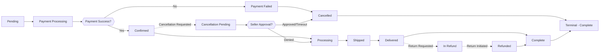

# Order and Fulfillment System Requirements

## 1. Order System Overview

The order and fulfillment system is the core transaction engine of the e-commerce shopping mall platform. It manages the complete lifecycle of customer purchases, from order creation through delivery, including cancellation and refund workflows. The system must handle multiple order states, coordinate between customers, sellers, and shipping providers, and maintain complete order history for all actors.

### Business Context

Orders represent the fundamental transaction unit in the platform. Each order contains one or more order items, where each item is a specific product variant (SKU) from a seller. Orders transition through multiple states based on customer actions, seller activities, and external shipping events. The system must coordinate inventory, payments, and fulfillment across these transitions while maintaining data consistency and providing visibility to all parties.

### Core Responsibilities

- Accept and validate orders from customers
- Reserve inventory at order placement
- Coordinate order fulfillment with sellers
- Integrate with shipping providers for delivery
- Provide order tracking and status updates
- Handle order cancellations and refund requests
- Maintain complete order history and audit trail
- Generate order-related notifications and analytics

---

## 2. Order Creation and Placement

### 2.1 Order Submission Requirements

**WHEN** a customer clicks the "Place Order" button in the checkout process, **THE system SHALL** validate the order submission and create a new order record in a "Pending" status.

**BEFORE** accepting an order, **THE system SHALL** perform the following validations in sequence:
1. Verify that the customer is authenticated and their session is valid
2. Validate that the shopping cart contains at least one item
3. Confirm that each item in the cart has sufficient inventory available (considering other pending orders)
4. Validate that the delivery address provided is complete and properly formatted
5. Validate that a shipping method has been selected
6. Verify that the payment method is valid and properly configured
7. Confirm that any promotional codes or discounts applied are still valid

**IF** any validation fails, **THEN THE system SHALL** reject the order and return a specific error message to the customer indicating which validation failed (e.g., "Insufficient inventory for item SKU-12345", "Delivery address is incomplete", "Payment method is invalid").

### 2.2 Order Data Capture

**THE system SHALL** capture and store the following information when an order is created:

**Order Metadata**:
- Unique order ID (generated by system)
- Order creation timestamp (date and time when order was placed)
- Customer ID who placed the order
- Order status (initially "Pending")
- Total order amount (sum of all item amounts)
- Tax amount calculated
- Discount amount applied
- Shipping cost
- Final amount to charge

**Delivery Information**:
- Delivery address (street, city, postal code, country)
- Delivery address name (who should receive the package)
- Delivery phone number for shipping coordination
- Special delivery instructions if provided by customer

**Order Items**:
- For each product in the order:
  - Product ID
  - Product variant ID (SKU)
  - Product name and description
  - Selected options (color, size, etc.)
  - Unit price at time of order
  - Quantity ordered
  - Subtotal for this item
  - Seller ID who provides this product
  - Inventory reservation ID (link to reserved stock)

**Payment Information**:
- Payment method used (credit card, debit card, digital wallet, etc.)
- Payment gateway transaction reference
- **Note**: Full payment details are not stored; only references are kept for security

**Shipping Information**:
- Selected shipping method (e.g., "Standard", "Express", "Overnight")
- Estimated delivery date based on shipping method
- Shipping carrier assignment (assigned after order confirmation)
- Tracking number (assigned after fulfillment)

### 2.3 Order Grouping by Seller

**THE system SHALL** automatically organize order items by seller. **IF** a single customer order contains products from multiple sellers, **THEN THE system SHALL** create separate fulfillment records for each seller, but maintain them as part of a single customer order.

**Example**: Customer places order with 3 items: 2 items from Seller A and 1 item from Seller B. The system creates:
- One customer-facing order containing all 3 items
- Two seller fulfillment records: one for Seller A with 2 items, one for Seller B with 1 item
- Each fulfillment record has its own status and shipping information

### 2.4 Order ID Generation and Uniqueness

**THE system SHALL** generate unique Order IDs that are:
- Numeric or alphanumeric (e.g., "ORD-2024-001234")
- Sequentially increasing for human-readability
- Globally unique across the entire platform
- Human-readable for customer reference and support
- Searchable without revealing system architecture

**WHEN** an order ID is generated, **THE system SHALL** ensure it has not been used previously and is unique in the database.

### 2.5 Order Submission Atomicity

**THE system SHALL** create orders atomically, ensuring that either:
1. The entire order is created successfully with all components (order header, items, inventory reservation, payment), OR
2. No part of the order is created if any component fails

**IF** order creation fails partway through (e.g., inventory reservation fails after payment is authorized), **THEN THE system SHALL**:
- Automatically rollback all changes
- Reverse the payment authorization
- Notify the customer with specific reason for failure
- Preserve customer's shopping cart
- Allow them to adjust and retry

---

## 3. Order Status Lifecycle and Transitions

### 3.1 Order Status States

**THE system SHALL** define and maintain the following order status states. Orders transition through these states in a defined workflow:

**The complete status definition is**:

| Status | Meaning | Transitions From | Transitions To | Customer Can Action |
|--------|---------|-----------------|----------------|-------------------|
| **Pending** | Order created, awaiting payment processing | (initial) | Payment Processing | View order |
| **Payment Processing** | Payment is being processed | Pending | Confirmed, Payment Failed | Cancel (before payment completes) |
| **Payment Failed** | Payment was declined or failed | Payment Processing | Cancelled | Retry payment, Contact support |
| **Confirmed** | Payment successful, order confirmed | Payment Processing | Processing, Cancellation Pending | Cancel, Request refund |
| **Processing** | Seller is preparing order for shipment | Confirmed | Shipped, Cancellation Pending | Cancel (if not yet shipped) |
| **Shipped** | Order has been handed to shipping carrier | Processing | Delivered, In Refund | Track shipment, Request return |
| **Delivered** | Order delivered to customer address | Shipped | In Refund, Complete | Request return, Leave review |
| **In Refund** | Customer initiated return/refund process | Shipped, Delivered | Refunded, Complete | View refund status |
| **Refunded** | Refund completed and payment reversed | In Refund | (terminal) | Leave review if applicable |
| **Complete** | Order completed successfully | Delivered | (terminal) | Leave review |
| **Cancellation Pending** | Customer requested cancellation, awaiting approval | Confirmed, Processing | Cancelled, Processing | View cancellation status |
| **Cancelled** | Order cancelled (by customer or system) | Pending, Payment Failed, Cancellation Pending | (terminal) | Contact support for assistance |

### 3.2 Status Transition Rules

**WHEN** an order is in "Confirmed" status and a seller has already shipped it, **THE system SHALL NOT** allow the customer to cancel the order. Instead, **THE system SHALL** direct the customer to request a return/refund.

**WHEN** a customer initiates an order cancellation while in "Confirmed" or "Processing" status, **THE system SHALL** move the order to "Cancellation Pending" status and notify the seller of the cancellation request within 2 minutes.

**IF** the seller confirms the cancellation within 24 hours, **THEN THE system SHALL** move the order to "Cancelled" status and restore inventory immediately.

**IF** the seller does not respond within 24 hours, **THEN THE system SHALL** automatically cancel the order and restore inventory, sending notification to the seller that auto-cancellation occurred.

**WHEN** a customer receives a delivered order and initiates a return request, **THE system SHALL** move the order to "In Refund" status and provide a return shipping label within 5 minutes.

**THE system SHALL NOT** transition an order to "Delivered" status until the shipping carrier confirms delivery through their tracking system.

**WHEN** an order is in "Processing" status for more than 3 business days without shipment, **THE system SHALL** send a notification to the seller and allow customer to request expedited shipment or cancellation.

### 3.3 Status Visibility and Notifications

**THE system SHALL** provide different status visibility to different actors:

**For Customers**: THE system SHALL display the order status prominently in their order history and detail pages, with descriptive language explaining what the status means and what action is expected next.

**For Sellers**: THE system SHALL display fulfillment status for their products, including the order details, shipping address, and requested delivery date.

**For Admin**: THE system SHALL provide a comprehensive view of all orders with status filtering, search, and analytics capabilities.

**WHEN** an order status changes, **THE system SHALL** update all related systems within 10 seconds (customer dashboard, seller dashboard, analytics, notifications).

---

## 4. Order Confirmation and Notifications

### 4.1 Payment Processing and Confirmation

**WHEN** an order transitions from "Pending" to "Payment Processing", **THE system SHALL** attempt to charge the customer's selected payment method through the integrated payment gateway within 5 seconds.

**THE system SHALL** send a "Payment Processing" notification to the customer stating that their payment is being processed and they will receive confirmation shortly.

**IF** the payment is successful, **THE system SHALL** immediately (within 2 seconds):
1. Move the order to "Confirmed" status
2. Lock the inventory reservation (prevents seller from reducing stock)
3. Send order confirmation email to customer with order number and summary
4. Send order notification to relevant seller(s) indicating their products have been ordered
5. Record the successful payment transaction with gateway reference ID
6. Update seller's pending order queue
7. Trigger order confirmation workflow

**IF** the payment fails, **THE system SHALL** (within 5 seconds):
1. Move the order to "Payment Failed" status
2. Release the inventory reservation back to available stock
3. Send payment failure notification to customer explaining the reason (e.g., "Card declined", "Insufficient funds")
4. Provide a link for customer to retry the payment or select a different payment method
5. Allow customer to retry within 24 hours; after that, the order is automatically cancelled
6. Preserve the shopping cart contents so customer can retry with same items

### 4.2 Order Confirmation Email

**WHEN** an order reaches "Confirmed" status, **THE system SHALL** immediately send an order confirmation email to the customer containing (within 5 seconds):

- Order number and order date
- List of items ordered with quantities, prices, and seller information
- Delivery address and estimated delivery date
- Total amount charged
- Payment method used (masked for security)
- Order tracking number (once assigned by seller)
- Link to track order status and download invoice
- Customer service contact information
- Company return policy and refund information
- Expected fulfillment timeline from seller

**THE system SHALL** send this email within 5 seconds of order confirmation. THE email must be localized to customer's language preference and include company branding.

### 4.3 Seller Order Notification

**WHEN** an order is confirmed and contains items from a seller, **THE system SHALL** send a notification to that seller containing (within 10 seconds):

- Order ID and order date
- Items they need to fulfill (with SKU, quantity, and variant details)
- Customer delivery address and requested delivery date
- Special delivery instructions (if any)
- Order total and seller's commission details
- Link to seller dashboard to view and manage the order
- Instruction to confirm receipt and provide estimated shipment date
- Link to print shipping label

**THE system SHALL** send this notification via email and system notification within 10 seconds of order confirmation. THE seller dashboard SHALL highlight new orders requiring action.

### 4.4 Order Status Update Notifications

**THE system SHALL** send customer notifications at the following key order transitions:

| Status Change | Notification Content | Delivery Method | Timing |
|---------------|---------------------|-----------------|--------|
| Payment Failed | Payment declined reason, retry link | Email + SMS (if enabled) | Immediate (<5 sec) |
| Confirmed | Full order confirmation with summary | Email | Within 5 seconds |
| Processing | Seller is preparing order | Email notification | When seller marks status |
| Shipped | Tracking number, carrier, estimated delivery | Email + SMS + Push | Within 1 minute of shipment |
| Delivered | Delivery confirmation, review prompt | Email + Push | Within 5 minutes of delivery |
| Cancelled | Cancellation confirmation, refund status | Email | Immediate |
| Refunded | Refund completed, amount and method | Email | Within 2 hours |

---

## 5. Inventory Reservation and Allocation

### 5.1 Reservation at Order Creation

**WHEN** an order is created, **THE system SHALL** immediately reserve inventory for each item in the order from the seller's available stock within 1 second.

**THE system SHALL** perform inventory checks using the following logic:
- For each order item, check the available inventory of that SKU
- Available inventory = (Total stock) - (Sold quantity) - (Quantity in pending reservations from other orders)
- **IF** available inventory is greater than or equal to the ordered quantity, **THEN THE system SHALL** create an inventory reservation record atomically
- **IF** available inventory is less than the ordered quantity, **THEN THE system SHALL** reject the entire order with message "Insufficient inventory for [product name]. Available: [X] units"

**THE system SHALL** not allow overselling under any circumstances. Inventory checks are performed with locking to prevent race conditions.

### 5.2 Reservation States

**THE system SHALL** track inventory reservations through the following states:

| Reservation State | Meaning | Duration | Next State |
|-------------------|---------|----------|-----------|
| **Active** | Inventory is reserved for this order | Until order ships or cancels | Confirmed, Released |
| **Confirmed** | Seller has confirmed they will fulfill | From seller confirmation | Fulfilled (when shipped) |
| **Released** | Inventory returned to available stock | When order cancelled | (terminal) |
| **Fulfilled** | Inventory marked as sold | When order shipped | (terminal) |

**WHEN** order payment completes successfully, **THE system SHALL** move reservation from "Active" to "Confirmed" state within 2 seconds.

**WHEN** an order is cancelled, **THE system SHALL** immediately release the inventory reservation and return quantity to available stock within 2 seconds.

**WHEN** an order is shipped, **THE system SHALL** move reservation to "Fulfilled" and permanently reduce the seller's inventory within 2 seconds.

### 5.3 Inventory Locking During Processing

**WHEN** an order is in "Confirmed" or "Processing" status, **THE system SHALL** lock the inventory reservation so the seller cannot:
- Change the SKU price
- Remove the SKU from their catalog
- Significantly reduce the SKU inventory below the reserved amount (by more than 10%)

**IF** the seller attempts any of these actions, **THE system SHALL** show an error message: "Cannot modify this product variant as it has pending orders. Please complete those orders first."

---

## 6. Order Fulfillment Process

### 6.1 Seller Fulfillment Workflow

**WHEN** a seller receives an order notification, **THE system SHALL** display the order in their dashboard with a "Fulfillment Pending" status within 30 seconds.

**THE system SHALL** present the following information to the seller:
- Order ID and order date
- Complete list of items to fulfill with SKU, quantity, and variant details
- Customer delivery address and requested delivery date
- Preferred shipping method (if customer selected specific carrier preference)
- Special delivery instructions from customer
- Estimated shipping cost for different carriers
- Buyer's phone number for delivery coordination
- Link to print shipping labels

**THE seller SHALL** perform the following steps:

1. **Review Order**: Review the order details and confirm they can fulfill it
   - **IF** they cannot fulfill the order (out of stock, damaged goods, etc.), **THEN THE seller SHALL** click "Cannot Fulfill" and provide reason
   - **WHEN** seller cannot fulfill, **THE system SHALL** immediately notify customer and initiate refund process

2. **Pack Order**: Physically pick, inspect, and pack the items
   - No system action required; this is physical activity
   - Seller responsible for quality verification

3. **Confirm Shipment**: When ready to ship, the seller clicks "Mark as Shipped" and provides:
   - Shipping carrier name (UPS, FedEx, DHL, local carrier, etc.)
   - Tracking number assigned by carrier (validated for format correctness)
   - Estimated delivery date based on carrier information
   - **OPTIONAL**: Upload shipping label image or carrier reference

4. **System Records Shipment**:
   - **WHEN** seller clicks "Mark as Shipped", **THE system SHALL** immediately (within 2 seconds):
     - Validate tracking number format for the specified carrier
     - Move order to "Shipped" status
     - Record shipping carrier and tracking number
     - Move inventory reservation to "Fulfilled" state
     - Reduce seller's available inventory permanently
     - Lock refund eligibility to "Return Only" (no longer immediate refund)
     - Send tracking information to customer
     - Record shipment timestamp for analytics
     - Update seller's fulfillment metrics
     - Notify shipping provider for tracking integration

### 6.2 Fulfillment Timeframe Expectations

**THE system SHALL** track fulfillment time and display metrics to sellers:

- **Standard Fulfillment**: Seller should mark as shipped within 2 business days of order confirmation
- **Express Fulfillment**: Seller should mark as shipped within 1 business day for "Express" orders
- **THE system SHALL** send reminder notifications if seller has not shipped within 24 hours of order confirmation (optional reminder, but recommended)

**IF** a seller does not ship an order within 3 business days, **THEN THE system SHALL** allow the customer to request cancellation, which will be automatically approved and refunded.

**THE system SHALL** track fulfillment time metrics per seller for performance rating calculation.

### 6.3 Partial Fulfillment

**THE system SHALL** support partial fulfillment for orders with multiple items:

**IF** a seller can fulfill some items but not others, **THEN THE seller SHALL** mark the items they can fulfill and the system:
- Creates a partial shipment for fulfilled items
- Maintains the order in "Processing" state for unfulfilled items
- Allows customer to cancel unfulfilled items and receive immediate refund
- **THE seller SHALL** ship unfulfilled items or mark them as unfulfillable within 24 hours
- Notifies customer of partial shipment with separate tracking numbers

**WHEN** all items from an order are shipped from different sellers, **THE system SHALL** consolidate tracking information and provide unified order tracking view to customer.

### 6.4 Cannot Fulfill Scenarios

**WHEN** a seller marks an order as "Cannot Fulfill", **THE system SHALL** (within 2 seconds):
1. Request reason from seller (out of stock, damaged, customer issue, etc.)
2. Move order to cancellation pending
3. Notify customer with reason
4. Initiate immediate refund
5. Release inventory reservation
6. Log the cannot-fulfill event for analytics

**THE system SHALL** track cannot-fulfill rates by seller and flag sellers with high rates for review.

---

## 7. Shipping Integration and Tracking

### 7.1 Shipping Carrier Integration

**THE system SHALL** integrate with multiple shipping carriers to provide:
- Tracking number validation
- Tracking information retrieval
- Estimated delivery date calculation
- Shipping cost estimation
- Return label generation

**THE system SHALL** support at minimum:
- Major carriers: UPS, FedEx, DHL
- Regional carriers based on destination country
- Local postal services for each supported region
- **IF** sellers use their own shipping arrangements, **THE system SHALL** accept manual tracking number entry

### 7.2 Tracking Number Management

**THE seller SHALL** provide a tracking number when marking order as shipped.

**THE system SHALL** validate the tracking number format matches the carrier's format within 5 seconds of entry.

**IF** the tracking number format is invalid, **THE system SHALL** reject it and show error: "Invalid tracking number format for [carrier name]. Expected format: [XXXX-XXXX-XXXX]"

**THE system SHALL** store the tracking number and provide it to:
- Customer (for order tracking)
- Admin (for order monitoring)
- Shipping carrier system (for integration with tracking APIs)

**WHEN** a tracking number is entered, **THE system SHALL** verify it against carrier systems within 10 seconds and retrieve initial carrier data.

### 7.3 Customer Tracking Interface

**THE customer SHALL** be able to view their order tracking information by clicking on the order in their order history.

**THE system SHALL** display to the customer:
- Current order status with descriptive language
- Shipping carrier name and logo
- Tracking number (as clickable link to carrier's tracking page)
- Estimated delivery date
- Last known location or tracking update (if available from carrier)
- Timeline of tracking events (package picked up, in transit, out for delivery, etc.)
- Delivery confirmation (once delivery is confirmed by carrier)
- Proof of delivery (signature, photo if available from carrier)

**THE system SHALL** refresh tracking information from the carrier at least once every 6 hours while order is in "Shipped" status (more frequently during final delivery day).

### 7.4 Tracking Update Automation

**THE system SHALL** automatically retrieve delivery updates from shipping carriers via API integration.

**WHEN** a tracking update is received from the carrier, **THE system SHALL** (within 30 seconds):
- Update the order tracking information in the database
- Update the estimated delivery date if carrier provides updated information
- **IF** carrier confirms delivery, move order to "Delivered" status and send delivery confirmation to customer
- Send customer notification of significant tracking events (shipped from origin, arrived at distribution center, out for delivery, delivered)
- Update seller's order status dashboard
- Log the tracking event with timestamp

**THE system SHALL** handle tracking updates from carrier at least once every 4 hours during transit and every 2 hours during final delivery day.

**WHEN** a tracking update is not received for 48 hours on an in-transit order, **THE system SHALL** alert operations and may attempt reinitialization with carrier.

### 7.5 Shipment Tracking Data Retention

**THE system SHALL** maintain tracking history for each order:
- Store all tracking events with timestamps
- Maintain tracking status history (for trend analysis)
- Preserve tracking data for 1 year after delivery
- Enable historical tracking queries for customer support

---

## 8. Delivery Status Updates

### 8.1 Delivery Confirmation

**WHEN** a shipping carrier scans the package as delivered at the customer's address, **THE system SHALL** receive this notification and automatically (within 5 minutes):
- Move order to "Delivered" status
- Record the delivery timestamp
- Send delivery confirmation email to customer with delivery date and time
- Trigger review request notification (see Reviews section)
- Update seller's order fulfillment status to "Delivered"
- Mark inventory as officially sold for analytics purposes
- Update order metrics and analytics
- Send optional SMS notification to customer

**THE system SHALL** process delivery confirmations from carriers within 5 minutes of receiving the tracking update.

### 8.2 Delivery Exception Handling

**IF** the shipping carrier reports a delivery exception (e.g., "delivery attempted but customer not home", "address invalid", "package damaged in transit"), **THE system SHALL** (within 15 minutes):
- Keep order in "Shipped" status (not moving to Delivered)
- Send notification to customer explaining the exception
- Provide customer options:
  - For "delivery attempted": Request re-delivery or pick up from carrier facility
  - For "address invalid": Update delivery address and re-ship package
  - For "package damaged": Report damage and initiate return/refund process
- Log the exception for analytics
- Alert seller of delivery issue

**THE system SHALL** require customer action within 5 business days; if no action is taken, the order may be cancelled and refunded.

### 8.3 Delivery Date Expectations

**THE system SHALL** provide estimated delivery dates based on:
- Shipping method selected (Standard, Express, Overnight)
- Destination location
- Carrier transit times for that route
- Seller's processing time (from confirmation to shipment)
- Current date and business day calculations

**THE system SHALL** display to customer:
- Estimated delivery date (range, e.g., "Estimated delivery: January 15-17, 2024")
- Date updated whenever tracking information changes
- Guarantee for guaranteed delivery methods (with compensation if not met)

**IF** actual delivery exceeds estimated date by more than 3 business days, **THE system SHALL** allow customer to request compensation or order cancellation.

---

## 9. Order Cancellation Process

### 9.1 Cancellation Eligibility

**THE customer MAY** request to cancel an order under the following conditions:

| Order Status | Customer Can Cancel? | Seller Approval Needed? | Inventory Restored? |
|--------------|-------------------|------------------------|-------------------|
| Pending | Yes | No | Yes |
| Payment Processing | Yes | No | Yes |
| Confirmed | Yes | Yes (24 hours) | Yes if approved |
| Processing | Yes | Yes (24 hours) | Yes if approved |
| Shipped | No | N/A | N/A |
| Delivered | No | N/A | N/A |
| Payment Failed | Yes | No | Yes |
| Cancelled | No (already cancelled) | N/A | N/A |

**THE customer CANNOT** cancel an order once it has been shipped. They must request a return/refund instead (see Section 10).

### 9.2 Cancellation Request Process

**WHEN** a customer clicks "Request Cancellation" on an order in "Confirmed" or "Processing" status, **THE system SHALL** (within 2 seconds):
1. Move the order to "Cancellation Pending" status
2. Send notification to the seller asking for cancellation approval
3. Show a popup to the customer: "Cancellation request submitted. We'll notify you once the seller responds (usually within 24 hours)."
4. Display estimated refund amount (deducting any applicable fees if applicable)
5. Set a 24-hour timeout timer for seller response

**THE seller RECEIVES** a cancellation request notification showing:
- Order ID and items ordered
- Cancellation reason (if customer provided)
- Time remaining to respond (24 hours countdown)
- Options: "Approve Cancellation" or "Deny Cancellation"
- Link to seller dashboard for quick action

**IF** the seller clicks "Approve Cancellation", **THE system SHALL** (within 2 seconds):
- Move order to "Cancelled" status immediately
- Release inventory reservation
- Proceed with refund processing (see Section 10)
- Notify customer: "Cancellation approved. Your refund will be processed within 1-2 business days."
- Update seller's fulfillment metrics

**IF** the seller does not respond within 24 hours, **THE system SHALL** automatically:
- Approve the cancellation
- Move order to "Cancelled" status
- Release inventory
- Proceed with refund
- Notify both customer and seller: "Automatic approval: Seller did not respond to cancellation request within 24 hours."

**IF** the seller clicks "Deny Cancellation", **THE system SHALL** (within 2 seconds):
- Keep order in current status (Confirmed or Processing)
- Notify customer: "Cancellation request denied. Seller indicated the order is already being prepared for shipment. Contact seller or customer support if you have concerns."
- Allow customer to appeal or contact customer support
- Provide dispute resolution contact information

### 9.3 Inventory Restoration on Cancellation

**WHEN** an order is cancelled, **THE system SHALL** immediately (within 2 seconds):
- Release the inventory reservation
- Add the quantities back to the seller's available inventory
- Update inventory count in real-time for other customers' visibility
- Record the cancellation reason and timestamp in audit log
- Update inventory metrics

**THE inventory SHALL** be available for purchase by other customers within 10 seconds.

### 9.4 Automatic Cancellation

**THE system SHALL** automatically cancel an order under the following circumstances:

1. **Payment Timeout**: If payment fails and customer does not retry within 24 hours, automatically cancel and release inventory
2. **Seller Non-Response**: If seller does not confirm shipment within 3 business days, offer customer cancellation option, then auto-cancel if customer requests
3. **Delivery Exception Unresolved**: If delivery exception is unresolved for 5 business days, auto-cancel and issue refund
4. **Customer Request**: If customer cancellation request was not acted upon within 24 hours and no seller denial, auto-approve

**WHEN** the system initiates automatic cancellation, **THE system SHALL** (within 5 seconds):
- Move order to "Cancelled" status
- Release all inventory reservations
- Notify both customer and seller of the automatic cancellation reason
- Log the automatic action with reason code
- Initiate refund process if applicable

---

## 10. Refund and Return Handling

### 10.1 Refund Eligibility and Policies

**THE system SHALL** support refunds under the following conditions:

| Refund Scenario | Eligible? | Condition | Processing Time |
|-----------------|-----------|-----------|------------------|
| Order cancelled before payment | Yes | N/A | Immediate (no charge) |
| Payment failed | Yes | N/A | Immediate (no charge) |
| Order cancelled after confirmation | Yes | Seller approved or 24hr timeout | 1-2 business days |
| Return after delivery | Yes | Within 30 days, reason provided | 5-7 business days after return received |
| Product damaged in transit | Yes | With photo evidence | 1-2 business days after approval |
| Product not as described | Yes | With evidence/explanation | 5-7 business days |
| Order not delivered (lost) | Yes | After 3 days past delivery date | 3-5 business days |

### 10.2 Return Request Process

**WHEN** a customer has received a delivered order and wants to return it, **THE customer SHALL** click "Request Return" on the order.

**THE system SHALL** display a return form asking:
- **Reason for return**: (Select from: Defective/Damaged, Not as described, Wrong item, Changed mind, Size/fit issue, Other)
- **Item condition**: (Select from: Unopened/New, Opened but unused, Used, Damaged)
- **Upload photos**: (Optional but encouraged for quality issues)
- **Additional comments**: (Free text explanation, max 1000 characters)

**WHEN** the customer submits the return request, **THE system SHALL** (within 2 seconds):
1. Move order to "In Refund" status
2. Send return notification to seller
3. Generate return shipping label (printable or digital) with prepaid postage
4. Provide return shipping instructions and address
5. Send email to customer with:
   - Return authorization number
   - Return shipping label
   - Return instructions
   - Return deadline (typically 30 days from delivery)
6. Record return request timestamp

**THE return shipping label SHALL** include prepaid return postage (cost covered by platform or seller, based on return reason):
- Seller covers cost for: Defective, Damaged, Wrong item, Not as described
- Customer covers cost for: Changed mind, Size/fit issue, Other

### 10.3 Return Authorization and Processing

**THE seller SHALL** receive the return request and can either:
- **Accept Return**: Click "Accept Return", then system awaits return shipment
- **Deny Return**: Click "Deny Return" and provide reason (e.g., "Return window expired", "Item condition doesn't match description")

**IF** seller does not respond within 48 hours, **THE system SHALL** automatically accept the return.

**WHEN** customer ships the item back using the return label:
1. Customer scans the return shipping barcode when dropping off at carrier
2. Carrier updates tracking with return barcode
3. **THE system SHALL** monitor the return tracking number
4. **WHEN** return item arrives at the designated return address, **THE system SHALL** notify the seller to inspect the item (within 1 hour of scan)

**THE seller SHALL** inspect the returned item and (within 48 hours of receiving):
- **Accept Return**: Confirm item received in acceptable condition
  - **THE system SHALL** process refund to original payment method
  - Move order to "Refunded" status
  - Send refund confirmation email to customer with refund amount and expected date
  - Restore inventory if item is in resalable condition
  
- **Deny Return**: If item does not match returned condition from original order (e.g., damaged, heavily used)
  - **THE system SHALL** notify customer with reason
  - Offer options: partial refund, return item to customer, or escalate to admin

**The refund processing timeline SHALL** be:
- Within 2 hours of seller accepting return: Issue refund to payment gateway
- Within 1-2 business days: Amount appears in customer's account (bank processing time varies)

### 10.4 Partial Refunds

**THE system SHALL** support partial refunds for the following scenarios:

1. **Partial Return**: Customer returns only some items from multi-item order
   - **THE system SHALL** calculate refund for returned items only
   - Remaining items stay with customer

2. **Restocking Fee**: For items returned due to "changed mind" (not defective)
   - **THE system SHALL** apply 10% restocking fee (if seller configured)
   - Refund = (Item price) - (Item price × 10%)
   - Must be clearly displayed before return is processed

3. **Damaged Return**: Item returned in damaged condition that doesn't qualify for full refund
   - Seller can approve partial refund (e.g., 70% of purchase price)
   - **THE system SHALL** process the partial refund amount

**THE system SHALL** clearly communicate refund amounts to customer before processing and confirm via email after processing.

### 10.5 Refund Payment Processing

**WHEN** a refund is approved, **THE system SHALL** process the refund using the following logic (within 2 hours of approval):

**IF** the original payment method was a credit/debit card, **THE system SHALL** issue the refund to that card (appears as credit within 1-2 business days depending on bank).

**IF** the original payment method was a digital wallet (Apple Pay, Google Pay, etc.), **THE system SHALL** reverse the transaction to that wallet.

**IF** the original payment method is no longer available or customer requests different payment method, **THE system SHALL** offer alternative refund methods:
- Direct bank transfer (provide account number)
- Store credit (issued as platform credit balance)
- Alternative payment method (customer provides details)

**THE system SHALL** never charge customers for refund processing or take any fee.

### 10.6 Dispute and Escalation

**IF** a customer disputes a refund denial, **THE customer SHALL** be able to escalate to admin support by clicking "Appeal" within 7 days of denial.

**WHEN** a refund dispute is escalated, **THE admin SHALL** (within 24 hours):
- Review the return reason, photos, and seller response
- Review order history and seller's return policies
- Review product condition description and customer claim
- Make a determination: uphold seller or approve customer refund
- Notify both parties of the determination with explanation

**THE system SHALL** maintain a queue of escalated disputes for admin review, with priority based on:
1. Time since dispute was opened (older disputes have higher priority)
2. Refund amount (larger disputes prioritized)
3. Dispute reason (quality/defect issues prioritized over "changed mind")

**WHEN** an admin makes a final determination, it SHALL be binding and both parties are notified.

---

## 11. Order History and Analytics

### 11.1 Customer Order History

**THE customer SHALL** be able to view their order history by navigating to their account dashboard.

**THE system SHALL** display orders in the following format:

**List View**: Chronological list of orders (newest first) with:
- Order ID
- Order date
- Order total amount
- Current status with status icon
- Number of items in order
- Seller name(s)
- **Quick actions**: View Details, Track, Cancel (if eligible), Request Return (if eligible)

**Detail View** (clicking on an order): Show complete order information:
- All items with product images, SKU details, quantity, and price
- Delivery address and delivery date
- Payment method used and amount charged
- Shipping information with tracking number and current tracking status
- Timeline of order status changes with timestamps
- Seller information and seller rating
- **Available actions**: Request cancellation, request return, contact seller, leave review

**THE system SHALL** provide filtering and sorting:
- Filter by status (All, Pending, Confirmed, Shipped, Delivered, Cancelled, Refunded)
- Filter by date range
- Filter by seller (if multi-seller platform)
- Sort by date (newest/oldest), amount, status
- Search by order ID or product name

**THE system SHALL** keep order history indefinitely for customer records and support purposes.

### 11.2 Seller Order Management

**THE seller SHALL** view orders in their dashboard with the following views:

**Orders to Fulfill** (Active Orders):
- Orders in "Confirmed" or "Processing" status that seller hasn't shipped
- Display order ID, items, quantity, customer address, and requested delivery date
- Show time until SLA (24 hours for Express, 48 hours for Standard)
- **Quick action**: "Mark as Shipped"

**Shipped Orders** (In Transit):
- Orders in "Shipped" status
- Display tracking information and estimated delivery date
- **Quick action**: "View Tracking" or "Update Tracking"

**Completed Orders**:
- Orders in "Delivered" or "Refunded" status
- For analytics review only
- Show order date, total, and final status

**Cancelled/Disputed Orders**:
- Orders that were cancelled, refunded, or have disputes
- Show cancellation reason and financial impact
- **Quick action**: "View Details" or "Appeal Dispute"

**THE seller SHALL** be able to filter and search orders by:
- Date range
- Status
- Order ID
- Customer name
- Product SKU
- Fulfillment status

### 11.3 Admin Order Oversight

**THE admin SHALL** have comprehensive order management through the admin dashboard including:

**Order Summary Dashboard**:
- Total orders (today, this week, this month)
- Order value distribution
- Order status distribution (pie chart or summary)
- Top selling products
- Top sellers by order volume
- Refund and dispute rates
- Payment success rate
- Average fulfillment time

**Order Listing** (full platform view):
- View ALL orders from all customers and sellers
- Advanced filtering by:
  - Order status
  - Date range
  - Customer (search)
  - Seller (search)
  - Order amount range
  - Dispute status
  - Refund status

**Order Details** (admin view):
- See all customer and seller order information
- See full payment details (transaction ID, gateway response, last 4 digits of payment method)
- See complete refund history if applicable
- See order timeline with all status changes
- See seller fulfillment notes
- See customer communication
- Ability to manually adjust order status (for edge cases, with documentation)
- Ability to manually process refunds (for disputes or system errors)
- **Actions available**: Cancel order, approve refund, deny refund, escalate to support, add notes

**Refund and Dispute Queue**:
- Queue of pending refund requests and disputes
- Prioritized by:
  - Time pending (older first)
  - Amount (larger first)
  - Severity (quality issues prioritized over preference)
- Ability to review, approve, deny, or request additional info
- Admin notes and decision history

### 11.4 Order Analytics and Reporting

**THE system SHALL** generate analytics for business intelligence:

**For Platform (Admin View)**:
- Total order volume and revenue (by day, week, month)
- Average order value (AOV) and AOV trends
- Order completion rate (completed orders / total orders placed)
- Refund and cancellation rate by reason
- Fulfillment performance (% orders shipped within SLA)
- Delivery performance (% orders delivered on time)
- Average fulfillment time by seller
- Top products by order volume and revenue
- Top sellers by order volume and revenue
- Customer retention rate (repeat purchase %)
- Payment success rate (successful payments / payment attempts)
- Return rate by product and seller

**For Sellers**:
- Total order volume and revenue (by day, week, month)
- Average order value
- Order fulfillment metrics (avg time to ship, % shipped within SLA)
- Return and refund rate
- Top products by order volume
- Customer reviews and ratings average
- Cancellation rate and reasons
- On-time delivery percentage

**THE system SHALL** provide exportable reports in CSV/Excel format.

**THE system SHALL** provide these analytics via:
- Real-time dashboard with key metrics (updated every 5 minutes)
- Historical reports for custom date ranges
- Scheduled email reports (daily, weekly, monthly)

---

## 12. Business Rules and Constraints

### 12.1 Order Creation Constraints

- **Minimum order value**: No minimum order value requirement (customers can order single items)
- **Maximum order value**: No maximum, but recommend warning for very large orders
- **Item quantity limits**: Each item limited to 100 units per order (to prevent bulk purchasing abuse)
- **Cart to order**: Only active customers with verified email can place orders
- **Guest checkout**: Not supported initially (guest must create account)
- **Order timeout**: Pending orders expire after 24 hours if not paid

### 12.2 Pricing and Taxation

- **Order total calculation**: Sum of (item price × quantity) for all items + shipping cost + tax
- **Tax calculation**: Based on customer's delivery address and applicable tax jurisdiction
- **Discount application**: Applied at checkout, must be valid at time of order
- **Pricing locks**: Item prices locked at time of order creation (price changes don't affect existing orders)
- **Refund amounts**: Based on original order price including tax (but excluding applied discount prorated)

### 12.3 Inventory Synchronization

- **Real-time inventory**: Inventory changes immediately when orders are placed or cancelled
- **Oversell prevention**: System must never allow more inventory to be sold than exists
- **Reservation locking**: Once order is confirmed, seller cannot reduce inventory below reserved amount by more than 10%
- **Stock visibility**: Customers see real-time available inventory when browsing products
- **Waitlist**: No waitlist feature initially; if out of stock, customer cannot order

### 12.4 Fulfillment Constraints

- **Seller fulfillment window**: Must ship within 3 business days of order confirmation
- **Tracking requirement**: Tracking number required to mark order as shipped
- **Partial fulfillment**: Allowed but must be completed within 1 additional business day
- **Refund timing**: Must issue refund within 2 hours of accepting return
- **Multi-seller grouping**: System automatically groups items by seller for fulfillment
- **Seller communication**: Seller must confirm receipt of order within 24 hours (recommended)

### 12.5 Cancellation and Refund Constraints

- **Cancellation window**: Can request cancellation if order not yet shipped
- **Cancellation approval**: Seller has 24 hours to approve/deny; auto-approval after 24 hours
- **Return window**: 30 days from delivery to initiate return request
- **Return shipping**: Prepaid return label provided; cost varies by reason
- **Refund reversals**: Only refund once return item received and inspected by seller
- **Partial cancellation**: Cannot cancel individual items; must cancel entire order (then repurchase if needed)

### 12.6 Performance and SLA Requirements

- **Order creation latency**: Order must be created within 2 seconds of submission
- **Payment processing**: Payment must complete within 10 seconds
- **Confirmation email**: Must send within 5 seconds of order confirmation
- **Seller notification**: Must notify seller within 10 seconds of order confirmation
- **Tracking updates**: Carrier tracking must update within 6 hours of carrier notification
- **Refund processing**: Refund issued within 2 hours of approval; appears in account within 1-2 business days
- **Admin response time**: Orders awaiting admin action should be reviewed within 24 hours

### 12.7 Data Retention and Audit

- **Order history**: Maintain permanently for customer reference and legal compliance
- **Audit trail**: Record all status changes, cancellations, refunds with timestamp and actor
- **Payment records**: Store transaction references but not full payment details (PCI compliance)
- **Refund history**: Maintain complete refund record for each order
- **Dispute records**: Keep all escalated disputes and admin decisions for 7 years
- **Tracking data**: Maintain tracking history for 1 year after delivery

---

## 13. Integration Points with Other Systems

This Order and Fulfillment system integrates with:

- **[Customer Requirements Documentation](./03-customer-requirements.md)**: Customer-facing order features and order tracking from customer perspective
- **[Seller Requirements Documentation](./04-seller-requirements.md)**: Seller order fulfillment and shipping management capabilities
- **[Admin Requirements Documentation](./05-admin-requirements.md)**: Admin order oversight and dispute resolution
- **[Inventory Management System](./09-inventory-management.md)**: Reservation and stock level management
- **[Shopping and Checkout System](./07-shopping-and-checkout.md)**: Order creation from checkout process
- **[Reviews and Ratings System](./10-reviews-and-ratings.md)**: Product reviews after order delivery
- **[Platform Integration and Operations](./11-platform-integration-and-operations.md)**: Payment gateway and shipping provider integrations

---

## 14. Future Considerations

While not required for initial launch, consider these features for future enhancement:

- **Subscription orders**: Recurring/scheduled orders for regular products
- **Pre-orders**: Allow customers to pre-order items not yet in stock
- **Order customization**: Allow items to be customized (engraving, personalization, etc.)
- **Multi-warehouse fulfillment**: Ship from nearest warehouse to customer
- **B2B wholesale orders**: Bulk ordering with special pricing for business customers
- **Order callbacks**: Allow customers to pay later or installment options
- **Smart fulfillment**: AI-based suggestions for sellers on inventory distribution
- **Loyalty rewards**: Points earned on orders for future discounts
- **Estimated Delivery Optimization**: Use ML to improve delivery date estimates

---

## Conclusion

The Order and Fulfillment System defines the complete lifecycle management of e-commerce transactions. From order creation through delivery, cancellation, and refunds, the system ensures data consistency, inventory accuracy, and excellent experience for customers, sellers, and administrators. By implementing these comprehensive requirements, the backend system provides a reliable, transparent, and fair order management experience that builds trust and enables successful e-commerce operations at scale.

The specifications in this document provide clear, measurable requirements that backend developers can implement to create a production-ready order management system with comprehensive fulfillment capabilities, robust error handling, and complete audit trails.

---

> *Developer Note: This document defines **business requirements only**. All technical implementations (architecture, APIs, database design, etc.) are at the discretion of the development team.*