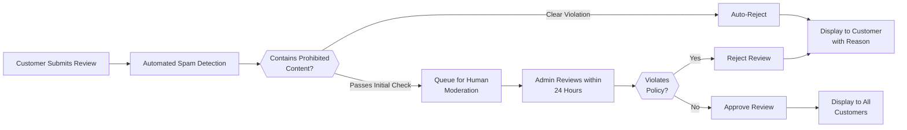

# Reviews, Ratings, and Feedback System

## System Overview

The Reviews, Ratings, and Feedback System is a core component of the shopping mall e-commerce platform that enables customers to share their product experience through ratings and written reviews. This system builds trust within the community, provides valuable feedback to sellers for product improvement, and helps other customers make informed purchasing decisions. By displaying aggregated ratings and verified reviews prominently in product listings and detail pages, the system directly influences product visibility and search rankings, creating powerful incentives for sellers to maintain high quality standards.

### Business Purpose
The review system serves multiple critical business objectives: establishing marketplace credibility through transparent customer feedback, reducing buyer hesitation by providing social proof of product quality, enabling data-driven product recommendations, and creating healthy competition among sellers based on quality metrics. The system also provides sellers with actionable feedback while helping the platform maintain quality standards through moderation and abuse prevention.

### User Actors Involved
- **Customers**: Submit ratings and written reviews based on their purchase experience; view reviews from other customers; mark reviews as helpful
- **Sellers**: Receive feedback through customer reviews; respond to reviews; track rating metrics and performance; view analytics on their products
- **Admins**: Moderate review content; enforce platform policies; handle disputes; manage spam and fraudulent reviews; generate reporting and analytics

---

## Review and Rating System Foundation

### Core System Concepts

The review system operates on two interconnected components: the **Rating Component** (numerical 1-5 star rating) and the **Review Component** (optional written feedback up to 1000 characters). Every review submission is tied to a verified purchase order, ensuring that only customers who actually bought the product can provide ratings and reviews.

### Rating Scale and Methodology

WHEN a customer submits a product review, THE system SHALL require the customer to provide a 1-5 star rating representing their overall satisfaction with the product.

THE rating scale interpretation SHALL be:
- **1 Star**: Poor - Product does not meet expectations, significant quality or functionality issues
- **2 Stars**: Fair - Product has notable problems but some redeeming qualities
- **3 Stars**: Average - Product meets basic expectations with minor issues
- **4 Stars**: Good - Product meets expectations with minor areas for improvement
- **5 Stars**: Excellent - Product exceeds expectations, high quality and satisfaction

WHEN a customer submits a review without providing a rating, THE system SHALL reject the submission and display error message: "Rating is required. Please select a rating from 1 to 5 stars."

### Review Components and Structure

WHEN a customer submits a review, THE review record SHALL contain:
- **Product Identifier**: The specific product and SKU variant being reviewed
- **Customer Identifier**: Links to the customer account (partially anonymized for privacy)
- **Order Reference**: The specific purchase order this review is based on
- **Star Rating**: Integer value from 1 to 5 (required field)
- **Review Title**: Brief headline summarizing the main point (optional, maximum 100 characters)
- **Review Content**: Main review text with specific product feedback (optional, maximum 1000 characters)
- **Submission Timestamp**: Date and time review was submitted (ISO 8601 format)
- **Last Edit Timestamp**: Date and time of last edit (if edited)
- **Review Status**: Current moderation status (Draft, Pending Moderation, Approved, Rejected, Removed)
- **Helpful Count**: Number of customers who marked this review as helpful
- **Unhelpful Count**: Number of customers who marked this review as unhelpful
- **Seller Response**: Optional response from seller (up to 500 characters)

### System Constraints and Guarantees

THE system SHALL enforce the following constraints:
- A customer can submit at most ONE rating and review per purchased product SKU variant (cannot submit multiple reviews for same product from same purchase)
- IF a customer submits a review for a product, THEN that review SHALL remain associated with that customer's purchase order permanently
- WHEN a product is deleted or delisted, THE system SHALL preserve existing reviews in an archived state
- WHEN a customer account is deleted, THE system SHALL anonymize the customer identifier in associated reviews but retain the review content
- WHEN calculating product ratings, THE system SHALL exclude reviews with status "Rejected" or "Removed"
- WHEN displaying review counts, THE system SHALL show only approved reviews (excluding pending moderation)

---

## Customer Review Submission Process

### Review Eligibility and Requirements

WHEN a customer attempts to submit a review, THE system SHALL verify ALL of the following eligibility criteria:

1. **Purchase Verification**: THE customer has a completed purchase order containing the specific product SKU
2. **Order Status**: THE order status is "Delivered" or "Completed" (not pending, processing, or cancelled)
3. **Delivery Window**: THE order was delivered at least 24 hours ago and not more than 365 days ago
4. **Non-Duplicate**: THE customer has NOT previously submitted a review for this exact product SKU from this order
5. **Account Standing**: THE customer's account is in good standing (not suspended, not restricted, no active disputes)
6. **Verified Purchase**: THE payment status for the order is "Completed" (not refunded, not pending)

IF any eligibility criterion is not met, THE system SHALL reject the review submission and display a specific error message explaining the reason (e.g., "You must have received this item before leaving a review. Your order was delivered 2 hours ago. Please try again after 24 hours.")

WHEN an order has been refunded due to return or cancellation, THE system SHALL still allow the customer to submit a review for the period they had the product.

### Purchase Verification Process

WHEN THE system validates purchase eligibility, THE system SHALL:
- Query the customer's complete order history
- Locate the order containing the product being reviewed
- Verify the order payment status is "Completed"
- Verify the product quantity in the order is at least 1
- Verify the order status is not "Cancelled"
- Confirm the order delivery date matches the customer's claim

WHEN a customer submits a review, THE system SHALL automatically attach a "Verified Purchase" badge to the review, clearly indicating to other customers that the reviewer has actually purchased the product through the platform.

### Complete Review Submission Workflow

WHEN a customer navigates to a product detail page and clicks "Leave a Review", THE system SHALL:

1. **Eligibility Check Phase**: Execute all eligibility validation criteria
2. **Form Display Phase**: IF eligible, display the review submission form with:
   - 5-star rating selector (clickable or radio button interface)
   - Optional review title field with 100-character limit and live counter
   - Optional review content textarea with 1000-character limit and live character counter
   - Submit button and Cancel button
   - Text reminder: "This review will be visible to all customers after moderation"

3. **Real-Time Validation Phase**: AS the customer types:
   - Enforce character limits with live character counter
   - Display "X / 100 characters used" for review title
   - Display "X / 1000 characters used" for review content
   - Automatically strip HTML tags and prevent script injection
   - Remove leading/trailing whitespace as user types

4. **Submission Phase**: WHEN customer clicks "Submit Review":
   - Validate rating is selected
   - Validate review content complies with content policies (check for spam, external links, profanity)
   - Create review record with status "Pending Moderation"
   - Display confirmation message: "Your review has been submitted and is awaiting moderation"
   - Clear the form and allow customer to submit another review for different product

5. **Moderation Queue Phase**: Route review to moderation system with priority based on content flags

### Review Content Requirements and Character Limits

WHEN a customer provides review content, THE system SHALL enforce:

**Star Rating (MANDATORY)**
- THE rating is the only required field
- THE system SHALL reject submission if no rating is selected
- THE rating must be an integer value from 1 to 5

**Review Title (OPTIONAL)**
- Maximum length: 100 characters (including spaces)
- THE system SHALL trim leading and trailing whitespace
- THE system SHALL reject titles that are purely numeric (e.g., "5" alone)
- THE system SHALL reject titles that are single repeated characters (e.g., "!!!!")
- THE system SHALL allow descriptive titles like "Great value for the price"

**Review Content (OPTIONAL)**
- Maximum length: 1000 characters (including spaces)
- THE system SHALL display live character counter: "X / 1000 characters used"
- THE system SHALL allow natural line breaks within the text
- THE system SHALL sanitize HTML tags and remove any embedded scripts
- THE system SHALL strip suspicious URLs and external links (prevent advertising)
- THE system SHALL preserve line breaks when displaying the review (up to 2 consecutive line breaks)
- THE system SHALL compress multiple consecutive spaces to single space

### Review Timing and Edit Window

WHEN a customer submits a review, THE system SHALL record the submission timestamp

WHEN a customer requests to edit their review, THE system SHALL verify:
- THE review was submitted within the last 30 days (edit window is 30 days)
- THE review status is not "Rejected" or "Removed"

IF edit is permitted, THE system SHALL:
- Allow the customer to modify review title and content (but NOT the rating)
- Return the review to "Pending Moderation" status for re-review
- Record the edit timestamp and note "Updated on [DATE]"
- Preserve the original review content in audit logs

IF 30 days have passed since submission, THE system SHALL:
- Deny edit requests
- Permit only deletion of the review
- Display message: "You can no longer edit this review, but you may delete it"

WHEN a customer deletes their review, THE system SHALL:
- Remove the review from public display
- Archive the review content in an internal audit log
- Remove the associated helpful/unhelpful votes
- Recalculate the product's average rating immediately
- Allow the customer to submit a new review for the same product in the future

### Time Window and Eligibility Constraints

THE review eligibility window operates as follows:

**Earliest Possible Submission**: 24 hours after order delivery (gives time for product usage)

**Latest Possible Submission**: 365 days after order delivery (one year window)

**Edit Window**: 30 days from original submission date

**Deletion**: Allowed at any time after submission

IF a customer attempts to submit a review outside this window, THE system SHALL display: "This item was delivered 18 months ago. Reviews can only be submitted within 365 days of delivery."

---

## Rating Calculation and Aggregation

### Average Rating Calculation Methodology

WHEN THE system calculates the average product rating, THE system SHALL use the following formula:

```
Average Rating = (Sum of all approved review ratings) / (Count of all approved reviews)
```

**Calculation Inclusion Rules**:
- ONLY include reviews with status "Approved" in the calculation
- EXCLUDE reviews with status "Pending Moderation", "Rejected", or "Removed"
- EXCLUDE reviews where the customer's account has been suspended or deleted
- EXCLUDE reviews where the associated order has been completely refunded and cancelled
- INCLUDE reviews where partial refunds have been issued (customer still received and used product)

**Calculation Triggering**:
- WHEN a new review is approved → recalculate immediately
- WHEN a review is removed or rejected → recalculate immediately
- WHEN a review status changes from Pending to Approved → recalculate immediately
- WHEN a customer account is suspended (their reviews excluded) → recalculate immediately

**Calculation Scope**:
- CALCULATE average rating at the PRODUCT level (aggregating across all SKU variants)
- OPTIONALLY calculate at the SKU VARIANT level (within specific color/size combination) as secondary metric
- ALWAYS use the product-level rating as the primary display metric in search results

### Rating Display and Precision

WHEN displaying product ratings to customers, THE system SHALL:

**Display Precision**: Round to nearest 0.1 (one decimal place)
- Example: 4.27 displays as "4.3"
- Example: 4.24 displays as "4.2"
- Example: 4.25 displays as "4.3" (round half up)

**Display Format**: Show as "4.3★ (247 reviews)" in product listings

**Internal Precision**: WHILE calculating and sorting products, MAINTAIN full precision with many decimal places (not rounded)

**Minimum Reviews Threshold**: 
- IF a product has fewer than 3 approved reviews, THE system MAY display: "Limited reviews (2 reviews)" to indicate low review count
- THE rating is still calculated and displayed, but limited reviews indicator provides context

### Rating Distribution Display

WHEN displaying a product detail page, THE system SHALL show rating distribution:

```
5 Stars: ★★★★★ 50% (123 reviews)
4 Stars: ★★★★☆ 20% (49 reviews)
3 Stars: ★★★☆☆ 15% (37 reviews)
2 Stars: ★★☆☆☆ 10% (24 reviews)
1 Star: ★☆☆☆☆ 5% (12 reviews)
Total: 245 reviews | Average: 4.1 stars
```

WHEN calculating percentages in the distribution:
- CALCULATE as (count at this rating / total reviews) × 100
- ROUND to nearest whole number
- DISPLAY percentages summing to 100% (with standard rounding)

### Temporal Considerations: Recent vs. Historical Ratings

WHEN THE system calculates product ratings, THE system SHALL provide:

1. **Overall Average Rating**: All approved reviews from all time (primary metric)
2. **Recent Average Rating**: Approved reviews from last 90 days (optional secondary metric)

WHEN displaying recent ratings:
- DISPLAY next to overall rating: "Overall: 4.3★ | Last 90 days: 4.5★"
- USE recent rating to identify products whose quality has recently improved or deteriorated
- PRIORITIZE recent ratings when identifying quality trends (if recent rating significantly differs from overall)

**Recent Rating Use Case Example**: Product overall rating 3.8★ but recent 90-day rating 4.6★ indicates recent quality improvement → highlight to customers

### Star-Based Visualization Requirements

WHEN displaying ratings visually, THE system SHALL use:

**Visual Elements**:
- **Full Stars** (★): Solid stars in gold/yellow color representing complete rating points
- **Half Stars** (⯨): Half-filled stars representing 0.5 point increments (when rounding allows)
- **Empty Stars** (☆): Outline stars in light gray representing remaining points to reach 5 stars

**Display Examples**:
- 4.0 rating: ★★★★☆ (4 full stars, 1 empty star)
- 4.5 rating: ★★★★⯨ (4 full stars, 1 half star)
- 4.3 rating: ★★★★☆ (4 full stars, 1 empty star - half stars only shown at .5)

**Accessibility**:
- EACH star visualization SHALL include alt text: "4.3 out of 5 stars"
- EACH rating display SHALL include ARIA labels for screen readers
- WHEN hovering over stars, display tooltip: "4.3 out of 5 stars based on 247 reviews"

---

## Review Moderation and Content Management

### Complete Moderation Workflow and Process

WHEN a customer submits a review, THE system SHALL:

1. **Automated Scanning Phase** (within 1 second):
   - Scan for prohibited content (abusive language, external URLs)
   - Check for spam patterns (repeated identical text, suspicious keywords)
   - Verify review content length and format compliance
   - Calculate review quality score

2. **Status Assignment Phase**:
   - IF review passes automated scan → status "Pending Moderation" (human review required)
   - IF review clearly violates major policies → status "Rejected" (auto-rejected, notify customer)

3. **Moderation Queue Assignment Phase**:
   - Queue review for human moderator review within 24 hours
   - Prioritize flagged reviews (potential violations)
   - Display to moderator with flags highlighted

4. **Human Moderation Phase** (within 24 hours):
   - Moderator reviews complete review content
   - Moderator checks context (product type, customer history)
   - Moderator makes approval or rejection decision
   - Moderator documents reasoning for audit trail

5. **Decision Implementation Phase**:
   - IF approved → status "Approved", display to all customers
   - IF rejected → status "Rejected", notify customer, allow resubmission



### Spam and Abuse Detection Criteria

**Automatic Rejection Triggers** (immediate rejection without human review):

WHEN THE system detects these conditions, THE review SHALL be automatically rejected:
- Review contains common spam phrases (pharmaceutical promotions, gambling links, etc.)
- Review contains external URLs or suspicious links
- Review uses exclusively UPPERCASE text (entire review is caps)
- Review contains explicit hate speech, slurs, or harassment language
- Review contains malicious keywords or patterns detected as bot-generated
- Review is identical to or extremely similar (>95% text match) to another review by same user
- Review is from a brand new account (less than 7 days old) with multiple flagged reviews

**Manual Moderation Required** (human moderator reviews):

WHEN THE system detects these conditions, THE review SHALL be flagged for human review:
- Review contains potentially defamatory statements about seller or competitors
- Review appears to be from seller or competitor trying to manipulate ratings
- Review contains profanity or inappropriate language (context-dependent)
- Review is extremely negative with vague complaints (potential false review)
- Review is extremely positive with suspicious praise patterns (potential fake review)
- Review contains sensitive personal information about other customers
- Review makes claims about product that seem technically impossible
- Review mentions compensation or incentive for review (e.g., "received discount for review")

### Content Policy Enforcement

**PROHIBITED CONTENT** (will result in rejection):

WHEN reviewing content, THE system SHALL reject reviews containing:
- Profanity and vulgar language (context considered - some language acceptable in context)
- Hate speech, slurs, harassment, or discrimination
- Threats, violence, or dangerous content
- Explicit sexual content or adult material
- Malicious links, malware references, or phishing attempts
- Complete personal contact information (email, phone, full address)
- External promotions or competing product advertising
- Spam or repetitive content (same content posted many times)
- Defamatory statements that falsely accuse seller of illegal activity
- References to off-platform transactions or negotiations (violates platform policies)

**DISCOURAGED BUT ALLOWED**:

WHEN reviewing content, THE system SHALL permit:
- Comparisons to competitor products (IF factually accurate and relevant)
- Multiple line breaks for formatting (up to 2 consecutive line breaks)
- Constructive criticism and suggestions for improvement (encouraged)
- Questions directed to seller (encouraged as they facilitate seller engagement)
- Mentions that customer used discount or promo code (fact, not inappropriate)

**ENCOURAGED CONTENT**:

WHEN THE system identifies these content types, THE system SHALL prioritize them in moderation:
- Specific details about product usage and actual context
- Detailed comments about value for price
- Constructive suggestions for product improvement
- Honest assessments of both product strengths and weaknesses
- Clear explanation of purchase context (e.g., "used for 3 months daily")

### Admin Review Approval and Rejection Process

WHEN an admin moderator reviews a flagged review, THE system SHALL display:
- Complete review text with flagged areas highlighted
- Customer name (anonymized if needed)
- Product details and category
- Customer's purchase order information (proof of purchase)
- Customer's review history (previous reviews submitted)
- Seller response (if applicable)

WHEN moderator decides to approve the review, THE system SHALL:
- Update review status to "Approved"
- Make review visible to all customers immediately
- Record approval decision with timestamp and moderator ID
- Send notification to customer: "Your review has been published"

WHEN moderator decides to reject the review, THE system SHALL:
- Update review status to "Rejected"
- Prevent review from being visible to customers
- Send notification email to customer with specific rejection reason
- Provide customer with option to edit and resubmit
- Store rejection reason in audit log for pattern detection

WHEN moderator selects rejection reason, options SHALL include:
- "Spam or irrelevant content"
- "Profanity or inappropriate language"
- "Harassment or defamation"
- "Suspected false or fraudulent review"
- "Competing seller promotional activity"
- "Personal information exposure"
- "Malicious links detected"
- "Other reason (with custom explanation)"

**Rejection Reason Notification to Customer**:

WHEN a review is rejected, THE system SHALL send email to customer stating:
"Your review for [Product Name] was not published because it [reason]. You may edit the review to address this concern and resubmit it. If you believe this decision was in error, you may appeal to our support team."

### Review Editing and Deletion by Customers

**Edit Permissions and Process**:

WHEN customer requests to edit their review, THE system SHALL:
1. Verify review was submitted within last 30 days
2. IF within 30 days: permit editing of review title and content (NOT rating)
3. IF past 30 days: deny editing, permit only deletion
4. Return edited review to "Pending Moderation" status
5. Apply same content policies to edited review as to new submissions

WHEN customer edits a review, THE system SHALL:
- Record edit timestamp
- Display "Updated on [DATE]" notation next to review
- Preserve original review text in audit logs (for transparency)
- Recalculate helpful/unhelpful votes on edited review

**Deletion Permissions**:

WHEN customer requests to delete their review, THE system SHALL:
- Allow deletion at any time after submission (no 30-day restriction)
- Remove review from public display immediately
- Update product rating calculation (exclude deleted review)
- Send confirmation email to customer
- Preserve deletion record in audit logs (for admin visibility)

WHEN a review is deleted, THE system SHALL:
- Prevent customer from viewing the deleted review content
- Prevent helpful/unhelpful votes from being counted
- Preserve the fact that a review existed (for audit purposes only)
- Recalculate product rating immediately

---

## How Ratings Influence Product Visibility

### Ranking Algorithm Impact

WHEN calculating search result rankings, THE system SHALL apply rating as a significant ranking factor:

**Ranking Boost Calculation**:
- WHEN product rating is 5.0 → apply maximum ranking boost (multiplier: 1.5×)
- WHEN product rating is 4.0-4.9 → apply strong ranking boost (multiplier: 1.3×)
- WHEN product rating is 3.0-3.9 → apply moderate ranking boost (multiplier: 1.1×)
- WHEN product rating is 2.0-2.9 → apply no boost (multiplier: 1.0×, neutral)
- WHEN product rating is below 2.0 → apply ranking penalty (multiplier: 0.7×)

**Minimum Review Threshold for Boost**:
- WHEN product has fewer than 3 approved reviews → do NOT apply rating boost (prevents manipulation of new products)
- WHEN product has 3 or more approved reviews → apply boost based on rating

**Ranking Examples**:
- Product A: 4.7★ rating (248 reviews) + strong boost = appears higher in results
- Product B: 3.2★ rating (156 reviews) + moderate boost = appears lower than Product A
- Product C: 2.1★ rating (89 reviews) + no boost/neutral = deprioritized significantly
- Product D: 5.0★ rating (2 reviews) + no boost (too few reviews) = ranked similarly to comparable products without rating factor

### Impact on Product Recommendations

WHEN THE system generates personalized product recommendations for customers, THE system SHALL:

**Recommendation Prioritization Logic**:
- WHEN selecting products to recommend → prioritize products with ratings 4.0 or higher
- WHEN choosing between similar relevance products → prefer higher-rated products
- WHEN recommending products in same category → show alternatives with highest ratings first

**Lower Rating Handling**:
- WHEN product rating below 2.5★ → do NOT include in recommendations (except explicit search results)
- WHEN product rating 2.5-3.5★ → include in recommendations only if highly relevant to customer
- WHEN product rating 3.5+★ → include in recommendations normally

**Rating Boost in Recommendations**:
- WHEN generating "Best Sellers" recommendations → weight rating 40%, sales volume 60%
- WHEN generating "Top Rated" recommendations → weight rating 90%, recency 10%
- WHEN generating "Customers Also Bought" recommendations → weight rating 20%, purchase frequency 80%

### Visibility in Product Listings and Search Results

WHEN displaying product listings in search results, THE system SHALL show ratings:

**Search Results Display**:
- Average rating with star visualization (e.g., "★★★★☆ 4.3")
- Total number of reviews (e.g., "(247 reviews)")
- Combined display: "★★★★☆ 4.3 (247 reviews)"

**Search Result Sorting Options**:
- Sort by "Relevance" (default)
- Sort by "Highest Rated" (highest average rating first)
- Sort by "Lowest Rated" (lowest average rating first)
- Sort by "Most Reviewed" (highest review count first)
- Sort by "Newest" (recently listed products first)
- Sort by "Price Low to High"
- Sort by "Price High to Low"

**Product Category Listings Display**:
- Show same rating information as search results
- Allow sorting by rating
- Display rating-based filters (e.g., "Show only products rated 4★ or higher")

**Featured Placement Eligibility**:
- WHEN product is eligible for featured/promotional placement → must have rating 3.5★ or higher
- WHEN product rating is below 3.0★ → do NOT display in featured spots (admin oversight preferred)
- WHEN deciding between multiple featured slots → prefer higher-rated products

### Trust Signals and Social Proof

**Primary Trust Signals Displayed**:

WHEN customer views a product, THE system SHALL display:
- Average rating with star count (e.g., "★★★★☆ 4.3 out of 5 stars")
- Number of verified purchase reviews (e.g., "Verified Purchases: 200 of 247 reviews")
- Percentage breakdown: "95% of customers rated this product 3 stars or higher"
- "Verified Purchase" badge on each review

**Secondary Trust Signals**:

WHEN building customer confidence, THE system MAY display:
- Review recency indicator (e.g., "Most recent review 2 days ago")
- Most helpful reviews highlighted (based on helpful vote count)
- Seller response to negative reviews (demonstrates customer service)
- Rating consistency over time (stable or improving trend)

**Confidence Indicators and Messaging**:

WHEN product rating is 4.5★ or higher, THE system SHALL display:
- "Highly rated by customers" badge on product listing
- "Customers love this product" message

WHEN product has fewer than 5 reviews, THE system SHALL display:
- "Limited reviews - Be one of the first to review this product"
- Encourage customer to submit review to help community

WHEN product rating has improved in last 30 days, THE system SHALL display:
- "Improving in quality" indicator (if recent average > overall average by > 0.3 points)
- Alert customer: "This product's quality rating has improved recently"

---

## Helpful Vote Functionality

### Helpful/Unhelpful Voting System

WHEN a customer views a product review, THE system SHALL display:
- "Was this review helpful?" question
- Thumbs up button (for "Helpful")
- Thumbs down button (for "Not Helpful")
- Vote count: "X of Y customers found this review helpful"

WHEN a customer clicks the Helpful button, THE system SHALL:
- Increment the helpful vote count by 1
- Prevent the customer from voting on this review again (one vote per customer per review)
- Immediately update the displayed vote count

WHEN a customer clicks the Not Helpful button, THE system SHALL:
- Increment the unhelpful vote count by 1
- Prevent the customer from voting on this review again
- Immediately update the displayed vote count

WHEN a customer has already voted on a review, THE system SHALL:
- Display their previous vote (thumbs up or thumbs down highlighted)
- Allow customer to remove their vote (clicking again de-votes)
- Allow customer to change their vote (switch from helpful to unhelpful or vice versa)

### Vote Impact on Review Visibility and Sorting

WHEN THE system sorts reviews by "Most Helpful", THE system SHALL use:

**Helpfulness Ratio Calculation**:
```
Helpfulness Score = Helpful Votes / (Helpful Votes + Unhelpful Votes)
```

**Sorting Logic**:
- SORT reviews by helpfulness score (descending, highest first)
- IF two reviews have equal helpfulness score → sort by recency (newest first)
- ENSURE most useful reviews appear at the top of review list

**Minimum Vote Threshold**:
- REQUIRE at least 5 total votes on a review before using helpfulness score for sorting
- BEFORE reaching 5 votes, sort by recency instead
- ONCE review reaches 5 votes, apply helpfulness-based sorting

**Examples**:
- Review A: 8 helpful, 2 unhelpful = 80% helpful (sorts high)
- Review B: 15 helpful, 8 unhelpful = 65% helpful (sorts lower)
- Review C: 2 helpful, 1 unhelpful = 67% helpful (too few votes, sort by recency instead)

### Vote Privacy and Fraud Prevention

WHEN customers vote on reviews, THE system SHALL:
- NOT display individual customer identities (no "John Smith found this helpful")
- Display only aggregate counts (e.g., "47 of 52 customers found this helpful")
- NOT track customer voting patterns publicly
- Prevent the same customer from voting multiple times on same review (one vote per customer per review maximum)

WHEN THE system detects potential vote fraud, THE system SHALL:
- Monitor for suspicious vote patterns (100+ helpful votes in 1 hour on low-review product)
- Flag reviews with suspicious vote activity for admin review
- IF fraud confirmed, reset vote counts to actual legitimate votes
- Potentially suspend customer account if vote manipulation is detected

**Vote Fraud Prevention Measures**:

WHEN multiple votes arrive from same IP address in rapid succession, THE system SHALL:
- Rate limit votes from that IP (max 10 votes per minute)
- Require verification if vote pattern seems suspicious

WHEN a seller is suspected of encouraging false votes on their own products, THE system SHALL:
- Flag the pattern for admin investigation
- Potentially reset fraudulent votes
- Apply penalties to seller account (warning, commission adjustment, etc.)

---

## Error Handling and Edge Cases

### Concurrent Review Submission Handling

WHEN a customer submits a review from one device, then simultaneously tries to submit another review from a different device for the same product, THE system SHALL:
- Use database unique constraint on (customer_id, product_sku_id) pair
- Process first submission successfully
- Reject second submission with error: "A review already exists for this product. Refresh the page to view it."
- Prevent duplicate reviews with 100% guarantee

WHEN two separate review submissions arrive at database within same millisecond, THE system SHALL:
- Use database-level locking to ensure only one succeeds
- Return conflict error to second request
- Notify customer of conflict

### Data Consistency During Deletions

IF a customer account is deleted while reviews from that customer exist, THE system SHALL:
- Anonymize the customer identifier in associated reviews
- Preserve review content (important for other customers reading reviews)
- Display review as "Anonymous Customer" instead of customer name
- Remove any personally identifiable information
- Recalculate product rating immediately

IF a product is deleted while reviews exist for it, THE system SHALL:
- Archive the reviews in a separate table
- Display reviews with status "Product No Longer Available"
- Include in historical reports but exclude from product detail page
- Preserve reviews for compliance and audit purposes

IF a seller account is suspended while they have customer reviews, THE system SHALL:
- CONTINUE displaying reviews about their products (reviews are about products, not sellers)
- Update seller name display to "[Account Suspended]" or similar
- Exclude suspended seller's reviews from seller rating calculations
- Recalculate product ratings immediately

### Review Moderation During High Load

WHEN review submissions exceed normal capacity (spike in submissions), THE system SHALL:
- Queue reviews for moderation (temporarily increase response time for approval)
- Maintain 24-hour target for moderation (may extend slightly during spike)
- Display message to customer: "Your review is in the moderation queue. We typically review submissions within 24 hours."
- Prioritize reviews with no flags (approve clean reviews faster)
- If queue exceeds 1000 pending reviews, escalate to additional moderators

### Rating Calculation Errors and Recovery

WHEN a rating calculation error is detected, THE system SHALL:
- Log error with timestamp and affected product ID
- Immediately notify admin team
- Recalculate affected product rating from scratch
- Compare calculated value to stored value
- IF discrepancy detected: correct to accurate value, log correction
- Prevent serving incorrect rating to customers

**Calculation Error Scenarios**:

WHEN THE system detects these conditions, THE system SHALL:
- IF average rating > 5.0 → likely calculation error, recalculate
- IF average rating < 1.0 with reviews present → likely calculation error, recalculate
- IF review count > actual approved reviews → correction needed
- IF review count = 0 but rating displays non-zero → correction needed

### Network Failure During Vote Submission

WHEN customer votes on a review but network connection fails before confirmation, THE system SHALL:
- Retry vote submission automatically when connection restored
- OR allow customer to manually retry vote
- ENSURE vote is counted exactly once (not duplicated)
- Display confirmation when vote is successfully recorded

---

## Performance Requirements and SLAs

### Response Time Expectations

WHEN customers interact with review system, THE system SHALL meet these response time targets:

**Reading Reviews**:
- Displaying product with reviews: < 2 seconds page load time
- Loading additional reviews (infinite scroll or pagination): < 1 second per batch
- Sorting reviews by helpfulness: < 1 second to resort

**Submitting Reviews**:
- Displaying review submission form: < 1 second
- Submitting review: < 3 seconds (including validation and queuing for moderation)
- Confirming review submission: < 500ms

**Voting on Reviews**:
- Recording helpful/unhelpful vote: < 500ms
- Updating vote count display: < 1 second

**Review Moderation**:
- Displaying review to moderator: < 500ms
- Auto-scanning review for spam: < 1 second
- Moderator making decision and saving: < 2 seconds

### Availability and Uptime

THE review system SHALL maintain 99.9% uptime during business hours

WHEN calculating uptime: exclude planned maintenance windows (less than 2 per month, 2-hour windows)

### Data Retention and Archival

**Active Reviews**:
- Approved reviews: retained indefinitely (or until customer deletes)
- Pending moderation reviews: retained for 90 days before auto-approval or deletion
- Rejected reviews: retained for 90 days (for audit), then deleted

**Archived/Deleted Reviews**:
- Deleted customer reviews: archived in audit table for 2 years
- Deleted products' reviews: archived in product history table for 7 years
- Moderation history: retained permanently (compliance requirement)

**Data Export**:
- Customers may export their reviews (future compliance feature)
- Sellers may export reviews of their products
- Admins may export review data for analysis

---

## Administrative Capabilities and Oversight

### Admin Review Management

WHEN an admin accesses review management section, THE system SHALL display:
- Pending reviews awaiting moderation (with age/priority)
- Flagged reviews identified as potential violations
- Recently removed/rejected reviews
- Appeals from customers on rejected reviews

WHEN admin bulk-reviews multiple flagged reviews, THE system SHALL:
- Display reviews one at a time with navigation
- Allow quick approve/reject decisions
- Accept keyboard shortcuts (e.g., "A" for approve, "R" for reject)
- Display batch approval option for clearly legitimate reviews

### Admin Override and Enforcement

WHEN admin needs to override system decisions, THE admin can:
- Approve a review that was auto-rejected (with documented reason)
- Reject an approved review if found to violate policies (with documented reason)
- Delete a review due to policy violation with record kept
- Suspend customer's review privileges if pattern of violations detected

WHEN admin removes a review due to violation, THE system SHALL:
- Notify customer of removal reason
- Provide appeal process (customer can request review of decision)
- Update product rating immediately
- Log action with admin ID and reason

---

## Summary

The Reviews, Ratings, and Feedback System provides a robust, fair, and transparent mechanism for customers to share product experiences while protecting platform integrity through comprehensive moderation, spam detection, and authenticity verification. By aggregating ratings and displaying them prominently in search results and product listings, the system directly influences product visibility and search rankings, creating incentives for sellers to maintain quality while helping customers make informed decisions based on verified community feedback.

The system balances trust and transparency—enabling meaningful feedback while preventing manipulation through rate limiting, duplicate prevention, concurrent operation safety, and comprehensive moderation workflows. Review data directly influences product rankings, recommendations, and seller performance metrics, making quality the key competitive factor in the marketplace.

---

> *Developer Note: This document defines **business requirements only**. All technical implementations (architecture, APIs, database design, etc.) are at the discretion of the development team.*